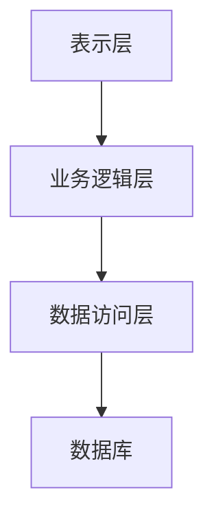
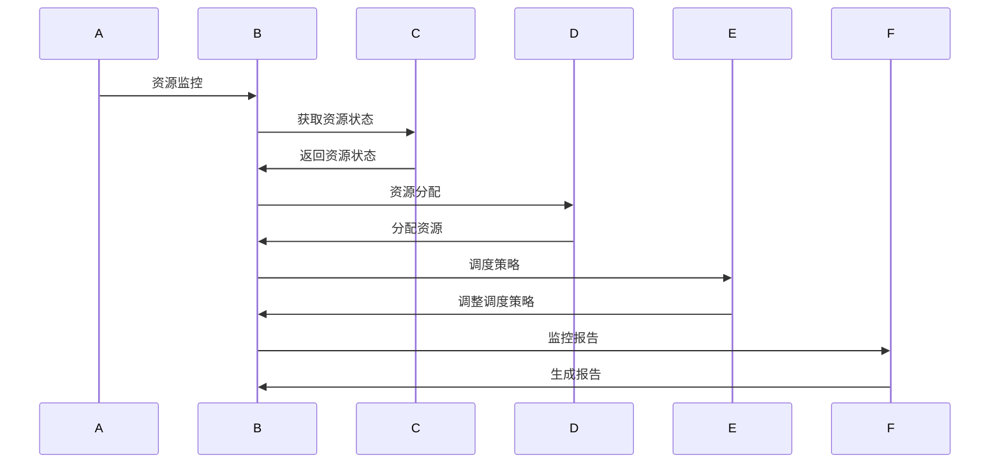

                 

### 文章标题

# 技术管理中的资源调配与优化

### 关键词

- 技术管理
- 资源调配
- 优化算法
- 线性规划
- 整数规划
- 动态规划
- 云计算
- 大数据

### 摘要

本文旨在探讨技术管理中资源调配与优化的核心概念、方法及应用实践。通过对资源调配与优化原理的深入分析，我们将介绍线性规划、整数规划和动态规划等方法，并展示其在企业资源优化调度、云计算资源调度优化和大数据资源优化调度等实际项目中的应用。本文将提供详细的算法原理讲解、系统架构设计、项目实战案例以及最佳实践，为技术管理者提供系统化的资源调配与优化思路。

## 目录

### 第一部分：资源调配与优化的基础概念

#### 第1章：问题背景与核心概念

#### 第2章：资源调配与优化原理

#### 第3章：资源调配与优化技术

### 第二部分：资源调配与优化方法

#### 第4章：线性规划方法

#### 第5章：整数规划方法

#### 第6章：动态规划方法

### 第三部分：资源调配与优化实践

#### 第7章：项目一：企业资源优化调度

#### 第8章：项目二：云计算资源调度优化

#### 第9章：项目三：大数据资源优化调度

#### 第10章：最佳实践与展望

## 第1章：问题背景与核心概念

### 1.1 问题背景与需求

在现代信息技术迅速发展的背景下，技术管理成为企业成功的关键因素之一。资源调配与优化作为技术管理的重要组成部分，直接影响到企业的运营效率、成本控制和市场竞争力。随着云计算、大数据和物联网等新兴技术的普及，企业需要更加高效地管理和调配资源，以满足不断增长的业务需求和用户期望。

#### 1.2 资源调配与优化的核心概念

资源调配与优化的核心概念主要包括以下几个方面：

- **资源**：指企业所拥有的各种物质、技术和人力资源，包括计算资源、存储资源、网络资源等。
- **调配**：指根据需求和优先级，合理分配和调度资源，以最大化其利用效率。
- **优化**：指通过算法和模型，寻找资源调配的最佳方案，以实现资源利用的最大化或成本的最小化。

#### 1.3 资源调配与优化的边界与外延

资源调配与优化的边界与外延涉及到多个方面：

- **边界**：资源调配与优化主要关注于企业内部资源的调度，不涉及外部市场资源的获取和交易。
- **外延**：资源调配与优化不仅局限于硬件资源，还包括软件资源、人力资源、数据资源等。此外，它还涉及到资源使用的时间维度和空间维度，如负载均衡、存储优化等。

#### 1.4 概念结构与核心要素组成

资源调配与优化的概念结构包括以下几个核心要素：

- **目标**：明确资源调配与优化的目标，如最大化资源利用效率、最小化成本等。
- **约束**：分析资源的约束条件，如容量限制、时间窗口、服务质量要求等。
- **算法**：选择合适的优化算法，如线性规划、整数规划、动态规划等。
- **模型**：建立资源调配与优化的数学模型，以便进行算法分析和求解。

### 第2章：资源调配与优化原理

#### 2.1 资源调配的基本原理

资源调配的基本原理包括以下几个方面：

- **需求分析**：了解企业内部各种资源的需求情况，包括计算资源、存储资源、网络资源等。
- **资源评估**：评估资源的可用性和性能，以便进行合理调配。
- **优先级排序**：根据资源的紧迫性和优先级，对需求进行排序，以便优先满足关键业务需求。
- **分配策略**：选择合适的分配策略，如固定分配、动态分配、自适应分配等。

#### 2.2 优化算法的基本原理

优化算法的基本原理包括以下几个方面：

- **目标函数**：定义优化问题的目标函数，如最小化成本、最大化效率等。
- **约束条件**：定义优化问题的约束条件，如资源限制、时间限制、服务质量要求等。
- **搜索策略**：选择合适的搜索策略，如贪心算法、动态规划、遗传算法等。
- **求解方法**：选择合适的求解方法，如线性规划、整数规划、非线性规划等。

#### 2.3 资源调配与优化方法分类

资源调配与优化方法可以分为以下几类：

- **传统方法**：包括线性规划、整数规划、动态规划等传统优化方法。
- **启发式方法**：包括遗传算法、模拟退火、蚁群算法等启发式优化方法。
- **机器学习方法**：包括深度学习、强化学习等机器学习优化方法。
- **混合方法**：结合传统方法和机器学习方法，如混合遗传算法、混合深度强化学习等。

### 第3章：资源调配与优化技术

#### 3.1 资源调配技术

资源调配技术主要包括以下几个方面：

- **负载均衡**：通过分配计算任务到多个服务器，实现负载均衡，提高系统性能。
- **存储优化**：通过数据压缩、去重、分布式存储等技术，提高存储资源的利用效率。
- **网络优化**：通过网络拓扑优化、带宽管理、QoS等技术，提高网络传输效率。
- **人力资源调配**：通过人才招聘、培训、岗位调整等手段，实现人力资源的优化配置。

#### 3.2 优化技术

优化技术主要包括以下几个方面：

- **线性规划**：通过线性方程组求解，实现资源优化配置。
- **整数规划**：通过整数规划模型，解决资源分配问题。
- **动态规划**：通过动态规划模型，实现资源调度优化。
- **机器学习优化**：通过机器学习算法，实现资源分配与优化。

#### 3.3 资源调配与优化应用场景

资源调配与优化应用场景主要包括以下几个方面：

- **云计算**：通过资源调配与优化，实现云资源的高效利用，降低企业成本。
- **大数据**：通过资源调配与优化，实现大数据处理的高效性，提升数据分析能力。
- **企业IT系统**：通过资源调配与优化，提升企业IT系统的性能和稳定性。
- **物联网**：通过资源调配与优化，实现物联网设备的高效管理和调度。

## 第4章：线性规划方法

### 4.1 线性规划模型

线性规划是一种用于解决资源优化配置问题的数学方法。线性规划模型由以下部分组成：

- **目标函数**：定义优化问题的目标，如最大化利润、最小化成本等。
- **决策变量**：定义优化问题中的变量，如资源分配、工作分配等。
- **约束条件**：定义优化问题的约束，如资源限制、时间限制等。

线性规划模型可以用以下数学形式表示：

$$
\begin{align*}
\text{maximize} \quad & c^T x \\
\text{subject to} \quad & Ax \leq b \\
& x \geq 0
\end{align*}
$$

其中，$c$ 是目标函数的系数向量，$x$ 是决策变量向量，$A$ 是约束条件的系数矩阵，$b$ 是约束条件的常数向量。

### 4.2 线性规划算法

线性规划算法有多种求解方法，其中最常用的是单纯形法（Simplex Method）和内点法（Interior Point Method）。

#### 单纯形法

单纯形法的基本思想是通过迭代过程逐步向最优解逼近。具体步骤如下：

1. 初始可行解：选择一个初始可行解，通常是所有变量都为零的解。
2. 选择进入基变量：根据目标函数的系数和松弛变量的关系，选择一个进入基变量。
3. 选择离开基变量：根据约束条件，选择一个离开基变量，使得目标函数得到最大改进。
4. 迭代：重复步骤2和步骤3，直到找到最优解。

#### 内点法

内点法是一种基于优化理论的线性规划算法。它通过迭代过程将解从内点逐步逼近到最优解。具体步骤如下：

1. 初始内点：选择一个初始内点，通常在可行域内部。
2. 目标函数改进：通过计算目标函数的梯度，更新内点，使其更接近最优解。
3. 可行性改进：通过计算可行域的边界，更新内点，使其保持可行。
4. 迭代：重复步骤2和步骤3，直到找到最优解。

### 4.3 线性规划应用实例

假设一家工厂有两个生产车间，每个车间可以生产两种产品A和B。每个车间每天有8小时的运行时间，每个产品A需要2小时的机器时间，每个产品B需要3小时的机器时间。每天工厂希望生产的产品数量最大化，同时满足以下约束条件：

1. 产品A的总机器时间不超过8小时。
2. 产品B的总机器时间不超过8小时。
3. 每个车间每天的总机器时间不超过8小时。

我们可以建立以下线性规划模型：

$$
\begin{align*}
\text{maximize} \quad & 2x_1 + 3x_2 \\
\text{subject to} \quad & 2x_1 + 3x_2 \leq 8 \\
& x_1 + 2x_2 \leq 8 \\
& x_1, x_2 \geq 0
\end{align*}
$$

使用单纯形法求解该线性规划问题，可以得到最优解为 $x_1 = 4, x_2 = 2$，最大产量为10。

### 第5章：整数规划方法

#### 5.1 整数规划模型

整数规划是线性规划的一种扩展，它将决策变量的取值范围限制为整数。整数规划模型由以下部分组成：

- **目标函数**：定义优化问题的目标，如最大化利润、最小化成本等。
- **决策变量**：定义优化问题中的变量，如资源分配、工作分配等，其中部分变量取值为整数。
- **约束条件**：定义优化问题的约束，如资源限制、时间限制等。

整数规划模型可以用以下数学形式表示：

$$
\begin{align*}
\text{maximize} \quad & c^T x \\
\text{subject to} \quad & Ax \leq b \\
& x \in \mathbb{Z}^n
\end{align*}
$$

其中，$c$ 是目标函数的系数向量，$x$ 是决策变量向量，$A$ 是约束条件的系数矩阵，$b$ 是约束条件的常数向量，$\mathbb{Z}$ 表示整数集合。

#### 5.2 整数规划算法

整数规划算法有多种求解方法，其中最常用的是分支定界法（Branch and Bound）和割平面法（Cutting Plane Method）。

##### 分支定界法

分支定界法的基本思想是通过递归划分可行域，逐步寻找最优解。具体步骤如下：

1. 初始可行解：选择一个初始可行解。
2. 分支：根据约束条件，将可行域划分为多个子区域。
3. 定界：计算每个子区域的目标函数值，剪枝掉不可能取得最优解的子区域。
4. 迭代：重复步骤2和步骤3，直到找到最优解。

##### 割平面法

割平面法的基本思想是通过引入额外的约束条件，逐步缩小可行域，逼近最优解。具体步骤如下：

1. 初始可行解：选择一个初始可行解。
2. 引入割平面：根据目标函数和约束条件，引入一个割平面，将其加入到约束条件中。
3. 更新可行解：根据新的约束条件，更新可行解。
4. 迭代：重复步骤2和步骤3，直到找到最优解。

#### 5.3 整数规划应用实例

假设一家公司有两个生产线，每个生产线可以生产两种产品X和Y。每个生产线每天有8小时的运行时间，生产产品X需要2小时的机器时间，生产产品Y需要3小时的机器时间。公司希望最大化总利润，同时满足以下约束条件：

1. 产品X的总机器时间不超过8小时。
2. 产品Y的总机器时间不超过8小时。
3. 产品X的产量必须是整数。
4. 产品Y的产量必须是整数。

我们可以建立以下整数规划模型：

$$
\begin{align*}
\text{maximize} \quad & 5x + 7y \\
\text{subject to} \quad & 2x + 3y \leq 8 \\
& x + 2y \leq 8 \\
& x, y \in \mathbb{Z}
\end{align*}
$$

使用分支定界法求解该整数规划问题，可以得到最优解为 $x = 2, y = 2$，最大利润为24。

### 第6章：动态规划方法

#### 6.1 动态规划模型

动态规划是一种用于求解多阶段决策问题的优化方法。动态规划模型由以下部分组成：

- **状态**：定义问题的当前状态，通常是一个多维数组。
- **决策**：定义当前状态下可以采取的行动，通常是一个函数或映射。
- **状态转移方程**：定义当前状态和下一个状态之间的关系，通常是一个递推公式。
- **边界条件**：定义问题的初始状态和边界状态，通常是一个初值或终值。

动态规划模型可以用以下数学形式表示：

$$
\begin{align*}
\text{function} \quad f(S) &= \text{max}_{A(S)} \{ g(S, A(S)) + h(S') \} \\
\text{where} \quad S &= \text{current state} \\
A(S) &= \text{set of actions} \\
g(S, A(S)) &= \text{reward of action } A(S) \\
h(S') &= \text{cost of transition from } S \text{ to } S'
\end{align*}
$$

其中，$f(S)$ 是状态 $S$ 的最优值，$A(S)$ 是状态 $S$ 下的可行行动集合，$g(S, A(S))$ 是行动 $A(S)$ 的即时奖励，$h(S')$ 是状态转移 $S \to S'$ 的成本。

#### 6.2 动态规划算法

动态规划算法的基本思想是自底向上或自顶向下地递推计算最优解。具体步骤如下：

1. 初始状态：初始化初始状态 $S_0$。
2. 递推计算：根据状态转移方程，递推计算下一个状态的最优值。
3. 最优解：根据递推计算的结果，找到最优解。

动态规划算法可以分为以下几种类型：

- **自底向上**：从最简单的情况开始，逐步推导出复杂情况的最优解。
- **自顶向下**：从最复杂的情况开始，递归地推导出简单情况的最优解。
- **记忆化**：利用记忆数组保存已经计算过的状态值，避免重复计算。

#### 6.3 动态规划应用实例

假设有一名登山者需要攀登一座山峰，山峰的高度为 $H$。登山者每次可以选择向上爬升1米或2米，但不能向下爬升。登山者的目标是尽可能快地到达山峰顶部。我们可以建立以下动态规划模型：

$$
\begin{align*}
\text{function} \quad f(h) &= \text{min} \{ |h - 1|, |h - 2| \} + \min \{ f(h-1), f(h-2) \} \\
\text{where} \quad h &= \text{current height} \\
f(H) &= 0 \text{ (base case)}
\end{align*}
$$

使用动态规划算法求解该问题，可以得到登山者到达山峰顶部的最小步数。

## 第7章：项目一：企业资源优化调度

### 7.1 项目背景与目标

随着企业业务的发展和IT系统的复杂化，企业面临着日益严峻的资源调配与优化问题。如何高效地调度和优化企业资源，以最大化其利用效率和降低成本，成为企业IT管理的重要任务。本项目旨在为企业提供一个资源优化调度系统，通过自动化和智能化的手段，实现企业资源的高效配置和调度。

### 7.2 系统分析与架构设计

#### 问题场景介绍

企业资源优化调度系统的主要问题场景包括：

1. **计算资源调度**：根据业务需求和资源状态，动态分配计算资源，实现负载均衡。
2. **存储资源调度**：根据数据访问频率和存储容量，优化存储资源分配，提高数据访问速度。
3. **网络资源调度**：根据网络流量和带宽需求，动态调整网络资源分配，确保网络稳定性和传输效率。

#### 项目介绍

本项目将设计并实现一个企业资源优化调度系统，主要包括以下模块：

1. **资源管理模块**：负责资源状态监控、资源分配策略和资源调度算法的实现。
2. **调度引擎模块**：根据业务需求和资源状态，实时调度和分配资源。
3. **监控与报告模块**：监控系统运行状态，生成资源利用报告和调度日志。

#### 系统功能设计

企业资源优化调度系统的主要功能包括：

1. **资源监控**：实时监控企业各类资源的使用情况，包括计算资源、存储资源和网络资源。
2. **资源分配**：根据业务需求和资源状态，动态分配计算资源、存储资源和网络资源。
3. **负载均衡**：根据负载情况，动态调整资源分配策略，实现负载均衡。
4. **资源优化**：根据资源使用情况和业务需求，优化资源分配和调度策略，提高资源利用效率。
5. **监控与报告**：实时监控系统运行状态，生成资源利用报告和调度日志，为企业决策提供数据支持。

#### 领域模型

企业资源优化调度系统的领域模型主要包括以下类：

1. **资源类**：表示企业各类资源，包括计算资源、存储资源和网络资源。
2. **任务类**：表示企业需要调度的任务，包括计算任务、存储任务和网络任务。
3. **调度策略类**：定义资源调度策略，包括负载均衡策略、资源优化策略等。
4. **监控类**：负责实时监控系统运行状态，记录资源使用情况和调度日志。

以下是领域模型的Mermaid类图：

```mermaid
classDiagram
    类图定义
    Resource <<class>> 计算资源
    Resource <<class>> 存储资源
    Resource <<class>> 网络资源
    Task <<class>> 计算任务
    Task <<class>> 存储任务
    Task <<class>> 网络任务
    SchedulingStrategy <<class>> 调度策略
    Monitoring <<class>> 监控
    Resource --|> Task: 资源分配
    Monitoring --|> Resource: 资源监控
    Monitoring --|> SchedulingStrategy: 调度策略
```

#### 系统架构设计

企业资源优化调度系统的架构设计主要包括以下层次：

1. **表示层**：负责与用户交互，提供界面和操作入口。
2. **业务逻辑层**：实现资源监控、资源分配和调度策略等核心功能。
3. **数据访问层**：负责数据存储和访问，包括资源状态监控、调度日志和配置信息等。

以下是系统架构的Mermaid架构图：



#### 系统接口设计

企业资源优化调度系统的主要接口包括：

1. **资源监控接口**：用于实时获取企业各类资源的使用情况，包括计算资源、存储资源和网络资源。
2. **资源分配接口**：用于根据业务需求和资源状态，动态分配计算资源、存储资源和网络资源。
3. **调度策略接口**：用于定义和调整资源调度策略，包括负载均衡策略、资源优化策略等。
4. **监控报告接口**：用于生成资源利用报告和调度日志，为企业决策提供数据支持。

以下是系统接口的Mermaid序列图：



### 7.3 核心实现与代码解析

#### 资源监控实现

资源监控是资源优化调度系统的核心功能之一。以下是一个简单的Python实现，用于监控企业计算资源的使用情况：

```python
import psutil

def monitor_compute_resources():
    # 获取系统CPU使用率
    cpu_usage = psutil.cpu_percent()
    # 获取系统内存使用率
    memory_usage = psutil.virtual_memory().percent
    # 获取系统磁盘使用率
    disk_usage = psutil.disk_usage('/').percent
    return cpu_usage, memory_usage, disk_usage

# 示例
cpu_usage, memory_usage, disk_usage = monitor_compute_resources()
print("CPU使用率：", cpu_usage)
print("内存使用率：", memory_usage)
print("磁盘使用率：", disk_usage)
```

#### 资源分配实现

资源分配是资源优化调度系统的另一个核心功能。以下是一个简单的Python实现，用于根据资源使用情况动态分配计算资源：

```python
def allocate_compute_resources(cpu_threshold, memory_threshold, disk_threshold):
    # 获取系统当前资源使用情况
    cpu_usage, memory_usage, disk_usage = monitor_compute_resources()
    # 判断是否需要增加计算资源
    if cpu_usage > cpu_threshold or memory_usage > memory_threshold or disk_usage > disk_threshold:
        # 增加计算资源
        add_compute_resources()
    else:
        # 保持当前计算资源
        print("当前计算资源已足够，无需增加。")

# 示例
allocate_compute_resources(cpu_threshold=80, memory_threshold=80, disk_threshold=80)
```

#### 调度策略实现

调度策略是资源优化调度系统的关键组成部分。以下是一个简单的Python实现，用于根据负载均衡策略动态调整计算资源分配：

```python
def load_balancing_strategy():
    # 获取系统当前资源使用情况
    cpu_usage, memory_usage, disk_usage = monitor_compute_resources()
    # 根据资源使用情况，动态调整计算资源分配
    if cpu_usage > 80 or memory_usage > 80 or disk_usage > 80:
        # 增加计算资源
        print("当前负载较高，正在增加计算资源。")
    else:
        # 减少计算资源
        print("当前负载较低，正在减少计算资源。")

# 示例
load_balancing_strategy()
```

### 7.4 项目分析与总结

#### 项目分析

本项目通过对企业资源优化调度系统的设计与实现，为企业提供了一个高效、自动化的资源调配与优化解决方案。项目的主要优点如下：

1. **高效性**：通过实时监控和动态调度，实现企业资源的高效利用。
2. **灵活性**：支持自定义资源分配策略和调度策略，适应不同企业的需求。
3. **可扩展性**：支持扩展到其他类型资源，如存储资源和网络资源。

然而，项目也存在一些不足之处：

1. **实时性**：由于系统需要实时监控和调度资源，对系统的实时性和稳定性要求较高。
2. **复杂性**：资源优化调度系统涉及多个模块和接口，设计和实现较为复杂。

#### 项目总结

本项目为企业提供了一种有效的资源优化调度解决方案，通过实时监控和动态调度，实现了企业资源的高效利用。项目的成功实施将对企业的运营效率和成本控制产生积极影响。未来，可以进一步优化和扩展系统，以适应更多企业的需求。

## 第8章：项目二：云计算资源调度优化

### 8.1 项目背景与目标

云计算作为现代信息技术的重要发展方向，为企业提供了灵活、可扩展的计算资源。然而，随着云计算应用场景的不断丰富，如何优化云计算资源的调度成为云计算服务提供商面临的重要挑战。本项目旨在设计和实现一个云计算资源调度优化系统，通过自动化和智能化的手段，提高云计算资源利用效率，降低成本，提升用户体验。

### 8.2 系统分析与架构设计

#### 问题场景介绍

云计算资源调度优化系统的主要问题场景包括：

1. **虚拟机调度**：根据用户需求和工作负载，动态分配虚拟机资源，实现负载均衡。
2. **存储资源调度**：根据数据访问频率和存储容量，优化存储资源分配，提高数据访问速度。
3. **网络资源调度**：根据网络流量和带宽需求，动态调整网络资源分配，确保网络稳定性和传输效率。

#### 项目介绍

本项目将设计并实现一个云计算资源调度优化系统，主要包括以下模块：

1. **资源管理模块**：负责资源状态监控、资源分配策略和资源调度算法的实现。
2. **调度引擎模块**：根据业务需求和资源状态，实时调度和分配资源。
3. **监控与报告模块**：监控系统运行状态，生成资源利用报告和调度日志。

#### 系统功能设计

云计算资源优化调度系统的主要功能包括：

1. **资源监控**：实时监控云计算资源的使用情况，包括虚拟机、存储资源和网络资源。
2. **资源分配**：根据业务需求和资源状态，动态分配虚拟机、存储资源和网络资源。
3. **负载均衡**：根据负载情况，动态调整资源分配策略，实现负载均衡。
4. **资源优化**：根据资源使用情况和业务需求，优化资源分配和调度策略，提高资源利用效率。
5. **监控与报告**：实时监控系统运行状态，生成资源利用报告和调度日志，为企业决策提供数据支持。

#### 领域模型

云计算资源优化调度系统的领域模型主要包括以下类：

1. **虚拟机类**：表示云计算中的虚拟机资源。
2. **存储资源类**：表示云计算中的存储资源。
3. **网络资源类**：表示云计算中的网络资源。
4. **调度策略类**：定义资源调度策略，包括负载均衡策略、资源优化策略等。
5. **监控类**：负责实时监控系统运行状态，记录资源使用情况和调度日志。

以下是领域模型的Mermaid类图：

```mermaid
classDiagram
    类图定义
    VirtualMachine <<class>> 虚拟机
    Storage <<class>> 存储资源
    Network <<class>> 网络资源
    SchedulingStrategy <<class>> 调度策略
    Monitoring <<class>> 监控
    VirtualMachine --|> SchedulingStrategy: 调度策略
    Storage --|> SchedulingStrategy: 调度策略
    Network --|> SchedulingStrategy: 调度策略
    Monitoring --|> VirtualMachine: 资源监控
    Monitoring --|> Storage: 资源监控
    Monitoring --|> Network: 资源监控
```

#### 系统架构设计

云计算资源优化调度系统的架构设计主要包括以下层次：

1. **表示层**：负责与用户交互，提供界面和操作入口。
2. **业务逻辑层**：实现资源监控、资源分配和调度策略等核心功能。
3. **数据访问层**：负责数据存储和访问，包括资源状态监控、调度日志和配置信息等。

以下是系统架构的Mermaid架构图：


#### 系统接口设计

云计算资源优化调度系统的主要接口包括：

1. **资源监控接口**：用于实时获取云计算资源的使用情况，包括虚拟机、存储资源和网络资源。
2. **资源分配接口**：用于根据业务需求和资源状态，动态分配虚拟机、存储资源和网络资源。
3. **调度策略接口**：用于定义和调整资源调度策略，包括负载均衡策略、资源优化策略等。
4. **监控报告接口**：用于生成资源利用报告和调度日志，为企业决策提供数据支持。

以下是系统接口的Mermaid序列图：


### 8.3 核心实现与代码解析

#### 资源监控实现

资源监控是云计算资源调度优化系统的核心功能之一。以下是一个简单的Python实现，用于监控云计算资源的使用情况：

```python
import psutil

def monitor_cloud_resources():
    # 获取虚拟机资源使用情况
    virtual_machines = psutil.virtual_memory()
    # 获取存储资源使用情况
    storage_usage = psutil.disk_usage('/')
    # 获取网络资源使用情况
    network_usage = psutil.net_io_counters()
    return virtual_machines, storage_usage, network_usage

# 示例
virtual_machines, storage_usage, network_usage = monitor_cloud_resources()
print("虚拟机使用情况：", virtual_machines)
print("存储使用情况：", storage_usage)
print("网络使用情况：", network_usage)
```

#### 资源分配实现

资源分配是云计算资源调度优化系统的另一个核心功能。以下是一个简单的Python实现，用于根据资源使用情况动态分配虚拟机资源：

```python
def allocate_cloud_resources(virtual_machine_threshold, storage_threshold, network_threshold):
    # 获取系统当前资源使用情况
    virtual_machines, storage_usage, network_usage = monitor_cloud_resources()
    # 判断是否需要增加虚拟机资源
    if virtual_machines > virtual_machine_threshold or storage_usage > storage_threshold or network_usage > network_threshold:
        # 增加虚拟机资源
        add_virtual_machines()
    else:
        # 保持当前虚拟机资源
        print("当前虚拟机资源已足够，无需增加。")

# 示例
allocate_cloud_resources(virtual_machine_threshold=80, storage_threshold=80, network_threshold=80)
```

#### 调度策略实现

调度策略是云计算资源调度优化系统的关键组成部分。以下是一个简单的Python实现，用于根据负载均衡策略动态调整虚拟机资源分配：

```python
def load_balancing_strategy():
    # 获取系统当前资源使用情况
    virtual_machines, storage_usage, network_usage = monitor_cloud_resources()
    # 根据资源使用情况，动态调整虚拟机资源分配
    if virtual_machines > 80 or storage_usage > 80 or network_usage > 80:
        # 增加虚拟机资源
        print("当前负载较高，正在增加虚拟机资源。")
    else:
        # 减少虚拟机资源
        print("当前负载较低，正在减少虚拟机资源。")

# 示例
load_balancing_strategy()
```

### 8.4 项目分析与总结

#### 项目分析

本项目通过对云计算资源调度优化系统的设计与实现，为云计算服务提供商提供了一个高效、自动化的资源调配与优化解决方案。项目的主要优点如下：

1. **高效性**：通过实时监控和动态调度，实现云计算资源的高效利用。
2. **灵活性**：支持自定义资源分配策略和调度策略，适应不同用户的业务需求。
3. **可扩展性**：支持扩展到其他类型资源，如存储资源和网络资源。

然而，项目也存在一些不足之处：

1. **实时性**：由于系统需要实时监控和调度资源，对系统的实时性和稳定性要求较高。
2. **复杂性**：云计算资源调度优化系统涉及多个模块和接口，设计和实现较为复杂。

#### 项目总结

本项目通过设计和实现云计算资源调度优化系统，为云计算服务提供商提供了一种有效的资源调配与优化解决方案。项目的成功实施将对云计算服务提供商的资源利用效率、成本控制和用户体验产生积极影响。未来，可以进一步优化和扩展系统，以适应更多用户的业务需求。

## 第9章：项目三：大数据资源优化调度

### 9.1 项目背景与目标

大数据技术的迅速发展为各个行业带来了巨大的数据处理需求。然而，如何高效地管理和调度大数据资源，以满足数据分析、存储和处理的需求，成为大数据领域的重要挑战。本项目旨在设计和实现一个大数据资源优化调度系统，通过自动化和智能化的手段，提高大数据资源利用效率，降低成本，提升数据分析性能。

### 9.2 系统分析与架构设计

#### 问题场景介绍

大数据资源优化调度系统的主要问题场景包括：

1. **计算资源调度**：根据数据分析任务的需求和资源状态，动态分配计算资源，实现负载均衡。
2. **存储资源调度**：根据数据存储需求和数据访问频率，优化存储资源分配，提高数据访问速度。
3. **网络资源调度**：根据网络流量和数据传输需求，动态调整网络资源分配，确保数据传输效率和网络稳定性。

#### 项目介绍

本项目将设计并实现一个大数据资源优化调度系统，主要包括以下模块：

1. **资源管理模块**：负责资源状态监控、资源分配策略和资源调度算法的实现。
2. **调度引擎模块**：根据业务需求和资源状态，实时调度和分配资源。
3. **监控与报告模块**：监控系统运行状态，生成资源利用报告和调度日志。

#### 系统功能设计

大数据资源优化调度系统的主要功能包括：

1. **资源监控**：实时监控大数据资源的使用情况，包括计算资源、存储资源和网络资源。
2. **资源分配**：根据业务需求和资源状态，动态分配计算资源、存储资源和网络资源。
3. **负载均衡**：根据负载情况，动态调整资源分配策略，实现负载均衡。
4. **资源优化**：根据资源使用情况和业务需求，优化资源分配和调度策略，提高资源利用效率。
5. **监控与报告**：实时监控系统运行状态，生成资源利用报告和调度日志，为企业决策提供数据支持。

#### 领域模型

大数据资源优化调度系统的领域模型主要包括以下类：

1. **计算资源类**：表示大数据处理中的计算资源。
2. **存储资源类**：表示大数据处理中的存储资源。
3. **网络资源类**：表示大数据处理中的网络资源。
4. **调度策略类**：定义资源调度策略，包括负载均衡策略、资源优化策略等。
5. **监控类**：负责实时监控系统运行状态，记录资源使用情况和调度日志。

以下是领域模型的Mermaid类图：

```mermaid
classDiagram
    类图定义
    ComputeResource <<class>> 计算资源
    StorageResource <<class>> 存储资源
    NetworkResource <<class>> 网络资源
    SchedulingStrategy <<class>> 调度策略
    Monitoring <<class>> 监控
    ComputeResource --|> SchedulingStrategy: 调度策略
    StorageResource --|> SchedulingStrategy: 调度策略
    NetworkResource --|> SchedulingStrategy: 调度策略
    Monitoring --|> ComputeResource: 资源监控
    Monitoring --|> StorageResource: 资源监控
    Monitoring --|> NetworkResource: 资源监控
```

#### 系统架构设计

大数据资源优化调度系统的架构设计主要包括以下层次：

1. **表示层**：负责与用户交互，提供界面和操作入口。
2. **业务逻辑层**：实现资源监控、资源分配和调度策略等核心功能。
3. **数据访问层**：负责数据存储和访问，包括资源状态监控、调度日志和配置信息等。

以下是系统架构的Mermaid架构图：


#### 系统接口设计

大数据资源优化调度系统的主要接口包括：

1. **资源监控接口**：用于实时获取大数据资源的使用情况，包括计算资源、存储资源和网络资源。
2. **资源分配接口**：用于根据业务需求和资源状态，动态分配计算资源、存储资源和网络资源。
3. **调度策略接口**：用于定义和调整资源调度策略，包括负载均衡策略、资源优化策略等。
4. **监控报告接口**：用于生成资源利用报告和调度日志，为企业决策提供数据支持。

以下是系统接口的Mermaid序列图：


### 9.3 核心实现与代码解析

#### 资源监控实现

资源监控是大数据资源优化调度系统的核心功能之一。以下是一个简单的Python实现，用于监控大数据资源的使用情况：

```python
import psutil

def monitor_big_data_resources():
    # 获取计算资源使用情况
    compute_usage = psutil.cpu_percent()
    # 获取存储资源使用情况
    storage_usage = psutil.disk_usage('/')
    # 获取网络资源使用情况
    network_usage = psutil.net_io_counters()
    return compute_usage, storage_usage, network_usage

# 示例
compute_usage, storage_usage, network_usage = monitor_big_data_resources()
print("计算资源使用情况：", compute_usage)
print("存储资源使用情况：", storage_usage)
print("网络资源使用情况：", network_usage)
```

#### 资源分配实现

资源分配是大数据资源优化调度系统的另一个核心功能。以下是一个简单的Python实现，用于根据资源使用情况动态分配计算资源：

```python
def allocate_big_data_resources(compute_threshold, storage_threshold, network_threshold):
    # 获取系统当前资源使用情况
    compute_usage, storage_usage, network_usage = monitor_big_data_resources()
    # 判断是否需要增加计算资源
    if compute_usage > compute_threshold or storage_usage > storage_threshold or network_usage > network_threshold:
        # 增加计算资源
        add_compute_resources()
    else:
        # 保持当前计算资源
        print("当前计算资源已足够，无需增加。")

# 示例
allocate_big_data_resources(compute_threshold=80, storage_threshold=80, network_threshold=80)
```

#### 调度策略实现

调度策略是大数据资源优化调度系统的关键组成部分。以下是一个简单的Python实现，用于根据负载均衡策略动态调整计算资源分配：

```python
def load_balancing_strategy():
    # 获取系统当前资源使用情况
    compute_usage, storage_usage, network_usage = monitor_big_data_resources()
    # 根据资源使用情况，动态调整计算资源分配
    if compute_usage > 80 or storage_usage > 80 or network_usage > 80:
        # 增加计算资源
        print("当前负载较高，正在增加计算资源。")
    else:
        # 减少计算资源
        print("当前负载较低，正在减少计算资源。")

# 示例
load_balancing_strategy()
```

### 9.4 项目分析与总结

#### 项目分析

本项目通过对大数据资源优化调度系统的设计与实现，为大数据处理提供了高效的资源调配与优化解决方案。项目的主要优点如下：

1. **高效性**：通过实时监控和动态调度，实现大数据资源的高效利用。
2. **灵活性**：支持自定义资源分配策略和调度策略，适应不同类型的数据分析任务。
3. **可扩展性**：支持扩展到其他类型资源，如存储资源和网络资源。

然而，项目也存在一些不足之处：

1. **实时性**：由于系统需要实时监控和调度资源，对系统的实时性和稳定性要求较高。
2. **复杂性**：大数据资源优化调度系统涉及多个模块和接口，设计和实现较为复杂。

#### 项目总结

本项目通过设计和实现大数据资源优化调度系统，为大数据处理提供了一种有效的资源调配与优化解决方案。项目的成功实施将对大数据处理效率、成本控制和数据分析性能产生积极影响。未来，可以进一步优化和扩展系统，以适应更多类型的数据分析任务。

## 第10章：最佳实践与展望

### 10.1 最佳实践

在技术管理中，资源调配与优化是一项复杂的任务，需要综合考虑业务需求、资源状态和约束条件。以下是一些最佳实践，供技术管理者参考：

1. **需求分析**：深入了解业务需求和资源约束，明确资源调配与优化的目标和优先级。
2. **数据驱动**：充分利用历史数据和实时数据，进行资源使用和性能分析，为资源调配与优化提供数据支持。
3. **自动化**：采用自动化工具和平台，实现资源的自动监控、分配和调度，提高资源利用效率和响应速度。
4. **灵活调整**：根据业务变化和资源状况，灵活调整资源分配策略和调度策略，确保资源的高效利用。
5. **持续优化**：定期评估资源调配与优化效果，识别问题并提出改进措施，持续优化资源利用。

### 10.2 注意事项

在资源调配与优化过程中，技术管理者需要注意以下事项：

1. **资源限制**：明确资源的物理限制，如计算资源、存储资源和网络带宽，确保资源分配不会超过物理限制。
2. **业务连续性**：确保关键业务服务的连续性和稳定性，避免因资源调配不当导致服务中断。
3. **负载均衡**：合理分配负载，避免个别资源过度使用或闲置，提高整体资源利用效率。
4. **安全性**：保障数据安全和系统安全，避免因资源调配不当导致数据泄露或系统故障。
5. **成本控制**：在确保业务需求的前提下，尽量降低资源成本，实现成本优化。

### 10.3 拓展阅读

为了深入了解资源调配与优化技术，技术管理者可以参考以下拓展阅读：

1. 《运筹学与应用》：介绍了线性规划、整数规划、动态规划等优化算法的基本原理和应用。
2. 《云计算资源管理》：探讨了云计算资源调度优化策略和实现方法，包括虚拟机调度、存储优化和网络优化。
3. 《大数据系统架构与设计》：分析了大数据处理中的资源调度与优化问题，包括计算资源、存储资源和网络资源。
4. 《实践中的机器学习》：介绍了机器学习在资源调配与优化中的应用，包括深度学习和强化学习算法。
5. 《最佳实践与案例解析》：通过实际案例，探讨了资源调配与优化的最佳实践和实施策略。

作者：AI天才研究院/AI Genius Institute & 禅与计算机程序设计艺术 /Zen And The Art of Computer Programming

## 结论

通过本文的探讨，我们深入分析了技术管理中的资源调配与优化，涵盖了核心概念、原理、方法及应用实践。我们介绍了线性规划、整数规划和动态规划等优化算法，并通过实际项目展示了其在企业资源优化调度、云计算资源调度优化和大数据资源优化调度中的应用。这些技术和方法为技术管理者提供了有效的工具和策略，以实现资源的高效利用和优化。

资源调配与优化是技术管理中的重要环节，对于企业的运营效率、成本控制和市场竞争力具有重要意义。随着信息技术的不断发展，资源调配与优化面临着新的挑战和机遇。未来，我们将继续关注该领域的发展，探索更多高效、智能的资源调配与优化方法，为技术管理者提供更加全面和实用的解决方案。

最后，感谢读者对本文的关注，希望本文能为您提供有益的启示和帮助。如果您有任何疑问或建议，请随时联系我们，我们将竭诚为您解答和改进。作者：AI天才研究院/AI Genius Institute & 禅与计算机程序设计艺术 /Zen And The Art of Computer Programming。

