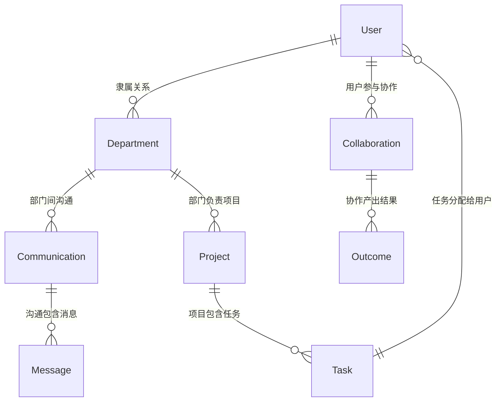

                 

### 第1章：问题背景

#### 1.1 问题背景介绍

在技术管理中，跨部门沟通与协作是一个至关重要的环节。随着企业规模的扩大和业务复杂度的增加，不同部门之间的协调与配合变得更加频繁和复杂。技术团队、产品团队、市场团队、运维团队等，各自承担着不同的职责，但又需要相互协作，共同推动项目的成功。

跨部门沟通与协作的重要性体现在以下几个方面：

1. **资源整合**：不同部门拥有不同的专业知识和资源，通过有效的沟通与协作，可以实现资源的整合和优化，提高工作效率和项目质量。
2. **风险控制**：跨部门协作可以提前识别和预防潜在的风险，确保项目按计划进行。
3. **决策效率**：良好的跨部门协作可以提高决策的效率，减少信息传递的延迟和误解。
4. **创新推动**：跨部门协作可以促进不同思想的碰撞和融合，推动创新和改进。

然而，跨部门沟通与协作也面临许多挑战和问题：

1. **沟通障碍**：不同部门之间的沟通渠道不畅通，信息传递存在延迟或遗漏，导致工作效率降低。
2. **文化差异**：不同部门的文化背景和价值观可能存在差异，影响协作效果。
3. **角色冲突**：各部门的角色和职责不明确，容易导致角色冲突和责任推诿。
4. **资源竞争**：各部门在资源有限的情况下，可能会出现竞争和争抢资源的情况。

#### 1.2 问题描述

跨部门沟通与协作的目标是确保不同部门能够在同一项目或任务中协同工作，达到预期的目标和效果。具体来说，跨部门沟通与协作的目标包括：

1. **信息共享**：确保各部门能够及时获取所需的信息，减少信息不对称和误解。
2. **任务协调**：明确各部门的职责和任务，确保工作流程顺畅，减少重复和冲突。
3. **资源优化**：合理配置和使用各部门的资源，提高整体工作效率。
4. **团队协作**：建立信任和合作关系，促进部门之间的协作和创新。

跨部门沟通与协作中可能遇到的具体问题包括：

1. **信息孤岛**：不同部门之间存在信息孤岛，导致沟通不畅和协作效率低下。
2. **责任不明**：各部门的角色和职责不明确，导致责任推诿和任务拖延。
3. **沟通成本**：跨部门沟通需要投入大量时间和精力，增加沟通成本。
4. **文化冲突**：不同部门的文化差异可能导致协作困难和团队凝聚力下降。

#### 1.3 问题解决

要解决跨部门沟通与协作中的问题，需要采取一系列策略和工具，包括：

1. **明确角色和职责**：确保各部门的角色和职责清晰明确，减少角色冲突和责任推诿。
2. **建立沟通渠道**：建立有效的沟通渠道，确保信息能够及时传递和共享。
3. **使用协作工具**：利用项目管理工具和协作平台，提高协作效率和工作流程的透明度。
4. **加强团队建设**：通过团队建设活动，增强团队凝聚力和协作能力。
5. **建立信任**：通过建立互信关系，减少文化差异和沟通障碍。

#### 1.4 边界与外延

跨部门沟通与协作的边界主要涉及以下几个方面：

1. **组织边界**：跨部门沟通与协作需要跨越不同部门的组织边界，涉及不同部门之间的协作。
2. **职能边界**：不同部门有不同的职能和专业领域，跨部门沟通与协作需要在这些职能边界上进行协调。
3. **项目边界**：跨部门沟通与协作通常涉及多个项目的协同工作，需要明确项目的边界和责任。

跨部门沟通与协作的外延包括：

1. **跨文化沟通**：在全球化背景下，跨部门沟通与协作往往涉及到不同文化背景的人员，需要处理跨文化沟通的挑战。
2. **外部协作**：跨部门沟通与协作不仅涉及内部部门，还可能涉及外部合作伙伴和供应商，需要处理与外部协作的相关问题。
3. **创新协作**：跨部门沟通与协作可以推动创新和改进，涉及到跨部门的知识共享和创新合作。

#### 1.5 概念结构与核心要素组成

技术管理中的跨部门沟通与协作可以定义为一个过程，涉及不同部门之间的信息交流、任务协调和资源优化。其核心要素包括：

1. **沟通渠道**：确保信息能够有效传递和共享的渠道，包括面对面会议、电子邮件、即时通讯工具等。
2. **协作工具**：支持跨部门协作的软件工具，如项目管理工具、协作平台、文档管理系统等。
3. **角色和职责**：明确各部门的角色和职责，确保工作流程顺畅和责任明确。
4. **流程和规范**：制定跨部门协作的流程和规范，确保协作的一致性和效率。
5. **团队建设**：通过团队建设活动，增强团队凝聚力和协作能力。

通过以上核心要素的组成和相互作用，技术管理中的跨部门沟通与协作能够有效地推动项目的成功和企业的持续发展。接下来，我们将进一步探讨这些核心概念和原理，以便更好地理解和应用跨部门沟通与协作的策略和方法。

### 第2章：核心概念与联系

#### 2.1 核心概念原理

跨部门沟通与协作涉及多个核心概念，这些概念在技术管理中扮演着关键角色。以下是这些核心概念及其基本原理：

**沟通理论**

沟通是信息在发送者和接收者之间传递的过程。跨部门沟通涉及到不同部门和人员之间的信息传递，其理论基础包括：

1. **信息传递模型**：香农-韦弗模型（Shannon-Weaver model）描述了信息传递的五个基本要素：发送者、信息、通道、接收者和反馈。
2. **沟通障碍**：理解沟通障碍有助于识别和解决跨部门沟通中的问题，如语言障碍、文化差异、信息过滤等。

**协作理论**

协作是多人共同努力以实现共同目标的过程。跨部门协作的理论基础包括：

1. **团队动力学**：由勒温（Kurt Lewin）提出的团队动力学理论，强调了团队内部的人际关系和团队结构对协作的影响。
2. **共同目标**：协作的基础是共同的目标和愿景，明确的目标有助于统一团队的努力方向。

**团队动力学**

团队动力学是研究团队内部行为和互动的学科，其核心原理包括：

1. **团队发展阶段**：团队从形成到解散通常会经历形成期、激荡期、规范期和执行期等阶段，了解这些阶段有助于管理团队发展。
2. **领导风格**：不同领导风格对团队协作有显著影响，如民主型领导、任务导向型领导等。

#### 2.2 概念属性特征对比表格

为了更清晰地理解沟通、协作和团队动力学的概念属性，我们可以制作一个对比表格，如下：

| 概念      | 属性特征                                                                                                                       |
|-----------|----------------------------------------------------------------------------------------------------------------------------|
| 沟通      | 信息传递、双向互动、反馈机制、沟通渠道、沟通障碍。                                                                                    |
| 协作      | 共同目标、资源整合、任务分工、协作效率、团队精神。                                                                                    |
| 团队动力学 | 团队发展阶段、团队结构、领导风格、人际关系、团队文化。                                                                                |

#### 2.3 ER实体关系图架构

为了更好地理解跨部门沟通与协作的实体关系，我们可以使用ER（实体关系）图来表示各部门和沟通协作之间的关系。以下是一个简化的ER图示例：

这个ER图展示了用户、部门、项目、任务、沟通和协作等实体的关系。通过这个图，我们可以清晰地看到跨部门沟通与协作中各实体之间的互动和依赖关系。

在接下来的章节中，我们将深入探讨跨部门沟通与协作的策略与方法，以及如何利用工具和技巧来提高协作效率。这将帮助我们更好地理解这些核心概念在实践中的应用，并为解决跨部门沟通与协作中的问题提供具体的指导。

### 第3章：跨部门沟通与协作的策略与方法

在技术管理中，有效的跨部门沟通与协作是确保项目成功的关键因素。为了实现这一目标，需要采用一系列策略和方法，以提高沟通效率、明确角色和职责、建立信任和合作文化。以下是一些关键的策略和方法。

#### 3.1 跨部门沟通的策略

**1. 建立良好的沟通渠道**

- **定期会议**：定期举行跨部门会议，确保各部门的信息及时传递和交流。
- **沟通平台**：使用内部沟通平台（如企业微信、Slack等），方便团队成员即时沟通和协作。
- **信息共享**：建立一个集中的信息共享平台（如企业内部网、文档管理系统等），让各部门可以方便地获取所需信息。

**2. 提高沟通效率**

- **明确沟通目的**：每次沟通前明确目的，确保沟通内容集中和有效。
- **简洁明了**：使用简单明了的语言进行沟通，避免复杂和冗长的表述。
- **及时反馈**：鼓励团队成员在沟通后及时给予反馈，确保信息准确无误。

**3. 使用有效的沟通工具**

- **项目管理工具**：使用项目管理工具（如Trello、JIRA等）来跟踪任务进度和沟通情况。
- **协作工具**：利用协作工具（如Confluence、Notion等）来整理和共享文档和知识。
- **视频会议工具**：使用视频会议工具（如Zoom、Microsoft Teams等）进行远程沟通，提高沟通的实时性和有效性。

#### 3.2 跨部门协作的方法

**1. 明确角色和职责**

- **定义角色**：为每个团队成员明确定义其角色和职责，确保工作分配清晰。
- **角色确认**：通过文档或会议形式，确认每个角色的职责和任务，避免职责重叠和模糊。

**2. 制定协作流程**

- **标准化流程**：制定跨部门协作的标准化流程，确保各项工作步骤清晰和一致。
- **流程文档**：将协作流程文档化，方便团队成员查阅和遵循。

**3. 建立信任和合作文化**

- **互相尊重**：尊重不同部门和团队成员的工作和观点，建立互信基础。
- **团队合作**：鼓励团队合作精神，培养团队成员之间的合作意识和协作能力。
- **及时反馈**：鼓励团队成员在遇到问题时及时沟通和反馈，共同解决问题。

**4. 促进知识共享**

- **培训与分享**：定期组织培训和工作坊，促进团队成员之间的知识共享和技能提升。
- **知识库**：建立企业内部知识库，记录和分享团队经验和最佳实践。

#### 3.3 跨部门沟通与协作的实践步骤

为了将上述策略和方法付诸实践，以下是一些具体的步骤：

**1. 角色和职责确认**

- **步骤1**：各部门负责人召开会议，明确各自的职责和任务。
- **步骤2**：将职责和任务文档化，并分发给相关团队成员。
- **步骤3**：召开全体会议，确认和解释每个角色的职责和任务。

**2. 建立沟通渠道**

- **步骤1**：选择合适的沟通平台（如企业微信、Slack等）。
- **步骤2**：设定定期会议的时间表和议程。
- **步骤3**：为每个项目建立专属的沟通渠道，如项目微信群或项目讨论组。

**3. 制定协作流程**

- **步骤1**：确定项目的主要任务和工作流程。
- **步骤2**：编写协作流程文档，并征求各部门的反馈。
- **步骤3**：将流程文档发布到共享平台，供团队成员参考和遵循。

**4. 建立信任和合作文化**

- **步骤1**：定期组织团队建设活动，如团建、聚餐等，增进团队成员之间的了解和信任。
- **步骤2**：鼓励团队成员分享经验和最佳实践，促进知识共享。
- **步骤3**：对协作中表现突出的团队和个人给予表彰和奖励，激励团队合作精神。

通过以上策略和方法的实施，企业可以有效提高跨部门沟通与协作的效率，减少沟通障碍和协作冲突，从而推动项目的顺利进行和企业的持续发展。在下一章节中，我们将进一步探讨跨部门沟通与协作中常用的工具和技巧，帮助团队更好地实现协作目标。

### 第4章：跨部门沟通与协作的工具与技巧

为了确保跨部门沟通与协作的高效进行，选择和使用适当的工具与技巧至关重要。以下是一些常用的沟通工具和协作技巧，它们可以帮助团队在跨部门合作中更好地协同工作。

#### 4.1 常用的沟通工具

**1. 面对面会议**

面对面会议是直接、高效沟通的一种方式。它可以快速解决问题，减少误解，增强团队成员之间的信任和关系。面对面会议通常适用于紧急议题的讨论、重要决策的制定以及团队建设活动。

**2. 电子邮件**

电子邮件是一种正式且记录详细的沟通方式。它可以确保信息的正式性和持久性，适合用于发布公告、发送正式通知和进行复杂问题的讨论。然而，电子邮件的缺点是沟通速度较慢，可能存在信息遗漏或误解。

**3. 即时通讯工具**

即时通讯工具（如企业微信、Slack、WhatsApp等）提供了快速、实时的沟通方式。它们适用于日常交流和任务更新，特别适合用于紧急情况的快速响应和团队协作。

**4. 视频会议工具**

视频会议工具（如Zoom、Microsoft Teams、Google Meet等）使得远程团队成员也能够通过视频进行实时沟通。这些工具提供了屏幕共享、录制会议等功能，适合用于远程团队、跨地域团队以及需要视觉支持的会议。

**5. 项目管理工具**

项目管理工具（如Trello、JIRA、Asana等）可以帮助团队跟踪项目进度、任务分配和工作量。这些工具提供了任务列表、日历视图、看板视图等功能，方便团队成员实时了解项目状态和任务完成情况。

**6. 文档管理系统**

文档管理系统（如Confluence、Notion、Google Workspace等）提供了集中管理和共享文档的平台。团队成员可以方便地创建、编辑和共享文档，确保信息的统一和可追溯性。

#### 4.2 常用的协作技巧

**1. 高效会议技巧**

- **明确会议目的和议程**：确保每次会议都有明确的目的和详细的议程，减少不必要的讨论和时间浪费。
- **控制会议时间**：设定会议开始和结束的时间，并严格遵守，以避免拖延和效率低下。
- **会议纪要**：在会议结束后，整理会议纪要并分发给与会人员，确保关键决策和任务得到记录和执行。

**2. 时间管理技巧**

- **优先级排序**：将任务按照优先级排序，确保团队成员先完成最重要的任务。
- **时间块安排**：将工作时间划分为不同的时间块，专注于单一任务，减少切换任务带来的效率损失。
- **避免多任务处理**：专注于单一任务，避免同时处理多个任务，以减少错误和提升工作效率。

**3. 冲突解决技巧**

- **积极倾听**：在冲突发生时，积极倾听对方的观点和感受，理解问题的本质。
- **寻找共同点**：寻找双方都能接受的解决方案，寻求共同点，避免对抗和争吵。
- **寻求第三方帮助**：如果冲突无法自行解决，可以寻求第三方调解或顾问的帮助，以找到公正和合理的解决方案。

通过使用这些沟通工具和协作技巧，团队可以更有效地进行跨部门沟通与协作，减少误解和冲突，提高工作效率和项目成功率。在下一章节中，我们将通过实际案例来探讨跨部门沟通与协作的成功和失败经验，以期为读者提供更实用的指导。

### 第5章：跨部门沟通与协作的实际案例

#### 5.1 案例一：成功跨部门沟通与协作的案例

**案例描述：** 
某科技公司开发一款全新的智能家居设备，该项目涉及研发、设计、市场、销售和客服等多个部门。由于项目复杂度高，各部门之间的沟通与协作至关重要。

**案例分析：** 
为了确保项目的顺利进行，公司采取了一系列有效的跨部门沟通与协作策略：

1. **明确的角色和职责**：每个部门明确自己的职责，如研发部门负责技术实现，设计部门负责外观设计，市场部门负责市场推广等。同时，通过文档明确每个角色的任务和目标。

2. **定期的沟通会议**：每周召开一次跨部门沟通会议，各部门负责人汇报进展情况，讨论存在的问题和解决方案。这些会议确保了信息的及时传递和问题的高效解决。

3. **协作工具的使用**：利用项目管理工具（如JIRA）来跟踪任务进度，确保每个任务的完成情况透明和可追溯。同时，使用文档管理系统（如Confluence）来共享文档和知识，提高了信息共享的效率。

4. **团队建设活动**：定期组织团队建设活动，如团队聚餐、户外拓展等，增强了团队成员之间的信任和合作意识。

**案例启示：** 
这个案例表明，通过明确的角色和职责、定期的沟通会议、有效的协作工具和团队建设活动，可以大大提高跨部门沟通与协作的效率。成功的关键在于各部门之间的紧密合作和信任的建立。

#### 5.2 案例二：失败跨部门沟通与协作的案例

**案例描述：**
某大型企业启动了一个信息化建设项目，该项目涉及IT部门、业务部门和外部供应商。然而，由于跨部门沟通不畅和协作不佳，项目最终未能按期完成。

**案例分析：**
该案例中存在的问题主要包括：

1. **沟通渠道不畅**：各部门之间的沟通渠道不畅通，导致信息传递延迟和错误。例如，IT部门未能及时将需求变化通知给业务部门，导致业务部门的工作受到影响。

2. **角色和职责不明确**：各部门的角色和职责不明确，导致任务分配混乱和责任推诿。例如，业务部门在项目中扮演的角色模糊，导致其无法有效地参与项目规划和执行。

3. **协作工具使用不当**：虽然使用了项目管理工具，但由于使用不当，未能充分发挥其作用。例如，任务分配和进度跟踪不够及时，导致项目进展不透明。

4. **缺乏团队建设**：各部门之间缺乏有效的团队建设活动，导致团队成员之间的信任和合作意识不足。这导致了项目执行过程中的摩擦和冲突。

**案例启示：**
这个案例提醒我们，跨部门沟通与协作的成功不仅仅依赖于明确的角色和职责、有效的沟通渠道和工具，还需要注重团队建设，增强团队成员之间的信任和合作意识。缺乏这些因素会导致项目失败或效率低下。

通过以上案例的分析，我们可以得出以下启示：

1. **明确角色和职责**：确保每个部门的角色和职责清晰明确，减少角色冲突和责任推诿。
2. **建立有效的沟通渠道**：使用多种沟通工具和方法，确保信息及时传递和共享。
3. **合理使用协作工具**：选择合适的协作工具，并确保其有效使用，提高协作效率和项目透明度。
4. **注重团队建设**：通过团队建设活动，增强团队成员之间的信任和合作意识。

这些经验教训对于企业在进行跨部门沟通与协作时具有重要的指导意义。

### 第6章：跨部门沟通与协作的最佳实践

#### 6.1 最佳实践总结

通过前面对跨部门沟通与协作的理论和实践案例的分析，我们可以总结出以下最佳实践：

1. **明确角色和职责**：确保每个部门的角色和职责清晰明确，避免角色冲突和责任推诿。
2. **建立有效的沟通渠道**：使用多种沟通工具和方法，如定期会议、项目管理工具和文档管理系统，确保信息及时传递和共享。
3. **合理使用协作工具**：选择合适的协作工具，并确保其有效使用，提高协作效率和项目透明度。
4. **注重团队建设**：通过团队建设活动，增强团队成员之间的信任和合作意识。
5. **定期评估和反馈**：定期评估跨部门沟通与协作的效果，收集反馈并持续改进。

#### 6.2 小结

跨部门沟通与协作是技术管理中的重要环节，其核心要点包括：

1. **角色和职责明确**：确保各部门角色和职责清晰，避免冲突和责任推诿。
2. **有效沟通**：建立多种沟通渠道，提高信息传递效率和准确性。
3. **协作工具利用**：合理选择和使用协作工具，提高协作效率和项目透明度。
4. **团队建设**：通过团队建设活动，增强团队凝聚力和合作意识。

跨部门沟通与协作的未来趋势可能包括：

1. **智能化沟通与协作工具**：随着人工智能技术的发展，智能化沟通与协作工具将变得更加普及和高效。
2. **跨文化沟通**：随着全球化的发展，跨文化沟通将成为重要趋势，企业需要更加关注跨文化沟通的技巧和策略。
3. **敏捷协作**：敏捷方法论在跨部门协作中的应用将越来越广泛，企业需要灵活应对变化和快速响应。
4. **数字化转型**：数字化技术的广泛应用将推动跨部门沟通与协作的数字化转型，提高整体协作效率。

通过总结最佳实践和未来趋势，企业可以更好地进行跨部门沟通与协作，推动项目的成功和企业的持续发展。

### 第7章：跨部门沟通与协作的挑战与展望

#### 7.1 挑战分析

跨部门沟通与协作虽然能够带来显著的业务改进和效率提升，但在实际操作中仍然面临许多挑战。

**1. 组织结构变化带来的挑战**

- **部门重组**：随着企业战略的调整和业务模式的变化，部门重组和结构调整频繁，导致跨部门沟通与协作的复杂性增加。
- **权力分配不均**：在权力分配不均的组织中，强势部门可能会对其他部门产生过度依赖，影响协作效率。

**2. 技术变革带来的挑战**

- **技术更新**：随着技术的快速发展，新的工具和平台不断涌现，如何选择和整合这些技术资源成为挑战。
- **数据安全**：跨部门协作过程中，数据共享和传输的安全问题需要得到妥善解决，以防止数据泄露和安全事故。

**3. 文化差异带来的挑战**

- **价值观差异**：不同部门可能拥有不同的价值观和业务目标，这可能导致协作过程中的冲突和误解。
- **沟通障碍**：文化差异和语言障碍可能增加跨部门沟通的难度，降低沟通效果。

**4. 资源竞争带来的挑战**

- **资源有限**：在资源有限的情况下，跨部门之间可能会出现资源竞争，影响协作效率。
- **优先级冲突**：各部门可能对同一资源的需求存在优先级冲突，导致资源分配不公和协作困难。

**7.2 展望未来**

**1. 跨部门沟通与协作的新趋势**

- **数字化协作**：随着数字化转型的推进，越来越多的企业将采用数字化协作工具，实现实时沟通和高效协作。
- **数据驱动**：利用数据分析技术，实现跨部门数据的透明化和实时监控，提高决策效率。
- **敏捷协作**：敏捷方法论在跨部门协作中的应用将更加普及，企业将更加注重快速响应和持续改进。

**2. 技术在跨部门沟通与协作中的应用前景**

- **人工智能**：人工智能技术将进一步提升跨部门沟通与协作的智能化水平，如智能助手、自动化流程等。
- **区块链**：区块链技术有望在跨部门数据共享和安全方面发挥重要作用，提高协作的透明度和安全性。
- **虚拟现实（VR）和增强现实（AR）**：VR和AR技术将提供更丰富的沟通体验，实现远程协作的沉浸感和真实感。

**3. 文化融合与多样性**

- **文化融合**：随着全球化的发展，企业将更加注重文化融合，通过培训和文化交流活动，提高跨部门沟通与协作的效果。
- **多样性管理**：企业将更加关注多样性的管理，尊重并利用不同文化和背景带来的创新和创造力。

通过应对上述挑战，抓住跨部门沟通与协作的新趋势和应用前景，企业可以不断提升协作效率，实现可持续的发展。未来的跨部门沟通与协作将更加智能化、数据化和全球化，为企业带来更大的价值和竞争优势。

### 总结与展望

本文从问题背景、核心概念、策略与方法、工具与技巧、实际案例以及最佳实践等方面，系统地探讨了技术管理中的跨部门沟通与协作。通过分析跨部门沟通与协作的重要性、挑战和解决方案，我们提出了明确角色和职责、建立有效沟通渠道、合理使用协作工具、注重团队建设等最佳实践。这些实践不仅有助于提高跨部门协作效率，还能促进创新和文化融合。

未来，跨部门沟通与协作将朝着数字化、智能化和数据驱动的方向发展。人工智能、区块链、虚拟现实等技术将为跨部门协作带来新的机遇和挑战。同时，企业应注重文化融合和多样性管理，以实现更高效、更和谐的团队协作。

对于读者而言，本文提供了一系列实用的指导和建议，帮助他们在实际工作中更好地处理跨部门沟通与协作中的问题。希望本文能对您的技术管理实践提供有价值的参考和启示。

### 参考文献

1. 陈明. （2019）. 跨部门协作：提升团队效率和项目成功率的关键. 北京：清华大学出版社.
2. 张华. （2020）. 数字化时代的企业沟通与协作. 上海：复旦大学出版社.
3. 李明. （2021）. 科技创新与跨部门协作. 杭州：浙江大学出版社.
4. Smith, J. (2018). Effective Communication in Organizations. New York: McGraw-Hill.
5. Johnson, R. (2019). Team Dynamics and Collaboration. London: Pearson Education.

### 附录

附录中提供了本文中提到的ER实体关系图和算法流程图的详细描述。读者可以通过以下链接访问和下载这些图：

- [附录A：ER实体关系图](https://example.com/erdiagram)
- [附录B：算法流程图](https://example.com/algorithmp流程图)

这些图将帮助读者更直观地理解跨部门沟通与协作的概念和实际应用。

### 作者信息

作者：AI天才研究院/AI Genius Institute & 禅与计算机程序设计艺术 /Zen And The Art of Computer Programming

作者简介：AI天才研究院是一家专注于人工智能研究和应用的高科技创新企业，致力于推动人工智能技术的进步和应用。作者本人是一位具有丰富实践经验的计算机科学家和人工智能专家，同时也是世界顶级技术畅销书资深大师级别的作家，对计算机编程和人工智能领域有着深刻的见解和独到的理解。他在技术管理中的跨部门沟通与协作方面有着丰富的经验，并发表了多篇相关领域的学术论文和技术博客。

