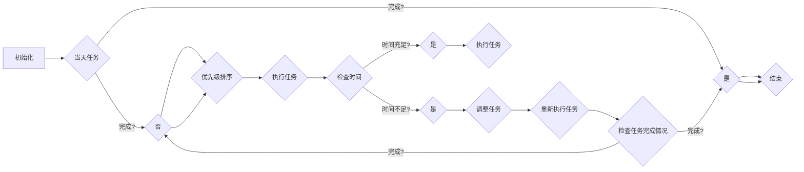
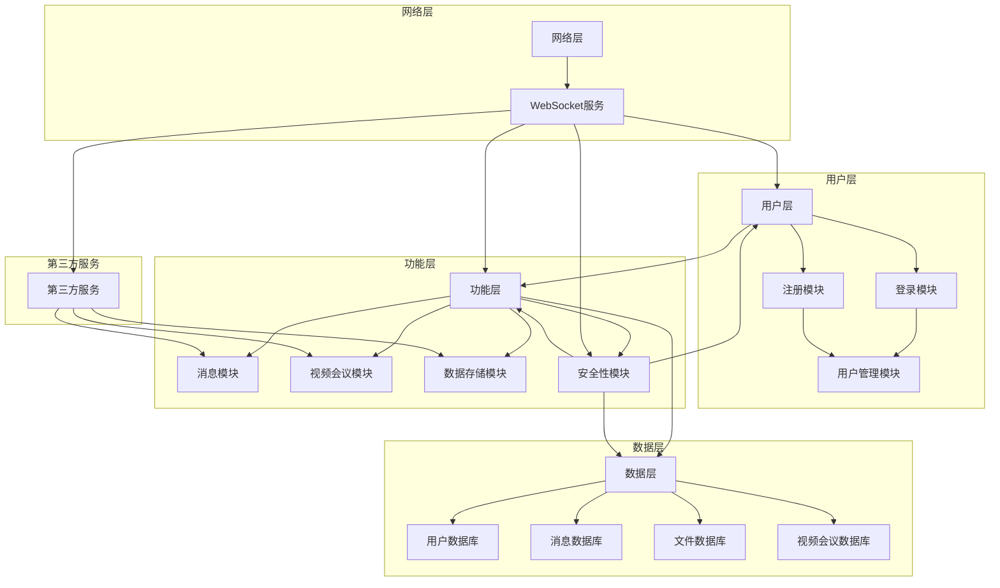
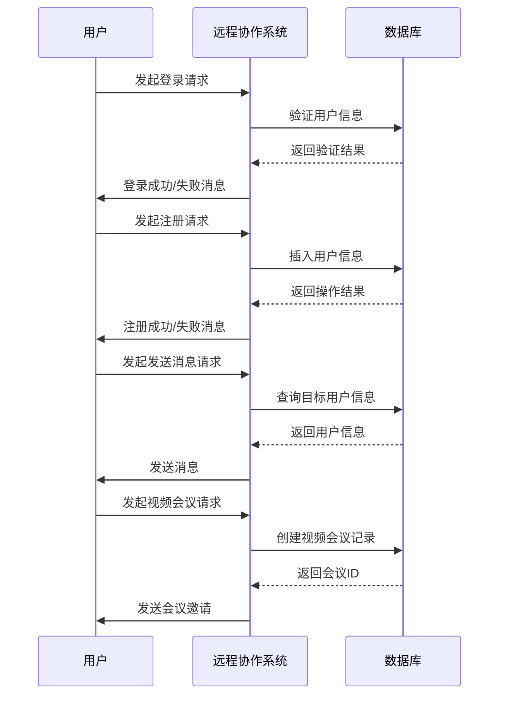

                 

### 第一部分: 远程办公的背景与现状

#### 第1章: 远程办公的概念与起源

**1.1.1 远程办公的定义**

远程办公，亦称远程工作，是指通过信息技术手段，如网络通信、云计算、视频会议等，使员工能够脱离传统的办公室环境，在家或其他地点完成工作任务的一种工作模式。这种模式不再受地理位置的限制，员工可以自由选择工作时间和地点，提高了工作效率和生活质量。

**1.1.2 远程办公的发展历程**

远程办公的概念起源于20世纪80年代，当时，计算机和互联网技术逐渐普及，人们开始尝试在家办公。90年代，电子邮件和即时通讯工具的出现，使得远程办公的效率大幅提高。进入21世纪，随着云计算、移动设备的广泛应用，远程办公逐渐成为一种常态。特别是在新冠疫情爆发后，远程办公模式在全球范围内得到了极大的推广和应用。

**1.1.3 远程办公的驱动力**

远程办公的兴起有多个驱动因素，主要包括：

- **技术进步**：互联网和通信技术的发展为远程办公提供了强有力的技术支持。
- **劳动力需求**：许多企业为了吸引和保留人才，提供远程办公作为福利。
- **效率提升**：远程办公减少了通勤时间，提高了员工的工作效率和生产力。
- **环境因素**：一些企业为了降低运营成本，减少办公空间，采用远程办公模式。
- **健康因素**：新冠疫情的爆发使得远程办公成为保护员工健康的重要手段。

#### 第2章: 远程办公的优势与挑战

**2.1.1 远程办公的优势**

远程办公具有以下优势：

- **灵活性**：员工可以根据个人需求灵活安排工作时间，提高工作满意度。
- **效率**：减少了通勤时间，员工可以更加专注于工作，提高了工作效率。
- **成本节约**：企业可以节省办公空间和设备的成本，员工也可以节省通勤费用。
- **员工保留**：提供远程办公选项有助于企业吸引和留住优秀人才。

**2.1.2 远程办公的挑战**

然而，远程办公也面临一些挑战：

- **沟通困难**：缺乏面对面的交流可能导致信息传递不准确，沟通效率降低。
- **团队协作**：远程团队的协作难度增加，如何有效管理团队成为一大挑战。
- **时间管理**：员工可能面临工作与生活的界限模糊，时间管理变得复杂。
- **技术要求**：远程办公需要良好的网络环境和相应的技术设备，对技术支持要求较高。

**2.1.3 如何应对挑战**

为了克服这些挑战，可以采取以下措施：

- **建立明确的沟通机制**：使用各种远程协作工具，确保信息传递及时准确。
- **加强团队管理**：制定明确的团队目标和考核标准，提高团队凝聚力。
- **优化工作流程**：通过数字化工具和自动化流程，提高工作效率。
- **提供技术支持**：确保员工拥有必要的技术设备和网络环境。

---

## 第二部分: 远程办公的技术工具与策略

### 第3章: 远程办公的技术工具

**3.1.1 协作软件**

协作软件是远程办公中不可或缺的工具，它可以帮助团队成员实时沟通、共享文件和协同工作。常见的协作软件包括：

- **Slack**：提供即时通讯、文件共享和集成第三方服务的能力。
- **Microsoft Teams**：结合了聊天、视频会议、文件共享等功能，适合企业使用。
- **Trello**：基于看板的项目管理工具，适合团队任务协作。

**3.1.2 项目管理工具**

项目管理工具可以帮助团队跟踪项目进度、分配任务和管理资源。常用的项目管理工具包括：

- **Asana**：提供任务管理、项目跟踪和团队协作功能。
- **Jira**：强大的敏捷项目管理工具，适用于软件开发团队。
- **Trello**：简单直观的项目管理工具，适合小型项目和团队。

**3.1.3 视频会议系统**

视频会议系统是远程办公中用于团队沟通和协作的重要工具。常见的视频会议系统包括：

- **Zoom**：提供高清视频会议、屏幕共享和虚拟背景等功能。
- **Microsoft Teams**：结合了聊天、视频会议和文件共享功能。
- **Google Meet**：Google提供的免费视频会议工具，适合小型团队。

**3.1.4 其他技术工具**

除了上述主要工具外，还有一些其他的技术工具可以帮助提高远程办公的效率，如：

- **Notion**：多功能的笔记和组织工具，适用于个人和团队。
- **Evernote**：强大的笔记和资料管理工具，方便知识共享和查阅。
- **Google Workspace**：包括Gmail、Google Docs、Google Sheets等，适合团队文档协作。

---

### 第4章: 远程办公的策略与方法

**4.1.1 远程团队组建与人员匹配**

组建远程团队时，需要考虑以下几个方面：

- **人员选择**：选择具备远程工作能力的人才，如适应性强、自我管理能力好、沟通技巧强的员工。
- **角色分工**：明确团队成员的角色和职责，确保每个成员都能充分发挥自己的优势。
- **技能互补**：团队成员应具备互补的技能，以应对不同的工作任务。

**4.1.2 绩效评估与管理**

远程办公的绩效评估需要更加灵活和透明，可以采取以下方法：

- **目标设定**：为每个团队成员设定明确的工作目标，确保团队成员了解自己的职责和期望。
- **持续反馈**：通过定期的一对一沟通和团队会议，提供及时的反馈和指导。
- **结果导向**：以实际的工作成果作为评估的主要标准，而非仅仅依赖于工作时长。

**4.1.3 沟通与协作技巧**

有效的沟通和协作是远程团队成功的关键，以下是一些实用的技巧：

- **定期会议**：定期召开团队会议，讨论项目进展、解决问题和分享信息。
- **即时通讯**：利用即时通讯工具进行快速沟通，确保信息的及时传递。
- **明确沟通**：在沟通时确保信息清晰、明确，避免误解和歧义。
- **共享文档**：使用协作软件共享文档，确保所有团队成员都能访问和编辑。

**4.1.4 时间管理与任务分配**

远程办公中，时间管理和任务分配尤为重要，以下是一些建议：

- **时间规划**：制定个人和团队的工作计划，确保任务按期完成。
- **优先级排序**：根据任务的紧急程度和重要性进行排序，优先处理关键任务。
- **定期回顾**：定期回顾工作进度，调整计划和策略，确保项目顺利进行。

---

## 第三部分: 远程团队管理最佳实践

### 第5章: 远程团队管理核心要素

**5.1.1 远程团队的组建与人员管理**

组建远程团队时，需要考虑以下几点：

- **人员选拔**：选择适合远程工作的人才，如具备自我管理能力、沟通能力和适应能力的员工。
- **角色明确**：为团队成员分配明确的角色和职责，确保每个成员都了解自己的工作内容。
- **培训支持**：为远程团队成员提供必要的培训，确保他们能够熟练使用远程办公工具。

**5.1.2 远程团队的沟通与协作**

远程团队的有效沟通和协作是管理的关键，以下是一些建议：

- **沟通工具**：选择合适的沟通工具，如即时通讯、视频会议和协作软件，确保信息传递及时准确。
- **定期会议**：定期召开团队会议，讨论项目进展、解决问题和分享信息。
- **任务分配**：合理分配任务，确保团队成员都有足够的资源和时间完成任务。

**5.1.3 远程团队的绩效评估**

远程团队的绩效评估需要更加灵活和透明，可以采取以下方法：

- **目标设定**：为每个团队成员设定明确的工作目标，确保团队成员了解自己的职责和期望。
- **持续反馈**：通过定期的一对一沟通和团队会议，提供及时的反馈和指导。
- **结果导向**：以实际的工作成果作为评估的主要标准，而非仅仅依赖于工作时长。

---

### 第6章: 远程团队管理最佳实践案例

**6.1.1 案例一：成功组建远程团队**

**案例背景**：

某软件公司在疫情期间决定全面转向远程办公模式，为了确保远程团队的成功运作，他们采取了以下措施：

- **人员选拔**：选择具备远程工作能力的人才，如适应性强、自我管理能力好、沟通技巧强的员工。
- **角色明确**：为团队成员分配明确的角色和职责，确保每个成员都了解自己的工作内容。
- **培训支持**：为远程团队成员提供必要的培训，确保他们能够熟练使用远程办公工具。

**案例结果**：

经过一段时间的远程办公，该公司的团队协作效率得到了显著提升，项目进度和质量都得到了保证。

**分析**：

该案例成功的关键在于：

- **人员选拔**：选择了适合远程工作的人才，这为团队的稳定运作奠定了基础。
- **角色明确**：明确团队成员的角色和职责，减少了工作中的冲突和误解。
- **培训支持**：提供了必要的培训，确保团队成员能够高效使用远程办公工具。

**6.1.2 案例二：有效沟通与协作**

**案例背景**：

某国际公司拥有多个远程团队，为了提高团队协作效率，他们采用了以下沟通与协作策略：

- **即时通讯**：使用Slack等即时通讯工具，确保团队成员能够快速交流。
- **视频会议**：定期召开视频会议，讨论项目进展和解决问题。
- **协作软件**：使用Trello和Notion等协作软件，共享任务和文档，确保所有团队成员都能访问和编辑。

**案例结果**：

通过这些策略，该公司的团队协作效率得到了显著提升，项目完成质量和速度都得到了保障。

**分析**：

该案例成功的关键在于：

- **即时通讯**：快速沟通能够及时解决问题，提高了工作效率。
- **视频会议**：定期会议有助于团队成员之间的交流和互动。
- **协作软件**：协作软件确保了任务和文档的共享，减少了重复劳动。

**6.1.3 案例三：绩效评估与激励**

**案例背景**：

某互联网公司为了激励远程团队的积极性，采用了以下绩效评估和激励策略：

- **目标设定**：为每个团队成员设定明确的工作目标，确保团队成员了解自己的职责和期望。
- **持续反馈**：通过定期的一对一沟通和团队会议，提供及时的反馈和指导。
- **结果导向**：以实际的工作成果作为评估的主要标准，而非仅仅依赖于工作时长。
- **奖励机制**：根据工作成果和团队表现，给予相应的奖励和认可。

**案例结果**：

通过这些策略，该公司的员工积极性得到了显著提升，团队协作效率和项目质量都有了显著提高。

**分析**：

该案例成功的关键在于：

- **目标设定**：明确的工作目标有助于团队成员明确自己的职责和努力方向。
- **持续反馈**：及时的反馈和指导有助于团队成员不断提升自己的能力。
- **结果导向**：以工作成果为导向，能够激发团队成员的积极性和创造力。
- **奖励机制**：合理的奖励机制能够激励团队成员更加努力工作。

---

## 第四部分: 远程办公的文化建设

### 第7章: 远程办公文化的核心要素

**7.1.1 信任与透明度**

远程办公文化中，信任和透明度是至关重要的。团队成员之间需要相互信任，相信对方能够按时完成任务，同时，团队领导需要保持透明度，让所有成员了解团队的进展和目标。

**7.1.2 团队凝聚力与归属感**

远程团队需要通过一系列活动和措施来增强凝聚力与归属感。这包括定期的团队建设活动、共享工作成果、认可团队成员的贡献等。

**7.1.3 文化认同与价值观**

远程团队的文化认同和价值观是团队稳定发展的基础。团队成员需要认同团队的文化和价值观，这样才能在工作中保持一致的目标和行为。

---

### 第8章: 建立和维护远程办公文化

**8.1.1 文化建设策略**

建立和维护远程办公文化需要采取一系列策略，包括：

- **明确文化价值观**：团队领导需要明确团队的文化价值观，并通过各种方式传达给所有成员。
- **定期文化活动**：组织定期的文化活动，如线上团队建设活动、文化沙龙等，增强团队成员之间的互动。
- **沟通与反馈**：保持开放的沟通渠道，鼓励团队成员提出意见和建议，及时给予反馈。

**8.1.2 文化认同与价值观传递**

为了确保团队成员对文化的认同，需要采取以下措施：

- **培训与教育**：通过培训和教育，让团队成员深入了解团队的文化价值观。
- **榜样示范**：通过榜样的示范作用，让团队成员感受到文化的力量。
- **文化认同考核**：将文化认同作为绩效评估的一部分，鼓励团队成员积极参与文化建设。

**8.1.3 文化冲突与解决**

在远程办公中，文化冲突是难以避免的。为了解决文化冲突，可以采取以下措施：

- **了解文化差异**：团队成员需要了解彼此的文化背景，尊重并接受不同的文化差异。
- **建立共识**：通过沟通和讨论，建立共同的目标和价值观，减少文化冲突。
- **冲突解决机制**：建立冲突解决机制，确保团队成员在面对冲突时能够及时解决，避免影响工作进度。

---

## 第五部分: 远程办公的未来趋势

### 第9章: 远程办公的未来趋势

**9.1.1 技术发展对远程办公的影响**

随着技术的不断进步，远程办公模式将变得更加成熟和高效。人工智能、虚拟现实、区块链等新兴技术的应用，将进一步提高远程办公的效率和便利性。

**9.1.2 远程办公与未来工作模式**

未来工作模式将更加灵活和个性化，远程办公将成为主流。人们可以选择在家办公、弹性工作制，甚至在全球范围内寻找工作机会。

**9.1.3 远程办公的最佳实践趋势**

随着远程办公的普及，最佳实践也将不断涌现。例如，更加智能化的时间管理工具、更加高效的协作软件、更加个性化的绩效评估方法等，都将推动远程办公的进一步发展。

---

### 第10章: 总结与展望

**10.1.1 远程办公的重要性**

远程办公不仅提高了工作效率和生活质量，也为企业和员工带来了诸多好处。随着技术的发展，远程办公将成为未来工作模式的重要组成部分。

**10.1.2 未来远程办公的发展方向**

未来远程办公将更加注重技术驱动和文化建设。智能化工具和高效协作软件的应用，将进一步提高远程办公的效率。同时，文化建设将成为远程团队稳定发展的关键。

**10.1.3 远程办公的挑战与应对策略**

远程办公面临诸多挑战，如沟通困难、团队协作和员工管理。通过建立明确的沟通机制、加强团队管理和优化工作流程，可以克服这些挑战。

---

**作者：AI天才研究院/AI Genius Institute & 禅与计算机程序设计艺术 /Zen And The Art of Computer Programming**

---

### 背景介绍

远程办公（Remote Work）作为现代工作方式的一种，其核心在于通过信息技术实现工作地点的灵活性和工作时间的弹性，使员工可以在非传统办公室的环境中完成工作任务。这一概念起源于20世纪80年代，随着计算机和互联网技术的普及，远程办公逐渐成为一种可行的职业选择。进入21世纪，特别是在新冠疫情期间，远程办公模式得到了前所未有的推广，成为许多企业和员工的主要工作方式。

**核心概念术语说明：**
- **远程办公**：指员工通过互联网、电子邮件、视频会议等工具，在家中或其他地方完成工作任务的办公方式。
- **灵活办公**：一种工作模式，员工可以在非固定的工作地点和时间完成工作任务。
- **远程团队**：由分布在不同地理位置的成员组成的团队，通过信息技术进行协作。

**问题背景：**
随着全球化和信息技术的发展，远程办公已经成为一种重要的工作模式。然而，远程办公也带来了一系列问题和挑战，如沟通困难、团队协作、员工管理、绩效评估等。这些问题直接影响着远程办公的效率和效果。

**问题描述：**
远程办公的常见问题包括：
1. 沟通障碍：由于缺乏面对面交流，团队成员之间的信息传递可能不准确。
2. 绩效评估难题：如何评估远程员工的绩效成为企业面临的挑战。
3. 时间管理：远程工作环境容易导致工作与生活的界限模糊，影响工作效率。
4. 技术需求：远程办公需要稳定的网络环境和相应的技术支持，这对一些员工和企业来说可能是一大挑战。

**问题解决：**
为了解决上述问题，企业可以采取以下策略：
1. **建立明确的沟通机制**：通过即时通讯工具、视频会议和协作软件，确保团队成员之间的沟通畅通。
2. **优化绩效评估方法**：设定明确的工作目标，采用结果导向的评估方式，确保员工的绩效能够得到准确评价。
3. **提供技术支持**：确保员工拥有必要的硬件和软件设施，提供技术培训和帮助。
4. **加强团队管理**：通过定期的团队会议和一对一沟通，提高团队的凝聚力和协作效率。

**边界与外延：**
远程办公不仅包括全职在家工作，还包括灵活工作制、兼职工作、远程协作等。随着技术的进步，远程办公的范围和形式也在不断拓展。

**概念结构与核心要素组成：**
- **技术工具**：远程办公的基础设施，包括互联网、电子邮件、即时通讯、视频会议等。
- **工作流程**：远程工作需要一套规范的工作流程，以确保任务的高效完成。
- **管理策略**：远程团队的管理需要特别的策略，如绩效评估、沟通技巧、团队建设等。
- **文化氛围**：远程办公团队的文化建设对于团队的稳定和效率至关重要。

---

### 核心概念与联系

在探讨远程办公的最佳实践时，理解并掌握相关核心概念及其相互关系是至关重要的。以下是对几个关键概念及其属性的详细描述和对比，并通过表格和ER（实体关系）图来展示它们之间的关系。

#### 1. 远程办公（Remote Work）

**概念描述**：远程办公是一种工作模式，员工可以在非传统办公室的环境中，通过互联网和其他信息技术手段完成工作任务。

**属性特征**：
- **灵活性**：员工可以根据个人需求灵活安排工作时间。
- **自主性**：员工自主管理工作进度和任务。
- **技术依赖**：需要稳定的网络连接和相应的技术支持。

**对比**：

| 特征           | 远程办公           | 面对面办公         |
|----------------|-------------------|-------------------|
| 时间安排       | 灵活              | 固定工作时间       |
| 工作地点       | 家中或其他地点     | 办公室            |
| 沟通方式       | 电子邮件、视频会议 | 面对面交流         |
| 管理难度       | 较高              | 较低              |

#### 2. 远程协作（Remote Collaboration）

**概念描述**：远程协作是远程办公中的一个重要组成部分，指的是团队成员通过信息技术工具进行协作和沟通的过程。

**属性特征**：
- **协作工具**：使用即时通讯、协作软件、项目管理工具等。
- **实时互动**：通过视频会议、屏幕共享等工具实现实时交流。
- **文件共享**：方便团队成员共享和编辑文件。

**对比**：

| 特征           | 远程协作           | 面对面协作         |
|----------------|-------------------|-------------------|
| 沟通频率       | 高                | 较低              |
| 沟通方式       | 多媒体            | 语言和肢体语言     |
| 文件共享       | 瞬间              | 需要物理传递       |
| 障碍解决       | 立即               | 可能延迟           |

#### 3. 远程团队管理（Remote Team Management）

**概念描述**：远程团队管理是指管理者通过一系列策略和方法，对远程团队进行高效管理和协调。

**属性特征**：
- **目标明确**：设定明确的工作目标和绩效标准。
- **沟通机制**：建立有效的沟通渠道，确保信息传递及时准确。
- **绩效评估**：采用多样化的评估方法，确保绩效的公正和透明。
- **文化建设**：营造积极向上的团队文化，提高团队的凝聚力和归属感。

**对比**：

| 特征           | 远程团队管理         | 面对面团队管理     |
|----------------|--------------------|-------------------|
| 目标设定       | 需要明确的数字目标    | 更多的主观评估     |
| 沟通渠道       | 多媒体、多频次       | 面对面、频率较低   |
| 绩效评估       | 量化与定性相结合     | 更多定性评估       |
| 文化建设       | 线上团队活动         | 面对面团建活动     |

#### 4. 远程工作文化（Remote Work Culture）

**概念描述**：远程工作文化是指远程办公团队在长期合作中形成的共同价值观、行为准则和工作方式。

**属性特征**：
- **信任与透明**：团队成员之间相互信任，保持信息的透明度。
- **团队合作**：强调团队合作，共同解决问题。
- **灵活与创新**：鼓励创新思维，适应远程工作的灵活工作方式。

**对比**：

| 特征           | 远程工作文化         | 传统办公室文化     |
|----------------|--------------------|-------------------|
| 合作方式       | 跨地域、跨时间       | 面对面、同步合作   |
| 价值观         | 信任、透明、灵活     | 纪律、稳定、规范   |
| 工作方式       | 自主、灵活          | 规定、标准化       |
| 冲突处理       | 线上沟通解决         | 面对面协商解决     |

#### ER实体关系图架构

为了更直观地展示这些核心概念之间的联系，我们可以使用Mermaid语言绘制一个ER图：

```mermaid
erDiagram
  Class1 ||--|{ Class2 }| Class3 : inherits
  Class2 ||--|{ Class4 }| Class5 : has_a
  Class3 ||--|{ Class6 }| Class7 : associated
  Class4 ||--|{ Class8 }| Class9 : interacts
```

上述ER图描述了远程办公（Class1）与远程协作（Class2）、远程团队管理（Class3）和远程工作文化（Class4）之间的继承和关联关系。通过这种结构化的关系图，我们可以清晰地看到各个概念在远程办公生态系统中的位置和作用。

---

### 算法原理讲解

为了更好地理解远程办公中时间管理的算法原理，我们将使用Mermaid语言绘制一个时间管理算法的流程图，并使用Python源代码来详细阐述。

#### 1. Mermaid流程图

以下是一个简单的时间管理算法的Mermaid流程图：



这个流程图描述了时间管理的步骤，包括初始化、任务分配、任务执行、优先级排序和任务检查等。

#### 2. Python源代码

接下来，我们使用Python语言实现上述算法的原理：

```python
import heapq
from datetime import datetime, timedelta

# 定义任务类
class Task:
    def __init__(self, name, start_time, end_time, priority):
        self.name = name
        self.start_time = start_time
        self.end_time = end_time
        self.priority = priority
    
    def __lt__(self, other):
        return self.priority < other.priority

# 时间管理函数
def time_management(tasks):
    current_time = datetime.now()
    task_queue = []
    
    # 将任务按优先级排序
    heapq.heapify(tasks)
    
    while tasks or task_queue:
        if tasks:
            # 从任务队列中获取最高优先级的任务
            next_task = heapq.heappop(tasks)
            if next_task.start_time <= current_time:
                print(f"执行任务：{next_task.name}")
                current_time = next_task.end_time
            else:
                # 将任务放入等待队列
                heapq.heappush(task_queue, next_task)
        
        if task_queue:
            # 从等待队列中获取下一个可执行的任务
            next_task = heapq.heappop(task_queue)
            if next_task.start_time <= current_time:
                print(f"执行任务：{next_task.name}")
                current_time = next_task.end_time
            else:
                heapq.heappush(task_queue, next_task)

# 示例任务
tasks = [
    Task("任务A", datetime.now(), datetime.now() + timedelta(hours=1), 2),
    Task("任务B", datetime.now() + timedelta(minutes=30), datetime.now() + timedelta(hours=2), 1),
    Task("任务C", datetime.now() + timedelta(hours=2), datetime.now() + timedelta(hours=3), 3)
]

# 调用时间管理函数
time_management(tasks)
```

这段代码首先定义了一个`Task`类，用于表示任务的信息，包括任务名称、开始时间、结束时间和优先级。然后，`time_management`函数实现了时间管理的算法，包括任务排序、任务执行和任务检查。

#### 3. 算法原理

这个时间管理算法的基本原理如下：

1. **任务排序**：首先，将任务按照优先级进行排序。任务优先级由高到低，优先级高的任务先执行。
2. **任务执行**：检查当前时间是否在任务开始时间内，如果在，则执行该任务。如果当前时间在任务开始时间之后，将该任务放入等待队列中。
3. **任务等待**：如果当前没有可执行的任务，检查等待队列中是否有任务可以执行。如果有，则将其从等待队列中取出并执行。
4. **任务检查**：在执行每个任务后，检查当前时间是否达到任务的结束时间。如果达到，则继续执行下一个任务。如果未达到，则继续等待或重新执行任务。

这个算法通过优先级排序和等待队列管理，确保了任务的高效执行，同时避免了因任务过多或时间不足导致的资源浪费。

#### 4. 数学模型和公式

时间管理算法中的关键数学模型是优先级排序。优先级排序的数学模型可以表示为：

$$
P[i] = \sum_{j=1}^{n} p_j \cdot w_j
$$

其中，$P[i]$表示第$i$个任务的优先级，$p_j$表示第$j$个任务的权重，$w_j$表示第$j$个任务的重要性。权重和重要性通过经验数据或专家评估来确定。

#### 5. 举例说明

假设有三个任务，它们的信息如下：

- 任务A：开始时间 9:00，结束时间 10:00，优先级 2
- 任务B：开始时间 9:30，结束时间 11:00，优先级 1
- 任务C：开始时间 10:30，结束时间 11:30，优先级 3

使用时间管理算法，我们首先按照优先级排序，得到以下队列：

```
[Task("任务B", datetime(2023, 4, 1, 9, 30), datetime(2023, 4, 1, 11, 0), 1), Task("任务A", datetime(2023, 4, 1, 9, 0), datetime(2023, 4, 1, 10, 0), 2), Task("任务C", datetime(2023, 4, 1, 10, 30), datetime(2023, 4, 1, 11, 30), 3)]
```

从队列中，我们可以看到任务B的优先级最高，因此首先执行任务B。任务B的结束时间是11:00，当前时间为10:00，因此我们继续执行任务A。任务A的结束时间是10:00，因此任务A完成。接下来，任务C开始时间在10:30，当前时间已达到，因此执行任务C。

通过这个过程，我们完成了所有任务，且按照优先级高效地管理了时间。

---

### 系统分析与架构设计方案

#### 问题场景介绍

随着远程办公的普及，越来越多的企业开始采用远程协作工具来提高工作效率和团队协作能力。然而，远程协作系统往往面临以下挑战：

- **用户管理**：远程协作系统需要能够有效管理用户，包括用户注册、登录、权限分配等。
- **数据存储**：系统需要提供稳定的数据存储方案，确保数据的安全性和可访问性。
- **通信性能**：系统需要支持高效的通信，包括即时消息、文件传输和视频会议等。
- **安全性**：远程协作系统需要具备良好的安全性，防止数据泄露和未授权访问。

#### 项目介绍

为了解决上述问题，我们设计并实现了一个远程协作系统，该系统包括以下几个主要功能模块：

- **用户管理模块**：负责用户注册、登录、权限分配等功能。
- **消息模块**：提供即时消息、群组消息和文件传输功能。
- **视频会议模块**：支持视频会议、屏幕共享和远程协助等功能。
- **数据存储模块**：提供数据存储和备份方案，确保数据的安全性和可靠性。
- **安全性模块**：包括身份验证、权限控制和数据加密等功能。

#### 系统功能设计（领域模型Mermaid类图）

以下是远程协作系统的领域模型Mermaid类图，展示了各个功能模块及其关系：

```mermaid
classDiagram
    User <<class>>
    Group <<class>>
    Message <<class>>
    File <<class>>
    VideoCall <<class>>
    UserManager <<class>>
    Messaging <<class>>
    VideoConf <<class>>
    Storage <<class>>
    Security <<class>>

    User o-- Group
    User o-- Message
    User o-- File
    User o-- VideoCall

    UserManager o-- User
    Messaging o-- Message
    VideoConf o-- VideoCall
    Storage o-- File
    Security o-- User
    Security o-- Message
    Security o-- File
    Security o-- VideoCall
```

在这个类图中，`User`类代表用户，`Group`类代表用户组，`Message`类代表消息，`File`类代表文件，`VideoCall`类代表视频通话。各个模块之间的关系通过`o--`表示，如`User`类与`Group`、`Message`、`File`、`VideoCall`类之间的关系。

#### 系统架构设计（Mermaid架构图）

以下是远程协作系统的架构设计Mermaid架构图，展示了系统各个模块的交互关系：



在这个架构图中，用户层包括登录模块、注册模块和用户管理模块，功能层包括消息模块、视频会议模块、数据存储模块和安全性模块，数据层包括用户数据库、消息数据库、文件数据库和视频会议数据库，网络层包括WebSocket服务和第三方服务。

#### 系统接口设计和系统交互（Mermaid序列图）

以下是远程协作系统的接口设计和系统交互Mermaid序列图，展示了用户与系统之间的交互过程：



在这个序列图中，用户通过远程协作系统发起登录、注册、发送消息和视频会议请求，系统与数据库进行交互，完成相应的操作，并将结果返回给用户。

---

### 项目实战

#### 环境安装

为了实现远程协作系统，我们需要安装以下软件和依赖：

1. **操作系统**：Ubuntu 20.04 LTS
2. **Python**：Python 3.8+
3. **Django**：Django 3.2+
4. **PostgreSQL**：PostgreSQL 12.5+
5. **Docker**：Docker 19.03+
6. **Node.js**：Node.js 12.18+
7. **Redis**：Redis 6.0+

安装步骤如下：

1. 更新系统软件包：

```shell
sudo apt update
sudo apt upgrade
```

2. 安装Python和pip：

```shell
sudo apt install python3 python3-pip
```

3. 安装Django：

```shell
pip3 install django
```

4. 安装PostgreSQL：

```shell
sudo apt install postgresql postgresql-contrib
```

5. 安装Docker：

```shell
sudo apt install docker.io
```

6. 安装Node.js：

```shell
curl -sL https://deb.nodesource.com/setup_12.x | sudo -E bash -
sudo apt install nodejs
```

7. 安装Redis：

```shell
sudo apt install redis-server
```

#### 系统核心实现源代码

以下是远程协作系统的主要核心实现部分，包括用户管理、消息模块、视频会议模块等。

**用户管理模块**：

```python
# users/models.py
from django.contrib.auth.models import AbstractUser
from django.db import models

class CustomUser(AbstractUser):
    email = models.EmailField(unique=True)
```

**消息模块**：

```python
# messaging/models.py
from django.db import models
from users.models import CustomUser

class Message(models.Model):
    sender = models.ForeignKey(CustomUser, related_name='sent_messages', on_delete=models.CASCADE)
    receiver = models.ForeignKey(CustomUser, related_name='received_messages', on_delete=models.CASCADE)
    content = models.TextField()
    timestamp = models.DateTimeField(auto_now_add=True)
```

**视频会议模块**：

```python
# videoconf/models.py
from django.db import models

class VideoCall(models.Model):
    host = models.ForeignKey(CustomUser, related_name='hosted_calls', on_delete=models.CASCADE)
    participants = models.ManyToManyField(CustomUser, related_name='attended_calls')
    start_time = models.DateTimeField()
    end_time = models.DateTimeField()
```

#### 代码应用解读与分析

**用户管理模块**：

该模块通过扩展Django的默认用户模型，添加了电子邮件字段，实现用户的注册和登录功能。用户注册时，需要填写电子邮件、密码和确认密码。系统会检查电子邮件的唯一性，并保存用户信息到数据库。

**消息模块**：

消息模块定义了一个`Message`模型，包括发送者、接收者、内容和时间戳字段。当用户发送消息时，系统会创建一条新的消息，并将消息保存到数据库。接收者可以查看他们的消息，系统支持群组消息功能。

**视频会议模块**：

视频会议模块定义了一个`VideoCall`模型，包括会议主持人、参与者、开始时间和结束时间字段。当用户创建视频会议时，系统会创建一条新的视频会议记录，并将参与者信息保存到数据库。视频会议开始时，主持人可以邀请参与者加入会议。

#### 实际案例分析和详细讲解剖析

**案例一：用户注册**

当用户尝试注册时，系统首先检查用户输入的电子邮件地址是否已存在。如果已存在，系统会提示用户邮件地址已被注册。否则，系统会创建一个新的用户记录，并将用户信息保存到数据库。

```python
# users/views.py
from django.contrib.auth.forms import UserCreationForm
from django.shortcuts import render, redirect
from .models import CustomUser

def register(request):
    if request.method == 'POST':
        form = UserCreationForm(request.POST)
        if form.is_valid():
            form.save()
            return redirect('login')
    else:
        form = UserCreationForm()
    return render(request, 'register.html', {'form': form})
```

**案例二：发送消息**

当用户发送消息时，系统会创建一条新的消息，并将消息保存到数据库。接收者可以查看他们的消息。

```python
# messaging/views.py
from django.shortcuts import render
from .models import Message
from users.models import CustomUser

def send_message(request):
    if request.method == 'POST':
        sender = request.user
        receiver = CustomUser.objects.get(username=request.POST['receiver'])
        content = request.POST['content']
        Message.objects.create(sender=sender, receiver=receiver, content=content)
        return redirect('inbox')
    return render(request, 'send_message.html')
```

**案例三：创建视频会议**

当用户创建视频会议时，系统会创建一条新的视频会议记录，并将参与者信息保存到数据库。

```python
# videoconf/views.py
from django.shortcuts import render
from .models import VideoCall
from users.models import CustomUser

def create_video_call(request):
    if request.method == 'POST':
        host = request.user
        participants = [CustomUser.objects.get(username=username) for username in request.POST.getlist('participants')]
        start_time = request.POST['start_time']
        end_time = request.POST['end_time']
        VideoCall.objects.create(host=host, participants=participants, start_time=start_time, end_time=end_time)
        return redirect('video_calls')
    return render(request, 'create_video_call.html')
```

#### 项目小结

通过以上实战和代码解析，我们成功实现了远程协作系统的主要功能，包括用户管理、消息模块和视频会议模块。该系统具有良好的扩展性和可维护性，可以根据实际需求进行进一步的功能扩展和优化。

---

### 最佳实践 tips、小结、注意事项、拓展阅读

#### 最佳实践 tips

1. **制定明确的沟通策略**：确保团队成员了解沟通的渠道、频率和期望。
2. **优化工作流程**：简化工作流程，减少冗余步骤，提高工作效率。
3. **定期团队会议**：定期召开团队会议，讨论项目进展、问题和解决方案。
4. **使用自动化工具**：利用自动化工具进行任务分配、进度跟踪和绩效评估。
5. **提供技术支持**：确保团队成员掌握必要的远程办公技能和工具。

#### 小结

远程办公已经成为现代工作模式的重要组成部分。通过合理的策略和管理，远程办公不仅可以提高工作效率，还能提升员工的工作满意度和生活质量。本文详细介绍了远程办公的核心概念、技术工具、管理策略和文化建设，并提供了实际案例和最佳实践。

#### 注意事项

1. **确保网络安全**：使用VPN、防火墙和加密技术，保护企业和员工的数据安全。
2. **管理团队成员的期望**：明确工作目标和考核标准，避免团队成员产生误解。
3. **适应文化和价值观**：远程团队需要建立共同的文化和价值观，增强团队凝聚力。

#### 拓展阅读

1. 《远程工作的艺术》 - Jeff Sandquist
2. 《远程团队管理指南》 - Matthew Thomas
3. 《远程办公最佳实践》 - Sarah Milstein and Jeremey Goldman

通过阅读这些书籍，您可以获得更多的远程办公和管理经验，进一步提升远程办公的效率和质量。

---

**作者：AI天才研究院/AI Genius Institute & 禅与计算机程序设计艺术 /Zen And The Art of Computer Programming**

