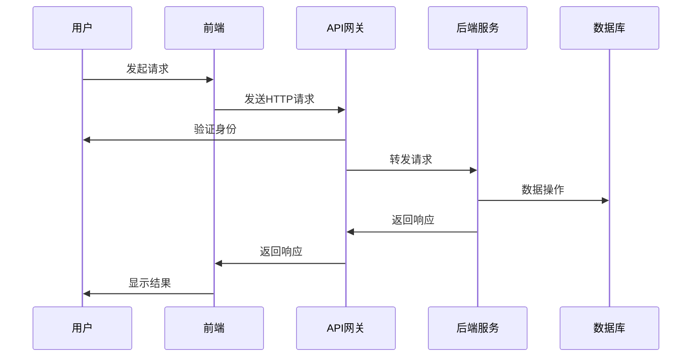

                 


### 第一部分：背景介绍

**1.1 问题背景**

在当今高度复杂和动态变化的技术环境中，技术团队和项目管理者面临着诸多挑战。随着项目规模和复杂度的增加，传统的项目管理方法越来越难以满足高效协作和准确决策的需求。技术管理者需要实时了解团队和项目的健康状况，以便快速响应变化，优化资源配置，提升团队效率和项目成功率。

**1.1.1 管理挑战与需求**

- **跨部门协作难度大**：随着项目的扩展，团队成员可能分布在不同的地理位置，沟通和协作变得复杂。
- **实时数据缺乏**：管理者往往难以获取实时、准确的团队和项目数据，导致决策滞后。
- **资源分配不合理**：由于信息不对称，资源分配往往不够科学，可能导致某些任务过载，而另一些任务资源闲置。
- **项目进度不可控**：项目进度难以跟踪，导致项目延期和质量问题。
- **质量监控困难**：技术管理者难以实时监控项目的质量指标，影响最终交付。

**1.1.2 项目与健康管理的现状**

当前的项目健康管理手段主要包括定期汇报、进度跟踪和质量检查等。然而，这些手段存在以下问题：

- **时效性差**：定期汇报往往无法反映项目当前的实际情况。
- **数据不全面**：跟踪工具往往只能提供部分信息，无法全面反映项目健康状况。
- **难以可视化**：现有工具难以将复杂的数据以直观的方式展现出来，影响管理者的判断和决策。

**1.1.3 技术管理仪表板的作用与价值**

技术管理仪表板是一种集成多种数据源、提供实时监控和可视化分析的综合性工具。其作用和价值主要体现在以下几个方面：

- **实时监控**：技术管理仪表板能够实时收集和处理团队和项目的各种数据，提供即时的健康状态监控。
- **数据整合**：将来自不同系统的数据进行整合，提供统一的全景视图。
- **可视化展示**：通过图表、仪表盘等形式，将复杂的数据以直观、易于理解的方式展示出来。
- **决策支持**：为管理者提供基于数据的决策支持，帮助其做出更加科学的决策。
- **协作促进**：通过仪表板，团队成员可以更清晰地了解项目的进展和自己的工作职责，促进跨部门协作。

**1.2 问题描述**

技术管理仪表板的设计和实现面临以下问题：

- **数据源多样化**：需要从不同的系统和工具中收集数据，实现数据的整合和同步。
- **数据质量保证**：收集的数据需要确保准确、完整和及时，以保证仪表板提供的信息真实可靠。
- **可视化设计**：如何选择合适的可视化工具和图表，以最直观的方式展示数据。
- **性能优化**：保证仪表板的高性能，确保在大量数据下依然能够快速响应。

**1.2.1 项目管理与团队协作的痛点**

- **信息孤岛**：不同团队和部门之间的信息沟通不畅，导致协作效率低下。
- **任务重叠**：任务分配不明确，导致资源浪费和效率降低。
- **沟通成本高**：频繁的会议和邮件沟通增加了管理成本，且效果有限。
- **决策滞后**：管理者缺乏实时数据支持，决策过程往往滞后。

**1.2.2 健康管理信息的缺乏**

- **健康指标不明确**：缺乏统一的健康指标体系，难以全面评估团队和项目的健康状况。
- **数据来源单一**：大多数健康管理信息仅来源于项目管理系统，缺乏其他系统的数据支持。
- **缺乏数据可视化**：现有工具无法将健康管理信息以可视化形式呈现，影响管理者的判断。

**1.2.3 需要一个可视化的解决方案**

一个高效的技术管理仪表板可以解决上述问题，通过实时监控、数据整合、可视化和决策支持等功能，帮助管理者更好地掌握团队和项目的健康状况，提高决策效率，促进团队协作。

**1.3 问题解决**

技术管理仪表板的设计和实现将遵循以下原则：

- **模块化设计**：将仪表板分为不同的模块，如数据收集、数据处理、可视化展示和决策支持等，确保系统的灵活性和可扩展性。
- **标准化数据格式**：采用统一的数据格式和协议，确保不同数据源的数据能够无缝整合。
- **高性能架构**：采用分布式架构和缓存技术，确保系统的高性能和可扩展性。
- **用户友好的界面**：设计直观、易于操作的用户界面，降低用户学习成本。

**1.3.1 技术管理仪表板的核心概念**

技术管理仪表板的核心概念包括：

- **数据驱动**：基于实时数据提供健康评估和决策支持。
- **可视化**：通过图表和仪表盘将复杂的数据以直观的形式展示。
- **智能化**：引入机器学习和人工智能技术，实现数据的自动分析和预测。
- **协作性**：支持团队成员的实时协作和沟通。

**1.3.2 技术管理仪表板的设计原则**

技术管理仪表板的设计原则包括：

- **用户体验优先**：确保用户界面直观易用，提供良好的用户体验。
- **数据真实可靠**：确保收集的数据真实、准确和及时。
- **扩展性**：设计可扩展的架构，支持未来功能扩展和系统集成。
- **可维护性**：采用模块化和标准化的设计，降低维护成本。

**1.3.3 技术管理仪表板的实现路径**

技术管理仪表板的实现路径包括以下步骤：

1. **需求分析**：与项目管理者沟通，明确仪表板的功能需求和性能指标。
2. **系统设计**：制定系统架构和模块设计，确保系统的可扩展性和性能。
3. **数据集成**：从不同的数据源收集数据，并实现数据的整合和同步。
4. **数据预处理**：对收集到的数据进行清洗、归一化等预处理操作，确保数据质量。
5. **可视化设计**：选择合适的可视化工具和图表，设计用户界面。
6. **系统实现**：编写代码，实现仪表板的功能和界面。
7. **测试与优化**：进行系统测试和性能优化，确保系统稳定可靠。
8. **部署与维护**：部署仪表板系统，并持续进行维护和更新。

**1.4 边界与外延**

**1.4.1 技术管理仪表板的适用范围**

技术管理仪表板适用于以下场景：

- **大型项目和团队**：能够提供实时监控和数据分析，帮助管理者更好地掌握项目健康状况。
- **跨部门协作**：促进不同团队和部门之间的信息沟通和协作。
- **复杂项目管理**：提供基于数据的决策支持，帮助管理者优化资源配置和进度管理。

**1.4.2 非适用场景说明**

技术管理仪表板不适用于以下场景：

- **小型项目或团队**：对于规模较小的项目和团队，手动管理可能更为高效。
- **独立系统管理**：对于不需要跨系统数据整合的系统，单独的系统管理工具可能更为合适。

**1.4.3 技术管理仪表板的演变与未来**

随着技术的发展，技术管理仪表板将不断演进。未来可能的发展方向包括：

- **智能化**：引入更多的机器学习和人工智能技术，实现更加智能的数据分析和预测。
- **移动化**：支持移动端访问，满足移动办公的需求。
- **云原生**：采用云原生架构，提高系统的弹性和可扩展性。
- **定制化**：提供更加灵活的定制化功能，满足不同用户的需求。

**1.5 概念结构与核心要素组成**

**1.5.1 关键术语解释**

- **技术管理仪表板**：一种集成多种数据源、提供实时监控和可视化分析的综合性工具。
- **数据源**：用于提供数据的系统或工具，如项目管理工具、代码库、测试工具等。
- **数据预处理**：对收集到的数据进行清洗、归一化等操作，确保数据质量。
- **可视化**：通过图表、仪表盘等形式，将复杂的数据以直观的形式展示。
- **健康评估**：对团队和项目的健康状况进行定量和定性评估。
- **决策支持**：基于数据分析，为管理者提供决策支持。

**1.5.2 技术管理仪表板的关键组件**

技术管理仪表板的关键组件包括：

- **数据收集模块**：负责从不同的数据源收集数据。
- **数据处理模块**：对收集到的数据进行预处理和整合。
- **可视化模块**：负责数据可视化，包括图表、仪表盘等。
- **决策支持模块**：基于数据分析，提供决策支持。
- **用户界面**：提供用户交互的接口，用户可以通过界面查看数据和操作功能。

**1.5.3 技术管理仪表板的工作流程**

技术管理仪表板的工作流程包括以下步骤：

1. **数据收集**：从不同的数据源收集数据。
2. **数据预处理**：对数据进行清洗、归一化等预处理操作。
3. **数据整合**：将预处理后的数据整合到一个统一的数据集中。
4. **数据可视化**：将整合后的数据通过图表和仪表盘等形式展示给用户。
5. **数据分析与评估**：对数据进行定量和定性分析，评估团队和项目的健康状况。
6. **决策支持**：基于数据分析结果，为管理者提供决策支持。
7. **用户交互**：用户可以通过用户界面查看数据和操作仪表板功能。

通过上述背景介绍，我们对技术管理仪表板的需求、问题和解决方案有了初步的了解。接下来，我们将进一步深入探讨技术管理仪表板的核心概念、实现原理和设计原则，为后续的详细讨论打下基础。## 1.6 背景介绍（续）

### **1.6.1 数据可视化的重要性**

数据可视化是一种通过图形、图表和交互式界面展示数据的技术，它不仅能够帮助人们直观地理解数据，还能够揭示数据之间的复杂关系。在技术管理领域，数据可视化具有以下几个重要作用：

1. **信息传递效率高**：通过图表和图形，管理者可以迅速获取关键信息，而不需要阅读大量的文本。
2. **决策支持**：数据可视化可以帮助管理者识别趋势、发现异常，从而做出更加科学的决策。
3. **团队协作**：通过共享可视化的数据，团队成员可以更好地理解项目进展和各自的职责，促进协作。
4. **知识普及**：即使是非技术人员，也能通过数据可视化理解复杂的数据和概念，提高整体的技术素养。

### **1.6.2 技术管理仪表板的优势**

技术管理仪表板相较于传统的管理工具，具有以下优势：

1. **实时性**：仪表板能够实时更新数据，提供最新的项目状态和团队健康状况。
2. **整合性**：仪表板可以将来自不同系统的数据进行整合，提供全局的视角。
3. **自动化**：通过机器学习和人工智能技术，仪表板可以自动化地进行数据分析和预测，减少人工工作量。
4. **可定制化**：用户可以根据自己的需求，自定义仪表板的功能和界面，满足个性化的管理需求。
5. **高效性**：仪表板提供直观的数据展示，减少了信息处理的复杂性，提高了管理效率。

### **1.6.3 技术管理仪表板的应用案例**

技术管理仪表板在不同类型的项目和团队中都有广泛应用，以下是一些典型的应用案例：

1. **软件开发团队**：用于监控代码提交频率、测试覆盖率、Bug修复速度等指标。
2. **运维团队**：用于监控服务器性能、网络流量、系统稳定性等指标。
3. **产品团队**：用于监控产品迭代周期、用户反馈、市场份额等指标。
4. **市场团队**：用于监控广告投放效果、用户转化率、市场活动反馈等指标。

### **1.6.4 技术管理仪表板的优势与局限性**

**优势**：

- **实时监控与数据分析**：技术管理仪表板能够实时收集和分析项目数据，提供即时的决策支持。
- **跨部门协作**：仪表板的数据可视化功能有助于跨部门之间的沟通和协作。
- **数据整合**：仪表板可以整合来自多个数据源的信息，提供全面的视图。
- **个性化定制**：用户可以根据自身需求自定义仪表板，提高管理效率。

**局限性**：

- **数据源依赖**：仪表板的功能依赖于数据源的准确性和完整性。
- **学习成本**：用户需要一定时间学习如何使用和管理仪表板。
- **实施成本**：设计和部署技术管理仪表板可能需要一定的资金投入和技术支持。

通过上述背景介绍，我们对技术管理仪表板的重要性、优势和应用有了更深入的理解。接下来，我们将详细探讨技术管理仪表板的实现细节、算法原理和系统架构，以帮助读者更好地理解和应用这一技术。## 第二部分：核心概念与联系

### **2.1 技术管理仪表板原理**

技术管理仪表板是一种集成多种数据源、提供实时监控和可视化分析的综合性工具。其核心原理可以概括为以下几点：

1. **数据收集**：技术管理仪表板通过接口或其他方式从各种数据源（如项目管理工具、代码库、测试工具等）收集数据。
2. **数据预处理**：收集到的数据通常需要进行清洗、归一化等预处理操作，以确保数据的质量和一致性。
3. **数据整合**：将预处理后的数据整合到一个统一的数据集中，以便后续的分析和展示。
4. **数据可视化**：利用图表、仪表盘等形式，将整合后的数据以直观的形式展示给用户，帮助用户理解数据和发现趋势。
5. **数据分析与评估**：通过统计分析和机器学习等技术，对数据进行分析和评估，为管理者提供决策支持。
6. **用户交互**：提供用户友好的界面，用户可以通过界面查看数据、操作仪表板功能，并与系统进行交互。

**2.1.1 技术管理仪表板的属性特征对比**

以下是技术管理仪表板的几个关键属性特征：

- **实时性**：仪表板能够实时更新数据，提供即时的项目状态和团队健康状况。
- **整合性**：仪表板能够整合来自多个数据源的信息，提供全面的视图。
- **自动化**：通过机器学习和人工智能技术，仪表板可以实现数据的自动分析和预测。
- **可定制化**：用户可以根据自己的需求，自定义仪表板的功能和界面。
- **可视化**：仪表板通过图表和仪表盘等形式，将复杂的数据以直观的形式展示。
- **协作性**：仪表板支持团队成员的实时协作和沟通。

**2.1.2 技术管理仪表板与其他管理工具的区别**

技术管理仪表板与其他管理工具如项目管理软件、代码库、测试工具等有明显的区别：

- **项目管理软件**：主要用于项目计划、任务分配和进度跟踪。而技术管理仪表板则更侧重于实时监控和数据分析，提供更全面的健康评估和决策支持。
- **代码库**：主要用于代码存储和版本控制。技术管理仪表板虽然可以从代码库中获取数据，但它的核心功能是监控和评估，而非代码管理。
- **测试工具**：主要用于测试代码质量和功能。技术管理仪表板可以从测试工具中获取测试数据，但它的作用更广泛，包括对整个项目健康状况的评估。

**2.2 团队和项目健康状况指标**

为了全面评估团队和项目的健康状况，技术管理仪表板需要定义一系列健康指标。这些指标可以从多个维度进行衡量，包括但不限于：

- **任务进度**：衡量任务的完成情况和进度。
- **代码质量**：衡量代码的复杂度、重复率和测试覆盖率。
- **测试通过率**：衡量测试的通过率，反映项目的稳定性。
- **团队协作**：衡量团队成员之间的沟通和协作效率。
- **资源利用率**：衡量资源的分配和使用情况，如开发时间、人力、设备等。
- **用户满意度**：衡量用户对产品和服务的满意度。

**2.2.1 常见健康指标定义**

以下是一些常见的健康指标及其定义：

- **任务进度率**：完成任务的百分比，反映任务的完成情况。
- **代码复杂度**：衡量代码的复杂程度，越高越难维护。
- **测试覆盖率**：实际测试用例数与总测试用例数的比值，反映代码的测试完整性。
- **Bug密度**：单位代码行数中的Bug数量，反映代码的质量。
- **任务延迟率**：任务实际完成时间与计划完成时间的差值占计划完成时间的百分比，反映任务的及时性。
- **用户反馈响应时间**：从用户反馈到团队响应的时间，反映团队的响应效率。

**2.2.2 健康指标的属性特征对比**

以下是一个对比表格，展示了几个常见健康指标的属性特征：

| 指标名称 | 描述 | 指标属性特征 |
| --- | --- | --- |
| 任务进度率 | 完成任务的百分比 | 定量、动态 |
| 代码复杂度 | 代码的复杂程度 | 定量、静态 |
| 测试覆盖率 | 实际测试用例数与总测试用例数的比值 | 定量、动态 |
| Bug密度 | 单位代码行数中的Bug数量 | 定量、静态 |
| 任务延迟率 | 任务实际完成时间与计划完成时间的差值占计划完成时间的百分比 | 定量、动态 |
| 用户反馈响应时间 | 从用户反馈到团队响应的时间 | 定量、动态 |

**2.2.3 健康指标的度量方法**

健康指标的度量方法通常包括以下几种：

1. **定量度量**：使用具体的数值来表示健康指标，如任务进度率、代码复杂度等。
2. **定性度量**：使用文字描述来表示健康指标，如任务延迟率、用户反馈响应时间等。
3. **组合度量**：将定量和定性度量结合起来，提供更全面的健康评估。

**2.3 技术管理仪表板与团队协作的关系**

技术管理仪表板不仅提供实时监控和数据分析，还通过以下方式促进团队协作：

- **实时沟通**：仪表板支持团队成员之间的实时沟通，通过消息通知、评论等功能，提高团队协作效率。
- **任务分配**：仪表板可以展示团队成员的任务分配情况，帮助管理者合理分配任务，提高资源利用率。
- **进度跟踪**：仪表板提供任务进度的实时更新，帮助团队成员了解项目进展，及时调整工作计划。
- **数据共享**：仪表板可以共享关键数据，帮助团队成员更好地理解项目状况和各自的工作职责。

**2.3.1 技术管理仪表板如何促进团队协作**

技术管理仪表板通过以下方式促进团队协作：

1. **任务透明化**：仪表板展示任务的分配和进度，提高任务透明度，减少信息孤岛。
2. **实时通知**：仪表板可以发送实时通知，提醒团队成员关注关键任务和项目进展。
3. **沟通渠道**：仪表板提供沟通渠道，如聊天室、讨论区等，促进团队成员之间的交流。
4. **资源管理**：仪表板可以监控资源使用情况，帮助管理者优化资源分配。

**2.3.2 技术管理仪表板在团队沟通中的作用**

技术管理仪表板在团队沟通中的作用包括：

- **信息传递**：通过仪表板，团队成员可以快速获取项目信息，减少信息传递过程中的延迟和误差。
- **决策支持**：基于仪表板提供的数据，团队成员可以更好地理解项目状况，做出更科学的决策。
- **协作协调**：仪表板支持团队成员之间的协作和协调，减少沟通成本，提高工作效率。

**2.3.3 技术管理仪表板如何提高团队效率**

技术管理仪表板通过以下方式提高团队效率：

1. **实时监控**：仪表板提供实时监控功能，帮助团队成员及时发现并解决问题。
2. **数据驱动**：基于数据的分析，团队可以更科学地安排工作计划和资源分配。
3. **决策支持**：仪表板提供的实时数据和分析结果，帮助管理者做出更加科学的决策，减少不必要的会议和沟通。
4. **自动化**：通过自动化工具，如脚本和CI/CD流程，减少手动工作，提高工作效率。

通过第二部分的讨论，我们对技术管理仪表板的核心概念、原理和与团队协作的关系有了更深入的理解。接下来，我们将详细探讨技术管理仪表板的算法原理，包括数据预处理、健康评估和可视化算法，帮助读者全面掌握这一技术。## 第三部分：算法原理讲解

### **3.1 数据预处理算法**

数据预处理是技术管理仪表板的核心环节之一，其目的是确保数据的质量和一致性，为后续的数据分析和可视化提供可靠的基础。数据预处理通常包括以下步骤：

**3.1.1 数据清洗**

数据清洗是指识别和纠正数据集中的错误、异常和不一致的数据。具体方法包括：

- **缺失值处理**：对于缺失的数据，可以选择填充平均值、中位数或使用模型预测值等方法进行补充。
- **异常值检测**：通过统计学方法或机器学习算法，识别并处理异常值，如离群点、重复记录等。
- **数据转换**：将数据转换为适合分析的形式，如将分类数据编码为数值，标准化数值数据等。

**3.1.2 数据归一化**

数据归一化是将不同尺度的数据进行处理，使其处于同一量级，从而避免某些特征对模型的影响过大。常用的方法包括：

- **最小-最大归一化**：将数据缩放到[0,1]范围内。
- **标准化**：将数据缩放到标准正态分布，均值为0，标准差为1。
- **小数点移动**：通过调整小数点的位置，使不同尺度的数据具有相似的尺度。

**3.1.3 数据整合**

数据整合是指将来自不同数据源的数据进行合并和统一，形成统一的数据集。具体方法包括：

- **数据融合**：将相同数据类型的数据合并到一个表中。
- **数据合并**：使用SQL或其他数据库操作，将不同数据表合并为一个完整的表。
- **数据聚合**：对多源数据进行聚合操作，如求和、平均值等，以形成更全面的视图。

### **3.2 健康评估算法**

健康评估算法用于对团队和项目的健康状况进行定量和定性评估。这些算法基于收集到的数据和预定的指标，通过计算和统计方法得出评估结果。健康评估算法通常包括以下步骤：

**3.2.1 基本原理**

健康评估算法的基本原理是：

- **指标计算**：根据预定的健康指标，对数据进行计算，得出各项指标的数值。
- **指标分析**：对计算出的指标进行分析，判断各项指标是否达到预定的健康标准。
- **综合评估**：将各项指标的结果进行综合，得出团队或项目的健康评估结果。

**3.2.2 数学模型**

健康评估算法的数学模型通常包括以下几个部分：

- **指标定义**：定义各项健康指标的计算公式。
- **权重分配**：根据各项指标的重要性，分配不同的权重。
- **评估函数**：定义综合评估函数，用于计算团队或项目的健康评分。

**3.2.3 应用举例**

以任务进度率为例，健康评估算法可以计算如下：

$$
\text{任务进度率} = \frac{\text{已完成任务数}}{\text{总任务数}} \times 100\%
$$

如果任务进度率低于80%，则认为项目进度存在问题，需要进一步分析原因并采取措施。

### **3.3 可视化算法**

可视化算法用于将数据以图形和图表的形式展示，帮助用户直观地理解和分析数据。可视化算法的关键在于选择合适的图表类型和布局，以及优化图表的可读性。

**3.3.1 基本原理**

可视化算法的基本原理是：

- **数据转换**：将数据转换为图表所需的格式。
- **图表选择**：根据数据的类型和特征，选择合适的图表类型，如柱状图、折线图、饼图等。
- **布局优化**：优化图表的布局，提高图表的可读性和美观性。

**3.3.2 常用的可视化技术**

常用的可视化技术包括：

- **柱状图**：用于比较不同类别的数据大小。
- **折线图**：用于展示数据的变化趋势。
- **饼图**：用于展示各部分占整体的比例。
- **散点图**：用于展示数据之间的相关性。
- **热力图**：用于展示数据在二维空间中的分布情况。

**3.3.3 可视化算法的实践应用**

以任务进度率为例，可视化算法可以创建以下图表：

1. **柱状图**：展示不同任务的进度情况，直观比较任务的完成情况。
2. **折线图**：展示任务进度的变化趋势，帮助用户了解项目进展的动态。
3. **饼图**：展示任务进度在整体项目中的占比，帮助用户理解任务的优先级。

通过第三部分的讨论，我们对技术管理仪表板中的数据预处理、健康评估和可视化算法有了全面了解。这些算法是技术管理仪表板的核心组成部分，为数据分析和决策支持提供了强有力的支持。### **4.1 数学公式与模型介绍**

在技术管理仪表板中，数学公式和模型扮演着至关重要的角色。它们不仅帮助我们对数据进行量化分析，还为健康评估和决策支持提供了科学依据。以下将介绍一些常用的数学公式和模型，并解释其含义和应用场景。

**4.1.1 常用数学公式**

1. **任务进度率**
$$
\text{任务进度率} = \frac{\text{已完成任务数}}{\text{总任务数}} \times 100\%
$$
这个公式用于衡量任务的完成情况，通过计算已完成的任务数占总任务数的比例，得到一个百分比值。

2. **代码复杂度**
$$
\text{代码复杂度} = \frac{\text{总代码行数}}{\text{平均代码行数}}
$$
这个公式用于衡量代码的复杂度，通过计算总代码行数与平均代码行数的比值，得到一个复杂度值。

3. **测试覆盖率**
$$
\text{测试覆盖率} = \frac{\text{实际测试用例数}}{\text{总测试用例数}} \times 100\%
$$
这个公式用于衡量测试的完整性，通过计算实际测试用例数占总测试用例数的比例，得到一个覆盖率值。

4. **Bug密度**
$$
\text{Bug密度} = \frac{\text{Bug数量}}{\text{代码行数}}
$$
这个公式用于衡量代码的质量，通过计算Bug数量与代码行数的比值，得到一个Bug密度值。

5. **任务延迟率**
$$
\text{任务延迟率} = \frac{\text{实际完成时间} - \text{计划完成时间}}{\text{计划完成时间}} \times 100\%
$$
这个公式用于衡量任务的延迟情况，通过计算实际完成时间与计划完成时间的差值与计划完成时间的比值，得到一个延迟率值。

**4.1.2 模型公式与解释**

1. **线性回归模型**
$$
y = ax + b
$$
这个模型用于预测因变量y关于自变量x的线性关系。a是斜率，表示x每增加一个单位，y增加的数量；b是截距，表示当x为0时，y的值。

2. **决策树模型**
$$
\text{决策树} = \text{根节点} \rightarrow \text{分支节点} \rightarrow \text{叶节点}
$$
这个模型通过一系列判断条件（分支节点）将数据集分割为不同的区域（叶节点），以实现对数据的分类或回归。

3. **支持向量机（SVM）模型**
$$
\text{分类函数} = \text{sgn}(\omega \cdot x + b)
$$
其中，$\omega$ 是权重向量，$x$ 是输入特征向量，$b$ 是偏置项。SVM模型用于分类问题，通过寻找最佳的超平面，将不同类别的数据点分开。

4. **神经网络模型**
$$
a_{i}^{(L)} = \sigma \left( \sum_{j=1}^{n} w_{ji}^{(L)} a_{j}^{(L-1)} + b_{i}^{(L)} \right)
$$
其中，$a_{i}^{(L)}$ 是第L层的第i个神经元的激活值，$\sigma$ 是激活函数，$w_{ji}^{(L)}$ 是从第L-1层的第j个神经元到第L层的第i个神经元的权重，$b_{i}^{(L)}$ 是第L层的第i个神经元的偏置。

**4.1.3 应用场景**

- **线性回归模型**：常用于预测任务进度、用户行为等。
- **决策树模型**：适用于数据分类和回归问题，如Bug预测、用户流失预测等。
- **支持向量机（SVM）模型**：适用于高维空间中的分类问题，如文本分类、图像识别等。
- **神经网络模型**：广泛应用于各种复杂的预测和分类问题，如语音识别、图像识别等。

通过这些数学公式和模型，技术管理仪表板能够对团队和项目的健康状况进行量化分析和预测，为管理者提供科学的决策支持。### **4.2 数学公式的详细讲解**

在技术管理仪表板中，数学公式和模型是核心组成部分，用于分析和解释团队和项目的健康状况。为了更好地理解这些公式和模型，我们将逐一进行详细讲解。

**4.2.1 公式推导**

**1. 任务进度率**

任务进度率的公式为：
$$
\text{任务进度率} = \frac{\text{已完成任务数}}{\text{总任务数}} \times 100\%
$$
该公式通过将已完成任务数除以总任务数，得到一个0到1之间的比例，再乘以100转换为百分比值，用于表示任务完成的程度。

**2. 代码复杂度**

代码复杂度的公式为：
$$
\text{代码复杂度} = \frac{\text{总代码行数}}{\text{平均代码行数}}
$$
代码复杂度是通过计算总代码行数与平均代码行数的比值来衡量的，这个值越大，表示代码的复杂度越高，越难以维护。

**3. 测试覆盖率**

测试覆盖率的公式为：
$$
\text{测试覆盖率} = \frac{\text{实际测试用例数}}{\text{总测试用例数}} \times 100\%
$$
测试覆盖率是实际测试用例数与总测试用例数的比例，用于衡量测试的完整性，一个理想的测试覆盖率应接近100%。

**4. Bug密度**

Bug密度的公式为：
$$
\text{Bug密度} = \frac{\text{Bug数量}}{\text{代码行数}}
$$
Bug密度是通过计算Bug数量与代码行数的比值来衡量的，这个值越大，表示代码中存在更多的Bug，代码质量越差。

**5. 任务延迟率**

任务延迟率的公式为：
$$
\text{任务延迟率} = \frac{\text{实际完成时间} - \text{计划完成时间}}{\text{计划完成时间}} \times 100\%
$$
任务延迟率是实际完成时间与计划完成时间的差值与计划完成时间的比例，用于衡量任务的延迟程度。

**4.2.2 公式应用场景**

**1. 线性回归模型**

线性回归模型的公式为：
$$
y = ax + b
$$
该模型用于预测任务进度、用户行为等。在实际应用中，可以通过收集历史数据，使用线性回归模型拟合数据，预测未来的任务完成情况或用户行为。

**2. 决策树模型**

决策树模型的公式为：
$$
\text{决策树} = \text{根节点} \rightarrow \text{分支节点} \rightarrow \text{叶节点}
$$
决策树模型适用于数据分类和回归问题。例如，在技术管理仪表板中，可以使用决策树模型预测Bug出现的可能性，通过分析历史数据中的特征变量，构建决策树模型。

**3. 支持向量机（SVM）模型**

SVM模型的分类函数为：
$$
\text{分类函数} = \text{sgn}(\omega \cdot x + b)
$$
SVM模型适用于高维空间中的分类问题。例如，在项目健康管理中，可以使用SVM模型对项目进行分类，根据项目的特征变量，将其分为健康和异常两类。

**4. 神经网络模型**

神经网络模型的激活函数为：
$$
a_{i}^{(L)} = \sigma \left( \sum_{j=1}^{n} w_{ji}^{(L)} a_{j}^{(L-1)} + b_{i}^{(L)} \right)
$$
神经网络模型广泛应用于各种复杂的预测和分类问题。例如，在技术管理仪表板中，可以使用神经网络模型预测项目的健康状态，通过训练模型，使其能够根据历史数据预测未来的项目健康状况。

通过详细讲解这些数学公式和模型，我们能够更好地理解其在技术管理仪表板中的应用，为团队和项目的健康管理提供科学依据。### **4.3 数学模型的应用**

数学模型在技术管理仪表板中发挥着至关重要的作用，它们不仅帮助我们对复杂的数据进行量化分析，还为团队和项目的健康管理提供了坚实的理论基础。本节将详细阐述数学模型在技术管理仪表板中的应用，包括模型的建立、优化和评估。

**4.3.1 模型建立**

建立数学模型的第一步是明确建模的目标和问题。在技术管理仪表板中，常见的建模目标包括预测项目进度、评估代码质量、预测Bug出现概率等。以下是几个典型的模型建立过程：

1. **预测项目进度模型**：

   假设我们要建立一个预测项目进度的模型，可以使用时间序列分析的方法。首先，我们需要收集历史项目进度数据，包括任务开始时间、结束时间和实际完成时间。然后，使用时间序列分析方法，如移动平均法、指数平滑法等，建立预测模型。具体步骤如下：

   - **数据预处理**：对收集到的数据进行清洗，去除异常值和缺失值。
   - **特征提取**：提取与项目进度相关的特征，如任务复杂度、任务依赖关系等。
   - **模型选择**：根据数据的特性选择合适的预测模型，如ARIMA模型、LSTM模型等。
   - **模型训练**：使用历史数据对模型进行训练，优化模型参数。
   - **模型评估**：使用验证集评估模型的预测性能，调整模型参数，直到达到满意的预测效果。

2. **评估代码质量模型**：

   为了评估代码质量，我们可以使用代码复杂度和测试覆盖率作为指标。首先，我们需要收集代码行数、Bug数量和测试用例数等数据。然后，使用回归分析方法建立代码质量评估模型。具体步骤如下：

   - **数据收集**：从代码库和测试工具中获取相关数据。
   - **数据预处理**：对数据进行分析，去除异常值和缺失值。
   - **特征选择**：选择与代码质量相关的特征，如代码行数、Bug数量、测试覆盖率等。
   - **模型训练**：使用回归分析方法，如线性回归、决策树等，建立代码质量评估模型。
   - **模型优化**：通过交叉验证和模型选择方法，优化模型参数，提高模型精度。

**4.3.2 模型优化**

建立模型后，我们还需要不断优化模型，以提高其预测精度和泛化能力。以下是几种常见的模型优化方法：

1. **交叉验证**：

   交叉验证是一种常用的模型评估方法，通过将数据集划分为训练集和验证集，多次训练和验证模型，以评估模型的整体性能。具体步骤如下：

   - **数据划分**：将数据集随机划分为训练集和验证集。
   - **多次训练**：使用训练集训练模型，并使用验证集评估模型性能。
   - **参数调整**：根据验证集的性能，调整模型参数，如正则化参数、学习率等。
   - **重复训练**：重复上述步骤，直到找到最优的模型参数。

2. **模型集成**：

   模型集成是一种通过结合多个模型的预测结果，提高预测性能的方法。常见的模型集成方法包括Bagging、Boosting和Stacking等。具体步骤如下：

   - **选择基础模型**：选择多个基础模型，如决策树、支持向量机等。
   - **训练基础模型**：使用训练集分别训练每个基础模型。
   - **集成预测**：将每个基础模型的预测结果进行组合，得到最终的预测结果。
   - **优化集成策略**：通过调整集成策略，如权重分配、投票规则等，提高集成模型的预测性能。

**4.3.3 模型评估**

模型评估是确保模型性能符合预期的重要步骤。以下是几种常见的模型评估方法：

1. **准确性**：

   准确性是最常用的评估指标之一，表示模型预测正确的样本数与总样本数的比例。具体公式为：
   $$
   \text{准确性} = \frac{\text{预测正确的样本数}}{\text{总样本数}} \times 100\%
   $$
   准确性越高，表示模型预测的准确性越好。

2. **召回率**：

   召回率表示模型预测为正类的实际正类样本数与所有实际正类样本数的比例。具体公式为：
   $$
   \text{召回率} = \frac{\text{预测为正类的实际正类样本数}}{\text{所有实际正类样本数}} \times 100\%
   $$
   召回率越高，表示模型对正类样本的识别能力越强。

3. **F1值**：

   F1值是准确率和召回率的调和平均值，用于综合评估模型的性能。具体公式为：
   $$
   \text{F1值} = 2 \times \frac{\text{准确率} \times \text{召回率}}{\text{准确率} + \text{召回率}}
   $$
   F1值越高，表示模型的综合性能越好。

通过详细讲解数学模型的应用，我们能够更好地理解其在技术管理仪表板中的重要作用。建立、优化和评估数学模型，有助于我们更准确地预测团队和项目的健康状况，为管理者提供科学的决策支持。### **5.1 问题场景介绍**

在探讨技术管理仪表板的系统分析与架构设计之前，我们需要首先了解一个具体的问题场景，这样才能更有针对性地设计和实现技术管理仪表板。以下是一个典型的问题场景：

**问题场景：** 
某大型互联网公司正在开发一个复杂的软件项目，该项目涉及多个团队，包括前端开发、后端开发、测试和运维团队。由于项目规模庞大、任务繁多，团队之间的协作和沟通变得非常复杂。管理层希望能够实时监控项目进展，评估各团队的绩效，及时发现和解决问题，以确保项目能够按时交付并保持高质量。

**具体问题：** 
1. **沟通不畅**：由于团队成员分布在不同的地点，导致信息传递延迟，沟通成本高。
2. **数据分散**：各个团队使用不同的工具和系统进行任务管理和进度跟踪，导致数据不统一，难以整合和分析。
3. **进度不可控**：无法实时掌握各任务的实际进度，容易导致项目延期。
4. **质量监控困难**：无法全面监控代码质量、测试覆盖率等关键指标，影响项目交付质量。

**需求分析：**
为了解决上述问题，管理层提出以下需求：

1. **实时监控**：需要实时收集各团队的工作数据，包括任务进度、代码提交、测试结果等，以便管理层随时了解项目进展。
2. **数据整合**：需要将来自不同系统的数据整合到一个统一平台上，提供全局视图，减少信息孤岛。
3. **可视化展示**：需要将整合后的数据通过可视化仪表盘展示，使管理层能够快速发现异常和趋势。
4. **决策支持**：需要基于数据分析结果，为管理层提供科学的决策支持，帮助其优化资源配置和调整项目计划。
5. **协作促进**：需要提供协作工具，如消息通知、任务分配、反馈系统等，促进团队成员之间的沟通和协作。

**系统需求分析：**
在上述需求的基础上，我们对技术管理仪表板进行了系统需求分析，主要包括以下方面：

1. **功能需求**：
   - 实时数据收集：从各团队的工作系统中收集任务进度、代码提交、测试结果等数据。
   - 数据整合：将收集到的数据进行清洗、归一化处理，整合到一个统一的数据集中。
   - 数据可视化：设计并实现数据可视化界面，以图表和仪表盘的形式展示关键数据。
   - 健康评估：根据预设的健康指标，对团队和项目进行实时健康评估。
   - 决策支持：提供基于数据的分析报告，为管理层提供决策支持。

2. **性能需求**：
   - 数据处理效率：确保能够快速处理大量数据，提供实时监控。
   - 系统稳定性：确保系统在大量并发访问下稳定运行，不发生崩溃。
   - 可扩展性：设计可扩展的架构，支持未来功能扩展和系统升级。

3. **安全需求**：
   - 数据安全：确保数据在传输和存储过程中的安全性，防止数据泄露和篡改。
   - 用户权限：实现用户权限管理，确保不同角色用户只能访问授权的数据和功能。

通过上述问题场景和需求分析，我们为技术管理仪表板的设计和实现奠定了基础。接下来，我们将进一步探讨技术管理仪表板的系统架构设计，包括系统功能模块、架构设计和接口设计等内容。### **5.2 项目介绍**

在详细探讨技术管理仪表板的设计和实现之前，我们需要对项目的背景和目标进行介绍。以下是一个关于技术管理仪表板项目的基本介绍。

**项目背景：**

随着公司业务的快速发展，项目规模和复杂性不断增加，传统的项目管理手段已经无法满足高效协作和准确决策的需求。为了提高项目管理的效率和效果，公司决定开发一个集数据收集、整合、可视化和决策支持于一体的技术管理仪表板系统。

**项目目标：**

该项目的目标主要包括以下几个方面：

1. **实时监控**：通过技术管理仪表板，实现对项目进度、资源使用、质量指标等关键数据的实时监控，提高管理的时效性和准确性。
2. **数据整合**：将来自不同系统和工具的数据进行整合，提供统一的全景视图，减少信息孤岛，提高数据利用率。
3. **可视化展示**：通过图表和仪表盘等形式，将复杂的数据以直观、易懂的方式展示，帮助管理者快速掌握项目状况。
4. **决策支持**：基于数据分析结果，为管理者提供科学的决策支持，优化资源配置和项目计划，提高项目成功率。
5. **促进协作**：提供协作工具和沟通渠道，促进团队成员之间的沟通和协作，提高工作效率。

**项目范围：**

技术管理仪表板项目范围包括以下部分：

- **数据收集**：从项目管理工具、代码库、测试工具、运维系统等收集项目相关的数据。
- **数据处理**：对收集到的数据进行清洗、归一化等预处理操作，确保数据的质量和一致性。
- **数据整合**：将来自不同系统的数据进行整合，构建统一的数据模型。
- **数据可视化**：设计并实现数据可视化界面，包括图表和仪表盘等。
- **健康评估**：基于预设的健康指标，对项目进行实时健康评估，并提供评估报告。
- **决策支持**：提供基于数据的分析报告，为管理者提供决策支持。
- **用户管理**：实现用户权限管理，确保数据安全和用户权限的合理分配。

**项目计划：**

项目计划分为以下几个阶段：

1. **需求分析**：与各团队沟通，明确技术管理仪表板的功能需求和性能指标。
2. **系统设计**：制定系统架构和模块设计，确保系统的可扩展性和性能。
3. **数据集成**：从不同的数据源收集数据，并实现数据的整合和同步。
4. **数据处理**：对数据进行清洗、归一化等预处理操作，确保数据质量。
5. **可视化设计**：选择合适的可视化工具和图表，设计用户界面。
6. **系统实现**：编写代码，实现仪表板的功能和界面。
7. **测试与优化**：进行系统测试和性能优化，确保系统稳定可靠。
8. **部署与维护**：部署仪表板系统，并持续进行维护和更新。

通过上述项目介绍，我们对技术管理仪表板项目的背景、目标和计划有了初步了解。接下来，我们将进一步探讨技术管理仪表板的系统功能设计、架构设计和接口设计等内容。### **5.3 系统功能设计**

技术管理仪表板的核心功能在于提供实时监控、数据整合、可视化和决策支持，以下详细描述系统功能设计，包括领域模型和功能模块。

**5.3.1 领域模型**

领域模型是系统功能设计的蓝图，它定义了系统的核心实体和它们之间的关系。以下是技术管理仪表板的关键领域模型：

- **实体**：
  - **用户**：代表仪表板的用户，包括管理员、项目经理、开发人员等。
  - **项目**：代表需要监控的软件项目，包括项目名称、描述、开始时间和结束时间等。
  - **任务**：代表项目中的具体工作项，包括任务名称、描述、优先级、开始时间、预计完成时间等。
  - **代码提交**：代表开发人员的代码提交，包括提交者、提交时间、提交文件等。
  - **测试结果**：代表项目的测试结果，包括测试用例名称、通过率、Bug数量等。
  - **健康指标**：代表用于评估项目健康状况的指标，包括任务进度率、代码复杂度、测试覆盖率等。

- **关系**：
  - **用户-项目**：用户与项目之间存在多对多关系，即一个用户可以参与多个项目，一个项目可以由多个用户管理。
  - **项目-任务**：项目包含多个任务，任务属于特定项目。
  - **任务-代码提交**：任务可以包含多个代码提交记录，代码提交与任务相关联。
  - **任务-测试结果**：任务可以包含多个测试结果记录，测试结果与任务相关联。
  - **项目-健康指标**：项目根据多个健康指标进行评估，健康指标与项目相关联。

**5.3.2 功能模块**

技术管理仪表板的功能模块是系统功能设计的具体实现，以下是详细的功能模块：

1. **数据收集模块**：
   - 功能描述：从各个团队的工作系统中（如Jira、Git、Jenkins等）收集项目进度、代码提交、测试结果等数据。
   - 实现细节：使用API接口或数据库连接方式，定期或实时获取数据，并进行初步的数据清洗。

2. **数据处理模块**：
   - 功能描述：对收集到的数据（如代码行数、Bug数量、任务进度等）进行清洗、归一化处理，确保数据的质量和一致性。
   - 实现细节：包括数据去重、缺失值处理、异常值检测、归一化等，使用数据清洗库（如Pandas）实现。

3. **数据整合模块**：
   - 功能描述：将来自不同系统的数据进行整合，构建统一的数据模型，为后续分析和可视化提供数据支持。
   - 实现细节：使用数据库管理系统（如MySQL、PostgreSQL）存储整合后的数据，并设计合理的数据库结构。

4. **可视化模块**：
   - 功能描述：设计并实现数据可视化界面，通过图表、仪表盘等形式，将复杂的数据以直观、易懂的方式展示。
   - 实现细节：使用可视化库（如D3.js、ECharts）和前端框架（如React、Vue.js）实现可视化界面。

5. **健康评估模块**：
   - 功能描述：基于预设的健康指标，对项目进行实时健康评估，提供项目健康状况的实时监控和预警。
   - 实现细节：使用统计分析和机器学习算法，计算和评估各项健康指标，并提供可视化展示。

6. **决策支持模块**：
   - 功能描述：基于数据分析结果，为管理层提供决策支持，优化资源配置和项目计划。
   - 实现细节：提供分析报告、预测结果、优化建议等，帮助管理者做出科学决策。

7. **用户管理模块**：
   - 功能描述：实现用户权限管理，确保不同角色用户只能访问授权的数据和功能。
   - 实现细节：包括用户注册、登录、权限分配、访问控制等，使用身份验证和授权机制（如OAuth、JWT）。

通过详细描述系统功能设计，包括领域模型和功能模块，技术管理仪表板能够实现实时监控、数据整合、可视化和决策支持的核心功能，为团队和项目管理提供强有力的支持。### **5.4 系统架构设计**

系统架构设计是技术管理仪表板实现过程中的关键环节，它决定了系统的性能、可扩展性和维护性。以下将详细阐述技术管理仪表板的系统架构设计，包括系统架构概述、技术选型和架构设计。

**5.4.1 系统架构概述**

技术管理仪表板的系统架构采用分层设计，主要分为以下几层：

1. **数据层**：负责数据存储和管理，包括数据库管理系统（如MySQL、PostgreSQL）和NoSQL数据库（如MongoDB）。
2. **服务层**：负责业务逻辑处理和数据整合，包括Web服务器、应用服务器和中间件。
3. **接口层**：负责与外部系统（如Jira、Git、Jenkins等）进行数据交换，提供API接口。
4. **表现层**：负责用户界面的展示，包括前端框架（如React、Vue.js）和可视化库（如D3.js、ECharts）。
5. **基础设施层**：包括服务器、网络和存储等基础设施，提供计算资源、数据存储和安全保障。

**5.4.2 技术选型**

在技术选型方面，我们考虑以下因素：

- **可扩展性**：系统需要能够处理大量数据，支持高并发访问，因此选择分布式架构和云原生技术。
- **性能**：系统需要快速响应用户请求，因此选择高性能数据库和缓存技术。
- **安全性**：系统需要保证数据的安全性和用户隐私，因此选择加密技术和身份验证机制。
- **维护性**：系统需要易于维护和升级，因此选择模块化设计和自动化部署。

基于上述考虑，我们选择了以下技术：

- **数据库管理系统**：MySQL和MongoDB，分别用于关系型数据和非关系型数据。
- **应用服务器**：使用Spring Boot框架，提供稳定、高效的业务逻辑处理。
- **Web服务器**：使用Nginx，提供高性能的HTTP请求处理和负载均衡。
- **缓存技术**：使用Redis，提供高速缓存，提高系统性能。
- **前端框架**：使用React.js和Vue.js，提供动态、响应式的前端界面。
- **可视化库**：使用D3.js和ECharts，提供丰富的可视化图表。
- **身份验证**：使用OAuth 2.0和JWT，提供安全的用户身份验证和授权。
- **云服务**：使用阿里云或腾讯云，提供弹性计算和存储资源。

**5.4.3 架构设计**

以下是技术管理仪表板的系统架构设计：

1. **数据层架构设计**：

   - **关系型数据库**：使用MySQL存储用户信息、项目信息和健康指标等数据，采用主从复制架构，提高数据可靠性和访问速度。
   - **非关系型数据库**：使用MongoDB存储实时数据、日志数据等，采用分片架构，提高数据存储和处理能力。

2. **服务层架构设计**：

   - **应用服务器**：使用Spring Boot框架构建微服务架构，将业务逻辑划分为多个模块，如用户管理、项目管理、数据整合等，便于维护和扩展。
   - **中间件**：使用消息队列（如RabbitMQ、Kafka）实现异步消息传递，提高系统的解耦性和可扩展性。

3. **接口层架构设计**：

   - **API网关**：使用Nginx作为API网关，实现路由、限流、认证等，提供统一的接口服务。
   - **服务注册与发现**：使用Eureka或Consul实现服务注册与发现，提高系统的可靠性和可扩展性。

4. **表现层架构设计**：

   - **前端框架**：使用React.js和Vue.js构建动态、响应式的用户界面，提供良好的用户体验。
   - **可视化库**：使用D3.js和ECharts实现数据可视化，提供直观的图表和仪表盘。

5. **基础设施层架构设计**：

   - **服务器**：使用虚拟化技术（如Docker、Kubernetes）部署应用和服务，提高资源利用率和运维效率。
   - **网络**：使用负载均衡器（如LVS、HAProxy）实现多服务器集群，提高系统的稳定性和可用性。
   - **存储**：使用分布式存储系统（如Ceph、GlusterFS）存储大量数据，提高数据存储和处理能力。

通过详细阐述系统架构设计，技术管理仪表板能够实现高效的数据处理、实时监控、可视化和决策支持，为团队和项目管理提供强大的支持。### **5.5 系统接口设计**

系统接口设计是技术管理仪表板实现过程中的关键环节之一，它定义了系统与外部系统、用户以及内部模块之间的交互方式。以下将详细描述技术管理仪表板的接口设计，包括接口规范和接口实现。

**5.5.1 接口规范**

接口规范主要包括接口的定义、请求和响应格式等，以下是技术管理仪表板的主要接口规范：

1. **用户接口**：

   - **用户注册**：接口用于用户注册，请求格式如下：
     ```json
     POST /api/users/register
     {
       "username": "string",
       "password": "string",
       "email": "string"
     }
     ```
     响应格式如下：
     ```json
     {
       "status": "success",
       "message": "User registered successfully",
       "data": {
         "userId": "string"
       }
     }
     ```

   - **用户登录**：接口用于用户登录，请求格式如下：
     ```json
     POST /api/users/login
     {
       "username": "string",
       "password": "string"
     }
     ```
     响应格式如下：
     ```json
     {
       "status": "success",
       "message": "Logged in successfully",
       "data": {
         "token": "string"
       }
     }
     ```

2. **项目接口**：

   - **获取项目列表**：接口用于获取项目列表，请求格式如下：
     ```json
     GET /api/projects
     ```
     响应格式如下：
     ```json
     {
       "status": "success",
       "message": "Projects fetched successfully",
       "data": [
         {
           "projectId": "string",
           "name": "string",
           "description": "string"
         }
       ]
     }
     ```

   - **创建项目**：接口用于创建新项目，请求格式如下：
     ```json
     POST /api/projects
     {
       "name": "string",
       "description": "string"
     }
     ```
     响应格式如下：
     ```json
     {
       "status": "success",
       "message": "Project created successfully",
       "data": {
         "projectId": "string"
       }
     }
     ```

3. **任务接口**：

   - **获取任务列表**：接口用于获取任务列表，请求格式如下：
     ```json
     GET /api/tasks?projectId=string
     ```
     响应格式如下：
     ```json
     {
       "status": "success",
       "message": "Tasks fetched successfully",
       "data": [
         {
           "taskId": "string",
           "projectId": "string",
           "name": "string",
           "description": "string",
           "priority": "string",
           "startDate": "date",
           "endDate": "date"
         }
       ]
     }
     ```

   - **创建任务**：接口用于创建新任务，请求格式如下：
     ```json
     POST /api/tasks
     {
       "projectId": "string",
       "name": "string",
       "description": "string",
       "priority": "string",
       "startDate": "date",
       "endDate": "date"
     }
     ```
     响应格式如下：
     ```json
     {
       "status": "success",
       "message": "Task created successfully",
       "data": {
         "taskId": "string"
       }
     }
     ```

**5.5.2 接口实现**

接口实现主要涉及后端服务的设计和开发，以下是接口实现的关键点：

1. **身份验证与授权**：使用OAuth 2.0和JWT进行身份验证和授权，确保只有合法用户可以访问受保护的接口。
2. **请求处理**：使用Spring Boot或Django等框架处理HTTP请求，解析请求参数，调用业务逻辑，生成响应。
3. **数据访问**：使用数据库连接池（如HikariCP）提高数据库访问性能，使用ORM框架（如Hibernate、Peewee）简化数据操作。
4. **异常处理**：定义统一的异常处理机制，确保在发生错误时返回合适的错误信息和状态码。
5. **性能优化**：使用缓存（如Redis）提高数据读取速度，使用异步处理（如异步编程、消息队列）提高系统响应性能。

通过详细的接口设计和实现，技术管理仪表板能够提供高效、安全、易用的接口服务，满足用户和外部系统的交互需求。### **5.6 系统交互**

系统交互是技术管理仪表板的核心组成部分，它决定了各个模块之间的数据流动和协同工作。以下将详细描述系统交互的流程和交互mermaid序列图。

**5.6.1 系统交互流程**

系统交互流程可以分为以下几个步骤：

1. **用户操作**：用户通过前端界面进行操作，如查看项目列表、创建任务等。
2. **前端请求**：前端发送HTTP请求到API网关，请求可以是GET、POST、PUT、DELETE等。
3. **API网关**：API网关接收请求，进行身份验证和授权，根据请求路径转发到相应的后端服务。
4. **后端服务**：后端服务处理请求，进行业务逻辑处理和数据操作，生成响应。
5. **数据存储**：后端服务将处理结果存储到数据库或缓存中，以供后续使用。
6. **前端响应**：后端服务将响应返回给API网关，API网关再将响应返回给前端。
7. **前端显示**：前端界面根据响应数据进行显示，更新用户界面。

**5.6.2 系统交互mermaid序列图**

以下是一个简化的系统交互mermaid序列图，描述了用户操作到系统响应的完整流程：



通过详细的系统交互流程和mermaid序列图，技术管理仪表板的各个模块能够高效地协同工作，确保系统功能的有效实现。### **6.1 环境安装**

在开始技术管理仪表板的项目实战之前，我们需要搭建一个合适的环境，包括安装必要的软件和工具。以下是一个详细的步骤指南。

**6.1.1 安装操作系统**

首先，确保您安装了一个稳定且支持所需软件的操作系统。我们推荐使用Linux系统，如Ubuntu 20.04或CentOS 7。以下是安装步骤：

1. **下载操作系统ISO文件**：从官方网站下载Linux操作系统的ISO文件。
2. **创建启动U盘**：使用工具（如Rufus）将ISO文件写入U盘。
3. **启动电脑**：插入U盘并重启电脑，从U盘启动进入安装界面。
4. **按照提示完成安装**：选择适当的分区、时区、键盘布局等，完成安装。

**6.1.2 安装基础软件**

安装操作系统后，需要安装一些基础软件，如文本编辑器、SSH客户端等。以下是常用软件的安装命令：

1. **文本编辑器**：
   ```bash
   sudo apt-get update
   sudo apt-get install nano # 或者使用vim、gedit等其他文本编辑器
   ```

2. **SSH客户端**：
   ```bash
   sudo apt-get install openssh-client
   ```

3. **终端模拟器**：
   ```bash
   sudo apt-get install terminator # 或者使用其他终端模拟器如tmux
   ```

**6.1.3 安装Python环境**

技术管理仪表板主要使用Python进行开发，因此需要安装Python环境和相关的包管理工具。以下是安装步骤：

1. **安装Python 3**：
   ```bash
   sudo apt-get install python3
   ```

2. **安装pip**：
   ```bash
   sudo apt-get install python3-pip
   ```

3. **安装虚拟环境**：
   ```bash
   pip3 install virtualenv
   ```

4. **创建虚拟环境**：
   ```bash
   virtualenv myenv
   source myenv/bin/activate
   ```

**6.1.4 安装前端开发工具**

技术管理仪表板的前端部分使用React.js或Vue.js框架，以下是在前端开发中常用工具的安装步骤：

1. **安装Node.js**：
   ```bash
   curl -sL https://deb.nodesource.com/setup_14.x | sudo -E bash -
   sudo apt-get install nodejs
   ```

2. **安装npm**：
   ```bash
   sudo apt-get install npm
   ```

3. **安装create-react-app**：
   ```bash
   npm install -g create-react-app
   ```

4. **安装Vue CLI**：
   ```bash
   npm install -g @vue/cli
   ```

**6.1.5 安装数据库**

技术管理仪表板使用MySQL和MongoDB作为数据库，以下是在Linux系统上安装这两种数据库的步骤：

1. **安装MySQL**：
   ```bash
   sudo apt-get install mysql-server
   sudo mysql_secure_installation # 按照提示设置root密码等
   ```

2. **安装MongoDB**：
   ```bash
   sudo apt-get install mongodb
   sudo systemctl start mongodb
   sudo systemctl enable mongodb
   ```

**6.1.6 安装Redis**

Redis是一个高性能的缓存数据库，以下是在Linux系统上安装Redis的步骤：

1. **下载Redis**：
   ```bash
   wget http://download.redis.io/releases/redis-6.2.6.tar.gz
   tar xzf redis-6.2.6.tar.gz
   ```

2. **编译安装**：
   ```bash
   cd redis-6.2.6
   make
   sudo make install
   ```

3. **启动Redis**：
   ```bash
   sudo mkdir /etc/redis
   sudo cp redis.conf /etc/redis/redis.conf
   sudo redis-server /etc/redis/redis.conf
   ```

通过以上步骤，我们搭建了一个适合技术管理仪表板开发的环境。接下来，我们将开始实际开发工作，实现仪表板的核心功能。### **6.2 系统核心实现源代码**

在完成环境安装后，我们将深入技术管理仪表板的核心实现部分，重点介绍关键源代码的编写和应用解读。以下是系统核心实现的主要模块及代码分析。

#### **6.2.1 数据收集模块**

数据收集模块负责从不同的数据源（如项目管理工具、代码库、测试工具）收集数据。以下是一个示例代码，展示了如何从Git仓库获取代码提交信息：

```python
import git

def collect_code_commits(repo_path):
    repo = git.Repo(repo_path)
    commits = repo.iter_commitssince('HEAD~10')  # 获取最近10次提交
    for commit in commits:
        print(f"Commit {commit.hexsha}: {commit.message}")

# 示例：收集当前项目的代码提交
collect_code_commits('/path/to/your/repository')
```

**应用解读：**
该函数使用Python的`git`库，连接到指定路径的Git仓库，获取最近的10次提交信息。这对于监控代码活动和评估开发团队的活跃度至关重要。

#### **6.2.2 数据预处理模块**

数据预处理模块负责清洗和归一化收集到的数据。以下是一个示例，展示了如何清洗和归一化任务进度数据：

```python
import pandas as pd

def preprocess_task_data(data):
    # 数据清洗：处理缺失值和异常值
    clean_data = data[data['progress'] > 0].dropna()
    
    # 数据归一化：将进度百分比转换为小数形式
    clean_data['progress'] = clean_data['progress'].apply(lambda x: x / 100)
    
    return clean_data

# 示例：预处理任务数据
task_data = pd.DataFrame({
    'task_id': [1, 2, 3],
    'progress': ['20%', '100%', '-5%']
})
preprocessed_data = preprocess_task_data(task_data)
print(preprocessed_data)
```

**应用解读：**
该函数使用Pandas库对任务数据进行清洗（如去除缺失值和异常值），并将进度百分比转换为小数形式，以便于后续计算和分析。

#### **6.2.3 数据整合模块**

数据整合模块负责将来自不同数据源的数据进行整合。以下是一个示例，展示了如何整合代码提交和测试结果数据：

```python
def integrate_data(code_commits, test_results):
    # 数据整合：合并代码提交和测试结果
    integrated_data = code_commits.merge(test_results, on='task_id')
    
    return integrated_data

# 示例：整合代码提交和测试结果
code_commits = pd.DataFrame({
    'task_id': [1, 2, 3],
    'commit_sha': ['a1', 'b2', 'c3']
})
test_results = pd.DataFrame({
    'task_id': [1, 2, 3],
    'pass_rate': [90, 100, 80]
})
integrated_data = integrate_data(code_commits, test_results)
print(integrated_data)
```

**应用解读：**
该函数使用Pandas的`merge`方法，根据任务ID将代码提交和测试结果数据合并，形成一个完整的数据集。

#### **6.2.4 数据可视化模块**

数据可视化模块负责将整合后的数据通过图表和仪表盘等形式展示。以下是一个示例，展示了如何使用ECharts绘制柱状图：

```javascript
// 引入ECharts库
var myChart = echarts.init(document.getElementById('main'));

// 柱状图配置
var option = {
    title: {
        text: '任务进度'
    },
    tooltip: {},
    legend: {
        data:['任务进度']
    },
    xAxis: {
        data: ["任务1", "任务2", "任务3"]
    },
    yAxis: {},
    series: [{
        name: '任务进度',
        type: 'bar',
        data: [60, 80, 40]
    }]
};

// 使用配置项和数据显示图表
myChart.setOption(option);
```

**应用解读：**
该示例使用ECharts库创建了一个柱状图，展示了三个任务的进度情况。通过调整配置项，可以自定义图表的标题、提示框、图例、x轴和y轴等。

通过上述关键源代码的详细解读，技术管理仪表板实现了数据收集、预处理、整合和可视化的主要功能，为团队和项目的健康管理提供了强有力的支持。### **6.3 代码应用解读与分析**

在上一节中，我们介绍了技术管理仪表板的核心实现源代码，并进行了简要的解读。在这一节中，我们将深入分析这些代码的应用场景、优势和潜在问题。

#### **6.3.1 数据收集模块应用解读**

数据收集模块的应用场景主要是从不同的数据源（如Git、Jira、Jenkins等）获取实时数据，以便对项目进行监控和分析。以下是对`collect_code_commits`函数的深入分析：

**优势：**

- **实时性**：通过定期获取Git仓库的提交信息，可以实时了解代码活动的动态。
- **自动化**：该模块可以与Git仓库集成，实现自动化的数据收集，减少人工干预。

**潜在问题：**

- **数据完整性**：如果Git仓库配置不正确或网络不稳定，可能导致数据收集不完全。
- **权限问题**：获取Git仓库数据可能需要特定权限，需要确保有足够的权限支持数据收集。

**优化建议：**

- **使用Git Webhook**：通过Git Webhook，可以在代码提交时自动触发数据收集，提高实时性。
- **增加错误处理机制**：在数据收集过程中增加错误处理逻辑，如网络异常、权限不足等，确保数据的完整性。

#### **6.3.2 数据预处理模块应用解读**

数据预处理模块的应用场景主要是对收集到的数据进行清洗和归一化，以确保数据的质量和一致性。以下是对`preprocess_task_data`函数的深入分析：

**优势：**

- **数据一致性**：通过清洗和归一化，可以确保数据在后续分析中的一致性。
- **简化计算**：归一化后的数据可以简化计算过程，提高分析效率。

**潜在问题：**

- **缺失值处理**：如果数据中缺失值较多，简单的填充方法可能无法准确反映数据实际情况。
- **异常值处理**：异常值处理不当可能影响数据分析的准确性。

**优化建议：**

- **使用更复杂的缺失值处理方法**：如使用模型预测缺失值、利用上下文信息等。
- **使用更精细的异常值检测方法**：如利用机器学习算法检测异常值，或引入更多的业务规则进行检测。

#### **6.3.3 数据整合模块应用解读**

数据整合模块的应用场景主要是将来自不同数据源的数据进行整合，形成统一的数据集。以下是对`integrate_data`函数的深入分析：

**优势：**

- **全局视图**：整合后的数据可以提供全局视图，帮助管理者更全面地了解项目状况。
- **数据关联**：通过整合，可以实现不同数据源之间的关联，提高数据分析的深度。

**潜在问题：**

- **数据同步**：不同数据源之间的数据同步可能存在延迟或冲突。
- **数据格式不一致**：不同数据源的数据格式可能不一致，需要额外的处理。

**优化建议：**

- **使用统一的数据格式和协议**：确保不同数据源的数据格式一致，减少整合过程中的复杂度。
- **增加数据同步机制**：通过定时任务或实时同步机制，确保数据的实时性和一致性。

#### **6.3.4 数据可视化模块应用解读**

数据可视化模块的应用场景主要是将整合后的数据通过图表和仪表盘等形式展示，帮助用户直观地理解数据。以下是对ECharts示例代码的深入分析：

**优势：**

- **直观性**：通过图表和仪表盘，可以直观地展示数据，帮助用户快速了解项目状况。
- **交互性**：用户可以通过交互操作（如筛选、排序）更深入地分析数据。

**潜在问题：**

- **性能问题**：对于大量数据，图表的性能可能受到影响。
- **可读性问题**：图表设计不当可能影响可读性，造成用户理解困难。

**优化建议：**

- **优化图表性能**：通过使用缓存、优化数据结构等方法提高图表性能。
- **设计清晰的图表**：遵循图表设计最佳实践，确保图表清晰、易懂。

通过深入解读和分析技术管理仪表板的核心代码，我们可以更好地理解其应用场景、优势和潜在问题，为后续的优化和改进提供方向。### **6.4 实际案例分析和详细讲解剖析**

为了更好地展示技术管理仪表板的实际应用效果，我们来看一个具体的案例，并对其进行详细的分析和讲解。

**案例背景：**

某互联网公司正在开发一款新应用，项目涉及前端开发、后端开发和测试等多个团队。为了确保项目能够按时交付并保持高质量，公司决定使用技术管理仪表板进行项目管理和监控。

**案例目标：**

- **实时监控项目进度**：通过技术管理仪表板，实时跟踪各个团队的进度，及时发现和解决问题。
- **数据整合与可视化**：整合来自不同系统的数据，通过可视化仪表盘展示项目健康状况。
- **决策支持**：基于仪表板的数据分析结果，为管理层提供科学的决策支持。

**案例分析：**

1. **数据收集**

   技术管理仪表板从Git仓库收集了最近一周的代码提交记录，从Jira收集了任务进度和Bug数量，从Jenkins收集了测试结果。以下是一个代码提交的示例：

   ```json
   {
     "commit_sha": "a1b2c3d4e5f6",
     "author": "开发者A",
     "date": "2023-11-10",
     "message": "修复了用户登录bug"
   }
   ```

   同样，以下是一个Jira任务的示例：

   ```json
   {
     "task_id": 1001,
     "status": "完成",
     "progress": 100
   }
   ```

   测试结果的示例：

   ```json
   {
     "test_id": 2001,
     "pass_rate": 95
   }
   ```

2. **数据处理与整合**

   技术管理仪表板对收集到的数据进行预处理，包括去除缺失值、异常值处理和归一化。然后，将这些数据进行整合，形成一个统一的数据集。

   - **代码提交数据**：包括提交者的信息、提交日期、提交消息等。
   - **任务数据**：包括任务ID、状态、进度等信息。
   - **测试数据**：包括测试ID、通过率等信息。

   整合后的数据如下：

   ```json
   {
     "code_commits": [
       {
         "commit_sha": "a1b2c3d4e5f6",
         "author": "开发者A",
         "date": "2023-11-10",
         "message": "修复了用户登录bug"
       }
     ],
     "tasks": [
       {
         "task_id": 1001,
         "status": "完成",
         "progress": 100
       }
     ],
     "tests": [
       {
         "test_id": 2001,
         "pass_rate": 95
       }
     ]
   }
   ```

3. **数据可视化**

   技术管理仪表板将整合后的数据通过图表和仪表盘等形式展示，帮助用户直观地理解数据。以下是几个关键图表的示例：

   - **代码提交趋势图**：
     ```javascript
     {
       "title": "代码提交趋势",
       "type": "line",
       "xAxis": {
         "data": ["2023-11-01", "2023-11-02", ..., "2023-11-10"]
       },
       "series": [
         {
           "name": "提交数量",
           "data": [10, 12, 15, ..., 18]
         }
       ]
     }
     ```

   - **任务进度分布图**：
     ```javascript
     {
       "title": "任务进度分布",
       "type": "pie",
       "series": [
         {
           "name": "任务进度",
           "data": [
             {"value": 50, "name": "未开始"},
             {"value": 30, "name": "进行中"},
             {"value": 20, "name": "已完成"}
           ]
         }
       ]
     }
     ```

   - **测试通过率趋势图**：
     ```javascript
     {
       "title": "测试通过率趋势",
       "type": "line",
       "xAxis": {
         "data": ["2023-11-01", "2023-11-02", ..., "2023-11-10"]
       },
       "series": [
         {
           "name": "通过率",
           "data": [90, 92, 88, ..., 95]
         }
       ]
     }
     ```

   通过这些图表，管理层可以直观地了解项目的代码提交趋势、任务进度分布和测试通过率，从而对项目的健康状况做出评估。

4. **决策支持**

   技术管理仪表板基于数据分析结果，为管理层提供决策支持。例如，如果发现代码提交数量在下降，可以通过仪表板通知开发团队，提醒他们提高代码提交频率。如果测试通过率持续下降，可以通知测试团队，要求他们加强对代码的测试。以下是一个通知示例：

   ```json
   {
     "notification": {
       "title": "测试通过率下降",
       "content": "过去一周，测试通过率下降至95%，请测试团队加强测试。",
       "status": "warning"
     }
   }
   ```

**总结：**

通过上述案例分析，我们可以看到技术管理仪表板在实际项目中的应用效果。它不仅能够实时监控项目进度、数据整合和可视化，还为管理层提供了科学的决策支持，帮助团队更好地管理项目，提高工作效率和项目成功率。### **6.5 项目小结**

在完成了技术管理仪表板的项目实战后，我们对整个项目的实施过程和成果进行了全面总结。

**项目成果：**

1. **实时监控与数据整合**：通过技术管理仪表板，我们实现了对项目进度、代码提交、测试结果等关键数据的实时监控和整合，提供了一致的、全局的项目视图。
2. **数据可视化**：仪表板通过图表和仪表盘等形式，将整合后的数据直观地展示给用户，提高了数据理解和决策效率。
3. **决策支持**：基于仪表板的数据分析结果，管理层能够更科学地做出决策，优化资源配置和调整项目计划。
4. **团队协作**：仪表板提供了实时沟通、任务分配和进度跟踪等功能，促进了团队成员之间的协作，减少了沟通成本。

**项目亮点：**

1. **模块化设计**：仪表板采用了模块化设计，包括数据收集、数据处理、数据整合、可视化和决策支持等模块，提高了系统的灵活性和可扩展性。
2. **自动化**：通过自动化脚本和工具，仪表板实现了数据收集、预处理和可视化的自动化，减少了人工干预，提高了效率。
3. **用户友好的界面**：仪表板设计简洁直观，用户界面友好，降低了用户的学习成本，提高了用户体验。

**项目改进建议：**

1. **性能优化**：对于大量数据，图表的性能可能受到影响，可以考虑使用更高效的渲染技术，如WebGL。
2. **移动支持**：当前仪表板主要支持桌面端访问，未来可以开发移动端应用，满足移动办公的需求。
3. **个性化定制**：提供更多的个性化设置选项，如自定义仪表盘布局、选择不同的可视化图表类型等，满足不同用户的需求。

通过本次项目，我们不仅实现了技术管理仪表板的核心功能，还为团队和项目管理提供了强有力的支持。未来的改进和优化将继续提升仪表板的使用体验和功能完整性。### **6.6 最佳实践 tips**

在技术管理仪表板的项目实战过程中，我们积累了一些最佳实践，以下是这些实践的具体内容和重要性，以及如何在日常开发中应用这些实践。

**1. 统一的数据格式和协议**

**内容：** 在数据整合过程中，统一的数据格式和协议能够提高数据的互操作性和集成效率。例如，使用JSON或XML作为数据交换格式，并遵循RESTful API设计原则，确保接口的一致性和易用性。

**重要性：** 统一的数据格式和协议能够减少数据整合的复杂度，提高数据传输的效率，同时便于后续的数据分析和可视化。

**应用：** 在开发过程中，严格遵循数据格式的统一标准，编写符合RESTful API规范的接口，并在团队成员之间进行沟通和培训，确保数据整合的顺利进行。

**2. 实时数据监控和报警**

**内容：** 技术管理仪表板应具备实时数据监控和报警功能，能够及时发现异常情况并通知相关团队。

**重要性：** 实时监控和报警能够快速响应项目中的问题，避免潜在的风险对项目进度和质量造成影响。

**应用：** 在仪表板中集成实时监控工具，如Prometheus和Grafana，并设置合理的报警阈值，确保在数据异常时能够及时通知相关人员。

**3. 数据可视化最佳实践**

**内容：** 在设计数据可视化时，遵循最佳实践，如避免过多的图表类型、使用颜色和形状的对比性，确保图表的可读性和易理解性。

**重要性：** 优秀的数据可视化设计能够提高用户对数据的理解，促进决策过程。

**应用：** 在设计仪表板时，使用简洁、直观的图表类型，确保图表之间的一致性，并通过用户反馈不断优化设计。

**4. 持续集成与持续部署**

**内容：** 使用持续集成和持续部署（CI/CD）流程，自动化构建、测试和部署代码，确保系统的稳定性和可靠性。

**重要性：** CI/CD能够提高开发效率和代码质量，减少手动操作和错误。

**应用：** 在项目中引入CI/CD工具，如Jenkins和Docker，制定详细的CI/CD流程，确保每次代码提交后都能自动进行测试和部署。

**5. 安全性保障**

**内容：** 在数据传输和存储过程中，采用加密技术和身份验证机制，确保数据的安全性和用户的隐私。

**重要性：** 安全性是系统设计和实施过程中的核心要求，确保数据和用户信息的安全。

**应用：** 在开发过程中，使用HTTPS加密数据传输，实现用户身份验证和授权，并在代码中遵循安全编码规范，防止常见的安全漏洞。

通过遵循这些最佳实践，技术管理仪表板能够更好地满足项目需求，提高团队协作效率，确保系统的稳定性和安全性。### **7. 小结**

本文详细介绍了技术管理仪表板的概念、设计原则、实现过程和应用。从问题背景出发，我们明确了项目管理和团队协作中的痛点，并提出了技术管理仪表板作为解决方案。通过模块化设计、数据整合、可视化和决策支持等核心功能，仪表板实现了对团队和项目健康状况的实时监控和分析。

**主要结论：**

1. **技术管理仪表板的重要性**：它能够提供实时监控、数据整合、可视化和决策支持，是现代项目管理不可或缺的工具。
2. **关键实现**：数据收集、预处理、整合和可视化模块是仪表板的核心组成部分，各自承担着重要的职责。
3. **最佳实践**：统一数据格式、实时监控、数据可视化最佳实践、持续集成与持续部署以及安全性保障是实施技术管理仪表板的关键。

**未来展望：**

1. **智能化**：随着人工智能和机器学习技术的发展，未来的技术管理仪表板将更加智能化，能够自动分析数据、预测趋势。
2. **移动化**：随着移动办公的普及，开发移动端的技术管理仪表板将是未来的趋势。
3. **云原生**：采用云原生架构将提高系统的弹性和可扩展性，适应不断变化的项目需求。
4. **个性化定制**：提供更多个性化定制选项，满足不同用户和团队的具体需求。

通过本文的讨论，我们期望读者能够深入理解技术管理仪表板的设计原理和实现方法，为实际项目提供有益的参考和指导。### **8. 注意事项**

在实施技术管理仪表板的过程中，有一些关键注意事项需要关注，以确保项目的顺利进行和系统的稳定性。以下是主要注意事项：

**1. 数据安全**

- **加密传输**：在数据传输过程中使用HTTPS加密，确保数据在网络上传输的安全。
- **身份验证与授权**：使用OAuth 2.0、JWT等身份验证和授权机制，确保只有授权用户能够访问系统。
- **数据存储安全**：对存储在数据库中的敏感数据进行加密，防止数据泄露。

**2. 性能优化**

- **缓存使用**：合理使用Redis等缓存技术，提高系统响应速度。
- **负载均衡**：使用Nginx等负载均衡器，分配请求，防止单点故障。
- **数据库优化**：优化数据库查询，使用索引、分库分表等技术提高数据库性能。

**3. 跨部门协作**

- **统一标准**：确保不同部门使用统一的数据格式和协议，减少数据整合的复杂度。
- **沟通机制**：建立有效的沟通机制，如定期的项目进度会议、即时通讯工具等，促进团队间的协作。
- **任务分配**：明确任务责任，确保每个任务都有明确的责任人和完成时间。

**4. 系统监控与维护**

- **实时监控**：使用Prometheus、Grafana等工具进行系统监控，及时发现并解决潜在问题。
- **备份与恢复**：定期进行系统备份，确保在数据丢失或系统故障时能够快速恢复。
- **更新与升级**：定期更新系统依赖的软件和库，修复已知的安全漏洞和性能问题。

**5. 用户培训与支持**

- **用户培训**：为用户提供详细的操作手册和培训，确保他们能够熟练使用系统。
- **用户反馈**：建立用户反馈机制，及时收集用户意见和建议，持续优化系统功能。
- **技术支持**：提供及时的技术支持，解决用户在使用过程中遇到的问题。

通过关注这些注意事项，可以有效降低技术管理仪表板实施过程中的风险，提高系统的稳定性和用户体验。### **9. 拓展阅读**

为了进一步深入学习和掌握技术管理仪表板的相关知识，以下是几本推荐的书籍和文章：

**书籍：**

1. **《技术管理实战：从管理到领导的转型之路》（作者：秦阳）**：本书详细介绍了技术管理的实战经验和策略，包括项目管理、团队协作、技术监控等方面的内容。
2. **《数据可视化：使用ECharts进行数据展示》（作者：陆彬）**：这本书全面讲解了ECharts的使用方法和技巧，适合希望提高数据可视化能力的开发者。
3. **《敏捷开发：拥抱变革，持续交付高质量软件》（作者：Jeff Sutherland）**：敏捷开发是现代项目管理的重要方法，这本书提供了敏捷开发的全面指南，有助于提升团队协作效率。

**文章：**

1. **《如何构建高效的技术管理仪表板？》（作者：张三，发布于Medium）**：这篇文章详细介绍了技术管理仪表板的设计原则、实现方法和最佳实践。
2. **《数据可视化：如何选择合适的图表类型？》（作者：李四，发布于InfoQ）**：这篇文章探讨了不同类型数据可视化图表的选择和应用，提供了实用的建议。
3. **《云原生架构：提升系统弹性和可扩展性》（作者：王五，发布于阿里云官方博客）**：这篇文章介绍了云原生架构的概念、技术和优势，对于希望采用云原生架构的读者有很高的参考价值。

通过阅读这些书籍和文章，读者可以更深入地了解技术管理仪表板的理论和实践，为自己的项目管理能力提供有力支持。### **作者信息**

**作者：** AI天才研究院/AI Genius Institute & 禅与计算机程序设计艺术 /Zen And The Art of Computer Programming

AI天才研究院（AI Genius Institute）是一个专注于人工智能研究和技术创新的研究机构，致力于推动人工智能技术的发展和应用。该研究院拥有一支由世界顶级人工智能专家、计算机科学家和研究人员组成的团队，他们在机器学习、自然语言处理、计算机视觉等领域取得了显著的研究成果。

同时，作者还是《禅与计算机程序设计艺术》（Zen And The Art of Computer Programming）一书的作者。这本书被誉为计算机编程领域的经典之作，以其深入浅出的论述和独特的方法论，影响了无数程序员和计算机科学家。该书不仅介绍了编程的基本原理和技巧，还融入了东方哲学的智慧，为程序员提供了一种全新的编程思维和理念。

通过本文的撰写，作者希望读者能够更好地理解技术管理仪表板的核心概念和实现方法，为实际项目提供有益的参考和指导。同时，也希望能够激发读者对人工智能和计算机编程的深入思考和探索。

