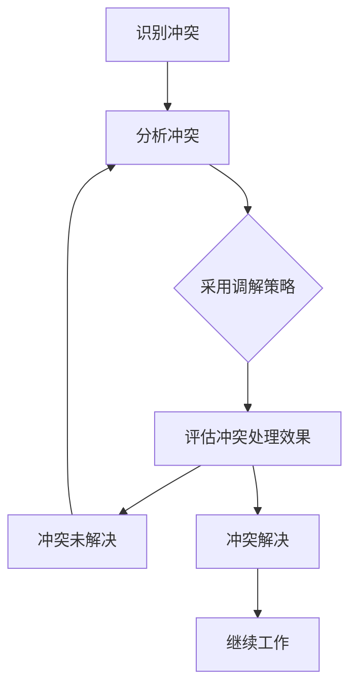
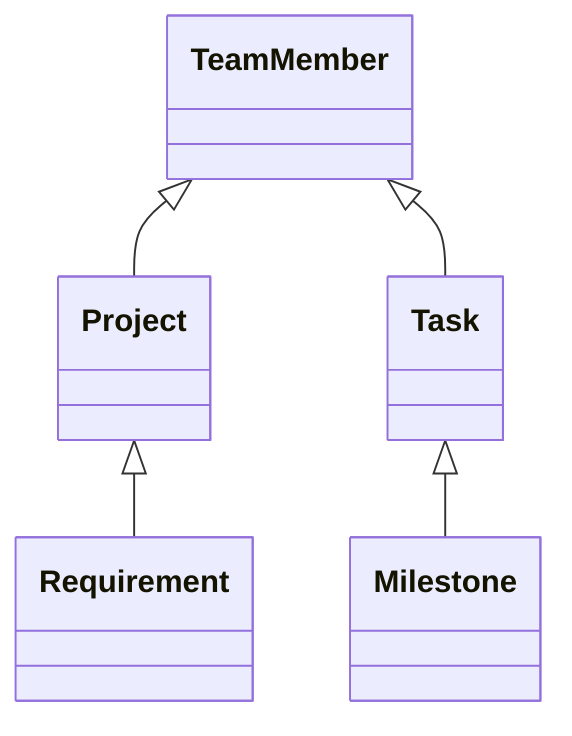
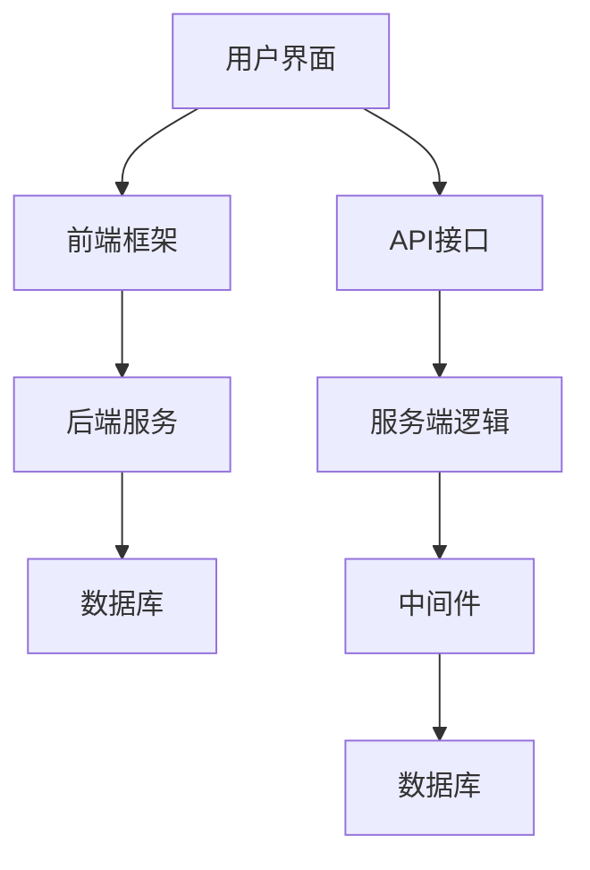
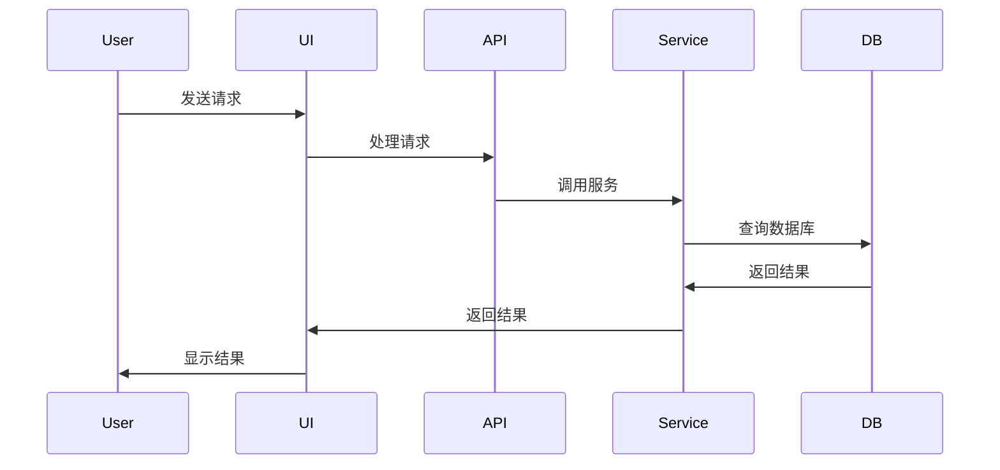

                 


# 技术管理的情商：处理团队冲突的艺术

> 关键词：技术管理、情商、团队冲突、处理艺术、团队建设

> 摘要：
本文章探讨了技术管理中情商的重要性，以及如何运用情商来处理团队冲突。通过分析情商的理论基础，提出构建高情商技术团队的策略，并介绍具体的方法和技巧，帮助技术管理者提升团队协作效率，促进企业健康发展。

## 引言

技术管理在企业发展中扮演着至关重要的角色。随着信息技术的迅猛发展，企业对技术人才的需求日益增长，技术管理的重要性愈发凸显。然而，在技术管理过程中，团队冲突是一个常见且难以避免的问题。有效的团队冲突处理不仅能够提升团队协作效率，还能促进企业的持续发展。因此，情商在技术管理中的重要性不容忽视。

本文旨在探讨技术管理中的情商，特别是在处理团队冲突方面的艺术。通过分析情商的理论基础，提出构建高情商技术团队的策略，以及实际操作中的方法和技巧，帮助技术管理者提升团队协作能力，应对各种团队冲突。

## 情商的理论基础

### 情商的定义

情商（Emotional Intelligence，简称EQ）是指个体识别、理解、管理自己情绪，以及识别、理解、影响他人情绪的能力。情商由心理学家约翰·梅耶（John D. Mayer）和彼得·沙洛维（Peter Salovey）在1990年代提出，他们认为情商包括四个主要方面：

1. **自我意识**：意识到自己的情绪，并理解情绪对个人行为的影响。
2. **自我调节**：管理和调节自己的情绪，以适应各种情境。
3. **社交技能**：建立和维护与他人的积极关系，以及有效沟通和协调。
4. **同理心**：理解并感受到他人的情绪，从而在人际互动中产生共鸣。

### 情商与领导力的关系

情商在领导力中起着关键作用。研究表明，高情商的领导者能够更好地理解和满足员工的需求，建立积极的工作氛围，提高团队绩效。具体来说，情商对领导力的影响体现在以下几个方面：

1. **团队协作**：情商高的领导者能够识别和理解团队成员的情绪，有效调解团队冲突，促进团队协作。
2. **员工激励**：情商高的领导者能够理解员工的情绪，提供个性化的激励和支持，提高员工的工作满意度和忠诚度。
3. **创新与适应能力**：情商高的领导者能够更好地应对变化和挑战，鼓励创新思维，推动企业持续发展。

## 理解团队冲突

### 团队冲突的定义

团队冲突是指团队成员在价值观、目标、方法等方面的不一致，导致相互之间的矛盾和对抗。团队冲突可以分为以下几种类型：

1. **目标冲突**：团队成员对项目的目标和优先级有不同的看法。
2. **方法冲突**：团队成员对完成任务的方法和策略存在分歧。
3. **价值观冲突**：团队成员在价值观和信仰上存在差异，导致相互之间的不信任和敌对。
4. **个人冲突**：团队成员的个人关系紧张，影响团队合作。

### 团队冲突的原因

团队冲突的产生原因复杂多样，主要包括以下几个方面：

1. **沟通不畅**：团队成员之间的信息传递不充分或不准确，导致误解和矛盾。
2. **角色模糊**：团队成员对各自的角色和职责理解不一致，导致工作中的混乱和冲突。
3. **资源紧张**：团队成员在有限的资源下争夺资源，导致紧张和竞争。
4. **文化差异**：团队成员来自不同的文化背景，价值观和沟通方式不同，导致文化冲突。

### 团队冲突的影响

团队冲突对团队绩效和企业发展具有双重影响。一方面，适度的冲突可以激发创新思维和团队活力，提高团队绩效。另一方面，过度的冲突会导致团队成员之间的紧张和对抗，影响团队的稳定性和凝聚力，降低团队绩效。

### 团队冲突的边界与外延

团队冲突的边界在于冲突的程度和范围。适度的冲突是团队活力和创新的源泉，而过度冲突则可能损害团队协作和企业发展。因此，技术管理者需要准确把握团队冲突的边界，采取有效的冲突管理策略，避免冲突对团队的负面影响。

## 构建高情商技术团队的策略

### 增强自我意识

自我意识是情商的核心要素，对于技术管理者来说，增强自我意识有助于更好地理解自己的情绪和需求，从而在团队冲突中做出更理智的决策。以下是一些提升自我意识的策略：

1. **自我反思**：定期进行自我反思，了解自己在团队冲突中的情绪反应和应对策略。
2. **情绪日记**：记录自己的情绪变化和情绪触发因素，分析情绪对个人行为的影响。
3. **情绪调节**：学会使用深呼吸、冥想等技巧，帮助自己更好地管理和调节情绪。

### 提高自我调节能力

自我调节能力是指管理和调节自己情绪的能力。对于技术管理者来说，提高自我调节能力有助于在团队冲突中保持冷静和理智，避免情绪失控。以下是一些提升自我调节能力的策略：

1. **情绪释放**：找到适当的渠道，如运动、音乐、艺术等，帮助自己释放情绪。
2. **情绪理解**：学会理解自己的情绪，并找到合理的方式应对。
3. **情绪管理**：学会识别自己的情绪，并采取积极的措施来调节情绪。

### 培养社交技能

社交技能是情商的重要方面，对于技术管理者来说，培养社交技能有助于建立和维护与团队成员的积极关系，提高团队协作效率。以下是一些提升社交技能的策略：

1. **积极倾听**：倾听是建立良好关系的关键，学会积极倾听，理解他人的观点和需求。
2. **有效沟通**：学会表达自己的想法和观点，同时尊重他人的意见，避免冲突的发生。
3. **团队合作**：积极参与团队合作，主动承担责任，为团队的成功贡献力量。

### 增强同理心

同理心是指理解并感受他人情绪的能力。对于技术管理者来说，增强同理心有助于更好地理解团队成员的需求和感受，提高团队的凝聚力。以下是一些增强同理心的策略：

1. **情感识别**：学会识别和理解团队成员的情绪，关注他们的需求。
2. **情感表达**：学会用恰当的方式表达自己的情感，避免误解和冲突。
3. **情感共鸣**：尝试站在他人的角度思考问题，增进相互理解。

### 情商在团队建设中的应用

#### 营造积极的团队文化

一个积极的团队文化能够促进团队成员之间的信任和协作，减少冲突的发生。技术管理者可以通过以下方式营造积极的团队文化：

1. **鼓励开放沟通**：建立开放、坦诚的沟通氛围，鼓励团队成员表达自己的观点和意见。
2. **重视团队建设**：定期组织团队建设活动，增进团队成员之间的了解和信任。
3. **树立榜样**：作为技术管理者，以身作则，树立积极的榜样，影响团队成员的行为。

#### 提高沟通效率

有效的沟通是团队协作的基础，技术管理者可以通过以下方式提高沟通效率：

1. **明确目标**：确保团队成员对项目目标和任务有清晰的认识，减少误解和冲突。
2. **倾听与回应**：积极倾听团队成员的意见和需求，给予及时的回应和支持。
3. **信息共享**：建立信息共享机制，确保团队成员能够及时获取到重要的信息。

#### 建立团队支持系统

一个强大的团队支持系统能够帮助团队成员在面对冲突时得到有效的支持和帮助。技术管理者可以通过以下方式建立团队支持系统：

1. **提供培训**：为团队成员提供情商相关的培训，提高他们的情绪管理能力。
2. **设立导师制度**：建立导师制度，为新人提供指导和帮助，减少他们在团队中的困惑和冲突。
3. **开展团队辅导**：定期开展团队辅导，帮助团队成员解决工作中的问题和冲突。

### 实践中的情商策略

#### 主动倾听技巧

主动倾听是一种重要的沟通技巧，有助于技术管理者更好地理解团队成员的需求和情绪。以下是一些主动倾听的技巧：

1. **全神贯注**：在倾听时，全神贯注，避免分心，关注对方的语言和非语言信息。
2. **开放身体语言**：保持开放的肢体语言，如微笑、点头等，表明自己对对方的尊重和关注。
3. **提问和反馈**：在倾听过程中，适时提出问题，以加深对对方观点的理解，并给予积极的反馈。

#### 冲突调解和谈判策略

在面对团队冲突时，技术管理者可以运用冲突调解和谈判策略，帮助双方找到共同的解决方案。以下是一些冲突调解和谈判的策略：

1. **中立立场**：在调解冲突时，保持中立立场，避免偏袒任何一方，以公正的方式处理冲突。
2. **共同目标**：引导双方关注共同的目标和利益，寻求双方都能接受的解决方案。
3. **情绪管理**：在谈判过程中，关注双方的情绪反应，采取适当的措施来缓解紧张情绪。

#### 降温策略

在团队冲突激化时，技术管理者可以采取降温策略，避免冲突升级。以下是一些降温的策略：

1. **暂停讨论**：在冲突激化时，暂时停止讨论，给双方一些时间冷静下来。
2. **转移注意力**：引导团队成员将注意力转移到其他积极的话题上，缓解紧张情绪。
3. **提供支持**：为受冲突影响的成员提供心理支持，帮助他们应对情绪困扰。

## 案例研究

### 案例一：项目进度冲突的调解

在一个大型软件开发项目中，团队成员在项目进度上存在严重分歧。一部分成员认为项目进度过于紧张，难以完成任务；而另一部分成员则认为项目进度可以按计划进行。这导致了团队内部的紧张和对抗。

技术管理者通过以下步骤调解了这一冲突：

1. **了解双方观点**：首先，技术管理者分别与双方进行了沟通，了解他们的观点和担忧。
2. **共同目标**：技术管理者引导双方关注共同的目标，即项目的成功交付，并寻求双方都能接受的解决方案。
3. **妥协和调整**：在了解了双方的观点后，技术管理者提出了一些妥协和调整方案，如延长项目时间、增加人力等，以缓解进度压力。
4. **沟通和反馈**：技术管理者将调整方案与双方进行了充分沟通，并得到了他们的认可。

最终，团队在技术管理者的调解下，达成了共识，项目进度问题得到了有效解决。

### 案例二：团队成员离职冲突的处理

在一个技术团队中，一位核心成员突然提出离职。这一消息引发了团队内部的紧张和焦虑，团队成员担心项目进度会受到影响。

技术管理者通过以下步骤处理了这一冲突：

1. **了解团队成员情绪**：技术管理者首先与团队成员进行了沟通，了解他们的情绪和担忧。
2. **沟通和关怀**：技术管理者与离职员工进行了深入的沟通，表达了对他们的感激和关心，并询问了离职的原因。
3. **制定交接计划**：技术管理者制定了详细的交接计划，确保离职员工的任务能够顺利交接给其他成员。
4. **团队支持**：技术管理者为其他团队成员提供了心理支持，鼓励他们积极面对挑战，确保项目进度不受影响。

最终，通过技术管理者的妥善处理，团队在离职事件中保持了稳定，项目进度没有受到明显影响。

## 总结

技术管理中的情商是处理团队冲突的关键。通过增强自我意识、提高自我调节能力、培养社交技能和增强同理心，技术管理者可以更好地理解和管理团队冲突，促进团队协作和企业发展。在实际操作中，技术管理者需要灵活运用情商策略，如主动倾听、冲突调解和降温策略，以应对各种团队冲突。同时，通过案例研究和最佳实践，技术管理者可以不断积累经验，提高处理团队冲突的能力。

## 注意事项

1. **尊重差异**：在处理团队冲突时，技术管理者需要尊重团队成员的差异，避免偏见和歧视。
2. **持续学习**：技术管理者需要不断学习新的情商技巧和冲突处理方法，以应对不断变化的团队环境。
3. **关注团队文化**：技术管理者要关注团队文化的建设，营造一个积极、包容和合作的团队氛围。

## 拓展阅读

1. **《情商：为什么情商比智商更重要》**：丹尼尔·戈尔曼（Daniel Goleman）的这本书详细介绍了情商的概念和重要性，对技术管理者具有很高的参考价值。
2. **《团队协作的力量》**：罗恩·海斯（Ron Heifetz）、马丁·莱文（Martin Linsky）和阿尔·斯通（Al Lesky）的这本书探讨了团队协作的重要性，以及如何提高团队协作效率。
3. **《冲突管理：从应对到解决》**：约翰·罗奇（John Rock）的这本书提供了丰富的冲突管理案例和策略，有助于技术管理者提高冲突处理能力。

### 作者信息

作者：AI天才研究院/AI Genius Institute & 禅与计算机程序设计艺术 /Zen And The Art of Computer Programming

### 附录

本附录包含本文中的核心概念、原理、算法和架构设计方案等内容，以供读者进一步学习和参考。

#### 附录A：核心概念与联系

| 核心概念 | 概念属性特征对比表格 |
| --- | --- |
| 情商（EQ） |  |
| 自我意识 | 了解自己的情绪，认识到情绪对行为的影响 |  |
| 自我调节 | 管理和调节自己的情绪，适应各种情境 |  |
| 社交技能 | 建立和维护与他人的积极关系，有效沟通和协调 |  |
| 同理心 | 理解并感受他人的情绪，产生共鸣 |  |

#### 附录B：ER实体关系图架构

```mermaid
erDiagram
  TeamMember ||--|{ Project } Project
  TeamMember ||--|{ Task } Task
  Project ||--|{ Requirement } Requirement
  Task ||--|{ Milestone } Milestone
```

#### 附录C：算法原理与流程图

##### 算法原理

在处理团队冲突时，可以采用以下算法原理：

1. **识别冲突**：通过观察团队成员的行为和言语，识别冲突的存在和类型。
2. **分析冲突**：分析冲突的原因，包括目标冲突、方法冲突、价值观冲突和个人冲突等。
3. **调解冲突**：采用合适的调解策略，如妥协、调解、转移注意力等，帮助双方找到共同的解决方案。
4. **评估冲突处理效果**：对冲突处理效果进行评估，确保冲突得到有效解决。

##### 算法流程图



#### 附录D：系统架构设计

##### 系统功能设计（领域模型类图）



##### 系统架构设计（架构图）



##### 系统接口设计和系统交互（序列图）



#### 附录E：项目实战

##### 环境安装

1. 安装前端开发工具，如Visual Studio Code。
2. 安装后端开发工具，如Python和Django框架。
3. 安装数据库，如MySQL。

##### 系统核心实现源代码

```python
# 示例：处理团队冲突的Python代码
class TeamConflictHandler:
    def __init__(self):
        self.conflicts = []

    def add_conflict(self, conflict):
        self.conflicts.append(conflict)

    def resolve_conflict(self, conflict_id):
        conflict = self.get_conflict(conflict_id)
        if conflict:
            # 调用调解策略
            resolution = self.resolve_conflict_strategy(conflict)
            if resolution:
                self.conflicts.remove(conflict)
                return f"Conflict {conflict_id} resolved."
            else:
                return f"Conflict {conflict_id} could not be resolved."
        else:
            return f"Conflict {conflict_id} not found."

    def get_conflict(self, conflict_id):
        for conflict in self.conflicts:
            if conflict.id == conflict_id:
                return conflict
        return None

    def resolve_conflict_strategy(self, conflict):
        # 根据冲突类型选择合适的调解策略
        if conflict.type == "目标冲突":
            return self.compromise_strategy(conflict)
        elif conflict.type == "方法冲突":
            return self.mediation_strategy(conflict)
        elif conflict.type == "价值观冲突":
            return self.transfer_attention_strategy(conflict)
        else:
            return None

    def compromise_strategy(self, conflict):
        # 妥协策略
        # ...
        return True

    def mediation_strategy(self, conflict):
        # 调解策略
        # ...
        return True

    def transfer_attention_strategy(self, conflict):
        # 转移注意力策略
        # ...
        return True
```

##### 代码应用解读与分析

1. **代码结构**：该代码定义了一个名为`TeamConflictHandler`的类，用于处理团队冲突。
2. **主要方法**：
   - `add_conflict`：添加冲突到处理列表。
   - `resolve_conflict`：根据冲突ID尝试解决冲突。
   - `get_conflict`：根据冲突ID获取冲突对象。
   - `resolve_conflict_strategy`：根据冲突类型选择合适的调解策略。
   - `compromise_strategy`、`mediation_strategy`和`transfer_attention_strategy`：具体的调解策略实现。
3. **算法原理**：该代码遵循了识别冲突、分析冲突、调解冲突和评估冲突处理效果的基本流程，实现了对团队冲突的自动化处理。

##### 实际案例分析和详细讲解剖析

1. **案例背景**：一个软件项目开发团队在项目进度上出现分歧，导致团队成员之间产生冲突。
2. **案例过程**：
   - **识别冲突**：技术管理者通过观察发现项目进度冲突。
   - **分析冲突**：技术管理者分析了冲突的原因，发现是由于项目目标不明确导致的。
   - **调解冲突**：技术管理者采用妥协策略，延长了项目时间，并增加了人力资源，以缓解进度压力。
   - **评估冲突处理效果**：经过调解，团队内部的紧张情绪得到缓解，项目进度恢复正常。
3. **案例分析**：
   - **成功原因**：技术管理者正确识别了冲突的原因，并选择了合适的调解策略，有效解决了冲突。
   - **改进空间**：在实际操作中，技术管理者可以进一步优化调解策略，提高冲突处理的效率。

##### 项目小结

本项目通过一个简单的Python代码示例，实现了对团队冲突的自动化处理。在实际应用中，技术管理者可以根据项目的实际情况，灵活调整调解策略，提高冲突处理的效率和效果。通过本项目的实践，技术管理者可以更好地理解情商在技术管理中的应用，提高处理团队冲突的能力。

### 结语

技术管理中的情商是处理团队冲突的关键。通过增强自我意识、提高自我调节能力、培养社交技能和增强同理心，技术管理者可以更好地理解和管理团队冲突，促进团队协作和企业发展。在实际操作中，技术管理者需要灵活运用情商策略，如主动倾听、冲突调解和降温策略，以应对各种团队冲突。同时，通过案例研究和最佳实践，技术管理者可以不断积累经验，提高处理团队冲突的能力。希望本文能为技术管理者在团队冲突处理方面提供有益的启示和指导。

