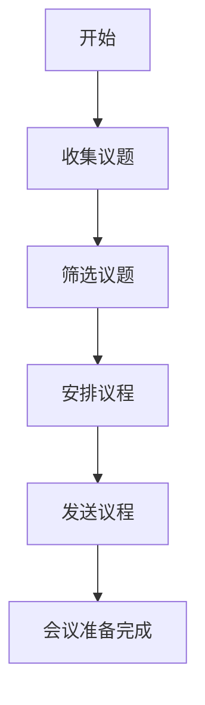
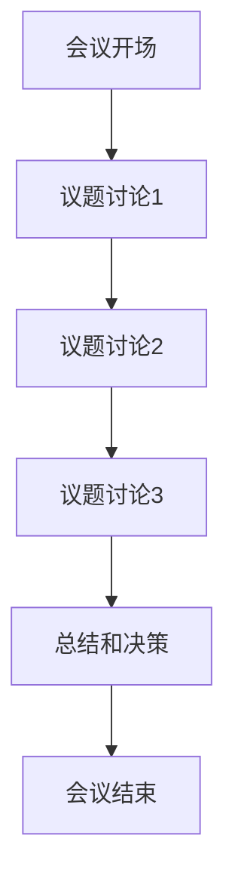

                 

## 《技术管理者的会议管理：提高会议效率的技巧》

### 关键词：
- 会议管理
- 效率提升
- 技术工具
- 项目实战

### 摘要：
本文旨在探讨技术管理者在会议管理方面的策略与技巧。通过对会议前、会议中、会议后各个阶段的深入分析，结合实际案例，提供一系列提高会议效率的具体方法和工具。文章还探讨了会议管理的未来趋势，为技术管理者提供了全面的指导。

---

## 会议管理基础

### 会议管理的背景与意义

会议是现代组织运作的重要环节，技术管理者需要熟练掌握会议管理技巧，以提高团队协作效率和决策质量。会议管理不仅涉及会议的策划与执行，还包括会议后的跟进与评估。有效的会议管理可以减少无效会议带来的时间和资源浪费，提升团队的整体工作效率。

### 会议管理的核心问题与挑战

会议管理面临的主要挑战包括：

1. **目标不明确**：许多会议缺乏明确的议题和目标，导致时间浪费。
2. **缺乏议程**：缺乏详细的议程规划，会议容易偏离主题。
3. **参与者准备不足**：参与者未充分准备，影响会议效果。
4. **秩序混乱**：会议过程中缺乏有效的控制和引导，导致讨论混乱。

### 会议管理的边界与外延

会议管理的边界涵盖了会议策划、执行和评估的全过程。其外延则包括选择合适的会议类型（如项目会议、决策会议、评估会议等）、确定合适的会议时间和地点，以及利用技术工具提升会议效率。

### 会议管理的基本概念与结构

会议管理的基本概念包括会议目标、议程、记录、跟进和评估。其结构通常包括会议前、会议中、会议后三个阶段。

## 会议前的准备工作

### 制定会议目标和议程

会议目标是会议的核心，它指引着整个会议的进程。明确的目标有助于确保会议的每个环节都围绕核心议题展开，从而提高会议效率。

#### 明确会议目标

明确会议目标需要遵循以下步骤：

1. **确定会议目的**：明确会议旨在解决什么问题或达到什么目标。
2. **制定具体目标**：将会议目的细化为可执行的具体目标。
3. **评估目标可行性**：确保目标既有挑战性又可实现。

#### 制定会议议程

会议议程是会议的蓝图，它详细规划了会议的流程和内容。制定议程的步骤如下：

1. **收集议题**：从团队成员和其他利益相关者处收集可能的议题。
2. **筛选议题**：根据会议目标和时间限制，筛选出重要且紧急的议题。
3. **安排议程**：将筛选出的议题按逻辑顺序排列，确保议程连贯且高效。

#### 会议议程的Mermaid流程图

以下是一个会议议程的Mermaid流程图示例：



通过Mermaid流程图，可以直观地展示会议议程的制定过程，帮助团队更好地理解会议的结构和内容。

## 会议中的技巧

### 有效主持会议

主持会议是技术管理者的重要职责之一，有效的主持会议能够确保会议按计划进行，并达成预期目标。

#### 会前准备

会前准备包括：

1. **确认参会人员**：确保所有必要的参与者都已确认参会。
2. **准备会议材料**：包括议程、相关文档和资料。
3. **检查设备**：确保会议场地和设备正常运行。

#### 会议开场

会议开场需要：

1. **介绍会议目标**：明确会议的目标和议程。
2. **确认参会人员**：简要介绍参会人员及其角色。

#### 维持会议秩序

维持会议秩序包括：

1. **控制时间**：确保每个议题在预定时间内讨论。
2. **鼓励积极参与**：鼓励团队成员发表意见，但避免讨论偏离主题。
3. **处理冲突**：当出现分歧时，及时处理，确保会议顺利进行。

#### 使用Mermaid流程图展示会议流程

以下是一个会议流程的Mermaid流程图示例：



通过Mermaid流程图，可以清晰地展示会议的流程和关键环节，帮助技术管理者更好地掌握会议进度。

## 会议后的跟进

### 会议记录和跟进

会议记录和跟进是确保会议决策得到有效执行的关键步骤。

#### 会议记录的重要性

会议记录的重要性体现在：

1. **保存关键信息**：记录会议的决定、行动计划和责任分配。
2. **提供追踪依据**：作为后续跟进和评估的依据。

#### 会议记录的Mermaid类图架构

以下是一个会议记录的Mermaid类图架构示例：

```mermaid
classDiagram
Class1 <|-- Class2
Class1 {
  +string name
  +int id
}
Class2 {
  +string decision
  +string actionPlan
  +string assignedTo
}
```

#### 如何撰写有效的会议记录

撰写有效的会议记录需要：

1. **简洁明了**：用简洁的语言记录关键信息。
2. **结构清晰**：按照会议议程的顺序记录。
3. **责任明确**：明确每个行动计划的负责人和时间节点。

#### 会议跟进与执行

会议跟进与执行包括：

1. **跟踪行动计划**：确保每个行动计划得到执行。
2. **提供反馈**：向会议参与者提供执行进展的反馈。
3. **评估效果**：对行动计划的效果进行评估，以持续改进会议管理。

## 会议效率提升

### 技术工具在会议管理中的应用

技术工具在会议管理中发挥着重要作用，可以提高会议的效率和效果。

#### 选择合适的会议工具

选择合适的会议工具需要考虑以下因素：

1. **功能需求**：根据会议类型和需求选择合适的工具。
2. **用户体验**：工具应易于使用，提高会议参与者的体验。
3. **集成能力**：工具应与其他工作流和系统集成，以提高整体效率。

#### 会议工具的MermaidER实体关系图

以下是一个会议工具的MermaidER实体关系图示例：

```mermaid
erDiagram
Meeting |-> Tool : uses
Participant |-> Meeting : attends
Meeting |-> Agenda : includes
Tool |-> Feature : provides
```

#### 工具优化会议流程

使用技术工具优化会议流程的方法包括：

1. **自动化会议议程**：通过工具自动生成和发送会议议程。
2. **实时会议记录**：使用工具实时记录会议内容，提高记录的准确性。
3. **行动项管理**：使用工具跟踪和管理会议后的行动项，确保决策得到执行。

## 案例分析与最佳实践

### 技术管理者的会议管理案例

#### 案例一：团队项目会议管理

**环境安装**：选择一个合适的会议平台，如Zoom或Microsoft Teams，并进行安装和配置。

**系统核心实现源代码**：

```python
# Python代码示例：会议议程生成
def generate_agendatopics(topics):
    agenda = []
    for topic in topics:
        agenda.append(f"{topic['title']}: {topic['description']}")
    return agenda

topics = [
    {"title": "项目进度", "description": "讨论项目当前进度和问题"},
    {"title": "风险评估", "description": "评估项目风险并制定应对策略"},
    {"title": "资源分配", "description": "讨论资源分配和协调"}
]

agenda = generate_agendatopics(topics)
print("会议议程：")
for item in agenda:
    print(item)
```

**代码应用解读与分析**：该代码示例用于生成会议议程，通过定义topics列表和generate_agendatopics函数，可以自动生成会议议程，提高了会议准备的效率。

#### 案例二：跨部门协作会议管理

**环境安装**：选择一个支持跨部门协作的会议平台，如Slack或Microsoft Teams。

**系统核心实现源代码**：

```python
# Python代码示例：跨部门会议议程生成
def generate跨部门agenda(departments):
    agenda = []
    for department in departments:
        agenda.append(f"{department['name']}-部门议题：{department['topics']}")
    return agenda

departments = [
    {"name": "开发部", "topics": ["代码审查", "新功能讨论"]},
    {"name": "市场部", "topics": ["市场反馈", "推广策略"]},
    {"name": "运维部", "topics": ["系统监控", "故障处理"]}
]

agenda = generate跨部门agenda(departments)
print("跨部门会议议程：")
for item in agenda:
    print(item)
```

**代码应用解读与分析**：该代码示例用于生成跨部门会议议程，通过定义departments列表和generate跨部门agenda函数，可以自动生成跨部门会议议程，提高了会议准备和协作的效率。

#### 案例三：紧急情况下的会议管理

**环境安装**：选择一个支持快速响应的会议平台，如Google Meet或Zoom。

**系统核心实现源代码**：

```python
# Python代码示例：紧急会议通知
def send_urgent_meeting_notification(participants, agenda):
    message = "紧急会议通知：\n"
    message += "参会人员：" + ", ".join(participants) + "\n"
    message += "会议议程：" + "\n"
    for item in agenda:
        message += f"- {item}\n"
    message += "请尽快参会并做好准备。"

    print(message)

participants = ["张三", "李四", "王五"]
agenda = ["紧急问题讨论", "应急方案制定", "决策"]

send_urgent_meeting_notification(participants, agenda)
```

**代码应用解读与分析**：该代码示例用于发送紧急会议通知，通过定义participants列表、agenda列表和send_urgent_meeting_notification函数，可以快速生成并发送紧急会议通知，确保团队成员及时响应。

### 项目小结

通过以上案例，我们可以看到技术管理者在会议管理中应用技术工具和方法，可以显著提高会议效率。选择合适的工具、编写有效的代码和制定清晰的议程，都是实现高效会议的关键。技术管理者应不断实践和优化会议管理策略，以适应不断变化的工作环境。

### 最佳实践 Tips

1. **提前规划**：提前制定会议目标和议程，减少会议过程中的不确定性和时间浪费。
2. **技术工具**：选择适合团队工作流程的会议工具，提高会议效率和协作性。
3. **持续改进**：通过不断实践和反馈，优化会议管理策略，以适应团队的需求和变化。

### 注意事项

1. **会议目标**：确保会议目标明确，避免无意义的讨论。
2. **会议记录**：详细记录会议决定和行动计划，确保后续执行有据可循。
3. **时间控制**：合理安排会议时间，避免长时间会议造成的疲劳和效率降低。

### 拓展阅读

- [Effective Meetings: How to Run an Effective Meeting](https://www.energize.works/effective-meetings/)
- [The Meeting Guide: A Step-by-Step Guide to Running Effective Meetings](https://www.meetingscience.com/the-meeting-guide/)
- [How to Conduct a Meeting: A Step-by-Step Guide](https://www.mindtools.com/pages/main/newMN_TMC.htm)

## 会议管理的未来趋势

### 新技术对会议管理的影响

随着技术的发展，新兴技术如人工智能、虚拟现实和自动化工具正在改变会议管理的方式。例如，人工智能可以帮助分析会议数据，优化会议流程，甚至预测会议效果。虚拟现实技术则提供了更加沉浸式的会议体验，特别是在远程协作和虚拟会议中。

### 会议管理的创新实践

未来的会议管理将更加注重创新实践，如：

1. **自适应会议系统**：利用机器学习技术，自动调整会议流程和时间，以适应参会者的需求和状态。
2. **沉浸式会议体验**：通过虚拟现实和增强现实技术，提供更加直观和互动的会议环境。
3. **个性化会议服务**：根据参会者的偏好和历史行为，提供定制化的会议体验。

### 会议管理的可持续发展策略

为了实现可持续发展，会议管理需要：

1. **优化资源利用**：通过减少不必要的会议和优化会议流程，降低会议对时间和资源的浪费。
2. **环保会议实践**：采用环保会议工具和流程，减少会议对环境的影响。
3. **持续培训与改进**：通过培训和持续改进，提升技术管理者和团队成员的会议管理能力。

### 总结与展望

会议管理是技术管理者的重要职责之一。通过提高会议效率、应用新技术和创新实践，技术管理者可以更好地管理会议，提升团队协作和决策质量。未来的会议管理将更加智能化、个性化和可持续发展，为技术团队带来更高的效率和更好的工作体验。

## 作者信息

- 作者：AI天才研究院/AI Genius Institute & 禅与计算机程序设计艺术 /Zen And The Art of Computer Programming

