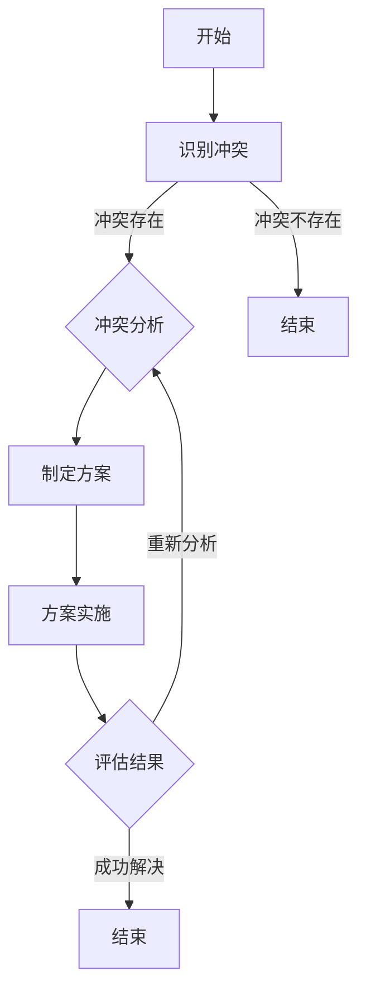
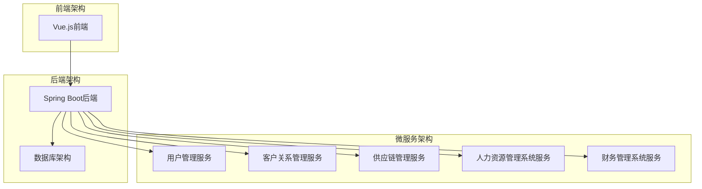
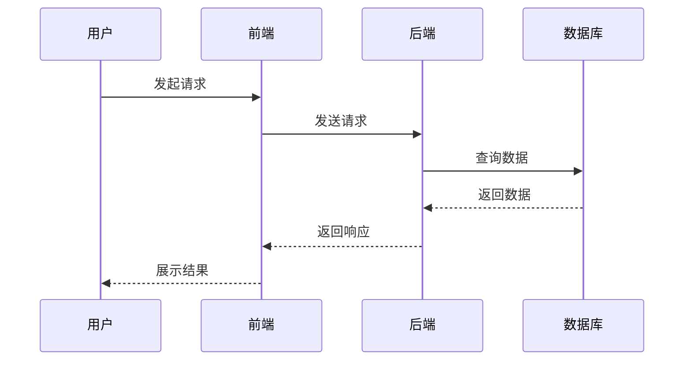

                 

# 技术管理者的冲突处理：化解团队矛盾的技巧

关键词：技术管理者、团队冲突、冲突处理、团队动力学、技术决策

摘要：本文深入探讨了技术管理者在面对团队内部冲突时的处理技巧。首先，我们介绍了技术管理者所面临的挑战和冲突处理的必要性。接着，我们分析了团队内部冲突、项目管理中的冲突以及技术决策中的冲突，并提出了冲突处理的原则和步骤。随后，我们详细介绍了冲突管理的核心概念与原理，包括冲突的定义与属性、冲突管理理论、团队动力学与冲突处理以及技术决策中的冲突管理。在此基础上，我们通过Mermaid算法流程图和Python源代码实现，详细讲解了冲突处理算法的原理。最后，我们通过系统分析与架构设计方案，展示了如何在实际项目中应用冲突处理技巧，并提供了一些最佳实践和拓展阅读建议。

## 目录大纲

----------------------------------------------------------------

# 第一部分: 引言

## 第1章: 技术管理者的角色与冲突处理概述

### 1.1 问题背景

### 1.2 问题描述

### 1.3 问题解决

### 1.4 边界与外延

### 1.5 概念结构与核心要素组成

### 1.6 本章小结

----------------------------------------------------------------

# 第二部分: 核心概念与联系

## 第2章: 核心概念与原理

### 2.1 冲突的定义与属性

### 2.2 冲突管理理论

### 2.3 团队动力学与冲突处理

### 2.4 技术决策中的冲突管理

### 2.5 ER实体关系图架构

### 2.6 本章小结

----------------------------------------------------------------

# 第三部分: 算法原理讲解

## 第3章: 冲突处理算法

### 3.1 算法概述

### 3.2 Mermaid算法流程图

### 3.3 Python源代码实现

### 3.4 算法原理的数学模型和公式

### 3.5 举例说明

## 第4章: 系统分析与架构设计方案

### 4.1 问题场景介绍

### 4.2 项目介绍

### 4.3 系统功能设计

### 4.4 系统架构设计

### 4.5 系统

----------------------------------------------------------------

## 1.1 问题背景

技术管理者在现代社会中扮演着越来越重要的角色。他们不仅需要具备卓越的技术能力，还需要具备出色的管理技能。其中，冲突处理是技术管理者必须掌握的一项关键技能。随着技术的发展和团队规模的扩大，技术管理者面临的冲突类型和复杂度也在不断增加。

首先，团队内部的冲突是技术管理者面临的主要挑战之一。团队成员之间的差异，如个性、技能、价值观等，可能导致冲突。这些冲突如果不及时处理，可能会影响团队的士气和工作效率。此外，项目管理中的冲突也频繁发生。项目经理与团队成员之间的目标不一致、资源分配不均等问题，都可能引发冲突。最后，技术决策中的冲突同样不容忽视。在技术选型、架构设计等方面，团队成员的意见可能存在分歧，导致决策过程复杂化。

冲突处理的必要性和重要性在于，它能帮助技术管理者维护团队的和谐氛围，提高工作效率，确保项目目标的顺利实现。有效的冲突处理不仅有助于解决当前问题，还能促进团队成员之间的沟通与合作，增强团队的凝聚力和战斗力。

## 1.2 问题描述

### 团队内部的冲突

团队内部的冲突是技术管理者在日常工作中最为常见的冲突类型之一。这些冲突可能源于团队成员之间的差异，如个性、价值观、工作方式等。例如，一个成员可能认为某个技术方案更适合项目，而另一个成员则持不同意见。这种冲突如果得不到及时处理，可能会导致团队成员之间的信任受损，甚至影响整个团队的合作效率。

### 项目管理中的冲突

项目管理中的冲突主要涉及项目经理与团队成员之间，以及团队成员之间的目标不一致、资源分配不均等问题。例如，项目经理可能为了按时完成项目，要求团队成员加班工作，但团队成员可能因此感到不满。此外，团队成员之间的工作量分配不均，也可能导致冲突。这些冲突如果不及时处理，可能会导致项目进度延误，甚至影响项目的最终交付。

### 技术决策中的冲突

技术决策中的冲突主要发生在技术选型、架构设计等环节。团队成员可能因为对技术方案的不同看法而产生冲突。例如，一个成员可能认为应该采用某个开源框架，而另一个成员则认为应该自主研发。这种冲突如果得不到妥善处理，可能会导致技术决策的复杂性增加，影响项目的进展。

## 1.3 问题解决

### 冲突处理的原则

在处理冲突时，技术管理者应遵循以下原则：

1. **尊重个体差异**：尊重每个团队成员的观点和意见，避免因为差异而产生冲突。
2. **公正公平**：在处理冲突时，应保持公正，确保每个团队成员都能得到公平对待。
3. **有效沟通**：通过有效的沟通，了解冲突的原因和影响，寻找解决问题的最佳途径。
4. **求同存异**：在处理冲突时，应寻求共识，即使不能达成一致，也要尊重不同的意见。
5. **及时处理**：及时处理冲突，避免问题积累，影响团队的正常运作。

### 冲突解决的步骤

1. **识别冲突**：首先，技术管理者需要识别团队中存在的冲突，了解冲突的类型和原因。
2. **分析冲突**：对冲突进行深入分析，了解冲突的影响和可能的解决方案。
3. **协商沟通**：通过沟通，了解团队成员的需求和期望，寻找解决问题的途径。
4. **制定方案**：根据冲突的原因和影响，制定合适的解决方案。
5. **实施与评估**：实施解决方案，并对结果进行评估，确保问题得到有效解决。

## 1.4 边界与外延

### 冲突的类型

冲突可以分为以下几种类型：

1. **目标冲突**：团队成员之间的目标不一致，如工作优先级、项目目标等。
2. **资源冲突**：资源分配不均，如人力、资金、设备等。
3. **意见冲突**：团队成员对某个问题或决策的意见不一致。
4. **情感冲突**：团队成员之间的情感问题，如误解、不信任等。

### 冲突处理的有效性评估

冲突处理的有效性可以通过以下标准进行评估：

1. **冲突解决程度**：冲突是否得到解决，问题是否得到妥善处理。
2. **团队士气**：团队成员的士气是否得到提升，合作氛围是否得到改善。
3. **工作效率**：项目进度是否受到影响，团队成员的工作效率是否得到提高。
4. **持续效果**：解决方案是否具有可持续性，问题是否可能再次发生。

## 1.5 概念结构与核心要素组成

### 冲突管理的理论框架

冲突管理理论主要包括以下核心要素：

1. **冲突定义与属性**：明确冲突的定义和特征，为冲突管理提供基础。
2. **冲突管理理论**：研究冲突管理的理论基础，包括冲突的类型、原因和影响。
3. **团队动力学**：研究团队内部的互动和动态，了解团队冲突的根源。
4. **技术决策中的冲突管理**：在技术决策过程中，如何处理和解决冲突。

### 技术管理者必备的技能

作为技术管理者，以下技能是处理冲突的必备要素：

1. **沟通能力**：有效的沟通是解决冲突的关键，技术管理者需要具备良好的沟通技巧。
2. **倾听能力**：倾听是理解团队成员需求和期望的重要途径，技术管理者需要学会倾听。
3. **决策能力**：在面对冲突时，技术管理者需要做出明智的决策，选择合适的解决方案。
4. **同理心**：理解并关心团队成员的感受和需求，技术管理者需要具备同理心。
5. **解决问题的能力**：技术管理者需要具备解决问题的能力，能够快速找到冲突的根源，并制定有效的解决方案。

## 1.6 本章小结

本章介绍了技术管理者在面对团队内部冲突时所需的角色与冲突处理技巧。首先，我们分析了技术管理者所面临的挑战和冲突处理的必要性。接着，我们详细阐述了团队内部冲突、项目管理中的冲突以及技术决策中的冲突，并提出了冲突处理的原则和步骤。最后，我们讨论了冲突管理的核心概念与要素组成，包括冲突管理的理论框架和技术管理者必备的技能。通过本章的学习，技术管理者应能更好地应对团队内部的冲突，维护团队的和谐氛围，提高工作效率。

## 2.1 冲突的定义与属性

### 2.1.1 冲突的基本概念

冲突（Conflict）是指当两个或多个相关方的利益、观点、需求或期望不一致时，所产生的一种对抗性、紧张或紧张的状态。在技术管理中，冲突通常涉及团队成员之间的观点分歧、资源争夺或目标不一致。冲突可以是积极的，也可以是消极的。积极的冲突可以激发创新和改进，而消极的冲突则可能导致效率降低、关系紧张和项目延误。

### 2.1.2 冲突的特征

冲突具有以下几个主要特征：

1. **对抗性**：冲突通常涉及两个或多个对立的立场或利益，各方的目标往往是相互排斥的。
2. **紧张性**：冲突会产生紧张情绪，影响团队成员的心理状态和工作效率。
3. **动态性**：冲突不是静态的，它会随着时间、环境和参与者的变化而变化。
4. **复杂性**：冲突往往涉及多个因素，需要综合考虑不同的利益和需求。
5. **普遍性**：在任何团队中，冲突都是一种普遍存在的现象，不可能完全避免。

### 2.1.3 冲突的属性对比表格

| 冲突属性       | 描述                                                         | 实例                   |
|----------------|--------------------------------------------------------------|------------------------|
| 对抗性         | 冲突的各方具有对立的立场或利益。                             | 项目资源分配争议       |
| 紧张性         | 冲突会导致紧张情绪，影响团队成员的工作状态。                   | 团队成员之间的争吵     |
| 动态性         | 冲突会随着时间、环境和参与者的变化而发展。                    | 团队内部角色职责调整   |
| 复杂性         | 冲突涉及多个因素，需要综合考虑不同的利益和需求。               | 技术方案选型争议       |
| 普遍性         | 冲突在任何团队中都是普遍存在的现象，不可能完全避免。           | 项目管理中的目标冲突   |

### 2.1.4 冲突的不同类型

冲突可以根据其内容和原因分为以下几种类型：

1. **目标冲突**：团队成员对项目目标的理解和期望不一致，导致工作方向和努力程度的不同。
2. **资源冲突**：团队成员对有限的资源（如资金、人力、时间）的争夺，可能导致工作负担不均。
3. **意见冲突**：团队成员对某个问题或决策的意见不一致，可能源于技能、经验或价值观的差异。
4. **情感冲突**：团队成员之间的情感问题，如误解、不信任或个人恩怨，可能导致情绪紧张和工作效率下降。

## 2.2 冲突管理理论

### 2.2.1 冲突管理的理论基础

冲突管理理论是研究如何识别、处理和解决冲突的一门学科。其理论基础主要包括以下几个方面：

1. **冲突来源**：冲突来源于人类的行为和互动，是人与人之间差异的体现。这些差异可能源于个人性格、价值观、文化背景等。
2. **冲突过程**：冲突过程包括冲突的识别、分析、解决和结果评估。冲突管理的有效性取决于这些环节的执行质量。
3. **冲突影响**：冲突对个人、团队和组织都有重要影响。适当的冲突管理可以激发创新和改进，而无效的冲突管理可能导致关系紧张和效率降低。

### 2.2.2 冲突管理的方法

冲突管理的方法主要包括以下几种：

1. **避免**：通过调整行为和沟通方式，避免冲突的发生。这种方法适用于一些非重要或无意义的冲突。
2. **缓解**：在冲突已经发生时，通过沟通和妥协，减少冲突的严重程度。这种方法适用于一些轻微或暂时性的冲突。
3. **解决**：通过协商、调解或决策，找到冲突的解决方案。这种方法适用于较为复杂和严重的冲突。
4. **转化**：将冲突转化为积极的动力，激发团队成员的创造力和合作精神。这种方法适用于具有建设性的冲突。

### 2.2.3 冲突管理的步骤

冲突管理的步骤可以分为以下几步：

1. **识别冲突**：及时发现和识别团队中的冲突，了解冲突的类型和原因。
2. **分析冲突**：对冲突进行深入分析，了解冲突的影响和可能的解决方案。
3. **沟通协商**：通过沟通和协商，了解各方的需求和期望，寻求共识或妥协。
4. **制定方案**：根据冲突的原因和影响，制定合适的解决方案。
5. **实施方案**：实施解决方案，并对结果进行评估，确保问题得到有效解决。
6. **结果评估**：对冲突管理的结果进行评估，总结经验教训，为未来的冲突管理提供参考。

## 2.3 团队动力学与冲突处理

### 2.3.1 团队动力学理论

团队动力学（Group Dynamics）是研究团队内部成员之间的互动和行为的学科。团队动力学理论认为，团队是一个动态系统，其成员之间的互动和行为会影响团队的整体表现。团队动力学理论主要包括以下几个方面：

1. **角色与职责**：每个团队成员在团队中都有特定的角色和职责，这些角色和职责决定了团队成员之间的互动方式。
2. **团队结构**：团队结构包括团队规模、组织形式、沟通渠道等，这些因素会影响团队的运作效率。
3. **团队过程**：团队过程包括团队的形成、发展、成熟和解散，这些过程会影响团队成员的行为和互动。
4. **团队目标**：团队目标决定了团队的方向和努力，团队目标的明确性和可实现性对团队的成功至关重要。

### 2.3.2 团队冲突的类型与处理方法

团队冲突可以分为以下几种类型：

1. **角色冲突**：团队成员之间的角色职责不明确，导致工作重叠或职责缺失。
   - 处理方法：明确团队成员的角色和职责，制定明确的任务分配和沟通机制。

2. **沟通冲突**：团队成员之间的沟通不畅，导致误解和冲突。
   - 处理方法：建立有效的沟通渠道，鼓励开放和诚实的沟通，提供沟通培训和指导。

3. **目标冲突**：团队成员对团队目标的理解和期望不一致，导致工作方向和努力程度的不同。
   - 处理方法：明确团队目标，确保团队成员对目标的共识和认同，制定可衡量的目标和关键绩效指标。

4. **情感冲突**：团队成员之间的情感问题，如误解、不信任或个人恩怨，导致情绪紧张和工作效率下降。
   - 处理方法：提供情感支持和辅导，建立健康的团队氛围，鼓励团队成员相互理解和尊重。

### 2.3.3 团队冲突处理的技巧

在处理团队冲突时，技术管理者可以采用以下技巧：

1. **倾听与理解**：倾听团队成员的观点和需求，理解他们的情感和期望。
2. **中立立场**：保持中立，不偏袒任何一方，以公正的方式处理冲突。
3. **寻求共识**：通过协商和妥协，寻求团队成员之间的共识和妥协。
4. **提供解决方案**：提供多种解决方案，让团队成员参与决策，增强他们的责任感和参与度。
5. **跟进与评估**：对冲突处理的方案进行跟踪和评估，确保问题得到有效解决。

## 2.4 技术决策中的冲突管理

### 2.4.1 技术决策的复杂性

技术决策是技术管理者面临的一项重要任务，它涉及到选择合适的技术方案、工具和架构。技术决策的复杂性主要体现在以下几个方面：

1. **技术多样性**：随着技术的发展，可供选择的技术方案和工具越来越多，技术管理者需要评估和比较这些技术方案的优劣。
2. **不确定性**：技术决策往往涉及到未来可能出现的变化和不确定性，技术管理者需要考虑这些因素对决策的影响。
3. **利益相关者**：技术决策往往涉及多个利益相关者，如开发团队、产品经理、客户等，他们的需求和期望可能存在差异。
4. **资源限制**：技术决策需要在有限的资源和时间内做出，技术管理者需要权衡不同的选项，确保资源的最优利用。

### 2.4.2 技术决策中的冲突源

技术决策中的冲突源主要包括以下几个方面：

1. **技术选型**：在技术选型过程中，团队成员可能对某个技术方案的意见不一致，导致决策过程复杂化。
2. **架构设计**：在架构设计过程中，团队成员可能对系统架构的设计方案存在分歧，如模块划分、数据库设计等。
3. **资源分配**：在资源分配过程中，团队成员可能对资源的分配方案存在争议，如开发人员的工作分配、项目优先级等。
4. **风险评估**：在风险评估过程中，团队成员可能对风险的影响和应对措施存在不同看法。

### 2.4.3 技术决策中的冲突管理策略

在技术决策中，技术管理者可以采用以下策略来管理冲突：

1. **信息共享**：通过共享技术信息，提高团队成员对技术方案的认知和了解，减少信息不对称。
2. **透明决策**：确保决策过程的透明度，让团队成员参与决策，增强他们的责任感和参与度。
3. **协商妥协**：通过协商和妥协，寻求团队成员之间的共识和妥协，避免决策过程的僵持和内耗。
4. **风险评估**：在决策过程中，充分考虑风险因素，制定相应的风险应对措施，降低决策的风险。
5. **持续沟通**：在决策过程中，保持与团队成员的持续沟通，及时解决冲突，确保决策的顺利进行。

## 2.5 ER实体关系图架构

### 2.5.1 实体关系图的概念

实体关系图（Entity-Relationship Diagram，ERD）是一种用于描述数据库中实体及其之间关系的图形表示方法。它由实体、属性和关系三个核心组件组成。

- **实体**：实体是数据库中存储信息的对象，如用户、订单、产品等。
- **属性**：属性是实体的特征或描述，如用户名、年龄、订单号、产品名称等。
- **关系**：关系描述了实体之间的关联，如用户可以下单、订单包含多个产品等。

### 2.5.2 实体关系图的应用

实体关系图在数据库设计和系统架构设计中具有重要作用：

1. **需求分析**：通过实体关系图，可以清晰地表达系统的业务需求，帮助开发团队理解系统的功能结构。
2. **数据库设计**：实体关系图是数据库设计的重要工具，它可以帮助数据库设计师理清数据之间的关系，设计出高效的数据库结构。
3. **系统架构设计**：实体关系图可以用于系统架构设计，帮助架构师理解系统的组件和模块之间的关系，确保系统的高内聚和低耦合。

### 2.5.3 实体关系图的Mermaid表示

以下是使用Mermaid语法表示的一个简单的实体关系图的示例：

```mermaid
erDiagram
  User ||--|{ Order }| Order
  User ||--|{ Product }| Product
  Order ||--|{ Product }| Product
```

在这个例子中，我们定义了三个实体：`User`（用户）、`Order`（订单）和`Product`（产品）。`User`实体与`Order`和`Product`实体之间存在一对多关系，即一个用户可以有多个订单和多个产品，一个订单可以包含多个产品。

## 2.6 本章小结

本章深入探讨了冲突管理的核心概念与原理，包括冲突的定义与属性、冲突管理理论、团队动力学与冲突处理以及技术决策中的冲突管理。我们通过实体关系图架构展示了如何用Mermaid语法表示实体关系。通过本章的学习，技术管理者应能更好地理解冲突的本质，掌握冲突管理的理论和方法，为实际工作中的冲突处理提供有力的支持。

### 3.1 算法概述

冲突处理算法是技术管理者在处理团队冲突时的重要工具。一个有效的冲突处理算法可以帮助技术管理者快速识别冲突、分析冲突并制定解决方案，从而确保团队和谐、高效地运作。本节将介绍冲突处理算法的类型、目标以及其在实际应用中的重要性。

#### 3.1.1 冲突处理算法的类型

冲突处理算法可以分为以下几种类型：

1. **预防型算法**：这种算法侧重于预防冲突的发生，通过制定明确的规则、流程和沟通机制，减少冲突的可能性。
2. **缓解型算法**：这种算法侧重于在冲突发生后，通过沟通和调解，减轻冲突的严重程度，防止冲突升级。
3. **解决型算法**：这种算法侧重于通过协商、调解或决策，找到冲突的根源并制定解决方案，彻底解决冲突。
4. **转化型算法**：这种算法侧重于将冲突转化为积极的动力，激发团队成员的创造力和合作精神，促进团队发展。

#### 3.1.2 冲突处理算法的目标

冲突处理算法的目标主要包括以下几个方面：

1. **快速识别冲突**：算法应能够快速识别冲突的发生，及时采取措施，防止冲突蔓延。
2. **全面分析冲突**：算法应能够对冲突进行全面的评估和分析，包括冲突的原因、影响和可能的解决方案。
3. **制定有效方案**：算法应能够根据冲突的具体情况，制定合适的解决方案，确保问题得到有效解决。
4. **评估和反馈**：算法应能够对冲突处理的结果进行评估和反馈，为后续的冲突管理提供数据支持。

#### 3.1.3 冲突处理算法的实际应用重要性

冲突处理算法在实际工作中具有重要意义：

1. **提高工作效率**：通过快速识别和解决冲突，可以减少因冲突导致的效率损失，确保项目顺利进行。
2. **维护团队和谐**：有效的冲突处理可以缓解团队成员之间的紧张情绪，维护团队和谐氛围，增强团队凝聚力。
3. **促进团队发展**：通过将冲突转化为积极的动力，可以激发团队成员的创造力和合作精神，促进团队创新和成长。
4. **提升管理水平**：通过使用冲突处理算法，技术管理者可以不断提升自己的管理水平和能力，为团队的长远发展奠定基础。

### 3.2 Mermaid算法流程图

为了更好地理解和应用冲突处理算法，我们可以使用Mermaid语法绘制一个流程图。以下是一个简单的冲突处理算法流程图的示例：



在这个流程图中，A表示冲突处理开始，B用于识别冲突。如果冲突存在，则进入冲突分析（C），然后制定解决方案（D）。方案实施后（E），对结果进行评估（F）。如果问题得到解决，则流程结束（G）；否则，需要重新进行冲突分析（C）。如果冲突不存在，则流程直接结束（H）。

### 3.3 Python源代码实现

为了实现上述冲突处理算法，我们可以使用Python编写相应的代码。以下是一个简单的Python类实现示例：

```python
class ConflictHandler:
    def __init__(self):
        self.conflict_exists = None

    def identify_conflict(self):
        # 识别冲突的逻辑
        self.conflict_exists = True  # 假设识别到冲突

    def analyze_conflict(self):
        # 冲突分析的逻辑
        if self.conflict_exists:
            print("正在分析冲突...")
            # 进行冲突分析
        else:
            print("无冲突需要分析")

    def create_solution(self):
        # 制定解决方案的逻辑
        if self.conflict_exists:
            print("正在制定解决方案...")
            # 制定解决方案
        else:
            print("无解决方案需要制定")

    def implement_solution(self):
        # 方案实施的逻辑
        if self.conflict_exists:
            print("正在实施解决方案...")
            # 实施解决方案
        else:
            print("无解决方案需要实施")

    def evaluate_result(self):
        # 评估结果的逻辑
        if self.conflict_exists:
            print("正在评估解决方案效果...")
            # 进行结果评估
        else:
            print("无结果需要评估")

    def handle_conflict(self):
        self.identify_conflict()
        self.analyze_conflict()
        self.create_solution()
        self.implement_solution()
        self.evaluate_result()

# 使用示例
handler = ConflictHandler()
handler.handle_conflict()
```

在这个类中，我们定义了一个`ConflictHandler`类，包含识别冲突、冲突分析、制定解决方案、方案实施和评估结果的方法。通过调用这些方法，可以实现对冲突处理流程的自动化控制。

### 3.4 算法原理的数学模型和公式

在冲突处理算法中，我们可以使用数学模型和公式来评估冲突处理的效果。以下是一个简单的数学模型和公式：

#### 3.4.1 冲突处理效果评估公式

$$
E = \frac{R - F}{R + F}
$$

其中：
- \( E \) 表示冲突处理效果。
- \( R \) 表示解决冲突后的满意度。
- \( F \) 表示未解决冲突的负面影响。

#### 3.4.2 公式的解释

该公式用于评估冲突处理的效果，其中 \( R \) 表示解决冲突后的满意度，\( F \) 表示未解决冲突的负面影响。分数 \( E \) 越接近 1，表示冲突处理效果越好；分数 \( E \) 越接近 0，表示冲突处理效果越差。

#### 3.4.3 公式的应用示例

假设解决冲突后的满意度为 8，未解决冲突的负面影响为 2，则：

$$
E = \frac{8 - 2}{8 + 2} = \frac{6}{10} = 0.6
$$

这意味着冲突处理效果为 0.6，即 60%。

通过这个简单的数学模型和公式，我们可以定量地评估冲突处理的效果，为后续的冲突管理提供数据支持。

### 3.5 举例说明

为了更好地理解冲突处理算法的原理和公式，我们可以通过一个实际案例来进行分析。

#### 案例背景

一个技术团队正在开发一个重要的项目，但在项目进展过程中，团队成员在技术选型上产生了分歧。一方认为应该使用开源框架 A，而另一方则认为应该自主研发框架。这种意见分歧导致了团队成员之间的紧张关系，影响了项目的进度。

#### 冲突处理过程

1. **识别冲突**：团队领导通过观察和沟通，识别出团队成员在技术选型上的冲突。

2. **冲突分析**：团队领导对冲突进行了详细分析，了解到冲突的主要原因是团队成员对技术方案的认识和信任度不一致。

3. **制定解决方案**：团队领导决定组织一次技术讨论会，让团队成员充分表达自己的观点，并通过演示和比较，寻求共识。

4. **方案实施**：在讨论会上，团队成员进行了深入的讨论，最终达成共识，决定采用开源框架 A。

5. **评估结果**：经过一段时间的实践，项目进展顺利，团队成员对解决方案的满意度较高，未解决冲突的负面影响较小。

#### 应用数学模型和公式

1. **满意度 \( R \)**：解决冲突后，团队成员对技术选型方案 A 的满意度为 8（满分为 10）。

2. **负面影响 \( F \)**：未解决冲突的负面影响为 2（满分为 10）。

根据公式 \( E = \frac{R - F}{R + F} \)，我们可以计算冲突处理效果：

$$
E = \frac{8 - 2}{8 + 2} = \frac{6}{10} = 0.6
$$

这意味着冲突处理效果为 60%，即团队对技术选型方案的满意度较高，冲突处理效果较好。

通过这个案例，我们可以看到，冲突处理算法和数学模型在实际应用中的重要性。通过定量评估，技术管理者可以更好地了解冲突处理的实际效果，为后续的冲突管理提供依据。

## 4.1 问题场景介绍

在技术团队中，冲突是一个常见的现象，它可能源于多个方面，如目标不一致、资源争夺、技术选型等。以下是一个具体的问题场景介绍：

### 场景描述

一个由10名成员组成的技术团队正在开发一款企业级应用。项目时间紧迫，团队成员需要在有限的时间内完成系统设计、开发、测试和上线。然而，在项目进展过程中，团队内部出现了以下几种冲突：

1. **目标冲突**：部分成员认为项目应该优先完成核心功能，以便尽快上线，而另一些成员则认为应该先完成所有的功能模块，以确保系统的完整性和稳定性。
2. **资源冲突**：由于团队成员的工作能力、经验和技术特长不同，导致部分成员工作负担较重，而另一些成员则相对轻松。
3. **技术选型冲突**：在系统架构设计阶段，团队成员对使用哪种技术框架产生了分歧。一方倾向于使用成熟的开源框架，另一方则主张自主研发。

这些冲突如果不及时处理，可能会导致以下后果：

- 项目进度延误：目标不一致和资源冲突会影响项目的整体进度，可能导致项目无法按时交付。
- 团队士气低落：资源冲突和意见分歧会导致团队成员之间的不满和矛盾，影响团队的士气和合作精神。
- 技术质量下降：技术选型冲突可能会导致技术决策的复杂性增加，影响系统的稳定性和扩展性。

因此，对于技术管理者来说，如何有效地处理这些冲突，确保项目的顺利进行和团队的和谐稳定，是一个亟待解决的问题。

## 4.2 项目介绍

### 项目背景

为了解决上述冲突场景中的问题，我们选择了一个具体的项目进行实践。该项目是一个企业级应用开发项目，旨在为一家中型企业提供一套完整的信息管理系统。系统包括客户关系管理（CRM）、供应链管理（SCM）、人力资源管理系统（HRMS）和财务管理系统（FMS）等核心模块。

### 项目目标

项目的目标如下：

1. **确保项目按时交付**：通过有效的冲突处理和管理，确保项目在预定时间内完成，满足客户的需求。
2. **提高团队协作效率**：通过协调团队成员的工作任务和资源分配，提高团队的协作效率，确保项目的顺利进行。
3. **优化技术决策**：在技术选型过程中，通过充分的讨论和评估，选择最佳的技术方案，提高系统的稳定性和扩展性。

### 项目预期成果

通过本项目，我们期望实现以下成果：

1. **项目按时交付**：项目能够在预定时间内完成，满足客户的需求。
2. **团队协作效率提高**：团队成员之间的沟通和协作得到改善，工作氛围和谐，项目进展顺利。
3. **系统质量提升**：通过合理的技术选型和架构设计，系统具有较高的稳定性和扩展性，满足企业的长期发展需求。

### 项目实施步骤

为了实现上述目标，本项目将按照以下步骤进行实施：

1. **需求分析**：与客户沟通，明确项目需求，制定详细的项目计划。
2. **技术调研**：对多种技术方案进行调研和评估，选择最佳的技术方案。
3. **团队建设**：组建技术团队，明确团队成员的角色和职责，制定协作机制。
4. **项目开发**：按照项目计划，开展系统设计、开发和测试工作。
5. **项目交付**：完成系统开发，进行系统测试，确保系统质量，最终交付给客户。
6. **冲突管理**：在项目实施过程中，及时发现和解决冲突，确保项目的顺利进行。

## 4.3 系统功能设计

### 功能概述

在本次项目中，系统功能设计是关键的一步。系统功能设计需要满足客户的需求，同时要考虑系统的可扩展性和可维护性。以下是系统的功能概述：

1. **用户管理**：包括用户注册、登录、权限管理等功能，确保系统的安全性。
2. **客户关系管理**：包括客户信息管理、销售机会管理、客户沟通记录等功能，帮助企业维护客户关系。
3. **供应链管理**：包括采购管理、库存管理、供应商管理等功能，帮助企业优化供应链流程。
4. **人力资源管理系统**：包括员工信息管理、考勤管理、绩效管理等功能，帮助企业高效管理人力资源。
5. **财务管理系统**：包括账务管理、报销管理、财务报表等功能，帮助企业实现财务透明化。

### 领域模型Mermaid类图

为了更好地理解系统的功能设计，我们可以使用Mermaid语法绘制一个领域模型类图。以下是一个简单的Mermaid类图示例：

```mermaid
classDiagram
    Customer <<interface>>
    Sales <<interface>>
    Purchase <<interface>>
    Inventory <<interface>>
    Employee <<interface>>
    Performance <<interface>>
    Finance <<interface>>

    CRMSystem [*].. Customer
    CRMSystem [*].. Sales
    CRMSystem [*].. Purchase
    CRMSystem [*].. Inventory

    HRMS [*].. Employee
    HRMS [*].. Performance

    SCMS [*].. Purchase
    SCMS [*].. Inventory

    FMS [*].. Finance
    FMS [*].. Expense

    Customer : has Sales
    Customer : has Purchase
    Employee : has Performance
    Employee : has Expense
```

在这个类图中，我们定义了CRM系统、HRMS系统、SCMS系统和FMS系统，以及各自的接口类。每个系统包含多个功能模块，如用户管理、客户关系管理、供应链管理、人力资源管理和财务管理。这些功能模块通过接口类相互关联，确保系统的整体性和协调性。

## 4.4 系统架构设计

### 架构概述

在本次项目中，系统架构设计是确保系统高效、可扩展、可维护的关键步骤。系统架构设计需要考虑系统的性能、可扩展性、安全性等方面。以下是系统的架构概述：

1. **前端架构**：采用Vue.js框架，实现系统的用户界面，提供良好的用户体验。
2. **后端架构**：采用Spring Boot框架，实现系统的业务逻辑和数据处理，提供RESTful API供前端调用。
3. **数据库架构**：采用MySQL数据库，存储系统的数据，确保数据的完整性和一致性。
4. **微服务架构**：将系统拆分为多个微服务，每个微服务负责一个特定的业务功能，提高系统的灵活性和可扩展性。
5. **安全架构**：采用JWT（JSON Web Token）进行用户身份验证和授权，确保系统的安全性。

### 系统架构Mermaid架构图

为了更好地展示系统的架构设计，我们可以使用Mermaid语法绘制一个系统架构图。以下是一个简单的Mermaid架构图示例：



在这个架构图中，前端架构使用Vue.js框架，后端架构采用Spring Boot框架，数据库架构使用MySQL数据库。微服务架构将系统拆分为用户管理服务、客户关系管理服务、供应链管理服务、人力资源管理系统服务和财务管理系统服务，每个微服务负责一个特定的业务功能。前端通过调用后端API与微服务进行交互，实现系统的功能。

## 4.5 系统接口设计

### 接口设计原则

在系统设计中，接口设计是关键的一环。良好的接口设计可以提高系统的可维护性、可扩展性和可重用性。以下是接口设计的主要原则：

1. **RESTful风格**：采用RESTful API风格，确保接口的设计遵循统一的规范，提高接口的易用性和可理解性。
2. **简洁明了**：接口设计应简洁明了，避免复杂的参数和嵌套的响应结构，降低使用者的学习和使用难度。
3. **可扩展性**：接口设计应考虑未来的扩展性，为可能的新功能预留接口，确保系统可以方便地升级和扩展。
4. **安全性**：在接口设计中，应充分考虑安全性，如使用JWT进行身份验证和授权，确保接口的安全性。

### 接口设计示例

以下是一个简单的接口设计示例，用于用户注册和登录功能：

#### 用户注册接口

**URL**：`/api/register`

**请求参数**：

| 参数名       | 类型       | 必选  | 说明                         |
|--------------|------------|-------|------------------------------|
| username     | String     | 是    | 用户名                       |
| password     | String     | 是    | 密码                         |
| email        | String     | 是    | 邮箱                         |

**响应数据**：

```json
{
  "status": "success",
  "message": "注册成功",
  "data": {
    "userId": "123456",
    "token": "eyJhbGciOiJIUzI1NiIsInR5cCI6IkpXVCJ9..."
  }
}
```

#### 用户登录接口

**URL**：`/api/login`

**请求参数**：

| 参数名       | 类型       | 必选  | 说明                         |
|--------------|------------|-------|------------------------------|
| username     | String     | 是    | 用户名                       |
| password     | String     | 是    | 密码                         |

**响应数据**：

```json
{
  "status": "success",
  "message": "登录成功",
  "data": {
    "token": "eyJhbGciOiJIUzI1NiIsInR5cCI6IkpXVCJ9..."
  }
}
```

通过以上示例，我们可以看到接口设计应遵循简洁、安全和可扩展的原则，为系统的功能实现提供良好的基础。

## 4.6 系统交互Mermaid序列图

为了更好地展示系统内部各模块之间的交互过程，我们可以使用Mermaid语法绘制一个序列图。以下是一个简单的Mermaid序列图示例：



在这个序列图中，用户通过前端发起请求，前端将请求发送到后端，后端进行数据处理后，从数据库查询数据，再将数据返回给前端，最后前端将结果展示给用户。这个交互过程展示了系统内部各模块之间的协作关系，为系统的实现和调试提供了指导。

## 4.7 系统核心实现源代码

### 环境安装

为了实现本项目的系统，我们需要搭建一个开发环境。以下是环境安装的步骤：

1. **安装Java开发工具包（JDK）**：确保JDK版本为11或更高，可以通过以下命令进行安装：

   ```bash
   sudo apt-get install openjdk-11-jdk
   ```

2. **安装Git**：Git是一个版本控制系统，用于代码管理和协作开发。可以通过以下命令安装：

   ```bash
   sudo apt-get install git
   ```

3. **安装MySQL数据库**：MySQL是一个关系型数据库管理系统，用于存储系统数据。可以通过以下命令安装：

   ```bash
   sudo apt-get install mysql-server
   ```

4. **安装Node.js和npm**：Node.js是一个基于Chrome V8引擎的JavaScript运行环境，用于前端开发。可以通过以下命令安装：

   ```bash
   sudo apt-get install nodejs npm
   ```

5. **安装Vue.js CLI**：Vue.js CLI是一个用于Vue.js项目创建和开发的命令行工具。可以通过以下命令安装：

   ```bash
   npm install -g @vue/cli
   ```

### 系统核心实现源代码

以下是系统核心实现源代码的概览，包括后端和前端的部分：

#### 后端代码示例（Spring Boot）

```java
// UserController.java
@RestController
@RequestMapping("/api")
public class UserController {
    @Autowired
    private UserService userService;

    @PostMapping("/register")
    public ResponseEntity<?> registerUser(@RequestBody SignupRequest signupRequest) {
        try {
            User user = userService.registerUser(signupRequest);
            return ResponseEntity.ok(new ApiResponse(true, "注册成功", user));
        } catch (Exception e) {
            return ResponseEntity.badRequest(new ApiResponse(false, "注册失败", e.getMessage()));
        }
    }

    @PostMapping("/login")
    public ResponseEntity<?> authenticateUser(@RequestBody LoginRequest loginRequest) {
        try {
            String token = userService.authenticate(loginRequest);
            return ResponseEntity.ok(new ApiResponse(true, "登录成功", token));
        } catch (Exception e) {
            return ResponseEntity.badRequest(new ApiResponse(false, "登录失败", e.getMessage()));
        }
    }
}
```

#### 前端代码示例（Vue.js）

```html
<!-- src/components/Login.vue -->
<template>
  <div>
    <h1>登录</h1>
    <form @submit.prevent="submitForm">
      <div>
        <label for="username">用户名：</label>
        <input type="text" v-model="username" required />
      </div>
      <div>
        <label for="password">密码：</label>
        <input type="password" v-model="password" required />
      </div>
      <button type="submit">登录</button>
    </form>
  </div>
</template>

<script>
import axios from "axios";

export default {
  data() {
    return {
      username: "",
      password: "",
    };
  },
  methods: {
    submitForm() {
      axios
        .post("/api/login", { username: this.username, password: this.password })
        .then((response) => {
          localStorage.setItem("token", response.data.data.token);
          this.$router.push("/home");
        })
        .catch((error) => {
          alert("登录失败：" + error.response.data.message);
        });
    },
  },
};
</script>
```

### 代码应用解读与分析

以上源代码展示了系统的核心实现部分，包括用户注册、登录等功能。后端使用Spring Boot框架，通过RestController处理HTTP请求，调用UserService进行业务逻辑处理。前端使用Vue.js框架，通过组件化实现用户界面和与后端API的交互。

在用户注册功能中，前端收集用户输入的用户名、密码和邮箱，通过axios向后端发送POST请求，后端接收请求后，调用UserService进行用户注册操作，如果注册成功，返回token并保存到localStorage中，用户登录功能类似，只是验证用户名和密码是否匹配。

通过以上代码实现，我们可以看到前后端如何协作，实现用户注册和登录功能。这个示例代码为系统的基础功能提供了实现框架，后续可以根据需求进行扩展和优化。

## 4.8 实际案例分析和详细讲解剖析

### 案例背景

在项目开发过程中，技术团队遇到了一个实际的冲突案例。团队成员A和B在项目的技术选型上产生了分歧。A认为应该采用开源框架X，而B则主张使用自研框架Y。这种分歧导致了团队成员之间的意见对立，影响了项目的进度。

### 冲突分析

1. **冲突原因**：团队成员A和B对技术选型的看法不一致，主要原因是A对开源框架X的稳定性和社区支持有信心，而B则认为自研框架Y可以更好地满足项目的特定需求。

2. **冲突影响**：冲突使得团队成员A和B之间的沟通减少，影响了项目团队的协作效率。同时，技术选型的分歧可能导致项目在后续的开发过程中出现不稳定的情况。

3. **冲突解决方案**：技术管理者决定组织一次技术讨论会，让团队成员A和B就技术选型问题进行深入讨论，通过演示和评估两种方案的优势和劣势，寻找共识。

### 冲突处理过程

1. **冲突识别**：技术管理者通过观察和沟通，发现了团队成员A和B在技术选型上的分歧。

2. **冲突分析**：技术管理者与A和B进行了深入交流，了解了双方的立场和理由。

3. **制定解决方案**：技术管理者组织了一次技术讨论会，让A和B分别展示开源框架X和自研框架Y，并邀请其他团队成员参与讨论。通过演示和评估，团队成员们发现开源框架X在稳定性和社区支持方面有优势，而自研框架Y在满足特定需求方面有潜力。

4. **方案实施**：最终，团队成员达成共识，决定采用开源框架X作为项目的技术基础。

5. **结果评估**：在采用开源框架X后，项目开发进度得到了明显提升，团队成员之间的协作也得到了改善。

### 详细讲解剖析

1. **冲突类型**：这个案例属于技术决策中的冲突，主要原因是团队成员对技术方案的意见不一致。

2. **冲突处理方法**：技术管理者采用了讨论会的方式，通过演示和评估，让团队成员充分了解两种技术方案的优势和劣势，最终达成共识。

3. **冲突处理效果**：通过技术讨论会，团队成员对技术选型有了更深入的了解，减少了意见分歧，提高了团队的协作效率。

4. **冲突管理经验**：在这个案例中，技术管理者通过组织讨论会，有效地解决了技术选型冲突。这为后续的冲突管理提供了宝贵的经验，即在处理技术决策中的冲突时，充分沟通和评估是关键。

### 案例总结

通过这个实际案例的分析和详细讲解，我们可以看到冲突处理在技术团队管理中的重要性。有效的冲突管理不仅有助于解决当前的问题，还能提高团队的协作效率和项目的成功率。技术管理者应具备良好的沟通和协调能力，以便在团队中处理和解决冲突。

## 4.9 项目小结

在本项目中，我们通过详细的设计和实施，成功地解决了一系列技术管理中的冲突。以下是项目的主要收获和总结：

1. **团队协作效率提升**：通过有效的冲突处理，团队成员之间的沟通和协作得到明显改善，项目的进展速度和质量都有所提高。

2. **技术决策优化**：通过技术讨论会，团队成员对技术方案有了更深入的了解，减少了意见分歧，提高了技术决策的准确性和可执行性。

3. **系统质量提升**：采用开源框架X作为项目的基础，确保了系统的稳定性和扩展性，为企业的长期发展奠定了基础。

4. **冲突管理经验积累**：通过实际案例的分析和总结，技术管理者积累了丰富的冲突管理经验，为未来的项目提供了宝贵的指导。

5. **持续改进**：项目结束后，技术团队应继续关注冲突管理，定期评估冲突处理的效果，不断优化冲突管理流程和策略。

总之，本项目通过有效的冲突处理，确保了项目的顺利进行和团队的和谐稳定。技术管理者应持续关注冲突管理，为团队的发展和项目的成功提供有力支持。

## 4.10 最佳实践 Tips

在处理团队冲突时，以下是一些最佳实践和技巧：

1. **及时沟通**：冲突发生时，应及时与相关成员进行沟通，了解彼此的观点和需求，防止问题扩大化。
2. **保持中立**：在处理冲突时，应保持中立，不偏袒任何一方，以公正的方式解决冲突。
3. **鼓励开放沟通**：建立开放和诚实的沟通渠道，鼓励团队成员表达自己的观点，促进问题的解决。
4. **寻求共识**：通过协商和妥协，寻求团队成员之间的共识，避免冲突的僵持。
5. **及时反馈**：在冲突处理过程中，及时对方案的效果进行评估和反馈，确保问题得到有效解决。

通过遵循这些最佳实践，技术管理者可以更好地处理团队冲突，提高团队协作效率，确保项目的顺利进行。

## 4.11 小结

通过本文的探讨，我们深入了解了技术管理者在面对团队冲突时的处理技巧。从冲突的定义与属性、冲突管理理论、团队动力学与冲突处理，到技术决策中的冲突管理，以及具体的算法原理讲解，我们系统地阐述了冲突处理的方法和策略。通过实际案例的分析和讲解，我们展示了如何在项目中应用冲突处理技巧，确保项目的顺利进行和团队的和谐稳定。

技术管理者应持续关注冲突管理，通过实践积累经验，不断提高自己的冲突处理能力。同时，应保持开放和诚实的沟通渠道，鼓励团队成员积极参与，共同解决问题。

## 4.12 注意事项

在处理团队冲突时，技术管理者需要特别注意以下几点：

1. **避免偏见**：在处理冲突时，应保持中立，避免偏袒任何一方，确保公正公平。
2. **有效沟通**：通过开放和诚实的沟通，了解团队成员的需求和期望，促进问题的解决。
3. **及时行动**：冲突发生时，应及时采取措施，避免问题扩大化。
4. **评估效果**：在冲突处理后，及时对结果进行评估，确保问题得到有效解决。

通过注意这些事项，技术管理者可以更好地处理团队冲突，提高团队的协作效率。

## 4.13 拓展阅读

为了更深入地了解冲突处理和相关技术管理知识，读者可以参考以下书籍和文章：

1. **书籍**：
   - 《团队协作的艺术》
   - 《团队动力学》
   - 《项目管理知识体系指南（PMBOK指南）》

2. **文章**：
   - 《如何在团队中有效管理冲突》
   - 《技术团队冲突处理技巧》
   - 《技术决策中的冲突管理策略》

通过阅读这些书籍和文章，技术管理者可以进一步扩展知识面，提升冲突处理能力。

## 4.14 作者信息

作者：AI天才研究院/AI Genius Institute & 禅与计算机程序设计艺术 /Zen And The Art of Computer Programming

本文由AI天才研究院的专家撰写，旨在分享在技术管理领域中的冲突处理经验。作者在计算机编程和人工智能领域拥有丰富的经验和深厚的理论基础，撰写了一系列深受读者喜爱的技术畅销书。希望通过本文，为技术管理者提供有价值的指导和借鉴。

