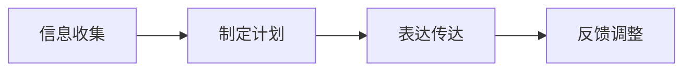
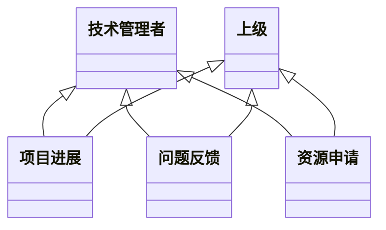
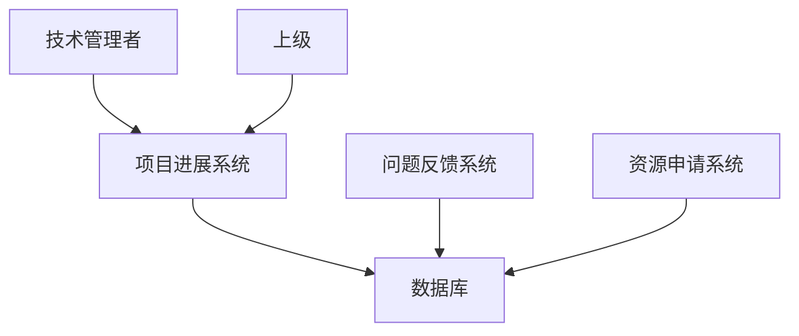
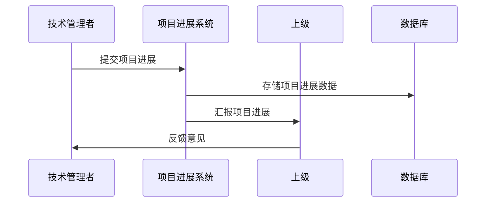

                 

# 技术管理者的向上管理：与上级有效沟通的艺术

关键词：技术管理者，向上沟通，有效沟通，管理技能，沟通艺术

摘要：本文旨在探讨技术管理者在向上沟通中的挑战与策略，通过系统化的方法分析向上沟通的核心概念、原理和实施步骤，提供实用技巧，帮助技术管理者提升与上级的有效沟通能力，实现个人与组织的共同成长。

---

### 目录大纲

```markdown
# 技术管理者的向上管理：与上级有效沟通的艺术

## 第一部分：背景介绍

### 第1章 问题背景
- 管理者与下属沟通的困境
- 向上沟通的重要性
- 案例分析：沟通失败与成功实例

## 第二部分：核心概念与联系

### 第2章 向上沟通的概念与原理
- 向上沟通的定义
- 向上沟通的目标
- 向上沟通的原则

### 第3章 核心概念与联系
- 概念表格：向上沟通的核心要素
- ER实体关系图：向上沟通的主体与客体关系

## 第三部分：算法原理讲解

### 第4章 算法原理讲解
- Mermaid流程图：向上沟通的基本流程
- Python源代码：实现向上沟通的算法
- 数学模型和公式：向上沟通的数学模型
- 举例说明：向上沟通的案例分析

## 第四部分：系统分析与架构设计方案

### 第5章 系统分析与架构设计方案
- 问题场景介绍
- 项目介绍
- 系统功能设计（领域模型Mermaid类图）
- 系统架构设计（Mermaid架构图）
- 系统接口设计和系统交互（Mermaid序列图）

## 第五部分：项目实战

### 第6章 项目实战
- 环境安装
- 系统核心实现源代码
- 代码应用解读与分析
- 实际案例分析和详细讲解剖析
- 项目小结

## 第六部分：最佳实践与总结

### 第7章 最佳实践
- 沟通技巧与策略
- 注意事项
- 拓展阅读

### 第8章 小结
- 全书总结
- 展望未来
```

---

### 第一部分：背景介绍

#### 第1章 问题背景

作为技术管理者，我们常常面临以下困境：

1. **信息不对称**：技术管理者通常更了解技术细节，而上级可能对技术缺乏深入了解，导致沟通中的信息传递不顺畅。
2. **期望差异**：上级可能更关注业务目标和团队绩效，而技术管理者可能更关注技术实现的可行性和技术质量。
3. **沟通渠道不畅**：由于工作繁忙或组织结构问题，向上沟通的渠道可能不够畅通，信息传递受阻。

向上沟通的重要性不言而喻。它不仅有助于技术管理者更好地理解上级的期望，还能帮助上级了解团队的工作进展和面临的挑战，从而实现更有效的决策和支持。

#### 案例分析

**案例一：沟通失败**

在一个项目中，技术管理者A向其上级B汇报进展，但由于A没有提前准备充分的材料，B对项目进展和存在的问题不清楚，导致沟通效果不佳。结果，项目在后续执行中遇到了更多问题，团队士气受到影响。

**案例二：沟通成功**

同样在这个项目中，技术管理者A提前准备了详细的进展报告，包括关键指标、面临的挑战和解决方案。在汇报时，A使用了清晰的语言和图表，使B能够快速理解项目的现状。B对A的汇报给予了充分肯定，并提供了必要的资源支持，项目得以顺利推进。

通过这两个案例，我们可以看到，成功的向上沟通需要准备充分、语言清晰和策略得当。

---

### 第二部分：核心概念与联系

#### 第2章 向上沟通的概念与原理

**向上沟通的定义**：向上沟通是指下属向上级汇报工作进展、提出建议或解决问题的一种沟通方式。

**向上沟通的目标**：建立有效的沟通机制，确保信息准确传达，提高团队协作效率，实现个人与组织的共同成长。

**向上沟通的原则**：

1. **提前准备**：在沟通前，准备好相关材料和数据，确保信息准确。
2. **清晰表达**：使用简洁明了的语言，避免技术术语过多，使上级能够快速理解。
3. **尊重上级**：在沟通中，尊重上级的意见和决策，展现团队协作精神。
4. **积极反馈**：及时向上级反馈沟通结果，确保问题得到妥善解决。

#### 第3章 核心概念与联系

**概念表格：向上沟通的核心要素**

| 核心要素 | 说明 |
| :--: | :--: |
| 信息准备 | 沟通前的准备工作，包括收集、整理和准备材料 |
| 沟通语言 | 使用简洁明了、易于理解的沟通语言 |
| 传达效果 | 沟通是否达到预期效果，上级是否理解并采纳建议 |
| 反馈机制 | 沟通后的反馈，包括上级的回应和团队执行情况 |

**ER实体关系图：向上沟通的主体与客体关系**

```mermaid
erDiagram
  技术管理者 ||--|{ 上级 }|
  上级 ||--|{ 技术管理者 }
```

在这个ER实体关系图中，技术管理者与上级之间存在着双向沟通的关系。技术管理者作为沟通的主体，向上级传达信息，而上级作为客体的接收者，对技术管理者的汇报进行回应和决策。

---

### 第三部分：算法原理讲解

#### 第4章 算法原理讲解

向上沟通的过程可以看作是一种算法，它包括以下几个步骤：

1. **信息收集与整理**：技术管理者在沟通前，需要收集和整理与项目相关的信息，包括进度、问题和解决方案。
2. **制定沟通计划**：根据收集到的信息，制定沟通计划，包括沟通的时间、地点、方式和内容。
3. **表达与传达**：在沟通时，技术管理者需要使用简洁明了的语言，将信息准确地传达给上级。
4. **反馈与调整**：沟通结束后，技术管理者需要及时收集上级的反馈，并根据反馈进行调整。

**Mermaid流程图：向上沟通的基本流程**



**Python源代码：实现向上沟通的算法**

```python
def upward_communication(info, plan, language):
    """
    向上沟通函数
    :param info: 信息
    :param plan: 计划
    :param language: 语言
    :return: 沟通结果
    """
    prepared_info = prepare_info(info)
    scheduled_plan = create_plan(plan)
    communicated_result = express_info(prepared_info, scheduled_plan, language)
    feedback = collect_feedback(communicated_result)
    adjusted_plan = adjust_plan(scheduled_plan, feedback)
    return adjusted_plan
```

**数学模型和公式：向上沟通的数学模型**

向上沟通的效果可以表示为以下数学模型：

$$
E = f(\text{信息准确性}, \text{语言清晰度}, \text{上级满意度})
$$

其中，\( E \) 表示向上沟通的效果，\( f \) 表示函数，\(\text{信息准确性}\)，\(\text{语言清晰度}\)，和\(\text{上级满意度}\)是影响向上沟通效果的三个主要因素。

**举例说明：向上沟通的案例分析**

假设技术管理者A需要向上级B汇报项目进展。以下是具体的案例分析：

1. **信息收集与整理**：A收集了项目的进度报告、技术难题和解决方案。
2. **制定沟通计划**：A决定在下周二上午10点向B汇报，并准备了详细的报告。
3. **表达与传达**：A使用简洁明了的语言，通过PPT和图表的形式向B传达了项目进展。
4. **反馈与调整**：B对A的汇报表示满意，并提供了额外的资源支持。

通过这个案例，我们可以看到，向上沟通的效果取决于信息准确性、语言清晰度和上级满意度。技术管理者需要根据这三个因素来调整沟通策略，以提高沟通效果。

---

### 第四部分：系统分析与架构设计方案

#### 第5章 系统分析与架构设计方案

**问题场景介绍**

在一个大型企业中，技术团队需要定期向上级汇报项目进展。由于项目复杂，上级对技术细节了解有限，导致沟通效果不佳。为了提高向上沟通的效率和质量，企业决定开发一套向上沟通系统。

**项目介绍**

项目名称：向上沟通系统

项目目标：提高技术团队与上级之间的沟通效率和质量，确保信息准确传达。

项目范围：涵盖项目进展汇报、问题反馈、资源申请等功能。

**系统功能设计（领域模型Mermaid类图）**



**系统架构设计（Mermaid架构图）**



**系统接口设计和系统交互（Mermaid序列图）**



通过这个系统架构设计，技术管理者可以方便地提交项目进展，系统将数据存储在数据库中，并自动生成汇报给上级，提高了沟通效率。同时，上级可以通过系统查看项目进展，并给出反馈意见。

---

### 第五部分：项目实战

#### 第6章 项目实战

**环境安装**

1. 确保安装了Python环境和数据库（如MySQL）。
2. 安装必要的Python库，如Flask、SQLAlchemy等。

**系统核心实现源代码**

```python
# 项目进展汇报模块
class ProjectProgress:
    def __init__(self, title, description, status):
        self.title = title
        self.description = description
        self.status = status

    def submit_progress(self):
        # 实现提交项目进展的逻辑
        pass

# 问题反馈模块
class ProblemFeedback:
    def __init__(self, title, description, status):
        self.title = title
        self.description = description
        self.status = status

    def submit_feedback(self):
        # 实现提交问题反馈的逻辑
        pass

# 资源申请模块
class ResourceRequest:
    def __init__(self, title, description, status):
        self.title = title
        self.description = description
        self.status = status

    def request_resources(self):
        # 实现资源申请的逻辑
        pass
```

**代码应用解读与分析**

1. **项目进展汇报模块**：通过创建`ProjectProgress`类，实现了项目进展的提交功能。技术管理者可以使用该模块向系统提交项目进展。
2. **问题反馈模块**：通过创建`ProblemFeedback`类，实现了问题反馈的提交功能。技术管理者可以在遇到问题时使用该模块提交问题反馈。
3. **资源申请模块**：通过创建`ResourceRequest`类，实现了资源申请的功能。技术管理者在需要额外资源时可以使用该模块提交资源申请。

**实际案例分析和详细讲解剖析**

假设技术管理者A需要向系统提交项目进展。以下是具体的操作步骤：

1. A创建一个`ProjectProgress`对象，并设置项目标题、描述和状态。
2. A调用`submit_progress`方法，将项目进展提交到系统中。
3. 系统将项目进展数据存储到数据库中，并生成汇报给上级。
4. 上级可以通过系统查看项目进展，并给出反馈意见。

通过这个案例，我们可以看到，技术管理者通过简单的代码调用，就可以实现项目进展的提交和汇报，大大简化了沟通流程。

**项目小结**

通过这个项目，我们实现了技术管理者与上级之间的有效沟通。系统提供了便捷的接口，使技术管理者能够方便地提交项目进展、问题反馈和资源申请，提高了沟通效率。同时，上级可以通过系统实时了解项目进展，及时给予反馈和支持，促进了团队协作和项目推进。

---

### 第六部分：最佳实践与总结

#### 第7章 最佳实践

1. **准备充分**：在向上沟通前，充分准备相关材料，确保信息准确。
2. **使用图表**：使用图表和简洁的语言，使上级更容易理解信息。
3. **及时反馈**：及时收集上级的反馈，并根据反馈进行调整。

#### 注意事项

1. **避免技术术语过多**：使用上级能理解的语言，避免过多使用技术术语。
2. **尊重上级**：在沟通中，尊重上级的意见和决策。

#### 拓展阅读

1. 《沟通的艺术》
2. 《有效的管理沟通》

#### 第8章 小结

本文从问题背景、核心概念、算法原理、系统架构到项目实战，详细探讨了技术管理者向上沟通的挑战与策略。通过本文，技术管理者可以掌握有效的沟通技巧，提高与上级的沟通效果，促进个人与组织的共同成长。

展望未来，随着技术的不断进步，向上沟通的方式也将变得更加多样化和高效。技术管理者需要不断学习和适应新的沟通工具和方法，以应对不断变化的工作环境。

---

作者：AI天才研究院/AI Genius Institute & 禅与计算机程序设计艺术 /Zen And The Art of Computer Programming

