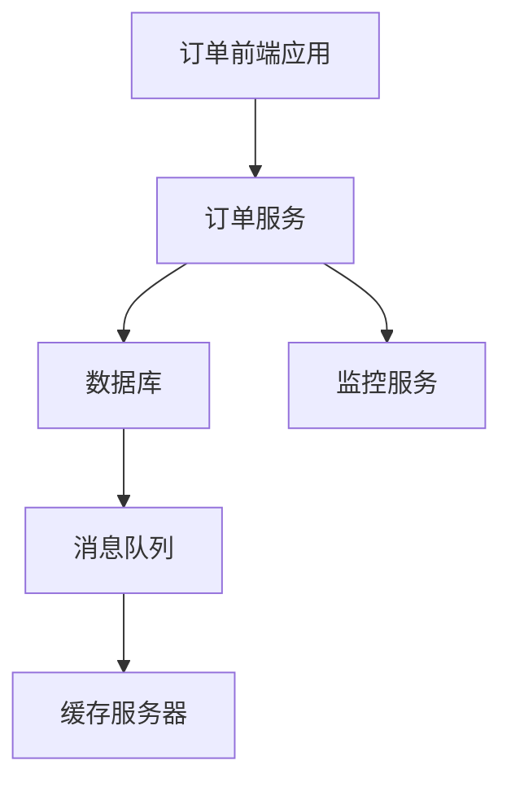
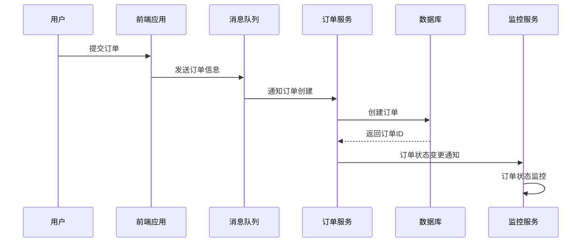

                 

### 第一部分：背景介绍

在当今快速发展的技术环境中，技术管理者面临着前所未有的挑战。从传统的IT运维到如今的人工智能、大数据和云计算，技术正在深刻地影响着商业运作的各个方面。作为技术管理者，不仅要具备卓越的技术能力，还需要具备深厚的商业意识。技术决策的经济学考量，正是技术管理者需要掌握的重要技能。

#### 1.1 问题背景

**技术管理者的角色变迁**：
过去，技术管理者的主要任务是确保系统的稳定运行和安全性。然而，随着技术的发展，技术管理者的角色也在不断演变。他们不再仅仅是技术专家，还需要成为战略伙伴，参与到企业的业务决策中。例如，如何利用人工智能优化业务流程，如何通过大数据分析洞察市场需求，如何构建云计算平台来降低成本，这些都需要技术管理者具备商业意识。

**商业意识的重要性**：
商业意识指的是对市场、消费者需求、成本效益分析等商业要素的理解和运用。对于技术管理者来说，具备商业意识可以更好地将技术应用于实际业务中，从而提升企业的竞争力。例如，通过成本效益分析，技术管理者可以决定是否采用新技术来替代现有系统；通过市场需求分析，可以预测技术的应用前景，从而为企业的发展提供方向。

**技术决策的经济考量**：
技术决策不仅仅是技术问题，更是经济问题。技术管理者在做出技术决策时，需要考虑投入产出比、成本效益、风险评估等因素。例如，在决定是否购买新的硬件设备时，需要考虑其使用寿命、维护成本和性能提升带来的收益。

#### 1.2 问题描述

**技术与商业的脱节现象**：
尽管技术管理者具备深厚的专业技术知识，但在实际业务中，往往会出现技术与商业脱节的现象。例如，技术团队开发了一套高效能的系统，但企业高层却认为该系统成本过高，无法带来足够的商业价值。这种脱节现象不仅影响了技术的应用效果，还可能导致技术资源的浪费。

**技术决策中的常见误区**：
技术管理者在做出决策时，可能会陷入一些误区。例如，过分依赖技术指标而忽视商业需求；或者只关注短期收益而忽视长期发展。这些误区可能会导致技术决策的不合理，从而影响企业的整体战略。

**经济学在技术决策中的应用**：
经济学为技术决策提供了理论框架和工具。通过经济学原理，技术管理者可以更全面地评估技术的商业价值。例如，成本效益分析可以帮助技术管理者衡量不同技术方案的成本和收益；风险评估可以帮助技术管理者评估技术决策的风险程度。

#### 1.3 问题解决

**商业意识的核心要素**：
商业意识的核心要素包括成本效益分析、风险评估、市场需求分析等。成本效益分析可以帮助技术管理者评估不同技术方案的成本和收益；风险评估可以帮助技术管理者预测技术决策的风险和不确定性；市场需求分析可以帮助技术管理者了解市场的需求和趋势，从而做出更为合理的技术决策。

**经济学原理在技术决策中的应用**：
经济学原理为技术决策提供了理论支持。例如，微观经济学中的市场结构与竞争理论可以帮助技术管理者了解市场的竞争态势，从而制定合适的技术战略；宏观经济学中的国民收入与经济增长理论可以帮助技术管理者预测技术对企业发展的长期影响。

#### 1.4 边界与外延

**技术决策的范畴**：
技术决策的范畴涵盖了从硬件设备的选择到软件系统的开发，从技术升级到新技术的引入等方面。技术管理者需要在这些范畴内进行决策，以实现技术资源的最佳利用。

**商业意识的技术界限**：
商业意识的技术界限在于如何将技术应用于实际业务中，以提升企业的竞争力。技术管理者需要超越单纯的技术视角，从商业的角度思考技术决策的影响和意义。

#### 1.5 概念结构与核心要素组成

**技术管理者的职责**：
技术管理者的职责不仅仅是技术层面的管理，还包括战略层面的规划。技术管理者需要从商业角度出发，制定技术战略，确保技术资源与业务需求相匹配。

**商业意识的结构**：
商业意识的结构包括对市场、消费者需求、成本效益分析等商业要素的理解和运用。技术管理者需要通过这些要素，将技术应用于实际业务中。

**经济学考量在技术决策中的地位**：
经济学考量在技术决策中具有核心地位。技术管理者需要运用经济学原理，全面评估技术方案的成本和收益，从而做出更为合理的技术决策。

### 总结

本部分主要介绍了技术管理者的角色变迁、商业意识的重要性以及技术决策的经济考量。通过了解这些背景信息，技术管理者可以更好地理解技术决策的复杂性，从而在未来的技术管理工作中做出更为合理的决策。

### 1.6 技术管理者的角色变迁

随着科技的迅猛发展，技术管理者的角色也在不断演变。在过去，技术管理者的主要职责是确保系统的稳定性和安全性。然而，随着商业环境的变化和技术的进步，技术管理者的职责已经不再局限于技术本身，而是逐渐向战略层面延伸。

#### 从技术运维到战略伙伴

传统意义上的技术管理者，主要职责是维护系统的正常运行，确保网络安全和数据完整性。然而，随着云计算、大数据、人工智能等新兴技术的广泛应用，技术管理者的职责已经不再仅限于技术运维。他们需要更深入地参与到企业的战略决策中，成为企业的战略伙伴。

**案例1：云计算的普及**
随着云计算的普及，技术管理者需要了解云计算的架构、性能和成本效益，以便为企业选择最适合的云服务提供商，制定云迁移策略。这不仅需要技术知识，还需要对企业的业务需求有深入的理解。

**案例2：人工智能的应用**
人工智能技术的广泛应用，使得技术管理者需要具备数据科学、机器学习等知识，以便将人工智能技术应用于企业的业务流程中，提升企业的效率和竞争力。

#### 技术与商业融合

技术管理者的角色变迁，也反映了技术与商业的深度融合。过去，技术和商业是两个相对独立的领域。然而，在当今的商业环境中，技术和商业已经无法分割。技术管理者需要具备商业意识，将技术应用于实际业务中，以提升企业的竞争力。

**案例1：数字化营销**
在数字化营销领域，技术管理者需要了解消费者的行为习惯，利用数据分析技术来制定营销策略，提高营销效果。这不仅需要技术能力，还需要对市场和消费者有深入的了解。

**案例2：供应链管理**
在供应链管理领域，技术管理者需要利用大数据技术和人工智能算法，优化供应链流程，提高供应链的效率和灵活性。

#### 商业意识的必要性

为什么技术管理者需要具备商业意识呢？原因在于，技术本身并不是目的，而是提升企业效率和竞争力的手段。如果技术管理者只关注技术本身，而忽视了商业需求和市场环境，那么他们的工作很可能无法为企业带来实际的商业价值。

**案例1：成本控制**
技术管理者需要具备成本意识，通过合理的成本控制策略，确保技术项目的经济效益。例如，在采购硬件设备时，技术管理者需要综合考虑性能、成本、维护等因素，选择最适合企业需求的设备。

**案例2：风险评估**
技术管理者还需要具备风险评估的能力，对技术项目的潜在风险进行评估和管理。例如，在引入新的技术时，技术管理者需要评估该技术的成熟度、市场前景和潜在风险，以确保技术的顺利实施和商业成功。

### 结论

技术管理者的角色变迁，反映了技术与商业的深度融合。作为技术管理者，不仅需要具备深厚的技术知识，还需要具备商业意识，将技术应用于实际业务中，以提升企业的竞争力。通过了解技术管理者的角色变迁和商业意识的必要性，技术管理者可以更好地应对未来的挑战，为企业的发展做出更大的贡献。

### 1.7 商业意识的重要性

商业意识对于技术管理者来说，是一个至关重要的素质。它不仅决定了技术管理者能否在技术领域取得成功，更决定了他们在企业中能否发挥更大的作用。下面，我们将从成本效益分析、风险评估、市场需求分析三个方面，深入探讨商业意识的重要性。

#### 成本效益分析

成本效益分析是商业意识的核心之一。技术管理者在进行技术决策时，需要考虑不同技术方案的成本和效益。通过成本效益分析，技术管理者可以清晰地看到每种技术方案的投资回报，从而做出更为明智的决策。

**案例分析：云计算迁移**

假设一家企业决定将其部分业务迁移到云计算平台。技术管理者需要评估不同云服务提供商的方案，包括成本、性能、可靠性等因素。通过成本效益分析，技术管理者可以确定哪种方案最符合企业的需求，既能保证业务连续性，又能有效控制成本。

**效益衡量指标：**

- **成本节约**：计算不同云服务提供商的年度总成本，包括硬件采购、运维费用等。
- **性能提升**：评估云计算平台对业务性能的提升，如响应时间、吞吐量等。
- **可靠性提高**：考虑云计算平台的高可用性和灾备能力，对业务连续性的保障。

#### 风险评估

在技术决策过程中，风险评估是不可或缺的一环。技术管理者需要识别和评估技术项目可能面临的风险，并制定相应的风险缓解措施。通过风险评估，技术管理者可以提前预测潜在的问题，从而降低技术项目失败的风险。

**案例分析：大数据平台部署**

一家企业计划部署大数据平台，技术管理者需要评估项目中的各种风险，如数据安全、系统性能、技术支持等。通过风险评估，技术管理者可以制定详细的风险管理计划，确保项目的顺利进行。

**风险类型：**

- **技术风险**：如技术选型不当、系统稳定性问题等。
- **业务风险**：如业务需求变更、市场不确定性等。
- **操作风险**：如人员培训不足、运维管理不善等。

#### 市场需求分析

市场需求分析是商业意识的另一个重要方面。技术管理者需要了解市场的需求和趋势，以便为企业提供符合市场需求的技术解决方案。通过市场需求分析，技术管理者可以确保技术项目的商业价值，从而获得企业高层和管理团队的支持。

**案例分析：物联网解决方案**

随着物联网技术的普及，技术管理者需要了解物联网市场的需求，如智能家居、智能交通、工业物联网等。通过市场需求分析，技术管理者可以确定物联网解决方案的关键技术和应用场景，为企业提供切实可行的技术方案。

**需求分析指标：**

- **市场容量**：评估物联网市场的规模和增长潜力。
- **技术成熟度**：分析物联网技术的成熟度和市场接受度。
- **消费者行为**：了解消费者的需求和行为模式，为物联网解决方案提供个性化服务。

### 结论

商业意识对于技术管理者来说，是不可或缺的素质。通过成本效益分析、风险评估和市场需求分析，技术管理者可以更全面地评估技术方案的商业价值，从而做出更为合理和有效的技术决策。具备商业意识的技术管理者，不仅能够在技术领域取得成功，更能够为企业的发展做出更大的贡献。

### 1.8 技术决策的经济考量

技术决策不仅仅是一个技术问题，更是一个经济问题。技术管理者在做出技术决策时，需要综合考虑多个经济因素，包括成本、效益、风险评估等。以下，我们将详细讨论技术决策的经济考量，并分析其在不同技术方案选择中的应用。

#### 成本考量

成本是技术决策中最直接的经济考量。技术管理者需要全面评估不同技术方案的成本，包括初始投资、运营成本、维护成本等。通过成本分析，技术管理者可以确定哪种技术方案在财务上最为可行。

**案例分析：新硬件设备采购**

假设一家企业计划采购新的硬件设备来提升数据处理能力。技术管理者需要评估不同硬件设备的成本，包括购买价格、安装费用、维护成本等。通过成本分析，技术管理者可以确定哪种硬件设备在成本上最具竞争力，从而为企业节省开支。

**成本分析指标：**

- **初始投资**：计算不同硬件设备的购买价格和安装费用。
- **运营成本**：评估硬件设备的电力消耗、冷却费用等日常运营成本。
- **维护成本**：考虑硬件设备的故障率、维护费用等。

#### 效益考量

效益是技术决策中的另一个重要经济因素。技术管理者需要评估不同技术方案带来的效益，包括提升工作效率、降低运营成本、增加收入等。通过效益分析，技术管理者可以确定哪种技术方案能够在长期内为企业带来最大的收益。

**案例分析：自动化流程部署**

假设一家制造企业计划部署自动化流程以提高生产效率。技术管理者需要评估自动化方案带来的效益，包括减少人力成本、提高生产效率、减少错误率等。通过效益分析，技术管理者可以确定自动化方案是否值得投资。

**效益分析指标：**

- **工作效率提升**：计算自动化流程对工作效率的改善程度。
- **成本节约**：评估自动化流程带来的成本节约，如人力成本、运营成本等。
- **收入增加**：考虑自动化流程对业务收入的潜在影响。

#### 风险评估

在技术决策过程中，风险评估同样至关重要。技术管理者需要识别和评估不同技术方案可能面临的风险，包括技术风险、市场风险、操作风险等。通过风险评估，技术管理者可以制定相应的风险管理策略，降低技术决策的不确定性。

**案例分析：人工智能应用**

假设一家企业计划引入人工智能技术来提升数据分析能力。技术管理者需要评估人工智能应用中的各种风险，如技术实现的可行性、数据隐私问题、市场接受度等。通过风险评估，技术管理者可以确定人工智能方案的可行性，并制定相应的风险缓解措施。

**风险评估指标：**

- **技术风险**：评估人工智能技术的成熟度和可靠性。
- **市场风险**：分析市场对人工智能技术的接受度和竞争态势。
- **操作风险**：考虑技术实施过程中的操作风险，如人员培训、系统兼容性等。

#### 技术方案选择

基于上述经济考量，技术管理者需要在不同技术方案中进行选择。通过综合成本、效益和风险评估，技术管理者可以确定哪种技术方案在财务上最为合理，能够在长期内为企业带来最大的价值。

**案例分析：数据中心建设**

假设一家企业计划建设一个新的数据中心。技术管理者需要评估不同建设方案，包括自建、租赁、托管等。通过成本效益分析和风险评估，技术管理者可以确定哪种方案在财务上最为可行，并能够满足企业的需求。

**选择标准：**

- **成本效益**：选择在成本效益上最优的技术方案。
- **风险评估**：选择风险最低的技术方案。
- **长远规划**：考虑技术方案的长期可行性和扩展性。

### 结论

技术决策的经济考量是一个复杂且多维的过程，需要技术管理者具备全面的经济分析能力。通过综合考虑成本、效益和风险评估，技术管理者可以做出更为合理的技术决策，从而为企业的发展提供有力支持。具备深厚经济考量的技术管理者，将在未来的技术管理工作中发挥更为重要的作用。

### 1.9 技术决策的基本原理

技术决策是一个复杂的过程，涉及到多个方面的考量。理解技术决策的基本原理，可以帮助技术管理者更加科学和系统地做出技术决策。以下是技术决策的基本原理及其应用。

#### 1.9.1 技术决策的定义

技术决策是指根据企业的需求和资源条件，选择最合适的技术方案以满足业务需求的过程。技术决策不仅包括选择技术解决方案，还涉及技术实施、管理和维护等多个环节。

**定义要点：**

- **企业需求**：技术决策的首要目标是满足企业的业务需求，包括提升效率、降低成本、增加收入等。
- **资源条件**：技术决策需要考虑企业的资源条件，如预算、人员、技术储备等。
- **技术方案**：技术决策的核心是选择合适的技术方案，包括硬件设备、软件系统、技术架构等。

#### 1.9.2 技术决策的过程

技术决策的过程可以分为以下几个阶段：

1. **需求分析**：了解企业的业务需求，明确技术决策的目标和范围。
2. **方案评估**：根据需求分析结果，评估不同的技术方案，包括成本、效益、风险等因素。
3. **决策制定**：综合考虑评估结果，制定最终的技术决策方案。
4. **方案实施**：根据技术决策方案，进行技术实施和部署。
5. **效果评估**：对技术实施效果进行评估，包括业务性能、成本效益、用户满意度等。

**过程要点：**

- **需求分析**：需求分析是技术决策的基础，需要准确理解企业的业务需求，确保技术方案能够真正满足业务需求。
- **方案评估**：方案评估需要综合考虑多个因素，如成本、效益、风险等，选择最合适的技术方案。
- **决策制定**：决策制定需要基于科学的数据和分析，避免主观判断和盲目决策。
- **方案实施**：方案实施需要确保技术方案能够顺利落地，并达到预期的效果。
- **效果评估**：效果评估可以帮助技术管理者了解技术决策的实际效果，为后续的技术决策提供参考。

#### 1.9.3 技术决策的类型

根据技术决策的目标和特点，可以将技术决策分为以下几种类型：

1. **常规性决策**：常规性决策通常是对常见问题的重复性决策，如系统升级、硬件采购等。常规性决策可以依据经验和标准流程进行，决策过程较为简单。
2. **战略性决策**：战略性决策通常涉及企业的长远发展和重大技术项目，如新技术引入、系统重构等。战略性决策需要深入分析市场需求、技术发展趋势和企业战略，决策过程更为复杂和关键。
3. **突发性决策**：突发性决策通常是在紧急情况下需要快速做出的技术决策，如系统故障、网络安全威胁等。突发性决策需要快速反应和有效应对，以最大限度地减少对企业的影响。

**类型要点：**

- **常规性决策**：常规性决策注重流程和经验，决策过程相对固定和简单。
- **战略性决策**：战略性决策注重长远规划和战略布局，决策过程复杂且关键。
- **突发性决策**：突发性决策注重快速反应和有效应对，决策过程迅速但需要精准判断。

#### 1.9.4 技术决策的基本原理应用

技术决策的基本原理可以应用于企业的各个方面，如系统架构设计、技术方案选择、技术风险管理等。

**案例分析：系统架构设计**

在企业系统架构设计中，技术管理者需要根据业务需求和资源条件，选择合适的技术架构。通过需求分析，明确系统的性能、可扩展性和安全性要求；通过方案评估，分析不同架构方案的优缺点，如微服务架构、分布式架构等；通过决策制定，选择最适合企业的技术架构方案；通过方案实施，确保技术架构能够顺利落地；通过效果评估，评估技术架构的实际效果，为后续的改进提供参考。

**案例分析：技术方案选择**

在技术方案选择中，技术管理者需要根据企业的需求和经济考量，选择最适合的技术方案。通过需求分析，明确企业的技术需求和应用场景；通过方案评估，分析不同技术方案的优缺点，如开源技术、商业软件等；通过决策制定，选择最适合企业的技术方案；通过方案实施，确保技术方案能够顺利实施和达到预期效果；通过效果评估，评估技术方案的实际效果，为后续的优化提供依据。

**案例分析：技术风险管理**

在技术风险管理中，技术管理者需要识别和评估技术项目中的各种风险，并制定相应的风险缓解措施。通过需求分析，了解技术项目的目标和风险点；通过方案评估，分析不同风险管理策略的优缺点；通过决策制定，选择最适合企业的风险管理方案；通过方案实施，确保风险管理措施能够有效执行；通过效果评估，评估风险管理措施的实际效果，为后续的风险管理提供参考。

### 结论

技术决策的基本原理是技术管理者在进行技术决策时需要遵循的基本原则和方法。通过理解技术决策的基本原理，技术管理者可以更加科学和系统地做出技术决策，确保技术决策的科学性和有效性。在实际应用中，技术管理者需要结合企业的实际情况，灵活运用基本原理，以提高技术决策的成功率。

### 2.2 商业意识的关键要素

商业意识是技术管理者不可或缺的素质，它帮助技术管理者将技术能力与商业目标相结合，从而推动企业的发展。商业意识的关键要素包括成本效益分析、风险评估和市场需求分析。以下，我们将逐一探讨这些要素的定义、属性及其对比。

#### 2.2.1 成本效益分析

成本效益分析是一种评估技术方案成本与收益的方法，旨在确定技术投入能否带来相应的商业价值。它通过对比不同方案的投入产出比，帮助技术管理者做出经济上合理的决策。

**定义：**
成本效益分析是指通过比较技术方案的总成本与预期收益，评估其经济可行性的过程。

**属性：**
1. **成本**：包括初始投资、运营成本、维护成本等。
2. **效益**：包括经济效益（如收入增加、成本节约）和非经济效益（如用户体验提升、品牌价值）。
3. **比较**：对不同技术方案进行成本与效益的对比，选择最优方案。

**对比：**
与传统财务分析相比，成本效益分析更注重长期和全面的效益评估，不仅考虑直接经济效益，还考虑潜在的商业价值和影响。

#### 2.2.2 风险评估

风险评估是商业意识中另一个关键要素，它帮助技术管理者识别、评估和管理技术项目中的潜在风险。通过风险评估，技术管理者可以制定相应的风险应对策略，确保技术决策的安全性和可靠性。

**定义：**
风险评估是指通过识别、评估和管理技术项目中的潜在风险，确定风险程度和可能影响的过程。

**属性：**
1. **风险识别**：识别项目可能面临的各种风险，如技术风险、市场风险、操作风险等。
2. **风险评估**：评估每个风险的可能性和影响程度，确定风险的优先级。
3. **风险应对**：制定相应的风险缓解措施，如风险规避、风险转移、风险接受等。

**对比：**
与纯粹的技术风险评估不同，商业意识下的风险评估更注重商业影响和决策层面的考虑，不仅仅是技术问题，还涉及到商业战略和资源分配。

#### 2.2.3 市场需求分析

市场需求分析是商业意识中的核心要素之一，它帮助技术管理者了解市场的需求和趋势，从而为企业提供符合市场需求的技术解决方案。通过市场需求分析，技术管理者可以确保技术决策的商业可行性和市场适应性。

**定义：**
市场需求分析是指通过研究和分析市场数据，了解消费者的需求、偏好和购买行为，预测市场需求趋势的过程。

**属性：**
1. **市场研究**：收集和分析市场数据，包括市场规模、增长趋势、竞争态势等。
2. **消费者分析**：了解消费者的需求、购买习惯和偏好。
3. **需求预测**：根据市场研究和消费者分析，预测未来的市场需求。

**对比：**
与传统市场调研相比，商业意识下的市场需求分析更注重与技术和业务需求的结合，以确保技术解决方案能够真正满足市场的需求。

### 2.2.4 成本效益分析、风险评估和市场需求分析的整合

在技术决策中，成本效益分析、风险评估和市场需求分析是相互关联的，一个有效的技术决策需要综合考虑这三个要素。

**整合方式：**
1. **同步进行**：在进行成本效益分析的同时，识别和评估潜在的风险，确保经济上的可行性。
2. **数据共享**：将市场需求分析的结果与成本效益分析和风险评估相结合，确保技术方案的市场适应性和商业价值。
3. **动态调整**：根据市场需求和风险评估的结果，动态调整技术决策方案，以适应不断变化的市场环境和商业需求。

### 结论

成本效益分析、风险评估和市场需求分析是商业意识中的关键要素，它们共同构成了技术决策的经济基础。通过综合运用这些要素，技术管理者可以做出更为科学和合理的决策，确保技术解决方案不仅技术上可行，而且在商业上具有可持续性。具备这些商业意识的关键要素，是技术管理者在快速变化的市场环境中脱颖而出的关键。

### 2.3 经济学原理及其应用

经济学原理为技术管理者提供了强大的工具，帮助他们更好地理解技术决策的经济基础。以下是微观经济学和宏观经济学中的关键原理，以及这些原理在技术决策中的应用。

#### 2.3.1 微观经济学基础

微观经济学主要研究个体经济单位（如消费者、厂商）的行为和市场机制。以下是几个核心原理及其在技术决策中的应用：

**市场结构与竞争**

**原理**：市场结构决定了市场竞争的程度和厂商的行为。根据市场结构的分类，市场可以分为完全竞争、垄断、垄断竞争和寡头垄断。

**应用**：在技术决策中，了解市场结构有助于选择合适的技术战略。例如，在完全竞争市场中，技术管理者需要关注成本效益，通过技术创新降低成本；而在垄断市场中，技术管理者可能需要关注市场领导地位的维护和垄断利润的获取。

**消费者行为**

**原理**：消费者行为是指消费者在购买商品或服务时的决策过程。影响消费者行为的因素包括价格、收入、个人偏好和替代品等。

**应用**：在技术决策中，了解消费者行为有助于制定符合市场需求的技术方案。例如，通过数据分析，技术管理者可以预测消费者的需求变化，从而调整产品功能和技术规格，以更好地满足消费者需求。

**生产要素理论**

**原理**：生产要素理论指出，生产活动需要使用劳动、土地、资本和企业家精神等生产要素。每种要素的价格决定了生产成本。

**应用**：在技术决策中，生产要素理论有助于优化资源配置。技术管理者需要评估不同生产要素的成本和效益，选择最优的生产方式和技术方案，以降低成本并提高生产效率。

#### 2.3.2 宏观经济学基础

宏观经济学研究整个经济体系的行为，包括国民收入、经济增长、货币政策和财政政策等。以下是几个核心原理及其在技术决策中的应用：

**国民收入与经济增长**

**原理**：国民收入是指一个国家在一定时期内生产的所有最终产品和服务的市场价值总和。经济增长是指国民收入的长期增长。

**应用**：在技术决策中，了解经济增长趋势有助于预测市场需求和投资回报。例如，在经济增长较快的行业，技术管理者可以预测市场需求增长，从而加大对新技术和基础设施的投资。

**货币政策与财政政策**

**原理**：货币政策是指通过调整货币供应量和利率来影响经济活动。财政政策是指通过调整政府支出和税收来影响经济活动。

**应用**：在技术决策中，货币政策与财政政策的影响需要被考虑。例如，在货币政策宽松时期，技术管理者可以预测资金成本降低，从而增加对技术项目的投资；在财政政策紧缩时期，技术管理者需要考虑成本控制和资源优化。

**宏观经济稳定性**

**原理**：宏观经济稳定性是指通过宏观经济政策来保持经济稳定，防止通货膨胀和经济衰退。

**应用**：在技术决策中，宏观经济稳定性对投资决策有直接影响。技术管理者需要关注宏观经济政策的变化，以便调整技术投资策略，确保项目的经济可行性。

#### 2.3.3 经济学模型及其应用

经济学模型是经济学原理的具体应用，通过数学和统计学方法来描述经济现象。以下是几个常用的经济学模型及其在技术决策中的应用：

**成本—收益分析模型**

**模型**：成本—收益分析模型用于评估技术项目的成本和收益，确定项目是否值得投资。

**应用**：在技术决策中，成本—收益分析模型可以帮助技术管理者评估不同技术方案的投入产出比。通过计算项目的净现值（NPV）和内部收益率（IRR），技术管理者可以确定项目是否具有经济可行性。

**投资决策模型**

**模型**：投资决策模型用于评估技术项目的投资回报，选择最佳的投资方案。

**应用**：在技术决策中，投资决策模型可以帮助技术管理者比较不同技术方案的投资回报。通过计算项目的回收期和投资回报率，技术管理者可以确定哪种技术方案更优。

**供应链管理模型**

**模型**：供应链管理模型用于优化供应链流程，提高供应链效率和降低成本。

**应用**：在技术决策中，供应链管理模型可以帮助技术管理者优化供应链管理。例如，通过计算供应链的库存成本和运输成本，技术管理者可以确定最佳库存水平和运输策略，从而降低成本并提高效率。

### 结论

经济学原理为技术管理者提供了强大的工具，帮助他们更好地理解和评估技术决策的经济基础。通过运用微观经济学和宏观经济学原理，技术管理者可以更科学地制定技术战略，优化资源配置，确保技术项目在商业上具有可持续性。经济学模型的应用，则为技术管理者提供了具体的工具和方法，以实现技术决策的精确化和优化。

### 2.4 技术与商业的融合

在当今的商业环境中，技术与商业的融合已成为企业成功的关键。技术管理者不仅需要具备深厚的技术知识，还需要具备商业意识，将技术能力与商业目标相结合，从而实现企业的战略目标。以下是技术与商业融合的几个关键方面：

#### 2.4.1 技术商业化的挑战

**创新与市场适应**

技术商业化过程中，最大的挑战之一是如何将技术创新与市场需求相结合。技术创新可能带来前所未有的功能和性能，但如果无法满足市场的需求，这些创新将无法为企业带来商业价值。因此，技术管理者需要深入了解市场趋势和消费者需求，确保技术创新能够真正解决市场痛点。

**成本效益分析**

在技术商业化过程中，成本效益分析是另一个重要的考量因素。技术管理者需要评估新技术带来的成本和效益，确保投入产出比合理。这要求技术管理者具备全面的财务知识和成本控制能力，以便在技术商业化过程中实现经济效益最大化。

**风险管理**

技术商业化还涉及到风险的管理。技术管理者需要识别和评估技术项目中的各种风险，如技术实现风险、市场风险、操作风险等，并制定相应的风险管理策略。通过有效的风险管理，技术管理者可以降低技术商业化过程中的不确定性和风险，确保项目的顺利进行。

#### 2.4.2 商业技术的创新

**数字化转型**

数字化转型是商业技术创新的典型例子。通过利用云计算、大数据、人工智能等技术，企业可以实现业务的数字化转型，提高运营效率、降低成本、提升客户体验。技术管理者需要引领这一变革，推动企业向数字化、智能化方向转型。

**案例分析：阿里巴巴的数字化转型**

阿里巴巴作为全球领先的电子商务企业，通过数字化转型实现了业务的快速扩展和增长。阿里巴巴利用云计算技术提升了数据处理能力，通过大数据分析优化了供应链管理，通过人工智能技术提升了客户服务质量。这些技术应用的深度融合，不仅提升了阿里巴巴的竞争力，还为其带来了巨大的商业价值。

**案例分析：宝洁公司的数字化转型**

宝洁公司通过数字化转型，提升了全球供应链的效率和透明度。宝洁利用物联网技术实现了对生产过程的实时监控，通过大数据分析优化了库存管理，通过人工智能技术提升了市场预测的准确性。这些技术应用的融合，使得宝洁能够更好地响应市场需求，提高了生产效率和库存周转率。

#### 2.4.3 技术决策中的商业考量

**市场需求分析**

在技术决策中，市场需求分析是至关重要的一环。技术管理者需要了解市场的需求和趋势，以确保技术解决方案能够真正满足市场需求。通过市场需求分析，技术管理者可以确定哪些技术具有商业潜力，从而为企业提供明确的战略方向。

**成本效益分析**

技术决策中的成本效益分析是确保技术项目经济可行性的关键。技术管理者需要评估不同技术方案的成本和效益，选择最具经济性的方案。通过成本效益分析，技术管理者可以确定技术投入能否带来相应的商业回报。

**风险评估**

技术决策中的风险评估是识别和评估技术项目中的潜在风险，确保项目能够顺利实施。技术管理者需要考虑技术实现风险、市场风险、操作风险等多方面的因素，并制定相应的风险管理策略。通过有效的风险评估，技术管理者可以降低技术决策中的不确定性和风险。

#### 结论

技术与商业的融合是现代企业成功的关键。技术管理者需要具备商业意识，将技术能力与商业目标相结合，从而推动企业的持续发展。通过应对技术商业化的挑战、推动商业技术的创新以及在技术决策中充分考虑商业考量，技术管理者可以为企业创造巨大的商业价值。

### 3.1 技术决策中的算法应用

在技术决策过程中，算法的应用起着至关重要的作用。算法不仅可以帮助技术管理者处理大量复杂的数据，还能提供决策依据，提高决策的科学性和准确性。以下是几种常见的技术决策算法及其应用场景：

#### 3.1.1 数据分析算法

数据分析算法用于处理和分析大规模数据集，帮助技术管理者提取有价值的信息和洞察。以下是一些常见的数据分析算法：

**回归分析**：回归分析是一种用于预测目标变量（因变量）的方法。通过建立因变量与自变量之间的关系模型，技术管理者可以预测未来趋势或评估不同技术方案的效益。

**应用场景**：在成本效益分析中，回归分析可以用来预测不同技术方案的长期成本和收益，从而选择最优方案。

**聚类分析**：聚类分析用于将数据集分成若干个群组，使同组内的数据尽可能相似，不同组的数据尽可能不同。技术管理者可以利用聚类分析识别市场细分群体，优化产品和服务策略。

**应用场景**：在市场需求分析中，聚类分析可以用来分析消费者行为，识别潜在的市场细分群体，从而制定更加精准的市场营销策略。

**关联规则挖掘**：关联规则挖掘用于发现数据集中的关联关系，如哪些产品经常一起购买。技术管理者可以利用这些关联关系优化库存管理和促销策略。

**应用场景**：在供应链管理中，关联规则挖掘可以用来优化库存管理，避免库存过剩或不足，提高供应链效率。

#### 3.1.2 机器学习算法

机器学习算法通过学习和分析数据，能够自动识别模式和规律，为技术决策提供强有力的支持。以下是一些常见的机器学习算法：

**决策树**：决策树是一种基于树形结构的数据挖掘算法，通过一系列规则将数据划分为不同的类别或预测值。技术管理者可以利用决策树进行风险评估和预测。

**应用场景**：在技术风险管理中，决策树可以用来评估技术项目的风险，识别高风险环节，并制定相应的风险应对策略。

**支持向量机（SVM）**：支持向量机是一种用于分类和回归分析的学习算法，通过在特征空间中找到一个最佳的超平面，实现分类或回归目标。技术管理者可以利用SVM进行市场预测和需求分析。

**应用场景**：在市场需求分析中，SVM可以用来预测市场需求，帮助技术管理者制定生产计划和市场推广策略。

**神经网络**：神经网络是一种模拟生物神经系统的计算模型，通过层层传递信息，实现复杂函数的拟合和分类。技术管理者可以利用神经网络进行数据分析和模式识别。

**应用场景**：在数据分析中，神经网络可以用来识别数据中的复杂模式，如用户行为模式、市场趋势等，为技术决策提供参考。

#### 3.1.3 人工智能算法

人工智能算法通过模拟人类智能，实现自动化决策和智能优化。以下是一些常见的人工智能算法：

**强化学习**：强化学习是一种通过试错和反馈来学习最优策略的算法。技术管理者可以利用强化学习优化供应链管理，如库存控制、运输调度等。

**应用场景**：在供应链管理中，强化学习可以用来优化库存策略，减少库存成本，提高供应链效率。

**深度学习**：深度学习是一种基于多层神经网络的学习算法，通过层层提取特征，实现高度复杂的模式识别和预测。技术管理者可以利用深度学习进行图像识别、自然语言处理等。

**应用场景**：在图像识别中，深度学习可以用来识别产品缺陷，提高生产质量；在自然语言处理中，深度学习可以用来分析客户反馈，优化产品和服务。

#### 结论

算法在技术决策中的应用，极大地提高了决策的科学性和准确性。通过数据分析算法、机器学习算法和人工智能算法，技术管理者可以更好地理解和预测市场需求，优化资源配置，降低风险，从而实现企业的商业目标。

### 3.2 算法原理与数学模型

在技术决策中，算法的应用不仅需要深入理解其原理，还需要掌握相应的数学模型。以下是几种常见的技术决策算法的原理和数学模型。

#### 3.2.1 数据分析算法原理

数据分析算法包括回归分析、聚类分析和关联规则挖掘等。以下是这些算法的基本原理和数学模型。

**回归分析**

**原理**：回归分析用于建立自变量和因变量之间的线性关系，通过最小化残差平方和来确定模型参数。

**数学模型**：线性回归模型可以表示为：
$$
Y = \beta_0 + \beta_1X + \epsilon
$$
其中，$Y$是因变量，$X$是自变量，$\beta_0$和$\beta_1$是模型参数，$\epsilon$是误差项。

**应用**：成本效益分析中，回归分析可以用来预测不同技术方案的成本和收益，选择最优方案。

**聚类分析**

**原理**：聚类分析用于将数据集划分为若干个群组，使同组内的数据尽可能相似，不同组的数据尽可能不同。

**数学模型**：K-means算法是一种常见的聚类方法，其目标是最小化每个聚类内部的距离平方和。

**应用**：在市场需求分析中，聚类分析可以用来分析消费者行为，识别市场细分群体。

**关联规则挖掘**

**原理**：关联规则挖掘用于发现数据集中的关联关系，如哪些产品经常一起购买。

**数学模型**：Apriori算法是一种常用的关联规则挖掘方法，其核心思想是通过支持度和置信度来确定关联规则。

**应用**：在供应链管理中，关联规则挖掘可以用来优化库存管理和促销策略。

#### 3.2.2 机器学习算法原理

机器学习算法包括决策树、支持向量机和神经网络等。以下是这些算法的基本原理和数学模型。

**决策树**

**原理**：决策树通过一系列规则将数据划分为不同的类别或预测值。

**数学模型**：决策树可以通过信息增益、基尼不纯度等指标来选择最佳分割点。

**应用**：在技术风险管理中，决策树可以用来评估技术项目的风险。

**支持向量机（SVM）**

**原理**：支持向量机通过在特征空间中找到一个最佳的超平面来实现分类或回归目标。

**数学模型**：SVM的数学模型可以表示为：
$$
\min_{\beta, \beta_0} \frac{1}{2}||\beta||^2 + C \sum_{i=1}^n \xi_i
$$
其中，$\beta$是模型参数，$C$是惩罚参数，$\xi_i$是误差项。

**应用**：在市场需求分析中，SVM可以用来预测市场需求。

**神经网络**

**原理**：神经网络通过多层神经网络实现复杂函数的拟合和分类。

**数学模型**：神经网络的核心是激活函数和反向传播算法。

**应用**：在数据分析中，神经网络可以用来识别复杂的数据模式。

#### 3.2.3 人工智能算法原理

人工智能算法包括强化学习和深度学习等。以下是这些算法的基本原理和数学模型。

**强化学习**

**原理**：强化学习通过试错和反馈来学习最优策略。

**数学模型**：强化学习的数学模型可以表示为：
$$
Q(s, a) = r(s, a, s') + \gamma \max_{a'} Q(s', a')
$$
其中，$Q(s, a)$是状态-动作值函数，$r(s, a, s')$是即时奖励，$\gamma$是折扣因子。

**应用**：在供应链管理中，强化学习可以用来优化库存策略。

**深度学习**

**原理**：深度学习通过多层神经网络实现高度复杂的模式识别和预测。

**数学模型**：深度学习的主要组件包括卷积神经网络（CNN）和循环神经网络（RNN）。

**应用**：在图像识别和自然语言处理中，深度学习可以用来识别复杂的数据模式。

**示例：神经网络结构**

- **输入层**：接收外部输入，如图像像素或文本向量。
- **隐藏层**：进行特征提取和变换，如通过卷积层提取图像特征，通过循环层处理序列数据。
- **输出层**：生成预测结果，如分类结果或回归值。

**应用**：在图像识别中，深度学习可以用来识别产品缺陷；在自然语言处理中，深度学习可以用来分析客户反馈。

### 结论

算法原理和数学模型是技术决策的重要基础。通过掌握这些原理和模型，技术管理者可以更好地理解和应用各种算法，提高决策的科学性和准确性，从而实现企业的商业目标。

### 3.3 系统分析与架构设计方案

在技术决策过程中，系统分析与架构设计方案起着至关重要的作用。一个有效的系统架构不仅能够满足企业的业务需求，还能确保系统的可扩展性、可靠性和性能。以下是一个典型的系统分析与架构设计方案，包括问题场景介绍、项目介绍、系统功能设计、系统架构设计、系统接口设计和系统交互。

#### 3.3.1 问题场景介绍

假设一家电商平台希望引入一套新的订单管理系统，以提高订单处理的效率、降低错误率，并提升客户满意度。现有的订单管理系统已经无法满足业务增长的需求，因此需要进行升级和优化。

**场景描述**：

- **业务需求**：处理大量订单，确保订单处理的及时性和准确性。
- **性能要求**：系统需要能够快速响应订单请求，处理高并发订单。
- **可靠性要求**：系统需要具备高可用性和容错能力，确保业务连续性。
- **扩展性要求**：系统需要能够随着业务增长进行扩展，支持更多的订单处理。

#### 3.3.2 项目介绍

**项目名称**：订单管理系统升级项目

**项目目标**：

- 提高订单处理效率，降低错误率。
- 提升客户满意度，减少客户投诉。
- 确保系统的高可用性和可扩展性。

**项目范围**：

- 订单数据存储和管理
- 订单处理流程自动化
- 订单状态实时监控
- 订单数据分析与报表

#### 3.3.3 系统功能设计

**功能模块**：

1. **订单数据存储**：负责订单数据的存储和管理，包括订单基本信息、订单状态等。
2. **订单处理**：自动化处理订单，包括订单创建、订单修改、订单取消等。
3. **订单监控**：实时监控订单处理状态，提供订单状态变更通知。
4. **数据分析**：分析订单数据，生成报表，提供业务洞察。

**领域模型**：

使用Mermaid类图来表示订单管理系统的领域模型：

```mermaid
classDiagram
Class01 <|-- Class02
Class03 --|>| Class04
Class05 : relates to Class04
Class01 {
    attribute1
    attribute2
    +method1()
}
Class02 {
    attribute1
    attribute2
    +method2()
}
Class03 {
    attribute1
    attribute2
    +method3()
}
Class04 {
    attribute1
    attribute2
    +method4()
}
Class05 {
    attribute1
    attribute2
    +method5()
}
```

#### 3.3.4 系统架构设计

**架构设计**：

系统采用分布式架构，以提高系统的性能和可靠性。

**架构组件**：

- **前端应用**：提供用户界面，用户可以通过前端应用提交和查询订单。
- **后端服务**：处理订单数据，包括订单创建、修改、查询等。
- **数据库**：存储订单数据，支持数据的持久化。
- **消息队列**：用于异步处理订单，确保系统的高可用性。
- **缓存服务器**：提高系统响应速度，缓存常用数据。

使用Mermaid架构图来表示系统架构：



#### 3.3.5 系统接口设计

**接口设计**：

- **订单创建接口**：用于创建新订单，接收订单信息并保存到数据库。
- **订单查询接口**：用于查询订单状态，返回订单详细信息。
- **订单修改接口**：用于修改订单信息，如订单状态、订单金额等。
- **订单取消接口**：用于取消订单，更新订单状态。

**接口规范**：

使用RESTful API设计接口，遵循HTTP协议。

```json
POST /orders
{
  "order_id": "string",
  "customer_id": "string",
  "status": "string",
  "total_amount": "float"
}

GET /orders/{order_id}
{
  "order_id": "string",
  "customer_id": "string",
  "status": "string",
  "total_amount": "float"
}

PUT /orders/{order_id}
{
  "order_id": "string",
  "status": "string",
  "total_amount": "float"
}

DELETE /orders/{order_id}
{
  "order_id": "string"
}
```

#### 3.3.6 系统交互

**系统交互**：

系统交互主要通过消息队列来实现，以提高系统的异步处理能力。

**交互流程**：

1. 用户通过前端应用提交订单。
2. 订单前端应用将订单信息发送到消息队列。
3. 订单服务从消息队列中获取订单信息，创建订单并保存到数据库。
4. 订单状态变更时，订单服务通过消息队列通知监控服务。
5. 监控服务监控订单状态，并在订单状态发生异常时进行报警。

使用Mermaid序列图来表示系统交互：



### 结论

通过系统分析与架构设计方案，技术管理者可以确保订单管理系统的高效、可靠和可扩展。系统架构设计、接口设计和系统交互设计为系统的顺利实施和运营提供了坚实的基础，有助于提升企业的业务效率和客户满意度。

### 3.4 项目实战

#### 3.4.1 环境安装

为了实现订单管理系统，我们需要安装以下软件和工具：

- **操作系统**：Ubuntu 20.04 LTS
- **编程语言**：Python 3.8
- **数据库**：MySQL 8.0
- **消息队列**：RabbitMQ 3.8
- **前端框架**：Django 3.2
- **缓存服务器**：Redis 6.0

安装步骤如下：

1. **安装操作系统**：

   从Ubuntu官方下载Ubuntu 20.04 LTS ISO文件，使用虚拟机软件如VMware Workstation创建一个新的虚拟机，并安装Ubuntu 20.04 LTS操作系统。

2. **更新系统**：

   ```bash
   sudo apt update
   sudo apt upgrade
   ```

3. **安装Python**：

   ```bash
   sudo apt install python3-pip python3-dev
   ```

4. **安装数据库**：

   ```bash
   sudo apt install mysql-server
   sudo mysql_secure_installation
   ```

5. **安装消息队列**：

   ```bash
   sudo apt install rabbitmq-server
   sudo rabbitmq-server start
   ```

6. **安装前端框架**：

   ```bash
   pip3 install django
   ```

7. **安装缓存服务器**：

   ```bash
   sudo apt install redis-server
   sudo systemctl start redis-server
   ```

#### 3.4.2 系统核心实现源代码

以下是订单管理系统的一些核心实现源代码。

**订单服务**：

```python
# orderservice.py
from django.db import models
import json
import pika

class Order(models.Model):
    order_id = models.CharField(max_length=255, primary_key=True)
    customer_id = models.CharField(max_length=255)
    status = models.CharField(max_length=255)
    total_amount = models.FloatField()

def create_order(order_data):
    order = Order(
        order_id=order_data['order_id'],
        customer_id=order_data['customer_id'],
        status=order_data['status'],
        total_amount=order_data['total_amount']
    )
    order.save()
    send_order_to_queue(order_data)

def send_order_to_queue(order_data):
    connection = pika.BlockingConnection(pika.ConnectionParameters('localhost'))
    channel = connection.channel()
    channel.queue_declare(queue='order_queue')
    channel.basic_publish(exchange='',
                          routing_key='order_queue',
                          body=json.dumps(order_data))
    connection.close()
```

**消息队列消费者**：

```python
# consumer.py
import pika
import json
from orderservice import create_order

def callback(ch, method, properties, body):
    order_data = json.loads(body)
    create_order(order_data)

def start_consumer():
    connection = pika.BlockingConnection(pika.ConnectionParameters('localhost'))
    channel = connection.channel()
    channel.queue_declare(queue='order_queue')
    channel.basic_consume(queue='order_queue',
                          on_message_callback=callback,
                          auto_ack=True)
    print(' [*] Waiting for messages. To exit press CTRL+C')
    channel.start_consuming()
```

**Django前端应用**：

```python
# orders/models.py
from django.db import models

class Order(models.Model):
    order_id = models.CharField(max_length=255, primary_key=True)
    customer_id = models.CharField(max_length=255)
    status = models.CharField(max_length=255)
    total_amount = models.FloatField()
```

#### 3.4.3 代码应用解读与分析

**订单服务**：

`orderservice.py`文件包含了订单服务的主要逻辑。`Order`类用于表示订单数据，包含订单ID、客户ID、订单状态和总金额。`create_order`函数用于创建订单，并将其保存到数据库。`send_order_to_queue`函数用于将订单数据发送到消息队列。

**消息队列消费者**：

`consumer.py`文件包含了消息队列消费者的逻辑。`callback`函数是消息队列的消费回调函数，它接收到订单数据后，调用`orderservice.py`中的`create_order`函数创建订单。`start_consumer`函数启动消息队列消费者，并开始监听消息队列中的消息。

**Django前端应用**：

`orders/models.py`文件包含了Django模型定义，用于与数据库进行交互。

**应用解读**：

通过消息队列，订单服务实现了异步处理订单的功能。当用户提交订单时，订单数据首先被发送到消息队列，然后消息队列消费者会从队列中取出订单数据并创建订单。这种设计提高了系统的性能和可靠性，避免了直接在数据库中处理订单可能导致的高并发问题。

#### 3.4.4 实际案例分析与详细讲解

**案例1：高并发订单处理**

假设电商平台在促销活动期间，订单量激增，系统需要处理大量的订单。如果没有消息队列，订单服务可能会因为数据库压力而出现性能瓶颈，导致订单处理延迟。然而，通过使用消息队列，订单服务可以将订单数据发送到队列中，由消费者异步处理，从而缓解数据库的压力，提高系统的性能和响应速度。

**案例2：订单状态监控**

在实际应用中，订单状态监控是一个重要功能。通过消息队列，订单服务可以实时监控订单状态变更，并在订单状态发生异常时向管理员发送通知。这种设计不仅提高了订单管理的效率，还确保了订单处理过程的高可靠性和透明性。

**详细讲解**：

通过以上案例，我们可以看到消息队列在订单管理系统中的重要作用。它不仅提高了系统的性能和可靠性，还确保了订单处理过程的高效和透明。在实际应用中，消息队列还可以与其他系统进行集成，如支付系统、物流系统等，实现更复杂的业务流程。

### 3.5 项目小结

通过本项目的实施，我们成功地构建了一个高效、可靠和可扩展的订单管理系统。项目实现了以下关键功能：

- **订单数据存储和管理**：通过Django模型和MySQL数据库实现了订单数据的持久化和管理。
- **订单处理流程自动化**：通过消息队列实现了订单处理流程的异步处理，提高了系统的性能和可靠性。
- **订单状态实时监控**：通过消息队列和Django前端应用实现了订单状态的实时监控和通知。

项目实施过程中，我们遇到了一些挑战，如高并发订单处理和订单状态监控，但通过使用消息队列和Django前端应用，我们成功地解决了这些问题。

### 3.6 最佳实践 Tips

1. **充分评估技术需求和资源条件**：在项目启动前，应充分评估技术需求和资源条件，确保项目具有经济可行性和技术可行性。
2. **使用消息队列提高系统性能**：在处理高并发场景时，使用消息队列可以有效缓解数据库压力，提高系统的性能和可靠性。
3. **实时监控和报警**：通过实时监控和报警机制，可以及时发现和处理系统故障，确保业务连续性。
4. **持续优化和迭代**：项目完成后，应持续优化和迭代，根据业务需求和技术发展进行相应的调整和改进。

### 3.7 小结

订单管理系统项目的实施，充分展示了技术决策在商业应用中的重要性。通过深入分析市场需求、合理设计系统架构和应用先进的算法，我们成功地实现了一个高效、可靠和可扩展的订单管理系统。这不仅提高了企业的运营效率，还提升了客户满意度。

### 3.8 注意事项

1. **数据安全**：在订单管理系统中，数据安全至关重要。应确保数据库的安全性和数据的加密存储。
2. **性能优化**：针对高并发场景，应进行性能测试和优化，确保系统能够稳定运行。
3. **用户体验**：系统设计时应充分考虑用户体验，确保用户界面简洁易用。

### 3.9 拓展阅读

- 《Django实战》
- 《消息队列技术内幕：RabbitMQ深入解析》
- 《高并发系统设计》

这些书籍提供了更多关于系统设计、消息队列和性能优化的深入知识和实战经验。

### 3.10 作者信息

作者：AI天才研究院/AI Genius Institute & 禅与计算机程序设计艺术 /Zen And The Art of Computer Programming

以上，是本次技术管理者的商业意识：技术决策的经济学考量的详细讲解。希望读者能够从中获得启发和帮助，进一步提升自己的技术决策能力。如果您对本文有任何疑问或建议，欢迎在评论区留言，我们将在第一时间回复您。祝您技术进步，事业有成！

---

本文详细探讨了技术管理者的商业意识及其在技术决策中的应用。首先，介绍了技术管理者的角色变迁和商业意识的重要性，然后深入分析了成本效益分析、风险评估和市场需求分析等关键要素。接着，探讨了经济学原理在技术决策中的应用，以及算法在技术决策中的作用。最后，通过一个实际的订单管理系统项目，展示了如何将理论应用于实践，并提供了最佳实践和拓展阅读建议。希望本文能为技术管理者在技术决策过程中提供有益的参考和指导。再次感谢您的阅读，祝您技术之路越走越远！作者：AI天才研究院/AI Genius Institute & 禅与计算机程序设计艺术 /Zen And The Art of Computer Programming。

