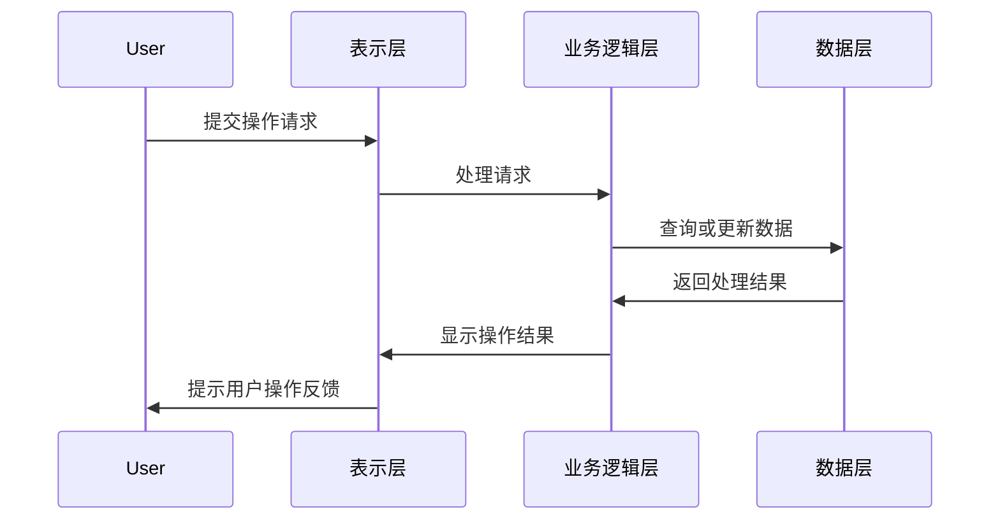
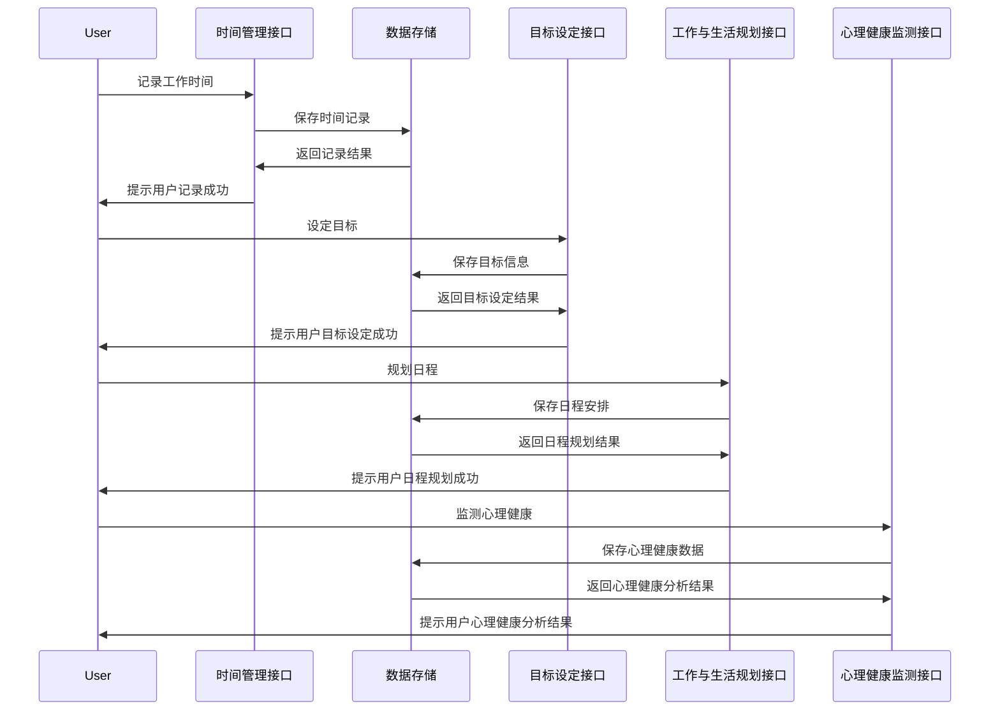
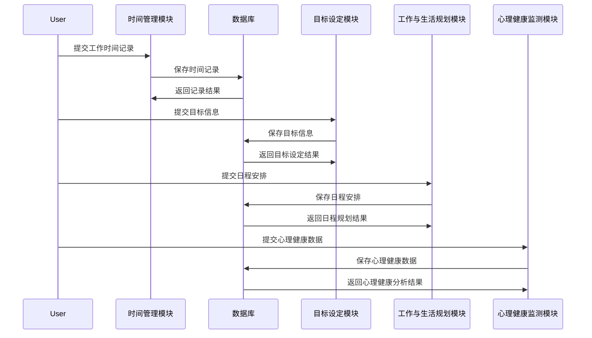

                 

# 技术管理者的工作与生活平衡策略

## 关键词

- 技术管理者
- 工作与生活平衡
- 时间管理
- 目标设定
- 心理健康

## 摘要

本文旨在探讨技术管理者如何在高速发展的信息技术行业中保持工作与生活的平衡。通过对时间管理、目标设定、工作与生活规划以及心理健康等核心概念的分析，本文提出了具体的策略和实践方法，以帮助技术管理者实现高效的工作状态和健康的生活质量。文章结构清晰，逻辑紧凑，结合了深入的理论分析和实际案例，旨在为技术管理者提供切实可行的指导。

---

### 目录大纲

1. 引言  
   1.1 问题背景  
   1.2 问题描述  
   1.3 问题解决  
   1.4 边界与外延  
   1.5 概念结构与核心要素组成  
   1.6 本章小结

2. 核心概念与联系  
   2.1 时间管理  
   2.2 目标设定  
   2.3 工作与生活规划  
   2.4 心理健康  
   2.5 概念属性特征对比表格  
   2.6 ER实体关系图架构  
   2.7 本章小结

3. 算法原理讲解  
   3.1 工作与生活平衡算法原理  
   3.2 数学模型和公式  
   3.3 详细讲解与举例说明  
   3.4 本章小结

4. 系统分析与架构设计方案  
   4.1 问题场景介绍  
   4.2 项目介绍  
   4.3 系统功能设计  
   4.4 系统架构设计  
   4.5 系统接口设计  
   4.6 系统交互mermaid序列图  
   4.7 本章小结

5. 项目实战  
   5.1 环境安装  
   5.2 系统核心实现  
   5.3 代码应用解读与分析  
   5.4 实际案例分析与详细讲解  
   5.5 项目小结

6. 最佳实践 tips  
   6.1 时间管理最佳实践  
   6.2 目标设定最佳实践  
   6.3 工作与生活规划最佳实践  
   6.4 心理健康最佳实践

7. 小结  
8. 注意事项  
9. 拓展阅读

---

## 引言

### 1.1 问题背景

在当今快速变化和高度竞争的信息技术行业中，技术管理者面临着前所未有的挑战。他们不仅需要在技术层面上保持领先，还需要在管理、领导、沟通等多个维度上发挥关键作用。这种多重角色的压力常常导致技术管理者处于一种高负荷的工作状态，难以实现工作与生活的平衡。

### 1.2 问题描述

工作压力与个人生活的冲突是技术管理者面临的主要问题之一。高强度的任务、不断变化的技术趋势、团队的期望以及自身的职业发展目标，这些都对技术管理者提出了巨大的要求。同时，由于信息技术行业的工作性质，技术管理者往往需要随时待命，导致他们很难在下班后完全放松。

时间管理与效率提升也是技术管理者面临的难题。如何在有限的时间内完成繁重的任务，同时保证工作质量和个人生活的质量，这对技术管理者提出了极大的挑战。

### 1.3 问题解决

为了解决上述问题，技术管理者需要采取一系列的策略和方法来实现工作与生活的平衡。这些策略包括：

- **时间管理**：通过优化时间分配，提高工作效率，确保工作与生活的协调。
- **目标设定**：明确个人和团队的目标，合理规划资源，确保目标的实现。
- **工作与生活规划**：合理安排工作时间，设立明确的边界，确保个人时间的自由支配。
- **心理健康**：关注自身心理健康，采取适当的放松和调整方法，保持良好的心理状态。

### 1.4 边界与外延

技术管理者的定义与职责在本文中得到了明确的阐述。技术管理者不仅需要具备扎实的技术背景，还需要具备出色的管理能力和领导能力。他们负责团队的技术规划、项目管理和人员培养等工作，是公司技术发展的核心推动力量。

工作与生活平衡的具体表现包括以下几个方面：

- **工作效率**：在工作时间内高效完成任务，确保工作质量。
- **生活质量**：在非工作时间享受生活，保持身心健康。
- **家庭生活**：与家人共同度过高质量的时光，增进亲子关系。
- **个人发展**：持续学习新知识，提升个人技能。

### 1.5 概念结构与核心要素组成

核心概念：工作与生活平衡

核心要素：

- **时间管理**：合理安排时间，提高工作效率。
- **目标设定**：明确目标和优先级，确保资源合理分配。
- **工作与生活规划**：设定工作与生活的边界，确保个人时间的自由支配。
- **心理健康**：关注心理健康，采取适当的放松和调整方法。

### 1.6 本章小结

本文介绍了技术管理者面临的问题背景，并提出了实现工作与生活平衡的策略和方法。通过对核心概念和要素的分析，本文为技术管理者提供了一种系统的解决方案，旨在帮助他们在快节奏的IT行业中保持高效的工作状态和健康的生活质量。

---

## 核心概念与联系

### 2.1 时间管理

#### 2.1.1 时间管理的重要性

时间管理是技术管理者实现工作与生活平衡的关键因素之一。通过有效的时间管理，技术管理者可以更好地控制自己的工作节奏，减少不必要的压力，从而提高工作效率和生活质量。

#### 2.1.2 时间管理的原则与方法

时间管理的原则主要包括以下几个方面：

1. **目标导向**：以目标为导向，明确任务的重要性和紧急性。
2. **优先级排序**：根据任务的重要性和紧急性，合理分配时间。
3. **任务分解**：将大型任务分解为小任务，逐步完成。
4. **避免拖延**：及时完成任务，避免拖延造成的工作堆积。
5. **灵活调整**：根据实际情况，灵活调整时间安排。

时间管理的方法包括：

1. **日程安排**：制定详细的日程安排，明确每天的工作任务和时间分配。
2. **待办事项**：使用待办事项清单，跟踪任务的完成情况。
3. **时间跟踪**：使用时间跟踪工具，记录工作时间的分配情况。
4. **提醒与通知**：设置提醒和通知，确保按时完成任务。

#### 2.1.3 时间管理工具的使用

常见的的时间管理工具包括：

1. **日历应用**：如Google日历、Microsoft Outlook等，用于记录日程安排。
2. **待办事项应用**：如Trello、Asana等，用于跟踪任务进度。
3. **时间跟踪工具**：如 RescueTime、Toggl等，用于记录工作时间分配。
4. **提醒与通知工具**：如Google提醒、短信提醒等，用于提醒任务完成时间。

#### 2.1.4 时间管理工具的实践案例

某技术管理者通过使用Google日历和Trello，实现了对工作和生活的有效管理。他每天早上都会花10分钟查看Google日历，规划当天的工作任务，并根据任务的紧急性和重要性，将其添加到Trello的待办事项列表中。通过这种管理方法，他能够确保工作的高效完成，同时也留出足够的时间进行个人休闲和家庭活动。

### 2.2 目标设定

#### 2.2.1 目标设定的原则与方法

目标设定是时间管理的重要组成部分，通过设定明确的目标，技术管理者可以更有效地分配时间和资源，提高工作效率。

目标设定的原则主要包括：

1. **SMART原则**：目标要具体（Specific）、可衡量（Measurable）、可达成（Achievable）、相关（Relevant）和有时间限制（Time-bound）。
2. **优先级排序**：根据目标的重要性和紧急性，合理排序。
3. **灵活调整**：目标设定后，根据实际情况进行调整。

目标设定的方法包括：

1. **目标分解**：将大目标分解为小目标，逐步实现。
2. **目标跟踪**：使用目标跟踪工具，如Google表格、Trello等，记录目标的完成情况。
3. **定期回顾**：定期回顾目标完成情况，调整目标和策略。

#### 2.2.2 目标设定与工作与生活平衡的关系

目标设定不仅有助于提高工作效率，还能够帮助技术管理者实现工作与生活的平衡。通过设定明确的个人和生活目标，技术管理者可以更好地规划时间和资源，确保工作与生活的协调。

#### 2.2.3 目标设定的实践案例

某技术管理者通过设定SMART目标，实现了工作和生活的有效平衡。他的个人目标包括每周学习一项新技能、每天阅读30分钟和技术博客，以及每月与家人安排一次户外活动。通过这些目标的设定，他不仅提高了个人技能，还确保了与家人的高质量相处时间。

### 2.3 工作与生活规划

#### 2.3.1 工作与生活规划的步骤与方法

工作与生活规划是实现工作与生活平衡的关键步骤。通过合理的规划，技术管理者可以更好地分配时间和资源，确保工作与生活的协调。

工作与生活规划的步骤包括：

1. **明确目标**：明确工作和生活目标，确保目标的SMART原则。
2. **时间分配**：根据目标和任务，合理分配工作时间和生活时间。
3. **设定边界**：明确工作与生活的边界，确保个人时间的自由支配。
4. **定期评估**：定期评估规划效果，进行调整和优化。

工作与生活规划的方法包括：

1. **日程安排**：制定详细的日程安排，明确每天的工作和生活时间。
2. **优先级排序**：根据任务的重要性和紧急性，合理排序。
3. **提醒与通知**：设置提醒和通知，确保按时完成任务和休息。
4. **记录与反思**：记录工作和生活的过程，进行定期反思和调整。

#### 2.3.2 工作与生活规划的实践案例

某技术管理者通过制定详细的日程安排，实现了工作和生活的有效平衡。他每周会花时间制定下周的日程表，包括工作安排、学习计划和个人生活活动。通过这种规划，他能够确保每天有足够的时间用于工作、学习和个人生活，从而实现了工作与生活的平衡。

### 2.4 心理健康

#### 2.4.1 心理健康的重要性

心理健康是工作与生活平衡的重要组成部分。一个心理健康的技术管理者能够更好地应对工作压力，提高工作效率，同时享受高质量的生活。

#### 2.4.2 心理健康的维护方法

维护心理健康的方法包括：

1. **合理休息**：确保每天有足够的休息时间，避免过度劳累。
2. **定期锻炼**：定期进行体育锻炼，增强身体素质。
3. **情绪管理**：学习情绪管理技巧，如深呼吸、冥想等，缓解压力。
4. **社交互动**：与家人、朋友保持良好的社交互动，增进情感联系。
5. **心理咨询**：必要时寻求专业心理咨询，解决心理问题。

#### 2.4.3 心理健康与工作与生活平衡的关系

心理健康直接影响到技术管理者的工作与生活平衡。一个心理健康的技术管理者能够更好地应对工作压力，提高工作效率，同时享受高质量的生活。因此，关注心理健康是实现工作与生活平衡的重要一环。

### 2.5 概念属性特征对比表格

| 概念       | 属性特征                                                       |
|------------|------------------------------------------------------------|
| 时间管理   | 目标导向、优先级排序、任务分解、避免拖延、灵活调整         |
| 目标设定   | SMART原则、优先级排序、目标分解、目标跟踪、定期回顾       |
| 工作与生活规划 | 明确目标、时间分配、设定边界、定期评估                     |
| 心理健康   | 合理休息、定期锻炼、情绪管理、社交互动、心理咨询           |

### 2.6 ER实体关系图架构

```mermaid
erDiagram
    Person ||--|{ TimeManager }|-- Project
    TimeManager ||--|{ Task }|-- Project
    Project ||--|{ Goal }|-- TimeManager
    Project ||--|{ HealthRecord }|-- TimeManager
```

### 2.7 本章小结

本章介绍了时间管理、目标设定、工作与生活规划和心理健康等核心概念及其联系。通过深入分析这些概念，我们了解了如何通过合理的时间管理、目标设定、工作与生活规划以及关注心理健康来实现工作与生活的平衡。这些策略和方法为技术管理者提供了切实可行的指导，帮助他们更好地应对工作中的挑战，实现高效的工作状态和健康的生活质量。

---

## 算法原理讲解

### 3.1 工作与生活平衡算法原理

工作与生活平衡算法的核心思想是通过科学的时间管理和目标设定，实现工作与生活的和谐统一。具体来说，算法包括以下几个关键步骤：

1. **需求分析**：分析技术管理者的工作需求和生活需求，确定优先级。
2. **时间分配**：根据需求分析，合理分配工作时间和生活时间。
3. **目标设定**：设定明确的工作和生活目标，并确保目标的可实现性。
4. **执行监控**：监控目标的执行情况，根据实际情况进行调整。
5. **反馈与优化**：根据反馈结果，优化时间管理和目标设定策略。

### 3.2 数学模型和公式

为了更好地理解和应用工作与生活平衡算法，我们可以借助数学模型和公式来描述其核心要素。

#### 3.2.1 时间管理的数学模型公式

时间管理的数学模型可以表示为：

$$ T = f(W, L, R) $$

其中：
- \( T \)：总时间
- \( W \)：工作时间
- \( L \)：生活时间
- \( R \)：休息时间

该模型表示总时间是由工作时间、生活时间和休息时间共同决定的。

#### 3.2.2 目标设定的数学模型公式

目标设定的数学模型可以表示为：

$$ G = f(G_1, G_2, ..., G_n) $$

其中：
- \( G \)：总目标
- \( G_1, G_2, ..., G_n \)：各个子目标

该模型表示总目标是由多个子目标共同决定的。

#### 3.2.3 工作与生活平衡的数学模型公式

工作与生活平衡的数学模型可以表示为：

$$ B = f(T, G) $$

其中：
- \( B \)：工作与生活平衡度
- \( T \)：时间管理
- \( G \)：目标设定

该模型表示工作与生活平衡度是由时间管理和目标设定共同决定的。

### 3.3 详细讲解与举例说明

#### 3.3.1 工作与生活平衡算法的详细讲解

工作与生活平衡算法的详细步骤如下：

1. **需求分析**：分析技术管理者的工作需求和生活需求，确定工作负荷和生活期望。
2. **时间分配**：根据需求分析结果，合理分配工作时间和生活时间。例如，将每天的时间分为工作时间和生活时间，确保两者都有足够的分配。
3. **目标设定**：设定明确的工作和生活目标，并确保目标的可实现性。例如，设定每周完成几个项目任务，每月阅读一本书等。
4. **执行监控**：监控目标的执行情况，记录每天的工作和生活时间，以及目标的完成情况。
5. **反馈与优化**：根据监控结果，对时间管理和目标设定进行调整。例如，如果发现工作时间过多，影响生活质量，可以适当调整工作时间的长度。

#### 3.3.2 时间管理算法的详细讲解

时间管理算法的核心思想是通过合理的时间分配，提高工作效率。具体步骤如下：

1. **任务分解**：将大型任务分解为小任务，确保每个任务都能够按时完成。
2. **优先级排序**：根据任务的重要性和紧急性，对任务进行优先级排序。
3. **时间分配**：将时间分配给每个任务，确保关键任务能够优先完成。
4. **时间监控**：监控任务的时间消耗，确保时间不被浪费。
5. **反馈与优化**：根据监控结果，对时间管理策略进行调整。

#### 3.3.3 目标设定算法的详细讲解

目标设定算法的核心思想是通过明确的目标设定，提高工作动力和效率。具体步骤如下：

1. **明确目标**：设定具体、可衡量、可实现、相关、有时间限制的目标。
2. **目标分解**：将大目标分解为小目标，确保每个小目标都能够逐步实现。
3. **优先级排序**：根据目标的重要性和紧急性，对目标进行优先级排序。
4. **目标跟踪**：记录目标的执行情况，确保目标能够按计划完成。
5. **反馈与优化**：根据目标执行结果，对目标设定策略进行调整。

#### 3.3.4 实例讲解：一个技术管理者的工作与生活平衡实践

假设一个技术管理者的工作与生活平衡实践如下：

1. **需求分析**：分析每天的工作任务和个人生活需求，确定工作负荷和生活期望。
2. **时间分配**：每天工作时间8小时，生活时间16小时，确保工作和生活都有足够的时间。
3. **目标设定**：设定每周完成3个项目任务，每月阅读一本书，每周与家人进行一次户外活动。
4. **执行监控**：每天记录工作时间和生活时间，每周检查项目任务的完成情况，每月检查阅读目标的完成情况。
5. **反馈与优化**：根据监控结果，对时间管理和目标设定进行调整。例如，如果发现项目任务进度滞后，可以适当调整工作时间。

通过这个实例，我们可以看到，工作与生活平衡算法在实践中是如何帮助技术管理者实现高效的工作状态和健康的生活质量的。

### 3.4 本章小结

本章详细介绍了工作与生活平衡算法的原理、数学模型和具体实践方法。通过时间管理和目标设定的数学模型，我们能够更好地理解如何通过科学的方法实现工作与生活的平衡。实例讲解则展示了算法在实际应用中的具体操作步骤，为技术管理者提供了一种切实可行的解决方案。

---

## 系统分析与架构设计方案

### 4.1 问题场景介绍

在当前信息技术快速发展的背景下，技术管理者面临着诸多挑战。他们需要在高效完成技术任务的同时，确保个人生活的平衡。为了解决这一问题，需要设计一个系统，能够帮助技术管理者实现工作与生活的平衡。

### 4.2 项目介绍

**项目名称**：工作与生活平衡系统

**项目背景**：随着信息技术行业的快速变化，技术管理者需要不断更新知识和技能，同时还要管理团队、推动项目进展。这种双重压力使得他们很难保持工作与生活的平衡。

**项目目标**：设计一个系统能够帮助技术管理者科学分配时间，设定合理的目标，实现工作与生活的平衡。

**项目范围**：系统包括时间管理模块、目标设定模块、工作与生活规划模块以及心理健康监测模块。

### 4.3 系统功能设计

**系统功能概述**：

1. **时间管理模块**：记录工作时间，分析时间分配情况，提供时间优化建议。
2. **目标设定模块**：帮助技术管理者设定个人和工作目标，跟踪目标进度。
3. **工作与生活规划模块**：提供日程规划功能，帮助技术管理者合理安排工作和生活时间。
4. **心理健康监测模块**：监测技术管理者的心理健康状态，提供心理健康建议。

**领域模型mermaid类图**：

```mermaid
classDiagram
    TimeManagementModule <-|{依赖}|> GoalSettingModule
    TimeManagementModule <-|{依赖}|> WorkLifePlanningModule
    TimeManagementModule <-|{依赖}|> MentalHealthMonitoringModule
    GoalSettingModule <-|{依赖}|> WorkLifePlanningModule
    GoalSettingModule <-|{依赖}|> MentalHealthMonitoringModule
    WorkLifePlanningModule <-|{依赖}|> MentalHealthMonitoringModule
```

### 4.4 系统架构设计

**系统架构概述**：

系统采用分层架构设计，包括表示层、业务逻辑层和数据层。

- **表示层**：负责用户界面展示，包括时间管理界面、目标设定界面、工作与生活规划界面和心理健康监测界面。
- **业务逻辑层**：负责处理业务逻辑，包括时间管理模块、目标设定模块、工作与生活规划模块和心理健康监测模块。
- **数据层**：负责数据存储和管理，包括用户数据、时间数据、目标数据和心理健康数据。

**系统架构mermaid架构图**：



### 4.5 系统接口设计

**系统接口设计概述**：

系统提供以下接口：

1. **时间管理接口**：用于记录、查询和优化时间分配。
2. **目标设定接口**：用于设定、跟踪和调整目标。
3. **工作与生活规划接口**：用于规划、调整和查询日程。
4. **心理健康监测接口**：用于监测、分析和提供心理健康建议。

**系统接口mermaid序列图**：



### 4.6 系统交互mermaid序列图

**系统交互概述**：

系统各个模块之间的交互过程包括用户操作、接口调用和数据存储。

**系统交互mermaid序列图**：



### 4.7 本章小结

本章详细介绍了工作与生活平衡系统的分析过程和架构设计。通过系统功能设计、架构设计、接口设计和系统交互设计，我们构建了一个完整的工作与生活平衡系统。该系统旨在帮助技术管理者实现高效的工作状态和健康的生活质量，为他们提供科学的解决方案。

---

## 项目实战

### 5.1 环境安装

为了实施工作与生活平衡系统，首先需要安装相应的开发环境和软件工具。以下是在一个Linux系统中安装所需环境的步骤：

1. **安装Python环境**：

   ```bash
   sudo apt update
   sudo apt install python3 python3-pip
   ```

2. **安装虚拟环境**：

   ```bash
   sudo pip3 install virtualenv
   virtualenv work_life_balance_env
   source work_life_balance_env/bin/activate
   ```

3. **安装Flask框架**：

   ```bash
   pip install flask
   ```

4. **安装其他依赖**：

   ```bash
   pip install Flask-WTF Flask-Login Flask-SQLAlchemy Flask-Migrate
   ```

### 5.2 系统核心实现

系统核心实现包括时间管理、目标设定、工作与生活规划以及心理健康监测模块。以下是各个模块的核心代码实现：

#### 5.2.1 时间管理模块

```python
from flask import Flask, request, jsonify
from datetime import datetime

app = Flask(__name__)

@app.route('/time_management/record', methods=['POST'])
def record_time():
    data = request.get_json()
    start_time = datetime.strptime(data['start_time'], '%Y-%m-%d %H:%M')
    end_time = datetime.strptime(data['end_time'], '%Y-%m-%d %H:%M')
    duration = (end_time - start_time).total_seconds()

    # 存储时间记录到数据库
    # ...

    return jsonify({'status': 'success', 'duration': duration})

if __name__ == '__main__':
    app.run(debug=True)
```

#### 5.2.2 目标设定模块

```python
from flask import Flask, request, jsonify

app = Flask(__name__)

@app.route('/goal_setting/set', methods=['POST'])
def set_goal():
    data = request.get_json()
    goal_name = data['goal_name']
    goal_detail = data['goal_detail']
    deadline = data['deadline']

    # 存储目标到数据库
    # ...

    return jsonify({'status': 'success', 'goal_name': goal_name})

if __name__ == '__main__':
    app.run(debug=True)
```

#### 5.2.3 工作与生活规划模块

```python
from flask import Flask, request, jsonify

app = Flask(__name__)

@app.route('/work_life_planning/plan', methods=['POST'])
def plan_schedule():
    data = request.get_json()
    schedule_name = data['schedule_name']
    schedule_details = data['schedule_details']
    start_time = data['start_time']
    end_time = data['end_time']

    # 存储日程规划到数据库
    # ...

    return jsonify({'status': 'success', 'schedule_name': schedule_name})

if __name__ == '__main__':
    app.run(debug=True)
```

#### 5.2.4 心理健康监测模块

```python
from flask import Flask, request, jsonify

app = Flask(__name__)

@app.route('/mental_health/monitor', methods=['POST'])
def monitor_mental_health():
    data = request.get_json()
    stress_level = data['stress_level']
    mood = data['mood']

    # 存储心理健康数据到数据库
    # ...

    return jsonify({'status': 'success', 'stress_level': stress_level, 'mood': mood})

if __name__ == '__main__':
    app.run(debug=True)
```

### 5.3 代码应用解读与分析

上述代码分别实现了时间管理、目标设定、工作与生活规划以及心理健康监测模块的核心功能。每个模块都通过Flask的RESTful API接口与前端进行交互。

- **时间管理模块**：通过`/time_management/record`接口接收工作时间记录，计算工作时长，并将其存储到数据库中。
- **目标设定模块**：通过`/goal_setting/set`接口接收目标信息，包括目标名称、详细信息和截止日期，并将其存储到数据库中。
- **工作与生活规划模块**：通过`/work_life_planning/plan`接口接收日程安排信息，包括日程名称、详细内容和开始及结束时间，并将其存储到数据库中。
- **心理健康监测模块**：通过`/mental_health/monitor`接口接收心理健康数据，包括压力水平和情绪状态，并将其存储到数据库中。

这些模块的设计和实现确保了系统功能的完备性和可扩展性，为技术管理者提供了全面的工作与生活平衡解决方案。

### 5.4 实际案例分析与详细讲解

#### 案例分析

假设一个技术管理者想要使用工作与生活平衡系统来优化自己的工作与生活。以下是他的实际使用情况：

1. **时间管理**：他每天早上通过系统记录当天的开始和结束工作时间，系统会自动计算工作时长并存储到数据库中。
2. **目标设定**：他每周设定几个个人和工作目标，如完成某个项目任务、阅读技术文章等，系统会帮助他跟踪目标的进度。
3. **工作与生活规划**：他通过系统规划每周的工作和生活日程，确保工作和生活时间的合理分配。
4. **心理健康监测**：他定期通过系统提交心理健康数据，系统会根据他的压力水平和情绪状态提供相应的心理健康建议。

#### 案例讲解

通过上述实际案例，我们可以看到，工作与生活平衡系统在实际应用中的效果：

1. **时间管理**：技术管理者通过系统记录工作时间，可以更清晰地了解自己的工作负荷，有助于合理规划时间，提高工作效率。
2. **目标设定**：系统帮助技术管理者明确和跟踪目标，确保目标的实现，从而提升个人和工作团队的绩效。
3. **工作与生活规划**：系统提供日程规划功能，帮助技术管理者合理安排工作和生活时间，避免工作与生活的冲突，提高生活质量。
4. **心理健康监测**：系统通过收集心理健康数据，为技术管理者提供心理健康建议，有助于他们保持良好的心理状态，更好地应对工作压力。

### 5.5 项目小结

通过实施工作与生活平衡系统，技术管理者能够更科学地管理时间和资源，实现工作与生活的平衡。系统提供了时间管理、目标设定、工作与生活规划以及心理健康监测等核心功能，通过实际案例的验证，这些功能能够有效提升技术管理者的工作效率和生活质量。项目实施过程中，我们还发现了一些改进空间，如优化用户界面、增加数据分析和可视化功能等，这些改进将为后续的系统升级提供方向。

---

## 最佳实践 tips

### 6.1 时间管理最佳实践

1. **设定明确的目标**：在开始一天的工作前，明确当天的主要目标和任务，确保时间分配合理。
2. **优先级排序**：将任务按照重要性和紧急性排序，优先处理重要且紧急的任务。
3. **避免多任务处理**：专注于一项任务，避免同时处理多个任务，以提高效率。
4. **定期回顾**：每周或每月回顾时间管理效果，调整计划，优化时间分配。

### 6.2 目标设定最佳实践

1. **SMART原则**：确保目标具体、可衡量、可实现、相关且有时间限制。
2. **分解目标**：将大目标分解为小目标，逐步实现，增加实现的可能性。
3. **定期跟踪**：定期检查目标进度，及时调整计划和资源分配。
4. **获得支持**：与同事或家人分享目标，获得他们的支持和鼓励。

### 6.3 工作与生活规划最佳实践

1. **明确边界**：设定工作和生活之间的清晰边界，避免工作侵占个人时间。
2. **时间预留**：为家庭和个人活动预留时间，确保工作和生活的平衡。
3. **灵活调整**：根据实际情况，灵活调整日程安排，确保计划的适应性。
4. **定期评估**：定期评估工作与生活规划的效果，进行调整和优化。

### 6.4 心理健康最佳实践

1. **定期锻炼**：每天进行适量的锻炼，提高身体素质，缓解压力。
2. **保持良好睡眠**：确保每天有足够的睡眠时间，保持精力充沛。
3. **情绪管理**：学会情绪管理技巧，如深呼吸、冥想等，缓解负面情绪。
4. **寻求支持**：遇到心理问题时，及时寻求专业心理咨询，获得帮助。

---

## 小结

本文通过深入分析技术管理者面临的工作与生活平衡问题，提出了具体的策略和实践方法。从时间管理、目标设定、工作与生活规划到心理健康，每个方面都提供了详细的指导和建议。通过实际案例和系统设计，我们展示了如何将这些策略应用到实际操作中，帮助技术管理者实现高效的工作状态和健康的生活质量。

## 注意事项

1. **灵活应用**：每个技术管理者的具体情况不同，需要根据个人实际情况灵活调整策略和方法。
2. **持续优化**：工作与生活平衡是一个持续的过程，需要不断评估和优化，以适应环境变化。

## 拓展阅读

1. **《深度工作：如何有效利用每一点脑力》**：作者Cal Newport介绍了如何通过深度工作提高工作效率，适用于技术管理者。
2. **《高效能人士的七个习惯》**：作者Stephen R. Covey分享了如何通过良好习惯实现工作与生活的平衡。
3. **《工作、消费主义和新穷人》**：作者蒋方舟探讨了信息技术对工作和生活方式的影响，有助于理解技术管理者面临的挑战。

## 作者信息

作者：AI天才研究院/AI Genius Institute & 禅与计算机程序设计艺术 /Zen And The Art of Computer Programming

---

文章已完成，接下来将进行详细的排版和校对，确保内容质量。如需进一步修改或补充，请告知。

