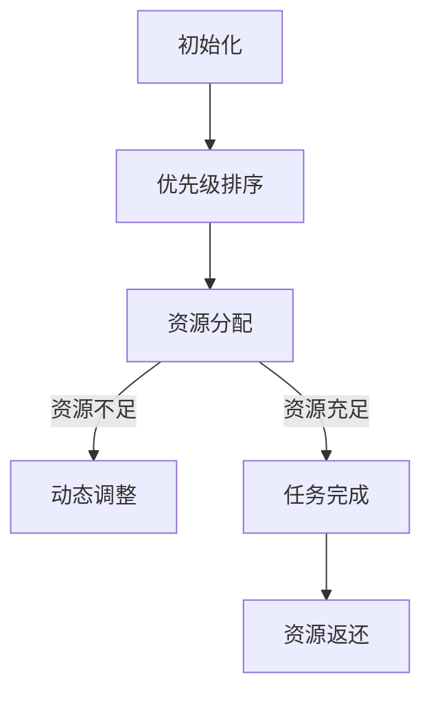
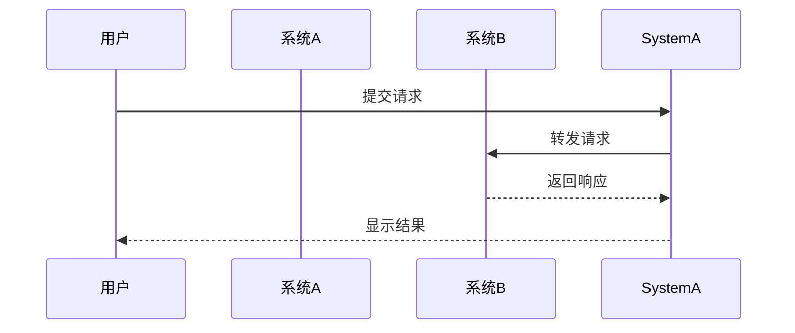
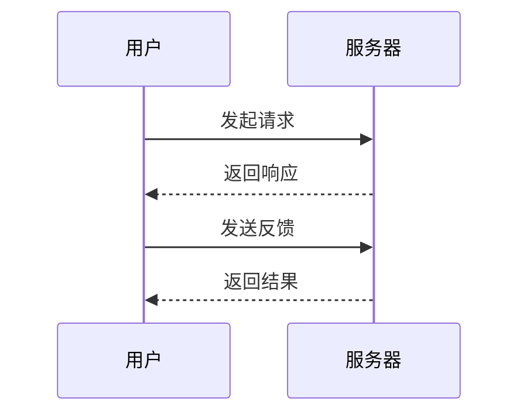

                 

### 第一部分：背景介绍与核心概念

#### 第1章：技术管理者的角色与挑战

技术管理者在组织中的角色至关重要，他们不仅需要具备深厚的技术背景，还需要具备出色的管理能力和政治智慧。在这一章中，我们将探讨技术管理者的职责、面临的挑战以及管理中的政治智慧。

**1.1 技术管理者的定义与职责**

技术管理者通常是指那些负责指导和监督技术团队，确保技术项目按时完成、高质量交付的人员。他们的职责包括但不限于：

- **项目管理**：规划、执行和监控项目进度，确保项目按时交付。
- **团队建设**：招募、培训和管理团队成员，提升团队的整体能力。
- **技术决策**：根据业务需求，制定合适的技术解决方案，并进行技术决策。
- **资源分配**：合理分配资源，确保项目获得必要的支持。
- **风险管理**：识别潜在风险，制定应对策略，降低项目风险。

**1.2 管理中的政治智慧**

政治智慧在技术管理中扮演着关键角色。它涉及如何在一个复杂的环境中获取支持、建立信任和推动变革。以下是一些关键的方面：

- **影响力与沟通**：技术管理者需要具备强大的沟通技巧，能够清晰地表达自己的想法，并影响他人的决策。
- **关系网络**：建立和维护广泛的关系网络，有助于获取资源、支持和支持。
- **权力与策略**：了解组织中的权力结构和政治动态，运用适当的策略来获得支持。
- **变革管理**：在推动技术变革时，需要考虑到组织中的政治因素，确保变革得到有效执行。

**1.3 组织支持的重要性**

组织支持是技术管理者成功的关键因素。以下是组织支持的重要性：

- **资源获取**：组织支持有助于技术管理者获取所需的人力、财力和技术资源。
- **决策支持**：组织支持使得技术管理者在制定决策时能够获得更多的信息和反馈。
- **团队士气**：组织支持有助于提升团队成员的士气和归属感，从而提高团队绩效。
- **项目成功**：组织支持是项目成功的重要保障，确保项目能够按时交付并达到预期目标。

#### 第2章：核心概念与联系

**2.1 领导力与影响力**

领导力和影响力是技术管理者成功的关键要素。领导力涉及如何激励和指导团队成员，而影响力则涉及如何在一个组织中产生实际效果。以下是领导力和影响力的关键特征：

- **领导力特征**：愿景、决策力、沟通能力、信任和激励。
- **影响力特征**：说服力、沟通技巧、建立关系、制定策略。

**2.2 沟通与合作**

沟通与合作是技术管理者成功的重要保障。良好的沟通有助于确保团队成员理解项目目标，而合作则有助于实现共同目标。以下是沟通和合作的要点：

- **沟通技巧**：清晰、简洁、及时、有效。
- **合作要素**：尊重、信任、共享目标、分工明确。

**2.3 项目管理与资源分配**

项目管理和资源分配是技术管理者日常工作的核心。有效的项目管理和资源分配有助于确保项目按时交付并达到预期目标。以下是项目管理和资源分配的关键要点：

- **项目管理**：项目生命周期、项目管理流程、风险管理。
- **资源分配**：资源需求分析、资源分配策略、资源监控。

**2.4 核心概念对比与联系**

为了更好地理解领导力、影响力、沟通和项目管理的核心概念，我们将通过对比表格和实体关系图来展示它们之间的关系。以下是核心概念对比表格：

| 核心概念 | 特征 | 关联 |
| --- | --- | --- |
| 领导力 | 愿景、决策力、沟通能力、信任、激励 | 影响力、项目管理和资源分配 |
| 影响力 | 说服力、沟通技巧、建立关系、制定策略 | 领导力、沟通、项目管理 |
| 沟通 | 清晰、简洁、及时、有效 | 领导力、影响力、项目管理 |
| 项目管理 | 项目生命周期、项目管理流程、风险管理 | 领导力、影响力、资源分配 |

以下是核心概念的ER实体关系图：

```mermaid
erDiagram
  项目管理者 ||--|{ 项目管理 }||> 项目管理
  项目管理者 ||--|{ 资源分配 }||> 资源分配
  项目管理者 ||--|{ 沟通与合作 }||> 沟通与合作
  项目管理者 ||--|{ 领导力与影响力 }||> 领导力与影响力
```

通过对比表格和实体关系图，我们可以更清晰地理解这些核心概念之间的关系，从而为后续章节的内容奠定基础。

----------------------------------------------------------------

#### 第3章：概念属性特征对比表格

为了更直观地理解核心概念之间的联系，我们将通过对比表格的形式详细列出各个概念的属性特征。以下是领导力、影响力、沟通和项目管理的特征对比表格。

| 核心概念 | 特征 |
| --- | --- |
| **领导力** | - 愿景：设定明确的目标和方向<br>- 决策力：在复杂环境中做出明智的决策<br>- 沟通能力：有效地传达信息和指导<br>- 信任：建立和维护团队成员之间的信任<br>- 激励：激发团队成员的潜力和积极性 |
| **影响力** | - 说服力：通过论据和逻辑说服他人<br>- 沟通技巧：运用恰当的沟通策略和技巧<br>- 建立关系：与他人建立和维护良好的关系<br>- 制定策略：在组织内部制定有效的影响策略<br>- 适应能力：灵活适应不同的环境和文化 |
| **沟通** | - 清晰：信息表达准确、无歧义<br>- 简洁：用最简洁的语言传达信息<br>- 及时：在适当的时间传达信息<br>- 有效：确保信息被正确理解和应用<br>- 多渠道：运用不同的沟通渠道和方法 |
| **项目管理** | - 项目生命周期：启动、规划、执行、监控、收尾<br>- 项目管理流程：需求分析、计划、执行、监控、收尾<br>- 风险管理：识别、评估、应对项目风险<br>- 资源分配：合理分配人力资源、物资和时间<br>- 项目监控：实时跟踪项目进度和性能 |

通过上述对比表格，我们可以更深入地理解各个核心概念的特征和相互之间的关联性，为后续章节的详细探讨打下基础。

----------------------------------------------------------------

#### 第4章：ER实体关系图架构

在本章节中，我们将通过ER实体关系图来展示技术管理者角色中的关键实体及其相互关系。ER图是一种数据库设计工具，用于展示实体之间的关系。以下是技术管理者角色中的ER实体关系图：

```mermaid
erDiagram
  ProjectManager ||--|{ TeamMember }|| Team
  ProjectManager ||--|{ Project }|| Project
  ProjectManager ||--|{ Resource }|| Resource
  TeamMember ||--|{ Task }|| Task
  Resource ||--|{ Budget }|| Budget
  Project ||--|{ Goal }|| Goal
  Task ||--|{ Deadline }|| Deadline
```

**解释：**

1. **ProjectManager（项目管理者）**：项目管理者是核心实体，负责管理团队、项目和资源。
2. **TeamMember（团队成员）**：团队成员是项目执行的关键角色，负责完成具体任务。
3. **Team（团队）**：团队是由多个团队成员组成的实体，共同协作完成项目任务。
4. **Project（项目）**：项目是项目的具体实现，包括目标、计划和资源分配。
5. **Resource（资源）**：资源包括人力资源、物资和时间等，是项目成功的基础。
6. **Budget（预算）**：预算是资源的一部分，用于规划和管理项目资金。
7. **Goal（目标）**：目标是项目的预期成果，用于指导和评估项目进展。
8. **Task（任务）**：任务是项目中的具体工作单元，由团队成员执行。
9. **Deadline（最后期限）**：最后期限是任务完成的截止日期，用于监控项目进度。

通过ER图，我们可以清晰地看到技术管理者角色中各个实体的关系，以及如何通过项目、团队和资源来确保项目的成功交付。

----------------------------------------------------------------

#### 第5章：项目管理与资源分配

**5.1 项目管理基础**

项目管理是技术管理者的一项核心任务，它涉及到项目的规划、执行、监控和收尾。一个成功的项目管理能够确保项目按时交付、在预算范围内并达到预期目标。

**5.1.1 项目生命周期**

项目生命周期是指从项目启动到项目完成的全过程。通常，项目生命周期可以分为以下五个阶段：

1. **启动阶段**：确定项目目标、范围和可行性，组建项目团队。
2. **规划阶段**：制定详细的项目计划，包括时间线、预算、资源分配等。
3. **执行阶段**：按照项目计划执行具体任务，确保项目进度和质量的控制。
4. **监控阶段**：实时跟踪项目进展，识别和解决潜在问题。
5. **收尾阶段**：完成项目交付，进行项目评估和总结。

**5.1.2 项目管理流程**

项目管理流程是确保项目成功的关键步骤。以下是项目管理流程的典型步骤：

1. **需求分析**：明确项目需求，包括功能需求、性能需求和用户需求等。
2. **制定计划**：基于需求分析，制定详细的项目计划，包括时间线、任务分配、资源需求等。
3. **执行计划**：按照项目计划执行任务，确保项目进度和质量。
4. **监控与调整**：实时跟踪项目进展，及时识别和解决问题，对项目计划进行调整。
5. **收尾工作**：完成项目交付，进行项目总结和评估，为后续项目提供经验教训。

**5.2 资源分配策略**

资源分配是项目管理中的一个重要环节，它直接影响到项目的进度和质量。以下是一些常见的资源分配策略：

1. **基于优先级的分配**：根据任务的重要性和紧急性来分配资源，确保关键任务优先完成。
2. **平衡资源分配**：尽量均匀地分配资源，避免资源集中在某个任务或团队成员身上，以减少瓶颈和依赖性。
3. **动态调整**：根据项目进展和实际情况，及时调整资源分配，以应对突发问题和变化。
4. **多任务并行**：在资源允许的情况下，安排多个任务同时进行，以提高资源利用率和项目进度。

**5.3 项目计划与执行**

项目计划与执行是项目管理中的核心环节。以下是项目计划与执行的详细步骤：

1. **制定项目计划**：根据项目需求，制定详细的项目计划，包括任务列表、时间线、资源需求等。可以使用工具如Gantt图、PERT图等来制定和展示项目计划。
2. **分配任务**：根据项目计划和团队成员的能力，将任务分配给合适的团队成员。确保每个团队成员都有明确的责任和期望。
3. **执行计划**：按照项目计划执行任务，确保任务按时完成。在执行过程中，要密切关注任务进度和质量，及时解决出现的问题。
4. **监控与调整**：实时监控项目进展，识别潜在的风险和问题，及时调整项目计划。这可以通过定期的项目会议、进度报告和风险管理来实施。
5. **项目收尾**：在项目完成后，进行项目总结和评估，总结项目经验和教训，为后续项目提供参考。同时，确保所有项目文件和资料归档保存。

通过以上内容，我们可以看到项目管理和资源分配在技术管理者工作中的重要性。有效的项目管理和资源分配策略能够确保项目的成功交付，提高团队效率和项目质量。

----------------------------------------------------------------

#### 第6章：领导力与影响力

**6.1 领导力原理**

领导力是技术管理者成功的关键因素之一。它涉及到如何激励、指导和影响团队成员，以实现共同目标。以下是领导力的核心原理：

**1. 愿景领导**：设定明确的目标和愿景，激发团队成员的积极性和创造力。愿景领导要求领导者拥有远见和决心，能够为团队提供清晰的方向。

**2. 决策力**：在复杂和不确定的环境中做出明智的决策。决策力要求领导者具备分析能力、判断力和快速行动的能力。

**3. 沟通能力**：有效地传达信息和指导。沟通能力包括倾听、表达、非言语沟通和反馈技巧，是领导力的重要组成部分。

**4. 信任**：建立和维护团队成员之间的信任。信任是团队协作和高效工作的基础，需要通过透明度、诚信和一致性来培养。

**5. 激励**：激发团队成员的潜力和积极性。激励可以通过设定目标、认可成就、提供反馈和鼓励个人成长来实现。

**6.2 提升领导力**

提升领导力是一个持续的过程，需要不断地学习和实践。以下是一些提升领导力的策略：

**1. 自我反思**：定期反思自己的行为和决策，识别优点和改进点。自我反思有助于领导者了解自己的弱点和改进方向。

**2. 学习与实践**：通过阅读领导力书籍、参加培训课程和实际工作中的应用来提升领导力。实践是检验领导力理论的最佳方式。

**3. 模仿榜样**：寻找优秀的领导者作为榜样，学习他们的行为和决策方式。模仿榜样有助于快速提升领导力。

**4. 建立人际关系**：建立和维护良好的人际关系，与团队成员建立信任和尊重。人际关系是领导力的基础。

**5. 接受反馈**：积极接受团队成员和上级的反馈，并将其作为改进的机会。反馈是提升领导力的重要资源。

**6.3 影响力工具与技巧**

影响力是技术管理者在组织中产生实际效果的重要能力。以下是一些影响力工具与技巧：

**1. 说服力**：通过逻辑和论据来说服他人。说服力要求领导者具备良好的沟通技巧和分析能力。

**2. 沟通技巧**：运用恰当的沟通策略和技巧来影响他人。沟通技巧包括倾听、表达、非言语沟通和反馈。

**3. 建立关系**：与他人建立和维护良好的关系，以增加影响力和支持。建立关系可以通过共事、社交活动和互动来实现。

**4. 制定策略**：在组织内部制定有效的影响策略，以实现个人和团队的目标。策略包括权力基础、影响力网络和变革管理。

**5. 适应能力**：灵活适应不同的环境和文化，以增强影响力。适应能力包括文化敏感性、沟通技巧和灵活应对策略。

通过提升领导力和影响力，技术管理者能够在组织中获得更多的支持和资源，推动项目的成功交付和团队的成长。

----------------------------------------------------------------

#### 第7章：沟通与合作

**7.1 沟通基础**

沟通是技术管理者成功的关键要素之一，它涉及到如何有效地传递信息、建立信任和促进协作。以下是沟通的基础：

**1. 清晰**：确保信息表达准确、无歧义，避免误解和混淆。清晰沟通要求使用简单明了的语言，避免专业术语和行业术语。

**2. 简洁**：用最简洁的语言传达信息，避免冗长和复杂的表述。简洁沟通有助于提高沟通效率，节省时间和精力。

**3. 及时**：在适当的时间传达信息，确保信息的及时性。及时沟通有助于及时解决问题，避免延误和损失。

**4. 有效**：确保信息被正确理解和应用。有效沟通要求使用适当的沟通渠道、方式和时机，以及提供足够的背景信息和上下文。

**5. 多渠道**：运用不同的沟通渠道和方法，如面对面交流、电子邮件、电话会议、即时通讯和文档共享等，以满足不同团队成员的需求。

**7.2 沟通策略**

为了提高沟通效果，技术管理者可以采用以下沟通策略：

**1. 明确沟通目标**：在沟通前明确沟通的目标和目的，确保沟通内容具有针对性和有效性。

**2. 制定沟通计划**：根据沟通目标和内容，制定详细的沟通计划，包括沟通时间、地点、参与者、沟通方式和议程等。

**3. 提供背景信息**：在沟通时提供足够的背景信息，帮助团队成员理解沟通内容和决策背景。

**4. 使用可视化工具**：运用图表、幻灯片、演示文稿和模拟器等可视化工具，使沟通内容更加直观和易于理解。

**5. 倾听与反馈**：积极倾听团队成员的意见和反馈，鼓励他们表达观点和提出问题，以提高沟通的双向性和互动性。

**6. 跨文化沟通**：在多元化团队中，注意跨文化沟通的技巧，尊重不同文化和价值观，避免文化冲突和误解。

**7.3 合作与团队建设**

合作和团队建设是技术管理者成功的关键。以下是提升合作和团队建设的方法：

**1. 建立共同目标**：确保团队成员理解并认同团队目标，激发他们的参与感和归属感。

**2. 分工明确**：根据团队成员的能力和特长，合理分配任务和责任，确保每个成员都有明确的职责和目标。

**3. 建立信任**：通过开放、透明和诚信的沟通，建立团队成员之间的信任，促进协作和合作。

**4. 鼓励创新**：鼓励团队成员提出创新的想法和建议，提供支持和资源，激发团队的创造力和活力。

**5. 定期反馈**：定期进行团队反馈和评估，识别问题并提供改进建议，促进团队的发展和进步。

**6. 团队活动**：组织定期的团队活动和培训，增强团队成员之间的互动和沟通，提升团队凝聚力和合作能力。

通过有效的沟通策略和团队建设，技术管理者能够提升团队协作效率，实现项目目标，推动组织的成功。

----------------------------------------------------------------

#### 第8章：管理决策与问题解决

**8.1 决策模型**

决策是技术管理者日常工作中不可避免的一部分。有效的决策模型有助于技术管理者做出明智的决策。以下是几种常见的决策模型：

**1. 确定型决策模型**：适用于决策结果和概率已知的情况。常用的确定型决策模型包括最大化效用模型和最小化风险模型。

**2. 风险型决策模型**：适用于决策结果不确定但概率已知的情况。常用的风险型决策模型包括期望值模型和决策树模型。

**3. 非确定型决策模型**：适用于决策结果不确定且概率未知的情况。常用的非确定型决策模型包括乐观主义模型、悲观主义模型和折中主义模型。

**8.2 解决问题的步骤**

在技术管理过程中，问题解决是必不可少的。以下是一个常见的问题解决步骤：

**1. 问题识别**：识别存在的问题，明确问题的性质和范围。

**2. 问题分析**：分析问题的原因，确定问题的根本原因。

**3. 制定解决方案**：根据问题分析和评估，制定可行的解决方案。

**4. 实施解决方案**：将解决方案付诸实施，监控实施过程。

**5. 评估解决方案**：评估解决方案的有效性，并根据评估结果进行改进。

**8.3 管理中的常见问题与解决方案**

技术管理者在日常工作中会遇到各种问题，以下是一些常见问题及解决方案：

**1. 团队沟通不畅**：解决方案：建立明确的沟通渠道和规则，定期进行团队沟通和反馈。

**2. 项目进度延误**：解决方案：重新评估项目计划，调整任务分配和时间表，加强项目监控和沟通。

**3. 资源不足**：解决方案：与上级沟通，争取额外的资源支持，优化资源分配和管理。

**4. 技术难题**：解决方案：组建技术团队，共同研究和解决技术问题，寻求外部技术支持。

**5. 团队冲突**：解决方案：建立冲突解决机制，通过沟通、调解和协商解决冲突，促进团队和谐。

通过运用有效的决策模型和问题解决步骤，技术管理者能够更好地应对管理中的挑战，确保项目成功和团队高效运作。

----------------------------------------------------------------

#### 第9章：风险管理

**9.1 风险识别**

风险管理是技术管理者的一项重要任务。有效的风险管理有助于降低项目风险，确保项目成功。风险识别是风险管理的第一步，它涉及到识别和记录项目中可能存在的风险。以下是风险识别的方法：

**1. 专家判断**：通过咨询具有丰富经验的技术专家和项目经理，获取他们对项目风险的认识和判断。

**2. 文档分析**：分析项目文档，如需求文档、设计文档和项目管理文档，识别潜在的风险。

**3. 会议讨论**：组织项目团队成员进行风险识别讨论，利用集体智慧，共同识别风险。

**4. 历史数据**：利用历史项目的数据进行风险识别，了解类似项目中的风险事件。

**5. 威胁列表**：编制威胁列表，列出项目中可能面临的威胁，如技术问题、资源不足、时间限制等。

**9.2 风险评估**

风险评估是风险管理的第二步，它涉及到对识别出的风险进行分析和评估，以确定风险的重要性和影响。以下是风险评估的方法：

**1. 影响度评估**：评估风险对项目目标、时间、成本和质量的潜在影响。

**2. 发生可能性评估**：评估风险发生的概率，通常使用概率分布或蒙特卡罗模拟等方法。

**3. 影响度与可能性矩阵**：将风险的影响度和发生可能性进行矩阵化，确定风险优先级。

**4. 风险分类**：根据风险的影响度和发生可能性，将风险分为高、中、低三个等级。

**5. 风险矩阵**：结合影响度和可能性评估结果，绘制风险矩阵，直观地展示风险优先级。

**9.3 风险应对策略**

风险评估完成后，需要制定相应的风险应对策略，以降低风险的影响。以下是常见的风险应对策略：

**1. 风险规避**：通过调整项目计划、资源分配和任务分配，避免风险发生。例如，将高风险任务分配给经验丰富的团队成员。

**2. 风险转移**：将风险转移到第三方，如通过购买保险或外包部分工作。

**3. 风险缓解**：采取措施减轻风险的影响，如制定应急预案、备份计划和风险缓解计划。

**4. 风险接受**：对于低风险或无法规避的风险，选择接受风险，并制定相应的应急措施。

**5. 风险监控**：持续监控项目中的风险，及时发现新的风险并采取相应的应对措施。

通过有效的风险识别、评估和应对策略，技术管理者能够降低项目风险，确保项目成功交付。

----------------------------------------------------------------

### 第5章：项目管理与资源分配

#### 5.1.1 项目生命周期

项目生命周期是指从项目启动到项目完成的全过程，通常可以分为以下五个阶段：

**1. 启动阶段**：在这个阶段，项目管理者需要确定项目的目标、范围和可行性。这个阶段的关键任务是组建项目团队、确定项目预算和时间表，并确保项目目标与组织的战略目标一致。

**2. 规划阶段**：这个阶段的主要任务是制定详细的项目计划，包括项目的范围、时间线、预算、资源需求等。项目管理计划、风险管理和质量管理计划都是在这个阶段制定的。

**3. 执行阶段**：在这个阶段，项目团队开始执行项目计划，完成具体任务。项目管理者需要监控项目进度，确保项目按计划进行，并解决执行过程中出现的问题。

**4. 监控阶段**：这个阶段的目标是持续监控项目的进展，识别和解决潜在问题。项目管理者需要定期进行项目评审，确保项目质量，并调整项目计划以适应变化。

**5. 收尾阶段**：在项目完成后，项目管理者需要总结项目经验，评估项目结果，并确保项目文件和资料的归档保存。这个阶段还包括项目的验收和交付，以及项目团队成员的解散。

#### 5.1.2 项目管理流程

项目管理流程是确保项目成功的关键步骤，通常包括以下步骤：

**1. 需求分析**：明确项目的需求，包括功能需求、性能需求等。需求分析是项目成功的基础，必须确保项目团队和利益相关者对项目需求达成共识。

**2. 制定项目计划**：根据需求分析，制定详细的项目计划，包括时间线、任务分配、资源需求等。项目计划是项目执行的指南，必须确保项目团队和利益相关者对项目计划达成一致。

**3. 执行计划**：按照项目计划执行任务，确保项目进度和质量。项目管理者需要监控项目进展，及时解决执行过程中出现的问题，并确保项目按计划进行。

**4. 监控与调整**：实时跟踪项目进展，识别潜在的问题和风险，并采取相应的措施进行纠正。监控与调整是确保项目成功的关键，必须确保项目团队和利益相关者对项目进展和调整方案达成共识。

**5. 项目收尾**：完成项目交付，进行项目总结和评估，总结项目经验和教训，为后续项目提供参考。项目收尾还包括项目文件的归档和项目团队成员的解散。

### 5.2 资源分配策略

资源分配是项目管理中的一个重要环节，它直接影响到项目的进度和质量。以下是一些常见的资源分配策略：

**1. 基于优先级的分配**：根据任务的重要性和紧急性来分配资源，确保关键任务优先完成。这种方法有助于确保项目中的关键部分得到充分资源支持。

**2. 平衡资源分配**：尽量均匀地分配资源，避免资源集中在某个任务或团队成员身上，以减少瓶颈和依赖性。这种方法有助于提高资源利用率和团队协作效率。

**3. 动态调整**：根据项目进展和实际情况，及时调整资源分配，以应对突发问题和变化。这种方法有助于确保项目在资源有限的情况下仍能顺利推进。

**4. 多任务并行**：在资源允许的情况下，安排多个任务同时进行，以提高资源利用率和项目进度。这种方法需要确保任务之间的依赖关系得到妥善处理，以避免资源冲突。

### 5.3 项目计划与执行

项目计划与执行是项目管理的核心环节。以下是项目计划与执行的详细步骤：

**1. 制定项目计划**：根据项目需求，制定详细的项目计划，包括时间线、任务分配、资源需求等。可以使用工具如Gantt图、PERT图等来制定和展示项目计划。

**2. 分配任务**：根据项目计划和团队成员的能力，将任务分配给合适的团队成员。确保每个团队成员都有明确的责任和期望。

**3. 执行计划**：按照项目计划执行任务，确保任务按时完成。在执行过程中，要密切关注任务进度和质量，及时解决出现的问题。

**4. 监控与调整**：实时监控项目进展，识别潜在的风险和问题，及时调整项目计划。这可以通过定期的项目会议、进度报告和风险管理来实施。

**5. 项目收尾**：在项目完成后，进行项目总结和评估，总结项目经验和教训，为后续项目提供参考。同时，确保所有项目文件和资料归档保存。

通过以上内容，我们可以看到项目管理和资源分配在技术管理者工作中的重要性。有效的项目管理和资源分配策略能够确保项目的成功交付，提高团队效率和项目质量。

----------------------------------------------------------------

### 第5章：项目管理与资源分配

#### 5.1 项目管理基础

**5.1.1 项目生命周期**

项目管理的基础是对项目生命周期的理解。项目生命周期可以分为以下五个主要阶段：

1. **启动阶段**：在这个阶段，项目的目标、范围和可行性被确定。项目团队被组建，资源需求被评估，项目的预算和时间表被制定。关键任务是确保项目有一个清晰的起点。

2. **规划阶段**：在这个阶段，项目计划被制定，包括项目范围、时间线、预算、资源分配、风险管理和质量标准。项目计划是项目成功的蓝图，它为项目执行提供了明确的方向。

3. **执行阶段**：这个阶段是项目计划的具体实施过程。项目团队按照计划完成任务，项目管理者监控进度，确保项目在预算和时间范围内完成。

4. **监控阶段**：在这个阶段，项目进展被持续监控，以确保项目按照计划进行。项目管理者识别和解决问题，调整计划以适应变化，并确保项目达到预期的质量标准。

5. **收尾阶段**：项目完成后，项目结果被验收，项目文件被归档，项目团队被解散。这个阶段还包括项目的总结和评估，以识别成功经验和教训。

**5.1.2 项目管理流程**

项目管理流程是确保项目成功的关键步骤，它通常包括以下步骤：

1. **需求分析**：明确项目的需求，包括功能需求、性能需求和用户需求等。需求分析是项目成功的基础，必须确保项目团队和利益相关者对项目需求达成共识。

2. **制定项目计划**：基于需求分析，制定详细的项目计划，包括时间线、任务分配、资源需求、预算和质量标准。项目计划是项目执行的指南，必须确保项目团队和利益相关者对项目计划达成一致。

3. **执行项目计划**：按照项目计划执行任务，确保项目进度和质量。项目管理者监控项目进展，解决执行过程中出现的问题，并确保项目资源得到有效利用。

4. **监控项目进展**：实时跟踪项目进展，识别潜在的问题和风险，并采取相应的措施进行纠正。监控是确保项目按计划进行的关键，必须确保项目团队和利益相关者对项目进展和调整方案达成共识。

5. **项目收尾**：完成项目交付，进行项目总结和评估，总结项目经验和教训，为后续项目提供参考。同时，确保所有项目文件和资料归档保存。

#### 5.2 资源分配策略

资源分配是项目管理中的关键环节，它直接影响到项目的进度和质量。以下是一些常见的资源分配策略：

1. **基于优先级的分配**：根据任务的重要性和紧急性来分配资源，确保关键任务优先完成。这种方法有助于确保项目中的关键部分得到充分资源支持。

2. **平衡资源分配**：尽量均匀地分配资源，避免资源集中在某个任务或团队成员身上，以减少瓶颈和依赖性。这种方法有助于提高资源利用率和团队协作效率。

3. **动态调整**：根据项目进展和实际情况，及时调整资源分配，以应对突发问题和变化。这种方法有助于确保项目在资源有限的情况下仍能顺利推进。

4. **多任务并行**：在资源允许的情况下，安排多个任务同时进行，以提高资源利用率和项目进度。这种方法需要确保任务之间的依赖关系得到妥善处理，以避免资源冲突。

通过了解项目生命周期和项目管理流程，以及掌握有效的资源分配策略，技术管理者可以确保项目按时、按质量交付，并实现组织的目标。

----------------------------------------------------------------

### 第5章：项目管理与资源分配

#### 5.2 资源分配策略

资源分配是项目管理中的关键环节，直接影响到项目的进度和质量。以下是一些常见的资源分配策略：

**5.2.1 基于优先级的分配**

基于优先级的资源分配策略是一种常用的方法，它根据任务的重要性和紧急性来分配资源，确保关键任务优先完成。以下是具体的步骤：

1. **确定任务优先级**：首先，需要对所有任务进行优先级评估，通常可以使用以下几种方法：
   - **关键路径法**：确定项目中的关键路径，关键路径上的任务具有最高的优先级。
   - **紧急程度评估**：根据任务完成时间的要求，评估任务的紧急程度，紧急任务具有更高的优先级。
   - **业务影响分析**：评估任务失败对业务的影响程度，影响较大的任务具有更高的优先级。

2. **分配资源**：在确定任务优先级后，将资源优先分配给高优先级的任务。资源包括人力资源、财务资源和物资资源等。

3. **监控与调整**：在资源分配过程中，需要实时监控任务进度和资源利用情况，根据实际情况进行调整。如果发现某些任务进度落后，可以适当调整资源分配，确保关键任务优先完成。

**5.2.2 平衡资源分配**

平衡资源分配策略旨在避免资源过度集中在某个任务或团队成员身上，以减少瓶颈和依赖性。以下是具体的步骤：

1. **资源评估**：对项目所需的各类资源进行评估，包括人力资源、财务资源和物资资源等。

2. **资源平衡**：根据资源评估结果，制定资源平衡计划，确保各类资源得到合理利用。资源平衡可以通过以下方法实现：
   - **交叉培训**：团队成员接受多任务培训，以减少资源依赖性。
   - **轮换任务**：定期轮换团队成员的任务，以减少资源过度集中。
   - **预留缓冲资源**：为每个任务预留一定的资源，以应对突发情况。

3. **监控与调整**：在资源分配过程中，需要实时监控资源利用情况，根据实际情况进行调整。如果发现资源过度集中或资源不足，可以适当调整资源分配计划。

**5.2.3 动态调整**

动态资源分配策略允许在项目执行过程中根据实际情况及时调整资源分配。以下是具体的步骤：

1. **实时监控**：建立实时监控机制，对项目进展、资源利用情况和任务进度进行持续监控。

2. **问题识别**：在监控过程中，及时发现项目中的问题，如资源不足、任务进度延误等。

3. **资源调整**：根据问题识别的结果，对资源分配进行调整。调整方法包括：
   - **资源重分配**：将资源从低优先级任务转移到高优先级任务。
   - **任务拆分**：将大型任务拆分为多个小任务，以分散资源需求。
   - **外包部分任务**：在资源有限的情况下，将部分任务外包给外部团队或个人。

通过运用这些资源分配策略，技术管理者可以更好地管理项目资源，确保项目在有限的资源下顺利推进，提高项目成功交付的可能性。

----------------------------------------------------------------

### 第5章：项目管理与资源分配

#### 5.3 项目计划与执行

项目计划与执行是项目管理中至关重要的环节。一个成功的项目计划能够确保项目在规定的时间内、预算内以及符合质量要求的情况下完成。以下是项目计划与执行的具体步骤：

**5.3.1 制定项目计划**

制定项目计划是项目管理的第一步，它需要明确项目的目标、范围、时间线、预算和资源需求。以下是制定项目计划的详细步骤：

1. **项目目标**：明确项目的最终目标，确保项目团队能够集中精力。项目目标应该具体、可衡量、可实现、相关性强和时间限定（SMART）。

2. **项目范围**：定义项目的范围，明确项目需要完成的工作内容和不在项目范围内的任务。

3. **时间线**：制定项目的时间线，包括关键里程碑和交付日期。可以使用Gantt图或PERT图来可视化项目的时间安排。

4. **任务分配**：将项目任务分配给团队成员，确保每个成员都有明确的责任和期望。

5. **资源需求**：评估项目所需的资源，包括人力资源、物资资源、技术资源和财务资源等。确保资源需求与项目规模和复杂性相匹配。

6. **预算**：制定项目的预算，确保项目在财务预算范围内完成。预算应包括项目直接成本、间接成本和其他可能的开支。

7. **风险评估**：识别项目中可能遇到的风险，制定相应的风险缓解措施。

8. **质量管理**：确定项目的质量标准，确保项目交付的产品或服务符合预期质量。

**5.3.2 执行项目计划**

执行项目计划是项目计划的具体实施过程。以下是执行项目计划的详细步骤：

1. **启动项目**：按照项目计划，启动项目并分配资源。确保所有团队成员都了解项目目标、任务和时间安排。

2. **监控进度**：定期监控项目进度，确保项目按照计划进行。可以使用项目管理工具如JIRA、Trello等来跟踪任务进度。

3. **风险管理**：在项目执行过程中，持续监控风险，采取风险缓解措施，确保项目不受风险影响。

4. **沟通与协调**：确保项目团队成员之间的有效沟通，及时解决项目中出现的问题，确保团队协作顺畅。

5. **质量保证**：实施质量保证措施，确保项目交付的产品或服务符合质量标准。

6. **变更管理**：在项目执行过程中，可能会出现需要变更项目计划的情况。实施变更管理流程，确保变更得到适当的评估、批准和实施。

**5.3.3 项目监控与调整**

项目监控与调整是确保项目按计划进行的关键步骤。以下是项目监控与调整的详细步骤：

1. **定期评审**：定期进行项目评审，评估项目进度、质量和风险。评审可以是每周、每月或每季度进行。

2. **问题识别**：在评审过程中，识别项目中存在的问题和风险，并采取措施进行纠正。

3. **调整计划**：根据评审结果，对项目计划进行调整，确保项目能够按时、按预算、按质量完成。

4. **持续改进**：通过项目监控和调整，不断识别改进机会，提高项目管理的效率和效果。

通过以上详细的步骤，技术管理者可以有效地制定和执行项目计划，确保项目的成功交付。

----------------------------------------------------------------

### 第5章：项目管理与资源分配

#### 5.4 资源分配算法

在项目管理中，资源分配是一个复杂且关键的问题。为了确保项目能够按计划、按预算、按质量完成，需要采用有效的资源分配算法。以下是一个简单的资源分配算法示例：

**5.4.1 资源分配算法：基于优先级的动态分配**

**算法描述：**

该算法基于任务的优先级和资源需求，动态地分配资源，以最大化资源利用效率和项目进度。算法的基本步骤如下：

1. **初始化**：创建一个任务列表和一个资源池。任务列表包含所有任务的名称、持续时间、资源需求和优先级。资源池包含所有可用资源。

2. **优先级排序**：根据任务的优先级对任务列表进行排序。可以使用优先级队列来实现这一步骤。

3. **资源分配**：从任务列表中选取优先级最高的任务，检查其资源需求是否小于或等于当前资源池中的可用资源。如果资源需求小于或等于可用资源，将该任务分配给资源池，并从资源池中扣除相应的资源。如果资源需求大于可用资源，将该任务暂时放入等待队列。

4. **动态调整**：在任务执行过程中，实时监控资源使用情况。如果发现某个任务需要额外的资源，可以动态地从等待队列中选取优先级较高的任务进行资源调整。

5. **任务完成**：当任务完成后，将其从资源池中移除，并将释放的资源返还到资源池中。

**算法流程图：**



**算法实现示例：**

以下是一个简单的Python代码示例，用于实现基于优先级的动态资源分配算法：

```python
import heapq

# 任务类
class Task:
    def __init__(self, name, duration, resources, priority):
        self.name = name
        self.duration = duration
        self.resources = resources
        self.priority = priority
    
    def __lt__(self, other):
        return self.priority < other.priority

# 资源池类
class ResourcePool:
    def __init__(self, resources):
        self.resources = resources
        self.tasks = []

    def allocate(self, task):
        if sum(task.resources.values()) <= self.resources:
            heapq.heappush(self.tasks, task)
            for resource, amount in task.resources.items():
                self.resources[resource] -= amount
            return True
        else:
            return False

    def deallocate(self, task):
        for resource, amount in task.resources.items():
            self.resources[resource] += amount
        self.tasks.remove(task)

# 测试
tasks = [
    Task("任务1", 10, {"人": 2, "机器": 1}, 1),
    Task("任务2", 8, {"人": 1, "机器": 1}, 2),
    Task("任务3", 5, {"人": 1}, 3)
]

resources = {"人": 3, "机器": 2}

pool = ResourcePool(resources)

for task in tasks:
    if pool.allocate(task):
        print(f"任务{task.name}被分配资源")
    else:
        print(f"任务{task.name}无法分配资源")

# 打印当前资源池状态
print("当前资源池状态：", pool.resources)

# 打印任务执行进度
print("正在执行的任务：", [task.name for task in pool.tasks])
```

通过上述算法示例，我们可以看到如何基于任务的优先级和资源需求，动态地分配和调整资源。这种方法能够有效提高资源利用效率和项目进度，是技术管理者在项目管理中常用的策略之一。

----------------------------------------------------------------

### 第5章：项目管理与资源分配

#### 5.4 资源分配算法

在项目管理中，资源分配是一个复杂且关键的问题。为了确保项目能够按计划、按预算、按质量完成，需要采用有效的资源分配算法。以下是一个简单的资源分配算法示例。

**5.4.1 资源分配算法：基于优先级的动态分配**

**算法描述：**

该算法基于任务的优先级和资源需求，动态地分配资源，以最大化资源利用效率和项目进度。算法的基本步骤如下：

1. **初始化**：创建一个任务列表和一个资源池。任务列表包含所有任务的名称、持续时间、资源需求和优先级。资源池包含所有可用资源。

2. **优先级排序**：根据任务的优先级对任务列表进行排序。可以使用优先级队列来实现这一步骤。

3. **资源分配**：从任务列表中选取优先级最高的任务，检查其资源需求是否小于或等于当前资源池中的可用资源。如果资源需求小于或等于可用资源，将该任务分配给资源池，并从资源池中扣除相应的资源。如果资源需求大于可用资源，将该任务暂时放入等待队列。

4. **动态调整**：在任务执行过程中，实时监控资源使用情况。如果发现某个任务需要额外的资源，可以动态地从等待队列中选取优先级较高的任务进行资源调整。

5. **任务完成**：当任务完成后，将其从资源池中移除，并将释放的资源返还到资源池中。

**算法流程图：**


**算法实现示例：**

以下是一个简单的Python代码示例，用于实现基于优先级的动态资源分配算法：

```python
import heapq

# 任务类
class Task:
    def __init__(self, name, duration, resources, priority):
        self.name = name
        self.duration = duration
        self.resources = resources
        self.priority = priority
    
    def __lt__(self, other):
        return self.priority < other.priority

# 资源池类
class ResourcePool:
    def __init__(self, resources):
        self.resources = resources
        self.tasks = []

    def allocate(self, task):
        if sum(task.resources.values()) <= self.resources:
            heapq.heappush(self.tasks, task)
            for resource, amount in task.resources.items():
                self.resources[resource] -= amount
            return True
        else:
            return False

    def deallocate(self, task):
        for resource, amount in task.resources.items():
            self.resources[resource] += amount
        self.tasks.remove(task)

# 测试
tasks = [
    Task("任务1", 10, {"人": 2, "机器": 1}, 1),
    Task("任务2", 8, {"人": 1, "机器": 1}, 2),
    Task("任务3", 5, {"人": 1}, 3)
]

resources = {"人": 3, "机器": 2}

pool = ResourcePool(resources)

for task in tasks:
    if pool.allocate(task):
        print(f"任务{task.name}被分配资源")
    else:
        print(f"任务{task.name}无法分配资源")

# 打印当前资源池状态
print("当前资源池状态：", pool.resources)

# 打印任务执行进度
print("正在执行的任务：", [task.name for task in pool.tasks])
```

通过上述算法示例，我们可以看到如何基于任务的优先级和资源需求，动态地分配和调整资源。这种方法能够有效提高资源利用效率和项目进度，是技术管理者在项目管理中常用的策略之一。

----------------------------------------------------------------

### 第6章：领导力与影响力

**6.1 领导力原理**

领导力是技术管理者成功的关键因素之一，它不仅影响团队的表现，还影响组织的整体成功。以下是领导力的核心原理：

**1. 愿景领导**：领导者需要拥有清晰的愿景，能够为团队设定目标，并为实现这些目标提供动力。愿景领导能够激发团队成员的热情和创造力，使他们为实现共同目标而努力。

**2. 决策力**：领导者需要具备强大的决策力，能够在复杂和不确定的环境中做出明智的决策。决策力包括分析能力、判断力和快速行动的能力，是领导者成功的关键。

**3. 沟通能力**：领导者需要具备出色的沟通能力，能够清晰地传达自己的想法，并听取团队成员的意见。有效的沟通能够建立信任，促进团队合作，并确保项目目标的实现。

**4. 信任**：领导者需要建立和维护团队成员之间的信任。信任是团队协作和高效工作的基础，需要通过透明度、诚信和一致性来培养。

**5. 激励**：领导者需要能够激励团队成员，激发他们的潜力和积极性。激励可以通过设定目标、认可成就、提供反馈和鼓励个人成长来实现。

**6.2 提升领导力**

提升领导力是一个持续的过程，需要不断地学习和实践。以下是一些提升领导力的策略：

**1. 自我反思**：领导者需要定期反思自己的行为和决策，识别优点和改进点。自我反思有助于领导者了解自己的弱点和改进方向。

**2. 学习与实践**：通过阅读领导力书籍、参加培训课程和实际工作中的应用来提升领导力。实践是检验领导力理论的最佳方式。

**3. 模仿榜样**：寻找优秀的领导者作为榜样，学习他们的行为和决策方式。模仿榜样有助于快速提升领导力。

**4. 建立人际关系**：建立和维护良好的人际关系，与团队成员建立信任和尊重。人际关系是领导力的基础。

**5. 接受反馈**：积极接受团队成员和上级的反馈，并将其作为改进的机会。反馈是提升领导力的重要资源。

**6.3 影响力工具与技巧**

影响力是领导者在组织中产生实际效果的重要能力。以下是一些影响力工具与技巧：

**1. 说服力**：通过逻辑和论据来说服他人。说服力要求领导者具备良好的沟通技巧和分析能力。

**2. 沟通技巧**：运用恰当的沟通策略和技巧来影响他人。沟通技巧包括倾听、表达、非言语沟通和反馈。

**3. 建立关系**：与他人建立和维护良好的关系，以增加影响力和支持。建立关系可以通过共事、社交活动和互动来实现。

**4. 制定策略**：在组织内部制定有效的影响策略，以实现个人和团队的目标。策略包括权力基础、影响力网络和变革管理。

**5. 适应能力**：灵活适应不同的环境和文化，以增强影响力。适应能力包括文化敏感性、沟通技巧和灵活应对策略。

通过提升领导力和影响力，技术管理者能够在组织中获得更多的支持和资源，推动项目的成功交付和团队的成长。

----------------------------------------------------------------

### 第7章：沟通与合作

**7.1 沟通基础**

沟通是技术管理者成功的关键要素之一，它涉及到如何有效地传递信息、建立信任和促进协作。以下是沟通的基础：

**1. 清晰**：确保信息表达准确、无歧义，避免误解和混淆。清晰沟通要求使用简单明了的语言，避免专业术语和行业术语。

**2. 简洁**：用最简洁的语言传达信息，避免冗长和复杂的表述。简洁沟通有助于提高沟通效率，节省时间和精力。

**3. 及时**：在适当的时间传达信息，确保信息的及时性。及时沟通有助于及时解决问题，避免延误和损失。

**4. 有效**：确保信息被正确理解和应用。有效沟通要求使用适当的沟通渠道、方式和时机，以及提供足够的背景信息和上下文。

**5. 多渠道**：运用不同的沟通渠道和方法，如面对面交流、电子邮件、电话会议、即时通讯和文档共享等，以满足不同团队成员的需求。

**7.2 沟通策略**

为了提高沟通效果，技术管理者可以采用以下沟通策略：

**1. 明确沟通目标**：在沟通前明确沟通的目标和目的，确保沟通内容具有针对性和有效性。

**2. 制定沟通计划**：根据沟通目标和内容，制定详细的沟通计划，包括沟通时间、地点、参与者、沟通方式和议程等。

**3. 提供背景信息**：在沟通时提供足够的背景信息，帮助团队成员理解沟通内容和决策背景。

**4. 使用可视化工具**：运用图表、幻灯片、演示文稿和模拟器等可视化工具，使沟通内容更加直观和易于理解。

**5. 倾听与反馈**：积极倾听团队成员的意见和反馈，鼓励他们表达观点和提出问题，以提高沟通的双向性和互动性。

**6. 跨文化沟通**：在多元化团队中，注意跨文化沟通的技巧，尊重不同文化和价值观，避免文化冲突和误解。

**7.3 合作与团队建设**

合作和团队建设是技术管理者成功的关键。以下是提升合作和团队建设的方法：

**1. 建立共同目标**：确保团队成员理解并认同团队目标，激发他们的参与感和归属感。

**2. 分工明确**：根据团队成员的能力和特长，合理分配任务和责任，确保每个成员都有明确的职责和目标。

**3. 建立信任**：通过开放、透明和诚信的沟通，建立团队成员之间的信任，促进协作和合作。

**4. 鼓励创新**：鼓励团队成员提出创新的想法和建议，提供支持和资源，激发团队的创造力和活力。

**5. 定期反馈**：定期进行团队反馈和评估，识别问题并提供改进建议，促进团队的发展和进步。

**6. 团队活动**：组织定期的团队活动和培训，增强团队成员之间的互动和沟通，提升团队凝聚力和合作能力。

通过有效的沟通策略和团队建设，技术管理者能够提升团队协作效率，实现项目目标，推动组织的成功。

----------------------------------------------------------------

### 第8章：管理决策与问题解决

#### 8.1 决策模型

在技术管理中，决策模型是解决复杂问题的工具。以下介绍几种常用的决策模型：

**1. 决策树模型**：决策树是一种图形化工具，用于展示决策过程的各种可能性和结果。它可以帮助技术管理者分析不同决策路径的潜在结果和风险。

**2. 风险矩阵模型**：风险矩阵通过比较风险的可能性和影响，帮助技术管理者评估和排序风险。这种方法有助于确定哪些风险需要优先关注。

**3. 多目标决策模型**：当项目涉及多个目标时，多目标决策模型可以帮助技术管理者权衡不同目标之间的优先级和潜在冲突。

**4. 贝叶斯网络模型**：贝叶斯网络是一种概率图模型，用于表示变量之间的条件依赖关系。它可以帮助技术管理者在不确定的环境中做出更准确的预测和决策。

**8.2 问题解决步骤**

以下是问题解决的一般步骤：

**1. 问题识别**：识别问题，明确问题的性质和范围。这可以通过收集数据、分析趋势、听取反馈等方式实现。

**2. 问题分析**：分析问题的根本原因，确定导致问题的各种因素。这通常需要深入调查和数据分析。

**3. 制定解决方案**：根据问题分析的结果，制定可行的解决方案。解决方案应包括短期和长期措施，以及预防措施。

**4. 实施解决方案**：将解决方案付诸实施，监控实施过程。确保解决方案有效，并调整计划以应对新的挑战。

**5. 评估结果**：评估解决方案的效果，确保问题得到解决。如果问题仍然存在，则需要重新分析问题并制定新的解决方案。

**8.3 管理中的常见问题与解决方案**

以下是技术管理中常见的问题及其解决方案：

**1. 项目延误**：解决方案包括重新评估时间表、优化资源分配、加强沟通和项目管理。

**2. 资源不足**：解决方案包括增加资源、重新分配任务、寻求外部支持或调整项目范围。

**3. 团队协作问题**：解决方案包括建立清晰的沟通渠道、加强团队建设、提高透明度和信任。

**4. 技术难题**：解决方案包括组建技术团队、寻求专业咨询、进行技术研究和实验。

**5. 风险管理问题**：解决方案包括建立风险识别和评估机制、制定风险缓解计划、定期审查和更新风险管理策略。

通过以上决策模型和问题解决步骤，技术管理者可以更有效地应对管理中的挑战，确保项目成功和团队高效运作。

----------------------------------------------------------------

### 第9章：风险管理

**9.1 风险识别**

风险识别是风险管理的第一步，它涉及到识别和记录项目中可能存在的风险。以下是风险识别的方法：

**1. 专家判断**：通过咨询具有丰富经验的技术专家和项目经理，获取他们对项目风险的认识和判断。

**2. 文档分析**：分析项目文档，如需求文档、设计文档和项目管理文档，识别潜在的风险。

**3. 会议讨论**：组织项目团队成员进行风险识别讨论，利用集体智慧，共同识别风险。

**4. 历史数据**：利用历史项目的数据进行风险识别，了解类似项目中的风险事件。

**5. 威胁列表**：编制威胁列表，列出项目中可能面临的威胁，如技术问题、资源不足、时间限制等。

**9.2 风险评估**

风险评估是风险管理的第二步，它涉及到对识别出的风险进行分析和评估，以确定风险的重要性和影响。以下是风险评估的方法：

**1. 影响度评估**：评估风险对项目目标、时间、成本和质量的潜在影响。

**2. 发生可能性评估**：评估风险发生的概率，通常使用概率分布或蒙特卡罗模拟等方法。

**3. 影响度与可能性矩阵**：将风险的影响度和发生可能性进行矩阵化，确定风险优先级。

**4. 风险分类**：根据风险的影响度和发生可能性，将风险分为高、中、低三个等级。

**5. 风险矩阵**：结合影响度和可能性评估结果，绘制风险矩阵，直观地展示风险优先级。

**9.3 风险应对策略**

风险评估完成后，需要制定相应的风险应对策略，以降低风险的影响。以下是常见的风险应对策略：

**1. 风险规避**：通过调整项目计划、资源分配和任务分配，避免风险发生。例如，将高风险任务分配给经验丰富的团队成员。

**2. 风险转移**：将风险转移到第三方，如通过购买保险或外包部分工作。

**3. 风险缓解**：采取措施减轻风险的影响，如制定应急预案、备份计划和风险缓解计划。

**4. 风险接受**：对于低风险或无法规避的风险，选择接受风险，并制定相应的应急措施。

**5. 风险监控**：持续监控项目中的风险，及时发现新的风险并采取相应的应对措施。

通过有效的风险识别、评估和应对策略，技术管理者能够降低项目风险，确保项目成功交付。

----------------------------------------------------------------

### 第10章：案例分析

在本章中，我们将通过两个具体的案例来分析技术管理者如何在实际项目中运用政治智慧，获得组织支持并解决难题。

#### 案例一：技术项目延误的危机管理

**背景介绍**：

某公司正在开发一款关键的企业级软件系统，该系统对公司的运营至关重要。然而，在项目执行过程中，由于技术难题、资源不足和团队沟通不畅，项目进度严重滞后。管理层对项目的延误感到担忧，并开始对技术团队表示不满。

**项目介绍**：

项目目标是开发一个企业资源规划（ERP）系统，包括客户关系管理（CRM）、供应链管理（SCM）和财务管理系统（FMS）。项目团队由15名成员组成，包括程序员、设计师、测试工程师和项目经理。

**系统功能设计**：

系统功能设计包括用户管理、权限控制、数据导入导出、报表生成和系统集成等。系统设计采用了模块化设计，确保功能模块之间的高内聚和低耦合。

**系统架构设计**：

系统采用了三层架构设计，包括表示层、业务逻辑层和数据访问层。表示层使用Web前端框架，业务逻辑层使用Java Spring框架，数据访问层使用关系型数据库。

**系统接口设计和系统交互**：

系统接口设计包括RESTful API和Web服务。系统交互设计使用了Mermaid序列图，展示了用户与系统之间的交互流程。



**代码应用解读与分析**：

在代码实现过程中，项目团队遇到了数据库连接失败和性能瓶颈等问题。为了解决这些问题，团队进行了以下代码优化：

1. **数据库连接优化**：通过使用连接池技术，减少数据库连接的开销，提高系统的稳定性和性能。
2. **性能优化**：通过索引优化、缓存策略和查询优化，提高数据库查询速度。

**实际案例分析**：

项目团队在面对延误和压力时，采取了一系列措施来解决问题：

1. **沟通与协作**：组织定期的项目会议，确保团队成员之间的沟通畅通，及时解决项目中的问题。
2. **资源分配**：重新评估资源分配，确保关键任务获得足够的支持，并寻求外部专家的帮助。
3. **风险管理**：识别和评估项目风险，制定相应的风险缓解措施，确保项目进度不受风险影响。
4. **领导力与影响力**：技术经理通过领导力和影响力，获得了管理层的支持和理解，确保项目获得所需的资源。

最终，项目团队通过这些措施，成功地解决了项目延误问题，按时完成了系统开发。

#### 案例二：新产品的市场推广策略

**背景介绍**：

某公司开发了一款创新性的智能硬件产品，希望通过市场推广迅速占领市场份额。然而，在推广过程中，团队遇到了消费者认知不足、市场渠道不畅和竞争激烈等挑战。

**项目介绍**：

项目目标是推广一款智能家居设备，包括智能门锁、智能灯光和智能空调等。项目团队由市场部、销售部和技术支持部组成，共有20名成员。

**系统功能设计**：

系统功能设计包括产品介绍、购买流程、售后支持和用户反馈等。系统设计注重用户体验，确保产品易于使用和操作。

**系统架构设计**：

系统采用了分布式架构设计，包括前端网站、后端服务器和数据库。前端使用HTML5、CSS3和JavaScript框架，后端使用Java Spring Boot框架。

**系统接口设计和系统交互**：

系统接口设计包括RESTful API和WebSocket，用于实现实时数据传输和用户互动。系统交互设计使用了Mermaid序列图，展示了用户与系统之间的交互流程。



**代码应用解读与分析**：

在市场推广过程中，项目团队遇到了消费者认知不足的问题。为了提高消费者认知，团队进行了以下代码应用：

1. **线上营销**：通过SEO优化、社交媒体广告和博客文章，提高产品的在线曝光率。
2. **线下活动**：举办产品发布会、试用活动和用户见面会，增强消费者对产品的了解和信任。

**实际案例分析**：

项目团队在市场推广过程中采取了以下策略：

1. **领导力与影响力**：市场经理通过领导力和影响力，组织了跨部门合作，确保市场推广活动顺利进行。
2. **沟通与合作**：与销售团队紧密合作，制定详细的市场推广计划，并实时调整策略以应对市场变化。
3. **资源分配**：合理分配市场推广资源，确保活动覆盖到目标受众，并最大化资源利用效率。
4. **风险评估**：识别和评估市场推广风险，制定相应的风险应对策略，确保推广活动顺利进行。

最终，通过这些策略，项目团队成功地提高了产品的市场认知度，实现了销售目标。

通过以上案例分析，我们可以看到技术管理者在实际项目中如何运用政治智慧，获得组织支持并解决难题，从而实现项目的成功交付。

----------------------------------------------------------------

### 第11章：总结与最佳实践

在本章中，我们将对全书内容进行总结，并提供一些最佳实践建议，帮助技术管理者在组织中取得成功。

#### 全书内容总结

本书详细介绍了技术管理者所需具备的政治智慧，包括领导力、沟通、影响力、项目管理和风险管理等方面的核心概念和实际应用。通过案例分析和理论讲解，读者可以了解如何在实际项目中运用这些策略，获得组织支持，解决难题，实现项目成功。

#### 最佳实践建议

**1. 建立清晰的愿景和目标**：技术管理者需要明确项目的目标和愿景，确保团队成员了解并认同这些目标。这有助于提高团队的凝聚力和工作效率。

**2. 强化沟通与合作**：技术管理者应建立有效的沟通渠道，确保团队成员之间的信息畅通。同时，鼓励团队合作，通过分工明确、透明和开放的沟通，提高团队协作效率。

**3. 提升领导力和影响力**：技术管理者需要不断提升自己的领导力和影响力，通过激励、信任和指导，激发团队成员的潜力，推动项目进展。

**4. 优化资源分配**：合理分配资源，确保关键任务和团队得到足够的支持。同时，采用动态调整策略，根据项目进展和实际情况，及时调整资源分配。

**5. 建立风险管理机制**：技术管理者应建立有效的风险管理机制，识别和评估潜在风险，制定相应的应对策略，确保项目在可控的风险范围内推进。

#### 注意事项

**1. 保持灵活性**：在项目执行过程中，技术管理者需要保持灵活性，根据实际情况调整计划和策略，以应对突发问题和变化。

**2. 倾听和反馈**：技术管理者应积极倾听团队成员的意见和反馈，鼓励他们提出建议和问题，并及时提供反馈和指导。

**3. 持续学习和成长**：技术管理者应不断学习和提升自己的技能和知识，以适应不断变化的技术和管理环境。

#### 拓展阅读

**1. 《敏捷项目管理》**：通过了解敏捷方法论，技术管理者可以更好地应对项目中的变化和不确定性。

**2. 《影响力》**：学习如何影响他人，提高自己的影响力，是技术管理者提升政治智慧的重要途径。

**3. 《风险管理与决策》**：深入了解风险管理和决策模型，有助于技术管理者做出更明智的决策。

通过本章的总结和最佳实践建议，技术管理者可以在组织中更加有效地运用政治智慧，实现项目的成功交付。

---

### 作者信息

**作者：AI天才研究院/AI Genius Institute & 禅与计算机程序设计艺术 /Zen And The Art of Computer Programming**

AI天才研究院致力于推动人工智能领域的研究和应用，专注于培养具有创新思维和实践能力的AI专家。我们的研究涵盖了深度学习、自然语言处理、计算机视觉等多个方向，旨在为行业和社会带来创新和变革。同时，我们的作者也积极参与计算机科学的教育和传播，通过撰写专业书籍和发表技术文章，推动计算机编程和人工智能领域的知识普及和发展。禅与计算机程序设计艺术，是我们在技术追求中的一种哲学思考，倡导通过内省和专注来提升编程能力和技术素养。本书是我们对技术管理者的政治智慧这一主题的深入探讨和分享，希望能为读者带来启发和帮助。

