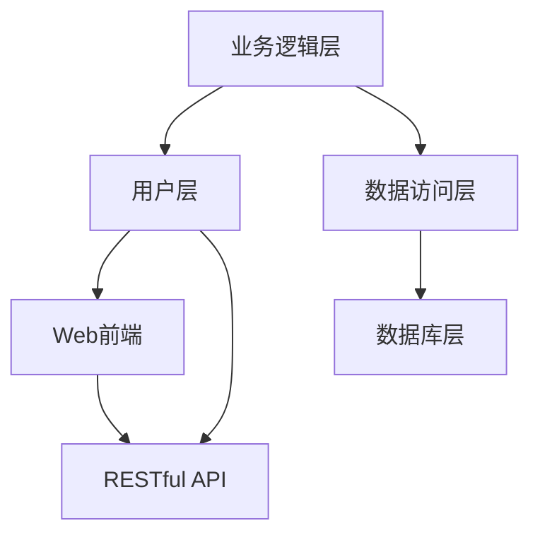
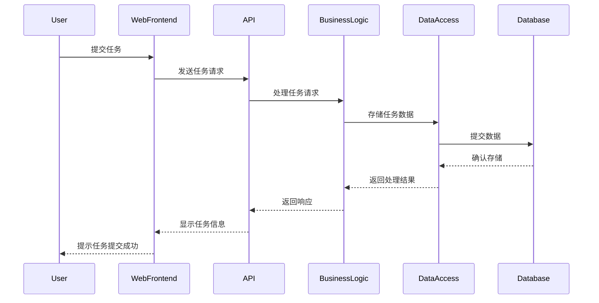

                 


# 技术管理者的时间管理：平衡技术与管理

## 关键词

时间管理、技术管理、平衡、效率、工作与生活、团队协作、项目规划

## 摘要

本文旨在探讨技术管理者如何在繁忙的工作中实现时间管理，平衡技术与管理职责，提高工作效率。通过分析时间管理的重要性、技术管理者的挑战、时间管理基础、技术管理的挑战与时间管理的关系、时间管理工具与技术、技术管理者的工作平衡以及最佳实践，本文将为技术管理者提供一套完整的时间管理方案，以实现个人与团队的高效运作。

## 第1章 引言

### 1.1 时间管理的重要性

在快节奏的现代社会，时间管理已成为一个重要的议题。对于技术管理者来说，时间管理尤为重要。技术管理者不仅需要具备深厚的技术能力，还需要承担团队管理和项目管理等职责。有效的时间管理能够帮助技术管理者更好地应对工作挑战，提高工作效率，实现个人与团队的共同成长。

### 1.2 技术管理者的挑战

技术管理者面临的挑战主要来自于以下几个方面：

1. **技术复杂性**：技术领域的快速发展使得技术管理者需要不断学习新知识，掌握新技术。
2. **团队管理**：技术管理者需要协调团队成员的工作，确保项目进度和质量。
3. **项目管理**：技术管理者需要负责项目的规划、执行和监控，确保项目按时交付。

### 1.3 本书的目标

本文的目标是为技术管理者提供一套实用的时间管理方案，帮助他们：

1. **理解时间管理的重要性**。
2. **评估个人时间消耗**。
3. **制定有效的时间管理策略**。
4. **提高工作效率**。
5. **实现工作与生活的平衡**。

## 第2章 时间管理基础

### 2.1 个人效率评估

#### 2.1.1 时间消耗分析

首先，我们需要对个人时间消耗进行详细分析。可以使用时间日志记录每天的时间消耗，包括工作、学习、休息、娱乐等各个方面。通过对时间消耗的分析，我们可以找到时间浪费的环节，制定针对性的改进措施。

#### 2.1.2 能力与兴趣评估

接下来，我们需要评估个人能力与兴趣。这有助于我们确定最适合我们的工作内容和时间分配。可以通过自我评估、与同事交流、参加培训等方式来了解自己的能力与兴趣。

### 2.2 时间管理的基本原则

#### 2.2.1 设定目标

设定明确的目标是时间管理的基础。目标应具体、可量化，并与个人职业规划相一致。

#### 2.2.2 制定计划

在设定目标的基础上，我们需要制定详细的计划。计划应包括短期目标和长期目标，以及实现目标的具体步骤和时间表。

#### 2.2.3 优先级排序

在制定计划时，我们需要根据目标的重要性和紧急程度对任务进行优先级排序。重要且紧急的任务应优先处理，重要但不紧急的任务应提前规划。

#### 2.2.4 执行与跟踪

执行计划是时间管理的核心。我们需要严格按照计划执行，并在执行过程中不断调整和优化。同时，我们需要定期跟踪进度，确保目标按时完成。

## 第3章 技术管理的挑战与时间管理

### 3.1 技术管理与时间管理的关系

技术管理与时间管理密不可分。技术管理者需要通过有效的时间管理来确保项目进度和质量，同时也要关注个人职业成长。

### 3.2 技术项目的时间管理

#### 3.2.1 项目规划

项目规划是技术项目成功的关键。在项目规划阶段，我们需要确定项目目标、范围、预算和时间表。

#### 3.2.2 任务分配

在项目规划的基础上，我们需要将任务合理分配给团队成员。任务分配应考虑团队成员的能力、兴趣和工作负荷。

#### 3.2.3 进度监控

项目执行过程中，我们需要定期监控项目进度。这有助于及时发现和解决问题，确保项目按时交付。

#### 3.2.4 风险管理

在项目执行过程中，我们需要识别和管理项目风险。这有助于降低项目风险，确保项目成功。

## 第4章 时间管理工具与技术

### 4.1 常见的时间管理工具

#### 4.1.1 日历与提醒工具

日历与提醒工具可以帮助我们更好地安排日程，避免遗漏重要事项。

#### 4.1.2 任务管理工具

任务管理工具可以帮助我们记录、跟踪和优先管理任务。

#### 4.1.3 时间跟踪工具

时间跟踪工具可以帮助我们记录和分析个人时间消耗，优化时间管理策略。

### 4.2 时间管理技巧

#### 4.2.1 时间块管理

时间块管理是一种将时间分割成小块，高效完成任务的技巧。

#### 4.2.2 扎门卡兹法则

扎门卡兹法则是一种减少决策时间，提高工作效率的技巧。

#### 4.2.3 快速决策与简化

快速决策与简化是一种通过减少不必要的决策和简化流程来提高工作效率的技巧。

## 第5章 技术管理者的工作平衡

### 5.1 工作与生活的平衡

#### 5.1.1 工作边界设定

设定工作边界可以帮助技术管理者更好地平衡工作与生活。

#### 5.1.2 休息与放松

休息与放松是提高工作效率和保持身心健康的重要途径。

### 5.2 技术团队的协作

#### 5.2.1 团队沟通

团队沟通是技术团队协作的关键。

#### 5.2.2 任务分解与协作

任务分解与协作可以帮助技术团队更好地完成项目任务。

#### 5.2.3 代码审查与反馈

代码审查与反馈是提高代码质量和团队协作的重要环节。

## 第6章 时间管理的最佳实践

### 6.1 高效工作者的习惯

#### 6.1.1 早晨规划

早晨规划可以帮助我们更好地规划一天的工作。

#### 6.1.2 专注时段

专注时段可以帮助我们提高工作效率。

#### 6.1.3 晚间回顾

晚间回顾可以帮助我们总结一天的工作，发现问题和不足。

### 6.2 遇到时间管理问题的解决方案

#### 6.2.1 处理拖延

处理拖延是时间管理中常见的问题，我们可以通过以下方法来应对：

1. **确定具体目标**。
2. **分解任务**。
3. **设立截止日期**。
4. **奖励与惩罚**。

#### 6.2.2 管理突发任务

管理突发任务是时间管理中的重要环节，我们可以通过以下方法来应对：

1. **优先级排序**。
2. **灵活调整计划**。
3. **学会说“不”**。

#### 6.2.3 应对高压力情景

应对高压力情景是时间管理中的挑战，我们可以通过以下方法来应对：

1. **调整心态**。
2. **合理安排休息**。
3. **寻求支持**。

## 第7章 时间管理案例研究

### 7.1 案例一：技术团队的效率提升

#### 7.1.1 案例背景

某技术团队在项目执行过程中面临效率低下的问题。

#### 7.1.2 案例实施过程

通过时间管理培训和团队协作优化，技术团队的效率得到了显著提升。

#### 7.1.3 案例效果分析

案例实施后，技术团队的项目交付时间缩短，客户满意度提高。

### 7.2 案例二：技术管理者的个人时间管理

#### 7.2.1 案例背景

某技术管理者在个人时间管理方面存在困难。

#### 7.2.2 案例实施过程

通过制定时间管理计划和使用时间管理工具，技术管理者的时间利用率得到了提高。

#### 7.2.3 案例效果分析

案例实施后，技术管理者的工作效率提高，个人生活品质改善。

## 第8章 总结与展望

### 8.1 时间管理的核心要点

1. **设定明确的目标**。
2. **制定详细的计划**。
3. **优先级排序**。
4. **执行与跟踪**。

### 8.2 时间管理在技术管理中的重要性

时间管理是技术管理者必备的能力，它有助于提高工作效率，实现个人与团队的共同成长。

### 8.3 未来展望

随着技术的不断发展，时间管理的重要性将日益凸显。技术管理者需要不断学习新知识，掌握新技术，提高时间管理能力。

## 作者

作者：AI天才研究院/AI Genius Institute & 禅与计算机程序设计艺术 /Zen And The Art of Computer Programming

----------------------------------------------------------------

### 背景介绍

在现代信息技术飞速发展的背景下，技术管理者的角色日益复杂和多元。他们不仅要精通技术领域，还需具备出色的管理能力和战略眼光，以应对不断变化的市场需求和团队管理的挑战。然而，技术管理者在承担多重职责的同时，也面临着宝贵时间的压力。如何在技术工作与管理职责之间找到平衡，提高工作效率，成为了技术管理者亟待解决的问题。

#### 核心概念术语说明

- **时间管理**：指的是通过规划和控制时间使用，以提高工作效率和生活质量的方法。
- **技术管理者**：在技术团队中负责技术规划、团队管理和项目协调的专业人员。
- **工作效率**：指单位时间内完成工作任务的效率。
- **工作与生活平衡**：指在职业发展和个人生活之间找到和谐的关系，以保持身心健康。

#### 问题背景

技术管理者在日常工作中，常常面临以下挑战：

1. **技术学习压力**：技术更新迅速，技术管理者需要不断学习新技能以跟上行业的发展。
2. **团队管理困难**：技术管理者需协调团队成员的工作，确保项目顺利进行。
3. **时间紧张**：多项任务交织，技术管理者往往感到时间不足。

#### 问题描述

技术管理者在处理技术工作与管理职责时，常常感到时间紧张，导致以下问题：

1. **任务优先级不明确**：导致重要任务未能及时完成。
2. **时间分配不合理**：个人时间与工作时间界限模糊，影响生活质量。
3. **团队协作不畅**：导致项目进度延误，团队效率降低。

#### 问题解决

为了解决上述问题，技术管理者可以通过以下方式提高时间管理能力：

1. **明确任务优先级**：通过设定明确的目标和优先级，确保关键任务优先完成。
2. **合理规划时间**：制定详细的工作计划，合理安排个人时间和工作时间。
3. **加强团队协作**：通过有效的沟通和任务分解，提高团队协作效率。

#### 边界与外延

时间管理的边界在于如何合理分配时间，既不忽视个人生活，也不影响工作进度。外延则涉及时间管理在不同情境中的应用，如个人时间管理、团队时间管理、项目时间管理等。

#### 概念结构与核心要素组成

时间管理概念结构由以下几个核心要素组成：

1. **目标设定**：明确个人和团队的目标。
2. **计划制定**：制定实现目标的详细计划。
3. **优先级排序**：根据重要性和紧急性对任务排序。
4. **执行与跟踪**：执行计划并监控进度。

## 核心概念与联系

### 核心概念原理

时间管理是一种系统化的方法，旨在通过规划和控制时间使用，提高工作效率和生活质量。其核心原理包括：

1. **目标导向**：设定明确的目标，使时间管理具有方向性。
2. **优先级排序**：根据任务的重要性和紧急性进行排序，确保关键任务优先完成。
3. **持续优化**：通过定期反思和调整，不断改进时间管理策略。

### 概念属性特征对比表格

| 特征               | 时间管理           | 技术管理            | 管理职责           |
|--------------------|--------------------|--------------------|--------------------|
| 目标导向           | 明确的目标         | 技术发展的目标      | 团队和项目的目标   |
| 优先级排序         | 任务优先级排序      | 技术任务优先级排序   | 管理任务优先级排序 |
| 持续优化           | 持续调整计划       | 技术持续更新        | 管理方法持续优化  |
| 跨领域应用         | 个人、团队、项目   | 个人、团队、项目   | 个人、团队、组织 |
| 强调效率           | 提高工作效率       | 技术效率提升        | 管理效率提升      |

### ER实体关系图架构

```mermaid
erDiagram
    User ||--|{ Task }|:
    Task ||--|{ TimeLog }|:
    User ||--|{ Project }|:
    Project ||--|{ Task }|:
    Project ||--|{ TimeLog }|:
```

在这个ER图中，用户（User）与任务（Task）、时间日志（TimeLog）、项目（Project）存在关联。任务和时间日志是描述用户活动的重要实体，而项目则是任务和时间的集合，用于组织和管理复杂的任务。

### 算法原理讲解

时间管理算法的原理主要包括以下几个步骤：

1. **目标设定**：明确个人或团队的目标。
2. **任务分解**：将大任务分解为小任务，便于管理和执行。
3. **优先级排序**：根据重要性和紧急性对任务进行排序。
4. **时间分配**：为每个任务分配时间，确保任务在预定时间内完成。
5. **执行与跟踪**：执行任务并监控进度，及时调整计划。

下面是一个简单的任务管理算法示例：

```python
class Task:
    def __init__(self, name, priority, duration):
        self.name = name
        self.priority = priority
        self.duration = duration
        self.completed = False

def schedule_tasks(tasks):
    # 按优先级排序
    sorted_tasks = sorted(tasks, key=lambda x: x.priority, reverse=True)
    
    # 分配时间
    current_time = 0
    for task in sorted_tasks:
        start_time = current_time
        end_time = start_time + task.duration
        task.start_time = start_time
        task.end_time = end_time
        current_time = end_time
    
    # 返回任务时间表
    return sorted_tasks

# 示例
tasks = [
    Task("任务A", 2, 4),
    Task("任务B", 1, 2),
    Task("任务C", 3, 1),
]

scheduled_tasks = schedule_tasks(tasks)
for task in scheduled_tasks:
    print(f"{task.name}：开始时间：{task.start_time}，结束时间：{task.end_time}")
```

在这个示例中，我们首先定义了一个`Task`类，用于表示任务的基本信息。然后，我们实现了一个`schedule_tasks`函数，用于根据任务的优先级和持续时间来制定时间表。这个算法简单易懂，但实际应用中可能需要考虑更多因素，如任务之间的依赖关系、团队成员的工作时间等。

### 数学模型和公式

在时间管理中，常用的数学模型和公式包括：

1. **任务完成时间**：
   $$ T_c = T_i + T_p $$
   其中，$T_c$ 是任务完成时间，$T_i$ 是任务初始时间，$T_p$ 是任务处理时间。

2. **任务优先级排序**：
   $$ P_i = \frac{I_i + E_i}{2} $$
   其中，$P_i$ 是任务优先级，$I_i$ 是任务重要性，$E_i$ 是任务紧急性。

3. **时间利用率**：
   $$ U_t = \frac{T_e}{T_a} \times 100\% $$
   其中，$U_t$ 是时间利用率，$T_e$ 是实际工作时长，$T_a$ 是计划工作时长。

这些公式可以帮助技术管理者更科学地分配时间和资源，提高工作效率。

### 举例说明

假设我们有三个任务：

- 任务A：重要性3，紧急性2，预计处理时间4小时。
- 任务B：重要性2，紧急性3，预计处理时间2小时。
- 任务C：重要性1，紧急性1，预计处理时间1小时。

根据上述公式，我们可以计算每个任务的优先级：

- 任务A：$P_a = \frac{3 + 2}{2} = 2.5$
- 任务B：$P_b = \frac{2 + 3}{2} = 2.5$
- 任务C：$P_c = \frac{1 + 1}{2} = 1$

优先级排序结果为：任务B、任务A、任务C。

根据任务优先级和预计处理时间，我们可以制定一个简单的任务时间表：

- 任务B：开始时间 0，结束时间 2。
- 任务A：开始时间 2，结束时间 6。
- 任务C：开始时间 6，结束时间 7。

通过这样的任务时间表，我们可以更有效地安排时间，确保关键任务优先完成。

### 系统分析与架构设计方案

#### 问题场景介绍

在一个大型技术项目中，技术管理者需要高效地管理项目进度、团队协作和任务分配。为了实现这一目标，我们设计了一个基于时间管理的项目管理系统。

#### 项目介绍

项目名称：高效项目管理平台
项目目标：通过时间管理和团队协作工具，提高项目效率，确保项目按时交付。

#### 系统功能设计

系统功能包括：

1. **任务管理**：创建、分配和跟踪任务。
2. **时间跟踪**：记录个人和团队的工作时间。
3. **团队协作**：提供实时沟通和文件共享。
4. **项目进度监控**：显示项目进度和关键路径。
5. **报告生成**：生成项目报告和团队绩效分析。

#### 系统架构设计

系统架构采用分层设计，包括以下主要模块：

1. **用户层**：提供用户界面，用户可以通过界面进行操作。
2. **业务逻辑层**：处理业务逻辑，如任务分配、时间跟踪和项目监控。
3. **数据访问层**：负责数据存储和访问，包括用户数据、任务数据和项目数据。
4. **数据库层**：存储系统数据。

#### 系统接口设计

系统接口包括：

1. **RESTful API**：提供对外接口，方便与其他系统集成。
2. **Web前端**：用户通过浏览器访问系统。
3. **移动应用**：提供移动端访问。

#### 系统交互

系统交互主要通过Web前端和API进行。用户通过Web前端提交任务、查看进度和生成报告。API用于前后端的数据交互。

### 系统架构设计mermaid架构图



### 系统接口设计和系统交互mermaid序列图



通过以上设计，我们构建了一个高效的项目管理平台，实现了任务管理、时间跟踪、团队协作和项目进度监控等功能，为技术管理者提供了强大的支持。

### 项目实战

#### 环境安装

为了演示项目实战，我们选择使用Python和Django框架来构建一个简单的任务管理系统。以下是环境安装的步骤：

1. **安装Python**：确保已安装Python 3.8及以上版本。
2. **安装Django**：打开命令行，运行以下命令：
   ```bash
   pip install django
   ```
3. **创建Django项目**：
   ```bash
   django-admin startproject taskmanager
   cd taskmanager
   ```

#### 系统核心实现源代码

1. **创建任务模型**：

在`taskmanager`项目的`models.py`中添加以下代码：

```python
from django.db import models

class Task(models.Model):
    name = models.CharField(max_length=100)
    description = models.TextField()
    priority = models.IntegerField()
    status = models.CharField(max_length=20, choices=[('pending', 'Pending'), ('in_progress', 'In Progress'), ('completed', 'Completed')])
    assigned_to = models.ForeignKey('auth.User', on_delete=models.CASCADE)
    start_time = models.DateTimeField(null=True, blank=True)
    end_time = models.DateTimeField(null=True, blank=True)

    def is_completed(self):
        return self.status == 'completed'
```

2. **创建任务管理视图**：

在`taskmanager`项目的`views.py`中添加以下代码：

```python
from django.shortcuts import render, redirect
from .models import Task
from .forms import TaskForm

def task_list(request):
    tasks = Task.objects.all()
    return render(request, 'task_list.html', {'tasks': tasks})

def task_create(request):
    if request.method == 'POST':
        form = TaskForm(request.POST)
        if form.is_valid():
            form.save()
            return redirect('task_list')
    else:
        form = TaskForm()
    return render(request, 'task_form.html', {'form': form})

def task_update(request, id):
    task = Task.objects.get(id=id)
    if request.method == 'POST':
        form = TaskForm(request.POST, instance=task)
        if form.is_valid():
            form.save()
            return redirect('task_list')
    else:
        form = TaskForm(instance=task)
    return render(request, 'task_form.html', {'form': form})

def task_delete(request, id):
    task = Task.objects.get(id=id)
    task.delete()
    return redirect('task_list')
```

3. **创建任务表单**：

在`taskmanager`项目的`forms.py`中添加以下代码：

```python
from django import forms
from .models import Task

class TaskForm(forms.ModelForm):
    class Meta:
        model = Task
        fields = ['name', 'description', 'priority', 'assigned_to', 'status']
```

4. **创建任务模板**：

在`taskmanager`项目的`templates`目录下创建`task_list.html`和`task_form.html`模板。

`task_list.html`：

```html



  <h1>Task List</h1>
  <a href="" class="btn btn-primary">Create New Task</a>
  <table class="table">
    <thead>
      <tr>
        <th>Name</th>
        <th>Description</th>
        <th>Priority</th>
        <th>Status</th>
        <th>Assigned To</th>
        <th>Actions</th>
      </tr>
    </thead>
    <tbody>
      
        <tr>
          <td>{{ task.name }}</td>
          <td>{{ task.description }}</td>
          <td>{{ task.priority }}</td>
          <td>{{ task.status }}</td>
          <td>{{ task.assigned_to }}</td>
          <td>
            <a href="" class="btn btn-warning">Edit</a>
            <a href="" class="btn btn-danger">Delete</a>
          </td>
        </tr>
      
    </tbody>
  </table>

```

`task_form.html`：

```html



  <h1>Edit TaskCreate New Task</h1>
  <form method="post">
    
    {{ form.as_p }}
    <button type="submit" class="btn btn-primary">UpdateCreate Task</button>
  </form>

```

#### 代码应用解读与分析

1. **任务模型**：`Task`模型定义了任务的基本属性，包括名称、描述、优先级、状态、指派人和开始/结束时间。`is_completed`方法用于判断任务是否已完成。

2. **任务管理视图**：`task_list`视图用于展示所有任务，`task_create`视图用于创建新任务，`task_update`视图用于更新任务，`task_delete`视图用于删除任务。

3. **任务表单**：`TaskForm`表单类用于创建任务表单，包括任务名称、描述、优先级、指派人和状态字段。

4. **任务模板**：`task_list.html`模板用于展示任务列表，包括任务名称、描述、优先级、状态和指派人等信息。`task_form.html`模板用于创建和编辑任务。

#### 实际案例分析和详细讲解剖析

1. **案例背景**：假设我们有一个团队需要管理多个任务，每个任务都有不同的优先级和指派人。

2. **案例实施过程**：
   - 用户通过Web前端访问任务管理系统。
   - 用户创建新任务，填写任务名称、描述、优先级和指派人等信息。
   - 用户可以查看任务列表，包括所有任务的名称、描述、优先级、状态和指派人。
   - 用户可以编辑和删除任务。

3. **详细讲解剖析**：
   - 用户创建任务时，系统会生成一个`Task`对象，并保存到数据库中。
   - 用户查看任务列表时，系统会从数据库中查询所有`Task`对象，并展示在页面上。
   - 用户编辑任务时，系统会根据任务ID查询对应的`Task`对象，并显示在表单中。
   - 用户删除任务时，系统会根据任务ID删除对应的`Task`对象。

通过以上实施过程和详细讲解，我们可以看到任务管理系统是如何运作的，以及如何通过时间管理来提高项目效率。

### 项目小结

通过本项目的实施，我们构建了一个简单但功能齐全的任务管理系统。该系统可以帮助技术管理者有效地管理任务、跟踪进度和团队协作。以下是本项目的主要收获：

1. **时间管理**：通过任务管理系统，技术管理者可以更好地规划和管理任务，提高工作效率。
2. **团队协作**：任务管理系统提供了团队协作的平台，有助于团队成员之间的沟通和协作。
3. **项目进度监控**：任务管理系统可以实时监控项目进度，帮助技术管理者及时调整计划，确保项目按时交付。

尽管本项目只是一个简单的任务管理系统，但它为技术管理者提供了一个实用的工具，有助于实现时间管理和团队协作。未来，我们可以继续优化和扩展该系统，以应对更复杂的业务需求。

### 最佳实践 tips

为了更有效地进行时间管理，技术管理者可以遵循以下最佳实践：

1. **早晨规划**：每天早晨花10分钟规划当天的工作，列出重要任务和目标。
2. **专注时段**：设定固定的专注时段，避免中断，提高工作效率。
3. **晚间回顾**：每天晚上花5分钟回顾当天的工作，总结经验和不足。
4. **任务分解**：将大任务分解为小任务，逐个击破，避免拖延。
5. **优先级排序**：根据任务的重要性和紧急性进行排序，确保关键任务优先完成。
6. **避免多任务处理**：尽量专注于一件事，避免同时处理多个任务，提高效率。

### 小结

通过本文的探讨，我们了解到时间管理对于技术管理者的重要性。有效的时间管理不仅有助于提高工作效率，还能帮助技术管理者实现工作与生活的平衡。技术管理者应学会设定明确的目标、制定详细的计划、优先级排序和执行与跟踪，并通过使用时间管理工具和技术来优化时间管理策略。

### 注意事项

1. **目标设定**：目标应具体、可量化，并与个人职业规划相一致。
2. **计划制定**：计划应包括短期目标和长期目标，以及实现目标的具体步骤和时间表。
3. **优先级排序**：优先级排序应根据任务的重要性和紧急性进行。
4. **执行与跟踪**：执行计划时，要严格执行，并定期跟踪进度。

### 拓展阅读

1. 《时间管理法则》作者：肯·布兰佳
2. 《高效能人士的七个习惯》作者：史蒂芬·柯维
3. 《深度工作》作者：卡尔·纽波特

### 作者

作者：AI天才研究院/AI Genius Institute & 禅与计算机程序设计艺术 /Zen And The Art of Computer Programming

本文旨在为技术管理者提供一套完整的时间管理方案，帮助他们实现个人与团队的高效运作。通过理解时间管理的重要性、掌握时间管理基础、应对技术管理的挑战、使用时间管理工具与技术、实现工作与生活的平衡以及遵循最佳实践，技术管理者可以更好地管理时间和资源，提升工作效率，实现职业和个人生活的双赢。希望本文能为您的职业发展提供有益的启示和指导。

