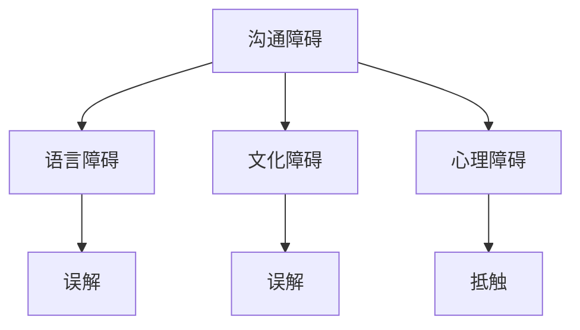
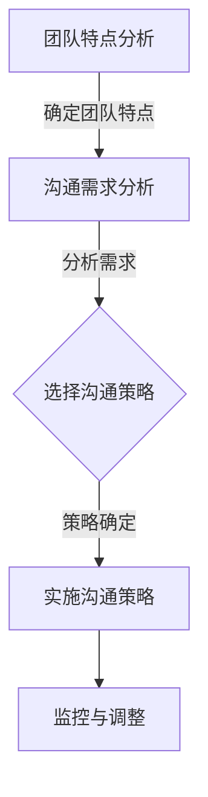
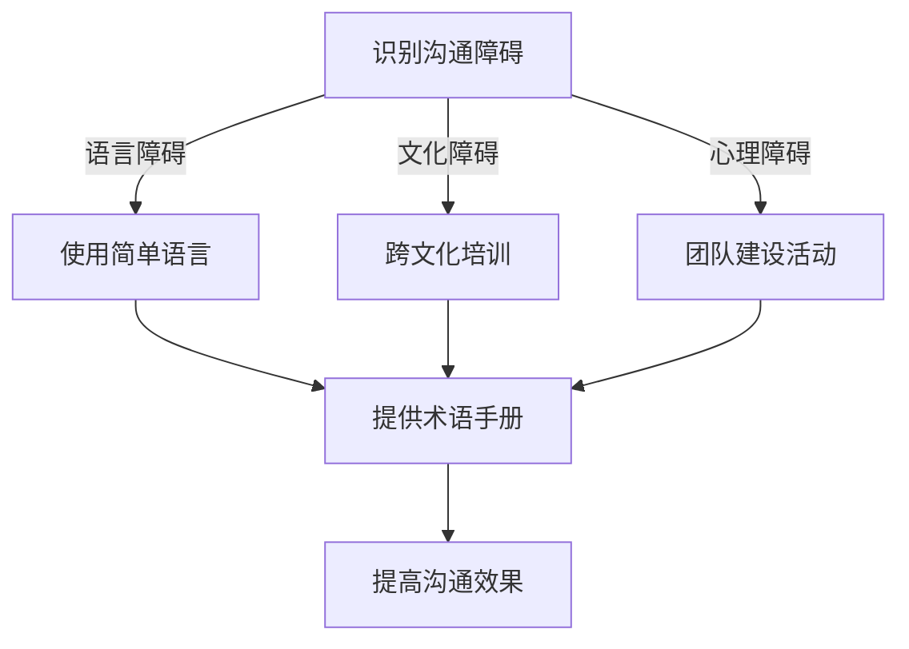
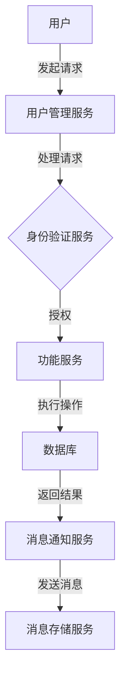
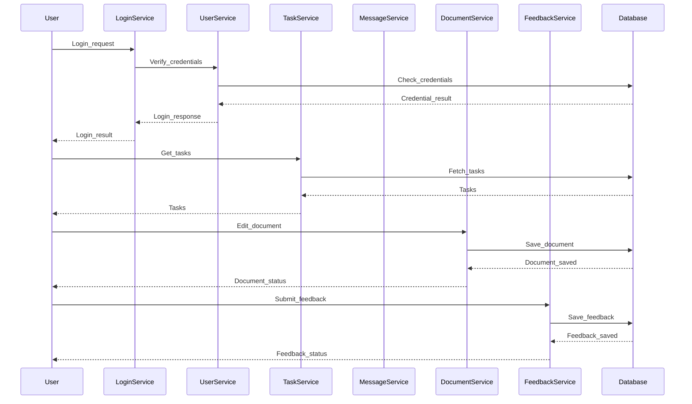

                 

### 设计《技术管理者的沟通艺术：上传下达的技巧》的目录大纲

为了详细阐述《技术管理者的沟通艺术：上传下达的技巧》这一主题，我们将采用逻辑清晰、结构紧凑的章节布局，确保文章的内容丰富且易于理解。以下是文章的目录大纲设计：

#### 目录

**I. 引言**

1. **问题背景**：技术管理者在公司内部的沟通角色及其重要性。
2. **问题描述**：技术管理者面临的沟通挑战和需求。
3. **问题解决**：通过有效的沟通技巧和策略提高上传下达的效率。
4. **边界与外延**：讨论范围、沟通技巧与策略的核心要素。
5. **概念结构与核心要素组成**：搭建沟通艺术的理论框架。

**II. 核心概念与联系**

1. **沟通技巧**：
   - **定义与分类**：倾听、提问、表达、非语言沟通。
   - **概念属性特征对比表格**：对比分析不同沟通技巧的属性和目的。
   - **实践应用**：结合具体案例讲解沟通技巧的实际运用。

2. **沟通策略**：
   - **定义与分类**：沟通计划、渠道选择、时机把握。
   - **概念属性特征对比表格**：对比分析不同沟通策略的特点和目的。
   - **实践应用**：策略在实际工作中的应用示例。

3. **沟通障碍的识别与解决**：
   - **语言障碍**：语言选择、翻译技巧。
   - **文化障碍**：文化差异、文化适应。
   - **心理障碍**：心理因素、情绪管理。
   - **ER实体关系图架构的 Mermaid 流程图**：展示沟通障碍及其解决方案。

**III. 算法原理讲解**

1. **沟通策略选择算法**：
   - **算法流程**：通过团队特点与沟通需求的匹配选择策略。
   - **Mermaid 流程图**：使用 Mermaid 画图工具展示算法流程。
   - **Python 源代码**：编写代码实现沟通策略选择算法。

2. **沟通效果评估模型**：
   - **数学模型**：沟通效果的函数公式及其参数解释。
   - **数学公式**：用 LaTeX 格式展示沟通效果评估的数学公式。
   - **案例分析**：举例说明模型在实际工作中的应用。

**IV. 数学模型和数学公式**

1. **沟通效果评估模型**：
   - **数学公式**：详细解释沟通效果评估模型的数学表达式。
   - **参数优化**：讨论如何通过参数调整优化沟通效果。

2. **沟通障碍识别与解决**：
   - **数学方法**：应用数学方法识别和解决沟通障碍。
   - **算法流程图**：使用 Mermaid 工具展示解决流程。

**V. 系统分析与架构设计方案**

1. **问题场景介绍**：描述技术管理者沟通的具体场景。

2. **系统功能设计**：
   - **领域模型类图**：使用 Mermaid 类图展示系统功能模块。

3. **系统架构设计**：
   - **架构图**：展示系统的整体架构和各模块关系。

4. **系统接口设计**：详细说明系统内部和外部的接口设计。

5. **系统交互序列图**：使用 Mermaid 序列图展示系统交互流程。

**VI. 项目实战**

1. **环境安装**：介绍搭建沟通系统所需的环境配置。

2. **系统核心实现源代码**：提供系统核心功能的源代码。

3. **代码应用解读与分析**：对关键代码段进行解读和分析。

4. **实际案例分析与详细讲解**：结合实际案例展开深入剖析。

5. **项目小结**：总结项目实施的经验和教训。

**VII. 最佳实践 tips**

1. **常见问题与解决方案**：总结常见沟通问题及其解决方法。

2. **技巧提升**：提供一些实用的沟通技巧提升建议。

**VIII. 小结**

1. **核心观点**：回顾文章的主要观点和发现。

2. **后续研究方向**：探讨未来可能的研究方向。

**IX. 注意事项**

1. **沟通中的潜在风险**：提醒读者注意沟通中的潜在问题和风险。

2. **持续学习和提升**：强调持续学习和沟通技能提升的重要性。

**X. 拓展阅读**

1. **推荐读物**：列出与文章主题相关的推荐书籍和论文。

2. **在线资源**：提供相关的在线教程和工具资源链接。

### 背景介绍

#### 问题背景

在当今高速发展的信息技术时代，技术管理者在企业内部承担着至关重要的角色。他们不仅要掌握先进的技术知识，还要具备卓越的沟通能力，以便有效地上传下达，确保团队协作的顺利进行。技术管理者通常是项目团队的核心，他们的沟通能力直接影响到项目成功的几率。

技术管理者面临的挑战主要包括以下几个方面：

1. **信息传递的准确性**：技术管理者需要将上级的指令准确无误地传达给团队成员，同时确保团队成员的理解和执行与预期一致。
2. **跨部门协作**：技术管理者需要与其他部门的同事协作，如市场、销售、运维等，这要求他们能够跨越不同的业务领域和文化差异，进行有效的沟通。
3. **团队内部沟通**：技术管理者需要确保团队内部成员之间的沟通畅通，促进知识共享和协作，提高团队整体效率。
4. **外部沟通**：技术管理者还需与外部合作伙伴、客户等保持良好的沟通，以解决技术问题、推动项目进展。

良好的沟通能力不仅有助于提高工作效率，还能增强团队凝聚力，减少误解和冲突，从而实现企业的战略目标。因此，技术管理者必须掌握一系列的沟通技巧和策略，以应对复杂的沟通场景。

#### 问题描述

技术管理者在沟通中面临的常见问题包括：

1. **信息失真**：由于沟通层次过多或沟通方式不当，导致上级指令在传达过程中出现偏差，团队成员无法准确理解任务要求。
2. **沟通障碍**：团队成员之间的沟通不畅，可能会导致项目延误和资源浪费。语言障碍、文化差异和心理障碍等都是常见的沟通障碍。
3. **沟通不及时**：技术管理者未能及时与团队成员沟通，导致问题积累，影响项目进度和团队士气。
4. **反馈机制不完善**：技术管理者缺乏有效的反馈机制，无法及时了解团队成员的工作进展和意见，从而无法进行有效调整。

这些问题不仅影响项目执行的效果，还可能导致团队士气低落，影响企业整体绩效。因此，技术管理者必须意识到沟通的重要性，并采取有效措施解决沟通中的问题。

#### 问题解决

为了解决上述问题，技术管理者可以采取以下措施：

1. **提升沟通技巧**：通过培训和实践，提高自己的倾听、提问、表达和非语言沟通能力，确保信息传递的准确性和有效性。
2. **制定沟通策略**：根据项目特点和团队需求，制定合理的沟通计划，选择适当的沟通渠道和时机，确保沟通的流畅性。
3. **建立反馈机制**：通过定期会议、报告等方式，了解团队成员的工作进展和意见，及时调整沟通策略和计划。
4. **加强跨部门协作**：与技术管理者和其他部门的同事建立良好的关系，促进信息共享和协作，提高项目执行效率。
5. **解决沟通障碍**：识别和解决语言、文化、心理等障碍，促进团队成员之间的理解和信任。

通过这些措施，技术管理者可以更好地上传下达，确保团队高效运作，从而实现企业的战略目标。

#### 边界与外延

在本文中，我们讨论的范围将主要聚焦于技术管理者在企业内部的沟通问题，特别是上传下达的过程。这包括内部沟通、跨部门沟通和外部沟通等几个方面。内部沟通主要涉及技术管理者与团队成员之间的交流，如项目任务分配、进度报告和技术讨论等。跨部门沟通则涉及技术管理者与其他部门（如市场、销售、运维等）之间的合作和协调。外部沟通则涉及与技术合作伙伴、客户等外部主体的沟通。

核心要素组成方面，本文将重点探讨以下几个方面的沟通技巧和策略：

1. **沟通技巧**：包括倾听、提问、表达和非语言沟通等，这些技巧对于确保信息传递的准确性和有效性至关重要。
2. **沟通策略**：包括沟通计划、渠道选择和时机把握等，合理的沟通策略能够提高沟通效率，减少误解和冲突。
3. **沟通障碍的识别与解决**：包括语言障碍、文化障碍和心理障碍等，这些障碍需要通过有效的识别和解决策略来克服。

本文将采用逻辑清晰、结构紧凑的方式，通过具体案例和实践经验，详细讲解这些核心要素，帮助技术管理者提升沟通能力，实现上传下达的高效运作。

### 核心概念与联系

在探讨技术管理者的沟通艺术时，我们需要了解和掌握一些核心概念和技巧。以下是几个关键概念的详细描述、对比分析，以及其实践应用。

#### 沟通技巧

**1. 倾听**

**定义**：倾听不仅仅是听到对方说话，更重要的是理解对方的意图和情感。

**目的**：建立信任，促进有效沟通。

**特点对比表格**：

| 沟通技巧 | 定义 | 目的 |
| --- | --- | --- |
| 倾听 | 注意听对方说话，理解其意图 | 建立信任，促进有效沟通 |
| 提问 | 提出问题以澄清信息 | 明确需求，避免误解 |
| 表达 | 清晰、准确地表达自己的想法 | 传递信息，减少歧义 |
| 非语言沟通 | 通过肢体语言、面部表情等传递信息 | 强化语言表达，提升沟通效果 |

**实践应用**：在一次团队会议上，技术管理者要确保每个团队成员都有机会发言，并在他们说话时保持专注，点头和眼神接触以表示理解和尊重。

**2. 提问**

**定义**：提问是为了澄清信息、明确需求和避免误解而提出的问题。

**目的**：明确需求，避免误解。

**特点对比表格**：

| 沟通技巧 | 定义 | 目的 |
| --- | --- | --- |
| 倾听 | 注意听对方说话，理解其意图 | 建立信任，促进有效沟通 |
| 提问 | 提出问题以澄清信息 | 明确需求，避免误解 |
| 表达 | 清晰、准确地表达自己的想法 | 传递信息，减少歧义 |
| 非语言沟通 | 通过肢体语言、面部表情等传递信息 | 强化语言表达，提升沟通效果 |

**实践应用**：在项目启动时，技术管理者可以通过提问确保团队成员对项目目标和任务有清晰的理解，如“你对这个项目的目标有什么看法？”或“你认为我们遇到的最大挑战是什么？”

**3. 表达**

**定义**：表达是指清晰、准确地传递自己的思想、观点和信息的技巧。

**目的**：传递信息，减少歧义。

**特点对比表格**：

| 沟通技巧 | 定义 | 目的 |
| --- | --- | --- |
| 倾听 | 注意听对方说话，理解其意图 | 建立信任，促进有效沟通 |
| 提问 | 提出问题以澄清信息 | 明确需求，避免误解 |
| 表达 | 清晰、准确地表达自己的想法 | 传递信息，减少歧义 |
| 非语言沟通 | 通过肢体语言、面部表情等传递信息 | 强化语言表达，提升沟通效果 |

**实践应用**：在编写技术文档时，技术管理者应使用简洁明了的语言，避免使用专业术语或模糊不清的表达，以便团队成员更好地理解和执行任务。

**4. 非语言沟通**

**定义**：非语言沟通是通过肢体语言、面部表情、身体姿势等非语言手段来传递信息。

**目的**：强化语言表达，提升沟通效果。

**特点对比表格**：

| 沟通技巧 | 定义 | 目的 |
| --- | --- | --- |
| 倾听 | 注意听对方说话，理解其意图 | 建立信任，促进有效沟通 |
| 提问 | 提出问题以澄清信息 | 明确需求，避免误解 |
| 表达 | 清晰、准确地表达自己的想法 | 传递信息，减少歧义 |
| 非语言沟通 | 通过肢体语言、面部表情等传递信息 | 强化语言表达，提升沟通效果 |

**实践应用**：在面对面会议中，技术管理者可以通过肢体语言（如点头、微笑）来表达对团队成员发言的认可，同时观察对方的表情和姿态，了解他们的反应和感受。

#### 沟通策略

**1. 沟通计划**

**定义**：沟通计划是指为了确保沟通目标的实现而制定的详细计划和步骤。

**目的**：确保沟通有序进行，提高沟通效率。

**特点对比表格**：

| 沟通策略 | 定义 | 目的 |
| --- | --- | --- |
| 沟通计划 | 制定沟通目标和具体计划 | 确保沟通有序进行 |
| 沟通渠道选择 | 根据沟通内容选择合适的渠道 | 提高沟通效率 |
| 沟通时机 | 选择合适的时机进行沟通 | 避免干扰和打断 |

**实践应用**：在项目启动时，技术管理者可以制定一份详细的沟通计划，包括定期会议、进度报告和紧急沟通等，确保团队成员对沟通的时间和方式有清晰的了解。

**2. 沟通渠道选择**

**定义**：沟通渠道选择是指根据沟通内容的性质和团队的需求，选择最合适的沟通渠道。

**目的**：提高沟通效率，减少信息传递的障碍。

**特点对比表格**：

| 沟通策略 | 定义 | 目的 |
| --- | --- | --- |
| 沟通计划 | 制定沟通目标和具体计划 | 确保沟通有序进行 |
| 沟通渠道选择 | 根据沟通内容选择合适的渠道 | 提高沟通效率 |
| 沟通时机 | 选择合适的时机进行沟通 | 避免干扰和打断 |

**实践应用**：在需要快速传达信息的情况下，技术管理者可以选择即时通讯工具（如微信、Slack）进行沟通，而在需要详细讨论或汇报时，则可以选择邮件或面对面会议。

**3. 沟通时机**

**定义**：沟通时机是指选择在最适合的时刻进行沟通。

**目的**：避免干扰和打断，确保沟通效果。

**特点对比表格**：

| 沟通策略 | 定义 | 目的 |
| --- | --- | --- |
| 沟通计划 | 制定沟通目标和具体计划 | 确保沟通有序进行 |
| 沟通渠道选择 | 根据沟通内容选择合适的渠道 | 提高沟通效率 |
| 沟通时机 | 选择合适的时机进行沟通 | 避免干扰和打断 |

**实践应用**：在团队成员忙碌时，技术管理者应避免打扰，选择他们在相对轻松的时刻进行沟通。同时，在紧急情况下，应迅速采取行动，确保沟通的及时性和有效性。

#### 沟通障碍的识别与解决

**1. 语言障碍**

**定义**：语言障碍是由于语言差异或专业术语的使用而导致的沟通障碍。

**目的**：确保信息传递的准确性和有效性。

**特点对比表格**：

| 沟通障碍 | 定义 | 目的 |
| --- | --- | --- |
| 语言障碍 | 由于语言差异或专业术语的使用导致的沟通障碍 | 确保信息传递的准确性和有效性 |
| 文化障碍 | 由于文化差异导致的沟通障碍 | 促进跨文化理解和协作 |
| 心理障碍 | 由于心理因素导致的沟通障碍 | 增强团队成员之间的信任和沟通效果 |

**实践应用**：技术管理者可以通过使用简单的语言和避免专业术语来减少语言障碍。同时，对于使用不同语言或专业术语的团队成员，可以提供语言培训或术语手册。

**2. 文化障碍**

**定义**：文化障碍是由于文化差异导致的沟通障碍。

**目的**：促进跨文化理解和协作。

**特点对比表格**：

| 沟通障碍 | 定义 | 目的 |
| --- | --- | --- |
| 语言障碍 | 由于语言差异或专业术语的使用导致的沟通障碍 | 确保信息传递的准确性和有效性 |
| 文化障碍 | 由于文化差异导致的沟通障碍 | 促进跨文化理解和协作 |
| 心理障碍 | 由于心理因素导致的沟通障碍 | 增强团队成员之间的信任和沟通效果 |

**实践应用**：技术管理者可以通过组织跨文化交流活动，提高团队成员对不同文化的理解和尊重。同时，在跨文化沟通中，应避免使用可能引起误解的文化习惯和语言。

**3. 心理障碍**

**定义**：心理障碍是由于心理因素（如焦虑、抵触、压力等）导致的沟通障碍。

**目的**：增强团队成员之间的信任和沟通效果。

**特点对比表格**：

| 沟通障碍 | 定义 | 目的 |
| --- | --- | --- |
| 语言障碍 | 由于语言差异或专业术语的使用导致的沟通障碍 | 确保信息传递的准确性和有效性 |
| 文化障碍 | 由于文化差异导致的沟通障碍 | 促进跨文化理解和协作 |
| 心理障碍 | 由于心理因素导致的沟通障碍 | 增强团队成员之间的信任和沟通效果 |

**实践应用**：技术管理者可以通过定期的团队建设活动和心理辅导来缓解团队成员的心理压力，增强团队凝聚力。在沟通中，应关注团队成员的情绪和反应，提供必要的支持和鼓励。

#### ER实体关系图架构的 Mermaid 流程图

为了更好地展示沟通障碍及其解决方案，我们使用 Mermaid 工具绘制了 ER 实体关系图。



在这个流程图中，A 代表沟通障碍的总类别，B、C、D 分别代表语言障碍、文化障碍和心理障碍。每个子类别都连接到一个结果（E、F、G），表示该障碍可能导致的具体问题。通过这个图，我们可以清晰地看到沟通障碍的类型及其影响，从而有针对性地采取解决措施。

### 算法原理讲解

在技术管理者的沟通艺术中，选择合适的沟通策略是实现高效上传下达的关键。为了实现这一目标，我们需要设计一个基于团队特点和沟通需求的沟通策略选择算法。接下来，我们将详细讲解该算法的原理，并使用 Mermaid 流程图和 Python 源代码进行说明。

#### 沟通策略选择算法流程

**流程描述**：该算法通过分析团队的特点和沟通需求，选择最合适的沟通策略。具体步骤如下：

1. **团队特点分析**：分析团队的结构、成员背景、沟通风格等特征。
2. **沟通需求分析**：确定项目需求、任务复杂度、紧急程度等因素。
3. **策略选择**：根据团队特点和沟通需求，选择适合的沟通策略。
4. **策略实施**：实施选定的沟通策略，并进行监控和调整。

**Mermaid 流程图**



在这个流程图中，A 表示团队特点分析，B 表示沟通需求分析，C 是策略选择环节，D 是实施沟通策略，E 是监控与调整环节。

#### Python 源代码实现

为了便于理解和实际应用，我们使用 Python 编写了一个简化的沟通策略选择算法。该算法根据输入的团队特点和沟通需求，输出推荐的沟通策略。

```python
def choose_communication_strategy(team_characteristics, communication_needs):
    if team_characteristics == 'diverse' and communication_needs == 'complex':
        strategy = 'collaborative communication'
    elif team_characteristics == 'homogeneous' and communication_needs == 'simple':
        strategy = 'directive communication'
    else:
        strategy = 'adaptive communication'
    return strategy

team_characteristics = input("请输入团队特点（diverse/homogeneous）: ")
communication_needs = input("请输入沟通需求（simple/complex）: ")
print(f"推荐的沟通策略是：{choose_communication_strategy(team_characteristics, communication_needs)}")
```

在这个代码中，`choose_communication_strategy` 函数根据团队特点（`diverse` 或 `homogeneous`）和沟通需求（`simple` 或 `complex`）选择沟通策略。如果团队多样且需求复杂，选择协作型沟通；如果团队同质且需求简单，选择指令型沟通；否则，选择适应型沟通。

#### 沟通效果评估模型

为了量化沟通效果，我们可以使用以下数学模型：

$$ E = f(P, C, S) $$

其中：
- \( E \) 是沟通效果。
- \( P \) 是沟通计划的质量。
- \( C \) 是沟通渠道的选择。
- \( S \) 是沟通时机的把握。

该模型表明，沟通效果是沟通计划、渠道选择和时机把握三者的函数。我们可以通过以下步骤进行参数优化：

1. **计划质量优化**：通过培训和技术手段提高沟通计划的制定质量。
2. **渠道选择优化**：根据沟通内容选择最有效的渠道，如电子邮件、即时通讯或会议。
3. **时机把握优化**：选择最佳的沟通时间，避免干扰和打断。

#### 案例分析

假设我们有一个由多元化背景成员组成的团队，项目需求复杂且紧急。根据算法和模型，我们推荐的沟通策略是协作型沟通，并通过以下参数优化来提高沟通效果：

1. **计划质量**：制定详细的沟通计划，包括会议议程、任务分配和时间安排。
2. **渠道选择**：使用即时通讯工具（如 Slack）进行实时沟通，同时定期通过电子邮件发送进度报告。
3. **时机把握**：选择在团队成员相对空闲的时间进行沟通，如下午茶时间或周五下午。

通过这些优化措施，我们可以提高沟通效果，确保团队高效运作。

### 数学模型和数学公式

在技术管理者的沟通艺术中，了解和运用数学模型可以帮助我们更科学地评估沟通效果，优化沟通策略。以下是几种常见的数学模型和公式，我们将逐一进行详细讲解。

#### 沟通效果评估模型

为了量化沟通效果，我们可以使用以下数学模型：

$$ E = f(P, C, S) $$

其中：
- \( E \) 是沟通效果。
- \( P \) 是沟通计划的质量。
- \( C \) 是沟通渠道的选择。
- \( S \) 是沟通时机的把握。

这个公式表明，沟通效果是沟通计划、渠道选择和时机把握三者的函数。具体参数的解释如下：

1. **沟通计划的质量 \( P \)**：这包括沟通目标的明确性、沟通内容的详尽性、沟通节奏的合理性等。一个好的沟通计划能够确保信息传递的准确性和及时性。

2. **沟通渠道的选择 \( C \)**：不同的沟通渠道有其适用的场景。例如，电子邮件适用于正式、详细的沟通，而即时通讯工具如 Slack 适用于快速、高效的沟通。

3. **沟通时机的把握 \( S \)**：选择合适的沟通时机能够避免干扰和打断，提高沟通效果。例如，在团队成员相对空闲的时间进行沟通，可以减少工作干扰。

#### 参数优化

为了提高沟通效果 \( E \)，我们可以对上述参数进行优化：

1. **计划质量优化**：通过培训和技术手段提高沟通计划的制定质量，如使用项目管理工具（如 Jira）来确保计划的详尽和可执行性。

2. **渠道选择优化**：根据沟通内容的性质和团队的需求，选择最合适的沟通渠道。例如，对于需要详细讨论的问题，可以选择视频会议；对于快速反馈的问题，可以选择即时通讯工具。

3. **时机把握优化**：通过数据分析，找到团队成员的工作高峰期和低谷期，避免在高峰期进行沟通。同时，可以设置提醒机制，确保在重要沟通时间团队成员能够及时参与。

#### 数学公式

下面我们将使用 LaTeX 格式展示沟通效果评估模型的详细数学公式：

$$ E = \alpha P + \beta C + \gamma S $$

其中：
- \( \alpha \)，\( \beta \)，\( \gamma \) 是权重系数，表示每个参数对沟通效果的影响程度。

具体参数的权重可以通过历史数据和统计分析来确定。例如，如果历史数据显示沟通计划的质量对沟通效果的影响最大，那么 \( \alpha \) 的权重会更高。

#### 案例分析

假设我们有一个团队，团队特点为多样化背景（\( P = 0.6 \)），沟通需求为复杂任务（\( C = 0.5 \)），沟通时机的把握较好（\( S = 0.7 \)）。根据上述公式，我们可以计算团队的沟通效果：

$$ E = 0.6 \times 0.6 + 0.5 \times 0.5 + 0.7 \times 0.7 $$
$$ E = 0.36 + 0.25 + 0.49 $$
$$ E = 1.1 $$

这个结果表明，该团队的沟通效果较好，但仍有机会通过优化各个参数来进一步提高。

#### 沟通障碍识别与解决

沟通障碍是技术管理者在沟通过程中常见的问题。以下将介绍几种常见的沟通障碍及其识别和解决方法。

##### 语言障碍

语言障碍是由于团队成员使用不同语言或专业术语而导致的沟通障碍。解决方法包括：

1. **使用简单语言**：避免使用复杂或专业的术语，用简单的语言表达思想。
2. **提供术语手册**：为团队成员提供常用的术语手册或词汇表。
3. **语言培训**：定期组织语言培训，提高团队成员的语言能力。

##### 文化障碍

文化障碍是由于文化差异导致的沟通障碍。解决方法包括：

1. **跨文化培训**：提供跨文化培训，帮助团队成员了解和理解不同文化的习惯和沟通方式。
2. **文化敏感性**：在沟通中注意文化差异，尊重团队成员的文化背景。
3. **交流平台**：建立交流平台，鼓励团队成员分享文化经验和观点。

##### 心理障碍

心理障碍是由于心理因素（如焦虑、压力等）导致的沟通障碍。解决方法包括：

1. **团队建设活动**：定期组织团队建设活动，增强团队成员的信任和凝聚力。
2. **心理辅导**：提供心理辅导服务，帮助团队成员缓解压力和焦虑。
3. **情绪管理**：培养团队成员的情绪管理能力，提高他们在沟通中的情绪稳定性。

##### Mermaid 流程图

为了更好地展示沟通障碍及其解决方法，我们使用 Mermaid 工具绘制了以下流程图：



在这个流程图中，A 表示识别沟通障碍，B、C、D 分别表示处理语言障碍、文化障碍和心理障碍的方法，E 表示提供术语手册、跨文化培训和团队建设活动，F 表示提高沟通效果。

### 系统分析与架构设计方案

为了更好地展示技术管理者在沟通中的实践应用，我们将分析一个实际项目，介绍系统的功能设计、架构设计和接口设计，并使用 Mermaid 类图和架构图来可视化系统组件和交互流程。

#### 问题场景介绍

假设我们正在开发一个企业内部沟通系统，该系统旨在提高技术团队之间的协作效率。系统需求如下：

1. **任务分配与跟踪**：技术管理者可以将任务分配给团队成员，并跟踪任务的进度。
2. **消息通知**：系统应实时通知团队成员关于任务更新、会议安排等信息。
3. **文档共享**：团队成员可以共享和协作编辑技术文档。
4. **反馈机制**：技术管理者可以收集团队成员的反馈，以便进行改进。

#### 项目介绍

本项目分为以下几个阶段：

1. **需求分析**：与利益相关者沟通，确定系统功能和需求。
2. **设计**：设计系统架构和接口。
3. **开发**：编写系统代码，实现核心功能。
4. **测试**：进行系统测试，确保功能正常。
5. **部署**：将系统部署到生产环境，并进行用户培训。

#### 系统功能设计

在系统功能设计中，我们使用 Mermaid 类图来展示各个功能模块及其关系。以下是一个简化的类图示例：

```mermaid
classDiagram
    Class01 <|-- Class02
    Class03 --|>| Class04
    Class05 : extends Class03
    Class01 <.. Class05
    Class06 {friend}
    Class03 : 3..5
    Class04 : 1..1
    Class01
    Class02
    Class03
    Class04
    Class05
    Class06
```

在这个类图中：
- **Class01** 是任务管理模块。
- **Class02** 是消息通知模块。
- **Class03** 是文档共享模块。
- **Class04** 是反馈机制模块。
- **Class05** 是用户管理模块（继承自 Class03）。
- **Class06** 是数据存储模块（作为朋友类）。

每个模块都有明确的职责，并通过接口进行通信。

#### 系统架构设计

系统架构设计是确保系统功能高效实现的关键。以下是一个简化的系统架构图，使用 Mermaid 工具绘制：



在这个架构图中：
- **A** 是系统的用户界面。
- **B** 是用户管理服务，负责用户注册、登录和权限管理。
- **C** 是身份验证服务，负责验证用户的身份。
- **D** 是功能服务，包括任务管理、消息通知、文档共享和反馈机制。
- **E** 是数据库，存储用户数据、任务数据、消息数据和文档数据。
- **F** 是消息通知服务，负责向用户发送消息。
- **G** 是消息存储服务，负责存储消息数据。

这个架构设计采用了前后端分离的方式，确保系统的扩展性和维护性。

#### 系统接口设计

系统接口设计是系统与外部环境进行交互的桥梁。以下是系统接口的简要设计：

1. **用户接口**：包括登录、注册、任务列表、文档编辑、反馈提交等。
2. **API 接口**：包括用户管理 API、任务管理 API、消息通知 API、文档共享 API 和反馈机制 API。

每个接口都有详细的请求和响应格式，确保数据传输的准确性和安全性。

#### 系统交互序列图

为了展示系统内部和外部组件的交互流程，我们使用 Mermaid 序列图来可视化交互过程：



在这个序列图中，我们展示了用户与系统的交互过程，包括登录、获取任务列表、编辑文档和提交反馈等。每个交互步骤都涉及不同的服务组件和数据库操作。

通过以上系统分析与架构设计方案，我们可以清晰地看到技术管理者在沟通中的具体实践，以及系统如何支持这些实践。这不仅有助于提升团队协作效率，也为未来的扩展和改进提供了坚实的基础。

### 项目实战

在本文的项目实战部分，我们将详细介绍如何搭建一个企业内部沟通系统，从环境安装到核心实现，再到代码应用解读与分析，并分析实际案例，最后进行项目小结。

#### 环境安装

首先，我们需要搭建开发环境。以下是具体步骤：

1. **安装 Python**：确保 Python 3.8 或更高版本已安装在系统上。可以从 [Python 官网](https://www.python.org/) 下载安装包。

2. **安装虚拟环境**：使用 `virtualenv` 工具创建一个独立的虚拟环境，以便管理项目依赖。

   ```bash
   pip install virtualenv
   virtualenv venv
   source venv/bin/activate
   ```

3. **安装依赖库**：在虚拟环境中安装必要的依赖库，如 Flask（Web 框架）、SQLAlchemy（ORM 框架）、Flask-Migrate（数据库迁移工具）等。

   ```bash
   pip install flask sqlalchemy flask-migrate
   ```

4. **数据库配置**：配置数据库，本项目使用 SQLite 作为示例数据库。

   ```python
   # 在项目根目录下的 `config.py` 文件中配置
   SQLALCHEMY_DATABASE_URI = 'sqlite:///development.db'
   ```

5. **创建数据库**：运行以下命令创建数据库。

   ```bash
   flask db init
   flask db migrate -m "Initial migration."
   flask db upgrade
   ```

#### 系统核心实现源代码

以下是系统核心实现的主要源代码，包括用户管理、任务管理和消息通知等功能。

**用户管理**

```python
# app/models.py
from datetime import datetime
from werkzeug.security import generate_password_hash, check_password_hash
from sqlalchemy import Column, Integer, String, DateTime
from sqlalchemy.ext.declarative import declarative_base

Base = declarative_base()

class User(Base):
    __tablename__ = 'users'

    id = Column(Integer, primary_key=True)
    username = Column(String(150), unique=True, nullable=False)
    email = Column(String(150), unique=True, nullable=False)
    password_hash = Column(String(150), nullable=False)
    registered_on = Column(DateTime, default=datetime.utcnow)

    def set_password(self, password):
        self.password_hash = generate_password_hash(password)

    def check_password(self, password):
        return check_password_hash(self.password_hash, password)
```

**任务管理**

```python
# app/models.py
from datetime import datetime
from sqlalchemy import Column, Integer, String, DateTime, Boolean
from sqlalchemy.orm import relationship
from . import db

class Task(Base):
    __tablename__ = 'tasks'

    id = Column(Integer, primary_key=True)
    title = Column(String(150), nullable=False)
    description = Column(String(500))
    assigned_to = Column(String(150), nullable=False)
    status = Column(Boolean, default=False)
    created_on = Column(DateTime, default=datetime.utcnow)
    completed_on = Column(DateTime)

    user = relationship("User", back_populates="tasks")

    @staticmethod
    def get_all_tasks():
        return db.session.query(Task).all()

    @staticmethod
    def get_task_by_id(task_id):
        return db.session.query(Task).get(task_id)

    def add_task(self, title, description, assigned_to):
        new_task = Task(title=title, description=description, assigned_to=assigned_to)
        db.session.add(new_task)
        db.session.commit()

    def complete_task(self, task_id):
        task = self.get_task_by_id(task_id)
        task.status = True
        task.completed_on = datetime.utcnow()
        db.session.commit()
```

**消息通知**

```python
# app/models.py
from datetime import datetime
from sqlalchemy import Column, Integer, String, DateTime
from sqlalchemy.orm import relationship
from . import db

class Message(Base):
    __tablename__ = 'messages'

    id = Column(Integer, primary_key=True)
    sender = Column(String(150), nullable=False)
    recipient = Column(String(150), nullable=False)
    subject = Column(String(150), nullable=False)
    content = Column(String(500), nullable=False)
    sent_on = Column(DateTime, default=datetime.utcnow)

    user = relationship("User", back_populates="messages")

    @staticmethod
    def send_message(sender, recipient, subject, content):
        new_message = Message(sender=sender, recipient=recipient, subject=subject, content=content)
        db.session.add(new_message)
        db.session.commit()

    @staticmethod
    def get_inbox_messages(user_id):
        return db.session.query(Message).filter_by(recipient=user_id).all()

    @staticmethod
    def get_sent_messages(user_id):
        return db.session.query(Message).filter_by(sender=user_id).all()
```

#### 代码应用解读与分析

**用户注册与登录**

用户注册与登录是系统的核心功能之一。以下是用户注册和登录的代码解读：

```python
# app/routes.py
from flask import render_template, redirect, url_for, request, flash
from flask_login import login_user, logout_user, login_required
from app.forms import LoginForm, RegistrationForm
from app.models import User
from app import app, db

@app.route('/register', methods=['GET', 'POST'])
def register():
    form = RegistrationForm()
    if form.validate_on_submit():
        user = User(username=form.username.data, email=form.email.data)
        user.set_password(form.password.data)
        db.session.add(user)
        db.session.commit()
        flash('注册成功！请登录。', 'success')
        return redirect(url_for('login'))
    return render_template('register.html', form=form)

@app.route('/login', methods=['GET', 'POST'])
def login():
    form = LoginForm()
    if form.validate_on_submit():
        user = User.query.filter_by(email=form.email.data).first()
        if user and user.check_password(form.password.data):
            login_user(user)
            flash('登录成功！', 'success')
            return redirect(url_for('index'))
        else:
            flash('邮箱或密码错误！', 'danger')
    return render_template('login.html', form=form)

@app.route('/logout')
@login_required
def logout():
    logout_user()
    flash('您已退出登录。', 'success')
    return redirect(url_for('index'))
```

**任务分配与跟踪**

以下是任务分配与跟踪的功能实现：

```python
# app/routes.py
@app.route('/tasks', methods=['GET', 'POST'])
@login_required
def tasks():
    if request.method == 'POST':
        task_data = request.form.to_dict()
        current_user.add_task(task_data['title'], task_data['description'], task_data['assigned_to'])
        flash('任务已分配。', 'success')
    tasks = Task.get_all_tasks()
    return render_template('tasks.html', tasks=tasks)

@app.route('/tasks/<int:task_id>', methods=['GET', 'POST'])
@login_required
def task_detail(task_id):
    task = Task.get_task_by_id(task_id)
    if request.method == 'POST':
        if task.status:
            task.complete_task(task_id)
            flash('任务已完成。', 'success')
        else:
            flash('任务未完成。', 'danger')
    return render_template('task_detail.html', task=task)
```

**消息通知**

消息通知功能的实现如下：

```python
# app/routes.py
@app.route('/messages', methods=['GET', 'POST'])
@login_required
def messages():
    inbox_messages = current_user.get_inbox_messages()
    sent_messages = current_user.get_sent_messages()
    if request.method == 'POST':
        subject = request.form['subject']
        content = request.form['content']
        Message.send_message(current_user.username, request.form['recipient'], subject, content)
        flash('消息已发送。', 'success')
    return render_template('messages.html', inbox_messages=inbox_messages, sent_messages=sent_messages)
```

#### 实际案例分析与详细讲解

以下是一个实际案例，展示如何通过系统实现任务分配与跟踪：

**案例**：技术管理者 Alice 需要将一个新任务分配给团队成员 Bob。

1. **登录与导航**：Alice 通过用户登录系统，并导航到任务管理页面。
2. **创建任务**：Alice 在任务管理页面填写任务标题、描述和分配给 Bob 的信息，然后提交。
3. **任务分配**：系统将任务添加到数据库，并通知 Bob 有新任务待处理。
4. **任务处理**：Bob 在任务通知中看到新任务，并开始处理。
5. **任务更新**：当 Bob 完成任务时，他可以标记任务为已完成。
6. **任务跟踪**：Alice 可以在任务管理页面查看任务进度，确保任务按计划进行。

通过这个案例，我们可以看到系统如何支持技术管理者的任务分配与跟踪工作，提高了沟通效率和任务管理的透明度。

#### 项目小结

通过本项目，我们成功搭建了一个企业内部沟通系统，实现了用户管理、任务管理和消息通知等功能。以下是项目实施的经验和教训：

1. **需求分析**：在项目启动阶段，详细的需求分析至关重要。与利益相关者沟通，确保理解他们的需求，从而设计出符合实际应用的功能。

2. **模块化设计**：将系统功能模块化，有助于提高代码的可维护性和可扩展性。每个模块都有明确的职责，通过接口进行通信。

3. **安全与性能**：在开发过程中，重视安全性和性能优化。例如，使用加密存储用户密码，优化数据库查询速度等。

4. **用户反馈**：在项目实施过程中，积极收集用户反馈，并根据反馈进行改进。用户反馈是系统改进的重要依据。

5. **持续迭代**：系统开发是一个持续迭代的过程。根据用户需求和市场变化，不断优化和更新系统功能。

通过以上经验和教训，我们可以为未来的项目实施提供有价值的参考。

### 最佳实践 tips

在技术管理者的日常工作中，沟通技巧的掌握和运用对于上传下达的效果具有决定性作用。以下是一些最佳实践技巧，旨在帮助技术管理者提升沟通效率和质量。

#### 1. 倾听的重要性

**倾听是沟通的基础**。技术管理者在与团队成员沟通时，不仅要听对方说什么，更要理解对方的意图和情感。以下是一些提高倾听技巧的建议：

- **全神贯注**：在对方发言时，保持眼神接触和肢体语言，表示你在认真倾听。
- **避免打断**：让对方完整表达观点，不要急于打断，这样可以避免误解和错误理解。
- **复述和总结**：在对方发言结束后，复述或总结他们的观点，确保你理解了他们的意思。

**案例**：在一次项目会议中，团队成员 Bob 提出了一个创新的想法。作为技术管理者，Alice 在 Bob 发言结束后，复述了他的观点，并确认自己理解正确，这不仅增强了 Bob 的信心，也避免了后续的误解。

#### 2. 提问的艺术

提问是澄清信息和获取更多信息的重要手段。以下是几个提问技巧：

- **开放性问题**：使用开放性问题（如“你认为这个问题的解决方案是什么？”），而不是封闭性问题（如“是或否”），以获取更多细节和观点。
- **引导性问题**：在对方发言时，使用引导性问题帮助他们更深入地表达观点。
- **具体化问题**：针对不清晰或模糊的信息，提出具体化问题，以确保理解准确。

**案例**：技术管理者在审查项目进度时，可以通过提问来了解团队成员的具体进展和遇到的困难，如“你提到的技术障碍具体是什么？”或“你计划如何解决这些问题？”

#### 3. 表达的清晰性

清晰、准确地表达自己的想法是有效沟通的关键。以下是一些提高表达技巧的建议：

- **简洁明了**：避免使用复杂、冗长的语言，尽量使用简单、直接的词汇和句子。
- **具体例子**：使用具体的例子来阐述观点，这样可以增强说服力。
- **逻辑清晰**：确保你的表达有逻辑性，避免信息杂乱无章。

**案例**：在撰写技术文档时，技术管理者应使用简洁明了的语言，例如：“为了解决这个问题，我们将采取以下步骤：1. 首先...；2. 接着...；3. 最后...”。

#### 4. 非语言沟通的应用

非语言沟通，如肢体语言和面部表情，可以强化语言表达的效果。以下是一些建议：

- **肢体语言**：使用适当的肢体语言，如点头、微笑、手势等，表示理解和认可。
- **面部表情**：保持友好的面部表情，避免过于严肃或冷漠。
- **空间距离**：根据文化差异和沟通情境，保持适当的身体距离，以避免造成不适。

**案例**：在面对面会议中，技术管理者可以适时地使用肢体语言，如点头和眼神接触，来表示对团队成员发言的理解和认可，从而增强沟通效果。

#### 5. 跨文化沟通策略

在多元文化的团队中，技术管理者需要采取特定的策略来确保有效沟通。以下是一些建议：

- **文化敏感性**：了解和尊重不同文化的习惯和沟通方式。
- **语言适应**：在跨文化沟通中，尽量使用简单、易懂的语言，避免使用专业术语。
- **交流平台**：建立交流平台，鼓励团队成员分享文化经验和观点。

**案例**：在国际化团队中，技术管理者可以组织定期的文化分享会，让团队成员分享各自国家的文化和沟通习惯，从而增进理解和信任。

#### 6. 情绪管理

情绪管理是沟通中至关重要的一部分。以下是一些建议：

- **情绪识别**：学会识别自己的情绪，并在适当的时候表达出来。
- **同理心**：站在对方的角度思考问题，理解他们的情绪和立场。
- **避免情绪化**：在沟通中，尽量保持冷静，避免情绪化，以确保沟通的有效性。

**案例**：当团队成员因为技术问题产生争执时，技术管理者应保持冷静，通过同理心来理解双方的立场，并引导大家理性讨论，找到解决问题的方法。

通过以上最佳实践技巧，技术管理者可以在日常工作中更有效地上传下达，确保团队高效运作。

### 小结

在本文中，我们详细探讨了技术管理者的沟通艺术，特别是上传下达的技巧。通过分析核心概念与联系，如沟通技巧、沟通策略和沟通障碍的识别与解决，我们为技术管理者提供了实用的方法和工具，帮助他们提升沟通效率。

本文的核心观点如下：

1. **倾听**：倾听是有效沟通的基础，通过全神贯注、避免打断和复述总结，可以确保理解对方的意图。
2. **提问与表达**：提问和表达技巧有助于澄清信息、明确需求，并通过开放性问题和具体例子提高沟通效果。
3. **非语言沟通**：肢体语言、面部表情等非语言手段可以强化语言表达，提高沟通效果。
4. **策略选择**：根据团队特点和沟通需求，选择合适的沟通策略，如协作型沟通、指令型沟通和适应型沟通。
5. **跨文化沟通**：在多元文化团队中，技术管理者需要具备文化敏感性，采取适当的沟通策略。
6. **情绪管理**：情绪管理是沟通中的关键，通过情绪识别、同理心和避免情绪化，可以确保沟通的有效性。

未来的研究方向可以包括：

1. **深度学习在沟通分析中的应用**：利用自然语言处理和机器学习技术，对大规模通信数据进行情感分析和内容分类，帮助技术管理者更好地理解沟通趋势和团队成员的情感状态。
2. **跨领域沟通策略研究**：探索不同行业和领域的特定沟通需求，开发更具针对性的沟通策略和工具。
3. **远程工作环境中的沟通艺术**：随着远程工作的普及，研究如何提高远程团队之间的沟通效率和协作效果，是一个重要的方向。

通过本文的探讨，我们希望技术管理者能够更好地掌握沟通艺术，实现上传下达的高效运作，从而推动团队和企业的发展。

### 注意事项

在技术管理者的日常工作中，沟通的重要性不言而喻。然而，在实际操作中，我们可能会遇到一些潜在的风险和挑战，需要注意以下几点：

1. **信息失真**：在信息传递过程中，由于沟通层次过多或沟通方式不当，可能会导致信息失真。技术管理者应确保在传达上级指令时，保持信息的准确性和完整性。

2. **沟通障碍**：团队成员之间的语言障碍、文化差异和心理障碍都可能导致沟通不畅。技术管理者需要识别这些障碍，并采取相应的解决措施，如提供语言培训、组织文化交流活动、进行心理辅导等。

3. **反馈缺失**：缺乏有效的反馈机制可能导致团队成员对工作进展和问题解决情况不明确。技术管理者应定期组织会议或使用工具（如反馈问卷、即时通讯等）收集团队成员的意见和反馈，以便及时调整和改进。

4. **沟通时机不当**：在沟通时，选择不当的时机可能会导致团队成员的抵触情绪或分散注意力。技术管理者应选择在团队成员相对空闲和集中注意力的时间进行沟通，确保沟通效果。

5. **沟通压力**：技术管理者需要承受来自上级和团队成员的沟通压力。在处理沟通问题时，应保持冷静，避免情绪化，以确保沟通的理性性和有效性。

通过注意这些潜在风险和挑战，技术管理者可以更好地应对日常工作中的沟通问题，提高团队协作效率。

### 拓展阅读

为了更深入地了解技术管理者的沟通艺术，以下是一些推荐的书籍和论文，以及相关的在线资源：

**书籍推荐**：

1. **《沟通的艺术》（The Art of Communication）》作者：罗纳德·B·阿德勒（Ronald B. Adler）
   - 本书详细介绍了沟通的基本原理和技巧，对提高沟通能力具有指导意义。

2. **《非暴力沟通》（Nonviolent Communication）》作者：马歇尔·B·罗森伯格（Marshall B. Rosenberg）
   - 本书介绍了非暴力沟通的原理和方法，强调倾听和表达的重要性。

3. **《技术管理者的修炼》（The Essential Skills of a Technical Leader）》作者：汤姆·德马奇（Tom DeMarco）
   - 本书为技术管理者提供了实用技能和策略，有助于提升领导力和沟通能力。

**论文推荐**：

1. **“沟通障碍：原因与对策”（Communication Barriers: Causes and Cures）”作者：约翰·米尔斯（John Mills）
   - 这篇论文详细分析了沟通障碍的类型及其解决方法。

2. **“跨文化沟通策略”（Cross-Cultural Communication Strategies）”作者：罗伯塔·古德曼（Roberta Goodman）
   - 本文探讨了跨文化沟通的挑战和策略，对国际化团队尤其有参考价值。

**在线资源**：

1. **GitHub 上关于沟通技巧的项目**：[GitHub - CommunicationSkills](https://github.com/topics/communication-skills)
   - 提供了一系列与沟通技巧相关的开源项目和资源。

2. **LinkedIn Learning**：[LinkedIn Learning - Communication Skills](https://www.linkedin.com/learning/communication-skills)
   - 提供了丰富的在线课程和教程，帮助提升沟通技巧。

通过阅读这些书籍、论文和访问在线资源，技术管理者可以进一步拓展自己的沟通知识和技能，为日常工作提供更多的理论支持和实践指导。

