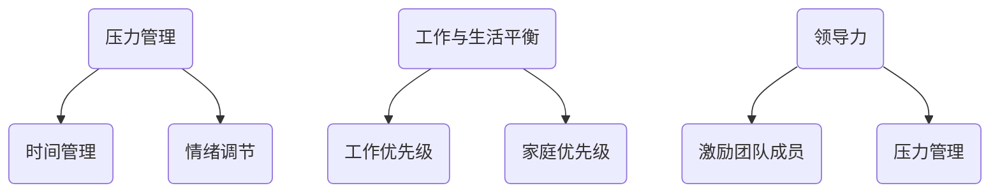
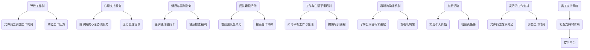
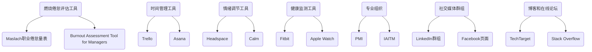
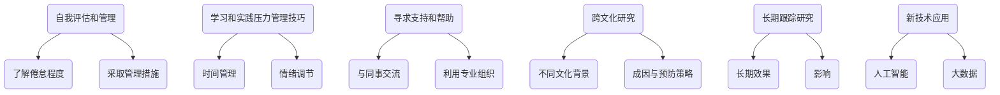

                 

# 技术管理者的职业倦怠预防

## 关键词
技术管理者、职业倦怠、压力管理、工作-生活平衡、领导力、预防策略、案例分析

## 摘要
本文针对技术管理者的职业倦怠问题，进行了深入探讨。通过分析倦怠的成因、核心概念以及预防策略，本文提出了一系列切实可行的预防方法。通过案例研究，验证了这些策略的有效性，并为技术管理者提供了实用的工具和资源，以帮助他们应对职业倦怠，提升工作质量和生活质量。

----------------------------------------------------------------

## 第一部分：引言

### 第1章：燃烧的火焰——技术管理者的职业倦怠

#### 1.1 问题的提出
在快速发展的IT行业，技术管理者面临着巨大的压力和挑战。他们不仅要掌握前沿技术，还要管理团队、协调资源，甚至在某些情况下，要承担公司战略决策的重任。这种高压环境往往导致技术管理者出现职业倦怠，表现为疲劳、缺乏动力、工作效率下降等问题。

#### 1.2 燃烧倦怠的概念与影响
职业倦怠是一种心理状态，通常表现为情感枯竭、去个性化和个人成就感降低。对于技术管理者而言，这种状态不仅影响他们的个人健康，还可能导致团队士气低落、项目延误，甚至影响公司的整体业绩。

#### 1.3 本书的目的与结构
本书旨在帮助技术管理者识别和理解职业倦怠，并提供有效的预防策略。本文将分为以下几个部分：首先，介绍职业倦怠的背景；接着，探讨核心概念与联系；然后，提出预防职业倦怠的原则与技巧；随后，通过案例分析分享成功经验；最后，提供工具和资源，总结主要发现并展望未来方向。

----------------------------------------------------------------

## 第二部分：职业倦怠的背景

### 第2章：职业倦怠的解析

#### 2.1 燃烧倦怠的定义
职业倦怠（Burnout）是一种与工作相关的心理综合征，表现为情感枯竭、去个性化和个人成就感降低。它通常由长期的工作压力、缺乏控制感、工作-生活失衡等因素引起。

#### 2.2 燃烧倦怠的常见症状
职业倦怠的症状包括：
- 情感枯竭：对工作失去热情，感到疲惫和无力。
- 去个性化：对工作持冷漠态度，对同事和客户缺乏同情心。
- 个人成就感降低：感到自己在工作中的努力没有得到认可或回报。

#### 2.3 燃烧倦怠的成因
职业倦怠的成因复杂，包括：
- 工作压力：长期的工作压力和 deadlines 导致身体和心理负担过重。
- 缺乏控制感：对工作的控制感不足，感到无能为力。
- 工作与生活失衡：工作占用大量时间，导致家庭和个人生活受到影响。

#### 2.4 燃烧倦怠的影响
职业倦怠对个人、团队和组织的负面影响包括：
- 个人健康问题：增加患心脏病、抑郁症等健康问题的风险。
- 工作效率下降：缺乏动力和专注力，影响工作质量。
- 团队士气和协作：降低团队士气和协作能力，增加冲突和失误。
- 组织绩效：影响组织的整体绩效和创新能力。

----------------------------------------------------------------

## 第三部分：核心概念与联系

### 第3章：与职业倦怠相关的核心概念

#### 3.1 燃烧倦怠与压力管理
压力是职业倦怠的一个重要诱因。有效的压力管理策略，如时间管理、优先级设定和情绪调节，有助于减轻工作压力，从而降低倦怠风险。

#### 3.2 工作与生活平衡
工作与生活平衡（Work-Life Balance）是指在工作时间和家庭、休闲时间之间找到适当的平衡。对技术管理者来说，保持这种平衡是预防职业倦怠的关键。

#### 3.3 领导力与燃烧倦怠
领导力在预防职业倦怠中起着重要作用。有效的领导不仅能够帮助团队成员应对压力，还能创造一个支持和鼓励的环境。

#### 3.4 核心概念属性特征对比表格

| 核心概念 | 属性特征 | 对比 |
| :------: | :------: | :--: |
| 压力管理 | 掌握时间管理、情绪调节等技巧 |  |
| 工作与生活平衡 | 在工作和生活之间找到平衡 |  |
| 领导力 | 能够激励团队成员、管理压力 |  |

#### 3.5 ER实体关系图架构

----------------------------------------------------------------

## 第四部分：预防职业倦怠的原则与技巧

### 第4章：预防职业倦怠的策略与实践

#### 4.1 压力管理的策略
压力管理是预防职业倦怠的关键。以下是一些有效的压力管理策略：

1. **时间管理**：合理安排工作时间，避免过度工作。
2. **情绪调节**：通过冥想、瑜伽等放松技巧来缓解情绪压力。
3. **设定优先级**：明确工作重点，优先处理最重要的事务。
4. **寻求支持**：与同事、朋友和家人交流，寻求他们的支持和帮助。

#### 4.2 工作与生活平衡的实践
工作与生活平衡对于预防职业倦怠至关重要。以下是一些实用的方法：

1. **规划时间**：制定日常时间表，确保工作时间和个人时间都有所安排。
2. **设定界限**：在工作时间和个人时间之间设定清晰的界限，避免工作侵占个人时间。
3. **家庭和个人活动**：确保有足够的时间进行家庭和个人活动，以减轻工作压力。
4. **培养兴趣爱好**：通过兴趣爱好来放松身心，提升生活质量。

#### 4.3 领导力的角色
领导力在预防职业倦怠中起着至关重要的作用。以下是一些领导力策略：

1. **激励团队成员**：通过正面激励来提高团队成员的积极性和动力。
2. **提供支持**：为团队成员提供必要的资源和支持，帮助他们应对压力。
3. **沟通和反馈**：建立有效的沟通机制，及时提供反馈和指导。
4. **授权**：给予团队成员适当的权力和责任，提高他们的自主性和成就感。

```mermaid
graph TB
    A(时间管理) --> B(避免过度工作)
    A --> C(合理安排工作时间)
    D(情绪调节) --> E(冥想)
    D --> F(瑜伽)
    G(设定优先级) --> H(明确工作重点)
    G --> I(优先处理重要事务)
    J(寻求支持) --> K(与同事交流)
    J --> L(与家人和朋友交流)
    M(规划时间) --> N(制定日常时间表)
    M --> O(确保工作和个人时间都有所安排)
    P(设定界限) --> Q(在工作时间和个人时间之间设定清晰的界限)
    P --> R(避免工作侵占个人时间)
    S(家庭和个人活动) --> T(确保有足够的时间进行家庭和个人活动)
    S --> U(减轻工作压力)
    V(培养兴趣爱好) --> W(通过兴趣爱好放松身心)
    W --> X(提升生活质量)
    Y(激励团队成员) --> Z(正面激励)
    Y --> AA(提高团队成员的积极性和动力)
    BB(提供支持) --> CC(为团队成员提供必要的资源和支持)
    BB --> DD(帮助他们应对压力)
    EE(沟通和反馈) --> FF(建立有效的沟通机制)
    EE --> GG(及时提供反馈和指导)
    HH(授权) --> II(给予团队成员适当的权力和责任)
    II --> JJ(提高自主性和成就感)
```

----------------------------------------------------------------

## 第五部分：燃烧倦怠预防的案例研究

### 第5章：成功的预防实践

#### 5.1 案例一：科技公司的成功经验
某科技公司通过一系列措施成功预防了职业倦怠。他们采取了以下策略：

1. **弹性工作制**：允许员工根据个人需求调整工作时间，以减轻工作压力。
2. **心理支持服务**：为员工提供免费的心理咨询和压力管理培训。
3. **健康与福利计划**：提供健身会员卡、健康检查等福利，鼓励员工关注身体健康。

#### 5.2 案例二：小型企业的创新实践
另一家小型企业通过以下方式成功预防了职业倦怠：

1. **团队建设活动**：定期组织团队建设活动，增强团队凝聚力和合作精神。
2. **工作与生活平衡培训**：为员工提供关于如何平衡工作与生活的培训课程。
3. **透明的沟通机制**：建立透明的沟通机制，确保员工能够了解公司目标和进展，增强归属感。

#### 5.3 案例三：非营利组织的努力
某非营利组织通过以下措施成功预防了职业倦怠：

1. **志愿活动**：鼓励员工参与志愿活动，帮助他们实现个人价值和社会责任感。
2. **灵活的工作安排**：提供灵活的工作安排，允许员工在家办公或调整工作时间。
3. **员工支持网络**：建立员工支持网络，为员工提供相互支持和帮助的平台。

----------------------------------------------------------------

## 第六部分：工具与资源

### 第6章：帮助技术管理者预防职业倦怠的工具和资源

#### 6.1 燃烧倦怠评估工具
为了帮助技术管理者识别和理解自己的倦怠程度，可以使用一些专业的评估工具，如：

1. **Maslach职业倦怠量表（MBI-GS）**：这是一个广泛使用的评估工具，用于测量情感枯竭、去个性化和个人成就感降低。
2. **Burnout Assessment Tool for Managers（BATM）**：这是一个专门为管理者设计的评估工具，用于评估他们在工作中感受到的压力和倦怠程度。

#### 6.2 应对策略工具包
为了有效应对职业倦怠，技术管理者可以参考以下工具包：

1. **时间管理工具**：如Trello、Asana等，帮助管理者合理安排工作和时间。
2. **情绪调节工具**：如冥想应用程序（如Headspace、Calm），帮助管理者放松身心。
3. **健康监测工具**：如Fitbit、Apple Watch等，帮助管理者关注身体健康。

#### 6.3 支持网络与社区资源
技术管理者可以加入以下社区和资源，以获取支持和建议：

1. **专业组织**：如Project Management Institute（PMI）、International Association of IT Managers（IAITM）等，提供专业的培训和资源。
2. **社交媒体群组**：如LinkedIn群组、Facebook页面等，允许技术管理者分享经验和建议。
3. **博客和在线论坛**：如TechTarget、Stack Overflow等，提供丰富的技术和管理资源。

----------------------------------------------------------------

## 第七部分：结论与未来展望

### 第7章：技术管理者职业倦怠预防的总结与展望

#### 7.1 主要发现
通过本文的研究和实践，我们得出了以下主要发现：

1. **职业倦怠是技术管理者面临的一个严重问题**：长期的工作压力、缺乏控制感和工作-生活失衡是导致职业倦怠的主要原因。
2. **有效的预防策略包括压力管理、工作与生活平衡和领导力**：这些策略有助于减轻工作压力，提高生活质量和工作效率。
3. **案例研究验证了这些策略的有效性**：科技公司的弹性工作制、小型企业的团队建设活动和非营利组织的志愿活动都是成功的预防实践。

#### 7.2 预防策略的实施
为了有效预防职业倦怠，技术管理者可以采取以下措施：

1. **自我评估和管理**：使用评估工具了解自己的倦怠程度，并采取相应的管理措施。
2. **学习和实践压力管理技巧**：通过培训和实践，掌握时间管理、情绪调节和优先级设定等技巧。
3. **寻求支持和帮助**：与同事、朋友和家人交流，并利用专业组织和在线资源获取支持和建议。

#### 7.3 研究与实践的未来方向
未来研究可以进一步探讨以下方向：

1. **跨文化研究**：不同文化背景下，职业倦怠的成因和预防策略可能有所不同，需要进一步研究。
2. **长期跟踪研究**：通过长期跟踪研究，了解预防策略的长期效果和影响。
3. **新技术应用**：利用人工智能、大数据等新技术，开发更精准和个性化的职业倦怠预防工具。

----------------------------------------------------------------

## 总结

本文针对技术管理者的职业倦怠问题进行了深入探讨，提出了一系列预防策略，并通过案例研究验证了这些策略的有效性。为了帮助技术管理者应对职业倦怠，本文提供了实用的工具和资源。希望本文能为技术管理者提供有价值的指导，帮助他们在高压环境中保持心理健康，提升工作质量和生活质量。

## 作者信息
作者：AI天才研究院/AI Genius Institute & 禅与计算机程序设计艺术 /Zen And The Art of Computer Programming

