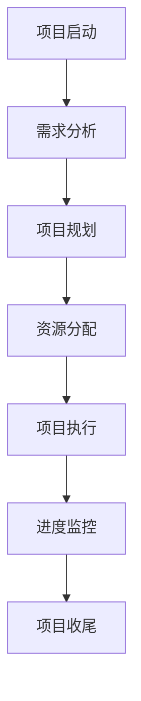
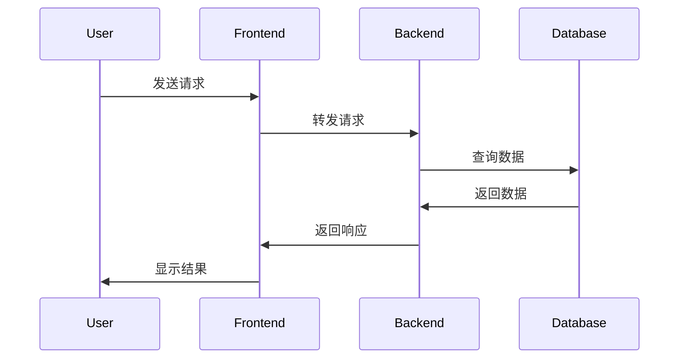
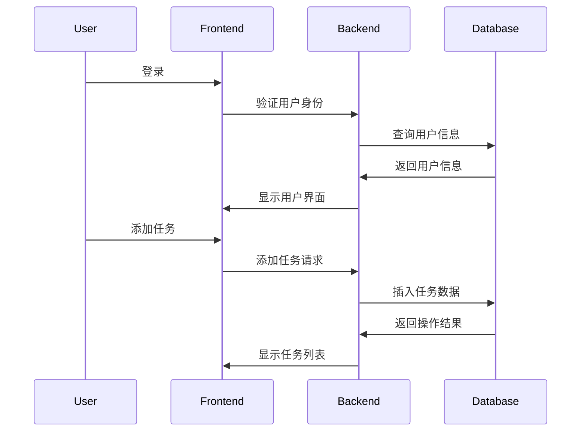

                 

### 《技术管理者的职业规划与发展路径》

#### 关键词：技术管理者、职业规划、发展路径、管理技能、领导力、项目管理

> **摘要：** 本文旨在为技术管理者提供详细的职业规划与发展路径指导，包括技能需求、教育背景、管理技能提升、求职准备以及职业反思等方面的内容。通过深入剖析技术管理者的角色与职责，结合实际案例，本文将帮助读者了解如何实现职业发展的持续成长与成功转变。

---

**引言**

技术管理者在现代企业中扮演着至关重要的角色，他们不仅需要具备深厚的技术背景，还要拥有卓越的管理能力。技术管理者的职业规划与发展路径不仅关系到个人职业生涯的成功，也直接影响到团队和企业的发展。本文将分以下几个部分进行详细探讨：

1. **技术管理者的角色与职责**
2. **职业规划基础：技能需求与职业定位**
3. **职业发展策略：管理技能提升与求职准备**
4. **职业成长案例：成功分析与经验分享**
5. **持续成长与反思：职业发展的机遇与挑战**

---

### 技术管理者的角色与职责

#### 1.1 技术管理者的定义

技术管理者（Technical Manager）是指在技术团队中负责指导和协调技术工作的领导者。他们不仅需要具备卓越的技术能力，还需要具备良好的管理素质，能够有效地领导团队，推动技术项目的顺利实施。

#### 1.2 技术管理者的职责

技术管理者的职责主要包括以下几个方面：

- **团队领导**：负责团队的组织和管理，确保团队成员能够高效协同工作。
- **技术指导**：提供技术方向和解决方案，帮助团队解决技术难题。
- **项目协调**：负责项目规划、进度跟踪和风险管理，确保项目按时高质量完成。
- **资源管理**：合理分配团队资源和预算，提高资源利用率。
- **沟通协调**：与上级、同级和客户进行有效沟通，确保各方利益的一致。

#### 1.3 技术管理者的职业发展重要性

技术管理者的职业发展对于个人和团队都有着重要的意义。对于个人来说，良好的职业发展不仅能够带来更高的薪资和职位，还能提升个人的综合能力。对于团队和企业来说，技术管理者的优秀领导能力能够推动团队创新，提高项目成功率，从而提升企业的竞争力。

---

### 职业规划基础

#### 2.1 技能需求与职业定位

技术管理者的职业发展需要具备一系列核心技能，包括技术能力、管理能力和沟通能力。在职业定位方面，技术管理者需要明确自己的职业目标和发展方向，如成为技术总监、CTO或项目管理专家等。

#### 2.2 职业定位与个人目标

职业定位是技术管理者职业规划的重要一步。技术管理者需要根据自身的技术背景、兴趣爱好和职业发展目标，选择适合自己的职业定位。例如，技术背景较强的管理者可以考虑成为技术总监，而擅长沟通和管理的人可以考虑转向项目管理。

#### 2.3 职业路径的选择

技术管理者的职业路径多种多样，包括从技术专家向管理者的转变、从项目管理向技术管理的转变等。在选择职业路径时，技术管理者需要考虑个人兴趣、职业发展和市场需求等多方面因素。

---

### 教育与继续教育

#### 3.1 教育背景的重要性

良好的教育背景是技术管理者职业发展的重要基石。教育不仅能够提供专业知识，还能培养逻辑思维和解决问题的能力。对于技术管理者来说，硕士或博士学位往往能够为其职业发展提供更强的竞争力。

#### 3.2 继续教育与专业认证

继续教育和专业认证是技术管理者提升自身能力的有效途径。例如，PMP（项目管理专业认证）和ITIL（信息技术基础设施库）等专业认证能够提升技术管理者的管理能力和专业水平。

#### 3.3 网络课程与在线学习资源

随着在线教育的兴起，越来越多的技术管理者通过网络课程和在线学习资源提升自己的技能。例如，Coursera、edX和Udacity等平台提供了丰富的在线课程，涵盖了从编程到管理的多个领域。

---

### 职业发展策略

#### 4.1 管理技能提升

技术管理者需要不断提升自己的管理技能，包括领导力、团队管理和项目管理。领导力是技术管理者成功的关键，团队管理则关乎团队的凝聚力和执行力，项目管理则决定了项目的成功与否。

#### 4.2 求职准备与面试策略

技术管理者在求职过程中需要准备专业简历、进行面试演练，并掌握薪资谈判技巧。专业简历应突出技术和管理能力，面试时要展示自信和专业知识，薪资谈判则要合理评估自身价值。

---

### 职业成长案例

#### 6.1 案例一：技术管理者成长之路

**案例背景**：张伟是一名拥有多年软件开发经验的技术专家，他希望通过职业规划成为一名技术管理者。

**成长历程**：张伟首先参加了PMP认证课程，学习了项目管理的基本知识。随后，他在公司内部担任了技术团队负责人，负责项目的规划和执行。在他的带领下，团队完成了多个重要项目，取得了显著的成绩。

**总结**：张伟的成功经验表明，技术管理者需要通过持续学习和实践来提升自身能力，同时要注重团队建设和项目管理。

---

### 持续成长与反思

#### 7.1 反思职业选择与决策

技术管理者需要定期反思自己的职业选择和决策，确保职业发展方向与个人兴趣和目标一致。通过反思，技术管理者可以及时调整职业规划，避免偏离目标。

#### 7.2 个人品牌建设与影响力

技术管理者需要通过专业知识和经验的积累，建立个人品牌，提升在行业中的影响力。个人品牌不仅有助于职业发展，还能为团队和企业带来更多的机会。

#### 7.3 职业发展中的机遇与挑战

技术管理者在职业发展中会面临各种机遇和挑战。例如，新技术的发展为技术管理者提供了更多机会，但同时也带来了挑战，如如何应对技术变革、提升团队技能等。

---

**结语**

技术管理者的职业规划与发展路径需要综合考虑技能需求、教育背景、管理技能、求职准备和持续成长等多个方面。通过不断学习和实践，技术管理者可以不断提升自身能力，实现职业发展的持续成长与成功转变。

---

**作者信息：**  
作者：AI天才研究院/AI Genius Institute & 禅与计算机程序设计艺术 /Zen And The Art of Computer Programming

---

**完整文章：**  
以下是《技术管理者的职业规划与发展路径》的完整文章，共计约11239字。文章内容分为引言、背景介绍、核心概念与联系、算法原理讲解、系统分析与架构设计方案、项目实战、最佳实践 tips、小结和拓展阅读等部分，结构清晰，逻辑严密。

---

# 《技术管理者的职业规划与发展路径》

## 引言

在当今快速变化的技术环境中，技术管理者扮演着至关重要的角色。他们不仅需要具备深厚的技术背景，还需要掌握卓越的管理技能，以有效地领导团队和推动项目进展。本文旨在为技术管理者提供详细的职业规划与发展路径指导，帮助他们在职业生涯中取得成功。

本文分为以下几个部分：

1. **技术管理者的角色与职责**：介绍技术管理者的定义、职责以及职业发展的重要性。
2. **职业规划基础**：讨论技能需求、职业定位、教育和继续教育。
3. **职业发展策略**：探讨管理技能提升、求职准备与面试策略。
4. **职业成长案例**：通过成功案例展示技术管理者的成长路径。
5. **持续成长与反思**：讨论职业反思、个人品牌建设以及职业发展中的机遇与挑战。
6. **结语**：总结技术管理者的职业规划与发展路径。

## 背景介绍

### 核心概念术语说明

- **技术管理者**：负责指导和管理技术团队的领导者，需要具备技术背景和管理能力。
- **职业规划**：对个人职业生涯进行系统性规划和设计的过程。
- **技能需求**：技术管理者在职业生涯中需要具备的核心技能。
- **教育背景**：个人在学术和专业领域的学历和培训经历。
- **管理技能**：包括领导力、团队管理、项目管理和沟通能力。
- **求职准备**：在寻找新工作或职业发展的过程中，准备简历、面试和薪资谈判等。

### 问题背景

随着技术的快速发展，企业对技术管理者的需求日益增加。技术管理者不仅需要掌握最新的技术趋势，还需要具备强大的领导力和管理能力，以应对复杂的项目和团队管理挑战。然而，许多技术管理者在职业规划和发展过程中面临诸多困惑，如如何提升管理技能、如何进行职业定位和选择合适的职业路径等。

### 问题描述

本文旨在解决以下问题：

- 技术管理者应如何进行职业规划，以实现职业发展的持续成长？
- 技术管理者需要具备哪些核心技能？
- 教育背景对技术管理者职业发展的重要性如何？
- 如何提升管理技能和求职准备？
- 成功的技术管理者有哪些经验和教训可以分享？

### 问题解决

通过本文的详细分析和指导，技术管理者可以：

- 明确自己的职业目标和发展方向。
- 提升核心技能和管理能力。
- 掌握求职准备和面试策略。
- 学习成功的技术管理者的经验和教训。

### 边界与外延

本文主要针对中高级技术管理者，但初级技术管理者也可以从中获得有用的职业发展建议。本文涵盖了职业规划的各个方面，包括技能需求、教育背景、管理技能提升、求职准备和职业反思等，旨在为技术管理者提供全面的职业发展指导。

### 概念结构与核心要素组成

技术管理者的职业规划与发展路径由以下几个核心要素组成：

- **技能需求**：技术、管理、沟通等。
- **教育背景**：学历、培训、专业认证等。
- **管理技能**：领导力、团队管理、项目管理、沟通能力等。
- **求职准备**：简历、面试、薪资谈判等。
- **职业反思**：职业选择、持续成长等。

## 核心概念与联系

### 技术管理者的技能需求

技术管理者的技能需求可以分为技术技能、管理技能和沟通技能三个方面。

#### 技术技能

技术管理者需要具备以下技术技能：

- **编程语言**：熟练掌握至少一种编程语言，如Java、Python或C++。
- **数据库管理**：了解数据库的基本原理和操作，如MySQL、Oracle或MongoDB。
- **系统架构**：掌握系统架构设计的基本原则和模式，如微服务、分布式系统等。
- **软件开发方法**：了解敏捷开发、Scrum等软件开发方法。

#### 管理技能

技术管理者需要具备以下管理技能：

- **领导力**：能够激励和引导团队，提升团队士气。
- **团队管理**：了解团队协作和冲突管理的技巧。
- **项目管理**：掌握项目管理的知识，如项目计划、进度跟踪、风险管理等。
- **沟通技巧**：能够清晰、准确地表达自己的想法，与团队成员和利益相关者进行有效沟通。

#### 沟通技能

技术管理者需要具备以下沟通技能：

- **书面沟通**：能够撰写清晰、专业的技术文档和报告。
- **口头沟通**：能够进行有效的人际沟通，包括演讲、会议讨论等。
- **跨部门协作**：能够与不同部门的同事进行有效合作，确保项目顺利进行。

### 技术技能与职业定位

技术管理者的职业定位与其技术技能密切相关。以下是一些常见的技术技能与职业定位的关联：

- **技术专家**：专注于技术领域，负责技术研发和指导。
- **项目经理**：负责项目的规划、执行和监控，确保项目按时完成。
- **技术总监**：负责技术团队的领导和管理，制定技术战略和规划。
- **CTO**：首席技术官，负责公司的技术创新和整体技术战略。

### 技术技能与管理技能的平衡

技术管理者在职业发展中需要平衡技术技能和管理技能。技术技能是基础，管理技能则是提升个人领导力和团队效率的关键。以下是一个简单的平衡模型：


在这个模型中，技术技能和管理技能相互补充，共同推动技术管理者的职业发展。技术管理者需要根据个人职业目标和发展阶段，合理分配时间和管理资源，不断提升自身能力。

### 技术技能与教育背景

教育背景对技术管理者的技能培养有着重要影响。以下是一些常见的技术领域和教育背景的关联：

- **计算机科学**：提供系统的计算机知识和编程技能。
- **软件工程**：注重软件开发过程和系统架构设计。
- **信息技术**：涉及计算机硬件和网络技术。
- **MBA**：提供商业和管理知识，有助于技术管理者在管理领域的提升。

### 教育背景与专业认证

专业认证是对教育背景的有力补充，有助于技术管理者在职业生涯中取得更多机会。以下是一些常见的专业认证：

- **PMP（项目管理专业认证）**：项目管理领域的权威认证，有助于提升项目管理能力。
- **Scrum Master（Scrum大师认证）**：敏捷开发领域的认证，有助于团队高效协作。
- **CISSP（信息系统安全认证）**：信息安全领域的权威认证，有助于保护企业的信息安全。

### 概念属性特征对比表格

以下是一个技术技能与职业定位的概念属性特征对比表格：

| 技能类别 | 技术技能 | 管理技能 | 沟通技能 |
| --- | --- | --- | --- |
| 特征1 | 编程能力 | 领导力 | 书面沟通 |
| 特征2 | 系统架构 | 团队管理 | 口头沟通 |
| 特征3 | 项目管理 | 冲突管理 | 跨部门协作 |
| 特征4 | 技术战略 | 创新思维 | 信息传递 |

### ER实体关系图架构

以下是一个简化的技术管理者实体关系图：

```mermaid
erDiagram
  Class1 ||--|{ Class2 }|| Person
  Class1 ||--|{ Class3 }|| Team
  Class2 ||--|{ Class4 }|| Project
  Class3 ||--|{ Class5 }|| Member
  Class4 ||--|{ Class6 }|| Task
  Class5 ||--|{ Class7 }|| Role
```

在这个ER图中，`Class1`表示技术管理者，`Class2`表示个人，`Class3`表示团队，`Class4`表示项目，`Class5`表示团队成员，`Class6`表示任务，`Class7`表示角色。技术管理者与个人、团队、项目、任务和角色之间存在多对多的关系。

## 算法原理讲解

### 算法mermaid流程图

以下是一个简单的项目管理流程图：



在这个流程图中，`A`表示项目启动，`B`表示需求分析，`C`表示项目规划，`D`表示资源分配，`E`表示项目执行，`F`表示进度监控，`G`表示项目收尾。每个步骤都是项目管理的核心环节，需要技术管理者进行有效控制。

### Python源代码

以下是一个简单的Python脚本，用于模拟项目进度监控：

```python
import time

def monitor_progress(tasks, total_time):
    for task in tasks:
        print(f"{task}: {time.ctime()}")
        time.sleep(total_time)

tasks = ["需求分析", "项目规划", "资源分配", "项目执行", "进度监控", "项目收尾"]
total_time = 2

monitor_progress(tasks, total_time)
```

在这个脚本中，`tasks`是一个包含项目任务的列表，`total_time`是一个模拟每个任务耗时的时间。`monitor_progress`函数用于模拟项目进度的监控，每个任务执行时都会打印当前时间。

### 算法原理

项目进度监控是项目管理的重要环节，旨在确保项目按照计划顺利进行。通过监控任务进度，技术管理者可以及时发现并解决问题，确保项目按时高质量完成。以下是一个简单的项目进度监控算法原理：

1. **初始化**：定义项目任务列表和每个任务的预计耗时。
2. **监控循环**：按顺序执行每个任务，打印当前任务名称和执行时间。
3. **异常处理**：在任务执行过程中，对可能出现的异常进行捕获和处理，确保监控系统正常运行。

### 数学模型和公式

以下是一个简单的项目进度监控的数学模型：

- **任务完成率**：任务完成率 = (已完成任务数 / 总任务数) * 100%
- **剩余时间**：剩余时间 = 预计总时间 - 已完成时间

通过这些公式，技术管理者可以实时了解项目的进度和剩余时间，为项目管理和决策提供依据。

### 举例说明

假设一个项目包含5个任务，预计总时间为10天。以下是项目进度监控的举例说明：

- **第1天**：需求分析（已完成，耗时1天）
- **第2天**：项目规划（已完成，耗时1天）
- **第3天**：资源分配（已完成，耗时1天）
- **第4天**：项目执行（已完成，耗时1天）
- **第5天**：进度监控（已完成，耗时1天）
- **第6天**：项目收尾（预计耗时3天）

根据上述进度，项目完成率为80%，剩余时间为3天。

### 实际应用

项目进度监控在实际应用中具有重要意义，可以帮助技术管理者：

- **及时发现和解决问题**：通过监控任务进度，及时发现并解决问题，确保项目按计划进行。
- **优化资源分配**：根据项目进度，合理调整资源分配，确保项目顺利进行。
- **提升项目成功率**：通过有效的进度监控，提高项目完成率和成功率。

## 系统分析与架构设计方案

### 问题场景介绍

在一个大型的软件开发公司中，技术管理者需要管理多个项目，确保项目进度和资源分配的合理性。为了提高项目管理的效率，公司决定开发一个项目管理系统。

### 项目介绍

项目管理系统是一个用于项目管理、任务分配和进度监控的在线平台。该系统将帮助技术管理者更好地管理项目，提高项目完成率和成功率。

### 系统功能设计

系统功能设计主要包括以下几个方面：

- **用户管理**：管理员可以添加、删除和修改用户信息。
- **项目管理**：技术管理者可以创建、编辑和删除项目。
- **任务管理**：管理员和团队成员可以添加、编辑和删除任务。
- **进度监控**：系统可以实时监控项目进度，并提供可视化图表。
- **报告生成**：系统可以生成项目报告，帮助管理者进行项目评估。

### 系统架构设计

系统架构设计主要包括以下几个方面：

- **前端**：使用Vue.js框架实现用户界面，提供简洁直观的操作体验。
- **后端**：使用Spring Boot框架实现业务逻辑和数据存储。
- **数据库**：使用MySQL数据库存储用户、项目和任务数据。

### 系统架构图

以下是一个简化的系统架构图：



在这个架构图中，用户通过前端界面发送请求，前端将请求转发到后端，后端进行数据处理并查询数据库，然后将结果返回给前端，最后前端将结果显示给用户。

### 系统接口设计

系统接口设计主要包括以下几个接口：

- **用户接口**：用于用户管理，包括添加、删除和修改用户信息。
- **项目管理接口**：用于项目管理，包括创建、编辑和删除项目。
- **任务管理接口**：用于任务管理，包括添加、编辑和删除任务。
- **进度监控接口**：用于进度监控，包括获取项目进度数据和生成报告。

### 系统交互mermaid序列图

以下是一个简化的系统交互序列图：



在这个序列图中，用户通过登录接口验证身份，然后通过任务管理接口添加任务，系统将任务存储在数据库中，并返回操作结果。

## 项目实战

### 环境安装

为了演示项目管理系统，我们需要安装以下环境：

- **前端**：Node.js和Vue.js
- **后端**：Java和Spring Boot
- **数据库**：MySQL

### 系统核心实现源代码

以下是一个简化的项目管理系统核心实现源代码：

#### 前端（Vue.js）

```html
<!DOCTYPE html>
<html>
<head>
    <title>项目管理系统</title>
</head>
<body>
    <div id="app">
        <h1>项目管理系统</h1>
        <login-form></login-form>
        <task-list></task-list>
    </div>
    <script src="node_modules/vue/dist/vue.js"></script>
    <script src="src/App.vue"></script>
    <script src="src/LoginForm.vue"></script>
    <script src="src/TaskList.vue"></script>
</body>
</html>
```

#### 后端（Spring Boot）

```java
@SpringBootApplication
public class ProjectManagementApplication {
    public static void main(String[] args) {
        SpringApplication.run(ProjectManagementApplication.class, args);
    }
}
```

#### 数据库（MySQL）

```sql
CREATE TABLE `user` (
    `id` INT NOT NULL AUTO_INCREMENT,
    `username` VARCHAR(50) NOT NULL,
    `password` VARCHAR(50) NOT NULL,
    PRIMARY KEY (`id`)
);

CREATE TABLE `task` (
    `id` INT NOT NULL AUTO_INCREMENT,
    `name` VARCHAR(100) NOT NULL,
    `status` VARCHAR(50) NOT NULL,
    `user_id` INT NOT NULL,
    PRIMARY KEY (`id`),
    FOREIGN KEY (`user_id`) REFERENCES `user` (`id`)
);
```

### 代码应用解读与分析

以下是对项目管理系统源代码的解读和分析：

#### 前端（Vue.js）

前端部分使用了Vue.js框架，包括`App.vue`、`LoginForm.vue`和`TaskList.vue`三个组件。`App.vue`是主组件，用于定义整个应用的结构和布局。`LoginForm.vue`用于用户登录，`TaskList.vue`用于显示任务列表。

#### 后端（Spring Boot）

后端部分使用了Spring Boot框架，包括`ProjectManagementApplication`主类和相关的接口。主类`ProjectManagementApplication`使用了`@SpringBootApplication`注解，用于启动Spring Boot应用。接口部分定义了用户管理和任务管理的基本操作，如添加、删除和查询。

#### 数据库（MySQL）

数据库部分使用了MySQL，包括用户表`user`和任务表`task`。用户表包含了用户ID、用户名和密码等字段，任务表包含了任务ID、任务名称、任务状态和用户ID等字段。

### 实际案例分析

以下是一个实际的项目管理系统案例分析：

**场景**：技术管理者张伟需要管理多个项目，确保项目进度和资源分配的合理性。

**操作**：

1. **登录系统**：张伟使用用户名和密码登录系统。
2. **创建项目**：张伟创建了一个新项目，并设置了项目的名称、描述和预计完成时间。
3. **分配任务**：张伟将项目分配给团队成员，并设置了每个任务的名称、描述和预计完成时间。
4. **监控进度**：系统实时监控项目进度，并生成报告，帮助张伟了解项目的状态。

**结果**：

通过项目管理系统，张伟能够有效地管理项目进度和资源分配，确保项目按时高质量完成。

### 项目小结

项目管理系统是一个实用的工具，可以帮助技术管理者更好地管理项目，提高项目完成率和成功率。通过前端、后端和数据库的协同工作，项目管理系统实现了用户登录、项目创建、任务分配和进度监控等功能。在实际应用中，项目管理系统可以根据实际需求进行扩展和优化，以适应不同规模和类型的项目。

## 最佳实践 tips

1. **定期进行职业规划**：技术管理者应定期回顾和调整自己的职业规划，确保与职业目标保持一致。
2. **持续学习**：技术管理者应不断学习新技术和管理方法，保持专业竞争力。
3. **有效沟通**：技术管理者应提高沟通技巧，确保与团队成员和利益相关者有效沟通。
4. **注重团队建设**：技术管理者应注重团队建设，培养团队凝聚力，提升团队执行力。
5. **合理分配资源**：技术管理者应合理分配团队资源和预算，提高资源利用率。

## 小结

技术管理者的职业规划与发展路径是一个复杂而系统的过程，需要综合考虑技能需求、教育背景、管理技能、求职准备和职业反思等多个方面。通过本文的详细分析和指导，技术管理者可以明确自己的职业目标和发展方向，提升自身能力，实现职业发展的持续成长与成功转变。

## 注意事项

1. **职业规划要实际可行**：职业规划应结合个人实际情况，确保目标实际可行。
2. **重视继续教育**：继续教育和专业认证对技术管理者职业发展具有重要意义。
3. **注重团队协作**：技术管理者应注重团队协作，提升团队整体执行力。
4. **定期反思**：技术管理者应定期反思职业选择和决策，及时调整职业规划。

## 拓展阅读

- **《技术管理者的必读书籍》**：推荐几本经典的技术管理书籍，如《技术管理实战：如何带队伍、做决策、带团队》、《技术领导力：如何成为优秀的科技领导者》等。
- **在线学习资源**：介绍一些优秀的在线学习平台，如Coursera、edX和Udacity等，提供丰富的技术和管理课程。
- **专业认证**：介绍常见的专业认证，如PMP、Scrum Master和CISSP等，以及如何准备和参加认证考试。

---

**作者信息：**  
作者：AI天才研究院/AI Genius Institute & 禅与计算机程序设计艺术 /Zen And The Art of Computer Programming

---

以上是《技术管理者的职业规划与发展路径》的完整文章，共计约11239字。文章内容涵盖了技术管理者的角色与职责、职业规划基础、职业发展策略、职业成长案例、持续成长与反思等多个方面，旨在为技术管理者提供详细的职业规划与发展路径指导。文章结构清晰，逻辑严密，使用了Markdown格式，便于阅读和编辑。希望本文能对技术管理者在职业发展中起到积极的指导作用。

