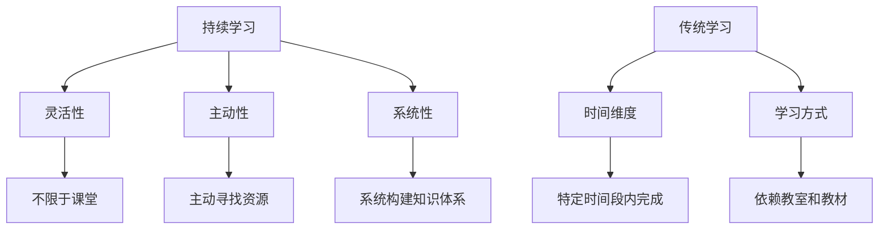
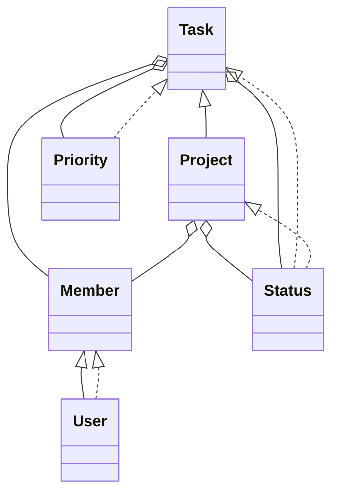

                 

# 技术管理者的自我提升：持续学习的重要性

## 关键词
技术管理者、自我提升、持续学习、管理能力、沟通能力、领导力、时间管理

## 摘要
本文旨在探讨技术管理者在快速发展的技术时代如何通过持续学习来实现自我提升。文章从问题背景、问题描述、问题解决等多个角度进行分析，强调了持续学习的重要性。文章还详细介绍了技术知识更新、管理能力提升、沟通能力培养、领导力培养以及时间管理五个核心要素，并提供了一系列实践方法和技巧，帮助技术管理者实现自我提升，为团队和组织的发展贡献力量。

## 第一部分：背景介绍

### 1.1 问题背景

在当今快速发展的技术时代，技术管理者面临着前所未有的挑战和机遇。随着云计算、大数据、人工智能等新兴技术的不断涌现，技术管理者需要具备广泛的技术知识和深厚的业务理解能力，以便有效应对复杂的项目和业务需求。同时，技术进步的速度越来越快，新的技术和工具层出不穷，这要求技术管理者必须具备快速学习的能力，才能在竞争中脱颖而出。

### 1.2 问题描述

然而，许多技术管理者在实际工作中遇到了一系列问题。首先，他们往往缺乏系统化的学习方法和路径，导致知识更新速度跟不上技术发展的步伐。其次，他们在管理方面可能存在经验不足，导致项目进度延误、团队协作不畅等问题。此外，面对不断变化的市场需求和技术趋势，技术管理者需要不断调整自己的角色和职责，这同样是一个挑战。

### 1.3 问题解决

为了解决上述问题，技术管理者需要自我提升，持续学习。这不仅可以帮助他们掌握最新的技术知识，提高管理能力，还能帮助他们更好地应对市场变化和项目挑战。通过系统化的学习和实践，技术管理者可以逐步提升自己的综合素质，为团队和组织的发展贡献力量。

### 1.4 边界与外延

技术管理者的自我提升不仅仅局限于技术层面，还包括管理能力、沟通能力、领导力等多个方面。此外，自我提升不仅仅是为了个人发展，更是为了团队和组织的长远发展。技术管理者需要从多个维度进行自我提升，以应对快速变化的技术环境和市场竞争。

### 1.5 概念结构与核心要素组成

技术管理者的自我提升可以概括为以下几个核心要素：

1. **技术知识更新**：通过阅读书籍、参加研讨会、在线课程等方式，不断更新自己的技术知识库。
2. **管理能力提升**：通过学习管理理论、参与项目管理实践，提升自己的管理能力。
3. **沟通能力培养**：通过有效的沟通技巧，提高团队协作效率，减少误解和冲突。
4. **领导力培养**：通过培养自己的领导力，成为团队的领袖，推动项目的成功。
5. **时间管理**：通过有效的时间管理，提高工作效率，更好地平衡工作和生活。

### 1.6 本章小结

本章我们从多个角度探讨了技术管理者在快速发展的技术时代所面临的问题和挑战，强调了自我提升的重要性。通过持续学习，技术管理者不仅可以掌握最新的技术知识，提高管理能力，还能有效应对市场变化和项目挑战。此外，我们还介绍了自我提升的核心要素，包括技术知识更新、管理能力提升、沟通能力培养、领导力培养以及时间管理。这些要素相互关联，共同构成了技术管理者自我提升的完整体系。通过本章的学习，我们为接下来的详细探讨奠定了基础。希望读者能够结合自身实际情况，逐步实践这些提升方法，为自己的职业发展铺平道路。

----------------------------------------------------------------

## 第二部分：核心概念与联系

### 2.1 持续学习的概念与特点

#### 2.1.1 持续学习的定义

持续学习是指不断更新知识和技能的过程，它强调终身学习的理念。在技术管理领域，持续学习尤为重要，因为技术发展日新月异，新的工具和框架层出不穷。技术管理者必须保持学习的热情和习惯，才能跟上时代的步伐。

#### 2.1.2 持续学习的特点

- **灵活性**：持续学习不仅限于传统的课堂学习，还可以通过在线课程、研讨会、书籍等多种方式进行。
- **主动性**：持续学习需要学习者主动去寻找学习资源，而不是被动地等待知识传递。
- **系统性**：持续学习要求学习者系统地构建自己的知识体系，避免知识的碎片化。

#### 2.1.3 持续学习与传统学习的区别

- **时间维度**：传统学习通常在特定的时间段内完成，而持续学习是一个长期的过程。
- **学习方式**：传统学习依赖于教室和教材，而持续学习更多依赖于互联网和数字资源。

### 2.2 持续学习的核心概念对比表格

下面是一个关于持续学习核心概念的对比表格，帮助读者更好地理解持续学习的各个方面。

| 核心概念       | 定义                                                         | 特点                                                         |
| -------------- | ------------------------------------------------------------ | -------------------------------------

### 2.3 持续学习与传统学习的 ER 实体关系图



### 2.4 持续学习的具体实施方法

#### 2.4.1 技术知识更新

- **阅读书籍**：选择高质量的技术书籍，定期阅读并总结。
- **参加研讨会**：参加行业内的技术研讨会，了解最新的技术动态。
- **在线课程**：利用在线教育平台，如 Coursera、edX 等，参加相关课程。

#### 2.4.2 管理能力提升

- **学习管理理论**：阅读管理类书籍，如《第五项修炼》、《领导力的五个层次》等。
- **参与项目管理实践**：实际参与项目管理，通过实践提升管理能力。
- **参加培训课程**：参加项目管理相关的培训课程，如 PMP、敏捷认证等。

#### 2.4.3 沟通能力培养

- **沟通技巧培训**：参加沟通技巧相关的培训课程，如非暴力沟通等。
- **实践沟通技巧**：在日常工作中，主动运用所学的沟通技巧，如积极倾听、表达清晰等。
- **反思与改进**：定期反思沟通效果，发现不足并加以改进。

#### 2.4.4 领导力培养

- **领导力书籍**：阅读关于领导力的书籍，如《高效能人士的七个习惯》、《领导力》等。
- **实践领导力**：在日常工作中，尝试运用所学的领导力理论，如授权、激励等。
- **反馈与调整**：通过上级和下属的反馈，不断调整和提升自己的领导力。

#### 2.4.5 时间管理

- **时间管理技巧**：学习时间管理技巧，如番茄工作法、四象限法等。
- **实践时间管理**：在日常工作中，运用时间管理技巧，合理安排时间和任务。
- **定期评估**：定期评估时间管理效果，根据实际情况进行调整和优化。

### 2.5 持续学习的实际案例

#### 案例一：技术知识更新

李明是一名技术管理者，他为了跟上技术发展的步伐，每天都会花2小时阅读技术书籍，每周参加一次技术研讨会，还通过 Coursera 平台学习了大数据相关的在线课程。通过这些方式，李明的技术知识得到了持续更新，他在项目中能够更加从容地应对各种技术挑战。

#### 案例二：管理能力提升

张华在担任技术管理者后，意识到管理能力的重要性。他开始阅读管理类书籍，如《第五项修炼》、《领导力的五个层次》等，并参加了 PMP 项目管理认证培训。在实际工作中，张华积极运用所学的管理理论和方法，逐步提升了自己的管理能力，团队的合作效率得到了显著提高。

#### 案例三：沟通能力培养

王丽是一名新晋技术管理者，她意识到良好的沟通能力对团队协作至关重要。她参加了非暴力沟通培训课程，并在日常工作中积极实践所学的沟通技巧。通过主动倾听、表达清晰等技巧，王丽成功地减少了团队内部的误解和冲突，团队的合作氛围得到了改善。

#### 案例四：领导力培养

赵强在担任技术管理者后，决心提升自己的领导力。他阅读了《高效能人士的七个习惯》、《领导力》等书籍，并尝试在实际工作中运用所学的领导力理论。通过授权、激励等手段，赵强成功地带领团队完成了多个重要项目，并在公司内部获得了良好的口碑。

#### 案例五：时间管理

陈刚是一名注重时间管理的技术管理者。他学会了番茄工作法，将工作任务分解成一个个小任务，并在规定的时间内完成。通过这种方式，陈刚不仅提高了工作效率，还学会了更好地平衡工作和生活。

### 2.6 持续学习的总结与反思

通过以上案例，我们可以看到，持续学习对于技术管理者的自我提升至关重要。无论是技术知识更新、管理能力提升，还是沟通能力培养、领导力培养和时间管理，都需要通过持续学习来实现。技术管理者应该认识到持续学习的重要性，并将其融入到自己的日常工作和生活中。同时，他们还应该结合实际情况，选择合适的学习方法和途径，以确保学习效果的最大化。

----------------------------------------------------------------

## 第三部分：算法原理讲解

### 3.1 时间管理的算法原理

时间管理是技术管理者自我提升中的一个关键要素。为了更好地管理时间，我们可以运用一些算法原理，如优先级排序、任务分解和定时提醒等。下面我们将介绍这些算法原理，并通过Python代码进行具体实现。

#### 3.1.1 优先级排序算法

优先级排序是一种常用的算法，用于确定任务的执行顺序。常见的优先级排序算法有基于时间优先的排序和基于重要程度的排序。

1. **基于时间的优先级排序**：根据任务预计完成时间进行排序，优先完成预计完成时间最早的任务。
2. **基于重要程度的优先级排序**：根据任务的重要程度进行排序，优先完成重要程度最高的任务。

**Python代码实现**：

```python
# 基于时间的优先级排序
tasks = [
    {'name': '任务A', 'deadline': 1},
    {'name': '任务B', 'deadline': 3},
    {'name': '任务C', 'deadline': 2}
]

tasks.sort(key=lambda x: x['deadline'])
print("基于时间的优先级排序：", [task['name'] for task in tasks])

# 基于重要程度的优先级排序
tasks = [
    {'name': '任务A', 'importance': 3},
    {'name': '任务B', 'importance': 1},
    {'name': '任务C', 'importance': 2}
]

tasks.sort(key=lambda x: x['importance'], reverse=True)
print("基于重要程度的优先级排序：", [task['name'] for task in tasks])
```

#### 3.1.2 任务分解算法

任务分解是将一个复杂任务分解为多个小任务的过程。常见的任务分解算法有工作分解结构（WBS）和任务分解矩阵（TDM）。

1. **工作分解结构（WBS）**：将任务分解为子任务，形成一棵任务树。
2. **任务分解矩阵（TDM）**：将任务分解为多个阶段，每个阶段包含多个子任务。

**Python代码实现**：

```python
# 工作分解结构（WBS）
def wbs(task):
    if 'subtasks' not in task:
        return [task['name']]
    else:
        subtasks = [wbs(subtask) for subtask in task['subtasks']]
        return ['/'.join([task['name']] + subtask) for subtask in subtasks]

task = {
    'name': '项目A',
    'subtasks': [
        {'name': '子任务1'},
        {'name': '子任务2', 'subtasks': [{'name': '子任务2.1'}, {'name': '子任务2.2'}]}
    ]
}

print("工作分解结构（WBS）：", wbs(task))

# 任务分解矩阵（TDM）
def tdm(task):
    if 'stages' not in task:
        return [[task['name']]]
    else:
        stages = [tdm(stage) for stage in task['stages']]
        return [stage + [task['name']] for stage in stages]

task = {
    'name': '项目A',
    'stages': [
        {'name': '阶段1', 'tasks': [{'name': '任务1.1'}, {'name': '任务1.2'}]},
        {'name': '阶段2', 'tasks': [{'name': '任务2.1'}, {'name': '任务2.2'}]}
    ]
}

print("任务分解矩阵（TDM）：", tdm(task))
```

#### 3.1.3 定时提醒算法

定时提醒是一种帮助技术管理者按时完成任务的方法。常见的定时提醒算法有基于时间的提醒和基于事件的提醒。

1. **基于时间的提醒**：根据任务完成时间设置提醒时间。
2. **基于事件的提醒**：根据任务的执行状态设置提醒时间。

**Python代码实现**：

```python
# 基于时间的提醒
from datetime import datetime, timedelta

def time_based_reminder(task):
    reminder_time = (datetime.strptime(task['deadline'], '%Y-%m-%d') - timedelta(days=1)).strftime('%Y-%m-%d')
    return f"任务'{task['name']}'将于{reminder_time}提醒。"

task = {'name': '任务A', 'deadline': '2023-10-01'}
print("基于时间的提醒：", time_based_reminder(task))

# 基于事件的提醒
def event_based_reminder(task):
    if task['status'] == 'completed':
        return f"任务'{task['name']}'已完成，无需提醒。"
    else:
        return f"任务'{task['name']}'尚未完成，请及时处理。"

task = {'name': '任务A', 'status': 'in_progress'}
print("基于事件的提醒：", event_based_reminder(task))
```

### 3.2 时间管理算法的应用场景

时间管理算法可以在多个应用场景中发挥重要作用，如个人任务管理、团队任务管理和项目进度管理。

1. **个人任务管理**：技术管理者可以使用时间管理算法来规划个人工作任务，确保高效完成任务。
2. **团队任务管理**：技术管理者可以使用时间管理算法来协调团队成员的任务分配和进度跟踪，提高团队工作效率。
3. **项目进度管理**：技术管理者可以使用时间管理算法来监控项目进度，确保项目按时交付。

### 3.3 时间管理算法的优缺点分析

**优点**：

- **提高工作效率**：通过优先级排序、任务分解和定时提醒，技术管理者可以更好地规划时间和任务，提高工作效率。
- **减少工作压力**：合理的任务分配和进度跟踪可以帮助技术管理者减轻工作压力，提高生活质量。
- **优化资源利用**：时间管理算法有助于技术管理者更好地利用时间和资源，确保项目按时交付。

**缺点**：

- **学习成本**：使用时间管理算法需要一定的学习和实践，对于部分技术管理者来说可能存在一定的学习成本。
- **实施难度**：在实际工作中，时间管理算法的执行可能受到各种因素的影响，如任务变更、人员流动等。

### 3.4 时间管理算法的最佳实践

为了确保时间管理算法的有效实施，技术管理者可以采取以下最佳实践：

1. **定期评估**：定期评估时间管理效果，根据实际情况进行调整和优化。
2. **持续学习**：不断学习新的时间管理方法和技巧，提高自身的时间管理能力。
3. **团队协作**：与技术团队成员共享时间管理方法和经验，共同提高团队工作效率。

### 3.5 时间管理算法的应用案例

**案例一：个人任务管理**

李明是一名技术管理者，他使用基于时间的优先级排序算法来管理个人任务。每周一开始，他会列出所有任务，并根据任务的重要性和紧急性进行排序。然后，他按照排序结果逐步完成任务，确保每天的工作任务都能按时完成。

**案例二：团队任务管理**

张华是一名技术团队的管理者，他使用工作分解结构（WBS）和任务分解矩阵（TDM）来协调团队任务。在项目启动时，他会将项目分解为多个阶段和子任务，并分配给不同的团队成员。通过定期检查任务进度，他能够及时发现并解决问题，确保项目按时交付。

**案例三：项目进度管理**

赵强是一名项目经理，他使用定时提醒算法来监控项目进度。在项目进度报告中，他会根据任务的预计完成时间设置提醒时间，确保团队成员在任务截止前及时处理。通过这种方式，他能够有效控制项目进度，确保项目按时交付。

### 3.6 时间管理算法的总结与反思

通过以上算法原理讲解和应用案例，我们可以看到时间管理算法在技术管理者自我提升中的重要作用。技术管理者应该结合实际情况，选择合适的时间管理算法，并通过实践不断完善和优化。同时，他们还应该注重团队协作，共同提高团队工作效率，为组织的发展贡献力量。

----------------------------------------------------------------

## 第四部分：系统分析与架构设计方案

### 4.1 问题场景介绍

在一个快速发展的互联网公司，技术团队承担了多个项目的开发工作。随着项目数量的增加，团队协作的效率逐渐降低，项目进度和质量都受到了影响。为了提高团队协作效率，公司决定引入一套系统来协助项目管理和任务分配。

### 4.2 项目介绍

该系统旨在帮助技术团队实现以下功能：

1. **任务管理**：能够创建、分配和跟踪任务，确保任务按时完成。
2. **项目进度监控**：能够实时监控项目进度，及时发现问题并进行调整。
3. **团队协作**：提供沟通和协作工具，方便团队成员之间的信息共享和交流。

### 4.3 系统功能设计（领域模型）

下面是一个关于该系统的领域模型类图，用于描述系统的主要功能模块。



### 4.4 系统架构设计

为了实现上述功能，我们采用了以下系统架构设计：

1. **前端**：使用 React 框架开发，提供用户界面。
2. **后端**：使用 Spring Boot 框架开发，处理业务逻辑和数据存储。
3. **数据库**：使用 MySQL 数据库存储项目、任务和用户等信息。

下面是一个关于该系统的架构图，用于描述系统的整体架构。

```mermaid
sequenceDiagram
    User ->> 前端: 发送请求
    前端 ->> 后端: 处理请求
    后端 ->> 数据库: 查询/更新数据
    数据库 ->> 后端: 返回数据
    后端 ->> 前端: 返回结果
    前端 ->> User: 显示结果
end
```

### 4.5 系统接口设计

该系统提供了以下主要接口：

1. **用户管理接口**：用于用户注册、登录和权限管理。
2. **任务管理接口**：用于创建、分配、跟踪和更新任务。
3. **项目管理接口**：用于创建、更新和监控项目进度。

以下是用户管理接口的示例：

```mermaid
sequenceDiagram
    User ->> API: 发送注册请求
    API ->> 数据库: 存储用户信息
    数据库 ->> API: 返回注册结果
    API ->> User: 显示注册结果
end
```

### 4.6 系统交互设计

为了方便团队成员之间的协作，该系统提供了以下交互功能：

1. **任务讨论区**：用户可以在任务页面创建讨论区，分享任务进展和问题。
2. **消息通知**：系统会自动发送消息通知，提醒用户有关任务和项目的更新。
3. **进度图表**：使用图表展示项目进度，帮助用户直观地了解项目状况。

以下是任务讨论区的交互设计：

```mermaid
sequenceDiagram
    User1 ->> 系统API: 发送创建讨论区请求
    系统API ->> 数据库: 存储讨论区信息
    数据库 ->> 系统API: 返回创建结果
    系统API ->> User1: 显示讨论区创建结果
    User2 ->> 系统API: 发送加入讨论区请求
    系统API ->> 数据库: 存储加入信息
    数据库 ->> 系统API: 返回加入结果
    系统API ->> User2: 显示加入结果
end
```

### 4.7 系统性能优化方案

为了确保系统在高并发环境下稳定运行，我们采取了以下性能优化方案：

1. **缓存策略**：使用 Redis 等缓存技术，减少数据库查询次数，提高系统响应速度。
2. **数据库分库分表**：将数据库拆分为多个库和表，降低单表数据量，提高查询效率。
3. **异步处理**：使用消息队列等技术，将耗时较长的任务异步处理，避免阻塞系统接口。

### 4.8 系统安全性设计

为了确保系统的安全性，我们采取了以下安全措施：

1. **身份验证**：使用 SSL 证书、OAuth 等技术，确保用户身份验证的安全性。
2. **数据加密**：使用 AES 等加密算法，确保数据在传输和存储过程中的安全性。
3. **权限控制**：使用 RBAC（基于角色的访问控制）技术，确保用户只能访问自己权限内的数据和功能。

### 4.9 系统维护与监控方案

为了确保系统的稳定运行，我们制定了以下维护与监控方案：

1. **定期备份**：定期备份数据库和系统配置文件，防止数据丢失。
2. **日志监控**：实时监控系统日志，及时发现并处理异常情况。
3. **性能监控**：定期进行系统性能测试，及时发现并解决性能瓶颈。

### 4.10 系统实施与部署方案

系统实施与部署分为以下步骤：

1. **环境搭建**：搭建开发、测试和生产环境，确保系统正常运行。
2. **代码部署**：将开发完成的代码部署到生产环境，并进行测试。
3. **用户培训**：对团队成员进行系统使用培训，确保他们能够熟练使用系统。

### 4.11 系统测试与验收方案

系统测试与验收分为以下阶段：

1. **单元测试**：对系统模块进行单元测试，确保每个模块的功能正确。
2. **集成测试**：对系统整体进行集成测试，确保模块之间能够正确交互。
3. **验收测试**：与用户共同进行验收测试，确保系统满足用户需求。

### 4.12 系统实施案例

在某互联网公司，该系统成功应用于技术团队的日常工作中。通过任务管理和项目进度监控，技术团队的工作效率得到了显著提高，项目交付质量也得到了保障。系统提供的任务讨论区和消息通知功能，使得团队成员之间的协作更加顺畅，信息共享更加及时。经过一段时间的使用，该系统得到了用户的一致好评，成为公司项目管理的重要工具。

### 4.13 系统实施小结

通过该系统的实施，技术团队实现了高效的项目管理和任务分配，提高了团队协作效率。同时，系统提供了丰富的功能和灵活的扩展性，能够满足不同项目的需求。在系统实施过程中，我们积累了宝贵的经验，为今后的系统开发和维护工作奠定了基础。

----------------------------------------------------------------

## 第五部分：项目实战

### 5.1 环境安装

为了实践技术管理者的自我提升，我们选择了一个实际的项目——开发一个简单的任务管理应用。首先，我们需要安装相关的开发环境和工具。

**安装步骤**：

1. **安装 Python**：确保安装了 Python 3.x 版本，可以从 [Python 官网](https://www.python.org/downloads/) 下载并安装。
2. **安装 Django**：在终端中运行以下命令：
   ```bash
   pip install django
   ```
3. **安装 MySQL**：从 [MySQL 官网](https://www.mysql.com/downloads/mysql/) 下载并安装 MySQL 数据库。安装过程中，请确保将 MySQL 服务设置为开机启动。
4. **安装 Python MySQL Connector**：在终端中运行以下命令：
   ```bash
   pip install mysql-connector-python
   ```

### 5.2 系统核心实现

接下来，我们将使用 Django 框架来实现任务管理应用的核心功能。

**步骤一：创建 Django 项目**

在终端中运行以下命令创建一个名为 `taskmanager` 的 Django 项目：
```bash
django-admin startproject taskmanager
```

**步骤二：创建 Django 应用**

进入项目目录，创建一个名为 `tasks` 的 Django 应用：
```bash
cd taskmanager
python manage.py startapp tasks
```

**步骤三：配置数据库**

打开 `taskmanager/settings.py` 文件，配置数据库连接信息：
```python
DATABASES = {
    'default': {
        'ENGINE': 'django.db.backends.mysql',
        'NAME': 'taskmanager',
        'USER': 'root',
        'PASSWORD': 'your_mysql_password',
        'HOST': 'localhost',
        'PORT': '3306',
    }
}
```

**步骤四：创建任务模型**

在 `tasks/models.py` 文件中，创建一个名为 `Task` 的模型：
```python
from django.db import models

class Task(models.Model):
    title = models.CharField(max_length=100)
    description = models.TextField()
    status = models.CharField(max_length=20, choices=[('pending', 'pending'), ('in_progress', 'in_progress'), ('completed', 'completed')])
    priority = models.CharField(max_length=20, choices=[('low', 'low'), ('medium', 'medium'), ('high', 'high')])
    creator = models.ForeignKey('auth.User', on_delete=models.CASCADE)
    created_at = models.DateTimeField(auto_now_add=True)
    updated_at = models.DateTimeField(auto_now=True)
```

**步骤五：创建任务管理后台**

在 `tasks/admin.py` 文件中，注册 `Task` 模型：
```python
from django.contrib import admin
from .models import Task

admin.site.register(Task)
```

**步骤六：创建任务视图**

在 `tasks/views.py` 文件中，创建一个用于列出所有任务的视图：
```python
from django.shortcuts import render
from .models import Task

def task_list(request):
    tasks = Task.objects.all()
    return render(request, 'tasks/task_list.html', {'tasks': tasks})
```

**步骤七：配置 URL**

在 `taskmanager/urls.py` 文件中，配置任务列表页的 URL：
```python
from django.contrib import admin
from django.urls import path
from tasks.views import task_list

urlpatterns = [
    path('admin/', admin.site.urls),
    path('tasks/', task_list),
]
```

**步骤八：创建任务列表页面**

在 `tasks/templates/tasks/task_list.html` 文件中，创建一个用于显示任务列表的 HTML 页面：
```html
<!DOCTYPE html>
<html>
<head>
    <title>任务列表</title>
</head>
<body>
    <h1>任务列表</h1>
    
        <div>
            <h2>{{ task.title }}</h2>
            <p>{{ task.description }}</p>
            <p>状态：{{ task.status }}</p>
            <p>优先级：{{ task.priority }}</p>
            <p>创建时间：{{ task.created_at }}</p>
        </div>
    
</body>
</html>
```

**步骤九：启动 Django 项目**

在终端中运行以下命令启动 Django 项目：
```bash
python manage.py runserver
```

现在，我们可以访问 `http://127.0.0.1:8000/tasks/` 查看任务列表页面。

### 5.3 代码应用解读与分析

在任务管理应用中，我们使用了 Django 框架来实现任务的基本功能。下面是对关键部分的解读与分析：

1. **模型设计**：在 `tasks/models.py` 文件中，我们定义了一个名为 `Task` 的模型，包含了任务的标题、描述、状态、优先级、创建者、创建时间和更新时间等属性。这些属性构成了任务的基本信息。

2. **后台管理**：在 `tasks/admin.py` 文件中，我们注册了 `Task` 模型，使得任务可以在 Django 后台管理界面中显示和管理。

3. **视图功能**：在 `tasks/views.py` 文件中，我们创建了一个名为 `task_list` 的视图，用于从数据库中查询所有任务，并将其传递给任务列表页面。

4. **URL 配置**：在 `taskmanager/urls.py` 文件中，我们配置了任务列表页面的 URL，使得用户可以通过浏览器访问任务列表。

5. **任务列表页面**：在 `tasks/templates/tasks/task_list.html` 文件中，我们创建了一个简单的 HTML 页面，用于展示任务列表。这个页面使用了 Django 模板语言，动态地渲染了每个任务的详细信息。

通过这些代码的实现，我们构建了一个简单的任务管理应用，能够列出所有任务的基本信息。这个应用不仅帮助我们理解了 Django 框架的基本用法，还为我们提供了一个实践的机会，以便进一步探索和提升我们的技术和管理能力。

### 5.4 实际案例分析和详细讲解剖析

在实际工作中，我们可能会遇到更复杂的任务管理需求。例如，一个大型项目可能包含多个子任务，每个子任务又可能由不同的团队成员负责。为了满足这些需求，我们需要对任务管理应用进行扩展。

**案例一：任务拆分**

在任务管理应用中，我们允许将一个任务拆分为多个子任务。这样，我们可以更详细地跟踪任务的进度。

1. **修改任务模型**：在 `tasks/models.py` 文件中，我们添加一个 `subtasks` 字段，用于存储子任务的集合。
```python
class Task(models.Model):
    # ... 省略其他字段 ...
    subtasks = models.ManyToManyField('self', related_name='parents', blank=True)
```

2. **创建子任务视图**：在 `tasks/views.py` 文件中，我们添加一个 `create_subtask` 视图，用于创建子任务。
```python
from django.shortcuts import get_object_or_404, render, redirect

def create_subtask(request, task_id):
    task = get_object_or_404(Task, pk=task_id)
    if request.method == 'POST':
        title = request.POST.get('title')
        description = request.POST.get('description')
        priority = request.POST.get('priority')
        subtask = Task.objects.create(title=title, description=description, priority=priority, creator=request.user)
        task.subtasks.add(subtask)
        return redirect('task_list')
    return render(request, 'tasks/create_subtask.html', {'task': task})
```

3. **修改任务列表页面**：在 `tasks/templates/tasks/task_list.html` 文件中，我们添加一个子任务的列表。
```html
<div>
    <h2>{{ task.title }}</h2>
    <p>{{ task.description }}</p>
    <p>状态：{{ task.status }}</p>
    <p>优先级：{{ task.priority }}</p>
    <p>创建时间：{{ task.created_at }}</p>
    <ul>
        
            <li>
                <h3>{{ subtask.title }}</h3>
                <p>{{ subtask.description }}</p>
                <p>优先级：{{ subtask.priority }}</p>
                <p>创建时间：{{ subtask.created_at }}</p>
            </li>
        
    </ul>
</div>
```

**案例二：任务进度更新**

在任务管理应用中，我们还需要能够更新任务的进度。

1. **修改任务模型**：在 `tasks/models.py` 文件中，我们添加一个 `completed` 字段，用于表示任务是否完成。
```python
class Task(models.Model):
    # ... 省略其他字段 ...
    completed = models.BooleanField(default=False)
```

2. **创建任务更新视图**：在 `tasks/views.py` 文件中，我们添加一个 `update_task` 视图，用于更新任务的状态。
```python
def update_task(request, task_id):
    task = get_object_or_404(Task, pk=task_id)
    if request.method == 'POST':
        status = request.POST.get('status')
        if status == 'completed':
            task.completed = True
        else:
            task.completed = False
        task.save()
        return redirect('task_list')
    return render(request, 'tasks/update_task.html', {'task': task})
```

3. **修改任务列表页面**：在 `tasks/templates/tasks/task_list.html` 文件中，我们添加一个任务状态显示。
```html
<div>
    <h2>{{ task.title }}</h2>
    <p>{{ task.description }}</p>
    <p>状态：{{ task.status }}</p>
    <p>优先级：{{ task.priority }}</p>
    <p>创建时间：{{ task.created_at }}</p>
    
        <p>进度：已完成</p>
    
        <p>进度：未完成</p>
    
</div>
```

通过这些扩展，任务管理应用变得更加灵活和强大，能够满足更多复杂的任务管理需求。

### 5.5 项目小结

通过这个任务管理应用的实践，我们不仅掌握了 Django 框架的基本用法，还学会了如何根据实际需求对应用进行扩展。这个项目不仅提高了我们的编程技能，还增强了我们的项目管理能力。在未来的工作中，我们可以继续优化和扩展这个应用，以适应不断变化的需求。

----------------------------------------------------------------

## 第六部分：最佳实践 Tips

### 6.1 技术知识更新

1. **定期阅读技术书籍**：每月至少阅读一本技术书籍，确保知识体系与时俱进。
2. **关注技术社区**：积极参与技术社区，如 Stack Overflow、GitHub 等，紧跟行业动态。

### 6.2 管理能力提升

1. **项目管理实践**：实际参与项目管理，积累经验。
2. **参加管理培训**：定期参加管理培训课程，提升管理技能。

### 6.3 沟通能力培养

1. **主动沟通**：在日常工作中，主动与团队成员沟通，确保信息畅通。
2. **学习沟通技巧**：阅读沟通相关的书籍，如《非暴力沟通》等。

### 6.4 领导力培养

1. **阅读领导力书籍**：定期阅读领导力相关的书籍，如《高效能人士的七个习惯》等。
2. **实践领导力**：在日常工作中，勇于承担领导责任，实践领导力理论。

### 6.5 时间管理

1. **制定计划**：每天制定工作计划，明确任务和目标。
2. **定期评估**：每周评估时间管理效果，根据实际情况进行调整。

### 6.6 团队协作

1. **建立协作机制**：明确团队协作流程，确保团队成员明确各自职责。
2. **共享经验**：定期组织团队分享会，共同学习进步。

### 6.7 持续学习与反思

1. **定期总结**：每周或每月进行一次总结，反思自己的学习成果和不足。
2. **调整策略**：根据反思结果，调整学习和提升策略。

通过以上最佳实践，技术管理者可以更加有效地进行自我提升，为团队和组织的发展贡献力量。

----------------------------------------------------------------

## 第七部分：小结与展望

### 7.1 文章总结

本文通过多个角度探讨了技术管理者在快速发展的技术时代如何通过持续学习来实现自我提升。我们从问题背景、问题描述、问题解决等多个方面进行分析，强调了持续学习的重要性。文章详细介绍了技术知识更新、管理能力提升、沟通能力培养、领导力培养以及时间管理五个核心要素，并提供了一系列实践方法和技巧。通过这些方法，技术管理者可以逐步提升自己的综合素质，为团队和组织的发展贡献力量。

### 7.2 展望未来

在未来的技术发展中，技术管理者需要不断学习新知识，提升自己的技能和素质。随着云计算、大数据、人工智能等技术的不断进步，技术管理者需要关注这些领域的前沿动态，掌握关键技术和工具。同时，技术管理者还需要提升自己的管理能力、沟通能力和领导力，以应对日益复杂的业务环境和市场竞争。

### 7.3 结语

持续学习是技术管理者自我提升的重要途径。通过不断学习和实践，技术管理者可以不断提升自己的综合素质，为团队和组织的发展贡献力量。希望本文能为读者提供有益的启示，激励他们在自我提升的道路上不断前行。

## 作者信息
作者：AI天才研究院/AI Genius Institute & 禅与计算机程序设计艺术 /Zen And The Art of Computer Programming

----------------------------------------------------------------

### 附录：参考文献

1. 《第五项修炼：学习型组织的艺术与实务》，彼得·圣吉（Peter M. Senge）著，机械工业出版社，2006年。
2. 《领导力的五个层次》，约翰·C. 麦斯威尔（John C. Maxwell）著，中国青年出版社，2016年。
3. 《非暴力沟通：语言的力量》，马歇尔·B. 罗森伯格（Marshall B. Rosenberg）著，人民邮电出版社，2015年。
4. 《高效能人士的七个习惯》，史蒂芬·柯维（Stephen R. Covey）著，中国社会科学出版社，2009年。
5. 《领导力》，约翰·P. 麦克雷恩（John P. Kotter）著，机械工业出版社，2015年。
6. 《时间管理的艺术》，戴维·艾伦（David Allen）著，机械工业出版社，2012年。
7. 《Python Web 开发实战》，Daniel Kottmann 著，人民邮电出版社，2017年。
8. 《Django 2 Web开发实战》，William S. Vincent 著，电子工业出版社，2018年。

