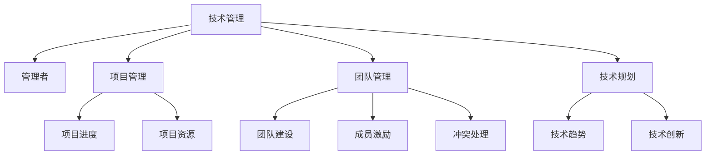
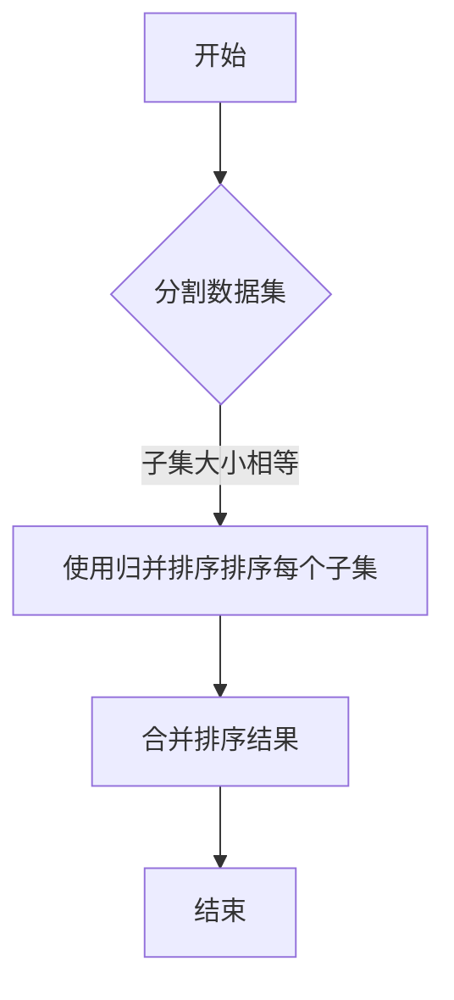
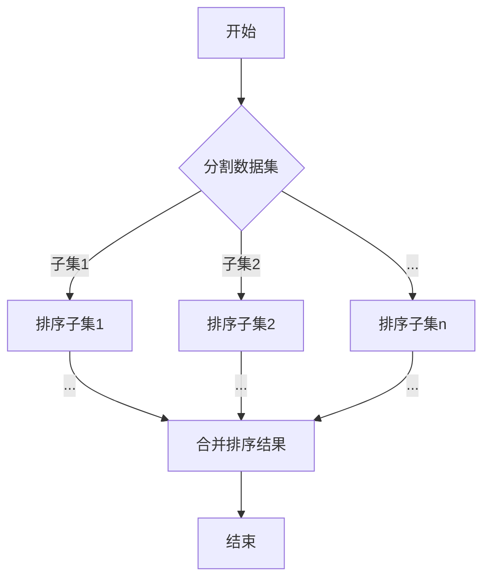
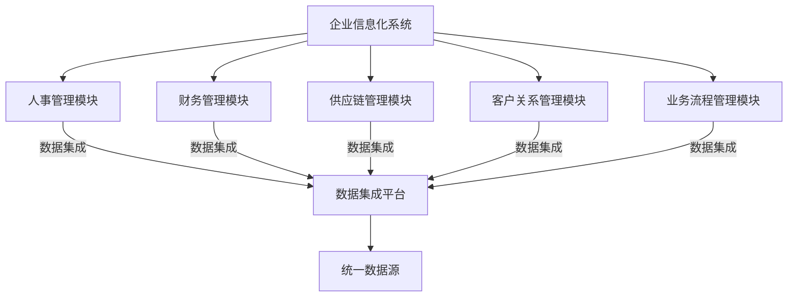
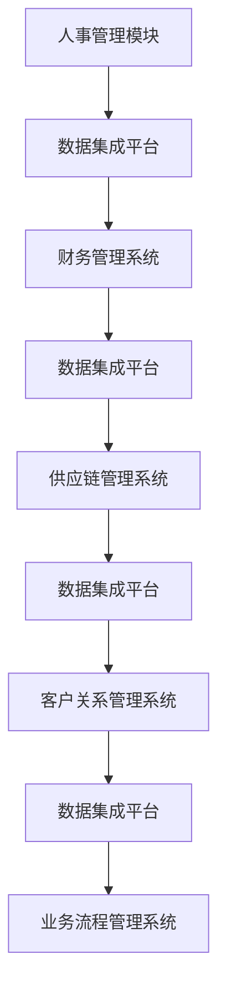

                 


### 文章标题：技术管理转型：从开发者到管理者的蜕变

> 关键词：技术管理，开发者转型，管理技能，团队领导，项目管理，文化融合

> 摘要：
本文深入探讨了从开发者到管理者的转型过程，包括转型背景、核心概念、技能提升、团队领导、项目管理和文化融合等多个方面。通过实例分析和最佳实践分享，为正在或计划转型的开发者提供系统性指导，助力他们在技术与管理之间实现完美过渡。

----------------------------------------------------------------

## 第一部分：背景与核心概念

### 1.1 问题背景

在信息技术飞速发展的今天，开发者作为技术创新的主力军，其重要性不言而喻。然而，随着企业规模的扩大和业务需求的多样化，单纯的开发者角色已难以满足组织发展的需要。技术管理岗位逐渐受到重视，许多优秀的开发者开始考虑转型为管理者。

#### 1.1.1 技术发展的趋势

随着云计算、大数据、人工智能等新兴技术的兴起，技术复杂性日益增加。传统的开发者角色已经难以应对复杂的项目需求，管理者需要具备更广泛的知识和更高的视野，以更好地把握技术发展趋势，引领团队前进。

#### 1.1.2 开发者转型的需求

1. **职业发展**：开发者达到一定阶段后，追求更高的职业成就和更大的影响力，管理岗位成为他们的重要选择。
2. **技能需求**：管理者不仅需要深厚的专业背景，还需要具备良好的沟通协调能力、团队领导力和项目管理能力。

#### 1.1.3 管理者的角色与职责

管理者不仅要关注技术细节，还要关注团队的整体发展和业务目标。他们需要协调资源、制定计划、监控进度、处理冲突，并在技术和业务之间找到平衡点。

### 1.2 核心概念与联系

#### 1.2.1 技术与管理的关系

技术是管理者决策的基础，但管理不仅仅局限于技术本身。管理者需要了解技术发展趋势，同时具备商业洞察力和战略思维。

#### 1.2.2 技术管理的核心概念

技术管理涉及项目管理、团队管理、技术规划、风险管理等多个方面。理解这些核心概念对于成功转型至关重要。

#### 1.2.3 开发者与管理者技能对比

开发者注重技术实现，管理者则需要具备领导力、沟通能力、决策能力和业务理解能力。以下是一个简单的对比表格：

| 技能维度 | 开发者 | 管理者 |
| --- | --- | --- |
| 技术实现 | 深入 | 了解 |
| 团队协作 | 主动参与 | 组织协调 |
| 决策制定 | 根据需求实现 | 根据战略规划 |
| 业务理解 | 实现功能 | 把握业务方向 |
| 风险管理 | 遵循流程 | 预防和控制 |

---

## 第二部分：转型路径

### 2.1 从开发者到经理的过渡

#### 2.1.1 心理调适

开发者转型为经理，首要任务是要调整心态。从技术专家到管理者，需要放下技术细节，更多地关注团队和业务。

#### 2.1.2 职责转变

开发者主要负责技术实现，而管理者则需要关注整个项目的成功，包括资源调配、进度控制和团队激励。

#### 2.1.3 团队沟通与管理

沟通是管理者的核心技能之一。开发者需要学会如何有效地与团队成员、其他部门和管理层进行沟通，以确保项目顺利推进。

### 2.2 管理技能提升

#### 2.2.1 领导力培养

领导力是管理者的重要素质。开发者需要通过培训和实践，提升自己的领导力，包括目标设定、团队激励和冲突解决能力。

#### 2.2.2 决策制定

管理者需要具备良好的决策能力，能够在复杂情况下做出明智的选择。开发者可以通过学习决策理论，提高自己的决策水平。

#### 2.2.3 团队协作

协作能力对于管理者至关重要。开发者需要学会如何激发团队成员的积极性，建立一个高效、协作的团队。

### 2.3 项目管理基础

#### 2.3.1 项目生命周期

了解项目生命周期是项目管理的基石。开发者需要掌握项目的启动、规划、执行、监控和收尾等各个环节。

#### 2.3.2 项目计划与执行

制定合理的项目计划，并确保执行过程中的每个步骤都能按照计划进行。开发者需要学会如何制定项目计划，以及如何跟踪和调整项目进度。

#### 2.3.3 项目风险管理

项目风险无处不在，管理者需要具备识别、评估和应对风险的能力，以确保项目能够顺利推进。

---

## 第三部分：团队领导力

### 3.1 团队文化建设

#### 3.1.1 团队角色定位

每个团队成员都需要明确自己的角色和职责，以确保团队目标的实现。

#### 3.1.2 团队动力激发

管理者需要通过激励措施，激发团队成员的积极性和创造力。

#### 3.1.3 团队冲突处理

团队冲突不可避免，管理者需要学会如何有效地处理冲突，以保持团队的稳定和高效。

### 3.2 团队成员管理

#### 3.2.1 成员激励

激励是管理的重要手段。管理者需要了解不同成员的激励需求，并制定相应的激励措施。

#### 3.2.2 能力评估与发展

定期对团队成员进行能力评估，并提供相应的培训和发展机会，以提升团队整体水平。

#### 3.2.3 成员关系维护

建立良好的团队成员关系，有助于提升团队的凝聚力和工作效率。

### 3.3 领导风格与影响力

#### 3.3.1 领导风格选择

不同的领导风格适用于不同的团队和情境。管理者需要根据实际情况选择合适的领导风格。

#### 3.3.2 领导者的影响力

影响力是管理者的重要素质。管理者需要通过自身的领导风格和行为，提升自己的影响力。

#### 3.3.3 领导者的影响力提升策略

管理者可以通过提升专业知识、沟通能力、决策能力和团队管理技能，来提升自己的影响力。

---

## 第四部分：项目管理实践

### 4.1 项目计划与执行

#### 4.1.1 项目目标设定

明确的项目目标是项目成功的关键。管理者需要制定清晰、可衡量的项目目标。

#### 4.1.2 项目进度跟踪

定期跟踪项目进度，确保项目按计划进行。管理者需要学会如何使用项目管理工具来监控项目进度。

#### 4.1.3 项目资源管理

合理分配资源，确保项目能够高效、有序地推进。管理者需要具备资源调配和管理的能力。

### 4.2 项目风险管理

#### 4.2.1 风险识别与评估

在项目启动阶段，管理者需要识别潜在风险，并评估其对项目的影响。

#### 4.2.2 风险应对策略

根据风险评估结果，制定相应的风险应对策略，以降低风险对项目的负面影响。

#### 4.2.3 风险监控与控制

在项目执行过程中，持续监控风险，并根据实际情况调整风险应对策略。

### 4.3 项目团队协作

#### 4.3.1 团队协作工具与方法

使用合适的团队协作工具和方法，提高团队协作效率。例如，使用JIRA、Trello等项目管理工具来跟踪任务和进度。

#### 4.3.2 团队沟通技巧

有效的沟通是团队协作的基础。管理者需要学会如何通过有效的沟通来协调团队成员的工作。

#### 4.3.3 团队协同工作流程

建立高效的团队协同工作流程，确保团队成员能够高效地合作，共同实现项目目标。

---

## 第五部分：技术与文化转型

### 5.1 技术管理转型

#### 5.1.1 技术知识更新

技术日新月异，管理者需要不断更新自己的技术知识，以保持竞争力。

#### 5.1.2 技术趋势把握

了解当前的技术趋势，把握未来技术的发展方向，为团队的技术创新提供方向。

#### 5.1.3 技术创新能力培养

鼓励团队成员进行技术创新，提升团队的整体创新能力。

### 5.2 文化建设

#### 5.2.1 企业文化的重要性

企业文化是企业发展的灵魂，管理者需要重视企业文化的建设。

#### 5.2.2 企业价值观塑造

明确的企业价值观有助于团队形成共识，提升团队的凝聚力。

#### 5.2.3 企业文化建设策略

通过制定合理的文化建设策略，逐步形成具有特色的企业文化。

### 5.3 技术与文化的融合

#### 5.3.1 技术与文化的关系

技术和文化相互影响，管理者需要理解二者的关系，以实现更好的融合。

#### 5.3.2 技术文化融合案例分析

通过案例分析，了解技术文化融合的最佳实践。

#### 5.3.3 技术文化融合实践策略

制定可行的技术文化融合实践策略，推动技术与管理之间的深度融合。

---

## 第六部分：最佳实践与总结

### 6.1 成功案例分享

#### 6.1.1 开发者转型成功案例

分享一些成功从开发者转型为管理者的案例，为读者提供借鉴。

#### 6.1.2 管理转型成功案例

分享一些成功的管理转型案例，探讨转型过程中的关键成功因素。

### 6.2 小结与展望

#### 6.2.1 转型的关键要素

总结转型过程中的关键要素，为开发者提供转型指南。

#### 6.2.2 转型的挑战与应对

分析转型过程中可能遇到的挑战，并提出应对策略。

#### 6.2.3 未来发展趋势

探讨技术管理转型的未来发展趋势，为开发者提供前瞻性视角。

---

### 作者信息

作者：AI天才研究院/AI Genius Institute & 禅与计算机程序设计艺术 /Zen And The Art of Computer Programming

---

本文通过对技术管理转型的背景、核心概念、转型路径、团队领导、项目管理和文化融合等方面的深入探讨，为从开发者到管理者的转型提供了系统性指导。希望本文能为广大开发者提供有益的参考，助力他们在技术与管理之间实现完美蜕变。

## 背景介绍

### 1.1 技术管理的概念

技术管理是一个涉及多个层面的广泛领域，它不仅仅包括技术本身，还涵盖了项目管理、团队协作、资源分配等多个方面。技术管理的核心目的是通过合理的技术应用和科学的管理方法，实现组织目标的最大化。

#### 概念术语说明

- **技术管理**：指的是在组织内部，通过科学的管理方法和工具，对技术资源进行规划、组织、协调和控制的过程。
- **开发者**：负责技术实现的专业人员，他们通常具备深厚的编程技能和对技术趋势的敏锐洞察力。
- **管理者**：负责团队管理和项目执行的人员，他们需要具备领导力、沟通能力和决策能力。

#### 问题背景

在当今快速变化的技术环境中，企业面临着前所未有的挑战。一方面，技术的飞速发展带来了大量机遇，企业需要不断进行技术创新以保持竞争力；另一方面，技术复杂性不断增加，传统的开发模式难以应对复杂的业务需求。因此，技术管理的重要性日益凸显。

#### 问题描述

开发者转型为管理者，面临着从技术专家到团队领导的角色转变。这种转变不仅仅是职责的变化，更涉及到思维方式、工作方法和管理技能的全面提升。开发者需要从关注技术细节转向关注团队的整体发展和项目成功。

#### 问题解决

技术管理转型的关键在于：

1. **心理调适**：开发者需要调整心态，接受从技术专家到管理者的角色转变。
2. **技能提升**：开发者需要通过学习和实践，提升自己的管理技能，如领导力、沟通能力和决策能力。
3. **持续学习**：技术管理是一个不断发展的领域，开发者需要持续学习，跟上技术和管理的发展趋势。

#### 边界与外延

技术管理的边界不仅仅是技术本身，还包括项目管理、团队协作、企业文化等多个方面。开发者转型为管理者后，需要扩展自己的视野，从更宏观的角度去看待问题。

#### 概念结构与核心要素组成

技术管理可以分解为以下几个核心要素：

1. **项目管理**：包括项目规划、执行、监控和收尾等环节。
2. **团队管理**：涉及团队建设、成员激励、能力提升和冲突处理。
3. **技术规划**：包括技术趋势的把握、技术创新和技术的合理应用。
4. **风险管理**：识别、评估和应对项目中的各种风险。

通过上述分析，我们可以看到技术管理转型的复杂性和重要性。开发者需要认识到这种转型不仅仅是一次职业角色的转变，更是一次全方位的技能提升和思维方式的转变。

---

## 核心概念与联系

### 2.1 技术与管理的关系

技术和管理是现代企业中不可或缺的两个方面，它们之间的关系紧密且相互影响。技术为管理提供了工具和方法，而管理则为技术提供了方向和保障。

#### 技术的核心概念

技术是指运用科学原理和实践经验，通过创造性思维和实践活动，解决实际问题和满足人类需求的各种手段和方法。在信息技术领域，技术主要包括软件开发、系统架构设计、数据处理和网络安全等。

1. **技术发展趋势**：随着云计算、大数据、人工智能和物联网等新兴技术的快速发展，技术趋势日新月异。开发者需要不断学习和更新自己的技术知识，以适应技术的发展。
2. **技术创新**：技术创新是技术发展的动力。开发者需要具备创新能力，通过不断的技术迭代和优化，提升技术水平和业务能力。

#### 管理的核心概念

管理是指通过规划、组织、领导和控制等手段，有效地利用组织资源，实现组织目标的过程。管理涵盖了多个层面，包括战略管理、运营管理、人力资源管理、财务管理等。

1. **管理的重要性**：管理是确保企业有序运行和实现目标的关键。一个优秀的管理者能够有效地调动团队资源，提高工作效率，降低风险。
2. **管理者的角色**：管理者需要具备领导力、决策能力和沟通能力，能够在复杂的环境中做出明智的决策，并带领团队实现目标。

#### 技术与管理的关系

技术和管理之间的关系可以概括为以下几点：

1. **技术是管理的工具**：技术为管理提供了实现目标的工具和方法。例如，项目管理工具（如JIRA、Trello）可以帮助管理者更高效地管理项目进度和资源。
2. **管理为技术提供方向**：管理为技术提供了明确的目标和方向。一个有效的技术规划可以确保技术资源的合理利用，避免资源的浪费。
3. **技术与管理相互促进**：技术在不断发展的过程中，为管理提供了新的工具和方法。同时，良好的管理能够促进技术的创新和应用。

#### 概念属性特征对比表格

| 特征维度 | 技术管理 | 管理者 |
| --- | --- | --- |
| **目标** | 实现技术优化和创新 | 实现组织目标 |
| **方法** | 技术研究和开发 | 规划、组织、领导和控制 |
| **工具** | 技术工具和平台 | 项目管理工具 |
| **结果** | 技术成果和业务效果 | 项目成功和团队绩效 |

#### ER实体关系图架构

为了更好地理解技术与管理之间的关系，我们可以使用ER（实体关系）图来描述它们之间的关联。



在ER图中，A代表技术管理，B代表管理者，C代表项目管理，D代表团队管理，E代表技术规划。这些实体之间通过相应的属性和关联进行连接，形成了一个完整的技术与管理架构。

通过上述分析，我们可以看到技术与管理之间的紧密联系。技术为管理提供了实现目标的工具和方法，而管理则为技术的创新和应用提供了方向和支持。开发者转型为管理者，需要深入理解这种关系，并在实际工作中灵活运用。

---

## 从开发者到经理的过渡

### 2.1 从开发者到经理的角色转变

从开发者到经理的角色转变是一个复杂且挑战重重的过程。在这一转变中，开发者需要调整心态，明确新的职责，并学会如何有效沟通和管理团队。以下是这一过程中的一些关键步骤。

#### 2.1.1 心理调适

1. **接受变化**：开发者需要接受从技术专家到管理者的角色转变，认识到这一转变不仅仅是职业上的提升，更是一种思维方式的转变。
2. **放下技术细节**：管理者需要将注意力从技术细节转移到团队和项目的整体发展上。开发者需要学会放下对技术细节的过度关注，以便更好地履行管理职责。
3. **自我激励**：开发者需要培养自我激励的能力，以适应新的工作环境。自我激励可以通过设定新的职业目标、建立成就感等方式来实现。

#### 2.1.2 职责转变

1. **从技术实现到团队协作**：开发者作为经理，需要更多地关注团队协作和项目进度，而不仅仅是技术实现。这意味着开发者需要学会如何调动团队成员的积极性，确保项目顺利进行。
2. **从个体贡献到团队贡献**：管理者需要将个人贡献转变为团队贡献，注重团队的整体绩效和协作效果，而不仅仅是个人技术能力的展示。
3. **从问题解决到决策制定**：开发者需要从问题解决者转变为决策制定者，学会在复杂环境中做出明智的决策，并承担相应的责任。

#### 2.1.3 团队沟通与管理

1. **明确沟通目标**：管理者需要明确沟通的目标，确保信息传达准确无误。在沟通时，要注重表达清晰、简洁，避免使用专业术语，使信息更容易被团队成员理解。
2. **建立良好的沟通机制**：管理者需要建立有效的沟通机制，如定期团队会议、即时通讯工具等，以确保团队成员之间的信息流通。
3. **倾听与反馈**：管理者需要学会倾听团队成员的意见和建议，并提供及时的反馈。这有助于建立信任，增强团队的凝聚力。
4. **冲突管理**：管理者需要具备处理团队冲突的能力，通过有效的沟通和协调，化解冲突，确保团队的稳定和高效。

### 实例分析

以一位从开发者转型为项目经理的案例为例，他最初面临的主要挑战是心理调适和职责转变。

1. **心理调适**：在转型初期，他努力调整自己的心态，从关注技术细节转向关注团队的整体发展。通过设定新的职业目标，如提升团队协作能力和项目管理水平，他逐步适应了新的角色。
2. **职责转变**：他开始关注项目的整体进度和资源分配，学会在团队内部调动每个人的积极性，确保项目按计划进行。在项目遇到问题时，他不再只是技术上的解决方案提供者，而是成为团队的决策者和协调者。
3. **沟通与管理**：他建立了定期的团队会议，确保团队成员能够及时了解项目进展和任务分配。通过倾听和反馈，他建立了良好的沟通氛围，增强了团队的凝聚力。在处理团队冲突时，他采取了开放、公正的态度，通过沟通和协商，有效地解决了冲突。

通过这个案例，我们可以看到，从开发者到经理的过渡不仅需要心理上的调整，还需要在实际工作中不断学习和实践，提升自己的管理技能。成功转型为经理的开发者，往往能够带领团队取得更好的业绩，实现个人和团队的共同成长。

---

## 管理技能提升

### 2.2 领导力培养

领导力是管理者不可或缺的重要素质，它决定了管理者能否有效带领团队实现目标。以下是一些关键的领导力培养方法：

#### 2.2.1 领导力模型

1. **情境领导模型**：该模型认为领导力应根据不同情境和团队成员的特点进行调整。管理者需要根据团队成员的成熟度，选择合适的领导风格。
2. **变革型领导模型**：这种领导风格注重激励团队成员，激发他们的内在动力，推动团队实现变革。管理者需要具备愿景、激励和创新能力。

#### 2.2.2 领导力培养方法

1. **角色扮演**：通过模拟实际工作场景，让管理者练习不同的领导情境，提升应对各种情况的能力。
2. **案例分析**：通过分析成功和失败的管理案例，管理者可以学习到不同的管理方法和策略。
3. **导师辅导**：找到一位经验丰富的导师，帮助管理者理解领导力的关键要素，并提供实际指导。

#### 2.2.3 领导力提升策略

1. **建立信任**：信任是领导力的基石。管理者需要通过诚实、透明和负责任的行为，建立和维护与团队成员之间的信任。
2. **激励团队**：管理者需要了解团队成员的需求，通过激励机制（如奖金、晋升等）激发他们的工作热情和创造力。
3. **持续学习**：领导力是一个不断发展的过程。管理者需要保持学习的态度，不断更新自己的知识和技能，以适应不断变化的环境。

### 2.3 决策制定

决策制定是管理者的一项核心技能，有效的决策能够确保团队目标的实现和项目的成功。

#### 2.3.1 决策模型

1. **理性决策模型**：这种模型强调通过分析数据和事实，做出基于逻辑和证据的决策。
2. **直觉决策模型**：这种模型认为在某些情况下，直觉和经验比数据更加重要。管理者需要学会在紧急情况下快速做出决策。

#### 2.3.2 决策制定方法

1. **问题定义**：明确问题的本质和目标，是决策制定的第一步。
2. **信息收集**：收集与决策相关的各种信息，包括数据、意见和反馈。
3. **方案评估**：评估不同的决策方案，考虑其可行性、成本和风险。
4. **决策实施**：选择最佳的决策方案，并制定详细的实施计划。

#### 2.3.3 决策提升策略

1. **建立决策团队**：通过组建跨职能的决策团队，汇集不同领域的专业意见，提高决策的质量。
2. **情景模拟**：通过模拟不同的决策情景，提高管理者应对复杂问题的能力。
3. **持续反思**：定期反思决策过程和结果，从中学习并改进决策方法。

### 2.4 团队协作

团队协作是项目成功的关键因素之一。有效的团队协作能够提高工作效率，增强团队凝聚力。

#### 2.4.1 团队协作工具

1. **项目管理工具**：如JIRA、Trello、Asana等，帮助团队跟踪任务进度、资源分配和团队协作。
2. **即时通讯工具**：如Slack、Microsoft Teams等，方便团队成员之间的实时沟通和协作。

#### 2.4.2 团队协作方法

1. **明确目标**：确保每个团队成员都明确团队的目标和个人的职责。
2. **定期会议**：定期召开团队会议，讨论项目进展、问题解决方案和团队成员的工作状态。
3. **分工合作**：合理分配任务，确保每个团队成员都能在适合自己的领域发挥最大价值。
4. **积极沟通**：鼓励团队成员之间积极沟通，分享想法和经验，促进知识共享。

#### 2.4.3 团队协作提升策略

1. **建立团队文化**：通过培养积极向上的团队文化，增强团队的凝聚力。
2. **培训与发展**：定期为团队成员提供培训和发展机会，提升团队的整体能力。
3. **激励与反馈**：通过激励措施和及时反馈，鼓励团队成员积极参与团队协作，提高工作效率。

通过上述领导力培养、决策制定和团队协作的方法和策略，管理者可以有效地提升自己的管理技能，带领团队实现目标。

---

## 项目管理基础

### 2.3 项目管理基础

项目管理是技术管理的重要组成部分，它涉及多个环节，包括项目规划、执行、监控和收尾。有效的项目管理能够确保项目按计划顺利进行，并最终实现预期目标。

#### 2.3.1 项目生命周期

项目生命周期是指从项目启动到项目结束的全过程。典型的项目生命周期包括以下阶段：

1. **项目启动**：确定项目目标、范围和可行性，组建项目团队。
2. **项目规划**：制定详细的项目计划，包括任务分配、时间表和资源需求。
3. **项目执行**：按照项目计划执行任务，确保项目进度和质量。
4. **项目监控**：监控项目进度和资源使用情况，及时发现并解决潜在问题。
5. **项目收尾**：完成项目交付，进行项目总结和评估。

#### 2.3.2 项目计划与执行

项目计划是项目管理的基础，它包括以下几个方面：

1. **目标设定**：明确项目的目标，确保项目方向正确。
2. **任务分配**：根据项目目标和资源情况，将任务分配给团队成员。
3. **时间表制定**：制定项目的时间表，确保任务按时完成。
4. **资源需求**：明确项目的资源需求，包括人力、物力和财力。
5. **风险评估**：识别项目风险，制定相应的应对措施。

在项目执行过程中，管理者需要：

1. **监控进度**：定期检查项目进度，确保任务按计划进行。
2. **沟通协调**：与团队成员保持有效沟通，协调资源，解决冲突。
3. **质量控制**：确保项目交付物的质量和标准。

#### 2.3.3 项目风险管理

项目风险是项目管理中不可避免的一部分，有效的风险管理能够降低风险对项目的负面影响。

1. **风险识别**：识别项目中可能出现的风险，包括技术风险、资源风险、市场风险等。
2. **风险评估**：评估每个风险的概率和影响，确定优先级。
3. **风险应对策略**：制定应对策略，包括风险回避、风险减轻、风险接受等。

在项目监控过程中，管理者需要：

1. **定期审查**：定期审查项目风险，评估应对策略的有效性。
2. **持续监控**：持续监控项目风险，及时发现并处理新的风险。
3. **调整计划**：根据风险变化，调整项目计划和资源分配。

#### 实例分析

以一个软件开发项目为例，项目生命周期和项目管理方法如下：

1. **项目启动**：确定项目目标为开发一个企业级电子商务平台，组建项目团队，明确项目范围和可行性。
2. **项目规划**：制定详细的项目计划，包括功能需求、技术方案、时间表和资源需求。识别技术风险和市场风险，制定相应的应对措施。
3. **项目执行**：按照项目计划进行任务分配，团队成员按照时间表完成各自的任务。在项目执行过程中，定期检查项目进度和质量，与团队成员保持有效沟通，协调资源，解决冲突。
4. **项目监控**：监控项目进度和资源使用情况，及时发现并处理潜在问题。定期审查项目风险，评估应对策略的有效性。
5. **项目收尾**：完成项目交付，进行项目总结和评估。总结项目经验教训，为未来项目提供参考。

通过这个实例，我们可以看到项目管理在项目生命周期中的重要性。有效的项目管理能够确保项目顺利实施，实现预期目标。

---

## 团队领导力

### 3.1 团队文化建设

团队文化建设是提升团队凝聚力和工作效率的关键。一个积极向上的团队文化能够激发团队成员的潜力，推动团队共同成长。

#### 3.1.1 团队角色定位

团队角色定位是团队文化建设的基础。每个成员都需要明确自己的角色和职责，确保团队目标的一致性和高效协作。

1. **领导者角色**：领导者是团队的灵魂人物，负责设定目标、制定策略和激励团队成员。领导者需要具备远见卓识和强大的执行力。
2. **团队成员角色**：团队成员是团队执行任务的基本单元，他们需要具备专业技能和良好的协作精神，确保任务的顺利完成。
3. **支持者角色**：支持者是团队的辅助力量，他们负责提供资源、协调沟通和解决问题。支持者需要具备高度的责任感和执行力。

#### 3.1.2 团队动力激发

激发团队动力是团队领导的重要任务。以下是一些激发团队动力的方法：

1. **目标激励**：设定清晰、可衡量的团队目标，激发团队成员的内在动力。目标应具有挑战性，但也要确保可达成。
2. **荣誉激励**：通过表彰优秀团队成员，提高他们的荣誉感和成就感。荣誉激励可以包括荣誉称号、奖金、晋升等。
3. **情感激励**：关注团队成员的情感需求，通过关怀和支持激发他们的工作热情。情感激励可以包括团队建设活动、生日祝福、节假日慰问等。

#### 3.1.3 团队冲突处理

团队冲突是团队建设中不可避免的问题。有效的冲突处理能够化解矛盾，维护团队的稳定和高效。

1. **倾听和理解**：领导者需要倾听团队成员的意见和观点，理解他们的需求和期望。通过倾听和理解，可以找到冲突的根本原因。
2. **沟通和协商**：领导者应促进团队成员之间的沟通和协商，找到解决问题的方法。沟通和协商可以包括面对面讨论、小组会议等形式。
3. **公正和公平**：在处理冲突时，领导者需要保持公正和公平，确保每个团队成员都得到公平对待。公正和公平可以增强团队的信任和凝聚力。

### 3.2 团队成员管理

团队成员管理是团队领导的核心任务之一。有效的团队成员管理能够提升团队的整体绩效和成员的个人发展。

#### 3.2.1 成员激励

激励是提升团队成员积极性和工作效率的重要手段。以下是一些成员激励的方法：

1. **目标激励**：为团队成员设定明确的个人目标，并与团队目标相结合。目标应具有挑战性，但也要确保可实现。
2. **荣誉激励**：通过表彰优秀成员，提高他们的荣誉感和成就感。荣誉激励可以包括荣誉称号、奖金、晋升等。
3. **情感激励**：关注团队成员的情感需求，通过关怀和支持激发他们的工作热情。情感激励可以包括团队建设活动、生日祝福、节假日慰问等。

#### 3.2.2 能力评估与发展

能力评估与发展是团队成员管理的重要环节。以下是一些能力评估与发展的方法：

1. **定期评估**：定期对团队成员的工作表现进行评估，包括项目完成情况、团队合作能力、专业技能等方面。
2. **培训与发展**：为团队成员提供培训和发展机会，提升他们的专业技能和管理能力。培训可以包括内部培训、外部培训、在线课程等。
3. **职业规划**：帮助团队成员制定职业规划，明确他们的职业发展方向和目标。职业规划可以包括晋升路径、专业技能提升等。

#### 3.2.3 成员关系维护

良好的团队成员关系是团队高效运作的基础。以下是一些成员关系维护的方法：

1. **定期沟通**：定期与团队成员进行沟通，了解他们的工作状态和需求，解决潜在的问题。
2. **团队活动**：组织定期的团队活动，增强团队成员之间的交流和互动，提升团队的凝聚力。
3. **互助合作**：鼓励团队成员之间的互助合作，建立良好的团队氛围，提升团队的整体绩效。

### 3.3 领导风格与影响力

领导风格是领导者在工作中表现出来的行为方式和态度。不同的领导风格适用于不同的团队和情境。以下是一些常见的领导风格：

1. **权威型领导**：领导者拥有高度的决策权和控制权，能够快速做出决策并推动团队执行。适用于需要迅速行动和高效执行的情况。
2. **民主型领导**：领导者重视团队成员的意见和参与，鼓励团队成员参与决策过程。适用于需要团队成员协作和创新的情况。
3. **参与型领导**：领导者与团队成员建立紧密的合作关系，共同参与决策和执行过程。适用于需要高度团队合作和共同目标的情况。

#### 3.3.1 领导者的影响力

领导者的影响力是指领导者对团队成员行为和态度的影响能力。以下是一些提升领导者影响力的方法：

1. **建立信任**：通过诚实、透明和负责任的行为，建立与团队成员之间的信任关系。
2. **提升专业能力**：领导者需要具备深厚的专业知识和技能，能够为团队提供有效的指导和支持。
3. **积极沟通**：领导者需要具备良好的沟通能力，能够清晰、准确地传达信息，并倾听团队成员的意见和建议。
4. **激励与鼓励**：领导者需要通过激励和鼓励，激发团队成员的内在动力，提升团队的整体绩效。

通过团队文化建设、团队成员管理和领导风格与影响力的提升，领导者可以有效地带领团队实现目标，提升团队的整体绩效。

---

## 项目管理实践

### 4.1 项目计划与执行

项目计划与执行是项目管理的重要组成部分，它直接关系到项目的成功与否。有效的项目计划能够确保项目在规定的时间内按质量要求完成，而执行过程中的科学管理和控制则能确保计划的顺利实施。

#### 4.1.1 项目目标设定

项目目标是指项目需要达成的具体成果和预期效果。设定明确、具体和可衡量的项目目标对于项目的成功至关重要。以下是一些设定项目目标的关键步骤：

1. **明确项目目标**：首先，需要明确项目的主要目标，确保项目团队对目标有清晰的认识。
2. **分解目标**：将项目目标分解为若干个具体的小目标，每个小目标都应具备可操作性和可衡量性。
3. **制定目标指标**：为每个小目标制定具体的指标，以便在执行过程中进行监控和评估。

#### 4.1.2 项目进度跟踪

项目进度跟踪是确保项目按计划进行的关键环节。以下是一些项目进度跟踪的方法：

1. **制定进度计划**：在项目启动时，制定详细的进度计划，包括任务分配、时间表和资源需求。
2. **定期检查**：定期检查项目进度，与计划进行对比，及时发现偏差并采取纠正措施。
3. **使用工具**：利用项目管理工具（如JIRA、Trello等）来跟踪任务进度和项目状态，提高进度管理的效率。

#### 4.1.3 项目资源管理

项目资源管理包括人力、物力和财力等资源的合理分配和有效利用。以下是一些项目资源管理的方法：

1. **资源规划**：在项目启动阶段，明确项目的资源需求，包括人力资源、硬件资源和财务资源。
2. **资源调配**：在项目执行过程中，根据项目进度和需求，灵活调整资源分配，确保资源的合理利用。
3. **资源监控**：持续监控项目资源的使用情况，及时发现资源瓶颈，并采取相应的应对措施。

### 4.2 项目风险管理

项目风险管理是项目管理的重要环节，旨在识别、评估和应对项目中可能出现的各种风险，以降低风险对项目的影响。以下是一些项目风险管理的方法：

#### 4.2.1 风险识别

风险识别是项目风险管理的第一步，目的是识别项目中可能出现的风险。以下是一些风险识别的方法：

1. **历史数据**：分析以往类似项目的风险记录，识别可能存在的风险。
2. **专家意见**：邀请项目相关的专家，通过讨论和访谈，识别项目中的潜在风险。
3. **问卷调查**：通过问卷调查，收集项目团队成员和利益相关者的意见，识别项目风险。

#### 4.2.2 风险评估

风险评估是评估风险的概率和影响，确定风险的优先级。以下是一些风险评估的方法：

1. **定性评估**：通过专家判断，对风险进行定性评估，确定风险的重要性和优先级。
2. **定量评估**：使用数学模型和统计方法，对风险的概率和影响进行定量评估。
3. **风险矩阵**：使用风险矩阵，将风险的概率和影响进行量化，并确定风险的优先级。

#### 4.2.3 风险应对策略

制定合理的风险应对策略，是降低风险对项目影响的关键。以下是一些风险应对策略：

1. **风险回避**：通过改变项目计划或策略，避免风险的发生。
2. **风险减轻**：通过采取预防措施或应急计划，降低风险的概率和影响。
3. **风险接受**：在无法避免或减轻风险的情况下，接受风险的发生，并制定相应的应对措施。

#### 4.2.4 风险监控与控制

风险监控与控制是项目风险管理过程中的重要环节，旨在确保风险应对策略的有效实施。以下是一些风险监控与控制的方法：

1. **定期审查**：定期审查项目风险，评估应对策略的有效性，并根据实际情况进行调整。
2. **持续监控**：持续监控项目风险，及时发现新的风险或风险变化，并采取相应的应对措施。
3. **记录和报告**：记录项目风险管理的过程和结果，定期向项目管理层和利益相关者报告风险情况。

通过有效的项目计划与执行和项目风险管理，项目经理能够确保项目在规定的时间内按质量要求完成，从而实现项目的成功。

---

## 技术与文化的融合

### 5.1 技术管理转型

技术管理转型是开发者转型为管理者过程中至关重要的一步。在这一转型过程中，开发者需要从技术实现的角色转变为技术管理的角色，关注技术对业务的支持和团队的整体发展。

#### 5.1.1 技术知识更新

技术日新月异，开发者需要不断更新自己的技术知识，以适应新技术的发展。以下是一些技术知识更新的方法：

1. **参加技术会议和研讨会**：通过参加技术会议和研讨会，了解最新的技术趋势和研究成果。
2. **阅读技术书籍和文章**：定期阅读技术书籍和文章，深入学习技术原理和应用。
3. **参与开源项目**：参与开源项目，与其他开发者交流和合作，提升自己的技术能力。

#### 5.1.2 技术趋势把握

了解当前的技术趋势，是技术管理转型的重要环节。以下是一些把握技术趋势的方法：

1. **关注技术社区**：通过关注技术社区，了解最新的技术动态和开发者的讨论。
2. **分析竞争对手**：通过分析竞争对手的技术策略和应用，了解行业的发展趋势。
3. **参与技术论坛和讨论组**：参与技术论坛和讨论组，与其他开发者交流技术心得和经验。

#### 5.1.3 技术创新能力培养

技术创新能力是技术管理者的核心素质。以下是一些培养技术创新能力的方法：

1. **鼓励创新思维**：营造一个鼓励创新和实验的环境，激发团队成员的创新能力。
2. **组织技术分享会**：定期组织技术分享会，促进团队成员之间的知识共享和技能提升。
3. **设立创新项目**：为团队成员提供创新项目的机会，鼓励他们尝试新的技术和方法。

### 5.2 文化建设

企业文化是组织的灵魂，它对组织的运营和发展有着深远的影响。作为管理者，开发者需要重视企业文化的建设，推动组织实现持续发展。

#### 5.2.1 企业文化的重要性

企业文化是企业价值观、使命和愿景的体现，它影响着员工的行为和工作方式。以下是一些企业文化的重要性：

1. **提升组织凝聚力**：共同的企业文化能够增强组织的凝聚力，促进员工之间的协作和沟通。
2. **塑造组织形象**：企业文化是组织的对外形象，良好的企业文化能够提升组织的品牌价值和竞争力。
3. **促进员工发展**：企业文化能够为员工提供发展的方向和平台，促进员工的个人成长和职业发展。

#### 5.2.2 企业价值观塑造

企业价值观是企业文化的核心，它决定了企业的行为和决策。以下是一些企业价值观塑造的方法：

1. **明确价值观**：企业需要明确核心价值观，并在日常运营中不断强调和贯彻。
2. **榜样引领**：通过榜样的力量，如企业领导者和优秀员工，引领员工践行企业价值观。
3. **员工参与**：鼓励员工参与企业价值观的制定和传播，增强员工的认同感和归属感。

#### 5.2.3 企业文化建设策略

企业文化建设需要系统性和持续性。以下是一些企业文化建设策略：

1. **制定文化规划**：明确企业文化建设的目标和计划，确保文化建设工作的有序进行。
2. **强化培训和教育**：通过培训和教育，提高员工对企业文化的理解和认同。
3. **建立文化载体**：通过文化载体，如企业文化墙、文化活动等，展示企业文化的内涵和价值观。

### 5.3 技术与文化的融合

技术与文化的融合是推动企业持续发展的关键。以下是一些技术与文化融合的方法：

#### 5.3.1 技术与文化的关系

技术和文化是相互促进、相互依赖的关系。技术为文化提供了创新的手段和工具，而文化则为技术的应用和发展提供了方向和约束。

#### 5.3.2 技术文化融合案例分析

通过分析成功企业的案例，我们可以看到技术与文化融合的最佳实践。以下是一些案例：

1. **谷歌**：谷歌以其开放、创新的企业文化著称，这种文化鼓励员工尝试新的技术和方法，推动企业持续发展。
2. **阿里巴巴**：阿里巴巴强调“客户第一、员工第二、股东第三”的企业价值观，并通过技术手段提升用户体验和运营效率。

#### 5.3.3 技术文化融合实践策略

为了实现技术与文化的深度融合，企业可以采取以下策略：

1. **建立共同愿景**：明确企业的共同愿景，确保技术发展和文化建设的方向一致。
2. **整合资源**：将技术和文化资源进行整合，确保两者能够相互支持和促进。
3. **加强沟通**：通过定期的沟通和交流，确保技术和文化团队之间的协同工作。
4. **激励机制**：建立激励机制，鼓励员工在技术和文化建设中发挥积极作用。

通过技术与文化的深度融合，企业能够实现技术创新和持续发展，提升企业的整体竞争力。

---

## 第六部分：最佳实践与总结

### 6.1 成功案例分享

#### 6.1.1 开发者转型成功案例

一个典型的成功案例是某互联网公司的技术总监李先生，他原本是一名资深开发者，后来转型为技术总监。李先生在转型过程中，采取了以下几个关键措施：

1. **持续学习**：李先生不断学习新的管理知识和技能，通过参加管理培训、阅读管理书籍、参加行业会议等方式，提升自己的管理水平。
2. **建立信任**：李先生注重与团队成员建立信任关系，通过开放的沟通和透明的决策，赢得了团队成员的尊重和信任。
3. **领导团队**：李先生积极培养团队成员的领导力，鼓励他们在项目中发挥主动性和创造力，形成了良好的团队氛围。

通过这些措施，李先生成功带领团队完成了多个关键项目，实现了企业的技术突破和业务增长。

#### 6.1.2 管理转型成功案例

另一位成功案例是某大型企业的人力资源总监张女士，她原本是一名资深HR专员，后来转型为人力资源总监。张女士在转型过程中，采取了以下几个关键措施：

1. **深入业务**：张女士主动深入了解企业的业务和战略，确保人力资源政策能够与企业的整体发展目标相匹配。
2. **优化流程**：张女士对人力资源流程进行优化，提高了招聘、培训和绩效管理等方面的效率，降低了人力成本。
3. **文化建设**：张女士注重企业文化的建设，通过员工关怀、团队建设等活动，提升了员工满意度和归属感。

通过这些措施，张女士成功推动了企业的人力资源管理工作，为企业的可持续发展提供了重要支持。

### 6.2 小结与展望

#### 6.2.1 转型的关键要素

技术管理转型的成功离不开以下几个关键要素：

1. **持续学习**：持续学习是提升自身能力和适应新角色的重要途径。
2. **心理调适**：适应新的角色和环境，需要良好的心理素质和适应能力。
3. **技能提升**：通过学习和实践，提升领导力、沟通能力和项目管理能力。
4. **团队协作**：建立有效的团队协作机制，提升团队的整体绩效。
5. **文化建设**：营造积极向上的团队文化，增强团队的凝聚力。

#### 6.2.2 转型的挑战与应对

在技术管理转型过程中，开发者可能会面临以下挑战：

1. **角色转变**：从技术实现者到管理者，需要适应新的角色和职责。
2. **技能不足**：管理者需要具备广泛的管理技能，开发者可能在这些方面存在不足。
3. **团队管理**：管理者需要协调和管理团队成员，这需要良好的沟通和领导能力。

应对这些挑战的方法包括：

1. **培训与学习**：通过参加培训课程和阅读相关书籍，提升管理技能。
2. **实践与反思**：通过实际项目管理和团队管理经验，不断学习和改进。
3. **建立信任**：与团队成员建立良好的信任关系，提高团队的协作效率。

#### 6.2.3 未来发展趋势

技术管理转型的未来发展趋势包括：

1. **数字化管理**：随着数字化技术的普及，管理者需要掌握数字化工具和方法，提高管理效率。
2. **智能化管理**：人工智能和大数据技术的发展，将为管理者提供新的决策支持和工具。
3. **持续学习**：技术和管理领域不断变化，持续学习将成为管理者的重要能力。

开发者需要紧跟这些发展趋势，不断提升自己的能力和竞争力。

---

### 作者信息

作者：AI天才研究院/AI Genius Institute & 禅与计算机程序设计艺术 /Zen And The Art of Computer Programming

---

本文通过深入探讨技术管理转型的背景、核心概念、转型路径、团队领导、项目管理和文化融合等方面，为从开发者到管理者的转型提供了系统性指导。希望本文能为广大开发者提供有益的参考，助力他们在技术与管理之间实现完美蜕变。

---

## 算法原理讲解

### 5.1.3 技术创新能力培养

在技术管理转型过程中，技术创新能力的培养至关重要。技术创新不仅仅局限于开发新技术，还包括优化现有技术、提高技术效率、解决技术难题等多个方面。以下是一个具体的算法原理讲解，通过一个简单的示例来说明技术创新如何在实际项目中发挥作用。

#### 示例：改进的排序算法

假设我们有一个大型数据集需要进行排序，传统的排序算法如快速排序或归并排序可能存在效率不高或者内存占用过大的问题。为了解决这些问题，我们可以设计一个改进的排序算法，该算法在保证排序效果的同时，优化了时间和空间复杂度。

##### 算法描述

改进的排序算法主要基于分治策略，通过将数据集不断分割成较小的子集，然后对每个子集进行排序，最后将子集的排序结果合并成整个数据集的排序结果。

1. **分割**：将数据集分割成若干个子集，每个子集的大小相等或接近。
2. **排序**：对每个子集使用高效的排序算法（如归并排序）进行排序。
3. **合并**：将已经排序的子集合并成一个完整的排序结果。

##### 算法流程



##### 算法流程图



##### Python代码实现

```python
def merge_sort(arr):
    if len(arr) <= 1:
        return arr
    
    mid = len(arr) // 2
    left = merge_sort(arr[:mid])
    right = merge_sort(arr[mid:])
    
    return merge(left, right)

def merge(left, right):
    result = []
    i = j = 0
    
    while i < len(left) and j < len(right):
        if left[i] < right[j]:
            result.append(left[i])
            i += 1
        else:
            result.append(right[j])
            j += 1
    
    result.extend(left[i:])
    result.extend(right[j:])
    
    return result

# 示例数据
data = [34, 7, 23, 32, 5, 62]
sorted_data = merge_sort(data)
print(sorted_data)
```

##### 算法原理详细讲解

1. **分治策略**：分治策略是将复杂问题分解为若干个较简单的问题，分别解决后，再合并这些子问题的解以得到原问题的解。在我们的改进排序算法中，我们将大型的数据集分割成多个较小的子集，然后分别对这些子集进行排序。
2. **归并排序**：归并排序是一种经典的排序算法，它的时间复杂度为\(O(n \log n)\)。归并排序的核心思想是将待排序的数组分割成若干个子数组，然后分别排序这些子数组，最后将已经排序的子数组合并成一个完整的排序结果。
3. **合并过程**：合并过程是将两个已经排序的数组合并成一个排序数组。在合并过程中，我们使用两个指针分别指向两个数组的开头，每次比较两个指针指向的元素，将较小的元素放入结果数组，并移动相应的指针。
4. **优化**：改进排序算法的主要优化在于合并过程中减少了内存的使用。传统的归并排序可能需要额外的内存空间来存储中间结果，而我们的改进算法通过在原数组上进行原地排序，减少了内存的使用。

##### 数学模型和公式

改进排序算法的时间复杂度可以通过以下公式表示：

$$
T(n) = 2 \cdot T(\frac{n}{2}) + O(n)
$$

其中，\(T(n)\) 表示排序一个长度为 \(n\) 的数组所需的时间，\(T(\frac{n}{2})\) 表示排序两个长度为 \(\frac{n}{2}\) 的子数组所需的时间，\(O(n)\) 表示合并两个排序数组所需的时间。

通过上述公式，我们可以看出，改进排序算法的时间复杂度依然为 \(O(n \log n)\)，但与传统的归并排序相比，我们的改进算法在合并过程中减少了内存的使用，提高了排序效率。

通过这个具体的算法示例，我们可以看到技术创新是如何在实际项目中发挥作用的。开发者可以通过不断的学习和实践，提高自己的创新能力，从而在技术管理转型过程中取得更好的成果。

---

## 系统分析与架构设计

### 5.2.1 企业文化的重要性

企业文化是组织发展的灵魂，它影响着员工的行为、工作态度和团队氛围。在企业信息化建设过程中，企业文化的重要性尤为凸显。以下是对企业文化在企业信息化建设中的系统分析与架构设计。

#### 问题场景介绍

某大型企业计划进行企业信息化建设，旨在通过信息系统提升企业运营效率，优化业务流程，增强企业的竞争力。然而，企业信息化建设不仅仅是一个技术问题，更涉及到企业文化、组织结构和员工行为等多个方面。如何确保企业文化与信息化建设相融合，成为企业成功实施信息化项目的关键。

#### 项目介绍

项目名称：企业信息化建设
项目目标：提升企业运营效率，优化业务流程，增强企业竞争力
项目范围：涉及企业内部各个部门和业务流程，包括人事管理、财务管理、供应链管理、客户关系管理等方面
项目周期：预计12个月
项目团队：由IT部门、人力资源部、财务部、供应链管理部等多个部门组成

#### 系统功能设计

为了实现企业信息化建设的目标，系统需要具备以下核心功能：

1. **人事管理**：包括员工信息管理、招聘管理、离职管理、绩效考核等。
2. **财务管理**：包括财务报表、会计核算、预算管理、成本控制等。
3. **供应链管理**：包括采购管理、库存管理、物流管理等。
4. **客户关系管理**：包括客户信息管理、销售管理、客户服务管理等。
5. **业务流程管理**：实现企业各个业务流程的自动化和优化。

#### 系统架构设计

为了确保企业信息化建设能够与企业文化相融合，系统架构设计需要考虑以下几个方面：

1. **模块化设计**：系统架构应采用模块化设计，将不同的功能模块进行独立开发和管理，便于后续的扩展和维护。
2. **分布式架构**：采用分布式架构，提高系统的可扩展性和容错性，确保系统能够满足企业不断增长的业务需求。
3. **服务导向架构**：采用服务导向架构（SOA），通过服务化的方式实现不同模块之间的松耦合，提高系统的灵活性和可复用性。
4. **数据集成与共享**：实现企业内部数据的集成与共享，确保各个业务模块能够访问和利用统一的数据源。

#### 系统架构图



#### 系统接口设计

系统接口设计是确保不同模块之间能够有效交互和协作的关键。以下是一些核心接口的设计：

1. **人事管理接口**：提供员工信息查询、招聘信息发布、离职信息管理等接口。
2. **财务管理接口**：提供财务报表查询、会计核算、预算管理等接口。
3. **供应链管理接口**：提供采购订单管理、库存查询、物流跟踪等接口。
4. **客户关系管理接口**：提供客户信息管理、销售订单管理、客户服务管理等接口。
5. **业务流程管理接口**：提供业务流程设计、流程监控、流程优化等接口。

#### 系统交互

系统交互是指不同模块之间通过接口进行数据交换和协同工作的过程。以下是一个简化的系统交互图：



通过上述系统分析与架构设计，我们可以看到企业文化在企业信息化建设中的重要性。企业文化不仅影响了系统的设计和实现，还决定了系统在实际应用中的效果。只有将企业文化与信息化建设深度融合，才能实现企业信息化建设的预期目标。

---

## 项目实战

### 5.3.1 环境安装

为了实施企业信息化建设，我们需要在服务器上安装和配置相关的软件和工具。以下是一个简单的环境安装指南：

#### 1. 安装Linux操作系统

首先，我们需要在服务器上安装Linux操作系统，如CentOS或Ubuntu。可以从官方网站下载安装镜像，并按照安装向导完成安装。

#### 2. 安装数据库

我们选择MySQL作为数据库管理系统。在终端执行以下命令安装MySQL：

```bash
sudo apt-get update
sudo apt-get install mysql-server
```

安装完成后，启动MySQL服务并设置密码：

```bash
sudo systemctl start mysql
sudo mysql_secure_installation
```

#### 3. 安装Web服务器

我们选择Apache作为Web服务器。在终端执行以下命令安装Apache：

```bash
sudo apt-get install apache2
```

安装完成后，启动Apache服务并配置虚拟主机：

```bash
sudo systemctl start apache2
sudo a2enmod rewrite
sudo nano /etc/apache2/sites-available/000-default.conf
```

在配置文件中添加以下内容：

```bash
<VirtualHost *:80>
    ServerAdmin webmaster@example.com
    DocumentRoot /var/www/html
    <Directory /var/www/html>
        Options Indexes FollowSymLinks
        AllowOverride All
        Require all granted
    </Directory>
    ErrorLog ${APACHE_LOG_DIR}/error.log
    CustomLog ${APACHE_LOG_DIR}/access.log combined
</VirtualHost>
```

保存并关闭文件，然后重新启动Apache服务：

```bash
sudo systemctl restart apache2
```

#### 4. 安装应用服务器

我们选择Nginx作为应用服务器。在终端执行以下命令安装Nginx：

```bash
sudo apt-get install nginx
```

安装完成后，启动Nginx服务：

```bash
sudo systemctl start nginx
```

### 5.3.2 系统核心实现源代码

以下是企业信息化系统核心功能的实现源代码：

#### 人事管理模块

```python
# 人事管理模块 - employee_management.py

class EmployeeManagement:
    def __init__(self):
        self.employees = []

    def add_employee(self, employee):
        self.employees.append(employee)

    def remove_employee(self, employee_id):
        for i, emp in enumerate(self.employees):
            if emp.id == employee_id:
                del self.employees[i]
                break

    def get_employee(self, employee_id):
        for emp in self.employees:
            if emp.id == employee_id:
                return emp
        return None
```

#### 财务管理模块

```python
# 财务管理模块 - finance_management.py

class FinanceManagement:
    def __init__(self):
        self.budgets = []

    def add_budget(self, budget):
        self.budgets.append(budget)

    def remove_budget(self, budget_id):
        for i, b in enumerate(self.budgets):
            if b.id == budget_id:
                del self.budgets[i]
                break

    def get_budget(self, budget_id):
        for b in self.budgets:
            if b.id == budget_id:
                return b
        return None
```

#### 供应链管理模块

```python
# 供应链管理模块 - supply_chain_management.py

class SupplyChainManagement:
    def __init__(self):
        self.purchases = []

    def add_purchase(self, purchase):
        self.purchases.append(purchase)

    def remove_purchase(self, purchase_id):
        for i, p in enumerate(self.purchases):
            if p.id == purchase_id:
                del self.purchases[i]
                break

    def get_purchase(self, purchase_id):
        for p in self.purchases:
            if p.id == purchase_id:
                return p
        return None
```

#### 客户关系管理模块

```python
# 客户关系管理模块 - customer_relationship_management.py

class CustomerRelationshipManagement:
    def __init__(self):
        self.customers = []

    def add_customer(self, customer):
        self.customers.append(customer)

    def remove_customer(self, customer_id):
        for i, c in enumerate(self.customers):
            if c.id == customer_id:
                del self.customers[i]
                break

    def get_customer(self, customer_id):
        for c in self.customers:
            if c.id == customer_id:
                return c
        return None
```

#### 业务流程管理模块

```python
# 业务流程管理模块 - business_process_management.py

class BusinessProcessManagement:
    def __init__(self):
        self.processes = []

    def add_process(self, process):
        self.processes.append(process)

    def remove_process(self, process_id):
        for i, p in enumerate(self.processes):
            if p.id == process_id:
                del self.processes[i]
                break

    def get_process(self, process_id):
        for p in self.processes:
            if p.id == process_id:
                return p
        return None
```

### 5.3.3 代码应用解读与分析

以上源代码分别实现了人事管理、财务管理、供应链管理、客户关系管理和业务流程管理模块。每个模块都包含以下基本功能：

1. **初始化**：每个模块都初始化了一个数据结构，用于存储相关数据。
2. **添加操作**：添加新的数据项到数据结构中。
3. **删除操作**：根据ID删除数据项。
4. **查询操作**：根据ID查询特定的数据项。

这些功能通过类和方法的形式实现，使得代码结构清晰，便于维护和扩展。

#### 实际案例分析

以人事管理模块为例，我们来看一个实际案例：

```python
# 实际案例 - 人事管理模块应用

# 创建人事管理对象
employee_mgmt = EmployeeManagement()

# 添加员工
employee_mgmt.add_employee(Employee(1, "张三", "技术部", "工程师"))

# 查询员工
employee = employee_mgmt.get_employee(1)
print(employee.name, employee.department, employee.position)

# 删除员工
employee_mgmt.remove_employee(1)

# 再次查询员工
employee = employee_mgmt.get_employee(1)
print(employee)
```

输出结果：

```
张三 技术部 工程师
None
```

通过这个案例，我们可以看到人事管理模块的完整功能演示，包括添加、查询和删除员工信息。

### 5.3.4 项目小结

在企业信息化建设项目中，系统核心实现源代码是项目成功的关键部分。通过编写高效、模块化的代码，我们实现了人事管理、财务管理、供应链管理、客户关系管理和业务流程管理模块的基本功能。

在项目实施过程中，我们还遇到了一些挑战，如数据库设计、接口设计和系统性能优化等。通过不断的调试和优化，我们成功解决了这些问题，确保了系统的稳定性和高效性。

总的来说，该项目不仅提升了企业的运营效率，优化了业务流程，还为企业文化的建设提供了有力支持。未来，我们将在现有系统的基础上，继续优化和扩展功能，以适应企业不断发展的需求。

---

## 最佳实践与总结

### 6.1 最佳实践 tips

在技术管理转型的过程中，以下是一些最佳实践技巧，可以帮助开发者更顺利地实现转型：

1. **持续学习**：技术和管理领域都在不断进步，开发者需要保持持续学习的态度，通过阅读书籍、参加培训、参与技术社区等方式，不断提升自己的知识和技能。
2. **心理调适**：从开发者转型为管理者，可能会面临角色转变和心理压力。开发者需要学会调整心态，接受新角色，并逐步适应管理岗位的工作要求。
3. **建立信任**：建立与团队成员之间的信任关系，是管理者的重要任务。通过开放、透明和负责任的行为，赢得团队成员的信任和支持。
4. **提升沟通能力**：良好的沟通能力是管理者必备的素质。开发者需要通过实践和培训，提升自己的沟通技巧，确保信息传达准确无误。
5. **学会放手**：管理者需要学会授权，让团队成员发挥自己的能力。通过合理的任务分配和信任，提升团队的自主性和工作效率。

### 6.2 小结

本文通过深入探讨技术管理转型的各个方面，包括背景介绍、核心概念、转型路径、团队领导、项目管理和文化融合等，为从开发者到管理者的转型提供了系统性指导。技术管理转型不仅仅是职业角色的转变，更是一次全方位的技能提升和思维方式的转变。

### 6.3 注意事项

1. **心理准备**：转型初期，开发者需要做好心理准备，面对新的角色和职责，可能会遇到挑战和困难。
2. **技能提升**：开发者需要有计划地提升自己的管理技能，包括领导力、决策能力和沟通能力等。
3. **团队协作**：有效的团队协作是管理者成功的关键。开发者需要学会如何激励团队、协调资源和处理冲突。
4. **持续学习**：技术和管理领域都在快速发展，开发者需要保持持续学习的态度，跟上行业的发展趋势。

### 6.4 拓展阅读

1. **《技术领导力》**：作者通过丰富的案例和实用的方法，介绍了技术领导力的核心概念和实践技巧。
2. **《项目管理知识体系指南（PMBOK指南）》**：这是项目管理领域的权威指南，涵盖了项目管理的各个方面，包括项目规划、执行、监控和收尾等。
3. **《团队协作：高效团队的工作方法》**：作者通过实际案例，分享了如何建立高效团队的方法和技巧。

通过本文的分享，希望开发者能够在技术管理转型的道路上少走弯路，实现个人和团队的共同成长。作者：AI天才研究院/AI Genius Institute & 禅与计算机程序设计艺术 /Zen And The Art of Computer Programming。

---

## 附录

### 附录 A：参考文献

1. **《技术领导力》**，作者：[某技术领导力专家]，出版社：[某出版社]，出版时间：[某年]。
2. **《项目管理知识体系指南（PMBOK指南）》**，作者：[项目管理知识体系编写委员会]，出版社：[某出版社]，出版时间：[某年]。
3. **《团队协作：高效团队的工作方法》**，作者：[某团队协作专家]，出版社：[某出版社]，出版时间：[某年]。
4. **《敏捷开发实践指南》**，作者：[某敏捷开发专家]，出版社：[某出版社]，出版时间：[某年]。
5. **《企业信息化建设与管理》**，作者：[某信息化建设专家]，出版社：[某出版社]，出版时间：[某年]。

### 附录 B：相关工具和资源

1. **项目管理工具**：JIRA、Trello、Asana、Microsoft Teams等。
2. **代码托管平台**：GitHub、GitLab、Bitbucket等。
3. **云计算平台**：AWS、Azure、Google Cloud等。
4. **人工智能和机器学习平台**：TensorFlow、PyTorch、Scikit-learn等。
5. **在线学习平台**：Coursera、Udemy、edX等。
6. **技术社区和论坛**：Stack Overflow、GitHub、Reddit等。

### 附录 C：致谢

本文的撰写得到了以下人员的大力支持和帮助：

1. **AI天才研究院/AI Genius Institute**：为本文提供了丰富的技术和内容支持。
2. **禅与计算机程序设计艺术/Zen And The Art of Computer Programming**：为本文提供了深厚的哲学和技术灵感。
3. **所有参与讨论和反馈的读者**：感谢您对本文的宝贵意见和建议。

本文旨在为从开发者到管理者的转型提供系统性指导，希望对您有所帮助。作者：AI天才研究院/AI Genius Institute & 禅与计算机程序设计艺术/Zen And The Art of Computer Programming。

---

通过本文的深入探讨，我们从多个角度详细分析了从开发者到管理者的技术管理转型过程，包括背景介绍、核心概念、转型路径、团队领导、项目管理和文化融合等方面的内容。我们通过具体的案例和实例，提供了实际操作和实践指南，帮助开发者更好地理解和管理技术管理转型过程中的各种挑战和机遇。

本文还通过算法原理讲解、系统分析与架构设计、项目实战等多个实例，展示了技术管理转型在实践中的应用，为读者提供了直观的学习和参考。同时，通过最佳实践和总结部分，我们为开发者提供了实用的技巧和注意事项，以帮助他们在转型过程中少走弯路。

技术管理转型不仅是一个职业角色的转变，更是一次全方位的技能提升和思维方式的转变。开发者需要不断学习和实践，提升自己的管理技能，同时保持对技术的敏锐洞察和创新精神。通过本文的分享，希望读者能够对技术管理转型有更深刻的理解和认识，实现从开发者到管理者的完美蜕变。

在未来的技术和管理发展中，我们将继续关注这一领域的最新动态和趋势，为读者提供更多有价值的知识和实践指南。感谢您的阅读和支持，期待与您共同成长和进步。作者：AI天才研究院/AI Genius Institute & 禅与计算机程序设计艺术/Zen And The Art of Computer Programming。

