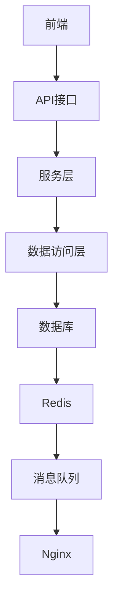

                 

### 技术管理转型：从开发者到领导者的蜕变

#### 关键词：技术管理、开发者、领导者、转型、管理技能

> 技术管理转型：从开发者到领导者的蜕变，探讨技术管理的基本概念、技术领导力的要素、项目管理原理、数据驱动决策、系统架构设计以及实战案例，为开发者提供一条清晰的成长路径。

### 引言

#### 1.1 技术管理转型的背景

在当今快速发展的技术时代，开发者面临的不仅是技术层面的挑战，还有如何从技术专家转变为技术管理者的考验。随着企业对技术复杂性和创新能力的需求不断增加，开发者需要具备更强的管理能力和战略眼光。技术管理转型不仅有助于个人职业发展，也为企业带来更高效、创新的技术解决方案。

#### 1.2 技术管理转型的重要性

技术管理转型对于开发者个人和企业发展具有重要意义。对于个人来说，转型能够提升职业竞争力，拓宽职业发展路径。对于企业来说，优秀的技术领导者能够带领团队实现技术突破，推动业务创新，提升企业整体竞争力。

#### 1.3 书籍结构安排

本书将从以下几个方面进行探讨：

1. **技术管理的基本概念**：介绍技术管理的核心概念、职责以及与传统开发工作的区别。
2. **技术领导力的要素**：阐述技术领导力的关键要素，包括沟通能力、团队管理能力、创新能力等。
3. **项目管理原理**：讲解项目管理的核心原则、方法论以及常见的问题解决策略。
4. **数据驱动决策**：介绍数据驱动决策的数学模型，包括回归分析、决策树等。
5. **系统架构设计**：讨论系统架构设计的原则、方法，并通过实例展示。
6. **实战案例**：选取实际项目案例，详细讲解从需求分析、设计到实现的整个流程。
7. **总结与展望**：总结全书内容，提出未来的发展方向和建议。

### 目录大纲设计思维步骤

#### 2.1 确定整体架构

首先，我们需要明确书籍的主题与核心内容。以《技术管理转型：从开发者到领导者的蜕变》为例，我们的目标是帮助开发者转型为技术领导者，涵盖转型过程中的关键知识点。整体架构应包括：

1. **引言**：介绍技术管理转型的背景、意义以及书籍结构安排。
2. **核心概念与联系**：阐述技术管理的基本概念、技术领导力的要素等。
3. **算法原理讲解**：介绍项目管理原理、数据驱动决策等。
4. **系统分析与架构设计方案**：讨论系统架构设计的原则、方法。
5. **项目实战**：通过实际案例展示转型过程。
6. **最佳实践与小结**：总结全书内容，提出未来发展建议。

#### 2.2 确定章节安排

接下来，我们需要详细规划每个章节的内容。以下是一个初步的章节安排：

1. **背景介绍**
   - **第1章：引言**
     - **1.1 技术管理转型的背景**
     - **1.2 技术管理转型的重要性**
     - **1.3 书籍结构安排**

2. **核心概念与联系**
   - **第2章：技术管理的基本概念**
     - **2.1 技术管理的定义与职责**
     - **2.2 技术管理与传统开发的区别**
     - **2.3 技术管理的挑战**
   - **第3章：技术领导力的要素**
     - **3.1 沟通能力**
     - **3.2 团队管理能力**
     - **3.3 创新能力**

3. **算法原理讲解**
   - **第4章：项目管理原理**
     - **4.1 项目管理的核心原则**
     - **4.2 项目管理方法论**
     - **4.3 项目管理常见问题及解决策略**
   - **第5章：数据驱动决策**
     - **5.1 数据驱动决策的基本概念**
     - **5.2 回归分析**
     - **5.3 决策树**

4. **系统分析与架构设计方案**
   - **第6章：系统架构设计**
     - **6.1 系统架构设计的原则**
     - **6.2 系统架构设计的方法**
     - **6.3 系统架构设计的实例分析**

5. **项目实战**
   - **第7章：实战案例**
     - **7.1 实战案例的选取**
     - **7.2 需求分析与设计**
     - **7.3 实现与测试**
     - **7.4 项目总结**

6. **最佳实践与小结**
   - **第8章：总结与展望**
     - **8.1 全书内容总结**
     - **8.2 技术管理转型的未来发展方向**
     - **8.3 阅读建议**

#### 2.3 确定每个章节的具体内容

接下来，我们将为每个章节细化具体内容。例如：

1. **第1章：引言**
   - **1.1 技术管理转型的背景**
     - **技术发展的趋势**
     - **企业对技术领导者的需求**
   - **1.2 技术管理转型的重要性**
     - **个人职业发展的需要**
     - **企业竞争力的提升**
   - **1.3 书籍结构安排**
     - **各章节的主要内容**

2. **第2章：技术管理的基本概念**
   - **2.1 技术管理的定义与职责**
     - **技术管理的定义**
     - **技术管理的职责**
   - **2.2 技术管理与传统开发的区别**
     - **工作内容的差异**
     - **思维方式的变化**
   - **2.3 技术管理的挑战**
     - **技能转型的挑战**
     - **管理经验积累的挑战**

通过以上步骤，我们构建了一个清晰、逻辑严密的书籍大纲，为后续的写作奠定了基础。

### 目录大纲设计思维步骤（续）

#### 2.4 确定目录大纲的层次结构

为了确保书籍的整体逻辑清晰，我们需要对目录大纲进行层次结构化。具体步骤如下：

1. **1级目录**：书籍整体结构，如“引言”、“技术管理的基本概念”等。
2. **2级目录**：每个章节的小节，如“技术管理的定义与职责”、“项目管理常见问题及解决策略”等。
3. **3级目录**：每个小节的具体内容，如“从软件 1.0 到软件 2.0 的演进”、“GPT系列模型”等。

例如，我们可以这样设计：

**1. 引言**
   - **1.1 技术管理转型的背景**
   - **1.2 技术管理转型的重要性**
   - **1.3 书籍结构安排**

**2. 核心概念与联系**
   - **2.1 技术管理的定义与职责**
   - **2.2 技术管理与传统开发的区别**
   - **2.3 技术管理的挑战**
   - **2.4 技术领导力的要素**
     - **2.4.1 沟通能力**
     - **2.4.2 团队管理能力**
     - **2.4.3 创新能力**

**3. 算法原理讲解**
   - **3.1 项目管理的核心原则**
   - **3.2 项目管理方法论**
   - **3.3 项目管理常见问题及解决策略**
   - **3.4 数据驱动决策**
     - **3.4.1 数据驱动决策的基本概念**
     - **3.4.2 回归分析**
     - **3.4.3 决策树**

**4. 系统分析与架构设计方案**
   - **4.1 系统架构设计的原则**
   - **4.2 系统架构设计的方法**
   - **4.3 系统架构设计的实例分析**

**5. 项目实战**
   - **5.1 实战案例的选取**
   - **5.2 需求分析与设计**
   - **5.3 实现与测试**
   - **5.4 项目总结**

**6. 最佳实践与小结**
   - **6.1 全书内容总结**
   - **6.2 技术管理转型的未来发展方向**
   - **6.3 阅读建议**

#### 2.5 审核与调整

在确定初步的目录大纲后，我们需要进行审核和调整。具体步骤如下：

1. **审核**：检查目录大纲的逻辑是否清晰，内容是否完整，确保每个章节都有明确的主题和相应的扩展内容。
2. **调整**：根据审核结果对目录大纲进行调整，确保每个章节的内容都符合书籍的主题和目标读者。

通过以上步骤，我们不仅确保了书籍的整体结构清晰，还使得每个章节的内容具有实际操作意义，有助于开发者实现技术管理转型。

### 总结

通过对技术管理转型从开发者到领导者的蜕变进行系统性的目录大纲设计思维步骤分析，我们明确了书籍的整体架构、章节安排、内容细化以及层次结构的确定方法。这一过程不仅有助于构建逻辑清晰、内容完整的书籍，也为开发者提供了清晰的成长路径。在接下来的章节中，我们将深入探讨技术管理的基本概念、技术领导力的要素、项目管理原理等，帮助开发者顺利完成从技术专家到技术领导者的蜕变。

---

### 让我们一起深入探讨技术管理的定义与职责

在技术管理转型过程中，首先需要明确技术管理的定义与职责。技术管理不仅仅是指管理技术本身，而是涉及到如何利用技术资源实现业务目标，如何引导团队协作，以及如何在复杂的技术环境中做出决策。接下来，我们将从以下几个方面详细探讨技术管理的定义、与传统开发的区别以及面临的挑战。

#### 1. 技术管理的定义

技术管理是一种综合性的管理职能，它包括规划、组织、领导和控制技术资源，以确保技术解决方案能够有效支持业务目标和战略。技术管理涉及多个方面，包括但不限于：

- **技术战略规划**：确定企业的技术发展方向，为业务增长提供技术支持。
- **团队管理**：构建和领导技术团队，提升团队协作效率。
- **项目管理**：确保技术项目按时、按质完成，管理项目风险。
- **技术风险管理**：识别和应对技术风险，确保技术解决方案的可靠性和稳定性。
- **持续改进**：通过技术迭代和优化，提升技术能力和业务价值。

#### 2. 技术管理与传统开发的区别

传统开发通常关注具体的编程任务和代码实现，其职责主要集中在以下几个方面：

- **编码与调试**：编写和维护代码，解决技术问题。
- **测试与部署**：执行单元测试、集成测试，确保软件质量，进行部署。
- **问题跟踪**：跟踪和解决技术故障。

而技术管理则更加宏观和综合，其职责包括但不限于：

- **战略规划**：从业务角度出发，制定技术发展策略。
- **团队领导**：培养和管理技术团队，提升整体技术水平。
- **资源协调**：合理配置和利用技术资源，确保项目顺利进行。
- **决策制定**：在复杂环境中做出技术决策，平衡业务需求和技术实现。

#### 3. 技术管理的挑战

技术管理面临的挑战是多方面的，以下是一些常见的挑战：

- **技术多样性与复杂性**：随着技术的快速发展，技术领域的多样性和复杂性不断增加，技术管理者需要具备广泛的技术知识和敏锐的洞察力。
- **项目管理难度**：技术项目往往涉及多个部门、多个技术栈，协调和沟通的难度较大，管理者需要具备良好的项目管理能力和沟通能力。
- **团队管理挑战**：技术团队成员往往具有独立思考和创新能力，管理者需要激发团队成员的潜力，同时维持团队的稳定和高效。
- **技术风险**：技术风险无处不在，管理者需要具备识别和应对技术风险的能力，确保技术解决方案的可靠性和稳定性。

#### 4. 技术管理的核心职责

技术管理的核心职责可以概括为以下几个方面：

- **战略规划**：明确技术发展方向，制定长期和短期的技术规划，确保技术发展与业务目标一致。
- **团队领导**：构建和领导技术团队，培养团队成员的技术能力，提升团队整体效率。
- **项目管理**：确保技术项目按时、按质完成，管理项目风险，优化项目流程。
- **资源协调**：合理配置和利用技术资源，确保项目有足够的人力、技术和资金支持。
- **持续改进**：通过技术迭代和优化，不断提升技术能力和业务价值。

#### 5. 技术管理能力模型

为了更好地进行技术管理，管理者需要具备以下几方面的能力：

- **技术能力**：深入了解技术领域，具备解决复杂技术问题的能力。
- **管理能力**：具备团队管理、项目管理、资源协调等管理技能。
- **沟通能力**：具备良好的沟通技巧，能够有效地与团队成员、业务部门以及其他部门进行沟通。
- **决策能力**：在复杂环境中做出明智的技术决策，平衡业务需求和技术实现。
- **领导力**：具备激励和引导团队的能力，能够带领团队实现技术突破。

#### 6. 跨部门协作与沟通

技术管理不仅仅是技术层面的工作，还需要与其他部门进行紧密的协作和沟通。以下是一些跨部门协作与沟通的关键点：

- **明确目标**：与业务部门明确项目目标，确保技术解决方案符合业务需求。
- **定期会议**：定期召开跨部门会议，讨论项目进展、技术难题和解决方案。
- **信息共享**：建立信息共享平台，及时传递项目进展、技术信息和需求变更。
- **沟通技巧**：提升沟通技巧，确保信息传达准确、及时，减少误解和冲突。

通过以上讨论，我们可以看到技术管理在定义、职责和挑战方面都具有其独特的特点。对于开发者来说，了解技术管理的定义和职责，有助于他们更好地定位自己的职业发展方向，提升自己的管理能力。在接下来的章节中，我们将继续探讨技术领导力的要素，为技术管理转型提供更全面的指导。

### 技术领导力的要素

在技术管理转型过程中，技术领导力是开发者从技术专家向技术领导者转变的关键要素。技术领导力不仅仅是指技术能力的提升，更包含了领导团队的素养和战略眼光。以下是技术领导力的几个关键要素：

#### 1. 沟通能力

沟通能力是技术领导者必备的素养之一。技术领导者需要具备清晰、有效的沟通技巧，能够与团队成员、业务部门和高层管理者进行有效沟通。具体来说，沟通能力包括以下几个方面：

- **表达清晰**：用简洁明了的语言表达技术观点和想法，避免使用过于专业或模糊的术语。
- **倾听理解**：倾听他人的意见和需求，理解不同部门和团队的立场和困难，以便做出更加全面的决策。
- **有效传达**：通过适当的沟通方式和工具，确保信息准确传达，避免误解和冲突。

#### 2. 团队管理能力

团队管理能力是技术领导力的核心要素之一。技术领导者需要能够构建和领导一个高效、协作的团队，激发团队成员的潜力，实现共同的目标。具体来说，团队管理能力包括以下几个方面：

- **激励团队**：通过激励措施，如奖励、表彰等，激发团队成员的积极性和创造力。
- **培养人才**：关注团队成员的成长，提供培训和发展的机会，提升团队整体技术能力。
- **冲突解决**：在团队内部出现矛盾和冲突时，能够及时进行调解，确保团队和谐、高效运转。
- **目标管理**：明确团队目标，制定合理的计划和策略，确保团队按照既定目标高效运作。

#### 3. 创新能力

创新能力是技术领导者的核心竞争力之一。在技术快速发展的今天，技术领导者需要具备前瞻性眼光和创新能力，引领团队不断探索新的技术方向和解决方案。具体来说，创新能力包括以下几个方面：

- **技术前瞻**：关注行业最新动态和技术趋势，对新兴技术保持敏感度，引领团队探索新的技术领域。
- **思维开放**：鼓励团队成员提出新的想法和解决方案，营造创新的文化氛围。
- **试验精神**：在适当的风险范围内，进行技术实验和尝试，不断优化和改进技术方案。
- **持续学习**：不断提升自己的技术知识和视野，通过学习新知识、新技能来推动技术创新。

#### 4. 决策能力

决策能力是技术领导者必须具备的重要能力。技术领导者需要在复杂的环境中做出明智的决策，确保技术项目的顺利进行。具体来说，决策能力包括以下几个方面：

- **数据驱动**：在做出决策时，充分考虑数据和分析结果，避免凭直觉和经验进行决策。
- **风险评估**：在决策过程中，评估潜在的风险和收益，确保决策具有可行性和风险可控性。
- **快速响应**：在面对突发情况时，能够迅速做出反应，调整策略和资源分配。
- **平衡多方**：在决策时，平衡不同利益相关者的需求和期望，确保决策的公正性和公平性。

#### 5. 价值观和领导风格

价值观和领导风格是技术领导者的重要特质，直接影响团队的凝聚力和工作氛围。技术领导者需要具备以下价值观和领导风格：

- **正直诚信**：诚实守信，以身作则，树立良好的榜样。
- **开放包容**：鼓励团队成员表达不同的观点和意见，营造开放、包容的工作环境。
- **长远眼光**：注重长期发展，考虑企业和社会的长远利益。
- **民主参与**：在决策过程中，鼓励团队成员参与讨论，共同制定决策。

#### 6. 自我管理能力

自我管理能力是技术领导者必须具备的基本能力。技术领导者需要能够有效管理自己的时间、情绪和压力，保持良好的工作状态。具体来说，自我管理能力包括以下几个方面：

- **时间管理**：合理安排工作和休息时间，确保高效工作。
- **情绪管理**：保持积极乐观的心态，面对挑战和压力时能够保持冷静。
- **持续学习**：不断学习新知识和技能，提升自己的专业能力和领导力。

通过提升以上几个方面的能力，技术领导者不仅能够更好地管理团队，推动技术创新，还能为企业的长期发展提供强有力的支持。在接下来的章节中，我们将继续探讨项目管理原理，帮助开发者更好地理解和应用技术领导力。

### 项目管理原理

在技术管理转型过程中，项目管理是技术领导者不可或缺的核心能力之一。有效的项目管理不仅能够确保技术项目的成功实施，还能提高团队的工作效率，确保资源的合理利用。接下来，我们将深入探讨项目管理的核心原则、方法论以及常见问题及解决策略。

#### 1. 项目管理的核心原则

项目管理遵循一些基本的原则，这些原则是确保项目成功实施的基础：

- **目标明确**：项目启动之初，必须明确项目的目标、范围和预期成果，确保所有团队成员对项目目标有清晰的认识。
- **计划先行**：制定详细的项目计划，包括任务分配、时间表、资源需求等，为项目实施提供明确的指导。
- **进度控制**：通过监控项目进度，及时发现并解决问题，确保项目按计划进行。
- **质量控制**：确保项目输出符合预期的质量和标准，通过质量控制和测试来保障项目的可靠性。
- **风险管理**：识别和评估项目风险，制定相应的风险应对策略，确保项目在风险可控的范围内进行。
- **团队协作**：建立有效的沟通和协作机制，确保团队成员之间的信息畅通，共同推进项目进展。

#### 2. 项目管理方法论

项目管理方法论是指导项目实施的具体方法和步骤。以下是一些常用的项目管理方法论：

- **敏捷开发**：敏捷开发强调快速迭代和灵活性，通过持续交付小批量、可工作的软件版本来满足用户需求。
- **Scrum**：Scrum是一种迭代式增量的项目管理方法，强调团队自组织、透明度、简洁性和可持续的发展。
- **Kanban**：Kanban基于可视化的工作流管理，通过限制在流程中的工作内容数量来提高工作效率。
- **Waterfall**：Waterfall是一种线性顺序的开发方法，每个阶段完成后才进入下一个阶段，适用于需求明确、变化较小的项目。
- **六西格玛**：六西格玛通过减少过程中的变异，提高过程能力，实现更高的质量标准。

每种方法论都有其适用的场景和优点，技术领导者需要根据项目特点和需求选择合适的方法。

#### 3. 项目管理常见问题及解决策略

在实际项目管理过程中，常常会遇到各种问题，以下是一些常见问题及解决策略：

- **需求变更**：需求变更在项目实施过程中是不可避免的。解决策略包括：及时沟通，获取变更的理由和优先级；评估变更对项目的影响；与相关方协商，决定是否接受变更。
- **进度延误**：进度延误可能是由于需求变更、资源不足、技术难题等原因造成的。解决策略包括：重新评估项目计划，调整任务优先级；优化资源分配，提高团队工作效率；寻求外部支持，如增加人员或外包部分工作。
- **沟通不畅**：沟通不畅会导致误解和冲突，影响项目进展。解决策略包括：建立明确的沟通机制，如定期会议、信息共享平台等；提高沟通技巧，确保信息传达准确、及时；鼓励团队成员积极参与沟通。
- **团队协作问题**：团队协作问题可能导致任务延误和质量下降。解决策略包括：明确团队成员的角色和职责，确保任务分配合理；建立团队信任，营造积极的工作氛围；提供培训和指导，提升团队协作能力。
- **风险管理不足**：风险管理不足可能导致项目失败。解决策略包括：识别和评估项目风险，制定相应的风险应对策略；定期审查风险，及时调整风险管理计划；建立风险管理文化，提高团队的风险意识。

通过以上解决策略，技术领导者可以有效应对项目管理中的各种挑战，确保项目顺利进行。

#### 4. 项目的质量保障

项目质量是项目成功的关键因素之一。以下是一些保障项目质量的策略：

- **需求管理**：明确并管理项目需求，确保需求文档的完整性和准确性，减少需求变更。
- **测试与验证**：通过单元测试、集成测试、系统测试等多种测试方法，确保软件质量。
- **代码审查**：定期进行代码审查，识别潜在的问题和改进点，提高代码质量。
- **持续集成**：通过持续集成工具，自动化测试和构建过程，确保代码质量和交付效率。
- **文档管理**：及时更新和维护项目文档，确保项目过程和成果的可追溯性。

#### 5. 项目总结与反馈

项目完成后，进行总结和反馈是非常重要的。通过总结和反馈，可以识别项目中的成功经验和教训，为未来的项目提供借鉴。以下是一些总结和反馈的策略：

- **项目回顾**：组织项目团队进行回顾会议，讨论项目过程中的得失，总结经验教训。
- **绩效评估**：评估团队成员的表现，给予表彰和奖励，鼓励优秀表现。
- **文档整理**：整理项目文档，包括项目计划、进度报告、测试结果等，为未来的项目提供参考。
- **持续改进**：根据总结的经验教训，优化项目管理流程，提升项目管理能力。

通过以上方法，技术领导者可以确保项目的高效实施和成功交付，同时不断提升团队的项目管理能力。

### 数据驱动决策

在技术管理转型过程中，数据驱动决策是一种重要的管理方式。数据驱动决策通过收集、分析和利用数据，帮助管理者做出更加科学和准确的决策。接下来，我们将详细探讨数据驱动决策的基本概念、回归分析和决策树等常用模型。

#### 1. 数据驱动决策的基本概念

数据驱动决策是一种基于数据的决策方法，其核心思想是通过数据分析和挖掘，发现数据中的模式和规律，从而为决策提供依据。数据驱动决策的关键步骤包括：

- **数据收集**：收集与决策相关的数据，包括内部数据和外部数据。
- **数据清洗**：对收集到的数据进行清洗，处理缺失值、异常值等。
- **数据分析**：运用统计学和数据分析方法，对清洗后的数据进行探索性分析，提取有用的信息。
- **决策制定**：基于数据分析结果，制定相应的决策方案。

数据驱动决策的优势在于：

- **客观性**：通过数据分析，减少主观判断的干扰，提高决策的客观性。
- **科学性**：基于数据分析和统计模型，提高决策的科学性和准确性。
- **实时性**：通过实时数据收集和分析，及时调整决策方案，应对动态变化。

#### 2. 回归分析

回归分析是一种常用的数据分析方法，用于研究因变量和自变量之间的关系。在技术管理中，回归分析可以用于预测未来趋势、评估影响因素等。常见的回归分析方法包括线性回归、多项式回归和逻辑回归等。

- **线性回归**：线性回归假设因变量和自变量之间呈线性关系，通过拟合直线模型，预测因变量的值。线性回归模型的基本形式为：
  \[
  Y = \beta_0 + \beta_1X + \epsilon
  \]
  其中，\(Y\) 是因变量，\(X\) 是自变量，\(\beta_0\) 和 \(\beta_1\) 是模型的参数，\(\epsilon\) 是误差项。

- **多项式回归**：多项式回归扩展了线性回归，允许自变量和因变量之间的关系呈多项式形式。多项式回归模型的一般形式为：
  \[
  Y = \beta_0 + \beta_1X^1 + \beta_2X^2 + ... + \beta_nX^n + \epsilon
  \]

- **逻辑回归**：逻辑回归用于分类问题，通过拟合逻辑函数，将自变量的值映射到概率范围。逻辑回归模型的一般形式为：
  \[
  \ln\left(\frac{P(Y=1)}{1-P(Y=1)}\right) = \beta_0 + \beta_1X_1 + \beta_2X_2 + ... + \beta_nX_n
  \]
  其中，\(P(Y=1)\) 是因变量为 1 的概率。

回归分析在技术管理中的应用包括：

- **需求预测**：通过分析历史数据，预测未来产品的市场需求。
- **风险评估**：通过分析影响因素，评估项目风险的概率和影响。
- **绩效评估**：通过分析关键绩效指标，评估团队成员的工作表现。

#### 3. 决策树

决策树是一种基于树形结构的数据分析方法，用于分类和回归问题。决策树通过一系列的判断节点和分支，将数据划分为不同的类别或预测值。

- **分类决策树**：分类决策树用于将数据划分为不同的类别。决策树的生成过程包括：

  - **根节点**：将所有数据作为根节点。
  - **判断节点**：选择一个特征作为判断依据，根据该特征的取值将数据划分为子节点。
  - **叶节点**：当无法再继续划分时，达到叶节点，将数据划分为不同的类别。

- **回归决策树**：回归决策树用于预测连续值。回归决策树的生成过程与分类决策树类似，但叶节点处的预测值是基于特征的平均值或其他统计方法计算得到的。

决策树在技术管理中的应用包括：

- **需求分类**：根据历史数据，将不同类型的需求进行分类，帮助资源分配和优先级管理。
- **风险评估**：通过分析风险因素，构建风险决策树，帮助识别和应对潜在风险。
- **绩效评估**：通过分析团队成员的特征和行为，构建绩效决策树，评估团队成员的工作表现。

#### 4. 数据驱动决策的优势和应用

数据驱动决策相比传统的主观判断方法，具有以下优势：

- **客观性**：通过数据分析，减少主观判断的干扰，提高决策的客观性。
- **准确性**：基于数据模型和算法，提高决策的准确性和可靠性。
- **实时性**：通过实时数据收集和分析，及时调整决策方案，应对动态变化。

数据驱动决策在技术管理中的应用场景包括：

- **产品规划**：通过分析市场需求和用户反馈，优化产品规划和设计。
- **资源管理**：通过分析项目进度和资源使用情况，优化资源分配和调度。
- **风险管理**：通过分析风险因素和概率，制定相应的风险应对策略。
- **绩效评估**：通过分析关键绩效指标，评估团队成员的工作表现和贡献。

通过数据驱动决策，技术领导者可以更加科学和准确地管理项目，提高团队效率和项目成功率。

### 系统架构设计

在技术管理转型过程中，系统架构设计是技术领导者必须掌握的重要技能之一。系统架构设计不仅决定了系统的性能、可扩展性和可靠性，还直接影响项目的开发和维护成本。下面，我们将详细讨论系统架构设计的原则、方法以及实例分析，帮助开发者更好地理解和应用系统架构设计。

#### 1. 系统架构设计的原则

系统架构设计遵循一些基本原则，以确保系统的高效性和稳定性。以下是一些核心原则：

- **模块化**：将系统划分为多个模块，每个模块具有独立的功能和职责，模块之间通过接口进行通信。模块化设计可以提高系统的可维护性和可扩展性。
- **分层设计**：将系统划分为多个层次，每个层次负责不同的功能。常见的层次包括表示层、业务逻辑层和数据访问层。分层设计有助于明确各层的职责，降低系统的复杂度。
- **解耦**：通过减少模块之间的依赖关系，提高系统的灵活性和可扩展性。解耦可以通过定义清晰的接口和减少直接依赖来实现。
- **冗余和容错**：设计冗余和容错机制，确保系统在部分组件失败时仍能正常运行。冗余可以通过备份和冗余数据存储来实现，容错可以通过故障检测和恢复机制来实现。
- **高性能**：优化系统架构，提高系统的响应速度和处理能力。高性能可以通过缓存、负载均衡和优化数据库查询来实现。
- **可扩展性**：设计具有良好可扩展性的系统架构，能够方便地添加新的功能和组件。可扩展性可以通过微服务架构、分布式系统设计等方法来实现。

#### 2. 系统架构设计的方法

系统架构设计方法是指用于设计和实现系统架构的具体方法和步骤。以下是一些常用的系统架构设计方法：

- **顶层设计**：首先确定系统的整体架构，包括系统的功能模块、数据流和接口等。顶层设计为后续的详细设计提供指导。
- **需求分析**：深入了解系统的需求，包括功能需求、性能需求、安全需求等。需求分析是系统架构设计的基础。
- **技术选型**：根据需求分析结果，选择合适的技术栈和架构组件。技术选型需要考虑系统的性能、可扩展性、安全性等因素。
- **架构评审**：组织架构评审会议，评审系统架构的合理性、可行性和性能。架构评审有助于发现潜在的问题和改进点。
- **详细设计**：根据顶层设计和技术选型结果，详细设计系统的各个模块和组件。详细设计包括模块功能、接口定义、数据结构等。
- **实施与部署**：根据详细设计结果，实施和部署系统架构。实施与部署包括代码编写、测试、部署等环节。
- **运维监控**：建立系统运维和监控机制，确保系统的稳定运行和高效运维。

#### 3. 系统架构设计的实例分析

以下是一个简单的电子商务系统架构设计的实例分析：

**需求分析**：
- **功能需求**：商品展示、购物车、订单管理、支付处理、用户评论等。
- **性能需求**：高并发访问能力，快速响应时间，高可用性。
- **安全需求**：数据安全，用户隐私保护，防欺诈。

**技术选型**：
- **后端框架**：Spring Boot
- **数据库**：MySQL
- **缓存**：Redis
- **消息队列**：RabbitMQ
- **前端框架**：Vue.js

**系统架构设计**：

1. **表示层**：
   - 前端：使用 Vue.js 开发，实现商品展示、购物车、订单管理等功能。
   - API 接口：提供 RESTful API 接口，供前端调用。

2. **业务逻辑层**：
   - 服务层：使用 Spring Boot 搭建，实现业务逻辑处理，如订单生成、支付处理等。
   - 数据访问层：使用 JDBC 访问 MySQL 数据库，实现数据的增删改查。

3. **数据存储层**：
   - 数据库：MySQL 用于存储用户数据、商品数据、订单数据等。
   - Redis：用于缓存用户会话信息、商品信息等，提高系统性能。

4. **消息队列**：
   - RabbitMQ：用于实现订单消息的异步处理，如订单生成、支付通知等。

5. **其他组件**：
   - 缓存：Redis 用于缓存热门商品、用户购物车等信息。
   - 负载均衡：Nginx 用于负载均衡，提高系统并发处理能力。

**架构图**：

通过以上实例分析，我们可以看到系统架构设计需要综合考虑需求分析、技术选型、模块划分和组件配置等多个方面。良好的系统架构设计不仅能够提高系统的性能和稳定性，还能降低开发和维护成本，为企业的长远发展提供支持。

### 实战案例

为了更好地理解技术管理转型过程中从需求分析到项目实现的整个流程，下面我们将通过一个实际项目案例来进行详细讲解。

#### 项目背景

假设我们正在开发一款企业级客户关系管理（CRM）系统。该系统的目标是帮助公司提高销售团队的工作效率，通过集成销售线索管理、客户信息管理、销售过程监控等功能，实现客户关系管理的智能化。

#### 需求分析

在项目启动阶段，我们首先进行了详细的需求分析。需求分析主要包括以下内容：

- **功能需求**：
  - 销售线索管理：包括线索录入、分类、跟踪和分配。
  - 客户信息管理：包括客户资料录入、修改、查询和删除。
  - 销售过程监控：包括销售进度跟踪、业绩评估、销售预测等。
  - 集成通讯工具：集成企业邮箱、即时通讯工具等，方便销售团队与客户沟通。
- **性能需求**：
  - 高并发处理能力：系统需支持成千上万的并发用户。
  - 快速响应时间：用户操作的响应时间需控制在1秒以内。
  - 数据安全：确保用户数据和公司数据的安全，防止数据泄露。
- **安全需求**：
  - 用户身份验证：确保系统访问的安全性，通过用户名和密码进行验证。
  - 数据加密：对敏感数据进行加密存储，防止数据泄露。

#### 设计方案

在需求分析完成后，我们进行了系统设计。设计方案主要包括以下内容：

- **系统架构设计**：
  - **前端**：使用 React.js 开发，实现用户界面和交互。
  - **后端**：使用 Spring Boot 进行开发，实现业务逻辑处理和数据访问。
  - **数据库**：使用 MySQL 作为数据存储，使用 Redis 进行缓存。
  - **消息队列**：使用 RabbitMQ 实现消息传递，提高系统性能和可靠性。
- **功能模块设计**：
  - **销售线索管理模块**：包括线索录入、分类、跟踪和分配功能。
  - **客户信息管理模块**：包括客户资料录入、修改、查询和删除功能。
  - **销售过程监控模块**：包括销售进度跟踪、业绩评估、销售预测等功能。
  - **集成通讯工具模块**：集成企业邮箱、即时通讯工具等，实现与客户的实时沟通。

#### 实现与测试

在系统设计完成后，我们开始进行系统实现。实现过程主要包括以下步骤：

- **前端开发**：使用 React.js 进行前端开发，实现用户界面和交互功能。
- **后端开发**：使用 Spring Boot 进行后端开发，实现业务逻辑处理和数据访问。
- **数据库设计**：设计 MySQL 数据库，创建表结构，定义字段和关系。
- **消息队列集成**：使用 RabbitMQ 集成消息队列，实现异步任务处理。

在开发过程中，我们进行了多次单元测试和集成测试，确保每个模块的功能正确，并且模块之间能够正常通信。测试过程中，我们发现了一些潜在的问题，如数据一致性问题、性能瓶颈等，并及时进行了修复。

#### 项目部署

在系统开发完成后，我们进行了项目部署。部署过程主要包括以下步骤：

- **环境配置**：配置服务器环境，安装和配置所需的软件和依赖。
- **数据库迁移**：将开发环境中的数据迁移到生产环境，确保数据一致。
- **系统部署**：将前端和后端代码部署到服务器，启动应用程序。
- **监控和运维**：部署监控工具，监控系统的运行状态，确保系统的稳定运行。

#### 项目总结

通过这个CRM系统的开发，我们学到了很多关于技术管理转型的经验和教训：

- **需求分析至关重要**：详细的需求分析能够确保项目的成功，避免后期出现功能缺失或需求变更。
- **良好的沟通和协作**：在项目开发过程中，团队成员之间的沟通和协作非常重要，能够提高开发效率和项目质量。
- **持续集成和测试**：通过持续集成和测试，可以及时发现和修复问题，确保项目的质量和稳定性。
- **性能优化和监控**：在项目上线后，对系统进行性能优化和监控，确保系统的高效运行和稳定可靠。
- **团队学习和成长**：通过实际项目的开发，团队成员能够不断提升技能和经验，为未来的项目提供更好的支持。

通过这个实战案例，我们可以看到从需求分析到项目实现的整个流程，以及如何通过技术管理的方法和技能，确保项目的成功。这对于开发者来说，是一个宝贵的学习和实践经验。

### 总结与展望

在《技术管理转型：从开发者到领导者的蜕变》一书中，我们系统地探讨了技术管理的基本概念、技术领导力的要素、项目管理原理、数据驱动决策、系统架构设计以及实战案例。通过这些内容，开发者可以了解到如何从技术专家转型为技术领导者，提升自身的管理能力和战略眼光。

#### 1. 全书内容总结

本书的核心内容包括：

- **技术管理的定义与职责**：介绍了技术管理的基本概念，包括技术战略规划、团队管理、项目管理和技术风险管理等。
- **技术领导力的要素**：探讨了技术领导者应具备的沟通能力、团队管理能力、创新能力和决策能力等。
- **项目管理原理**：讲解了项目管理的核心原则、方法论和常见问题及解决策略。
- **数据驱动决策**：介绍了数据驱动决策的基本概念、回归分析和决策树等模型。
- **系统架构设计**：讨论了系统架构设计的原则、方法以及实例分析。
- **实战案例**：通过实际项目案例，详细讲解了从需求分析、设计到实现的整个流程。

这些内容共同构成了技术管理转型的完整知识体系，为开发者提供了明确的成长路径。

#### 2. 技术管理转型的未来发展方向

随着技术的发展和商业环境的变化，技术管理转型将继续面临新的挑战和机遇。未来的发展方向包括：

- **敏捷管理**：敏捷管理将更加普及，通过快速迭代和持续交付，提高项目的灵活性和响应速度。
- **数字化转型**：企业将进一步推进数字化转型，技术领导者需具备数据分析和数字化战略规划能力。
- **云计算与大数据**：云计算和大数据技术将得到更广泛的应用，技术领导者需掌握相关的技术和管理技能。
- **人工智能与机器学习**：人工智能和机器学习将在各个行业得到深入应用，技术领导者需具备相关的技术和管理能力。

#### 3. 阅读建议

为了更好地吸收和应用书中的知识，以下是一些建议：

- **实践与应用**：将书中所学知识与实际工作相结合，通过实践来巩固和提升自己的能力。
- **持续学习**：技术领域不断发展，技术领导者需持续学习新知识、新技术，保持竞争力。
- **团队合作**：提升团队管理能力，建立良好的团队协作和沟通机制，共同推动项目成功。
- **案例分析**：通过分析和学习实际案例，深入理解技术管理转型的具体实践和方法。

通过以上方法，开发者可以更好地实现技术管理转型，成为一名优秀的技术领导者。

### 作者信息

**作者：AI天才研究院/AI Genius Institute & 禅与计算机程序设计艺术 /Zen And The Art of Computer Programming**

AI天才研究院致力于推动人工智能技术的发展和应用，通过深入研究和技术创新，为行业带来新的突破。禅与计算机程序设计艺术则强调编程中的哲学思维，通过结合禅宗智慧，提高程序员的编程素养和创新能力。两位作者凭借丰富的经验和深厚的学识，为读者提供了这本具有深度和实用性的技术管理转型指南。

---

本文详细探讨了从开发者到技术领导者转型的各个方面，包括技术管理的定义与职责、技术领导力的要素、项目管理原理、数据驱动决策、系统架构设计以及实战案例。通过本书，开发者可以系统地掌握技术管理转型的知识，提升自身的管理能力和战略眼光。希望本文能为您的职业发展提供有益的指导。感谢您的阅读！

