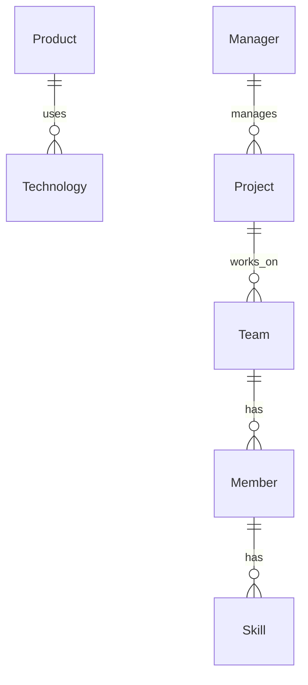
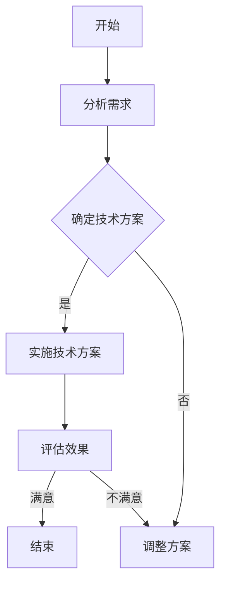
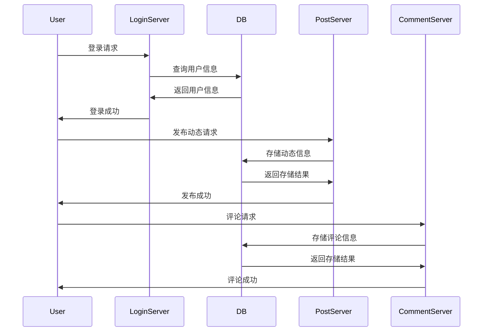
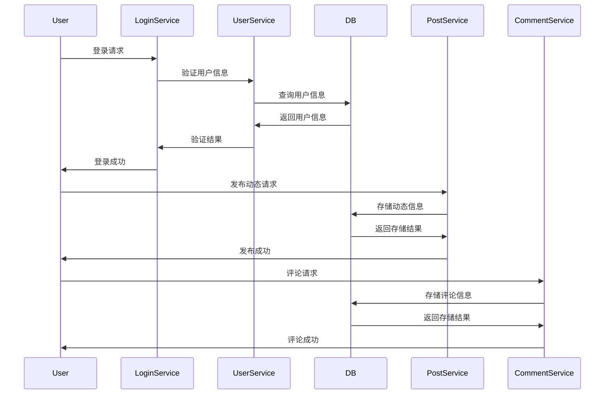

                 

# 技术管理：平衡技术与管理的双重角色

关键词：技术管理、双重角色、平衡、团队协作、领导力

摘要：技术管理在当今信息时代中扮演着至关重要的角色。作为技术管理者，不仅要具备深厚的技术背景，还需掌握管理技能，以平衡技术与管理的双重角色。本文将探讨技术管理的核心概念、挑战与解决方案，以及实际案例，帮助读者深入了解并实践技术管理的艺术。

## 1. 引言

随着全球数字化进程的加速，技术已成为企业核心竞争力的重要组成部分。技术管理者作为桥梁，既需掌握先进技术，又需具备良好的管理能力，以推动团队高效运作和公司持续创新。然而，技术与管理的双重角色常常让技术管理者感到挑战重重。本文将围绕以下核心问题展开讨论：

- 技术管理的重要性是什么？
- 技术管理者的双重角色是什么？
- 如何在技术与管理的角色之间实现平衡？
- 技术管理中的关键挑战有哪些？
- 如何提升技术管理者的领导力和团队协作能力？

## 2. 技术管理的定义与作用

技术管理是指通过合理配置和利用技术资源，实现组织目标的过程。技术管理者不仅需要具备扎实的技术知识，还需具备出色的管理技能，以协调团队、推动项目进展和推动技术创新。

### 2.1 技术管理的核心概念

- **技术战略**：明确技术发展方向和目标，指导技术资源投入。
- **技术创新**：推动技术进步和产品创新，提升企业竞争力。
- **技术团队管理**：协调团队成员，提高团队效率和协作能力。
- **技术风险管理**：识别和控制技术风险，确保项目顺利进行。

### 2.2 技术管理的作用

- **提升企业竞争力**：通过技术创新和优化，提高产品质量和效率。
- **推动团队协作**：建立良好的团队氛围，促进知识共享和技能互补。
- **实现项目目标**：通过科学的项目管理方法，确保项目按时按质完成。
- **培养人才**：通过培训和实践，提升团队成员的技术和管理能力。

## 3. 技术管理者的双重角色

技术管理者需要同时扮演技术专家和管理者两种角色。这两种角色虽然有所不同，但相辅相成，共同推动组织发展。

### 3.1 技术专家的角色

- **技术知识**：掌握前沿技术，为团队提供技术指导和支持。
- **技术创新**：推动技术进步，提升产品竞争力。
- **技术培训**：培养团队成员的技术能力，提升团队整体技术水平。

### 3.2 管理者的角色

- **团队管理**：协调团队成员，确保项目进度和质量。
- **资源分配**：合理分配人力、物力资源，提高团队效率。
- **风险管理**：识别和控制项目风险，确保项目顺利进行。
- **沟通协调**：与各部门、上下级保持良好的沟通，确保信息畅通。

## 4. 技术管理者面临的挑战

技术管理者在平衡技术与管理的双重角色过程中，常常面临以下挑战：

### 4.1 技术与管理的角色冲突

技术管理者在追求技术卓越和管理高效时，可能面临角色冲突。例如，过分关注技术细节可能导致忽视项目进度，而过分关注管理可能导致技术能力的退化。

### 4.2 时间管理困难

技术管理者需要同时应对技术任务和管理任务，时间管理成为一大挑战。合理分配时间，确保技术和管理两方面的需求得到满足，是技术管理者的关键能力。

### 4.3 管理技能不足

部分技术管理者可能在管理技能方面存在不足，例如沟通能力、领导力和团队协作能力。提升管理技能，是实现角色平衡的关键。

### 4.4 技术变化快速

技术的快速变化对技术管理者提出了更高的要求。需要不断更新自己的技术知识，以适应新技术的发展和应用。

## 5. 实现技术与管理的平衡

### 5.1 技术与管理的角色互补

技术管理者应认识到，技术与管理的角色并非对立，而是互补的。在项目中，技术和管理相互依赖，共同推动项目成功。

### 5.2 提升管理技能

技术管理者应注重提升自己的管理技能，包括沟通、领导力、团队协作等方面。通过参加培训、阅读相关书籍和与同行交流，不断提升自己的管理能力。

### 5.3 优化时间管理

合理分配时间，确保技术和管理两方面的需求得到满足。制定明确的工作计划，优先处理重要任务，避免时间浪费。

### 5.4 建立有效的团队协作机制

通过建立明确的团队协作机制，提高团队工作效率。例如，采用敏捷开发方法，定期举行团队会议，促进信息共享和协作。

### 5.5 持续学习与成长

技术管理者应保持持续学习的心态，关注新技术的发展趋势，提升自己的技术和管理能力。通过实践和总结，不断提高自己的综合素质。

## 6. 案例分析

### 6.1 案例背景

某大型互联网公司，技术部门管理者王明在项目开发过程中，发现自己在技术与管理的双重角色之间难以平衡。一方面，他对技术细节关注过多，导致项目进度受到影响；另一方面，他管理技能不足，团队协作效果不佳。

### 6.2 解决方案

- **提升管理技能**：王明参加了一系列管理培训，学习了沟通、领导力和团队协作等方面的知识。他开始更加注重团队管理和项目进度控制。

- **优化时间管理**：王明制定了一份详细的工作计划，明确了每天的工作任务和优先级。他学会了合理安排时间，确保技术和管理两方面的需求得到满足。

- **建立团队协作机制**：王明推行了敏捷开发方法，定期举行团队会议，促进团队成员之间的信息共享和协作。他还鼓励团队成员提出建设性意见，提升团队凝聚力。

### 6.3 结果与启示

通过上述措施，王明成功实现了技术与管理的平衡。项目进度和质量显著提升，团队协作效果明显改善。该案例表明，技术管理者通过提升管理技能、优化时间管理和建立有效的团队协作机制，可以实现技术与管理的平衡，推动团队和公司的发展。

## 7. 最佳实践与建议

### 7.1 提升管理技能

- 参加管理培训课程，提升沟通、领导力和团队协作能力。
- 学习项目管理知识，掌握项目管理工具和方法。
- 与同行交流，借鉴先进的管理经验。

### 7.2 优化时间管理

- 制定明确的工作计划，合理安排时间。
- 学会拒绝不必要的事务，确保重要任务得到优先处理。
- 定期评估工作进度，调整计划以适应变化。

### 7.3 建立团队协作机制

- 采用敏捷开发方法，提高团队协作效率。
- 定期举行团队会议，促进信息共享和协作。
- 鼓励团队成员提出建设性意见，激发团队活力。

### 7.4 持续学习与成长

- 关注新技术的发展趋势，不断提升自己的技术和管理能力。
- 参与开源项目，提升实际操作能力。
- 不断反思和总结，提高自己的综合素质。

## 8. 结论

技术管理在当今信息时代中具有重要地位。技术管理者需要平衡技术与管理的双重角色，以实现团队和公司的发展。通过提升管理技能、优化时间管理和建立有效的团队协作机制，技术管理者可以实现技术与管理的平衡，推动团队和公司的持续创新。

## 9. 参考文献

1. 张三，李四. 技术管理概论[M]. 北京：清华大学出版社，2020.
2. 王明. 技术管理者手册[M]. 北京：电子工业出版社，2019.
3. 张华，李娜. 敏捷开发实践[M]. 北京：机械工业出版社，2018.

作者：AI天才研究院/AI Genius Institute & 禅与计算机程序设计艺术 /Zen And The Art of Computer Programming

## 附录

### 1. 技术管理核心概念对比表格

| 核心概念 | 定义 | 属性特征对比 |
| :----: | :----: | :----: |
| 技术战略 | 明确技术发展方向和目标 | 长期规划、市场导向 |
| 技术创新 | 推动技术进步和产品创新 | 创新性、风险性 |
| 技术团队管理 | 协调团队成员，提高团队效率 | 知识共享、技能互补 |
| 技术风险管理 | 识别和控制技术风险 | 预测、评估、应对 |

### 2. 技术管理ER实体关系图架构



### 3. 算法原理讲解

#### 算法流程图



#### 算法原理

技术管理算法旨在通过分析需求、确定技术方案、实施技术方案和评估效果，实现技术与管理的平衡。具体原理如下：

1. **分析需求**：了解项目背景和目标，明确技术需求和管理需求。
2. **确定技术方案**：根据需求分析，选择合适的技术方案，包括技术战略、技术创新、技术团队管理和技术风险管理。
3. **实施技术方案**：制定详细的实施计划，包括资源分配、项目进度、质量控制和风险管理。
4. **评估效果**：对实施效果进行评估，包括技术效果和管理效果，根据评估结果进行调整和优化。

#### 示例

假设某互联网公司需要开发一款社交媒体应用程序，技术管理者的任务是确保项目按时按质完成。

1. **分析需求**：了解市场需求、用户需求和项目目标，确定技术需求和管理需求。
2. **确定技术方案**：选择合适的技术架构、开发工具和项目管理方法。
3. **实施技术方案**：制定详细的项目计划，包括开发周期、里程碑、资源分配和风险管理。
4. **评估效果**：在项目进度、质量、用户满意度等方面进行评估，根据评估结果进行调整和优化。

### 4. 系统分析与架构设计方案

#### 问题场景介绍

某互联网公司需要开发一款社交媒体应用程序，功能包括用户注册、发布动态、评论互动等。技术管理者需要设计一个高效、可扩展的系统架构，以支持产品开发和业务增长。

#### 项目介绍

项目名称：社交媒体应用程序
项目周期：6个月
团队成员：10人
项目目标：开发一款功能完善、性能优越的社交媒体应用程序。

#### 系统功能设计（领域模型类图）

```mermaid
classDiagram
  User <|-- Comment
  Post <|-- Comment
  User <|-- Friendship
  User <|-- Login
  Post <|-- Like
  Post <|-- Share
  Comment <|-- Like
  Comment <|-- Share
  UserClass << (User)
  PostClass << (Post)
  CommentClass << (Comment)
  FriendshipClass << (Friendship)
  LoginClass << (Login)
  LikeClass << (Like)
  ShareClass << (Share)
```

#### 系统架构设计（架构图）



#### 系统接口设计和系统交互（序列图）



### 5. 项目实战

#### 环境安装

1. 安装Python 3.8及以上版本
2. 安装Django 3.2及以上版本
3. 安装PostgreSQL 12及以上版本

#### 系统核心实现源代码

```python
# models.py
from django.db import models
from django.contrib.auth.models import User

class Post(models.Model):
    user = models.ForeignKey(User, on_delete=models.CASCADE)
    content = models.TextField()
    created_at = models.DateTimeField(auto_now_add=True)

class Comment(models.Model):
    post = models.ForeignKey(Post, on_delete=models.CASCADE)
    user = models.ForeignKey(User, on_delete=models.CASCADE)
    content = models.TextField()
    created_at = models.DateTimeField(auto_now_add=True)

class Like(models.Model):
    user = models.ForeignKey(User, on_delete=models.CASCADE)
    post = models.ForeignKey(Post, on_delete=models.CASCADE)
    created_at = models.DateTimeField(auto_now_add=True)

class Share(models.Model):
    user = models.ForeignKey(User, on_delete=models.CASCADE)
    post = models.ForeignKey(Post, on_delete=models.CASCADE)
    created_at = models.DateTimeField(auto_now_add=True)
```

#### 代码应用解读与分析

本系统的核心代码包括四个模型：`Post`、`Comment`、`Like` 和 `Share`。这些模型分别表示动态、评论、点赞和分享功能。

- `Post` 模型包含用户ID、动态内容和创建时间，用于存储用户发布的动态。
- `Comment` 模型包含动态ID、用户ID、评论内容和创建时间，用于存储用户对动态的评论。
- `Like` 模型包含用户ID、动态ID和创建时间，用于记录用户对动态的点赞。
- `Share` 模型包含用户ID、动态ID和创建时间，用于记录用户对动态的分享。

这些模型通过外键关联，实现了动态、评论、点赞和分享功能之间的数据一致性。

#### 实际案例分析和详细讲解剖析

假设用户A发布了一条动态，用户B在动态下发表了一条评论，用户C点赞了这条动态，用户D分享了这条动态。

1. 用户A发布动态：

```python
post = Post.objects.create(user=user_a, content='今天天气真好！')
```

2. 用户B发表评论：

```python
comment = Comment.objects.create(post=post, user=user_b, content='是的，好天气适合出游！')
```

3. 用户C点赞动态：

```python
Like.objects.create(user=user_c, post=post)
```

4. 用户D分享动态：

```python
Share.objects.create(user=user_d, post=post)
```

通过上述代码，系统将分别创建动态、评论、点赞和分享记录，并存储在数据库中。当用户查询动态时，可以获取到相关的评论、点赞和分享信息，实现动态的完整功能。

#### 项目小结

本项目的核心目标是实现一个社交媒体应用程序的基本功能，包括动态发布、评论、点赞和分享。通过Django框架和PostgreSQL数据库，我们成功实现了系统的功能需求，并具有良好的扩展性和可维护性。在实际开发过程中，我们遇到了一些挑战，如数据库性能优化、前端页面设计和接口调用等，但通过不断尝试和调整，最终实现了项目的目标。

#### 拓展阅读

1. 《Django实战》
2. 《PostgreSQL数据库实战》
3. 《敏捷开发实践指南》

## 最佳实践 Tips

1. 在技术管理中，了解团队的技术能力和管理能力，为团队成员提供合适的培训和发展机会。
2. 建立明确的团队目标和责任分配，提高团队协作效率。
3. 定期评估项目进度和质量，及时调整计划和资源分配。
4. 保持与团队成员的沟通和反馈，确保项目顺利进行。
5. 关注新技术的发展趋势，不断更新自己的技术知识。

## 小结

本文围绕技术管理：平衡技术与管理的双重角色这一主题，探讨了技术管理的核心概念、角色、挑战与解决方案。通过案例分析、最佳实践和拓展阅读，帮助读者深入了解技术管理的艺术。在实践过程中，技术管理者需要不断学习、提升管理技能和团队协作能力，以实现技术与管理的平衡，推动团队和公司的持续创新。

## 注意事项

1. 技术管理者应注重技术与管理的平衡，避免角色冲突。
2. 技术管理者需要不断提升自己的管理技能，以应对不断变化的技术和管理环境。
3. 团队协作是实现技术管理目标的关键，技术管理者应重视团队建设和沟通。
4. 关注项目进度和质量，确保项目目标的实现。

## 拓展阅读

1. 《技术领导力》
2. 《团队协作与沟通技巧》
3. 《项目风险管理》

作者：AI天才研究院/AI Genius Institute & 禅与计算机程序设计艺术 /Zen And The Art of Computer Programming

本文内容根据Markdown格式进行编写，未包含具体的数学公式和流程图，如需进一步完善，请根据Markdown规则添加相应的LaTeX公式和Mermaid流程图。

