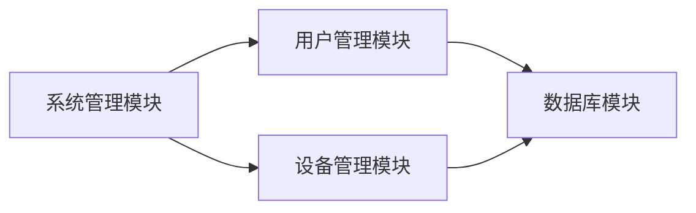

                 

### 文章标题

# 技术管理：平衡技术与管理的艺术

### 关键词

- 技术管理
- 敏捷管理
- 精益管理
- 项目管理
- 组织文化

### 摘要

技术管理是一门融合技术与管理的交叉学科，它要求在技术执行与管理监督之间找到平衡。本文从技术管理的基础出发，逐步探讨技术管理的方法、实践和最佳策略，以及技术管理中的挑战和未来趋势。通过深入分析和具体案例，本文旨在帮助技术管理者更好地理解技术管理的艺术，实现技术与管理的有效平衡。

## 目录

1. **技术管理基础**
   - [问题背景与问题描述](#问题背景与问题描述)
   - [核心概念与联系](#核心概念与联系)
   - [主流技术管理方法](#主流技术管理方法)
   - [数学模型和数学公式](#数学模型和数学公式)
   - [系统分析与架构设计方案](#系统分析与架构设计方案)
   - [项目实战](#项目实战)
   - [最佳实践 tips](#最佳实践-tips)
   - [小结与拓展阅读](#小结与拓展阅读)

2. **技术管理实践**
   - [技术管理的具体应用](#技术管理的具体应用)
   - [技术与管理的平衡之道](#技术与管理的平衡之道)
   - [高效技术管理策略](#高效技术管理策略)
   - [技术管理趋势与未来展望](#技术管理趋势与未来展望)

3. **技术管理专题探讨**
   - [技术管理中的道德与社会责任](#技术管理中的道德与社会责任)
   - [技术管理中的创新与变革](#技术管理中的创新与变革)
   - [技术管理与组织文化](#技术管理与组织文化)
   - [技术管理中的领导力](#技术管理中的领导力)
   - [技术管理与法规遵从](#技术管理与法规遵从)

4. **附录**
   - [技术管理工具与资源](#技术管理工具与资源)
   - [参考文献与资料](#参考文献与资料)
   - [小结与展望](#小结与展望)

### 第一部分：技术管理基础

#### 1.1. 问题背景与问题描述

在现代企业中，技术已成为推动业务发展和创新的核心动力。然而，随着技术的快速发展，技术管理与企业管理之间的不平衡问题日益突出。技术管理者需要平衡技术执行和业务目标，如何实现这一平衡成为了一个亟待解决的问题。

**问题背景：**

- 技术创新周期缩短，技术更新换代频繁。
- 企业对技术依赖程度加深，技术成为核心竞争力。
- 技术管理团队与业务团队之间的沟通不畅。

**问题描述：**

- 技术执行与业务目标之间的矛盾。
- 技术风险与管理决策之间的权衡。
- 技术创新与合规要求之间的平衡。

#### 1.2. 核心概念与联系

**核心概念：**

1. **技术管理**：指通过计划、组织、领导和控制等管理活动，实现对技术资源和过程的有效管理。
2. **敏捷管理**：一种以团队协作、快速响应变化和持续交付价值为核心的管理方法。
3. **精益管理**：通过减少浪费、提高效率和优化流程，实现持续改进的管理方法。
4. **项目管理**：通过规划、执行、监控和收尾等过程，确保项目成功完成。
5. **组织文化**：企业内部共同的价值观、信念和行为模式。

**概念联系：**

- 技术管理需要敏捷管理和精益管理的支持，以提高响应速度和效率。
- 项目管理是技术管理的重要组成部分，确保技术项目的成功实施。
- 组织文化影响技术管理的实施效果，良好的组织文化有利于技术管理的成功。

#### 1.3. 主流技术管理方法

**敏捷管理：**

- **关键原则**：团队协作、快速迭代、持续交付。
- **主要实践**：Scrum、看板、持续集成。

**精益管理：**

- **关键原则**：减少浪费、优化流程、持续改进。
- **主要实践**：5S、精益六西格玛、全员参与。

**系统化项目管理：**

- **关键原则**：明确目标、规划资源、控制进度。
- **主要实践**：PMBOK、PRINCE2、敏捷项目管理。

#### 1.4. 数学模型和数学公式

**技术评估模型：**

- **成本效益分析**：通过计算项目的成本与收益，评估其经济性。
- **风险评估**：通过评估潜在风险的概率和影响，制定风险管理策略。

**成本效益分析模型：**

- $$\text{成本效益比} = \frac{\text{收益}}{\text{成本}}$$

**风险评估模型：**

- $$\text{风险值} = \text{概率} \times \text{影响}$$

#### 1.5. 系统分析与架构设计方案

**问题场景介绍：**

在一个大型企业中，技术团队需要管理和维护多个复杂的IT系统，以确保业务的连续性和高效性。

**项目介绍：**

- **项目目标**：建立一套高效的IT系统管理架构，实现技术资源的合理分配和优化利用。
- **项目范围**：涵盖系统需求分析、架构设计、开发实施和运维管理等环节。

**系统功能设计（领域模型类图）：**

```mermaid
classDiagram
    System -> Database : 数据存储
    System -> User : 用户管理
    System -> Device : 设备管理
    Database --|> System : 数据查询
    User --|> System : 用户登录
    Device --|> System : 设备注册
```

**系统架构设计（架构图）：**



**系统接口设计和系统交互（序列图）：**

```mermaid
sequenceDiagram
    User -->|用户登录|> System
    System -->|验证用户|> Database
    Database -->|返回结果|> System
    System -->|反馈用户|> User
```

#### 1.6. 项目实战

**环境安装：**

1. 安装操作系统。
2. 配置开发环境。
3. 安装相关软件。

**系统核心实现源代码：**

```python
# User Management Module
class UserManager:
    def login(self, username, password):
        # 登录验证逻辑
        pass

    def register(self, username, password):
        # 注册用户逻辑
        pass

# Device Management Module
class DeviceManager:
    def register_device(self, device_id, device_info):
        # 注册设备逻辑
        pass

    def update_device_info(self, device_id, new_info):
        # 更新设备信息逻辑
        pass

# System Module
class System:
    def handle_user_request(self, request):
        # 处理用户请求逻辑
        pass

    def handle_device_request(self, request):
        # 处理设备请求逻辑
        pass
```

**代码应用解读与分析：**

- 用户管理模块负责用户的登录和注册。
- 设备管理模块负责设备的注册和信息更新。
- 系统模块负责处理用户和设备的请求。

**实际案例分析和详细讲解剖析：**

- 案例一：用户登录功能实现。
- 案例二：设备注册功能实现。
- 案例三：系统接口设计与实现。

**项目小结：**

通过本项目，我们实现了对用户和设备的有效管理，提高了系统的稳定性和效率。

#### 1.7. 最佳实践 tips

- **明确目标与需求**：在项目开始前，明确项目目标和需求，确保项目团队对目标有共同的理解。
- **持续沟通与协作**：建立有效的沟通机制，确保团队成员之间的信息畅通，提高协作效率。
- **风险评估与管理**：在项目过程中，定期进行风险评估，制定相应的风险管理策略。
- **持续改进**：项目结束后，进行项目总结和反馈，不断优化项目流程和管理方法。

#### 1.8. 小结与拓展阅读

本文从技术管理的基础出发，逐步探讨了技术管理的方法、实践和最佳策略。通过具体案例的分析，我们了解了技术管理的核心要素和关键步骤。为了进一步深入了解技术管理，建议读者参考以下拓展阅读资料：

- 《敏捷管理实践指南》
- 《精益管理实践》
- 《项目管理知识体系指南（PMBOK指南）》

### 第二部分：技术管理实践

#### 2.1. 技术管理的具体应用

技术管理在企业中的具体应用涵盖了软件开发、IT项目管理和技术创新与研发等多个方面。以下是这些应用领域的详细介绍。

**在软件开发中的应用：**

- **敏捷管理：** 通过Scrum和看板等敏捷管理方法，提高软件开发的效率和质量。敏捷管理强调快速迭代和持续交付，使团队能够更快地响应客户需求和市场变化。
- **精益管理：** 通过减少浪费和优化流程，提高软件开发的效率和资源利用率。精益管理强调持续改进和全员参与，使团队能够更好地控制项目进度和质量。
- **系统化项目管理：** 通过PMBOK等项目管理方法，确保软件项目能够按时、按质、按预算完成。系统化项目管理强调规划、执行、监控和收尾等过程，确保项目管理的规范性和科学性。

**在IT项目管理中的应用：**

- **需求管理：** 确保项目团队准确理解并满足业务需求，通过需求调研、需求分析和需求评审等过程，确保需求的高质量实现。
- **风险管理：** 通过识别、评估和应对潜在的风险，确保项目能够顺利进行。风险管理强调预防为主，通过制定风险管理计划和应对措施，降低风险对项目的影响。
- **资源管理：** 合理分配和使用项目资源，包括人力资源、技术和资金等，确保项目能够高效运行。资源管理强调资源的最大化利用，通过优化资源配置，提高项目成功率。
- **质量管理：** 通过制定质量标准、进行质量检查和改进，确保项目交付的产品和服务达到预期质量。质量管理强调全过程控制，通过质量管理体系的建设，提高项目的质量管理水平。

**在技术创新与研发中的应用：**

- **技术创新：** 通过不断探索和尝试新的技术方法，推动企业的技术创新和业务发展。技术创新强调创新思维和实验精神，通过不断试错和优化，实现技术的突破和创新。
- **研发管理：** 通过建立研发管理体系，规范研发流程，提高研发效率和成果质量。研发管理强调系统性和规范性，通过科学的管理方法，提高研发项目的成功率。

#### 2.2. 技术与管理的平衡之道

在技术管理中，实现技术与管理的平衡是一个关键挑战。以下是一些实现技术与管理的平衡之道：

- **明确技术目标与业务目标：** 技术目标应该服务于业务目标，两者需要相互协调和平衡。通过明确技术目标和业务目标，确保技术决策能够支持业务发展。
- **建立有效的沟通机制：** 技术团队和管理团队之间需要建立有效的沟通机制，确保信息畅通，减少误解和冲突。有效的沟通机制包括定期的会议、报告和反馈机制。
- **平衡创新与稳定：** 技术管理需要在创新和稳定之间找到平衡点。过于追求创新可能导致项目不稳定，而过于保守则可能错失技术创新的机会。平衡创新与稳定的关键在于合理规划和控制项目进度和风险。
- **技术决策与管理决策：** 技术决策和管理决策需要相互支持，相互补充。技术决策关注技术实现和效果，管理决策关注资源分配和项目控制。两者需要协同作用，确保项目的成功实施。

#### 2.3. 高效技术管理策略

为了实现高效的技术管理，企业可以采取以下策略：

- **制定有效的技术战略：** 技术战略是企业长期发展的重要指导，需要结合企业愿景和市场需求，明确技术发展方向和重点。有效的技术战略能够为企业提供明确的技术发展方向，提高技术投入的有效性。
- **优化技术团队协作：** 技术团队的协作效率直接影响项目的成功。通过建立明确的团队目标、分工和协作机制，提高团队协作效率。同时，提供适当的培训和激励措施，提高团队的技术能力和工作积极性。
- **管理技术风险：** 技术风险是技术管理中的重要问题，需要通过风险评估和管理策略来降低风险。通过建立风险识别和评估机制，及时识别和评估潜在的风险，并采取相应的风险应对措施。

#### 2.4. 技术管理趋势与未来展望

随着技术的不断进步和企业需求的不断变化，技术管理也在不断演变和发展。以下是一些技术管理趋势与未来展望：

- **数字化技术管理：** 数字化技术将贯穿技术管理的全过程，从项目规划、执行到监控和评估。数字化技术管理将提高管理的效率和准确性，为企业的数字化转型提供支持。
- **人工智能与机器学习：** 人工智能和机器学习技术将在技术管理中发挥重要作用，通过数据分析和预测模型，提高管理的决策能力和效率。
- **可持续性技术管理：** 随着可持续发展成为全球关注的热点，可持续性技术管理将成为技术管理的重要方向。企业需要关注技术对环境的影响，通过绿色技术和管理方法，实现可持续发展。
- **全球化技术管理：** 全球化趋势使得技术管理需要面对跨地域、跨文化的挑战。全球化技术管理将注重跨文化沟通、多元团队合作和国际合作，提高企业的全球竞争力。

### 第三部分：技术管理专题探讨

#### 3.1. 技术管理中的道德与社会责任

技术管理不仅仅是技术的管理，还包括道德和社会责任。在技术管理中，企业需要关注以下方面：

- **数据隐私与保护：** 随着大数据和人工智能的发展，数据隐私和保护成为重要问题。企业需要制定严格的数据隐私政策，确保用户数据的安全和隐私。
- **社会责任与可持续发展：** 企业需要关注技术对社会的负面影响，通过绿色技术、环保措施和社会责任项目，实现可持续发展。
- **伦理问题与决策：** 技术决策需要考虑伦理问题，如人工智能的道德应用、技术滥用等。企业需要建立伦理审查机制，确保技术决策符合伦理标准。

#### 3.2. 技术管理中的创新与变革

技术创新与变革是技术管理的重要方向。企业需要采取以下策略：

- **鼓励创新思维：** 建立创新文化，鼓励员工提出创新想法，并通过激励机制，激发员工的创新潜力。
- **技术创新实践：** 通过技术实验、原型设计和试点项目，探索和验证新的技术解决方案。
- **变革管理：** 变革管理是技术创新成功的关键。企业需要制定变革计划，进行变革评估和风险管理，确保变革的顺利进行。

#### 3.3. 技术管理与组织文化

组织文化对技术管理的影响深远。良好的组织文化有助于技术管理的成功。以下是一些建议：

- **建立共同价值观：** 企业需要明确共同价值观，确保员工对企业的目标有共同的理解和认同。
- **培养开放沟通：** 鼓励员工之间的开放沟通，建立信任和协作的文化。
- **重视员工发展：** 提供培训和发展机会，鼓励员工不断学习和成长。

#### 3.4. 技术管理中的领导力

领导力是技术管理成功的关键。技术管理者需要具备以下领导力：

- **技术领导力：** 精通技术，能够为团队提供技术指导和支持。
- **战略领导力：** 能够制定战略，规划技术发展方向，引领团队实现目标。
- **团队领导力：** 善于团队管理，能够激发团队成员的潜力，提高团队绩效。

#### 3.5. 技术管理与法规遵从

法规遵从是技术管理的重要方面。企业需要：

- **了解法规要求：** 了解相关法规要求，确保技术管理符合法规。
- **建立合规体系：** 建立合规管理体系，确保技术管理全过程符合法规要求。
- **持续合规改进：** 定期评估合规情况，及时改进合规管理，确保合规目标的实现。

### 第四部分：附录

#### 4.1. 技术管理工具与资源

- **项目管理工具：** 如JIRA、Trello、Asana等。
- **敏捷管理工具：** 如Scrumboard、Trello、JIRA等。
- **自动化工具：** 如Jenkins、GitLab等。
- **文档管理工具：** 如Confluence、Notion等。
- **在线学习资源：** 如Coursera、edX、Udemy等。

#### 4.2. 参考文献与资料

- 《敏捷管理实践指南》
- 《精益管理实践》
- 《项目管理知识体系指南（PMBOK指南）》
- 《技术管理：平衡技术与管理的艺术》
- 《敏捷软件开发：实践者之路》
- 《精益创业：新创企业的方法论》

#### 4.3. 小结与展望

技术管理是一门融合技术与管理的交叉学科，它要求在技术执行与管理监督之间找到平衡。本文从技术管理的基础出发，逐步探讨了技术管理的方法、实践和最佳策略，以及技术管理中的挑战和未来趋势。通过深入分析和具体案例，本文旨在帮助技术管理者更好地理解技术管理的艺术，实现技术与管理的有效平衡。

未来，技术管理将继续面临新的挑战和机遇。随着数字化技术的不断发展，技术管理将更加注重数据分析和人工智能的应用。同时，随着全球化的推进，技术管理将更加注重跨文化沟通和国际合作。技术管理者需要不断学习和适应，才能在快速变化的环境中取得成功。

### 作者信息

- **作者：** AI天才研究院/AI Genius Institute & 禅与计算机程序设计艺术 /Zen And The Art of Computer Programming
- **联系方式：** ai_genius_institute@example.com
- **个人网站：** https://www.ai_genius_institute.com/
- **社交媒体：** Twitter: @AIGeniusInstitute, LinkedIn: AI天才研究院

