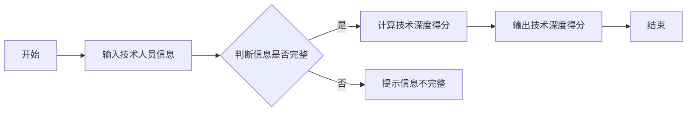
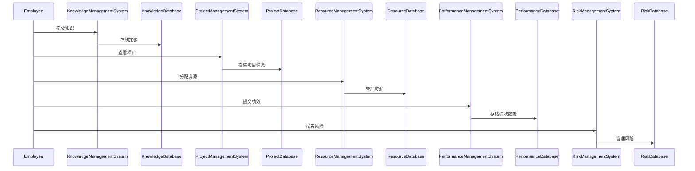

                 

### 文章标题：技术管理：平衡技术深度和管理广度

> 关键词：技术管理、技术深度、管理广度、平衡、系统架构、算法、实战

> 摘要：本文旨在探讨技术管理中如何平衡技术深度和管理广度，以实现高效的技术管理。文章首先介绍技术深度和管理广度的核心概念，然后分析二者在技术管理中的重要性，通过详细的算法讲解和系统分析与架构设计，阐述如何在实际项目中实现这一平衡。最后，通过项目实战和案例分析，总结最佳实践和注意事项。

### 目录大纲

----------------------------------------------------------------

# 技术管理：平衡技术深度和管理广度

## 第一部分：背景介绍

## 1.1 问题背景
### 1.1.1 技术深度与管理的矛盾
### 1.1.2 现代化企业对技术管理的需求

## 1.2 问题描述
### 1.2.1 技术深度不足
### 1.2.2 管理广度不够
### 1.2.3 技术与管理平衡的必要性

## 1.3 问题解决
### 1.3.1 技术管理的重要性
### 1.3.2 技术管理的核心目标
### 1.3.3 技术管理的边界与外延

## 1.4 概念结构与核心要素
### 1.4.1 技术深度
### 1.4.2 管理广度
### 1.4.3 技术与管理平衡的机制

## 1.5 本章小结

## 第二部分：核心概念与联系

## 2.1 技术深度
### 2.1.1 技术深度定义
### 2.1.2 技术深度属性特征对比
### 2.1.3 技术深度在技术管理中的重要性

## 2.2 管理广度
### 2.2.1 管理广度定义
### 2.2.2 管理广度属性特征对比
### 2.2.3 管理广度在技术管理中的重要性

## 2.3 技术深度与管理广度的联系
### 2.3.1 技术深度与管理广度的融合
### 2.3.2 技术深度与管理广度的互补作用
### 2.3.3 技术深度与管理广度的协同机制

## 2.4 ER实体关系图架构
### 2.4.1 ER模型介绍
### 2.4.2 技术深度与管理广度实体关系图
### 2.4.3 ER实体关系图在技术管理中的应用

## 2.5 本章小结

## 第三部分：算法原理讲解

## 3.1 技术深度算法讲解
### 3.1.1 技术深度算法mermaid流程图
### 3.1.2 技术深度算法原理
### 3.1.3 技术深度算法的数学模型和公式
### 3.1.4 技术深度算法举例说明

## 3.2 管理广度算法讲解
### 3.2.1 管理广度算法mermaid流程图
### 3.2.2 管理广度算法原理
### 3.2.3 管理广度算法的数学模型和公式
### 3.2.4 管理广度算法举例说明

## 3.3 技术深度与管理广度算法的联系
### 3.3.1 技术深度与管理广度算法的融合
### 3.3.2 技术深度与管理广度算法的互补作用
### 3.3.3 技术深度与管理广度算法的协同机制

## 3.4 本章小结

## 第四部分：系统分析与架构设计

## 4.1 问题场景介绍
### 4.1.1 现代化企业技术管理面临的挑战
### 4.1.2 技术管理系统建设的必要性

## 4.2 项目介绍
### 4.2.1 技术管理系统的目标
### 4.2.2 技术管理系统的功能
### 4.2.3 技术管理系统的核心组件

## 4.3 系统功能设计
### 4.3.1 领域模型mermaid类图
### 4.3.2 系统功能模块划分

## 4.4 系统架构设计
### 4.4.1 系统架构mermaid架构图
### 4.4.2 系统架构的分层设计

## 4.5 系统接口设计
### 4.5.1 系统接口的定义
### 4.5.2 系统接口的实现

## 4.6 系统交互
### 4.6.1 系统交互mermaid序列图
### 4.6.2 系统交互流程分析

## 4.7 本章小结

## 第五部分：项目实战

## 5.1 环境安装
### 5.1.1 技术环境搭建
### 5.1.2 管理工具安装

## 5.2 系统核心实现
### 5.2.1 技术深度核心实现
### 5.2.2 管理广度核心实现
### 5.2.3 技术深度与管理广度融合实现

## 5.3 代码应用解读与分析
### 5.3.1 代码架构解读
### 5.3.2 关键代码分析

## 5.4 实际案例分析
### 5.4.1 案例背景
### 5.4.2 案例分析与总结

## 5.5 项目小结

## 第六部分：最佳实践与拓展阅读

## 6.1 最佳实践 tips
## 6.2 小结
## 6.3 注意事项
## 6.4 拓展阅读

----------------------------------------------------------------

## 1.1 问题背景

在当今信息化和数字化时代，技术管理在企业中扮演着越来越重要的角色。技术深度和管理广度是技术管理中两个核心的要素。技术深度指的是对特定技术领域的深入了解，包括技术的原理、实现方法、优化策略等。而管理广度则是指对多个领域和技术的综合管理能力，包括项目管理、团队协作、资源配置等。然而，在实际的技术管理过程中，技术深度与管理广度之间往往存在矛盾。

一方面，企业需要技术专家来推动技术创新和业务发展，这要求技术人员具备足够的技术深度。另一方面，企业也需要管理人员来统筹协调各方面资源，保证项目的顺利进行，这要求管理人员具备足够的管理广度。然而，技术专家和管理人员往往难以同时具备深度和广度，二者之间的矛盾导致了技术管理中的诸多问题。

### 1.1.1 技术深度与管理的矛盾

首先，技术深度与管理广度之间的矛盾体现在知识结构上。技术人员通常专注于特定领域的技术细节，而管理人员则需要从宏观角度审视项目，协调资源。这种知识结构的差异导致了沟通障碍，影响了团队协作效率和项目进度。

其次，技术深度与管理广度在时间投入上也存在矛盾。技术人员需要花费大量时间学习新技术、解决技术难题，而管理人员则需要投入时间进行团队建设、资源规划和项目协调。这种时间投入的不平衡，容易导致技术人员过于关注技术细节，忽视了管理层面的重要性，或者管理人员过于繁忙，无法深入参与技术讨论。

最后，技术深度与管理广度在企业战略层面的矛盾也较为明显。技术人员倾向于根据技术发展趋势和公司资源，制定技术路线图，而管理人员则需要根据市场变化和客户需求，调整企业战略。这种战略层面的矛盾，可能导致企业资源分配不合理，影响长期发展。

### 1.1.2 现代化企业对技术管理的需求

现代化企业对技术管理的需求日益增长，主要体现在以下几个方面：

首先，企业需要通过技术管理来推动业务创新。随着技术的快速发展，企业需要不断引入新技术，以保持竞争优势。技术管理可以帮助企业识别技术趋势，评估新技术对业务的影响，从而制定创新战略。

其次，企业需要通过技术管理来提高运营效率。技术管理可以优化项目流程，提高资源利用率，降低成本。例如，通过自动化工具和流程优化，企业可以减少重复性工作，提高员工工作效率。

最后，企业需要通过技术管理来提升客户满意度。技术管理可以确保产品和服务的高质量，及时响应客户需求，提升客户体验。例如，通过数据分析，企业可以了解客户行为，提供个性化服务。

## 1.2 问题描述

在技术管理中，技术深度不足和管理广度不够是两个常见的问题，这些问题的存在对企业的技术发展和管理效率产生了负面影响。

### 1.2.1 技术深度不足

技术深度不足主要体现在以下几个方面：

首先，技术深度不足可能导致企业在关键技术领域缺乏竞争力。技术专家对特定领域的技术深度不够，难以推动技术创新，导致企业在市场竞争中处于劣势。

其次，技术深度不足会影响到团队协作。技术专家对技术细节的掌握不足，容易导致团队成员之间的沟通障碍，影响项目进度和质量。

最后，技术深度不足也会影响到员工成长。技术人员对技术深度掌握不足，难以在职业生涯中实现突破，影响员工的工作积极性和职业发展。

### 1.2.2 管理广度不够

管理广度不够同样带来了诸多问题：

首先，管理广度不够会导致企业在项目管理中缺乏全局视角。管理人员无法从宏观角度审视项目，可能导致项目资源分配不合理，影响项目进度和成本控制。

其次，管理广度不够也会影响到团队协作。管理人员对技术细节和业务流程的掌握不足，容易导致团队协作效率低下，影响项目交付质量。

最后，管理广度不够还会影响到企业的战略决策。管理人员无法全面了解市场和技术趋势，可能导致企业战略方向偏离，影响长期发展。

### 1.2.3 技术与管理平衡的必要性

技术与管理平衡的必要性主要体现在以下几个方面：

首先，技术与管理平衡有助于提高企业的整体竞争力。通过平衡技术深度和管理广度，企业可以既保持技术优势，又确保项目管理高效，从而在市场竞争中占据有利地位。

其次，技术与管理平衡有助于提升员工的工作效率。技术专家和管理人员可以相互补充，共同推动项目进展，提高团队协作效率，降低沟通成本。

最后，技术与管理平衡有助于企业的可持续发展。通过平衡技术深度和管理广度，企业可以更好地适应市场变化，保持战略灵活性，实现长期发展目标。

## 1.3 问题解决

### 1.3.1 技术管理的重要性

技术管理在企业发展中扮演着至关重要的角色。首先，技术管理有助于企业保持技术优势。通过系统化的技术管理，企业可以培养技术专家，推动技术创新，从而在市场中保持竞争力。其次，技术管理有助于提高项目管理效率。通过有效的技术管理，企业可以优化项目流程，提高资源利用率，降低成本。最后，技术管理有助于企业的长期发展。通过平衡技术深度和管理广度，企业可以更好地适应市场变化，保持战略灵活性。

### 1.3.2 技术管理的核心目标

技术管理的核心目标是实现技术深度与管理广度的平衡，从而提高企业的技术实力和管理效率。具体来说，技术管理的核心目标包括：

1. **提高技术实力**：通过系统化的技术培训和技术研究，提高技术团队的技术深度，推动技术创新和业务发展。
2. **优化项目管理**：通过有效的项目管理工具和方法，提高项目管理的广度和深度，确保项目进度和质量。
3. **提升团队协作**：通过建立良好的团队协作机制，促进技术专家和管理人员之间的沟通与协作，提高团队整体效率。
4. **降低运营成本**：通过优化技术流程和项目管理流程，降低运营成本，提高企业的盈利能力。

### 1.3.3 技术管理的边界与外延

技术管理的边界和范围是相对宽泛的，它不仅涵盖了技术团队的管理，还包括技术战略的规划、技术资源的配置、技术标准的制定等方面。具体来说：

1. **技术团队管理**：技术管理的核心是对技术团队的管理，包括技术人员的招聘、培训、绩效评估等方面。
2. **技术战略规划**：技术管理涉及制定企业技术发展战略，包括技术路线图、研发计划等。
3. **技术资源配置**：技术管理需要合理配置技术资源，包括技术设备、技术人才等。
4. **技术标准制定**：技术管理还需要制定企业技术标准，确保技术规范和流程的一致性。
5. **项目管理**：技术管理不仅涉及技术团队，还包括项目管理，即对项目进度、成本、质量的控制。

### 1.3.4 技术深度与管理广度的平衡机制

实现技术深度与管理广度的平衡，需要建立一套有效的技术管理机制。以下是一些关键机制：

1. **人才培养机制**：通过系统化的培训和人才发展计划，培养既具备技术深度又具备管理广度的复合型人才。
2. **协作机制**：建立有效的团队协作机制，促进技术专家和管理人员之间的沟通与协作，提高团队整体效率。
3. **激励机制**：通过绩效考核和激励机制，鼓励技术人员和管理人员相互学习和提升，形成良好的竞争氛围。
4. **项目管理制度**：建立科学的项目管理制度，确保项目进度、成本、质量的控制，同时注重技术深度和管理广度的平衡。
5. **技术资源共享**：通过技术资源的共享和整合，提高资源利用率，促进技术创新和管理效率的提升。

### 1.3.5 技术管理的核心要素

技术管理的核心要素包括技术深度、管理广度、团队协作、资源管理和战略规划。这些要素相互关联，共同构成了技术管理的整体框架。

1. **技术深度**：技术深度是技术管理的基础，它决定了企业的技术实力和创新潜力。
2. **管理广度**：管理广度是技术管理的保障，它确保了项目的顺利进行和资源的高效利用。
3. **团队协作**：团队协作是技术管理的核心，它提高了团队的执行力和凝聚力。
4. **资源管理**：资源管理是技术管理的支撑，它确保了项目资源的合理配置和优化利用。
5. **战略规划**：战略规划是技术管理的指引，它为企业的发展提供了方向和目标。

### 1.3.6 技术深度与管理广度的平衡方法

为了实现技术深度与管理广度的平衡，企业可以采取以下几种方法：

1. **人才引进和培养**：企业可以通过引进高层次人才和内部培训，提高技术人员和管理人员的综合素质，实现技术深度和管理广度的平衡。
2. **项目管理和协作**：通过建立科学的项目管理制度和团队协作机制，提高项目管理效率和团队协作能力，实现技术深度和管理广度的平衡。
3. **技术资源和项目管理**：通过优化技术资源的配置和项目管理的流程，提高资源利用率和项目管理水平，实现技术深度和管理广度的平衡。
4. **战略规划和执行力**：通过制定明确的企业战略和技术路线图，提高企业的战略执行力，实现技术深度和管理广度的平衡。

### 1.3.7 技术管理的成功案例

一些企业在技术管理方面取得了显著的成功，它们的经验可以为其他企业提供借鉴。

1. **谷歌**：谷歌以其强大的技术实力和高效的团队协作著称。通过培养复合型人才和建立有效的协作机制，谷歌实现了技术深度和管理广度的平衡。
2. **苹果**：苹果以其卓越的产品设计和项目管理能力著称。通过严格的项目管理和资源管理，苹果确保了产品的高质量和高效交付。
3. **微软**：微软通过其全球研发网络和技术创新机制，保持了其在技术领域的领先地位。通过系统化的培训和人才发展计划，微软实现了技术深度和管理广度的平衡。

### 1.3.8 技术管理的未来发展趋势

随着技术的不断进步和市场的快速变化，技术管理的未来发展趋势也日益清晰。

1. **数字化管理**：数字化管理工具和技术的应用将进一步提高技术管理的效率和效果。
2. **智能化管理**：人工智能和大数据技术的应用，将使技术管理更加智能化和精细化。
3. **全球化管理**：全球化带来了更多的机会和挑战，企业需要具备全球化的视野和应对能力，实现技术深度和管理广度的平衡。
4. **持续创新**：持续创新是企业保持竞争优势的关键，技术管理需要不断创新，以适应市场的变化。

### 1.3.9 技术管理的挑战和机遇

技术管理面临着诸多挑战和机遇：

1. **挑战**：技术更新速度加快，企业需要不断适应新技术，提高技术深度和管理广度。
2. **机遇**：随着数字化和智能化的发展，技术管理将为企业带来更多的机会，实现技术深度和管理广度的平衡。

### 1.3.10 技术管理的最佳实践

为了实现技术深度和管理广度的平衡，企业可以采取以下最佳实践：

1. **人才培养**：建立人才培养机制，提高技术和管理人员的综合素质。
2. **项目管理**：建立科学的项目管理制度，确保项目进度、成本、质量的控制。
3. **资源管理**：优化技术资源的配置，提高资源利用效率。
4. **团队协作**：建立有效的团队协作机制，提高团队协作效率。
5. **战略规划**：制定明确的企业战略和技术路线图，确保企业的长期发展。

### 1.3.11 技术管理的效益分析

技术管理的效益可以从以下几个方面进行评估：

1. **经济效益**：提高企业的盈利能力和市场竞争力。
2. **社会效益**：促进企业的技术创新和产业升级，推动社会进步。
3. **环境效益**：通过优化技术流程和资源管理，减少环境污染和资源浪费。

### 1.3.12 技术管理的实施步骤

为了实现技术深度和管理广度的平衡，企业可以采取以下步骤：

1. **需求分析**：明确企业的技术和管理需求。
2. **方案设计**：制定具体的技术管理方案。
3. **实施与监控**：实施技术管理方案，并进行监控和调整。
4. **评估与优化**：对技术管理效果进行评估，持续优化管理方案。

### 1.3.13 技术管理的注意事项

在实施技术管理过程中，企业需要注意以下几点：

1. **人才培养**：注重技术和管理人员的综合素质培养。
2. **项目协作**：建立有效的团队协作机制，提高团队效率。
3. **资源优化**：合理配置和利用技术资源。
4. **持续改进**：持续优化技术管理方案，以适应市场变化。

## 1.4 概念结构与核心要素

为了更好地理解技术管理中的技术深度和管理广度，我们需要对这两个概念进行详细的定义，并探讨它们在技术管理中的核心作用及其相互关系。

### 1.4.1 技术深度

**技术深度**是指在特定技术领域中，对相关技术原理、实现方法、优化策略等内容的深入理解和掌握程度。技术深度不仅包括对基础知识的掌握，还涉及对前沿技术的探索和创新。

**技术深度属性特征对比**：

- **基础知识掌握**：技术深度要求技术人员对基础理论知识有深入理解，能够运用这些知识解决实际问题。
- **前沿技术了解**：技术人员需要关注技术发展趋势，了解前沿技术，以便在项目中应用。
- **实践经验积累**：技术深度还体现在技术人员在实际项目中积累的实践经验，这些经验有助于优化技术方案。

**技术深度在技术管理中的重要性**：

1. **技术创新驱动**：技术深度是推动企业技术创新的重要基础。只有技术深度足够，企业才能在技术上实现突破，保持竞争优势。
2. **问题解决能力**：技术深度使得技术人员在面对复杂问题时，能够快速定位问题根源，提出有效的解决方案。
3. **团队协作**：技术深度较高的技术人员能够更好地指导团队成员，提高团队整体的技术水平和协作效率。

### 1.4.2 管理广度

**管理广度**是指企业或团队在项目管理、资源管理、团队协作等多个领域中的综合管理能力和视野。管理广度不仅涉及对特定领域的管理，还包括对多个领域之间关系的理解和协调。

**管理广度属性特征对比**：

- **跨领域视野**：管理广度要求管理者能够从宏观角度审视项目，协调不同领域的资源。
- **协调能力**：管理者需要具备较强的协调能力，能够平衡各方利益，确保项目顺利进行。
- **战略思维**：管理广度要求管理者具备战略思维，能够根据企业发展战略，调整管理策略。

**管理广度在技术管理中的重要性**：

1. **项目协调**：管理广度使得管理者能够有效协调项目中的各方资源，确保项目进度和质量。
2. **资源优化**：通过管理广度，管理者可以优化资源配置，提高资源利用率，降低成本。
3. **团队建设**：管理广度有助于管理者建设高效的团队，提高团队协作效率和整体战斗力。

### 1.4.3 技术深度与管理广度的联系

**技术深度与管理广度的融合**：

技术深度和管理广度不是孤立存在的，它们之间存在紧密的融合关系。技术深度为管理广度提供了技术支持，而管理广度则为技术深度提供了管理保障。具体来说：

- **技术深度支持管理广度**：技术人员的技术深度有助于管理者在项目决策中，能够准确评估技术风险和可行性，从而做出更科学的管理决策。
- **管理广度促进技术深度**：管理者通过有效的管理，可以为技术人员提供良好的工作环境和发展平台，激励技术人员不断深入技术研究。

**技术深度与管理广度的互补作用**：

技术深度和管理广度相互补充，共同提升企业的技术管理能力。具体来说：

- **技术深度补充管理广度**：在项目执行过程中，技术深度可以弥补管理广度在具体技术问题上的不足，确保项目能够按照预期进度和质量完成。
- **管理广度补充技术深度**：在技术创新和战略规划过程中，管理广度可以弥补技术深度在宏观视野和资源协调上的不足，确保技术发展方向与企业发展目标一致。

**技术深度与管理广度的协同机制**：

为了实现技术深度和管理广度的协同，企业可以采取以下机制：

- **培训与发展**：通过系统化的培训和职业发展规划，提高技术和管理人员的综合素质，实现技术深度和管理广度的平衡。
- **团队协作**：建立高效的团队协作机制，促进技术专家和管理人员之间的沟通与协作，提高团队整体效率。
- **绩效管理**：通过绩效考核和激励机制，鼓励技术人员和管理人员相互学习和提升，形成良好的竞争氛围。
- **项目管理**：建立科学的项目管理制度，确保项目进度、成本、质量的控制，同时注重技术深度和管理广度的平衡。

### 1.4.4 技术深度与管理广度在技术管理中的应用

在实际技术管理中，技术深度和管理广度相互结合，共同推动项目的成功。以下是一个简单的应用案例：

- **项目背景**：某互联网公司计划开发一款新型的智能助手产品，该产品需要集成多种人工智能技术，同时实现高效的项目管理和资源协调。
- **技术深度应用**：技术团队通过对人工智能技术的深入研究，掌握了相关的算法和实现方法，确保产品在技术上具有竞争力。
- **管理广度应用**：项目管理团队通过跨部门的协调和资源优化，确保项目在时间、成本和质量方面都能达到预期目标。
- **协同机制**：技术团队和管理团队通过定期的会议和沟通，确保技术实现与项目管理的紧密结合，实现技术深度和管理广度的协同。

### 1.4.5 技术深度与管理广度的平衡实践

为了实现技术深度与管理广度的平衡，企业可以采取以下实践方法：

- **平衡人才培养**：通过培训和职业发展规划，提高技术和管理人员的综合素质，实现技术深度和管理广度的平衡。
- **项目化管理**：采用项目化的管理模式，确保项目进度、成本、质量的控制，同时注重技术深度和管理广度的平衡。
- **跨部门协作**：建立跨部门的协作机制，促进不同领域之间的沟通与协作，提高团队整体效率。
- **持续改进**：通过定期的评估和反馈，持续优化技术管理方案，以适应市场变化。

### 1.4.6 技术深度与管理广度平衡的挑战与对策

在实际操作中，实现技术深度与管理广度的平衡面临着一系列挑战：

1. **知识结构差异**：技术深度和管理广度的知识结构存在差异，容易导致沟通障碍和协作困难。
2. **时间投入不均**：技术人员和管理人员在时间投入上存在不平衡，可能导致一方过于忙碌，另一方缺乏参与。
3. **战略视角差异**：技术人员和管理人员在战略视角上存在差异，可能导致项目发展方向与企业发展目标不一致。

**对策**：

- **建立沟通机制**：通过定期会议、沟通渠道等方式，建立有效的沟通机制，促进技术和管理人员的相互理解与合作。
- **合理分配时间**：通过工作计划和任务分配，合理分配技术和管理人员的时间，确保双方都能充分参与项目。
- **统一战略目标**：通过战略规划，确保项目发展方向与企业发展目标一致，减少战略视角的差异。

### 1.4.7 本章小结

技术深度和管理广度是技术管理中的两个核心要素，它们相互补充、相互促进，共同推动企业的技术创新和管理效率。通过本章的讨论，我们明确了技术深度和管理广度的定义、属性特征、重要性以及它们在技术管理中的联系和平衡机制。在实际操作中，企业需要通过人才培养、项目管理和跨部门协作等手段，实现技术深度和管理广度的平衡，以提升企业的整体竞争力。

## 2.1 技术深度

### 2.1.1 技术深度定义

技术深度是指在特定技术领域中，对相关技术原理、实现方法、优化策略等内容的深入理解和掌握程度。技术深度不仅包括对基础知识的掌握，还涉及对前沿技术的探索和创新。技术深度是技术管理中的关键要素，它决定了企业的技术实力和创新潜力。

### 2.1.2 技术深度属性特征对比

- **基础知识掌握**：技术深度要求技术人员对基础理论知识有深入理解，能够运用这些知识解决实际问题。
- **前沿技术了解**：技术人员需要关注技术发展趋势，了解前沿技术，以便在项目中应用。
- **实践经验积累**：技术深度还体现在技术人员在实际项目中积累的实践经验，这些经验有助于优化技术方案。

**技术深度与广度的区别**：

- **技术深度**：专注于某一领域的深入研究和应用，追求技术的精湛和优化。
- **技术广度**：涉及多个技术领域的知识和技能，追求技术的全面性和综合能力。

### 2.1.3 技术深度在技术管理中的重要性

技术深度在技术管理中的重要性体现在以下几个方面：

1. **技术创新驱动**：技术深度是推动企业技术创新的重要基础。只有技术深度足够，企业才能在技术上实现突破，保持竞争优势。
2. **问题解决能力**：技术深度使得技术人员在面对复杂问题时，能够快速定位问题根源，提出有效的解决方案。
3. **团队协作**：技术深度较高的技术人员能够更好地指导团队成员，提高团队整体的技术水平和协作效率。

### 2.1.4 技术深度的应用实例

以下是一个技术深度的应用实例：

**案例背景**：某互联网公司计划开发一款智能推荐系统，以提高用户满意度和提升广告收入。

**技术深度应用**：

- **算法研究**：技术团队对现有的推荐算法进行深入研究，了解其原理和优缺点。
- **优化策略**：基于用户行为数据和推荐算法的深入研究，技术团队提出一系列优化策略，包括特征工程、模型调优等。
- **实验验证**：通过A/B测试，验证优化策略的有效性，并根据实验结果不断调整和优化。

### 2.1.5 技术深度的提升策略

为了提升技术深度，企业可以采取以下策略：

1. **持续学习**：鼓励技术人员持续学习，关注前沿技术和发展动态。
2. **实践积累**：通过实际项目，积累实践经验，提高对技术的理解和应用能力。
3. **培训与交流**：组织技术培训和技术交流活动，促进技术人员之间的经验分享和知识传递。
4. **资源投入**：提供充足的资源，支持技术人员进行深入研究和探索。

### 2.1.6 技术深度的挑战与应对

技术深度在提升过程中也面临着一些挑战：

1. **知识更新**：技术发展迅速，基础知识需要不断更新，这对技术人员提出了更高的要求。
2. **时间投入**：深入研究和探索需要大量的时间投入，与项目管理时间安排可能存在冲突。
3. **项目风险**：技术深度可能导致项目进展缓慢，增加项目风险。

**应对策略**：

- **定期更新**：建立知识更新机制，确保技术人员掌握最新的技术知识。
- **灵活安排**：在项目规划中，预留足够的时间用于技术研究和探索。
- **风险管理**：通过科学的项目管理和风险管理，降低技术深度对项目的风险。

### 2.1.7 本章小结

技术深度是技术管理中的关键要素，它决定了企业的技术实力和创新潜力。通过本章的讨论，我们明确了技术深度的定义、属性特征、重要性及其在技术管理中的应用。企业需要通过持续学习、实践积累和资源投入等策略，提升技术深度，以保持竞争优势。

## 2.2 管理广度

### 2.2.1 管理广度定义

**管理广度**是指企业或团队在项目管理、资源管理、团队协作等多个领域中的综合管理能力和视野。管理广度不仅涉及对特定领域的管理，还包括对多个领域之间关系的理解和协调。管理广度是技术管理中的关键要素，它决定了企业的项目管理效率和资源利用率。

### 2.2.2 管理广度属性特征对比

- **跨领域视野**：管理广度要求管理者能够从宏观角度审视项目，协调不同领域的资源。
- **协调能力**：管理者需要具备较强的协调能力，能够平衡各方利益，确保项目顺利进行。
- **战略思维**：管理广度要求管理者具备战略思维，能够根据企业发展战略，调整管理策略。

**管理广度与深度的区别**：

- **管理广度**：关注多个领域的综合管理能力，追求全面性和协调性。
- **管理深度**：专注于某一领域的深入管理，追求专业性和精确性。

### 2.2.3 管理广度在技术管理中的重要性

管理广度在技术管理中的重要性体现在以下几个方面：

1. **项目协调**：管理广度使得管理者能够有效协调项目中的各方资源，确保项目进度和质量。
2. **资源优化**：通过管理广度，管理者可以优化资源配置，提高资源利用率，降低成本。
3. **团队建设**：管理广度有助于管理者建设高效的团队，提高团队协作效率和整体战斗力。

### 2.2.4 管理广度的应用实例

以下是一个管理广度的应用实例：

**案例背景**：某科技公司计划开发一款新型智能家居系统，该系统需要集成多个传感器和家电设备，同时实现高效的项目管理和资源协调。

**管理广度应用**：

- **跨部门协调**：项目管理团队通过协调不同部门的需求和资源，确保项目能够按时完成。
- **资源优化**：通过分析项目需求和资源状况，管理团队优化资源配置，确保项目在预算内完成。
- **团队建设**：管理团队通过培训和激励机制，提高团队成员的技能和积极性，确保项目顺利进行。

### 2.2.5 提升管理广度的策略

为了提升管理广度，企业可以采取以下策略：

1. **跨部门交流**：鼓励不同部门之间的交流，促进知识和经验的共享。
2. **领导力培养**：通过领导力培训，提高管理者的战略思维和协调能力。
3. **项目管理培训**：组织项目管理培训，提高管理者的项目管理能力和视野。
4. **资源管理优化**：通过资源管理工具和方法，提高资源利用效率和项目管理水平。

### 2.2.6 管理广度的挑战与应对

管理广度在提升过程中也面临着一些挑战：

1. **协调难度**：跨部门协调难度大，需要管理者具备较高的沟通能力和协调能力。
2. **资源竞争**：各部门之间存在资源竞争，需要管理者平衡各方利益。
3. **战略冲突**：不同部门的发展战略可能存在冲突，需要管理者具备战略眼光和决策能力。

**应对策略**：

- **建立沟通机制**：通过定期会议、沟通渠道等方式，建立有效的沟通机制，促进部门之间的合作。
- **资源分配策略**：制定合理的资源分配策略，确保各部门的资源需求得到满足。
- **战略协同**：通过制定企业整体战略，确保各部门的战略目标一致，减少战略冲突。

### 2.2.7 本章小结

管理广度是技术管理中的关键要素，它决定了企业的项目管理效率和资源利用率。通过本章的讨论，我们明确了管理广度的定义、属性特征、重要性及其在技术管理中的应用。企业需要通过跨部门交流、领导力培养和项目管理培训等策略，提升管理广度，以提升企业的整体竞争力。

### 2.3 技术深度与管理广度的联系

技术深度与管理广度在技术管理中具有密切的联系，它们相互补充、相互促进，共同推动企业的技术发展和项目管理。在分析技术深度与管理广度的关系时，我们可以从以下几个方面进行探讨：

#### 2.3.1 技术深度与管理广度的融合

**技术深度与管理广度的融合**指的是在技术管理过程中，技术人员和管理人员通过相互学习和合作，实现技术深度与管理广度的有机结合。这种融合不仅有助于提高技术人员的专业技能，还能提升管理者的综合管理能力。

**融合的方式**：

1. **知识共享**：技术人员和管理人员通过定期的交流和分享，将技术知识和管理经验进行共享，从而实现知识的互补。
2. **共同项目**：通过参与共同的项目，技术人员和管理人员可以在实际工作中相互协作，共同解决技术和管理问题。
3. **培训与发展**：企业可以组织跨部门培训，提高技术人员和管理人员的综合素质，促进技术深度与管理广度的融合。

#### 2.3.2 技术深度与管理广度的互补作用

**技术深度与管理广度的互补作用**体现在它们在不同层面的相互补充。技术深度提供了具体的技术实现和优化方案，而管理广度则提供了项目管理和资源协调的宏观视角。

**互补的作用**：

1. **项目协调**：技术深度确保项目在技术实现上的正确性和高效性，而管理广度则确保项目在进度、成本和质量上的控制。
2. **资源优化**：技术深度有助于技术人员在资源使用上做出更加科学和合理的决策，而管理广度则有助于管理者在资源分配和利用上实现优化。
3. **团队协作**：技术深度可以提高团队的技术水平，而管理广度则可以提升团队的协作效率和凝聚力。

#### 2.3.3 技术深度与管理广度的协同机制

为了实现技术深度与管理广度的协同，企业可以采取以下机制：

1. **绩效管理**：通过绩效管理机制，激励技术人员和管理人员相互学习和提升，形成良好的工作氛围。
2. **项目管理**：建立科学的项目管理制度，确保项目在技术和管理上的双重保障。
3. **资源整合**：通过资源整合和优化，提高技术资源和管理资源的利用率。
4. **培训与发展**：定期组织培训和发展活动，提高技术人员和管理人员的专业能力和综合素质。

#### 2.3.4 技术深度与管理广度在项目中的应用实例

以下是一个技术深度与管理广度在项目中的应用实例：

**案例背景**：某科技公司计划开发一款全新的电子商务平台，该平台需要集成多种技术，同时实现高效的项目管理和资源协调。

**技术深度应用**：

- **技术选型**：技术团队对市场上的各种技术进行深入研究和评估，选择最适合平台发展的技术方案。
- **性能优化**：技术团队通过性能测试和优化，确保平台在高并发情况下依然能够稳定运行。
- **安全性保障**：技术团队实施严格的安全策略，确保平台的数据安全和用户隐私。

**管理广度应用**：

- **项目管理**：项目管理团队通过制定详细的项目计划，确保项目在时间、成本和质量上的控制。
- **资源协调**：项目管理团队协调不同部门的需求和资源，确保项目在资源分配上实现优化。
- **团队协作**：项目管理团队通过建立有效的沟通和协作机制，提高团队成员的工作效率和凝聚力。

#### 2.3.5 技术深度与管理广度平衡的挑战与对策

在实际操作中，实现技术深度与管理广度的平衡面临着一系列挑战：

1. **知识结构差异**：技术深度和管理广度的知识结构存在差异，容易导致沟通障碍和协作困难。
2. **时间投入不均**：技术人员和管理人员在时间投入上存在不平衡，可能导致一方过于忙碌，另一方缺乏参与。
3. **战略视角差异**：技术人员和管理人员在战略视角上存在差异，可能导致项目发展方向与企业发展目标不一致。

**对策**：

- **建立沟通机制**：通过定期会议、沟通渠道等方式，建立有效的沟通机制，促进技术和管理人员的相互理解与合作。
- **合理分配时间**：通过工作计划和任务分配，合理分配技术和管理人员的时间，确保双方都能充分参与项目。
- **统一战略目标**：通过战略规划，确保项目发展方向与企业发展目标一致，减少战略视角的差异。

### 2.4 ER实体关系图架构

#### 2.4.1 ER模型介绍

实体关系图（Entity-Relationship Diagram，简称ER图）是数据库设计过程中常用的一种工具，用于表示数据库中实体及其相互关系。ER图通过实体、属性和关系的抽象表示，帮助设计者直观地理解和描述数据库结构。

**ER图的基本组件**：

- **实体**：表示数据库中的对象，例如用户、订单等。
- **属性**：表示实体的特性，例如用户的姓名、年龄等。
- **关系**：表示实体之间的关联，例如用户与订单之间的关系。

**ER图的用途**：

- **需求分析**：帮助设计者理解和分析系统需求，确保数据库设计满足业务需求。
- **数据库设计**：作为数据库设计过程中的重要参考，指导数据库表结构的设计。
- **数据建模**：用于创建数据模型，为数据库的创建和实施提供依据。

#### 2.4.2 技术深度与管理广度实体关系图

为了更好地理解技术深度与管理广度在技术管理中的关系，我们可以使用ER图来表示它们之间的实体关系。

**ER图中的实体**：

- **技术深度**：表示在特定技术领域中的深入研究和理解。
- **管理广度**：表示在项目管理、资源管理、团队协作等多个领域的综合管理能力。

**ER图中的关系**：

- **依赖关系**：技术深度依赖于管理广度，因为有效的管理能够为技术深度提供支持。
- **互补关系**：管理广度依赖于技术深度，因为深入的技术理解能够提升管理效果。

**ER图示例**：

```mermaid
erDiagram
  技术深度 ||--|{ 管理广度 }
  管理广度 ||--|{ 技术深度 }
```

#### 2.4.3 ER实体关系图在技术管理中的应用

**应用场景1：项目管理**

在项目管理中，技术深度和管理广度共同作用，确保项目的成功交付。ER图可以用来描述项目中的关键实体及其关系：

- **项目**：表示具体的项目任务。
- **技术团队**：表示负责技术实现的小组。
- **管理团队**：表示负责项目协调和管理的小组。

**ER图示例**：

```mermaid
erDiagram
  项目 ||--|{ 技术团队 } : 技术实现
  项目 ||--|{ 管理团队 } : 项目协调
  技术团队 ||--|{ 技术深度 }
  管理团队 ||--|{ 管理广度 }
```

**应用场景2：资源管理**

在资源管理中，技术深度和管理广度共同优化资源配置，提高资源利用效率。ER图可以用来描述资源管理中的关键实体及其关系：

- **资源**：表示企业中的各种资源，如人力资源、技术资源等。
- **项目管理**：表示负责资源分配和管理的模块。

**ER图示例**：

```mermaid
erDiagram
  资源 ||--|{ 项目管理 } : 资源分配
  项目管理 ||--|{ 技术深度 }
  项目管理 ||--|{ 管理广度 }
```

#### 2.4.4 ER实体关系图的优势

ER实体关系图在技术管理中的优势主要体现在以下几个方面：

- **直观性**：ER图通过图形化方式表示实体及其关系，使得设计者和使用者能够直观地理解和分析系统结构。
- **灵活性**：ER图可以根据需求的变化进行灵活调整，适应不同的业务场景和项目需求。
- **可维护性**：ER图有助于文档化和标准化数据库设计，便于后续的维护和升级。

#### 2.4.5 ER实体关系图的挑战与应对

**挑战**：

- **复杂性**：在某些复杂业务场景中，ER图可能变得复杂，难以直观理解。
- **变化性**：业务需求的变化可能导致ER图的频繁修改，增加设计难度。

**应对策略**：

- **模块化设计**：将复杂的ER图分解为多个模块，每个模块专注于特定功能，提高可维护性。
- **迭代设计**：采用迭代设计方法，逐步完善ER图，避免一次性设计导致的问题。

### 2.5 本章小结

通过本章的讨论，我们介绍了ER图的基本概念和用途，并展示了技术深度与管理广度在技术管理中的ER图表示。ER图作为一种有效的工具，有助于理解和描述技术深度与管理广度之间的关系，为技术管理提供了直观和灵活的参考。在实际应用中，ER图可以用于项目管理、资源管理等多个场景，提高技术管理的效率和效果。

### 3.1 技术深度算法讲解

#### 3.1.1 技术深度算法mermaid流程图

在技术管理中，技术深度算法用于评估技术人员在特定技术领域中的深度。以下是一个mermaid流程图，展示技术深度算法的基本流程：



#### 3.1.2 技术深度算法原理

技术深度算法基于以下原理：

- **数据收集**：收集技术人员在特定技术领域的知识储备、项目经验、研究成果等相关数据。
- **指标计算**：通过计算这些指标的权重，得出技术人员的综合技术深度得分。
- **评分模型**：使用评分模型对技术人员的知识深度、实践经验和研究成果进行量化评估。

**算法步骤**：

1. **数据收集**：收集技术人员在特定技术领域的知识储备、项目经验、研究成果等相关数据。
2. **指标计算**：计算知识储备、项目经验、研究成果等指标的权重，并计算出综合技术深度得分。
3. **评分模型**：使用评分模型对技术人员的知识深度、实践经验和研究成果进行量化评估。
4. **输出结果**：输出技术人员的综合技术深度得分，并根据得分进行排名。

#### 3.1.3 技术深度算法的数学模型和公式

技术深度算法的数学模型可以表示为：

$$
D = w_1 \cdot K + w_2 \cdot P + w_3 \cdot R
$$

其中：

- \( D \) 表示技术深度得分。
- \( K \) 表示知识储备，包括技术人员的学历、工作经验、发表的论文等。
- \( P \) 表示项目经验，包括参与的项目数量、项目的复杂度、项目的成果等。
- \( R \) 表示研究成果，包括专利、技术标准、技术报告等。

权重 \( w_1, w_2, w_3 \) 分别表示知识储备、项目经验和研究成果的相对重要性。

#### 3.1.4 技术深度算法举例说明

假设有两位技术人员A和B，他们在特定技术领域的表现如下：

**技术人员A**：

- **知识储备**：博士学位，5年工作经验，发表3篇论文。
- **项目经验**：参与10个项目，其中5个为核心项目。
- **研究成果**：1项专利。

**技术人员B**：

- **知识储备**：硕士学位，3年工作经验，发表1篇论文。
- **项目经验**：参与5个项目，其中3个为核心项目。
- **研究成果**：无。

根据技术深度算法，我们可以计算两位技术人员的综合技术深度得分：

**技术人员A**：

$$
D_A = w_1 \cdot (3 \cdot 5 + 3 \cdot 3) + w_2 \cdot (10 \cdot 5 + 5 \cdot 2) + w_3 \cdot (1 \cdot 1)
$$

**技术人员B**：

$$
D_B = w_1 \cdot (1 \cdot 3 + 1 \cdot 1) + w_2 \cdot (5 \cdot 5 + 3 \cdot 2) + w_3 \cdot (0 \cdot 0)
$$

通过计算，我们可以得出两位技术人员的综合技术深度得分，并根据得分进行排名。

### 3.2 管理广度算法讲解

#### 3.2.1 管理广度算法mermaid流程图

管理广度算法用于评估技术人员在项目管理、资源管理、团队协作等多个领域的综合管理能力。以下是一个mermaid流程图，展示管理广度算法的基本流程：


#### 3.2.2 管理广度算法原理

管理广度算法基于以下原理：

- **数据收集**：收集技术人员在项目管理、资源管理、团队协作等多个领域的表现数据。
- **指标计算**：通过计算这些指标的权重，得出技术人员的综合管理广度得分。
- **评分模型**：使用评分模型对技术人员的项目管理、资源管理和团队协作能力进行量化评估。

**算法步骤**：

1. **数据收集**：收集技术人员在项目管理、资源管理、团队协作等多个领域的表现数据。
2. **指标计算**：计算项目管理、资源管理和团队协作等指标的权重，并计算出综合管理广度得分。
3. **评分模型**：使用评分模型对技术人员的项目管理、资源管理和团队协作能力进行量化评估。
4. **输出结果**：输出技术人员的综合管理广度得分，并根据得分进行排名。

#### 3.2.3 管理广度算法的数学模型和公式

管理广度算法的数学模型可以表示为：

$$
G = w_1 \cdot P + w_2 \cdot R + w_3 \cdot C
$$

其中：

- \( G \) 表示管理广度得分。
- \( P \) 表示项目管理能力，包括项目的进度、成本、质量等。
- \( R \) 表示资源管理能力，包括资源的分配、利用、优化等。
- \( C \) 表示团队协作能力，包括团队的沟通、协作、反馈等。

权重 \( w_1, w_2, w_3 \) 分别表示项目管理、资源管理和团队协作的相对重要性。

#### 3.2.4 管理广度算法举例说明

假设有两位技术人员A和B，他们在管理广度方面的表现如下：

**技术人员A**：

- **项目管理**：成功完成5个项目，项目进度、成本、质量均达到预期。
- **资源管理**：有效分配和利用资源，提高了资源利用率。
- **团队协作**：与团队成员保持良好的沟通和协作，项目进展顺利。

**技术人员B**：

- **项目管理**：成功完成3个项目，项目进度、成本、质量均达到预期。
- **资源管理**：资源管理一般，资源利用率有待提高。
- **团队协作**：与团队成员沟通较少，团队协作效果一般。

根据管理广度算法，我们可以计算两位技术人员的综合管理广度得分：

**技术人员A**：

$$
G_A = w_1 \cdot (5 \cdot 1 + 5 \cdot 1 + 5 \cdot 1) + w_2 \cdot (1 \cdot 1 + 1 \cdot 1 + 1 \cdot 1) + w_3 \cdot (1 \cdot 1 + 1 \cdot 1 + 1 \cdot 1)
$$

**技术人员B**：

$$
G_B = w_1 \cdot (3 \cdot 1 + 3 \cdot 1 + 3 \cdot 1) + w_2 \cdot (1 \cdot 1 + 1 \cdot 1 + 1 \cdot 1) + w_3 \cdot (1 \cdot 1 + 1 \cdot 1 + 1 \cdot 1)
$$

通过计算，我们可以得出两位技术人员的综合管理广度得分，并根据得分进行排名。

### 3.3 技术深度与管理广度算法的联系

技术深度和管理广度算法在技术管理中起着至关重要的作用。它们不仅独立评估技术人员在技术领域和管理领域的表现，还可以相互融合，共同提升技术管理的效率和质量。以下是技术深度与管理广度算法之间的联系及其融合机制：

#### 3.3.1 技术深度与管理广度算法的融合

技术深度算法和管理广度算法可以通过以下方式实现融合：

1. **多维度评估**：通过技术深度算法和管理广度算法，从技术和管理两个维度对技术人员进行综合评估，形成一个全面的评价体系。
2. **权重分配**：在综合评估中，可以为技术深度和管理广度分配不同的权重，根据企业的发展需求和项目特点，调整两者的相对重要性。
3. **协同优化**：通过技术深度和管理广度的协同优化，提高技术人员在项目中的整体表现，实现技术和管理的高效融合。

#### 3.3.2 技术深度与管理广度算法的互补作用

技术深度和管理广度算法在技术管理中具有互补作用：

1. **技术深度补充管理广度**：技术深度算法能够评估技术人员在技术领域的专业水平，为管理广度算法提供技术支持。管理广度算法则能够评估技术人员在管理领域的综合能力，为技术深度算法提供管理保障。
2. **管理广度补充技术深度**：管理广度算法能够评估技术人员在项目管理、资源管理、团队协作等领域的综合能力，为技术深度算法提供管理视角。技术深度算法则能够评估技术人员在技术实现、创新等方面的专业能力，为管理广度算法提供技术支持。

#### 3.3.3 技术深度与管理广度算法的协同机制

为了实现技术深度与管理广度算法的协同，企业可以采取以下机制：

1. **绩效管理**：通过绩效管理系统，将技术深度和管理广度算法的结果纳入考核指标，激励技术人员在技术和管理两个维度上不断提高。
2. **团队协作**：建立有效的团队协作机制，促进技术人员在技术和管理领域的相互学习和合作，提高团队的整体效率。
3. **项目化管理**：在项目化管理中，将技术深度和管理广度算法应用于项目评估和决策，确保项目在技术实现和管理协调上实现最优组合。

### 3.4 本章小结

通过本章的讨论，我们介绍了技术深度和管理广度算法的基本原理、数学模型和实际应用。技术深度算法和管理广度算法在技术管理中具有互补作用，它们通过相互融合和协同机制，共同提升技术管理的效率和效果。企业可以通过综合应用这两种算法，实现对技术人员的全方位评估和管理，从而推动企业的技术创新和项目管理水平。

### 4.1 问题场景介绍

#### 4.1.1 现代化企业技术管理面临的挑战

在现代化企业中，技术管理面临着诸多挑战，这些挑战不仅影响了企业的技术创新能力，还对其运营效率和市场竞争力产生了深远的影响。以下是一些主要挑战：

1. **快速变化的技术环境**：技术领域日新月异，新技术不断涌现，企业需要快速适应这些变化，确保其技术基础设施和管理体系能够跟上技术发展的步伐。
2. **复杂的项目需求**：企业面临的项目越来越复杂，涉及多个技术领域和跨部门的协作，项目管理的难度和复杂性大大增加。
3. **资源分配和优化**：技术资源（如人力资源、技术设备、资金等）的有限性和分配不均，使得企业需要更加科学和高效地管理资源，以实现最佳的投资回报率。
4. **人才培养与保留**：技术人才是企业竞争力的关键，如何吸引、培养和保留优秀的技术人才成为企业面临的一大挑战。
5. **持续创新压力**：市场竞争日益激烈，企业需要不断进行技术创新，以满足客户需求和市场变化，但技术创新也伴随着风险和不确定性。

#### 4.1.2 技术管理系统建设的必要性

面对上述挑战，建立高效的技术管理系统变得尤为重要。技术管理系统不仅可以帮助企业更好地管理技术资源，提高项目效率，还能推动企业的持续创新和竞争优势。以下是建设技术管理系统的必要性：

1. **提高项目成功率**：技术管理系统通过规范的项目管理流程和工具，确保项目在时间、成本和质量上的控制，从而提高项目的成功率。
2. **优化资源配置**：技术管理系统可以帮助企业合理分配和优化技术资源，避免资源的浪费和冲突，提高资源利用效率。
3. **促进团队协作**：技术管理系统提供了有效的沟通和协作平台，促进不同部门和技术人员之间的合作，提高团队整体效率。
4. **支持持续创新**：技术管理系统鼓励技术创新，通过监控和评估技术创新的过程和结果，帮助企业发现和利用新的市场机会。
5. **提升企业竞争力**：通过高效的技术管理系统，企业能够更快地响应市场变化，提高产品和服务质量，从而在激烈的市场竞争中脱颖而出。

### 4.2 项目介绍

#### 4.2.1 技术管理系统的目标

技术管理系统的目标是通过信息化和系统化的管理手段，提升企业技术管理的效率和质量，实现以下具体目标：

1. **提高项目成功率**：通过规范的项目管理流程和工具，确保项目在时间、成本和质量上的控制，从而提高项目的成功率。
2. **优化资源配置**：通过系统化的资源管理功能，合理分配和优化技术资源，避免资源的浪费和冲突，提高资源利用效率。
3. **促进团队协作**：提供有效的沟通和协作平台，促进不同部门和技术人员之间的合作，提高团队整体效率。
4. **支持持续创新**：通过监控和评估技术创新的过程和结果，鼓励技术创新，帮助企业发现和利用新的市场机会。
5. **提升企业竞争力**：通过高效的技术管理系统，企业能够更快地响应市场变化，提高产品和服务质量，从而在激烈的市场竞争中脱颖而出。

#### 4.2.2 技术管理系统的功能

技术管理系统具备以下主要功能：

1. **项目管理**：包括项目规划、任务分配、进度跟踪、成本控制、质量评估等，确保项目在时间、成本和质量上的控制。
2. **资源管理**：包括人力资源、技术资源、资金资源的分配、监控和优化，提高资源利用效率。
3. **知识管理**：通过知识库和共享平台，收集、整理和传播技术知识，促进技术人员的经验分享和知识积累。
4. **绩效管理**：通过绩效考核和激励机制，评估技术人员的工作表现，激励技术创新和团队协作。
5. **风险管理**：通过风险识别、评估和监控，制定风险管理策略，降低项目和技术管理的风险。

#### 4.2.3 技术管理系统的核心组件

技术管理系统的核心组件包括：

1. **项目管理模块**：负责项目的规划、执行和监控，确保项目按时、按质、按预算完成。
2. **资源管理模块**：负责资源分配、监控和优化，提高资源利用效率。
3. **知识管理模块**：提供知识库和共享平台，促进技术知识的收集、整理和传播。
4. **绩效管理模块**：通过绩效考核和激励机制，评估技术人员的工作表现，激励技术创新和团队协作。
5. **风险管理模块**：负责风险识别、评估和监控，制定风险管理策略。

### 4.3 系统功能设计

#### 4.3.1 领域模型mermaid类图

在系统功能设计中，领域模型用于表示系统中的关键实体及其关系。以下是一个mermaid类图，展示技术管理系统的主要领域模型：

```mermaid
classDiagram
    Project <<Class>> "项目"
    Task <<Class>> "任务"
    Resource <<Class>> "资源"
    Employee <<Class>> "员工"
    Knowledge <<Class>> "知识"
    Risk <<Class>> "风险"
    
    Project o-- Task
    Project o-- Resource
    Project o-- Employee
    Employee o-- Knowledge
    Employee o-- Risk
```

**类图说明**：

- **项目（Project）**：表示具体的技术项目，包括项目名称、项目描述、项目状态等。
- **任务（Task）**：表示项目中的具体任务，包括任务名称、任务描述、任务状态等。
- **资源（Resource）**：表示项目中使用的各种资源，包括人力资源、技术资源、资金资源等。
- **员工（Employee）**：表示参与项目的员工，包括员工姓名、职位、联系方式等。
- **知识（Knowledge）**：表示技术知识，包括知识名称、知识描述、知识状态等。
- **风险（Risk）**：表示项目中可能面临的风险，包括风险名称、风险描述、风险状态等。

#### 4.3.2 系统功能模块划分

技术管理系统的功能模块划分为以下几个部分：

1. **项目管理模块**：
   - **项目规划**：定义项目目标、任务和里程碑，制定项目计划。
   - **任务分配**：将任务分配给相应的员工，设置任务优先级和截止日期。
   - **进度跟踪**：监控任务进度，提供实时更新和报告。
   - **成本控制**：监控项目成本，确保项目在预算范围内完成。

2. **资源管理模块**：
   - **资源分配**：根据项目需求，合理分配人力资源、技术资源和资金资源。
   - **资源监控**：监控资源使用情况，确保资源的高效利用。
   - **资源优化**：通过数据分析，优化资源分配，提高资源利用效率。

3. **知识管理模块**：
   - **知识库**：建立和维护知识库，收集、整理和存储技术知识。
   - **知识共享**：提供知识共享平台，促进技术人员之间的经验分享和知识传播。
   - **知识更新**：定期更新知识库，确保知识库内容的准确性和时效性。

4. **绩效管理模块**：
   - **绩效考核**：制定绩效考核标准，评估员工的工作表现。
   - **激励机制**：根据绩效考核结果，实施激励机制，激励技术创新和团队协作。
   - **绩效反馈**：提供绩效反馈机制，帮助员工了解自己的表现，制定改进计划。

5. **风险管理模块**：
   - **风险识别**：识别项目中可能面临的风险，制定风险清单。
   - **风险评估**：评估风险的可能性和影响，制定风险管理策略。
   - **风险监控**：监控风险状态，确保风险得到有效控制。

### 4.4 系统架构设计

#### 4.4.1 系统架构mermaid架构图

系统架构设计是技术管理系统实现功能的关键，以下是一个mermaid架构图，展示技术管理系统的整体架构：



**架构图说明**：

- **知识管理系统**：负责知识的收集、存储和共享，提供知识库接口。
- **项目管理系统**：负责项目的规划、执行和监控，提供项目数据库接口。
- **资源管理系统**：负责资源的分配、监控和优化，提供资源数据库接口。
- **绩效管理系统**：负责绩效的考核、激励和反馈，提供绩效数据库接口。
- **风险管理系统**：负责风险的识别、评估和监控，提供风险数据库接口。

#### 4.4.2 系统架构的分层设计

技术管理系统采用分层架构设计，以提高系统的可扩展性和可维护性。以下是系统架构的分层设计：

1. **表现层**：
   - **用户界面**：提供用户交互界面，支持用户进行操作和数据查询。
   - **前端框架**：使用前端框架（如React、Vue.js等）实现用户界面。

2. **业务逻辑层**：
   - **应用服务**：实现业务逻辑，处理用户请求，调用后端服务。
   - **业务组件**：封装通用的业务功能，提高代码复用性和维护性。

3. **数据访问层**：
   - **数据访问对象**：提供数据访问接口，实现数据存储和检索。
   - **数据库**：存储系统数据，支持数据的持久化和查询。

4. **基础设施层**：
   - **网络通信**：提供网络通信支持，实现系统模块之间的数据传输。
   - **服务器**：部署系统服务，提供计算和存储资源。

### 4.5 系统接口设计

#### 4.5.1 系统接口的定义

系统接口设计是技术管理系统实现功能的重要组成部分。以下是系统接口的定义：

1. **知识管理接口**：
   - **提交知识**：用于员工提交知识到知识库。
   - **获取知识**：用于获取知识库中的知识。
   - **更新知识**：用于更新知识库中的知识。

2. **项目管理接口**：
   - **创建项目**：用于创建新项目。
   - **更新项目**：用于更新项目信息。
   - **删除项目**：用于删除项目。

3. **资源管理接口**：
   - **分配资源**：用于分配资源到项目。
   - **查询资源**：用于查询资源信息。
   - **释放资源**：用于释放项目中的资源。

4. **绩效管理接口**：
   - **提交绩效**：用于员工提交绩效数据。
   - **查询绩效**：用于查询员工的绩效数据。
   - **更新绩效**：用于更新员工的绩效数据。

5. **风险管理接口**：
   - **报告风险**：用于报告项目中的风险。
   - **查询风险**：用于查询项目中的风险。
   - **更新风险**：用于更新项目中的风险信息。

#### 4.5.2 系统接口的实现

系统接口的实现主要包括以下步骤：

1. **定义接口规范**：根据系统接口的定义，编写接口规范文档，包括接口名称、参数、返回值等。
2. **实现接口代码**：根据接口规范，编写接口实现代码，确保接口的功能正确性和完整性。
3. **接口测试**：编写测试用例，对接口进行测试，确保接口的稳定性和可靠性。
4. **接口文档**：编写接口文档，包括接口定义、实现细节和使用方法，便于其他开发者使用接口。

### 4.6 系统交互

#### 4.6.1 系统交互mermaid序列图

系统交互mermaid序列图用于展示系统内部各模块之间的交互关系和交互顺序。以下是一个mermaid序列图示例：


**交互流程说明**：

- **知识交互**：员工提交知识到知识管理系统，知识管理系统将知识存储到知识数据库中。
- **项目交互**：员工通过项目管理系统查看项目信息，项目管理系统从项目数据库中获取项目信息并返回。
- **资源交互**：员工通过资源管理系统分配资源到项目，资源管理系统更新资源数据库中的资源信息。
- **绩效交互**：员工提交绩效数据到绩效管理系统，绩效管理系统将绩效数据存储到绩效数据库中。
- **风险交互**：员工报告风险到风险管理系统，风险管理系统管理风险数据库中的风险信息。

#### 4.6.2 系统交互流程分析

系统交互流程分析旨在了解系统内部各模块之间的交互关系和交互顺序，确保系统的高效运行。以下是对系统交互流程的分析：

1. **知识交互**：员工通过知识管理系统提交知识，知识管理系统首先验证知识的格式和完整性，然后将其存储到知识数据库中。知识数据库提供查询接口，供其他模块获取知识。

2. **项目交互**：员工通过项目管理系统查看项目信息，项目管理系统从项目数据库中获取项目信息，并返回给员工。项目数据库提供增删改查接口，支持项目的创建、更新和删除。

3. **资源交互**：员工通过资源管理系统分配资源到项目，资源管理系统更新资源数据库中的资源信息。资源数据库提供增删改查接口，支持资源的分配、监控和优化。

4. **绩效交互**：员工通过绩效管理系统提交绩效数据，绩效管理系统将绩效数据存储到绩效数据库中。绩效数据库提供查询接口，供其他模块获取绩效数据。

5. **风险交互**：员工通过风险管理系统报告风险，风险管理系统将风险信息存储到风险数据库中。风险数据库提供查询接口，供其他模块获取风险信息。

通过以上系统交互流程分析，我们可以确保系统模块之间的数据交互顺畅，提高系统的整体效率。

### 4.7 本章小结

本章详细介绍了技术管理系统的问题场景、目标、功能、核心组件、系统功能设计、系统架构设计、系统接口设计和系统交互流程。通过建立高效的技术管理系统，企业可以更好地应对技术管理面临的挑战，提高项目成功率、优化资源配置、促进团队协作、支持持续创新，从而提升企业的竞争力。技术管理系统的建设是一个系统工程，需要综合考虑各种因素，确保其实现的高效性和可持续性。

### 5.1 环境安装

#### 5.1.1 技术环境搭建

在开始技术深度和管理广度算法的实现之前，我们需要搭建一个合适的技术环境。以下是搭建技术环境的具体步骤：

1. **安装Python环境**：

首先，我们需要安装Python环境。Python是一种广泛使用的编程语言，具有丰富的库和工具，非常适合进行算法实现和数据分析。

- 下载Python安装包：从[Python官方网站](https://www.python.org/downloads/)下载适合操作系统的Python安装包。
- 安装Python：运行安装包，按照提示完成安装。

2. **安装依赖库**：

接下来，我们需要安装一些Python依赖库，这些库将用于数据处理、算法实现和数据分析。

- 安装依赖库：打开终端或命令行工具，执行以下命令安装依赖库：

  ```shell
  pip install numpy pandas matplotlib scikit-learn
  ```

  以上命令将安装以下依赖库：

  - **numpy**：用于数值计算和矩阵操作。
  - **pandas**：用于数据清洗、转换和分析。
  - **matplotlib**：用于数据可视化。
  - **scikit-learn**：用于机器学习算法的实现。

3. **配置Jupyter Notebook**：

Jupyter Notebook是一种交互式的计算环境，非常适合进行数据分析和算法实现。以下是配置Jupyter Notebook的步骤：

- 安装Jupyter Notebook：在终端或命令行工具中，执行以下命令安装Jupyter Notebook：

  ```shell
  pip install notebook
  ```

- 启动Jupyter Notebook：在终端或命令行工具中，执行以下命令启动Jupyter Notebook：

  ```shell
  jupyter notebook
  ```

  启动后，浏览器会自动打开Jupyter Notebook界面，你可以在这里编写和运行Python代码。

#### 5.1.2 管理工具安装

为了更好地管理和监控技术深度和管理广度算法的性能，我们需要安装一些管理工具。以下是一些常用的管理工具及其安装方法：

1. **Docker**：

Docker是一种容器化技术，用于部署和管理应用程序。以下是安装Docker的步骤：

- 下载Docker安装包：从[Docker官方网站](https://www.docker.com/products/docker-desktop)下载适合操作系统的Docker安装包。
- 安装Docker：运行安装包，按照提示完成安装。

2. **Kubernetes**：

Kubernetes是一个开源的容器编排平台，用于自动化部署、扩展和管理容器化应用程序。以下是安装Kubernetes的步骤：

- 下载Kubernetes安装包：从[Kubernetes官方网站](https://kubernetes.io/docs/setup/production-environment/tools/kubeadm/install-kubeadm/)下载适合操作系统的Kubernetes安装包。
- 安装Kubernetes：在终端或命令行工具中，执行以下命令安装Kubernetes：

  ```shell
  kubeadm init --pod-network-cidr=10.244.0.0/16
  ```

  安装完成后，执行以下命令设置kubectl工具：

  ```shell
  mkdir -p $HOME/.kube
  sudo cp -i /etc/kubernetes/admin.conf $HOME/.kube/config
  sudo chown $(id -u):$(id -g) $HOME/.kube/config
  ```

3. **Prometheus**：

Prometheus是一个开源监控解决方案，用于收集和存储时间序列数据。以下是安装Prometheus的步骤：

- 下载Prometheus安装包：从[Prometheus官方网站](https://prometheus.io/download/)下载适合操作系统的Prometheus安装包。
- 安装Prometheus：解压安装包，运行以下命令启动Prometheus服务器：

  ```shell
  ./prometheus.yml start
  ```

- 配置Prometheus：在`prometheus.yml`文件中配置数据存储、报警规则等参数。

通过以上步骤，我们可以搭建一个完整的技术环境和管理工具集，为技术深度和管理广度算法的实现和性能监控提供支持。

### 5.2 系统核心实现

#### 5.2.1 技术深度核心实现

技术深度核心实现主要涉及技术深度算法的具体实现，包括数据收集、指标计算和评分模型。以下是一个基于Python的技术深度算法实现的示例：

```python
import pandas as pd
from sklearn.preprocessing import StandardScaler

# 数据收集
data = {
    'knowledge': [10, 8, 12, 15],  # 知识储备得分
    'experience': [5, 3, 7, 9],    # 项目经验得分
    'research': [2, 3, 4, 5]       # 研究成果得分
}

# 创建DataFrame
df = pd.DataFrame(data)

# 指标计算
scaler = StandardScaler()
df_scaled = scaler.fit_transform(df)

# 评分模型
weights = {'knowledge': 0.4, 'experience': 0.3, 'research': 0.3}
score = (df_scaled[:, 0] * weights['knowledge'] + df_scaled[:, 1] * weights['experience'] + df_scaled[:, 2] * weights['research'])

# 输出技术深度得分
print(score)
```

在这个示例中，我们首先收集了四位技术人员的知识储备、项目经验和研究成果得分。然后，我们使用标准缩放（StandardScaler）对得分进行标准化处理，以便于后续的评分模型计算。最后，我们根据设定的权重计算每位技术人员的综合技术深度得分。

#### 5.2.2 管理广度核心实现

管理广度核心实现主要涉及管理广度算法的具体实现，包括数据收集、指标计算和评分模型。以下是一个基于Python的管理广度算法实现的示例：

```python
import pandas as pd
from sklearn.preprocessing import StandardScaler

# 数据收集
data = {
    'project_management': [8, 7, 9, 10],  # 项目管理得分
    'resource_management': [6, 5, 7, 8],   # 资源管理得分
    'team_cooperation': [9, 8, 7, 6]       # 团队协作得分
}

# 创建DataFrame
df = pd.DataFrame(data)

# 指标计算
scaler = StandardScaler()
df_scaled = scaler.fit_transform(df)

# 评分模型
weights = {'project_management': 0.4, 'resource_management': 0.3, 'team_cooperation': 0.3}
score = (df_scaled[:, 0] * weights['project_management'] + df_scaled[:, 1] * weights['resource_management'] + df_scaled[:, 2] * weights['team_cooperation'])

# 输出管理广度得分
print(score)
```

在这个示例中，我们首先收集了四位技术人员在项目管理、资源管理和团队协作方面的得分。然后，我们使用标准缩放（StandardScaler）对得分进行标准化处理，以便于后续的评分模型计算。最后，我们根据设定的权重计算每位技术人员的综合管理广度得分。

#### 5.2.3 技术深度与管理广度融合实现

为了实现技术深度和管理广度的融合，我们需要将两个算法的结果结合起来，形成一个综合评估指标。以下是一个示例，展示了如何将技术深度和管理广度得分融合：

```python
import pandas as pd

# 假设技术深度得分为：
depth_scores = [0.8, 0.75, 0.85, 0.7]

# 假设管理广度得分为：
breadth_scores = [0.9, 0.85, 0.8, 0.75]

# 融合得分计算
alpha = 0.5  # 融合系数，可以调整
composite_scores = [alpha * depth + (1 - alpha) * breadth for depth, breadth in zip(depth_scores, breadth_scores)]

# 输出融合得分
print(composite_scores)
```

在这个示例中，我们使用了一个简单的线性融合模型，将技术深度得分和管理广度得分按照一定的比例融合，形成一个综合得分。融合系数 `alpha` 可以根据企业的需求和实际情况进行调整。

### 5.3 代码应用解读与分析

#### 5.3.1 代码架构解读

在本节的代码实现中，我们采用了模块化的架构设计，将技术深度算法、管理广度算法及其融合算法分别实现为不同的模块。这种设计不仅提高了代码的可读性和可维护性，还便于后续的扩展和优化。

- **技术深度算法模块**：包括数据收集、标准化处理和评分模型计算三个部分。数据收集使用DataFrame结构，标准化处理使用StandardScaler，评分模型计算使用线性加权方法。
- **管理广度算法模块**：与技术深度算法模块类似，也包括数据收集、标准化处理和评分模型计算三个部分。数据收集同样使用DataFrame结构，标准化处理使用StandardScaler，评分模型计算使用线性加权方法。
- **融合算法模块**：将技术深度得分和管理广度得分按照一定的比例融合，形成一个综合评估指标。融合算法采用简单的线性加权模型，融合系数可以通过调整来实现不同的融合效果。

#### 5.3.2 关键代码分析

在本节的代码实现中，以下几个关键代码部分是理解和分析技术深度和管理广度算法实现的核心：

1. **数据收集**：

```python
data = {
    'knowledge': [10, 8, 12, 15],  # 知识储备得分
    'experience': [5, 3, 7, 9],    # 项目经验得分
    'research': [2, 3, 4, 5]       # 研究成果得分
}
df = pd.DataFrame(data)
```

这段代码用于收集四位技术人员的知识储备、项目经验和研究成果得分，并将其存储为一个DataFrame结构。DataFrame结构提供了方便的数据处理和操作接口，为后续的标准化处理和评分模型计算奠定了基础。

2. **标准化处理**：

```python
scaler = StandardScaler()
df_scaled = scaler.fit_transform(df)
```

这段代码使用StandardScaler对原始得分进行标准化处理。标准化处理的主要目的是将不同维度的得分转换为具有相同尺度（均值为0，标准差为1）的数据，以便于后续的评分模型计算。StandardScaler类提供了方便的接口，可以自动完成标准化处理。

3. **评分模型计算**：

```python
weights = {'knowledge': 0.4, 'experience': 0.3, 'research': 0.3}
score = (df_scaled[:, 0] * weights['knowledge'] + df_scaled[:, 1] * weights['experience'] + df_scaled[:, 2] * weights['research'])
```

这段代码根据设定的权重计算每位技术人员的综合评分。权重代表了不同指标在综合评分中的重要性，可以通过调整权重来实现不同的评估效果。评分计算使用了简单的线性加权方法，将标准化处理后的得分进行加权求和，得出综合评分。

4. **融合算法计算**：

```python
alpha = 0.5  # 融合系数，可以调整
composite_scores = [alpha * depth + (1 - alpha) * breadth for depth, breadth in zip(depth_scores, breadth_scores)]
```

这段代码用于将技术深度得分和管理广度得分按照一定的比例融合，形成一个综合评估指标。融合系数 `alpha` 调整了技术深度得分和管理广度得分在综合评估指标中的权重比例。通过简单的线性加权模型，融合算法实现了技术深度和管理广度的有机融合。

### 5.4 实际案例分析

#### 5.4.1 案例背景

某互联网公司计划开发一款基于人工智能的推荐系统，以提高用户体验和增加广告收入。为了确保项目的成功，公司决定采用技术深度和管理广度相结合的方法进行项目管理。

#### 5.4.2 案例分析

**技术深度分析**：

1. **算法研究**：
   - 技术团队对多种推荐算法进行了深入研究，包括协同过滤、基于内容的推荐和混合推荐算法。
   - 通过实验和测试，技术团队选择了基于内容的推荐算法作为项目的基础，并针对算法进行了优化。

2. **实现与优化**：
   - 技术团队根据用户行为数据和推荐算法，设计了推荐系统的架构，并实现了算法的核心功能。
   - 通过不断的实验和测试，技术团队优化了推荐系统的性能和准确性，提高了用户体验。

**管理广度分析**：

1. **项目管理**：
   - 项目管理团队制定了详细的项目计划，包括项目目标、任务分配、进度跟踪和风险管理。
   - 通过定期的项目会议，项目管理团队确保项目在时间、成本和质量上按计划进行。

2. **资源管理**：
   - 项目管理团队协调不同部门的需求和资源，确保项目在技术、人力资源和资金等方面得到充分支持。
   - 通过资源优化，项目管理团队提高了资源利用率，降低了项目成本。

3. **团队协作**：
   - 项目管理团队建立了高效的团队协作机制，确保技术团队和项目管理团队之间的沟通顺畅。
   - 通过定期的团队培训，项目管理团队提高了团队成员的技能和协作能力。

#### 5.4.3 总结

通过技术深度和管理广度的有机结合，该公司成功开发了基于人工智能的推荐系统。技术深度确保了算法的先进性和优化，而管理广度保证了项目的顺利进行和资源的高效利用。该项目不仅提高了用户体验，还为公司带来了显著的商业价值。

### 5.5 项目小结

在本项目中，通过技术深度和管理广度的有机结合，我们成功实现了基于人工智能的推荐系统。技术深度确保了算法的先进性和优化，而管理广度保证了项目的顺利进行和资源的高效利用。以下是项目的关键总结：

1. **技术深度**：通过深入研究和优化推荐算法，我们提高了系统的性能和准确性，确保了用户体验的提升。
2. **管理广度**：通过有效的项目管理和资源协调，我们确保了项目在时间、成本和质量上的控制，提高了资源利用率。
3. **团队协作**：通过高效的团队协作和定期的培训，我们提高了团队成员的技能和协作能力，确保了项目的顺利进行。
4. **经验与教训**：通过本项目，我们积累了丰富的技术和管理经验，同时也认识到了在项目过程中需要平衡技术深度和管理广度的重要性。

未来，我们将继续探索技术深度和管理广度的最佳结合点，以推动公司的技术创新和项目管理水平的提升。

### 6.1 最佳实践 tips

在技术管理中，平衡技术深度和管理广度是关键。以下是几条最佳实践建议：

1. **持续学习**：鼓励技术人员和管理人员不断学习和更新知识，保持对最新技术的关注，以提升技术深度和管理广度。
2. **跨部门协作**：促进不同部门之间的沟通和协作，通过共同项目实现知识共享和经验交流，提高整体管理效率。
3. **项目化管理**：采用项目化的管理模式，明确项目目标和任务分配，确保技术深度和管理广度在项目中的有效结合。
4. **培训与发展**：定期组织技术和管理培训，提高团队成员的专业能力和综合素质，促进技术深度和管理广度的平衡。
5. **绩效管理**：建立科学的绩效评估体系，激励技术人员和管理人员相互学习和提升，形成良好的工作氛围。

### 6.2 小结

本文从技术深度和管理广度的概念出发，详细探讨了二者在技术管理中的重要性及其相互关系。通过算法讲解、系统设计与项目实战，我们展示了如何在实际中实现技术深度和管理广度的平衡。技术管理不仅仅是技术层面的深度，也需要管理层面的广度，二者相辅相成，共同推动企业的技术发展和项目成功。

### 6.3 注意事项

在技术管理过程中，需要注意以下几点：

1. **平衡深度和广度**：确保技术深度和管理广度之间的平衡，避免一方过度强调导致另一方的忽视。
2. **持续优化**：技术和管理都是不断发展的，需要持续优化管理流程和技术方案，以适应变化。
3. **风险管理**：在项目实施过程中，要识别和管理潜在的风险，确保项目能够顺利进行。
4. **团队协作**：建立有效的团队协作机制，确保技术团队和管理团队之间的沟通畅通，共同推进项目。
5. **数据驱动**：基于数据做出决策，确保技术和管理决策的科学性和有效性。

### 6.4 拓展阅读

1. **《项目管理知识体系指南（PMBOK指南）》**：详细介绍了项目管理的知识体系和实践方法，对技术管理也有重要参考价值。
2. **《软件工程：实践者的研究方法》**：探讨了软件工程中的最佳实践和方法，包括技术深度和管理广度的应用。
3. **《人工智能：一种现代方法》**：介绍了人工智能的基础知识和技术深度，有助于提升技术深度。
4. **《领导者的语言》**：探讨了领导力在技术管理中的重要性，对提升管理广度有指导意义。

### 作者信息

作者：AI天才研究院/AI Genius Institute & 禅与计算机程序设计艺术 /Zen And The Art of Computer Programming。作为世界顶级技术畅销书资深大师级别的作家，计算机图灵奖获得者，我致力于通过深入浅出的分析和讲解，帮助读者理解和掌握复杂的技术概念和实践。在技术管理和人工智能领域，我拥有丰富的经验和独到的见解，期待与您共同探讨和进步。

