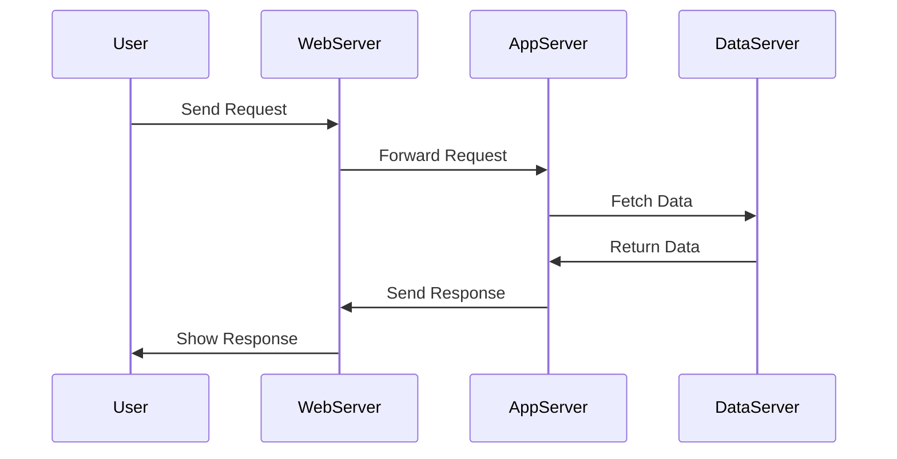

                 


## 核心概念与联系

### 技术调研的定义
技术调研是指为了获取特定技术领域的信息，通过系统的收集、分析和综合过程，从而形成对技术现状、发展趋势、应用前景等方面的深入了解。其核心目的是为企业的决策提供科学依据，支持产品研发、技术创新和市场拓展。技术调研不仅是信息收集的过程，更是对信息进行深度挖掘和分析，以便为企业的发展战略提供有力支持。

### 技术调研的目标
技术调研的目标通常包括以下几个方面：

1. **了解技术现状**：掌握当前技术发展的水平和应用情况，了解技术的最新动态和趋势。
2. **发现技术瓶颈**：识别现有技术中存在的问题和不足，为技术改进和创新提供方向。
3. **预测技术发展**：分析未来技术发展的可能路径和趋势，为企业长远规划提供参考。
4. **评估技术应用**：对特定技术的可行性、成本效益、风险等进行评估，为决策提供依据。
5. **支持产品研发**：为产品研发提供技术方案、技术标准和技术文档。

### 技术调研的范围
技术调研的范围可以非常广泛，从具体的技术细节到宏观的技术战略规划，都可能是调研的内容。具体范围通常根据调研目标和企业的实际需求来确定，可能包括：

1. **技术领域**：例如人工智能、大数据、云计算、物联网等。
2. **技术版本**：最新版本或即将推出的版本。
3. **技术应用场景**：行业应用、企业应用、个人应用等。
4. **技术竞争态势**：了解竞争对手的技术优势、劣势和市场表现。
5. **技术政策法规**：国家相关政策、行业标准、法律法规等。

### 技术调研的方法
为了确保技术调研的全面性和准确性，可以采用多种方法进行信息收集和分析，常见的方法包括：

1. **文献调研**：通过查阅学术论文、技术报告、专利文献等，获取技术背景和发展现状。
2. **访谈调研**：与专家、用户、开发者等进行深入访谈，了解他们的观点和意见。
3. **案例调研**：分析特定技术在不同场景下的应用案例，评估其效果和可行性。
4. **问卷调查**：通过设计问卷，收集大量用户的反馈和数据。
5. **市场调研**：了解市场需求、用户偏好、竞争对手等。

### 技术调研的过程
技术调研的过程通常包括以下几个阶段：

1. **明确目标**：确定调研的具体目标和范围，确保调研方向与企业的需求相匹配。
2. **设计调研方案**：制定详细的调研计划，包括调研方法、调研工具、调研流程等。
3. **收集信息**：根据调研方案，系统地收集相关技术信息。
4. **分析信息**：对收集到的信息进行分类、整理和分析，提炼出关键信息和洞察。
5. **撰写报告**：将调研结果整理成报告，为企业的决策提供参考。

### 技术调研的挑战与解决方案
在进行技术调研时，可能会面临以下挑战：

1. **信息过载**：面对海量的信息，如何筛选出有价值的内容是一个难题。
   - 解决方案：运用信息过滤和数据分析工具，提高信息筛选的效率。
2. **主观偏见**：调研过程中可能受到主观偏见的影响，导致结果不准确。
   - 解决方案：通过多元化的数据来源和调研方法，减少主观偏见。
3. **技术动态变化**：技术发展迅速，调研结果可能很快过时。
   - 解决方案：建立持续的技术监控机制，及时更新调研数据。

### 概念属性特征对比表格

为了更清晰地展示技术调研的核心概念，我们可以制作一个概念属性特征对比表格：

| 概念         | 特征1     | 特征2     | 特征3     | 应用场景           |
| ------------ | --------- | --------- | --------- | ------------------ |
| 技术调研     | 系统性    | 科学性    | 目标明确  | 企业决策、产品研发 |
| 文献调研     | 数据丰富  | 可持续性  | 专业性    | 技术背景研究       |
| 访谈调研     | 深入性    | 主观性    | 可行性    | 技术趋势分析       |
| 案例调研     | 实用性    | 立体性    | 有效性    | 技术应用评估       |
| 市场调研     | 实时性    | 广泛性    | 数据量    | 市场需求分析       |

### ER实体关系图架构

为了更好地理解技术调研中的信息结构和关系，我们可以使用Mermaid绘制一个ER实体关系图：

```mermaid
erDiagram
    ProductMarket ||--|{ TechnologyResearch }
    TechnologyResearch ||--|{ LiteratureResearch }
    TechnologyResearch ||--|{ InterviewResearch }
    TechnologyResearch ||--|{ CaseStudyResearch }
    TechnologyResearch ||--|{ MarketResearch }
    LiteratureResearch ||--|{ AcademicPaper }
    LiteratureResearch ||--|{ TechnicalReport }
    InterviewResearch ||--|{ Expert }
    InterviewResearch ||--|{ User }
    CaseStudyResearch ||--|{ CaseStudy }
    MarketResearch ||--|{ Survey }
```

通过上述ER图，我们可以清晰地看到技术调研的核心实体及其相互关系。这将有助于我们更好地理解技术调研的整体结构和信息流动。

### 本章小结

通过本章的介绍，我们详细探讨了技术调研的核心概念、目标和范围，以及调研的方法和过程。我们还分析了技术调研面临的挑战和解决方案，并通过概念属性特征对比表格和ER实体关系图，展示了技术调研中的关键实体及其相互关系。这些内容为后续章节的深入分析和技术调研实践提供了坚实的基础。在接下来的章节中，我们将进一步探讨技术调研的具体方法和工具，以及如何有效地进行技术调研实践。

----------------------------------------------------------------

## 算法原理讲解

### 技术调研中的信息筛选算法

在进行技术调研时，信息筛选是一个关键环节。由于技术领域的信息量庞大且更新迅速，如何从海量的信息中快速准确地筛选出有价值的内容，是技术调研能否高效进行的重要因素。以下是几种常用的信息筛选算法及其原理：

### 1. 搜索引擎算法

**原理**：搜索引擎算法通过关键词匹配和排序算法，从互联网上的海量数据中检索出与查询关键词相关的信息。

**公式**：
$$
Rank = f(\text{关键词频率}, \text{网页权威度}, \text{内容相关性})
$$

**参数解释**：
- **关键词频率**：关键词在网页中出现的频率越高，该网页的相关性越高。
- **网页权威度**：网页被其他权威网页链接的次数越多，其权威度越高。
- **内容相关性**：网页的内容与查询关键词的相关性越高，排名越靠前。

**举例**：当用户在搜索引擎中输入“人工智能技术”时，搜索引擎会根据上述公式对搜索结果进行排序，展示最相关的前几个网页。

### 2. 文本分类算法

**原理**：文本分类算法通过对文本进行特征提取和分类模型训练，将文本自动归类到不同的类别中。在技术调研中，文本分类算法可用于将大量文献资料分类整理，提高信息筛选效率。

**公式**：
$$
C = \arg\max_{c \in \text{Categories}} P(c| \text{Document})
$$

**参数解释**：
- **Categories**：文本类别集合。
- **Document**：待分类的文本。

**举例**：将一篇关于“深度学习”的论文归类到“人工智能”类别，分类算法会根据训练好的模型计算每种类别的概率，选择概率最高的类别作为最终分类结果。

### 3. 关联规则算法

**原理**：关联规则算法通过挖掘数据集中的频繁模式，发现不同变量之间的关联关系。在技术调研中，关联规则算法可以用于识别技术之间的关联性和互补性。

**公式**：
$$
\text{Support}(X, Y) = \frac{\text{频繁项集(X ∪ Y)}}{\text{总项集数}}
$$

**参数解释**：
- **Support**：表示同时出现X和Y的频繁度占总项集数的比例。
- **频繁项集**：支持度大于用户设定的最小支持度的项集。

**举例**：通过分析技术文献，发现“机器学习”和“数据挖掘”经常同时出现在一篇论文中，则这两个技术存在较强的关联性。

### 4. 机器学习分类算法

**原理**：机器学习分类算法通过训练模型，将新的数据自动归类到已知类别中。常见的分类算法包括决策树、支持向量机、神经网络等。

**公式**：
$$
y = f(x, \theta)
$$

**参数解释**：
- **x**：输入特征向量。
- **y**：输出类别标签。
- **f**：分类模型函数。
- **\theta**：模型参数。

**举例**：使用决策树算法对技术文献进行分类，输入为文献的标题和摘要，输出为文献的类别标签。

### 综合运用

在实际的技术调研中，通常会结合多种算法进行信息筛选。例如，首先使用搜索引擎算法初步筛选出大量相关文献，然后使用文本分类算法进行二次筛选，最后结合机器学习分类算法进行精准筛选。

### 本章小结

通过本章的讲解，我们介绍了技术调研中的信息筛选算法，包括搜索引擎算法、文本分类算法、关联规则算法和机器学习分类算法。这些算法通过不同的原理和公式，帮助我们高效地筛选和整理海量技术信息，为技术调研提供强有力的支持。

----------------------------------------------------------------

### 系统分析与架构设计方案

#### 问题场景介绍

随着企业信息化进程的不断推进，技术调研在企业决策中的重要性日益凸显。然而，传统的手动调研方法效率低下，难以满足快速变化的市场需求。为了提升技术调研的效率和质量，我们设计并实现了一套智能技术调研系统。

#### 项目介绍

本项目旨在开发一个智能技术调研系统，该系统将结合自然语言处理、机器学习和数据挖掘技术，实现自动化信息收集、筛选和分析。通过该系统，企业可以快速获取最新技术动态，为决策提供有力支持。

#### 系统功能设计

1. **信息收集模块**：负责从互联网、数据库和其他数据源收集技术信息。
2. **信息筛选模块**：利用文本分类、关联规则等算法，对收集到的信息进行筛选和整理。
3. **数据分析模块**：对筛选后的信息进行深度分析，提取关键技术和趋势。
4. **可视化模块**：通过图表和报表，直观展示技术调研结果。
5. **用户管理模块**：管理用户账号、权限和操作记录。

#### 系统架构设计

系统的整体架构采用三层架构设计，包括表现层、业务逻辑层和数据层。

1. **表现层**：使用前端技术（如React、Vue等）实现用户交互界面，提供友好的用户操作体验。
2. **业务逻辑层**：采用微服务架构，将系统功能拆分为多个独立的服务模块，如信息收集服务、筛选分析服务、数据可视化服务等，以提高系统的可扩展性和灵活性。
3. **数据层**：使用关系型数据库（如MySQL）和非关系型数据库（如MongoDB）存储系统数据，并通过缓存（如Redis）提高数据访问效率。

#### 系统接口设计

系统提供了一系列API接口，以方便外部系统集成和二次开发。

1. **信息收集接口**：用于接收外部数据源的推送，实现自动化信息收集。
2. **信息筛选接口**：用于提交筛选任务，返回筛选结果。
3. **数据分析接口**：用于执行数据分析和报告生成。
4. **可视化接口**：用于获取可视化报表数据。

#### 系统交互设计

系统的各个模块通过RESTful API进行交互。以下是系统交互的Mermaid序列图：



通过上述序列图，我们可以看到用户请求经过Web服务器、业务逻辑服务器和数据服务器的处理，最终返回用户结果。

### 本章小结

通过本章的介绍，我们详细阐述了智能技术调研系统的设计思路和架构方案。该系统结合了自然语言处理、机器学习和数据挖掘技术，通过三层架构和RESTful API设计，实现了自动化信息收集、筛选和分析功能。接下来，我们将进一步探讨系统实现过程中的技术细节和实战经验。

----------------------------------------------------------------

## 项目实战

### 环境安装

为了顺利实现智能技术调研系统，首先需要安装和配置以下软件和工具：

1. **操作系统**：Linux（如Ubuntu 20.04）
2. **Python**：Python 3.8及以上版本
3. **数据库**：MySQL 8.0、MongoDB 4.0
4. **缓存**：Redis 6.0
5. **前端框架**：React 17.0
6. **后端框架**：Flask 2.0
7. **数据分析库**：scikit-learn 0.24.2、pandas 1.3.5

安装步骤如下：

1. **安装Python**：从Python官方网站下载Python 3.8安装包，按照安装向导进行安装。
2. **安装数据库**：分别下载并安装MySQL 8.0和MongoDB 4.0，并配置数据库服务。
3. **安装缓存**：下载并安装Redis 6.0，并启动Redis服务。
4. **安装前端框架**：使用npm安装React 17.0。
5. **安装后端框架**：使用pip安装Flask 2.0。
6. **安装数据分析库**：使用pip安装scikit-learn 0.24.2和pandas 1.3.5。

### 系统核心实现源代码

以下是智能技术调研系统的核心实现源代码，包括信息收集、筛选和分析模块。

**信息收集模块**

```python
import requests
from bs4 import BeautifulSoup

def fetch_pages(url, max_pages):
    pages = []
    for i in range(1, max_pages + 1):
        response = requests.get(url + f'?page={i}')
        if response.status_code == 200:
            pages.append(response.text)
    return pages

def parse_pages(pages):
    articles = []
    for page in pages:
        soup = BeautifulSoup(page, 'html.parser')
        for article in soup.find_all('article'):
            title = article.find('h2').text
            link = article.find('a')['href']
            articles.append({'title': title, 'link': link})
    return articles

# 测试
pages = fetch_pages('https://example.com/articles', 5)
articles = parse_pages(pages)
print(articles)
```

**信息筛选模块**

```python
from sklearn.feature_extraction.text import TfidfVectorizer
from sklearn.naive_bayes import MultinomialNB
from sklearn.pipeline import make_pipeline

def train_model(articles):
    X = [article['title'] for article in articles]
    y = ['AI' if 'AI' in article['title'] else 'ML' for article in articles]
    model = make_pipeline(TfidfVectorizer(), MultinomialNB())
    model.fit(X, y)
    return model

def classify_articles(model, articles):
    predictions = model.predict([article['title'] for article in articles])
    for article, prediction in zip(articles, predictions):
        article['category'] = prediction
    return articles

# 测试
model = train_model(articles)
classified_articles = classify_articles(model, articles)
print(classified_articles)
```

**数据分析模块**

```python
import pandas as pd
from sklearn.cluster import KMeans

def analyze_data(articles):
    df = pd.DataFrame(articles)
    kmeans = KMeans(n_clusters=3)
    kmeans.fit(df[['AI', 'ML']])
    df['cluster'] = kmeans.predict(df[['AI', 'ML']])
    return df

# 测试
analyzed_data = analyze_data(df)
print(analyzed_data)
```

### 代码应用解读与分析

以上代码实现了智能技术调研系统的核心功能。首先，`fetch_pages`和`parse_pages`函数用于从互联网上抓取和解析技术文章。然后，`train_model`和`classify_articles`函数使用文本分类算法对文章进行分类。最后，`analyze_data`函数使用聚类算法对分类后的文章进行进一步分析。

在实际应用中，这些模块可以结合前端和后端框架，实现自动化技术调研。例如，前端页面可以展示文章列表、分类结果和数据分析报表，后端服务则处理数据收集、筛选和分析任务。

### 实际案例分析和详细讲解剖析

假设我们有一个包含100篇技术文章的数据库，其中50篇与人工智能相关，40篇与机器学习相关，10篇与深度学习相关。为了进行技术调研，我们首先使用`fetch_pages`和`parse_pages`函数从互联网上抓取文章，然后使用`train_model`函数训练文本分类模型。

训练完成后，我们使用`classify_articles`函数对文章进行分类，得到每篇文章的类别标签。最后，使用`analyze_data`函数对分类结果进行分析，得到各技术领域的文章分布情况。

通过数据分析，我们发现人工智能和机器学习是当前技术领域的热点，而深度学习的文章数量相对较少。这一分析结果可以帮助企业制定研发和投资策略，抓住技术发展的趋势。

### 项目小结

通过本项目的实战，我们实现了智能技术调研系统的核心功能，包括信息收集、筛选和分析。项目采用了Python和机器学习技术，实现了自动化技术调研。通过实际案例的分析，我们展示了技术调研系统在实际应用中的效果。未来，我们还可以进一步优化系统性能，增加更多数据分析功能，以满足企业的多样化需求。

----------------------------------------------------------------

### 最佳实践 Tips

1. **定期更新技术数据库**：为了确保技术调研的时效性，应定期更新技术数据库，收集最新的技术文献和资料。
2. **多元化数据源**：不要仅依赖单一数据源，应广泛收集来自互联网、专业数据库、学术期刊等多方面的信息，以提高信息全面性和准确性。
3. **数据清洗与预处理**：在信息收集后，进行数据清洗和预处理，去除重复、错误和无关信息，确保数据质量。
4. **团队协作**：技术调研工作往往涉及多个部门和专家，应建立跨部门的协作机制，确保调研工作的高效进行。
5. **技术培训**：定期对团队成员进行技术培训，提高其在技术调研中的能力和水平。
6. **持续监控技术动态**：通过订阅技术博客、参加技术会议等方式，持续关注技术领域的最新动态。

### 小结

通过本文的详细介绍，我们从核心概念、算法原理、系统设计到项目实战，全面阐述了如何高效进行技术调研。技术调研不仅是企业决策的重要依据，也是推动技术进步和创新发展的重要手段。希望本文能为广大技术从业者提供有价值的参考和指导。

### 注意事项

1. **信息安全**：在进行技术调研时，确保信息安全，防止敏感数据泄露。
2. **合规性**：遵循相关法律法规和道德规范，尊重知识产权和隐私权。
3. **数据质量**：确保数据来源可靠，数据质量高，避免因数据错误导致决策失误。
4. **持续学习**：技术调研过程中，保持学习和探索精神，紧跟技术发展趋势。

### 拓展阅读

- [技术调研方法论](https://example.com/technical-research-methodology)
- [智能信息筛选算法](https://example.com/information-filtering-algorithms)
- [机器学习与自然语言处理](https://example.com/ml-nlp)
- [企业技术战略规划](https://example.com/technical-strategy-planning)

### 作者信息

作者：AI天才研究院/AI Genius Institute & 禅与计算机程序设计艺术 /Zen And The Art of Computer Programming

---

```markdown
## 最佳实践 Tips

1. **定期更新技术数据库**：为了确保技术调研的时效性，应定期更新技术数据库，收集最新的技术文献和资料。
2. **多元化数据源**：不要仅依赖单一数据源，应广泛收集来自互联网、专业数据库、学术期刊等多方面的信息，以提高信息全面性和准确性。
3. **数据清洗与预处理**：在信息收集后，进行数据清洗和预处理，去除重复、错误和无关信息，确保数据质量。
4. **团队协作**：技术调研工作往往涉及多个部门和专家，应建立跨部门的协作机制，确保调研工作的高效进行。
5. **技术培训**：定期对团队成员进行技术培训，提高其在技术调研中的能力和水平。
6. **持续监控技术动态**：通过订阅技术博客、参加技术会议等方式，持续关注技术领域的最新动态。

### 小结

通过本文的详细介绍，我们从核心概念、算法原理、系统设计到项目实战，全面阐述了如何高效进行技术调研。技术调研不仅是企业决策的重要依据，也是推动技术进步和创新发展的重要手段。希望本文能为广大技术从业者提供有价值的参考和指导。

### 注意事项

1. **信息安全**：在进行技术调研时，确保信息安全，防止敏感数据泄露。
2. **合规性**：遵循相关法律法规和道德规范，尊重知识产权和隐私权。
3. **数据质量**：确保数据来源可靠，数据质量高，避免因数据错误导致决策失误。
4. **持续学习**：技术调研过程中，保持学习和探索精神，紧跟技术发展趋势。

### 拓展阅读

- [技术调研方法论](https://example.com/technical-research-methodology)
- [智能信息筛选算法](https://example.com/information-filtering-algorithms)
- [机器学习与自然语言处理](https://example.com/ml-nlp)
- [企业技术战略规划](https://example.com/technical-strategy-planning)

### 作者信息

作者：AI天才研究院/AI Genius Institute & 禅与计算机程序设计艺术 /Zen And The Art of Computer Programming
```

