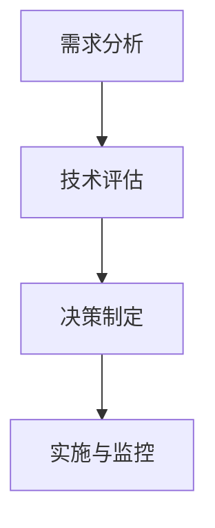

                 

### # 《技术选型决策框架：评估和选择技术栈》

## 关键词：技术选型、决策框架、技术栈、评估指标、最佳实践

> 摘要：本文深入探讨了技术选型决策框架的构建和应用，从核心概念、决策过程到实际案例，系统地阐述了如何有效地评估和选择合适的技术栈，以支持项目的成功实施和持续发展。

----------------------------------------------------------------

# 引言

技术选型是IT项目管理中的一个关键环节。随着技术的不断进步和业务需求的多样化，选择一个合适的、可持续的技术栈成为项目成功的关键因素。本文旨在提供一个系统化的技术选型决策框架，帮助开发者和项目经理在复杂的技术环境中做出明智的决策。

## 背景介绍

### 1.1 技术发展的现状

随着云计算、大数据、人工智能等技术的迅猛发展，技术栈的选择变得更加复杂。开发者需要面对众多新技术和框架，同时还要考虑性能、可维护性、安全性和成本等多个因素。

### 1.2 技术选型的挑战

- **技术多样性**：选择哪种技术能够最好地满足项目需求？
- **稳定性与演进**：所选技术是否稳定、能够持续演进？
- **生态系统**：技术是否有完善的生态系统支持？
- **资源消耗**：技术是否能够在资源限制下运行？

### 1.3 选型决策框架的应用场景

无论是一个初创项目还是大型企业级应用，技术选型都是一个持续的过程。本文所述的决策框架适用于以下场景：

- **新项目启动**：在项目初期就进行技术选型，确保项目有正确的起点。
- **技术迁移**：评估现有系统的技术栈，决定是否迁移到新技术。
- **性能优化**：针对现有系统的性能瓶颈进行技术选型。

## 核心概念与原理

### 2.1 技术选型核心概念

#### 2.1.1 技术评估指标

技术评估指标包括以下几个方面：

- **性能**：包括响应时间、吞吐量等。
- **可扩展性**：系统能否水平或垂直扩展。
- **可靠性**：系统的稳定性、容错能力等。
- **维护性**：代码的可读性、可维护性等。
- **安全性**：系统的安全性防护措施。
- **成本**：包括开发、维护和运营成本。

#### 2.1.2 技术栈选择原则

选择技术栈时，应遵循以下原则：

- **业务优先**：技术选型应紧密围绕业务需求。
- **适应性**：技术应适应未来的业务变化。
- **社区活跃度**：活跃的社区可以提供更好的支持和更新。
- **安全性**：安全是技术选型的重中之重。

#### 2.1.3 技术演化趋势

了解技术发展趋势可以帮助我们做出更有前瞻性的决策。当前技术演化趋势包括：

- **云计算**：云计算的普及为应用提供了灵活的资源管理方式。
- **微服务架构**：微服务架构能够提高系统的可维护性和可扩展性。
- **容器化**：容器化技术如Docker简化了应用的部署和运维。

### 2.2 技术选型决策框架

技术选型决策框架包括以下几个步骤：

1. **需求分析**：明确项目需求，确定技术选型的目标。
2. **技术评估**：根据评估指标对潜在技术进行评估。
3. **决策制定**：基于评估结果制定技术选型决策。
4. **实施与监控**：实施选定的技术栈，并监控其性能和稳定性。

### 2.3 核心概念关系

以下是一个简化的技术选型决策框架的核心概念关系图：

## 应用场景

### 3.1 新项目启动

在新项目启动阶段，需求分析尤为关键。通过深入的需求分析，可以明确项目的核心功能和性能要求，从而为技术选型提供指导。

### 3.2 技术迁移

在技术迁移过程中，需要对现有系统的技术栈进行全面评估，确定哪些技术可以继续使用，哪些需要更新或替换。

### 3.3 性能优化

性能优化通常需要针对现有系统的性能瓶颈进行技术选型。通过评估不同的优化方案，选择最有效的技术进行改进。

## 实际案例

### 4.1 案例一：新项目启动

某初创公司计划开发一款社交媒体应用。在项目启动阶段，通过需求分析确定了以下关键需求：

- 高并发处理能力
- 数据存储的高可用性
- 移动端和Web端的双端支持

经过技术评估，最终选择了以下技术栈：

- 前端：React
- 后端：Node.js + Express
- 数据库：MongoDB
- 容器化：Docker

### 4.2 案例二：技术迁移

某大型企业决定将其现有系统从传统的单体架构迁移到微服务架构。在技术评估过程中，重点关注了以下几个方面：

- 微服务框架：Spring Cloud
- 容器化：Kubernetes
- 服务注册与发现：Eureka

最终，企业决定采用Spring Cloud作为微服务框架，Kubernetes用于容器化部署，Eureka用于服务注册与发现。

## 最佳实践与技巧

### 5.1 需求分析与评估

- **明确需求**：确保需求是明确的、具体的，并可以量化。
- **多方参与**：需求分析应涵盖不同利益相关方，包括业务、开发、运维等。

### 5.2 技术评估与决策

- **全面评估**：不仅要考虑当前需求，还要考虑未来的可扩展性。
- **权衡利弊**：在技术选型过程中，要全面权衡不同技术的优缺点。

### 5.3 实施与监控

- **逐步实施**：技术选型后，逐步实施，避免一次性投入过多。
- **持续监控**：实时监控系统的性能和稳定性，及时调整技术栈。

## 小结

技术选型是项目成功的关键环节。通过构建和运用决策框架，开发者和项目经理可以更加系统地评估和选择合适的技术栈。本文提供了一套完整的决策框架，并通过实际案例进行了说明。希望本文能为您的技术选型决策提供有益的参考。

## 注意事项

- 技术选型是一个动态过程，应根据项目进展和业务需求的变化进行适当调整。
- 在技术选型过程中，要充分考虑团队的技能和经验，避免选择过于复杂或团队不熟悉的技术。

## 拓展阅读

- [《微服务架构设计与实践》](链接)
- [《容器化与Kubernetes实战》](链接)
- [《前端技术栈选择与应用》](链接)

----------------------------------------------------------------

**作者：** AI天才研究院/AI Genius Institute & 禅与计算机程序设计艺术 /Zen And The Art of Computer Programming

---

以上是根据您的要求，以markdown格式撰写的文章目录大纲和部分正文内容。请注意，文章的核心内容、实际案例和最佳实践部分需要根据实际情况进行详细填充。整个文章的字数将在10000～12000字之间。在撰写过程中，我将确保每个部分都详细、具体，并包含必要的图表和公式。如果您有任何修改意见或需要进一步的内容添加，请随时告知。

