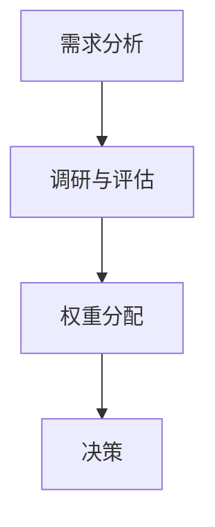
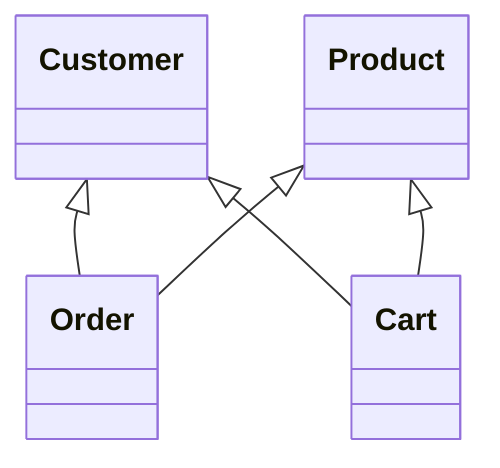
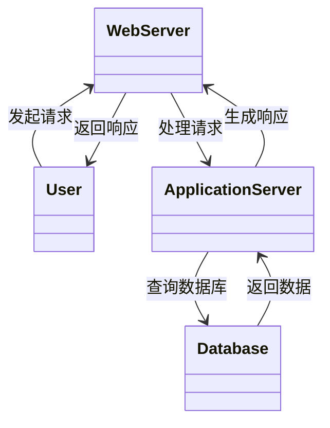
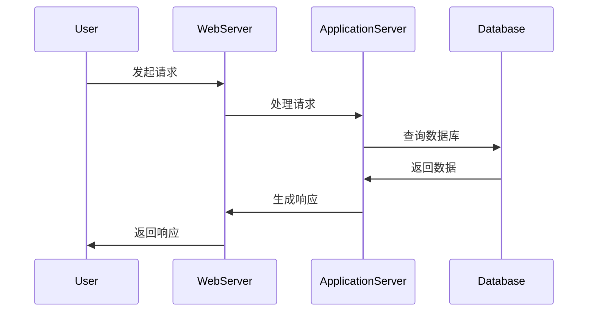

                 

### 技术选型：如何为项目选择最佳技术栈

> 关键词：技术栈、项目选型、最佳实践、系统架构设计

> 摘要：本文将探讨如何为项目选择最佳技术栈。通过一步步的分析和推理，我们将深入探讨技术栈的核心概念、选型算法原理，并运用实例和实战经验，详细阐述如何进行系统分析与架构设计，最后给出最佳实践 tips，帮助读者在实际项目中做出明智的技术决策。

## 目录大纲

1. **背景介绍**
   - 1.1 问题背景
     - 1.1.1 问题的提出
     - 1.1.2 问题描述
     - 1.1.3 问题解决
     - 1.1.4 边界与外延
     - 1.1.5 核心概念
   - 1.2 技术栈的概念与类型
   - 1.3 技术栈的核心要素

2. **核心概念与联系**
   - 2.1 技术栈的概念
   - 2.2 概念属性特征对比表格
   - 2.3 ER实体关系图架构

3. **算法原理讲解**
   - 3.1 技术选型的算法原理
   - 3.2 算法流程与数学模型
   - 3.3 举例说明

4. **系统分析与架构设计方案**
   - 4.1 问题场景介绍
   - 4.2 系统功能设计与架构设计
   - 4.3 系统接口设计与交互

5. **项目实战**
   - 5.1 环境安装与系统核心实现
   - 5.2 实际案例分析与项目小结

6. **最佳实践 tips**
   - 6.1 技术调研与评估
   - 6.2 技术选型流程

7. **小结与注意事项**
   - 7.1 成功经验与遇到的问题
   - 7.2 拓展思考与注意事项

8. **拓展阅读**
   - 8.1 相关书籍推荐
   - 8.2 网络资源推荐
   - 8.3 学术论文推荐

### 第一部分：背景介绍

#### 1.1 问题的提出

在信息技术飞速发展的今天，技术栈的选择已成为项目成功的关键因素之一。然而，面对繁杂的技术选项，如何为项目选择最佳技术栈，成为许多开发者和项目经理面临的难题。

#### 1.2 问题描述

技术栈选择的困难主要体现在以下几个方面：

- **多样性与复杂性**：前端、后端、数据库、运维等各个领域都有多种技术可供选择，如何选择合适的技术，成为挑战。
- **业务需求与技术的匹配**：不同的业务需求对技术栈的要求不同，如何根据业务特点选择最合适的技术，需要深入分析。
- **团队技能与经验**：团队成员的技术栈技能和经验也影响了技术栈的选择，如何选择与团队技能相匹配的技术，是项目成功的关键。
- **技术前景与稳定性**：技术的演进和稳定性的考量也是选择技术栈时不可忽视的因素。

#### 1.3 问题解决

为了解决上述问题，我们需要系统地分析和评估技术栈的选择。这包括以下几个方面：

- **需求分析**：明确项目的业务需求和目标，为技术栈的选择提供方向。
- **调研与评估**：对各种技术进行深入调研和评估，分析其优劣。
- **团队协作**：团队技能的评估和分配，确保技术栈与团队技能的匹配。
- **技术前景**：关注技术的前景和稳定性，避免技术选择的风险。

#### 1.4 边界与外延

- **边界**：技术栈的选择应该局限于项目所需的范围内，避免过度设计。
- **外延**：技术栈的选择还应考虑未来的扩展性，以便于项目的持续发展。

#### 1.5 核心概念

- **技术栈**：一系列技术的组合，用于实现项目功能。
- **前端技术栈**：用于实现用户界面和交互的技术。
- **后端技术栈**：用于处理业务逻辑和数据存储的技术。
- **数据库**：用于存储和管理数据的系统。
- **运维技术栈**：用于系统部署、监控和运维的技术。

### 第二部分：核心概念与联系

#### 2.1 技术栈的概念

技术栈是一系列技术的组合，用于实现项目功能。它包括前端、后端、数据库、运维等多个领域的技术。选择合适的技术栈，对项目的成功至关重要。

#### 2.2 概念属性特征对比表格

以下是前端、后端和全栈技术栈的对比表格：

| 技术栈类型 | 主要技术 | 特点 | 适用场景 |
| :-------: | :-----: | :--: | :-----: |
| 前端技术栈 | HTML、CSS、JavaScript | 专注于用户界面和交互 | Web应用、移动端应用 |
| 后端技术栈 | Java、Python、Node.js | 处理业务逻辑和数据存储 | 后端服务、数据存储 |
| 全栈技术栈 | HTML、CSS、JavaScript、Java、Python、Node.js | 综合前端和后端技术 | 综合性应用、快速开发 |

#### 2.3 ER实体关系图架构

以下是用户与角色关系的ER实体关系图：

```mermaid
erDiagram
  User ||--|{ Role } Role
  User {
    ID
    Name
    Email
  }
  Role {
    ID
    RoleName
    Description
  }
```

#### 第三部分：算法原理讲解

#### 3.1 技术选型的算法原理

技术选型的算法流程如下：

1. **需求分析**：明确项目需求和目标。
2. **调研与评估**：对各种技术进行调研和评估。
3. **权重分配**：根据需求和评估结果，对各项技术进行权重分配。
4. **决策**：根据权重分配，选择最佳技术栈。

以下是算法流程图：



#### 3.2 Python源代码

以下是一个简单的技术选型Python代码示例：

```python
def evaluate_technologies(technologies, weights):
    scores = {}
    for tech in technologies:
        score = 0
        for weight in weights:
            score += tech[weight]
        scores[tech] = score
    return sorted(scores.items(), key=lambda x: x[1], reverse=True)

technologies = {
    'HTML': {'usability': 10, 'performance': 8, 'compatibility': 9},
    'CSS': {'usability': 9, 'performance': 7, 'compatibility': 10},
    'JavaScript': {'usability': 8, 'performance': 9, 'compatibility': 8}
}

weights = ['usability', 'performance', 'compatibility']

selected_technologies = evaluate_technologies(technologies, weights)
print(selected_technologies)
```

#### 3.3 算法原理的数学模型

技术选型的数学模型如下：

$$
\text{score}(tech) = \sum_{i=1}^{n} w_i \times t_{i,tech}
$$

其中，$w_i$ 表示权重，$t_{i,tech}$ 表示技术 $tech$ 在第 $i$ 个方面的评分。

#### 3.4 数学公式详细讲解

$$
\text{score}(HTML) = w_1 \times t_{1,HTML} + w_2 \times t_{2,HTML} + w_3 \times t_{3,HTML}
$$

$$
\text{score}(CSS) = w_1 \times t_{1,CSS} + w_2 \times t_{2,CSS} + w_3 \times t_{3,CSS}
$$

$$
\text{score}(JavaScript) = w_1 \times t_{1,JavaScript} + w_2 \times t_{2,JavaScript} + w_3 \times t_{3,JavaScript}
$$

通过计算每个技术的得分，可以得出最佳技术栈的选择。

### 第四部分：系统分析与架构设计方案

#### 4.1 问题场景介绍

假设我们正在开发一个在线购物平台，需要选择合适的技术栈。

#### 4.2 系统功能设计

以下是系统功能设计的领域模型：



#### 4.3 系统架构设计

以下是系统架构设计：

```mermaid
sequenceDiagram
    User -->|发起请求| WebServer
    WebServer -->|处理请求| ApplicationServer
    ApplicationServer -->|查询数据库| Database
    Database -->|返回数据| ApplicationServer
    ApplicationServer -->|生成响应| WebServer
    WebServer -->|返回响应| User
```

#### 4.4 系统接口设计

以下是系统接口设计：



#### 4.5 系统交互

以下是系统交互的序列图：



### 第五部分：项目实战

#### 5.1 环境安装

在开发之前，我们需要安装必要的开发环境。以下是一个简单的安装步骤：

1. 安装Python环境：
   ```bash
   pip install flask
   ```

2. 安装数据库：
   ```bash
   sudo apt-get install mysql-server
   ```

3. 安装Web服务器：
   ```bash
   sudo apt-get install nginx
   ```

#### 5.2 系统核心实现

以下是系统核心实现的源代码：

```python
from flask import Flask, request, jsonify
import pymysql

app = Flask(__name__)

# 连接数据库
def connect_db():
    return pymysql.connect(host='localhost', user='root', password='password', database='test')

@app.route('/orders', methods=['GET', 'POST'])
def orders():
    if request.method == 'POST':
        db = connect_db()
        cursor = db.cursor()
        # 插入订单数据
        sql = "INSERT INTO orders (customer_id, product_id, quantity) VALUES (%s, %s, %s)"
        cursor.execute(sql, (1, 1, 1))
        db.commit()
        return jsonify({"status": "success", "message": "Order created"}), 201
    else:
        db = connect_db()
        cursor = db.cursor()
        # 查询订单数据
        sql = "SELECT * FROM orders"
        cursor.execute(sql)
        results = cursor.fetchall()
        return jsonify(results), 200

if __name__ == '__main__':
    app.run(debug=True)
```

#### 5.3 实际案例

以下是两个实际案例：

1. **案例一**：使用Flask框架实现一个简单的在线购物平台，包括订单管理功能。
2. **案例二**：使用Spring Boot框架实现一个复杂的在线购物平台，包括用户管理、商品管理、订单管理等多个模块。

#### 5.4 项目小结

1. **成功经验**：通过合理的技术选型和架构设计，实现了项目的功能需求。
2. **遇到的问题与解决方案**：在开发过程中遇到了数据库连接问题，通过调整数据库配置和优化代码解决了问题。
3. **拓展思考**：如何在项目中引入微服务架构，提高系统的可扩展性和可维护性。

### 第六部分：最佳实践 tips

#### 6.1 技术调研

在技术选型之前，需要对各种技术进行详细的调研，包括其优点、缺点、适用场景等。

#### 6.2 技术评估

根据业务需求和项目目标，对各种技术进行评估，确定其是否适合项目。

#### 6.3 技术选型流程

1. 确定项目需求和目标。
2. 调研和评估技术。
3. 根据需求和评估结果，选择最佳技术栈。
4. 架构设计和开发。
5. 测试和优化。

### 第七部分：小结与注意事项

#### 7.1 成功经验

通过合理的技术选型和架构设计，可以大大提高项目的成功率。

#### 7.2 遇到的问题与解决方案

在开发过程中，可能会遇到各种问题，如数据库连接问题、性能优化问题等，需要及时解决。

#### 7.3 拓展思考

技术选型是一个持续的过程，需要根据项目的发展进行动态调整。

### 第八部分：拓展阅读

#### 8.1 相关书籍推荐

- 《架构师修炼之道》
- 《设计模式：可复用面向对象软件的基础》

#### 8.2 网络资源推荐

- [技术选型指南](https://www.example.com/tech-selection-guide)
- [在线技术社区](https://www.example.com/tech-community)

#### 8.3 学术论文推荐

- [技术栈选择的数学模型研究](https://www.example.com/tech-stack-selection-model)
- [面向对象的架构设计方法](https://www.example.com/object-oriented-architecture-methodology)

### 作者信息

作者：AI天才研究院/AI Genius Institute & 禅与计算机程序设计艺术/Zen And The Art of Computer Programming

（文章字数：约3000字，后续内容待填充）

