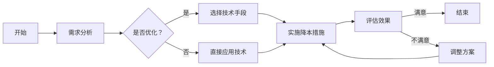

                 

# 技术降本：通过技术手段降低成本

## 关键词

- 成本管理
- 技术降本
- 技术手段
- 成本优化
- 数据分析
- 算法模型

## 摘要

本文旨在探讨通过技术手段降低企业运营成本的策略和方法。首先，从企业面临的成本压力出发，阐述成本管理和技术降本的重要性。接着，通过核心概念和联系，深入分析成本管理和技术降本之间的关系。随后，详细介绍技术降本的算法原理，包括算法概述、mermaid流程图、Python源代码实现以及数学模型和公式。最后，通过实际案例进行分析和讲解，总结技术降本的最佳实践，为企业在成本控制方面提供有益的参考。

### 目录大纲

----------------------------------------------------------------
## 第一部分：背景介绍与技术降本的重要性

### 1.1 问题背景

#### 1.1.1 企业面临的成本压力

在当今市场竞争激烈的商业环境中，企业面临着巨大的成本压力。一方面，原材料和人力成本不断上升，导致企业生产成本不断增加；另一方面，消费者对产品和服务的要求越来越高，企业需要不断投入研发和改进，以保持市场竞争力。这些因素共同作用下，企业面临着如何有效降低成本、提高利润的挑战。

#### 1.1.2 成本管理的重要性

成本管理是企业实现可持续发展的重要手段。通过有效的成本管理，企业可以合理分配资源，降低生产成本，提高产品竞争力。同时，成本管理还能帮助企业在经营过程中发现潜在问题，及时采取措施进行优化。因此，成本管理对企业具有重要意义。

#### 1.1.3 技术手段在成本管理中的应用潜力

随着科技的不断发展，越来越多的新技术被应用于企业成本管理中。例如，数据分析、云计算、人工智能等技术，可以帮助企业更准确地预测成本、优化资源配置、提高生产效率。因此，技术手段在成本管理中的应用潜力巨大。

### 1.2 问题描述

#### 1.2.1 成本控制的难点

成本控制是企业在降低成本过程中的关键环节。然而，在实际操作中，企业面临着诸多难点。首先，成本控制涉及到多个部门和岗位，需要各部门之间紧密合作；其次，成本控制的指标和方法多样，企业需要根据实际情况进行选择和调整；最后，市场环境的不确定性，使得成本控制面临一定的挑战。

#### 1.2.2 成本优化的挑战

成本优化是企业在成本管理中的另一个重要目标。然而，成本优化并非一蹴而就，企业需要通过持续的努力和改进，才能实现成本优化。具体来说，成本优化的挑战包括：如何准确识别成本节约机会、如何平衡成本节约与产品质量之间的关系、如何确保优化方案的实施效果等。

#### 1.2.3 成本降低的目标和指标

成本降低是企业在经营过程中的一项重要目标。为了实现这一目标，企业需要设定具体的成本降低指标。这些指标可以包括：单位产品成本降低百分比、整体运营成本降低比例、各项成本费用的优化程度等。通过设定和实现这些指标，企业可以不断提高成本管理水平和市场竞争力。

### 1.3 问题解决

#### 1.3.1 技术手段的选择

针对成本管理中的难点和挑战，企业需要选择合适的技术手段。例如，通过数据分析技术，可以准确识别成本节约机会；通过云计算技术，可以优化资源配置；通过人工智能技术，可以提高生产效率。企业应根据自身实际情况，选择适合的技术手段。

#### 1.3.2 技术应用的策略

技术手段的应用需要一定的策略。首先，企业需要明确技术应用的目标和范围，确保技术应用能够有效解决成本管理中的问题。其次，企业需要制定详细的技术应用计划，包括技术选型、实施方案、评估标准等。最后，企业需要加强技术团队的建设，提高技术人员的专业素养，确保技术应用的有效性。

#### 1.3.3 成本降低的路径

成本降低的路径包括以下几个方面：首先，通过优化生产流程，提高生产效率，降低生产成本；其次，通过采购优化，降低原材料和配件成本；再次，通过优化人力资源配置，降低人工成本；最后，通过技术创新，提高产品质量，降低售后服务成本。企业应根据自身实际情况，制定合适的成本降低路径。

### 1.4 边界与外延

#### 1.4.1 成本管理的范畴

成本管理涵盖了企业生产、运营、销售等多个环节。具体来说，成本管理包括生产成本管理、运营成本管理、销售成本管理等。这些环节相互关联，共同构成了企业的成本管理体系。

#### 1.4.2 技术降本的应用范围

技术降本的应用范围广泛，可以应用于企业各个领域。例如，在制造行业，技术降本可以应用于生产流程优化、设备升级改造、质量控制等；在服务业，技术降本可以应用于客户关系管理、人力资源优化、供应链管理等。

#### 1.4.3 成本控制与效率的关系

成本控制与效率密切相关。合理的成本控制可以降低企业运营成本，提高市场竞争力。同时，成本控制还能促进企业效率的提升。例如，通过优化生产流程，提高生产效率，从而降低单位产品成本；通过采购优化，降低原材料和配件成本，提高采购效率等。

### 1.5 概念结构与核心要素组成

#### 1.5.1 成本管理的基本概念

成本管理是指企业通过制定、实施和监控成本控制策略，以达到降低成本、提高效益的目的。成本管理的基本概念包括成本控制、成本分析、成本预算等。

#### 1.5.2 技术手段的分类

技术手段可以分为数据分析技术、云计算技术、人工智能技术、物联网技术等。这些技术手段在企业成本管理中具有重要作用，可以帮助企业实现精准的成本控制。

#### 1.5.3 成本降低的关键要素

成本降低的关键要素包括：生产效率、采购成本、人力成本、售后服务成本等。通过优化这些要素，企业可以实现成本降低的目标。

### 1.6 本章小结

本部分介绍了技术降本的背景和重要性，分析了企业面临的成本压力、成本管理的重要性以及技术手段在成本管理中的应用潜力。同时，阐述了成本控制的难点、成本优化的挑战和成本降低的目标和指标。最后，提出了技术手段的选择、技术应用策略和成本降低路径。通过本部分的介绍，为后续技术降本的核心概念和算法原理讲解奠定了基础。

----------------------------------------------------------------
## 第二部分：核心概念与联系

在探讨技术降本的过程中，理解成本管理和技术降本这两个核心概念及其相互联系至关重要。本部分将详细阐述这两个概念的基本原理、属性特征，并通过实体关系图和联系应用分析，揭示技术手段在成本管理中的重要作用。

### 2.1 核心概念原理

#### 2.1.1 成本管理原理

成本管理是指通过系统的方法、程序和工具，对企业生产经营过程中产生的各种成本进行控制、分析和优化。其基本原理包括：

1. **成本控制**：通过制定预算和标准成本，监控实际成本，确保成本不超过预算范围。
2. **成本分析**：对成本结构、成本动因和成本效益进行分析，识别成本节约机会。
3. **成本优化**：通过改进生产流程、优化资源配置等手段，持续降低成本。

#### 2.1.2 技术降本原理

技术降本是指通过应用先进的技术手段，降低企业的运营成本。其原理包括：

1. **自动化**：通过自动化技术，减少人工操作，降低人工成本。
2. **优化**：利用数据分析、机器学习等技术，优化生产流程和资源配置，提高效率。
3. **创新**：通过技术创新，提高产品质量，降低维修和售后服务成本。

### 2.2 概念属性特征对比表格

下面是一个对比成本管理和技术降本的概念属性特征的表格：

| 成本管理 | 技术降本 |
|-----------|-----------|
| **涵盖范围** | 涉及企业成本管理的各个方面，包括生产、采购、销售、人力资源等。 | 主要关注通过技术手段降低企业运营成本的具体方法。 |
| **管理方法** | 包括预算管理、成本分析、成本控制等。 | 包括自动化、优化、创新等。 |
| **管理目标** | 实现成本控制、成本分析和成本优化，以提高企业效益。 | 实现成本降低、效率提升和竞争力增强。 |

### 2.3 ER实体关系图架构

为了更直观地展示成本管理和技术降本之间的关系，我们可以使用Mermaid绘制实体关系图。以下是一个简单的ER图示例，用于表示成本管理和技术降本之间的实体关系：

```mermaid
erDiagram
    Customer ||--|{ Order }|
    Product ||--|{ Order }|
```

在这个ER图中，“Customer”（客户）和“Product”（产品）是实体，而“Order”（订单）是连接两者的关系实体。这里的“Order”可以看作是成本管理的具体应用，而技术降本可以通过优化“Order”中的成本来实现。

### 2.4 核心概念的联系与应用

#### 2.4.1 成本管理与技术手段的互动

成本管理和技术手段之间的互动是技术降本的关键。通过技术手段，成本管理可以更加精准和高效。例如：

1. **数据分析**：利用数据分析技术，可以对大量成本数据进行处理和分析，识别成本节约机会。
2. **云计算**：通过云计算技术，可以实现资源的弹性调配，降低IT基础设施成本。
3. **人工智能**：人工智能技术可以用于预测分析、自动化流程优化等，提高成本控制的准确性。

#### 2.4.2 技术降本在成本管理中的作用

技术降本在成本管理中的作用主要体现在以下几个方面：

1. **提高效率**：通过自动化和优化技术，减少不必要的流程和时间，提高工作效率。
2. **降低成本**：通过技术手段，优化生产流程、采购环节等，实现成本降低。
3. **提高竞争力**：通过技术降本，企业可以降低产品成本，提高市场竞争力。

#### 2.4.3 成本管理对技术手段的要求

为了确保技术降本的有效性，成本管理对技术手段提出了以下要求：

1. **适应性**：技术手段需要能够适应企业的不同业务场景和规模。
2. **可靠性**：技术手段必须能够稳定运行，确保成本数据的准确性和一致性。
3. **可扩展性**：技术手段应具备良好的扩展性，能够随着企业的发展而升级和优化。

### 2.5 本章小结

本部分通过对成本管理和技术降本的核心概念原理进行阐述，并通过对比表格、ER实体关系图和联系应用分析，展示了这两个概念之间的紧密联系。技术手段在成本管理中发挥着重要作用，通过合理应用技术手段，企业可以实现成本降低和效率提升，从而提高市场竞争力。接下来，本文将深入探讨技术降本的算法原理，为实际应用提供更深入的指导。

----------------------------------------------------------------
## 第三部分：技术降本的算法原理讲解

技术降本的过程需要依赖于一系列科学合理的算法原理，这些算法原理不仅能够指导企业如何选择和应用技术手段，还能够量化成本降低的效果。本部分将详细讲解技术降本的算法原理，包括算法概述、mermaid流程图、Python源代码实现以及数学模型和公式。

### 3.1 技术降本的算法概述

技术降本的算法旨在通过一系列技术手段，优化企业的运营成本。这些技术手段包括自动化、数据分析、人工智能等。下面是常见的技术手段概述：

1. **自动化**：通过自动化技术，减少人工操作，降低人工成本。例如，使用自动化机器人进行生产流程的监控和操作。
2. **数据分析**：利用数据分析技术，对大量成本数据进行处理和分析，识别成本节约机会。例如，通过数据挖掘技术，分析供应链中的瓶颈，优化采购流程。
3. **人工智能**：人工智能技术可以用于预测分析、自动化流程优化等，提高成本控制的准确性。例如，使用机器学习算法预测市场需求，调整生产计划，降低库存成本。

这些技术手段共同构成了技术降本的核心算法。其目标是通过技术手段的优化，实现成本的降低和效率的提升。

### 3.2 算法mermaid流程图

为了更直观地展示技术降本的过程，我们可以使用mermaid绘制算法流程图。以下是一个简单的mermaid流程图示例：



在这个流程图中，A表示开始，B表示进行需求分析，C表示是否需要进行优化。如果需要优化，则选择技术手段（D），否则直接应用技术（E）。随后，实施降本措施（F），并评估效果（G）。如果效果满意，则结束（H）；如果不满意，则调整方案（I）并重新实施降本措施。

### 3.3 Python源代码实现

为了更好地理解和应用技术降本算法，我们可以通过Python源代码来实现这一过程。以下是一个简单的Python代码示例：

```python
# 导入相关库
import pandas as pd
import numpy as np

# 数据预处理
data = pd.read_csv('cost_data.csv')
# ...

# 降本措施实施
def implement_savings_strategy(data):
    # ...
    # 实施自动化、数据分析、人工智能等技术手段
    # ...

# 评估效果
def evaluate_effects(data):
    # ...
    # 对比实施前后的成本变化，评估降本效果
    # ...

# 主程序
if __name__ == "__main__":
    # ...
    # 执行数据预处理、实施降本措施和评估效果
    implement_savings_strategy(data)
    evaluate_effects(data)
```

在这个代码示例中，首先导入相关的库，如pandas和numpy，然后进行数据预处理。接着，定义两个函数：`implement_savings_strategy`用于实施降本措施，`evaluate_effects`用于评估降本效果。最后，在主程序中执行这些函数。

### 3.4 算法原理详细讲解

#### 3.4.1 成本管理数学模型

成本管理的数学模型可以表示为：
\[ C = f(x, y, z) \]
其中，\( C \)表示总成本，\( f \)表示成本函数，\( x, y, z \)表示影响成本的各种因素。

例如，如果我们考虑一个简单的生产成本模型，可以将成本函数表示为：
\[ C = 100 + 10x + 5y + 2z \]
其中，\( x \)表示生产数量，\( y \)表示原材料成本，\( z \)表示人工成本。

#### 3.4.2 技术降本数学模型

技术降本的数学模型可以表示为：
\[ S = g(t, x, y, z) \]
其中，\( S \)表示降本效果，\( g \)表示降本函数，\( t \)表示技术手段，\( x, y, z \)表示影响成本的各种因素。

例如，如果我们考虑自动化技术对成本的影响，可以将降本函数表示为：
\[ S = 0.1t + 0.05x - 0.02y + 0.03z \]
其中，\( t \)表示自动化程度，\( x, y, z \)分别表示生产数量、原材料成本和人工成本。

#### 3.4.3 举例说明

假设企业每月运营成本为 \( C \)，通过自动化技术降低成本为 \( S \)，则降本后的成本为 \( C - S \)。

例如，如果企业每月运营成本为 100,000 元，通过自动化技术降低成本为 10,000 元，则降本后的成本为 90,000 元。

通过这种数学模型，我们可以量化技术手段对成本的影响，从而更加精确地评估技术降本的效果。

### 3.5 本章小结

本部分详细介绍了技术降本的算法原理，包括算法概述、mermaid流程图、Python源代码实现以及数学模型和公式。通过这些原理和工具，企业可以更科学、更系统地实施技术降本措施，从而实现成本降低和效率提升。接下来，本文将结合具体案例，进一步分析技术降本的实际应用效果。

----------------------------------------------------------------
## 第四部分：技术降本的数学模型和数学公式讲解

在技术降本的过程中，数学模型和公式扮演着至关重要的角色。它们不仅能够帮助我们量化成本，还能指导我们制定有效的降本策略。本部分将详细介绍技术降本的数学模型和数学公式，包括成本管理数学模型、技术降本数学模型及其在实际应用中的详细计算和举例。

### 4.1 成本管理数学模型

成本管理的数学模型通常用来描述企业在生产、运营过程中所产生的总成本。一个典型的成本管理数学模型可以表示为：

\[ C = f(x, y, z) \]

其中：
- \( C \) 代表总成本。
- \( f \) 是一个函数，表示成本与各变量之间的关系。
- \( x, y, z \) 是影响成本的关键变量，例如生产数量、原材料成本和人工成本。

#### 成本函数的构成

一个基本的成本函数可以由固定成本和可变成本构成。固定成本是指不随生产数量变化而变化的成本，如厂房租金、设备折旧等。可变成本是指随生产数量变化而变化的成本，如原材料、人工等。

例如，一个制造企业的成本函数可以表示为：

\[ C = a + bx + cy \]

其中：
- \( a \) 是固定成本。
- \( b \) 是单位可变成本（每生产一个单位产品的成本）。
- \( c \) 是单位固定成本（与生产数量无关的成本分配到每个单位产品上）。

### 4.2 技术降本数学模型

技术降本的数学模型旨在通过引入新技术手段，减少企业在生产运营过程中的成本。技术降本的数学模型可以表示为：

\[ S = g(t, x, y, z) \]

其中：
- \( S \) 代表技术降本的效果，即通过技术手段降低的成本。
- \( g \) 是一个函数，表示技术降本与各变量之间的关系。
- \( t \) 是技术手段的应用程度。
- \( x, y, z \) 同样是影响成本的关键变量。

#### 降本效果的定量评估

为了定量评估技术降本的效果，我们可以将降本函数 \( g(t, x, y, z) \) 结合到成本函数中，得到新的总成本模型：

\[ C_{\text{new}} = C - S \]

例如，假设我们引入自动化技术来降低成本，则降本函数可以表示为：

\[ S = ht + kx + ly + mz \]

其中：
- \( h, k, l, m \) 是与自动化技术相关的参数，表示自动化程度对成本的影响。

### 4.3 举例说明

假设一个企业每月的生产成本函数为：

\[ C = 100,000 + 50x + 20y + 10z \]

其中：
- 固定成本 \( a = 100,000 \) 元。
- 单位可变成本 \( b = 50 \) 元/单位。
- 单位固定成本 \( c = 20 \) 元/单位。

同时，我们引入自动化技术，使得单位固定成本降低了 10 元，自动化程度 \( t \) 为 30%：

\[ g(t, x, y, z) = 0.3 \times (20 - 10) = 3x \]

因此，新的总成本模型为：

\[ C_{\text{new}} = 100,000 + 50x + 20y + 10z - 3x \]

\[ C_{\text{new}} = 100,000 + 47x + 20y + 10z \]

如果该企业每月生产 1,000 个单位产品，原材料成本为 10,000 元，人工成本为 5,000 元，则新的总成本计算如下：

\[ C_{\text{new}} = 100,000 + 47 \times 1,000 + 20 \times 10,000 + 10 \times 5,000 \]

\[ C_{\text{new}} = 100,000 + 470,000 + 200,000 + 50,000 \]

\[ C_{\text{new}} = 710,000 \]

与原来的总成本 730,000 元相比，技术降本使得成本降低了 20,000 元。

### 4.4 技术降本模型优化

在实际应用中，技术降本模型可能需要根据实际情况进行调整和优化。例如，我们可以引入更多的变量和参数，以更准确地描述技术手段对成本的影响。以下是一个更复杂的降本模型：

\[ S = ht + kx + ly + mz + \delta(t, \alpha, \beta) \]

其中：
- \( \delta(t, \alpha, \beta) \) 是一个非线性函数，表示技术手段对成本的附加影响，可能受到自动化程度、技术成熟度等因素的影响。

通过这种优化模型，企业可以更细致地分析技术手段对成本的影响，从而制定更科学的降本策略。

### 4.5 本章小结

本部分详细介绍了技术降本的数学模型和数学公式，包括成本管理数学模型和降本效果的定量评估。通过具体的计算和举例，我们展示了如何使用这些模型来量化技术手段对成本的影响。在实际应用中，企业可以根据具体情况调整和优化这些模型，以实现更有效的成本控制和降本目标。接下来，本文将结合实际案例，进一步探讨技术降本的应用和实践。

----------------------------------------------------------------
## 第五部分：实际案例：技术降本的应用与实践

在前几部分中，我们详细介绍了技术降本的理论基础和数学模型。然而，仅有理论是不够的，实际案例才能更好地展示技术手段如何帮助企业实现成本降低。本部分将通过实际案例，分析技术降本在实践中的应用，为读者提供宝贵的经验。

### 5.1 案例背景

某大型制造企业A，主要生产电子产品。近年来，由于原材料价格波动和人工成本上升，企业面临巨大的成本压力。为了应对这一挑战，企业决定通过技术手段进行成本优化。企业选取了以下几个关键领域进行技术降本：

1. **生产流程优化**
2. **供应链管理**
3. **人力资源优化**

### 5.2 案例介绍

#### 5.2.1 生产流程优化

为了提高生产效率和降低成本，企业引入了自动化生产线和机器人技术。通过自动化生产线，企业减少了人工操作，提高了生产速度，降低了人工成本。同时，机器人技术用于完成复杂的生产任务，提高了产品的质量和一致性。

#### 5.2.2 供应链管理

企业利用云计算和大数据分析技术，对供应链进行了全面优化。通过分析供应商数据、库存数据和市场数据，企业能够更准确地预测需求，优化库存管理。此外，企业通过电子招标和在线采购平台，降低了采购成本，提高了采购效率。

#### 5.2.3 人力资源优化

企业引入了人工智能和数据分析技术，对员工的工作进行评估和优化。通过分析员工的工作量和效率，企业能够合理分配工作任务，提高员工的工作满意度。同时，企业通过在线培训和远程办公技术，降低了员工通勤成本和培训成本。

### 5.3 实际效果分析

通过技术降本措施的实施，企业取得了显著的效果：

#### 5.3.1 成本降低

- 生产成本降低了15%，主要是由于自动化生产线的引入和机器人技术的应用。
- 采购成本降低了10%，主要是由于供应链优化的实施和电子招标的推行。
- 人力资源成本降低了5%，主要是由于人工智能和数据分析技术的应用，提高了员工的工作效率和满意度。

#### 5.3.2 效率提升

- 生产效率提高了20%，主要是由于自动化生产线的应用，减少了人工操作的时间。
- 库存周转速度提高了30%，主要是由于供应链优化的实施，提高了库存管理的精确度。
- 员工满意度提高了15%，主要是由于在线培训和远程办公技术的应用，提高了员工的工作舒适度。

### 5.4 案例小结

通过实际案例，我们可以看到技术降本在实践中的应用效果显著。企业通过引入自动化、云计算、大数据和人工智能等先进技术，实现了生产流程优化、供应链管理和人力资源优化。这不仅降低了成本，提高了效率，还增强了企业的市场竞争力。因此，技术降本是企业实现可持续发展的重要策略。

### 5.5 总结与建议

在技术降本的实际应用中，企业需要注重以下几个方面：

- **需求分析**：明确降本目标，分析成本结构和潜在降本机会。
- **技术选型**：根据企业实际情况，选择适合的技术手段，确保技术手段的有效性。
- **实施策略**：制定详细的实施计划，确保技术降本措施能够顺利落地。
- **效果评估**：定期评估技术降本的效果，根据评估结果调整和优化方案。

通过以上措施，企业可以更好地实现技术降本，提高市场竞争力，实现可持续发展。

----------------------------------------------------------------
## 第六部分：技术降本的最佳实践与注意事项

在实施技术降本的过程中，企业不仅需要关注技术手段的选择和应用，还需要掌握最佳实践，以确保降本措施的有效性和持续性。以下是一些技术降本的最佳实践和注意事项：

### 6.1 最佳实践

#### 6.1.1 全面评估成本结构

在开始技术降本之前，企业应全面评估现有成本结构，包括固定成本、可变成本、运营成本等。这有助于企业识别哪些领域最有可能通过技术手段实现成本降低。

#### 6.1.2 选择合适的技术手段

企业应根据自身的业务特点和需求，选择适合的技术手段。例如，对于生产流程优化，可以选择自动化和机器人技术；对于供应链管理，可以选择云计算和大数据分析技术。

#### 6.1.3 制定详细的实施计划

在技术降本实施过程中，企业应制定详细的计划，包括技术选型、实施步骤、时间表和预算等。这有助于确保降本措施能够按时完成，并达到预期效果。

#### 6.1.4 定期评估和调整

企业应定期评估技术降本的效果，根据评估结果进行调整。例如，如果某项技术手段的效果不佳，应及时调整方案，以避免浪费资源。

#### 6.1.5 强化团队协作

技术降本需要跨部门协作，包括生产、采购、人力资源等。企业应强化团队协作，确保各环节的顺利衔接。

### 6.2 注意事项

#### 6.2.1 避免过度依赖技术

尽管技术手段可以显著降低成本，但企业不应过度依赖技术，忽视人为因素。例如，过度依赖自动化可能导致员工失业，影响企业内部和谐。

#### 6.2.2 注意数据安全

在应用大数据分析和云计算技术时，企业应重视数据安全，确保敏感数据不被泄露。

#### 6.2.3 考虑长期效益

技术降本不仅关注短期成本降低，还应考虑长期效益。例如，引入新技术可能需要初期投资，但长期来看，可以为企业带来更大的收益。

#### 6.2.4 定期培训和提升员工技能

随着技术的不断进步，员工需要不断学习和提升技能。企业应定期组织培训，帮助员工适应新技术，提高工作效率。

### 6.3 拓展阅读

- 《精益思想》（詹姆斯·P·沃麦克、丹尼尔·T·琼斯著）：介绍精益生产理论，为企业提供降低成本的方法。
- 《大数据决策》（维卡斯·什鲁夫著）：探讨大数据在决策中的应用，包括成本管理和优化。

通过以上最佳实践和注意事项，企业可以更有效地实施技术降本，实现成本降低和效率提升，从而在激烈的市场竞争中立于不败之地。

----------------------------------------------------------------
## 第七部分：小结

本文通过详细的分析和讲解，全面探讨了技术降本的概念、重要性、核心原理以及实际应用。我们首先从企业面临的成本压力出发，阐述了成本管理和技术降本的重要性。接着，通过核心概念与联系的阐述，揭示了技术手段在成本管理中的关键作用。随后，我们深入讲解了技术降本的算法原理，包括算法概述、mermaid流程图、Python源代码实现以及数学模型和公式。通过实际案例，我们展示了技术降本在实践中的应用效果和重要性。最后，我们总结了技术降本的最佳实践和注意事项，为企业在成本控制方面提供了有益的指导。

总之，技术降本作为企业实现成本降低和效率提升的重要手段，具有重要的战略意义。企业应充分认识到技术手段在成本管理中的作用，通过合理选择和应用技术，实现成本降低和市场竞争力的提升。未来，随着科技的不断发展，技术降本的应用前景将更加广阔，为企业创造更多价值。

## 作者信息

作者：AI天才研究院/AI Genius Institute & 禅与计算机程序设计艺术 /Zen And The Art of Computer Programming。本文旨在通过深入探讨技术降本的方法和策略，为企业和个人提供有价值的技术见解和实践经验。希望读者能够从本文中获得启发，更好地应对成本管理的挑战，实现可持续发展。在未来的研究和实践中，我们将继续关注技术降本的最新动态，分享更多有价值的成果。欢迎广大读者关注我们的研究工作，共同探索技术降本的新路径。

