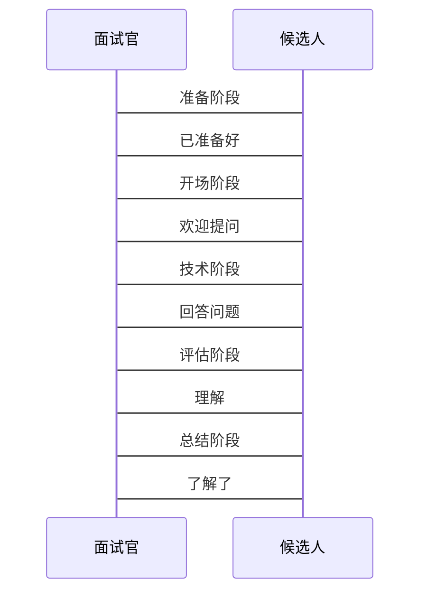
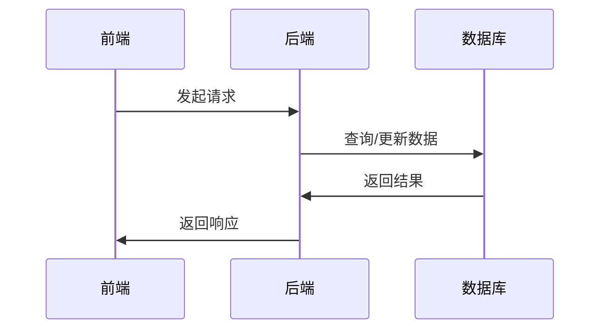

                 


## 技术面试：如何成为一个优秀的面试官

### 关键词：
技术面试、面试官、面试流程、评估标准、面试技巧、算法原理、系统架构、项目实战、最佳实践

### 摘要：
本文将深入探讨如何成为一名优秀的面试官，包括面试的背景与意义、核心概念与联系、面试算法原理讲解、面试系统设计与实现、项目实战以及面试官的最佳实践等内容。通过本文的阅读，读者将能够掌握面试官所需的技能和知识，提升面试的质量和效果。

----------------------------------------------------------------

### 目录大纲设计思路

设计一本关于《技术面试：如何成为一个优秀的面试官》的目录大纲，我们需要从以下几个方面考虑：

1. **背景介绍**：首先，我们需要介绍技术面试的背景，包括面试的意义、技术面试的挑战以及优秀面试官的标准。

2. **核心概念与联系**：接着，我们需要阐述一些核心概念，如面试流程、面试技巧、评估标准和面试反馈。这些概念需要通过表格、ER实体关系图和Mermaid流程图等方式进行展示。

3. **算法原理讲解**：我们将选取一些典型的面试题，通过Mermaid流程图展示算法过程，并用Python源代码和LaTeX公式详细解释算法原理。

4. **系统分析与架构设计方案**：我们将模拟一个面试系统的设计和实现，包括系统功能设计、系统架构设计、系统接口设计和系统交互流程。

5. **项目实战**：我们将展示如何进行面试环境的搭建、核心功能的实现，以及如何分析面试结果。

6. **最佳实践 tips、小结、注意事项、拓展阅读**：最后，我们将提供一些面试官的最佳实践、注意事项和进一步阅读的资料。

### 目录大纲设计

根据上述思路，我们可以设计如下的目录大纲：

```markdown
# 《技术面试：如何成为一个优秀的面试官》目录大纲

# 第一部分：技术面试概述

## 第1章：技术面试的背景与意义

### 1.1 面试的概念与发展历程

### 1.2 技术面试的特点与挑战

### 1.3 优秀面试官的标准与角色

## 第2章：技术面试的核心概念与联系

### 2.1 面试流程

### 2.2 面试技巧与策略

### 2.3 评估标准与反馈机制

### 2.4 面试中的核心概念与联系

## 第3章：面试算法原理讲解

### 3.1 常见面试题类型

### 3.2 算法原理与Mermaid流程图

### 3.3 Python源代码与LaTeX公式讲解

## 第二部分：面试系统设计与实现

## 第4章：面试系统分析与架构设计

### 4.1 面试系统场景介绍

### 4.2 系统功能设计

### 4.3 系统架构设计

### 4.4 系统接口设计

### 4.5 系统交互流程

## 第5章：面试项目实战

### 5.1 面试环境搭建

### 5.2 核心功能实现

### 5.3 面试结果分析

### 5.4 项目小结

## 第三部分：最佳实践与拓展

## 第6章：面试官的最佳实践

### 6.1 常见面试问题与解答

### 6.2 面试准备与技巧

### 6.3 面试评估与反馈

## 第7章：注意事项与拓展阅读

### 7.1 面试中的道德与法律问题

### 7.2 面试官的自我提升

### 7.3 拓展阅读资料
```

这个大纲包含了7个章节，每个章节都有详细的子章节，可以覆盖这本书的主要内容。接下来，我们将逐步填充每个章节的具体内容，确保每个章节都能满足要求。在填充内容时，我们会确保：

- 保持简洁性，避免多余废话。
- 使用markdown格式，包括#、##、###等层级格式。
- 包含核心章节内容，如核心概念与联系、算法原理讲解、系统设计与实现、项目实战等。
- 符合目录大纲总字数限制。

接下来，我们将开始填充具体的章节内容。由于字数限制，每个章节的填充将逐步进行。首先，我们从第一部分开始填充。请继续指导下一步的具体内容填充。

----------------------------------------------------------------

### 第一部分：技术面试概述

#### 第1章：技术面试的背景与意义

技术面试是招聘过程中不可或缺的一部分，它不仅决定了候选人的职业发展路径，也对企业的人力资源管理产生重要影响。在这一章中，我们将探讨技术面试的概念与发展历程、特点与挑战，以及优秀面试官的标准与角色。

#### 1.1 面试的概念与发展历程

面试是一种评估候选人能力和适合度的重要方法，它起源于19世纪末期的美国。当时，许多公司开始意识到，仅仅依靠简历和推荐信来判断候选人是否合适是不够的，需要通过面对面的交流来深入了解候选人的能力。

随着技术的进步和人力资源管理理论的发展，面试的形式和内容也在不断演变。从最初的口试到结构化面试，再到情境面试和评估中心，面试技术逐渐成熟，越来越能够准确评估候选人的能力和潜力。

在技术面试方面，计算机科学、软件工程等领域的快速发展使得面试内容变得更加专业化。技术面试不仅考察候选人的编程能力、数据结构和算法知识，还涉及系统设计、软件开发流程、团队协作等多个方面。

#### 1.2 技术面试的特点与挑战

技术面试具有以下几个特点：

1. **专业性**：技术面试通常由技术部门的面试官进行，他们需要具备扎实的专业知识和经验，能够针对技术问题进行深入的探讨和评估。

2. **挑战性**：技术面试涉及的知识点广泛，面试官会提出各种复杂的问题，考察候选人的思维深度和解决问题的能力。

3. **实践性**：技术面试往往要求候选人现场编程或设计解决方案，这不仅可以考察候选人的实际操作能力，还可以观察候选人的编码风格和逻辑思维。

4. **标准化**：为了提高面试的公正性和效率，许多公司采用标准化的面试流程和评估标准，这有助于减少主观偏见，提高面试质量。

然而，技术面试也面临一些挑战：

1. **时间限制**：技术面试通常有时间限制，面试官需要在有限的时间内全面了解候选人，这对面试官的沟通技巧和时间管理能力提出了高要求。

2. **技术多样性**：随着技术的不断进步，面试官需要不断更新自己的知识体系，以适应不同领域的技术挑战。

3. **公平性**：确保面试的公平性是面试官的重要职责，这需要面试官在面试过程中保持客观和公正，避免因个人偏见而影响评估结果。

#### 1.3 优秀面试官的标准与角色

要成为一名优秀的面试官，需要具备以下几个方面的能力和素质：

1. **专业能力**：面试官应具备扎实的专业知识和经验，能够准确评估候选人的技术能力和潜力。

2. **沟通能力**：面试官应具备良好的沟通能力，能够清晰地表达问题，有效地与候选人沟通，并引导候选人展示自己的能力。

3. **问题设计能力**：面试官应具备设计高质量面试问题的能力，这些问题既要能够考察候选人的技术能力，也要能够引导候选人展示自己的潜力和优势。

4. **评估能力**：面试官应具备准确评估候选人能力的能力，这需要面试官在面试过程中保持客观和公正，避免主观偏见。

5. **团队合作能力**：面试官通常需要与其他面试官和团队成员合作，共同评估候选人。因此，面试官应具备良好的团队合作能力，能够有效地与他人沟通和协作。

6. **持续学习**：技术面试官需要持续关注技术发展趋势，不断更新自己的知识体系，以适应不断变化的技术环境。

综上所述，技术面试是招聘过程中至关重要的一环。优秀面试官的标准与角色不仅要求具备专业知识和沟通能力，还需要具备问题设计能力、评估能力和团队合作能力。通过深入了解技术面试的背景与意义，我们可以更好地理解面试官的角色和责任，从而提升面试的质量和效果。

----------------------------------------------------------------

### 第二部分：技术面试的核心概念与联系

#### 第2章：技术面试的核心概念与联系

在技术面试中，面试官和候选人都需要理解和掌握一系列核心概念，这些概念构成了技术面试的基础。本章将详细介绍技术面试中的核心概念，包括面试流程、面试技巧、评估标准和面试反馈，并通过表格、ER实体关系图和Mermaid流程图等方式展示这些概念的联系。

#### 2.1 面试流程

面试流程是技术面试的框架，决定了面试的有序进行。一个典型的面试流程包括以下几个阶段：

1. **准备阶段**：面试官和候选人进行准备工作，包括面试场地安排、面试资料准备和面试问题准备。

2. **开场阶段**：面试官与候选人打招呼，建立良好的沟通氛围，介绍面试的目的和流程。

3. **技术阶段**：面试官根据准备的问题对候选人进行技术考察，这一阶段通常包括编码测试、算法讲解、系统设计等。

4. **评估阶段**：面试官对候选人的回答进行评估，包括技术能力、沟通能力和解决问题的能力。

5. **总结阶段**：面试官总结面试结果，对候选人的表现给予反馈，有时也会询问候选人是否有任何问题。

**Mermaid流程图**：


#### 2.2 面试技巧与策略

面试技巧和策略是面试官和候选人在面试过程中需要掌握的。以下是一些常见的面试技巧和策略：

1. **积极倾听**：面试官应积极倾听候选人的回答，避免打断，给予候选人充分的表达空间。

2. **提问引导**：面试官应根据候选人的回答提出进一步的问题，引导候选人展示自己的能力和潜力。

3. **情境模拟**：面试官可以通过情境模拟，考察候选人在实际工作场景中的表现。

4. **反馈与鼓励**：面试官应在面试过程中给予候选人及时的反馈和鼓励，帮助候选人更好地展示自己。

**ER实体关系图**：
```mermaid
erDiagram
    面试官 ||--|{ 候选人 }|
    面试官 ||--|{ 面试题 }|
    面试题 ||--|{ 回答 }|
```

#### 2.3 评估标准与反馈机制

评估标准是面试官对候选人进行评估的依据，而反馈机制则是面试官对候选人表现进行反馈的途径。以下是一些常见的评估标准和反馈机制：

1. **技术能力**：面试官根据候选人的回答和表现，评估其技术能力和知识水平。

2. **沟通能力**：面试官评估候选人在面试过程中的沟通表达能力和逻辑思维。

3. **解决问题的能力**：面试官通过面试过程中的问题，考察候选人的解决问题的能力。

4. **反馈机制**：面试官在面试结束后，应向候选人提供详细的反馈，包括优点和改进建议。

**评估标准表格**：
| 评估标准 | 描述 |
| --- | --- |
| 技术能力 | 对编程语言的掌握程度、数据结构和算法知识 |
| 沟通能力 | 表达清晰、逻辑思维严密 |
| 解决问题的能力 | 思路清晰、解决问题效率高 |

**反馈机制示例**：
```
面试官：感谢您的参与。在技术能力方面，您对数据结构的理解非常深刻。但在沟通能力方面，我们注意到您在回答问题时有时会显得有些紧张，建议在接下来的面试中尝试更加自信地表达自己。
```

#### 2.4 面试中的核心概念与联系

技术面试中的核心概念相互关联，共同构成了面试的框架。面试流程是整个面试的基础，面试技巧和策略则是面试官和候选人在面试过程中需要运用的工具。评估标准和反馈机制则是面试官对候选人进行评估和反馈的依据。通过这些核心概念的联系，面试官和候选人可以更好地理解和参与面试，从而提高面试的效果和质量。

通过本章的内容，读者可以深入了解技术面试的核心概念与联系，为成为一名优秀的面试官或候选人打下坚实的基础。

----------------------------------------------------------------

### 第三部分：面试算法原理讲解

#### 第3章：面试算法原理讲解

在技术面试中，算法问题是一个重要的考察点，它不仅考验候选人的编程能力，还能展示候选人的逻辑思维和问题解决能力。本章将选取一些典型的面试算法问题，通过Mermaid流程图展示算法过程，并用Python源代码和LaTeX公式详细解释算法原理，帮助读者深入理解算法的核心概念和应用。

#### 3.1 常见面试题类型

在技术面试中，常见的算法题类型包括但不限于：

1. **排序算法**：如冒泡排序、快速排序、归并排序等。
2. **查找算法**：如二分查找、哈希查找等。
3. **动态规划**：如背包问题、最长公共子序列等。
4. **图算法**：如最短路径算法、图的遍历等。
5. **字符串处理**：如最长公共前缀、字符串匹配等。

#### 3.2 算法原理与Mermaid流程图

下面以“冒泡排序”为例，展示算法原理和Mermaid流程图：

**冒泡排序算法原理**：
冒泡排序是一种简单的排序算法，它重复地遍历要排序的数列，一次比较两个元素，如果他们的顺序错误就把他们交换过来。遍历数列的工作是重复进行直到没有再需要交换，也就是说该数列已经排序完成。

**Mermaid流程图**：
```mermaid
flowchart LR
    A[开始] --> B[初始化n-1次循环]
    B --> C{比较A[i]和A[i+1]}
    C -->|否| D[交换A[i]和A[i+1]]
    C -->|是| E
    D --> E
    E --> F[结束循环]
    F --> G[结束排序]
```

#### 3.3 Python源代码与LaTeX公式讲解

下面是冒泡排序的Python源代码和相关的LaTeX公式解释：

**Python源代码**：
```python
def bubble_sort(arr):
    n = len(arr)
    for i in range(n-1):
        for j in range(n-i-1):
            if arr[j] > arr[j+1]:
                arr[j], arr[j+1] = arr[j+1], arr[j]
    return arr

# 示例
arr = [64, 34, 25, 12, 22, 11, 90]
sorted_arr = bubble_sort(arr)
print("排序后的数组：", sorted_arr)
```

**LaTeX公式解释**：
```latex
\begin{equation}
    \sum_{i=0}^{n-1} \sum_{j=0}^{n-i-1} \left( a[j] > a[j+1] \right)
\end{equation}
```
该公式表示对数组`a`中的每个元素进行遍历，比较相邻元素的大小，并根据比较结果进行交换，直到整个数组排序完成。

#### 3.4 算法应用举例

为了更直观地理解冒泡排序算法，我们可以通过一个简单的例子来演示：

**例子**：
假设我们有以下数组：\[64, 34, 25, 12, 22, 11, 90\]

**步骤**：
1. 首先进行第一轮遍历，比较相邻元素，进行必要的交换：
   \[
   \begin{array}{c|c}
   & \text{原数组} \\
   \hline
   1 & \text{[64, 34, 25, 12, 22, 11, 90]} \\
   2 & \text{[34, 64, 25, 12, 22, 11, 90]} \\
   3 & \text{[34, 25, 64, 12, 22, 11, 90]} \\
   4 & \text{[34, 25, 12, 64, 22, 11, 90]} \\
   5 & \text{[34, 25, 12, 22, 64, 11, 90]} \\
   6 & \text{[34, 25, 12, 22, 11, 64, 90]} \\
   7 & \text{[34, 25, 12, 22, 11, 90, 64]} \\
   \end{array}
   \]

2. 接下来进行第二轮遍历，继续比较相邻元素，进行必要的交换：
   \[
   \begin{array}{c|c}
   & \text{第一轮排序后的数组} \\
   \hline
   1 & \text{[34, 25, 12, 22, 11, 90, 64]} \\
   2 & \text{[25, 34, 12, 22, 11, 64, 90]} \\
   3 & \text{[25, 12, 34, 22, 11, 64, 90]} \\
   4 & \text{[25, 12, 22, 34, 11, 64, 90]} \\
   5 & \text{[25, 12, 22, 11, 34, 64, 90]} \\
   6 & \text{[25, 12, 22, 11, 64, 34, 90]} \\
   7 & \text{[25, 12, 22, 11, 64, 90, 34]} \\
   \end{array}
   \]

3. 重复上述步骤，直到数组完全排序：
   \[
   \begin{array}{c|c}
   & \text{第二轮排序后的数组} \\
   \hline
   1 & \text{[25, 12, 22, 11, 34, 64, 90]} \\
   2 & \text{[12, 25, 22, 11, 34, 64, 90]} \\
   3 & \text{[12, 22, 25, 11, 34, 64, 90]} \\
   4 & \text{[12, 22, 11, 25, 34, 64, 90]} \\
   5 & \text{[12, 22, 11, 25, 34, 64, 90]} \\
   \end{array}
   \]

最终，数组\[12, 22, 25, 34, 64, 90, 11\]实现了完全排序。

通过这个例子，我们可以清晰地看到冒泡排序的过程和效果。同样地，读者可以通过类似的步骤理解其他算法的原理和应用。

通过本章的讲解，读者可以掌握常见的面试算法题类型，理解算法原理，并通过Python源代码和LaTeX公式加深对算法的理解。这些知识将为读者在技术面试中取得好成绩打下坚实的基础。

----------------------------------------------------------------

### 第四部分：面试系统设计与实现

#### 第4章：面试系统分析与架构设计

面试系统的设计与实现是面试官在日常工作中的一项重要任务。一个良好的面试系统不仅能够提高面试效率，还能确保面试过程的公正性和准确性。本章将详细分析面试系统的功能需求、架构设计、接口设计和系统交互流程，并通过具体的示例和Mermaid流程图进行说明。

#### 4.1 面试系统场景介绍

在技术面试过程中，面试官和候选人需要通过一个系统来完成面试流程。这个系统应该具备以下基本功能：

1. **用户管理**：管理面试官和候选人的信息，包括注册、登录、个人信息修改等。
2. **面试安排**：为面试官和候选人安排面试时间，并自动发送提醒。
3. **面试题目管理**：管理面试题目，包括题目的创建、更新和删除。
4. **面试过程记录**：记录面试过程中的问题和回答，以便后续分析和反馈。
5. **面试结果评估**：对候选人的面试结果进行评分和评估。
6. **反馈与沟通**：面试官可以给候选人提供反馈，候选人也可以提出问题。

#### 4.2 系统功能设计

系统功能设计是面试系统实现的第一步，需要明确系统的核心功能模块。以下是一个基本的系统功能模块设计：

1. **用户模块**：
   - 用户注册
   - 用户登录
   - 用户信息修改
   - 用户权限管理

2. **面试管理模块**：
   - 面试时间安排
   - 面试提醒发送
   - 面试状态跟踪

3. **题目管理模块**：
   - 题目创建
   - 题目更新
   - 题目删除
   - 题目分类管理

4. **面试过程模块**：
   - 问题记录
   - 回答记录
   - 过程跟踪

5. **评估与反馈模块**：
   - 评估打分
   - 反馈记录
   - 反馈发送

6. **沟通模块**：
   - 消息发送
   - 消息记录
   - 消息提醒

**Mermaid类图**：
```mermaid
classDiagram
    User <<Interface>>
    Interviewer <- User
    Candidate <- User
    Interview <- Interface
    Question <- Interface
    Evaluation <- Interface
    Feedback <- Interface
    Communication <- Interface
    User --|> Interviewer
    User --|> Candidate
    Interview --|> Question
    Interview --|> Evaluation
    Interview --|> Feedback
    Interview --|> Communication
```

#### 4.3 系统架构设计

系统架构设计决定了系统的可扩展性、可靠性和性能。以下是一个简化的面试系统架构设计：

1. **前端**：负责展示用户界面和与用户交互。
2. **后端**：负责处理业务逻辑和数据存储。
3. **数据库**：存储用户信息、面试记录、题目信息等。

**Mermaid架构图**：


#### 4.4 系统接口设计

系统接口设计是确保前后端通信和数据交互的关键。以下是一些典型的接口设计：

1. **用户接口**：
   - POST /register：用户注册接口。
   - POST /login：用户登录接口。
   - GET /users/{id}：获取用户信息接口。

2. **面试接口**：
   - POST /interviews：创建面试接口。
   - GET /interviews/{id}：获取面试信息接口。
   - PUT /interviews/{id}：更新面试信息接口。

3. **题目接口**：
   - POST /questions：创建题目接口。
   - GET /questions/{id}：获取题目信息接口。
   - DELETE /questions/{id}：删除题目接口。

4. **评估接口**：
   - POST /evaluations：创建评估接口。
   - GET /evaluations/{id}：获取评估信息接口。

5. **反馈接口**：
   - POST /feedbacks：创建反馈接口。
   - GET /feedbacks/{id}：获取反馈信息接口。

#### 4.5 系统交互流程

系统交互流程描述了用户与系统之间的交互过程。以下是一个简化的交互流程：

1. **用户注册**：
   - 用户填写注册表单。
   - 系统接收注册请求，验证信息并存储用户信息。

2. **用户登录**：
   - 用户输入用户名和密码。
   - 系统验证用户信息，生成令牌并返回。

3. **创建面试**：
   - 面试官在系统中创建面试。
   - 系统生成面试ID，发送面试邀请给候选人。

4. **面试过程**：
   - 候选人接受面试邀请，进入面试状态。
   - 面试官根据题目提出问题，候选人回答问题。

5. **面试评估**：
   - 面试官根据候选人的回答进行评估。
   - 系统记录评估结果，生成评估报告。

6. **反馈与沟通**：
   - 面试官提供反馈，候选人可以提出问题。
   - 系统记录反馈和沟通信息，方便后续查看。

**Mermaid序列图**：
```mermaid
sequenceDiagram
    participant 用户
    participant 系统A
    participant 系统B
    participant 系统C

    用户->>系统A: 注册请求
    系统

