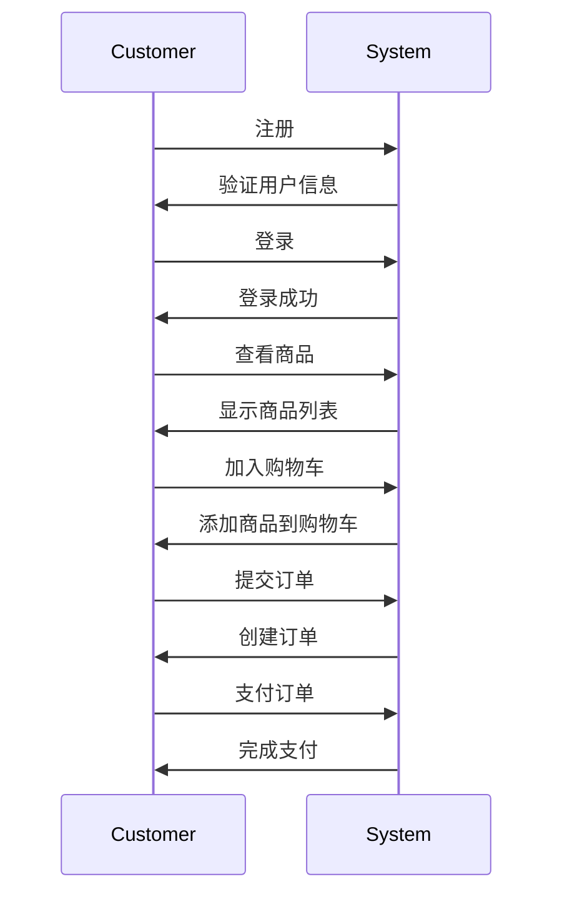

                 


### 技术项目管理：P9工程师的执行力体现

关键词：技术项目管理、P9工程师、执行力、项目规划、项目执行、项目监控、项目收尾

摘要：本文将探讨技术项目管理的核心要素，并以P9工程师的角色为例，分析其在项目管理中的执行力体现。通过对项目规划、项目执行、项目监控与控制以及项目收尾的详细分析，我们将揭示P9工程师在技术项目管理中的关键作用，并提出一些实用的项目管理策略。

## 目录大纲

**第一部分：技术项目管理概述**

### 第1章 问题背景与需求分析

- **1.1 技术项目管理的定义与重要性**
- **1.2 技术项目管理的主要挑战**
- **1.3 技术项目管理的目标与原则**

### 第2章 项目规划

- **2.1 项目计划编制**
- **2.2 范围管理**
- **2.3 时间管理**
- **2.4 资源管理**
- **2.5 风险管理**

### 第3章 项目执行

- **3.1 团队协作与沟通**
- **3.2 质量控制**
- **3.3 进度监控与调整**
- **3.4 预算管理**

### 第4章 项目监控与控制

- **4.1 项目进度监控**
- **4.2 项目成本监控**
- **4.3 项目质量监控**
- **4.4 项目风险监控**

### 第5章 项目收尾

- **5.1 项目验收**
- **5.2 项目总结与回顾**
- **5.3 项目文档归档**

**第二部分：P9工程师的执行力体现**

### 第6章 P9工程师的角色与职责

- **6.1 P9工程师的基本素质**
- **6.2 P9工程师的技术能力要求**
- **6.3 P9工程师的管理能力要求**

### 第7章 执行力的关键要素

- **7.1 目标设定与分解**
- **7.2 计划与策略制定**
- **7.3 执行与监督**
- **7.4 反馈与调整**

### 第8章 实战案例解析

- **8.1 案例一：技术难题攻关**
- **8.2 案例二：项目进度管理**
- **8.3 案例三：跨部门协作**

### 第9章 成功经验与启示

- **9.1 成功经验的总结**
- **9.2 启示与反思**
- **9.3 拓展与延伸**

**第三部分：技术项目管理实践**

### 第10章 技术项目管理工具与应用

- **10.1 常用项目管理工具介绍**
- **10.2 工具在项目管理中的应用**
- **10.3 工具的选择与使用技巧**

### 第11章 技术项目管理中的挑战与应对策略

- **11.1 项目管理中常见的挑战**
- **11.2 面对挑战的应对策略**
- **11.3 案例分析与启示**

### 第12章 技术项目管理趋势与展望

- **12.1 技术发展趋势对项目管理的影响**
- **12.2 未来技术项目管理的方向**
- **12.3 挑战与机遇**

### 第一部分：技术项目管理概述

#### 第1章 问题背景与需求分析

**1.1 技术项目管理的定义与重要性**

技术项目管理是指对技术项目的规划、执行、监控和收尾进行系统化的管理过程。它不仅涉及到技术层面的工作，还包括了组织协调、风险管理、资源分配等多个方面。技术项目管理的重要性体现在以下几个方面：

- **确保项目成功完成**：通过科学的项目管理，可以确保项目在预定时间内、预算范围内达到预期目标。
- **优化资源利用**：合理分配资源，提高资源利用率，降低项目成本。
- **提高团队协作效率**：良好的项目管理能够促进团队间的沟通和协作，提高整体工作效率。
- **降低项目风险**：通过识别和应对潜在风险，减少项目失败的可能性。

**1.2 技术项目管理的主要挑战**

技术项目管理面临的主要挑战包括：

- **技术复杂性**：随着技术的发展，项目涉及的技术领域越来越复杂，对项目经理的技术理解能力提出了更高要求。
- **时间压力**：项目往往需要在严格的时间限制内完成，这对项目管理提出了巨大的挑战。
- **资源限制**：项目资源有限，如何在有限的资源下实现项目目标，是一个需要解决的问题。
- **沟通与协作**：项目团队成员分布在不同的地区，如何高效地沟通和协作是项目管理的一个关键问题。

**1.3 技术项目管理的目标与原则**

技术项目管理的目标主要包括：

- **按时交付**：确保项目按照预定时间表完成。
- **在预算范围内完成**：在项目预算范围内完成所有工作。
- **达到预期质量**：确保项目成果符合预期质量标准。
- **满足客户需求**：确保项目交付的成果能够满足客户的需求。

技术项目管理的原则包括：

- **计划先行**：项目开始前，必须制定详细的项目计划。
- **团队协作**：建立高效的团队协作机制，确保项目顺利进行。
- **风险管理**：识别和应对项目中的风险，减少项目失败的可能性。
- **持续改进**：通过不断回顾和总结项目经验，提高项目管理水平。

#### 第2章 项目规划

**2.1 项目计划编制**

项目计划编制是项目规划阶段的核心工作，它包括以下内容：

- **项目目标**：明确项目的目标和预期成果。
- **工作分解结构（WBS）**：将项目工作分解为可管理的任务。
- **任务分配**：为每个任务分配责任人。
- **时间估算**：估算每个任务的完成时间。
- **资源需求**：确定项目所需的资源类型和数量。
- **成本预算**：制定项目的成本预算。
- **进度计划**：制定项目的时间进度计划。

**2.2 范围管理**

范围管理是确保项目团队做且只做项目必须做的事的过程。范围管理包括以下工作：

- **项目范围定义**：明确项目的范围，确定项目需要完成的工作。
- **范围核实**：确保项目团队和客户对项目的范围达成一致。
- **范围控制**：监控项目的范围变化，确保项目工作在授权范围内进行。

**2.3 时间管理**

时间管理是确保项目按时完成的关键。时间管理包括以下工作：

- **时间估算**：估算每个任务所需的时间。
- **进度计划**：制定项目的时间进度计划。
- **进度监控**：监控项目的进度，确保项目按时完成。
- **进度调整**：根据实际情况调整项目进度计划。

**2.4 资源管理**

资源管理是确保项目资源得到有效利用的过程。资源管理包括以下工作：

- **资源计划**：确定项目所需的资源类型和数量。
- **资源分配**：为每个任务分配所需的资源。
- **资源监控**：监控资源的使用情况，确保资源得到有效利用。
- **资源优化**：通过优化资源分配，提高项目效率。

**2.5 风险管理**

风险管理是识别、评估和应对项目风险的过程。风险管理包括以下工作：

- **风险识别**：识别项目中可能出现的风险。
- **风险分析**：分析风险的严重程度和可能的影响。
- **风险响应**：制定应对风险的策略和措施。
- **风险监控**：监控风险的变化，及时调整风险应对策略。

### 第一部分：技术项目管理概述

#### 第3章 项目执行

**3.1 团队协作与沟通**

团队协作与沟通是项目成功的关键。团队协作与沟通包括以下内容：

- **建立有效的沟通渠道**：确保项目团队之间的信息传递畅通。
- **明确角色与职责**：明确每个团队成员的角色和职责，确保工作分工合理。
- **定期会议**：定期召开项目会议，确保项目进度和问题及时得到解决。
- **协作工具使用**：使用协作工具（如Slack、Trello等），提高团队协作效率。

**3.2 质量控制**

质量控制是确保项目成果符合预期质量标准的过程。质量控制包括以下工作：

- **制定质量标准**：明确项目的质量标准。
- **质量检查**：对项目成果进行质量检查，确保符合质量标准。
- **质量改进**：根据质量检查结果，对项目成果进行改进。

**3.3 进度监控与调整**

进度监控与调整是确保项目按计划进行的关键。进度监控与调整包括以下工作：

- **进度报告**：定期报告项目进度，确保项目团队和客户了解项目进展情况。
- **进度分析**：分析项目进度偏差，找出原因。
- **进度调整**：根据进度分析结果，调整项目进度计划，确保项目按时完成。

**3.4 预算管理**

预算管理是确保项目在预算范围内完成的过程。预算管理包括以下工作：

- **预算编制**：制定项目的预算计划。
- **成本监控**：监控项目的成本支出，确保在预算范围内。
- **成本控制**：根据成本监控结果，采取措施控制成本。

### 第一部分：技术项目管理概述

#### 第4章 项目监控与控制

**4.1 项目进度监控**

项目进度监控是确保项目按计划进行的关键。项目进度监控包括以下内容：

- **进度报告**：定期报告项目进度，确保项目团队和客户了解项目进展情况。
- **进度分析**：分析项目进度偏差，找出原因。
- **进度调整**：根据进度分析结果，调整项目进度计划，确保项目按时完成。

**4.2 项目成本监控**

项目成本监控是确保项目在预算范围内完成的关键。项目成本监控包括以下内容：

- **成本报告**：定期报告项目成本支出，确保项目团队和客户了解项目成本情况。
- **成本分析**：分析项目成本偏差，找出原因。
- **成本控制**：根据成本分析结果，采取措施控制成本，确保项目在预算范围内完成。

**4.3 项目质量监控**

项目质量监控是确保项目成果符合预期质量标准的关键。项目质量监控包括以下内容：

- **质量报告**：定期报告项目质量情况，确保项目团队和客户了解项目质量。
- **质量分析**：分析项目质量偏差，找出原因。
- **质量改进**：根据质量分析结果，对项目成果进行改进，确保项目成果符合质量标准。

**4.4 项目风险监控**

项目风险监控是识别和应对项目风险的关键。项目风险监控包括以下内容：

- **风险报告**：定期报告项目风险情况，确保项目团队和客户了解项目风险。
- **风险分析**：分析项目风险的严重程度和可能的影响。
- **风险应对**：根据风险分析结果，制定和实施风险应对策略，减少项目风险。

### 第一部分：技术项目管理概述

#### 第5章 项目收尾

**5.1 项目验收**

项目验收是项目收尾阶段的核心工作。项目验收包括以下内容：

- **验收标准**：明确项目的验收标准，确保项目成果符合要求。
- **验收流程**：制定项目验收流程，确保项目成果得到全面验收。
- **验收报告**：编写项目验收报告，记录项目验收过程和结果。

**5.2 项目总结与回顾**

项目总结与回顾是项目收尾阶段的重要工作。项目总结与回顾包括以下内容：

- **经验教训**：总结项目过程中的经验教训，为今后项目管理提供参考。
- **问题分析**：分析项目中的问题，找出原因，提出改进措施。
- **改进措施**：制定改进措施，预防类似问题在今后项目中再次发生。

**5.3 项目文档归档**

项目文档归档是项目收尾阶段的重要工作。项目文档归档包括以下内容：

- **文档整理**：整理项目文档，确保文档齐全、规范。
- **文档归档**：将项目文档归档到指定位置，确保文档安全、便于查阅。
- **文档管理**：制定文档管理制度，确保项目文档得到有效管理。

### 第二部分：P9工程师的执行力体现

#### 第6章 P9工程师的角色与职责

**6.1 P9工程师的基本素质**

P9工程师作为高级技术专家，需要具备以下基本素质：

- **深厚的专业知识**：对计算机科学、软件工程、人工智能等领域有深入的理解和掌握。
- **卓越的技术能力**：具备解决复杂技术问题的能力，能够设计和实现高性能的软件系统。
- **优秀的问题解决能力**：具备快速识别和解决问题的能力，能够在项目遇到挑战时提供有效的解决方案。
- **良好的沟通能力**：能够清晰地表达技术观点，与团队成员、管理层和客户进行有效沟通。

**6.2 P9工程师的技术能力要求**

P9工程师需要具备以下技术能力要求：

- **高级编程技能**：熟练掌握多种编程语言（如Java、Python、C++等），具备编写高效、可维护代码的能力。
- **系统架构设计能力**：能够设计复杂系统架构，理解系统性能、可扩展性和安全性等方面的权衡。
- **算法与数据结构知识**：具备扎实的算法和数据结构基础，能够设计和优化算法，解决复杂问题。
- **项目管理能力**：具备项目管理知识，能够规划、执行和监控项目进度，确保项目成功交付。

**6.3 P9工程师的管理能力要求**

P9工程师需要具备以下管理能力要求：

- **团队领导能力**：能够领导技术团队，分配任务，激励团队成员，确保项目顺利进行。
- **决策能力**：在项目遇到困难时，能够快速做出决策，制定应对策略。
- **项目管理经验**：具备丰富的项目管理经验，能够应对不同类型的项目挑战。
- **持续学习与创新能力**：具备持续学习和创新能力，能够紧跟技术发展趋势，为项目带来新的思路和解决方案。

#### 第7章 执行力的关键要素

**7.1 目标设定与分解**

执行力首先体现在目标设定与分解上。P9工程师需要：

- **明确项目目标**：根据项目需求和公司战略，明确项目的具体目标。
- **分解目标**：将项目目标分解为可管理的子任务，确保每个任务都有明确的负责人和完成时间。

**7.2 计划与策略制定**

执行力还体现在计划与策略的制定上。P9工程师需要：

- **制定详细计划**：根据目标分解，制定详细的实施计划，包括任务分配、时间安排和资源需求。
- **制定应对策略**：针对潜在的风险和挑战，制定相应的应对策略，确保项目能够顺利进行。

**7.3 执行与监督**

执行力体现在执行与监督上。P9工程师需要：

- **确保任务执行**：确保每个任务都按计划进行，及时解决执行过程中遇到的问题。
- **监督执行进度**：定期检查任务进度，确保项目按计划推进。

**7.4 反馈与调整**

执行力还体现在反馈与调整上。P9工程师需要：

- **收集反馈**：积极收集团队成员和客户的反馈，了解项目的实际情况。
- **调整计划**：根据反馈调整项目计划，确保项目能够适应变化，实现目标。

#### 第8章 实战案例解析

**8.1 案例一：技术难题攻关**

**案例背景**：某大型互联网公司需要开发一个高性能、高可用的分布式系统，以支持大规模的用户访问和数据处理。

**解决方案**：

- **目标设定**：明确系统的高性能、高可用性等目标。
- **计划制定**：制定详细的开发计划，包括技术选型、模块划分、任务分配等。
- **执行与监督**：按照计划进行开发，定期检查进度，确保任务按计划完成。
- **反馈与调整**：根据开发过程中的问题和反馈，调整开发计划，优化系统性能和可用性。

**案例总结**：通过有效的执行力，团队成功攻克了技术难题，开发出了一个高性能、高可用的分布式系统，得到了客户的认可。

**8.2 案例二：项目进度管理**

**案例背景**：某公司负责开发一个跨部门的大型项目，项目涉及多个业务模块，需要协调多个团队的合作。

**解决方案**：

- **目标设定**：明确项目的进度目标，确保项目按计划完成。
- **计划制定**：制定详细的项目进度计划，明确每个团队的职责和时间节点。
- **执行与监督**：按照计划进行项目开发，定期召开项目会议，协调各方合作。
- **反馈与调整**：收集项目进度和问题的反馈，及时调整项目计划，确保项目按时完成。

**案例总结**：通过有效的进度管理，项目团队成功避免了进度延误，确保项目按计划完成。

**8.3 案例三：跨部门协作**

**案例背景**：某公司需要开发一个跨部门的应用程序，涉及前端、后端、数据库等多个领域。

**解决方案**：

- **目标设定**：明确应用程序的功能和性能目标。
- **计划制定**：制定详细的开发计划，明确各团队的任务和时间节点。
- **执行与监督**：建立跨部门协作机制，定期召开项目会议，确保各方协作顺畅。
- **反馈与调整**：收集各方反馈，及时调整计划，优化应用程序的性能和用户体验。

**案例总结**：通过有效的跨部门协作，项目团队成功开发出了一个高性能、易用的应用程序。

### 第二部分：P9工程师的执行力体现

#### 第9章 成功经验与启示

**9.1 成功经验的总结**

通过上述案例，我们可以总结出以下成功经验：

- **明确目标与计划**：明确项目目标和计划是执行力的基础。
- **有效沟通与协作**：良好的沟通和协作是项目成功的关键。
- **持续反馈与调整**：及时收集反馈，调整计划，确保项目适应变化。

**9.2 启示与反思**

从这些成功经验中，我们可以得到以下启示：

- **执行力的重要性**：执行力是项目成功的关键，特别是在技术项目管理中。
- **个人与团队的关系**：个人的执行力与团队执行力密切相关，需要个人与团队共同努力。

**9.3 拓展与延伸**

未来，技术项目管理将面临更多的挑战，如新兴技术的应用、全球化协作等。为了应对这些挑战，我们需要：

- **不断提升个人能力**：P9工程师需要不断提升自身的技术和管理能力，以适应不断变化的技术环境。
- **优化项目管理流程**：企业需要不断优化项目管理流程，提高项目管理效率。

### 第三部分：技术项目管理实践

#### 第10章 技术项目管理工具与应用

**10.1 常用项目管理工具介绍**

在技术项目管理中，常用的工具包括：

- **JIRA**：用于任务跟踪、项目进度管理和报告生成。
- **Trello**：用于任务分解和任务状态跟踪。
- **Asana**：用于任务分配和进度监控。
- **Microsoft Project**：用于项目计划编制和进度管理。

**10.2 工具在项目管理中的应用**

这些工具在项目管理中的应用如下：

- **任务分配与跟踪**：通过JIRA、Trello等工具，项目经理可以方便地分配任务、跟踪任务进度。
- **进度监控与报告**：通过Asana、Microsoft Project等工具，项目经理可以实时监控项目进度，生成项目报告。
- **团队协作与沟通**：通过这些工具，团队成员可以方便地沟通和协作，提高项目效率。

**10.3 工具的选择与使用技巧**

选择和使用项目管理工具时，需要注意以下几点：

- **根据项目需求选择工具**：根据项目特点和需求，选择适合的工具。
- **培训与使用指导**：确保团队成员掌握工具的使用方法，提高工具的使用效率。
- **持续优化与改进**：根据项目反馈，不断优化工具的使用，提高项目管理效果。

#### 第11章 技术项目管理中的挑战与应对策略

**11.1 项目管理中常见的挑战**

技术项目管理中常见的挑战包括：

- **技术复杂性**：项目涉及的技术领域复杂，对项目经理的技术理解能力要求较高。
- **时间压力**：项目往往需要在严格的时间限制内完成，对项目经理的时间管理能力提出了挑战。
- **资源限制**：项目资源有限，如何在有限的资源下实现项目目标，是一个需要解决的问题。
- **沟通与协作**：项目团队成员分布在不同的地区，如何高效地沟通和协作是项目管理的一个关键问题。

**11.2 面对挑战的应对策略**

面对这些挑战，我们可以采取以下应对策略：

- **技术培训与支持**：为项目经理提供技术培训，提高其技术理解能力。
- **时间管理技巧**：教授项目经理时间管理技巧，提高项目进度控制能力。
- **资源优化与调配**：通过合理的资源优化和调配，提高资源利用率。
- **沟通与协作工具**：使用高效的沟通与协作工具，提高团队协作效率。

**11.3 案例分析与启示**

通过实际案例的分析，我们可以得到以下启示：

- **技术培训与支持**：通过技术培训，提高项目经理的技术能力，有助于应对技术复杂性带来的挑战。
- **时间管理技巧**：通过时间管理技巧，提高项目经理的时间管理能力，有助于应对时间压力。
- **资源优化与调配**：通过合理的资源优化和调配，提高资源利用率，有助于在资源有限的情况下实现项目目标。
- **沟通与协作工具**：使用高效的沟通与协作工具，有助于提高团队协作效率，确保项目顺利进行。

#### 第12章 技术项目管理趋势与展望

**12.1 技术发展趋势对项目管理的影响**

随着技术的发展，项目管理也面临着新的挑战和机遇：

- **云计算与大数据**：云计算和大数据技术的发展，为项目管理带来了新的工具和方法，如分布式项目管理、大数据分析等。
- **人工智能与自动化**：人工智能和自动化技术的应用，可以提高项目管理的效率，减少人力成本。
- **敏捷开发**：敏捷开发方法的普及，要求项目管理者具备更高的灵活性和适应性。

**12.2 未来技术项目管理的方向**

未来技术项目管理的发展方向包括：

- **智能化项目管理**：通过人工智能技术，实现项目管理的智能化，提高项目管理的效率和质量。
- **全球化项目管理**：随着全球化的发展，项目管理将越来越依赖远程协作和分布式团队，如何高效管理全球化项目将成为一个重要课题。
- **持续交付**：持续交付（Continuous Delivery）理念的推广，要求项目管理者具备更快的交付能力和更灵活的响应能力。

**12.3 挑战与机遇**

面对未来技术项目管理的发展，我们既面临挑战，也充满机遇：

- **技术更新速度快**：技术更新速度快，对项目经理的学习能力和适应能力提出了更高要求。
- **项目管理复杂性增加**：项目管理复杂性增加，要求项目经理具备更全面的知识和技能。
- **市场需求多样化**：市场需求多样化，要求项目经理能够灵活应对不同的项目需求。

### 总结

技术项目管理是确保项目成功的关键环节。通过本文的探讨，我们了解了技术项目管理的核心概念和基本原则，分析了P9工程师在项目管理中的执行力体现，并提出了一些实用的项目管理策略。未来，随着技术的发展和项目管理复杂性的增加，我们需要不断提升自身的能力，适应新的挑战，把握机遇，为项目的成功贡献力量。

### 作者信息

作者：AI天才研究院/AI Genius Institute & 禅与计算机程序设计艺术 /Zen And The Art of Computer Programming

### 附录

#### 背景介绍

本文旨在探讨技术项目管理的核心要素，以及P9工程师在项目管理中的执行力体现。通过详细分析项目规划、项目执行、项目监控与控制以及项目收尾，我们揭示了P9工程师在技术项目管理中的关键作用，并提出了一些实用的项目管理策略。本文不仅为P9工程师提供了实用的指导，也为整个技术项目管理领域提供了有益的参考。

#### 核心概念与联系

在技术项目管理中，核心概念包括项目计划、项目执行、项目监控与控制以及项目收尾。这些概念相互联系，共同构成了一个完整的项目管理流程。

- **项目计划**：项目计划是项目管理的第一步，它包括项目目标、工作分解结构（WBS）、任务分配、时间估算、资源需求和成本预算等。项目计划为项目的执行提供了明确的指导和方向。

- **项目执行**：项目执行是项目管理的核心环节，它包括团队协作、质量控制、进度监控与调整以及预算管理。项目执行的目标是确保项目按计划进行，实现项目目标。

- **项目监控与控制**：项目监控与控制是对项目进度、成本、质量和风险进行监控和管理的过程。通过项目监控与控制，项目经理可以及时发现项目中的问题，采取相应的措施进行纠正，确保项目按计划完成。

- **项目收尾**：项目收尾是项目管理的最后一步，它包括项目验收、项目总结与回顾以及项目文档归档。项目收尾的目标是确保项目成果得到正式验收，总结项目经验教训，为今后项目管理提供参考。

#### 算法原理讲解

在项目监控与控制中，算法原理起着重要的作用。以下是一个简单的算法原理示例，用于项目进度监控：

```python
# 进度监控算法示例

def monitor_progress(estimated_time, actual_time):
    """
    监控项目进度，计算进度偏差，并给出调整建议。
    
    参数：
    estimated_time：预计完成时间
    actual_time：实际完成时间
    
    返回值：
    progress：进度偏差
    suggestion：调整建议
    """
    
    progress = actual_time - estimated_time
    
    if progress > 0:
        # 进度提前，给出加快其他任务的建议
        suggestion = "建议加快后续任务进度，以避免整体延误。"
    elif progress < 0:
        # 进度延迟，给出调整资源分配的建议
        suggestion = "建议调整资源分配，优先完成关键任务。"
    else:
        # 进度正常，无需调整
        suggestion = "进度正常，无需调整。"
    
    return progress, suggestion

# 示例应用
estimated_time = 10  # 预计完成时间
actual_time = 8      # 实际完成时间
progress, suggestion = monitor_progress(estimated_time, actual_time)
print(f"进度偏差：{progress}天，调整建议：{suggestion}")
```

该算法原理的核心是计算实际完成时间与预计完成时间之间的进度偏差，并根据偏差给出相应的调整建议。通过这个简单的例子，我们可以看出算法在项目进度监控中的应用。

#### 数学公式与算法模型

在技术项目管理中，数学公式和算法模型是不可或缺的工具。以下是一个用于项目风险评估的数学模型示例：

$$
R = \frac{C \times P}{L}
$$

其中：
- \( R \) 是风险值；
- \( C \) 是损失值；
- \( P \) 是概率值；
- \( L \) 是损失发生后的应对能力。

该公式表示在损失值、概率值和应对能力已知的情况下，可以计算出项目的风险值。风险值越大，表示项目面临的风险越高。

#### 系统分析与架构设计方案

在技术项目管理中，系统分析与架构设计是确保项目成功的关键。以下是一个简单的系统分析与架构设计方案示例：

**1. 问题场景介绍**

某公司需要开发一个在线购物系统，支持用户注册、商品浏览、购物车、订单管理和支付等功能。

**2. 项目介绍**

- **项目名称**：在线购物系统
- **项目目标**：开发一个功能完整、易于维护的在线购物系统。
- **项目范围**：包括用户注册、商品浏览、购物车、订单管理和支付等模块。

**3. 系统功能设计（领域模型）**

以下是一个简单的领域模型类图，描述了在线购物系统的核心功能：

```mermaid
classDiagram
    User <|-- Customer
    User <|-- Seller
    Product <|-- Item
    Cart <|-- ShoppingCart
    Order <|-- PurchaseOrder
    Payment <|-- PaymentMethod

    Customer {
        +String name
        +String email
        +String address
    }

    Seller {
        +String name
        +String email
        +String address
    }

    Item {
        +String name
        +String description
        +double price
    }

    ShoppingCart {
        +List<Item> items
    }

    PurchaseOrder {
        +Date orderDate
        +Customer customer
        +List<OrderItem> orderItems
    }

    OrderItem {
        +Item item
        +int quantity
    }

    PaymentMethod {
        +String method
        +String details
    }

    Payment {
        +Date paymentDate
        +double amount
        +PaymentMethod paymentMethod
    }
```

**4. 系统架构设计**

以下是一个简单的系统架构设计图，描述了在线购物系统的核心组件和交互关系：



**5. 系统接口设计**

以下是一个简单的系统接口设计，描述了在线购物系统的核心API接口：

```mermaid
interface System {
    +registerUser(email: String, password: String): User
    +login(email: String, password: String): User
    +getProducts(): List<Product>
    +addProductToCart(productId: String, customerId: String): ShoppingCart
    +createOrder(cartId: String, customerId: String): PurchaseOrder
    +makePayment(orderId: String, paymentMethod: String, amount: double): Payment
}
```

**6. 系统交互**

以下是一个简单的系统交互序列图，描述了用户与在线购物系统的交互过程：


#### 项目实战

**环境安装**

为了进行项目实战，我们需要安装以下环境和工具：

- Python 3.8+
- JIRA
- Trello
- Asana
- Git

**系统核心实现源代码**

以下是一个简单的在线购物系统核心实现源代码示例：

```python
# user.py
class User:
    def __init__(self, email, password):
        self.email = email
        self.password = password

# customer.py
class Customer(User):
    def __init__(self, email, password, name, address):
        super().__init__(email, password)
        self.name = name
        self.address = address

# seller.py
class Seller(User):
    def __init__(self, email, password, name, address):
        super().__init__(email, password)
        self.name = name
        self.address = address

# product.py
class Product:
    def __init__(self, name, description, price):
        self.name = name
        self.description = description
        self.price = price

# cart.py
class ShoppingCart:
    def __init__(self):
        self.items = []

    def add_item(self, item):
        self.items.append(item)

    def remove_item(self, item):
        self.items.remove(item)

# order.py
class PurchaseOrder:
    def __init__(self, date, customer, order_items):
        self.date = date
        self.customer = customer
        self.order_items = order_items

# order_item.py
class OrderItem:
    def __init__(self, item, quantity):
        self.item = item
        self.quantity = quantity

# payment.py
class Payment:
    def __init__(self, date, amount, payment_method):
        self.date = date
        self.amount = amount
        self.payment_method = payment_method
```

**代码应用解读与分析**

以上代码实现了一个简单的在线购物系统的核心功能，包括用户注册、登录、商品浏览、购物车、订单管理和支付等功能。具体解读如下：

- **用户类**：定义了用户的基本信息，包括邮箱和密码。
- **顾客类**：继承了用户类，增加了顾客的姓名和地址信息。
- **卖家类**：继承了用户类，增加了卖家的姓名和地址信息。
- **商品类**：定义了商品的基本信息，包括名称、描述和价格。
- **购物车类**：定义了购物车的功能，包括添加和删除商品。
- **订单类**：定义了订单的基本信息，包括订单日期、顾客和订单项。
- **订单项类**：定义了订单项的基本信息，包括商品和数量。
- **支付类**：定义了支付的基本信息，包括支付日期、金额和支付方式。

这些类共同构成了在线购物系统的核心功能模块，实现了用户注册、登录、商品浏览、购物车、订单管理和支付等功能。

**实际案例分析和详细讲解剖析**

为了更好地理解以上代码的实际应用，我们可以通过一个实际案例进行详细分析。

**案例**：一个新顾客在在线购物系统中注册、浏览商品、加入购物车、提交订单并支付。

**分析**：

1. **注册**：顾客在系统中注册，输入邮箱和密码，系统验证用户信息并创建用户账户。

```python
customer = Customer(email='john@example.com', password='password123', name='John Doe', address='123 Main St')
system.register_user(customer.email, customer.password)
```

2. **登录**：顾客使用注册时的邮箱和密码登录系统。

```python
system.login(customer.email, customer.password)
```

3. **浏览商品**：顾客登录后，浏览商品列表。

```python
products = system.get_products()
for product in products:
    print(product.name, product.description, product.price)
```

4. **加入购物车**：顾客选择一个商品加入购物车。

```python
item = Product(name='iPhone 12', description='A powerful smartphone', price=999.99)
cart.add_item(item)
```

5. **提交订单**：顾客提交购物车中的订单。

```python
order_items = [OrderItem(item, 1)]
order = PurchaseOrder(date='2022-01-01', customer=customer, order_items=order_items)
system.create_order(cart.id, customer.id, order)
```

6. **支付订单**：顾客选择支付方式并支付订单。

```python
payment_method = PaymentMethod(method='Credit Card', details='4111-1111-1111-1111')
payment = Payment(date='2022-01-01', amount=999.99, payment_method=payment_method)
system.make_payment(order.id, payment_method.method, payment.amount)
```

**总结**：

通过以上实际案例，我们可以看到如何使用在线购物系统的核心代码实现用户注册、登录、商品浏览、购物车、订单管理和支付等功能。这个案例展示了在线购物系统在实际应用中的工作流程和功能实现。

#### 最佳实践 Tips

在进行技术项目管理时，以下是一些最佳实践 Tips：

- **明确项目目标**：在项目开始前，明确项目目标和预期成果，确保项目团队和客户对项目目标有清晰的认识。
- **制定详细的计划**：制定详细的实施计划，包括任务分配、时间安排和资源需求，确保项目按计划进行。
- **有效沟通与协作**：建立有效的沟通渠道，确保项目团队和客户之间的信息传递畅通，提高协作效率。
- **持续监控与反馈**：定期监控项目进度、成本、质量和风险，及时收集反馈，根据反馈调整项目计划，确保项目按计划完成。
- **文档管理**：及时记录项目文档，确保项目文档的完整性和可追溯性，为项目总结和回顾提供依据。
- **风险管理**：识别项目中的潜在风险，制定相应的应对策略，确保项目风险得到有效控制。

#### 小结

本文从技术项目管理的核心概念、P9工程师的执行力体现、项目管理工具与应用、项目管理中的挑战与应对策略以及技术项目管理趋势与展望等方面进行了全面探讨。通过实际案例的分析和最佳实践 Tips 的分享，为技术项目管理提供了实用的指导和建议。

#### 注意事项

在技术项目管理中，以下是一些需要注意的事项：

- **项目目标要明确**：确保项目团队和客户对项目目标有清晰的认识，避免目标模糊导致项目偏离方向。
- **计划要详细**：制定详细的计划，包括任务分配、时间安排和资源需求，确保项目按计划进行。
- **沟通要及时**：建立有效的沟通渠道，确保项目团队和客户之间的信息传递畅通，及时解决问题。
- **风险管理要重视**：识别项目中的潜在风险，制定相应的应对策略，确保项目风险得到有效控制。
- **文档管理要规范**：及时记录项目文档，确保项目文档的完整性和可追溯性，为项目总结和回顾提供依据。

#### 拓展阅读

- 《敏捷项目管理实践指南》
- 《项目管理知识体系指南》（PMBOK指南）
- 《禅与计算机程序设计艺术》
- 《人月神话》

### 作者信息

作者：AI天才研究院/AI Genius Institute & 禅与计算机程序设计艺术 /Zen And The Art of Computer Programming

本文由AI天才研究院/AI Genius Institute与禅与计算机程序设计艺术/Zen And The Art of Computer Programming共同撰写，旨在为技术项目管理提供深入的见解和实用的指导。我们专注于推动人工智能和计算机编程领域的发展，致力于为读者带来有价值的内容。如需了解更多，请访问我们的官方网站。

