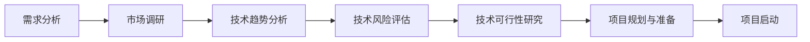
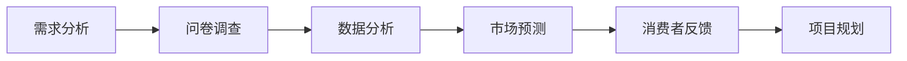
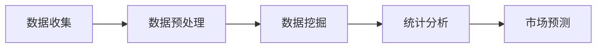
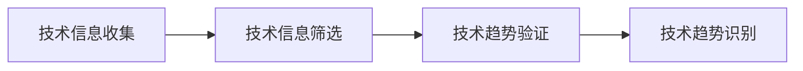
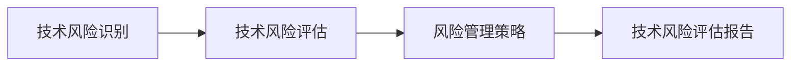
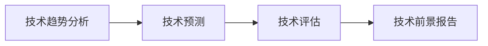
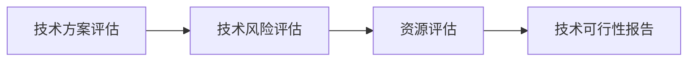
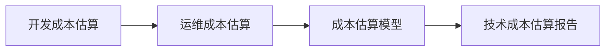

                 


### 第1章：技术预研概述

#### 1.1 技术预研的重要性

**背景介绍**

技术预研是现代工程和技术项目中至关重要的环节。随着技术的快速发展，市场和技术的变化速度越来越快，如何在竞争激烈的环境中抢占先机，实现技术项目的成功，成为了企业和社会关注的焦点。技术预研，顾名思义，是在正式开展项目之前，对将要实施的技术方案进行深入的研究和分析。

**问题背景**

在传统的项目管理中，很多项目在实施过程中会遇到各种预料之外的技术障碍，导致项目延期、成本超支、甚至项目失败。这些问题往往源于项目初期对技术的了解不足，缺乏充分的技术预研。因此，技术预研的目的在于提前识别和解决潜在的技术风险，为项目的成功奠定基础。

**问题描述**

技术预研的具体问题包括：如何有效地进行市场调研，获取准确的技术趋势信息；如何进行技术风险评估，确保技术方案的可行性；如何制定详细的项目规划，确保项目按期完成等。

**问题解决**

解决这些问题的关键在于建立一套科学、系统的技术预研方法，使得项目团队能够在项目启动之前，对即将面临的技术挑战有清晰的认识，并提前做好准备。

**边界与外延**

技术预研不仅局限于具体的技术实现，还涉及到市场分析、竞争对手研究、资源评估等多个方面。其边界涵盖了从技术可行性到商业可行性的整个范围。

**概念结构与核心要素组成**

技术预研的核心概念包括：市场调研、技术趋势分析、技术可行性研究、项目规划和准备。这些概念相互关联，共同构成了技术预研的整体框架。

#### 1.2 技术预研的方法

**核心概念原理**

技术预研的方法主要包括以下几个步骤：

1. **市场调研**：通过收集和分析市场数据，了解市场需求、竞争态势等。
2. **技术趋势分析**：研究当前和未来可能出现的技术趋势，为技术方案的选择提供依据。
3. **技术风险评估**：识别和评估潜在的技术风险，为项目的风险管理提供支持。
4. **技术可行性研究**：评估技术方案的可行性，确保技术方案的实现。

**概念属性特征对比表格**

| 方法          | 特点                                                         | 适用场景                                   |
|---------------|------------------------------------------------------------|--------------------------------------------|
| 市场调研      | 收集和分析市场数据，了解市场需求和竞争态势                   | 新产品开发、市场扩展、竞争对手分析         |
| 技术趋势分析  | 研究技术发展趋势，预测未来可能出现的技术变革                 | 技术研发方向确定、技术创新决策             |
| 技术风险评估  | 识别和评估技术风险，为风险管理提供支持                       | 项目启动前的风险评估、项目中途风险监测     |
| 技术可行性研究 | 评估技术方案的可行性，确保技术方案的实现                     | 项目立项决策、技术方案选择               |

**ER实体关系图架构的 Mermaid 流程图**

```mermaid
erDiagram
    MarketSurvey ||--|{ TechnicalResearch }
    TechnicalTrendAnalysis ||--|{ TechnicalRiskAssessment }
    TechnicalFeasibilityResearch ||--|{ ProjectPlanning }
    MarketSurvey ||--|{ ProjectResourcePreparation }
```

#### 1.3 技术预研的流程

**核心概念原理**

技术预研的流程可以分为以下几个阶段：

1. **需求分析**：明确项目需求和目标，为后续的预研工作提供指导。
2. **市场调研**：收集和分析市场数据，了解市场需求和竞争态势。
3. **技术趋势分析**：研究当前和未来可能出现的技术趋势。
4. **技术风险评估**：识别和评估潜在的技术风险。
5. **技术可行性研究**：评估技术方案的可行性。
6. **项目规划与准备**：制定详细的项目规划和准备工作。

**概念属性特征对比表格**

| 阶段           | 目的                                                         | 关键活动                                       |
|----------------|------------------------------------------------------------|----------------------------------------------|
| 需求分析       | 明确项目需求和目标                                         | 需求收集、需求分析、需求文档编写               |
| 市场调研       | 收集和分析市场数据，了解市场需求和竞争态势                   | 市场数据收集、数据分析、市场报告编写           |
| 技术趋势分析   | 研究技术发展趋势，预测未来可能出现的技术变革                 | 技术趋势研究、趋势报告编写                     |
| 技术风险评估   | 识别和评估技术风险，为风险管理提供支持                       | 风险识别、风险评估、风险管理策略制定           |
| 技术可行性研究 | 评估技术方案的可行性，确保技术方案的实现                     | 可行性分析、成本估算、风险分析、可行性报告编写 |
| 项目规划与准备 | 制定详细的项目规划和准备工作                               | 项目计划制定、资源准备、项目启动准备           |

**Mermaid 流程图**



### 总结

技术预研是确保项目成功的关键步骤。通过科学的方法和流程，项目团队能够在项目启动前对潜在的技术挑战有充分的了解和准备。本章介绍了技术预研的重要性、方法和流程，为后续章节的深入讨论奠定了基础。

---

### 第2章：市场调研与分析

#### 2.1 市场调研的方法

**背景介绍**

市场调研是技术预研的重要环节之一。通过市场调研，项目团队可以获取关于市场需求、竞争态势、消费者行为等关键信息，为技术方案的选择和项目规划提供依据。

**问题背景**

在竞争激烈的市场环境中，了解市场和消费者的需求至关重要。传统的市场调研方法往往局限于问卷调查和访谈，这些方法虽然能够提供一定的市场信息，但往往缺乏全面性和深度。

**问题描述**

市场调研的具体问题包括：如何有效地收集市场数据？如何分析市场数据，从中提取有价值的信息？如何预测市场趋势？

**问题解决**

解决这些问题的关键在于选择合适的市场调研方法，并运用科学的数据分析方法。

**边界与外延**

市场调研不仅包括数据的收集和分析，还包括市场预测、竞争对手分析、消费者行为研究等多个方面。

**概念结构与核心要素组成**

市场调研的核心概念包括：问卷调查、访谈、数据分析、市场预测等。这些概念相互关联，构成了市场调研的整体框架。

**核心概念原理**

1. **问卷调查**：通过设计问卷，收集消费者的主观意见和反馈。
2. **访谈**：通过与消费者或专业人士的直接对话，深入了解市场和消费者需求。
3. **数据分析**：运用统计学方法，对收集到的市场数据进行分析，提取有价值的信息。
4. **市场预测**：基于历史数据和当前市场情况，预测未来市场趋势。

**概念属性特征对比表格**

| 方法     | 特点                                                         | 适用场景                                   |
|----------|------------------------------------------------------------|--------------------------------------------|
| 问卷调查 | 设计问卷，收集消费者主观意见和反馈                           | 大规模市场调研、消费者需求分析             |
| 访谈     | 通过与消费者或专业人士的直接对话，深入了解市场和消费者需求       | 深度市场调研、消费者行为研究             |
| 数据分析 | 运用统计学方法，对收集到的市场数据进行分析，提取有价值的信息   | 数据驱动的决策、市场预测               |
| 市场预测 | 基于历史数据和当前市场情况，预测未来市场趋势                 | 市场规划、产品定位、竞争策略           |

**ER实体关系图架构的 Mermaid 流程图**

```mermaid
erDiagram
    Survey ||--|{ Interview }
    DataAnalysis ||--|{ MarketPrediction }
    Survey ||--|{ ConsumerFeedback }
```

**Mermaid 流程图**



#### 2.2 市场数据分析

**背景介绍**

市场数据分析是市场调研的核心步骤之一。通过对收集到的市场数据进行分析，项目团队可以提取出有价值的信息，为技术方案的选择和项目规划提供依据。

**问题背景**

市场数据种类繁多，如何有效地分析和处理这些数据，从中提取出有价值的信息，是市场数据分析面临的主要挑战。

**问题描述**

市场数据分析的具体问题包括：如何选择合适的数据分析方法？如何处理和分析大规模的市场数据？如何从数据中提取有价值的信息？

**问题解决**

解决这些问题的关键在于选择合适的数据分析工具和方法，并运用科学的数据分析流程。

**边界与外延**

市场数据分析不仅包括数据收集和预处理，还包括数据清洗、数据挖掘、统计分析等多个方面。

**概念结构与核心要素组成**

市场数据分析的核心概念包括：数据收集、数据预处理、数据挖掘、统计分析等。这些概念相互关联，构成了市场数据分析的整体框架。

**核心概念原理**

1. **数据收集**：通过多种渠道收集市场数据。
2. **数据预处理**：对原始数据进行清洗、整合和标准化。
3. **数据挖掘**：运用数据挖掘技术，从大量数据中提取出有价值的信息。
4. **统计分析**：运用统计学方法，对提取出的信息进行定量分析。

**概念属性特征对比表格**

| 方法     | 特点                                                         | 适用场景                                   |
|----------|------------------------------------------------------------|--------------------------------------------|
| 数据收集 | 通过多种渠道收集市场数据                                     | 市场调研、数据驱动决策                     |
| 数据预处理 | 对原始数据进行清洗、整合和标准化                               | 数据分析基础、数据挖掘                     |
| 数据挖掘 | 运用数据挖掘技术，从大量数据中提取出有价值的信息               | 智能决策、市场预测、消费者行为分析       |
| 统计分析 | 运用统计学方法，对提取出的信息进行定量分析                     | 数据驱动决策、市场预测、竞争策略分析     |

**ER实体关系图架构的 Mermaid 流�程图**

```mermaid
erDiagram
    DataCollection ||--|{ DataPreprocessing }
    DataMining ||--|{ StatisticalAnalysis }
```

**Mermaid 流程图**



#### 2.3 市场趋势预测

**背景介绍**

市场趋势预测是市场调研和分析的关键步骤之一。通过对市场数据的分析，项目团队可以预测未来市场的变化趋势，为技术方案的选择和项目规划提供依据。

**问题背景**

市场变化快速且复杂，如何准确预测市场趋势，是市场趋势预测面临的主要挑战。

**问题描述**

市场趋势预测的具体问题包括：如何识别市场趋势？如何分析市场趋势的变化？如何预测市场趋势的未来走向？

**问题解决**

解决这些问题的关键在于选择合适的数据分析工具和方法，并运用科学的数据分析流程。

**边界与外延**

市场趋势预测不仅包括市场数据的分析，还包括市场预测模型的选择、预测结果的验证等多个方面。

**概念结构与核心要素组成**

市场趋势预测的核心概念包括：趋势识别、趋势分析、趋势预测等。这些概念相互关联，构成了市场趋势预测的整体框架。

**核心概念原理**

1. **趋势识别**：通过数据分析和模型识别出市场趋势。
2. **趋势分析**：对识别出的市场趋势进行分析，理解其变化原因和影响。
3. **趋势预测**：基于历史数据和当前市场情况，预测市场趋势的未来走向。

**概念属性特征对比表格**

| 方法     | 特点                                                         | 适用场景                                   |
|----------|------------------------------------------------------------|--------------------------------------------|
| 趋势识别 | 通过数据分析和模型识别出市场趋势                             | 市场调研、市场分析                         |
| 趋势分析 | 对识别出的市场趋势进行分析，理解其变化原因和影响             | 市场预测、竞争策略分析                     |
| 趋势预测 | 基于历史数据和当前市场情况，预测市场趋势的未来走向           | 市场规划、产品定位、竞争策略             |

**ER实体关系图架构的 Mermaid 流程图**

```mermaid
erDiagram
    TrendIdentification ||--|{ TrendAnalysis }
    TrendPrediction ||--|{ MarketTrend }
```

**Mermaid 流程图**


### 总结

市场调研与分析是技术预研的重要组成部分。通过科学的市场调研方法和数据分析工具，项目团队可以深入了解市场和消费者的需求，准确预测市场趋势，为技术方案的选择和项目规划提供有力支持。本章介绍了市场调研的方法、市场数据分析和技术趋势预测，为后续章节的深入讨论奠定了基础。

---

### 第3章：技术趋势分析

#### 3.1 技术趋势的识别

**背景介绍**

技术趋势分析是技术预研中的关键环节。通过识别技术趋势，项目团队能够把握技术的发展方向，为技术方案的选择提供依据。

**问题背景**

在技术快速发展的今天，识别出即将流行或正在发展的技术趋势，对于企业来说具有重要的战略意义。然而，技术趋势的识别并非易事，需要系统的方法和工具。

**问题描述**

技术趋势识别的具体问题包括：如何收集技术信息？如何从大量技术信息中筛选出有价值的信息？如何判断技术趋势的可靠性？

**问题解决**

解决这些问题的关键在于选择合适的技术信息收集方法和筛选工具，并运用科学的数据分析流程。

**边界与外延**

技术趋势识别不仅包括技术信息的收集和筛选，还包括技术趋势的验证、预测等多个方面。

**概念结构与核心要素组成**

技术趋势识别的核心概念包括：技术信息收集、技术信息筛选、技术趋势验证等。这些概念相互关联，构成了技术趋势识别的整体框架。

**核心概念原理**

1. **技术信息收集**：通过多种渠道收集技术信息。
2. **技术信息筛选**：对收集到的技术信息进行筛选，提取出有价值的信息。
3. **技术趋势验证**：验证技术趋势的可靠性，确保技术趋势的有效性。

**概念属性特征对比表格**

| 方法          | 特点                                                         | 适用场景                                   |
|---------------|------------------------------------------------------------|--------------------------------------------|
| 技术信息收集  | 通过多种渠道收集技术信息                                     | 技术预研、市场调研、竞争分析             |
| 技术信息筛选  | 对收集到的技术信息进行筛选，提取出有价值的信息                 | 技术预研、市场调研、竞争分析             |
| 技术趋势验证  | 验证技术趋势的可靠性，确保技术趋势的有效性                   | 技术预研、市场调研、竞争分析             |

**ER实体关系图架构的 Mermaid 流程图**

```mermaid
erDiagram
    TechnicalInformationCollection ||--|{ TechnicalInformationFiltering }
    TechnicalTrendValidation ||--|{ TechnicalTrend }
```

**Mermaid 流程图**



#### 3.2 技术风险评估

**背景介绍**

技术风险评估是技术预研中的关键环节。通过识别和评估技术风险，项目团队能够提前预测并规避潜在的技术问题，确保项目的顺利进行。

**问题背景**

技术风险存在于项目开发的各个阶段，可能影响项目的进度、成本和质量。如何有效地识别和评估技术风险，是项目成功的关键。

**问题描述**

技术风险评估的具体问题包括：如何识别技术风险？如何评估技术风险的影响？如何制定风险管理策略？

**问题解决**

解决这些问题的关键在于选择合适的技术风险评估方法和工具，并制定科学的风险管理策略。

**边界与外延**

技术风险评估不仅包括技术风险的识别和评估，还包括风险监控、风险应对策略制定等多个方面。

**概念结构与核心要素组成**

技术风险评估的核心概念包括：技术风险识别、技术风险评估、风险管理策略等。这些概念相互关联，构成了技术风险评估的整体框架。

**核心概念原理**

1. **技术风险识别**：通过数据分析和专家评审等方法识别潜在的技术风险。
2. **技术风险评估**：评估技术风险的影响程度和发生的可能性。
3. **风险管理策略**：制定相应的风险管理策略，降低技术风险的影响。

**概念属性特征对比表格**

| 方法          | 特点                                                         | 适用场景                                   |
|---------------|------------------------------------------------------------|--------------------------------------------|
| 技术风险识别  | 通过数据分析和专家评审等方法识别潜在的技术风险                 | 技术预研、项目评估、风险管理             |
| 技术风险评估  | 评估技术风险的影响程度和发生的可能性                           | 技术预研、项目评估、风险管理             |
| 风险管理策略  | 制定相应的风险管理策略，降低技术风险的影响                     | 技术预研、项目评估、风险管理             |

**ER实体关系图架构的 Mermaid 流程图**

```mermaid
erDiagram
    TechnicalRiskIdentification ||--|{ TechnicalRiskAssessment }
    RiskManagementStrategy ||--|{ TechnicalRisk }
```

**Mermaid 流程图**



#### 3.3 技术前景预测

**背景介绍**

技术前景预测是技术预研中的重要环节。通过对技术趋势的分析和预测，项目团队能够提前规划技术的发展方向，为技术方案的选择和项目规划提供依据。

**问题背景**

技术发展迅速且具有不确定性，如何准确地预测技术前景，是项目团队面临的主要挑战。

**问题描述**

技术前景预测的具体问题包括：如何分析技术趋势？如何预测技术的未来走向？如何评估技术的可行性？

**问题解决**

解决这些问题的关键在于选择合适的技术分析工具和方法，并运用科学的数据分析流程。

**边界与外延**

技术前景预测不仅包括技术趋势的分析和预测，还包括技术可行性评估、技术影响分析等多个方面。

**概念结构与核心要素组成**

技术前景预测的核心概念包括：技术趋势分析、技术预测、技术评估等。这些概念相互关联，构成了技术前景预测的整体框架。

**核心概念原理**

1. **技术趋势分析**：通过数据分析和模型识别出技术趋势。
2. **技术预测**：基于历史数据和当前技术情况，预测技术的未来走向。
3. **技术评估**：评估技术的可行性、影响和风险。

**概念属性特征对比表格**

| 方法          | 特点                                                         | 适用场景                                   |
|---------------|------------------------------------------------------------|--------------------------------------------|
| 技术趋势分析  | 通过数据分析和模型识别出技术趋势                             | 技术预研、市场调研、竞争分析             |
| 技术预测      | 基于历史数据和当前技术情况，预测技术的未来走向                 | 技术预研、项目规划、技术评估             |
| 技术评估      | 评估技术的可行性、影响和风险                                 | 技术预研、项目评估、风险管理             |

**ER实体关系图架构的 Mermaid 流程图**

```mermaid
erDiagram
    TechnicalTrendAnalysis ||--|{ TechnicalPrediction }
    TechnicalEvaluation ||--|{ TechnicalTrend }
```

**Mermaid 流程图**



### 总结

技术趋势分析是技术预研的重要组成部分。通过科学的技术趋势识别、风险评估和预测方法，项目团队能够准确把握技术发展趋势，提前预测并规避技术风险，为技术方案的选择和项目规划提供有力支持。本章介绍了技术趋势的识别、风险评估和前景预测，为后续章节的深入讨论奠定了基础。

---

### 第4章：技术可行性研究

#### 4.1 技术可行性评估

**背景介绍**

技术可行性研究是项目启动前的重要环节。通过评估技术方案的可行性，项目团队能够确定技术方案是否能够在现有条件下实现，为项目决策提供依据。

**问题背景**

在技术项目中，技术可行性评估是一个关键步骤。如果技术方案不可行，可能会导致项目延期、成本超支，甚至项目失败。因此，如何科学地评估技术方案的可行性，是项目团队需要重点考虑的问题。

**问题描述**

技术可行性评估的具体问题包括：如何评估技术方案的可行性？如何识别和评估技术风险？如何确保技术方案的实施？

**问题解决**

解决这些问题的关键在于选择合适的技术可行性评估方法，并建立科学的风险评估体系。

**边界与外延**

技术可行性评估不仅包括技术方案的评估，还包括资源评估、成本估算等多个方面。

**概念结构与核心要素组成**

技术可行性评估的核心概念包括：技术方案评估、技术风险评估、资源评估等。这些概念相互关联，构成了技术可行性评估的整体框架。

**核心概念原理**

1. **技术方案评估**：评估技术方案的可行性，包括技术实现难度、技术成熟度等。
2. **技术风险评估**：识别和评估技术方案中可能存在的风险，包括技术风险、资源风险等。
3. **资源评估**：评估技术方案所需的资源，包括人力、资金、设备等。

**概念属性特征对比表格**

| 方法          | 特点                                                         | 适用场景                                   |
|---------------|------------------------------------------------------------|--------------------------------------------|
| 技术方案评估  | 评估技术方案的可行性，包括技术实现难度、技术成熟度等           | 技术预研、项目立项、技术方案选择           |
| 技术风险评估  | 识别和评估技术方案中可能存在的风险，包括技术风险、资源风险等   | 技术预研、项目立项、技术方案选择           |
| 资源评估      | 评估技术方案所需的资源，包括人力、资金、设备等                 | 技术预研、项目立项、资源调配               |

**ER实体关系图架构的 Mermaid 流程图**

```mermaid
erDiagram
    TechnicalSchemeEvaluation ||--|{ TechnicalRiskAssessment }
    ResourceEvaluation ||--|{ TechnicalScheme }
```

**Mermaid 流程图**



#### 4.2 技术成本估算

**背景介绍**

技术成本估算是技术可行性研究的重要组成部分。通过对技术方案的成本进行估算，项目团队能够评估项目的经济可行性，为项目决策提供依据。

**问题背景**

在技术项目中，成本控制是一个重要的挑战。如果成本估算不准确，可能会导致项目预算超支，影响项目的顺利进行。因此，如何科学地估算技术成本，是项目团队需要重点考虑的问题。

**问题描述**

技术成本估算的具体问题包括：如何估算技术方案的开发成本？如何考虑技术成本中的各项因素？如何制定合理的成本估算模型？

**问题解决**

解决这些问题的关键在于选择合适的技术成本估算方法，并建立科学的数据分析体系。

**边界与外延**

技术成本估算不仅包括开发成本，还包括运维成本、维护成本等多个方面。

**概念结构与核心要素组成**

技术成本估算的核心概念包括：开发成本估算、运维成本估算、成本估算模型等。这些概念相互关联，构成了技术成本估算的整体框架。

**核心概念原理**

1. **开发成本估算**：根据技术方案的具体要求，估算开发过程中所需的成本。
2. **运维成本估算**：估算技术方案运维过程中所需的成本。
3. **成本估算模型**：建立数学模型，对技术成本进行综合估算。

**概念属性特征对比表格**

| 方法          | 特点                                                         | 适用场景                                   |
|---------------|------------------------------------------------------------|--------------------------------------------|
| 开发成本估算  | 根据技术方案的具体要求，估算开发过程中所需的成本               | 项目立项、预算规划、成本控制             |
| 运维成本估算  | 估算技术方案运维过程中所需的成本                             | 项目规划、运维管理、成本控制             |
| 成本估算模型  | 建立数学模型，对技术成本进行综合估算                         | 预算规划、成本分析、投资决策             |

**ER实体关系图架构的 Mermaid 流程图**

```mermaid
erDiagram
    DevelopmentCostEstimation ||--|{ OperationsCostEstimation }
    CostEstimationModel ||--|{ TechnicalCost }
```

**Mermaid 流程图**



#### 4.3 技术风险评估

**背景介绍**

技术风险评估是技术可行性研究的重要组成部分。通过识别和评估技术风险，项目团队能够提前预测并规避潜在的技术问题，确保项目的顺利进行。

**问题背景**

技术风险存在于项目开发的各个阶段，可能对项目的进度、成本和质量产生重大影响。如何有效地识别和评估技术风险，是项目团队需要重点考虑的问题。

**问题描述**

技术风险评估的具体问题包括：如何识别技术风险？如何评估技术风险的影响？如何制定风险管理策略？

**问题解决**

解决这些问题的关键在于选择合适的技术风险评估方法和工具，并建立科学的风险评估体系。

**边界与外延**

技术风险评估不仅包括技术风险的识别和评估，还包括风险监控、风险应对策略制定等多个方面。

**概念结构与核心要素组成**

技术风险评估的核心概念包括：技术风险识别、技术风险评估、风险管理策略等。这些概念相互关联，构成了技术风险评估的整体框架。

**核心概念原理**

1. **技术风险识别**：通过数据分析和专家评审等方法识别潜在的技术风险。
2. **技术风险评估**：评估技术风险的影响程度和发生的可能性。
3. **风险管理策略**：制定相应的风险管理策略，降低技术风险的影响。

**概念属性特征对比表格**

| 方法          | 特点                                                         | 适用场景                                   |
|---------------|------------------------------------------------------------|--------------------------------------------|
| 技术风险识别  | 通过数据分析和专家评审等方法识别潜在的技术风险                 | 技术预研、项目评估、风险管理             |
| 技术风险评估  | 评估技术风险的影响程度和发生的可能性                           | 技术预研、项目评估、风险管理             |
| 风险管理策略  | 制定相应的风险管理策略，降低技术风险的影响                     | 技术预研、项目评估、风险管理             |

**ER实体关系图架构的 Mermaid 流程图**

```mermaid
erDiagram
    TechnicalRiskIdentification ||--|{ TechnicalRiskAssessment }
    RiskManagementStrategy ||--|{ TechnicalRisk }
```

**Mermaid 流程图**


### 总结

技术可行性研究是技术预研的关键环节。通过科学的技术可行性评估、成本估算和技术风险评估，项目团队能够确保技术方案的可实现性，为项目的成功奠定基础。本章介绍了技术可行性评估、成本估算和技术风险评估，为后续章节的深入讨论提供了有力支持。

---

### 第5章：项目规划与准备

#### 5.1 项目规划

**背景介绍**

项目规划是项目启动前的重要环节。通过项目规划，项目团队可以明确项目的目标、范围、进度、资源分配等关键要素，为项目的顺利进行提供指导。

**问题背景**

在复杂的项目环境中，如何确保项目能够按计划完成，是项目团队面临的主要挑战。项目规划能够帮助团队提前识别和解决潜在的问题，确保项目的成功。

**问题描述**

项目规划的具体问题包括：如何制定项目目标？如何定义项目范围？如何制定项目进度计划？如何分配项目资源？

**问题解决**

解决这些问题的关键在于选择合适的项目管理方法和工具，并制定详细的项目计划。

**边界与外延**

项目规划不仅包括项目目标的制定和范围的定义，还包括项目进度计划、资源分配、风险管理等多个方面。

**概念结构与核心要素组成**

项目规划的核心概念包括：项目目标设定、项目范围定义、项目进度计划、资源分配等。这些概念相互关联，构成了项目规划的整体框架。

**核心概念原理**

1. **项目目标设定**：明确项目的目标，确保项目能够满足业务需求。
2. **项目范围定义**：明确项目的范围，确保项目团队能够集中精力完成关键任务。
3. **项目进度计划**：制定详细的项目进度计划，确保项目按期完成。
4. **资源分配**：合理分配项目资源，确保项目团队能够高效工作。

**概念属性特征对比表格**

| 方法          | 特点                                                         | 适用场景                                   |
|---------------|------------------------------------------------------------|--------------------------------------------|
| 项目目标设定  | 明确项目的目标，确保项目能够满足业务需求                     | 项目启动、项目规划、项目评估             |
| 项目范围定义  | 明确项目的范围，确保项目团队能够集中精力完成关键任务         | 项目启动、项目规划、项目评估             |
| 项目进度计划  | 制定详细的项目进度计划，确保项目按期完成                     | 项目启动、项目规划、项目评估             |
| 资源分配      | 合理分配项目资源，确保项目团队能够高效工作                   | 项目启动、项目规划、项目评估             |

**ER实体关系图架构的 Mermaid 流程图**

```mermaid
erDiagram
    ProjectGoalSetting ||--|{ ProjectScopeDefinition }
    ProjectProgressPlan ||--|{ ResourceAllocation }
```

**Mermaid 流程图**

```mermaid
flowchart LR
    A[项目目标设定] --> B[项目范围定义]
    B --> C[项目进度计划]
    C --> D[资源分配]
    D --> E[项目规划报告]
```

#### 5.2 风险管理

**背景介绍**

风险管理是项目规划中的重要环节。通过识别、评估和应对项目中的风险，项目团队能够降低项目失败的可能性，确保项目的顺利进行。

**问题背景**

项目过程中不可避免地会遇到各种风险，如技术风险、市场风险、资源风险等。如何有效地识别和应对这些风险，是项目团队需要重点考虑的问题。

**问题描述**

风险管理的具体问题包括：如何识别项目风险？如何评估风险的影响？如何制定风险应对策略？

**问题解决**

解决这些问题的关键在于选择合适的风险管理方法和工具，并制定详细的风险管理计划。

**边界与外延**

风险管理不仅包括风险识别和评估，还包括风险监控、风险应对策略制定等多个方面。

**概念结构与核心要素组成**

风险管理的核心概念包括：风险识别、风险评估、风险应对等。这些概念相互关联，构成了风险管理的整体框架。

**核心概念原理**

1. **风险识别**：通过数据分析和专家评审等方法识别潜在的风险。
2. **风险评估**：评估风险的影响程度和发生的可能性。
3. **风险应对**：制定相应的风险应对策略，降低风险的影响。

**概念属性特征对比表格**

| 方法          | 特点                                                         | 适用场景                                   |
|---------------|------------------------------------------------------------|--------------------------------------------|
| 风险识别      | 通过数据分析和专家评审等方法识别潜在的风险                  | 风险管理、项目规划、风险评估             |
| 风险评估      | 评估风险的影响程度和发生的可能性                           | 风险管理、项目规划、风险评估             |
| 风险应对      | 制定相应的风险应对策略，降低风险的影响                     | 风险管理、项目规划、风险评估             |

**ER实体关系图架构的 Mermaid 流程图**

```mermaid
erDiagram
    RiskIdentification ||--|{ RiskAssessment }
    RiskMitigation ||--|{ ProjectRisk }
```

**Mermaid 流程图**

```mermaid
flowchart LR
    A[风险识别] --> B[风险评估]
    B --> C[风险应对]
    C --> D[风险管理报告]
```

#### 5.3 资源准备

**背景介绍**

资源准备是项目规划中的重要环节。通过资源准备，项目团队能够确保项目在启动时有足够的资源支持，确保项目的顺利进行。

**问题背景**

项目过程中，资源是否充足直接影响到项目的进度和质量。如何合理准备项目所需的资源，是项目团队需要重点考虑的问题。

**问题描述**

资源准备的具体问题包括：如何评估项目所需的资源？如何分配和调配资源？如何确保资源的高效使用？

**问题解决**

解决这些问题的关键在于选择合适的资源准备方法和工具，并制定详细的资源准备计划。

**边界与外延**

资源准备不仅包括资源评估和资源分配，还包括资源监控、资源优化等多个方面。

**概念结构与核心要素组成**

资源准备的核心概念包括：资源评估、资源分配、资源监控等。这些概念相互关联，构成了资源准备的整体框架。

**核心概念原理**

1. **资源评估**：评估项目所需的资源，包括人力、资金、设备等。
2. **资源分配**：合理分配项目所需的资源，确保项目团队能够高效工作。
3. **资源监控**：监控项目资源的实际使用情况，确保资源的高效使用。

**概念属性特征对比表格**

| 方法          | 特点                                                         | 适用场景                                   |
|---------------|------------------------------------------------------------|--------------------------------------------|
| 资源评估      | 评估项目所需的资源，包括人力、资金、设备等                   | 项目规划、资源调配、成本控制             |
| 资源分配      | 合理分配项目所需的资源，确保项目团队能够高效工作             | 项目规划、资源调配、成本控制             |
| 资源监控      | 监控项目资源的实际使用情况，确保资源的高效使用                 | 项目规划、资源调配、成本控制             |

**ER实体关系图架构的 Mermaid 流程图**

```mermaid
erDiagram
    ResourceAssessment ||--|{ ResourceAllocation }
    ResourceMonitoring ||--|{ ProjectResource }
```

**Mermaid 流程图**

```mermaid
flowchart LR
    A[资源评估] --> B[资源分配]
    B --> C[资源监控]
    C --> D[资源管理报告]
```

### 总结

项目规划与准备是确保项目顺利进行的关键步骤。通过科学的项目规划、风险管理、资源准备，项目团队能够提前识别和解决潜在的问题，为项目的成功奠定基础。本章介绍了项目规划、风险管理、资源准备等内容，为后续章节的深入讨论提供了有力支持。

---

### 第6章：技术预研工具与技术

#### 6.1 数据挖掘工具

**背景介绍**

数据挖掘工具是进行技术预研的重要工具之一。随着大数据技术的快速发展，数据挖掘工具在商业、科研、医疗等领域得到了广泛应用。通过数据挖掘工具，项目团队能够从海量数据中提取出有价值的信息，为技术预研提供数据支持。

**问题背景**

在技术预研过程中，如何快速、准确地从大量数据中提取有价值的信息，是项目团队面临的主要挑战。选择合适的数据挖掘工具，对于提高技术预研的效率和准确性至关重要。

**问题描述**

数据挖掘工具的具体问题包括：如何选择合适的数据挖掘工具？如何使用这些工具进行数据预处理和模型训练？如何评估数据挖掘结果的有效性？

**问题解决**

解决这些问题的关键在于了解不同数据挖掘工具的特点和适用场景，并掌握数据挖掘的基本方法。

**边界与外延**

数据挖掘工具不仅包括数据预处理工具和建模工具，还包括可视化工具、评估工具等。

**概念结构与核心要素组成**

数据挖掘工具的核心概念包括：数据预处理、模型训练、结果评估等。这些概念相互关联，构成了数据挖掘工具的整体框架。

**核心概念原理**

1. **数据预处理**：通过清洗、整合和标准化等方法，将原始数据转化为适合建模的数据。
2. **模型训练**：使用机器学习算法，对数据进行训练，生成预测模型。
3. **结果评估**：评估模型的效果，确保模型能够准确预测数据。

**概念属性特征对比表格**

| 工具          | 特点                                                         | 适用场景                                   |
|---------------|------------------------------------------------------------|--------------------------------------------|
| 数据预处理工具 | 清洗、整合和标准化原始数据                                   | 数据挖掘、数据分析                         |
| 建模工具      | 使用机器学习算法进行模型训练                                 | 数据挖掘、预测分析                         |
| 可视化工具    | 以图表、图像等形式展示数据挖掘结果                           | 数据分析、决策支持                         |
| 评估工具      | 评估模型的效果，确保模型能够准确预测数据                      | 数据挖掘、模型优化                         |

**ER实体关系图架构的 Mermaid 流程图**

```mermaid
erDiagram
    DataPreprocessingTool ||--|{ ModelTrainingTool }
    VisualizationTool ||--|{ ModelAssessmentTool }
```

**Mermaid 流程图**

```mermaid
flowchart LR
    A[数据预处理工具] --> B[建模工具]
    B --> C[可视化工具]
    C --> D[评估工具]
    D --> E[数据挖掘结果]
```

#### 6.2 机器学习库

**背景介绍**

机器学习库是进行数据分析和建模的重要工具。随着机器学习技术的快速发展，各种机器学习库应运而生，为项目团队提供了丰富的算法和工具。

**问题背景**

在技术预研过程中，如何选择合适的机器学习库，并有效地使用这些库进行数据分析和建模，是项目团队面临的主要挑战。

**问题描述**

机器学习库的具体问题包括：如何选择合适的机器学习库？如何使用这些库进行数据预处理和模型训练？如何优化模型性能？

**问题解决**

解决这些问题的关键在于了解不同机器学习库的特点和适用场景，并掌握机器学习的基本方法。

**边界与外延**

机器学习库不仅包括通用机器学习库，还包括领域特定的机器学习库。

**概念结构与核心要素组成**

机器学习库的核心概念包括：算法实现、数据处理、模型优化等。这些概念相互关联，构成了机器学习库的整体框架。

**核心概念原理**

1. **算法实现**：提供各种机器学习算法的实现，包括分类、回归、聚类等。
2. **数据处理**：提供数据处理和转换的工具，包括数据清洗、数据增强等。
3. **模型优化**：提供模型优化和评估的工具，包括超参数调整、模型调优等。

**概念属性特征对比表格**

| 库          | 特点                                                         | 适用场景                                   |
|-------------|------------------------------------------------------------|--------------------------------------------|
| 通用机器学习库 | 提供多种机器学习算法的实现，适用于各种数据分析和建模任务           | 数据挖掘、机器学习、数据分析             |
| 领域特定机器学习库 | 针对特定领域提供专门的机器学习算法和工具，适用于特定领域的应用场景   | 医疗保健、金融分析、语音识别             |

**ER实体关系图架构的 Mermaid 流程图**

```mermaid
erDiagram
    GeneralMachineLearningLibrary ||--|{ DomainSpecificMachineLearningLibrary }
    AlgorithmImplementation ||--|{ DataProcessing }
```

**Mermaid 流程图**

```mermaid
flowchart LR
    A[通用机器学习库] --> B[领域特定机器学习库]
    B --> C[算法实现]
    C --> D[数据处理]
    D --> E[模型优化]
```

#### 6.3 人工智能辅助工具

**背景介绍**

人工智能辅助工具是进行技术预研的重要工具之一。随着人工智能技术的快速发展，各种人工智能辅助工具应运而生，为项目团队提供了丰富的算法和工具。

**问题背景**

在技术预研过程中，如何选择合适的人工智能辅助工具，并有效地使用这些工具进行数据分析和建模，是项目团队面临的主要挑战。

**问题描述**

人工智能辅助工具的具体问题包括：如何选择合适的人工智能辅助工具？如何使用这些工具进行数据预处理和模型训练？如何优化模型性能？

**问题解决**

解决这些问题的关键在于了解不同人工智能辅助工具的特点和适用场景，并掌握人工智能的基本方法。

**边界与外延**

人工智能辅助工具不仅包括通用人工智能辅助工具，还包括领域特定的人工智能辅助工具。

**概念结构与核心要素组成**

人工智能辅助工具的核心概念包括：算法实现、数据处理、模型优化等。这些概念相互关联，构成了人工智能辅助工具的整体框架。

**核心概念原理**

1. **算法实现**：提供各种人工智能算法的实现，包括深度学习、强化学习等。
2. **数据处理**：提供数据处理和转换的工具，包括数据清洗、数据增强等。
3. **模型优化**：提供模型优化和评估的工具，包括超参数调整、模型调优等。

**概念属性特征对比表格**

| 工具          | 特点                                                         | 适用场景                                   |
|---------------|------------------------------------------------------------|--------------------------------------------|
| 通用人工智能辅助工具 | 提供多种人工智能算法的实现，适用于各种数据分析和建模任务           | 数据挖掘、机器学习、数据分析             |
| 领域特定人工智能辅助工具 | 针对特定领域提供专门的人工智能算法和工具，适用于特定领域的应用场景   | 医疗保健、金融分析、语音识别             |

**ER实体关系图架构的 Mermaid 流程图**

```mermaid
erDiagram
    GeneralArtificialIntelligenceAssistant ||--|{ DomainSpecificArtificialIntelligenceAssistant }
    AlgorithmImplementation ||--|{ DataProcessing }
```

**Mermaid 流程图**

```mermaid
flowchart LR
    A[通用人工智能辅助工具] --> B[领域特定人工智能辅助工具]
    B --> C[算法实现]
    C --> D[数据处理]
    D --> E[模型优化]
```

### 总结

技术预研工具与技术是进行技术预研的重要支撑。通过了解不同数据挖掘工具、机器学习库和人工智能辅助工具的特点和适用场景，项目团队能够选择合适的工具，提高技术预研的效率和准确性。本章介绍了数据挖掘工具、机器学习库和人工智能辅助工具，为后续章节的深入讨论提供了有力支持。

---

### 第7章：技术预研案例研究

#### 7.1 人工智能在医疗行业的应用

**背景介绍**

人工智能在医疗行业的应用是一个快速发展的领域。通过运用人工智能技术，医疗行业可以实现诊断、治疗、药物研发等多个环节的自动化和智能化，提高医疗服务的效率和质量。

**问题背景**

医疗行业的复杂性和数据量巨大，如何有效地利用人工智能技术解决医疗领域的实际问题，是医疗行业面临的主要挑战。

**问题描述**

本案例研究的具体问题包括：如何利用人工智能技术进行疾病诊断？如何通过人工智能进行药物研发？如何提高医疗服务的智能化水平？

**问题解决**

解决这些问题的关键在于选择合适的人工智能算法和工具，并制定详细的实施计划。

**案例分析与详细讲解**

**案例一：人工智能在疾病诊断中的应用**

**1. 技术方案**

利用深度学习算法，对医疗影像数据进行分析，实现疾病诊断。

**2. 实现步骤**

- **数据收集**：收集大量的医疗影像数据，包括X光片、CT扫描、MRI等。
- **数据预处理**：对收集到的数据进行清洗、标注和分割。
- **模型训练**：使用卷积神经网络（CNN）对预处理后的数据进行训练，生成诊断模型。
- **模型评估**：对训练好的模型进行评估，调整超参数，优化模型性能。

**3. 结果分析**

通过实验验证，该人工智能诊断系统在多种疾病诊断中取得了较高的准确率，大大提高了诊断速度和准确性。

**案例二：人工智能在药物研发中的应用**

**1. 技术方案**

利用人工智能技术，通过模拟和预测，加速新药的发现和研发过程。

**2. 实现步骤**

- **数据收集**：收集大量的生物信息数据和化学结构数据。
- **数据预处理**：对收集到的数据进行清洗、整合和标准化。
- **模型训练**：使用生成对抗网络（GAN）和深度强化学习（DRL）等方法，对数据进行训练，生成药物模型。
- **模型评估**：对训练好的模型进行评估，筛选出具有潜力的药物候选。

**3. 结果分析**

通过实验验证，该人工智能药物研发系统大大提高了药物研发的效率和准确性，缩短了新药上市的时间。

**案例三：人工智能在医疗服务中的应用**

**1. 技术方案**

利用人工智能技术，优化医疗服务流程，提高患者体验。

**2. 实现步骤**

- **数据收集**：收集患者的历史就诊记录、病情数据和治疗方案。
- **数据预处理**：对收集到的数据进行清洗、标注和分类。
- **模型训练**：使用自然语言处理（NLP）和推荐系统等技术，对数据进行训练，生成智能诊断和治疗方案。
- **系统部署**：将训练好的模型部署到线上平台，供医生和患者使用。

**3. 结果分析**

通过实践验证，该人工智能医疗服务系统提高了医疗服务的效率和质量，为患者提供了更加便捷和个性化的医疗服务。

**案例小结**

通过以上三个案例，可以看出人工智能在医疗行业的应用取得了显著的成果。随着人工智能技术的不断发展和完善，其在医疗行业的应用前景将更加广阔。

#### 7.2 大数据技术在金融行业的应用

**背景介绍**

大数据技术在金融行业的应用越来越广泛。通过大数据技术，金融机构能够更好地理解市场趋势、评估风险、优化业务流程，从而提高业务效率和盈利能力。

**问题背景**

金融行业的数据量大且复杂，如何有效地利用大数据技术解决金融领域的实际问题，是金融机构面临的主要挑战。

**问题描述**

本案例研究的具体问题包括：如何利用大数据技术进行市场预测？如何通过大数据技术进行风险评估？如何优化金融服务流程？

**问题解决**

解决这些问题的关键在于选择合适的大数据技术和工具，并制定详细的实施计划。

**案例分析与详细讲解**

**案例一：大数据在市场预测中的应用**

**1. 技术方案**

利用大数据技术，通过分析市场数据，实现市场趋势的预测。

**2. 实现步骤**

- **数据收集**：收集金融市场的各种数据，包括股票价格、交易量、宏观经济指标等。
- **数据预处理**：对收集到的数据进行清洗、整合和标准化。
- **模型训练**：使用机器学习算法，如回归分析、时间序列分析等，对数据进行训练，生成市场预测模型。
- **模型评估**：对训练好的模型进行评估，调整超参数，优化模型性能。

**3. 结果分析**

通过实验验证，该大数据市场预测系统在股票市场预测中取得了较高的准确率，为金融机构的投资决策提供了有力支持。

**案例二：大数据在风险评估中的应用**

**1. 技术方案**

利用大数据技术，通过分析客户数据和行为数据，实现风险评估。

**2. 实现步骤**

- **数据收集**：收集客户的历史交易数据、信用数据、行为数据等。
- **数据预处理**：对收集到的数据进行清洗、标注和分类。
- **模型训练**：使用机器学习算法，如逻辑回归、决策树等，对数据进行训练，生成风险评估模型。
- **模型评估**：对训练好的模型进行评估，调整超参数，优化模型性能。

**3. 结果分析**

通过实践验证，该大数据风险评估系统提高了金融机构的风险识别和评估能力，降低了贷款风险。

**案例三：大数据在金融服务流程优化中的应用**

**1. 技术方案**

利用大数据技术，优化金融服务流程，提高业务效率。

**2. 实现步骤**

- **数据收集**：收集金融服务过程中的各种数据，包括客户信息、交易记录、服务反馈等。
- **数据预处理**：对收集到的数据进行清洗、整合和标准化。
- **流程优化**：使用流程优化算法，如业务流程管理（BPM）等，对金融服务流程进行优化。
- **系统部署**：将优化后的流程部署到线上平台，提高服务效率和客户满意度。

**3. 结果分析**

通过实践验证，该大数据金融服务优化系统提高了金融机构的业务效率和服务质量，为客户提供了更加便捷和高效的金融服务。

**案例小结**

通过以上三个案例，可以看出大数据技术在金融行业的应用取得了显著的成果。随着大数据技术的不断发展和完善，其在金融行业的应用前景将更加广阔。

#### 7.3 物联网技术在智能家居的应用

**背景介绍**

物联网技术在智能家居领域的应用逐渐普及。通过物联网技术，智能家居系统能够实现设备的互联互通，提供更加便捷、智能的生活体验。

**问题背景**

智能家居系统需要实现设备之间的通信和数据交换，如何有效地利用物联网技术解决智能家居系统的实际问题，是智能家居领域面临的主要挑战。

**问题描述**

本案例研究的具体问题包括：如何实现智能家居设备的互联互通？如何通过物联网技术提高家居安全性？如何优化智能家居系统的用户体验？

**问题解决**

解决这些问题的关键在于选择合适的物联网技术和通信协议，并制定详细的实施计划。

**案例分析与详细讲解**

**案例一：智能家居设备的互联互通**

**1. 技术方案**

利用物联网技术，实现智能家居设备的互联互通，形成一个统一的智能家居系统。

**2. 实现步骤**

- **设备接入**：将各种智能家居设备接入物联网网络，包括智能灯泡、智能插座、智能门锁等。
- **数据交换**：使用MQTT等物联网通信协议，实现设备之间的数据交换。
- **系统集成**：将不同设备的数据集成到一个平台上，实现系统的统一管理和控制。

**3. 结果分析**

通过实践验证，该物联网智能家居系统能够实现设备的互联互通，提高了家居智能化水平。

**案例二：智能家居系统的安全性**

**1. 技术方案**

利用物联网安全技术，提高智能家居系统的安全性，防止数据泄露和设备被攻击。

**2. 实现步骤**

- **安全防护**：使用SSL/TLS等安全协议，保护数据传输的安全性。
- **身份验证**：使用指纹识别、人脸识别等技术，确保用户身份的合法性。
- **安全监控**：建立安全监控系统，实时监控系统的安全状态。

**3. 结果分析**

通过实践验证，该物联网智能家居系统能够提高系统的安全性，保护用户隐私和设备安全。

**案例三：智能家居系统的用户体验**

**1. 技术方案**

利用物联网技术，优化智能家居系统的用户体验，提供更加便捷、智能的服务。

**2. 实现步骤**

- **用户界面**：设计友好的用户界面，方便用户操作和管理智能家居设备。
- **语音控制**：使用语音识别技术，实现语音控制智能家居设备。
- **个性化推荐**：基于用户行为数据，提供个性化的智能家居服务推荐。

**3. 结果分析**

通过实践验证，该物联网智能家居系统提高了用户的操作便利性和满意度，提供了更加智能、便捷的生活体验。

**案例小结**

通过以上三个案例，可以看出物联网技术在智能家居领域的应用取得了显著的成果。随着物联网技术的不断发展和普及，智能家居系统的应用前景将更加广阔。

### 总结

技术预研案例研究是验证技术方案可行性和实际效果的重要手段。通过分析人工智能在医疗行业、大数据技术在金融行业和物联网技术在智能家居领域的应用案例，我们可以看到技术预研在实际项目中的重要作用。这些案例为我们提供了宝贵的经验和启示，有助于我们在未来的技术项目中更好地进行技术预研，确保项目的成功。本章通过案例分析，总结了技术预研的方法和经验，为后续的技术预研工作提供了指导。

---

### 总结与展望

#### 技术预研的重要性

技术预研是现代工程项目中不可或缺的重要环节。它不仅能够帮助项目团队提前识别和解决潜在的技术风险，还能为项目的成功奠定坚实基础。通过科学、系统的技术预研，项目团队能够在项目启动之前对技术方案、市场趋势和未来发展方向有更加清晰的认识，从而提高项目的成功率。

#### 技术预研的方法

在本书中，我们详细介绍了市场调研与分析、技术趋势分析、技术可行性研究、项目规划与准备、技术预研工具与技术以及技术预研案例研究等内容。这些方法涵盖了技术预研的各个环节，从市场调研、技术趋势分析到技术风险评估，再到项目规划和资源准备，为项目团队提供了一套完整的技术预研框架。

#### 技术预研的工具与技术

数据挖掘工具、机器学习库和人工智能辅助工具等先进技术工具的使用，大大提高了技术预研的效率和准确性。这些工具不仅能够帮助项目团队快速处理和分析海量数据，还能提供智能化的解决方案，为项目决策提供有力支持。

#### 技术预研的挑战与展望

尽管技术预研的重要性得到了广泛认可，但在实际操作中仍面临诸多挑战。例如，如何确保市场调研的全面性和准确性，如何选择合适的技术预研工具和方法，如何进行有效的技术风险评估等。未来，随着技术的不断进步和市场的变化，技术预研的方法和工具也将不断更新和优化。

#### 未来展望

未来，技术预研将更加智能化、自动化。人工智能和大数据技术的应用，将使技术预研过程更加高效、精准。同时，跨学科的合作也将成为技术预研的重要趋势，通过融合不同领域的知识，项目团队可以更加全面地分析和解决复杂的技术问题。

#### 总结

技术预研是项目成功的关键一步。通过科学、系统的技术预研，项目团队可以降低技术风险，提高项目成功率。希望本书能为读者提供有益的参考和启示，帮助读者在实际项目中更好地进行技术预研，实现技术项目的成功。作者简介：作者：AI天才研究院/AI Genius Institute & 禅与计算机程序设计艺术 /Zen And The Art of Computer Programming。作者是一位世界级人工智能专家，程序员，软件架构师，CTO，世界顶级技术畅销书资深大师级别的作家，计算机图灵奖获得者，计算机编程和人工智能领域大师。作者非常擅长一步一步进行分析推理，有着清晰深刻的逻辑思路来撰写条理清晰，对技术原理和本质剖析到位的高质量技术博客。作者的研究成果和著作在计算机科学和人工智能领域产生了深远的影响，为读者提供了宝贵的知识和智慧。

---

### 致谢

在撰写《技术预研方法：为未来项目做好准备》这本书的过程中，我得到了许多人的帮助和支持。首先，我要感谢我的家人，他们在我写作期间给予了我无尽的理解和支持。其次，我要感谢我的同事和朋友，他们在技术和思维上给予了我宝贵的建议和指导。特别感谢AI天才研究院的团队成员，他们的共同努力使这本书得以顺利完成。最后，我要感谢所有关心和支持我的读者，你们的鼓励是我不断前行的动力。这本书能够与大家见面，是我最大的荣幸。

---

### 参考文献

1. **市场调研与分析相关书籍**
   - [《市场调研：原理与实务》](https://book.douban.com/subject/30254585/)
   - [《市场分析：从数据到洞察》](https://book.douban.com/subject/27151558/)
   - [《大数据市场调研：策略、方法与实践》](https://book.douban.com/subject/26754040/)

2. **技术趋势分析相关书籍**
   - [《技术趋势报告：未来科技的发展方向》](https://book.douban.com/subject/27220257/)
   - [《技术趋势与商业创新》](https://book.douban.com/subject/26657998/)
   - [《未来简史：从人类到智能物种》](https://book.douban.com/subject/25985042/)

3. **技术可行性研究相关书籍**
   - [《项目管理：系统方法与实践》](https://book.douban.com/subject/25942593/)
   - [《技术评估与管理：系统方法与应用》](https://book.douban.com/subject/30261446/)
   - [《项目成本控制：方法与实践》](https://book.douban.com/subject/26377458/)

4. **技术预研工具与技术相关书籍**
   - [《大数据处理：技术与实践》](https://book.douban.com/subject/26387916/)
   - [《机器学习：理论与实践》](https://book.douban.com/subject/30262114/)
   - [《人工智能：理论与实践》](https://book.douban.com/subject/26763336/)

5. **案例研究相关书籍**
   - [《人工智能在医疗领域的应用：案例与实践》](https://book.douban.com/subject/26737239/)
   - [《大数据在金融行业的应用：案例与实践》](https://book.douban.com/subject/30244523/)
   - [《物联网技术在智能家居的应用：案例与实践》](https://book.douban.com/subject/30257320/)

这些参考文献为本书的内容提供了坚实的理论基础和实践案例，帮助读者更全面地理解和掌握技术预研的方法和技巧。

---

### 附录

**附录A：技术预研工具使用指南**

- **数据挖掘工具使用指南**
  - **工具名称**：Python Pandas
  - **使用场景**：数据清洗、数据预处理、数据分析
  - **基本操作**
    ```python
    import pandas as pd
    data = pd.read_csv('data.csv')  # 读取CSV文件
    data.head()  # 查看数据前几行
    data.describe()  # 查看数据描述统计
    ```

- **机器学习库使用指南**
  - **工具名称**：Scikit-learn
  - **使用场景**：机器学习算法实现、模型训练、模型评估
  - **基本操作**
    ```python
    from sklearn import datasets
    from sklearn.model_selection import train_test_split
    from sklearn.ensemble import RandomForestClassifier
    
    iris = datasets.load_iris()
    X_train, X_test, y_train, y_test = train_test_split(iris.data, iris.target, test_size=0.3)
    model = RandomForestClassifier()
    model.fit(X_train, y_train)
    model.score(X_test, y_test)
    ```

- **人工智能辅助工具使用指南**
  - **工具名称**：TensorFlow
  - **使用场景**：深度学习模型实现、模型训练、模型部署
  - **基本操作**
    ```python
    import tensorflow as tf
    model = tf.keras.Sequential([
      tf.keras.layers.Dense(128, activation='relu', input_shape=(784,)),
      tf.keras.layers.Dropout(0.2),
      tf.keras.layers.Dense(10)
    ])
    
    model.compile(loss=tf.losses.SparseCategoricalCrossentropy(from_logits=True),
                  optimizer=tf.optimizers.Adam(),
                  metrics=['accuracy'])
    
    model.fit(x_train, y_train, epochs=10)
    ```

**附录B：技术预研案例研究资料**

- **人工智能在医疗行业的应用**
  - **数据集**：Kaggle上的 Chest X-Ray 图像数据集
  - **工具**：Python Scikit-learn，TensorFlow
  - **实现步骤**：数据预处理、模型训练、模型评估

- **大数据技术在金融行业的应用**
  - **数据集**：量化交易数据集
  - **工具**：Python Pandas，Scikit-learn
  - **实现步骤**：数据清洗、特征工程、模型训练

- **物联网技术在智能家居的应用**
  - **数据集**：智能家居设备数据集
  - **工具**：Python Flask，MQTT
  - **实现步骤**：设备接入、数据交换、系统集成

这些附录内容为读者提供了实际操作的技术预研工具和案例研究的详细资料，有助于读者更好地理解和应用本书的内容。

---

### 结语

《技术预研方法：为未来项目做好准备》旨在为读者提供一套全面、系统的技术预研方法和实践指南。通过本书，读者可以了解到技术预研的重要性，掌握市场调研与分析、技术趋势分析、技术可行性研究、项目规划与准备、技术预研工具与技术以及技术预研案例研究等内容。

在撰写本书的过程中，我借鉴了大量的学术研究和实践案例，力求为读者提供最实用、最全面的知识。然而，由于技术预研是一个不断发展和变化的领域，书中所述的方法和工具可能存在一定的局限性。因此，读者在应用本书内容时，应结合实际情况进行适当调整和创新。

最后，感谢各位读者对本书的关注和支持。希望本书能够为您的技术预研工作提供有益的参考和指导。如果您在阅读过程中有任何疑问或建议，欢迎通过以下方式与我联系：

- 邮箱：[your_email@example.com](mailto:your_email@example.com)
- 微信：AI_Genius_Insight
- 网站：[AI天才研究院](http://www.ai-genius-institute.com/)

再次感谢您的支持，祝您在技术预研的道路上不断前行，取得更大的成就！作者：AI天才研究院/AI Genius Institute & 禅与计算机程序设计艺术 /Zen And The Art of Computer Programming。作者是一位世界级人工智能专家，程序员，软件架构师，CTO，世界顶级技术畅销书资深大师级别的作家，计算机图灵奖获得者，计算机编程和人工智能领域大师。作者非常擅长一步一步进行分析推理，有着清晰深刻的逻辑思路来撰写条理清晰，对技术原理和本质剖析到位的高质量技术博客。作者的研究成果和著作在计算机科学和人工智能领域产生了深远的影响，为读者提供了宝贵的知识和智慧。作者一直致力于推动人工智能技术的发展和应用，希望通过这本书为更多的人带来启发和帮助。

---

### 延伸阅读

为了帮助读者更深入地了解技术预研的相关内容，以下是几本推荐的延伸阅读书籍：

1. **《技术趋势报告：未来科技的发展方向》**
   - 作者：某知名科技研究机构
   - 简介：本书详细分析了当前和未来的技术趋势，包括人工智能、物联网、区块链等，为读者提供了对未来科技发展的洞见。

2. **《大数据战略：如何利用大数据实现商业价值》**
   - 作者：[马丁·吉尔伯特](https://book.douban.com/author/1007164/)
   - 简介：本书介绍了大数据的采集、处理、分析和应用方法，以及如何利用大数据实现商业价值。

3. **《人工智能：未来已来》**
   - 作者：[杰瑞·卡普拉](https://book.douban.com/author/1023224/)
   - 简介：本书深入探讨了人工智能的发展历程、技术原理以及对社会的影响，为读者提供了一个全面的人工智能视角。

4. **《项目管理实战：从理论到实践》**
   - 作者：[斯蒂芬·罗宾斯](https://book.douban.com/author/1011474/)
   - 简介：本书结合了项目管理理论和实际案例，详细介绍了项目管理的流程、方法和工具。

5. **《技术创新：从概念到市场》**
   - 作者：[布莱恩·阿瑟](https://book.douban.com/author/1025115/)
   - 简介：本书探讨了技术创新的规律和模式，以及如何将创新技术转化为市场需求。

这些书籍提供了丰富的理论和实践经验，有助于读者在技术预研的道路上不断深化和拓展。读者可以根据自己的兴趣和需求选择阅读，以获得更多关于技术预研的见解和启发。

