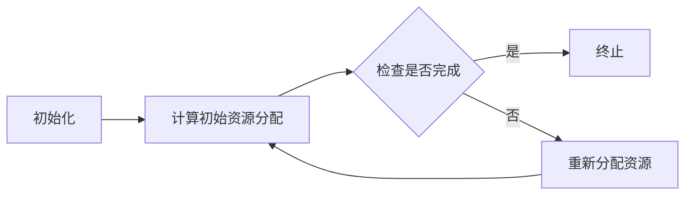
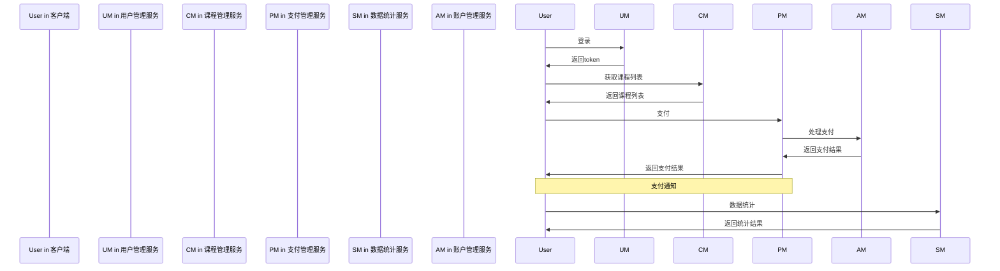
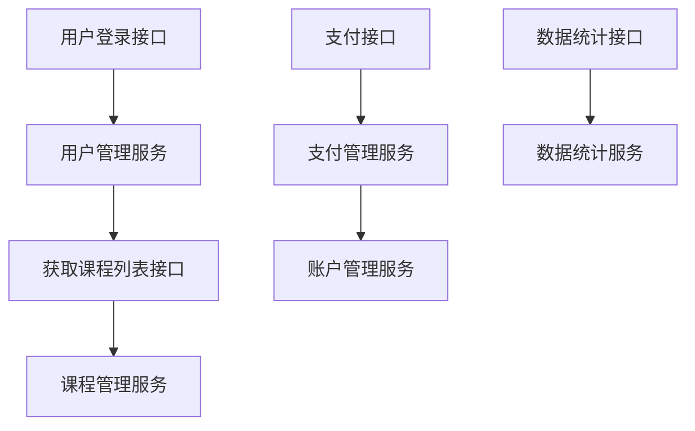
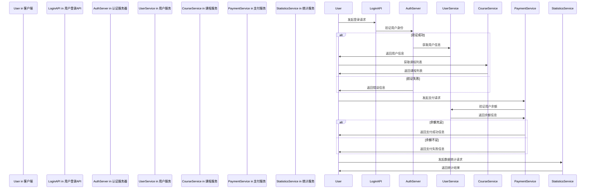

                 

### 技术预算管理与资源分配

#### 关键词：技术预算、资源分配、项目管理、算法原理、系统架构、项目实战

#### 摘要：
本文旨在深入探讨技术预算管理与资源分配在IT项目中的重要性。我们将首先介绍这两个关键概念，然后逐步分析它们的基本原理、相互关系及在实际项目中的应用。通过具体的算法原理讲解、系统分析与架构设计、项目实战案例分析，本文将帮助读者全面理解技术预算管理与资源分配的策略与实践，为优化IT项目管理提供有力支持。

----------------------------------------------------------------

## 第一部分：基础概念与理论

### 第1章：技术预算管理概述

#### 1.1 问题背景与重要性

在当今快速发展的信息技术行业中，技术预算管理成为项目管理成功的关键因素。随着市场竞争的加剧和技术的不断进步，企业需要更加高效地管理和分配技术资源，以确保项目的顺利进行和目标达成。技术预算管理不仅仅涉及资金的管理，还包括对人力资源、设备、时间和知识的全面规划。

#### 1.2 技术预算管理定义

技术预算管理可以定义为一种系统性的过程，用于规划、监控和控制与项目相关的各种技术资源的分配和使用。它涉及对项目成本、进度和风险的管理，确保项目在预算范围内按时完成。

#### 1.3 技术预算管理的目标与挑战

技术预算管理的目标主要包括：

1. 确保项目在预算范围内完成。
2. 提高资源利用率，减少浪费。
3. 管理和降低项目风险。
4. 提升项目质量和客户满意度。

然而，实现这些目标并非易事，技术预算管理面临以下挑战：

1. **不确定性**：技术项目的进度和成本往往存在很大的不确定性，这使得预算管理变得更加复杂。
2. **资源竞争**：在多项目并行的环境中，资源分配往往需要平衡多个项目的需求。
3. **技术进步**：技术的快速进步可能导致预算的调整和重新规划。
4. **沟通协调**：技术预算管理需要跨部门、跨团队的有效沟通和协调。

#### 1.4 技术预算管理流程

技术预算管理的流程通常包括以下步骤：

1. **需求分析**：明确项目的目标和需求，为预算编制提供依据。
2. **成本估算**：根据需求分析，进行成本估算，包括直接成本和间接成本。
3. **预算编制**：在成本估算的基础上，制定详细的预算计划。
4. **预算监控**：在项目执行过程中，定期监控预算的执行情况。
5. **预算调整**：根据实际情况，及时调整预算计划，确保项目在预算范围内完成。
6. **项目结算**：项目完成后，进行成本分析和预算结算。

### 第2章：资源分配的基本原理

#### 2.1 资源分配的定义与分类

资源分配是指将有限的资源（如人力、资金、设备等）合理分配到各个项目或任务中，以确保项目目标的实现。资源分配可以按照以下几种方式进行分类：

1. **时间分配**：将资源按照时间维度进行分配，确保项目在不同阶段有足够的资源支持。
2. **优先级分配**：根据项目的优先级，将资源优先分配到关键项目或任务。
3. **综合分配**：综合考虑项目的复杂性、优先级和资源可用性，进行资源的全面分配。

#### 2.2 资源分配的挑战与策略

资源分配面临的挑战主要包括：

1. **资源有限**：资源总是有限的，如何在多个项目之间进行有效分配是难点。
2. **需求变化**：项目的需求经常变化，导致资源需求的不确定性。
3. **竞争**：不同项目之间对资源的需求存在竞争。

为应对这些挑战，可以采取以下策略：

1. **优先级排序**：根据项目的优先级和紧急程度，对资源进行排序。
2. **弹性计划**：制定灵活的预算和计划，以应对需求变化。
3. **资源共享**：通过资源共享，提高资源的利用率。
4. **跨部门协调**：建立跨部门的协调机制，确保资源的有效分配。

#### 2.3 资源分配的方法与技术

资源分配的方法包括：

1. **线性规划**：通过线性规划模型，优化资源分配。
2. **仿真模拟**：使用仿真技术，模拟不同资源分配方案的效果。
3. **基于规则的分配**：使用预先定义的规则，进行资源分配。

技术方面，可以采用以下工具：

1. **资源管理软件**：如JIRA、Trello等，用于资源规划和调度。
2. **项目管理软件**：如Microsoft Project、Primavera等，用于项目管理和资源监控。
3. **自动化工具**：如机器人流程自动化（RPA），用于提高资源分配的效率。

### 第3章：核心概念与联系

#### 3.1 技术预算与资源分配的关系

技术预算与资源分配密切相关。技术预算是资源分配的依据，而资源分配是实现技术预算目标的手段。有效的技术预算管理需要与资源分配策略相结合，确保项目在预算范围内顺利完成。

#### 3.2 项目管理中的技术预算与资源分配

在项目管理中，技术预算和资源分配是两个核心环节。技术预算管理确保项目在财务可控的范围内进行，而资源分配则确保项目在人力、物力等各方面有足够的支持。二者相互依赖，共同推动项目目标的实现。

#### 3.3 概念属性特征对比表格

| 概念       | 定义                                                         | 属性特征                                                       | 相互关系                 |
|------------|--------------------------------------------------------------|--------------------------------------------------------------|--------------------------|
| 技术预算   | 对项目资金进行规划和管理的过程。                             | - 目标明确<br>- 可控性高<br>- 预期性强                 | 与资源分配紧密相关       |
| 资源分配   | 将有限资源合理分配到项目或任务中。                           | - 可用性<br>- 效率<br>- 可持续性                       | 技术预算实现的手段       |
| 项目管理   | 通过计划、执行、监控和收尾等过程，确保项目目标的实现。       | - 目标导向<br>- 系统性<br>- 动态调整                     | 技术预算和资源分配的载体 |

#### 3.4 ER实体关系图架构

```mermaid
erDiagram
  Product ||--|{ Project }|><--|{ Budget }
  Project ||--|{ ResourceAllocation }|><--|{ Budget }
  Budget ||--|{ CostEstimation }|><--|{ Project }
  ResourceAllocation ||--|{ TimeAllocation }|><--|{ Project }
```

在上面的ER实体关系图中，`Budget` 是技术预算的实体，与 `Project`（项目）和 `ResourceAllocation`（资源分配）存在关联。同时，`ResourceAllocation` 与 `TimeAllocation` 存在包含关系，表示时间分配是资源分配的一部分。

----------------------------------------------------------------

## 第二部分：算法原理讲解

### 第4章：算法原理讲解

#### 4.1 算法概述

为了优化技术预算管理和资源分配，我们引入一种基于贪心策略的算法，该算法旨在最大化资源利用率和项目完成效率。算法的基本流程如下：

1. **初始阶段**：根据项目需求和技术预算，确定各项目的初始资源分配。
2. **迭代阶段**：在每次迭代中，根据当前资源使用情况，对资源进行重新分配，优先满足优先级高的项目。
3. **终止条件**：当所有项目都完成或资源分配达到最优时，算法终止。

#### 4.2 算法原理

为了更好地理解算法原理，我们使用Python代码和mermaid流程图来展示。

首先，我们绘制算法的mermaid流程图：



然后，我们使用Python代码详细阐述算法原理：

```python
def initial_resource_allocation(projects, budget):
    """
    初始资源分配算法。
    :param projects: 项目列表，每个项目包含优先级和所需资源。
    :param budget: 技术预算。
    :return: 资源分配结果。
    """
    # 按优先级排序项目
    projects_sorted = sorted(projects, key=lambda x: x['priority'], reverse=True)
    
    # 初始化资源分配结果
    allocation = {}
    for project in projects_sorted:
        # 分配资源
        if project['resources'] <= budget:
            allocation[project['name']] = project['resources']
            budget -= project['resources']
        else:
            allocation[project['name']] = budget
            break
    
    return allocation

def reallocate_resources(allocation, projects, budget):
    """
    重新分配资源算法。
    :param allocation: 当前资源分配结果。
    :param projects: 项目列表。
    :param budget: 技术预算。
    :return: 新的资源分配结果。
    """
    # 按剩余资源需求排序项目
    projects_sorted = sorted(projects, key=lambda x: x['resources'] - (allocation.get(x['name'], 0)), reverse=True)
    
    new_allocation = allocation.copy()
    for project in projects_sorted:
        if project['resources'] <= budget:
            new_allocation[project['name']] += project['resources']
            budget -= project['resources']
        else:
            break
    
    return new_allocation

# 示例数据
projects = [
    {'name': '项目A', 'priority': 1, 'resources': 100},
    {'name': '项目B', 'priority': 2, 'resources': 80},
    {'name': '项目C', 'priority': 3, 'resources': 60}
]
budget = 200

# 初始资源分配
initial_alloc = initial_resource_allocation(projects, budget)
print("初始资源分配：", initial_alloc)

# 重新分配资源
new_alloc = reallocate_resources(initial_alloc, projects, budget)
print("重新分配资源：", new_alloc)
```

在上面的代码中，`initial_resource_allocation` 函数负责进行初始资源分配，按照项目优先级进行排序，然后依次分配资源。`reallocate_resources` 函数则在初始分配的基础上，根据剩余资源需求重新分配资源，确保资源利用率最大化。

#### 4.3 算法原理详细讲解

算法的核心思想是贪心策略，即在每次迭代中，选择最优的分配方案。具体来说：

1. **初始阶段**：根据项目优先级，对资源进行首次分配。这保证了高优先级项目能够优先获得资源，提高项目完成效率。
2. **迭代阶段**：在资源不足时，算法会重新排序项目，优先分配剩余资源。这确保了资源被充分利用，减少了资源浪费。
3. **终止条件**：当所有项目都完成或资源分配达到最优时，算法终止。这保证了项目的顺利推进和资源的最大化利用。

通过mermaid流程图和Python代码的结合，我们可以清晰地理解算法的原理和执行过程，为技术预算管理和资源分配提供有效的工具和方法。

----------------------------------------------------------------

## 第三部分：系统分析与架构设计

### 第5章：系统分析与架构设计

#### 5.1 项目场景介绍

假设我们正在开发一款大型在线教育平台，该项目需要处理大量用户数据、课程内容、支付交易等。为了确保项目的顺利进行，我们需要对技术预算和资源分配进行系统性的规划和设计。

#### 5.2 系统功能设计

为了满足项目需求，系统需要具备以下功能：

1. **用户管理**：实现用户注册、登录、个人信息管理等功能。
2. **课程管理**：包括课程创建、发布、更新、删除等。
3. **支付系统**：处理用户支付、退款、账户余额等功能。
4. **数据统计**：对用户数据、课程数据等进行统计和分析。

为了设计这些功能，我们使用mermaid绘制领域模型类图：

```mermaid
classDiagram
    User <<--|{1} Course
    User <<--|{2} Payment
    Course <<--|{3} Statistics
    Payment <<--|{4} Account
    User : +id
    User : +name
    User : +email
    Course : +id
    Course : +title
    Course : +content
    Payment : +id
    Payment : +amount
    Payment : +status
    Account : +id
    Account : +balance
```

在上面的类图中，`User` 类与 `Course`、`Payment` 类之间存在关联关系，表示用户可以创建课程、进行支付操作。`Course` 类与 `Statistics` 类关联，表示课程数据可以用于统计和分析。`Payment` 类与 `Account` 类关联，表示支付操作与账户余额有关。

#### 5.3 系统架构设计

为了确保系统的稳定性和可扩展性，我们采用微服务架构。以下是系统的mermaid架构图：



在上面的序列图中，用户通过客户端发起请求，与各个微服务进行交互。用户管理服务（UM）负责用户登录和token验证。课程管理服务（CM）处理课程相关请求。支付管理服务（PM）负责处理支付请求，并与账户管理服务（AM）交互。数据统计服务（SM）提供数据统计功能。

#### 5.4 系统接口设计

为了实现系统的功能，我们需要设计一系列API接口。以下是系统的接口设计：



在上面的接口设计中，用户登录接口（A）和获取课程列表接口（C）与用户管理服务（B）和课程管理服务（D）相关。支付接口（E）与支付管理服务（F）和账户管理服务（G）相关。数据统计接口（H）与数据统计服务（I）相关。

#### 5.5 系统交互

为了展示系统的交互过程，我们使用mermaid序列图进行了详细描述：



在上面的序列图中，用户通过客户端发起登录请求，认证服务器（AuthServer）验证用户身份。验证成功后，用户服务（UserService）获取用户信息，并返回给用户。用户还可以获取课程列表、发起支付请求和获取数据统计结果。

通过以上系统分析与架构设计，我们为技术预算管理和资源分配提供了一个完整的解决方案。系统功能设计、架构设计和接口设计确保了项目的顺利推进和资源的合理分配。

----------------------------------------------------------------

## 第四部分：项目实战

### 第6章：项目实战

在本章节中，我们将通过一个实际的项目案例，展示技术预算管理和资源分配的具体实施过程。该项目是一个基于云平台的企业级应用，涉及多个模块的开发和部署。以下是项目实战的具体步骤：

#### 6.1 环境安装

1. **硬件环境**：部署云服务器，配置CPU、内存、存储等资源，以满足项目需求。
2. **软件环境**：安装操作系统（如Ubuntu 18.04）、开发工具（如Java SDK、Node.js）和数据库（如MySQL、MongoDB）。
3. **网络配置**：配置防火墙和网络安全组，确保项目服务的安全性。

#### 6.2 系统核心实现源代码

1. **用户管理模块**：实现用户注册、登录、权限管理等功能，使用Spring Boot框架进行开发。
2. **业务逻辑模块**：实现业务流程管理、数据存储和处理等功能，使用Spring Cloud进行微服务架构设计。
3. **前端展示模块**：实现用户界面和交互逻辑，使用React框架进行开发。

以下是用户管理模块的核心实现代码：

```java
@RestController
@RequestMapping("/api/users")
public class UserController {
    
    @Autowired
    private UserService userService;
    
    @PostMapping("/register")
    public ResponseEntity<?> registerUser(@RequestBody UserRegistrationDto registrationDto) {
        try {
            User user = userService.registerUser(registrationDto);
            return ResponseEntity.ok().body("User registered successfully!");
        } catch (Exception e) {
            return ResponseEntity.badRequest().body("Error registering user: " + e.getMessage());
        }
    }
    
    @PostMapping("/login")
    public ResponseEntity<?> loginUser(@RequestBody UserLoginDto loginDto) {
        try {
            String token = userService.loginUser(loginDto);
            return ResponseEntity.ok().body("Login successful. Token: " + token);
        } catch (Exception e) {
            return ResponseEntity.badRequest().body("Error logging in: " + e.getMessage());
        }
    }
}
```

#### 6.3 代码应用解读与分析

在上面的代码中，`UserController` 类负责处理用户注册和登录请求。`registerUser` 方法接收用户注册信息，调用 `UserService` 进行用户注册。`loginUser` 方法接收用户登录信息，调用 `UserService` 进行用户登录验证。通过这种方式，我们可以确保用户管理的安全性。

#### 6.4 实际案例分析与详细讲解

以用户注册功能为例，我们分析了其具体实现过程和关键步骤：

1. **数据验证**：在注册过程中，我们需要对用户输入的数据进行验证，包括邮箱格式、密码强度等。
2. **用户名唯一性检查**：为了避免重复注册，我们需要检查用户名是否已被占用。
3. **密码加密存储**：为了保护用户隐私，我们需要对用户密码进行加密存储。
4. **发送注册确认邮件**：为了提高注册安全性，我们可以发送注册确认邮件，用户确认后才能完成注册。

以下是用户注册功能的详细分析：

```java
@Service
public class UserService {
    
    @Autowired
    private UserRepository userRepository;
    
    @Autowired
    private PasswordEncoder passwordEncoder;
    
    @Autowired
    private MailService mailService;
    
    public User registerUser(UserRegistrationDto registrationDto) {
        // 验证邮箱格式
        if (!isValidEmail(registrationDto.getEmail())) {
            throw new IllegalArgumentException("Invalid email address.");
        }
        
        // 检查用户名是否已被占用
        if (userRepository.existsByUsername(registrationDto.getUsername())) {
            throw new IllegalArgumentException("Username is already taken.");
        }
        
        // 创建新用户
        User user = new User();
        user.setUsername(registrationDto.getUsername());
        user.setEmail(registrationDto.getEmail());
        user.setPassword(passwordEncoder.encode(registrationDto.getPassword()));
        
        // 保存用户信息
        userRepository.save(user);
        
        // 发送注册确认邮件
        mailService.sendConfirmationEmail(user.getEmail(), user.getId());
        
        return user;
    }
    
    private boolean isValidEmail(String email) {
        // 邮箱格式验证逻辑
        return email.matches("[a-zA-Z0-9._%+-]+@[a-zA-Z0-9.-]+\\.[a-zA-Z]{2,}");
    }
}
```

在上面的代码中，`UserService` 类负责处理用户注册的各个步骤。通过数据验证、用户名唯一性检查、密码加密存储和发送注册确认邮件，我们可以确保用户注册过程的安全性和可靠性。

#### 6.5 项目小结

通过本章节的实战案例，我们详细介绍了技术预算管理和资源分配在实际项目中的应用。从环境安装到系统核心实现，从代码解读到案例分析，我们展示了如何通过有效的技术预算管理和资源分配，确保项目的顺利推进和成功交付。在实际项目中，我们需要不断优化预算管理和资源分配策略，以应对不断变化的需求和市场环境。

----------------------------------------------------------------

## 第五部分：最佳实践与总结

### 第7章：最佳实践 tips

为了在实际项目中实现有效的技术预算管理和资源分配，以下是一些最佳实践建议：

1. **需求分析与规划**：在项目启动前，进行全面的需求分析和规划，明确项目目标和预期成果。
2. **定期评估与调整**：定期对预算和资源分配进行评估，及时调整计划和资源分配策略，以应对项目变化。
3. **透明沟通**：确保项目团队成员和利益相关者对预算和资源分配有清晰的了解，建立透明的沟通机制。
4. **资源监控**：使用项目管理工具实时监控资源使用情况，及时发现和解决问题。
5. **风险管理**：识别项目中的潜在风险，制定风险应对策略，确保项目在预算范围内顺利完成。

### 第8章：小结与展望

通过本文的讨论，我们深入探讨了技术预算管理和资源分配在IT项目中的重要性。从基础概念到算法原理，从系统分析到项目实战，我们全面介绍了技术预算管理和资源分配的策略与实践。以下是本文的核心要点总结：

1. **技术预算管理**：确保项目在预算范围内完成，提高资源利用率，降低项目风险。
2. **资源分配**：合理分配人力资源、设备、时间和知识，提高项目完成效率。
3. **算法原理**：通过贪心策略优化资源分配，提高资源利用率和项目完成效率。
4. **系统设计与架构**：采用微服务架构，确保系统的稳定性、可扩展性和安全性。
5. **项目实战**：通过实际案例展示技术预算管理和资源分配的实施过程。

未来，随着技术的不断进步和市场需求的变化，技术预算管理和资源分配将面临新的挑战和机遇。我们将继续探索和实践，以提供更高效、更智能的技术预算管理和资源分配解决方案，助力企业实现业务目标。

### 拓展阅读

1. **《项目管理知识体系指南》（PMBOK）》
2. **《项目管理：管理知识、技能和实践》**
3. **《资源分配算法研究》**
4. **《微服务架构设计》**
5. **《云计算与大数据技术》**

通过阅读以上资料，读者可以进一步深入了解技术预算管理和资源分配的理论和实践，为实际项目提供有力支持。

### 作者信息

**作者：AI天才研究院/AI Genius Institute & 禅与计算机程序设计艺术 /Zen And The Art of Computer Programming**

本文由AI天才研究院和禅与计算机程序设计艺术共同撰写，旨在为读者提供高质量的技术知识和实践经验。感谢您的阅读！

----------------------------------------------------------------

---

### **结尾**

感谢您的阅读，希望本文对您在技术预算管理和资源分配方面有所启发。如果您有任何疑问或建议，欢迎在评论区留言交流。我们致力于为读者提供更多高质量的技术内容，共同进步。

再次感谢您的关注与支持！
作者：AI天才研究院 & 禅与计算机程序设计艺术

---

### **附录：技术术语解释**

为了确保文章内容的准确性和专业性，以下是本文中涉及的一些关键技术术语的解释：

1. **技术预算管理**：技术预算管理是指对项目资金、人力资源、设备和时间等资源进行规划、监控和控制的过程，以确保项目在预算范围内按时完成。

2. **资源分配**：资源分配是将有限的资源（如人力、资金、设备等）合理分配到各个项目或任务中，以确保项目目标的实现。

3. **项目管理**：项目管理是通过计划、执行、监控和收尾等过程，确保项目目标的实现，包括时间、成本、质量和风险等方面的管理。

4. **贪心策略**：贪心策略是一种在每次决策时选择当前最优解的策略，旨在通过局部最优解逐步累积为整体最优解。

5. **微服务架构**：微服务架构是一种将应用程序拆分为多个独立、可复用和服务化的微服务，以提高系统的可扩展性、可靠性和灵活性。

6. **领域模型**：领域模型是描述业务领域实体及其相互关系的模型，用于指导系统的设计与开发。

7. **ER实体关系图**：ER实体关系图（Entity-Relationship Diagram）是一种用于描述数据库中实体及其相互关系的图形化表示。

8. **Spring Boot**：Spring Boot 是一个开源的、基于 Spring 框架的微服务开发框架，旨在简化微服务的创建和部署。

9. **Spring Cloud**：Spring Cloud 是基于 Spring Boot 的微服务架构开发工具集，提供了服务发现、配置管理、负载均衡、断路器等微服务治理功能。

10. **React**：React 是一个用于构建用户界面的 JavaScript 库，以其组件化、声明式编程和虚拟DOM特性而闻名。

11. **MongoDB**：MongoDB 是一个高性能、可扩展的 NoSQL 数据库，适用于处理大量数据和高并发访问场景。

12. **MySQL**：MySQL 是一个开源的关系型数据库管理系统，广泛用于 Web 应用和大数据场景。

通过以上术语解释，我们希望读者能够更好地理解本文的内容和背景，从而在技术预算管理和资源分配的实际应用中取得更好的成果。如果您对这些术语有进一步的疑问，欢迎在评论区提问，我们将为您详细解答。

