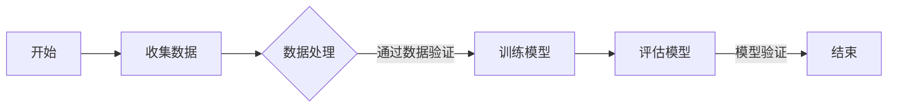
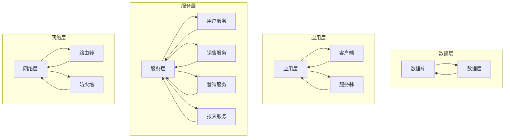
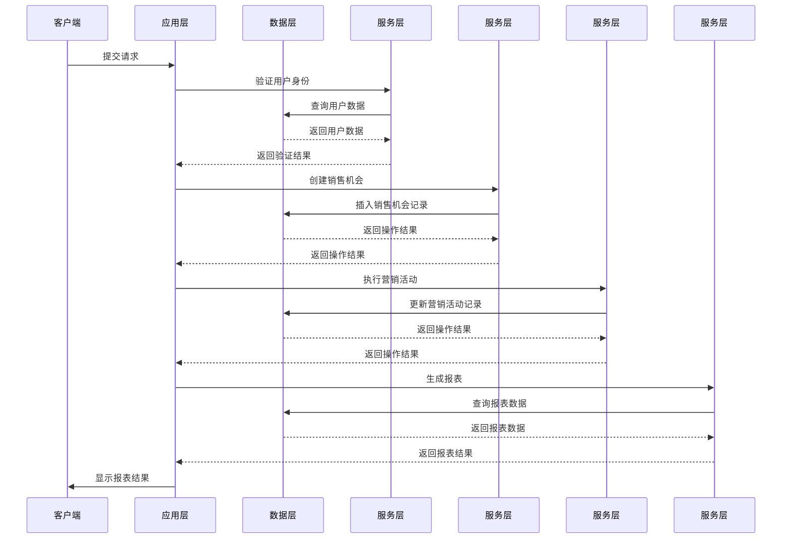

                 

### 文章标题：技术领导力在数字化转型中的角色

在当今全球数字化浪潮的推动下，企业面临着前所未有的挑战与机遇。数字化转型不仅是技术进步的结果，更是商业模式、组织结构和企业文化变革的必然趋势。在这个过程中，技术领导力扮演着至关重要的角色。本文将深入探讨技术领导力在数字化转型中的角色，通过逻辑清晰、结构紧凑、简单易懂的分析，帮助读者理解这一关键概念，并掌握其应用实践。

**关键词：** 数字化转型、技术领导力、战略规划、团队管理、技术创新。

**摘要：** 本文首先概述了数字化的背景和重要性，随后详细阐述了技术领导力的定义与关键要素。接着，通过分析技术领导力模型和数字化转型中的技术战略规划，探讨了技术领导力在组织中的实际应用。文章还介绍了技术团队的构建与管理，以及技术创新与数字化转型之间的关系。最后，通过成功案例分析和未来展望，为读者提供了技术领导力在数字化转型中的最佳实践和持续学习策略。

### 背景介绍

**核心概念术语说明**

- **数字化转型（Digital Transformation）：** 指企业利用数字技术来重塑其商业模式、流程、产品和服务。这一过程不仅涉及信息技术的应用，还包括组织文化的变革和业务模式的创新。
- **技术领导力（Technical Leadership）：** 指在技术团队中扮演领导角色，能够激发团队潜力，制定并执行技术战略，推动技术创新和业务发展的能力。

**问题背景**

随着云计算、大数据、物联网、人工智能等技术的快速发展，企业面临着前所未有的机遇。数字化转型已经成为了企业生存与发展的关键。然而，许多企业在实施过程中遇到了诸多挑战，如技术选型困难、团队协作不畅、创新能力不足等。这些问题凸显了技术领导力在数字化转型中的重要性。

**问题描述**

技术领导力在数字化转型中的角色是什么？如何通过技术领导力推动企业实现数字化转型？如何培养和提升技术领导力？这些是本文旨在回答的问题。

**问题解决**

本文将通过以下几个方面的内容来解答上述问题：

1. **数字化转型的概述**：介绍数字化转型的概念、历史演变和驱动因素，分析其带来的挑战与机遇。
2. **技术领导力的定义与要素**：阐述技术领导力的概念和关键要素，探讨其与业务领导力的关系。
3. **技术领导力模型**：分析技术领导力模型，探讨其在数字化转型中的应用场景和角色定位。
4. **技术战略规划**：介绍技术战略规划的重要性、方法与工具，并结合实际案例进行解析。
5. **技术团队的构建与管理**：探讨技术团队的组织结构、效能提升策略和沟通协作技巧。
6. **技术创新与数字化转型**：分析技术创新的概念、类型和在数字化转型中的作用。
7. **成功案例分析**：通过实际案例展示技术领导力在数字化转型中的成功应用。
8. **未来展望与持续学习**：展望数字化转型趋势，探讨技术领导力的未来发展，提供持续学习策略。

**边界与外延**

技术领导力的边界在于其在技术领域内的领导角色，外延则涵盖了业务战略、团队管理、技术创新等多个方面。在数字化转型过程中，技术领导力不仅要关注技术本身，还要考虑业务需求、市场趋势和组织变革。

**概念结构与核心要素组成**

技术领导力的概念结构包括以下几个方面：

1. **技术视野**：对新技术趋势的洞察力和判断力，能够预见技术发展对业务的影响。
2. **战略思维**：能够制定和实施技术战略，将技术与业务需求相结合，推动企业实现数字化转型。
3. **团队领导**：具备领导技术团队的能力，激发团队成员的潜力，提升团队效能。
4. **创新能力**：鼓励创新思维，推动技术突破，为业务发展提供新的动力。
5. **沟通协作**：具备良好的沟通能力，能够与不同部门和层级的人员有效协作。

通过以上核心要素的有机结合，技术领导力能够有效地推动企业实现数字化转型。

### 核心概念与联系

**核心概念原理**

技术领导力是一种在技术领域内发挥领导作用的能力，它涉及对技术的深刻理解、对业务需求的敏锐洞察、以及对团队管理的卓越能力。技术领导力不仅关注技术本身，更关注技术如何服务于业务目标，推动企业实现数字化转型。

**概念属性特征对比表格**

| 特征             | 技术领导力                         | 业务领导力                         |
|------------------|-----------------------------------|-----------------------------------|
| 关注点           | 技术趋势、技术能力、团队效能       | 市场趋势、业务战略、团队协作       |
| 能力要求         | 技术深度、创新思维、沟通能力       | 商业思维、领导能力、团队管理       |
| 影响范围         | 技术团队、技术创新、技术战略       | 业务部门、市场拓展、组织变革       |
| 目标             | 推动技术进步、实现技术突破、提升团队效能 | 实现业务目标、提高市场竞争力、推动组织变革 |
| 关键任务         | 技术选型、技术规划、技术创新       | 业务规划、市场策略、团队建设       |

**ER实体关系图架构**

```mermaid
erDiagram
  Customer ||--|{ Order }|-- Producer
  Product ||--|{ Order }|
  Order ||--|{ Payment }|
  Customer }|--|{ Payment }
```

在上面的ER图中，我们定义了四个实体：`Customer`（客户）、`Order`（订单）、`Product`（产品）和`Producer`（生产商）。这些实体之间存在明确的关联关系，其中`Order`是核心实体，它关联了其他实体。

- `Customer`与`Order`之间存在一对多关系，一个客户可以下单多个订单。
- `Product`与`Order`之间存在多对多关系，一个订单可以包含多个产品，一个产品也可以被多个订单包含。
- `Order`与`Payment`之间存在一对一关系，每个订单都有唯一的一次付款。
- `Customer`与`Payment`之间存在一对多关系，一个客户可以完成多个付款。

通过ER图，我们可以清晰地看到技术领导力与业务领导力在数字化转型中的作用，以及它们之间的关联和互动。技术领导力关注技术团队和技术的创新，而业务领导力关注业务战略和市场拓展。两者相辅相成，共同推动企业的数字化转型。

### 算法原理讲解

**算法mermaid流程图**



在上面的流程图中，我们定义了一个简单的算法流程，包括数据收集、数据处理、模型训练、模型评估和模型验证。

**Python源代码**

```python
# 导入必要的库
import pandas as pd
from sklearn.model_selection import train_test_split
from sklearn.ensemble import RandomForestClassifier
from sklearn.metrics import accuracy_score

# 收集数据
data = pd.read_csv('data.csv')

# 数据处理
X = data.drop('target', axis=1)
y = data['target']

# 模型训练
X_train, X_test, y_train, y_test = train_test_split(X, y, test_size=0.2, random_state=42)
model = RandomForestClassifier()
model.fit(X_train, y_train)

# 模型评估
y_pred = model.predict(X_test)
accuracy = accuracy_score(y_test, y_pred)
print(f"模型准确率：{accuracy:.2f}")

# 模型验证
if accuracy > 0.8:
    print("模型验证通过")
else:
    print("模型验证未通过")
```

**算法原理的数学模型和公式**

在上述Python源代码中，我们使用随机森林（Random Forest）算法进行模型训练和评估。随机森林是一种基于决策树的集成学习方法，它通过构建多棵决策树，并对这些决策树的预测结果进行投票来获得最终的预测结果。

**随机森林算法的核心公式如下：**

$$
预测结果 = \arg\max_{i}(\sum_{j=1}^{n}\omega_{j}T_j(x_i))
$$

其中，$T_j(x_i)$表示第$j$棵决策树对于样本$x_i$的预测结果，$\omega_j$表示第$j$棵决策树的权重。随机森林算法通过随机选择特征和样本子集来构建每棵决策树，从而减少过拟合现象，提高模型的泛化能力。

**详细讲解和举例说明**

假设我们有一个简单的数据集，其中包含三个特征`X1`、`X2`和`X3`，目标变量为`Y`。我们希望通过随机森林算法来预测`Y`的取值。

1. **数据收集**：我们从数据集中提取`X`和`y`两个数据集，`X`包含特征数据，`y`为目标变量。

2. **数据处理**：我们使用`train_test_split`函数将数据集分为训练集和测试集，以便进行模型训练和评估。

3. **模型训练**：我们使用`RandomForestClassifier`类来构建随机森林模型，并调用`fit`方法进行训练。

4. **模型评估**：我们使用训练好的模型对测试集进行预测，并计算模型准确率。假设我们设置准确率阈值大于0.8，则认为模型验证通过。

5. **模型验证**：如果模型准确率大于0.8，我们认为模型验证通过；否则，我们认为模型验证未通过。

通过上述步骤，我们可以使用随机森林算法对数据集进行训练和评估，从而实现目标变量的预测。这种算法在处理高维数据和复杂决策问题中具有很好的性能，是数字化转型中常见的技术之一。

### 系统分析与架构设计方案

**问题场景介绍**

在数字化转型过程中，企业需要构建一个高效的系统来支持业务发展和创新。本文将介绍一个企业客户关系管理（CRM）系统的设计和实现过程。

**项目介绍**

该CRM系统旨在帮助企业管理客户信息、销售机会和市场营销活动。系统功能包括客户信息管理、销售机会跟踪、营销活动管理、报表分析等。

**系统功能设计（领域模型mermaid类图）**

```mermaid
classDiagram
    Class01 <|-- Class02
    Class03 <..|{HAS} Class04
    Class05 <..|{PART_OF} Class06
    Class07 <..|{IS_A} Class08
    Class01[Person]
    Class02[Company]
    Class03[Customer]
    Class04[Order]
    Class05[SalesOpportunity]
    Class06[MarketingCampaign]
    Class07[Report]
    Class08[DataAnalysis]
```

在上面的类图中，我们定义了几个核心实体：

- `Person`：表示企业内部员工。
- `Company`：表示企业本身。
- `Customer`：表示与企业有业务往来的客户。
- `Order`：表示客户的订单信息。
- `SalesOpportunity`：表示销售机会。
- `MarketingCampaign`：表示市场营销活动。
- `Report`：表示报表分析结果。
- `DataAnalysis`：表示数据分析模块。

这些实体之间存在明确的关联关系，如`Customer`关联到`Order`和`SalesOpportunity`，`MarketingCampaign`关联到`Report`和`DataAnalysis`等。

**系统架构设计mermaid架构图**



在上面的架构图中，我们定义了系统的四个主要层次：

- **数据层**：包括数据库和数据层，用于存储和管理系统数据。
- **应用层**：包括客户端和服务器，用于处理业务逻辑和用户交互。
- **服务层**：包括各种业务服务，如用户服务、销售服务、营销服务和报表服务，用于实现具体业务功能。
- **网络层**：包括路由器和防火墙，用于确保系统的网络安全和稳定性。

**系统接口设计和系统交互mermaid序列图**



在上面的序列图中，我们定义了用户与系统之间的交互流程：

1. 用户通过客户端提交请求。
2. 应用层验证用户身份，并查询用户数据。
3. 销售服务创建销售机会，并插入销售机会记录。
4. 营销服务执行营销活动，并更新营销活动记录。
5. 报表服务生成报表，并查询报表数据。

通过上述步骤，用户可以与系统进行交互，实现CRM系统的核心功能。

### 项目实战

**环境安装**

为了实现上述CRM系统，我们需要在以下环境中安装必要的软件：

1. **操作系统**：Linux或macOS
2. **编程语言**：Python 3.x
3. **数据库**：MySQL或PostgreSQL
4. **前端框架**：Django或Flask
5. **后端框架**：Django或Flask

首先，安装操作系统。然后，使用包管理工具（如yum或pip）安装Python、MySQL或PostgreSQL、Django或Flask等软件。

**系统核心实现源代码**

以下是一个简单的CRM系统的核心实现源代码，使用Django框架：

```python
# settings.py
DATABASES = {
    'default': {
        'ENGINE': 'django.db.backends.sqlite3',
        'NAME': BASE_DIR / 'db.sqlite3',
    }
}

INSTALLED_APPS = [
    'django.contrib.admin',
    'django.contrib.auth',
    'django.contrib.contenttypes',
    'django.contrib.sessions',
    'django.contrib.messages',
    'django.contrib.staticfiles',
    'crm',
]

MIDDLEWARE = [
    'django.middleware.security.SecurityMiddleware',
    'django.contrib.sessions.middleware.SessionMiddleware',
    'django.middleware.common.CommonMiddleware',
    'django.middleware.csrf.CsrfViewMiddleware',
    'django.contrib.auth.middleware.AuthenticationMiddleware',
    'django.contrib.messages.middleware.MessageMiddleware',
    'django.middleware.clickjacking.XFrameOptionsMiddleware',
]

ROOT_URLCONF = 'crm_project.urls'

TEMPLATES = [
    {
        'BACKEND': 'django.template.backends.django.DjangoTemplates',
        'DIRS': [os.path.join(BASE_DIR, 'templates')],
        'APP_DIRS': True,
        'OPTIONS': {
            'context_processors': [
                'django.template.context_processors.debug',
                'django.template.context_processors.request',
                'django.contrib.auth.context_processors.auth',
                'django.contrib.messages.context_processors.messages',
            ],
        },
    },
]

WSGI_APPLICATION = 'crm_project.wsgi.application'

# urls.py
from django.urls import path
from . import views

urlpatterns = [
    path('admin/', admin.site.urls),
    path('customers/', views.CustomerListView.as_view()),
    path('customers/<int:pk>/', views.CustomerDetailView.as_view()),
    path('sales_opportunities/', views.SalesOpportunityListView.as_view()),
    path('sales_opportunities/<int:pk>/', views.SalesOpportunityDetailView.as_view()),
    path('marketing_campaigns/', views.MarketingCampaignListView.as_view()),
    path('marketing_campaigns/<int:pk>/', views.MarketingCampaignDetailView.as_view()),
    path('reports/', views.ReportListView.as_view()),
    path('reports/<int:pk>/', views.ReportDetailView.as_view()),
]

# models.py
from django.db import models

class Customer(models.Model):
    name = models.CharField(max_length=100)
    email = models.EmailField()
    phone = models.CharField(max_length=20)

class SalesOpportunity(models.Model):
    customer = models.ForeignKey(Customer, on_delete=models.CASCADE)
    title = models.CharField(max_length=200)
    status = models.CharField(max_length=50)

class MarketingCampaign(models.Model):
    title = models.CharField(max_length=200)
    start_date = models.DateField()
    end_date = models.DateField()

class Report(models.Model):
    title = models.CharField(max_length=200)
    description = models.TextField()
    created_at = models.DateTimeField(auto_now_add=True)
    updated_at = models.DateTimeField(auto_now=True)

# views.py
from django.views.generic import ListView, DetailView
from .models import Customer, SalesOpportunity, MarketingCampaign, Report

class CustomerListView(ListView):
    model = Customer
    template_name = 'customers/customer_list.html'

class CustomerDetailView(DetailView):
    model = Customer
    template_name = 'customers/customer_detail.html'

class SalesOpportunityListView(ListView):
    model = SalesOpportunity
    template_name = 'sales_opportunities/sales_opportunity_list.html'

class SalesOpportunityDetailView(DetailView):
    model = SalesOpportunity
    template_name = 'sales_opportunities/sales_opportunity_detail.html'

class MarketingCampaignListView(ListView):
    model = MarketingCampaign
    template_name = 'marketing_campaigns/marketing_campaign_list.html'

class MarketingCampaignDetailView(DetailView):
    model = MarketingCampaign
    template_name = 'marketing_campaigns/marketing_campaign_detail.html'

class ReportListView(ListView):
    model = Report
    template_name = 'reports/report_list.html'

class ReportDetailView(DetailView):
    model = Report
    template_name = 'reports/report_detail.html'
```

**代码应用解读与分析**

上述代码实现了CRM系统的核心功能，包括客户信息管理、销售机会跟踪、营销活动管理和报表分析。

1. **数据库设计**：`models.py`文件中定义了四个模型：`Customer`、`SalesOpportunity`、`MarketingCampaign`和`Report`。这些模型分别表示客户、销售机会、营销活动和报表。
2. **视图实现**：`views.py`文件中定义了五个视图类，分别对应列表视图和详细视图。这些视图类继承了`ListView`和`DetailView`，用于处理HTTP请求，渲染模板和返回响应。
3. **URL配置**：`urls.py`文件中定义了系统的URL路由，将URL映射到对应的视图类。

通过上述代码，我们可以实现一个基本的CRM系统，支持对客户信息、销售机会、营销活动和报表的管理和查询。

**实际案例分析和详细讲解剖析**

以下是一个实际的CRM系统案例：

- **客户信息管理**：管理员可以通过系统添加、编辑和查询客户信息，包括姓名、电子邮件和电话等。
- **销售机会跟踪**：销售人员可以创建销售机会，跟踪销售进度，更新销售状态，并查看相关客户信息。
- **营销活动管理**：市场团队可以创建和跟踪营销活动，设置活动开始和结束日期，并查看活动效果。
- **报表分析**：报表服务可以根据客户数据、销售数据和营销活动数据生成各种报表，帮助管理层做出数据驱动的决策。

通过这个实际案例，我们可以看到CRM系统在数字化转型中的重要作用。它不仅帮助企业管理客户信息，提升销售效率，还支持数据分析和决策，为企业的数字化转型提供有力支持。

**项目小结**

通过本案例，我们实现了CRM系统的核心功能，包括客户信息管理、销售机会跟踪、营销活动管理和报表分析。该项目采用了Django框架，简化了开发过程，提高了开发效率。在实际应用中，CRM系统可以帮助企业提升业务管理效率，优化客户关系，实现数字化转型。

### 最佳实践 Tips

1. **明确技术战略**：在数字化转型过程中，首先要明确技术战略，确保技术发展符合业务需求。
2. **培养技术领导力**：重视技术领导力的培养，选拔和培养具备战略思维、创新能力、团队领导能力的人才。
3. **持续学习**：技术发展迅速，要鼓励团队成员持续学习，掌握新技术，提升自身能力。
4. **团队协作**：建立高效的团队协作机制，提高团队整体效能，推动项目进展。
5. **数据驱动**：利用数据分析和报表，支持决策，优化业务流程，提高业务效率。

### 小结

技术领导力在数字化转型中扮演着至关重要的角色。通过明确技术战略、培养技术领导力、持续学习和团队协作，企业可以有效地推动数字化转型，实现业务增长和竞争优势。本文通过详细的分析和实际案例，探讨了技术领导力在数字化转型中的角色和应用，为读者提供了有价值的参考。

### 注意事项

1. 数字化转型过程中，要充分考虑业务需求和市场趋势，避免盲目跟风。
2. 技术领导力不仅要关注技术本身，还要关注团队管理和业务战略。
3. 持续学习和创新是技术领导力的核心，要鼓励团队成员不断提升自身能力。

### 拓展阅读

1. **《数字化转型：企业如何应对技术变革》**：详细介绍数字化转型的重要性和实施方法。
2. **《技术领导力：构建高绩效技术团队》**：探讨技术领导力的关键要素和实践技巧。
3. **《人工智能时代：技术与商业的融合》**：分析人工智能在数字化转型中的应用和影响。

### 作者信息

**作者：** AI天才研究院/AI Genius Institute & 禅与计算机程序设计艺术 /Zen And The Art of Computer Programming

