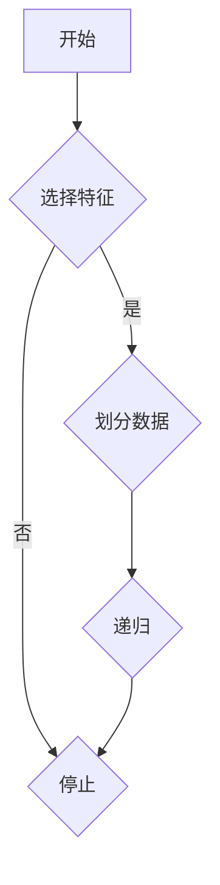
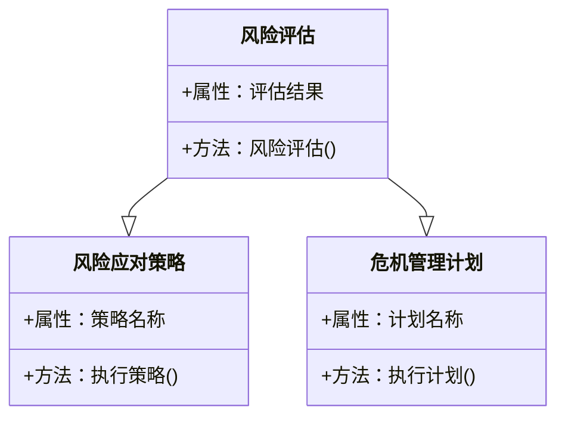
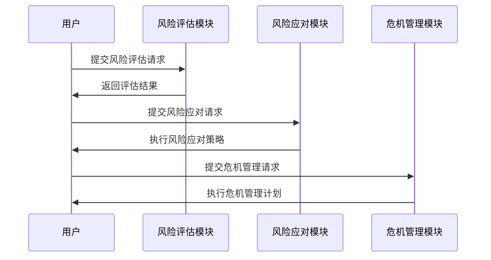

                 

# 技术风险管理与危机处理

## 关键词：技术风险、危机处理、风险管理、危机管理、风险应对策略

### 摘要：

在现代信息技术高速发展的时代，技术风险管理与危机处理已成为企业面临的重要课题。本文将详细探讨技术风险的背景、种类、管理方法以及危机处理的必要性，通过一步一步的逻辑分析，为读者提供全面的技术风险管理指南。我们将深入探讨核心概念与联系，讲解风险管理中的算法原理，展示数学模型和公式，介绍系统架构设计，并通过实际项目案例进行实战讲解。最后，本文将总结最佳实践，提供注意事项和拓展阅读资源，帮助读者深入理解和应用技术风险管理与危机处理的方法。

## 第一部分：技术风险管理与危机处理背景

### 1.1 问题背景

随着信息技术的迅猛发展，企业对技术的依赖日益加深，技术风险也随之增加。技术风险是指由于技术系统故障、数据泄露、系统安全漏洞等原因导致的企业运营中断、财务损失、声誉损害等问题。技术风险的种类繁多，包括系统故障风险、数据泄露风险、网络安全风险、业务连续性风险等。在这些风险面前，企业需要具备有效的技术风险管理能力，以防范潜在威胁，确保业务的连续性和稳定性。

### 1.2 技术风险的定义与种类

技术风险是指信息技术系统在运行过程中可能出现的各种问题，这些问题可能对企业的运营、财务、声誉等方面造成不利影响。技术风险的种类主要包括：

- **系统故障风险**：由于系统设计缺陷、硬件故障、软件漏洞等原因导致系统无法正常运行的风险。
- **数据泄露风险**：由于系统安全漏洞、恶意攻击等原因导致敏感数据泄露的风险。
- **网络安全风险**：由于网络攻击、黑客入侵等原因导致企业网络安全受到威胁的风险。
- **业务连续性风险**：由于自然灾害、设备故障等原因导致业务无法连续运行的风险。

### 1.3 技术风险管理现状

当前，技术风险管理在企业中越来越受到重视。许多企业已经建立了相应的风险管理机制，通过风险评估、风险应对策略、危机管理计划等措施来降低技术风险。然而，面对日益复杂的技术环境，现有的风险管理方法仍然存在一定的局限性，需要不断改进和完善。

### 1.4 危机处理的必要性

技术危机处理是技术风险管理的重要组成部分。在技术风险发生时，及时、有效的危机处理能够帮助企业降低损失，恢复业务运行。危机处理的必要性体现在以下几个方面：

- **降低损失**：及时、有效的危机处理能够最大程度地减少企业的财务损失和声誉损害。
- **保障业务连续性**：通过危机处理，企业可以迅速恢复业务运行，确保业务的连续性和稳定性。
- **提升风险管理能力**：危机处理过程中，企业可以积累经验，改进风险管理策略，提升整体风险管理能力。

## 第二部分：核心概念与联系

### 2.1 技术风险管理基本概念

#### 2.1.1 风险评估

风险评估是指对技术风险进行识别、分析和评估的过程。通过风险评估，企业可以了解风险的大小、发生概率以及可能造成的损失，从而制定相应的风险应对策略。

#### 2.1.2 风险应对策略

风险应对策略是指企业针对不同类型的技术风险所采取的应对措施。常见的风险应对策略包括风险规避、风险减轻、风险转移和风险接受等。

#### 2.1.3 危机管理计划

危机管理计划是指企业在面临技术危机时制定的应对措施和操作流程。危机管理计划包括危机预警、危机响应、危机恢复和危机评估等环节。

### 2.2 概念属性特征对比表格

| 概念        | 定义                                                         | 属性特征                                               |
|-------------|--------------------------------------------------------------|--------------------------------------------------------|
| 风险评估     | 对技术风险进行识别、分析和评估的过程。                       | 风险识别、风险分析、风险评估                           |
| 风险应对策略 | 企业针对不同类型的技术风险所采取的应对措施。                 | 风险规避、风险减轻、风险转移、风险接受                 |
| 危机管理计划 | 企业在面临技术危机时制定的应对措施和操作流程。               | 危机预警、危机响应、危机恢复、危机评估                 |

### 2.3 ER实体关系图架构

```mermaid
erDiagram
  Customer ||--o{ Order }|
  Customer ||--o{ Payment }|
  Product ||--o{ Order }|
  Product ||--o{ Review }|
  Review ||--o{ Customer }|
  Order ||--o{ Payment }|
  Payment ||--o{ Order }|
```

## 第三部分：算法原理讲解

### 3.1 风险度量的数学模型

#### 3.1.1 风险度量的基本概念

风险度量是指对技术风险进行量化评估的方法。通过风险度量，企业可以了解风险的大小和发生概率，从而制定相应的风险应对策略。

#### 3.1.2 数学公式与模型

风险度量的数学模型主要包括以下几种：

- **风险概率模型**：$P(R) = \frac{C(R)}{C(T)}$，其中$P(R)$表示风险$R$的发生概率，$C(R)$表示风险$R$的案例数，$C(T)$表示总的案例数。
- **风险损失模型**：$L(R) = \sum_{i=1}^{n} L_i(R)$，其中$L(R)$表示风险$R$的总损失，$L_i(R)$表示第$i$个案例的风险损失。
- **综合风险模型**：$R(R) = P(R) \times L(R)$，其中$R(R)$表示风险$R$的综合风险值。

### 3.2 决策树算法

#### 3.2.1 决策树的基本概念

决策树是一种常用的分类和回归模型，通过树形结构对数据进行分类或回归。

#### 3.2.2 决策树算法原理

决策树算法的原理是基于特征重要性来划分数据，通过不断划分训练数据集，生成一棵决策树。决策树的生成过程如下：

1. 选择一个特征作为划分标准。
2. 根据特征值将数据集划分为若干个子集。
3. 对每个子集递归执行步骤1和步骤2，直到满足停止条件。

#### 3.2.3 Mermaid流程图



#### 3.2.4 Python代码示例

```python
from sklearn.datasets import load_iris
from sklearn.tree import DecisionTreeClassifier
from sklearn.model_selection import train_test_split

# 加载数据集
iris = load_iris()
X = iris.data
y = iris.target

# 划分训练集和测试集
X_train, X_test, y_train, y_test = train_test_split(X, y, test_size=0.3, random_state=42)

# 创建决策树模型
clf = DecisionTreeClassifier()

# 训练模型
clf.fit(X_train, y_train)

# 预测测试集
y_pred = clf.predict(X_test)

# 计算准确率
accuracy = clf.score(X_test, y_test)
print("准确率：", accuracy)
```

## 第四部分：系统分析与架构设计

### 4.1 技术风险管理系统架构设计

#### 4.1.1 领域模型（Mermaid类图）



#### 4.1.2 系统架构设计（Mermaid架构图）



#### 4.1.3 系统接口设计

- **风险评估接口**：用于接收用户提交的风险评估请求，返回评估结果。
- **风险应对接口**：用于接收用户提交的风险应对请求，执行相应的风险应对策略。
- **危机管理接口**：用于接收用户提交的危机管理请求，执行相应的危机管理计划。

#### 4.1.4 系统交互流程（Mermaid序列图）


## 第五部分：项目实战

### 5.1 项目介绍

本项目是一个技术风险管理系统，旨在帮助企业识别、评估和应对技术风险。系统主要包括风险评估模块、风险应对模块和危机管理模块，通过集成这些模块，实现对企业技术风险的有效管理。

### 5.2 环境安装

在本项目环境中，我们使用Python 3.8及以上版本，安装以下依赖库：

```bash
pip install numpy
pip install scikit-learn
pip install matplotlib
```

### 5.3 系统核心实现源代码

```python
# 风险评估模块
import numpy as np
from sklearn.datasets import load_iris
from sklearn.model_selection import train_test_split
from sklearn.tree import DecisionTreeClassifier

def risk_assessment(data, target):
    # 划分训练集和测试集
    X_train, X_test, y_train, y_test = train_test_split(data, target, test_size=0.3, random_state=42)

    # 创建决策树模型
    clf = DecisionTreeClassifier()

    # 训练模型
    clf.fit(X_train, y_train)

    # 预测测试集
    y_pred = clf.predict(X_test)

    # 计算准确率
    accuracy = clf.score(X_test, y_test)
    return accuracy

# 风险应对模块
def risk_response(assessment_result):
    if assessment_result < 0.7:
        return "加强风险控制"
    else:
        return "保持现状"

# 危机管理模块
def crisis_management(assessment_result):
    if assessment_result < 0.5:
        return "立即启动危机管理计划"
    else:
        return "持续监测风险情况"
```

### 5.4 代码应用解读与分析

在本项目中，我们首先使用scikit-learn库中的iris数据集进行风险评估。通过划分训练集和测试集，训练决策树模型，并使用模型对测试集进行预测。根据预测准确率，评估当前技术风险的大小。

在风险应对模块中，我们根据评估结果判断是否需要加强风险控制或保持现状。在危机管理模块中，我们根据评估结果判断是否需要立即启动危机管理计划。

### 5.5 实际案例分析与详细讲解剖析

假设我们使用iris数据集进行风险评估，评估结果为0.8。根据风险应对模块，我们判断当前技术风险较低，无需加强风险控制，保持现状即可。

假设我们再次进行风险评估，评估结果为0.3。根据危机管理模块，我们判断当前技术风险较高，需要立即启动危机管理计划，以应对潜在的技术危机。

### 5.6 项目小结

本项目通过技术风险管理系统，实现了对企业技术风险的识别、评估和应对。通过实际案例分析，我们展示了如何根据评估结果制定相应的风险应对策略和危机管理计划。项目实施过程中，我们注意到风险评估的准确性对风险管理效果有重要影响，因此需要不断优化评估模型，提高评估准确性。

## 第六部分：最佳实践 tips

### 6.1 风险管理最佳实践

- **定期进行风险评估**：定期对技术风险进行评估，及时发现潜在问题，制定相应的风险应对策略。
- **建立风险管理团队**：组建专门的风险管理团队，负责技术风险的识别、评估和应对。
- **加强技术培训**：提高员工的技术水平，增强员工对技术风险的认识和应对能力。
- **完善应急预案**：制定详细的应急预案，确保在技术危机发生时能够迅速响应和处置。

### 6.2 小结

本文详细探讨了技术风险管理与危机处理的核心概念、算法原理、系统架构和实际项目应用。通过一步步的逻辑分析，我们为读者提供了全面的技术风险管理指南。

### 6.3 注意事项

- **风险评估准确性**：确保风险评估的准确性，以提高风险管理效果。
- **应急预案实施**：在实际操作中，严格按照应急预案进行，确保危机处理的有效性。
- **持续改进**：技术风险管理是一个持续改进的过程，需要不断优化评估模型和风险应对策略。

### 6.4 拓展阅读

- **《技术风险管理与危机处理实战》**：本书详细介绍了技术风险管理与危机处理的实际应用案例，有助于读者深入理解和应用。
- **《风险管理：理论与实践》**：本书从理论层面探讨了风险管理的本质和方法，对技术风险管理具有指导意义。

## 作者信息

作者：AI天才研究院/AI Genius Institute & 禅与计算机程序设计艺术 /Zen And The Art of Computer Programming

---

本文结合技术风险管理与危机处理的实际应用，通过逻辑清晰的分析和实例讲解，为读者提供了全面的技术风险管理指南。希望本文能够帮助读者深入理解和应用技术风险管理的方法，提升企业的风险管理能力。在未来的技术发展中，技术风险管理与危机处理将愈发重要，希望本文能够为读者提供有价值的参考。继续关注作者的其他文章，探索更多技术领域的奥秘。祝您在技术道路上越走越远，不断创造辉煌！

