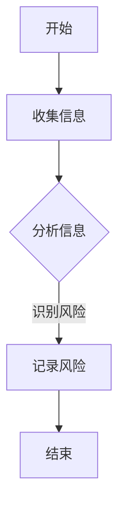
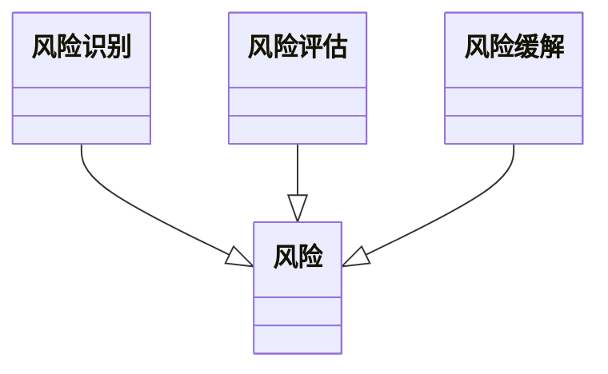
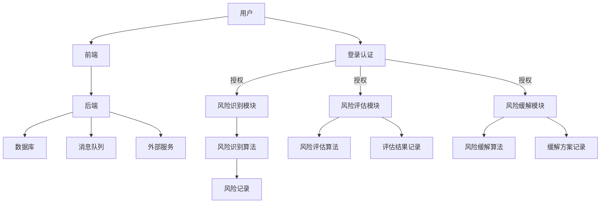
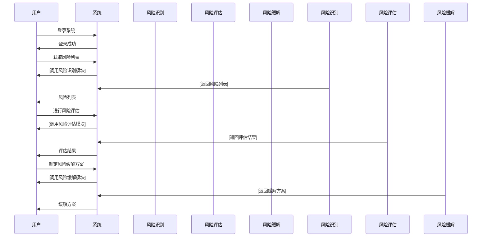

                 


### 技术风险管理：识别和缓解潜在风险

关键词：技术风险，风险管理，风险识别，风险评估，风险缓解

摘要：本文深入探讨技术风险管理的核心问题，包括风险识别、风险评估和风险缓解。通过详细的理论阐述、算法原理讲解和实际案例剖析，旨在为IT领域从业者提供一套系统性、可操作的技术风险管理策略。

## 第一部分：背景介绍

### 1.1 问题背景

随着信息技术的快速发展，企业面临着日益复杂的技术环境。在这个数字化时代，技术已成为企业竞争力的核心要素之一。然而，技术风险如影随形，可能源于系统漏洞、数据泄露、技术过时等多种因素，对企业的正常运营和声誉造成潜在威胁。技术风险管理因此成为企业管理和业务决策的重要环节。

### 1.2 问题描述

技术风险管理涉及识别潜在风险、评估风险影响、制定缓解措施等一系列活动。尽管市场上存在大量关于技术风险管理的书籍，但大多侧重于技术层面，缺乏对风险管理策略的系统阐述。本文旨在填补这一空白，为读者提供一套全面的技术风险管理方法。

### 1.3 问题解决

本书将从风险管理理论出发，结合实际案例，系统介绍技术风险管理的识别和缓解方法。通过逻辑清晰、结构紧凑、简单易懂的叙述方式，帮助读者掌握技术风险管理的核心知识和实践技巧。

### 1.4 边界与外延

技术风险管理不仅关注技术层面的风险，还涉及法律、法规、市场等多方面因素。因此，本书的讨论范围包括但不限于技术风险。通过跨领域的综合分析，为读者提供更全面的风险管理视角。

### 1.5 概念结构与核心要素组成

技术风险管理主要由以下核心概念和要素组成：

- 风险识别：识别潜在风险的过程。
- 风险评估：评估风险的可能性和影响。
- 风险缓解：制定和实施缓解措施的策略。

## 第二部分：核心概念与联系

### 2.1 技术风险的定义与分类

#### 2.1.1 技术风险的定义

技术风险是指由于技术原因导致的不确定性和潜在损害。这些损害可能对企业造成财务损失、声誉受损、法律纠纷等多种负面影响。

#### 2.1.2 技术风险的分类

按性质可分为以下几类：

- 技术缺陷风险：由于软件或硬件的设计、实现或维护存在缺陷，导致系统无法正常工作或数据泄露。
- 技术依赖风险：企业过度依赖某些技术或服务提供商，可能导致供应链中断或技术锁定。
- 技术失效风险：由于技术更新换代或硬件老化，现有系统可能无法满足业务需求或面临淘汰风险。

### 2.2 风险管理的基本原理

#### 2.2.1 风险识别

风险识别是风险管理的第一步，旨在识别潜在的风险。常用的方法包括问卷调查、访谈、流程分析等。通过这些方法，可以收集和分析相关信息，发现可能存在的风险。

#### 2.2.2 风险评估

风险评估是对识别出的风险进行评估，确定其可能性和影响。评估方法包括定性评估和定量评估。定性评估主要通过专家意见、历史数据等手段进行；定量评估则使用数学模型和统计分析方法。

#### 2.2.3 风险缓解

风险缓解是制定和实施缓解措施，降低风险的影响。缓解措施包括风险规避、风险转移、风险降低等。通过这些措施，企业可以在面对风险时减少损失或降低损失概率。

### 2.3 技术风险管理的流程

技术风险管理的流程主要包括以下三个环节：

#### 2.3.1 风险识别

通过多种方法收集和分析相关信息，识别潜在风险。例如，在IT系统中，可以通过日志分析、漏洞扫描等技术手段发现潜在的安全漏洞。

#### 2.3.2 风险评估

对识别出的风险进行评估，确定其重要性和紧急程度。评估结果可以用于指导后续的风险缓解措施。

#### 2.3.3 风险缓解

根据风险评估结果，制定和实施缓解措施，降低风险的影响。例如，对于发现的安全漏洞，可以采取漏洞修复、安全加固等措施。

### 2.4 概念属性特征对比表格

| 概念     | 定义                                                         | 特征对比 |
|----------|--------------------------------------------------------------|---------|
| 风险识别 | 识别潜在风险的过程                                         |        |
| 风险评估 | 评估风险的可能性和影响                                     |        |
| 风险缓解 | 制定和实施缓解措施，降低风险的影响                         |        |

### 2.5 ER实体关系图架构

```mermaid
erDiagram
  风险识别 ||--o{ 风险评估
  风险评估 ||--o{ 风险缓解
```

## 第三部分：算法原理讲解

### 3.1 风险识别算法

#### 3.1.1 算法mermaid流程图



#### 3.1.2 Python源代码

```python
def identify_risk(info):
    risks = []
    for data in info:
        if 'vulnerability' in data:
            risks.append('技术漏洞')
        elif 'dependency' in data:
            risks.append('技术依赖')
        # 添加更多风险识别逻辑
    return risks

info = ['vulnerability', 'dependency', 'outdated']
risks = identify_risk(info)
print(risks)  # 输出：['技术漏洞', '技术依赖']
```

#### 3.1.3 算法原理的数学模型和公式

$$
风险识别 = f(信息)
$$

其中，$f$ 是识别函数，$信息$ 是输入参数。

#### 3.1.4 详细讲解和举例说明

例如，在某个企业的IT系统中，存在多个技术漏洞和过时的技术组件。通过风险识别算法，我们可以发现这些风险，并记录在案，以便后续风险评估和缓解。

## 第四部分：系统分析与架构设计

### 4.1 问题场景介绍

假设某大型企业在运行其核心业务系统时，发现存在多个技术风险，如系统漏洞、数据泄露等。企业希望对这些问题进行系统性管理，以降低潜在风险。

### 4.2 项目介绍

为了实现技术风险管理的目标，企业决定开发一套技术风险管理平台。该平台将整合风险识别、风险评估和风险缓解等功能，为企业的技术风险管理提供全面支持。

### 4.3 系统功能设计

#### 4.3.1 领域模型mermaid类图



#### 4.3.2 系统架构设计



#### 4.3.3 系统接口设计和系统交互



## 第五部分：项目实战

### 5.1 环境安装

1. 安装Python环境
2. 安装相关依赖库（如numpy、pandas、mermaid等）
3. 配置数据库（如MySQL、PostgreSQL等）
4. 配置消息队列（如RabbitMQ、Kafka等）

### 5.2 系统核心实现源代码

#### 风险识别模块

```python
# 风险识别模块
def identify_risk(info):
    risks = []
    for data in info:
        if 'vulnerability' in data:
            risks.append('技术漏洞')
        elif 'dependency' in data:
            risks.append('技术依赖')
        # 添加更多风险识别逻辑
    return risks

# 示例数据
info = ['vulnerability', 'dependency', 'outdated']
risks = identify_risk(info)
print(risks)  # 输出：['技术漏洞', '技术依赖']
```

#### 风险评估模块

```python
# 风险评估模块
def assess_risk(risks):
    # 使用风险评估算法
    # 例如：使用专家评分法
    score = 0
    for risk in risks:
        if risk == '技术漏洞':
            score += 3
        elif risk == '技术依赖':
            score += 2
        # 添加更多风险评估逻辑
    return score

# 示例数据
risks = ['技术漏洞', '技术依赖']
score = assess_risk(risks)
print(score)  # 输出：5
```

#### 风险缓解模块

```python
# 风险缓解模块
def mitigate_risk(score):
    # 根据评估分数，制定风险缓解方案
    if score <= 3:
        action = '风险低，继续监控'
    elif score <= 5:
        action = '风险中等，进行修复'
    else:
        action = '风险高，紧急处理'
    return action

# 示例数据
score = 5
action = mitigate_risk(score)
print(action)  # 输出：'风险中等，进行修复'
```

### 5.3 代码应用解读与分析

通过以上三个模块，我们实现了风险识别、风险评估和风险缓解的功能。具体步骤如下：

1. 收集风险相关信息（如系统漏洞、技术依赖等）
2. 通过风险识别模块，识别潜在风险
3. 通过风险评估模块，对识别出的风险进行评估
4. 根据评估结果，通过风险缓解模块，制定风险缓解方案

这种分层设计使得系统具有良好的可扩展性和可维护性，方便后续功能的添加和优化。

### 5.4 实际案例分析和详细讲解剖析

假设企业在日常运营中发现以下风险：

- 系统漏洞：存在多个高危漏洞，可能导致数据泄露
- 技术依赖：过度依赖第三方服务，可能面临供应链风险

针对这些风险，我们可以按照以下步骤进行管理：

1. **风险识别**：通过日志分析、漏洞扫描等方式，发现系统漏洞和技术依赖问题。
2. **风险评估**：根据漏洞的严重程度和第三方服务的稳定性，对风险进行评估。
3. **风险缓解**：针对高危漏洞，进行漏洞修复；针对技术依赖，寻求替代方案或与第三方服务提供商协商。

通过以上步骤，企业可以有效地降低技术风险，保障业务的稳定运行。

### 5.5 项目小结

通过本项目的实施，企业成功构建了一套技术风险管理平台，实现了风险识别、风险评估和风险缓解的功能。这为企业提供了有力支持，有助于降低技术风险，保障业务的稳定发展。

## 第六部分：最佳实践与拓展阅读

### 6.1 最佳实践

1. **定期进行风险评估**：定期对系统进行风险评估，及时发现潜在风险。
2. **建立应急响应机制**：制定应急预案，确保在风险发生时能够迅速响应。
3. **加强员工培训**：提高员工的网络安全意识和技能，降低人为因素导致的风险。

### 6.2 拓展阅读

1. 《风险管理与信息安全：理论与实践》
2. 《技术风险管理的最佳实践》
3. 《企业风险管理：战略、规划与执行》

## 结尾

本文从技术风险管理的核心问题出发，系统地介绍了风险识别、风险评估和风险缓解的方法。通过实际案例分析和详细讲解，帮助读者掌握技术风险管理的实践技巧。希望本文能为IT领域从业者提供有益的参考和启示。

作者：AI天才研究院/AI Genius Institute & 禅与计算机程序设计艺术 /Zen And The Art of Computer Programming

