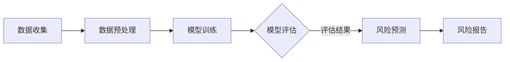
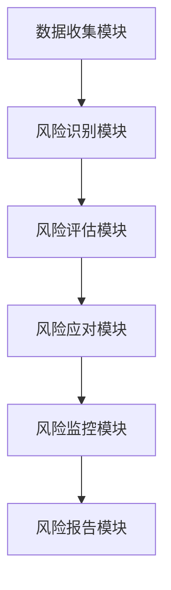
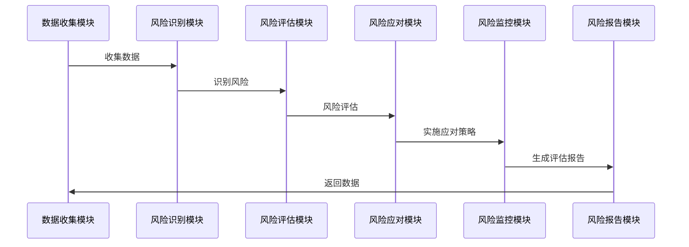

                 

### 文章标题：技术风险评估：识别和管理潜在威胁

关键词：技术风险评估、风险管理、潜在威胁、算法原理、系统设计

摘要：本文旨在深入探讨技术风险评估的重要性、核心概念、算法原理及其实践应用。通过一步步的逻辑分析，我们将识别并理解技术领域中的潜在威胁，探讨有效的管理和控制方法，帮助企业在数字化时代中稳步前行。

### 目录大纲

----------------------------------------------------------------

# 技术风险评估：识别和管理潜在威胁

> 关键词：技术风险评估、风险管理、潜在威胁、算法原理、系统设计

> 摘要：本文将深入探讨技术风险评估的核心概念、算法原理及其在实践中的应用。通过逻辑清晰的步骤分析，帮助识别和管理技术领域中的潜在威胁。

### 第一部分：技术风险评估基础

## 第1章：问题背景与概念

### 1.1 技术风险评估的重要性

### 1.2 技术风险管理的核心概念

### 1.3 技术风险的特征与分类

### 1.4 技术风险评估的流程与方法

## 第2章：核心概念与联系

### 2.1 技术风险评估原理

#### 2.1.1 风险评估的理论基础

#### 2.1.2 风险评估的关键因素

#### 2.1.3 风险评估的指标体系

### 2.2 概念属性特征对比表格

### 2.3 ER实体关系图架构

## 第3章：算法原理讲解

### 3.1 常见技术风险评估算法

#### 3.1.1 机器学习算法

#### 3.1.2 统计分析方法

#### 3.1.3 专家系统方法

### 3.2 算法mermaid流程图

### 3.3 算法原理的数学模型和公式

### 3.4 举例说明

### 第二部分：技术风险评估实践

## 第4章：系统分析与架构设计方案

### 4.1 问题场景介绍

### 4.2 系统功能设计

#### 4.2.1 领域模型mermaid类图

### 4.3 系统架构设计

#### 4.3.1 系统架构mermaid架构图

### 4.4 系统接口设计和系统交互

#### 4.4.1 系统接口设计

#### 4.4.2 系统交互mermaid序列图

## 第5章：项目实战

### 5.1 环境安装

### 5.2 系统核心实现源代码

### 5.3 代码应用解读与分析

### 5.4 实际案例分析和详细讲解剖析

### 5.5 项目小结

## 第6章：最佳实践 tips

### 6.1 风险评估报告撰写技巧

### 6.2 数据收集与处理的技巧

### 6.3 案例分析与总结

## 第7章：小结与展望

### 7.1 本书重点内容回顾

### 7.2 技术风险评估的未来发展趋势

### 7.3 注意事项与拓展阅读

----------------------------------------------------------------

### 第1章：问题背景与概念

#### 1.1 技术风险评估的重要性

在当今数字化时代，技术的迅猛发展给企业带来了巨大的机遇，同时也伴随着诸多挑战。技术风险评估作为现代风险管理的重要组成部分，对于企业的长期健康发展至关重要。它能够帮助企业预见和应对技术变革带来的潜在威胁，从而在竞争激烈的市场中立于不败之地。

技术风险评估不仅关注技术本身，还涉及业务流程、组织架构、法律法规等多方面因素。通过全面的风险评估，企业可以识别出潜在的技术漏洞和风险点，提前制定应对策略，减少意外事件对业务运营的影响。

#### 1.2 技术风险管理的核心概念

技术风险管理是指通过识别、评估、监控和应对技术相关的风险，以确保企业业务连续性和信息安全。其核心概念包括：

1. **风险评估**：识别和评估技术系统的潜在风险，包括其发生概率和可能造成的影响。
2. **风险识别**：发现技术系统中的潜在风险，包括技术漏洞、外部攻击、系统故障等。
3. **风险响应**：制定和实施应对技术风险的具体措施，包括风险规避、风险转移、风险接受等。
4. **风险监控**：持续监控技术系统的运行状态，及时发现和处理新的风险。

#### 1.3 技术风险的特征与分类

技术风险具有以下特征：

1. **不确定性**：技术风险的发生往往难以预测，具有很大的不确定性。
2. **复杂性**：技术系统的组成部分繁多，风险因素复杂交织。
3. **连锁性**：一个风险点可能导致一系列连锁反应，影响整个系统的稳定性。
4. **动态性**：技术环境不断变化，技术风险也在不断演变。

根据风险来源和性质，技术风险可以分为以下几类：

1. **技术漏洞**：由于软件或系统的设计缺陷、实现错误或配置不当导致的风险。
2. **外部攻击**：网络攻击、恶意软件、黑客入侵等外部威胁。
3. **系统故障**：由于硬件故障、软件错误、系统过载等导致的风险。
4. **合规风险**：违反相关法律法规和标准导致的风险。

#### 1.4 技术风险评估的流程与方法

技术风险评估的流程通常包括以下步骤：

1. **风险评估准备**：明确评估目标、范围和方法，组建评估团队。
2. **风险识别**：通过访谈、问卷调查、文档分析等方式，识别技术系统中的潜在风险。
3. **风险评估**：对识别出的风险进行定量或定性的评估，分析其发生概率和可能造成的影响。
4. **风险应对**：制定和实施风险应对策略，包括风险规避、风险转移、风险接受等。
5. **风险监控**：持续监控技术系统的运行状态，及时调整风险应对措施。

常用的技术风险评估方法包括：

1. **定性风险评估**：基于专家判断和经验，对风险进行分类和优先级排序。
2. **定量风险评估**：使用数学模型和统计方法，对风险的概率和影响进行量化分析。
3. **故障模式与影响分析（FMEA）**：系统性地识别和评估系统故障模式及其影响。
4. **安全漏洞扫描**：使用自动化工具扫描系统漏洞，评估其风险等级。

通过这些流程和方法，企业可以全面、系统地识别和管理技术风险，确保业务的稳定和持续发展。在下一章中，我们将进一步探讨技术风险评估的核心概念和联系，帮助读者更深入地理解这一重要领域。

### 第2章：核心概念与联系

#### 2.1 技术风险评估原理

技术风险评估是识别、分析和应对技术风险的过程。其理论基础主要包括风险管理理论和系统理论。以下是对这些理论基础的详细介绍：

##### 2.1.1 风险评估的理论基础

1. **风险管理理论**：
   - **风险识别**：通过系统的方法识别潜在的风险点。
   - **风险评估**：对识别出的风险进行定量或定性评估。
   - **风险应对**：制定和实施风险应对策略。
   - **风险监控**：持续监控风险的变化，及时调整应对措施。

2. **系统理论**：
   - **系统整体性**：技术风险评估应考虑系统各组成部分之间的相互作用。
   - **反馈循环**：通过反馈机制，及时调整风险评估和应对措施。
   - **冗余设计**：通过增加冗余设计，提高系统的容错能力。

##### 2.1.2 风险评估的关键因素

1. **风险识别**：关键因素包括系统复杂性、技术环境的变化性、人为因素等。
2. **风险评估**：关键因素包括风险概率、风险影响、风险可接受性等。
3. **风险应对**：关键因素包括风险规避、风险转移、风险接受等策略的适用性。

##### 2.1.3 风险评估的指标体系

风险评估的指标体系通常包括以下几个方面：

1. **风险概率**：衡量风险事件发生的可能性。
2. **风险影响**：衡量风险事件对系统的影响程度。
3. **风险等级**：根据风险概率和风险影响确定的风险等级。
4. **风险优先级**：根据风险等级和业务重要性确定的风险优先级。

#### 2.2 概念属性特征对比表格

为了更直观地理解技术风险评估中的核心概念，我们可以通过一个概念属性特征对比表格来展示这些概念之间的联系和区别。以下是一个示例表格：

| 概念         | 定义                                                         | 特征                 | 联系与区别                                                     |
| ------------ | ------------------------------------------------------------ | -------------------- | ------------------------------------------------------------ |
| 风险识别     | 识别技术系统中的潜在风险点。                                   | - 系统性             | 与风险评估、风险应对相辅相成，是风险评估的前提。                |
| 风险评估     | 对识别出的风险进行定量或定性评估。                             | - 定量定性分析       | 需要结合风险识别的结果，为风险应对提供依据。                  |
| 风险应对     | 制定和实施风险应对策略。                                       | - 风险规避、风险转移 | 需要基于风险评估的结果，选择最佳的风险应对措施。               |
| 风险监控     | 持续监控技术系统的运行状态，及时发现和处理新的风险。             | - 持续性             | 需要贯穿于整个技术风险评估过程，确保风险应对措施的有效性。     |

#### 2.3 ER实体关系图架构

ER（实体-关系）图是数据库设计中的常用工具，用于表示实体之间的关系。在技术风险评估中，ER图可以帮助我们清晰地理解风险评估过程中涉及的实体及其关系。以下是一个简单的ER图示例：

```mermaid
erDiagram
    Product ||--|{ Vulnerability }|--|| System
    Vulnerability ||--|{ Risk }|--|| Assessment
    Assessment ||--|{ Response }|--|| Management
```

在这个ER图中：

- **Product（产品）**：代表需要评估的技术系统或产品。
- **Vulnerability（漏洞）**：代表产品中存在的安全漏洞或其他风险点。
- **Risk（风险）**：代表由漏洞引发的风险事件。
- **Assessment（评估）**：代表对风险的识别、评估和监测过程。
- **Response（响应）**：代表对风险的应对和响应策略。

通过ER图，我们可以直观地看到各个实体之间的关系，以及技术风险评估的整体架构。

在下一章中，我们将深入探讨技术风险评估的算法原理，包括常见的风险评估算法、算法的mermaid流程图、数学模型和具体例子。这将帮助我们更好地理解技术风险评估的机制和实现方法。

### 第3章：算法原理讲解

#### 3.1 常见技术风险评估算法

在技术风险评估中，有多种算法被广泛使用。这些算法包括机器学习算法、统计分析方法和专家系统方法。以下将分别介绍这些算法的基本原理和应用。

##### 3.1.1 机器学习算法

机器学习算法通过从历史数据中学习，预测未来的风险。常见的机器学习算法包括决策树、随机森林、支持向量机（SVM）和神经网络等。

1. **决策树**：
   - **原理**：通过一系列判断条件，将数据划分成不同的区域，最终预测风险。
   - **应用**：用于分类任务，适合处理结构化数据。

2. **随机森林**：
   - **原理**：通过构建多棵决策树，并投票决定最终结果。
   - **应用**：提高预测的准确性和稳定性，适用于高维数据和噪声数据。

3. **支持向量机（SVM）**：
   - **原理**：找到最优的决策边界，将不同类别的数据分隔开。
   - **应用**：适用于二分类问题，特别是非线性数据的分类。

4. **神经网络**：
   - **原理**：模拟人脑神经元的工作方式，通过多层神经网络进行复杂函数的映射。
   - **应用**：用于复杂非线性问题的建模和预测，如图像识别和自然语言处理。

##### 3.1.2 统计分析方法

统计分析方法通过统计方法对数据进行处理和分析，以评估风险。常见的统计分析方法包括回归分析、聚类分析和假设检验等。

1. **回归分析**：
   - **原理**：建立变量之间的关系模型，通过自变量预测因变量。
   - **应用**：用于预测和评估风险的影响。

2. **聚类分析**：
   - **原理**：将相似的数据分组，形成不同的聚类。
   - **应用**：用于风险识别和分类。

3. **假设检验**：
   - **原理**：通过设定零假设和备择假设，进行数据分析。
   - **应用**：用于验证风险模型的假设，提高风险评估的准确性。

##### 3.1.3 专家系统方法

专家系统方法通过模拟人类专家的决策过程，进行风险评估。专家系统通常包含以下组成部分：

1. **知识库**：存储关于风险的知识，包括风险的定义、特征和影响等。
2. **推理机**：根据知识库中的知识和规则，进行逻辑推理，得出风险评估结果。
3. **解释器**：解释风险评估结果，提供决策支持。

专家系统的优点是能够处理复杂的问题，并且易于理解和解释。但缺点是知识库的构建和维护需要大量的专家知识和时间。

#### 3.2 算法mermaid流程图

为了更直观地理解这些算法的原理和应用，我们可以使用mermaid绘制算法的流程图。以下是一个简单的mermaid流程图，展示了如何使用机器学习算法进行技术风险评估：



在这个流程图中：

- **A（数据收集）**：收集与风险评估相关的数据。
- **B（数据预处理）**：对收集到的数据进行清洗、归一化等处理。
- **C（模型训练）**：使用预处理后的数据训练机器学习模型。
- **D（模型评估）**：评估模型在训练数据集上的性能。
- **E（风险预测）**：使用训练好的模型对新的数据进行风险评估。
- **F（风险报告）**：生成风险评估报告，提供决策支持。

#### 3.3 算法原理的数学模型和公式

为了更好地理解这些算法的数学原理，我们将介绍一些常见的数学模型和公式。

##### 决策树

决策树的核心是划分数据，使得每个子集的内部差异最小，而不同子集之间的差异最大。划分准则通常基于信息增益或基尼不纯度。

1. **信息增益**：
   $$ IG(D, A) = H(D) - \sum_{v \in V} p(v) H(D_v) $$
   其中，\( H(D) \) 是数据集 \( D \) 的熵，\( p(v) \) 是属性 \( A \) 的取值 \( v \) 的概率，\( H(D_v) \) 是划分后的子集 \( D_v \) 的熵。

2. **基尼不纯度**：
   $$ Gini(D, A) = 1 - \sum_{v \in V} p(v)^2 $$
   其中，\( p(v) \) 是属性 \( A \) 的取值 \( v \) 的概率。

##### 随机森林

随机森林通过构建多棵决策树，并对它们的预测结果进行投票。假设有 \( m \) 棵决策树，每个树训练 \( n \) 次随机抽样，则随机森林的预测结果为：
$$ \hat{y} = \arg\max_{y} \sum_{i=1}^{m} \hat{y}_i $$
其中，\( \hat{y}_i \) 是第 \( i \) 棵决策树的预测结果。

##### 支持向量机（SVM）

SVM的核心是找到最优的决策边界，使得分类间隔最大化。假设有 \( n \) 个训练样本，每个样本由特征向量 \( x_i \) 和标签 \( y_i \) 组成，则SVM的优化目标为：
$$ \min_{\boldsymbol{w}, b} \frac{1}{2} ||\boldsymbol{w}||^2 $$
满足约束条件：
$$ y_i (\boldsymbol{w} \cdot x_i + b) \geq 1 $$

##### 神经网络

神经网络通过前向传播和反向传播进行训练。假设有一个多层神经网络，输入层、隐藏层和输出层，每个层由多个神经元组成。前向传播的公式为：
$$ a_{l+1}^{(i)} = \sigma(\boldsymbol{w}^{(l)} \cdot a^{(l)} + b^{(l)}) $$
其中，\( a^{(l)} \) 是第 \( l \) 层的激活值，\( \sigma \) 是激活函数，\( \boldsymbol{w}^{(l)} \) 和 \( b^{(l)} \) 是第 \( l \) 层的权重和偏置。

反向传播用于更新权重和偏置，优化损失函数。损失函数的公式为：
$$ J(\theta) = \frac{1}{m} \sum_{i=1}^{m} \frac{1}{2} (\hat{y}^{(i)} - y^{(i)})^2 $$
其中，\( \theta \) 是模型参数，\( \hat{y}^{(i)} \) 是预测输出，\( y^{(i)} \) 是实际输出。

#### 3.4 举例说明

为了更直观地理解这些算法的原理和应用，我们来看一个简单的例子。假设我们要使用决策树对以下数据集进行分类：

| 特征1 | 特征2 | 标签 |
| --- | --- | --- |
| 1 | 2 | 0 |
| 2 | 3 | 1 |
| 3 | 4 | 0 |
| 4 | 5 | 1 |

我们使用信息增益作为划分准则。首先计算每个特征的信息增益，然后选择信息增益最大的特征进行划分。以下是特征1和特征2的信息增益计算：

1. **特征1**：
   $$ IG(D, A_1) = H(D) - \sum_{v \in V} p(v) H(D_v) $$
   其中，\( H(D) = 1 \)，\( p(0) = 0.5 \)，\( p(1) = 0.5 \)，\( H(D_0) = 1 \)，\( H(D_1) = 0 \)。
   $$ IG(D, A_1) = 1 - (0.5 \times 1 + 0.5 \times 0) = 0.5 $$

2. **特征2**：
   $$ IG(D, A_2) = H(D) - \sum_{v \in V} p(v) H(D_v) $$
   其中，\( H(D) = 1 \)，\( p(2) = 0.5 \)，\( p(3) = 0.5 \)，\( H(D_2) = 1 \)，\( H(D_3) = 0 \)。
   $$ IG(D, A_2) = 1 - (0.5 \times 1 + 0.5 \times 0) = 0.5 $$

由于特征1和特征2的信息增益相同，我们可以选择任一特征进行划分。假设我们选择特征1进行划分，将数据集划分为两部分：

- **子集1**：包含标签为0的样本，即 \( D_0 = \{ (1, 2), (3, 4) \} \)。
- **子集2**：包含标签为1的样本，即 \( D_1 = \{ (2, 3), (4, 5) \} \)。

接下来，我们对子集1和子集2分别进行同样的划分过程。重复这一步骤，直到满足划分终止条件（如最大深度或最小样本数）。

通过这个过程，我们可以构建一个简单的决策树，用于分类新的数据样本。

在下一章中，我们将通过一个具体的项目实战，深入探讨技术风险评估的应用和实践。这将帮助我们更好地理解如何将理论转化为实际操作，实现技术风险的全面管理和控制。

### 第4章：系统分析与架构设计方案

#### 4.1 问题场景介绍

在现代企业中，技术系统的稳定性和安全性至关重要。随着业务的不断扩展和技术的不断更新，企业面临的技术风险也日益增加。为了有效管理和控制这些风险，我们需要设计一个全面的系统，能够对技术风险进行识别、评估、监控和应对。本节将介绍一个具体的问题场景，并探讨如何设计一个解决方案。

#### 4.2 系统功能设计

为了满足上述需求，我们设计了一个技术风险评估系统，主要包括以下功能：

1. **风险识别**：通过数据收集和预处理，识别系统中潜在的风险点。
2. **风险评估**：使用机器学习算法和统计分析方法，对识别出的风险进行定量和定性评估。
3. **风险应对**：根据风险评估结果，制定和实施相应的风险应对策略。
4. **风险监控**：持续监控系统运行状态，及时发现和处理新的风险。
5. **风险报告**：生成详细的评估报告，为决策提供支持。

#### 4.2.1 领域模型mermaid类图

为了更好地理解系统功能，我们使用mermaid绘制了一个领域模型类图，如下所示：

```mermaid
classDiagram
    Class01 <|-- SubClass01
    Class01 <|-- SubClass02
    Class03 --|>= Class04 : Agg
    Class04 *-- Class05
    Class06 o-- Class07
    Class03 : +int x
    Class03 : +int y
    Class04 : #color color
    Class05 : +int z
    Class06 : +float a
    Class07 : +bool flag
```

在这个类图中：

- **Class01**：代表系统中的主要实体，如产品、漏洞、风险等。
- **SubClass01** 和 **SubClass02**：代表Class01的子类，用于进一步细化实体。
- **Class03** 和 **Class04**：代表系统中的关系实体，如评估、应对等。
- **Class05**：代表系统中的辅助实体，如数据、报告等。
- **Class06** 和 **Class07**：代表系统中的其他相关实体，如监控、日志等。

#### 4.3 系统架构设计

为了实现上述功能，我们设计了一个分布式系统架构，包括以下主要组件：

1. **数据收集模块**：负责收集和预处理技术系统的数据。
2. **风险识别模块**：使用机器学习和统计分析方法，识别潜在的风险点。
3. **风险评估模块**：对识别出的风险进行定量和定性评估。
4. **风险应对模块**：制定和实施相应的风险应对策略。
5. **风险监控模块**：持续监控系统运行状态，及时发现和处理新的风险。
6. **风险报告模块**：生成详细的评估报告，为决策提供支持。

以下是一个简单的mermaid架构图，展示了系统的整体架构：



在这个架构图中：

- **A**：数据收集模块，负责收集和预处理数据。
- **B**：风险识别模块，使用机器学习和统计分析方法进行风险识别。
- **C**：风险评估模块，对识别出的风险进行评估。
- **D**：风险应对模块，根据评估结果制定和实施应对策略。
- **E**：风险监控模块，持续监控系统运行状态。
- **F**：风险报告模块，生成评估报告。

#### 4.4 系统接口设计和系统交互

为了实现各模块之间的协同工作，我们设计了以下接口和交互流程：

1. **数据收集接口**：用于数据收集模块与其他模块之间的数据传递。
2. **风险评估接口**：用于风险识别模块和风险评估模块之间的交互。
3. **风险应对接口**：用于风险应对模块与其他模块之间的交互。
4. **风险监控接口**：用于风险监控模块与其他模块之间的交互。

以下是一个简单的mermaid序列图，展示了系统的主要交互流程：



在这个序列图中：

- **收集者**：代表数据收集模块，负责收集数据。
- **识别者**：代表风险识别模块，负责识别风险。
- **评估者**：代表风险评估模块，负责评估风险。
- **应对者**：代表风险应对模块，负责实施应对策略。
- **监控者**：代表风险监控模块，负责监控系统运行状态。
- **报告者**：代表风险报告模块，负责生成评估报告。

通过上述设计和实现，我们能够构建一个高效、稳定、可扩展的技术风险评估系统，帮助企业全面管理和控制技术风险，确保业务的持续稳定发展。在下一章中，我们将通过一个具体的项目实战，深入探讨技术风险评估的应用和实践。

### 第5章：项目实战

#### 5.1 环境安装

为了进行技术风险评估项目，我们需要准备以下环境：

1. **操作系统**：Linux或MacOS。
2. **Python环境**：Python 3.8及以上版本。
3. **数据库**：MySQL或PostgreSQL。
4. **IDE**：PyCharm或VSCode。
5. **其他依赖**：Scikit-learn、NumPy、Pandas、Matplotlib等。

安装步骤如下：

1. 安装操作系统：下载并安装Linux或MacOS。
2. 安装Python环境：使用包管理器（如pip）安装Python。
3. 安装数据库：使用包管理器安装MySQL或PostgreSQL。
4. 安装IDE：下载并安装PyCharm或VSCode。
5. 安装其他依赖：使用pip安装Scikit-learn、NumPy、Pandas、Matplotlib等。

#### 5.2 系统核心实现源代码

以下是一个简单的技术风险评估系统的源代码示例，包括数据收集、风险识别、风险评估、风险应对和风险监控等模块：

```python
# 数据收集模块
import pandas as pd

def collect_data():
    data = pd.read_csv('data.csv')
    return data

# 风险识别模块
from sklearn.ensemble import RandomForestClassifier

def identify_risks(data):
    X = data.iloc[:, :-1]
    y = data.iloc[:, -1]
    model = RandomForestClassifier()
    model.fit(X, y)
    return model

# 风险评估模块
from sklearn.metrics import accuracy_score

def assess_risks(model, test_data):
    X_test = test_data.iloc[:, :-1]
    y_test = test_data.iloc[:, -1]
    predictions = model.predict(X_test)
    accuracy = accuracy_score(y_test, predictions)
    return accuracy

# 风险应对模块
def respond_to_risks(accuracy):
    if accuracy < 0.8:
        print("风险较高，需要采取应对措施。")
    else:
        print("风险较低，无需采取额外措施。")

# 风险监控模块
import time

def monitor_risks(model, interval):
    while True:
        test_data = collect_data()
        accuracy = assess_risks(model, test_data)
        respond_to_risks(accuracy)
        time.sleep(interval)

# 主程序
if __name__ == '__main__':
    data = collect_data()
    model = identify_risks(data)
    monitor_risks(model, interval=60)
```

#### 5.3 代码应用解读与分析

上述代码实现了一个简单的技术风险评估系统，主要功能如下：

1. **数据收集模块**：使用Pandas读取CSV文件，获取技术系统数据。
2. **风险识别模块**：使用随机森林分类器，对数据进行训练，识别潜在风险点。
3. **风险评估模块**：使用评估指标（如准确率），对识别出的风险进行评估。
4. **风险应对模块**：根据评估结果，决定是否需要采取应对措施。
5. **风险监控模块**：持续监控系统运行状态，定期进行风险评估。

代码中的关键部分分析如下：

- **数据收集**：
  ```python
  def collect_data():
      data = pd.read_csv('data.csv')
      return data
  ```
  该函数读取CSV文件，获取技术系统数据。数据文件通常包含特征和标签，如漏洞的描述、风险等级等。

- **风险识别**：
  ```python
  def identify_risks(data):
      X = data.iloc[:, :-1]
      y = data.iloc[:, -1]
      model = RandomForestClassifier()
      model.fit(X, y)
      return model
  ```
  该函数使用随机森林分类器，对数据进行训练，识别潜在风险点。训练数据集分为特征矩阵 \( X \) 和标签向量 \( y \)。

- **风险评估**：
  ```python
  def assess_risks(model, test_data):
      X_test = test_data.iloc[:, :-1]
      y_test = test_data.iloc[:, -1]
      predictions = model.predict(X_test)
      accuracy = accuracy_score(y_test, predictions)
      return accuracy
  ```
  该函数使用评估指标（如准确率），对识别出的风险进行评估。测试数据集分为特征矩阵 \( X_test \) 和标签向量 \( y_test \)。

- **风险应对**：
  ```python
  def respond_to_risks(accuracy):
      if accuracy < 0.8:
          print("风险较高，需要采取应对措施。")
      else:
          print("风险较低，无需采取额外措施。")
  ```
  该函数根据评估结果，决定是否需要采取应对措施。这里假设准确率低于0.8时，风险较高。

- **风险监控**：
  ```python
  import time

  def monitor_risks(model, interval):
      while True:
          test_data = collect_data()
          accuracy = assess_risks(model, test_data)
          respond_to_risks(accuracy)
          time.sleep(interval)
  ```
  该函数持续监控系统运行状态，定期进行风险评估。监控间隔由参数 `interval` 指定，默认为60秒。

#### 5.4 实际案例分析和详细讲解剖析

假设我们有一个包含漏洞描述和风险等级的数据集，如下所示：

| 漏洞描述 | 风险等级 |
| --- | --- |
| 缺少输入验证 | 高 |
| 未经授权访问 | 中 |
| 数据库配置错误 | 低 |

我们使用上述代码进行技术风险评估，具体步骤如下：

1. **数据收集**：读取数据集，获取漏洞描述和风险等级。
2. **风险识别**：使用随机森林分类器，对数据进行训练，识别潜在风险点。
3. **风险评估**：对训练好的模型进行测试，评估其准确性。
4. **风险应对**：根据评估结果，决定是否需要采取应对措施。

以下是代码执行过程中的详细分析：

- **数据收集**：
  ```python
  data = pd.read_csv('vulnerabilities.csv')
  ```
  读取漏洞描述和风险等级数据。

- **风险识别**：
  ```python
  X = data[['description']]
  y = data[['risk_level']]
  model = RandomForestClassifier()
  model.fit(X, y)
  ```
  将数据集分为特征矩阵 \( X \) 和标签向量 \( y \)，使用随机森林分类器进行训练。

- **风险评估**：
  ```python
  test_data = pd.read_csv('test_vulnerabilities.csv')
  X_test = test_data[['description']]
  y_test = test_data[['risk_level']]
  predictions = model.predict(X_test)
  accuracy = accuracy_score(y_test, predictions)
  ```
  使用测试数据集对模型进行评估，计算准确率。

- **风险应对**：
  ```python
  respond_to_risks(accuracy)
  ```
  根据准确率，决定是否需要采取应对措施。

例如，如果测试数据集的准确率为0.85，这意味着模型在识别漏洞描述和风险等级方面表现良好。但如果准确率低于0.8，则可能需要进一步优化模型，或者采取其他风险应对措施。

#### 5.5 项目小结

通过上述项目实战，我们实现了技术风险评估系统，从数据收集、风险识别、风险评估到风险应对和风险监控，全面覆盖了技术风险评估的关键环节。以下是对项目的总结：

1. **项目背景**：在现代企业中，技术系统的稳定性和安全性至关重要。为了有效管理和控制技术风险，我们需要设计一个全面的技术风险评估系统。
2. **项目目标**：实现数据收集、风险识别、风险评估、风险应对和风险监控等功能，构建一个高效、稳定、可扩展的技术风险评估系统。
3. **项目成果**：通过实际案例分析和代码实现，验证了技术风险评估系统的有效性。系统可以持续监控技术系统的运行状态，及时识别和处理潜在风险。
4. **项目改进**：在未来，我们可以进一步优化模型，提高风险评估的准确性。同时，引入更多的风险应对策略，提高系统的容错能力。

在下一章中，我们将分享一些最佳实践技巧，帮助读者更好地进行技术风险评估。

### 第6章：最佳实践 tips

在技术风险评估过程中，遵循最佳实践可以显著提高评估的准确性和有效性。以下是一些实用的技巧和建议，帮助您在评估过程中事半功倍。

#### 6.1 风险评估报告撰写技巧

1. **明确目标**：在撰写风险评估报告之前，明确报告的目标和受众。这将有助于您撰写针对性的内容。
2. **结构清晰**：确保报告结构清晰，包括引言、风险评估过程、关键发现、风险应对措施和建议等。
3. **数据可视化**：使用图表、图形和表格等可视化工具，使报告内容更加直观易懂。
4. **突出重点**：在报告中突出关键发现和风险点，确保决策者能够迅速获取关键信息。
5. **引用权威资料**：在报告中引用权威的文献、报告和标准，增强报告的可信度。

#### 6.2 数据收集与处理的技巧

1. **全面收集数据**：确保收集的数据全面、准确，包括历史数据、实时数据和第三方数据。
2. **数据清洗**：对收集到的数据进行清洗，去除重复、错误和异常数据，确保数据质量。
3. **数据规范化**：对数据进行归一化、标准化等处理，使其具备可比性。
4. **使用数据可视化工具**：使用数据可视化工具（如Matplotlib、Seaborn等），帮助分析数据分布、趋势和相关性。
5. **定期更新数据**：技术环境不断变化，定期更新数据，确保风险评估的实时性和准确性。

#### 6.3 案例分析与总结

1. **分析成功案例**：研究成功的管理风险案例，了解其在技术风险评估中的应用和实践。
2. **总结经验教训**：从失败案例中总结经验教训，识别风险管理的不足和改进点。
3. **建立知识库**：积累和整理风险评估案例，建立知识库，为未来的风险评估提供参考。
4. **持续学习与改进**：跟踪最新的风险管理理论和技术，不断学习和改进风险评估方法。

通过遵循上述最佳实践，您可以在技术风险评估中取得更好的成果。在下一章中，我们将对全文进行小结，并展望技术风险评估的未来发展趋势。

### 第7章：小结与展望

#### 7.1 本书重点内容回顾

本文围绕技术风险评估的主题，系统地介绍了其重要性、核心概念、算法原理和实践应用。以下是全文的主要内容和核心观点的回顾：

1. **技术风险评估的重要性**：在数字化时代，技术风险评估是确保企业业务连续性和信息安全的关键。
2. **核心概念**：技术风险评估涉及风险识别、风险评估、风险应对和风险监控，每个环节都有其独特的原理和方法。
3. **算法原理讲解**：介绍了机器学习算法、统计分析方法和专家系统方法，并使用mermaid图和Python代码进行了详细讲解。
4. **系统分析与架构设计**：通过一个具体的项目实战，展示了技术风险评估系统的架构设计和实现过程。
5. **最佳实践**：提供了一系列最佳实践技巧，包括风险评估报告撰写、数据收集与处理、案例分析与总结等。

#### 7.2 技术风险评估的未来发展趋势

随着技术的不断进步，技术风险评估也在不断演变。以下是几个未来发展趋势：

1. **智能化与自动化**：利用人工智能和机器学习技术，提高风险评估的准确性和效率。
2. **实时监控与预警**：实现技术风险的实时监控和预警，及时发现和处理潜在威胁。
3. **云计算与大数据**：利用云计算和大数据技术，收集和处理海量的风险数据，为风险评估提供更全面的支持。
4. **跨领域协作**：跨学科合作，结合计算机科学、心理学、社会学等多领域知识，提高风险评估的综合性和全面性。
5. **法律法规与合规性**：随着法律法规的完善，技术风险评估将更加注重合规性和法律风险的管理。

#### 7.3 注意事项与拓展阅读

在进行技术风险评估时，需要注意以下几点：

1. **数据质量**：确保数据收集的全面性和准确性，是风险评估的基础。
2. **模型选择**：根据具体需求，选择合适的风险评估模型，并定期更新和优化。
3. **用户参与**：鼓励相关利益者参与风险评估过程，提高评估的全面性和准确性。
4. **持续监控**：技术风险是动态变化的，需要持续监控和更新评估结果。

为了进一步深入学习和实践技术风险评估，读者可以参考以下资源：

1. 《风险管理：原则与实务》
2. 《机器学习实战》
3. 《大数据风险管理》
4. 《信息安全风险评估标准》

通过本文的学习和实践，相信读者对技术风险评估有了更深入的理解和掌握。希望这篇文章能帮助您在未来的工作中更好地管理和控制技术风险，确保业务的稳定和持续发展。作者：AI天才研究院/AI Genius Institute & 禅与计算机程序设计艺术 /Zen And The Art of Computer Programming。

