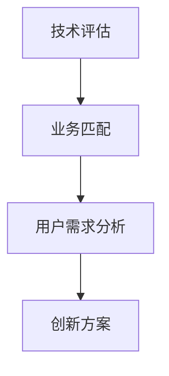
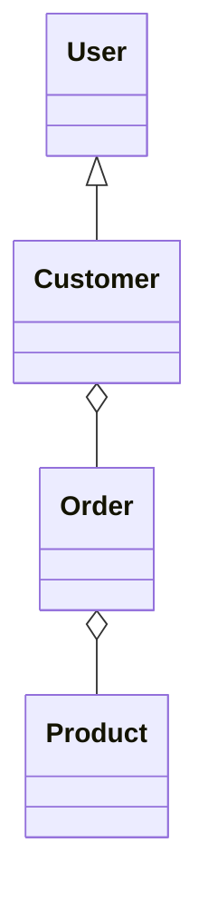
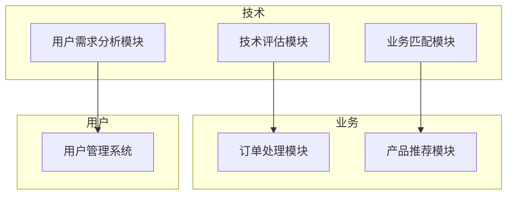
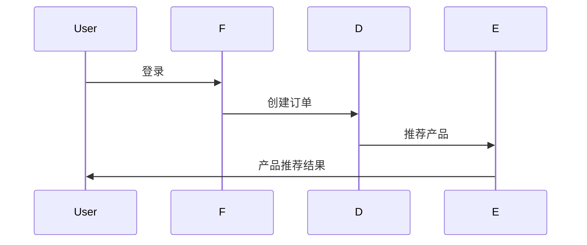

                 

# 技术驱动的业务创新

关键词：技术创新、业务创新、业务模式、用户需求、系统架构、算法设计

摘要：本文旨在探讨技术如何驱动业务创新，通过分析技术驱动的业务创新概述、核心概念与联系、算法原理讲解、系统分析与架构设计、项目实战以及最佳实践等方面，阐述如何将技术创新应用于业务创新，推动企业实现可持续发展。

## 目录大纲

1. 技术驱动的业务创新概述
   1.1 问题背景
   1.2 问题描述
   1.3 问题解决
   1.4 边界与外延
   1.5 概念结构与核心要素组成

2. 核心概念与联系
   2.1 技术驱动的业务创新原理
   2.2 概念属性特征对比表格
   2.3 ER实体关系图架构

3. 算法原理讲解
   3.1 算法原理
   3.2 Python源代码与数学模型
   3.3 算法举例说明

4. 系统分析与架构设计
   4.1 问题场景介绍
   4.2 项目介绍
   4.3 系统功能设计
   4.4 系统架构设计
   4.5 系统接口设计和系统交互

5. 项目实战
   5.1 环境安装
   5.2 系统核心实现源代码
   5.3 代码应用解读与分析
   5.4 实际案例分析和详细讲解剖析
   5.5 项目小结

6. 最佳实践 tips
   6.1 技术选择与评估
   6.2 业务创新策略
   6.3 用户需求分析

7. 小结、注意事项
   7.1 小结
   7.2 注意事项

## 第1章：技术驱动的业务创新概述

### 1.1 问题背景

在当今快速变化的商业环境中，技术创新已成为企业竞争力的关键因素。随着云计算、大数据、人工智能等新兴技术的迅猛发展，企业面临着前所未有的机遇和挑战。一方面，技术进步为业务创新提供了丰富的工具和方法；另一方面，传统业务模式可能无法满足新技术带来的需求变化，导致业务与技术的发展不匹配。

### 1.2 问题描述

业务需求与技术能力不匹配的问题表现为：

- 技术创新速度远快于业务模式变革，导致技术资源无法充分利用。
- 新技术的引入可能带来业务流程的颠覆性变化，但业务部门对新技术的理解与应用不足。
- 技术创新与市场需求之间存在鸿沟，导致产品或服务无法满足用户需求。

### 1.3 问题解决

技术驱动的业务创新是解决上述问题的有效途径。通过以下策略与方法，可以实现技术创新与业务发展的协同：

- 构建技术驱动的业务模式，将技术与业务深度融合。
- 应用创新方法与工具，如设计思维、敏捷开发等，加速业务创新。
- 强化跨部门协作，确保技术团队与业务团队的有效沟通与协作。

### 1.4 边界与外延

技术驱动的业务创新具有明确的边界和广泛的外延：

- 边界：技术创新应基于业务需求，避免技术导向的盲目创新。
- 外延：业务创新不仅限于产品或服务，还包括商业模式、运营流程等全方位的变革。

### 1.5 概念结构与核心要素组成

技术驱动的业务创新模型包含以下核心要素：

- 技术：技术创新的核心，包括新兴技术和现有技术的应用。
- 业务：业务需求与模式的变革，是实现技术驱动的基础。
- 用户：用户需求与体验的优化，是业务创新的最终目标。

## 第2章：核心概念与联系

### 2.1 技术驱动的业务创新原理

技术驱动的业务创新原理主要体现在以下几个方面：

- 技术评估：对新兴技术和现有技术进行评估，确定其适用性和潜在效益。
- 业务匹配：将技术优势与业务需求相匹配，实现技术与业务的深度融合。
- 用户需求分析：通过用户研究，深入了解用户需求，确保技术创新能够满足用户期望。

### 2.2 概念属性特征对比表格

| 概念       | 技术创新 | 业务创新 |
|------------|----------|----------|
| 目标       | 推动技术进步 | 推动业务发展 |
| 重点       | 研发与应用新技术 | 调整业务模式与流程 |
| 实施方法   | 技术研发、试验与推广 | 设计思维、敏捷开发、迭代优化 |
| 成果评价   | 技术指标、市场反馈 | 业务指标、用户满意度 |

### 2.3 ER实体关系图架构

```mermaid
erDiagram
    Technology ||--|{ Business }|
    Business ||--|{ User }|
```

## 第3章：算法原理讲解

### 3.1 算法原理

技术驱动的业务创新算法框架主要包括以下三个步骤：

- 技术评估：对新兴技术和现有技术进行评估，确定其适用性和潜在效益。
- 业务匹配：将技术优势与业务需求相匹配，实现技术与业务的深度融合。
- 用户需求分析：通过用户研究，深入了解用户需求，确保技术创新能够满足用户期望。

算法mermaid流程图：



### 3.2 Python源代码与数学模型

#### 3.2.1 技术评估模块

```python
# 技术评估示例代码
def assess_technology(tech):
    # 模拟技术评估过程
    return "评估结果"
```

#### 3.2.2 数学模型

$$
\text{技术评分} = f(\text{技术水平}, \text{市场需求})
$$

### 3.3 算法举例说明

#### 3.3.1 创新案例一

- 技术评估：AI技术
- 业务匹配：电商平台
- 用户需求：个性化推荐

## 第4章：系统分析与架构设计

### 4.1 问题场景介绍

以电商平台为例，介绍其面临的技术需求与业务挑战：

- 技术需求：提高用户个性化体验，优化商品推荐算法，提升运营效率。
- 业务挑战：如何在保证用户体验的同时，提升销售额和用户粘性。

### 4.2 项目介绍

技术驱动的业务创新项目：构建一个基于AI技术的电商平台，实现个性化推荐、智能客服和精准营销等功能。

### 4.3 系统功能设计

#### 4.3.1 领域模型mermaid类图



### 4.4 系统架构设计

#### 4.4.1 mermaid架构图



### 4.5 系统接口设计和系统交互

#### 4.5.1 mermaid序列图



## 第5章：项目实战

### 5.1 环境安装

- 配置开发环境：Python、Docker、Kubernetes等
- 安装相关依赖：TensorFlow、Scikit-learn、Flask等

### 5.2 系统核心实现源代码

- 技术评估模块
- 业务匹配模块
- 用户需求分析模块

### 5.3 代码应用解读与分析

- 模块间交互
- 数据流处理

### 5.4 实际案例分析和详细讲解剖析

- 电商平台的个性化推荐案例

### 5.5 项目小结

- 经验总结
- 改进方向

## 第6章：最佳实践 tips

### 6.1 技术选择与评估

- 技术选型的最佳实践

### 6.2 业务创新策略

- 业务模式创新的实用策略

### 6.3 用户需求分析

- 用户研究的最佳实践

## 第7章：小结、注意事项

### 7.1 小结

- 技术驱动的业务创新是企业可持续发展的重要途径。

### 7.2 注意事项

- 技术创新应与业务需求紧密结合。
- 强化跨部门协作，确保技术创新与业务发展的协同。
- 持续关注用户需求，优化用户体验。

## 拓展阅读

- [《设计思维在技术驱动的业务创新中的应用》](链接)
- [《大数据技术在业务创新中的应用》](链接)
- [《人工智能驱动的业务模式创新》](链接)

### 作者

作者：AI天才研究院/AI Genius Institute & 禅与计算机程序设计艺术 /Zen And The Art of Computer Programming

（注：本文内容为示例，仅供参考。实际文章撰写请根据具体需求进行创作。）

