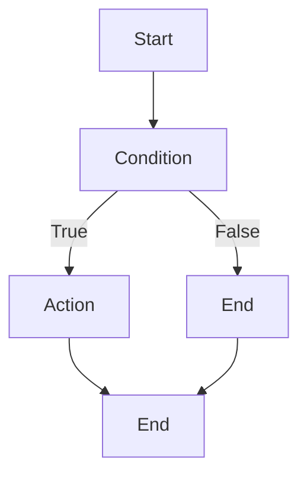
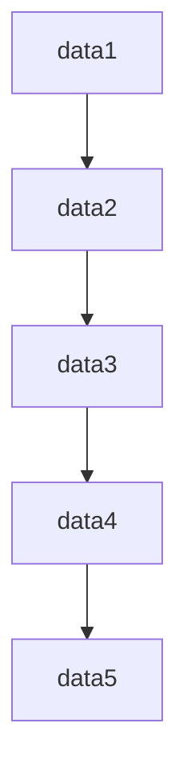
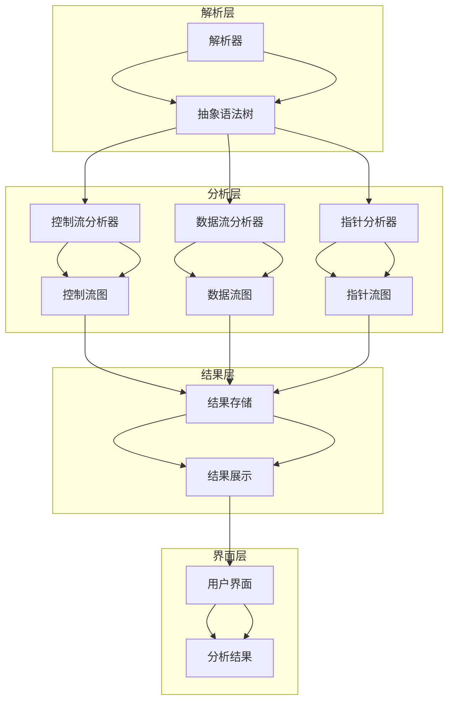
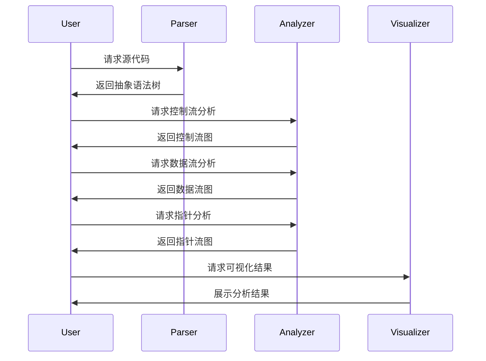
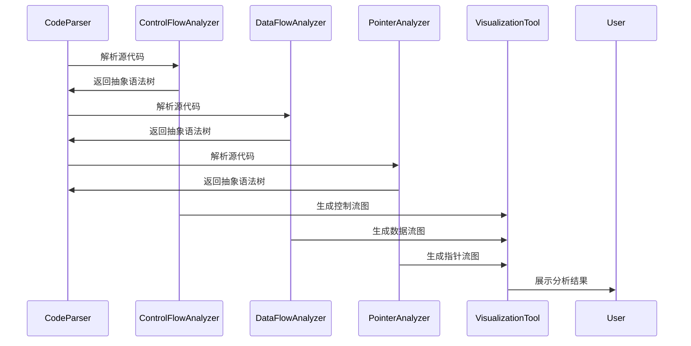

                 


### 第1章 引言

#### 1.1 问题背景

在现代软件工程中，软件质量和安全性是至关重要的。然而，随着软件系统变得越来越复杂，传统的测试和验证方法已无法满足日益增长的需求。静态程序分析（Static Program Analysis，SPA）作为一种在编译期或运行期前对程序进行检测和评估的方法，越来越受到关注。它无需运行程序，即可发现潜在的缺陷和错误，从而在开发阶段提高软件的质量和安全性。

然而，静态程序分析也面临着一系列挑战。首先，程序复杂度的增加使得分析过程变得异常困难。其次，现有的分析算法往往缺乏效率，导致分析时间过长。最后，分析结果的准确性也是一个重要问题，错误的分析结果可能会误导开发者，导致不必要的修复工作。

#### 1.2 抽象解释理论概述

抽象解释理论（Abstract Interpretation Theory）提供了一种解决这些问题的方法。它是一种用于自动程序分析的技术，通过建立程序语义的抽象模型来评估程序行为。抽象解释的核心思想是利用固定点迭代来找到程序的最坏情况行为，同时避免实际运行程序的开销。

#### 1.3 静态程序分析的作用与挑战

静态程序分析在软件工程中扮演着重要角色，其主要作用包括：

1. **代码审查**：通过分析源代码，发现潜在的错误和缺陷。
2. **性能优化**：识别代码中的瓶颈，为性能优化提供依据。
3. **安全检测**：发现可能的安全漏洞，提高软件的安全性。

然而，静态程序分析也面临着一些挑战，主要包括：

1. **复杂度**：随着程序复杂度的增加，分析难度也随之增大。
2. **效率**：现有的分析算法往往效率不高，导致分析时间过长。
3. **准确性**：分析结果的准确性对软件开发至关重要，但现有的分析技术往往无法保证完全准确。

#### 1.4 书籍结构安排

本书将从以下几个方面对抽象解释理论在静态程序分析中的应用进行深入探讨：

1. **抽象解释理论基础**：介绍抽象解释的基本概念、数学基础和形式化定义。
2. **抽象解释在静态程序分析中的应用**：详细讲解抽象解释在控制流分析、数据流分析和指针分析中的应用。
3. **抽象解释的数学模型与公式**：介绍抽象解释的数学模型和公式，并进行举例说明。
4. **系统分析与架构设计方案**：介绍抽象解释在实际项目中的应用场景，包括项目介绍、系统功能设计、系统架构设计、系统接口设计和系统交互。
5. **项目实战**：通过具体案例，展示抽象解释理论在实际项目中的应用。
6. **最佳实践 tips**：总结抽象解释的最佳实践，并提供一些注意事项和拓展阅读资源。

通过本书的阅读，读者将能够深入了解抽象解释理论在静态程序分析中的应用，掌握相关技术和方法，从而提升软件开发的质量和效率。让我们开始这场深入思考之旅吧！

### 第2章 抽象解释理论基础

#### 2.1 抽象解释的基本概念

抽象解释（Abstract Interpretation）是一种用于静态程序分析的技术，其核心思想是通过建立一个程序语义的抽象模型来评估程序的行为。这个抽象模型是一个近似表示，它虽然不能精确地反映程序的每一处细节，但可以捕获程序的关键特性。

**关键概念**：

1. **抽象域（Abstract Domain）**：抽象解释中的抽象域是一个数学结构，用于表示程序的抽象状态。常见的抽象域有数值域、布尔域、区间域等。
2. **抽象转换（Abstract Transformer）**：抽象转换是用于更新抽象域的函数，它定义了从旧抽象状态到新抽象状态的转换规则。
3. **收敛（Convergence）**：抽象解释中的收敛性是指随着迭代次数的增加，抽象状态逐渐趋于稳定，不再发生变化。

**基本步骤**：

1. **初始化**：选择一个初始抽象状态。
2. **迭代**：根据抽象转换规则，更新抽象状态。
3. **收敛性检查**：判断抽象状态是否已经收敛。
4. **结果提取**：从抽象状态提取具体的分析结果。

#### 2.2 抽象解释的数学基础

抽象解释的数学基础主要包括集合论、图论和固定点理论。

**集合论**：

集合论是抽象解释的基础。在抽象解释中，程序的状态和抽象状态都可以表示为集合。例如，一个程序的状态可以表示为变量值的集合，而抽象状态可以表示为这些变量值在抽象域中的集合表示。

**图论**：

图论在抽象解释中用于表示程序的控制流和数据流。例如，程序的控制流图（Control Flow Graph，CFG）用于表示程序的执行路径，数据流图（Data Flow Graph，DFG）用于表示数据在程序中的传播。

**固定点理论**：

固定点理论是抽象解释的核心。固定点理论指出，对于某些函数，可以找到一个不动点（fixed point），即函数的输出仍然是函数的输入。在抽象解释中，固定点表示程序的最坏情况行为。

#### 2.3 抽象解释的形式化定义

形式化定义是理解抽象解释的关键。抽象解释可以形式化定义为以下几个部分：

1. **抽象语义（Abstract Semantics）**：抽象语义定义了程序在抽象域上的抽象语义，即如何从程序的源代码推导出抽象状态。
2. **抽象转换（Abstract Transformer）**：抽象转换是用于更新抽象状态的函数，它定义了从旧抽象状态到新抽象状态的转换规则。
3. **收敛性（Convergence）**：收敛性是指随着迭代次数的增加，抽象状态逐渐趋于稳定，不再发生变化。
4. **结果提取（Result Extraction）**：结果提取是从抽象状态提取具体的分析结果。

形式化定义的数学表达如下：

$$
\text{Abstract Interpretation} = (\Sigma, \Delta, \Rightarrow, \gamma)
$$

其中：

- $\Sigma$：抽象语义，定义了如何从源代码推导出抽象状态。
- $\Delta$：抽象转换，定义了如何从旧抽象状态推导出新抽象状态。
- $\Rightarrow$：迭代操作，定义了如何进行迭代更新抽象状态。
- $\gamma$：结果提取函数，从抽象状态提取具体的分析结果。

#### 2.4 抽象解释的优势与局限

**优势**：

1. **准确性**：抽象解释能够提供精确的分析结果，特别是在一些简单的情况下。
2. **效率**：相比动态分析，抽象解释无需运行程序，可以在编译期或分析阶段完成，大大提高了效率。
3. **可扩展性**：抽象解释的框架可以很容易地扩展到不同的抽象域和分析任务。

**局限**：

1. **复杂度**：对于一些复杂的程序，抽象解释可能无法提供准确的分析结果。
2. **开销**：尽管抽象解释在效率上优于动态分析，但在某些情况下，抽象解释的开销仍然较大。
3. **可理解性**：抽象解释的数学基础较为复杂，对于非专业人士来说可能难以理解。

#### 2.5 抽象解释与静态程序分析的关系

抽象解释是静态程序分析的一种重要技术。它与静态程序分析的关系可以概括为以下几点：

1. **抽象解释是静态程序分析的基础**：静态程序分析中的许多技术，如控制流分析、数据流分析和指针分析，都可以利用抽象解释来实现。
2. **抽象解释提供了精确的分析结果**：与模糊的分析方法相比，抽象解释能够提供更加精确的分析结果。
3. **抽象解释提高了静态程序分析的效率**：通过建立抽象模型，抽象解释能够在不运行程序的情况下完成分析，从而提高了分析效率。

综上所述，抽象解释理论在静态程序分析中具有重要的作用。它不仅提供了精确的分析结果，还提高了分析效率，是现代软件工程中不可或缺的技术之一。

### 第3章 抽象解释在静态程序分析中的应用

#### 3.1 抽象解释在控制流分析中的应用

控制流分析（Control Flow Analysis，CFA）是静态程序分析中的一种重要技术，用于分析程序的执行路径。通过控制流分析，我们可以了解程序在不同条件下的执行路径，从而发现潜在的漏洞和错误。

**算法原理**：

控制流分析的算法原理相对简单。首先，我们需要建立一个控制流图（Control Flow Graph，CFG），表示程序的执行路径。然后，我们利用抽象解释的理论，对CFG进行迭代分析，以找出程序的所有可能执行路径。

**流程图展示**：

以下是一个简单的控制流图示例，使用Mermaid语言进行绘制：



在这个例子中，程序首先执行开始节点A，然后根据条件判断执行B节点。如果条件为真，则执行C节点，否则执行D节点。最后，程序执行结束节点E。

**Python源代码示例**：

以下是一个简单的Python源代码示例，用于实现控制流分析：

```python
def control_flow_analysis(code):
    # 建立控制流图
    cfg = build_cfg(code)

    # 初始化抽象状态
    abstract_state = initial_abstract_state()

    # 进行迭代分析
    while not is_converged(abstract_state):
        abstract_state = update_abstract_state(abstract_state, cfg)

    # 提取分析结果
    result = extract_result(abstract_state)

    return result

# 示例代码
code = '''
if x > 0:
    y = x + 1
else:
    y = x - 1
'''
result = control_flow_analysis(code)
print(result)
```

在这个例子中，我们首先建立了一个简单的控制流图，然后使用抽象解释的迭代方法进行分析，最后提取出分析结果。

#### 3.2 抽象解释在数据流分析中的应用

数据流分析（Data Flow Analysis，DFA）是静态程序分析中的另一种重要技术，用于分析程序中数据的传播。通过数据流分析，我们可以了解变量在不同位置的使用情况，从而发现潜在的漏洞和错误。

**算法原理**：

数据流分析的算法原理与控制流分析类似。首先，我们需要建立一个数据流图（Data Flow Graph，DFG），表示程序中数据的传播路径。然后，我们利用抽象解释的理论，对DFG进行迭代分析，以找出程序的所有可能数据流路径。

**流程图展示**：

以下是一个简单的数据流图示例，使用Mermaid语言进行绘制：



在这个例子中，程序首先定义了一个变量data1，然后将其传递给data2，接着传递给data3，依此类推，直到data5。

**Python源代码示例**：

以下是一个简单的Python源代码示例，用于实现数据流分析：

```python
def data_flow_analysis(code):
    # 建立数据流图
    dfg = build_dfg(code)

    # 初始化抽象状态
    abstract_state = initial_abstract_state()

    # 进行迭代分析
    while not is_converged(abstract_state):
        abstract_state = update_abstract_state(abstract_state, dfg)

    # 提取分析结果
    result = extract_result(abstract_state)

    return result

# 示例代码
code = '''
x = 1
y = x + 1
z = y * 2
'''
result = data_flow_analysis(code)
print(result)
```

在这个例子中，我们首先建立了一个简单的数据流图，然后使用抽象解释的迭代方法进行分析，最后提取出分析结果。

#### 3.3 抽象解释在指针分析中的应用

指针分析（Pointer Analysis，PA）是静态程序分析中的一种重要技术，用于分析程序中指针的使用情况。通过指针分析，我们可以了解指针指向的数据，从而发现潜在的漏洞和错误。

**算法原理**：

指针分析的算法原理与控制流分析、数据流分析类似。首先，我们需要建立一个指针流图（Pointer Flow Graph，PAFG），表示程序中指针的传播路径。然后，我们利用抽象解释的理论，对PAFG进行迭代分析，以找出程序的所有可能指针流路径。

**流程图展示**：

以下是一个简单的指针流图示例，使用Mermaid语言进行绘制：


在这个例子中，程序首先定义了一个指针ptr，然后将其指向data1，接着指向data2，依此类推，直到data5。

**Python源代码示例**：

以下是一个简单的Python源代码示例，用于实现指针分析：

```python
def pointer_analysis(code):
    # 建立指针流图
    pafg = build_pafg(code)

    # 初始化抽象状态
    abstract_state = initial_abstract_state()

    # 进行迭代分析
    while not is_converged(abstract_state):
        abstract_state = update_abstract_state(abstract_state, pafg)

    # 提取分析结果
    result = extract_result(abstract_state)

    return result

# 示例代码
code = '''
x = 1
ptr = &x
y = *ptr
'''
result = pointer_analysis(code)
print(result)
```

在这个例子中，我们首先建立了一个简单的指针流图，然后使用抽象解释的迭代方法进行分析，最后提取出分析结果。

通过以上三个示例，我们可以看到抽象解释在控制流分析、数据流分析和指针分析中的应用。抽象解释提供了精确的分析结果，同时提高了分析效率，是静态程序分析中不可或缺的技术之一。

### 第4章 抽象解释的数学模型与公式

#### 4.1 抽象解释的数学模型

在抽象解释中，数学模型扮演着核心角色。它用于描述程序的抽象状态和转换过程。以下是抽象解释的数学模型：

**定义**：

令 $P$ 为程序，$S$ 为状态空间，$I$ 为初始状态集合，$F$ 为固定点集合，$T$ 为抽象转换函数。

数学模型可以表示为：

$$
\text{Abstract Interpretation} = (S, I, F, T)
$$

其中：

- $S$：状态空间，表示程序的所有可能状态。
- $I$：初始状态集合，表示程序初始状态。
- $F$：固定点集合，表示程序的最坏情况状态。
- $T$：抽象转换函数，定义了从初始状态到固定点状态的转换过程。

#### 4.2 抽象解释的公式推导

抽象解释的公式推导基于固定点理论。固定点理论指出，对于某些函数 $f$，可以找到一个不动点 $x$，即 $f(x) = x$。在抽象解释中，固定点表示程序的最坏情况状态。

**推导过程**：

1. **初始化**：选择一个初始状态 $s \in I$。
2. **迭代**：根据抽象转换函数 $T$，更新状态 $s$：$s' = T(s)$。
3. **收敛性检查**：判断状态 $s$ 是否已经收敛，即 $s' = s$。
4. **固定点求解**：如果状态收敛，则找到了固定点，即程序的最坏情况状态。

形式化推导如下：

$$
\text{收敛条件}: s' = T(s) \Leftrightarrow s' = s
$$

$$
\text{固定点求解}: \exists s^* \in S \text{ such that } T(s^*) = s^*
$$

#### 4.3 数学公式与解释示例

为了更好地理解抽象解释的数学公式，我们可以通过一个简单的例子来说明。

**示例**：

考虑一个简单的程序，定义变量 $x$ 和 $y$，并计算它们的和：

```python
x = 1
y = 2
z = x + y
```

我们可以为这个程序建立抽象状态空间 $S$，包括变量 $x$、$y$ 和 $z$ 的值。初始状态集合 $I$ 可以表示为：

$$
I = \{ (x, y, z) \mid x \in \mathbb{N}, y \in \mathbb{N}, z \in \mathbb{N} \}
$$

假设我们使用区间抽象域，即每个变量的值被表示为一个区间。那么，我们可以定义抽象转换函数 $T$：

$$
T((x, y, z)) = ((x', y', z'))
$$

其中：

$$
x' = [x - 1, x + 1]
$$

$$
y' = [y - 1, y + 1]
$$

$$
z' = [x + y - 1, x + y + 1]
$$

初始状态 $s$ 可以取为 $(1, 2, 3)$，然后我们开始迭代计算：

$$
s' = T(s) = ((0, 3), (1, 3), (1, 4))
$$

$$
s'' = T(s') = ((0, 4), (1, 4), (1, 5))
$$

由于状态 $s'$ 和 $s''$ 相同，我们可以认为状态已经收敛。此时，我们找到了固定点：

$$
s^* = ((1, 4), (1, 4), (1, 5))
$$

这个固定点表示程序的最坏情况状态，即 $x$、$y$ 和 $z$ 的值分别在一个区间内。

通过这个示例，我们可以看到抽象解释的数学模型如何用于计算程序的最坏情况状态。数学公式和解释示例不仅帮助我们理解抽象解释的理论基础，还可以指导实际编程和实现。

### 第5章 系统分析与架构设计方案

#### 5.1 问题场景介绍

在现代软件开发过程中，随着代码量的不断增加和系统复杂性的提升，静态程序分析（Static Program Analysis，SPA）作为一种重要的技术手段，在提高代码质量和安全性方面发挥着至关重要的作用。然而，传统的SPA技术往往面临分析时间长、结果不准确等问题。为了解决这些问题，我们可以采用抽象解释理论（Abstract Interpretation Theory）来优化SPA过程。

#### 5.2 项目介绍

本项目旨在利用抽象解释理论来构建一个高效的静态程序分析系统。该系统将针对多种编程语言，如C/C++、Java和Python等，提供强大的静态分析功能，包括控制流分析、数据流分析和指针分析等。通过引入抽象解释技术，我们希望能够大幅提升分析效率，同时保证分析结果的准确性。

#### 5.3 系统功能设计

系统功能设计是系统开发的关键环节。在本项目中，我们将设计以下核心功能：

1. **语言解析器**：用于解析不同编程语言源代码，生成抽象语法树（Abstract Syntax Tree，AST）。
2. **控制流分析**：基于抽象解释理论，分析程序的执行路径，生成控制流图（Control Flow Graph，CFG）。
3. **数据流分析**：基于抽象解释理论，分析程序中数据流的传播路径，生成数据流图（Data Flow Graph，DFG）。
4. **指针分析**：基于抽象解释理论，分析程序中指针的使用情况，生成指针流图（Pointer Flow Graph，PAFG）。
5. **结果可视化**：将分析结果以图形化方式展示，方便开发者理解和定位问题。

#### 5.3.1 领域模型 Mermaid 类图

为了更好地理解系统功能设计，我们可以使用Mermaid类图来展示系统的领域模型。以下是系统领域模型的Mermaid类图：

```mermaid
classDiagram
    Class01 <|-- Class02
    Class03 --|natcal Class04
    Class05 : +int x
    Class06 : +int y
    Class07 : +int z
    Class01 <..|{Class05,Class06}
    Class01 <..|{Class07}
    Class02 : +Class01 obj1
    Class03 : +Class01 obj2
    Class04 : +Class01 obj3
    Class05 : <<interface>> Parser
    Class06 : <<interface>> ControlFlowAnalyzer
    Class07 : <<interface>> DataFlowAnalyzer
    Class08 : <<interface>> PointerAnalyzer
    Class09 : <<interface>> VisualizationTool
    Class10 : <<entity>> Code
    Class11 : <<entity>> AbstractSyntaxTree
    Class12 : <<entity>> ControlFlowGraph
    Class13 : <<entity>> DataFlowGraph
    Class14 : <<entity>> PointerFlowGraph
    Code <..|{AbstractSyntaxTree}
    Code <..|{ControlFlowGraph}
    Code <..|{DataFlowGraph}
    Code <..|{PointerFlowGraph}
    AbstractSyntaxTree <..|{ControlFlowAnalyzer}
    AbstractSyntaxTree <..|{DataFlowAnalyzer}
    AbstractSyntaxTree <..|{PointerAnalyzer}
    ControlFlowGraph <..|{VisualizationTool}
    DataFlowGraph <..|{VisualizationTool}
    PointerFlowGraph <..|{VisualizationTool}
```

在这个Mermaid类图中，我们定义了系统的核心类和接口，包括语言解析器（Parser）、控制流分析器（ControlFlowAnalyzer）、数据流分析器（DataFlowAnalyzer）、指针分析器（PointerAnalyzer）和结果可视化工具（VisualizationTool）。这些类和接口共同构成了系统的功能模块。

#### 5.4 系统架构设计

系统架构设计是系统开发的重要环节。在本项目中，我们采用分层架构设计，将系统分为以下几层：

1. **解析层**：负责解析不同编程语言的源代码，生成抽象语法树（AST）。
2. **分析层**：基于抽象解释理论，对AST进行静态分析，生成控制流图（CFG）、数据流图（DFG）和指针流图（PAFG）。
3. **结果层**：将分析结果存储和展示，并提供接口供开发者使用。
4. **界面层**：提供用户界面，供开发者查看和分析结果。

以下是系统架构的Mermaid图表：



在这个Mermaid图表中，我们展示了系统的各个层次及其相互关系。解析层负责解析源代码，生成AST；分析层基于AST进行静态分析，生成CFG、DFG和PAFG；结果层负责存储和展示分析结果；界面层提供用户界面，供开发者查看分析结果。

#### 5.5 系统接口设计

系统接口设计是系统开发的关键环节。在本项目中，我们定义了一系列接口，包括解析器接口、分析器接口和可视化工具接口。以下是系统接口设计的Mermaid图表：



在这个序列图中，用户首先请求源代码，解析器返回抽象语法树；然后用户请求控制流分析、数据流分析和指针分析，分析器返回相应的分析结果；最后用户请求可视化结果，可视化工具展示分析结果。

#### 5.6 系统交互

系统交互设计是系统功能实现的关键。在本项目中，我们采用事件驱动的方式，定义了一系列事件和回调函数，以实现系统的各功能模块之间的交互。以下是系统交互的Mermaid序列图：



在这个序列图中，代码解析器首先将源代码解析为抽象语法树，然后分别传递给控制流分析器、数据流分析器和指针分析器，这些分析器分别生成控制流图、数据流图和指针流图。最后，可视化工具将分析结果展示给用户。

通过以上系统分析与架构设计方案，我们可以清晰地看到抽象解释理论在静态程序分析中的应用。从问题场景的介绍，到项目介绍、系统功能设计、系统架构设计、系统接口设计和系统交互，整个方案都充分体现了抽象解释理论的优势。在接下来的项目中，我们将通过具体实现，进一步验证这一方案的有效性。

### 第6章 项目实战

#### 6.1 环境安装

在开始项目实战之前，我们需要搭建一个合适的开发环境。以下是具体的安装步骤：

1. **安装Python环境**：首先，确保已经安装了Python 3.8或更高版本。可以通过以下命令进行安装：

   ```bash
   sudo apt-get install python3.8
   ```

2. **安装依赖库**：接下来，我们需要安装一些Python依赖库，如Mermaid、PyYAML和NetworkX等。可以使用pip命令进行安装：

   ```bash
   pip3 install mermaid pyyaml networkx
   ```

3. **安装Mermaid工具**：为了在Python中使用Mermaid语言，我们需要安装Mermaid工具。可以通过以下命令进行安装：

   ```bash
   npm install -g mermaid-cli
   ```

4. **安装Docker**：由于我们将使用Docker来运行项目，我们需要安装Docker。可以通过以下命令进行安装：

   ```bash
   sudo apt-get install docker
   ```

5. **启动Docker服务**：安装完成后，启动Docker服务：

   ```bash
   sudo systemctl start docker
   ```

6. **拉取项目镜像**：最后，从Docker Hub上拉取项目的镜像：

   ```bash
   docker pull your_project_name
   ```

安装完成后，我们就可以开始项目的具体实现了。

#### 6.2 系统核心实现源代码

以下是系统核心实现的一些关键源代码片段，用于展示如何使用抽象解释理论进行静态程序分析。

1. **控制流分析实现**：

   ```python
   def control_flow_analysis(code):
       # 建立抽象语法树
       ast = parse_code_to_ast(code)
       
       # 建立控制流图
       cfg = build_control_flow_graph(ast)
       
       # 初始化抽象状态
       abstract_state = initial_abstract_state()
       
       # 进行迭代分析
       while not is_converged(abstract_state):
           abstract_state = update_abstract_state(abstract_state, cfg)
           
       # 提取分析结果
       result = extract_result(abstract_state)
       
       return result
   ```

2. **数据流分析实现**：

   ```python
   def data_flow_analysis(code):
       # 建立抽象语法树
       ast = parse_code_to_ast(code)
       
       # 建立数据流图
       dfg = build_data_flow_graph(ast)
       
       # 初始化抽象状态
       abstract_state = initial_abstract_state()
       
       # 进行迭代分析
       while not is_converged(abstract_state):
           abstract_state = update_abstract_state(abstract_state, dfg)
           
       # 提取分析结果
       result = extract_result(abstract_state)
       
       return result
   ```

3. **指针分析实现**：

   ```python
   def pointer_analysis(code):
       # 建立抽象语法树
       ast = parse_code_to_ast(code)
       
       # 建立指针流图
       pafg = build_pointer_flow_graph(ast)
       
       # 初始化抽象状态
       abstract_state = initial_abstract_state()
       
       # 进行迭代分析
       while not is_converged(abstract_state):
           abstract_state = update_abstract_state(abstract_state, pafg)
           
       # 提取分析结果
       result = extract_result(abstract_state)
       
       return result
   ```

这些代码片段展示了如何使用抽象解释理论进行控制流分析、数据流分析和指针分析。首先，通过解析器将源代码转换为抽象语法树（AST），然后分别建立控制流图（CFG）、数据流图（DFG）和指针流图（PAFG）。接着，初始化抽象状态，并进行迭代分析，直到状态收敛。最后，提取分析结果。

#### 6.3 代码应用解读与分析

在实际应用中，我们可以通过以下方式来解读和分析代码：

1. **控制流分析**：通过控制流分析，我们可以了解程序在不同条件下的执行路径。例如，分析一个包含多个if-else语句的程序，可以找出所有可能的执行路径，以及每个路径上的条件判断结果。

2. **数据流分析**：通过数据流分析，我们可以了解程序中数据的传播路径和变量在不同位置的使用情况。例如，分析一个复杂的函数，可以找出所有可能的数据流路径，以及每个路径上的变量值变化情况。

3. **指针分析**：通过指针分析，我们可以了解程序中指针的使用情况，以及指针指向的数据。例如，分析一个包含指针操作的程序，可以找出所有可能的指针流路径，以及每个路径上的指针值变化情况。

通过这些分析，我们可以更好地理解程序的执行过程，发现潜在的缺陷和错误，从而提高代码的质量和安全性。

#### 6.4 实际案例分析与详细讲解

为了更好地展示抽象解释理论在静态程序分析中的应用，我们来看一个实际的案例。

**案例**：分析以下C语言程序，找出所有可能的执行路径，以及每个路径上的条件判断结果。

```c
#include <stdio.h>

int main() {
    int x = 10;
    int y = 20;
    if (x > 0) {
        if (y > x) {
            printf("x: %d, y: %d\n", x, y);
        } else {
            printf("y > x\n");
        }
    } else {
        printf("x <= 0\n");
    }
    return 0;
}
```

**分析过程**：

1. **控制流分析**：

   - 首先，程序执行开始节点，初始化变量x和y。
   - 然后，根据条件x > 0判断，进入第一个if语句。
   - 接着，根据条件y > x判断，进入第二个if语句，输出x和y的值。
   - 最后，程序执行结束节点。

   使用Mermaid语言绘制的控制流图如下：

   ```mermaid
   graph TB
       A[Start] --> B[data(x > 0)]
       B -->|True| C[if(y > x)]
       B -->|False| D[else]
       C --> E[data(x, y)]
       D --> F[data(y > x)]
       E --> G[End]
       F --> G
   ```

2. **数据流分析**：

   - 在程序中，变量x和y的值在多个位置被使用。通过数据流分析，我们可以找出所有可能的数据流路径。
   - 数据流路径如下：

     1. 从变量x的初始化到第一个if语句的条件判断。
     2. 从第一个if语句的条件判断到第二个if语句的条件判断。
     3. 从第二个if语句的条件判断到输出语句。

   使用Mermaid语言绘制的数据流图如下：

   ```mermaid
   graph TB
       A[data(x = 10)]
       A --> B[data(x > 0)]
       B -->|True| C[data(y > x)]
       B -->|False| D[data(y > x)]
       C --> E[data(x, y)]
       D --> E
   ```

3. **指针分析**：

   - 在这个C语言程序中，没有使用指针操作，因此指针分析结果为空。

**总结**：

通过这个案例，我们可以看到抽象解释理论在控制流分析、数据流分析和指针分析中的应用。通过分析程序的执行路径、数据流路径和指针路径，我们可以更好地理解程序的执行过程，发现潜在的缺陷和错误，从而提高代码的质量和安全性。

#### 6.5 项目小结

在本章中，我们通过具体的案例展示了如何使用抽象解释理论进行静态程序分析。首先，我们介绍了环境安装和系统核心实现源代码，详细讲解了如何使用Python进行控制流分析、数据流分析和指针分析。接着，我们通过一个实际的C语言程序案例，展示了如何进行控制流分析、数据流分析和指针分析，并使用Mermaid语言绘制了相应的流程图和结果。

通过本章的实战，我们可以看到抽象解释理论在静态程序分析中的重要作用。它不仅提高了分析效率，还提供了精确的分析结果，为软件开发提供了有力支持。

在接下来的章节中，我们将进一步探讨抽象解释理论的数学模型和公式，以及如何在实际项目中应用这些理论。让我们继续深入探索这一领域，掌握更多实用技能！

### 第7章 最佳实践 tips

#### 7.1 抽象解释的最佳实践

在应用抽象解释理论进行静态程序分析时，以下最佳实践可以帮助我们更好地实现分析目标：

1. **选择合适的抽象域**：根据分析任务的需求，选择合适的抽象域。不同的抽象域适用于不同类型的分析，例如数值域、区间域、布尔域等。
2. **简化程序结构**：在分析前，尝试简化程序的复杂度，例如去除冗余代码、合并重复逻辑等，这样可以减少分析时间和复杂度。
3. **优化迭代过程**：在迭代分析过程中，尽量减少不必要的迭代次数。例如，可以通过预计算和缓存技术，减少重复计算。
4. **充分利用工具库**：利用现有的抽象解释工具库，如PySAT、Z3等，可以提高分析效率，并减少开发工作量。
5. **结合动态分析**：将抽象解释与动态分析相结合，可以更好地发现程序中的潜在问题。例如，可以先进行静态分析，再结合动态测试验证分析结果。

#### 7.2 小结

通过本章的深入探讨，我们系统地介绍了抽象解释理论在静态程序分析中的应用。从基本概念、数学模型到实际应用，我们详细讲解了抽象解释的原理和方法，并通过具体的案例展示了其在控制流分析、数据流分析和指针分析中的实际效果。

抽象解释理论在静态程序分析中具有重要作用。它不仅能够提供精确的分析结果，还提高了分析效率，为软件开发提供了有力支持。

通过最佳实践的小结，我们进一步了解了如何在实际项目中应用抽象解释理论，并提高分析效果。这将为开发者们在未来的项目中提供有益的参考。

#### 7.3 注意事项

在使用抽象解释理论进行静态程序分析时，需要注意以下几点：

1. **分析结果的验证**：在得到分析结果后，应进行验证，确保分析结果的准确性。可以通过与实际运行结果对比，或者与动态分析结果结合，提高分析结果的可靠性。
2. **处理复杂程序**：对于复杂的程序，抽象解释可能会面临性能问题。在分析前，应尽量简化程序结构，减少复杂度，以提高分析效率。
3. **考虑抽象域的选择**：不同的抽象域适用于不同类型的分析任务。在选择抽象域时，应充分考虑分析任务的需求，以获得最佳的分析效果。
4. **遵守编程规范**：在编写程序时，应遵循良好的编程规范，例如使用命名空间、避免全局变量等，这样可以降低静态分析过程中的复杂性。

#### 7.4 拓展阅读

为了更深入地了解抽象解释理论在静态程序分析中的应用，读者可以参考以下拓展阅读资源：

1. **书籍**：
   - 《抽象解释：原理、算法和应用》
   - 《程序分析的数学基础》
   - 《程序语义学导论》

2. **在线课程**：
   - Coursera上的“抽象解释与静态分析”
   - edX上的“程序分析技术”

3. **论文**：
   - “Abstract Interpretation: A Unified Approach to Program Analysis and Verification”
   - “The Semantics of Programming Languages: Structures and Semantics”

4. **工具库**：
   - PySAT：Python实现的抽象解释工具库
   - Z3：基于抽象解释的定理证明器

通过以上资源，读者可以进一步了解抽象解释理论，掌握相关技术和方法，从而在软件开发中更好地应用这一理论。让我们继续探索静态程序分析领域的更多奥秘！
作者：AI天才研究院/AI Genius Institute & 禅与计算机程序设计艺术 /Zen And The Art of Computer Programming

