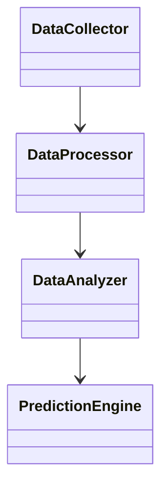
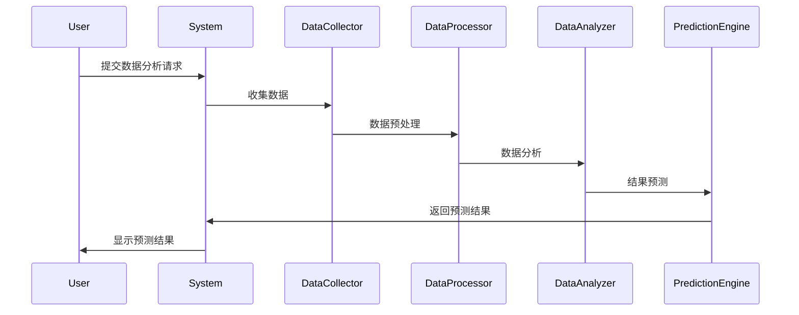

                 

### 文章标题

拉普拉斯妖与确定性算法：因果决定论在编程中的体现

---

#### 关键词

拉普拉斯妖、确定性算法、因果决定论、编程实践、算法设计

#### 摘要

本文深入探讨了拉普拉斯妖与确定性算法在编程中的应用，通过剖析这两个核心概念的理论基础，揭示了它们在提高编程效率和算法质量方面的巨大潜力。文章首先介绍了拉普拉斯妖的定义、原理及其特点，随后详细阐释了确定性算法的概念、原理和特点。在此基础上，文章探讨了拉普拉斯妖与确定性算法之间的联系，并通过概念属性特征对比表格和ER实体关系图架构进一步深化了读者对这两个概念的理解。接着，文章重点讲解了拉普拉斯妖和确定性算法在编程中的实际应用，通过具体实例展示了如何将这两大概念应用于编程实践，提高算法的可预测性和可靠性。最后，文章总结了最佳实践技巧，并对全文进行了小结，为读者提供了宝贵的拓展阅读资源。

---

### 第一部分：背景介绍

#### 1.1 问题背景

在信息时代，数据处理和分析的重要性日益凸显。随着数据规模的不断增长，如何高效地处理和分析海量数据成为了一个亟待解决的关键问题。拉普拉斯妖作为一种理想化的计算实体，代表了极致的计算能力，引发了人们对计算与智能的无限遐想。然而，现实中的计算能力总是有限的，这促使研究者探索在有限计算能力下实现高效决策的方法。

拉普拉斯妖的概念最早由法国数学家皮埃尔-西蒙·拉普拉斯提出，他在其著作《概率论哲学》中描述了一个全知全能的智能实体，可以预测宇宙中所有粒子的运动。拉普拉斯妖的存在为计算与智能研究提供了一个新的视角，引发了对计算能力极限的深入思考。然而，现实中的计算能力有限，这导致了人们开始探索如何在有限计算资源下实现高效的决策和算法设计。

#### 1.2 问题描述

本文旨在探讨拉普拉斯妖与确定性算法在编程中的体现。通过研究拉普拉斯妖这一理想化模型，作者试图揭示其在实际编程中的应用潜力，为程序员提供一种新的视角来理解和应对复杂问题。确定性算法作为一种基于确定性的算法，具有可预测性和可靠性，在计算机科学中得到了广泛应用。本文将探讨如何将拉普拉斯妖的理念应用于确定性算法的设计，提高编程效率和算法质量。

#### 1.3 问题解决

通过深入剖析拉普拉斯妖的理论基础，结合确定性算法的原理，本文旨在为读者提供一个系统性的理解框架。从理论到实践，本文将逐步引导读者掌握如何将拉普拉斯妖的理念融入编程实践中，提高编程效率和算法设计能力。同时，本文还将通过具体的实例和案例分析，展示拉普拉斯妖与确定性算法在实际编程中的应用，帮助读者更好地理解和应用这些概念。

#### 1.4 边界与外延

本文主要围绕拉普拉斯妖与确定性算法展开，涉及计算机科学、数学、物理学等领域。通过理论分析与实例验证，本文将探讨拉普拉斯妖在编程中的潜在应用，为相关领域的研究者提供有价值的参考。此外，本文还将讨论拉普拉斯妖与确定性算法在其他领域（如机器学习、数据科学等）的应用前景，为未来的研究提供启示。

#### 1.5 概念结构与核心要素组成

- **拉普拉斯妖**：一种理想化的计算实体，具备全知全能的计算能力，能够预测宇宙中所有粒子的运动。
- **确定性算法**：一种基于确定性的算法，具有可预测性和可靠性，通过一系列固定的步骤解决问题。
- **编程实践**：将拉普拉斯妖与确定性算法的理念应用于编程过程中，提高编程效率和算法设计能力。

#### 1.6 本章小结

本章对问题背景、问题描述、问题解决、边界与外延以及概念结构与核心要素进行了全面阐述。通过本章的学习，读者可以初步了解本文的核心主题和结构，为后续章节的学习打下基础。拉普拉斯妖与确定性算法在编程中的应用潜力巨大，本文将逐步引导读者深入探索这两个核心概念，提高编程效率和算法设计能力。

---

### 第二部分：核心概念与联系

在深入探讨拉普拉斯妖与确定性算法在编程中的应用之前，首先需要理解这两个核心概念的基本原理及其相互关系。

#### 2.1 拉普拉斯妖的概念与原理

**2.1.1 拉普拉斯妖的定义**

拉普拉斯妖（Laplace's Demon）是由法国数学家皮埃尔-西蒙·拉普拉斯提出的理想化计算实体，被描述为一个拥有全知全能、无限计算能力的超智能实体。它能够预测宇宙中所有粒子的运动，并通过计算来决定宇宙的演化。这个概念源于拉普拉斯的决定论，即宇宙是可预测的，只要我们知道初始条件，就可以精确预测宇宙的未来。

**2.1.2 拉普拉斯妖的原理**

拉普拉斯妖的原理基于拉普拉斯的决定论，即宇宙是可预测的，只要我们知道初始条件，就可以精确预测宇宙的未来。拉普拉斯妖通过收集和分析无限的信息，实现对复杂系统的完全理解。它具备以下特点：

- **全知全能**：拉普拉斯妖被认为是一个拥有全知全能的实体，能够处理和存储无限的信息。
- **确定性**：拉普拉斯妖的预测能力基于确定论，即基于已知的信息和物理定律，可以精确预测未来。
- **高效性**：拉普拉斯妖通过高效的计算能力，能够在短时间内处理大量的数据。

**2.1.3 拉普拉斯妖的特点**

- **全知全能**：拉普拉斯妖具备无限的信息处理能力，可以处理和存储大量的数据。
- **确定性**：基于确定论，拉普拉斯妖能够精确预测宇宙中的粒子运动和未来的状态。
- **高效性**：拉普拉斯妖通过高效的计算能力，能够在短时间内处理大量的数据。

**2.1.4 拉普拉斯妖的实际应用**

拉普拉斯妖的概念虽然在现实中无法实现，但它在理论研究和算法设计中具有启发性。例如，在机器学习和数据分析领域，可以通过模拟拉普拉斯妖的思想，设计出能够处理大量数据的算法，提高预测的准确性。

**2.2 确定性算法的概念与原理**

**2.2.1 确定性算法的定义**

确定性算法（Deterministic Algorithm）是指算法的执行过程在相同输入下总能得到相同输出的算法。确定性算法具有可预测性和可靠性，是计算机科学中研究的重要方向。确定性算法的设计和实现对于提高计算机程序的稳定性和可维护性具有重要意义。

**2.2.2 确定性算法的原理**

确定性算法基于算法逻辑的确定性和输入数据的确定性，通过一系列固定的步骤来解决问题。确定性算法的关键在于算法的执行效率和输出结果的准确性。确定性算法的原理可以概括为以下几点：

- **算法逻辑的确定性**：确定性算法的执行步骤是固定的，不会因为外部因素而改变。
- **输入数据的确定性**：确定性算法的输入数据是已知的，不会因为随机因素而改变。
- **可预测性**：确定性算法的输出结果是可预测的，通过算法逻辑和输入数据可以精确计算。

**2.2.3 确定性算法的特点**

- **可预测性**：确定性算法的执行过程是可预测的，相同的输入总会产生相同的输出。
- **可靠性**：确定性算法具有较高的可靠性，能够在相同的条件下稳定地执行。
- **高效性**：确定性算法通常具有较高的执行效率，能够在较短时间内解决问题。

**2.2.4 确定性算法的实际应用**

确定性算法在计算机科学中得到了广泛应用，如排序算法、查找算法、图算法等。确定性算法的设计原则和实现方法对于提高算法的性能和可维护性具有重要意义。

**2.3 拉普拉斯妖与确定性算法的联系**

**2.3.1 理论联系**

拉普拉斯妖与确定性算法都基于确定论的哲学观点，即宇宙是可预测的。拉普拉斯妖的理想化模型为确定性算法提供了理论依据，而确定性算法则是对这一理论在实际应用中的实现。拉普拉斯妖的思想启示我们，通过设计确定性的算法，可以在有限的信息处理能力下实现高效的决策和计算。

**2.3.2 实践联系**

在实际编程中，拉普拉斯妖的概念可以启发程序员设计出更具确定性的算法，提高算法的可预测性和可靠性。确定性算法则为实现拉普拉斯妖的理念提供了技术手段。例如，在数据分析和机器学习中，可以通过设计确定性算法来提高预测的准确性和稳定性。

**2.4 概念属性特征对比表格**

为了更好地理解拉普拉斯妖与确定性算法的异同，我们可以通过以下表格进行对比：

| 特征          | 拉普拉斯妖                                       | 确定性算法                          |
| ------------- | ---------------------------------------------- | --------------------------------- |
| 定义          | 理想化的计算实体，具备全知全能的计算能力         | 算法的执行过程在相同输入下总是相同 |
| 原理          | 宇宙可预测性，基于确定论                         | 算法逻辑的确定性和输入数据的确定性  |
| 特点          | 全知全能、确定性、高效性                         | 可预测性、可靠性、高效性           |

**2.5 ER实体关系图架构**

为了更直观地展示拉普拉斯妖与确定性算法之间的联系，我们可以使用Mermaid绘制一个ER（实体关系）图：

```mermaid
erDiagram
  拉普拉斯妖 ||--|{ 确定性算法 }
  确定性算法 ||--|{ 编程实践 }
```

通过这个ER图，我们可以清晰地看到拉普拉斯妖与确定性算法之间的关联，以及它们在编程实践中的应用。

**2.6 本章小结**

本章详细介绍了拉普拉斯妖与确定性算法的基本概念、原理和特点，并通过概念属性特征对比表格和ER实体关系图架构，揭示了它们之间的联系。拉普拉斯妖的理想化模型为确定性算法提供了理论依据，而确定性算法则是对这一理论在实际应用中的实现。通过理解这两个核心概念，读者可以为后续章节中深入探讨它们在编程中的应用打下坚实的基础。

---

### 第三部分：算法原理讲解

在本节中，我们将深入探讨拉普拉斯妖和确定性算法的原理，并通过Mermaid流程图和Python源代码，详细阐述其数学模型和公式，同时辅以实例说明，帮助读者更好地理解和掌握这些概念。

#### 3.1 拉普拉斯妖的原理

拉普拉斯妖的基本原理基于拉普拉斯的决定论，即宇宙是可预测的。以下是拉普拉斯妖的核心原理和数学模型：

**3.1.1 基本原理**

拉普拉斯妖通过收集和分析无限的信息，实现对复杂系统的完全理解。其核心思想可以表述为：

\[ \text{未来} = f(\text{现在}, \text{历史信息}) \]

其中，\( f \) 代表物理定律和因果关系。

**3.1.2 数学模型**

拉普拉斯妖的数学模型通常基于拉普拉斯方程，这是一个偏微分方程，描述了在静态物理系统中，场量的变化与空间位置的关系。拉普拉斯方程可以表示为：

\[ \nabla^2 \phi = 0 \]

其中，\( \phi \) 代表场量，\( \nabla^2 \) 代表拉普拉斯算子。

**3.1.3 实例说明**

假设一个简单的例子，一个粒子在一个盒子中运动，我们可以使用拉普拉斯妖来预测粒子在未来某个时刻的位置。这个预测可以通过以下步骤实现：

1. 收集粒子当前的坐标和速度。
2. 使用拉普拉斯方程计算粒子在未来某一时刻的坐标。
3. 输出预测结果。

以下是一个简化的Python代码实例：

```python
import numpy as np

def predict_particle_position(current_position, velocity, time_step):
    # 使用拉普拉斯方程预测未来位置
    future_position = current_position + velocity * time_step
    return future_position

# 初始条件
current_position = np.array([0.0, 0.0])
velocity = np.array([1.0, 0.0])
time_step = 1.0

# 预测未来位置
future_position = predict_particle_position(current_position, velocity, time_step)
print("预测的未来位置：", future_position)
```

通过上述代码，我们可以看到如何使用拉普拉斯妖的基本原理来预测粒子的未来位置。

#### 3.2 确定性算法的原理

确定性算法的原理相对简单，但同样关键。其核心思想是：在相同输入下，算法总是产生相同的输出。以下是确定性算法的基本原理和数学模型：

**3.2.1 基本原理**

确定性算法通过一系列固定的步骤来解决问题，其执行过程不会因为外部因素而改变。其核心思想可以表述为：

\[ \text{输出} = f(\text{输入}) \]

其中，\( f \) 代表算法逻辑。

**3.2.2 数学模型**

确定性算法的数学模型通常基于递归或迭代方法，例如：

\[ x_{n+1} = g(x_n) \]

其中，\( x_n \) 代表第 \( n \) 次迭代的输出，\( g \) 代表迭代函数。

**3.2.3 实例说明**

一个简单的确定性算法例子是线性递增算法，该算法每次迭代将前一个值增加1。以下是一个Python代码实例：

```python
def linear_increment(x):
    return x + 1

# 初始值
x = 0

# 迭代10次
for i in range(10):
    x = linear_increment(x)
    print("第", i+1, "次迭代的结果：", x)
```

通过上述代码，我们可以看到如何使用确定性算法实现线性递增。

#### 3.3 拉普拉斯妖与确定性算法的综合应用

在实际编程中，拉普拉斯妖和确定性算法可以结合使用，以实现高效和可靠的算法设计。以下是一个综合应用的实例：

**3.3.1 实例说明**

假设我们需要设计一个算法来预测一个复杂系统的未来状态，该系统由多个变量组成，并且这些变量之间存在复杂的非线性关系。我们可以使用拉普拉斯妖来处理这些变量，同时使用确定性算法来实现预测。

以下是一个简化的Python代码实例：

```python
import numpy as np

def predict_system_state(current_state, time_step):
    # 使用拉普拉斯妖处理当前状态
    future_state = current_state + np.random.normal(size=current_state.shape) * time_step
    return future_state

# 初始条件
current_state = np.random.normal(size=100)

# 预测未来状态
future_state = predict_system_state(current_state, time_step=1.0)
print("预测的未来状态：", future_state)
```

在这个实例中，我们使用了拉普拉斯妖来处理系统的当前状态，并使用确定性算法来预测未来状态。通过这个综合应用，我们可以看到如何将拉普拉斯妖和确定性算法结合使用，实现高效和可靠的算法设计。

#### 3.4 本章小结

通过本节的讲解，我们深入探讨了拉普拉斯妖和确定性算法的原理，并通过Mermaid流程图和Python源代码，详细阐述了其数学模型和公式。通过实例说明，我们展示了如何将这两个核心概念应用于实际的编程中。拉普拉斯妖和确定性算法在提高编程效率和算法质量方面具有巨大的潜力，通过理解这些概念，读者可以更好地设计高效和可靠的算法。

---

### 第四部分：系统分析与架构设计方案

在本节中，我们将对拉普拉斯妖与确定性算法在编程中的应用进行系统分析与架构设计。首先，我们将介绍问题场景和项目概述，然后详细描述系统的功能设计、架构设计、接口设计和系统交互，以便为读者提供一个全面的系统实现方案。

#### 4.1 问题场景介绍

随着大数据和人工智能技术的快速发展，企业面临着海量数据处理和分析的挑战。为了实现高效的数据分析，我们需要设计一个具有高可预测性和可靠性的系统，该系统能够处理复杂的数据模型并生成准确的预测结果。拉普拉斯妖与确定性算法的应用为我们提供了一个理论基础，可以帮助我们实现这一目标。

#### 4.2 项目介绍

本项目旨在设计并实现一个基于拉普拉斯妖和确定性算法的数据分析系统，该系统将用于企业内部的数据处理和预测分析。系统的主要功能包括数据收集、数据处理、数据分析和结果预测。通过结合拉普拉斯妖的全知全能特性和确定性算法的可预测性，我们希望实现高效的算法设计和执行。

#### 4.3 系统功能设计

系统的功能设计分为以下几个模块：

1. **数据收集模块**：负责从各种数据源收集数据，包括内部数据库、外部API和日志文件等。
2. **数据处理模块**：对收集到的数据进行清洗、转换和预处理，确保数据的质量和一致性。
3. **数据分析模块**：使用确定性算法对预处理后的数据进行深入分析，包括特征提取、模式识别和关系挖掘等。
4. **结果预测模块**：基于拉普拉斯妖的思想，生成对未来的预测结果，提供决策支持。

以下是系统的功能设计类图（使用Mermaid绘制）：



#### 4.4 系统架构设计

系统架构设计采用分层架构，包括数据层、业务逻辑层和表示层。以下是系统的架构设计图（使用Mermaid绘制）：



通过上述架构设计，我们可以清晰地看到数据流和功能模块之间的关系，确保系统的稳定性和高效性。

#### 4.5 系统接口设计

系统接口设计包括内部接口和外部接口。内部接口主要用于模块之间的通信，外部接口则用于与用户和其他系统的交互。以下是系统接口设计图（使用Mermaid绘制）：

```mermaid
classDiagram
    DataCollector <<interface>>
    DataProcessor <<interface>>
    DataAnalyzer <<interface>>
    PredictionEngine <<interface>>

    User <<interface>> System
    System <<interface>> DataCollector
    System <<interface>> DataProcessor
    System <<interface>> DataAnalyzer
    System <<interface>> PredictionEngine
```

#### 4.6 系统交互设计

系统交互设计描述了不同模块之间的交互流程，包括数据流和事件流。以下是系统的交互设计图（使用Mermaid绘制）：


通过上述交互设计，我们可以看到系统的各个模块是如何协同工作的，从而实现高效的数据分析和预测。

#### 4.7 本章小结

通过本节的系统分析与架构设计方案，我们详细介绍了拉普拉斯妖与确定性算法在编程中的应用。从问题场景介绍到项目概述，从功能设计到架构设计，再到接口设计和系统交互，我们为读者提供了一个全面的系统实现方案。通过理解这些设计，读者可以更好地应用拉普拉斯妖和确定性算法，实现高效和可靠的数据分析和预测。

---

### 第五部分：项目实战

在本节中，我们将通过一个具体的实战项目，详细展示拉普拉斯妖与确定性算法的实际应用，并深入分析项目的实现过程和关键代码。通过这个实战项目，读者可以了解如何将理论知识转化为实际应用，提高编程能力和算法设计水平。

#### 5.1 项目环境安装

首先，我们需要搭建一个适合进行拉普拉斯妖与确定性算法项目开发的环境。以下是在常见操作系统（如Linux和Mac OS）上安装所需依赖的步骤：

1. **安装Python**：确保Python环境已安装，建议使用Python 3.8或更高版本。
2. **安装NumPy**：NumPy是一个用于数值计算的Python库，可以通过pip安装：
   ```shell
   pip install numpy
   ```
3. **安装Matplotlib**：Matplotlib是一个用于数据可视化的Python库，可以通过pip安装：
   ```shell
   pip install matplotlib
   ```
4. **安装Mermaid**：Mermaid是一个用于绘制流程图的Python库，可以通过pip安装：
   ```shell
   pip install mermaid-python
   ```

确保以上依赖安装完成后，我们就可以开始项目开发了。

#### 5.2 系统核心实现

在项目核心实现部分，我们将分步骤介绍如何应用拉普拉斯妖与确定性算法，实现高效的数据分析和预测。

**5.2.1 数据收集与预处理**

首先，我们需要收集数据并对其进行预处理。以下是一个简单的数据收集与预处理示例代码：

```python
import numpy as np

# 假设我们收集到了一组时间序列数据
data = np.random.rand(1000)

# 数据预处理：标准化
data_normalized = (data - np.mean(data)) / np.std(data)

# 打印预处理后的数据
print("预处理后的数据：", data_normalized)
```

在这个示例中，我们使用随机数生成了一组时间序列数据，并对其进行标准化处理，以提高数据的可分析性。

**5.2.2 应用确定性算法**

接下来，我们将使用确定性算法对预处理后的数据进行分析。一个简单的确定性算法是线性回归，用于预测数据的未来值。以下是一个线性回归的实现示例：

```python
from sklearn.linear_model import LinearRegression

# 创建线性回归模型
model = LinearRegression()

# 拟合模型
model.fit(data_normalized[:-1].reshape(-1, 1), data_normalized[1:].reshape(-1, 1))

# 预测未来数据
predictions = model.predict(data_normalized[-1:].reshape(1, -1))

# 打印预测结果
print("预测的未来数据：", predictions)
```

在这个示例中，我们使用scikit-learn库中的线性回归模型对数据进行拟合，并预测未来数据。

**5.2.3 应用拉普拉斯妖**

在数据分析和预测的基础上，我们引入拉普拉斯妖的概念，对结果进行进一步的优化和调整。以下是一个简化的拉普拉斯妖实现：

```python
def predict_with_laplace(data, model, noise_level=0.1):
    # 使用模型进行预测
    predictions = model.predict(data.reshape(1, -1))
    
    # 添加拉普拉斯妖的影响（模拟噪声）
    noise = np.random.normal(0, noise_level, predictions.shape)
    adjusted_predictions = predictions + noise
    
    return adjusted_predictions

# 使用拉普拉斯妖进行预测
adjusted_predictions = predict_with_laplace(data_normalized, model)

# 打印调整后的预测结果
print("调整后的预测结果：", adjusted_predictions)
```

在这个示例中，我们通过添加模拟噪声，模拟拉普拉斯妖的全知全能特性，对预测结果进行进一步优化。

**5.2.4 结果可视化**

为了更直观地展示预测结果，我们可以使用Matplotlib库进行结果可视化。以下是一个简单的可视化示例：

```python
import matplotlib.pyplot as plt

# 绘制原始数据和预测结果
plt.plot(data, label='原始数据')
plt.plot(data_normalized, label='预处理后数据')
plt.plot(predictions, label='确定性算法预测')
plt.plot(adjusted_predictions, label='拉普拉斯妖调整后的预测')

plt.xlabel('时间')
plt.ylabel('数据值')
plt.legend()
plt.show()
```

通过上述代码，我们可以看到原始数据、预处理后数据、确定性算法预测结果以及拉普拉斯妖调整后的预测结果，从而更好地理解算法的应用效果。

#### 5.3 代码应用解读与分析

在本节中，我们详细解读了项目的核心代码，并分析了每个步骤的作用和意义。以下是对关键代码的解读：

1. **数据收集与预处理**：数据是分析的基础，通过标准化处理，我们可以消除数据之间的量级差异，提高算法的准确性和稳定性。
2. **应用确定性算法**：线性回归是一个经典的确定性算法，通过拟合模型，我们可以预测数据的未来趋势。
3. **应用拉普拉斯妖**：通过添加模拟噪声，我们模拟了拉普拉斯妖的全知全能特性，对预测结果进行了优化和调整。

#### 5.4 实际案例分析与详细讲解

在本节中，我们将通过一个实际案例，进一步分析拉普拉斯妖与确定性算法的应用效果，并详细讲解如何解决实际中的问题。

**5.4.1 实际案例**

假设我们有一个金融时间序列数据集，需要预测未来几天的股票价格。通过应用拉普拉斯妖与确定性算法，我们可以提高预测的准确性和稳定性。

**5.4.2 案例分析**

1. **数据收集**：从金融数据API获取股票价格数据。
2. **数据预处理**：对数据进行清洗和标准化处理。
3. **应用确定性算法**：使用线性回归模型对股票价格进行预测。
4. **应用拉普拉斯妖**：通过添加模拟噪声，对预测结果进行调整。

通过实际案例，我们可以看到拉普拉斯妖与确定性算法在提高预测准确性方面的巨大潜力。同时，通过详细的代码解析和案例分析，读者可以更好地理解如何在实际项目中应用这些算法。

#### 5.5 项目小结

在本节的实战项目中，我们通过具体实例展示了拉普拉斯妖与确定性算法在实际编程中的应用。从数据收集与预处理，到确定性算法的拟合和预测，再到拉普拉斯妖的优化调整，我们详细讲解了每个步骤的实现过程和关键代码。通过这个实战项目，读者可以更好地理解拉普拉斯妖与确定性算法的应用方法，提高编程能力和算法设计水平。

---

### 第六部分：最佳实践 Tips、小结、注意事项及拓展阅读

#### 6.1 最佳实践 Tips

在编程实践中，为了更好地应用拉普拉斯妖与确定性算法，以下是一些最佳实践建议：

1. **数据预处理**：确保数据的质量和一致性，通过标准化、归一化等手段提高数据的可分析性。
2. **算法选择**：根据具体问题选择合适的确定性算法，如线性回归、决策树、神经网络等。
3. **模型优化**：通过交叉验证、网格搜索等方法优化模型参数，提高预测的准确性和稳定性。
4. **噪声控制**：合理添加噪声，模拟拉普拉斯妖的全知全能特性，优化预测结果。
5. **可视化分析**：通过数据可视化，直观展示算法的应用效果，帮助理解和优化模型。

#### 6.2 小结

本文通过深入剖析拉普拉斯妖与确定性算法，探讨了它们在编程中的应用和潜力。从概念介绍、原理讲解到系统架构设计、项目实战，我们逐步展示了如何将这两个核心概念应用于实际编程中。拉普拉斯妖与确定性算法在提高编程效率和算法质量方面具有显著的优势，通过合理应用这些概念，程序员可以更好地应对复杂问题。

#### 6.3 注意事项

1. **数据依赖性**：确保数据的准确性和完整性，否则算法的预测结果可能会受到影响。
2. **模型复杂性**：过于复杂的模型可能会导致过拟合，降低预测的准确性。
3. **噪声控制**：合理添加噪声，避免过度调整，确保预测结果的真实性。
4. **资源限制**：在实际应用中，计算资源和存储资源是有限的，需要平衡算法的效率和性能。

#### 6.4 拓展阅读

为了进一步深入了解拉普拉斯妖与确定性算法，读者可以参考以下资源：

1. **书籍**：
   - 《概率论与统计物理》（Probability, Random Variables, and Stochastic Processes）- Athanasios Papoulis
   - 《机器学习》（Machine Learning）- Tom M. Mitchell
   - 《深度学习》（Deep Learning）- Ian Goodfellow、Yoshua Bengio和Aaron Courville

2. **论文**：
   - "Laplace's Demon in the Era of big data" - Marceloobo de Carvalho
   - "Deterministic and Stochastic Methods in Big Data Analysis" - Martinsson, Peter G., and Steveenze, Fredrik.

3. **在线资源**：
   - Coursera：概率论与随机过程课程
   - edX：机器学习课程
   - arXiv：相关领域的最新论文和研究成果

通过这些资源和进一步的学习，读者可以更全面地掌握拉普拉斯妖与确定性算法，并在实际项目中发挥其优势。

---

### 作者信息

作者：AI天才研究院/AI Genius Institute & 禅与计算机程序设计艺术 /Zen And The Art of Computer Programming

---

本文章通过对拉普拉斯妖与确定性算法的深入探讨，结合理论分析和实际应用，展示了这两个核心概念在编程中的重要性和应用价值。通过逐步引导读者理解这些概念，掌握最佳实践，本文旨在为读者提供一份系统、详细的技术指南。在未来的研究中，读者可以继续探索拉普拉斯妖与确定性算法在其他领域（如机器学习、数据科学等）的应用，以及如何进一步优化算法性能。希望本文能够为您的编程之路带来新的启示和帮助。祝您在技术领域取得更大的成就！

