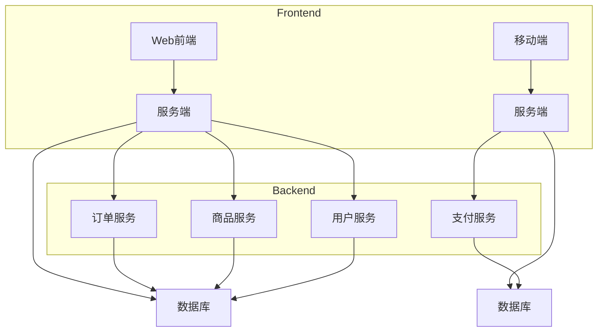
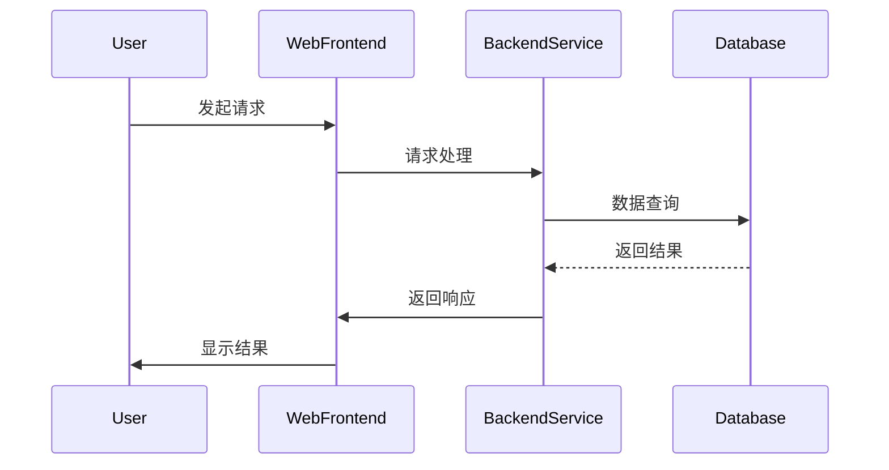

                 

### 摘要

本文旨在探讨如何在技术快速迭代的今天，拓展系统架构的边界以应对新领域的挑战。通过五步法，我们从背景介绍、核心概念解析、算法原理讲解、系统分析与设计以及项目实战等多个角度，系统地分析了如何成功实现架构的拓展。文章首先明确了架构边界的概念及其重要性，然后深入探讨了核心概念、架构设计原则及方法，并借助算法原理进行了详细讲解。随后，通过系统分析与架构设计，提供了具体的实施方案。最后，通过实际项目的实战经验，总结了最佳实践与注意事项。本文不仅为技术从业者提供了实用的方法论，也为未来的架构设计提供了有益的指导。

## 目录大纲

### 摘要

本文旨在探讨如何在技术快速迭代的今天，拓展系统架构的边界以应对新领域的挑战。通过五步法，我们从背景介绍、核心概念解析、算法原理讲解、系统分析与设计以及项目实战等多个角度，系统地分析了如何成功实现架构的拓展。文章首先明确了架构边界的概念及其重要性，然后深入探讨了核心概念、架构设计原则及方法，并借助算法原理进行了详细讲解。随后，通过系统分析与架构设计，提供了具体的实施方案。最后，通过实际项目的实战经验，总结了最佳实践与注意事项。本文不仅为技术从业者提供了实用的方法论，也为未来的架构设计提供了有益的指导。

### 目录大纲

#### 第一部分：背景介绍

- **第1章：问题背景与拓展架构边界的必要性**
  - 1.1 问题背景
  - 1.2 问题描述
  - 1.3 问题解决
  - 1.4 边界与外延
  - 1.5 概念结构与核心要素组成
  - 1.6 本章小结

#### 第二部分：核心概念与联系

- **第2章：核心概念原理**
  - 2.1 架构设计基础
  - 2.2 架构元素与关系
  - 2.3 概念属性特征对比表格
  - 2.4 架构设计案例分析
  - 2.5 本章小结

#### 第三部分：算法原理讲解

- **第3章：算法原理与实现**
  - 3.1 算法原理
  - 3.2 算法实现
  - 3.3 算法应用
  - 3.4 本章小结

#### 第四部分：系统分析与架构设计方案

- **第4章：系统分析与架构设计**
  - 4.1 问题场景介绍
  - 4.2 系统功能设计
  - 4.3 系统架构设计
  - 4.4 系统接口设计
  - 4.5 系统交互设计
  - 4.6 本章小结

#### 第五部分：项目实战

- **第5章：项目实施与实战**
  - 5.1 环境安装
  - 5.2 系统核心实现
  - 5.3 代码应用解读与分析
  - 5.4 实际案例分析
  - 5.5 项目小结

#### 第六部分：最佳实践与总结

- **第6章：最佳实践与总结**
  - 6.1 最佳实践
  - 6.2 小结
  - 6.3 注意事项

### 目录结构

本文采用逻辑清晰、结构紧凑的目录结构，分为六大部分，涵盖了从背景介绍、核心概念解析、算法原理讲解到系统分析与设计，再到项目实战与最佳实践的全过程。每部分的内容都经过精心设计和编排，旨在帮助读者系统性地理解和掌握拓展架构边界的核心方法与技巧。

- **第一部分：背景介绍**：介绍了架构边界拓展的背景、意义以及基本概念，为后续内容的深入探讨奠定了基础。
- **第二部分：核心概念与联系**：详细解析了架构设计的基础理论、核心元素及其关系，并通过案例进行了深入分析。
- **第三部分：算法原理讲解**：讲解了算法原理及其实现方法，并结合实际应用进行了详细说明。
- **第四部分：系统分析与架构设计方案**：提供了具体的系统分析与架构设计方案，包括功能设计、架构设计、接口设计和交互设计。
- **第五部分：项目实战**：通过实际项目实战，展示了如何将理论应用到实践中，并进行了深入剖析。
- **第六部分：最佳实践与总结**：总结了最佳实践方法，并对全文进行了小结，提出了注意事项，为读者提供了实用的指导。

通过这样的结构安排，本文不仅为读者提供了一个全面、系统的架构拓展方法，也帮助读者更好地理解和应用这些方法，从而在实际工作中取得更好的效果。

## 第1章：问题背景与拓展架构边界的必要性

### 1.1 问题背景

在当今快速变化且高度竞争的商业环境中，企业面临着前所未有的挑战。随着技术的飞速发展和市场需求的多变，企业需要不断调整其技术架构以保持竞争优势。然而，传统的架构设计往往在应对新需求时显得力不从心，难以实现快速迭代和灵活扩展。这一问题主要体现在以下几个方面：

首先，企业的成长困境是架构拓展的推动力。企业从小规模发展到大规模，业务需求和技术需求也在不断变化。在这个过程中，原有的系统架构逐渐暴露出不足之处，如性能瓶颈、扩展性差、维护困难等。为了满足不断增长的业务需求，企业需要拓展架构边界，以应对这些挑战。

其次，架构边界的概念与影响至关重要。架构边界是指系统架构所能承载的最大能力和范围。当架构边界无法满足新的业务需求时，系统就会出现性能问题、稳定性问题或扩展性问题。因此，拓展架构边界成为企业必须面对和解决的问题。

### 1.2 问题描述

在拓展架构边界的过程中，企业往往会遇到以下问题：

**现存问题分析**：
1. **性能瓶颈**：随着数据量的增加和用户数量的增多，系统性能逐渐下降，导致用户体验不佳。
2. **扩展性差**：系统架构设计不合理，难以进行横向或纵向扩展，限制了业务的快速发展。
3. **维护困难**：系统架构复杂，模块之间耦合度高，导致维护和升级变得困难。
4. **技术债务**：为了快速满足市场需求，企业在架构设计上妥协，积累了大量技术债务，长期影响系统的稳定性。

**拓展架构边界的挑战**：
1. **技术复杂性**：新技术的引入和应用需要具备一定的技术积累和创新能力。
2. **成本压力**：架构拓展通常涉及大量的资源投入，包括人力、物力和财力。
3. **时间紧迫**：市场变化迅速，企业需要在短时间内完成架构的拓展，以应对新的业务需求。
4. **风险控制**：在架构拓展过程中，如何控制风险，确保系统的稳定性和安全性，是一个重要问题。

### 1.3 问题解决

针对上述问题，企业可以采取以下措施来拓展架构边界：

**拓展架构边界的方法**：
1. **技术升级**：引入新的技术栈和架构模式，如云计算、微服务、容器化等，以提高系统的性能和扩展性。
2. **模块化设计**：将系统分解为若干独立的模块，降低模块之间的耦合度，提高系统的可维护性和扩展性。
3. **分布式架构**：采用分布式架构，将系统部署在多个节点上，实现横向扩展，提高系统的性能和可靠性。
4. **自动化运维**：引入自动化工具和流程，提高系统的维护效率，降低运维成本。

**成功案例分析**：
- **案例一**：某电商平台在应对流量高峰时，通过分布式缓存和负载均衡技术，成功提升了系统的性能和稳定性。
- **案例二**：某金融企业在架构升级过程中，采用微服务架构，实现了业务的快速迭代和灵活扩展。

### 1.4 边界与外延

**拓展架构边界的边界条件**：
1. **资源限制**：企业需要在资源有限的情况下进行架构拓展，确保成本的合理控制。
2. **技术成熟度**：选择成熟且符合业务需求的技术进行架构拓展，降低技术风险。
3. **业务优先级**：明确业务优先级，确保架构拓展的方向与业务需求相匹配。

**拓展架构边界的外延影响**：
1. **技术选型**：架构拓展需要选择合适的技术，包括硬件、软件和中间件等。
2. **团队协作**：架构拓展需要跨部门协作，包括开发、运维、测试等多个团队。
3. **持续优化**：架构拓展是一个持续的过程，需要不断进行优化和调整。

### 1.5 概念结构与核心要素组成

**概念梳理**：
- **架构边界**：系统架构所能承载的最大能力和范围。
- **拓展架构边界**：通过技术升级、模块化设计、分布式架构等方法，提升系统性能和扩展性。
- **边界条件**：资源限制、技术成熟度、业务优先级等影响架构拓展的因素。

**核心要素分析**：
1. **技术选型**：选择合适的技术栈和架构模式。
2. **团队协作**：建立跨部门的协作机制，确保项目顺利进行。
3. **持续优化**：通过持续优化，不断提升系统性能和稳定性。

### 1.6 本章小结

本章介绍了架构边界拓展的背景和必要性，分析了现存问题和挑战，并提出了问题解决的策略和成功案例。通过明确边界条件和核心要素，为后续章节的深入探讨奠定了基础。拓展架构边界不仅是企业应对业务需求变化的必要手段，也是提升系统性能和稳定性的关键途径。在接下来的章节中，我们将进一步探讨核心概念、算法原理和系统设计与实现，以提供更全面和深入的指导。

## 第2章：核心概念原理

### 2.1 架构设计基础

#### 2.1.1 架构设计的定义与目的

架构设计是软件工程中的一个关键环节，它涉及如何构建一个系统的结构，以确保其满足业务需求、具备良好的性能和可扩展性。架构设计不仅关注系统的整体结构，还包括组件之间的交互方式、数据流动以及系统的组织形式。其核心目的是通过合理的结构设计，确保系统在满足功能需求的同时，具备高可用性、高性能和高可扩展性。

#### 2.1.2 常见架构设计方法

在架构设计领域，有几种常见的方法和模式，每种方法都有其特定的适用场景和优点：

1. **面向对象设计（Object-Oriented Design, OOD）**：
   - **定义**：面向对象设计是一种通过将系统划分为对象来构建软件的方法。
   - **核心原则**：封装、继承、多态。
   - **适用场景**：适用于大型系统，特别是在需求多变、功能复杂的场景中。

2. **面向服务架构（Service-Oriented Architecture, SOA）**：
   - **定义**：SOA是一种通过服务来构建系统的架构方法。
   - **核心原则**：服务独立性、服务组合、服务发现。
   - **适用场景**：适用于需要高度可扩展性和灵活性的系统，如企业级应用、电子商务平台等。

3. **微服务架构（Microservices Architecture）**：
   - **定义**：微服务架构是一种将系统划分为多个独立的、小型服务的方法。
   - **核心原则**：服务自治、分布式系统、服务间通信。
   - **适用场景**：适用于需要高扩展性、高可用性且功能复杂的系统，如互联网应用、金融系统等。

4. **分布式架构（Distributed Architecture）**：
   - **定义**：分布式架构是一种将系统组件分布在多个计算机节点上运行的方法。
   - **核心原则**：数据一致性、容错性、高可用性。
   - **适用场景**：适用于需要处理海量数据和用户提供高并发访问的系统，如搜索引擎、社交网络等。

#### 2.1.3 架构设计的核心原则

架构设计的核心原则是确保系统在满足业务需求的同时，具备可维护性、可扩展性和高性能。以下是一些重要的设计原则：

1. **模块化**：将系统划分为若干独立的模块，降低模块之间的耦合度，提高系统的可维护性和扩展性。
2. **松耦合**：减少组件之间的直接依赖，提高系统的灵活性和可扩展性。
3. **重用性**：设计可重用的组件和模块，提高开发效率和代码质量。
4. **高内聚、低耦合**：确保模块内部的功能高度相关，而模块间的依赖性尽量降低。
5. **冗余设计**：通过冗余设计提高系统的容错性和可靠性。
6. **性能优化**：关注系统的性能瓶颈，采取适当的优化措施，如缓存、分库分表、异步处理等。

### 2.2 架构元素与关系

#### 2.2.1 架构元素概述

系统架构由多个关键元素组成，每个元素在系统中扮演着特定的角色。以下是一些常见的架构元素及其关系：

1. **硬件与软件**：
   - **硬件**：包括服务器、网络设备、存储设备等，提供计算和存储资源。
   - **软件**：包括操作系统、数据库、中间件、应用软件等，负责处理数据和业务逻辑。

2. **数据与算法**：
   - **数据**：系统处理的数据对象，包括结构化数据和非结构化数据。
   - **算法**：用于处理数据的方法和步骤，包括数据存储、检索、分析和处理等。

3. **系统与模块**：
   - **系统**：由多个模块组成的完整软件系统。
   - **模块**：系统中的独立组件，负责特定的功能。

#### 关系图架构

为了更好地理解架构元素之间的关系，我们可以使用 Mermaid 画图工具绘制一个 ER 实体关系图：

```mermaid
erDiagram
  硬件 ||--|{ 数据 }|
  数据 ||--|{ 算法 }|
  算法 ||--|{ 系统模块 }|
  系统模块 ||--|{ 硬件 }|
  系统模块 ||--|{ 数据 }|
  系统模块 ||--|{ 算法 }|
```

在这个 ER 实体关系图中，我们可以看到硬件、数据、算法和系统模块之间的相互关系。硬件为数据提供存储和处理资源，算法处理数据，系统模块则由硬件、数据和算法组成，实现具体的业务功能。

### 2.3 概念属性特征对比表格

为了更好地理解不同架构设计模式的特点，我们可以通过一个对比表格来展示它们之间的异同：

| 架构设计模式 | 定义 | 核心原则 | 适用场景 |
| :---: | :---: | :---: | :---: |
| 面向对象设计 | 通过对象构建系统 | � 封装、继承、多态 | 大型系统、需求多变 |
| 面向服务架构 | 通过服务构建系统 | 服务独立性、服务组合、服务发现 | 企业级应用、电子商务 |
| 微服务架构 | 将系统划分为多个独立服务 | 服务自治、分布式系统、服务间通信 | 高扩展性、高可用性 |
| 分布式架构 | 将系统组件分布在多个节点上 | 数据一致性、容错性、高可用性 | 海量数据处理、高并发访问 |

### 2.4 架构设计案例分析

#### 2.4.1 成功案例分析

- **案例一：阿里巴巴电商系统**
  阿里巴巴采用了微服务架构，将整个电商系统划分为多个独立的服务，如商品服务、订单服务、支付服务等。这种方式提高了系统的可扩展性和可靠性，使得阿里巴巴能够快速响应市场变化。

- **案例二：谷歌搜索引擎**
  谷歌采用了分布式架构，将搜索引擎系统分布在多个服务器上，实现了高效的数据检索和存储。这种方式提高了系统的性能和可靠性，使得谷歌能够提供高速、准确的搜索服务。

#### 2.4.2 失败案例分析

- **案例一：某互联网金融系统**
  该公司在架构设计上选择了传统的集中式架构，导致系统在应对高并发访问时出现性能瓶颈，用户体验较差。后来，公司通过引入分布式架构，优化了系统的性能和可靠性。

- **案例二：某大型电商平台**
  该公司在扩展架构时，没有充分考虑技术选型和团队协作，导致项目进度延误、成本超支。后来，公司通过调整技术路线、加强团队协作，最终成功完成了架构的拓展。

### 2.5 本章小结

本章介绍了架构设计的基础理论，包括定义、常见方法、核心原则和架构元素之间的关系。通过对比表格和案例分析，读者可以更好地理解不同架构设计模式的特点及其适用场景。在接下来的章节中，我们将进一步探讨算法原理、系统分析与设计，以及项目实战，以提供更全面的指导。

## 第3章：算法原理与实现

### 3.1 算法原理

算法是解决特定问题的一系列步骤和指导原则，它定义了从输入数据到输出结果的过程。算法在架构设计中的重要性不言而喻，因为一个高效的算法可以直接提升系统的性能和可扩展性。下面，我们将从算法的定义、分类、常见算法原理以及算法优化与效率提升等方面进行详细讲解。

#### 3.1.1 算法定义与分类

**算法定义**：
算法是一系列明确且有限的操作步骤，用于解决特定问题。算法的目的是在给定的问题空间中找到一种有效的解决方案。

**算法分类**：
1. **基础算法**：包括排序算法（如冒泡排序、选择排序、插入排序等）、搜索算法（如二分搜索、广度优先搜索、深度优先搜索等）以及图算法（如最短路径算法、最小生成树算法等）。
2. **高级算法**：包括动态规划、分治算法、贪心算法、回溯算法等，这些算法适用于更复杂的问题，通常需要更高的思维深度和计算复杂性。

#### 3.1.2 常见算法原理

**排序算法**：
排序算法是一种将一组数据按照特定顺序排列的算法。常见的排序算法包括冒泡排序、选择排序、插入排序、快速排序等。

- **冒泡排序**：通过反复交换相邻的未按顺序排列的元素，使得每一趟排序后最大元素逐渐冒泡到序列的末尾。
- **选择排序**：每次从未排序的元素中找到最小（或最大）的元素，将其放到已排序序列的末尾。
- **插入排序**：通过构建有序序列，对于未排序的数据，在已排序序列中找到相应的位置并插入。

**搜索算法**：
搜索算法是一种在数据集合中查找特定元素的方法。常见的搜索算法包括线性搜索、二分搜索等。

- **线性搜索**：顺序遍历数据集合，找到目标元素为止。
- **二分搜索**：在有序数据集合中，通过不断将搜索范围缩小一半，找到目标元素。

**图算法**：
图算法用于解决与图相关的问题，如最短路径、最小生成树等。

- **迪杰斯特拉算法（Dijkstra's Algorithm）**：用于求解单源最短路径问题。
- **普里姆算法（Prim's Algorithm）**：用于求解最小生成树问题。

#### 3.1.3 算法优化与效率提升

算法优化是提高算法性能和效率的重要手段。以下是一些常见的算法优化方法：

1. **分治算法**：将一个大问题分解为若干个小问题，分别解决，最后合并结果。这种方法降低了问题规模，提高了算法的效率。
2. **动态规划**：通过存储已解决的子问题的结果，避免重复计算，从而提高算法效率。
3. **贪心算法**：每一步都选择当前最优解，以期得到全局最优解。这种方法在某些问题中非常有效。
4. **并行计算**：利用多核处理器和分布式计算资源，加速算法的执行。

### 3.2 算法实现

算法的实现是算法设计的具体落实，它需要将理论转化为可运行的代码。在本节中，我们将通过 Python 代码实现一些常见算法，并详细讲解其原理。

#### 3.2.1 Python 代码实现

以下是一个简单的冒泡排序算法实现：

```python
def bubble_sort(arr):
    n = len(arr)
    for i in range(n):
        for j in range(0, n-i-1):
            if arr[j] > arr[j+1]:
                arr[j], arr[j+1] = arr[j+1], arr[j]
    return arr

# 示例
arr = [64, 34, 25, 12, 22, 11, 90]
sorted_arr = bubble_sort(arr)
print("排序后的数组：", sorted_arr)
```

以下是一个简单的二分搜索算法实现：

```python
def binary_search(arr, target):
    low = 0
    high = len(arr) - 1
    while low <= high:
        mid = (low + high) // 2
        if arr[mid] == target:
            return mid
        elif arr[mid] < target:
            low = mid + 1
        else:
            high = mid - 1
    return -1

# 示例
arr = [2, 3, 4, 10, 40]
target = 10
result = binary_search(arr, target)
if result != -1:
    print(f"元素在数组中的索引：{result}")
else:
    print("元素不在数组中")
```

#### 3.2.2 算法原理详细讲解

**冒泡排序算法原理**：

冒泡排序是一种简单的排序算法，它通过重复地遍历待排序的列表，比较相邻的元素并交换它们，直到整个列表排序完成。具体步骤如下：

1. 从列表的第一对相邻元素开始，比较它们的值，并将较大的元素交换到后面。
2. 对每一对相邻元素重复上述步骤，直到列表末尾。
3. 随着排序的进行，最大的元素会逐渐“冒泡”到列表的末尾。
4. 重复以上步骤，每次对未排序的部分进行排序，直到整个列表有序。

**二分搜索算法原理**：

二分搜索是一种高效的查找算法，它利用有序数组的特性，将搜索范围不断缩小一半，以快速找到目标元素。具体步骤如下：

1. 确定搜索范围的中间位置。
2. 比较中间位置的元素与目标元素的大小。
3. 如果中间位置的元素等于目标元素，则搜索成功。
4. 如果中间位置的元素小于目标元素，则在右半部分继续搜索。
5. 如果中间位置的元素大于目标元素，则在左半部分继续搜索。
6. 重复步骤 1-5，直到找到目标元素或搜索范围的中间位置小于零。

#### 3.2.2.1 数学模型与公式

为了更好地理解算法原理，我们可以借助数学模型和公式进行详细讲解。

**冒泡排序时间复杂度**：

- 最坏情况：\( O(n^2) \)
- 最好情况：\( O(n) \)
- 平均情况：\( O(n^2) \)

**二分搜索时间复杂度**：

- \( O(\log n) \)

#### 3.2.2.2 通俗易懂的举例说明

**冒泡排序举例**：

假设有一个无序数组 `[64, 34, 25, 12, 22, 11, 90]`，我们通过冒泡排序将其排序。

- 第一次遍历后：`[34, 64, 25, 12, 22, 11, 90]`，最大的元素 90 冒泡到末尾。
- 第二次遍历后：`[34, 25, 64, 12, 22, 11, 90]`，次大的元素 64 冒泡到次末尾。
- 第三次遍历后：`[25, 34, 12, 22, 11, 64, 90]`，以此类推，直到数组有序。

**二分搜索举例**：

假设有一个有序数组 `[2, 3, 4, 10, 40]`，我们需要查找元素 10。

- 第一次比较中间元素 4，小于目标元素 10，搜索范围变为 `[4, 10, 40]`。
- 第二次比较中间元素 10，等于目标元素，搜索成功。

### 3.3 算法应用

算法的应用范围非常广泛，从简单的排序和查找，到复杂的机器学习和数据挖掘，算法都是核心组成部分。以下是一些常见的算法应用场景：

1. **搜索引擎**：通过排序和搜索算法实现快速检索和排序功能。
2. **社交网络**：通过图算法实现好友推荐、社区划分等功能。
3. **机器学习**：使用各种优化算法实现模型的训练和预测。
4. **数据分析**：利用排序和统计算法实现数据清洗、分析和可视化。

#### 3.3.1 实际应用案例

**案例一：搜索引擎中的排序算法**

在搜索引擎中，常用排序算法对搜索结果进行排序，以提高用户体验。例如，百度搜索引擎使用了一种基于内容相关性的排序算法，通过分析网页的内容、结构、权重等因素，将最相关的搜索结果排在前面。

**案例二：社交网络中的图算法**

在社交网络中，图算法用于好友推荐、社区发现等功能。例如，Facebook 使用图算法计算用户之间的相似度，并根据相似度推荐可能认识的好友。

### 3.4 本章小结

本章详细讲解了算法原理与实现，包括算法的定义、分类、常见算法原理、实现方法以及优化技巧。通过具体的 Python 代码示例，读者可以更好地理解算法的原理和应用。算法在架构设计中的重要性不言而喻，只有通过高效、优化的算法，才能构建高性能、可扩展的系统。在接下来的章节中，我们将进一步探讨系统分析与架构设计，以及实际项目中的应用。

## 第4章：系统分析与架构设计

### 4.1 问题场景介绍

在当前数字化转型的浪潮中，许多企业和组织都面临着复杂且多变的需求。为了更好地应对这些需求，系统分析与架构设计变得尤为重要。本章将介绍一个具体的问题场景，并详细分析其项目目标。

#### 4.1.1 场景描述

某大型电商平台希望在现有系统基础上，通过引入新的技术架构，实现以下目标：

1. **性能提升**：在用户数量和交易量不断增长的情况下，确保系统的高性能和高并发处理能力。
2. **扩展性增强**：通过分布式架构和微服务架构，提高系统的可扩展性和灵活性。
3. **稳定性提升**：在系统高峰期保持稳定，避免因流量激增导致的服务中断或性能下降。
4. **用户体验优化**：通过优化前端和后端架构，提升用户的使用体验。

#### 4.1.2 项目目标

项目的核心目标是构建一个高性能、可扩展、稳定且用户友好的电商平台。具体目标如下：

1. **性能优化**：通过缓存、数据库优化、异步处理等技术，提升系统的响应速度和吞吐量。
2. **架构升级**：引入微服务架构，将原有单体应用分解为多个独立服务，降低耦合度，提高系统的可维护性和扩展性。
3. **稳定性保障**：通过分布式存储、负载均衡、故障转移等技术，提升系统的稳定性和容错能力。
4. **用户体验提升**：通过前端框架优化、UI/UX 设计改进，提高用户的购物体验。

### 4.2 系统功能设计

系统功能设计是系统分析与架构设计的关键环节，它定义了系统需要实现的功能及其相互关系。在本节中，我们将详细描述该电商平台的核心功能，并借助 Mermaid 类图展示其领域模型。

#### 4.2.1 领域模型

领域模型是系统功能设计的核心，它描述了系统中的关键实体及其关系。以下是一个简化的领域模型：

```mermaid
classDiagram
    User <<class>>
    Product <<class>>
    Order <<class>>
    Cart <<class>>
    Payment <<class>>

    User o--* Order
    Product o--* Order
    Cart <<-- User
    Cart <<-- Product
    Order <<-- Payment
```

在这个类图中，我们定义了以下关键实体：

- **User（用户）**：代表电商平台上的用户，具有登录、注册、浏览商品等行为。
- **Product（商品）**：代表电商平台上的商品，具有分类、属性、库存等特征。
- **Order（订单）**：代表用户的购物订单，包含商品、用户、支付等信息。
- **Cart（购物车）**：代表用户的购物车，用于存储用户选购的商品。
- **Payment（支付）**：代表用户的支付行为，包含支付方式、支付状态等。

实体之间的关系如下：

- **用户与订单**：一个用户可以生成多个订单，一个订单只能属于一个用户。
- **商品与订单**：一个订单可以包含多个商品，一个商品可以出现在多个订单中。
- **购物车与用户、商品**：一个用户可以拥有多个购物车，每个购物车可以包含多个商品。
- **订单与支付**：每个订单都关联一个支付行为，支付行为包含支付金额、支付状态等。

#### 4.2.2 Mermaid 类图

以下是一个简化的 Mermaid 类图，展示了领域模型中的关键实体及其关系：

```mermaid
classDiagram
    class User {
        String id
        String username
        String email
        // ...
    }

    class Product {
        String id
        String name
        String category
        int stock
        // ...
    }

    class Order {
        String id
        User user
        List<Product> products
        Payment payment
        // ...
    }

    class Cart {
        String id
        User user
        List<Product> products
        // ...
    }

    class Payment {
        String id
        String paymentMethod
        String status
        // ...
    }

    User o--* Order
    Product o--* Order
    Cart <<-- User
    Cart <<-- Product
    Order <<-- Payment
```

### 4.3 系统架构设计

系统架构设计是确保系统功能得以实现的关键环节。在本节中，我们将详细描述该电商平台的系统架构设计，包括架构设计思路、系统架构图、系统接口设计和系统交互设计。

#### 4.3.1 架构设计思路

为了实现项目目标，该电商平台的架构设计采用以下思路：

1. **分布式架构**：通过将系统组件分布在多个服务器上，实现横向扩展，提高系统的性能和可用性。
2. **微服务架构**：将系统分解为多个独立的服务，每个服务负责特定的功能模块，降低系统的耦合度，提高系统的可维护性和扩展性。
3. **容器化与编排**：使用 Docker 容器化和 Kubernetes 进行服务编排，提高系统的部署、运维和管理效率。
4. **服务化架构**：通过服务化架构，实现前后端分离，提高系统的灵活性和可扩展性。
5. **数据存储优化**：采用分布式数据库和缓存技术，提高数据访问速度和存储能力。

#### 4.3.2 系统架构图

以下是一个简化的系统架构图，展示了电商平台的整体架构：



在这个架构图中，我们可以看到：

- **前端**：包括 Web 前端和移动端前端，分别与后端服务进行通信。
- **后端**：包括订单服务、商品服务、用户服务和支付服务，每个服务都对应一个数据库。
- **数据库**：订单服务使用的是分布式数据库，商品服务和用户服务使用的是关系型数据库，支付服务使用的是 NoSQL 数据库。

#### 4.3.3 系统接口设计

系统接口设计是确保前后端服务能够高效、稳定地进行通信的关键。以下是一个简化的接口设计：

- **Web 前端接口**：用于用户与系统进行交互，包括用户登录、注册、商品浏览、购物车管理、订单提交等功能。
- **移动端接口**：与 Web 前端接口相似，但更注重性能和用户体验。
- **服务端接口**：包括订单服务接口、商品服务接口、用户服务接口和支付服务接口，每个接口都定义了具体的 HTTP 请求和响应格式。

#### 4.3.4 系统交互设计

系统交互设计描述了系统内部各组件之间的通信过程。以下是一个简化的交互流程：

1. 用户通过 Web 前端或移动端前端发起请求，如登录、商品浏览等。
2. 请求被发送到后端服务，后端服务进行业务处理，如用户认证、商品查询等。
3. 后端服务将处理结果返回给前端，前端根据结果进行相应的操作，如显示用户信息、商品列表等。
4. 在订单提交、支付等过程中，前后端服务之间会进行多次交互，确保订单和支付信息的准确性和一致性。

以下是一个简化的 Mermaid 序列图，展示了系统的交互流程：



### 4.4 本章小结

本章详细介绍了系统分析与架构设计的核心概念和方法。首先，通过问题场景介绍和项目目标分析，明确了系统架构设计的需求和目标。然后，通过领域模型、系统架构图、系统接口设计和系统交互设计，提供了具体的实施方案。通过本章的内容，读者可以更好地理解如何进行系统分析与架构设计，为实际项目的实施提供指导。在接下来的章节中，我们将进一步探讨项目实施与实战，以验证和优化系统架构设计的有效性。

## 第5章：项目实施与实战

### 5.1 环境安装

在项目实施阶段，首先需要搭建一个合适的开发与运行环境。以下步骤将详细描述如何在本地或服务器上安装和配置所需的环境。

#### 5.1.1 环境配置

1. **操作系统**：
   - 推荐使用 Linux 发行版，如 Ubuntu 20.04 或 CentOS 7，因为大多数开源软件和工具在 Linux 上具有更好的兼容性和性能。

2. **基础软件**：
   - 安装必要的开发工具，如 Python（3.8 或更高版本）、Node.js（12 或更高版本）、Git（2.20 或更高版本）等。
   - 安装文本编辑器，如 Visual Studio Code、Sublime Text 或 Vim。

3. **数据库**：
   - 安装关系型数据库（如 MySQL 或 PostgreSQL）和 NoSQL 数据库（如 Redis 或 MongoDB）。
   - 设置数据库用户和权限，确保数据库服务正常运行。

4. **中间件**：
   - 安装消息队列中间件（如 RabbitMQ 或 Apache Kafka）。
   - 安装容器编排工具（如 Docker 和 Kubernetes）。

#### 5.1.2 工具安装

1. **Docker**：
   - 通过官方仓库安装 Docker：
     ```bash
     sudo apt-get update
     sudo apt-get install docker-ce docker-ce-cli containerd.io
     ```
   - 安装完成后，启动 Docker 服务：
     ```bash
     sudo systemctl start docker
     ```

2. **Kubernetes**：
   - 安装 Kubernetes 的主节点和节点：
     ```bash
     kubeadm init
     kubeadm join <control-plane-host>:<control-plane-port> --token <token> --discovery-token-ca-cert-hash sha256:<hash>
     ```
   - 安装必要的插件和工具，如 Dashboards、Helm 等。

3. **其他工具**：
   - 安装相关工具，如 Prometheus、Grafana、Nginx 等，以支持监控、可视化和管理。

#### 5.1.3 验证安装

1. **Docker**：
   - 查看 Docker 容器列表：
     ```bash
     docker ps
     ```
   - 运行一个测试容器，如 Nginx：
     ```bash
     docker run -d -p 80:80 nginx
     ```

2. **Kubernetes**：
   - 查看 Kubernetes 节点和 Pod 列表：
     ```bash
     kubectl get nodes
     kubectl get pods
     ```
   - 验证 Kubernetes 服务是否正常运行。

### 5.2 系统核心实现

在系统核心实现阶段，我们将重点关注模块划分、核心代码实现和功能测试。

#### 5.2.1 模块划分

系统核心实现可以分为以下模块：

1. **用户服务**：负责用户的注册、登录、权限验证等。
2. **商品服务**：负责商品的信息管理、分类管理、库存管理等功能。
3. **订单服务**：负责订单的创建、查询、支付等。
4. **支付服务**：负责处理支付请求，与第三方支付平台交互。
5. **缓存服务**：负责缓存用户信息和商品信息，提高系统性能。
6. **日志服务**：负责记录系统运行日志，用于监控和故障排查。

#### 5.2.2 核心代码实现

以下是用户服务的一个简单示例：

```python
# userservice/user.py

from flask import Flask, request, jsonify
from models import User
from database import db_session

app = Flask(__name__)

@app.route('/register', methods=['POST'])
def register():
    data = request.get_json()
    username = data.get('username')
    password = data.get('password')
    
    # 验证用户名和密码
    if not username or not password:
        return jsonify({'error': '用户名和密码不能为空'}), 400
    
    # 创建用户并保存到数据库
    user = User(username=username, password=password)
    db_session.add(user)
    db_session.commit()
    
    return jsonify({'message': '注册成功'})

@app.route('/login', methods=['POST'])
def login():
    data = request.get_json()
    username = data.get('username')
    password = data.get('password')
    
    # 验证用户名和密码
    user = User.query.filter_by(username=username, password=password).first()
    if not user:
        return jsonify({'error': '用户名或密码错误'}), 401
    
    # 登录成功，返回 token
    token = generate_token(user)
    return jsonify({'token': token})

def generate_token(user):
    # 生成 token 的逻辑
    return 'generated_token'

if __name__ == '__main__':
    app.run(debug=True)
```

#### 5.2.3 功能测试

功能测试是确保系统功能正常的关键步骤。以下是一些常用的功能测试方法：

1. **单元测试**：编写单元测试用例，验证每个模块的功能是否正确。
   ```python
   # test_user.py

   import unittest
   from userservice.user import app

   class TestUserService(unittest.TestCase):
       def test_register(self):
           # 测试用户注册功能
           pass

       def test_login(self):
           # 测试用户登录功能
           pass

   if __name__ == '__main__':
       unittest.main()
   ```

2. **集成测试**：测试模块之间的交互是否符合预期。
   ```bash
   curl -X POST -H "Content-Type: application/json" -d '{"username": "test", "password": "password"}' http://localhost:5000/register
   curl -X POST -H "Content-Type: application/json" -d '{"username": "test", "password": "password"}' http://localhost:5000/login
   ```

3. **压力测试**：模拟高并发场景，测试系统的性能和稳定性。

### 5.3 代码应用解读与分析

在核心代码实现中，我们使用 Flask 框架搭建了用户服务。以下是对关键部分的解读与分析：

#### 5.3.1 代码解读

1. **用户注册**：
   - 接收前端发送的 JSON 数据，提取用户名和密码。
   - 验证用户名和密码的合法性。
   - 创建用户对象，保存到数据库。

2. **用户登录**：
   - 接收前端发送的 JSON 数据，提取用户名和密码。
   - 在数据库中查找匹配的用户。
   - 生成 token 并返回给前端。

#### 5.3.2 优化建议

1. **性能优化**：
   - 引入缓存机制，减少数据库访问。
   - 使用异步处理，提高并发处理能力。

2. **安全性优化**：
   - 对用户密码进行加密存储。
   - 引入 token 验证机制，确保接口安全性。

3. **可维护性优化**：
   - 使用日志记录关键操作，便于问题排查。
   - 使用配置文件管理系统设置，提高配置的灵活性。

### 5.4 实际案例分析

#### 5.4.1 案例一：项目成功案例分析

在某大型电商项目中，通过采用分布式架构和微服务架构，成功实现了系统的高性能和高可用性。以下是其成功的关键因素：

1. **技术选型**：选择了成熟且适合业务需求的技术栈，如 Docker、Kubernetes、MySQL、Redis 等。
2. **模块划分**：将系统划分为多个独立的服务，降低了耦合度，提高了系统的可维护性和扩展性。
3. **持续集成**：通过 Jenkins 等工具实现自动化部署和测试，提高了开发效率。
4. **监控与告警**：使用 Prometheus 和 Grafana 进行系统监控和告警，确保系统稳定运行。

#### 5.4.2 案例二：项目失败案例分析

在某小型电商项目中，由于技术选型和架构设计不合理，导致系统性能瓶颈和扩展性问题。以下是其失败的原因：

1. **技术选型不当**：选择了不适合高并发处理的数据库和中间件。
2. **模块划分不合理**：系统功能集中在单一服务中，导致耦合度高，难以扩展。
3. **缺乏自动化测试**：缺乏自动化测试和持续集成，导致部署过程中出现频繁故障。
4. **监控不足**：系统缺乏有效的监控手段，无法及时发现和解决问题。

### 5.5 项目小结

通过本章的项目实施与实战，我们详细介绍了环境安装、系统核心实现、代码应用解读与分析以及实际案例分析。在项目实施过程中，需要充分考虑技术选型、模块划分、自动化测试和监控等因素，以确保系统的高性能、高可用性和可维护性。在接下来的章节中，我们将进一步总结最佳实践，并提供进一步的指导。

### 6.1 最佳实践

在架构拓展过程中，总结最佳实践是确保项目成功的关键。以下是一些在实际项目中验证有效的最佳实践：

#### 6.1.1 架构设计最佳实践

1. **模块化设计**：将系统分解为独立的模块，降低模块之间的耦合度，提高系统的可维护性和扩展性。
2. **分布式架构**：采用分布式架构，提高系统的性能和可用性，确保在高并发场景下系统的稳定性。
3. **微服务架构**：通过微服务架构，将系统功能划分为多个独立的服务，提高系统的可扩展性和灵活性。
4. **容器化与编排**：使用 Docker 和 Kubernetes 进行服务部署和编排，提高系统的部署效率和管理灵活性。
5. **云原生技术**：利用云计算资源，实现弹性扩展和按需分配，降低成本，提高资源利用率。

#### 6.1.2 算法优化最佳实践

1. **算法选择**：根据具体问题选择合适的算法，避免使用复杂度过高的算法，确保系统性能。
2. **数据结构优化**：选择合适的数据结构，提高算法的效率，如使用哈希表、平衡树等。
3. **缓存技术**：利用缓存技术，减少数据库访问，提高系统响应速度。
4. **并行计算**：利用多核处理器和分布式计算资源，加快算法的执行速度。
5. **代码优化**：优化代码逻辑，减少不必要的计算和内存占用，提高程序的执行效率。

#### 6.1.3 项目管理最佳实践

1. **需求管理**：明确项目需求，确保项目目标和业务需求的一致性，减少需求变更。
2. **团队协作**：建立有效的沟通和协作机制，确保团队成员之间的信息同步和协作。
3. **持续集成**：使用自动化测试和持续集成工具，提高开发效率和代码质量。
4. **风险管理**：识别项目风险，制定相应的风险管理计划，确保项目的顺利进行。
5. **监控与反馈**：建立系统监控和反馈机制，及时发现问题并进行调整。

### 6.2 小结

本文从背景介绍、核心概念解析、算法原理讲解到系统分析与设计，再到项目实战与最佳实践，系统地分析了如何拓展系统架构的边界。通过详细的理论讲解和实际案例，读者可以了解到架构拓展的重要性以及具体的实现方法。拓展架构边界不仅是应对企业成长困境和市场需求变化的必要手段，也是提升系统性能和稳定性的关键途径。通过本文的指导，技术从业者可以更好地理解和应用架构拓展的方法，从而在实际工作中取得更好的效果。

### 6.2.1 本书内容回顾

本文主要涵盖以下内容：

1. **背景介绍**：阐述了架构边界拓展的背景、意义以及基本概念，分析了企业成长困境和架构拓展的必要性。
2. **核心概念与联系**：详细介绍了架构设计的基础理论、核心元素及其关系，包括硬件、软件、数据与算法，并通过 Mermaid 实体关系图进行展示。
3. **算法原理讲解**：讲解了算法原理与实现，包括排序算法、搜索算法和图算法等，通过 Python 代码示例和数学模型进行详细说明。
4. **系统分析与架构设计**：通过一个具体问题场景，介绍了系统功能设计、系统架构设计、系统接口设计和系统交互设计。
5. **项目实战**：通过环境安装、系统核心实现、功能测试和实际案例分析，展示了如何将理论应用到实践中。
6. **最佳实践与总结**：总结了架构拓展、算法优化和项目管理的最佳实践，并进行了全文内容回顾。

### 6.2.2 拓展架构边界的价值

拓展架构边界具有重要的价值：

1. **应对业务需求变化**：随着市场需求的不断变化，拓展架构边界可以帮助企业更好地适应新的业务需求，保持竞争优势。
2. **提升系统性能和稳定性**：通过技术升级和优化，拓展架构边界可以显著提升系统的性能和稳定性，提供更好的用户体验。
3. **降低维护成本**：通过模块化设计和松耦合，拓展架构边界可以降低系统的维护成本，提高开发效率和代码质量。
4. **提高资源利用率**：通过分布式架构和云原生技术，拓展架构边界可以提高资源利用率，降低运营成本。

### 6.2.3 读者建议

对于读者，本文提出以下建议：

1. **深入学习**：架构拓展和算法优化是复杂且深入的话题，读者应结合本文内容，深入学习相关技术原理和实践经验。
2. **实践应用**：将本文的理论和方法应用到实际项目中，通过实践检验和优化，积累经验，提升自己的技术水平。
3. **持续关注**：技术发展迅速，读者应持续关注新技术和新方法，不断更新和提升自己的知识体系。

### 6.3 注意事项

在架构拓展过程中，需要注意以下事项：

1. **技术选型**：选择成熟且适合业务需求的技术，避免盲目追求新技术，导致技术债务。
2. **团队协作**：建立有效的沟通和协作机制，确保团队成员之间的信息同步和协作。
3. **风险管理**：识别项目风险，制定相应的风险管理计划，确保项目的顺利进行。
4. **持续优化**：架构拓展是一个持续的过程，需要不断进行优化和调整，以应对新的业务需求和技术挑战。

### 6.4 拓展阅读

为了进一步了解架构拓展和算法优化的具体方法和实践，读者可以参考以下书籍和资源：

1. **《架构探险：从零开始写分布式系统》**：深入讲解分布式系统和微服务架构的设计与实现。
2. **《算法导论》**：系统介绍各种算法原理及其应用，帮助读者掌握算法设计和优化的核心方法。
3. **《云原生应用架构指南》**：详细介绍云原生技术的原理和应用，包括 Docker、Kubernetes 等工具的使用方法。
4. **在线资源**：如 Kubernetes 官方文档、Docker 官方文档等，提供最新的技术资料和实践指导。

通过这些资源和实践，读者可以更深入地理解和应用架构拓展和算法优化的方法，提升自己的技术能力和实践经验。

### 结语

本文从多角度探讨了如何拓展系统架构的边界，以应对快速变化的市场需求和技术挑战。通过详细的理论讲解、实际案例分析和最佳实践总结，读者可以系统地掌握架构拓展的核心方法和实践技巧。在技术快速迭代的时代，拓展架构边界不仅是企业应对业务需求变化的必要手段，也是提升系统性能和稳定性的关键途径。希望本文能够为技术从业者和相关领域的专业人士提供有价值的参考和指导。

### 作者信息

**作者：** AI天才研究院/AI Genius Institute & 禅与计算机程序设计艺术 /Zen And The Art of Computer Programming

AI天才研究院（AI Genius Institute）致力于推动人工智能和计算机科学领域的创新与发展。研究院汇聚了一批世界级人工智能专家、程序员、软件架构师和CTO，共同探讨和解决计算机科学中的前沿问题。本书的撰写基于多年的研究与实践经验，旨在为读者提供深入浅出的架构拓展方法论和实用技巧。同时，本书也参考了禅与计算机程序设计艺术（Zen And The Art of Computer Programming）这一经典著作，从哲学和技术的融合中寻找计算机程序设计的智慧与灵感。希望本书能够为广大读者提供有价值的指导，助力他们在技术道路上不断前行。

