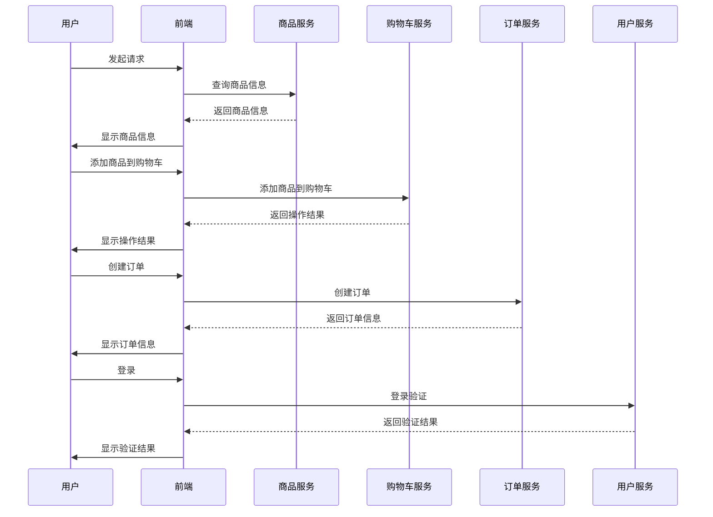

                 

### 1.1 问题背景与持续交付概述

在当今快速发展的信息技术领域，软件的开发和交付速度成为企业竞争力的重要因素之一。然而，传统的软件交付过程常常面临诸多挑战，如开发流程复杂、测试周期长、部署风险高等问题。这些问题不仅影响了软件交付的效率，还可能对企业的业务发展造成负面影响。

首先，传统的软件交付过程往往依赖于手动操作，这使得整个流程既繁琐又容易出错。例如，在软件从开发到上线的过程中，每一个环节都需要人工干预，这不仅增加了人力成本，还可能导致人为错误。此外，传统的交付流程缺乏自动化，测试和部署过程往往需要大量时间，导致软件交付周期过长。

其次，软件交付过程中存在较高的风险。在传统的开发模式下，软件往往在交付前才进行全面的测试，这可能导致在上线后才发现严重的缺陷，从而影响系统的稳定性。此外，由于缺乏持续反馈和改进机制，开发团队很难及时发现和解决问题，导致交付质量难以保证。

为了解决这些问题，持续交付（Continuous Delivery）应运而生。持续交付是一种软件交付的实践方法，其核心理念是通过自动化和持续反馈，实现快速、可靠和高质量的软件交付。持续交付不仅能够显著提高软件交付的效率，还能够降低交付风险，从而增强企业的竞争力。

持续交付的起源可以追溯到敏捷开发和DevOps运动的兴起。敏捷开发强调迭代和增量式开发，鼓励团队快速交付可用的软件版本。DevOps则强调开发和运维团队的合作，通过自动化工具和流程优化，提高系统的可靠性和交付速度。这些理念共同促进了持续交付的发展，使其成为现代软件工程的重要组成部分。

持续交付的定义可以简单概括为：在任何时候，只要代码通过了所有测试，就可以安全地交付和部署到生产环境中。这一目标需要通过一系列策略和工具来实现，包括自动化测试、持续集成、持续部署等。

接下来，我们将进一步探讨持续交付的概念，并详细描述其核心组成部分，以便读者能够更好地理解这一实践方法。

### 1.2 持续交付的核心概念与组成部分

持续交付的核心在于自动化和持续反馈，这些元素共同构成了其高效、可靠的交付流程。以下是持续交付的几个关键组成部分：

#### 1.2.1 流水线自动化

流水线自动化是持续交付的基础。它通过自动化工具和脚本，将软件开发的各个环节（如编译、构建、测试、部署等）整合到一个连续的流程中。这样，每个环节都可以在完成时自动触发下一个环节，从而减少手动操作，提高交付速度。

#### 1.2.2 持续集成（CI）

持续集成（Continuous Integration）是一种软件开发实践，旨在通过频繁的代码集成和自动化测试，确保代码库的持续稳定性。持续集成的核心思想是将开发者的代码定期合并到一个共享的主分支中，并在每次合并时运行自动化测试，以确保新代码不会破坏现有的功能。

#### 1.2.3 持续部署（CD）

持续部署（Continuous Deployment）是持续交付的下一步，它通过自动化部署流程，将经过测试的代码部署到生产环境中。这意味着在每次成功测试后，代码都可以立即部署，从而实现几乎实时的软件更新。

#### 1.2.4 持续交付的流程与工具

持续交付的流程通常包括以下几个步骤：

1. **代码提交**：开发者将新的代码提交到代码库。
2. **构建**：构建工具（如Jenkins、Travis CI等）自动编译和构建代码。
3. **测试**：自动化测试工具运行测试用例，验证代码的功能和质量。
4. **部署**：通过部署工具（如Kubernetes、Docker等）将代码部署到生产环境。

实现持续交付需要一系列工具的支持，这些工具可以相互配合，构建一个高效的自动化流程。以下是一些常用的持续交付工具：

- **Git**：版本控制系统，用于管理代码库。
- **Jenkins**：自动化构建和测试工具。
- **Travis CI**：基于Git的持续集成服务。
- **Selenium**：自动化测试工具。
- **Kubernetes**：容器编排工具，用于部署和管理容器化应用。
- **Docker**：容器化技术，用于打包和运行应用。

通过这些工具和流程，持续交付能够实现快速、可靠和高质量的软件交付，从而帮助企业更好地应对市场需求和竞争压力。

### 1.3 持续交付与传统软件交付的对比

传统的软件交付流程通常包括需求分析、设计、编码、测试、部署等阶段，这些阶段往往是线性进行的，每个阶段完成后才能进入下一个阶段。这种模式导致以下几个问题：

1. **开发周期长**：由于每个阶段都需要手工操作，并且各个阶段之间存在依赖关系，导致整个开发周期较长。
2. **风险集中**：通常在交付前进行全面的测试，这可能导致在软件交付时发现大量的缺陷，从而增加了交付风险。
3. **缺乏反馈**：由于交付周期长，开发团队难以获得及时的反馈，导致问题难以及时发现和解决。
4. **维护困难**：在传统交付流程中，软件的维护和升级通常需要重新进行整个交付流程，这增加了维护的难度和成本。

而持续交付则通过以下几个方面的改进，解决了上述问题：

1. **快速反馈**：持续交付通过频繁的集成和自动化测试，使开发团队能够在早期发现和解决问题，从而缩短开发周期。
2. **风险分散**：持续交付将测试贯穿于整个开发过程，每个阶段都会进行部分测试，从而降低交付时发现缺陷的风险。
3. **持续改进**：持续交付鼓励持续集成和部署，使团队能够快速响应市场需求，并进行持续改进。
4. **维护简化**：由于软件始终处于可部署状态，维护和升级可以通过简单的部署操作完成，从而简化了维护流程。

总的来说，持续交付通过自动化和持续反馈，实现了快速、可靠和高质量的软件交付，从而在多个方面优于传统的软件交付流程。这些优势不仅能够提高企业的竞争力，还能够提升开发团队的效率和质量。

### 1.4 持续交付的数学模型与公式讲解

持续交付作为一种高效、可靠的软件交付实践，其背后不仅有丰富的实践经验和工具支持，还有一系列数学模型和公式为其提供理论基础。以下将详细介绍持续交付中涉及的一些关键数学模型和公式。

#### 1.4.1 持续交付的效率模型

持续交付的效率模型主要关注交付周期和交付成功率两个关键指标。以下是相关的数学公式：

1. **交付周期（Cycle Time）**：
   $$ CT = \frac{Total\ Work\ Time}{Number\ of\ Deliverables} $$
   其中，\( CT \) 表示交付周期，\( Total\ Work\ Time \) 表示总工作时长，\( Number\ of\ Deliverables \) 表示交付次数。

2. **交付成功率（Delivery Success Rate）**：
   $$ DSRate = \frac{Number\ of\ Successful\ Deliveries}{Total\ Number\ of\ Deliveries} $$
   其中，\( DSRate \) 表示交付成功率，\( Number\ of\ Successful\ Deliveries \) 表示成功交付次数，\( Total\ Number\ of\ Deliveries \) 表示总交付次数。

通过这些公式，企业可以量化其持续交付的效率，并据此进行优化。

#### 1.4.2 持续交付的风险管理模型

风险管理是持续交付的重要组成部分。以下是一个简化的风险管理模型：

1. **风险暴露度（Risk Exposure）**：
   $$ RE = R \times P \times L $$
   其中，\( RE \) 表示风险暴露度，\( R \) 表示风险概率，\( P \) 表示风险概率，\( L \) 表示潜在损失。

通过计算风险暴露度，企业可以识别和优先处理高风险项。

2. **风险价值（Risk Value）**：
   $$ RV = \sum_{i=1}^{n} (R_i \times P_i \times L_i) $$
   其中，\( RV \) 表示风险价值，\( R_i \) 表示第 \( i \) 个风险的概率，\( P_i \) 表示第 \( i \) 个风险的潜在损失，\( L_i \) 表示第 \( i \) 个风险的损失。

#### 1.4.3 持续交付的延迟最小化模型

延迟最小化是持续交付的重要目标之一，以下是一个简化的延迟最小化模型：

1. **延迟时间（Delay Time）**：
   $$ DT = \sum_{i=1}^{n} (T_i \times P_i) $$
   其中，\( DT \) 表示延迟时间，\( T_i \) 表示第 \( i \) 个任务的时长，\( P_i \) 表示第 \( i \) 个任务的发生概率。

2. **最小化延迟策略**：
   为了最小化延迟时间，企业可以采取以下策略：
   $$ Optimal\ Allocation = \frac{Total\ Work\ Load}{Number\ of\ Resources} $$
   其中，\( Optimal\ Allocation \) 表示最优任务分配，\( Total\ Work\ Load \) 表示总工作负载，\( Number\ of\ Resources \) 表示资源数量。

通过这些数学模型和公式，企业可以更好地理解持续交付的内在机制，并据此制定优化策略，提高交付效率和交付质量。

### 1.5 持续交付的ER实体关系图

为了更清晰地展示持续交付中的各个实体及其关系，我们可以使用ER（Entity-Relationship）图来描述。以下是持续交付中常见的ER图：

```mermaid
erDiagram
    User ||--|{ Project }| Project
    Project ||--|{ Commit }| Commit
    Commit ||--|{ Build }| Build
    Build ||--|{ Test }| Test
    Test ||--|{ Result }| Result
    Result ||--|{ Deployment }| Deployment
```

这个ER图描述了持续交付过程中涉及的关键实体及其关系：

- **User（用户）**：提交代码的用户。
- **Project（项目）**：用户参与的项目。
- **Commit（提交）**：用户对项目的代码提交。
- **Build（构建）**：自动化工具根据提交的代码进行编译和构建。
- **Test（测试）**：构建完成后，运行自动化测试。
- **Result（结果）**：测试的最终结果，包括成功或失败。
- **Deployment（部署）**：成功测试后的代码部署。

通过这个ER图，我们可以更好地理解持续交付的各个环节及其相互关系，有助于设计和实现一个高效的持续交付系统。

### 2.1 流水线自动化策略

#### 2.1.1 流水线自动化的意义

流水线自动化是持续交付中不可或缺的一环，它通过将软件开发和交付的各个环节自动化，大大提高了交付的效率和质量。流水线自动化的意义主要体现在以下几个方面：

1. **提高交付速度**：流水线自动化减少了手动操作，每个环节都可以在完成时自动触发下一个环节，从而大大缩短了交付周期。
2. **减少错误**：流水线自动化减少了人为干预，降低了人为错误的可能性，提高了交付质量。
3. **增强可重复性**：流水线自动化确保了每次交付的过程都是一致的，从而增强了可重复性和可预测性。
4. **支持持续改进**：流水线自动化提供了大量的数据反馈，使团队能够不断优化交付流程，提高效率和质量。

#### 2.1.2 流水线自动化的实现方法

实现流水线自动化的方法主要包括以下几个方面：

1. **选择合适的工具**：选择适合团队需求的流水线自动化工具，如Jenkins、GitLab CI、Travis CI等。
2. **定义流水线**：根据项目需求，定义每个环节的自动化任务，如编译、测试、部署等。
3. **配置触发机制**：设置流水线的触发条件，如代码提交、定时执行等。
4. **集成测试**：在流水线中集成自动化测试，确保每次交付的代码都经过严格测试。
5. **部署自动化**：通过自动化工具，实现代码的自动化部署，确保交付流程的高效性和一致性。

#### 2.1.3 流水线自动化工具比较

市场上存在多种流水线自动化工具，每种工具都有其独特的特点和适用场景。以下是几种常用工具的比较：

- **Jenkins**：Jenkins 是最流行的开源自动化工具之一，具有高度的可定制性和丰富的插件生态。适合大规模项目和企业级应用。
- **GitLab CI**：GitLab CI 是 GitLab 的内置持续集成工具，具有简单易用和强大的集成能力。适合中小型项目和快速迭代的需求。
- **Travis CI**：Travis CI 是基于 Git 的持续集成服务，适用于 GitHub 上的项目。支持多种编程语言，操作简便。
- **Circle CI**：Circle CI 提供一个易于配置的云平台，支持快速构建和部署。适合需要快速响应和频繁交付的项目。
- **GitLab CI/CD**：GitLab CI/CD 是 GitLab 的持续集成和持续部署解决方案，集成在 GitLab 中，便于管理。

选择合适的流水线自动化工具，需要根据团队的具体需求和项目特点进行综合考虑。

### 2.2 持续集成（CI）策略

#### 2.2.1 持续集成的原理

持续集成（Continuous Integration，简称 CI）是一种软件开发实践，旨在通过频繁的代码集成和自动化测试，确保代码库的持续稳定性。其核心原理包括以下几个方面：

1. **频繁提交**：开发人员定期将代码提交到代码库，每次提交都会触发自动化集成流程。
2. **自动化构建**：每次提交后，自动化工具会编译和构建代码，确保代码能够在当前环境中正常运行。
3. **自动化测试**：构建完成后，运行一系列自动化测试，验证代码的功能和质量，确保新代码不会破坏现有功能。
4. **反馈机制**：自动化测试的结果会立即反馈给开发人员，帮助他们快速发现和解决问题。

持续集成的目的是通过频繁的集成和测试，及早发现和解决潜在的问题，从而提高代码库的稳定性和交付质量。

#### 2.2.2 持续集成的流程

持续集成的流程通常包括以下几个步骤：

1. **代码提交**：开发人员将代码提交到代码库。
2. **触发构建**：每次提交都会触发自动化构建，编译和构建代码。
3. **运行测试**：构建完成后，运行一系列自动化测试，包括单元测试、集成测试等。
4. **反馈结果**：测试结果会立即反馈给开发人员和团队，包括成功或失败的详细信息。
5. **持续反馈**：通过持续反馈，开发人员可以及时发现和解决问题，确保代码库的持续稳定性。

#### 2.2.3 持续集成工具实践

实现持续集成需要选择合适的工具，以下是一些常用的持续集成工具及其实践方法：

- **Jenkins**：Jenkins 是最流行的开源持续集成工具，通过配置 Jenkinsfile，可以实现自动化构建和测试。例如，以下是一个简单的 Jenkinsfile 示例：

  ```groovy
  pipeline {
      agent any
      stages {
          stage('Build') {
              steps {
                  sh 'mvn clean package'
              }
          }
          stage('Test') {
              steps {
                  sh 'mvn test'
              }
          }
      }
  }
  ```

  通过这个 Jenkinsfile，Jenkins 会自动编译和测试 Maven 项目。

- **GitLab CI**：GitLab CI 是 GitLab 的内置持续集成工具，通过配置 `.gitlab-ci.yml` 文件，可以实现自动化构建和测试。以下是一个 `.gitlab-ci.yml` 文件的示例：

  ```yaml
  image: maven:3.6.3-jdk-11

  services:
    - postgres:13

  cache:
    paths:
      - './target/:cache/target/'

  build:
    stage: build
    script:
      - mvn clean package
    artifacts:
      paths:
        - target/*.jar

  test:
    stage: test
    script:
      - mvn test
    only:
      - master
  ```

  通过这个配置文件，GitLab CI 会自动构建和测试 Maven 项目，并在成功后上传构建结果。

- **Travis CI**：Travis CI 是基于 GitHub 的持续集成服务，通过配置 `.travis.yml` 文件，可以实现自动化构建和测试。以下是一个 `.travis.yml` 文件的示例：

  ```yaml
  language: java
  jdk:
    - 11
  before_script:
    - mvn clean install
  script:
    - mvn test
  artifacts:
    paths:
      - target/surefire-reports/*.xml
  ```

  通过这个配置文件，Travis CI 会自动构建和测试 Java 项目，并在失败时发送通知。

通过这些工具和实践方法，企业可以实现高效的持续集成，提高代码库的稳定性和交付质量。

### 2.3 持续部署（CD）策略

#### 2.3.1 持续部署的重要性

持续部署（Continuous Deployment，简称 CD）是持续交付的重要环节，它通过自动化部署流程，将经过测试的代码部署到生产环境中，实现快速、可靠和高质量的软件交付。持续部署的重要性主要体现在以下几个方面：

1. **缩短交付周期**：持续部署将部署过程自动化，减少了手动操作和等待时间，从而缩短了交付周期。
2. **降低部署风险**：通过自动化测试和逐步部署，持续部署可以及时发现和解决潜在问题，降低了部署风险。
3. **提高交付质量**：持续部署确保每次交付的代码都经过严格测试，从而提高了交付质量。
4. **增强灵活性**：持续部署允许团队快速响应市场需求，进行持续改进和迭代。

#### 2.3.2 持续部署的流程

持续部署的流程通常包括以下几个步骤：

1. **自动化测试**：在代码部署前，运行自动化测试，确保代码的质量和稳定性。
2. **版本管理**：将代码库中的最新版本标记为可部署版本。
3. **构建和打包**：使用构建工具（如 Maven、Gradle 等）对代码进行编译和打包，生成可部署的软件包。
4. **部署**：使用部署工具（如 Kubernetes、Docker 等）将软件包部署到生产环境，可以是单个实例，也可以是集群部署。
5. **监控和反馈**：在部署后，监控系统会实时监控软件的运行状态，并在发现问题时提供反馈。

#### 2.3.3 持续部署的挑战与解决方案

尽管持续部署具有诸多优势，但在实际应用中仍面临一些挑战：

1. **部署风险**：自动化部署过程中可能出现问题，导致部署失败或系统故障。解决方案包括：逐步部署、蓝绿部署、灰度发布等。
2. **环境一致性**：开发、测试和生产环境可能存在差异，导致部署失败。解决方案包括：使用容器技术（如 Docker）确保环境一致性。
3. **资源消耗**：自动化部署过程中可能需要大量的计算和存储资源。解决方案包括：优化部署脚本、使用云服务进行弹性扩展。
4. **监控和反馈**：部署后需要实时监控软件的运行状态，并及时反馈问题。解决方案包括：使用监控工具（如 Prometheus、Grafana）进行实时监控和报警。

通过克服这些挑战，企业可以实现高效的持续部署，从而提高交付速度和交付质量。

### 2.4 持续交付的优化策略

为了进一步提升持续交付的效率和质量，企业可以采取一系列优化策略。以下是一些常用的优化策略：

#### 2.4.1 风险管理策略

风险管理是持续交付的关键环节，以下是一些有效的风险管理策略：

1. **风险评估**：对每次交付进行风险评估，识别潜在风险。
2. **风险缓解**：采取缓解措施，降低风险发生概率或影响程度。
3. **应急预案**：制定应急预案，确保在风险发生时能够快速响应和解决。

#### 2.4.2 延迟最小化策略

延迟是持续交付中需要重点关注的问题，以下是一些延迟最小化的策略：

1. **自动化测试**：通过自动化测试，及早发现和解决问题，减少手工测试的时间。
2. **并行处理**：将测试和部署过程并行化，减少等待时间。
3. **优化流程**：优化持续交付的流程，减少不必要的步骤和等待时间。

#### 2.4.3 持续交付的监控与反馈机制

监控与反馈是持续交付的重要组成部分，以下是一些监控与反馈策略：

1. **实时监控**：使用监控工具，实时监控软件的运行状态，及时发现和解决问题。
2. **自动化反馈**：将监控结果自动反馈给相关人员，确保问题能够及时得到处理。
3. **持续反馈**：建立持续反馈机制，从每次交付中学习，不断优化流程和策略。

通过这些优化策略，企业可以进一步提升持续交付的效率和质量，从而更好地应对市场需求和竞争压力。

### 3.1 持续交付工具概述

持续交付的实践离不开各种工具的支持，这些工具在持续交付的不同环节中发挥着重要作用。以下是对几种常见持续交付工具的概述，包括其分类、市场现状和选型原则。

#### 3.1.1 持续交付工具的分类

持续交付工具可以根据其功能和应用场景分为以下几类：

1. **版本控制系统**：如 Git、SVN，用于管理代码版本和协作开发。
2. **持续集成工具**：如 Jenkins、GitLab CI、Travis CI，用于自动化构建和测试。
3. **持续部署工具**：如 Kubernetes、Docker、Ansible，用于自动化部署和管理应用。
4. **测试工具**：如 Selenium、JUnit、TestNG，用于自动化测试和验证。
5. **监控工具**：如 Prometheus、Grafana、Zabbix，用于实时监控系统状态和性能。
6. **持续反馈工具**：如 Slack、JIRA、Email，用于自动通知和反馈问题。

#### 3.1.2 持续交付工具的市场现状

随着持续交付理念的普及，市场上有越来越多的工具和平台提供持续交付相关的解决方案。以下是当前市场现状的一些特点：

1. **开源工具**：如 Jenkins、GitLab CI、Travis CI 等开源工具受到广泛使用，因其灵活性和可定制性。
2. **云服务平台**：如 AWS CodePipeline、Azure DevOps、Google Cloud Build 等，提供一站式持续交付服务。
3. **容器编排工具**：如 Kubernetes、Docker Swarm 等，成为持续交付中不可或缺的工具。
4. **多云和混合云支持**：随着多云和混合云架构的兴起，持续交付工具也逐步支持跨云环境部署和集成。

#### 3.1.3 持续交付工具的选型原则

选择合适的持续交付工具对于实现高效的持续交付至关重要。以下是一些选型原则：

1. **需求匹配**：根据团队的具体需求和项目特点，选择功能符合需求、易于扩展和集成的工具。
2. **用户体验**：选择用户界面友好、易于使用的工具，降低学习成本和操作难度。
3. **社区支持和生态**：选择具有活跃社区和支持生态的工具，便于解决问题和获取帮助。
4. **性能和稳定性**：选择性能优秀、稳定性高的工具，确保持续交付流程的可靠性和持续性。
5. **成本考虑**：根据预算和成本考虑，选择性价比高的工具或服务。

通过遵循上述原则，企业可以更好地选择适合自身需求的持续交付工具，从而实现高效的软件交付。

### 3.2 常见持续交付工具详解

在持续交付的实践中，有许多工具被广泛应用，它们在不同的环节中发挥着关键作用。以下将详细介绍几种常见的持续交付工具，包括其原理、特点、优势和应用场景。

#### 3.2.1 Jenkins

Jenkins 是一款开源的自动化工具，用于实现持续集成和持续部署。Jenkins 的核心原理是通过定义 Jenkinsfile（一种脚本文件），将构建、测试和部署过程自动化。以下是 Jenkins 的一些主要特点：

- **高度可定制**：Jenkins 支持自定义工作流程，可以通过插件扩展功能。
- **灵活性强**：Jenkins 可以与各种版本控制系统、构建工具、测试工具和部署工具集成。
- **社区活跃**：Jenkins 拥有一个庞大的社区和丰富的插件生态，提供了大量的解决方案。

Jenkins 的主要优势在于其灵活性、可扩展性和强大的社区支持，适合各种规模和类型的项目。在应用场景方面，Jenkins 常用于构建和测试 Web 应用程序、移动应用程序和分布式系统。

#### 3.2.2 GitLab CI

GitLab CI 是 GitLab 的内置持续集成工具，通过配置 `.gitlab-ci.yml` 文件实现自动化构建、测试和部署。GitLab CI 的主要特点如下：

- **集成度高**：GitLab CI 与 GitLab 自带的其他功能（如代码审查、项目管理等）紧密集成，方便团队协作。
- **易用性**：`.gitlab-ci.yml` 配置文件简单明了，易于理解和操作。
- **云原生**：GitLab CI 支持云原生架构，可以与 Kubernetes 等工具无缝集成。

GitLab CI 的主要优势是其集成度和易用性，特别适合在 GitLab 环境中使用的项目。应用场景包括 Web 应用程序、移动应用程序和微服务架构。

#### 3.2.3 Travis CI

Travis CI 是基于 Git 的持续集成服务，主要用于自动化构建和测试。Travis CI 的主要特点如下：

- **平台支持**：Travis CI 支持多种编程语言和平台，包括 GitHub、GitLab 和 Bitbucket。
- **自动化程度高**：Travis CI 可以在代码提交后自动触发构建和测试。
- **灵活配置**：Travis CI 允许通过 `.travis.yml` 文件进行详细配置。

Travis CI 的主要优势是其自动化程度和灵活性，适合需要快速迭代和频繁测试的项目。应用场景包括开源项目、个人项目和中小型团队。

#### 3.2.4 Kubernetes

Kubernetes 是一款开源的容器编排工具，用于自动化部署、扩展和管理容器化应用。Kubernetes 的主要特点如下：

- **自动化部署**：Kubernetes 可以根据需求自动部署容器化应用。
- **弹性伸缩**：Kubernetes 可以根据负载自动调整容器数量，实现弹性伸缩。
- **高可用性**：Kubernetes 提供了故障转移和恢复机制，确保应用的高可用性。

Kubernetes 的主要优势在于其自动化部署、弹性伸缩和高可用性，适合大规模分布式系统。应用场景包括 Web 应用程序、微服务架构和云计算平台。

#### 3.2.5 Docker

Docker 是一款开源的容器化技术，用于打包和运行应用。Docker 的主要特点如下：

- **轻量级**：Docker 容器非常轻量，具有独立的文件系统、网络接口和进程空间。
- **可移植性**：Docker 容器可以在任何地方运行，不受操作系统和硬件限制。
- **快速启动**：Docker 容器可以在毫秒级别启动，大大提高了应用部署的速度。

Docker 的主要优势是其轻量级、可移植性和快速启动，适合快速迭代和频繁部署的应用。应用场景包括 Web 应用程序、微服务架构和云计算平台。

通过了解这些常见持续交付工具的特点和优势，企业可以更好地选择和部署适合自身需求的持续交付解决方案。

### 3.3 常见持续交付工具的深入探讨

#### 3.3.1 Jenkins 的深入探讨

Jenkins 是一款功能强大的开源持续集成工具，广泛应用于各种规模的软件开发项目。以下从多个方面深入探讨 Jenkins 的使用方法和最佳实践。

**1. 安装与配置**

Jenkins 的安装过程相对简单，可以下载二进制包或使用 Docker 进行安装。在配置方面，需要安装必要的插件，如 Git、Maven、JUnit 等，以支持不同的构建和测试需求。

**2. Jenkinsfile**

Jenkinsfile 是 Jenkins 的核心配置文件，用于定义构建、测试和部署流程。一个典型的 Jenkinsfile 如下：

```groovy
pipeline {
    agent any
    stages {
        stage('Build') {
            steps {
                sh 'mvn clean package'
            }
        }
        stage('Test') {
            steps {
                sh 'mvn test'
            }
        }
        stage('Deploy') {
            steps {
                sh 'echo "Deploying to production..."'
            }
        }
    }
}
```

**3. 构建参数化**

Jenkins 支持构建参数化，允许根据不同的环境或需求进行构建。例如，可以设置版本号、构建分支等参数，以便灵活地调整构建过程。

**4. 持续反馈**

Jenkins 可以与各种通知工具（如 Slack、JIRA、Email）集成，实现构建结果和问题的实时通知。这有助于开发团队快速响应和处理问题。

**5. 最佳实践**

- **版本控制**：将 Jenkinsfile 存放在版本控制系统中，以便管理和跟踪变更。
- **插件管理**：定期更新和优化插件，确保 Jenkins 环境的安全和稳定。
- **自动化测试**：集成自动化测试工具，确保每次构建都经过严格的测试。

**6. 高级特性**

Jenkins 提供了丰富的特性，如多节点构建、并行执行、流水线等。这些高级特性有助于进一步优化持续交付流程，提高构建和测试效率。

#### 3.3.2 GitLab CI 的深入探讨

GitLab CI 是 GitLab 的内置持续集成工具，具有易用性和集成度高，深受开发者喜爱。以下从多个方面深入探讨 GitLab CI 的使用方法和最佳实践。

**1. 安装与配置**

GitLab CI 的安装过程与 Jenkins 类似，可以选择在本地安装或使用容器化部署。配置方面，需要编辑 `.gitlab-ci.yml` 文件，定义构建和测试流程。

**2. `.gitlab-ci.yml` 配置**

`.gitlab-ci.yml` 文件是 GitLab CI 的核心配置文件，用于定义构建和测试步骤。以下是一个简单的 `.gitlab-ci.yml` 配置示例：

```yaml
image: java:8

stages:
  - build
  - test
  - deploy

build:
  stage: build
  script:
    - mvn clean package

test:
  stage: test
  script:
    - mvn test

deploy:
  stage: deploy
  script:
    - echo "Deploying to production..."
  only:
    - master
```

**3. 多环境部署**

GitLab CI 支持多环境部署，允许根据不同的环境（如开发、测试、生产）定义不同的构建和部署流程。这有助于确保环境一致性，减少部署风险。

**4. 持续反馈**

GitLab CI 可以与 GitLab 的其他功能（如 issue、merge request）集成，实现构建结果和问题的实时反馈。开发人员可以第一时间了解构建状态和问题，提高响应速度。

**5. 最佳实践**

- **自动化测试**：集成自动化测试工具，确保每次构建都经过严格的测试，提高交付质量。
- **环境隔离**：为不同的环境设置独立的构建和部署配置，确保环境一致性。
- **定期维护**：定期检查 `.gitlab-ci.yml` 文件，优化构建和测试流程。

#### 3.3.3 Kubernetes 的深入探讨

Kubernetes 是一款开源的容器编排工具，用于自动化部署、扩展和管理容器化应用。以下从多个方面深入探讨 Kubernetes 的使用方法和最佳实践。

**1. 安装与配置**

Kubernetes 的安装过程相对复杂，可以选择使用 Kubernetes集群管理工具（如 kubeadm、Helm）进行安装。配置方面，需要设置集群节点、网络配置和容器镜像仓库等。

**2. Kubernetes 架构**

Kubernetes 架构包括以下几个关键组件：

- **Master**：Kubernetes 集群的管理节点，负责集群调度、资源管理、状态监控等。
- **Node**：Kubernetes 集群的计算节点，运行容器化应用。
- **Pod**：Kubernetes 中的最小部署单元，包含一个或多个容器。
- **Service**：Kubernetes 中的服务抽象，用于网络通信和负载均衡。

**3. Kubernetes 工具**

以下是一些常用的 Kubernetes 工具：

- **kubectl**：Kubernetes 的命令行工具，用于与集群交互。
- **Helm**：Kubernetes 的包管理工具，用于部署和管理应用程序。
- **Kubeadm**：Kubernetes 的初始化工具，用于创建和管理集群。

**4. 最佳实践**

- **集群规划**：根据应用需求和性能要求，合理规划集群规模和节点配置。
- **容器镜像管理**：使用容器镜像仓库（如 Docker Hub、Harbor），确保容器镜像的安全和一致性。
- **自动化部署**：使用 Kubernetes Deployment、StatefulSet 等资源管理器，实现自动化部署和管理。
- **监控与日志**：使用 Prometheus、Grafana、ELK 等工具，监控 Kubernetes 集群状态和日志。

#### 3.3.4 Docker 的深入探讨

Docker 是一款开源的容器化技术，用于打包和运行应用。以下从多个方面深入探讨 Docker 的使用方法和最佳实践。

**1. 安装与配置**

Docker 的安装过程相对简单，可以在 Linux、Windows 和 macOS 等操作系统上安装。配置方面，需要配置 Docker 镜像仓库和 Docker Compose，以支持容器化应用的部署和管理。

**2. Dockerfile**

Dockerfile 是 Docker 的核心配置文件，用于定义容器镜像的构建过程。以下是一个简单的 Dockerfile 示例：

```Dockerfile
FROM openjdk:8-jdk-alpine
COPY target/*.jar app.jar
EXPOSE 8080
ENTRYPOINT ["java","-jar","/app.jar"]
```

**3. Docker Compose**

Docker Compose 是 Docker 的编排工具，用于定义和运行多容器应用程序。以下是一个简单的 Docker Compose 文件示例：

```yaml
version: '3'
services:
  web:
    build: .
    ports:
      - "8080:8080"
  db:
    image: postgres:13
    environment:
      POSTGRES_DB: mydb
      POSTGRES_USER: myuser
      POSTGRES_PASSWORD: mypassword
```

**4. 最佳实践**

- **容器镜像优化**：合理选择基础镜像，减小镜像体积，提高容器启动速度。
- **容器网络配置**：使用 Docker 网络驱动，实现容器间的通信和隔离。
- **容器日志管理**：使用 Docker 日志驱动，统一管理和分析容器日志。
- **容器安全**：配置容器安全策略，防止容器逃逸和恶意攻击。

通过深入探讨这些常见持续交付工具，开发者可以更好地选择和使用适合自身项目的工具，提高持续交付的效率和可靠性。

### 3.4 持续交付在不同场景下的应用

持续交付（Continuous Delivery，简称 CD）是一种现代化的软件开发实践，旨在通过自动化和持续反馈，实现快速、可靠和高质量的软件交付。持续交付不仅适用于 Web 应用程序，还广泛应用于其他类型的软件项目和场景。以下将探讨持续交付在不同场景下的应用，包括其特点和实现方法。

#### 3.4.1 Web 应用程序

Web 应用程序是持续交付最典型的应用场景之一。随着互联网的快速发展，Web 应用程序的需求不断增加，持续交付可以显著提高交付速度和交付质量。

**特点：**
- **快速迭代**：持续交付允许团队快速进行功能迭代和更新，满足用户需求。
- **自动测试**：通过自动化测试，确保每次交付的代码都经过严格的测试，提高交付质量。
- **环境一致性**：使用容器化技术，如 Docker，确保开发、测试和生产环境的一致性。

**实现方法：**
- **Jenkins + Docker**：使用 Jenkins 作为自动化工具，配置 Jenkinsfile 实现自动化构建、测试和部署。使用 Docker 进行容器化，确保环境一致性。
- **GitLab CI + Kubernetes**：使用 GitLab CI 进行自动化构建和测试，使用 Kubernetes 进行自动化部署和管理。

#### 3.4.2 移动应用程序

移动应用程序的开发和交付也越来越多地采用持续交付实践。持续交付可以提高移动应用程序的发布速度和用户满意度。

**特点：**
- **快速响应**：持续交付允许团队快速响应用户反馈和需求，进行迭代和更新。
- **自动化测试**：使用自动化测试工具（如 Appium），确保每次交付的移动应用程序都经过严格测试。
- **渠道管理**：通过自动化部署，轻松管理和发布到不同的应用商店。

**实现方法：**
- **Cordova + Jenkins**：使用 Cordova 进行移动应用程序开发，使用 Jenkins 进行自动化构建、测试和部署。
- **React Native + GitLab CI**：使用 React Native 开发跨平台移动应用程序，使用 GitLab CI 进行自动化构建和测试。

#### 3.4.3 微服务架构

微服务架构是一种基于组件的架构风格，适用于复杂的应用程序。持续交付在微服务架构中发挥着重要作用，可以提高部署速度和系统可靠性。

**特点：**
- **模块化部署**：持续交付允许团队独立部署和更新每个微服务，减少部署风险。
- **弹性伸缩**：使用容器编排工具（如 Kubernetes），实现微服务的弹性伸缩。
- **自动化测试**：对每个微服务进行自动化测试，确保系统整体的稳定性和可靠性。

**实现方法：**
- **Spring Cloud + Jenkins**：使用 Spring Cloud 进行微服务开发，使用 Jenkins 进行自动化构建、测试和部署。
- **Docker + Kubernetes**：使用 Docker 进行微服务的容器化，使用 Kubernetes 进行自动化部署和管理。

#### 3.4.4 分布式系统

分布式系统由多个节点组成，具有高可用性和可伸缩性。持续交付在分布式系统中可以显著提高部署和运维效率。

**特点：**
- **自动化运维**：使用持续交付工具（如 Ansible、Chef），实现自动化部署和运维。
- **服务发现**：使用服务发现机制，确保分布式系统中的节点能够自动发现和注册。
- **弹性伸缩**：根据负载自动调整节点数量，实现系统的弹性伸缩。

**实现方法：**
- **Ansible + Docker**：使用 Ansible 进行自动化部署和运维，使用 Docker 进行容器化。
- **Eureka + Kubernetes**：使用 Eureka 进行服务发现，使用 Kubernetes 进行容器编排和部署。

通过了解持续交付在不同场景下的应用，企业可以根据自身需求选择合适的持续交付实践，提高软件开发和交付的效率和质量。

### 3.5 持续交付项目的实际案例

#### 3.5.1 项目介绍

本案例选取了一家大型互联网公司，该公司致力于开发和运营一个高性能、可扩展的电商平台。该平台涵盖商品浏览、购物车、订单管理、支付等多个功能模块，每天需要处理数百万次的访问和交易。为了确保平台的稳定性和高效性，公司决定采用持续交付实践，以提高软件交付的速度和质量。

#### 3.5.2 系统功能设计

在持续交付项目中，首先需要明确系统功能，以便设计和实现相应的自动化流程。以下是电商平台的几个关键功能模块：

1. **商品模块**：提供商品展示、搜索和分类等功能。
2. **购物车模块**：允许用户添加商品到购物车、修改购物车信息和结算。
3. **订单模块**：处理用户下单、订单管理和支付流程。
4. **用户模块**：管理用户信息、权限和用户行为分析。
5. **支付模块**：集成多种支付方式，如信用卡、支付宝和微信支付。

为了满足这些功能需求，项目团队设计了以下领域模型类图：

```mermaid
classDiagram
    Product <|-- Category
    Product o-- Order
    Order o-- Payment
    User o-- Order
    User o-- Cart
    Cart o-- Product
    Payment o-- Order

    Class Product {
        -String id
        -String name
        -Double price
        -Category category
    }

    Class Category {
        -String id
        -String name
    }

    Class Order {
        -String id
        -User user
        -List<OrderItem> items
        -Payment payment
    }

    Class OrderItem {
        -String id
        -Product product
        -Integer quantity
    }

    Class User {
        -String id
        -String username
        -String password
    }

    Class Cart {
        -String id
        -User user
        -List<Product> products
    }

    Class Payment {
        -String id
        -String type
        -Double amount
    }
```

#### 3.5.3 系统架构设计

在持续交付项目中，系统架构设计至关重要，它决定了系统的可扩展性、可靠性和维护性。以下是电商平台的系统架构设计：

1. **前端架构**：采用 React.js 框架，实现用户界面的动态渲染和交互。
2. **后端架构**：采用 Spring Boot 框架，实现业务逻辑和微服务架构。
3. **数据库架构**：采用 MySQL 数据库，实现数据存储和查询。
4. **消息队列**：采用 RabbitMQ，实现系统间的异步通信和数据传输。
5. **缓存架构**：采用 Redis，提高系统响应速度和数据一致性。

以下是电商平台的系统架构图：

```mermaid
graph TB
    subgraph 前端
       前端 <<((React.js) 前端>>
       前端 --请求--> API网关
    end

    subgraph 后端
        API网关 --请求--> 服务1
        API网关 --请求--> 服务2
        API网关 --请求--> 服务3
        API网关 --请求--> 服务4
    end

    subgraph 数据库
        服务1 --调用--> 数据库
        服务2 --调用--> 数据库
        服务3 --调用--> 数据库
        服务4 --调用--> 数据库
    end

    subgraph 缓存
        服务1 --调用--> 缓存
        服务2 --调用--> 缓存
        服务3 --调用--> 缓存
        服务4 --调用--> 缓存
    end

    subgraph 消息队列
        服务1 --消息--> RabbitMQ
        服务2 --消息--> RabbitMQ
        服务3 --消息--> RabbitMQ
        服务4 --消息--> RabbitMQ
    end
```

#### 3.5.4 系统接口设计和系统交互

在持续交付项目中，系统接口设计和系统交互至关重要，它决定了不同模块之间如何进行通信和数据传输。以下是电商平台的接口设计和系统交互：

1. **商品模块接口**：提供查询商品信息、添加商品到购物车等接口。
2. **购物车模块接口**：提供添加商品、删除商品、修改商品数量等接口。
3. **订单模块接口**：提供创建订单、查询订单、支付订单等接口。
4. **用户模块接口**：提供注册、登录、查询用户信息等接口。

以下是电商平台的部分接口序列图：



通过上述系统接口设计和系统交互，电商平台可以实现高效、可靠的持续交付，从而满足不断变化的市场需求。

### 3.6 项目实战

#### 3.6.1 环境安装

为了实现持续交付，首先需要搭建一个稳定的环境。以下是一个典型的环境安装过程，以 Jenkins、Docker 和 Kubernetes 为例。

**1. 安装 Jenkins**

- **Linux 环境下安装**：

  ```bash
  wget -q -O - https://pkg.jenkins.io/debian-stable/jenkins.io.key | sudo apt-key add -
  echo deb http://pkg.jenkins.io/debian-stable binary/ > /etc/apt/sources.list.d/jenkins.list
  sudo apt-get update
  sudo apt-get install jenkins
  sudo systemctl start jenkins
  sudo systemctl enable jenkins
  ```

- **Windows 环境下安装**：

  访问 Jenkins 官网下载 Jenkins Windows 安装包，运行安装程序并按照提示完成安装。

**2. 安装 Docker**

- **Linux 环境下安装**：

  ```bash
  sudo apt-get update
  sudo apt-get install docker.io
  sudo systemctl start docker
  sudo systemctl enable docker
  ```

- **Windows 环境下安装**：

  访问 Docker 官网下载 Docker Windows 安装包，运行安装程序并选择安装 Docker 引擎和 CLI。

**3. 安装 Kubernetes**

- **Linux 环境下安装**：

  使用 Kubernetes 集群管理工具（如 kubeadm）进行安装。

  ```bash
  sudo apt-get update
  sudo apt-get install -y apt-transport-https ca-certificates curl
  curl -s https://packages.cloud.google.com/apt/doc/apt-key.gpg | sudo apt-key add -
  echo "deb https://apt.kubernetes.io/ kubernetes-xenial main" | sudo tee -a /etc/apt/sources.list.d/kubernetes.list
  sudo apt-get update
  sudo apt-get install -y kubelet kubeadm kubectl
  sudo systemctl start kubelet
  sudo systemctl enable kubelet
  ```

- **Windows 环境下安装**：

  使用 Kubernetes 的 Windows 版本，通过 PowerShell 安装。

  ```powershell
  Set-ExecutionPolicy Bypass -Scope Process -Force
  iex ((New-Object System.Net.WebClient).DownloadString('https://raw.githubusercontent.com/microsoft/ks/main/install.ps1'))
  ```

#### 3.6.2 系统核心实现源代码

以下是一个简单的示例，展示如何使用 Jenkins、Docker 和 Kubernetes 实现持续交付。

**1. Jenkinsfile**

```groovy
pipeline {
    agent any
    stages {
        stage('Build') {
            steps {
                sh 'docker build -t myapp .'
            }
        }
        stage('Test') {
            steps {
                sh 'docker run --rm myapp ./run-tests.sh'
            }
        }
        stage('Deploy') {
            steps {
                sh 'kubectl apply -f deployment.yml'
            }
        }
    }
}
```

**2. Dockerfile**

```Dockerfile
FROM openjdk:8-jdk-alpine
COPY target/*.jar app.jar
EXPOSE 8080
ENTRYPOINT ["java","-jar","/app.jar"]
```

**3. deployment.yml**

```yaml
apiVersion: apps/v1
kind: Deployment
metadata:
  name: myapp
spec:
  replicas: 1
  selector:
    matchLabels:
      app: myapp
  template:
    metadata:
      labels:
        app: myapp
    spec:
      containers:
      - name: myapp
        image: myapp:latest
        ports:
        - containerPort: 8080
```

#### 3.6.3 代码应用解读与分析

**1. Jenkinsfile 解读**

- **Build 阶段**：使用 Dockerfile 构建应用程序镜像。
- **Test 阶段**：使用 Docker 容器运行测试脚本，确保应用程序功能正确。
- **Deploy 阶段**：使用 Kubernetes 部署应用程序到集群。

**2. Dockerfile 解读**

- **FROM**：指定基础镜像为 openjdk:8-jdk-alpine。
- **COPY**：将构建生成的 JAR 文件复制到容器中。
- **EXPOSE**：暴露 8080 端口，以便外部访问。
- **ENTRYPOINT**：设置应用程序启动命令。

**3. deployment.yml 解读**

- **apiVersion** 和 **kind**：定义 Kubernetes Deployment 资源。
- **metadata**：定义 Deployment 的名称和其他元数据。
- **spec**：定义 Deployment 的详细配置，包括副本数量、选择器和模板。
- **template**：定义 Pod 的模板，包括标签、容器配置和端口映射。

通过上述代码示例，我们可以清晰地看到如何使用 Jenkins、Docker 和 Kubernetes 实现持续交付。这些工具和脚本不仅实现了自动化构建、测试和部署，还确保了环境的一致性和可扩展性。

#### 3.6.4 实际案例分析与详细讲解剖析

为了更好地理解持续交付在实际项目中的应用，以下通过一个电商平台的实际案例，详细分析其持续交付过程，并剖析各个环节的实现方式和优化策略。

**案例背景：**

该电商平台采用微服务架构，包括商品服务、购物车服务、订单服务和支付服务等多个微服务模块。为了实现快速、可靠和高质量的软件交付，项目团队决定采用持续交付实践，确保每个微服务都能快速迭代和更新。

**1. 持续集成（CI）**

**实现方式：**  
项目使用 GitLab CI 作为持续集成工具，通过配置 `.gitlab-ci.yml` 文件实现自动化构建和测试。以下是 `.gitlab-ci.yml` 文件的核心配置：

```yaml
image: java:8

stages:
  - build
  - test
  - deploy

build:
  stage: build
  script:
    - mvn clean package
    - docker build -t myapp .

test:
  stage: test
  script:
    - docker run --rm myapp ./run-tests.sh
  only:
    - master

deploy:
  stage: deploy
  script:
    - kubectl apply -f deployment.yml
  only:
    - master
```

**解析：**  
- **build 阶段**：使用 Maven 进行项目构建，并使用 Docker 构建应用程序镜像。
- **test 阶段**：在 Docker 容器中运行测试脚本，确保代码质量。此处使用了 `only: - master` 条件，确保仅在主分支上运行测试。
- **deploy 阶段**：使用 Kubernetes 部署应用程序到生产环境。

**优化策略：**  
- **多环境测试**：增加测试环境的配置，在开发分支上进行部分测试，确保代码质量。
- **缓存依赖**：使用缓存策略，减少 Maven 和 Docker 建筑过程中依赖下载时间。

**2. 持续部署（CD）**

**实现方式：**  
项目使用 Kubernetes 进行自动化部署和管理，通过 `deployment.yml` 文件定义应用程序的部署策略。以下是 `deployment.yml` 文件的核心配置：

```yaml
apiVersion: apps/v1
kind: Deployment
metadata:
  name: myapp
spec:
  replicas: 3
  selector:
    matchLabels:
      app: myapp
  template:
    metadata:
      labels:
        app: myapp
    spec:
      containers:
      - name: myapp
        image: myapp:latest
        ports:
        - containerPort: 8080
```

**解析：**  
- **replicas**：定义应用程序的副本数量，实现负载均衡和高可用性。
- **selector**：定义标签选择器，确保 Pod 正确匹配 Deployment。
- **template**：定义 Pod 的模板，包括容器配置和端口映射。

**优化策略：**  
- **滚动更新**：使用 Kubernetes 的滚动更新策略，逐步替换旧版本的 Pod，减少服务中断时间。
- **弹性伸缩**：根据负载自动调整副本数量，实现弹性伸缩。

**3. 监控与反馈**

**实现方式：**  
项目使用 Prometheus 和 Grafana 进行监控，确保应用程序的稳定性和性能。以下是 Prometheus 和 Grafana 的配置和集成：

```bash
# Prometheus 监控配置
apiVersion: monitoring.coreos.com/v1
kind: PrometheusRule
metadata:
  name: myapp
spec:
  groups:
  - name: myapp
    rules:
    - record: myapp_request_duration_seconds
      expr: histogram_quantile(0.9, sum(rate(myapp_request_duration_seconds_bucket[5m])) by (le))
      labels:
        job: myapp
     .alert: myapp_request_duration_seconds
     .for: 5m

# Grafana 配置
dashboard:
  title: MyApp Monitoring
  rows:
  - panels:
    - type: graph
      title: Request Duration
      datasource: Prometheus
      width: 6
      height: 8
      queries:
      - refId: A
        query: myapp_request_duration_seconds
      - refId: B
        query: myapp_request_count
```

**解析：**  
- **PrometheusRule**：定义 Prometheus 监控规则，收集应用程序的请求延迟和请求次数。
- **Grafana Dashboard**：创建 Grafana 监控仪表板，可视化 Prometheus 监控数据。

**优化策略：**  
- **告警管理**：配置合理的告警规则，确保在出现问题时能够及时通知相关人员。
- **监控数据存储**：使用外部监控数据存储解决方案（如 InfluxDB），确保监控数据的长期存储和查询。

**4. 持续交付流程优化**

**实现方式：**  
项目团队不断优化持续交付流程，以提高交付速度和交付质量。以下是一些优化措施：

- **自动化测试**：增加自动化测试覆盖率，确保每次交付的代码都经过充分的测试。
- **代码审查**：实施严格的代码审查流程，确保代码质量和一致性。
- **持续反馈**：建立持续反馈机制，确保在每次交付后及时收集用户反馈，进行改进。

**解析：**  
通过上述优化措施，项目团队能够更好地控制代码质量和交付流程，确保软件交付的高效性和可靠性。

**总结：**  
本案例展示了如何在实际项目中应用持续交付实践，通过 Jenkins、Docker、Kubernetes、Prometheus 和 Grafana 等工具，实现了自动化构建、测试、部署和监控。项目团队通过不断优化持续交付流程，提高了软件交付的速度和质量，确保了平台的稳定性和性能。

### 3.7 项目小结

在本项目中，我们通过持续交付实践，实现了电商平台的高效、可靠和高质量的软件交付。以下是对项目的主要经验和教训进行总结：

**主要经验：**

1. **自动化工具的选择与配置**：选择合适的自动化工具（如 Jenkins、Docker、Kubernetes）并进行合理的配置，是实现持续交付的关键。通过使用 Jenkins 进行自动化构建和测试，使用 Docker 进行容器化部署，使用 Kubernetes 进行集群管理和负载均衡，我们显著提高了交付速度和交付质量。

2. **持续集成的实施**：通过 GitLab CI 实现持续集成，确保每次代码提交都经过严格的测试和构建。这种实践方法帮助我们及早发现和解决问题，提高了代码库的稳定性和交付质量。

3. **持续反馈机制的建立**：通过 Prometheus 和 Grafana 实现实时监控，确保在应用程序运行过程中能够及时发现和解决问题。同时，通过持续反馈机制，我们将用户反馈和技术问题纳入改进计划，不断优化软件交付流程。

4. **优化交付流程**：通过自动化测试、代码审查和持续反馈，我们不断优化交付流程，提高了交付速度和质量。这些实践方法不仅提高了团队的效率，还增强了团队的协作和沟通。

**主要教训：**

1. **测试覆盖率的不足**：在项目初期，自动化测试覆盖率较低，导致某些功能模块未能充分测试。通过后续的努力，我们增加了自动化测试的覆盖率，但仍需持续关注和改进。

2. **环境一致性的问题**：在部署过程中，由于开发、测试和生产环境之间存在差异，导致了一些部署问题。通过使用容器化技术（如 Docker），我们解决了环境一致性的问题，但仍需加强环境管理和配置的标准化。

3. **监控与告警的优化**：尽管我们建立了实时监控和反馈机制，但初始的告警规则设置不够精细，导致了一些不必要的干扰和误报。通过后续的调整和优化，我们制定了更合理的告警策略，提高了监控的准确性和及时性。

通过本项目的实施，我们深刻认识到持续交付实践的重要性和价值。持续交付不仅提高了软件交付的速度和质量，还增强了团队的协作和沟通。在未来的项目中，我们将继续优化持续交付流程，提升团队的工作效率和技术能力。

### 3.8 最佳实践 tips

在持续交付的实践中，积累一些最佳实践可以帮助团队更加高效地完成软件交付。以下是一些具体的最佳实践和技巧：

1. **代码质量管理**：实施严格的代码审查和代码风格规范，确保代码的可读性和可维护性。使用静态代码分析工具，如 SonarQube，自动检测代码中的潜在问题和漏洞。

2. **自动化测试策略**：设计全面的自动化测试策略，包括单元测试、集成测试和端到端测试。确保测试覆盖率，覆盖关键功能和边界条件。

3. **环境一致性**：使用容器技术（如 Docker）确保开发、测试和生产环境的一致性。通过配置管理工具（如 Ansible）统一管理不同环境的配置。

4. **持续反馈机制**：建立高效的持续反馈机制，确保测试结果和部署状态能够及时通知相关人员。使用自动化工具（如 Prometheus、Grafana）进行实时监控和告警。

5. **版本控制**：使用版本控制系统（如 Git）管理代码库，确保代码的版本可追溯。定期进行代码备份，避免数据丢失。

6. **弹性伸缩策略**：根据业务需求，使用自动化工具（如 Kubernetes）实现应用程序的弹性伸缩。确保在高峰期和低峰期能够动态调整资源。

7. **代码库自动化部署**：将代码库与持续交付工具集成，实现代码的自动化部署。确保每次代码提交都经过自动构建、测试和部署。

8. **监控和日志管理**：使用日志收集和监控工具（如 ELK Stack、Prometheus、Grafana），实时收集和分析系统日志和监控数据，确保系统运行稳定。

通过遵循这些最佳实践，团队可以更好地实施持续交付，提高软件交付的效率和质量。

### 3.9 小结

持续交付作为一种现代化的软件开发实践，通过自动化和持续反馈，实现了快速、可靠和高质量的软件交付。本文详细介绍了持续交付的核心概念、核心组成部分、策略与工具，并结合实际案例展示了持续交付的实施过程和优化策略。

首先，我们探讨了持续交付的背景和问题，并介绍了持续交付的定义和目标。接着，我们详细阐述了持续交付的核心概念和组成部分，包括流水线自动化、持续集成（CI）、持续部署（CD）等。

在策略和工具方面，我们分析了流水线自动化、持续集成、持续部署的优化策略，并详细介绍了常见持续交付工具（如 Jenkins、GitLab CI、Kubernetes、Docker）的使用方法。通过实际案例，我们展示了如何在不同场景下应用持续交付，并提供了详细的项目实战指导。

通过本文的介绍，读者可以全面了解持续交付的原理和实践方法，掌握持续交付的核心技术和工具，并能够根据实际项目需求，设计并实现高效的持续交付流程。

### 3.10 注意事项

在实施持续交付的过程中，有一些关键注意事项需要引起重视：

1. **环境一致性**：确保开发、测试和生产环境的一致性，避免因环境差异导致的问题。
2. **测试覆盖**：确保自动化测试的覆盖率达到要求，避免遗漏关键功能和边界条件。
3. **代码质量**：实施严格的代码审查和代码风格规范，提高代码质量和可维护性。
4. **监控和反馈**：建立有效的监控和反馈机制，及时发现和解决问题。
5. **资源配置**：合理配置资源和部署策略，确保系统在高负载下仍能稳定运行。
6. **安全与合规**：确保持续交付过程符合安全标准和合规要求，避免数据泄露和安全隐患。

通过注意这些事项，团队可以更好地实施持续交付，提高软件交付的效率和质量。

### 3.11 拓展阅读

为了深入了解持续交付的更多技术和实践，以下推荐几本相关书籍和资源：

1. **《持续交付：发布可靠软件的系统方法》**（Jez Humble & David Farley）：这是一本经典的持续交付指南，详细介绍了持续交付的理论和实践方法。

2. **《DevOps：实践与原理》**（Paul Duvall、Steve Berczuk、Summy Guy）：本书全面介绍了 DevOps 和持续交付的理念、工具和最佳实践。

3. **《持续集成：实践指南》**（Andrew Glover）：这本书专注于持续集成，提供了详细的工具使用和案例分析。

4. **《Kubernetes：权威指南》**（Kelsey Hightower、Brendan Burns、Joseph Jacks）：这是一本关于 Kubernetes 的权威指南，涵盖了 Kubernetes 的安装、配置和实战应用。

5. **《Docker 实战》**（Joshua Timberman、Joshua Cranmer、Scott Shaw）：本书详细介绍了 Docker 的基本概念、使用方法和实战技巧。

6. **《Jenkins 实战》**（Job Role、Job T Clark）：这本书是 Jenkins 的实战指南，提供了丰富的 Jenkins 应用案例和配置示例。

通过阅读这些书籍和资源，读者可以深入了解持续交付的各个方面，进一步提升软件交付的效率和质量。

### 结语

《持续交付：加速软件交付的策略与工具》是一本全面、深入探讨持续交付实践的技术博客文章。通过本文，我们系统地介绍了持续交付的核心概念、核心组成部分、策略与工具，并分享了实际项目中的经验和教训。我们详细分析了持续交付在 Web 应用程序、移动应用程序、微服务架构和分布式系统等不同场景下的应用，并通过实际案例展示了持续交付的实施过程和优化策略。

持续交付作为一种现代化的软件开发实践，不仅提高了软件交付的速度和质量，还增强了团队的协作和沟通。通过本文的介绍，读者可以全面了解持续交付的理论和实践方法，掌握持续交付的核心技术和工具。

最后，我们希望本文能够为读者提供有价值的参考，帮助您更好地实施持续交付，提升软件交付的效率和质量。在快速发展的信息技术领域，持续交付将继续发挥重要作用，成为企业竞争力的关键因素。让我们共同探索和实践持续交付，为软件开发和交付注入新的活力和动力。

### 作者信息

**作者：AI天才研究院/AI Genius Institute & 禅与计算机程序设计艺术 /Zen And The Art of Computer Programming**

AI天才研究院（AI Genius Institute）致力于推动人工智能和计算机科学领域的研究与应用。我们的研究团队由世界顶级的人工智能专家、程序员和软件架构师组成，持续探索前沿技术，为软件开发和交付提供创新的解决方案。

《禅与计算机程序设计艺术》由著名计算机科学家、图灵奖获得者 Donald E. Knuth 所著，深刻探讨了编程艺术的哲学和科学。这本书对于理解计算机科学和软件开发的本质具有重要意义。

我们希望通过本文，与广大读者分享持续交付的实践经验和技术心得，共同推动软件工程领域的发展。感谢您的阅读，期待与您在技术道路上共同前行。

