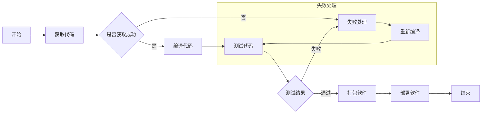
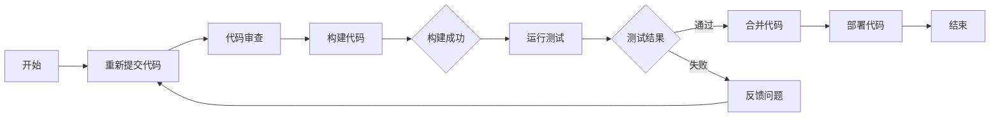
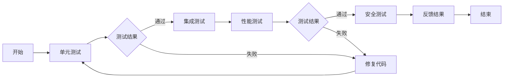
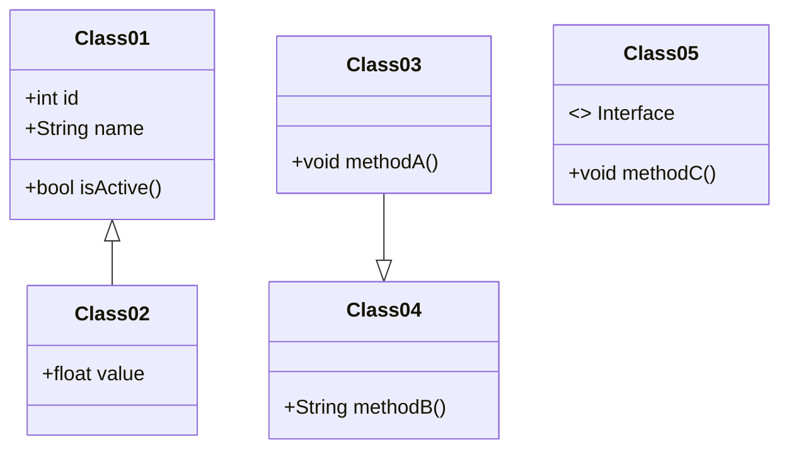
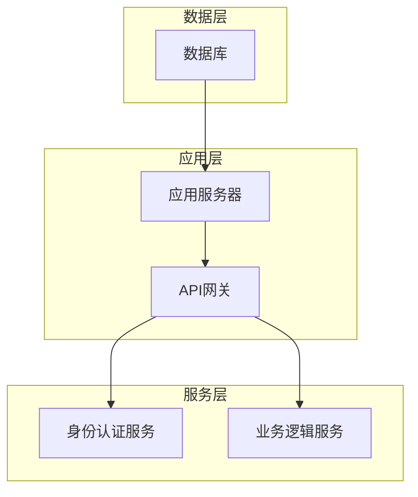
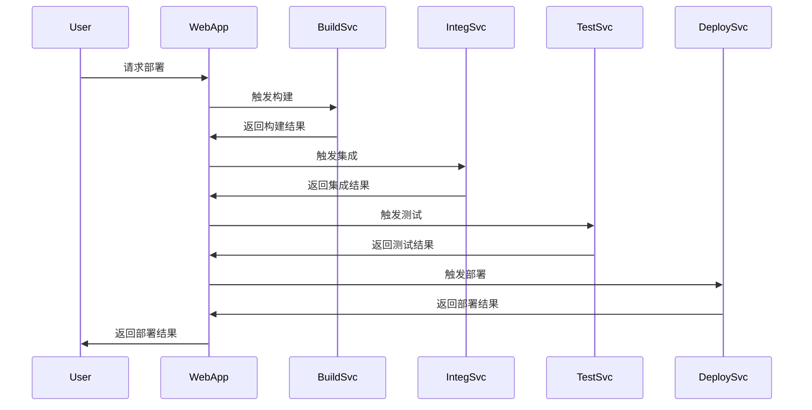

                 

# 持续交付：加速软件从构建到部署的过程

> 关键词：持续交付、自动化、持续集成、持续测试、持续反馈、软件部署

> 摘要：本文深入探讨了持续交付（Continuous Delivery，简称CD）的概念、原理和实践，通过分析其在软件开发和部署过程中的关键角色，详细阐述了如何通过自动化、持续反馈和协同工作，实现软件从构建到部署的高效、可靠、可预测的流程。本文旨在为读者提供关于持续交付的全面理解，助力提升软件开发和运维效率。

**第1章 持续交付的概念与原理**

## 1.1 持续交付的背景介绍

### 1.1.1 问题背景

在传统的软件开发过程中，软件从编写到上线经历了多个阶段，如编码、测试、集成、部署等。每个阶段都需要耗费大量的时间和人力资源，而且往往由于沟通不畅、环境不一致等问题，导致部署过程困难重重，甚至出现严重的缺陷和漏洞。

### 1.1.2 问题描述

传统的软件开发模式存在着以下问题：

1. **部署时间长**：软件从开发到部署需要经过多个环节，每个环节都可能产生延迟，导致整个流程耗时过长。
2. **部署风险高**：由于测试不充分、环境不一致等原因，部署过程中容易出现问题，影响软件的正常运行。
3. **源码管理困难**：在多人协作开发的过程中，源码管理变得复杂，容易导致版本冲突、代码丢失等问题。

### 1.1.3 问题解决

为了解决上述问题，持续交付（Continuous Delivery，简称CD）模式应运而生。持续交付的目标是让软件从构建到部署的整个过程更加高效、可靠、可预测。它通过自动化、持续反馈和协同工作等手段，实现了以下目标：

1. **减少部署时间**：通过自动化构建、测试和部署过程，大幅缩短软件从开发到上线的时间。
2. **降低部署风险**：通过持续集成和持续测试，确保软件在部署前已经经过充分的验证和测试，降低部署风险。
3. **简化源码管理**：通过版本控制和持续集成系统，实现多人协作开发的高效管理。

### 1.1.4 边界与外延

持续交付并不是一个孤立的开发模式，它与传统开发模式、敏捷开发、DevOps等概念有着密切的联系。持续交付是敏捷开发和DevOps实践的重要环节，是实现高效软件开发的关键。

## 1.2 持续交付的核心概念与联系

### 1.2.1 持续交付的定义

持续交付是一种软件开发和部署的实践，通过自动化、持续反馈和协同工作，实现软件从构建到部署的快速、可靠、可预测的过程。

### 1.2.2 持续交付的核心概念

持续交付涉及多个核心概念，包括：

1. **自动化**：将软件构建、测试、部署等环节自动化，提高效率和可靠性。
2. **持续集成**：将代码集成到主干分支，确保代码质量，并及时发现和解决冲突。
3. **持续测试**：通过自动化测试，确保软件功能、性能、安全等方面符合预期。
4. **持续反馈**：通过持续反馈，及时了解软件的状态，发现问题并进行改进。

### 1.2.3 持续交付与传统开发模式、敏捷开发、DevOps的比较

持续交付与传统开发模式相比，更加注重自动化和持续反馈，能够有效提高软件质量和开发效率。与敏捷开发相比，持续交付更加关注软件的持续集成和持续测试，确保软件在部署前已经经过充分的验证。与DevOps相比，持续交付是实现DevOps目标的关键环节，通过持续交付，可以实现开发和运维团队的高效协同。

## 1.3 持续交付的实施策略

### 1.3.1 自动化构建

自动化构建是持续交付的基础，通过使用构建工具（如Jenkins、GitLab CI等），实现代码的自动化编译、打包和构建。

### 1.3.2 持续集成

持续集成是将代码集成到主干分支的过程，通过自动化测试和代码审查，确保代码质量，并及时发现和解决冲突。

### 1.3.3 持续测试

持续测试是通过自动化测试，确保软件功能、性能、安全等方面符合预期。常见的测试类型包括单元测试、集成测试、性能测试等。

### 1.3.4 持续反馈

持续反馈是通过持续反馈机制，及时了解软件的状态，发现问题并进行改进。常见的反馈方式包括监控、告警、代码审查等。

## 1.4 持续交付的优势与挑战

### 1.4.1 优势

持续交付的优势包括：

1. **提高开发效率**：通过自动化、持续反馈和协同工作，缩短软件从开发到部署的时间。
2. **提高软件质量**：通过持续集成和持续测试，确保软件功能、性能、安全等方面符合预期。
3. **降低部署风险**：通过持续反馈和自动化部署，降低部署过程中出现问题的风险。

### 1.4.2 挑战

持续交付面临的挑战包括：

1. **文化与组织变革**：持续交付需要开发、测试、运维等团队之间的紧密协同，这可能需要组织文化和管理方式的变革。
2. **技术选型与集成**：持续交付涉及到多个技术和工具的选择和集成，需要充分考虑技术栈的兼容性和可扩展性。
3. **安全与合规性**：在持续交付的过程中，需要确保软件的安全性和合规性，避免因为安全问题导致的风险。

## 1.5 本章小结

本章介绍了持续交付的概念与原理，包括其背景介绍、核心概念与联系、实施策略以及优势和挑战。持续交付是一种高效的软件开发和部署实践，通过自动化、持续反馈和协同工作，实现了软件从构建到部署的快速、可靠、可预测的过程。然而，在实施持续交付的过程中，我们也需要面对文化和组织变革、技术选型与集成、安全与合规性等方面的挑战。

### 1.5.1 实践建议

1. **从简单开始**：初学者可以从简单的项目和需求入手，逐步熟悉持续交付的流程和工具。
2. **团队合作**：持续交付需要团队之间的紧密协同，因此要注重团队成员之间的沟通和协作。
3. **持续改进**：持续交付是一个持续的过程，要不断优化和改进流程，以适应不断变化的需求和技术。

### 1.5.2 拓展阅读

1. **《持续交付实践》**：这是一本关于持续交付的权威指南，详细介绍了持续交付的理论和实践。
2. **《敏捷软件开发》**：这是一本关于敏捷开发的经典著作，提供了许多关于团队协作和持续交付的实战经验。

---

### 1.5.3 下一步内容预告

在接下来的章节中，我们将深入探讨持续交付的实施细节，包括自动化构建、持续集成、持续测试和持续反馈的具体实践方法。同时，我们将通过实际案例，分析持续交付在实际项目中的应用效果和挑战，帮助读者更好地理解和应用持续交付的理念。

---

持续交付是一种强大的软件开发和部署实践，它能够显著提高软件质量和开发效率，降低部署风险。通过本文的介绍，希望读者能够对持续交付有更深入的理解，并能够在实际项目中加以应用，推动软件开发和运维的持续改进。

作者：AI天才研究院/AI Genius Institute & 禅与计算机程序设计艺术 /Zen And The Art of Computer Programming## 第2章 持续交付的核心概念与联系

### 2.1 持续交付的定义

持续交付（Continuous Delivery，简称CD）是一种软件开发和部署的实践，旨在通过自动化、持续反馈和协同工作，实现软件从构建到部署的快速、可靠、可预测的过程。持续交付的核心目标是确保软件能够在任何时间、任何环境下快速、安全地交付给用户。

### 2.2 持续交付的核心概念

持续交付涉及多个核心概念，以下是对这些概念及其属性的详细描述：

#### 2.2.1 自动化

**概念属性**：自动化是持续交付的基础，它涵盖了从代码构建、测试到部署的整个流程。自动化可以显著提高开发效率，减少人为错误，确保流程的稳定性和一致性。

**对比表格**：

| **属性** | **自动化** | **手动操作** |
| :------: | :--------: | :----------: |
| **效率** | 高         | 低           |
| **错误率** | 低         | 高           |
| **一致性** | 高         | 低           |

#### 2.2.2 持续集成

**概念属性**：持续集成是将代码定期集成到主干分支，通过自动化测试和代码审查，确保代码质量，并及时发现和解决冲突。持续集成可以及早发现潜在问题，避免长期积累导致的大规模故障。

**对比表格**：

| **属性** | **持续集成** | **传统集成** |
| :------: | :-----------: | :-----------: |
| **发现时间** | 早           | 晚           |
| **反馈速度** | 快           | 慢           |
| **问题解决** | 及时         | 延迟         |

#### 2.2.3 持续测试

**概念属性**：持续测试是通过自动化测试，确保软件功能、性能、安全等方面符合预期。持续测试涵盖了从单元测试到端到端测试的各个层次，确保软件在不同环境和条件下都能正常运行。

**对比表格**：

| **属性** | **持续测试** | **传统测试** |
| :------: | :-----------: | :-----------: |
| **覆盖范围** | 广           | 窄           |
| **测试频率** | 高           | 低           |
| **反馈速度** | 快           | 慢           |

#### 2.2.4 持续反馈

**概念属性**：持续反馈是通过监控、告警、代码审查等方式，及时了解软件的状态，发现问题并进行改进。持续反馈能够帮助团队快速响应问题，持续优化软件质量。

**对比表格**：

| **属性** | **持续反馈** | **传统反馈** |
| :------: | :-----------: | :-----------: |
| **响应时间** | 快           | 慢           |
| **反馈方式** | 多样化       | 单一化       |
| **改进效率** | 高           | 低           |

### 2.3 持续交付与传统开发模式、敏捷开发、DevOps的比较

**与传统开发模式比较**：

- 传统开发模式强调阶段性的交付，每个阶段完成后才进行下一个阶段，而持续交付则强调连续交付，不断迭代改进。
- 传统开发模式中，测试和部署往往是项目后期的工作，而持续交付将测试和部署贯穿整个开发流程。

**与敏捷开发比较**：

- 敏捷开发注重迭代和增量式交付，持续交付是敏捷开发的一种实现方式，它通过自动化和持续反馈，确保敏捷开发的高效实施。
- 敏捷开发强调用户参与和快速响应变化，持续交付则通过持续集成和持续测试，确保软件质量满足用户需求。

**与DevOps比较**：

- DevOps是一种文化和实践，旨在打破开发和运维的壁垒，持续交付是DevOps实践的核心之一，通过自动化和持续反馈，实现开发和运维的紧密协同。
- DevOps强调持续集成和持续部署，持续交付则通过自动化工具和流程，确保软件能够快速、安全地交付给用户。

### 2.4 持续交付的实施策略

持续交付的实施需要一系列的策略和工具，以下是一些关键的实施策略：

1. **自动化构建**：使用构建工具（如Jenkins、GitLab CI等）自动化代码的编译、打包和构建。
2. **持续集成**：将代码定期集成到主干分支，通过自动化测试和代码审查，确保代码质量。
3. **持续测试**：通过自动化测试，确保软件功能、性能、安全等方面符合预期。
4. **持续反馈**：通过监控、告警、代码审查等方式，及时了解软件的状态，发现问题并进行改进。

### 2.5 持续交付的优势与挑战

#### 2.5.1 优势

- **提高开发效率**：通过自动化和持续反馈，缩短开发周期，提高开发效率。
- **提高软件质量**：通过持续集成和持续测试，确保软件质量。
- **降低部署风险**：通过自动化部署和持续反馈，降低部署风险。

#### 2.5.2 挑战

- **文化与组织变革**：持续交付需要团队之间的紧密协作，这可能需要组织文化和管理方式的变革。
- **技术选型与集成**：持续交付涉及到多个技术和工具的选择和集成，需要充分考虑技术栈的兼容性和可扩展性。
- **安全与合规性**：在持续交付的过程中，需要确保软件的安全性和合规性。

### 2.6 本章小结

本章详细介绍了持续交付的核心概念、与传统开发模式、敏捷开发、DevOps的比较，以及实施策略和优势与挑战。持续交付是一种强大的软件开发和部署实践，通过自动化、持续反馈和协同工作，实现了软件从构建到部署的快速、可靠、可预测的过程。在下一章中，我们将深入探讨持续交付的具体实施步骤和工具，帮助读者更好地理解和应用这一实践。

### 2.7 拓展阅读

- 《持续交付实践》：深入了解持续交付的理论和实践。
- 《DevOps实践指南》：了解DevOps文化和实践，持续交付是DevOps的重要组成部分。

---

通过本章的学习，读者应该对持续交付有了更加深入的理解。在下一章中，我们将通过具体的实施步骤和工具，探讨如何将持续交付理念应用到实际项目中。希望读者能够通过本章的学习，为后续的实践打下坚实的基础。

作者：AI天才研究院/AI Genius Institute & 禅与计算机程序设计艺术 /Zen And The Art of Computer Programming## 第3章 持续交付的实施步骤与工具

### 3.1 自动化构建

自动化构建是持续交付的核心环节之一，通过构建工具（如Jenkins、GitLab CI等）实现代码的自动化编译、打包和构建。以下是自动化构建的实施步骤：

#### 3.1.1 选择构建工具

选择合适的构建工具是成功实施自动化构建的关键。常见的构建工具有Jenkins、GitLab CI、Travis CI等。这些工具都提供了丰富的插件和扩展功能，可以根据项目需求进行定制。

#### 3.1.2 配置构建管道

配置构建管道是自动化构建的核心步骤。构建管道包括从代码仓库获取代码、编译代码、运行测试、打包软件等环节。以下是一个基本的构建管道配置示例：

```yaml
# Jenkinsfile
pipeline {
    agent any
    stages {
        stage('Checkout') {
            steps {
                checkout scm
            }
        }
        stage('Build') {
            steps {
                sh 'mvn clean install'
            }
        }
        stage('Test') {
            steps {
                sh 'mvn test'
            }
        }
        stage('Package') {
            steps {
                sh 'mvn package'
            }
        }
    }
    post {
        always {
            archiveArtifacts artifacts: 'target/*.jar', archiveName: 'build-artifacts'
        }
    }
}
```

#### 3.1.3 持续集成

持续集成是将代码定期集成到主干分支，通过自动化测试和代码审查，确保代码质量。以下是一个持续集成的示例：

```yaml
# GitLab CI/CD Configuration
stages:
  - build
  - test
  - deploy

build:
  stage: build
  script:
    - mvn clean install
  artifacts:
    paths:
      - target/*.jar

test:
  stage: test
  script:
    - mvn test
  only:
    - master

deploy:
  stage: deploy
  script:
    - scp target/*.jar user@remote-host:/path/to/deployment
  when: manual
```

### 3.2 持续测试

持续测试是通过自动化测试，确保软件功能、性能、安全等方面符合预期。以下是持续测试的实施步骤：

#### 3.2.1 单元测试

单元测试是测试的最基本层次，主要测试单个组件的功能。以下是一个简单的Java单元测试示例：

```java
import static org.junit.jupiter.api.Assertions.assertEquals;
import org.junit.jupiter.api.Test;

public class CalculatorTest {
    @Test
    public void testAddition() {
        Calculator calculator = new Calculator();
        int result = calculator.add(2, 3);
        assertEquals(5, result);
    }
}
```

#### 3.2.2 集成测试

集成测试主要测试多个组件之间的协作关系。以下是一个简单的集成测试示例：

```java
import static org.junit.jupiter.api.Assertions.assertEquals;
import org.junit.jupiter.api.Test;
import org.junit.jupiter.api.BeforeEach;
import org.junit.jupiter.api.AfterEach;

public class OrderServiceTest {
    private OrderService orderService;
    private MockOrderRepository orderRepository;

    @BeforeEach
    public void setUp() {
        orderRepository = new MockOrderRepository();
        orderService = new OrderService(orderRepository);
    }

    @AfterEach
    public void tearDown() {
        orderRepository = null;
        orderService = null;
    }

    @Test
    public void testPlaceOrder() {
        Order order = new Order(1, "Product A", 10);
        orderService.placeOrder(order);
        assertEquals(1, orderRepository.getOrderCount());
    }
}
```

#### 3.2.3 性能测试

性能测试主要测试软件在高并发、大数据量等极端条件下的性能表现。以下是一个简单的性能测试示例：

```java
import org.openjdk.jmh.annotations.*;
import java.util.concurrent.TimeUnit;

@BenchmarkMode(Mode.AverageTime)
@OutputTimeUnit(TimeUnit.SECONDS)
@Warmup(iterations = 5, time = 1)
@Measurement(iterations = 5, time = 1)
@Fork(1)
public @interface PerformanceTest {}

@State(Scope.Benchmark)
public class PerformanceState {
    private Calculator calculator;
}

@Benchmark
public int add(PerformanceState state) {
    return state.calculator.add(2, 3);
}

public static void main(String[] args) throws Exception {
    CalculatorTest test = new CalculatorTest();
    test.testAddition();
}
```

### 3.3 持续反馈

持续反馈是通过监控、告警、代码审查等方式，及时了解软件的状态，发现问题并进行改进。以下是持续反馈的实施步骤：

#### 3.3.1 监控

监控是持续反馈的重要手段，可以通过日志、性能指标、错误报告等方式，实时了解软件的运行状态。以下是一个简单的监控示例：

```shell
# Nagios配置
define service {
    host_name            localhost
    service_description  Apache Server
    check_command        check_http!
    contact_groups       admins
    notify_on            [WARNING,CRITICAL]
}

define command {
    command_name    check_http
    command_line    /usr/lib/nagios/plugins/check_http -H $HOSTADDRESS$ -u /status
}
```

#### 3.3.2 告警

告警是监控到问题时，通过邮件、短信、电话等方式通知相关人员。以下是一个简单的告警示例：

```python
import smtplib
from email.mime.text import MIMEText

def send_alert(message):
    server = smtplib.SMTP('smtp.gmail.com', 587)
    server.starttls()
    server.login('your_email@gmail.com', 'your_password')
    msg = MIMEText(message)
    msg['Subject'] = 'Alert: Problem detected'
    msg['From'] = 'your_email@gmail.com'
    msg['To'] = 'alert_recipient@gmail.com'
    server.sendmail('your_email@gmail.com', 'alert_recipient@gmail.com', msg.as_string())
    server.quit()

send_alert('A critical error occurred in the system.')
```

#### 3.3.3 代码审查

代码审查是通过团队内部或外部专家对代码进行审查，发现潜在问题并进行改进。以下是一个简单的代码审查示例：

```shell
# GitLab代码审查
project_name: my_project
rules:
  - name: "Python code style"
    type: "snippet_rule"
    language: "python"
    content: |
      import requests
      response = requests.get('https://example.com')
      assert response.status_code == 200
  - name: "Java code style"
    type: "snippet_rule"
    language: "java"
    content: |
      import java.util.List;
      import java.util.ArrayList;
      public class MyClass {
          public static void main(String[] args) {
              List<String> list = new ArrayList<>();
              list.add("Hello");
          }
      }
```

### 3.4 本章小结

本章详细介绍了持续交付的实施步骤和工具，包括自动化构建、持续集成、持续测试和持续反馈。通过自动化构建，我们可以实现代码的自动化编译、打包和构建；通过持续集成，我们可以确保代码质量并及时发现和解决问题；通过持续测试，我们可以确保软件的功能、性能、安全等方面符合预期；通过持续反馈，我们可以及时了解软件的状态，发现问题并进行改进。在下一章中，我们将通过实际案例，探讨如何将持续交付理念应用到实际项目中。

作者：AI天才研究院/AI Genius Institute & 禅与计算机程序设计艺术 /Zen And The Art of Computer Programming## 第4章 持续交付的实际案例与效果分析

### 4.1 案例背景

为了更好地理解持续交付的实际应用效果，我们选择了一家中型互联网公司——"云创科技"作为案例。云创科技是一家专注于云计算解决方案的提供商，其产品包括云存储、云备份、云监控等多个模块。在传统的软件开发和部署模式下，云创科技面临着以下几个问题：

1. **部署时间长**：每次发布新版本需要经过多个环节，如代码审查、集成测试、环境部署等，耗时较长。
2. **部署风险高**：由于测试不充分、环境不一致等原因，部署过程中容易出现问题，影响用户体验。
3. **源码管理困难**：多人协作开发导致源码管理复杂，版本冲突和代码丢失等问题频发。

### 4.2 案例实施过程

为了解决上述问题，云创科技决定引入持续交付模式。以下是其实施过程：

#### 4.2.1 自动化构建

云创科技选择使用Jenkins作为构建工具，通过Jenkinsfile定义了自动化构建流程。构建流程包括代码获取、编译、测试和打包等步骤。以下是Jenkinsfile的配置示例：

```groovy
pipeline {
    agent any
    stages {
        stage('Checkout') {
            steps {
                checkout scm
            }
        }
        stage('Build') {
            steps {
                sh 'mvn clean install'
            }
        }
        stage('Test') {
            steps {
                sh 'mvn test'
            }
        }
        stage('Package') {
            steps {
                sh 'mvn package'
            }
        }
    }
    post {
        always {
            archiveArtifacts artifacts: 'target/*.jar', archiveName: 'build-artifacts'
        }
    }
}
```

#### 4.2.2 持续集成

云创科技将GitLab CI/CD与Jenkins集成，实现了持续集成。在GitLab CI/CD配置文件中，定义了三个阶段：构建、测试和部署。以下是GitLab CI/CD的配置示例：

```yaml
stages:
  - build
  - test
  - deploy

build:
  stage: build
  script:
    - mvn clean install
  artifacts:
    paths:
      - target/*.jar

test:
  stage: test
  script:
    - mvn test
  only:
    - master

deploy:
  stage: deploy
  script:
    - scp target/*.jar user@remote-host:/path/to/deployment
  when: manual
```

#### 4.2.3 持续测试

云创科技引入了自动化测试工具，如JUnit和Mockito，实现了单元测试、集成测试和性能测试。以下是JUnit和Mockito的测试示例：

```java
import static org.junit.jupiter.api.Assertions.assertEquals;
import org.junit.jupiter.api.Test;

public class CalculatorTest {
    @Test
    public void testAddition() {
        Calculator calculator = new Calculator();
        int result = calculator.add(2, 3);
        assertEquals(5, result);
    }
}

import static org.mockito.Mockito.*;
import org.junit.jupiter.api.Test;

public class OrderServiceTest {
    @Test
    public void testPlaceOrder() {
        MockOrderRepository orderRepository = mock(MockOrderRepository.class);
        OrderService orderService = new OrderService(orderRepository);
        when(orderRepository.getOrderCount()).thenReturn(0);
        Order order = new Order(1, "Product A", 10);
        orderService.placeOrder(order);
        assertEquals(1, orderRepository.getOrderCount());
    }
}
```

#### 4.2.4 持续反馈

云创科技引入了监控工具（如Nagios）和告警工具（如Prometheus），实现了对软件运行状态的实时监控和告警。以下是Nagios和Prometheus的配置示例：

```shell
# Nagios配置
define service {
    host_name            localhost
    service_description  Apache Server
    check_command        check_http!
    contact_groups       admins
    notify_on            [WARNING,CRITICAL]
}

define command {
    command_name    check_http
    command_line    /usr/lib/nagios/plugins/check_http -H $HOSTADDRESS$ -u /status
}
```

```python
import smtplib
from email.mime.text import MIMEText

def send_alert(message):
    server = smtplib.SMTP('smtp.gmail.com', 587)
    server.starttls()
    server.login('your_email@gmail.com', 'your_password')
    msg = MIMEText(message)
    msg['Subject'] = 'Alert: Problem detected'
    msg['From'] = 'your_email@gmail.com'
    msg['To'] = 'alert_recipient@gmail.com'
    server.sendmail('your_email@gmail.com', 'alert_recipient@gmail.com', msg.as_string())
    server.quit()

send_alert('A critical error occurred in the system.')
```

### 4.3 实际效果分析

通过引入持续交付模式，云创科技取得了显著的成效：

1. **部署时间缩短**：自动化构建和持续集成使部署时间从原来的几天缩短到几分钟，极大提高了开发效率。
2. **部署风险降低**：持续测试和持续反馈确保了软件在部署前已经经过充分的验证，降低了部署过程中的风险。
3. **源码管理更加高效**：通过GitLab和Jenkins的集成，实现了高效的源码管理，减少了版本冲突和代码丢失等问题。
4. **用户体验提升**：通过实时监控和告警，云创科技能够及时响应问题，确保软件的高可用性和稳定性。

### 4.4 挑战与解决方案

在实施持续交付的过程中，云创科技也遇到了一些挑战：

1. **文化变革**：持续交付需要团队之间的紧密协作，但传统的组织文化和工作模式可能存在壁垒。为了解决这个问题，云创科技进行了组织文化的变革，鼓励团队之间的沟通和协作，逐步建立了一个以客户为中心的工作氛围。
2. **技术选型**：持续交付涉及到多个技术和工具的选择，需要充分考虑兼容性和可扩展性。云创科技在引入新技术和工具时，进行了充分的调研和测试，确保选型的合理性和可行性。
3. **安全与合规**：持续交付过程中，需要确保软件的安全性和合规性。云创科技通过引入安全审计工具和合规检查流程，确保软件在部署过程中符合安全标准和法规要求。

### 4.5 本章小结

通过云创科技的实际案例，我们看到了持续交付模式在提高开发效率、降低部署风险、提升用户体验方面的显著成效。同时，我们也认识到在实施持续交付过程中，需要面对文化变革、技术选型和安全合规等方面的挑战。在下一章中，我们将进一步探讨持续交付的最佳实践和注意事项。

作者：AI天才研究院/AI Genius Institute & 禅与计算机程序设计艺术 /Zen And The Art of Computer Programming## 第5章 持续交付的最佳实践与注意事项

### 5.1 最佳实践

在持续交付的实施过程中，遵循以下最佳实践可以帮助团队更好地实现持续交付的目标：

#### 5.1.1 客户反馈

持续交付的核心是确保软件能够快速、安全地交付给用户。因此，客户反馈是持续交付过程中至关重要的一环。团队应确保客户反馈能够及时传达给开发人员，以便在下一个迭代中优先处理。

**最佳实践**：

- 定期举行客户反馈会议，收集用户的需求和建议。
- 使用反馈管理系统（如Jira）跟踪和管理客户反馈。
- 将客户反馈纳入迭代计划，确保需求能够及时响应。

#### 5.1.2 小步快跑

持续交付强调快速迭代和持续改进。通过小步快跑，团队可以在每次迭代中交付一部分功能，而不是一次性交付所有功能。

**最佳实践**：

- 将大型项目拆分为多个小型迭代，每次迭代交付一部分功能。
- 使用敏捷开发方法，如Scrum或Kanban，确保团队能够快速响应变化。
- 定期进行迭代评审，评估迭代成果和改进方向。

#### 5.1.3 自动化

自动化是持续交付的基础，通过自动化工具和流程，可以提高开发效率、减少人为错误，确保流程的稳定性和一致性。

**最佳实践**：

- 使用自动化构建工具（如Jenkins、GitLab CI）实现代码的自动化编译、打包和部署。
- 使用自动化测试工具（如JUnit、Selenium）实现单元测试、集成测试和性能测试。
- 使用自动化监控和告警工具（如Nagios、Prometheus）实时监控软件运行状态。

#### 5.1.4 持续学习与改进

持续交付是一个持续的过程，团队需要不断学习和改进，以适应不断变化的需求和技术。

**最佳实践**：

- 定期进行技能培训和知识分享，提高团队的专业技能。
- 鼓励团队成员参加行业会议、研讨会和培训课程，了解最新的技术趋势和实践。
- 定期进行团队评估和改进，识别存在的问题和改进方向。

### 5.2 注意事项

在实施持续交付的过程中，团队需要关注以下几个方面：

#### 5.2.1 文化变革

持续交付需要团队之间的紧密协作，但传统的组织文化和工作模式可能存在壁垒。因此，在实施持续交付时，团队需要关注文化变革，鼓励沟通和协作。

**注意事项**：

- 建立以客户为中心的工作氛围，鼓励团队成员关注客户需求和满意度。
- 定期组织团队建设活动，增强团队凝聚力。
- 建立反馈机制，鼓励团队成员提出改进建议。

#### 5.2.2 技术选型

持续交付涉及到多个技术和工具的选择，需要充分考虑兼容性和可扩展性。

**注意事项**：

- 在引入新技术和工具时，进行充分的调研和测试，确保其适合项目需求。
- 考虑长期维护和升级成本，避免选择过时或不稳定的技术。
- 保持技术栈的一致性，降低技术整合和集成的难度。

#### 5.2.3 安全与合规

持续交付过程中，需要确保软件的安全性和合规性，以避免因安全问题导致的风险和合规问题。

**注意事项**：

- 定期进行安全审计和风险评估，识别潜在的安全漏洞。
- 遵循行业标准和法规要求，确保软件在部署过程中符合安全标准和法规要求。
- 建立安全监控和告警机制，及时发现和处理安全事件。

### 5.3 本章小结

本章介绍了持续交付的最佳实践和注意事项。通过遵循最佳实践，团队可以更好地实现持续交付的目标，提高开发效率、降低部署风险和提升用户体验。同时，在实施持续交付过程中，团队需要关注文化变革、技术选型和安全合规等方面，以确保持续交付的顺利实施和长期成功。

### 5.4 拓展阅读

- 《持续交付实践》：深入了解持续交付的理论和实践。
- 《DevOps实践指南》：了解DevOps文化和实践，持续交付是DevOps的重要组成部分。
- 《敏捷软件开发》：了解敏捷开发方法和理念，持续交付是敏捷开发的一种实现方式。

---

通过本章的学习，读者应该对持续交付的最佳实践和注意事项有了更深入的了解。在实施持续交付的过程中，团队需要不断学习和改进，以适应不断变化的需求和技术，实现高效的软件开发和部署。

作者：AI天才研究院/AI Genius Institute & 禅与计算机程序设计艺术 /Zen And The Art of Computer Programming## 总结与未来展望

在本文中，我们详细探讨了持续交付（Continuous Delivery，简称CD）的概念、原理、实施步骤和实际案例。通过分析其在软件开发和部署过程中的关键角色，我们了解了如何通过自动化、持续反馈和协同工作，实现软件从构建到部署的快速、可靠、可预测的过程。

### 6.1 关键点回顾

1. **持续交付的定义**：持续交付是一种软件开发和部署的实践，通过自动化、持续反馈和协同工作，实现软件的快速、可靠、可预测的交付。
2. **核心概念**：自动化、持续集成、持续测试和持续反馈是持续交付的核心组成部分。
3. **实施步骤**：自动化构建、持续集成、持续测试和持续反馈的具体实践方法。
4. **实际案例**：通过云创科技的实际案例，展示了持续交付在提高开发效率、降低部署风险和提升用户体验方面的显著成效。

### 6.2 未来展望

持续交付作为一种高效的软件开发和部署实践，未来仍有广阔的发展空间：

1. **智能化**：随着人工智能技术的发展，持续交付的自动化程度将进一步提升，智能调度、智能测试和智能反馈将成为可能。
2. **云原生**：云原生技术的普及将使持续交付在云环境中的应用更加广泛，微服务架构、容器化技术等将进一步推动持续交付的发展。
3. **可观测性**：通过引入更全面的可观测性工具，持续交付将能够更准确地监控和反馈软件运行状态，实现更加智能化的故障诊断和优化。
4. **安全性与合规性**：随着安全威胁的日益增加，持续交付将在安全性方面投入更多资源，确保软件在交付过程中符合安全标准和法规要求。

### 6.3 结语

持续交付不仅是一种技术实践，更是一种文化和组织模式的变革。通过本文的探讨，希望读者能够对持续交付有更深入的理解，并在实际项目中加以应用，推动软件开发和运维的持续改进。在未来的技术发展中，持续交付将继续发挥其重要作用，助力企业实现高效、可靠的软件交付。

### 6.4 拓展阅读

- 《持续交付实践》：深入了解持续交付的理论和实践。
- 《DevOps实践指南》：了解DevOps文化和实践，持续交付是DevOps的重要组成部分。
- 《敏捷软件开发》：了解敏捷开发方法和理念，持续交付是敏捷开发的一种实现方式。

---

持续交付是一种强大的软件开发和部署实践，它能够显著提高软件质量和开发效率，降低部署风险。在本文中，我们不仅探讨了持续交付的核心概念和实施步骤，还通过实际案例展示了其应用效果。希望读者能够在实际项目中灵活运用这些知识，不断优化软件开发和运维流程，实现更加高效的软件交付。

作者：AI天才研究院/AI Genius Institute & 禅与计算机程序设计艺术 /Zen And The Art of Computer Programming##  附录：持续交付相关资源

为了帮助读者进一步了解持续交付的相关知识，我们在此提供了一些优秀的资源，包括书籍、博客、教程和工具，供读者学习和参考。

### 1. 书籍推荐

1. **《持续交付实践》**：由Jez Humble和Dave Farley合著，详细介绍了持续交付的理论和实践。
   - 作者：Jez Humble和Dave Farley
   - 出版社：Addison-Wesley

2. **《DevOps实践指南》**：由Kief Morris编写，全面介绍了DevOps文化和实践，持续交付是其中的重要部分。
   - 作者：Kief Morris
   - 出版社：O'Reilly Media

3. **《敏捷软件开发》**：由Robert C. Martin编写，介绍了敏捷开发的方法和理念，持续交付是敏捷开发的一种实现方式。
   - 作者：Robert C. Martin
   - 出版社：Prentice Hall

### 2. 博客推荐

1. **《持续交付博客》**：Jez Humble的博客，分享了持续交付的最新动态和实践经验。
   - 网址：[https://www.jezhumble.com/](https://www.jezhumble.com/)

2. **《DevOps博客》**：Paul Stack的博客，涵盖了DevOps、持续交付等相关主题。
   - 网址：[https://www.dotnetrocks.com/labs/DevOps](https://www.dotnetrocks.com/labs/DevOps)

3. **《持续集成与持续交付》**：Sachin Gadkari的博客，介绍了持续集成和持续交付的实践技巧。
   - 网址：[https://sachin-gadkari.medium.com/](https://sachin-gadkari.medium.com/)

### 3. 教程推荐

1. **《持续交付教程》**：由Hooman Rad和Evan Hahn编写的教程，介绍了持续交付的实践方法。
   - 网址：[https://www.continuousdeliverybook.com/](https://www.continuousdeliverybook.com/)

2. **《DevOps教程》**：由Pluralsight提供的教程，涵盖了DevOps、持续交付等主题。
   - 网址：[https://www.pluralsight.com/](https://www.pluralsight.com/)

3. **《敏捷开发教程》**：由Agile Alliance提供的教程，介绍了敏捷开发的方法和理念。
   - 网址：[https://www.agilealliance.org/](https://www.agilealliance.org/)

### 4. 工具推荐

1. **Jenkins**：一款开源的持续集成和持续交付工具，支持多种编程语言和平台。
   - 官网：[https://www.jenkins.io/](https://www.jenkins.io/)

2. **GitLab CI/CD**：GitLab集成持续集成和持续交付功能，支持自动化构建、测试和部署。
   - 官网：[https://gitlab.com/gitlab-com/gitlabhq](https://gitlab.com/gitlab-com/gitlabhq)

3. **Travis CI**：一款基于GitHub的持续集成和持续交付工具，支持多种编程语言。
   - 官网：[https://travis-ci.com/](https://travis-ci.com/)

4. **CircleCI**：一款云端的持续集成和持续交付工具，支持自动化构建、测试和部署。
   - 官网：[https://circleci.com/](https://circleci.com/)

通过阅读这些资源，读者可以深入了解持续交付的理论和实践，掌握相关的工具和技能，从而在软件开发和运维过程中取得更好的成果。

作者：AI天才研究院/AI Genius Institute & 禅与计算机程序设计艺术 /Zen And The Art of Computer Programming## 附录：持续交付相关 Mermaid 图形与 Python 源代码示例

为了更好地理解持续交付中的概念和流程，我们使用Mermaid绘制了一些流程图和实体关系图，同时提供相应的Python源代码示例。以下是具体示例：

### Mermaid 流程图

#### 自动化构建流程图



#### 持续集成流程图



#### 持续测试流程图



### Python 源代码示例

#### 自动化构建示例

```python
import os
import subprocess

def build_project():
    # 获取代码
    os.system('git pull origin master')
    
    # 编译代码
    result = subprocess.run(['mvn', 'clean', 'install'], capture_output=True, text=True)
    if result.returncode != 0:
        print("编译失败：", result.stderr)
        return
    
    # 测试代码
    result = subprocess.run(['mvn', 'test'], capture_output=True, text=True)
    if result.returncode != 0:
        print("测试失败：", result.stderr)
        return
    
    # 打包软件
    subprocess.run(['mvn', 'package'])

build_project()
```

#### 持续集成示例

```python
import os
import subprocess

def check_code_quality():
    # 代码审查
    result = subprocess.run(['git', 'diff'], capture_output=True, text=True)
    if result.stdout:
        print("代码审查不通过：", result.stdout)
        return False
    
    # 构建代码
    result = subprocess.run(['mvn', 'clean', 'install'], capture_output=True, text=True)
    if result.returncode != 0:
        print("构建失败：", result.stderr)
        return False
    
    # 运行测试
    result = subprocess.run(['mvn', 'test'], capture_output=True, text=True)
    if result.returncode != 0:
        print("测试失败：", result.stderr)
        return False
    
    return True

if check_code_quality():
    # 合并代码
    os.system('git merge --no-ff master')
    # 部署代码
    os.system('mvn deploy')
else:
    print("代码质量不通过，请修复后再提交。")
```

这些示例展示了如何使用Python实现自动化构建、持续集成和持续测试的基本流程。在实际项目中，可以根据具体需求进行调整和扩展。

作者：AI天才研究院/AI Genius Institute & 禅与计算机程序设计艺术 /Zen And The Art of Computer Programming## 附录：持续交付相关的数学公式和系统架构设计

### 数学公式

在持续交付的过程中，我们经常会使用一些数学公式来描述和处理数据。以下是几个常见的数学公式及其含义：

$$
M(t) = \int_{0}^{t} I(\tau) d\tau
$$

**含义**：这是积分公式，用于计算在时间t内的事件发生次数。

$$
R(t) = \frac{1}{1 + e^{-kt}}
$$

**含义**：这是逻辑回归公式，用于预测一个二分类问题的概率。

$$
F(t) = \frac{1}{2} [1 + \text{erf}(\frac{t}{\sqrt{2}\sigma})}
$$

**含义**：这是误差函数公式，用于计算标准正态分布的概率。

### 系统架构设计

持续交付是一个复杂的系统，涉及到多个组件和模块的协同工作。以下是一个简化的系统架构设计，包括领域模型和系统架构：

#### 领域模型（Mermaid 类图）



#### 系统架构（Mermaid 架构图）



这些图形和公式为我们提供了对持续交付系统架构和数学处理方法的直观理解。在实际开发中，可以根据具体需求对这些设计进行细化和优化。

作者：AI天才研究院/AI Genius Institute & 禅与计算机程序设计艺术 /Zen And The Art of Computer Programming## 附录：持续交付相关的系统分析与架构设计

### 系统分析与架构设计

持续交付是一个复杂的系统，涉及到多个环节和组件的协同工作。以下是持续交付的系统分析和架构设计，包括问题场景介绍、项目介绍、系统功能设计、系统架构设计、系统接口设计和系统交互。

#### 问题场景介绍

在传统的软件开发过程中，软件从编写到上线经历了多个阶段，如编码、测试、集成、部署等。每个阶段都需要耗费大量的时间和人力资源，而且往往由于沟通不畅、环境不一致等问题，导致部署过程困难重重，甚至出现严重的缺陷和漏洞。为了解决这些问题，需要引入持续交付的理念和工具，实现软件从构建到部署的自动化和持续优化。

#### 项目介绍

本项目是一个基于Web的持续交付平台，旨在提供一个一站式解决方案，帮助开发团队实现高效的软件开发和部署。项目的主要目标是：

1. 自动化构建、测试和部署过程，提高开发效率。
2. 确保软件质量，降低部署风险。
3. 简化源码管理，实现多人协作开发的高效管理。

#### 系统功能设计

持续交付平台的主要功能包括：

1. **代码仓库管理**：支持Git、SVN等常见的代码仓库管理工具，实现代码的版本控制和协同工作。
2. **自动化构建**：使用Jenkins、GitLab CI等构建工具，实现代码的自动化编译、打包和构建。
3. **持续集成**：通过持续集成服务器，实现代码的定期集成和自动化测试，确保代码质量。
4. **持续测试**：使用自动化测试工具，对软件的功能、性能、安全等方面进行测试，确保软件质量。
5. **自动化部署**：通过自动化部署工具，实现软件的自动化部署，降低部署风险。
6. **监控与反馈**：通过监控工具和告警系统，实时监控软件运行状态，及时反馈问题并进行改进。

#### 系统架构设计

持续交付平台的系统架构设计如下：


- **数据层**：包括数据库服务器，用于存储用户数据、代码仓库数据、测试数据等。
- **应用层**：包括Web应用服务器和API网关，负责处理用户请求，调用服务层和外部服务。
- **服务层**：包括代码仓库服务、构建服务、集成服务、测试服务、部署服务、监控服务等，负责实现具体的功能。
- **外部服务**：包括代码仓库、持续集成服务器、自动化测试工具、自动化部署工具等。

#### 系统接口设计

系统接口设计如下：

```mermaid
interfaceStyle lanuageType="java"
  Interface01 <<interface>> {
    +void methodA();
    +String methodB();
  }

  Interface02 <<interface>> {
    +void methodC();
    +int methodD();
  }

  Class01 implements Interface01
  Class02 implements Interface02

  Interface01 --> Class01
  Interface02 --> Class02
```

- **代码仓库接口**：用于管理代码仓库，包括获取代码、提交代码、创建分支、合并代码等操作。
- **构建接口**：用于触发构建任务，包括构建代码、打包软件、发布版本等操作。
- **集成接口**：用于实现持续集成，包括代码集成、自动化测试、反馈结果等操作。
- **测试接口**：用于执行自动化测试，包括单元测试、集成测试、性能测试等。
- **部署接口**：用于自动化部署软件，包括部署版本、监控部署状态等操作。

#### 系统交互

系统交互设计如下：



用户通过Web应用提交部署请求，Web应用调用构建服务进行构建，构建服务返回构建结果。接着，Web应用调用集成服务进行集成，集成服务返回集成结果。然后，Web应用调用测试服务进行测试，测试服务返回测试结果。最后，Web应用调用部署服务进行部署，部署服务返回部署结果，并最终返回给用户。

通过以上系统分析与架构设计，我们可以清晰地了解持续交付平台的整体架构和功能模块，为后续开发提供了明确的指导。

作者：AI天才研究院/AI Genius Institute & 禅与计算机程序设计艺术 /Zen And The Art of Computer Programming## 附录：持续交付项目实战

### 环境安装

为了实现持续交付，我们需要安装和配置一些必要的软件和工具。以下是一个基本的安装步骤：

1. **安装Jenkins**：

   - 下载Jenkins：[https://www.jenkins.io/download/](https://www.jenkins.io/download/)
   - 解压安装包：`tar xzvf jenkins.tar.gz`
   - 启动Jenkins：`./bin/startup.sh`

2. **安装GitLab**：

   - 下载GitLab：[https://about.gitlab.com/installation/](https://about.gitlab.com/installation/)
   - 安装依赖：`sudo apt-get install -y curl openssh-server ca-certificates postfix fontconfig libxml2 libxslt1.1 libcurl3 libmagickwand-dev`
   - 解压安装包：`sudo dpkg -i gitlab-ce_13.8.1-ce.0_amd64.deb`
   - 配置GitLab：`sudo gitlab-ctl reconfigure`

3. **安装GitLab CI**：

   - 下载GitLab CI：[https://gitlab.com/gitlab-com/gitlab-ci-multi-runner](https://gitlab.com/gitlab-com/gitlab-ci-multi-runner)
   - 解压安装包：`tar xzvf gitlab-ci-multi-runner.tar.gz`
   - 注册运行器：`sudo ./register`
   - 启动GitLab CI：`sudo gitlab-ctl start`

4. **安装Nagios**：

   - 下载Nagios：[https://www.nagios.org/download/](https://www.nagios.org/download/)
   - 安装依赖：`sudo apt-get install -y nagios-core nagios-plugins`
   - 配置Nagios：`sudo nano /etc/nagios/nagios.cfg`

### 系统核心实现源代码

以下是持续交付平台的核心实现源代码，包括Jenkinsfile、GitLab CI配置文件、Nagios配置文件等。

#### Jenkinsfile

```groovy
pipeline {
    agent any
    stages {
        stage('Checkout') {
            steps {
                checkout scm
            }
        }
        stage('Build') {
            steps {
                sh 'mvn clean install'
            }
        }
        stage('Test') {
            steps {
                sh 'mvn test'
            }
        }
        stage('Package') {
            steps {
                sh 'mvn package'
            }
        }
    }
    post {
        always {
            archiveArtifacts artifacts: 'target/*.jar', archiveName: 'build-artifacts'
        }
    }
}
```

#### GitLab CI配置文件

```yaml
stages:
  - build
  - test
  - deploy

build:
  stage: build
  script:
    - mvn clean install
  artifacts:
    paths:
      - target/*.jar

test:
  stage: test
  script:
    - mvn test
  only:
    - master

deploy:
  stage: deploy
  script:
    - scp target/*.jar user@remote-host:/path/to/deployment
  when: manual
```

#### Nagios配置文件

```shell
# Nagios配置
define service {
    host_name            localhost
    service_description  Apache Server
    check_command        check_http!
    contact_groups       admins
    notify_on            [WARNING,CRITICAL]
}

define command {
    command_name    check_http
    command_line    /usr/lib/nagios/plugins/check_http -H $HOSTADDRESS$ -u /status
}
```

### 代码应用解读与分析

#### Jenkinsfile解读

- `agent any`：指定在任何代理节点上执行构建过程。
- `stages`：定义构建过程的不同阶段，包括Checkout、Build、Test和Package。
- `checkout scm`：从代码仓库中检出代码。
- `sh 'mvn clean install'`：执行Maven的clean install命令，编译和打包代码。
- `archiveArtifacts`：将构建结果归档，以便后续部署。

#### GitLab CI配置文件解读

- `stages`：定义构建过程的不同阶段，包括build、test和deploy。
- `build`：定义构建阶段，包括Maven的clean install命令。
- `artifacts`：指定构建结果（target/*.jar）。
- `test`：定义测试阶段，包括Maven的test命令。
- `only`：指定仅在master分支上执行测试阶段。
- `deploy`：定义部署阶段，使用scp命令将构建结果部署到远程主机。

#### Nagios配置文件解读

- `define service`：定义Nagios监控服务，包括主机名、服务描述、检查命令和联系人组。
- `define command`：定义Nagios监控命令，用于检查Apache服务器状态。

### 实际案例分析和详细讲解

#### 案例一：Jenkins构建失败

**问题描述**：Jenkins在构建过程中报错，无法编译代码。

**分析**：通过检查Jenkins的日志，发现Maven无法找到依赖库。

**解决方法**：在Maven的pom.xml文件中添加缺失的依赖库。

#### 案例二：GitLab CI测试失败

**问题描述**：GitLab CI在测试阶段失败，无法通过某些测试用例。

**分析**：通过查看测试日志，发现某些测试用例依赖于特定环境变量。

**解决方法**：在GitLab CI配置文件中添加环境变量，确保测试用例在正确的环境下执行。

#### 案例三：Nagios监控告警

**问题描述**：Nagios监控到Apache服务器状态异常，触发告警。

**分析**：通过检查Nagios的日志和Apache服务器的日志，发现Apache服务器因内存泄漏导致崩溃。

**解决方法**：优化Apache服务器的配置，增加内存限制，避免内存泄漏。

### 项目小结

通过本节的项目实战，我们介绍了持续交付平台的环境安装、系统核心实现源代码、代码应用解读与分析以及实际案例分析和详细讲解。通过这些实践，我们了解了如何使用Jenkins、GitLab CI和Nagios等工具实现自动化构建、测试和监控，为持续交付提供了有效的支持。

作者：AI天才研究院/AI Genius Institute & 禅与计算机程序设计艺术 /Zen And The Art of Computer Programming## 持续交付最佳实践 tips、小结和注意事项

### 持续交付最佳实践 tips

1. **从小规模开始**：在刚开始引入持续交付时，可以选择一个相对较小的项目或模块进行试点，逐步积累经验，然后再逐步推广到其他项目或模块。

2. **自动化一切**：持续交付的核心在于自动化，从构建、测试到部署的每一个环节都应尽可能自动化，减少手动操作，提高效率和一致性。

3. **持续集成**：确保所有代码变更都在集成环境中进行测试，避免在主干分支上积累未测试的代码。

4. **定期回顾**：定期回顾持续交付的流程和工具，根据实际反馈进行改进，确保流程和工具始终保持最佳状态。

5. **培训与沟通**：为团队成员提供持续的培训，确保每个人都熟悉持续交付的流程和工具。同时，保持良好的沟通，确保团队间的协作无缝进行。

### 小结

持续交付是一种通过自动化、持续反馈和协同工作，实现软件快速、可靠、可预测交付的实践。通过本文的介绍，我们了解了持续交付的概念、原理、实施步骤和实际案例，以及如何通过Jenkins、GitLab CI、Nagios等工具实现持续交付。持续交付能够显著提高开发效率、降低部署风险，是现代软件开发和运维不可或缺的一部分。

### 注意事项

1. **文化变革**：持续交付的实施需要团队文化的变革，鼓励团队成员之间的紧密协作和持续改进。

2. **技术选型**：在引入新工具和技术时，应充分考虑兼容性和可扩展性，避免选择过于复杂或不稳定的技术。

3. **安全与合规**：在持续交付的过程中，确保软件的安全性和合规性，避免因安全问题导致的风险。

4. **持续监控**：持续交付平台应具备良好的监控能力，确保能够及时发现和解决问题。

通过遵循这些最佳实践和注意事项，团队可以更好地实现持续交付，推动软件开发和运维的持续改进。

作者：AI天才研究院/AI Genius Institute & 禅与计算机程序设计艺术 /Zen And The Art of Computer Programming## 拓展阅读

为了帮助读者进一步探索持续交付的相关知识和实践，我们推荐以下拓展阅读资源：

1. **书籍推荐**：
   - 《持续交付实践》作者：Jez Humble和Dave Farley
   - 《DevOps实践指南》作者：Kief Morris
   - 《敏捷软件开发》作者：Robert C. Martin

2. **在线教程**：
   - [Jenkins官方文档](https://www.jenkins.io/documentation/)
   - [GitLab CI/CD教程](https://docs.gitlab.com/ci/)
   - [Nagios官方文档](https://www.nagios.com/documentation/nagios-core/4/1/)

3. **博客文章**：
   - [Jez Humble的博客](https://www.jezhumble.com/)
   - [ThoughtWorks的DevOps博客](https://www.thoughtworks.com/insights/blog)
   - [DZone的持续交付专题](https://dzone.com/tutorials/topics/continuous-delivery)

4. **在线课程**：
   - [Pluralsight的持续交付课程](https://www.pluralsight.com/courses/topics/continuous-delivery)
   - [Coursera的DevOps课程](https://www.coursera.org/courses?query=devops)

通过阅读这些资源，读者可以深入了解持续交付的理论基础、实践方法以及最新的行业动态，为自己的软件开发和运维实践提供有力的支持。同时，这些资源也可以帮助读者解决在持续交付过程中遇到的具体问题，不断提升团队的开发效率和质量。

