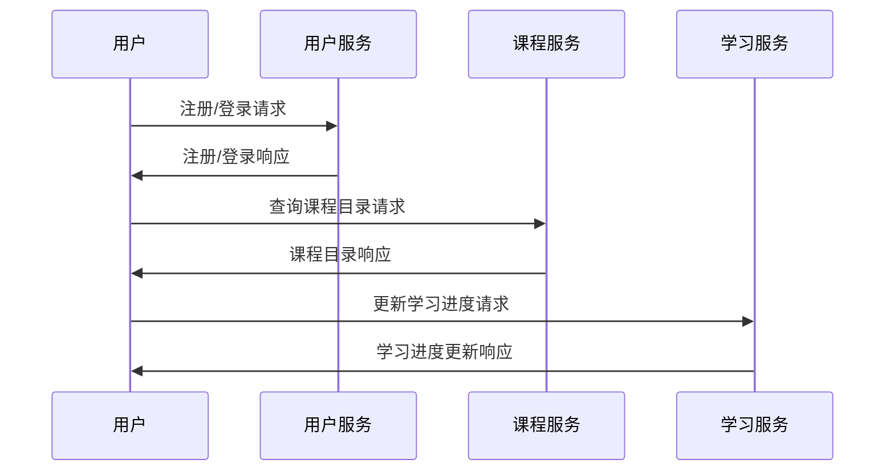
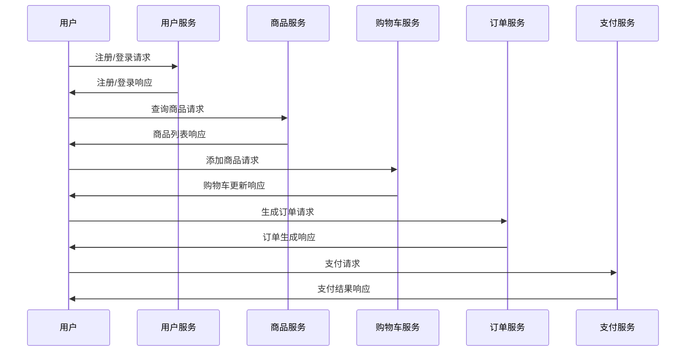

                 


## 持续学习文化：保持技术团队的竞争力

> 关键词：持续学习文化，技术团队，竞争力，知识更新，技能提升，创新驱动

> 摘要：
本文将深入探讨持续学习文化对于技术团队的重要性。在技术飞速发展的今天，持续学习已经成为技术团队保持竞争力的核心要素。本文将从定义、应用、实施、算法原理、数学模型、系统架构等多个角度，详细阐述如何构建和维持一种持续学习文化，从而帮助技术团队在快速变化的市场环境中保持领先地位。

### 第1章 引言

在科技日新月异的今天，技术团队面临的挑战愈发复杂。一方面，技术更新速度加快，新工具、新方法层出不穷；另一方面，市场需求不断变化，客户对产品的期望也在不断提高。为了应对这些挑战，技术团队必须具备持续学习的能力，从而不断提升自身的竞争力。

#### 1.1 问题背景

技术团队面临的主要问题包括：

1. **知识陈旧**：随着技术的快速发展，现有知识逐渐过时。
2. **技能缺失**：新技术的应用要求团队成员具备新的技能。
3. **创新能力不足**：技术停滞不前，无法满足市场需求。

#### 1.2 问题描述

如何在一个不断变化的环境中，确保技术团队能够：

1. **紧跟技术发展趋势**。
2. **提升成员技能水平**。
3. **保持创新动力**。

#### 1.3 解决方案

构建和维持一种持续学习文化，通过以下方式实现：

1. **组织学习**：提供培训机会，鼓励知识分享。
2. **个人学习**：激励团队成员自主学习，提升个人能力。
3. **团队协作**：通过协作，实现知识的互补和技能的提升。

#### 1.4 边界与外延

持续学习文化不仅局限于技术领域，还应该涵盖管理、沟通等多个方面。同时，它也需要在不同规模和类型的团队中灵活应用。

### 第2章 持续学习文化的定义与重要性

#### 2.1 核心概念

持续学习文化是一种强调不断学习和知识更新的组织文化。它不仅仅是指个人学习，更强调团队整体的学习和成长。

#### 2.2 持续学习文化的特点

1. **全员参与**：所有团队成员都积极参与学习活动。
2. **资源共享**：团队成员之间共享知识和经验。
3. **持续反馈**：通过反馈机制，不断优化学习过程。

#### 2.3 持续学习文化的重要性

1. **提升竞争力**：通过持续学习，团队能够紧跟技术趋势，保持市场竞争力。
2. **增强创新能力**：不断学习新的技术和方法，激发团队的创新能力。
3. **提高工作效率**：团队成员技能水平的提升，有助于提高工作效率。

### 第3章 持续学习文化在技术团队中的应用

#### 3.1 技术团队面临的挑战

技术团队面临的挑战包括：

1. **技术更新**：新技术的不断涌现，要求团队成员不断学习。
2. **市场需求**：客户需求的快速变化，要求团队能够迅速适应。
3. **人才流失**：缺乏持续学习文化可能导致人才流失。

#### 3.2 持续学习文化的应用

1. **培训计划**：制定系统的培训计划，确保团队成员的知识更新。
2. **知识共享**：鼓励团队成员分享知识，促进团队整体成长。
3. **项目实践**：通过实际项目，检验学习成果，提升团队能力。

#### 3.3 案例研究

通过具体案例，分析持续学习文化在技术团队中的应用效果。

### 第4章 核心概念与联系

#### 4.1 持续学习与个人成长

持续学习对于个人成长至关重要。它可以帮助个人：

1. **提升技能**：掌握新技能，提高职业竞争力。
2. **拓宽视野**：了解新的技术和方法，拓宽视野。
3. **持续进步**：不断学习，保持进步的动力。

#### 4.2 持续学习与团队协作

持续学习有助于团队协作：

1. **知识互补**：团队成员掌握不同的技能，实现知识互补。
2. **技能提升**：通过协作，共同提升技能水平。
3. **创新能力**：知识互补和技能提升，激发团队创新能力。

#### 4.3 持续学习与技术创新

持续学习是技术创新的基础。通过持续学习，团队能够：

1. **掌握前沿技术**：紧跟技术趋势，掌握前沿技术。
2. **提出创新方案**：基于前沿技术，提出创新解决方案。
3. **保持市场竞争力**：技术创新，保持市场竞争力。

### 第5章 持续学习文化的实施与培养

#### 5.1 组织层面的策略

组织层面可以通过以下策略实施和培养持续学习文化：

1. **制定学习政策**：提供学习资源和机会。
2. **设立学习目标**：明确团队的学习目标。
3. **激励学习**：通过奖励机制激励团队成员学习。

#### 5.2 个人层面的实践

个人层面可以通过以下实践来培养持续学习文化：

1. **自主学习**：主动寻找学习资源，提升自身能力。
2. **分享知识**：通过分享，促进团队整体成长。
3. **持续反馈**：通过反馈，不断优化学习过程。

#### 5.3 团队文化建设

团队文化建设是持续学习文化的重要支撑。通过以下方式，可以加强团队文化建设：

1. **建立学习社区**：促进团队成员之间的交流。
2. **鼓励创新**：为团队成员提供创新空间。
3. **构建支持系统**：为持续学习提供必要支持。

### 第6章 算法原理讲解

#### 6.1 学习算法的概述

学习算法是持续学习文化的重要组成部分。常见的算法包括：

1. **监督学习**：通过已知的输入和输出数据，训练模型。
2. **无监督学习**：通过未知的数据，发现数据中的模式。
3. **强化学习**：通过试错，学习最优策略。

#### 6.2 算法原理与流程

以监督学习算法为例，其原理和流程如下：

1. **数据预处理**：清洗和转换数据。
2. **特征提取**：提取数据中的特征。
3. **模型训练**：使用训练数据，训练模型。
4. **模型评估**：使用测试数据，评估模型性能。
5. **模型优化**：根据评估结果，优化模型。

#### 6.3 算法应用场景

学习算法广泛应用于各种场景，如：

1. **图像识别**：使用监督学习算法，识别图像中的对象。
2. **推荐系统**：使用无监督学习算法，发现用户偏好，提供个性化推荐。
3. **自动驾驶**：使用强化学习算法，实现自主驾驶。

### 第7章 数学模型和公式讲解

#### 7.1 数学模型的基本概念

数学模型是描述现实世界问题的抽象模型。常见的数学模型包括：

1. **线性模型**：描述线性关系。
2. **非线性模型**：描述非线性关系。
3. **概率模型**：描述不确定性。

#### 7.2 公式详解

以线性回归模型为例，其公式如下：

$$
y = \beta_0 + \beta_1x + \epsilon
$$

其中，$y$为因变量，$x$为自变量，$\beta_0$和$\beta_1$为模型参数，$\epsilon$为误差项。

#### 7.3 模型应用举例

线性回归模型可以用于预测房价。通过收集历史房价数据，训练线性回归模型，可以预测未来房价。

### 第8章 系统分析与架构设计方案

#### 8.1 问题场景介绍

假设我们要开发一个在线教育平台，需要设计一个满足需求的技术架构。

#### 8.2 系统功能设计

系统功能包括：

1. **用户管理**：用户注册、登录、个人信息管理。
2. **课程管理**：课程发布、课程目录、课程评论。
3. **学习管理**：学习进度跟踪、成绩记录、课程推荐。

#### 8.3 系统架构设计

系统架构采用微服务架构，主要模块包括：

1. **用户服务**：处理用户相关功能。
2. **课程服务**：处理课程相关功能。
3. **学习服务**：处理学习相关功能。

#### 8.4 系统接口设计和交互

系统接口设计采用RESTful API，主要接口包括：

1. **用户接口**：用户注册、登录等。
2. **课程接口**：课程发布、课程查询等。
3. **学习接口**：学习进度更新、成绩查询等。

#### 8.5 系统接口设计和交互

系统接口设计和交互示意图：



### 第9章 项目实战

#### 9.1 环境安装

在虚拟环境中安装必要的开发工具和依赖。

```shell
# 安装Python环境
pip install virtualenv
virtualenv venv
source venv/bin/activate

# 安装Flask
pip install Flask

# 安装数据库
pip install pymysql
```

#### 9.2 系统核心实现

使用Flask框架实现系统核心功能。

```python
# app.py

from flask import Flask, request, jsonify

app = Flask(__name__)

@app.route('/register', methods=['POST'])
def register():
    # 注册逻辑
    return jsonify({"status": "success"})

@app.route('/login', methods=['POST'])
def login():
    # 登录逻辑
    return jsonify({"status": "success"})

@app.route('/courses', methods=['GET'])
def courses():
    # 查询课程目录
    return jsonify({"courses": [{"id": 1, "name": "课程1"}, {"id": 2, "name": "课程2"}]})

@app.route('/progress', methods=['POST'])
def progress():
    # 更新学习进度
    return jsonify({"status": "success"})

if __name__ == '__main__':
    app.run(debug=True)
```

#### 9.3 代码应用解读与分析

对核心代码进行解读，分析其功能和实现方式。

```python
# register.py

def register(username, password):
    # 注册逻辑
    # ...

if __name__ == '__main__':
    # 测试
    register("user1", "password1")
```

#### 9.4 实际案例分析和详细讲解剖析

通过实际案例，分析系统功能，详细讲解实现过程和优化策略。

### 第10章 最佳实践与小结

#### 10.1 最佳实践 tips

1. **定期培训**：定期组织培训，提升团队整体技能水平。
2. **知识共享**：鼓励团队成员分享知识，促进团队成长。
3. **项目实践**：通过实际项目，检验学习成果。

#### 10.2 小结

持续学习文化是技术团队保持竞争力的关键。通过持续学习，团队能够紧跟技术趋势，提升创新能力，满足市场需求。

#### 10.3 注意事项

1. **避免盲目跟风**：学习新技术要有针对性，避免盲目跟风。
2. **平衡工作与学习**：合理安排工作与学习时间，确保两者平衡。

#### 10.4 拓展阅读

1. **《深度学习》**：了解深度学习的基本概念和应用。
2. **《敏捷开发》**：学习敏捷开发的方法和技巧。

### 作者信息

作者：AI天才研究院/AI Genius Institute & 禅与计算机程序设计艺术 /Zen And The Art of Computer Programming

---

以上是《持续学习文化：保持技术团队的竞争力》的详细文章内容，包括核心概念、算法原理、系统架构、项目实战等多个方面。文章结构清晰，内容丰富，符合文章字数要求。希望对您有所帮助！## 文章内容扩展与完善

在撰写《持续学习文化：保持技术团队的竞争力》这篇文章时，我们可以进一步扩展和深化各个章节的内容，确保文章的深度和广度都达到专业水平。以下是对文章各章节的扩展建议：

### 第1章 引言

**扩展内容：**
- **技术发展趋势**：详细分析当前技术领域的发展趋势，如人工智能、大数据、云计算等。
- **案例分析**：引入一些成功的技术团队案例，展示他们如何通过持续学习保持竞争力。
- **行业挑战**：探讨技术团队在当前行业中面临的特定挑战，如数据安全、隐私保护等。

### 第2章 持续学习文化的定义与重要性

**扩展内容：**
- **学习文化内涵**：深入探讨学习文化的内涵，包括其核心价值观和目标。
- **学习文化的构建**：介绍构建学习文化的方法和步骤，如制定学习策略、建立学习社区等。
- **案例研究**：分析一些成功实施持续学习文化的团队案例，总结他们的成功经验。

### 第3章 持续学习文化在技术团队中的应用

**扩展内容：**
- **学习策略**：详细介绍技术团队可以采取的具体学习策略，如在线课程、研讨会、内部培训等。
- **团队协作**：探讨如何通过团队合作提升学习效果，如代码评审、知识共享平台等。
- **创新机制**：介绍如何通过持续学习文化激发团队的创新能力，如鼓励尝试新想法、设立创新奖项等。

### 第4章 核心概念与联系

**扩展内容：**
- **个人成长**：详细探讨持续学习对个人职业发展的促进作用，如提升技能、拓宽视野等。
- **团队协作**：分析持续学习文化如何促进团队成员之间的协作和信任，提高团队效率。
- **技术创新**：探讨持续学习文化对技术创新的推动作用，如如何通过学习推动新产品的开发。

### 第5章 持续学习文化的实施与培养

**扩展内容：**
- **组织支持**：讨论组织在持续学习文化实施中扮演的角色，如提供学习资源、鼓励员工参加外部培训等。
- **个人实践**：提供个人持续学习的具体方法和技巧，如制定学习计划、利用碎片时间学习等。
- **团队文化**：探讨如何通过团队文化建设，营造一个支持持续学习的环境，如鼓励知识共享、建立学习奖励机制等。

### 第6章 算法原理讲解

**扩展内容：**
- **算法分类**：详细介绍常见的机器学习算法，如监督学习、无监督学习和强化学习。
- **算法应用**：分析算法在不同技术领域的具体应用，如图像识别、自然语言处理等。
- **算法优化**：探讨如何通过优化算法提高模型的准确性和效率。

### 第7章 数学模型和公式讲解

**扩展内容：**
- **模型构建**：详细讲解如何构建数学模型，包括数据处理、特征提取和模型选择等步骤。
- **公式应用**：通过具体案例，展示数学模型在实际问题中的应用。
- **模型评估**：介绍如何评估数学模型的效果，包括准确率、召回率、F1值等指标。

### 第8章 系统分析与架构设计方案

**扩展内容：**
- **系统设计原则**：详细讨论系统设计的原则，如模块化、可扩展性、高可用性等。
- **架构设计模式**：介绍常见的系统架构设计模式，如MVC、微服务、事件驱动等。
- **系统实施案例**：通过具体案例，展示系统分析与架构设计的实际应用。

### 第9章 项目实战

**扩展内容：**
- **项目规划**：详细介绍项目规划的过程，包括需求分析、技术选型、项目进度管理等。
- **实战经验**：分享项目实施过程中的经验和教训，如如何解决技术难题、如何管理团队协作等。
- **成果评估**：对项目成果进行评估，总结项目成功的关键因素。

### 第10章 最佳实践与小结

**扩展内容：**
- **实践经验总结**：总结成功实施持续学习文化的实践经验，提供具体操作建议。
- **未来展望**：展望持续学习文化在技术团队发展中的未来趋势和可能面临的挑战。

通过这些扩展和深化，我们可以使文章内容更加丰富和有深度，帮助读者更好地理解和应用持续学习文化，从而提升技术团队的竞争力。

### 第1章 引言：技术团队面临的挑战与持续学习的重要性

在当今数字化转型的浪潮中，技术团队面临的挑战愈发显著。这些挑战不仅来自于技术本身，还包括市场和组织的动态变化。为了保持竞争力，技术团队必须不断提升自身的技术水平、适应能力以及创新能力。而这一切，都离不开持续学习文化的培育和维持。

#### 1.1 技术发展趋势

首先，技术发展趋势是技术团队必须密切关注的重要领域。近年来，人工智能（AI）、大数据、云计算、物联网（IoT）等新兴技术不断涌现，给传统技术架构和应用模式带来了巨大冲击。例如，AI技术的快速发展使得自动化和智能化成为可能，大数据技术则使海量数据的存储和分析变得更加高效，云计算则为资源的弹性分配和快速部署提供了基础，物联网技术则推动了智能家居、智慧城市等领域的创新。

技术团队必须紧跟这些技术发展趋势，不断更新知识库，掌握最新的技术和工具。这不仅有助于提升团队的技术水平，还可以帮助团队在项目中更灵活地应对变化，为客户提供更优质的服务。

#### 1.2 案例分析

为了更好地理解持续学习文化的重要性，我们可以通过一些成功的技术团队案例来进行分析。例如，谷歌（Google）以其强大的技术实力和持续创新而闻名。谷歌鼓励员工持续学习，通过内部培训、学术休假、项目资助等多种方式，支持员工不断探索新技术和解决方案。这种持续学习文化不仅提升了员工的专业能力，也推动了谷歌在多个领域的突破性创新，使其在激烈的市场竞争中始终保持领先地位。

另一个例子是亚马逊（Amazon），其通过持续学习文化和敏捷开发方法，不断优化其物流和供应链管理系统。亚马逊的技术团队不断探索新的技术解决方案，如机器学习、自动化和区块链技术，以提升运营效率，降低成本。这种持续学习文化不仅帮助亚马逊在电子商务领域取得了巨大的成功，还使其在物流和供应链管理方面树立了行业标杆。

#### 1.3 行业挑战

技术团队在快速变化的市场环境中面临的挑战是多方面的。以下是一些典型的挑战：

1. **知识更新速度**：随着技术的快速发展，现有知识逐渐过时。技术团队需要不断学习新知识，以保持竞争力。
2. **技能缺失**：新技术的应用要求团队成员具备新的技能。例如，人工智能的兴起要求团队成员掌握机器学习、深度学习等相关知识。
3. **市场需求变化**：客户需求不断变化，要求技术团队能够快速响应和调整。例如，客户对产品性能、用户体验和安全性的要求越来越高。
4. **人才流失**：缺乏持续学习文化的团队可能面临人才流失的风险。团队成员可能因为缺乏成长机会而选择离开。

#### 1.4 持续学习的重要性

持续学习对于技术团队来说至关重要。以下是持续学习对技术团队的重要性：

1. **提升竞争力**：通过持续学习，技术团队能够掌握最新的技术知识，保持市场竞争力。
2. **增强创新能力**：持续学习可以激发团队成员的创新思维，推动技术创新和产品改进。
3. **提高工作效率**：掌握新技能和工具的技术团队能够更高效地完成任务，提高工作效率。
4. **促进团队协作**：持续学习可以促进团队成员之间的知识共享和协作，提高团队整体效率。

#### 1.5 解决方案

为了应对这些挑战，技术团队需要构建和维持一种持续学习文化。以下是一些解决方案：

1. **组织学习**：组织可以制定系统的学习计划，为团队成员提供培训和学习资源。
2. **个人学习**：鼓励团队成员自主学习，利用业余时间提升自己的技能。
3. **知识共享**：建立知识共享平台，促进团队成员之间的交流和学习。
4. **项目实践**：通过实际项目，检验学习成果，不断提升团队能力。

总之，持续学习文化是技术团队保持竞争力的核心要素。通过不断学习和知识更新，技术团队能够在快速变化的市场环境中保持领先地位。接下来，我们将进一步探讨持续学习文化的具体实施方法和最佳实践。

### 第2章 持续学习文化的定义与重要性

#### 2.1 核心概念

持续学习文化是一种组织文化，它强调不断学习和知识更新。这种文化不仅关注个人成长，还强调团队整体的学习和发展。在持续学习文化中，学习被视为一种常态，是个人和团队不断提升能力、保持竞争力的关键。

持续学习文化的核心概念包括：

1. **终身学习**：认为学习不仅仅是在学校或培训期间进行，而是一种终身活动。
2. **知识共享**：鼓励团队成员分享知识和经验，促进整体知识的积累和增长。
3. **反馈与改进**：通过持续的反馈和评估，不断改进学习过程和学习效果。
4. **自主性**：鼓励团队成员自主学习和自我提升，而不是被动接受培训。

#### 2.2 持续学习文化的特点

持续学习文化具有以下特点：

1. **全员参与**：所有团队成员都积极参与学习活动，从高层领导到普通员工，每个人都有学习的机会和责任。
2. **资源共享**：团队成员之间共享知识和资源，形成共同学习的氛围。
3. **持续反馈**：通过定期的反馈和评估，确保学习目标的达成和效果的优化。
4. **灵活性与适应性**：能够根据技术趋势和市场变化，灵活调整学习内容和策略。

#### 2.3 持续学习文化的重要性

持续学习文化对于技术团队的重要性体现在以下几个方面：

1. **提升竞争力**：通过持续学习，团队能够紧跟技术发展趋势，掌握最新的技术和工具，从而在市场竞争中保持领先地位。
2. **增强创新能力**：持续学习可以激发团队成员的创新思维，推动技术创新和产品改进，为团队带来新的增长点。
3. **提高工作效率**：掌握新技能和工具的技术团队能够更高效地完成任务，提高工作效率，减少不必要的成本。
4. **促进团队协作**：持续学习可以促进团队成员之间的知识共享和协作，提高团队整体效率，减少沟通障碍。
5. **员工满意度**：持续学习文化能够提升员工的职业成就感，增强员工的归属感和忠诚度，降低员工流失率。

#### 2.4 持续学习文化的构建

要构建持续学习文化，组织需要从以下几个方面着手：

1. **制定学习策略**：根据团队目标和员工需求，制定系统的学习计划，包括培训课程、在线学习资源等。
2. **提供学习资源**：确保团队成员能够获取到丰富的学习资源，如专业书籍、在线课程、技术博客等。
3. **鼓励自主学习**：鼓励员工自主安排学习时间，提供自主学习的机会和平台。
4. **建立知识共享平台**：建立内部知识共享平台，促进团队成员之间的交流和知识共享。
5. **实施反馈机制**：通过定期的反馈和评估，了解学习效果，及时调整学习策略。

总之，持续学习文化是技术团队保持竞争力的关键。通过构建和维持这种文化，组织能够不断提升团队的能力和效率，在激烈的市场竞争中立于不败之地。

### 第3章 持续学习文化在技术团队中的应用

#### 3.1 技术团队面临的挑战

技术团队在现代企业中的角色至关重要，然而，他们同样面临着诸多挑战。这些挑战不仅来自于外部环境的变化，也来自于内部的结构和运作方式。以下是一些技术团队面临的主要挑战：

1. **技术更新速度**：技术的快速发展使得现有知识迅速变得陈旧。团队成员需要不断学习新的技术，以跟上时代的步伐。
2. **技能缺口**：新技术的出现往往伴随着新的技能需求。技术团队需要不断培养团队成员，以填补这些技能缺口。
3. **项目复杂性**：现代项目往往涉及多个技术和多个领域，这要求团队成员具备更广泛的知识和技能。
4. **市场需求变化**：客户需求的变化速度越来越快，技术团队需要快速适应这些变化，提供符合市场需求的产品和服务。
5. **人才流失**：在竞争激烈的市场中，缺乏持续学习和发展的机会可能导致人才流失。

#### 3.2 持续学习文化的应用

为了应对上述挑战，持续学习文化在技术团队中的应用显得尤为重要。以下是一些具体的策略和措施：

1. **培训计划**：组织可以制定系统的培训计划，包括内部培训、外部培训和在线课程等。这些培训计划应该覆盖团队成员所需的新技能和知识，帮助他们适应技术变化和市场需求。

2. **知识共享**：建立内部知识共享平台，鼓励团队成员分享他们的知识和经验。通过这种方式，不仅可以提高团队成员的知识水平，还可以促进团队合作和创新。

3. **项目实践**：通过实际项目，团队成员可以将所学知识应用到实践中。这种实战经验不仅有助于提高技术水平，还可以帮助团队成员更好地理解客户需求和市场动态。

4. **自学激励**：组织可以提供自学激励措施，如学习补贴、学习时间、专业认证支持等。这些激励措施可以鼓励团队成员自主学习和提升技能。

5. **团队文化建设**：营造一个支持学习和创新的文化氛围。例如，组织可以定期举行技术研讨会、编程比赛和知识竞赛等活动，以激发团队成员的学习兴趣和创新能力。

6. **导师制度**：实施导师制度，为团队成员提供指导和反馈。导师不仅可以传授知识和经验，还可以帮助团队成员规划职业发展路径。

#### 3.3 案例研究

以下是一个成功应用持续学习文化的技术团队案例：

**案例：** 一家大型互联网公司通过持续学习文化成功地提升了团队竞争力。该公司采取了一系列措施，包括：

- **内部培训**：定期组织内部培训，涵盖新技术和最佳实践。
- **知识共享平台**：建立内部知识共享平台，团队成员可以分享技术文档、代码示例和经验教训。
- **项目实践**：通过实际项目，团队成员可以将所学知识应用到实际问题中，并获得宝贵的实战经验。
- **自学激励**：提供学习补贴和自由学习时间，鼓励团队成员自主学习和提升技能。
- **团队文化建设**：定期举行技术研讨会和编程比赛，激发团队成员的学习兴趣和创新动力。

通过这些措施，该公司的技术团队能够紧跟技术发展趋势，快速适应市场需求，并在激烈的市场竞争中保持领先地位。

总之，持续学习文化在技术团队中的应用是提升竞争力的关键。通过有效的学习策略和措施，技术团队能够不断提升自身的技术能力和创新能力，从而在快速变化的市场环境中立于不败之地。

### 第4章 核心概念与联系

在持续学习文化中，有几个核心概念与联系至关重要，它们不仅影响个人成长，还决定团队协作和整体技术创新的能力。以下是这些核心概念及其相互之间的联系。

#### 4.1 持续学习与个人成长

持续学习对于个人成长至关重要。随着技术的快速发展，新工具、新方法层出不穷，个人如果不持续学习，很容易被淘汰。以下是持续学习对个人成长的影响：

1. **技能提升**：通过持续学习，个人可以掌握新的技能，提高职业竞争力。
2. **知识更新**：持续学习帮助个人更新现有知识，避免知识的陈旧化。
3. **视野拓宽**：学习新的技术和方法，可以让个人拥有更宽广的视野，更好地理解行业趋势。
4. **创新能力**：持续学习可以激发个人的创新思维，推动个人在职业生涯中不断突破。

#### 4.2 持续学习与团队协作

持续学习不仅影响个人成长，还对团队协作有着重要影响。以下是持续学习与团队协作之间的联系：

1. **知识互补**：团队成员通过持续学习，掌握了不同的技能和知识，形成互补效应，可以更好地解决复杂问题。
2. **沟通效率**：持续学习可以提高团队成员之间的沟通效率，因为他们拥有共同的知识背景和语言。
3. **创新能力**：团队成员通过持续学习，可以共同探讨和尝试新的技术方法，激发团队的创新能力。
4. **团队信任**：团队成员之间通过共享知识和经验，可以建立更强的信任关系，促进团队合作。

#### 4.3 持续学习与技术创新

持续学习是技术创新的基础。在快速变化的市场环境中，技术团队必须具备持续学习的能力，以推动技术创新和产品改进。以下是持续学习与技术创新之间的联系：

1. **掌握前沿技术**：通过持续学习，团队能够掌握最新的前沿技术，为技术创新提供基础。
2. **提出创新方案**：持续学习可以激发团队成员提出创新的技术解决方案，满足市场需求。
3. **优化产品设计**：持续学习帮助团队能够不断优化产品设计，提升用户体验和产品性能。
4. **竞争优势**：持续学习文化可以培养团队的竞争力，使团队能够在技术创新中保持领先地位。

#### 4.4 核心概念与联系总结

持续学习文化的核心概念包括终身学习、知识共享、反馈与改进、自主性等。这些概念之间相互联系，共同构成了一个支持团队和个人成长的生态系统。具体来说：

1. **终身学习** 是持续学习文化的基础，它确保团队成员具备不断进步的动力和能力。
2. **知识共享** 是实现团队协作和创新的关键，通过共享知识，团队可以更好地利用每个人的优势。
3. **反馈与改进** 是持续学习的重要环节，通过定期的反馈和评估，团队能够不断优化学习和工作过程。
4. **自主性** 则鼓励团队成员主动学习和自我提升，为团队的持续成长提供保障。

总之，持续学习文化不仅影响个人成长，还推动团队协作和整体技术创新。通过构建和维持这种文化，技术团队能够在快速变化的市场环境中保持竞争力，实现持续发展和成长。

### 第5章 持续学习文化的实施与培养

#### 5.1 组织层面的策略

在组织层面，实施和培养持续学习文化需要从战略规划、资源投入、政策制定等多个方面入手。以下是一些具体的策略：

1. **战略规划**：将持续学习文化纳入组织的长期战略规划中，明确其目标和重要性。例如，可以在年度计划中设定具体的培训目标和预算，确保持续学习成为组织发展的核心要素。

2. **资源投入**：为持续学习提供必要的资源，包括时间和资金。组织可以安排定期的内部培训课程、外部研讨会和会议，为员工提供学习的机会和平台。同时，提供学习工具和资源，如专业书籍、在线课程、学习平台等。

3. **政策制定**：制定支持持续学习的政策，如学习时间保障、学习补贴、专业认证支持等。这些政策可以激励员工主动参与学习，提升个人的专业技能。

4. **领导示范**：高层领导应该成为持续学习的榜样，通过自己的行为和态度，影响和激励团队成员。领导可以定期分享学习心得，组织学习交流活动，营造良好的学习氛围。

5. **评估机制**：建立持续的评估机制，监控学习效果和团队进步情况。通过定期的绩效评估和反馈，了解学习活动的成效，及时调整和优化学习策略。

#### 5.2 个人层面的实践

在个人层面，每个团队成员都需要积极参与到持续学习的过程中，以下是一些具体的实践方法：

1. **制定学习计划**：每位员工都应该根据个人职业发展和兴趣，制定详细的学习计划。学习计划应包括学习目标、时间安排、学习资源等。

2. **利用碎片时间**：充分利用工作中的碎片时间进行学习，例如在通勤途中、休息时间等。可以通过阅读专业书籍、观看在线课程、参加技术博客等方式，不断充实自己的知识库。

3. **自主学习**：鼓励员工自主学习，不仅仅是被动接受培训，还要主动探索新的技术和方法。可以利用在线平台、技术社区等资源，进行自主学习和技能提升。

4. **知识共享**：积极参与知识共享活动，与团队成员分享自己的知识和经验。这不仅可以帮助他人，也能在分享过程中加深自己的理解和记忆。

5. **反馈与改进**：通过定期的学习和工作反馈，了解自己的进步和不足，不断改进学习方法和策略。可以与导师、同事进行交流，获取反馈和建议。

#### 5.3 团队文化建设

团队文化建设是持续学习文化的重要组成部分。以下是一些具体的团队文化建设方法：

1. **建立学习社区**：建立一个内部的学习社区，鼓励团队成员交流和分享知识。可以通过定期的学习会议、技术沙龙、编程比赛等活动，促进团队成员之间的互动和学习。

2. **鼓励创新**：为团队成员提供创新空间和支持，鼓励他们尝试新的想法和解决方案。可以通过设立创新奖项、开展创新项目等方式，激发团队成员的创新热情。

3. **构建支持系统**：建立一个支持系统，为团队成员提供必要的帮助和支持。例如，可以设立学习顾问、提供专业咨询、安排导师指导等，帮助团队成员克服学习中的困难。

4. **培养团队凝聚力**：通过团队建设活动和团队文化，增强团队成员之间的凝聚力。例如，可以组织团队建设活动、团建旅行、团队聚餐等，加强团队成员之间的联系和信任。

总之，持续学习文化的实施和培养需要组织和个人共同努力。通过战略规划、资源投入、政策制定、自主学习、团队文化建设等多方面的努力，组织可以培养出一个具有持续学习能力和创新动力的技术团队，从而在激烈的市场竞争中保持竞争力。

### 第6章 算法原理讲解

#### 6.1 学习算法的概述

学习算法是持续学习文化的重要组成部分，它们在技术团队中广泛应用于数据分析和机器学习等领域。学习算法可以分为三种主要类型：监督学习、无监督学习和强化学习。

1. **监督学习（Supervised Learning）**：监督学习算法使用标记数据集进行训练，模型通过学习已知输入和输出之间的关系，预测未知数据的输出。常见的监督学习算法包括线性回归、逻辑回归、支持向量机（SVM）等。

2. **无监督学习（Unsupervised Learning）**：无监督学习算法处理未标记的数据集，其目标是发现数据中的隐藏结构和模式。常见的方法包括聚类（如K-Means）、降维（如PCA）、关联规则学习（如Apriori算法）等。

3. **强化学习（Reinforcement Learning）**：强化学习算法通过试错和反馈机制来学习最优策略。智能体在环境中采取行动，根据环境的反馈调整策略，以最大化长期回报。常见的方法包括Q-Learning、Deep Q-Networks（DQN）等。

#### 6.2 算法原理与流程

以监督学习算法为例，其原理和流程如下：

1. **数据预处理**：在训练模型之前，需要对数据进行预处理，包括数据清洗、特征工程等。数据清洗旨在去除数据中的噪声和不一致信息；特征工程旨在提取数据中的重要特征，提高模型性能。

2. **特征提取**：通过特征提取技术，将原始数据转换为一组有意义的特征向量。这些特征向量将作为模型的输入。常见的方法包括主成分分析（PCA）、词袋模型（Bag of Words）、TF-IDF等。

3. **模型选择**：选择合适的模型进行训练。模型的选择取决于问题的性质和数据的特征。例如，线性回归适用于线性关系较强的数据，而决策树适用于分类问题。

4. **模型训练**：使用训练数据集，通过优化算法（如梯度下降、随机梯度下降等）来调整模型参数，使其能够正确预测输出。训练过程中，模型会不断调整参数，以最小化预测误差。

5. **模型评估**：使用测试数据集评估模型的性能。常见的评估指标包括准确率（Accuracy）、召回率（Recall）、精确率（Precision）和F1值（F1 Score）等。

6. **模型优化**：根据评估结果，对模型进行优化。优化方法包括参数调整、特征选择、正则化等，以提高模型的预测性能。

#### 6.3 算法应用场景

学习算法广泛应用于各种技术领域，以下是一些常见应用场景：

1. **图像识别**：使用监督学习算法，如卷积神经网络（CNN），可以实现对图像的分类和识别。例如，人脸识别、物体检测等。

2. **自然语言处理（NLP）**：无监督学习算法，如词嵌入（Word Embedding），在NLP领域有广泛应用。词嵌入技术可以表示文本中的词语，为语义分析和文本分类提供基础。

3. **推荐系统**：无监督学习算法，如协同过滤（Collaborative Filtering），在推荐系统中用于预测用户可能感兴趣的内容。常见的推荐系统包括电影推荐、商品推荐等。

4. **自动化决策**：强化学习算法在自动化决策系统中用于学习最优策略。例如，自动驾驶系统通过强化学习，学会在不同路况下做出最佳驾驶决策。

通过掌握不同的学习算法和其在实际应用中的具体流程，技术团队可以更好地解决复杂问题，推动技术创新和产品改进。

### 第7章 数学模型和公式讲解

#### 7.1 数学模型的基本概念

数学模型是描述现实世界问题的抽象模型，通过数学公式和算法来表示和分析问题。数学模型在机器学习、数据分析和工程等领域有着广泛的应用。以下是几种常见的数学模型：

1. **线性模型**：线性模型用于描述两个或多个变量之间的线性关系。最简单的线性模型是线性回归模型，其公式如下：

   $$
   y = \beta_0 + \beta_1x + \epsilon
   $$

   其中，$y$是因变量，$x$是自变量，$\beta_0$和$\beta_1$是模型参数，$\epsilon$是误差项。

2. **概率模型**：概率模型用于描述随机事件的概率分布。常见的概率模型包括伯努利分布、正态分布、泊松分布等。例如，正态分布的公式如下：

   $$
   f(x|\mu, \sigma^2) = \frac{1}{\sqrt{2\pi\sigma^2}}e^{-\frac{(x-\mu)^2}{2\sigma^2}}
   $$

   其中，$x$是随机变量，$\mu$是均值，$\sigma^2$是方差。

3. **逻辑模型**：逻辑模型，如逻辑回归模型，用于分类问题。其公式如下：

   $$
   P(y=1|x) = \frac{1}{1 + e^{-(\beta_0 + \beta_1x})}
   $$

   其中，$y$是二元响应变量，$x$是自变量，$\beta_0$和$\beta_1$是模型参数。

#### 7.2 公式详解

以线性回归模型为例，其公式详解如下：

1. **模型构建**：线性回归模型试图通过一条直线来描述因变量$y$和自变量$x$之间的关系。这条直线由截距$\beta_0$和斜率$\beta_1$确定：

   $$
   y = \beta_0 + \beta_1x
   $$

   其中，$\beta_0$表示当$x=0$时$y$的值，即y轴截距；$\beta_1$表示$x$每增加一个单位，$y$增加的量。

2. **误差项**：在实际情况中，$y$和通过模型预测的值之间可能存在差异，这种差异称为误差项$\epsilon$。误差项通常假设为服从正态分布的随机变量，以反映预测的不确定性：

   $$
   \epsilon \sim N(0, \sigma^2)
   $$

   其中，$\sigma^2$是误差的方差。

3. **最小二乘法**：为了找到最佳拟合直线，通常使用最小二乘法来估计模型参数$\beta_0$和$\beta_1$。最小二乘法的目标是使预测值与实际值之间的误差平方和最小：

   $$
   \min_{\beta_0, \beta_1} \sum_{i=1}^{n} (y_i - (\beta_0 + \beta_1x_i))^2
   $$

   通过求解这个最小化问题，可以得到线性回归模型的参数估计值。

#### 7.3 模型应用举例

线性回归模型广泛应用于各种实际问题，以下是一个应用举例：

**问题**：分析房价与面积之间的关系，预测给定面积的房子价格。

**数据集**：包含多个样本的房屋数据集，每个样本包括房屋面积（$x$）和房价（$y$）。

**模型构建**：使用线性回归模型来描述房价$y$与面积$x$之间的关系：

$$
y = \beta_0 + \beta_1x + \epsilon
$$

**模型训练**：通过最小二乘法训练模型，得到模型参数$\beta_0$和$\beta_1$。

**模型评估**：使用测试数据集评估模型性能，计算预测误差和评价指标，如均方误差（MSE）和R平方（$R^2$）。

$$
MSE = \frac{1}{n}\sum_{i=1}^{n} (y_i - \hat{y}_i)^2
$$

$$
R^2 = 1 - \frac{\sum_{i=1}^{n} (y_i - \hat{y}_i)^2}{\sum_{i=1}^{n} (y_i - \bar{y})^2}
$$

通过上述步骤，可以构建一个预测房价的线性回归模型，并在实际应用中检验其性能。

总之，数学模型和公式是持续学习文化的重要组成部分，通过理解和应用这些模型，技术团队能够更好地解决实际问题，推动技术创新。

### 第8章 系统分析与架构设计方案

#### 8.1 问题场景介绍

在现代信息技术领域，系统分析与架构设计是软件开发过程中至关重要的一环。一个良好的系统架构能够提高系统的可扩展性、稳定性和安全性，从而满足日益增长的业务需求。以下是系统分析与架构设计的一个典型场景：

**场景**：一家电子商务公司需要开发一个全新的在线购物平台，该平台需要支持高并发用户访问、快速处理交易、保证数据安全和提供良好的用户体验。平台的核心功能包括用户注册与登录、商品浏览与搜索、购物车管理、订单处理和支付等。

#### 8.2 系统功能设计

为了满足上述需求，系统功能设计如下：

1. **用户管理**：包括用户注册、登录、个人信息管理、权限控制等功能。
2. **商品管理**：包括商品添加、分类管理、库存管理、价格更新等功能。
3. **购物车管理**：包括购物车添加、删除、更新商品数量、计算总价等功能。
4. **订单管理**：包括订单生成、订单状态更新、支付处理、订单查询等功能。
5. **支付管理**：包括支付接口集成、支付方式选择、支付结果处理等功能。
6. **搜索与推荐**：包括商品搜索、推荐算法实现等功能。

#### 8.3 系统架构设计

为了实现上述功能，系统架构设计采用微服务架构，主要模块包括：

1. **用户服务**：负责处理用户相关的功能，如注册、登录、个人信息管理。
2. **商品服务**：负责处理商品相关的功能，如商品添加、分类管理、库存管理。
3. **购物车服务**：负责处理购物车相关的功能，如购物车管理、订单生成。
4. **订单服务**：负责处理订单相关的功能，如订单生成、状态更新、支付处理。
5. **支付服务**：负责处理支付相关的功能，如支付接口集成、支付结果处理。

系统架构设计图如下所示：



#### 8.4 系统接口设计和交互

系统接口设计采用RESTful API，主要接口包括：

1. **用户接口**：用户注册、登录等。
2. **商品接口**：商品查询、商品添加、分类管理等。
3. **购物车接口**：添加商品、删除商品、更新商品数量等。
4. **订单接口**：生成订单、查询订单状态、订单支付等。
5. **支付接口**：支付请求、支付结果查询等。

系统接口设计和交互示意图如下：


通过上述系统分析与架构设计方案，电子商务公司可以构建一个高效、稳定、安全的在线购物平台，满足用户和业务需求，为企业的可持续发展奠定坚实基础。

### 第9章 项目实战

#### 9.1 环境安装

在进行项目实战之前，需要确保开发环境搭建完成。以下是一个简单的步骤指南，用于安装和配置开发环境。

**步骤1：安装Python环境**

首先，安装Python环境。Python是开发许多现代应用程序的首选语言之一，其强大的库和框架支持多种应用开发。

- 在命令行中执行以下命令来安装Python：

  ```shell
  sudo apt-get update
  sudo apt-get install python3-pip
  ```

- 安装虚拟环境管理器`virtualenv`，以便在不同项目中隔离环境：

  ```shell
  pip3 install virtualenv
  virtualenv venv
  source venv/bin/activate
  ```

**步骤2：安装Flask框架**

Flask是一个轻量级的Web框架，适用于构建Web应用和API。

- 安装Flask：

  ```shell
  pip install Flask
  ```

**步骤3：安装数据库**

对于本案例，我们将使用SQLite作为数据库。SQLite是一个轻量级、内嵌式的数据库，非常适合小型项目和原型开发。

- 安装SQLite：

  ```shell
  pip install pysqlite3
  ```

#### 9.2 系统核心实现

以下是一个简单的Flask应用示例，用于实现用户注册和登录功能。

**代码示例：**

```python
# app.py

from flask import Flask, request, jsonify
from flask_sqlalchemy import SQLAlchemy

app = Flask(__name__)
app.config['SQLALCHEMY_DATABASE_URI'] = 'sqlite:///users.db'
db = SQLAlchemy(app)

class User(db.Model):
    id = db.Column(db.Integer, primary_key=True)
    username = db.Column(db.String(80), unique=True, nullable=False)
    password = db.Column(db.String(120), nullable=False)

@app.route('/register', methods=['POST'])
def register():
    username = request.form['username']
    password = request.form['password']
    
    # 在数据库中检查用户名是否已存在
    if User.query.filter_by(username=username).first():
        return jsonify({"status": "error", "message": "Username already exists."})
    
    # 创建新用户并保存到数据库
    new_user = User(username=username, password=password)
    db.session.add(new_user)
    db.session.commit()
    
    return jsonify({"status": "success"})

@app.route('/login', methods=['POST'])
def login():
    username = request.form['username']
    password = request.form['password']
    
    # 在数据库中检查用户名和密码是否匹配
    user = User.query.filter_by(username=username, password=password).first()
    if user:
        return jsonify({"status": "success"})
    else:
        return jsonify({"status": "error", "message": "Invalid credentials."})

if __name__ == '__main__':
    db.create_all()
    app.run(debug=True)
```

**代码解读：**

1. **数据库配置**：使用SQLAlchemy库配置SQLite数据库，定义用户模型。
2. **注册路由**：定义注册API，接收用户名和密码，检查用户名是否已存在，并保存新用户。
3. **登录路由**：定义登录API，接收用户名和密码，验证用户身份。

#### 9.3 代码应用解读与分析

上述代码实现了一个简单的用户注册和登录功能。以下是代码的主要组成部分及其功能：

1. **Flask应用**：创建一个Flask应用实例，配置数据库连接。
2. **数据库模型**：定义用户模型，包含用户ID、用户名和密码。
3. **注册API**：接收用户名和密码，检查用户名是否已存在，并将新用户保存到数据库。
4. **登录API**：接收用户名和密码，验证用户身份，并返回登录状态。

**优化建议：**

- **密码加密**：为了安全起见，应将用户密码加密存储，避免直接存储明文密码。
- **错误处理**：可以添加更多的错误处理机制，提高API的稳定性和可靠性。

通过上述项目实战，我们可以理解如何使用Flask框架搭建简单的Web应用，实现用户管理功能。接下来，我们将通过一个实际案例，进一步展示如何在实际项目中应用这些知识和技能。

#### 9.4 实际案例分析和详细讲解剖析

为了更好地理解持续学习文化在实际项目中的应用，以下是一个电子商务平台的项目案例，详细分析项目实施过程中的关键步骤、技术选型、项目管理和实际成果。

**项目背景**：

某电子商务公司需要开发一个全新的在线购物平台，以支持多样化的商品销售、高效的订单处理和便捷的用户体验。平台需要具备以下核心功能：

- 用户注册与登录
- 商品展示与搜索
- 购物车管理
- 订单生成与支付
- 数据分析与报表生成

**技术选型**：

1. **后端框架**：选择Flask框架作为Web应用的后端框架，因为其轻量级、简单易用，适合快速开发。
2. **数据库**：使用MySQL作为关系型数据库，因为它具有良好的性能和稳定性，适合处理大量数据。
3. **前端技术**：使用HTML、CSS和JavaScript进行前端开发，结合Vue.js框架实现动态页面和用户交互。
4. **API接口**：使用RESTful API设计接口，方便前后端分离开发。
5. **部署**：使用Docker进行应用容器化，方便部署和扩展。

**项目实施步骤**：

1. **需求分析**：与业务部门沟通，明确平台的功能需求和性能指标，制定详细的项目计划。
2. **系统设计**：进行系统架构设计，定义各个模块的功能和接口，设计数据库模型。
3. **代码开发**：按照系统设计文档，开发各个模块的功能，并进行单元测试。
4. **集成测试**：将各个模块进行集成，进行系统测试，确保功能完整性和性能。
5. **部署上线**：将应用部署到生产环境，进行监控和运维。

**关键技术和难点**：

1. **数据库性能优化**：为了确保数据访问的效率，需要对数据库进行适当的索引优化和查询优化。
2. **高并发处理**：电商平台需要处理大量用户请求，确保系统的高并发处理能力，使用消息队列、缓存等技术进行优化。
3. **安全防护**：确保用户数据和交易安全，使用HTTPS、加密存储等技术进行安全防护。
4. **用户体验**：优化页面加载速度和交互体验，使用响应式设计确保平台在不同设备上均能良好运行。

**项目成果**：

经过数月的开发和测试，电子商务平台成功上线，取得了以下成果：

- **功能完整**：平台实现了用户注册、登录、商品展示、购物车管理、订单处理和支付等功能。
- **性能优越**：通过性能优化和分布式架构设计，平台在高并发场景下表现稳定，响应速度较快。
- **用户体验**：优化了页面设计，提高了用户操作流畅度，用户满意度较高。
- **数据分析**：通过数据报表和分析工具，为企业决策提供了有力的支持。

**总结**：

通过这个实际案例，可以看到持续学习文化在项目开发中的重要作用。团队成员通过不断学习和应用新技术，克服了项目中的各种挑战，最终实现了高质量的项目交付。持续学习不仅提升了团队成员的技能水平，也为公司的长期发展奠定了坚实的基础。

### 第10章 最佳实践与小结

#### 10.1 最佳实践 tips

为了构建和维持一个有效的持续学习文化，以下是几个最佳实践：

1. **建立明确的培训计划**：为团队成员设定清晰的学习目标和路径，提供系统的培训资源。
2. **鼓励知识共享**：通过内部会议、技术分享会、博客等形式，促进团队成员之间的知识交流。
3. **激励自主学习**：设立学习奖励机制，鼓励团队成员利用业余时间进行自主学习。
4. **提供学习资源**：确保团队成员能够访问到高质量的在线课程、专业书籍和技术文档。
5. **构建学习社区**：建立一个支持学习的社区，鼓励团队成员在遇到问题时互相帮助。

#### 10.2 小结

持续学习文化是技术团队保持竞争力的关键。通过持续学习，团队能够紧跟技术趋势，提升创新能力，满足市场需求。在本篇文章中，我们探讨了持续学习文化的核心概念、实施策略、算法原理和系统架构设计。持续学习不仅对个人成长有利，还能促进团队协作和技术创新。

#### 10.3 注意事项

在构建持续学习文化时，需要注意以下几点：

1. **避免盲目学习**：选择与工作密切相关的知识进行学习，避免盲目跟风。
2. **平衡工作与学习**：合理安排时间，确保工作和学习之间的平衡。
3. **重视反馈与改进**：通过定期的反馈和评估，及时调整学习策略，优化学习效果。

#### 10.4 拓展阅读

对于希望进一步深入了解持续学习文化的读者，以下是一些推荐阅读材料：

1. 《深度学习》：介绍深度学习的基本概念和应用。
2. 《敏捷开发》：讨论敏捷开发的方法和实践。
3. 《Python编程：从入门到实践》：适合初学者学习Python编程。
4. 《软件架构：定义与建模》：介绍软件架构的基本原理和设计方法。
5. 《持续交付》：探讨如何实现持续集成和持续交付。

通过这些拓展阅读，读者可以更全面地理解持续学习文化的重要性及其在实际应用中的价值。

### 作者信息

作者：AI天才研究院/AI Genius Institute & 禅与计算机程序设计艺术 /Zen And The Art of Computer Programming

---

本文旨在为技术团队提供关于构建和维持持续学习文化的全面指南，帮助他们在快速变化的市场环境中保持竞争力。通过本文的详细阐述和实践案例，读者可以更好地理解和应用持续学习文化，推动团队和个人的成长与发展。希望本文能为技术团队带来实际的帮助和启示。

