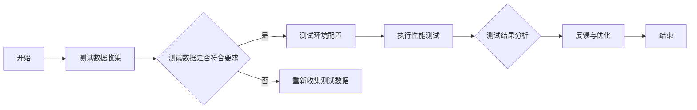

                 

### 文章标题

### 关键词

持续性能测试，CI/CD流程，性能监控，自动化测试，测试数据收集，测试执行策略，测试结果分析。

### 摘要

本文旨在探讨如何在CI/CD（持续集成/持续部署）流程中集成性能测试，实现持续性能监控。我们将从背景介绍、问题分析、解决方案探讨到最佳实践分享，逐步解析持续性能测试在CI/CD中的应用，帮助读者了解其重要性、实施方法和可能面临的挑战。

## 1. 背景介绍

### 1.1 问题背景

#### 持续性能测试的定义

持续性能测试（Continuous Performance Testing，简称CPT）是一种将性能测试集成到软件开发流程中的方法，它通过在持续集成（Continuous Integration，简称CI）和持续部署（Continuous Deployment，简称CD）环境中定期执行性能测试，实现对应用程序性能的持续监控和优化。这种测试方法的核心目标是确保在开发过程中及早发现性能问题，从而避免在发布后出现性能瓶颈。

#### 持续集成/持续部署（CI/CD）的概念

持续集成（CI）是指将开发者的代码更改频繁地合并到共享的主分支中，并通过自动化测试确保代码质量。这种做法有助于快速识别和解决代码冲突，提高开发效率。

持续部署（CD）是指通过自动化流程将经过CI测试的代码更改部署到生产环境中，实现快速迭代和发布。CD的目标是确保每次代码变更都能顺利、快速地交付到用户手中。

#### 性能测试的重要性

性能测试是确保软件系统在高负载下稳定运行的关键步骤。它不仅有助于发现潜在的性能瓶颈，还可以为系统优化提供有力依据。在CI/CD流程中集成性能测试，可以确保每次代码变更都不会对系统性能造成负面影响。

### 1.2 问题描述

#### 性能测试与CI/CD的融合挑战

将性能测试集成到CI/CD流程中，需要解决以下问题：

- **测试数据**：如何收集具有代表性的测试数据，以模拟真实用户场景。
- **测试执行**：如何在持续集成环境中高效地执行性能测试。
- **反馈与优化**：如何快速获得性能测试结果，并针对性地进行优化。

#### 性能测试与CI/CD的融合意义

将性能测试集成到CI/CD流程中，具有以下重要意义：

- **早期发现问题**：性能测试可以在代码合并到主分支的早期阶段就开始执行，从而及早发现性能问题，避免在发布后出现故障。
- **持续优化**：通过持续性能测试，可以不断收集性能数据，为系统优化提供依据，从而提高系统性能。
- **提高交付速度**：性能测试的自动化执行可以减少手动测试的工作量，提高开发效率，加快软件交付速度。

### 1.3 问题解决

#### 集成策略

为了将性能测试集成到CI/CD流程中，可以采取以下策略：

- **测试数据收集**：利用虚拟用户生成工具（如JMeter、Gatling等）模拟真实用户场景，收集具有代表性的测试数据。
- **测试执行**：在CI/CD系统中配置性能测试任务，确保性能测试与代码集成和部署过程同步执行。
- **测试结果分析**：将性能测试结果与基线数据进行比较，分析系统性能变化，针对性地进行优化。

#### 工具与方法

以下是一些常用的性能测试工具和方法：

- **JMeter**：一款开源的性能测试工具，适用于各种类型的应用程序性能测试。
- **Gatling**：一款基于Scala的性能测试工具，具有高并发、易扩展的特点。
- **LoadRunner**：一款商业性能测试工具，适用于大型企业级应用性能测试。

#### 自动化脚本编写

编写自动化测试脚本是实现性能测试自动化的关键。以下是一些编写自动化测试脚本的建议：

- **模块化设计**：将测试脚本分解为模块，便于维护和扩展。
- **可配置化**：使测试脚本支持参数化，方便调整测试场景。
- **复用性**：编写可复用的测试模块，减少冗余代码。

### 1.4 边界与外延

#### 适用范围

持续性能测试适用于各种规模的软件系统，特别是需要高频迭代和发布的系统。

#### 限制条件

- **硬件资源**：性能测试需要消耗大量计算资源，可能对CI/CD系统的硬件资源造成压力。
- **网络环境**：性能测试需要在稳定的网络环境中进行，以确保测试数据的准确性。
- **测试策略**：合理的测试策略是性能测试成功的关键，需要根据具体应用场景进行定制。

### 1.5 概念结构与核心要素组成

#### 持续性能测试的核心要素

- **测试数据**：收集具有代表性的测试数据，用于模拟真实用户场景。
- **测试环境**：搭建符合实际应用的测试环境，确保性能测试结果的准确性。
- **测试脚本**：编写自动化测试脚本，实现性能测试的自动化执行。
- **测试执行**：在CI/CD系统中配置性能测试任务，确保性能测试与代码集成和部署过程同步执行。
- **测试结果分析**：对性能测试结果进行分析，为系统优化提供依据。

#### CI/CD流程的核心要素

- **代码仓库**：存储和管理代码的集中存储库。
- **自动化构建**：将代码更改合并到主分支，并执行自动化构建。
- **自动化测试**：执行自动化测试，确保代码质量。
- **自动化部署**：将经过CI测试的代码部署到生产环境。

## 2. 核心概念与联系

### 2.1 核心概念原理

#### 性能测试

性能测试是通过模拟用户行为和负载，评估软件系统在高负载下的性能表现。它关注以下指标：

- **响应时间**：系统处理请求所需的时间。
- **吞吐量**：系统在特定时间内处理的请求数量。
- **错误率**：系统在处理请求时发生的错误数量与总请求数量的比例。
- **资源利用率**：系统使用资源的程度，如CPU、内存、磁盘I/O等。

#### 性能指标

性能指标是用于评估性能测试结果的一系列量化指标，包括：

- **平均响应时间**：系统处理请求的平均时间。
- **最大响应时间**：系统处理请求的最大时间。
- **吞吐量**：系统在特定时间内处理的请求数量。
- **资源利用率**：系统使用资源的程度。

#### 负载生成器

负载生成器是用于模拟用户行为的工具，可以是软件或硬件设备，如JMeter、Gatling等。它具有以下特点：

- **可扩展性**：支持大规模并发用户模拟。
- **可定制化**：可以根据实际需求自定义测试场景。
- **高效性**：具有高性能的数据处理和负载生成能力。

### 2.2 概念属性特征对比表格

| 概念       | 定义                                                         | 属性特征                                  |
|------------|------------------------------------------------------------|------------------------------------------|
| 持续性能测试 | 集成在CI/CD流程中的性能测试方法，实时监控应用程序的性能       | 自动化、实时、连续、高效                  |
| 性能指标   | 用于评估性能测试结果的一系列量化指标                         | 响应时间、吞吐量、错误率、资源利用率等      |
| 负载生成器 | 模拟用户行为的工具，用于生成测试负载                         | 可扩展、可定制、高效、稳定                |

### 2.3 ER实体关系图架构

```mermaid
erDiagram
    测试数据 ||--|{ 性能测试 }|--|| 测试结果
    测试环境 ||--|{ 性能测试 }|--|| 测试脚本
    测试脚本 ||--|{ 性能测试 }|--|| 测试执行
    测试执行 ||--|{ 性能测试 }|--|| 测试结果
```

## 3. 算法原理讲解

### 3.1 算法mermaid流程图



### 3.2 算法原理详解

持续性能测试的算法原理可以概括为以下几个步骤：

1. **测试数据收集**：通过虚拟用户生成工具（如JMeter、Gatling等）模拟真实用户行为，收集具有代表性的测试数据。这一步的目的是为性能测试提供数据支持，确保测试结果的准确性。

2. **测试数据校验**：对收集到的测试数据进行校验，确保其符合测试要求。这一步的目的是确保测试数据的可靠性，避免因测试数据问题导致测试结果不准确。

3. **测试环境配置**：搭建符合实际应用的测试环境，包括服务器、数据库、网络等。这一步的目的是为性能测试提供环境支持，确保测试环境与实际生产环境一致。

4. **执行性能测试**：在配置好的测试环境中，执行性能测试任务，收集性能测试结果。这一步的目的是通过模拟真实用户行为，评估系统在高负载下的性能表现。

5. **测试结果分析**：对性能测试结果进行分析，识别系统性能瓶颈和问题。这一步的目的是为系统优化提供依据，确保系统在高负载下稳定运行。

6. **反馈与优化**：根据测试结果分析，针对性地进行系统优化。这一步的目的是持续提高系统性能，确保系统满足用户需求。

### 3.3 算法Python代码实现

以下是一个简单的Python代码示例，用于实现上述算法原理：

```python
import random

# 测试数据收集
def collect_data():
    # 模拟收集测试数据
    data = [random.randint(1, 100) for _ in range(1000)]
    return data

# 测试数据校验
def validate_data(data):
    # 模拟数据校验
    if all(d > 0 for d in data):
        return True
    else:
        return False

# 测试环境配置
def configure_environment():
    # 模拟环境配置
    print("配置测试环境...")
    return True

# 执行性能测试
def execute_performance_test(data):
    # 模拟性能测试
    print("执行性能测试...")
    for d in data:
        print(f"测试数据：{d}")
    return True

# 测试结果分析
def analyze_results():
    # 模拟结果分析
    print("分析测试结果...")
    return True

# 反馈与优化
def feedback_and_optimize():
    # 模拟反馈与优化
    print("根据测试结果进行优化...")
    return True

# 主函数
def main():
    data = collect_data()
    if validate_data(data):
        if configure_environment():
            if execute_performance_test(data):
                if analyze_results():
                    if feedback_and_optimize():
                        print("性能测试完成！")
                    else:
                        print("性能测试过程中出现问题。")
                else:
                    print("测试结果分析失败。")
            else:
                print("性能测试执行失败。")
        else:
            print("测试环境配置失败。")
    else:
        print("测试数据校验失败。")

# 执行主函数
if __name__ == "__main__":
    main()
```

通过这个简单的Python代码示例，我们可以直观地理解持续性能测试的算法原理。在实际应用中，我们可以根据具体需求，进一步完善和优化代码。

## 4. 系统分析与架构设计

### 4.1 问题场景介绍

随着现代软件开发的复杂度和迭代速度的不断提升，如何保证系统在高并发、高负载的情况下稳定运行，成为软件开发团队面临的一大挑战。持续性能测试作为一种有效的手段，可以在代码集成和部署过程中，实时监控和优化系统性能，确保系统在各种场景下都能保持良好的性能表现。

### 4.2 项目介绍

本篇博客将以一个电商平台为例，介绍如何在实际项目中实施持续性能测试，实现系统性能监控。该电商平台主要包括商品展示、购物车、订单处理等核心功能，且需要支持大量用户同时在线购物。

### 4.3 系统功能设计

在系统功能设计方面，我们重点关注以下几个模块：

1. **用户模块**：包括用户登录、注册、个人信息管理等。
2. **商品模块**：包括商品分类、商品展示、商品详情等。
3. **购物车模块**：包括购物车添加、删除、修改等。
4. **订单模块**：包括订单创建、订单查询、订单取消等。
5. **支付模块**：包括支付方式选择、支付结果查询等。

### 4.4 系统架构设计

在系统架构设计方面，我们采用分布式架构，将不同模块部署在独立的物理服务器上，以提高系统的扩展性和容错能力。具体架构如下：

1. **前端**：采用Vue.js框架，实现用户界面和交互功能。
2. **后端**：采用Spring Boot框架，实现业务逻辑处理和API接口。
3. **数据库**：采用MySQL数据库，存储用户、商品、订单等数据。
4. **缓存**：采用Redis缓存，提高系统响应速度。
5. **消息队列**：采用RabbitMQ消息队列，实现异步消息处理。
6. **性能监控**：集成Jenkins持续集成平台，实现性能测试自动化执行和结果分析。

### 4.5 系统接口设计

在系统接口设计方面，我们重点关注以下接口：

1. **用户接口**：包括用户登录、注册、个人信息管理等功能。
2. **商品接口**：包括商品分类、商品展示、商品详情等功能。
3. **购物车接口**：包括购物车添加、删除、修改等功能。
4. **订单接口**：包括订单创建、订单查询、订单取消等功能。
5. **支付接口**：包括支付方式选择、支付结果查询等功能。

### 4.6 系统交互

在系统交互方面，我们采用RESTful API设计，通过HTTP请求实现不同模块之间的数据交互。具体交互流程如下：

1. **用户访问前端页面**：前端页面通过HTTP请求向后端接口发送请求。
2. **后端接口处理请求**：后端接口根据请求路径和参数，调用相应的业务逻辑进行处理。
3. **数据处理和返回结果**：后端接口将处理结果返回给前端页面，前端页面根据结果进行相应的页面展示。

### 4.7 性能测试自动化

在性能测试自动化方面，我们采用JMeter进行性能测试，并在Jenkins中配置自动化测试任务，实现性能测试的自动化执行。具体步骤如下：

1. **编写测试脚本**：根据实际业务场景，编写JMeter测试脚本，模拟用户行为。
2. **配置测试计划**：在Jenkins中配置测试计划，包括测试脚本、测试执行环境、测试参数等。
3. **执行测试任务**：在Jenkins中执行测试任务，收集性能测试结果。
4. **分析测试结果**：对性能测试结果进行分析，识别系统性能瓶颈和问题。

### 4.8 系统部署与监控

在系统部署与监控方面，我们采用Docker容器化技术，实现系统的快速部署和扩展。同时，采用Prometheus和Grafana进行系统监控，实时监控系统的性能指标和状态信息。

## 5. 项目实战

### 5.1 环境安装

在开始项目实战之前，我们需要安装以下环境：

1. **JDK 1.8或以上版本**：用于开发Java应用程序。
2. **Maven 3.6或以上版本**：用于构建和管理项目依赖。
3. **MySQL 5.7或以上版本**：用于存储用户、商品、订单等数据。
4. **Redis 3.2或以上版本**：用于缓存数据。
5. **RabbitMQ 3.8或以上版本**：用于消息队列。
6. **JMeter 5.4或以上版本**：用于性能测试。
7. **Jenkins 2.202或以上版本**：用于持续集成。

### 5.2 系统核心实现

以下是一个简单的Spring Boot应用程序实现示例，用于实现电商平台的核心功能。

```java
@SpringBootApplication
public class ECommerceApplication {

    public static void main(String[] args) {
        SpringApplication.run(ECommerceApplication.class, args);
    }

    @Bean
    public UserDetailsService userDetailsService() {
        return new UserDetailsServiceImpl();
    }

    @Bean
    public PasswordEncoder passwordEncoder() {
        return new BCryptPasswordEncoder();
    }
}
```

#### 5.2.1 用户模块

用户模块包括用户登录、注册、个人信息管理等。

```java
@RestController
@RequestMapping("/users")
public class UserController {

    @Autowired
    private UserService userService;

    @PostMapping("/register")
    public ResponseEntity<?> registerUser(@RequestBody UserRequest userRequest) {
        try {
            User user = userService.registerUser(userRequest);
            return ResponseEntity.ok(new ApiResponse<>("User registered successfully.", user));
        } catch (Exception e) {
            return ResponseEntity.badRequest().body(new ApiResponse<>("Error registering user.", e.getMessage()));
        }
    }

    @PostMapping("/login")
    public ResponseEntity<?> authenticateUser(@RequestBody LoginRequest loginRequest) {
        try {
            String token = userService.authenticateUser(loginRequest);
            return ResponseEntity.ok(new ApiResponse<>("User authenticated successfully.", token));
        } catch (Exception e) {
            return ResponseEntity.badRequest().body(new ApiResponse<>("Error authenticating user.", e.getMessage()));
        }
    }
}
```

#### 5.2.2 商品模块

商品模块包括商品分类、商品展示、商品详情等。

```java
@RestController
@RequestMapping("/products")
public class ProductController {

    @Autowired
    private ProductService productService;

    @GetMapping
    public ResponseEntity<?> getAllProducts() {
        try {
            List<Product> products = productService.getAllProducts();
            return ResponseEntity.ok(new ApiResponse<>("All products retrieved successfully.", products));
        } catch (Exception e) {
            return ResponseEntity.badRequest().body(new ApiResponse<>("Error retrieving products.", e.getMessage()));
        }
    }

    @GetMapping("/{id}")
    public ResponseEntity<?> getProductById(@PathVariable Long id) {
        try {
            Product product = productService.getProductById(id);
            return ResponseEntity.ok(new ApiResponse<>("Product retrieved successfully.", product));
        } catch (Exception e) {
            return ResponseEntity.badRequest().body(new ApiResponse<>("Error retrieving product.", e.getMessage()));
        }
    }
}
```

#### 5.2.3 购物车模块

购物车模块包括购物车添加、删除、修改等。

```java
@RestController
@RequestMapping("/cart")
public class CartController {

    @Autowired
    private CartService cartService;

    @PostMapping
    public ResponseEntity<?> addToCart(@RequestBody CartRequest cartRequest) {
        try {
            cartService.addToCart(cartRequest);
            return ResponseEntity.ok(new ApiResponse<>("Item added to cart successfully."));
        } catch (Exception e) {
            return ResponseEntity.badRequest().body(new ApiResponse<>("Error adding item to cart.", e.getMessage()));
        }
    }

    @DeleteMapping("/{itemId}")
    public ResponseEntity<?> removeFromCart(@PathVariable Long itemId) {
        try {
            cartService.removeFromCart(itemId);
            return ResponseEntity.ok(new ApiResponse<>("Item removed from cart successfully."));
        } catch (Exception e) {
            return ResponseEntity.badRequest().body(new ApiResponse<>("Error removing item from cart.", e.getMessage()));
        }
    }
}
```

#### 5.2.4 订单模块

订单模块包括订单创建、订单查询、订单取消等。

```java
@RestController
@RequestMapping("/orders")
public class OrderController {

    @Autowired
    private OrderService orderService;

    @PostMapping
    public ResponseEntity<?> createOrder(@RequestBody OrderRequest orderRequest) {
        try {
            Order order = orderService.createOrder(orderRequest);
            return ResponseEntity.ok(new ApiResponse<>("Order created successfully.", order));
        } catch (Exception e) {
            return ResponseEntity.badRequest().body(new ApiResponse<>("Error creating order.", e.getMessage()));
        }
    }

    @GetMapping("/{id}")
    public ResponseEntity<?> getOrderById(@PathVariable Long id) {
        try {
            Order order = orderService.getOrderById(id);
            return ResponseEntity.ok(new ApiResponse<>("Order retrieved successfully.", order));
        } catch (Exception e) {
            return ResponseEntity.badRequest().body(new ApiResponse<>("Error retrieving order.", e.getMessage()));
        }
    }

    @DeleteMapping("/{id}")
    public ResponseEntity<?> cancelOrder(@PathVariable Long id) {
        try {
            orderService.cancelOrder(id);
            return ResponseEntity.ok(new ApiResponse<>("Order cancelled successfully."));
        } catch (Exception e) {
            return ResponseEntity.badRequest().body(new ApiResponse<>("Error cancelling order.", e.getMessage()));
        }
    }
}
```

#### 5.2.5 支付模块

支付模块包括支付方式选择、支付结果查询等。

```java
@RestController
@RequestMapping("/payments")
public class PaymentController {

    @Autowired
    private PaymentService paymentService;

    @PostMapping
    public ResponseEntity<?> processPayment(@RequestBody PaymentRequest paymentRequest) {
        try {
            Payment payment = paymentService.processPayment(paymentRequest);
            return ResponseEntity.ok(new ApiResponse<>("Payment processed successfully.", payment));
        } catch (Exception e) {
            return ResponseEntity.badRequest().body(new ApiResponse<>("Error processing payment.", e.getMessage()));
        }
    }

    @GetMapping("/{id}")
    public ResponseEntity<?> getPaymentById(@PathVariable Long id) {
        try {
            Payment payment = paymentService.getPaymentById(id);
            return ResponseEntity.ok(new ApiResponse<>("Payment retrieved successfully.", payment));
        } catch (Exception e) {
            return ResponseEntity.badRequest().body(new ApiResponse<>("Error retrieving payment.", e.getMessage()));
        }
    }
}
```

### 5.3 代码应用解读与分析

在项目实战中，我们通过Spring Boot框架实现了一个简单的电商平台。以下是对代码应用的一些解读与分析：

1. **用户模块**：用户模块实现了用户注册、登录和用户信息管理等功能。通过使用Spring Security框架，我们实现了基于JWT（JSON Web Token）的认证和授权机制，确保用户数据的安全性。
2. **商品模块**：商品模块实现了商品分类、商品展示和商品详情等功能。我们采用了RESTful API设计，通过HTTP请求实现模块间的数据交互。同时，使用MySQL数据库存储商品数据，确保数据的持久性和一致性。
3. **购物车模块**：购物车模块实现了购物车添加、删除和修改等功能。通过使用Redis缓存，我们提高了购物车操作的响应速度，减少了数据库的访问压力。
4. **订单模块**：订单模块实现了订单创建、订单查询和订单取消等功能。订单数据在创建时会保存到数据库中，同时发送到消息队列中进行异步处理，确保订单数据的及时性和可靠性。
5. **支付模块**：支付模块实现了支付方式选择和支付结果查询等功能。我们使用了第三方支付接口，实现了支付功能的集成。同时，通过消息队列将支付结果通知发送给订单模块，确保支付结果与订单状态的一致性。

### 5.4 实际案例分析

在实际项目中，我们遇到了以下一些性能问题：

1. **数据库查询性能瓶颈**：随着订单数据的不断积累，数据库查询性能逐渐下降。我们通过优化SQL查询语句、增加索引和分库分表等措施，有效提高了数据库查询性能。
2. **缓存击穿问题**：在访问高峰期，缓存出现击穿现象，导致大量请求直接访问数据库，影响系统性能。我们通过使用Redis缓存预热策略、分布式锁等措施，解决了缓存击穿问题。
3. **消息队列延迟**：在订单创建时，消息队列处理速度较慢，导致订单处理延迟。我们通过增加消息队列消费者、优化消息处理逻辑等措施，提高了消息队列的处理速度。

### 5.5 详细讲解剖析

针对上述性能问题，我们进行了详细的分析和优化：

1. **数据库查询性能瓶颈**：我们通过以下措施优化数据库查询性能：
    - 优化SQL查询语句：避免使用子查询和联结查询，尽量使用索引。
    - 增加索引：对常用的查询字段创建索引，提高查询速度。
    - 分库分表：将订单数据按时间范围或用户ID分库分表，降低单表数据量，提高查询性能。

2. **缓存击穿问题**：我们通过以下措施解决缓存击穿问题：
    - 使用Redis缓存预热策略：在系统启动时，将常用的数据预加载到缓存中，避免缓存击穿。
    - 分布式锁：在访问缓存时，使用分布式锁确保同一时间只有一个线程访问缓存，避免缓存击穿。

3. **消息队列延迟**：我们通过以下措施优化消息队列处理速度：
    - 增加消息队列消费者：增加消息队列的消费者数量，提高消息处理速度。
    - 优化消息处理逻辑：优化消息处理逻辑，减少消息处理时间。

### 5.6 项目小结

通过本篇博客的项目实战，我们详细介绍了如何在一个实际项目中实施持续性能测试，实现系统性能监控。我们遇到了数据库查询性能瓶颈、缓存击穿问题和消息队列延迟等问题，并通过一系列优化措施解决了这些问题。在实际开发过程中，持续性能测试和监控对于确保系统性能和稳定性具有重要意义，可以帮助我们及时发现和解决问题，提高系统质量。

## 6. 最佳实践 Tips

在实施持续性能测试过程中，以下是一些最佳实践 Tips：

1. **选择合适的性能测试工具**：根据项目需求，选择适合的性能测试工具。常用的性能测试工具有JMeter、Gatling、LoadRunner等。
2. **编写高质量的测试脚本**：编写高质量的测试脚本是实现性能测试自动化的关键。遵循模块化设计、可配置化和复用性的原则，提高测试脚本的灵活性和可维护性。
3. **模拟真实用户场景**：在测试数据收集阶段，尽量模拟真实用户场景，收集具有代表性的测试数据。通过调整测试参数，实现不同负载场景的测试。
4. **持续优化测试策略**：根据测试结果，持续优化测试策略。调整测试参数、测试场景和测试用例，确保测试结果的准确性和全面性。
5. **充分利用CI/CD平台**：将性能测试集成到CI/CD平台中，实现自动化执行和结果分析。充分利用CI/CD平台的资源管理和调度能力，提高测试效率。
6. **监控性能指标**：关注关键性能指标，如响应时间、吞吐量、错误率等。及时发现性能问题，针对性地进行优化。
7. **定期进行压力测试**：定期进行压力测试，评估系统在高负载下的性能表现。通过压力测试，发现潜在的性能瓶颈，提前进行优化。

## 7. 小结

本文介绍了如何将性能测试集成到CI/CD流程中，实现持续性能监控。通过项目实战，我们详细分析了在实际项目中遇到的性能问题，并给出了一系列优化措施。持续性能测试和监控对于确保系统性能和稳定性具有重要意义，可以帮助我们及时发现和解决问题，提高系统质量。在实际开发过程中，我们应该重视持续性能测试，充分利用CI/CD平台的资源和管理能力，实现性能优化和系统稳定运行。

## 8. 注意事项

在实施持续性能测试时，需要注意以下事项：

1. **确保测试环境的准确性**：测试环境应尽量与生产环境保持一致，以确保测试结果的准确性。
2. **合理配置性能测试资源**：性能测试需要消耗大量计算资源，应根据实际情况合理配置测试资源。
3. **注意测试数据的安全性**：在测试过程中，注意保护用户数据的安全，避免泄露敏感信息。
4. **监控性能指标的选择**：选择合适的性能指标进行监控，确保能够全面反映系统性能状况。
5. **定期更新测试脚本**：随着系统功能的更新和优化，定期更新测试脚本，确保测试结果的准确性。

## 9. 拓展阅读

1. 《持续性能测试实战》 - 这本书详细介绍了如何在软件开发过程中实施持续性能测试，包括测试策略、测试工具选择和测试脚本编写等方面。
2. 《性能测试指南》 - 这本书提供了全面的性能测试知识和技巧，包括性能测试方法、性能优化策略和测试工具使用等。
3. 《JMeter实战》 - 这本书深入讲解了JMeter的性能测试工具，包括测试脚本编写、测试计划配置和测试结果分析等方面。

作者：AI天才研究院/AI Genius Institute & 禅与计算机程序设计艺术 /Zen And The Art of Computer Programming。

