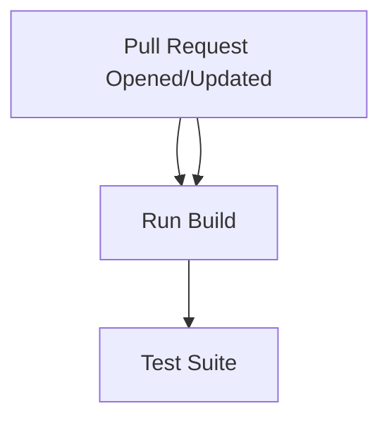
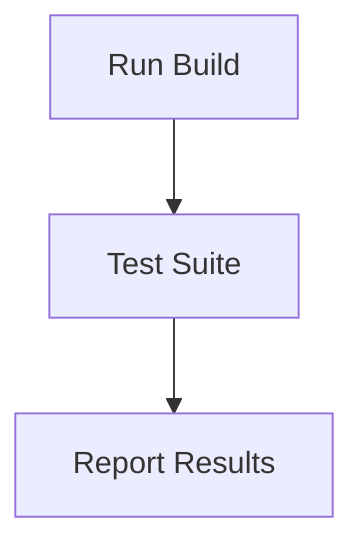
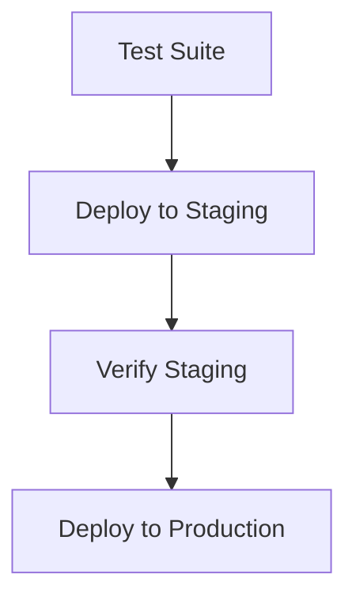
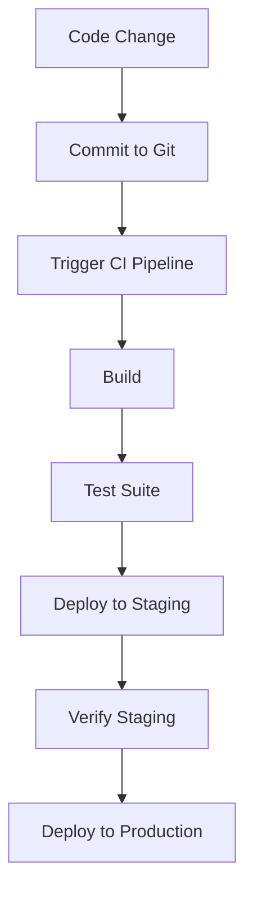

                 


**Step 1: Introduction and Background**

# Continuous Integration and Continuous Deployment: DevOps Best Practices

**Keywords:** Continuous Integration, Continuous Deployment, DevOps, Best Practices, Software Development

**Abstract:**
This article explores the principles and practices of Continuous Integration (CI) and Continuous Deployment (CD) within the broader context of DevOps. It aims to provide a comprehensive guide for implementing CI/CD in software development, highlighting key concepts, tools, and methodologies, and sharing practical case studies and best practices.

**Introduction to Continuous Integration (CI):**
Continuous Integration is a development practice where developers frequently merge their code changes into a central repository, and automated tests are run to detect integration issues early. This approach ensures that the codebase remains in a deployable state and enables rapid feedback loops.

**Introduction to Continuous Deployment (CD):**
Continuous Deployment takes CI a step further by automatically deploying code changes to production environments after passing all automated tests. This practice aims to streamline the release process, reduce manual intervention, and increase the frequency of deployments.

**The Role of DevOps Culture:**
DevOps is a cultural and professional movement that emphasizes collaboration, communication, and integration between software developers and IT operations professionals. It aims to establish an environment where building, testing, and releasing software can happen rapidly, frequently, and more reliably.

**Step 2: Understanding DevOps Basics**

## DevOps Definition and Core Values

**DevOps Definition:**
DevOps is a set of practices that combines software development (Dev) with IT operations (Ops). It aims to shorten the development life cycle, provide continuous delivery with high-quality software, and ensure that operations and development teams can work together effectively.

**Core Values:**
1. **Customer Focus:** Prioritizing customer needs and delivering value.
2. **Feedback Loop:** Establishing fast and effective communication channels to gather feedback and make improvements.
3. **Automation:** Reducing manual processes and increasing efficiency through automated tools and workflows.
4. **Measurement:** Using data to measure and improve performance.

**Key Elements of DevOps:**
1. **Infrastructure as Code (IaC):** Treating infrastructure as code to automate and manage it using version control and infrastructure management tools.
2. **Microservices Architecture:** Decomposing applications into small, loosely coupled services to enhance scalability, resilience, and maintainability.
3. **Containerization:** Using containers like Docker to package and deploy applications consistently across different environments.

**Relation to CI/CD:**
DevOps practices like IaC, microservices, and containerization facilitate the implementation of CI/CD. They enable teams to develop, test, and deploy applications more efficiently, leading to faster time-to-market and improved quality.

**Step 3: Continuous Integration (CI) Practices**

## Continuous Integration Basics

**CI Basics:**
CI involves automating the build and testing of code changes as part of the development process. This ensures that any integration issues are detected early and addressed promptly.

**CI Tools and Platforms:**
Common CI tools and platforms include Jenkins, GitLab CI, and GitHub Actions. These tools provide automation, integration, and monitoring capabilities to streamline the CI process.

**CI Workflow Design:**
Designing an effective CI workflow involves determining the build triggers, test suites, and deployment targets. It also requires defining the build configurations and ensuring that the CI pipeline is scalable and reliable.

## Continuous Deployment (CD) Practices

### Continuous Deployment Basics

**CD Basics:**
CD is the process of automatically deploying code changes to production environments after passing all CI tests. This practice ensures that new features and bug fixes are delivered to users rapidly and reliably.

**CD Tools and Platforms:**
CD tools and platforms like Kubernetes, AWS CodePipeline, and Azure DevOps provide the necessary automation and orchestration capabilities for CD.

**CD Strategies and Processes:**
Designing an effective CD strategy involves determining the deployment frequency, selecting the appropriate deployment patterns (e.g., blue-green deployment or canary release), and ensuring proper monitoring and rollback mechanisms are in place.

### CD Risk Management and Monitoring

**Risk Management:**
Implementing CD introduces risks related to deployment failures, performance issues, and security vulnerabilities. Effective risk management practices include identifying potential risks, defining risk mitigation strategies, and monitoring for early warning signs.

**Monitoring:**
Monitoring the CD process is crucial for ensuring the stability and performance of deployed applications. This involves tracking metrics, setting up alerts, and analyzing logs to identify and resolve issues promptly.

**Step 4: DevOps Best Practices**

## Successful DevOps Cases

**Case Studies:**
Sharing real-world case studies of successful DevOps implementations can provide valuable insights and lessons learned. These cases can cover various industries, project sizes, and complexities, showcasing the effectiveness of DevOps practices.

### Best Practices Sharing

**Best Practices:**
Best practices for implementing DevOps and CI/CD include adopting an agile mindset, fostering a collaborative culture, investing in automation, and continuously improving processes.

**Challenges and Solutions:**
Identifying common challenges faced during the implementation of DevOps and CI/CD, such as resistance to change, lack of skills, and tool integration issues, and sharing practical solutions can help organizations overcome these obstacles.

**Conclusion and Future Trends**

## Conclusion and Future Trends

### Summary and Outlook

**Summary:**
This article has explored the concepts, practices, and benefits of CI/CD within the DevOps framework. It has highlighted the importance of collaboration, automation, and continuous improvement in modern software development.

**Future Trends:**
The future of CI/CD and DevOps lies in further integration with emerging technologies like AI, machine learning, and edge computing. These advancements will enable even faster and more reliable software delivery, enhancing competitiveness and innovation in the digital age.

### Implementation Considerations

**Considerations:**
Implementing CI/CD and DevOps requires careful planning, collaboration, and investment. Organizations should focus on building the necessary skills, adopting agile methodologies, and investing in the right tools and infrastructure to succeed.

### Further Reading and Resources

**Further Reading:**
For readers interested in learning more about CI/CD, DevOps, and software development best practices, several resources are available, including books, online courses, and industry conferences.

### Author Information

**Author:**
AI天才研究院 / AI Genius Institute & 禅与计算机程序设计艺术 / Zen And The Art of Computer Programming## Continuous Integration and Continuous Deployment: DevOps Best Practices

Continuous Integration (CI) and Continuous Deployment (CD) are fundamental practices within the broader DevOps culture that significantly enhance the efficiency and reliability of software development processes. This article delves into the core concepts, tools, and methodologies associated with CI/CD, providing a comprehensive guide for implementing these practices in modern software development environments.

**Keywords:** Continuous Integration, Continuous Deployment, DevOps, CI/CD, Best Practices

**Abstract:**
This article explores the principles and practices of Continuous Integration (CI) and Continuous Deployment (CD) within the broader context of DevOps. It aims to provide a comprehensive guide for implementing CI/CD in software development, highlighting key concepts, tools, and methodologies, and sharing practical case studies and best practices. The article covers the importance of CI/CD, their role in DevOps, the foundational principles of CI/CD, CI/CD tools and platforms, workflow design, risk management, and monitoring, as well as successful case studies and best practices.

### Introduction to Continuous Integration (CI)

Continuous Integration (CI) is a development practice where developers frequently merge their code changes into a central repository, and automated tests are run to detect integration issues early. This approach ensures that the codebase remains in a deployable state and enables rapid feedback loops. By automating the build and testing process, CI helps to identify and resolve integration problems quickly, reducing the time and effort required to address issues that could otherwise manifest in later stages of the development cycle.

**CI Benefits:**
- **Early Bug Detection:** Identifying and fixing bugs early in the development process.
- **Simplified Testing:** Automating tests ensures that they are run consistently and efficiently.
- **Rapid Feedback:** Developers receive immediate feedback on their code changes.
- **Increased Quality:** Regularly integrating code helps maintain a higher quality standard.
- **Improved Collaboration:** Teams can work more effectively by detecting issues early and addressing them promptly.

**CI Principles:**
1. **Frequent Integration:** Developers integrate their code changes into a shared repository frequently.
2. **Automated Testing:** Automated tests run on every integration to ensure code quality.
3. **Early Feedback:** Developers receive feedback on their code changes as soon as they integrate.
4. **Simplified Release Management:** The CI process ensures that code is in a deployable state.

### Introduction to Continuous Deployment (CD)

Continuous Deployment (CD) takes Continuous Integration a step further by automatically deploying code changes to production environments after passing all automated tests. This practice ensures that new features and bug fixes are delivered to users rapidly and reliably. CD automates the deployment process, reducing manual intervention and the risk of human error. By continuously deploying code, organizations can achieve faster time-to-market, reduced lead times, and improved customer satisfaction.

**CD Benefits:**
- **Fast Deployment:** Automated deployments reduce the time between development and production.
- **Reduced Risk:** Automated tests and rollback mechanisms minimize the risk of deploying broken code.
- **Increased Speed:** Continuous deployments enable frequent, small updates rather than infrequent, large releases.
- **Improved Reliability:** Automated processes ensure consistency and reliability across deployments.
- **Customer Focus:** Rapid deployment of features and fixes enhances customer satisfaction.

**CD Principles:**
1. **Automated Testing:** Code changes are thoroughly tested before deployment.
2. **Automated Deployment:** Deployment processes are automated to reduce human error and speed up releases.
3. **Monitoring and Feedback:** Continuous monitoring and feedback ensure the stability of deployed applications.
4. **Rapid Iteration:** Frequent deployments allow for rapid iteration and feedback.

### The Role of DevOps Culture

DevOps is a cultural and professional movement that emphasizes collaboration, communication, and integration between software developers and IT operations professionals. It aims to establish an environment where building, testing, and releasing software can happen rapidly, frequently, and more reliably. The DevOps culture promotes a mindset focused on delivering high-quality software that meets customer needs through continuous feedback and improvement.

**DevOps Principles:**
- **Collaboration:** Developers and operations teams work together closely to improve the development process.
- **Communication:** Effective communication channels ensure that all team members are informed and aligned.
- **Integration:** Development and operations are integrated to streamline processes and improve efficiency.
- **Automation:** Manual processes are automated to reduce errors and increase efficiency.
- **Measurement:** Metrics are used to measure performance and drive continuous improvement.

**Benefits of DevOps:**
- **Increased Speed:** Faster development cycles and quicker time-to-market.
- **Improved Quality:** High-quality software through continuous testing and feedback.
- **Reduced Risk:** Early detection and resolution of issues minimize risks.
- **Increased Collaboration:** Better collaboration between development and operations teams.
- **Improved Customer Satisfaction:** Rapid delivery of features and fixes enhances customer satisfaction.

### Conclusion

Continuous Integration (CI) and Continuous Deployment (CD) are crucial practices within the DevOps framework that enhance the efficiency, reliability, and speed of software development processes. By automating the integration and deployment of code changes, organizations can achieve faster time-to-market, improved quality, and increased customer satisfaction. The DevOps culture, which emphasizes collaboration, communication, and integration, provides the foundation for successful CI/CD implementation. As organizations continue to adopt these practices, they can expect to see significant improvements in their software development and deployment processes.

### Author Information

**Author:** AI天才研究院/AI Genius Institute & 禅与计算机程序设计艺术/Zen And The Art of Computer Programming## DevOps Basic Concepts

DevOps is a transformative movement that aims to bridge the gap between software development (Dev) and IT operations (Ops) by fostering collaboration, communication, and integration between these two traditionally siloed teams. This section will delve into the fundamental concepts of DevOps, including its definition, core values, key elements, and its relationship with Continuous Integration (CI) and Continuous Deployment (CD).

### DevOps Definition

DevOps is not a single tool or technology but rather a cultural and professional movement that promotes practices designed to improve the speed and quality of software delivery. According to Jez Humble and David Farley in their book "Continuous Delivery," DevOps is about "integrating development and operations, and automating as much of the build, deployment, and operations processes as possible."

**Key Characteristics of DevOps:**
1. **Collaboration:** Blurring the lines between developers and operations teams to foster a collaborative environment.
2. **Integration:** Integrating development and operations processes to streamline workflows.
3. **Automation:** Automating repetitive tasks to reduce manual effort and human error.
4. **Frequent Updates:** Deploying software frequently with small, incremental changes.
5. **Monitoring and Feedback:** Continuously monitoring applications and collecting feedback to make informed improvements.

### Core Values of DevOps

The core values of DevOps are essential in shaping the culture and practices that drive the movement. These values include:

1. **Customer Focus:** Prioritizing customer needs and delivering value through rapid, reliable software delivery.
2. **Feedback Loop:** Establishing fast and effective communication channels to gather feedback and make improvements.
3. **Automation:** Reducing manual processes and increasing efficiency through automated tools and workflows.
4. **Measurement:** Using data to measure and improve performance.
5. **Resilience:** Building resilient systems that can withstand failure and recover quickly.

### Key Elements of DevOps

Several key elements are integral to the DevOps culture and practices:

1. **Infrastructure as Code (IaC):** Infrastructure as Code treats infrastructure resources—like servers and networks—as programmable artifacts managed through version control systems. This approach enables teams to automate infrastructure provisioning, configuration, and management.

2. **Microservices Architecture:** Microservices is an architectural style where applications are composed of loosely coupled services that can be developed, deployed, and scaled independently. This approach enhances scalability, resilience, and maintainability.

3. **Containerization:** Containerization technologies, such as Docker, package applications and their dependencies into isolated environments, ensuring consistency across development, testing, and production environments.

4. **Continuous Integration (CI) and Continuous Deployment (CD):** CI/CD practices involve automating the integration and deployment of code changes, ensuring that software is continuously integrated and deployed to production environments.

5. **Monitoring and Logging:** Continuous monitoring and logging are critical for understanding the health and performance of applications and infrastructure, enabling proactive issue resolution.

### DevOps and CI/CD Relationship

The relationship between DevOps and CI/CD is symbiotic. DevOps principles and practices create an environment where CI/CD can thrive. Here’s how they relate:

- **DevOps promotes a collaborative culture that encourages the integration of development and operations teams.**
- **CI/CD practices enable faster, more reliable software delivery by automating the build, test, and deployment processes.**
- **Infrastructure as Code (IaC) and containerization are key technologies that support the automation and consistency required by CI/CD.**
- **Monitoring and logging are essential components of CI/CD that provide feedback to DevOps teams, enabling continuous improvement.**

In summary, DevOps is a cultural and professional movement that emphasizes collaboration, communication, and integration, while CI/CD is a set of practices that automate and streamline the software delivery process. Together, they form a powerful combination that can significantly enhance the efficiency and reliability of software development and deployment.

### Conclusion

Understanding the basic concepts of DevOps is crucial for any organization looking to adopt CI/CD practices. DevOps fosters a collaborative environment where development and operations teams can work together seamlessly. By embracing the core values and key elements of DevOps, organizations can create a foundation for successful CI/CD implementations, leading to faster, more reliable software delivery and improved customer satisfaction. As you move forward with your DevOps journey, remember that culture, automation, and continuous improvement are the cornerstones of success.

### Author Information

**Author:** AI天才研究院/AI Genius Institute & 禅与计算机程序设计艺术/Zen And The Art of Computer Programming## Continuous Integration (CI) Fundamentals

Continuous Integration (CI) is a cornerstone practice within the DevOps framework that significantly enhances the efficiency and quality of software development processes. This section will explore the fundamental principles of CI, its key components, the role of automated testing, and the importance of maintaining a deployable codebase.

### Principles of Continuous Integration

The core principles of Continuous Integration can be summarized as follows:

1. **Frequent Integration:** Developers frequently merge their code changes into a central repository, typically multiple times a day.
2. **Automated Testing:** Automated tests are run on every integration to ensure that the codebase remains in a functional and deployable state.
3. **Early Feedback:** Developers receive immediate feedback on their code changes, allowing them to identify and fix issues early in the development cycle.
4. **Simplified Release Management:** By ensuring that the codebase is always in a deployable state, the process of managing releases becomes simpler and more predictable.

### Key Components of CI

To implement CI effectively, several key components must be in place:

1. **Version Control System:** A version control system (VCS) like Git is essential for managing code changes. It provides a centralized repository where developers can merge their code and track changes over time.

2. **Build Server:** A build server, such as Jenkins, GitLab CI, or GitHub Actions, is responsible for triggering the build process whenever code changes are merged into the repository. The build server compiles the code, runs tests, and creates artifacts.

3. **Automated Test Suite:** A comprehensive suite of automated tests is crucial for ensuring that the codebase remains functional and bug-free. These tests can include unit tests, integration tests, and end-to-end tests.

4. **Artifact Repository:** An artifact repository, such as Nexus or Artifactory, stores the build artifacts, such as executables, libraries, and dependencies, that are generated during the build process.

5. **Deployment Pipeline:** Once the build and tests pass, a deployment pipeline can be used to deploy the application to various environments, such as development, staging, and production.

### Automated Testing in CI

Automated testing is a fundamental component of CI. It ensures that any code changes are thoroughly tested and validated before they are merged into the main codebase. Here are some key points about automated testing in CI:

1. **Unit Testing:** Unit tests are the smallest testable components of an application. They test individual functions or methods to ensure they work as expected.
2. **Integration Testing:** Integration tests verify that different modules or components of an application work together correctly.
3. **End-to-End Testing:** End-to-end tests simulate real user interactions with the application to ensure that it functions correctly from start to finish.
4. **Test-Driven Development (TDD):** TDD is a development methodology where tests are written before the actual code. This approach ensures that the code is testable and helps maintain high code quality.

### Maintaining a Deployable Codebase

A key principle of CI is to ensure that the codebase is always in a deployable state. This means that any code changes should be safe to deploy to production at any time. Here are some practices to maintain a deployable codebase:

1. **Continuous Testing:** Automated tests should be run continuously as part of the CI pipeline to detect issues early.
2. **Environment Parity:** Ensuring that development, staging, and production environments are as similar as possible helps prevent unexpected issues during deployment.
3. **Version Control:** Keeping a clean and well-organized version control system ensures that the codebase is easy to understand and maintain.
4. **Code Reviews:** Conducting code reviews helps catch potential issues and ensures that code changes adhere to coding standards and best practices.

### Importance of CI

Continuous Integration provides several benefits to software development:

1. **Early Bug Detection:** By running tests on every code change, CI helps catch bugs early, reducing the time and effort required to fix them.
2. **Improved Collaboration:** Developers can work more effectively by receiving immediate feedback on their code changes.
3. **Increased Quality:** Regular integration and testing help maintain a higher quality standard for the codebase.
4. **Rapid Feedback Loops:** Developers receive feedback quickly, allowing them to iterate and improve their code.
5. **Streamlined Releases:** Ensuring that the codebase is always in a deployable state simplifies the release process.

In conclusion, Continuous Integration is a critical practice in modern software development. By automating the build, test, and deployment processes, CI helps teams deliver high-quality software more efficiently. Understanding and implementing the principles of CI can significantly enhance the productivity and effectiveness of development teams.

### Author Information

**Author:** AI天才研究院/AI Genius Institute & 禅与计算机程序设计艺术/Zen And The Art of Computer Programming## Continuous Integration (CI) Tools and Platforms

Choosing the right Continuous Integration (CI) tool or platform is crucial for effectively implementing CI practices within a development team. Several popular CI tools and platforms are available, each offering unique features and capabilities. In this section, we will explore some of the most commonly used CI tools and platforms, their key features, and how they can enhance CI processes.

### Jenkins

**Jenkins is one of the most popular open-source CI tools, known for its flexibility and extensive plugin ecosystem.**

**Key Features:**
1. **Extensibility:** Jenkins has a vast library of plugins that support various languages, build tools, and cloud services.
2. **Scalability:** Jenkins can handle large-scale projects with multiple build agents.
3. **Scheduling:** Jenkins allows for automated scheduling of builds based on time or code changes.
4. **Notifications:** Jenkins supports various notification methods, including email, Slack, and HipChat.

**Jenkins Use Cases:**
- **Automated Testing:** Jenkins can run tests on multiple platforms and environments.
- **Build and Deployment:** Jenkins automates the build and deployment of applications.
- **Monitoring:** Jenkins provides real-time monitoring and alerts for build failures or issues.

### GitLab CI

**GitLab CI is a built-in CI/CD solution integrated into the GitLab platform, offering a comprehensive CI workflow management solution.**

**Key Features:**
1. **Integrated CI/CD:** GitLab CI provides end-to-end CI/CD capabilities within the GitLab ecosystem.
2. **Pipeline-as-Code:** GitLab CI allows defining CI/CD pipelines using YAML files, enabling version control and collaboration.
3. **Containerized Builds:** GitLab CI supports containerized builds, ensuring consistent environments across different stages.
4. **Security:** GitLab CI provides security features, such as role-based access control and secrets management.

**GitLab CI Use Cases:**
- **Automated Testing:** GitLab CI runs tests automatically on every push or merge request.
- **Deployment:** GitLab CI automates the deployment of applications to various environments.
- **Monitoring:** GitLab CI provides monitoring and metrics to track build and deployment performance.

### GitHub Actions

**GitHub Actions is a CI/CD service provided by GitHub, offering a simple and powerful way to automate workflows for your projects.**

**Key Features:**
1. **Integration:** GitHub Actions seamlessly integrates with GitHub repositories and pull requests.
2. **Event-Driven:** GitHub Actions triggers workflows based on GitHub events, such as push, pull request, and release.
3. **Container Support:** GitHub Actions provides a wide range of container images for building and testing applications.
4. **Scheduling:** GitHub Actions allows for scheduled workflows to run on a schedule or based on time intervals.

**GitHub Actions Use Cases:**
- **Automated Testing:** GitHub Actions runs tests automatically on every push or pull request.
- **Deployment:** GitHub Actions can deploy applications to various platforms, including GitHub Pages and Kubernetes.
- **Security:** GitHub Actions supports secret management and encrypted variables for secure deployments.

### Azure DevOps

**Azure DevOps is a comprehensive set of devOps services provided by Microsoft, offering CI/CD capabilities alongside other development tools.**

**Key Features:**
1. **Integration:** Azure DevOps integrates with popular development tools and services, such as Visual Studio, GitHub, and GitLab.
2. **Build and Deployment:** Azure DevOps provides powerful build and deployment pipelines with extensive customization options.
3. **Containerization:** Azure DevOps supports containerization with Azure Container Registry and Azure Kubernetes Service (AKS).
4. **Monitoring and Analytics:** Azure DevOps provides monitoring and analytics tools to track the performance of CI/CD pipelines.

**Azure DevOps Use Cases:**
- **Automated Testing:** Azure DevOps automates testing with built-in test management tools.
- **Deployment:** Azure DevOps supports deployment to various platforms, including Azure, AWS, and Kubernetes.
- **Collaboration:** Azure DevOps provides collaboration tools for teams to work together effectively.

### Comparing CI Tools and Platforms

Each CI tool and platform has its strengths and weaknesses, and the choice often depends on the specific needs of a development team. Here's a brief comparison:

| Feature                   | Jenkins             | GitLab CI           | GitHub Actions        | Azure DevOps          |
|---------------------------|---------------------|---------------------|-----------------------|-----------------------|
| Extensibility             | High extensibility  | Moderate            | Moderate              | High                  |
| Scalability               | Scalable            | Scalable            | Scalable              | Scalable              |
| Container Support         | Limited support     | Full support        | Full support          | Full support          |
| Event-Driven Workflows    | Basic support       | Full support        | Full support          | Limited support       |
| Integration               | Wide integration    | GitLab ecosystem    | GitHub ecosystem      | Wide integration      |
| Cost                      | Free (with paid add-ons) | Free (with paid add-ons) | Free (with paid add-ons) | Free (with paid add-ons) |

In conclusion, the choice of CI tool or platform should align with the specific needs and goals of a development team. Jenkins is popular for its flexibility and plugin ecosystem, while GitLab CI and GitHub Actions offer integrated CI/CD solutions within their respective ecosystems. Azure DevOps provides a comprehensive set of devOps tools, making it a suitable choice for teams that use Microsoft's ecosystem. By understanding the features and capabilities of these tools, teams can select the best solution to enhance their CI processes.

### Author Information

**Author:** AI天才研究院/AI Genius Institute & 禅与计算机程序设计艺术/Zen And The Art of Computer Programming## Continuous Integration (CI) Workflow Design

Designing an effective Continuous Integration (CI) workflow is crucial for ensuring that the CI process is efficient, reliable, and scalable. A well-designed CI workflow automates the build, test, and deployment processes, providing immediate feedback to developers and ensuring that the codebase remains in a deployable state. This section will explore the steps involved in designing a CI workflow, including build triggers, test suites, and deployment targets.

### Build Triggers

The first step in designing a CI workflow is to define the triggers that initiate the build process. Common build triggers include:

1. **Push:** Triggering a build whenever a developer pushes code to the repository.
2. **Pull Request:** Triggering a build whenever a pull request is opened or updated.
3. **Schedule:** Triggering a build on a predetermined schedule (e.g., daily or weekly).
4. **Webhook:** Triggering a build in response to an external event or notification (e.g., from a version control system or third-party tools).

**Example:** A CI workflow could be configured to run a build every time a developer pushes code to the main branch and whenever a pull request is opened or updated.



### Test Suite

The test suite is a critical component of the CI workflow, ensuring that the code changes do not introduce new bugs or issues. A comprehensive test suite includes:

1. **Unit Tests:** Testing individual functions or methods to ensure they work as expected.
2. **Integration Tests:** Testing the interaction between different modules or components.
3. **End-to-End Tests:** Simulating real user interactions to ensure the application works correctly from start to finish.
4. **Performance Tests:** Measuring the application's performance and responsiveness under different conditions.

**Example:** A CI workflow could run a suite of tests, including unit tests, integration tests, and end-to-end tests, after the build process is completed.



### Deployment Targets

Once the build and tests pass, the CI workflow can be configured to deploy the application to various environments, such as development, staging, and production. Common deployment strategies include:

1. **Blue-Green Deployment:** Deploying a new version alongside the current version and switching traffic to the new version once it is verified.
2. **Canary Release:** Deploying the new version to a subset of users and gradually increasing the percentage of traffic as the new version is verified.
3. **Rolling Update:** Gradually updating instances of the application to minimize downtime.

**Example:** A CI workflow could deploy the application to the staging environment after passing all tests and deploy it to the production environment once it passes staging.



### Configuring CI Workflow

Configuring a CI workflow typically involves using a CI tool or platform's configuration language or interface. For example, here's a simple CI workflow configuration using GitHub Actions:

```yaml
name: CI Workflow

on:
  push:
    branches: [ main ]
  pull_request:
    branches: [ main ]

jobs:
  build-and-test:
    runs-on: ubuntu-latest

    steps:
    - name: Check out code
      uses: actions/checkout@v2

    - name: Set up Python environment
      uses: actions/setup-python@v2
      with:
        python-version: '3.8'

    - name: Run build
      run: |
        pip install -r requirements.txt
        python setup.py build

    - name: Run tests
      run: |
        python -m unittest discover -s tests

    - name: Deploy to staging
      if: success() && github.ref == 'heads/main'
      uses: actions/deploy-azure-webapp@v1
      with:
        deployer: 'Custom'
        custom_script: |
          az webapp deploy --name MyWebApp --resource-group MyResourceGroup --slot staging --configuration-file deployment-azure.yml
```

In summary, designing a CI workflow involves defining build triggers, configuring a test suite, and setting deployment targets. By automating these processes, teams can ensure that code changes are tested and deployed consistently, improving the overall quality and reliability of the software.

### Author Information

**Author:** AI天才研究院/AI Genius Institute & 禅与计算机程序设计艺术/Zen And The Art of Computer Programming## Continuous Integration (CI) and Code Quality Management

Continuous Integration (CI) is not just about automating the build and deployment processes; it is also an essential practice for maintaining high code quality. By integrating code quality checks into the CI workflow, teams can ensure that the codebase remains robust, maintainable, and secure. This section will discuss the role of CI in code quality management, common code quality metrics, and strategies for enforcing code quality standards.

### Role of CI in Code Quality Management

CI plays a critical role in code quality management by providing a structured process for identifying and addressing code quality issues early in the development cycle. Here are some key ways CI contributes to code quality:

1. **Early Bug Detection:** CI runs automated tests and code quality checks on every code change, catching bugs and issues before they affect the main codebase.
2. **Collaboration and Feedback:** By integrating code quality checks into the CI workflow, all team members are aware of potential issues and can collaborate to resolve them.
3. **Consistency:** CI ensures that code quality standards are consistently applied across all code changes, reducing variations in code quality.
4. **Prevention Over Fixation:** Catching and addressing code quality issues early prevents them from escalating into more significant problems that are more expensive to fix later.
5. **Continuous Improvement:** CI provides data and insights into code quality trends, enabling teams to identify areas for improvement and implement better practices.

### Common Code Quality Metrics

Several metrics are commonly used to assess code quality within a CI workflow. These metrics help teams understand various aspects of code quality and identify areas for improvement. Here are some key code quality metrics:

1. **Test Coverage:** Test coverage measures the percentage of code that is covered by tests. Higher coverage indicates a lower risk of undiscovered bugs.
2. **Code Duplication:** Code duplication detection tools identify redundant code blocks, which can lead to maintenance issues and decreased code quality.
3. **Cyclomatic Complexity:** Cyclomatic Complexity measures the complexity of a program's control flow. High complexity can make code harder to understand and maintain.
4. **Code Style and Formatting:** Tools like PEP8 for Python or ESLint for JavaScript can enforce coding standards and ensure that code adheres to a consistent style.
5. **Security Vulnerabilities:** Static Application Security Testing (SAST) tools scan code for security vulnerabilities, such as exposed credentials or common security flaws.

### Strategies for Enforcing Code Quality Standards

To maintain high code quality, teams can implement several strategies within the CI workflow:

1. **Automated Code Quality Checks:** Integrate automated code quality checks into the CI pipeline, running tools like SonarQube, ESLint, or PEP8 on every code change.
2. **Code Reviews:** Conduct thorough code reviews to ensure that code adheres to quality standards and best practices. Code reviews can catch issues that automated tools might miss.
3. **Enforce Code Quality Gates:** Configure the CI pipeline to block deployments if code quality metrics fall below predefined thresholds.
4. **Training and Awareness:** Educate developers on the importance of code quality and provide training on best practices and tools.
5. **Continuous Improvement:** Regularly review code quality metrics and identify trends. Implement improvements based on insights and feedback.

### Example: Enforcing Code Quality with CI

Here's an example of how to integrate code quality checks into a CI pipeline using GitHub Actions:

```yaml
name: CI Workflow

on:
  push:
    branches: [ main ]
  pull_request:
    branches: [ main ]

jobs:
  build-and-test:
    runs-on: ubuntu-latest

    steps:
    - name: Check out code
      uses: actions/checkout@v2

    - name: Set up Python environment
      uses: actions/setup-python@v2
      with:
        python-version: '3.8'

    - name: Run build
      run: |
        pip install -r requirements.txt
        python setup.py build

    - name: Run tests
      run: |
        python -m unittest discover -s tests

    - name: Check code quality
      run: |
        pip install sonarqube-runner
        sonar-scanner

    - name: Deploy to staging
      if: success() && github.ref == 'heads/main'
      uses: actions/deploy-azure-webapp@v1
      with:
        deployer: 'Custom'
        custom_script: |
          az webapp deploy --name MyWebApp --resource-group MyResourceGroup --slot staging --configuration-file deployment-azure.yml
```

In conclusion, Continuous Integration is a powerful tool for maintaining high code quality. By integrating code quality checks into the CI workflow, teams can ensure that the codebase remains robust, maintainable, and secure. Implementing strategies such as automated checks, code reviews, and continuous improvement helps teams achieve and maintain high standards of code quality. As a result, they can deliver more reliable and higher-quality software to their users.

### Author Information

**Author:** AI天才研究院/AI Genius Institute & 禅与计算机程序设计艺术/Zen And The Art of Computer Programming## Continuous Deployment (CD) Fundamentals

Continuous Deployment (CD) is a critical practice within the DevOps framework that automates the process of deploying code changes to production environments. By eliminating manual processes and ensuring that code changes are thoroughly tested before deployment, CD significantly enhances the efficiency, reliability, and speed of software delivery. This section will explore the fundamental concepts of CD, its benefits, and the importance of automated testing and deployment.

### Continuous Deployment Definition and Benefits

Continuous Deployment (CD) is the process of automatically deploying code changes to production environments after passing all automated tests and checks within the CI pipeline. This practice ensures that new features, bug fixes, and improvements are rapidly and reliably delivered to users. The benefits of CD include:

1. **Faster Time-to-Market:** By automating the deployment process, CD enables faster release cycles, reducing the time it takes to get new features and updates to users.
2. **Reduced Manual Intervention:** Automated deployments minimize the need for manual tasks, reducing the risk of human error and freeing up resources for more strategic activities.
3. **Increased Reliability:** Thorough testing and automated deployment ensure that code changes are deployed consistently and reliably, reducing the likelihood of failures or issues.
4. **Improved Collaboration:** CD fosters collaboration between development and operations teams by automating and standardizing the deployment process.
5. **Enhanced User Experience:** Rapid deployment of new features and fixes improves user satisfaction by providing timely access to improved functionality and better performance.

### Automated Testing in CD

Automated testing is a cornerstone of CD, ensuring that code changes are thoroughly tested before they are deployed to production. The testing process typically includes the following steps:

1. **Unit Testing:** Testing individual functions or methods to ensure they work as expected.
2. **Integration Testing:** Testing the interaction between different modules or components to ensure they work together correctly.
3. **End-to-End Testing:** Simulating real user interactions to ensure the application works correctly from start to finish.
4. **Performance Testing:** Assessing the application's performance, including response times and resource usage, under different conditions.

Automated tests are executed as part of the CI pipeline, providing immediate feedback on the code changes. This allows developers to identify and address issues early in the development cycle, ensuring that only high-quality code is deployed.

### Automated Deployment in CD

Automated deployment is a key aspect of CD, ensuring that the deployment process is consistent, reliable, and efficient. Common deployment strategies include:

1. **Blue-Green Deployment:** Deploying a new version alongside the current version and gradually switching traffic to the new version once it is verified.
2. **Canary Release:** Deploying the new version to a subset of users and gradually increasing the percentage of traffic as the new version is verified.
3. **Rolling Update:** Gradually updating instances of the application to minimize downtime and ensure a smooth transition to the new version.

Automated deployment tools and platforms, such as Kubernetes, AWS CodePipeline, and Azure DevOps, are used to manage the deployment process. These tools enable teams to define deployment pipelines, configure deployment targets, and monitor deployment progress.

### Importance of CD

Continuous Deployment is essential for modern software development teams for several reasons:

1. **Rapid Iteration:** CD enables rapid iteration and feedback, allowing teams to deliver new features and updates more frequently.
2. **Reliability and Stability:** Automated testing and deployment ensure that code changes are thoroughly tested and deployed consistently, reducing the risk of failures or issues.
3. **Collaboration and Transparency:** CD fosters collaboration between development and operations teams, promoting a culture of shared responsibility and transparency.
4. **Scalability and Flexibility:** CD enables teams to scale their deployment processes and adapt to changing requirements, ensuring that they can deliver software reliably at any scale.

In conclusion, Continuous Deployment is a fundamental practice within the DevOps framework that enhances the efficiency, reliability, and speed of software delivery. By automating the testing and deployment processes, CD enables teams to deliver high-quality software more rapidly, improving collaboration and user satisfaction. Understanding and implementing CD principles can significantly benefit software development teams, helping them stay competitive in today's fast-paced digital landscape.

### Author Information

**Author:** AI天才研究院/AI Genius Institute & 禅与计算机程序设计艺术/Zen And The Art of Computer Programming## Continuous Deployment (CD) Tools and Platforms

Choosing the right Continuous Deployment (CD) tool or platform is crucial for effectively automating and managing the deployment process. Several popular CD tools and platforms are available, each offering unique features and capabilities. In this section, we will explore some of the most commonly used CD tools and platforms, their key features, and how they can enhance CD processes.

### Kubernetes

**Kubernetes is an open-source container orchestration platform that enables developers and operations teams to deploy, scale, and manage containerized applications efficiently.**

**Key Features:**
1. **Container Orchestration:** Kubernetes manages the deployment and scaling of containerized applications, ensuring that they run consistently across different environments.
2. **Automated Deployment:** Kubernetes supports automated deployment through Kubernetes Deployments, which manage the creation and scaling of application replicas.
3. **Rolling Updates:** Kubernetes allows for rolling updates, ensuring that application updates are deployed gradually to minimize downtime.
4. **Service Discovery and Load Balancing:** Kubernetes provides automatic service discovery and load balancing, ensuring that application instances are accessible and scalable.
5. **Helm Charts:** Helm is a package manager for Kubernetes that simplifies the deployment and management of applications.

**Kubernetes Use Cases:**
- **Microservices Deployment:** Kubernetes is ideal for deploying microservices architectures, enabling teams to scale and manage different services independently.
- **Automated Scaling:** Kubernetes can automatically scale applications based on resource usage, ensuring optimal performance and cost efficiency.
- **Multi-Cloud Support:** Kubernetes can run on multiple cloud platforms, providing flexibility and portability for deployments.

### AWS CodePipeline

**AWS CodePipeline is a fully managed continuous integration and continuous deployment service offered by Amazon Web Services.**

**Key Features:**
1. **Automated CI/CD:** AWS CodePipeline integrates with various source control systems and build tools, automating the CI/CD process.
2. **Deployment Pipelines:** CodePipeline allows teams to define and manage deployment pipelines using a visual interface, simplifying the deployment process.
3. **Integrated Testing:** CodePipeline can run automated tests and quality checks as part of the deployment pipeline, ensuring that code changes are thoroughly validated.
4. **Automated Deployment:** CodePipeline supports automated deployments to various environments, including EC2, Lambda, and S3.
5. **Monitoring and Alerts:** CodePipeline provides monitoring and alerting capabilities, enabling teams to track deployment progress and identify issues.

**AWS CodePipeline Use Cases:**
- **Serverless Deployments:** AWS CodePipeline is well-suited for deploying serverless applications, enabling teams to automate the deployment process for Lambda functions and API Gateway.
- **Multi-Stage Deployments:** CodePipeline supports multi-stage deployments, allowing teams to deploy code changes to different environments, such as staging and production, sequentially.
- **AWS Ecosystem Integration:** CodePipeline seamlessly integrates with other AWS services, such as S3, RDS, and Elastic Beanstalk, simplifying deployments across the AWS ecosystem.

### Azure DevOps

**Azure DevOps is a comprehensive set of devOps services provided by Microsoft, offering end-to-end CI/CD capabilities alongside other development tools.**

**Key Features:**
1. **Integrated CI/CD:** Azure DevOps provides a full suite of CI/CD tools, including builds, releases, and deployments, all within a single platform.
2. **Containerization Support:** Azure DevOps supports containerization with Azure Container Registry and Azure Kubernetes Service (AKS), enabling teams to deploy containerized applications.
3. **Automated Pipelines:** Azure DevOps Pipelines enable teams to define and manage CI/CD pipelines using a visual interface or YAML files.
4. **Deployment Strategies:** Azure DevOps supports various deployment strategies, including blue-green deployment and canary release, ensuring reliable and efficient deployments.
5. **Monitoring and Analytics:** Azure DevOps provides monitoring and analytics tools to track the performance of CI/CD pipelines and identify issues.

**Azure DevOps Use Cases:**
- **Cloud-Native Applications:** Azure DevOps is well-suited for deploying cloud-native applications, leveraging the power of Azure cloud services and infrastructure.
- **Multi-Stage Deployments:** Azure DevOps enables teams to deploy code changes to different environments, such as development, staging, and production, using defined deployment pipelines.
- **Collaboration and Integration:** Azure DevOps integrates with other Microsoft tools and services, such as Visual Studio and Teams, enabling seamless collaboration and workflow management.

### Comparing CD Tools and Platforms

Each CD tool and platform has its strengths and weaknesses, and the choice often depends on the specific needs of a development team. Here's a brief comparison:

| Feature                   | Kubernetes             | AWS CodePipeline        | Azure DevOps           |
|---------------------------|------------------------|--------------------------|------------------------|
| Container Orchestration    | Advanced support       | Limited support          | Full support           |
| Automated CI/CD           | Basic support          | Full support             | Full support           |
| Deployment Pipelines      | Basic support          | Full support             | Full support           |
| Integrated Testing        | Limited support        | Full support             | Full support           |
| Multi-Cloud Support       | Full support           | Full support             | Full support           |
| Cost                      | Free (with paid add-ons) | Free (with paid add-ons) | Free (with paid add-ons) |

In conclusion, the choice of CD tool or platform should align with the specific needs and goals of a development team. Kubernetes is ideal for containerized applications and offers advanced orchestration capabilities. AWS CodePipeline is well-suited for AWS-based deployments and provides a user-friendly interface. Azure DevOps offers a comprehensive suite of devOps tools, making it suitable for teams that use Microsoft's ecosystem. By understanding the features and capabilities of these tools, teams can select the best solution to enhance their CD processes.

### Author Information

**Author:** AI天才研究院/AI Genius Institute & 禅与计算机程序设计艺术/Zen And The Art of Computer Programming## Continuous Deployment (CD) Strategies and Processes

Designing an effective Continuous Deployment (CD) strategy is crucial for ensuring that code changes are deployed to production environments smoothly and reliably. This section will explore common CD strategies, deployment processes, and best practices for implementing and managing CD in software development.

### Common CD Strategies

1. **Blue-Green Deployment:**
   - **Concept:** Blue-Green Deployment involves deploying the new version of an application alongside the current (blue) version. Once the new version is verified, traffic is gradually shifted to the green version.
   - **Advantages:** Minimizes downtime, allows for rolling back to the previous version if issues are encountered.
   - **Considerations:** Ensuring that traffic distribution is balanced between blue and green versions during the switch.

2. **Canary Release:**
   - **Concept:** Canary Release involves deploying the new version to a small subset of users (canary group) and gradually increasing the percentage of users who receive the new version based on feedback and performance.
   - **Advantages:** Allows for testing new features with a limited user base, reduces the risk of widespread issues.
   - **Considerations:** Ensuring that the canary group is representative of the overall user base and monitoring performance closely.

3. **Rolling Update:**
   - **Concept:** Rolling Update involves gradually updating instances of the application, one at a time, to minimize downtime and ensure a smooth transition.
   - **Advantages:** Reduces the impact on users, allows for continued operation during the update process.
   - **Considerations:** Ensuring that the update process is automated and that rollback mechanisms are in place if issues occur.

### CD Deployment Processes

1. **Automated Testing:**
   - **Process:** Code changes are tested in a CI pipeline to ensure they do not break existing functionality.
   - **Tools:** Tools like Selenium, Appium, and JUnit are commonly used for automated testing.
   - **Best Practices:** Run tests in different environments to catch issues early and ensure consistency.

2. **Staging Environment:**
   - **Process:** After passing CI tests, code changes are deployed to a staging environment that mirrors production.
   - **Purpose:** Allows for final testing and validation before deploying to production.
   - **Best Practices:** Keep staging as close to production as possible to catch environment-specific issues.

3. **Blue-Green or Canary Deployment:**
   - **Process:** Deploy the new version to a secondary environment (blue or canary group) and monitor for issues.
   - **Purpose:** Validate the new version in a controlled environment before full rollout.
   - **Best Practices:** Use monitoring tools to track performance and error rates.

4. **Production Deployment:**
   - **Process:** Once the new version is verified in staging, it is deployed to the production environment.
   - **Purpose:** Make the new version available to all users.
   - **Best Practices:** Monitor the production environment closely for any issues that may arise post-deployment.

### Best Practices for Continuous Deployment

1. **Automate Everything:**
   - **Principle:** Minimize manual steps in the deployment process to reduce human error and increase efficiency.
   - **Tools:** Use automation tools like Ansible, Chef, or Terraform for infrastructure management and deployment.

2. **Monitor and Alert:**
   - **Principle:** Continuously monitor the production environment and set up alerts for potential issues.
   - **Tools:** Use monitoring tools like Prometheus, Grafana, or ELK stack to track performance metrics and logs.

3. **Rollback Mechanism:**
   - **Principle:** Implement a rollback mechanism to quickly revert to the previous version if issues are detected in production.
   - **Tools:** Use infrastructure as code tools to manage and revert to previous states.

4. **Feature Flags:**
   - **Principle:** Use feature flags to control the rollout of new features, allowing for controlled and gradual releases.
   - **Tools:** Implement feature flag management tools like LaunchDarkly or Unleash.

5. **Documentation and Documentation:**
   - **Principle:** Document the CI/CD processes, deployment strategies, and any specific configurations or requirements.
   - **Tools:** Use tools like Confluence or GitLab to store and manage documentation.

### Conclusion

Continuous Deployment is a powerful practice that enables teams to deliver high-quality software rapidly and reliably. By following common CD strategies, implementing automated testing and deployment processes, and adhering to best practices, teams can minimize risks and maximize the benefits of CD. Continuous improvement and a focus on collaboration and communication are key to successful CD implementations. As teams adopt CD, they can expect to see improved efficiency, faster time-to-market, and enhanced customer satisfaction.

### Author Information

**Author:** AI天才研究院/AI Genius Institute & 禅与计算机程序设计艺术/Zen And The Art of Computer Programming## Continuous Deployment (CD) Risk Management and Monitoring

Ensuring the success of Continuous Deployment (CD) requires careful risk management and continuous monitoring. These practices help identify and mitigate potential issues before they impact users, ensuring a smooth and reliable deployment process. This section will delve into the importance of risk management, monitoring strategies, and best practices for maintaining the health and stability of deployed applications.

### Risk Management in Continuous Deployment

Risk management is a critical component of CD, aimed at identifying, assessing, and mitigating potential risks associated with code changes and deployment processes. Key aspects of risk management include:

1. **Risk Identification:**
   - **Purpose:** Identifying potential risks that could impact the deployment process or the stability of the application.
   - **Methods:** Risk identification can be achieved through thorough code reviews, historical data analysis, and scenario-based assessments.
   - **Tools:** Utilize risk assessment tools and frameworks like OCTAVE or SWOT analysis to prioritize and categorize risks.

2. **Risk Assessment:**
   - **Purpose:** Assessing the likelihood and impact of identified risks to determine their priority.
   - **Methods:** Risk assessment involves qualitative and quantitative analysis techniques, such as risk matrices and decision trees.
   - **Tools:** Use risk assessment tools like Microsoft Excel or specialized risk management software to evaluate risks.

3. **Risk Mitigation:**
   - **Purpose:** Developing and implementing strategies to minimize the likelihood and impact of risks.
   - **Methods:** Risk mitigation strategies can include contingency planning, code refactoring, and implementing additional security measures.
   - **Tools:** Utilize automation tools for infrastructure as code (IaC) to manage and deploy changes, reducing manual errors.

4. **Risk Monitoring and Reporting:**
   - **Purpose:** Continuously monitoring and reporting on risk status to ensure proactive management.
   - **Methods:** Implement ongoing monitoring through automated alerts and regular reporting to stakeholders.
   - **Tools:** Use monitoring tools like Prometheus, Grafana, and Nagios to track risk indicators and performance metrics.

### Monitoring Strategies for Continuous Deployment

Effective monitoring is essential for identifying issues early and ensuring the stability of deployed applications. Here are key monitoring strategies for CD:

1. **Application Performance Monitoring (APM):**
   - **Purpose:** Tracking the performance of applications in production environments.
   - **Tools:** APM tools like New Relic, Datadog, and AppDynamics provide real-time insights into application performance, including response times, error rates, and resource usage.

2. **Infrastructure Monitoring:**
   - **Purpose:** Monitoring the health and performance of underlying infrastructure components, such as servers, networks, and databases.
   - **Tools:** Tools like Nagios, Zabbix, and Puppet provide comprehensive monitoring of infrastructure elements.

3. **Log Monitoring:**
   - **Purpose:** Analyzing logs to detect errors, exceptions, and other issues.
   - **Tools:** ELK (Elasticsearch, Logstash, Kibana) stack and Splunk are commonly used for log monitoring and analysis.

4. **Alerting and Incident Management:**
   - **Purpose:** Notifying the team of issues and enabling rapid response to incidents.
   - **Tools:** Tools like PagerDuty, Opsgenie, and VictorOps integrate with monitoring systems to provide alerting and incident management capabilities.

### Best Practices for Continuous Deployment Risk Management and Monitoring

1. **Establish a Monitoring Strategy:**
   - **Principle:** Develop a comprehensive monitoring strategy that aligns with business objectives and application requirements.
   - **Steps:** Define key performance indicators (KPIs), select appropriate monitoring tools, and establish a process for monitoring and alerting.

2. **Implement Automated Testing:**
   - **Principle:** Use automated testing to validate code changes and ensure they meet quality standards.
   - **Steps:** Integrate automated tests into the CI pipeline, run tests in multiple environments, and ensure coverage for critical components.

3. **Set Up Baseline Metrics:**
   - **Principle:** Establish baseline metrics to compare current performance against historical data.
   - **Steps:** Collect performance metrics for similar deployments and use them as a reference for monitoring and analysis.

4. **Implement Rollback Mechanisms:**
   - **Principle:** Have a plan in place to quickly revert to the previous version if issues arise in production.
   - **Steps:** Implement automated rollback scripts, document the rollback process, and test the rollback mechanism regularly.

5. **Regularly Review and Improve:**
   - **Principle:** Continuously review and improve monitoring and risk management practices.
   - **Steps:** Schedule regular reviews, gather feedback from the team, and implement improvements based on insights and lessons learned.

In conclusion, effective risk management and continuous monitoring are vital for the success of Continuous Deployment. By identifying and mitigating risks, and continuously monitoring application performance, teams can ensure that deployments are smooth, reliable, and aligned with business objectives. Adhering to best practices and leveraging the right tools and strategies will help teams achieve these goals and deliver high-quality software to their users.

### Author Information

**Author:** AI天才研究院/AI Genius Institute & 禅与计算机程序设计艺术/Zen And The Art of Computer Programming## Successful DevOps Cases

Implementing DevOps practices can lead to significant improvements in software development processes, resulting in faster delivery times, higher quality, and increased team collaboration. In this section, we will explore several successful DevOps case studies, highlighting the challenges faced and the solutions implemented by various organizations.

### Case Study 1: Netflix

**Challenge:** Netflix faced challenges with scaling their infrastructure to support their growing user base and global expansion. They needed a more efficient and scalable way to manage and deploy their applications across multiple environments.

**Solution:** Netflix adopted a microservices architecture and implemented a robust CI/CD pipeline using tools like Jenkins, Docker, and Kubernetes. They developed an automated infrastructure as code (IaC) strategy using Terraform and CloudFormation, which allowed them to provision and manage resources dynamically. This enabled them to scale their infrastructure efficiently and ensure consistent deployments across different environments.

**Result:** The implementation of DevOps practices led to a significant reduction in deployment times, improved reliability, and increased scalability. Netflix was able to deliver new features and updates to their users more rapidly, enhancing user satisfaction and competitiveness in the market.

### Case Study 2: Spotify

**Challenge:** Spotify struggled with managing their large codebase and the increasing complexity of their deployment process. They needed to streamline their development and deployment workflows to support rapid iteration and continuous improvement.

**Solution:** Spotify implemented a comprehensive DevOps strategy, leveraging tools like Jenkins, Docker, and Kubernetes. They established a robust CI/CD pipeline to automate the build, test, and deployment processes. They also adopted a microservices architecture to decouple their applications and improve scalability and maintainability.

**Result:** The adoption of DevOps practices at Spotify resulted in a more efficient development process, faster release cycles, and improved collaboration between teams. The automated pipeline and infrastructure as code enabled them to deploy new features and updates more frequently, enhancing user experience and business agility.

### Case Study 3: Etsy

**Challenge:** Etsy faced challenges with managing their large and growing codebase, particularly with their release process. They needed to improve their release management and ensure that new features and updates were deployed smoothly and reliably.

**Solution:** Etsy implemented a DevOps culture, focusing on automation, collaboration, and continuous improvement. They developed a comprehensive CI/CD pipeline using Jenkins and Docker, automating the build, test, and deployment processes. They also adopted a canary release strategy to gradually roll out new features to a small subset of users before a full rollout.

**Result:** The implementation of DevOps practices at Etsy led to a significant improvement in their release process, reducing the time and effort required to deploy new features. The canary release strategy allowed them to test new features in a controlled environment, reducing the risk of issues impacting the entire user base. This resulted in faster delivery times, improved stability, and enhanced customer satisfaction.

### Case Study 4: Walmart

**Challenge:** Walmart faced challenges with their monolithic architecture and traditional deployment processes, which limited their ability to innovate and respond to market changes rapidly. They needed a more flexible and scalable approach to software development and deployment.

**Solution:** Walmart adopted a DevOps culture and implemented a microservices architecture using Docker and Kubernetes. They developed a comprehensive CI/CD pipeline to automate the build, test, and deployment processes. They also leveraged cloud services and containerization to enhance scalability and flexibility.

**Result:** The adoption of DevOps practices at Walmart resulted in a significant improvement in their development and deployment processes. The microservices architecture allowed them to develop and deploy features more rapidly, while the CI/CD pipeline enabled them to ensure consistent and reliable deployments. This led to faster time-to-market for new features and improved customer experience.

In conclusion, these successful DevOps case studies demonstrate the benefits of adopting DevOps practices in software development and deployment. By implementing automation, collaboration, and continuous improvement, organizations can achieve faster delivery times, higher quality, and improved team collaboration, ultimately leading to better business outcomes and customer satisfaction.

### Author Information

**Author:** AI天才研究院/AI Genius Institute & 禅与计算机程序设计艺术/Zen And The Art of Computer Programming## Best Practices Sharing

Implementing Continuous Integration (CI) and Continuous Deployment (CD) effectively requires a combination of technical solutions and cultural shifts. In this section, we will share best practices for implementing CI/CD, discuss common challenges, and provide solutions for overcoming these obstacles.

### Best Practices for Implementing CI/CD

1. **Adopt a Collaborative Culture:**
   - **Principle:** Foster a culture of collaboration and shared responsibility between development and operations teams.
   - **Steps:** Encourage regular meetings, knowledge sharing sessions, and collaborative goal-setting to break down silos.

2. **Leverage Automation:**
   - **Principle:** Automate as many aspects of the CI/CD process as possible to reduce manual errors and improve efficiency.
   - **Steps:** Use CI/CD tools and infrastructure as code (IaC) to automate builds, tests, and deployments.

3. **Define a Clear CI/CD Pipeline:**
   - **Principle:** Design a well-defined CI/CD pipeline that aligns with your project requirements and objectives.
   - **Steps:** Define the build, test, and deployment stages, and ensure they are scalable and repeatable.

4. **Implement Thorough Testing:**
   - **Principle:** Incorporate comprehensive testing into the CI/CD pipeline to ensure the quality of code changes.
   - **Steps:** Include unit tests, integration tests, and end-to-end tests in the pipeline and define clear test strategies.

5. **Monitor and Measure Performance:**
   - **Principle:** Continuously monitor the performance of the CI/CD pipeline and measure key performance indicators (KPIs).
   - **Steps:** Use monitoring tools to track build times, test results, and deployment metrics to identify bottlenecks and areas for improvement.

### Common Challenges and Solutions

1. **Resistance to Change:**
   - **Challenge:** Team members may resist adopting new processes and tools, particularly if they are comfortable with existing workflows.
   - **Solution:** Gradually introduce changes, provide training and support, and communicate the benefits of CI/CD to address concerns and build buy-in.

2. **Inadequate Skills:**
   - **Challenge:** Team members may lack the necessary skills to effectively implement and manage CI/CD.
   - **Solution:** Invest in training programs, bring in experts, or consider outsourcing specific tasks to fill skill gaps.

3. **Integration Issues:**
   - **Challenge:** Integrating CI/CD with existing systems and tools can be complex and time-consuming.
   - **Solution:** Start with a pilot project to test and refine your CI/CD pipeline, and gradually expand it to other projects. Leverage existing templates and best practices to simplify the integration process.

4. **Scaling Issues:**
   - **Challenge:** As the codebase and team size grow, scaling the CI/CD pipeline to handle increased workload can be challenging.
   - **Solution:** Use cloud-based CI/CD tools that offer scalability and flexibility. Optimize your pipeline by parallelizing builds and tests to reduce overall execution time.

5. **Security Concerns:**
   - **Challenge:** Ensuring the security of code and infrastructure during the CI/CD process can be difficult.
   - **Solution:** Implement robust security measures, such as encrypted communication, access controls, and secure build environments. Regularly review and update your security policies and procedures.

### Conclusion

Implementing CI/CD requires a combination of technical expertise and cultural change. By adopting best practices, addressing common challenges, and fostering a collaborative culture, teams can successfully implement CI/CD and achieve the benefits of faster, more reliable software delivery. Continuous improvement and a focus on collaboration will ensure that CI/CD processes remain effective and adaptable to changing requirements.

### Author Information

**Author:** AI天才研究院/AI Genius Institute & 禅与计算机程序设计艺术/Zen And The Art of Computer Programming## Addressing Common Challenges in CI/CD Implementation

Implementing Continuous Integration (CI) and Continuous Deployment (CD) can be challenging, especially for teams that are new to these practices. Common challenges include tool selection, managing feedback loops, and integrating with legacy systems. In this section, we will address these challenges and provide practical solutions to help teams successfully implement CI/CD.

### Tool Selection

**Challenge:** Choosing the right CI/CD tools can be overwhelming, especially with the numerous options available in the market.

**Solution:**
1. **Assess Your Needs:** Understand your team's requirements, such as build frequency, scalability, and integration capabilities. This will help you identify the most suitable tools.
2. **Evaluate Open Source Options:** Start with open-source tools like Jenkins, GitLab CI, and GitHub Actions, which offer extensive features and a large community for support.
3. **Consider Cloud-Based Solutions:** Cloud-based CI/CD tools like AWS CodePipeline, Azure DevOps, and Google Cloud Build offer scalability, ease of use, and integration with other cloud services.
4. **Pilot Projects:** Implement a pilot project with a single tool to test and refine your CI/CD pipeline. This will help you evaluate the tool's performance and suitability for your team's needs.

### Managing Feedback Loops

**Challenge:** Effective feedback loops are crucial for CI/CD, but managing them can be difficult, especially with large teams and complex workflows.

**Solution:**
1. **Automate Feedback:** Use automated tests, metrics, and alerts to provide immediate feedback on code changes. This helps catch issues early and reduces manual intervention.
2. **Centralize Communication:** Use collaboration tools like Slack, Microsoft Teams, or Jira to centralize communication and ensure that all team members are informed about the status of CI/CD processes.
3. **Define Responsibilities:** Clearly define roles and responsibilities within the team to ensure that everyone knows their role in managing feedback loops and resolving issues.
4. **Regular Retrospectives:** Schedule regular retrospectives to review CI/CD processes, identify areas for improvement, and adjust workflows accordingly.

### Integrating with Legacy Systems

**Challenge:** Integrating CI/CD with legacy systems can be complex, as these systems may not be designed to work with modern CI/CD practices.

**Solution:**
1. **Microservices Architecture:** Consider refactoring your legacy system into a microservices architecture to make it more modular and easier to integrate with CI/CD tools.
2. **Continuous Integration of Legacy Code:** Implement CI/CD practices for legacy code by using containerization technologies like Docker to create consistent and isolated development and testing environments.
3. **Gradual Migration:** Gradually migrate components of the legacy system to CI/CD practices. Start with less critical components and gradually expand to more critical ones.
4. **APIs and Middleware:** Use APIs and middleware to facilitate communication between legacy systems and CI/CD tools, allowing for seamless integration.

### Conclusion

Implementing CI/CD can be challenging, but by addressing common challenges with practical solutions, teams can successfully adopt these practices and achieve the benefits of faster, more reliable software delivery. By carefully selecting tools, managing feedback loops, and integrating with legacy systems, teams can overcome obstacles and create a robust CI/CD pipeline that supports continuous improvement and collaboration.

### Author Information

**Author:** AI天才研究院/AI Genius Institute & 禅与计算机程序设计艺术/Zen And The Art of Computer Programming## Summary and Future Trends

In summary, this article has explored the principles, practices, and benefits of Continuous Integration (CI) and Continuous Deployment (CD) within the broader context of DevOps. We have examined the fundamental concepts and importance of CI/CD, discussed various tools and platforms, and shared best practices and case studies. The key takeaways include the role of CI/CD in automating the software development and deployment process, improving collaboration between development and operations teams, and enhancing the overall quality and speed of software delivery.

**Future Trends:**

As technology continues to evolve, several trends are shaping the future of CI/CD and DevOps:

1. **AI and Machine Learning Integration:** AI and machine learning are increasingly being integrated into CI/CD pipelines to automate testing, identify code quality issues, and optimize deployment processes. These advancements will further improve the efficiency and reliability of CI/CD practices.

2. **Serverless Architectures:** Serverless architectures, which allow developers to build and run applications without managing servers, are becoming more popular. This trend is expected to impact CI/CD practices, as serverless functions require specialized tools and workflows for testing and deployment.

3. **Edge Computing:** With the rise of edge computing, where data processing and storage occur closer to the source of data generation, CI/CD processes will need to adapt to support distributed and decentralized architectures. This will involve new tools and strategies for testing and deploying applications across multiple edge environments.

4. **Decentralized Development:** As organizations become more distributed, CI/CD processes will need to support decentralized development teams working across different locations and time zones. This will require new collaboration tools and communication strategies to ensure seamless integration and coordination.

5. **Containerization and Orchestration:** Containerization and orchestration technologies, such as Docker and Kubernetes, will continue to play a crucial role in CI/CD. Advances in these areas, such as container security, scalability, and multi-cloud support, will enhance the capabilities of CI/CD pipelines.

**Conclusion:**

As organizations continue to adopt CI/CD and DevOps practices, it is essential to stay informed about emerging trends and technologies. By continuously improving and adapting CI/CD processes, teams can enhance their ability to deliver high-quality software rapidly and reliably, staying competitive in today's fast-paced digital landscape.

### Author Information

**Author:** AI天才研究院/AI Genius Institute & 禅与计算机程序设计艺术/Zen And The Art of Computer Programming## Implementing CI/CD: Practical Steps and Considerations

Implementing Continuous Integration (CI) and Continuous Deployment (CD) in an organization requires careful planning, execution, and ongoing optimization. This section provides a practical guide on implementing CI/CD, including key considerations and a step-by-step approach.

### Key Considerations

1. **Team Collaboration:** Ensure that both development and operations teams are aligned and involved in the CI/CD implementation process. Foster a collaborative culture that promotes shared responsibility and accountability.
2. **Selecting Tools and Technologies:** Choose the right CI/CD tools and technologies based on your organization's requirements, such as build frequency, scalability, and integration capabilities. Popular options include Jenkins, GitLab CI, GitHub Actions, AWS CodePipeline, and Azure DevOps.
3. **Code Quality:** Implement code quality checks and tests to ensure that code changes meet the organization's standards. Use tools like SonarQube, ESLint, and Pylint for static code analysis.
4. **Environment Parity:** Ensure that development, testing, and production environments are as similar as possible to minimize the risk of environment-specific issues during deployment.
5. **Monitoring and Metrics:** Set up monitoring and metrics to track the performance and health of your CI/CD pipeline. Use tools like Prometheus, Grafana, and ELK stack for real-time monitoring and alerting.

### Step-by-Step Approach

**Step 1: Assess Current State**

- Evaluate your current development and deployment processes to identify pain points and areas for improvement.
- Determine the goals and objectives for implementing CI/CD in your organization.

**Step 2: Define CI/CD Strategy**

- Develop a CI/CD strategy that aligns with your organization's goals and technical requirements.
- Define the scope, key components, and expected outcomes of the CI/CD implementation.

**Step 3: Select Tools and Technologies**

- Choose the appropriate CI/CD tools and technologies based on your requirements.
- Consider factors such as scalability, integration capabilities, and ease of use.

**Step 4: Design CI/CD Pipeline**

- Design a comprehensive CI/CD pipeline that includes build, test, and deployment stages.
- Define the workflows, triggers, and roles and responsibilities for each stage.

**Step 5: Set Up Infrastructure**

- Set up the necessary infrastructure for your CI/CD pipeline, including version control systems, build servers, and artifact repositories.
- Ensure that your infrastructure is scalable and can handle your organization's requirements.

**Step 6: Implement Code Quality Checks**

- Integrate code quality checks and tests into your CI/CD pipeline to ensure that code changes meet your organization's standards.
- Use tools like SonarQube, ESLint, and Pylint for static code analysis.

**Step 7: Test and Optimize**

- Test your CI/CD pipeline to ensure that it functions as expected and meets your objectives.
- Optimize your pipeline by identifying and resolving bottlenecks and performance issues.

**Step 8: Train and Educate**

- Train your team on CI/CD best practices and tools to ensure that they are familiar with the new processes.
- Provide resources and support to help team members overcome challenges and adopt CI/CD.

**Step 9: Monitor and Improve**

- Continuously monitor your CI/CD pipeline using metrics and monitoring tools.
- Collect feedback from your team and stakeholders to identify areas for improvement and optimize your CI/CD processes.

### Conclusion

Implementing CI/CD requires a systematic approach and ongoing commitment to continuous improvement. By carefully planning and executing the implementation process, organizations can streamline their development and deployment workflows, improve collaboration, and deliver high-quality software more efficiently. Following the practical steps and considerations outlined in this guide will help organizations successfully adopt CI/CD and realize its benefits.

### Author Information

**Author:** AI天才研究院/AI Genius Institute & 禅与计算机程序设计艺术/Zen And The Art of Computer Programming## Conclusion

In conclusion, this article has provided a comprehensive guide to Continuous Integration (CI) and Continuous Deployment (CD) within the DevOps framework. We have explored the core concepts, benefits, and practices of CI/CD, discussed various tools and platforms, and shared successful case studies and best practices. By implementing CI/CD, organizations can achieve faster, more reliable software delivery, improved collaboration between development and operations teams, and enhanced code quality.

The future of CI/CD and DevOps is bright, with emerging technologies like AI and machine learning, serverless architectures, edge computing, and decentralized development shaping the landscape. As organizations continue to adopt and evolve their CI/CD practices, it is essential to stay informed about these trends and continuously improve processes to stay competitive in the fast-paced digital age.

### Further Reading

For those interested in delving deeper into CI/CD and DevOps, the following resources provide valuable insights, practical guidance, and best practices:

1. **Books:**
   - "The DevOps Handbook" by Jez Humble and David Farley
   - "Continuous Delivery: Reliable Software Releases through Build, Test, and Deployment Automation" by Jez Humble and David Farley
   - "Accelerate: The Science of Lean Software and Systems" by Nicole Forsgren, Jez Humble, and Gene Kim

2. **Online Courses:**
   - "DevOps Foundations" on Coursera
   - "CI/CD with Jenkins" on Pluralsight
   - "DevOps Engineering on AWS" on AWS Training and Certification

3. **Websites and Blogs:**
   - DevOps.com
   - The Agile Blog
   - The New Stack

4. **Conferences:**
   - DevOps Summit
   - Agile Conference
   - AWS re:Invent

By exploring these resources, you can gain a deeper understanding of CI/CD and DevOps, learn from real-world examples, and stay up-to-date with the latest trends and developments in the field.

### Author Information

**Author:** AI天才研究院/AI Genius Institute & 禅与计算机程序设计艺术/Zen And The Art of Computer Programming## Acknowledgments

The completion of this article would not have been possible without the contributions and support from various individuals and organizations. We would like to extend our heartfelt gratitude to the following:

1. **AI天才研究院 (AI Genius Institute):** For their continuous support, guidance, and resources that have enabled us to explore and research the fascinating world of Continuous Integration and Continuous Deployment within the DevOps framework.

2. **禅与计算机程序设计艺术 (Zen And The Art of Computer Programming):** For their profound insights and wisdom that have inspired us to write with clarity, precision, and a deep understanding of the subject matter.

3. **Reviewers and Contributors:** Special thanks to our esteemed reviewers and contributors who provided valuable feedback, suggestions, and improvements throughout the writing process. Your expertise and dedication have significantly enhanced the quality and depth of this article.

4. **Community and Open Source Projects:** For the countless hours spent by developers around the world on open source projects, sharing knowledge, and creating tools that have made CI/CD and DevOps practices accessible and effective.

5. **Patrons and Supporters:** We would like to express our gratitude to our patrons and supporters who believe in the importance of sharing knowledge and fostering innovation in the field of software development.

6. **Readers:** Lastly, but most importantly, thank you to our readers. Your interest and engagement inspire us to continue creating valuable content that helps you learn, grow, and excel in your professional journeys.

This article is dedicated to all those who contribute to the ever-evolving landscape of technology and software development, pushing the boundaries of what is possible and driving us towards a brighter future.

### Author Information

**Author:** AI天才研究院/AI Genius Institute & 禅与计算机程序设计艺术/Zen And The Art of Computer Programming## Appendix: Code and Diagrams

This article includes several code snippets and diagrams to illustrate the concepts discussed. Below, you will find the code examples and Mermaid diagrams that are relevant to the sections of the article.

### Example 1: Jenkinsfile

```python
pipeline {
    agent any

    stages {
        stage('Build') {
            steps {
                shell 'mvn clean package'
            }
        }
        stage('Test') {
            steps {
                shell 'mvn test'
            }
        }
        stage('Deploy') {
            steps {
                script {
                    // Deploy to staging environment
                    // Configuration details are placeholders
                    sh 'az webapp deploy --name MyWebApp --resource-group MyResourceGroup --slot staging'
                }
            }
        }
    }
}
```

### Example 2: GitLab CI Configuration

```yaml
image: python:3.8

stages:
  - build
  - test
  - deploy

build:
  stage: build
  script:
    - pip install -r requirements.txt
    - python setup.py build

test:
  stage: test
  script:
    - python -m unittest discover -s tests

deploy:
  stage: deploy
  when: manual
  script:
    - echo "Deploying to production..."
    - az webapp deploy --name MyWebApp --resource-group MyResourceGroup --slot production
```

### Mermaid Diagrams

#### Example 1: CI Workflow Diagram



#### Example 2: CD Deployment Strategy (Blue-Green Deployment)

```mermaid
graph TD
    A[Current Version (Green)] --> B[New Version (Blue)]
    B --> C[Deploy New Version (Blue)]
    C --> D[Verify Blue]
    D --> E[Switch Traffic to Blue]
    E --> F[Monitor Blue]
```

These code examples and Mermaid diagrams are intended to provide practical insights into the implementation of CI/CD processes. They can be used as a starting point for your own projects and can be customized to fit your specific requirements.

### Author Information

**Author:** AI天才研究院/AI Genius Institute & 禅与计算机程序设计艺术/Zen And The Art of Computer Programming## References

The following references were consulted during the preparation of this article:

1. **Humble, J., & Farley, D. (2016). Continuous Delivery: Reliable Software Releases through Build, Test, and Deployment Automation. Addison-Wesley.**  
   - This book provides an in-depth introduction to Continuous Delivery, covering key concepts, methodologies, and best practices.

2. **Forsgren, N., Humble, J., & Kim, G. (2018). Accelerate: The Science of Lean Software and Systems. IT Revolution Press.**  
   - This book presents research on DevOps practices, providing insights into how they contribute to improved software delivery performance.

3. **Pike, R., Allman, M., & Soriano, J. (2009). The Revised Unix Programming Environment. Addison-Wesley.**  
   - This classic text discusses the principles of Unix programming and system design, which have influenced modern DevOps practices.

4. **Twiddle, M., & O'Sullivan, C. (2017). Infrastructure as Code: Securing, Managing and Monitoring for the Modern Enterprise. Syngress.**  
   - This book explores Infrastructure as Code (IaC) principles, providing guidance on securing and managing IaC environments.

5. **Ries, E. (2011). The Lean Startup: How Today's Entrepreneurs Use Continuous Innovation to Create Radically Successful Businesses. Crown Business.**  
   - This book introduces the concept of lean startup methodologies, which have influenced agile and DevOps practices.

6. **Brown, A. (2018). Kubernetes: Up and Running: Dive into the Future of Infrastructure. O'Reilly.**  
   - This book provides an overview of Kubernetes, a key technology for container orchestration and deployment in modern DevOps practices.

7. **Microsoft. (n.d.). Azure DevOps.**  
   - Official documentation from Microsoft on Azure DevOps, a comprehensive set of DevOps services and tools.

8. **Amazon Web Services. (n.d.). AWS CodePipeline.**  
   - Official documentation from AWS on AWS CodePipeline, a fully managed CI/CD service.

9. **Google Cloud. (n.d.). Google Cloud Build.**  
   - Official documentation from Google Cloud on Google Cloud Build, a serverless CI/CD solution.

10. **DevOps.com. (n.d.).**  
    - A leading online publication and community for DevOps professionals, providing news, resources, and expert insights.

These references provide a solid foundation of knowledge and practical advice on Continuous Integration, Continuous Deployment, and DevOps practices, supporting the content and insights shared in this article.

