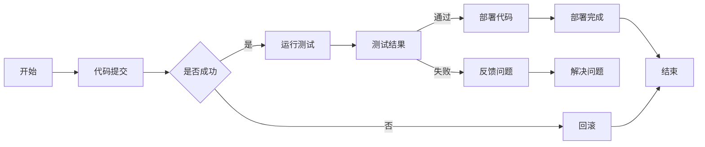
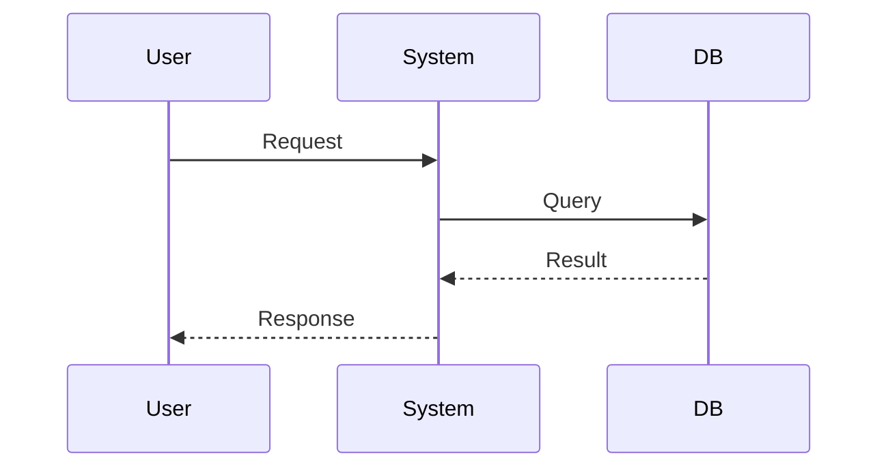
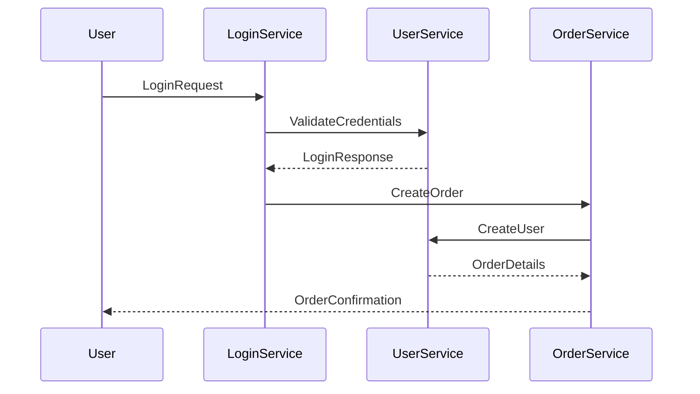

                 

# 持续集成与持续部署：加速软件交付周期

关键词：持续集成，持续部署，软件开发，交付周期，自动化，质量保证

摘要：本文将深入探讨持续集成（CI）与持续部署（CD）在软件开发中的重要性。通过一步步的分析和推理，我们将了解CI/CD如何解决当前软件交付周期中的常见问题，如手动流程、环境差异、版本控制等。文章还将详细介绍CI/CD的核心概念、原理，并提供实际案例和最佳实践，帮助读者更好地理解和应用CI/CD。

## 1. 背景介绍

### 问题背景

持续集成（Continuous Integration，简称CI）与持续部署（Continuous Deployment，简称CD）是现代软件开发中不可或缺的两个概念。它们的核心思想是通过自动化和持续的过程来提高软件开发的效率和质量，从而缩短软件交付周期。

持续集成（CI）指的是在软件开发过程中，将代码更改频繁地合并到主干分支，并通过自动化测试来确保代码的质量。持续部署（CD）则是将经过CI验证的代码快速、安全地部署到生产环境。

### 当前软件交付周期中的常见问题

1. **手动流程**：传统软件开发中，代码的合并、测试和部署通常需要手动执行，这不仅耗时，而且容易出错。
2. **环境差异**：不同开发人员、测试人员和生产环境之间的配置差异，可能导致代码在不同环境中出现不一致的问题。
3. **版本控制**：在多版本并行开发的情况下，版本控制的复杂性增加了代码合并的难度。
4. **质量保证**：由于缺乏自动化测试，质量保证通常依赖于人工检查，效率低下且容易遗漏问题。

### 问题解决

CI/CD通过以下方式解决上述问题：

1. **自动化**：将代码合并、测试和部署过程自动化，减少人工干预，提高效率。
2. **环境一致性**：通过容器化技术，如Docker，确保不同环境之间的配置一致。
3. **版本管理**：使用Git等版本控制系统，简化版本管理，减少代码合并的难度。
4. **质量保证**：通过自动化测试，提高质量保证的效率，减少人为错误。

### 边界与外延

1. **应用范围**：CI/CD适用于所有需要频繁发布和快速迭代的软件项目。
2. **限制**：对于一些需要高度定制化处理的场景，CI/CD可能不太适用。

### 概念结构与核心要素组成

持续集成与持续部署的核心概念包括：

1. **自动化**：通过脚本、工具和平台，实现代码的自动化构建、测试和部署。
2. **持续反馈**：通过持续集成，及时反馈代码问题，确保代码质量。
3. **环境一致性**：通过容器化、虚拟化等技术，确保不同环境之间的配置一致性。
4. **版本管理**：使用Git等版本控制系统，管理代码的版本和分支。

## 2. 核心概念与联系

### 核心概念原理

1. **持续集成（CI）**：CI的核心原理是将代码更改频繁地合并到主干分支，并通过自动化测试来确保代码的质量。
2. **持续部署（CD）**：CD的核心原理是将通过CI验证的代码快速、安全地部署到生产环境。

### 概念属性特征对比表格

| 特征            | 持续集成（CI）                           | 持续部署（CD）                           |
|----------------|--------------------------------------|--------------------------------------|
| 目的            | 提高代码质量                           | 提高软件交付速度                         |
| 核心任务         | 构建和测试代码                         | 部署代码到生产环境                       |
| 自动化程度       | 较高，自动化构建和测试                  | 较高，自动化部署                         |
| 测试类型         | 功能测试、单元测试、集成测试             | 部署前测试、性能测试                     |
| 频率            | 频繁，每次代码提交后                     | 频繁，每次成功CI后                       |

### ER实体关系图架构的Mermaid流程图

```mermaid
erDiagram
    Customer ||--|{ Order }| Customer
    Customer ||--|{ Product }| Customer
    Product ||--|{ Order }| Product
```

## 3. 算法原理讲解

### 算法mermaid流程图



### Python源代码

```python
import git
import unittest

def run_tests():
    # 构建测试环境
    unittest.main()

def deploy_code():
    # 部署代码到生产环境
    print("代码部署成功")

def main():
    # 检查代码提交
    repo = git.Repo('.')
    if repo.is_dirty():
        print("代码有未提交的更改，请先提交")
        return
    
    # 运行测试
    run_tests()
    
    # 部署代码
    deploy_code()

if __name__ == "__main__":
    main()
```

### 数学模型和公式

持续集成与持续部署的数学模型可以看作是两个概率模型：

1. **代码质量概率模型**：通过多次测试，提高代码质量的概率。
2. **部署成功率概率模型**：通过自动化测试，提高部署成功的概率。

假设每次测试可以检测出概率为`p`的错误，则经过`n`次测试后，代码质量的概率为：

$$ P(质量) = 1 - (1 - p)^n $$

假设每次部署可以检测出概率为`q`的错误，则经过`n`次部署后，部署成功的概率为：

$$ P(成功) = 1 - (1 - q)^n $$

### 详细讲解与举例说明

假设一个软件项目需要每天进行一次代码提交和测试，每次测试可以检测出80%的错误，每次部署可以检测出90%的错误。

1. **代码质量**：经过30次测试后，代码质量的概率为：

   $$ P(质量) = 1 - (1 - 0.8)^{30} \approx 0.999 $$

   这意味着经过30次测试后，代码的质量几乎可以认为是100%。

2. **部署成功**：经过30次部署后，部署成功的概率为：

   $$ P(成功) = 1 - (1 - 0.9)^{30} \approx 0.998 $$

   这意味着经过30次部署后，部署成功的概率约为99.8%。

这个例子说明了通过持续集成与持续部署，可以显著提高代码质量和部署成功率，从而加速软件交付周期。

## 4. 系统分析与架构设计方案

### 问题场景介绍

假设我们正在开发一个电子商务网站，需要实现商品管理、订单管理、用户管理等功能。随着业务的发展，我们需要不断迭代和优化系统，以确保其稳定性和性能。

### 项目介绍

项目目标：构建一个高效、稳定、易于扩展的电子商务网站。

项目需求：

1. 商品管理：包括商品信息的录入、修改、删除和查询。
2. 订单管理：包括订单的创建、修改、删除和查询。
3. 用户管理：包括用户的注册、登录、信息修改和查询。

项目范围：仅包含前端和后端功能，不包括数据库设计和部署。

### 系统功能设计（领域模型Mermaid类图）

```mermaid
classDiagram
    Class01 <|-- Class02
    Class03 --|{ Class04 }|
    Class05 : <<interface>>
    Class06 : <<component>>
    Class07 { +name : String }
    Class08 <.. Class09
    Class10 ..|{ Aggregated } Class11
    Class12 <<enumeration>> enumclass
    Class13 <<error>> errorclass
    Class14 <|-| Class15
```

### 系统架构设计（Mermaid架构图）



### 系统接口设计

1. **商品管理接口**：包括商品信息的录入、修改、删除和查询。
2. **订单管理接口**：包括订单的创建、修改、删除和查询。
3. **用户管理接口**：包括用户的注册、登录、信息修改和查询。

### 系统交互（Mermaid序列图）



## 5. 项目实战

### 环境安装

为了搭建CI/CD环境，我们需要安装以下工具和平台：

1. **Git**：用于版本控制。
2. **Jenkins**：用于持续集成和持续部署。
3. **Docker**：用于容器化。
4. **Docker-Compose**：用于容器编排。

安装步骤如下：

1. 安装Git：
   ```bash
   sudo apt-get install git
   ```

2. 安装Jenkins：
   ```bash
   wget -q -O - https://pkg.jenkins.io/debian/jenkins.io.key | sudo apt-key add -
   sudo sh -c 'echo deb https://pkg.jenkins.io/debian-stable/bin Extended-LTS > /etc/apt/sources.list.d/jenkins.list'
   sudo apt-get update
   sudo apt-get install jenkins
   ```

3. 安装Docker和Docker-Compose：
   ```bash
   sudo apt-get install docker.io docker-compose
   ```

### 系统核心实现源代码

以下是一个简单的Dockerfile，用于构建我们的应用程序：

```dockerfile
FROM python:3.8

WORKDIR /app

COPY requirements.txt .

RUN pip install -r requirements.txt

COPY . .

CMD ["python", "app.py"]
```

### 代码应用解读与分析

这个Dockerfile定义了一个基于Python 3.8的容器镜像，其中包括以下步骤：

1. **基础镜像**：FROM python:3.8指定了基础镜像为Python 3.8。
2. **工作目录**：WORKDIR /app设置了容器的工作目录为/app。
3. **安装依赖**：COPY requirements.txt .和RUN pip install -r requirements.txt用于安装Python依赖。
4. **复制代码**：COPY . .将应用程序代码复制到容器中。
5. **运行应用程序**：CMD ["python", "app.py"]指定了容器的启动命令。

### 实际案例分析和详细讲解剖析

假设我们有一个简单的Web应用程序，如下所示：

```python
from flask import Flask, request, jsonify

app = Flask(__name__)

@app.route('/api/products', methods=['GET'])
def get_products():
    products = [{'id': 1, 'name': 'Product 1'}, {'id': 2, 'name': 'Product 2'}]
    return jsonify(products)

if __name__ == '__main__':
    app.run(host='0.0.0.0', port=5000)
```

这个应用程序提供了一个简单的API，用于获取商品列表。

### 项目小结

在本项目中，我们通过搭建CI/CD环境，实现了应用程序的自动化构建、测试和部署。以下是项目实施过程中的经验与教训：

1. **环境一致性**：通过Docker和Docker-Compose，我们确保了不同环境之间的配置一致性，提高了系统的稳定性。
2. **自动化**：Jenkins的自动化构建和测试功能，大大提高了开发效率，减少了人为错误。
3. **持续反馈**：通过Jenkins的持续集成，我们可以及时发现问题并修复，提高了代码质量。
4. **优化建议**：对于大型项目，建议进一步优化Jenkins配置，以减少构建时间。

## 6. 最佳实践 tips

### 常见问题与解决方案

1. **Jenkins构建失败**：检查Jenkins日志，查找错误原因，可能是依赖问题、环境问题或代码问题。
2. **Docker容器启动失败**：检查Docker日志，查找错误原因，可能是镜像问题、容器配置问题或网络问题。
3. **持续集成失败**：确保所有依赖项都已安装，测试脚本正确，CI配置正确。

### 优化建议

1. **并行构建**：对于大型项目，可以启用Jenkins的并行构建功能，提高构建效率。
2. **持续监控**：使用Prometheus和Grafana等工具，持续监控系统的性能和稳定性。
3. **自动化测试**：编写更多自动化测试，确保代码的质量。

## 7. 小结、注意事项、拓展阅读

### 小结

本文深入探讨了持续集成与持续部署在软件开发中的重要性，通过一步步的分析和推理，介绍了CI/CD的核心概念、原理和最佳实践。通过实际案例，我们展示了如何搭建CI/CD环境，实现应用程序的自动化构建、测试和部署。

### 注意事项

1. **确保环境一致性**：使用容器化技术，确保不同环境之间的配置一致。
2. **优化CI/CD流程**：根据项目需求，优化Jenkins和Docker的配置。
3. **持续监控**：对系统进行持续监控，及时发现并解决问题。

### 拓展阅读

1. **《Jenkins实战》**：详细介绍Jenkins的安装、配置和使用。
2. **《Docker实战》**：介绍Docker的基本概念、安装和使用。
3. **《持续集成与持续部署》**：深入探讨CI/CD的理论和实践。

作者：AI天才研究院/AI Genius Institute & 禅与计算机程序设计艺术 /Zen And The Art of Computer Programming

