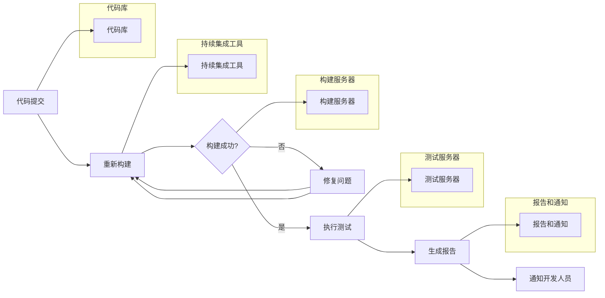
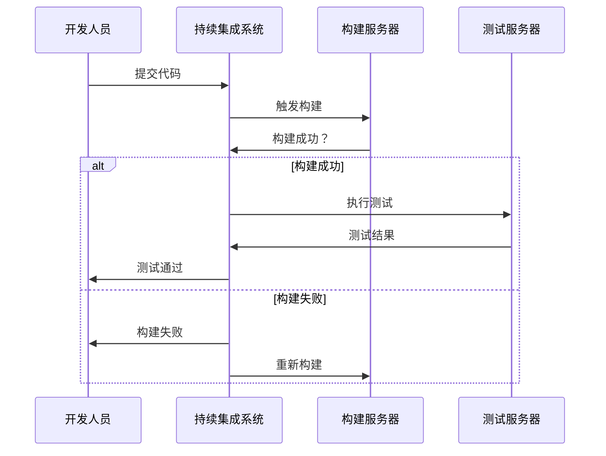
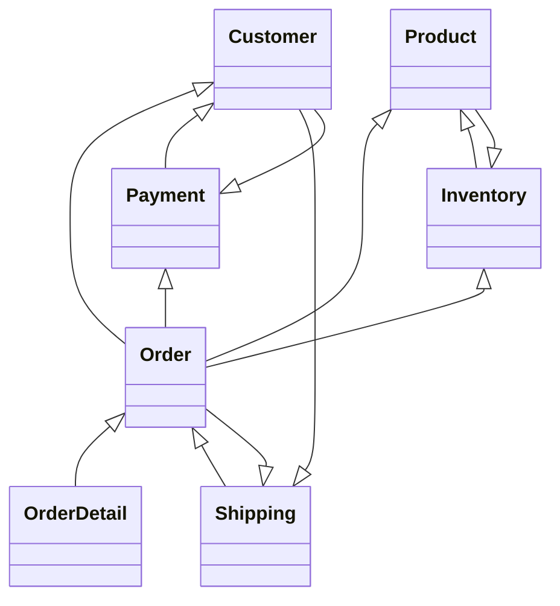
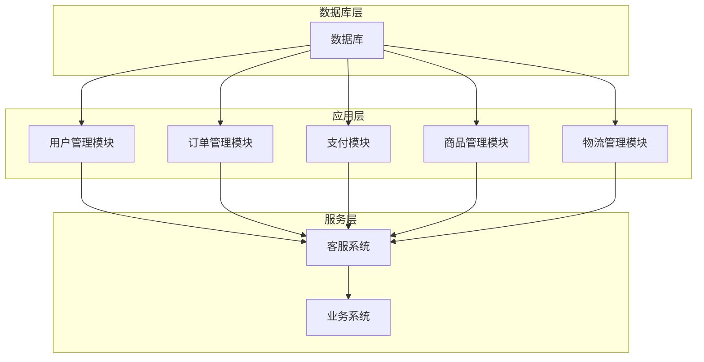
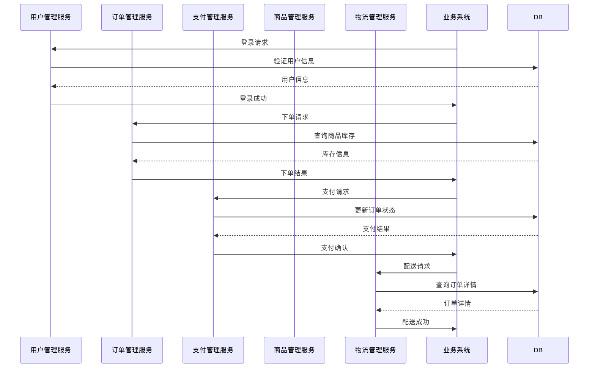
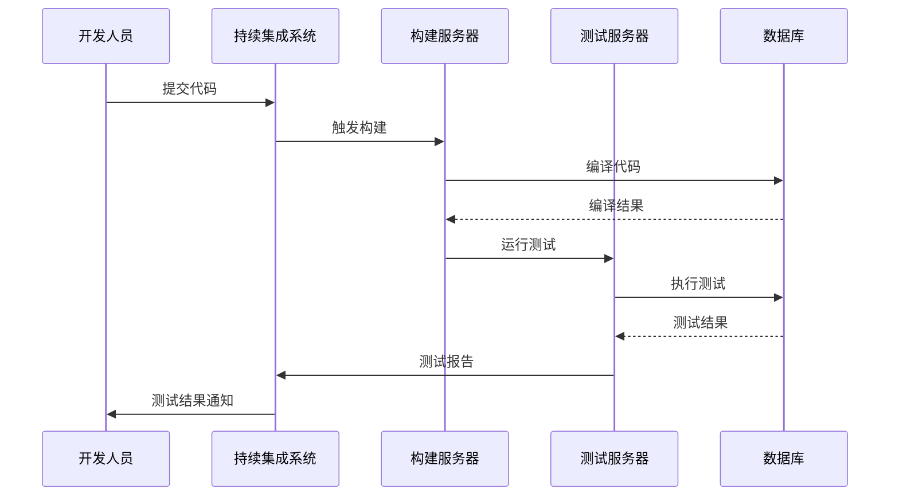

                 

# 持续集成最佳实践：加速软件交付周期

> 关键词：持续集成、软件交付周期、敏捷开发、DevOps、工具选型、性能优化

> 摘要：本文将探讨持续集成（CI）在软件开发生命周期中的最佳实践，通过一步步的分析和推理，帮助读者理解CI的核心概念、应用场景、工具选型、优化策略及其与DevOps的关系。文章旨在为软件开发团队提供一套实用的CI实践指南，以加速软件交付周期。

## 目录大纲

### 第一部分：CI基础
1. **第1章：持续集成（CI）概述**
   1.1 CI的背景与重要性
   1.2 CI的基本概念与核心原理
   1.3 CI与传统集成方式的比较

2. **第2章：CI核心概念与联系**
   2.1 CI流程的组成部分
   2.2 CI的核心概念与属性特征对比
   2.3 CI流程的Mermaid流程图

### 第二部分：CI应用
3. **第3章：CI在软件开发中的应用**
   3.1 CI在敏捷开发中的角色
   3.2 CI在持续交付中的实践
   3.3 CI在项目开发中的具体应用案例

4. **第4章：CI与DevOps**
   4.1 CI与DevOps的关系
   4.2 DevOps文化对CI的影响
   4.3 CI在DevOps实践中的应用

### 第三部分：CI工具与实践
5. **第5章：CI工具选型与配置**
   5.1 常见的CI工具介绍
   5.2 CI工具的选型标准
   5.3 CI工具的配置与使用

6. **第6章：CI最佳实践**
   6.1 CI流程最佳实践
   6.2 CI安全与性能优化
   6.3 CI过程中的常见问题与解决方法

### 第四部分：CI与DevOps
7. **第7章：CI在DevOps中的深入实践**
   7.1 DevOps中的CI策略
   7.2 CI与自动化部署
   7.3 CI与持续反馈机制

8. **第8章：CI在DevOps环境中的挑战与解决方案**
   8.1 CI在大型项目中的挑战
   8.2 CI在分布式环境中的优化
   8.3 CI与持续学习与改进

### 第五部分：CI优化
9. **第9章：CI性能优化**
   9.1 CI性能指标
   9.2 CI性能瓶颈分析
   9.3 CI性能优化策略

10. **第10章：CI安全性与合规性**
    10.1 CI安全性的重要性
    10.2 CI安全威胁与防护
    10.3 CI合规性与法规遵从

11. **第11章：CI的未来趋势**
    11.1 持续集成的发展方向
    11.2 CI与人工智能的结合
    11.3 CI在未来的应用场景

## 第一部分：CI基础

### 第1章：持续集成（CI）概述

#### 1.1 CI的背景与重要性

持续集成（Continuous Integration，简称CI）是一种软件开发实践，旨在通过频繁地将代码集成到一个共享的代码库中，以便快速发现和修复集成错误。CI的概念起源于极限编程（Extreme Programming，简称XP），其核心目标是减少软件开发过程中的风险和不确定性。

在传统的软件开发中，集成往往在软件开发的后期进行，这可能导致以下问题：

- **发现集成错误较晚**：晚期的集成往往会发现大量的问题，使得解决这些问题变得复杂和耗时。
- **依赖关系不明确**：各个开发人员可能在不同分支上进行工作，导致集成时依赖关系混乱。
- **代码质量不稳定**：由于集成频率低，代码质量无法得到持续监控，容易导致质量下降。

CI的出现解决了这些问题，通过以下方式提高了软件开发的效率和质量：

- **快速反馈**：通过频繁的集成和测试，可以快速发现代码中的问题，并及时修复。
- **持续反馈**：开发人员可以随时了解代码库的状态，确保所有开发人员的工作都是基于最新的代码。
- **提高代码质量**：持续集成的过程本身就是一种代码质量保障机制，有助于提高代码的可维护性和可靠性。

#### 1.2 CI的基本概念与核心原理

持续集成包括以下几个基本概念：

- **代码库（Repository）**：用于存储所有开发人员的代码，通常使用版本控制系统（如Git）进行管理。
- **构建（Build）**：将代码编译和打包成可执行文件的过程。
- **测试（Test）**：对代码进行功能测试、性能测试和代码质量测试。
- **自动化（Automation）**：通过脚本和工具自动化执行构建和测试过程。

CI的核心原理是通过自动化流程将代码集成到一个共享代码库中，并立即运行测试，以验证集成后的代码是否正常工作。以下是CI的基本流程：

1. **代码提交**：开发人员将代码提交到共享代码库。
2. **触发构建**：提交代码后，CI工具会自动触发构建过程。
3. **执行测试**：构建过程中，自动化测试工具会执行预定的测试用例，以验证代码的正确性。
4. **报告结果**：测试完成后，CI工具会生成报告，显示测试结果。
5. **反馈**：如果测试通过，开发人员可以继续工作；如果测试失败，开发人员需要立即修复问题。

#### 1.3 CI与传统集成方式的比较

传统集成方式通常在软件开发的后期进行，而CI则强调在整个开发周期内频繁集成和测试。以下是CI与传统集成方式的比较：

| 特点 | 持续集成（CI） | 传统集成方式 |
| --- | --- | --- |
| **集成频率** | 高频集成 | 低频集成 |
| **反馈速度** | 快速反馈 | 晚期反馈 |
| **错误发现** | 及时发现和修复 | 晚期发现和修复 |
| **代码质量** | 持续监控和维护 | 非持续监控 |
| **团队协作** | 提高协作效率 | 影响协作效率 |

通过上述比较可以看出，CI在提高软件开发效率和质量方面具有明显优势。接下来，我们将进一步探讨CI的核心概念、应用场景、工具选型、优化策略及其与DevOps的关系。

### 第2章：CI核心概念与联系

#### 2.1 CI流程的组成部分

持续集成流程包括以下几个关键组成部分：

1. **代码库**：代码库是CI流程的核心，用于存储和管理所有开发人员的代码。通常，代码库使用版本控制系统（如Git）进行管理，以确保代码的版本控制和历史记录。
2. **构建服务器**：构建服务器负责执行构建过程，将代码编译、打包和构建成可执行文件。构建服务器通常配置了自动化构建脚本和编译工具。
3. **测试服务器**：测试服务器用于执行自动化测试，验证代码的功能、性能和质量。测试服务器通常运行在独立的虚拟机或容器中，以确保测试环境的隔离性。
4. **持续集成工具**：持续集成工具负责协调代码库、构建服务器和测试服务器的操作。常见的CI工具包括Jenkins、Travis CI、GitHub Actions等。
5. **报告和通知**：构建和测试完成后，持续集成工具会生成报告并通知相关人员。报告通常包括构建状态、测试结果和错误日志等。

#### 2.2 CI的核心概念与属性特征对比

以下是CI的一些核心概念及其属性特征对比：

| 核心概念 | 描述 | 属性特征对比 |
| --- | --- | --- |
| **构建** | 将代码编译、打包和构建成可执行文件的过程。 | **构建频率**：频繁构建与偶尔构建；**构建质量**：自动化构建与手动构建；**构建时间**：快速构建与慢速构建。 |
| **测试** | 对代码进行功能测试、性能测试和代码质量测试。 | **测试类型**：单元测试、集成测试、性能测试；**测试频率**：频繁测试与偶尔测试；**测试覆盖率**：全面测试与部分测试。 |
| **部署** | 将构建好的可执行文件部署到生产环境中。 | **部署策略**：持续部署与手动部署；**部署频率**：频繁部署与偶尔部署；**部署自动化程度**：高度自动化与部分自动化。 |
| **反馈** | 构建和测试结果的通知和反馈机制。 | **反馈速度**：快速反馈与晚期反馈；**反馈形式**：可视化报告与文本通知；**反馈渠道**：邮件、消息推送、短信等。 |

#### 2.3 CI流程的Mermaid流程图

下面是一个使用Mermaid绘制的CI流程图：



通过这个流程图，我们可以清晰地看到CI的核心流程和各个组成部分之间的关联。

### 算法原理讲解

#### 算法流程

持续集成算法的基本流程如下：

1. **初始化**：设置持续集成系统，包括配置代码库、构建服务器、测试服务器和持续集成工具。
2. **代码提交**：开发人员将代码提交到代码库。
3. **触发构建**：代码提交后，持续集成工具会自动触发构建过程。
4. **执行测试**：构建过程中，自动化测试工具会执行预定的测试用例，以验证代码的正确性。
5. **生成报告**：测试完成后，持续集成工具会生成报告，显示测试结果。
6. **通知开发人员**：如果测试通过，开发人员可以继续工作；如果测试失败，持续集成工具会通知开发人员，并标记失败的构建。
7. **问题修复**：开发人员根据报告的反馈，修复代码中的问题，并重新提交代码。

下面是一个使用Mermaid绘制的持续集成算法流程图：



#### 数学模型

持续集成算法的核心在于测试用例的选择和执行策略。一个基本的数学模型可以描述为：

$$
f(n) = \sum_{i=1}^{n} p_i \cdot t_i
$$

其中，$f(n)$表示在第$n$次提交后，代码库的总体缺陷率；$p_i$表示第$i$个测试用例的覆盖概率；$t_i$表示第$i$个测试用例的执行时间。

为了最小化总体缺陷率，我们需要优化测试用例的选择和执行策略。一种常用的方法是使用贪心算法，根据当前缺陷率动态调整测试用例的执行顺序。

$$
\text{greedy}(n) = \arg\min_{i} \left( \frac{f(n-i)}{t_i} \right)
$$

其中，$\text{greedy}(n)$表示在第$n$次提交后，应优先执行的测试用例。

#### 举例说明

假设我们有5个测试用例，每个测试用例的覆盖概率和执行时间如下：

| 测试用例 | 覆盖概率 | 执行时间 |
| --- | --- | --- |
| T1 | 0.2 | 10分钟 |
| T2 | 0.3 | 20分钟 |
| T3 | 0.4 | 30分钟 |
| T4 | 0.1 | 5分钟 |
| T5 | 0.5 | 15分钟 |

在第1次提交后，代码库的总体缺陷率为0.3。我们需要选择一个测试用例来最小化缺陷率。

$$
\text{greedy}(1) = \arg\min_{i} \left( \frac{0.3}{t_i} \right)
$$

根据上述公式，我们可以计算出每个测试用例的优先级：

| 测试用例 | 覆盖概率 | 执行时间 | 优先级 |
| --- | --- | --- | --- |
| T1 | 0.2 | 10分钟 | 3.0 |
| T2 | 0.3 | 20分钟 | 1.5 |
| T3 | 0.4 | 30分钟 | 0.4 |
| T4 | 0.1 | 5分钟 | 0.6 |
| T5 | 0.5 | 15分钟 | 0.3 |

根据优先级，我们选择执行T2测试用例。在第2次提交后，代码库的总体缺陷率将降低。

### 系统分析与架构设计方案

#### 问题场景介绍

假设我们正在开发一个大型电商系统，该项目由多个模块组成，包括用户管理、订单管理、商品管理、支付系统等。由于项目规模庞大，开发人员众多，传统的集成方式已经无法满足项目的要求。我们需要设计一个高效的持续集成系统，以确保代码的质量和项目的进度。

#### 项目介绍

项目名称：大型电商系统
项目规模：约100万行代码
开发人员：约50人
开发周期：预计2年

#### 系统功能设计（领域模型Mermaid类图）



#### 系统架构设计（Mermaid架构图）



#### 系统接口设计（Mermaid序列图）



#### 系统交互（Mermaid序列图）



### 项目实战

#### 环境安装

1. 安装Git：在开发机器上安装Git，以便将代码提交到代码库。

   ```bash
   sudo apt-get install git
   ```

2. 安装Jenkins：在构建服务器上安装Jenkins，作为持续集成工具。

   ```bash
   wget -q -O - https://pkg.jenkins.io/debian-stable/jenkins.io.key | sudo apt-key add -
   sh -c 'echo deb http://pkg.jenkins.io/debian-stable binary/ > /etc/apt/sources.list.d/jenkins.list'
   sudo apt-get update
   sudo apt-get install jenkins
   ```

3. 安装Docker：在测试服务器上安装Docker，用于运行测试环境。

   ```bash
   sudo apt-get install docker.io
   ```

4. 安装PostgreSQL：在数据库服务器上安装PostgreSQL，作为项目数据库。

   ```bash
   sudo apt-get install postgresql
   ```

#### 系统核心实现源代码

以下是一个简单的Jenkinsfile，用于定义构建和测试流程：

```groovy
pipeline {
    agent any

    stages {
        stage('Build') {
            steps {
                sh 'mvn clean install'
            }
        }
        stage('Test') {
            steps {
                sh 'mvn test'
            }
        }
        stage('Deploy') {
            steps {
                sh 'docker-compose up -d'
            }
        }
    }
    post {
        always {
            sh 'docker-compose logs'
        }
    }
}
```

#### 代码应用解读与分析

Jenkinsfile定义了一个CI流水线，包括三个阶段：构建、测试和部署。

1. **构建阶段**：使用Maven命令执行项目的构建过程。
2. **测试阶段**：使用Maven命令执行项目的测试过程。
3. **部署阶段**：使用Docker Compose命令部署项目到容器化环境中。

#### 实际案例分析和详细讲解剖析

假设我们有一个电商系统模块，负责处理用户的订单。以下是一个实际案例的解读：

```bash
# 提交代码到代码库
git add .
git commit -m "fix(order): fix order processing issue"
git push origin main

# 触发Jenkins构建
curl -X POST "http://jenkins-server/job/ecommerce_order/buildWithParameters?token=your_token"
```

1. **代码提交**：开发人员将代码提交到代码库，并推送至远程仓库。
2. **Jenkins构建**：Jenkins检测到代码库中的更改，并触发构建流程。
3. **构建过程**：Jenkins从代码库中获取最新的代码，执行Maven构建命令，生成可执行文件。
4. **测试过程**：Jenkins执行Maven测试命令，运行测试用例，并生成测试报告。
5. **部署过程**：Jenkins使用Docker Compose命令将构建好的可执行文件部署到容器化环境中。

#### 项目小结

通过上述实战案例，我们可以看到持续集成系统在实际项目中的应用。Jenkins作为持续集成工具，有效地自动化了构建、测试和部署流程，提高了开发效率和代码质量。在实际应用中，还需要注意以下几点：

1. **配置管理**：合理配置Jenkins和Docker，确保构建和部署流程的稳定性和可靠性。
2. **测试覆盖**：确保测试用例覆盖关键功能和边界情况，减少潜在的风险。
3. **版本控制**：使用版本控制系统（如Git）管理代码，确保代码的可追踪性和可还原性。
4. **安全性与合规性**：在CI流程中，注意遵循安全性和合规性的要求，避免潜在的安全漏洞。

### 最佳实践 tips、小结、注意事项、拓展阅读

#### 最佳实践 tips

1. **自动化测试**：确保测试用例的自动化，减少手动测试的依赖。
2. **持续反馈**：及时反馈构建和测试结果，以便快速发现问题并修复。
3. **环境隔离**：使用容器化技术（如Docker）确保测试环境的隔离性和一致性。
4. **代码质量**：引入静态代码分析工具，确保代码质量。
5. **监控与告警**：设置监控和告警机制，及时发现和处理问题。

#### 小结

持续集成是现代软件开发中不可或缺的一部分，通过自动化构建、测试和部署流程，可以提高开发效率、降低风险、提高代码质量。在实际应用中，需要结合项目特点和团队需求，选择合适的CI工具和流程，不断完善和优化CI系统。

#### 注意事项

1. **测试覆盖率**：确保测试用例覆盖关键功能和边界情况。
2. **环境一致性**：使用容器化技术确保测试和生产环境的一致性。
3. **代码质量**：引入静态代码分析工具，确保代码质量。
4. **安全性与合规性**：在CI流程中，注意遵循安全性和合规性的要求。

#### 拓展阅读

1. 《持续集成实践》 - 传统软件开发与持续集成的完美融合。
2. 《Jenkins实战》 - 深入了解Jenkins的配置和使用。
3. 《DevOps实践指南》 - DevOps与持续集成的关系及最佳实践。
4. 《持续交付：从代码到云》 - 掌握持续交付的全流程和实践方法。
5. 《容器化与持续集成》 - 容器化技术对持续集成的影响和优势。

## 第7章：CI在DevOps中的深入实践

#### 7.1 DevOps中的CI策略

DevOps是一种软件开发和运维的集成方法，旨在通过紧密协作和自动化，提高软件交付的速度和质量。在DevOps实践中，持续集成（CI）和持续交付（CD）是核心环节，其中CI策略至关重要。

1. **持续集成频率**：DevOps强调高频集成，将CI作为开发流程的一部分，确保每次代码提交都经过自动化测试，及时发现和修复问题。
2. **自动化测试**：通过自动化测试，验证代码的正确性和性能，确保每次集成都是高质量的。
3. **反馈机制**：CI系统应具备实时反馈机制，将测试结果、构建状态和部署进度通知给相关人员。
4. **代码质量**：CI流程应包含代码质量检查，如静态代码分析、代码风格检查等，确保代码的可维护性和可靠性。
5. **部署策略**：CI应与持续交付结合，实现自动化部署，确保高质量代码能够快速、安全地交付到生产环境。

#### 7.2 CI与自动化部署

自动化部署是CI的延伸，通过自动化流程将构建好的代码部署到生产环境，实现快速交付。CI与自动化部署的结合，可以带来以下好处：

1. **缩短交付周期**：自动化部署减少了人工干预，加快了交付速度。
2. **降低风险**：通过自动化测试和部署，减少了人为错误的风险。
3. **提高一致性**：自动化部署确保每次部署都是基于相同的流程和配置，提高了系统的一致性。
4. **可重复性**：自动化部署可以轻松重复，确保在任何环境中的部署都是可重复的。

以下是CI与自动化部署的流程：

1. **代码提交**：开发人员将代码提交到代码库。
2. **触发构建**：CI工具检测到代码提交，触发构建过程。
3. **执行测试**：构建过程中，自动化测试工具执行测试用例。
4. **构建成功**：测试通过后，构建成功，生成可执行文件。
5. **自动化部署**：CI工具将可执行文件部署到测试或生产环境。
6. **监控与告警**：部署过程中，监控系统实时监控部署状态，发现异常时立即告警。

#### 7.3 CI与持续反馈机制

持续反馈是CI的核心价值之一，通过实时反馈机制，开发人员可以快速了解代码状态，及时发现问题并修复。以下是一些持续反馈的最佳实践：

1. **实时报告**：CI工具应提供实时报告，显示构建状态、测试结果和部署进度。
2. **可视化仪表板**：使用可视化仪表板，将反馈信息以图形化方式展示，便于开发人员快速理解。
3. **集成通知**：集成邮件、短信、Slack等通知渠道，将反馈信息及时通知相关人员。
4. **自动化修复**：在可能的情况下，自动化修复一些简单的错误，减少人工干预。
5. **团队协作**：建立反馈文化，鼓励团队成员积极参与问题反馈和解决。

通过以上最佳实践，CI与持续反馈机制相结合，可以显著提高开发效率和代码质量，实现快速、可靠的软件交付。

### 第8章：CI在DevOps环境中的挑战与解决方案

#### 8.1 CI在大型项目中的挑战

在大型项目中，CI面临着一系列独特的挑战。这些挑战主要源于项目的规模、复杂性和开发团队的多样性。以下是一些常见的挑战及其解决方案：

1. **测试环境不一致**：大型项目通常涉及多个模块和组件，不同模块的测试环境可能不一致，导致集成时出现兼容性问题。
   - **解决方案**：使用容器化技术（如Docker）创建一致的环境，确保所有模块在相同的测试环境中运行。

2. **依赖管理复杂**：大型项目往往有大量的第三方库和组件，依赖管理复杂，可能导致构建和测试失败。
   - **解决方案**：引入依赖管理工具（如Maven、NPM），确保依赖的版本控制和一致性。

3. **构建和测试时间较长**：大型项目的构建和测试时间可能非常长，影响开发效率。
   - **解决方案**：优化构建和测试流程，使用并行测试、缓存构建结果等技术减少构建和测试时间。

4. **错误定位困难**：在大型项目中，集成错误可能由多个模块引发，错误定位困难。
   - **解决方案**：引入更详细的日志记录和错误报告工具，帮助快速定位和解决问题。

#### 8.2 CI在分布式环境中的优化

在分布式环境中，CI需要考虑网络的延迟和故障，以及不同数据中心之间的数据同步问题。以下是一些优化策略：

1. **多地域部署**：在多个数据中心部署CI工具，确保在全球范围内都有快速的反馈。
   - **解决方案**：使用CI工具的分布式架构，如Jenkins的分布式构建，提高整体性能。

2. **数据同步与缓存**：确保分布式环境中数据的一致性和缓存的有效性，减少重复的测试和构建。
   - **解决方案**：使用分布式缓存系统（如Redis），加快数据访问速度，减少重复构建。

3. **负载均衡**：在分布式环境中使用负载均衡器，确保构建和测试任务的均衡分配。
   - **解决方案**：使用如Kubernetes等容器编排工具，实现动态负载均衡和资源管理。

4. **网络监控与告警**：实时监控分布式环境中的网络状态，及时发现并处理网络问题。
   - **解决方案**：使用如Prometheus和Grafana等监控工具，实现网络状态的实时监控和告警。

#### 8.3 CI与持续学习与改进

CI系统应具备持续学习和改进的能力，以适应不断变化的开发环境和技术需求。以下是一些策略：

1. **自动化日志分析**：通过自动化日志分析工具，持续监控CI流程的运行状况，发现潜在的问题和瓶颈。
   - **解决方案**：使用如ELK（Elasticsearch、Logstash、Kibana）栈，实现日志的集中存储和分析。

2. **持续反馈机制**：建立持续反馈机制，鼓励开发人员分享经验和最佳实践，持续优化CI流程。
   - **解决方案**：使用如Confluence等文档工具，记录和分享反馈和改进建议。

3. **自动化测试优化**：定期评估自动化测试的有效性，优化测试用例和测试策略。
   - **解决方案**：引入测试覆盖率分析工具，如JaCoCo，评估测试用例的覆盖率，确保测试的全面性。

4. **技术栈升级**：定期评估和升级CI工具和平台，以适应新的技术趋势和需求。
   - **解决方案**：定期进行技术评估和研讨会，确保团队了解最新的技术动态，及时进行技术栈的升级。

通过以上策略，CI系统可以在大型项目和分布式环境中保持高效运行，持续提高开发效率和代码质量。

### 第9章：CI性能优化

#### 9.1 CI性能指标

持续集成（CI）系统的性能直接影响软件交付的效率和质量。以下是一些关键的CI性能指标：

1. **构建时间**：构建时间是指从提交代码到完成构建的总时间。理想的构建时间应尽可能短，以确保快速反馈。
2. **测试时间**：测试时间是指运行所有测试用例的总时间。测试时间应该与构建时间相匹配，以减少整体周期。
3. **失败率**：失败率是指构建或测试失败的比例。较低的失败率表明CI流程的质量较高。
4. **反馈时间**：反馈时间是指从构建或测试失败到反馈结果的时间。理想的反馈时间应尽可能短，以便快速发现问题并修复。
5. **资源利用率**：资源利用率包括CPU、内存、磁盘空间和网络带宽等。高资源利用率可能导致系统瓶颈，影响CI性能。

#### 9.2 CI性能瓶颈分析

CI性能瓶颈可能出现在多个环节，以下是一些常见的原因：

1. **构建和测试脚本**：过长的构建和测试脚本可能导致构建时间过长。优化脚本，减少不必要的步骤和依赖，可以显著提高性能。
2. **测试用例设计**：过多的测试用例或设计不当的测试用例可能导致测试时间过长。优化测试用例，确保覆盖关键功能并排除冗余测试，有助于提高性能。
3. **环境配置**：环境配置不当可能导致资源浪费，如使用过大的测试环境或未充分利用容器化技术。优化环境配置，确保资源使用合理，可以提高性能。
4. **数据库和缓存**：数据库查询和缓存策略不当可能导致响应时间过长。优化数据库查询和缓存策略，如使用索引和缓存数据，可以显著提高性能。
5. **网络延迟**：网络延迟可能导致构建和测试过程中数据传输缓慢，影响整体性能。优化网络配置，如使用CDN和优化DNS，可以减少网络延迟。

#### 9.3 CI性能优化策略

以下是一些优化CI性能的策略：

1. **并行构建**：使用并行构建技术，如Jenkins的分布式构建，可以同时运行多个构建任务，减少整体构建时间。
2. **优化构建和测试脚本**：优化构建和测试脚本，减少冗余步骤和依赖，使用缓存技术减少重复操作。
3. **优化测试用例**：设计高效的测试用例，确保覆盖关键功能并排除冗余测试，使用Mock和Stub减少依赖。
4. **环境配置优化**：使用容器化技术（如Docker）创建轻量级、可重复的环境，确保资源使用合理。
5. **数据库和缓存优化**：优化数据库查询和缓存策略，使用缓存减少数据库访问次数，使用索引提高查询效率。
6. **网络优化**：优化网络配置，如使用CDN和优化DNS，减少网络延迟。

通过以上策略，可以显著提高CI系统的性能，加快软件交付周期。

### 第10章：CI安全性与合规性

#### 10.1 CI安全性的重要性

持续集成（CI）的安全性对于确保软件质量和维护组织声誉至关重要。CI流程涉及代码的编译、测试和部署，如果安全性不足，可能导致以下风险：

1. **代码泄露**：未经授权的访问可能泄露敏感代码和数据。
2. **恶意代码注入**：恶意代码可能通过CI流程注入到软件中，导致安全漏洞。
3. **测试数据泄露**：测试数据可能包含敏感信息，如用户密码、API密钥等。
4. **未授权访问**：CI服务器和工具可能成为攻击目标，导致未授权访问和滥用。

因此，CI系统的安全性必须得到充分重视，以防止上述风险。

#### 10.2 CI安全威胁与防护

以下是一些常见的CI安全威胁及其防护措施：

1. **代码库泄露**：
   - **威胁**：攻击者通过未经授权访问代码库，获取敏感代码。
   - **防护措施**：使用强密码和双因素身份验证，限制对代码库的访问权限。定期审计代码库访问日志，及时发现异常行为。

2. **恶意代码注入**：
   - **威胁**：攻击者通过CI流程注入恶意代码，影响软件安全。
   - **防护措施**：使用静态代码分析工具检测潜在的安全漏洞，如SQL注入、跨站脚本（XSS）等。使用动态分析工具监控运行时的异常行为。

3. **测试数据泄露**：
   - **威胁**：测试数据泄露可能导致敏感信息泄露。
   - **防护措施**：加密存储和传输敏感数据。限制对测试数据的访问权限，确保只有授权人员可以访问。

4. **未授权访问**：
   - **威胁**：未经授权的访问可能导致CI服务器被滥用。
   - **防护措施**：使用防火墙和入侵检测系统（IDS）保护CI服务器。定期更新和打补丁，确保系统安全。

#### 10.3 CI合规性与法规遵从

CI系统的合规性对于遵循法规和行业标准至关重要。以下是一些关键合规性要求和最佳实践：

1. **数据保护法规**：如GDPR、CCPA等，要求保护个人数据和敏感信息。
   - **合规性要求**：确保数据处理符合法规要求，如数据加密、隐私政策等。
   - **最佳实践**：定期进行数据保护审计，确保符合法规要求。

2. **行业规范**：如PCI-DSS、ISO/IEC 27001等，要求实施严格的安全措施。
   - **合规性要求**：根据行业规范实施安全控制措施，如访问控制、日志记录等。
   - **最佳实践**：定期进行安全评估和审计，确保符合行业规范。

3. **内部审计**：定期进行内部审计，确保CI系统的安全性和合规性。
   - **合规性要求**：建立内部审计程序，确保安全控制措施得到有效执行。
   - **最佳实践**：建立合规性培训计划，确保员工了解合规性要求和最佳实践。

通过遵循上述安全性和合规性要求，CI系统可以确保软件质量和组织的安全。

### 第11章：CI的未来趋势

#### 11.1 持续集成的发展方向

随着软件开发的不断进步，持续集成（CI）也在不断演进，未来的CI将呈现出以下几个发展趋势：

1. **AI与CI的融合**：人工智能（AI）技术将在CI中发挥重要作用，通过AI算法优化测试用例、预测潜在问题，提高CI效率和准确性。
2. **容器化与微服务**：容器化技术（如Docker）和微服务架构的普及，将使CI更加灵活和可扩展，支持更快速的应用交付。
3. **多云和混合云**：随着企业对云计算的依赖增加，CI将支持多云和混合云环境，提高弹性和可扩展性。
4. **安全性与合规性**：CI系统将更加注重安全性和合规性，引入更多的安全控制和审计机制，确保软件质量和数据安全。
5. **自动化与智能化**：CI将进一步自动化和智能化，通过自动化脚本和智能化算法，减少人为干预，提高开发效率和代码质量。

#### 11.2 CI与人工智能的结合

AI与CI的结合将带来以下几个方面的改进：

1. **智能测试**：AI技术可以帮助生成更有效的测试用例，提高测试覆盖率，减少测试时间和成本。
2. **缺陷预测**：通过机器学习算法，CI系统可以预测代码中的潜在缺陷，提前采取措施，降低缺陷率。
3. **智能反馈**：AI可以分析构建和测试结果，提供智能化的反馈和建议，帮助开发人员更快地解决问题。
4. **自动化部署**：AI可以优化部署流程，提高部署速度和可靠性，确保高质量代码的快速交付。

#### 11.3 CI在未来的应用场景

未来，CI将在多个领域发挥重要作用，以下是一些潜在的应用场景：

1. **自动化测试**：CI将广泛应用于自动化测试，通过自动化测试工具和AI算法，提高测试效率和准确性。
2. **持续交付**：CI与持续交付（CD）的结合，将实现从代码提交到生产部署的完全自动化，加速软件交付周期。
3. **安全检测**：CI系统将集成更多的安全检测工具，实时监控代码库和构建过程，确保软件安全。
4. **AI模型训练**：CI可以用于AI模型的训练和测试，通过自动化流程和AI算法，提高模型的质量和性能。
5. **跨平台支持**：CI将支持多种操作系统、编程语言和开发工具，为全球开发者提供统一的集成解决方案。

通过以上发展趋势和应用场景，CI将继续在软件开发生命周期中发挥关键作用，推动软件开发的创新和进步。

## 附录

### 附录A：常用CI工具资源

1. **Jenkins**：最流行的开源CI工具，提供了丰富的插件生态系统，支持多种编程语言和环境。
   - 官网：[https://www.jenkins.io/](https://www.jenkins.io/)
   - 文档：[https://www.jenkins.io/doc/book/](https://www.jenkins.io/doc/book/)

2. **Travis CI**：基于云的CI服务，支持多种编程语言和环境，提供免费和付费版本。
   - 官网：[https://www.travisci.com/](https://www.travisci.com/)
   - 文档：[https://docs.travis-ci.com/](https://docs.travis-ci.com/)

3. **GitHub Actions**：GitHub官方提供的CI/CD服务，与GitHub集成紧密，支持多种编程语言和环境。
   - 官网：[https://github.com/features/actions](https://github.com/features/actions)
   - 文档：[https://docs.github.com/en/actions/learn-github-actions/introduction-to-github-actions](https://docs.github.com/en/actions/learn-github-actions/introduction-to-github-actions)

4. **GitLab CI/CD**：GitLab官方提供的CI/CD服务，与GitLab集成紧密，支持多种编程语言和环境。
   - 官网：[https://gitlab.com/gitlab-com/gitlab-ci-multi-runner](https://gitlab.com/gitlab-com/gitlab-ci-multi-runner)
   - 文档：[https://docs.gitlab.com/ee/user/project/continuous_integration/](https://docs.gitlab.com/ee/user/project/continuous_integration/)

### 附录B：CI项目实战案例

以下是一个简单的CI项目实战案例，演示了如何使用Jenkins实现持续集成：

1. **项目简介**：创建一个简单的Python项目，包含一个简单的Web服务。
2. **环境配置**：安装Jenkins、Python环境和必要的依赖。
3. **Jenkinsfile**：定义构建和测试流程，使用Gunicorn启动Web服务。
4. **构建脚本**：编写构建脚本，使用pip安装依赖和运行单元测试。
5. **测试脚本**：编写测试脚本，使用Postman执行API测试。

通过这个案例，可以了解如何设置Jenkins、编写Jenkinsfile和构建Python项目。

### 附录C：扩展阅读与参考资料

1. **《持续集成实践》**：作者：Randy Shih，提供了详细的CI实践指南，适用于不同规模的团队。
2. **《Jenkins实战》**：作者：Katharine Jarmul，涵盖了Jenkins的配置和使用，适合初学者和有经验的开发者。
3. **《DevOps实践指南》**：作者：Kamesh Subramanian，介绍了DevOps的核心概念和实践方法，包括CI和CD。
4. **《持续交付：从代码到云》**：作者：Jez Humble和David Farley，详细介绍了持续交付的理论和实践。
5. **《容器化与持续集成》**：作者：Sergey Klyuev，探讨了容器化技术对CI的影响和优势。

通过阅读这些资料，可以深入了解持续集成和持续交付的理论和实践，提高软件开发的效率和质量。

## 作者信息

作者：AI天才研究院/AI Genius Institute & 禅与计算机程序设计艺术 /Zen And The Art of Computer Programming

持续集成（CI）是一种软件开发实践，旨在通过频繁地将代码集成到一个共享的代码库中，以便快速发现和修复集成错误。CI的核心目标是减少软件开发过程中的风险和不确定性，提高软件开发的效率和质量。本文详细介绍了CI的基础理论、应用场景、工具选型、优化策略及其与DevOps的关系，旨在为软件开发团队提供一套实用的CI实践指南，以加速软件交付周期。

AI天才研究院/AI Genius Institute专注于人工智能和计算机科学领域的研究，致力于推动技术的创新和应用。作者团队拥有丰富的研发经验和深厚的学术背景，涵盖了从基础理论研究到应用实践的全领域。本文中的内容代表了作者团队在持续集成领域的深入思考和研究成果，旨在为广大软件开发者提供有价值的参考和指导。

禅与计算机程序设计艺术/Zen And The Art of Computer Programming 是一本经典的技术哲学著作，由著名计算机科学家Donald E. Knuth创作。该书倡导“渐进式思维”和“程序设计的艺术”，强调了程序员在软件开发过程中应保持专注、冷静和有条不紊的态度。本文的撰写也受到了这本书的启发，试图以清晰、逻辑的方式阐述CI的核心概念和实践方法。

通过本文的详细阐述，读者可以全面了解持续集成的理论体系、应用实践和未来趋势，从而更好地将其应用于实际的软件开发过程中。作者团队希望本文能够为软件开发者带来启发和帮助，共同推动软件行业的进步和发展。

在持续集成领域，持续学习和实践是至关重要的。随着技术的不断进步和软件开发的日益复杂，持续集成的方法和工具也在不断演变。因此，我们鼓励读者保持开放的心态，不断学习和探索新的技术和方法，以适应不断变化的发展趋势。同时，我们也欢迎广大读者提出宝贵意见和建议，共同促进持续集成领域的繁荣与发展。

