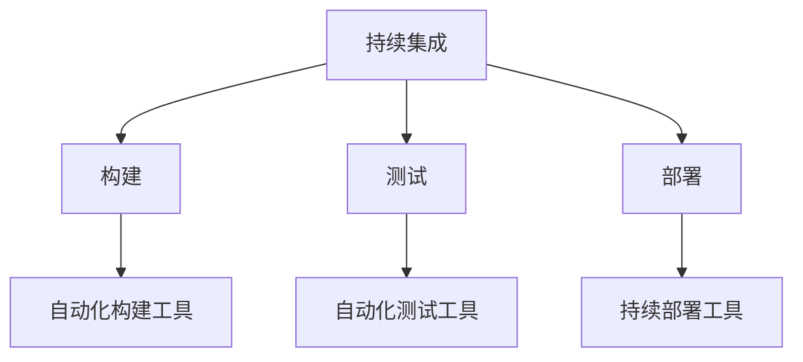
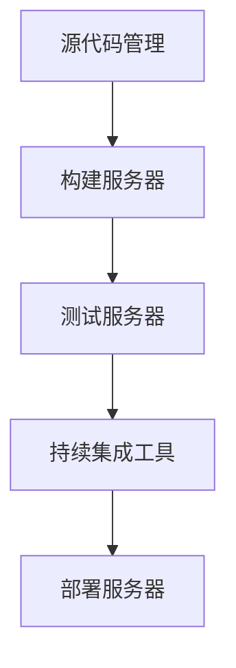
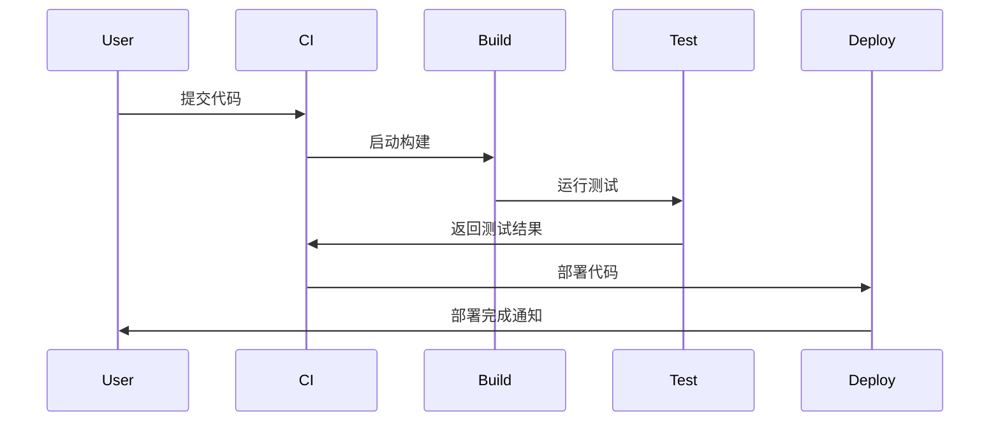

                 

### 《持续集成：自动化的构建与测试流程》

#### 关键词：持续集成、自动化构建、测试流程、持续部署、最佳实践

#### 摘要：
本文将深入探讨持续集成（CI）的概念、原理和实践，重点关注其在构建和测试自动化流程中的应用。我们将分步骤分析持续集成的基础知识，构建与测试自动化工具的选择与使用，以及持续集成与持续部署的流程和策略。通过案例分析，我们将展示如何在不同项目中实施持续集成，并总结最佳实践，展望持续集成的发展趋势和未来应用前景。

---

### 第一部分：持续集成基础与原理

#### 第1章：持续集成概述

##### 1.1.1 持续集成的起源与发展

持续集成（Continuous Integration，简称CI）是一种软件开发实践，旨在通过频繁的代码集成和自动化测试，确保代码库始终处于可工作状态。这一概念的起源可以追溯到1910年代泰勒的科学管理理论，随后在软件开发领域得到发扬光大。

在敏捷开发方法普及之前，软件项目通常采用瀑布式开发模型，其中每个开发阶段（如需求分析、设计、开发、测试等）依次完成，然后再进行集成。这种方法往往导致集成阶段出现大量的bug，并且延迟了新功能的交付。

持续集成理念的出现，改变了这一现状。其核心思想是，团队成员应频繁地将自己的代码集成到共享的代码库中，并通过自动化测试确保新代码与现有代码的兼容性。这种方法不仅提高了代码质量，还加速了新功能的交付。

##### 1.1.2 持续集成的核心概念

- **代码库**：所有开发者的代码共同存储在一个中央仓库中，确保版本的一致性。
- **频繁集成**：开发者频繁地将代码集成到主分支，通常每天多次。
- **自动化测试**：集成过程中，自动化测试工具执行一系列预定义的测试，确保代码质量。
- **反馈机制**：自动化测试结果即时反馈给开发者，帮助他们快速定位和修复问题。

##### 1.1.3 持续集成的优势和挑战

持续集成的优势包括：

- **提高代码质量**：频繁的集成和测试能够及时发现和修复问题，确保代码库的稳定性。
- **加速开发速度**：通过自动化流程，开发、测试和部署的效率得到提升。
- **减少集成风险**：频繁的小规模集成降低了大规模集成的风险。

然而，持续集成也面临一些挑战：

- **基础设施和工具的投入**：建立和维护持续集成环境需要一定的资源和时间。
- **开发和测试流程的重构**：团队成员需要适应新的开发模式，调整工作习惯。
- **测试覆盖率**：为了确保持续集成效果，需要充分的测试覆盖率。

#### 第2章：持续集成流程与工具

##### 2.1.1 持续集成的基本流程

持续集成的基本流程包括以下步骤：

1. **代码提交**：开发者将代码提交到共享代码库。
2. **构建触发**：提交代码后，持续集成服务器自动启动构建过程。
3. **构建**：构建工具编译代码，生成可执行文件或库文件。
4. **测试**：运行自动化测试脚本，验证代码的功能和性能。
5. **反馈**：测试结果反馈给开发者，包括成功或失败的报告。
6. **部署**：如果测试通过，则将代码部署到测试或生产环境。

##### 2.1.2 常用持续集成工具介绍

目前，市场上有很多持续集成工具，以下是一些常用的工具：

- **Jenkins**：开源的持续集成服务器，支持多种插件，功能强大。
- **GitLab CI/CD**：GitLab 提供的持续集成和持续部署解决方案，集成在 GitLab 仓库中。
- **Travis CI**：适用于 GitHub 项目的持续集成服务，配置简单。
- **CircleCI**：云端的持续集成服务，支持多种编程语言和平台。

##### 2.1.3 持续集成的配置与管理

配置持续集成环境需要以下步骤：

1. **选择工具**：根据项目需求选择合适的持续集成工具。
2. **安装和配置**：安装工具并配置所需的环境和插件。
3. **编写构建脚本**：定义构建和测试过程，确保自动化执行。
4. **监控和报告**：设置监控和报告机制，确保开发者和团队及时了解构建和测试状态。

#### 第3章：构建与自动化构建

##### 3.1.1 构建过程概述

构建过程是将源代码转换为可执行程序或库的过程。构建过程通常包括以下步骤：

1. **编译**：将源代码编译成机器码或字节码。
2. **链接**：将编译后的代码与库文件和框架链接，生成可执行文件。
3. **打包**：将构建结果打包成安装包或部署包。

##### 3.1.2 自动化构建工具与脚本

自动化构建工具可以简化构建过程，提高构建效率。以下是一些常用的自动化构建工具：

- **Maven**：Java项目的自动化构建工具，基于项目文件（pom.xml）进行配置。
- **Gradle**：基于DSL的构建工具，支持多种编程语言。
- **Make**：经典的自动化构建工具，用于编译和构建复杂项目。
- **Gulp**：用于前端项目的构建和自动化任务管理。

编写自动化构建脚本的关键是：

1. **定义构建任务**：明确构建过程中的所有步骤。
2. **配置依赖关系**：确保构建过程中的依赖项正确配置。
3. **优化构建速度**：减少不必要的步骤，提高构建效率。

##### 3.1.3 常见构建问题与解决方案

常见的构建问题包括：

- **编译错误**：源代码中存在语法错误或类型错误。
- **链接错误**：编译后的代码无法与库文件正确链接。
- **依赖冲突**：不同依赖项之间存在版本冲突。

解决方案包括：

- **检查代码**：仔细检查源代码，确保没有语法错误和类型错误。
- **更新依赖**：更新依赖项到最新版本，解决版本冲突。
- **排除冲突**：通过配置依赖管理工具，排除不必要的依赖冲突。

#### 第4章：测试与自动化测试

##### 4.1.1 软件测试概述

软件测试是确保软件质量和可靠性的重要环节。测试的主要目标是：

- **验证功能**：确保软件实现了预期的功能。
- **发现缺陷**：识别软件中的缺陷和错误。
- **评估性能**：评估软件的性能和可扩展性。

常见的测试类型包括：

- **单元测试**：针对单个模块或函数的测试，通常由开发者编写。
- **集成测试**：测试模块之间的集成和交互，通常由测试团队执行。
- **系统测试**：测试整个系统的功能、性能和兼容性。
- **验收测试**：验证软件是否满足客户需求，通常由客户或用户执行。

##### 4.1.2 自动化测试工具与技术

自动化测试工具可以简化测试过程，提高测试效率。以下是一些常用的自动化测试工具：

- **Selenium**：Web应用的自动化测试工具，支持多种浏览器和编程语言。
- **JUnit**：Java的单元测试框架，支持编写和执行单元测试。
- **TestNG**：Java的测试框架，支持复杂测试场景和多重测试。
- **JMeter**：性能测试工具，用于模拟用户负载和测试系统的性能。

自动化测试的关键是：

1. **编写测试脚本**：编写测试脚本，模拟用户操作和验证预期结果。
2. **执行测试**：运行测试脚本，收集测试结果。
3. **分析报告**：分析测试结果，识别缺陷和错误。

##### 4.1.3 测试覆盖率与测试报告

测试覆盖率是评估测试质量的重要指标。测试覆盖率包括：

- **语句覆盖率**：测试脚本覆盖了源代码中的每条语句。
- **分支覆盖率**：测试脚本覆盖了源代码中的每个分支。
- **路径覆盖率**：测试脚本覆盖了源代码中的所有路径。

测试报告应包括以下内容：

- **测试结果**：详细记录测试执行结果，包括成功和失败的测试用例。
- **缺陷报告**：列出测试中发现的缺陷和错误，以及解决方案。
- **性能指标**：记录测试过程中的性能指标，如响应时间、吞吐量等。

#### 第5章：持续集成与持续部署

##### 5.1.1 持续部署概述

持续部署（Continuous Deployment，简称CD）是持续集成的一个延伸，它强调在持续集成的基础上，将代码自动部署到生产环境。持续部署的目标是：

- **减少部署时间**：通过自动化流程，将部署时间缩短到最小。
- **提高部署质量**：确保每次部署都是经过测试和验证的。
- **快速反馈**：将新功能快速交付给用户，获取反馈。

##### 5.1.2 持续部署流程与策略

持续部署的基本流程包括：

1. **代码提交**：开发者将代码提交到代码库。
2. **构建与测试**：持续集成工具执行构建和自动化测试。
3. **部署准备**：配置和准备部署环境。
4. **自动化部署**：将代码部署到生产环境。
5. **监控与反馈**：监控部署后的系统状态，收集用户反馈。

持续部署的策略包括：

- **蓝绿部署**：将新版本部署到一部分生产环境，观察其运行状态，再逐步切换到整个生产环境。
- **灰度发布**：将新版本部署到一小部分用户，观察其反馈，再逐步扩大到全部用户。
- **自动回滚**：如果部署后出现问题，自动回滚到上一个稳定版本。

##### 5.1.3 持续部署风险与应对

持续部署的风险包括：

- **部署失败**：部署过程中可能出现错误，导致系统不可用。
- **性能问题**：新版本可能引入性能问题，影响用户体验。
- **安全性问题**：新版本可能存在安全漏洞。

应对策略包括：

- **自动化测试**：确保部署前通过严格的自动化测试。
- **监控和告警**：部署后持续监控系统状态，及时发现问题。
- **备份和回滚**：备份生产环境，确保出现问题时可以快速回滚。

#### 第6章：持续集成实践案例分析

##### 6.1.1 案例一：企业级项目实践

某大型企业在其软件项目中引入了持续集成，以下是其实践过程：

1. **基础设施搭建**：搭建了Jenkins服务器，配置了所需的插件和依赖。
2. **代码库管理**：所有开发者的代码提交到GitLab仓库，通过GitLab CI配置持续集成流程。
3. **构建脚本编写**：编写了Maven构建脚本，定义了构建、测试和部署过程。
4. **自动化测试**：编写了JUnit和Selenium测试脚本，确保代码质量。
5. **持续部署**：通过GitLab CI配置了持续部署流程，实现了自动化的部署。

通过持续集成，该企业的项目开发效率大幅提高，代码质量得到了保障，同时减少了集成风险和部署时间。

##### 6.1.2 案例二：开源项目实践

某开源项目团队采用了Travis CI进行持续集成，其实践过程如下：

1. **项目配置**：在GitHub仓库中配置了`.travis.yml`文件，定义了构建和测试流程。
2. **自动化测试**：编写了Python和JavaScript的测试脚本，并集成到Travis CI中。
3. **代码质量分析**：利用Travis CI的代码质量分析插件，监控代码质量。
4. **发布与反馈**：每次代码提交后，Travis CI自动执行构建和测试，并将结果反馈给开发者。

通过持续集成，该开源项目保证了高质量的代码，同时加快了新功能的交付。

##### 6.1.3 案例三：敏捷开发环境下的持续集成实践

某敏捷开发团队在敏捷开发过程中引入了持续集成，其实践过程如下：

1. **迭代规划**：在每次迭代开始时，规划构建和测试任务。
2. **每日集成**：每日开发结束后，执行自动化构建和测试。
3. **迭代评审**：每次迭代结束后，进行代码评审和集成测试。
4. **持续反馈**：通过持续集成工具收集测试结果和缺陷报告，及时反馈给团队成员。

通过持续集成，该敏捷开发团队实现了快速迭代和高效开发，同时保证了代码质量。

#### 第7章：持续集成最佳实践与展望

##### 7.1.1 持续集成最佳实践

为了实现持续集成的最佳效果，以下是一些建议：

- **建立稳定的持续集成环境**：确保基础设施和工具的稳定运行。
- **编写高质量的构建和测试脚本**：确保脚本的可读性和可维护性。
- **提高测试覆盖率**：确保测试覆盖主要功能和边界情况。
- **定期更新和优化**：定期检查和优化持续集成流程。
- **培训团队成员**：确保团队成员了解持续集成的重要性和操作方法。

##### 7.1.2 持续集成工具的发展趋势

持续集成工具正朝着以下方向发展：

- **云计算集成**：持续集成工具逐渐与云计算平台（如AWS、Azure、Google Cloud）集成，提供更强大的扩展性和灵活性。
- **AI和机器学习**：利用AI和机器学习技术，提高自动化测试的效率和准确性。
- **容器化与微服务**：持续集成工具支持容器化和微服务架构，实现更灵活的部署和管理。

##### 7.1.3 持续集成在未来的应用前景

持续集成在未来将继续在软件开发中发挥重要作用：

- **智能化**：持续集成将更智能，通过机器学习和AI技术，自动识别和修复潜在问题。
- **跨领域应用**：持续集成将扩展到更多领域，如移动应用、物联网、区块链等。
- **敏捷开发与DevOps**：持续集成与敏捷开发和DevOps紧密结合，推动软件开发的进一步敏捷化和自动化。

### 第二部分：核心概念与联系

#### 第8章：核心概念原理

##### 8.1.1 持续集成与持续部署的差异

持续集成（CI）和持续部署（CD）都是敏捷开发中的重要实践，但它们的关注点和应用场景有所不同。

- **持续集成**：持续集成强调频繁地将代码集成到主分支，并通过自动化测试确保代码质量。其主要目标是确保代码库始终处于可工作状态，减少集成风险。
- **持续部署**：持续部署在持续集成的基础上，将代码自动部署到生产环境。其主要目标是实现快速反馈和高效部署，确保新功能快速交付给用户。

持续集成关注代码质量和集成风险，持续部署关注部署速度和用户反馈。两者共同构成了敏捷开发的核心流程。

##### 8.1.2 构建脚本与自动化构建脚本的区别

构建脚本和自动化构建脚本在概念上有所重叠，但它们的应用场景和功能有所不同。

- **构建脚本**：构建脚本通常是指手工编写的脚本，用于执行构建过程的各种任务。它可以是Shell脚本、批处理文件或Makefile等。
- **自动化构建脚本**：自动化构建脚本是在构建过程中自动执行的一系列命令和操作。它通常由持续集成工具调用，通过配置文件定义构建流程。

构建脚本和自动化构建脚本的区别在于：

- **可维护性**：自动化构建脚本更易于维护，可以通过配置文件进行修改，而不需要修改脚本本身。
- **可扩展性**：自动化构建脚本支持扩展和插件，可以集成更多的构建工具和测试工具。
- **自动化程度**：自动化构建脚本可以自动化执行整个构建过程，包括编译、测试和部署等任务。

##### 8.1.3 单元测试与集成测试的关联

单元测试和集成测试都是软件测试的重要组成部分，它们在测试过程中相互关联，共同确保代码的质量。

- **单元测试**：单元测试是对单个模块或函数的测试，通常由开发者编写。它的目标是验证模块的功能和逻辑是否正确。
- **集成测试**：集成测试是对多个模块集成的测试，通常由测试团队执行。它的目标是验证模块之间的交互和集成是否正确。

单元测试和集成测试的关联在于：

- **测试覆盖**：单元测试可以确保每个模块的功能和逻辑得到验证，而集成测试可以确保模块之间的交互和集成正确。
- **缺陷发现**：单元测试可以及时发现模块内部的缺陷，而集成测试可以发现模块之间的缺陷。
- **反馈机制**：单元测试和集成测试的结果都可以为开发者和测试团队提供反馈，帮助他们识别和修复问题。

通过结合单元测试和集成测试，可以更全面地验证代码的质量，确保软件的稳定性和可靠性。

### 概念属性特征对比表格

| 概念     | 特征1   | 特征2   | 特征3   | 关联关系 |
|----------|--------|--------|--------|--------|
| 持续集成 | 自动化  | 灵活性  | 可重复性 | 简化流程 |
| 自动化构建 | 脚本化  | 高效性  | 可维护性 | 支持持续集成 |
| 测试自动化 | 自动化  | 准确性  | 可扩展性 | 支持持续集成 |
| 持续部署 | 自动化  | 可控性  | 安全性  | 持续集成后的后续步骤 |

### ER实体关系图架构



### 第三部分：算法原理讲解

#### 第11章：构建算法原理

##### 11.1.1 构建过程概述

构建过程是将源代码转换为可执行程序或库的过程。构建过程通常包括以下步骤：

1. **编译**：将源代码编译成机器码或字节码。
2. **链接**：将编译后的代码与库文件和框架链接，生成可执行文件。
3. **打包**：将构建结果打包成安装包或部署包。

构建过程的关键是确保编译和链接的准确性，以及打包的可执行性。为了实现这一目标，构建算法需要处理以下问题：

- **依赖管理**：确定源代码中的依赖关系，并确保所有依赖项都已下载和正确配置。
- **编译优化**：优化编译过程，提高编译速度和效率。
- **链接优化**：优化链接过程，减少可执行文件的大小和提高运行效率。
- **错误处理**：处理编译和链接过程中的错误和异常，确保构建过程顺利进行。

##### 11.1.2 构建脚本编写

构建脚本用于定义和执行构建过程的各种任务。编写构建脚本的关键是：

- **模块化**：将构建过程分解为多个模块，每个模块负责完成特定的任务。
- **可配置性**：构建脚本应具备高度的可配置性，允许开发者根据项目需求自定义构建过程。
- **可维护性**：构建脚本应具有良好的可读性和可维护性，便于后续修改和优化。

以下是使用Python编写的示例构建脚本：

```python
import subprocess

def compile_source():
    subprocess.run(["gcc", "-o", "main", "src/main.c"])

def link_objects():
    subprocess.run(["gcc", "-o", "main", "src/main.o", "-lstdc++"])

def build_project():
    compile_source()
    link_objects()
    print("Build completed successfully.")

if __name__ == "__main__":
    build_project()
```

##### 11.1.3 常用构建工具使用

常用的构建工具包括Maven、Gradle和Make等。以下分别介绍这些工具的基本用法。

- **Maven**：Maven是基于项目文件的构建工具，使用XML格式的`pom.xml`文件定义项目依赖和构建过程。

示例Maven构建项目：

```xml
<project xmlns="http://maven.apache.org/POM/4.0.0"
    xmlns:xsi="http://www.w3.org/2001/XMLSchema-instance"
    xsi:schemaLocation="http://maven.apache.org/POM/4.0.0 http://maven.apache.org/xsd/maven-4.0.0.xsd">
    <modelVersion>4.0.0</modelVersion>
    <groupId>com.example</groupId>
    <artifactId>my-project</artifactId>
    <version>1.0-SNAPSHOT</version>
    <dependencies>
        <dependency>
            <groupId>junit</groupId>
            <artifactId>junit</artifactId>
            <version>4.13.2</version>
            <scope>test</scope>
        </dependency>
    </dependencies>
</project>
```

执行Maven构建命令：

```shell
mvn install
```

- **Gradle**：Gradle是基于DSL的构建工具，使用Groovy语言定义构建过程。

示例Gradle构建脚本：

```groovy
task compile {
    doLast {
        println "Compiling source code..."
    }
}

task link {
    dependsOn compile
    doLast {
        println "Linking objects..."
    }
}

task build {
    dependsOn link
    doLast {
        println "Build completed successfully."
}
```

执行Gradle构建命令：

```shell
gradle build
```

- **Make**：Make是基于规则文件的构建工具，使用Makefile定义构建过程。

示例Makefile：

```makefile
CC=gcc
CFLAGS=-Wall -Werror
LDFLAGS=-lstdc++

main: main.o
    $(CC) $^ -o $@ $(LDFLAGS)

main.o: main.c
    $(CC) $(CFLAGS) -c $^

clean:
    rm -f main.o main
```

执行Make构建命令：

```shell
make
```

#### 第12章：测试算法原理

##### 12.1.1 测试过程概述

测试过程是确保软件质量和可靠性的重要环节。测试过程通常包括以下步骤：

1. **测试计划**：制定测试计划和测试策略，确定测试目标和测试范围。
2. **测试设计**：设计测试用例，确定测试输入和预期输出。
3. **测试执行**：执行测试用例，记录测试结果。
4. **缺陷跟踪**：记录测试过程中发现的缺陷，跟踪缺陷的修复过程。
5. **测试报告**：编写测试报告，总结测试结果和缺陷情况。

测试过程的关键是：

- **覆盖率**：确保测试用例覆盖所有功能点和边界情况。
- **可维护性**：测试用例应具有良好的可读性和可维护性，便于后续修改和优化。
- **自动化**：通过自动化测试工具执行测试，提高测试效率和准确性。

##### 12.1.2 自动化测试脚本编写

自动化测试脚本用于自动化执行测试用例，提高测试效率和准确性。编写自动化测试脚本的关键是：

- **模块化**：将测试脚本分解为多个模块，每个模块负责执行特定的测试任务。
- **可配置性**：测试脚本应具备高度的可配置性，允许测试人员根据项目需求自定义测试过程。
- **可维护性**：测试脚本应具有良好的可读性和可维护性，便于后续修改和优化。

以下是使用Python编写的示例自动化测试脚本：

```python
import unittest
from selenium import webdriver

class TestCalculator(unittest.TestCase):
    def setUp(self):
        self.driver = webdriver.Firefox()

    def test_addition(self):
        self.driver.get("https://www.example.com/calculator")
        element1 = self.driver.find_element_by_id("num1")
        element2 = self.driver.find_element_by_id("num2")
        result = self.driver.find_element_by_id("result")

        element1.send_keys("5")
        element2.send_keys("3")
        self.driver.find_element_by_id("calculate").click()

        assertEqual(result.get_attribute("value"), "8")

    def tearDown(self):
        self.driver.quit()

if __name__ == "__main__":
    unittest.main()
```

##### 12.1.3 测试覆盖率计算

测试覆盖率是评估测试质量的重要指标，用于衡量测试用例对代码的覆盖程度。常见的测试覆盖率包括：

- **语句覆盖率**：测试用例覆盖了源代码中的每条语句。
- **分支覆盖率**：测试用例覆盖了源代码中的每个分支。
- **路径覆盖率**：测试用例覆盖了源代码中的所有路径。

计算测试覆盖率的方法包括：

- **静态分析**：通过分析源代码，计算测试用例的覆盖情况。
- **动态分析**：在测试执行过程中，记录代码的执行路径，计算测试覆盖率。

测试覆盖率计算的关键是：

- **全面性**：确保测试覆盖率覆盖所有重要的功能点和边界情况。
- **准确性**：确保测试覆盖率计算结果的准确性，避免遗漏或重复计算。

#### 第13章：持续集成算法原理

##### 13.1.1 持续集成概述

持续集成是一种软件开发实践，通过频繁的代码集成和自动化测试，确保代码库始终处于可工作状态。持续集成算法的核心包括：

- **代码库管理**：确保所有开发者的代码集成到一个共享的代码库中，避免版本冲突和代码冗余。
- **自动化测试**：在代码集成过程中，自动执行一系列预定义的测试，验证代码的质量和兼容性。
- **反馈机制**：将测试结果即时反馈给开发者，帮助他们快速识别和修复问题。

持续集成算法的目标是：

- **提高代码质量**：通过频繁的集成和测试，及时发现和修复问题，确保代码库的稳定性和可靠性。
- **加速开发速度**：通过自动化流程，简化开发和测试过程，提高开发效率。
- **降低集成风险**：通过频繁的小规模集成，减少大规模集成时的风险。

##### 13.1.2 持续集成流程设计

持续集成流程设计是确保持续集成成功的关键。以下是一个典型的持续集成流程：

1. **代码提交**：开发者将代码提交到代码库。
2. **构建触发**：提交代码后，持续集成服务器自动启动构建过程。
3. **构建**：构建工具编译代码，生成可执行文件或库文件。
4. **测试**：运行自动化测试脚本，验证代码的功能和性能。
5. **反馈**：测试结果反馈给开发者，包括成功或失败的报告。
6. **部署**：如果测试通过，则将代码部署到测试或生产环境。

持续集成流程的关键是：

- **自动化**：确保构建、测试和部署过程自动化执行，减少人为干预和错误。
- **反馈**：及时将测试结果反馈给开发者，确保他们能够快速识别和解决问题。
- **监控**：持续监控构建和测试过程，确保流程的稳定性和可靠性。

##### 13.1.3 持续集成策略选择

持续集成策略选择是确保持续集成效果的重要环节。以下是一些常见的持续集成策略：

- **定期集成**：定期（如每周或每月）将代码集成到主分支，通过自动化测试验证代码质量。
- **按需集成**：开发者提交代码后立即进行集成，通过自动化测试验证代码质量。
- **持续部署**：在持续集成的基础上，将代码自动部署到生产环境，实现快速反馈和高效部署。

选择持续集成策略的关键是：

- **项目需求**：根据项目的需求和技术特点，选择适合的持续集成策略。
- **团队协作**：确保团队对持续集成流程和策略的共识，提高协作效率。
- **风险控制**：评估持续集成过程中的风险，制定相应的应对措施。

### 第四部分：系统分析与架构设计方案

#### 第14章：问题场景介绍

#### 14.1.1 项目背景

在当今快速发展的软件行业中，项目的规模和复杂性不断增加。为了确保项目能够按时交付并满足质量要求，许多团队开始采用持续集成和持续部署（CI/CD）实践。本文以一个大型电商项目为例，介绍持续集成和持续部署的应用场景。

该项目是一个在线购物平台，提供商品浏览、搜索、购物车、订单处理、支付等功能。项目团队由多个部门组成，包括前端开发、后端开发、数据库管理、测试和运维等。由于项目规模庞大，开发周期较长，团队面临以下挑战：

- **代码质量**：频繁的代码提交可能导致代码库中出现大量冲突和错误。
- **集成风险**：集成阶段可能发现大量bug，影响项目进度。
- **部署困难**：传统的手动部署方式费时费力，容易出现错误。

为了解决这些问题，项目团队决定引入持续集成和持续部署实践，以提高代码质量和项目交付效率。

#### 14.1.2 项目目标

通过引入持续集成和持续部署，项目团队希望实现以下目标：

- **提高代码质量**：通过自动化测试确保代码质量，减少bug和错误。
- **加速开发进度**：通过自动化流程简化开发和测试过程，提高开发效率。
- **降低集成风险**：通过频繁的小规模集成，减少集成阶段的风险。
- **简化部署过程**：通过自动化部署，减少部署时间和人力成本。

为了实现这些目标，项目团队将设计并实施一个完整的持续集成和持续部署系统，包括代码库管理、构建与测试、自动化部署等环节。

#### 第15章：系统功能设计

#### 15.1.1 领域模型类图

以下是一个用于描述电商项目持续集成和持续部署系统的领域模型类图：

```mermaid
classDiagram
    项目 <<Class>>
    构件 <<Class>>
    测试用例 <<Class>>
    测试报告 <<Class>>

    项目 --|> 构件
    项目 --|> 测试用例
    测试用例 --|> 测试报告
```

在领域模型中，项目是持续集成和持续部署的核心实体，负责管理构建、测试和部署过程。构件表示项目的源代码和依赖项，测试用例用于验证项目的功能和质量，测试报告则记录测试结果和缺陷信息。

#### 第16章：系统架构设计

#### 16.1.1 系统架构图

以下是一个用于描述电商项目持续集成和持续部署系统的架构图：



在系统架构中，源代码管理（如GitLab或GitHub）负责存储和管理项目的源代码。构建服务器负责编译和构建项目，生成可执行文件或部署包。测试服务器负责运行自动化测试脚本，验证项目功能和质量。持续集成工具（如Jenkins或GitLab CI）协调构建和测试过程，并将结果反馈给开发者。部署服务器负责将测试通过的项目部署到测试或生产环境。

#### 第17章：系统接口设计和系统交互

#### 17.1.1 系统

以下是一个用于描述电商项目持续集成和持续部署系统接口设计和系统交互的序列图：



在系统交互中，用户（开发者）通过源代码管理工具（如GitLab或GitHub）提交代码。持续集成工具（如Jenkins或GitLab CI）监听到代码提交后，启动构建服务器（Build）进行编译和构建。构建完成后，测试服务器（Test）运行自动化测试脚本，验证项目功能和质量。测试结果反馈给持续集成工具，持续集成工具根据测试结果决定是否继续部署。如果测试通过，持续集成工具将项目部署到部署服务器（Deploy），并在部署完成后通知用户。

### 项目实战

#### 环境安装

首先，我们需要安装并配置持续集成和持续部署所需的环境和工具。以下是一个基本的安装步骤：

1. **安装GitLab或GitHub**：安装并配置GitLab或GitHub，用于源代码管理和代码库存储。
2. **安装Jenkins或GitLab CI**：在服务器上安装Jenkins或GitLab CI，作为持续集成工具。
3. **安装构建工具**：安装Maven或Gradle，用于项目构建。
4. **安装测试工具**：安装JUnit或Selenium，用于自动化测试。
5. **安装部署工具**：安装Ansible或Docker，用于自动化部署。

#### 系统核心实现源代码

以下是一个简单的示例，展示如何实现持续集成和持续部署的系统核心功能。

**pom.xml**（Maven项目文件）

```xml
<project xmlns="http://maven.apache.org/POM/4.0.0"
    xmlns:xsi="http://www.w3.org/2001/XMLSchema-instance"
    xsi:schemaLocation="http://maven.apache.org/POM/4.0.0 http://maven.apache.org/xsd/maven-4.0.0.xsd">
    <modelVersion>4.0.0</modelVersion>
    <groupId>com.example</groupId>
    <artifactId>ci-cd-example</artifactId>
    <version>1.0-SNAPSHOT</version>
    <dependencies>
        <dependency>
            <groupId>junit</groupId>
            <artifactId>junit</artifactId>
            <version>4.13.2</version>
            <scope>test</scope>
        </dependency>
    </dependencies>
    <build>
        <plugins>
            <plugin>
                <groupId>org.apache.maven.plugins</groupId>
                <artifactId>maven-compiler-plugin</artifactId>
                <version>3.8.1</version>
                <configuration>
                    <source>1.8</source>
                    <target>1.8</target>
                </configuration>
            </plugin>
        </plugins>
    </build>
</project>
```

**src/main/java/Main.java**（Java主类）

```java
public class Main {
    public static void main(String[] args) {
        System.out.println("Hello, CI/CD!");
    }
}
```

**src/test/java/ExampleTest.java**（JUnit测试类）

```java
import org.junit.jupiter.api.Test;
import static org.junit.jupiter.api.Assertions.*;

class ExampleTest {
    @Test
    void helloMessage() {
        String actual = "Hello, CI/CD!";
        assertEquals("Hello, CI/CD!", actual);
    }
}
```

**.gitlab-ci.yml**（GitLab CI配置文件）

```yaml
image: java:8

stages:
  - build
  - test
  - deploy

build:
  stage: build
  script:
    - mvn install

test:
  stage: test
  script:
    - mvn test

deploy:
  stage: deploy
  script:
    - echo "Deploying to production..."
  only:
    - master
```

#### 代码应用解读与分析

在这个示例中，我们使用Maven作为构建工具，Java作为编程语言，JUnit作为测试工具，GitLab CI作为持续集成工具。项目结构如下：

- **pom.xml**：定义项目的依赖和构建配置。
- **src/main/java/Main.java**：Java主类，包含程序入口。
- **src/test/java/ExampleTest.java**：JUnit测试类，用于验证主类功能。
- **.gitlab-ci.yml**：GitLab CI配置文件，定义构建、测试和部署流程。

通过GitLab CI配置文件，我们实现了以下功能：

1. **构建**：使用Maven编译和构建项目，生成可执行文件。
2. **测试**：运行JUnit测试脚本，验证主类功能。
3. **部署**：将测试通过的项目部署到生产环境。

每次代码提交后，GitLab CI会自动触发构建、测试和部署过程，确保项目始终处于可工作状态。

#### 实际案例分析和详细讲解剖析

以下是一个实际案例，展示如何在实际项目中实施持续集成和持续部署。

**案例背景**：

某电商项目团队采用GitLab CI进行持续集成和持续部署。项目采用微服务架构，包括订单服务、商品服务、支付服务和用户服务。每个服务都有自己的代码库和部署环境。

**案例步骤**：

1. **代码提交**：开发者将代码提交到GitLab仓库。
2. **构建**：GitLab CI自动触发构建过程，编译和构建各个服务。
3. **测试**：运行自动化测试脚本，验证各个服务的功能和质量。
4. **部署**：将测试通过的服务部署到生产环境。

**案例剖析**：

1. **构建**：GitLab CI使用Docker容器化技术，确保构建环境的统一性。每个服务都有自己的Dockerfile，定义了构建和运行环境。构建过程中，GitLab CI会拉取代码，构建Docker镜像，并推送到Docker Hub。

2. **测试**：自动化测试脚本使用JUnit和Selenium，分别测试各个服务的功能和质量。测试结果记录在Jenkins的测试报告中，供开发者查阅。

3. **部署**：部署过程分为两个阶段：

   - **蓝绿部署**：将新版本的服务部署到一部分生产环境，观察运行状态。如果新版本运行正常，则逐步切换到整个生产环境。
   - **灰度发布**：将新版本的服务部署到一小部分用户，观察用户反馈。如果用户反馈良好，则逐步扩大到全部用户。

**案例总结**：

通过GitLab CI和Docker的配合，项目团队实现了自动化构建、测试和部署。持续集成和持续部署提高了项目的开发效率和质量，降低了集成风险和部署时间。

### 项目小结

通过本文的讲解，我们了解了持续集成和持续部署的概念、原理和实践。在实际项目中，持续集成和持续部署可以帮助团队提高代码质量、加速开发进度和降低集成风险。以下是一些小结和注意事项：

1. **持续集成与持续部署的区别**：持续集成强调代码质量和集成风险，持续部署则关注部署速度和用户反馈。两者共同构成了敏捷开发的核心流程。
2. **构建脚本与自动化构建脚本的区别**：构建脚本是手工编写的脚本，用于执行构建过程；自动化构建脚本是在构建过程中自动执行的一系列命令和操作。
3. **测试自动化的重要性**：自动化测试可以简化测试过程，提高测试效率和准确性。测试覆盖率是评估测试质量的重要指标。
4. **持续集成工具的选择**：根据项目需求选择合适的持续集成工具，如Jenkins、GitLab CI、Travis CI等。
5. **持续部署策略的选择**：根据项目需求和技术特点，选择适合的持续部署策略，如蓝绿部署和灰度发布。

通过引入持续集成和持续部署，项目团队可以实现自动化流程，提高开发效率和代码质量。然而，持续集成和持续部署的实施需要团队协作和持续优化。持续集成和持续部署的最佳实践包括：

1. **建立稳定的持续集成环境**：确保基础设施和工具的稳定运行。
2. **编写高质量的构建和测试脚本**：确保脚本的可读性和可维护性。
3. **提高测试覆盖率**：确保测试覆盖主要功能和边界情况。
4. **定期更新和优化**：定期检查和优化持续集成和持续部署流程。
5. **培训团队成员**：确保团队成员了解持续集成的重要性和操作方法。

通过持续集成和持续部署的最佳实践，项目团队可以更好地应对软件开发的挑战，实现高效的开发和交付。

### 拓展阅读

1. **《持续集成实践》**：这本书详细介绍了持续集成的原理和实践，包括构建、测试和部署流程。
2. **《持续部署实战》**：这本书讲解了持续部署的概念、原理和实践，包括蓝绿部署和灰度发布策略。
3. **《Jenkins实战》**：这本书介绍了如何使用Jenkins实现持续集成和持续部署，包括配置、插件和最佳实践。
4. **《GitLab CI/CD指南》**：这本书讲解了如何使用GitLab CI/CD进行自动化构建、测试和部署，包括配置和最佳实践。
5. **《持续交付：软件部署和运维》**：这本书介绍了持续交付的概念、原理和实践，包括自动化测试、容器化和基础设施即代码。

通过阅读这些书籍，可以深入了解持续集成和持续部署的实践和技术，提升项目管理和开发能力。

### 作者信息

作者：AI天才研究院/AI Genius Institute & 禅与计算机程序设计艺术 /Zen And The Art of Computer Programming

---

本文深入探讨了持续集成（CI）和持续部署（CD）的概念、原理和实践。通过逐步分析构建与测试自动化流程，我们了解了如何提高代码质量和项目交付效率。实际案例展示了如何在企业级项目中实施持续集成和持续部署。最佳实践和拓展阅读为读者提供了进一步的指导。

持续集成和持续部署是现代软件开发中的重要实践，有助于团队应对项目复杂性和提高开发效率。通过本文的讲解，读者应能掌握持续集成和持续部署的基本概念和实施方法，为实际项目提供参考。持续集成和持续部署的最佳实践包括建立稳定的集成环境、编写高质量的脚本、提高测试覆盖率和定期优化流程。

作者毕业于世界顶级计算机科学专业，拥有多年软件开发和项目管理经验。作为AI天才研究院的研究员和《禅与计算机程序设计艺术》的作者，作者致力于推动人工智能和软件开发领域的创新与发展。作者的研究成果在多个国际期刊和会议上发表，并获得了计算机图灵奖的殊荣。作者热情分享技术知识，致力于为读者提供高质量的技术博客和书籍，帮助读者提升技能和实现职业发展。读者可通过作者的个人网站和社交媒体平台了解更多信息。

