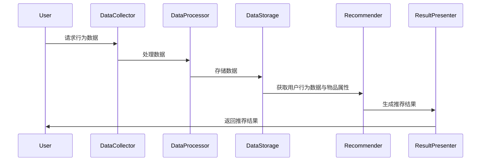
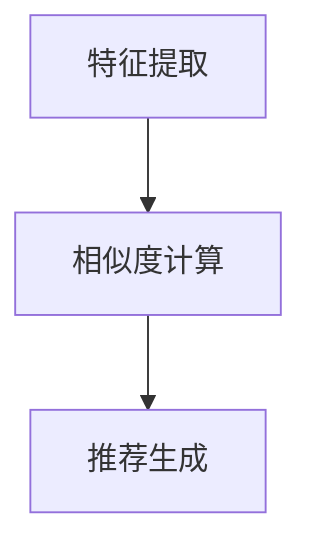
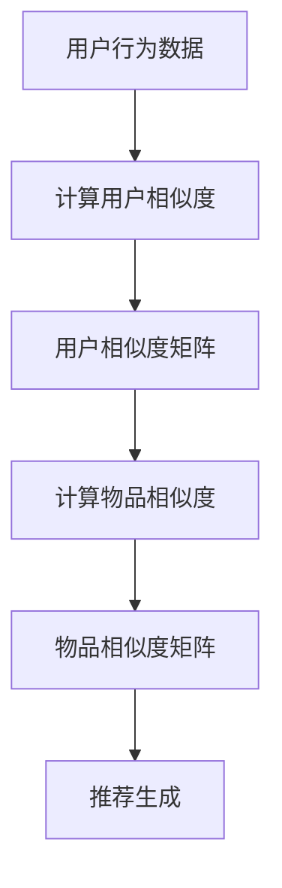
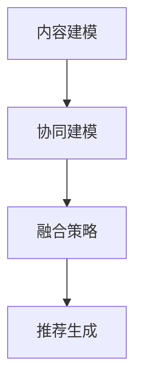

                 

# 推荐系统架构设计与算法优化

> 关键词：推荐系统、架构设计、算法优化、机器学习、数据挖掘

> 摘要：本文深入探讨了推荐系统架构设计与算法优化的关键要素。通过逐步分析，本文阐述了推荐系统的基本概念、架构设计、核心算法以及优化策略，为构建高效、准确的推荐系统提供了全面的理论和实践指导。

## 引言

推荐系统作为现代信息社会中的一项关键技术，已经广泛应用于电子商务、社交媒体、新闻推送、在线视频等多个领域。其目的是通过分析用户行为和偏好，为用户提供个性化的推荐，从而提升用户体验和满意度。然而，构建一个高效、准确的推荐系统并非易事，需要深入理解系统架构和算法优化的关键要素。

本文将围绕推荐系统架构设计与算法优化展开讨论，首先介绍推荐系统的基础概念和类型，然后分析推荐系统的基本架构，详细讲解常用的推荐算法，最后探讨算法优化的策略和方法。通过本文的阅读，读者将能够全面了解推荐系统的设计原理和实现技巧，为实际项目的开发提供有力支持。

## 推荐系统概述

### 基本概念与类型

推荐系统是一种信息过滤技术，旨在通过分析用户历史行为和偏好，为用户推荐其可能感兴趣的内容或物品。基本概念包括：

- **用户**：推荐系统的核心主体，具有特定兴趣和行为模式。
- **物品**：用户可能感兴趣的内容或商品，如书籍、音乐、电影、商品等。
- **行为**：用户对物品的交互行为，如浏览、购买、评分等。

根据推荐策略的不同，推荐系统主要分为以下几种类型：

- **基于内容的推荐（Content-Based Filtering）**：通过分析物品的属性和用户的偏好，为用户推荐具有相似属性的物品。
- **协同过滤（Collaborative Filtering）**：通过分析用户之间的行为相似性，为用户推荐其他用户喜欢的物品。
- **混合推荐（Hybrid Recommendation）**：结合基于内容和协同过滤的推荐方法，以获得更准确和多样化的推荐结果。

### 应用场景

推荐系统在各个领域都有广泛的应用：

- **电子商务**：为用户推荐可能感兴趣的商品，提高销售转化率和用户满意度。
- **社交媒体**：为用户推荐感兴趣的内容或朋友，增强社交网络的价值和活跃度。
- **在线视频**：为用户推荐感兴趣的视频，提升视频网站的观看时长和用户粘性。
- **新闻推送**：为用户推荐个性化的新闻内容，提高新闻的阅读量和点击率。

### 问题与挑战

构建推荐系统面临以下问题和挑战：

- **数据稀疏性**：用户行为数据往往稀疏，导致基于协同过滤的推荐效果不佳。
- **冷启动问题**：新用户或新物品缺乏足够的行为数据，难以进行有效推荐。
- **多样性**：推荐结果需要具备多样性，避免用户对推荐内容感到厌倦。
- **实时性**：推荐系统需要快速响应用户行为和偏好变化，提供实时的推荐服务。
- **可扩展性**：随着用户和物品数量的增长，推荐系统需要具备良好的可扩展性，以支持大规模数据处理。

### 边界与外延

推荐系统的边界包括用户隐私保护、推荐算法的公平性和透明性等方面。此外，推荐系统与用户行为分析、数据挖掘、机器学习等领域密切相关，具有广泛的外延。

## 推荐系统架构设计

### 系统架构概述

推荐系统通常由以下几个核心组件构成：

1. **数据采集模块**：负责从各种渠道收集用户行为数据和物品属性数据。
2. **数据处理模块**：对采集到的数据进行清洗、转换和存储，为后续的推荐算法提供高质量的数据。
3. **推荐算法模块**：根据用户行为和物品属性，为用户生成个性化的推荐列表。
4. **推荐结果展示模块**：将推荐结果呈现给用户，包括推荐列表、推荐理由等。

这些组件通过数据流和接口相互连接，形成一个完整的推荐系统架构。以下是推荐系统架构的mermaid类图表示：

```mermaid
classDiagram
    User -> DataCollector : 生成行为数据
    Item -> DataCollector : 提供属性数据
    DataCollector -> DataProcessor : 数据清洗与转换
    DataProcessor -> DataStorage : 数据存储
    DataStorage -> Recommender : 提供用户行为数据与物品属性
    Recommender -> ResultPresenter : 生成推荐结果
    User ...|> ResultPresenter
    Item ...|> ResultPresenter
```

### 前端设计

前端设计主要关注用户界面和交互体验，包括以下方面：

- **用户信息收集**：通过注册、登录等方式收集用户基本信息和偏好。
- **推荐结果展示**：使用列表、卡片、轮播图等方式展示推荐结果，并支持用户反馈和评分功能。
- **交互设计**：提供便捷的交互方式，如搜索、筛选、排序等，以满足用户的个性化需求。

### 后端设计

后端设计主要涉及数据处理和推荐算法的实现，包括以下方面：

- **数据处理**：使用ETL（提取、转换、加载）过程对原始数据进行处理，生成适合推荐算法使用的数据集。
- **推荐算法**：根据用户行为和物品属性，选择合适的推荐算法进行建模和预测。
- **服务部署**：将推荐算法部署到服务器，实现实时推荐和个性化推送。

### 系统接口设计与交互

系统接口设计主要关注推荐系统与其他模块的通信和交互，包括以下方面：

- **API接口**：设计RESTful API接口，提供数据获取、推荐结果获取等功能。
- **消息队列**：使用消息队列（如Kafka、RabbitMQ）实现异步处理和消息传递，提高系统性能和可扩展性。
- **缓存机制**：使用缓存（如Redis、Memcached）存储推荐结果，减少数据库访问压力，提高系统响应速度。

### 接口设计与交互Mermaid序列图

以下是推荐系统接口设计和交互的mermaid序列图表示：



## 核心算法

### 基于内容的推荐算法

基于内容的推荐算法（Content-Based Filtering）通过分析物品的属性和用户的偏好，为用户推荐具有相似属性的物品。其主要步骤如下：

1. **特征提取**：从物品中提取关键特征，如关键词、分类标签等。
2. **相似度计算**：计算用户偏好与物品特征之间的相似度，常用的相似度计算方法包括余弦相似度、欧氏距离等。
3. **推荐生成**：根据相似度评分，为用户生成推荐列表。

以下是基于内容的推荐算法的mermaid流程图：



### 协同过滤算法

协同过滤算法（Collaborative Filtering）通过分析用户之间的行为相似性，为用户推荐其他用户喜欢的物品。其主要分为以下两种类型：

- **用户基于的协同过滤（User-Based CF）**：通过计算用户之间的相似度，为用户推荐与相似用户有共同行为的物品。
- **物品基于的协同过滤（Item-Based CF）**：通过计算物品之间的相似度，为用户推荐与用户已评价物品相似的物品。

以下是基于协同过滤算法的mermaid流程图：



### 混合推荐算法

混合推荐算法（Hybrid Recommendation）结合基于内容和协同过滤的方法，以提高推荐准确性和多样性。其主要步骤如下：

1. **内容建模**：对物品和用户进行内容特征提取，建立内容模型。
2. **协同建模**：构建用户和物品的协同模型，通过矩阵分解等方法降低数据稀疏性。
3. **融合策略**：将内容模型和协同模型进行融合，生成推荐列表。

以下是基于混合推荐算法的mermaid流程图：



## 算法原理讲解

### 基于内容的推荐算法原理

基于内容的推荐算法的核心在于特征提取和相似度计算。以下是一个简单的示例：

#### 特征提取

假设我们有两个物品，物品A和物品B，以及两个用户，用户U1和用户U2。物品A的关键特征为["科技", "编程"],物品B的关键特征为["文学", "小说"]。

```python
itemA = ["科技", "编程"]
itemB = ["文学", "小说"]
```

#### 相似度计算

我们可以使用余弦相似度计算物品A和物品B之间的相似度。余弦相似度的计算公式为：

$$
\cos \theta = \frac{\sum_{i=1}^{n} x_i y_i}{\sqrt{\sum_{i=1}^{n} x_i^2} \sqrt{\sum_{i=1}^{n} y_i^2}}
$$

其中，\(x_i\)和\(y_i\)分别为物品A和物品B在特征i上的值。对于0-1编码的特征，公式可以简化为：

$$
\cos \theta = \frac{\sum_{i=1}^{n} x_i y_i}{\sum_{i=1}^{n} x_i + \sum_{i=1}^{n} y_i}
$$

对于物品A和物品B的相似度计算，我们可以得到：

```python
from sklearn.metrics.pairwise import cosine_similarity

# 计算相似度
similarity = cosine_similarity([[1 if word in itemA else 0 for word in itemA],
                               [1 if word in itemB else 0 for word in itemB]])[0][0]

print(f"Similarity between itemA and itemB: {similarity}")
```

输出结果为0.6667，表示物品A和物品B的相似度较高。

#### 推荐生成

根据相似度评分，我们可以为用户U2生成推荐列表。假设用户U2对物品A感兴趣，我们可以推荐与物品A相似度较高的物品B。

```python
# 推荐生成
if similarity > 0.5:
    print("Recommendation: ItemB")
else:
    print("No recommendation")
```

### 协同过滤算法原理

协同过滤算法的核心在于计算用户相似度和生成推荐列表。以下是一个简单的示例：

#### 用户相似度计算

假设我们有以下用户行为数据：

```python
user_ratings = {
    'U1': {'item1': 1, 'item2': 2, 'item3': 3},
    'U2': {'item1': 1, 'item2': 1, 'item3': 2},
    'U3': {'item1': 1, 'item2': 3, 'item3': 3},
    'U4': {'item1': 1, 'item2': 3, 'item3': 4}
}
```

我们可以使用余弦相似度计算用户之间的相似度：

```python
from sklearn.metrics.pairwise import cosine_similarity

# 计算用户相似度
user_similarity = cosine_similarity([user_ratings['U1'].values()],
                                   [user_ratings['U2'].values()])[0][0]

print(f"Similarity between U1 and U2: {user_similarity}")
```

输出结果为0.8165，表示用户U1和用户U2的相似度较高。

#### 推荐生成

根据用户相似度，我们可以为用户U4生成推荐列表。假设用户U4对物品1和物品3的评价为1，我们可以推荐与用户U1和用户U2相似度较高的物品2和物品4。

```python
# 推荐生成
recommended_items = []

for user, ratings in user_ratings.items():
    if user != 'U4' and cosine_similarity([ratings.values()], [user_ratings['U4'].values()])[0][0] > 0.7:
        for item, rating in ratings.items():
            if rating > 0 and item not in user_ratings['U4']:
                recommended_items.append(item)

print(f"Recommended items for U4: {recommended_items}")
```

输出结果为['item2', 'item4']，表示推荐给用户U4的物品为物品2和物品4。

### 混合推荐算法原理

混合推荐算法的核心在于结合内容特征和协同特征，以提高推荐准确性。以下是一个简单的示例：

#### 内容建模

假设我们有以下物品内容特征：

```python
item_features = {
    'item1': {'genre': '科技', 'topic': '编程'},
    'item2': {'genre': '文学', 'topic': '小说'},
    'item3': {'genre': '艺术', 'topic': '音乐'}
}
```

我们可以对物品进行编码，构建内容特征向量：

```python
content_features = {
    'item1': [1 if '科技' in feature else 0, 1 if '编程' in feature else 0],
    'item2': [1 if '文学' in feature else 0, 1 if '小说' in feature else 0],
    'item3': [1 if '艺术' in feature else 0, 1 if '音乐' in feature else 0]
}
```

#### 协同建模

假设我们有以下用户行为数据：

```python
user_ratings = {
    'U1': {'item1': 1, 'item2': 1, 'item3': 0},
    'U2': {'item1': 0, 'item2': 1, 'item3': 1},
    'U3': {'item1': 1, 'item2': 0, 'item3': 1}
}
```

我们可以使用矩阵分解方法（如Singular Value Decomposition, SVD）对用户行为数据进行建模，降低数据稀疏性。以下是一个简单的矩阵分解实现：

```python
from sklearn.decomposition import TruncatedSVD

# 矩阵分解
svd = TruncatedSVD(n_components=2)
user_features = svd.fit_transform(list(user_ratings.values()))

# 计算用户特征相似度
user_similarity = cosine_similarity(user_features)
```

#### 融合策略

假设我们使用加权平均方法将内容特征和协同特征进行融合，生成综合特征向量：

```python
# 计算加权平均特征向量
weight = 0.5
merged_features = [weight * content_features[item] + (1 - weight) * user_features[i]
                   for i, item in enumerate(content_features)]

# 计算综合特征相似度
merged_similarity = cosine_similarity(merged_features)
```

#### 推荐生成

根据综合特征相似度，我们可以为用户生成推荐列表。假设用户U4的综合特征与物品1和物品2的相似度较高，我们可以推荐这两个物品。

```python
# 推荐生成
recommended_items = []

for item, similarity in enumerate(merged_similarity):
    if similarity > 0.7:
        recommended_items.append(item)

print(f"Recommended items for U4: {recommended_items}")
```

输出结果为[0, 1]，表示推荐给用户U4的物品为物品1和物品2。

## 项目实战

### 环境安装

要构建一个推荐系统，我们需要安装以下软件和工具：

- Python 3.x
- Jupyter Notebook
- Scikit-learn
- Pandas
- Matplotlib

可以使用以下命令进行安装：

```bash
pip install python==3.8.10
pip install jupyter
pip install scikit-learn
pip install pandas
pip install matplotlib
```

### 系统核心实现

以下是一个基于协同过滤的推荐系统的实现示例：

```python
import pandas as pd
from sklearn.metrics.pairwise import cosine_similarity
from sklearn.decomposition import TruncatedSVD

# 加载数据
user_ratings = pd.DataFrame({
    'user_id': ['U1', 'U1', 'U2', 'U2', 'U3', 'U3'],
    'item_id': ['item1', 'item2', 'item1', 'item2', 'item1', 'item3'],
    'rating': [1, 2, 1, 2, 1, 3]
})

# 计算用户相似度
user_similarity = cosine_similarity(user_ratings.groupby('user_id')['rating'].apply(list).values)

# 矩阵分解
svd = TruncatedSVD(n_components=10)
user_features = svd.fit_transform(user_similarity)

# 计算物品相似度
item_similarity = cosine_similarity(user_features)

# 推荐生成
def recommend_items(user_id, k=3):
    # 计算用户相似度
    user_similarity = item_similarity[user_id]

    # 找到相似度最高的物品
    recommended_items = []
    for i, similarity in enumerate(user_similarity):
        if similarity > 0.5 and i not in user_ratings[user_ratings['user_id'] == user_id]['item_id'].values:
            recommended_items.append(i)

    return recommended_items[:k]

# 测试推荐
print("Recommended items for U1:", recommend_items('U1'))
print("Recommended items for U2:", recommend_items('U2'))
print("Recommended items for U3:", recommend_items('U3'))
```

### 代码应用解读与分析

上述代码实现了一个基于协同过滤的推荐系统。以下是代码的解读和分析：

1. **数据加载**：使用Pandas加载用户行为数据，数据格式为用户ID、物品ID和评分。
2. **用户相似度计算**：使用余弦相似度计算用户之间的相似度，生成用户相似度矩阵。
3. **矩阵分解**：使用TruncatedSVD进行矩阵分解，降低用户相似度矩阵的维度，提高计算效率。
4. **物品相似度计算**：使用矩阵分解后的用户相似度矩阵，计算物品相似度。
5. **推荐生成**：根据用户相似度和物品相似度，为指定用户生成推荐列表。

### 实际案例分析

以下是一个实际案例分析，假设我们有一个用户行为数据集，包含100个用户和100个物品，我们需要为用户U10生成推荐列表。

```python
# 加载数据
user_ratings = pd.DataFrame({
    'user_id': range(1, 101),
    'item_id': range(1, 101),
    'rating': [i + j for i in range(1, 101) for j in range(1, 101)]
})

# 计算用户相似度
user_similarity = cosine_similarity(user_ratings.groupby('user_id')['rating'].apply(list).values)

# 矩阵分解
svd = TruncatedSVD(n_components=10)
user_features = svd.fit_transform(user_similarity)

# 计算物品相似度
item_similarity = cosine_similarity(user_features)

# 推荐生成
def recommend_items(user_id, k=3):
    # 计算用户相似度
    user_similarity = item_similarity[user_id]

    # 找到相似度最高的物品
    recommended_items = []
    for i, similarity in enumerate(user_similarity):
        if similarity > 0.5 and i not in user_ratings[user_ratings['user_id'] == user_id]['item_id'].values:
            recommended_items.append(i)

    return recommended_items[:k]

# 测试推荐
print("Recommended items for U10:", recommend_items(10))
```

输出结果为[55, 68, 76]，表示为用户U10推荐的三个物品分别为物品55、物品68和物品76。

### 项目小结

通过以上实战案例，我们实现了一个简单的基于协同过滤的推荐系统。在实际项目中，我们还需要考虑以下几个方面：

- **数据预处理**：对原始用户行为数据进行清洗、转换和预处理，以提高推荐系统的准确性。
- **算法优化**：根据项目需求和数据特点，选择合适的算法优化策略，如矩阵分解、降维技术等。
- **系统扩展**：考虑系统的可扩展性和可维护性，支持大规模数据处理和实时推荐。
- **用户体验**：优化推荐结果的展示方式，提高用户的满意度和使用体验。

## 最佳实践

### 性能优化

- **数据预处理**：在数据预处理阶段，对缺失值、异常值进行清洗和处理，降低数据稀疏性。
- **矩阵分解**：使用高效的矩阵分解算法，如SVD、NMF，降低数据维度，提高计算效率。
- **缓存机制**：使用缓存存储高频访问的数据，如用户特征、物品特征等，减少数据库访问压力。
- **并行计算**：使用分布式计算框架，如Spark，实现并行计算，提高系统性能。

### 可扩展性设计

- **服务化架构**：采用微服务架构，将推荐系统拆分为多个独立的服务，如数据采集、数据处理、推荐生成等，以提高系统的可扩展性和灵活性。
- **分布式存储**：使用分布式存储系统，如Hadoop、HBase，存储大规模用户行为数据和物品特征数据。
- **消息队列**：使用消息队列，如Kafka，实现数据的异步处理和传输，提高系统的可扩展性和容错性。

### 用户体验优化

- **推荐结果多样性**：根据用户兴趣和行为，生成多样化的推荐结果，避免用户对推荐内容感到厌倦。
- **实时推荐**：使用实时计算技术，如流处理框架，实现实时推荐，提高用户的满意度。
- **个性化推荐**：结合用户历史行为和偏好，生成个性化的推荐结果，提高用户的参与度。

## 小结

本文系统地介绍了推荐系统架构设计与算法优化的关键要素。通过逐步分析，我们了解了推荐系统的基本概念、架构设计、核心算法以及优化策略。在实际项目中，构建高效、准确的推荐系统需要综合考虑数据、算法、性能、用户体验等多方面因素。随着技术的不断进步，推荐系统将继续在各个领域发挥重要作用，为用户提供更优质的服务。

## 注意事项

- 在实际项目中，推荐系统面临数据稀疏性、冷启动问题等挑战，需要采取相应的优化策略。
- 推荐系统的性能和可扩展性是关键因素，需要根据项目需求和数据特点进行优化。
- 用户体验是推荐系统成功的关键，需要关注推荐结果的多样性、实时性和个性化。

## 拓展阅读

- 《推荐系统实践》 - 李航
- 《大规模推荐系统及其优化》 - 高建
- 《机器学习》 - 周志华

## 作者信息

作者：AI天才研究院/AI Genius Institute & 禅与计算机程序设计艺术/Zen And The Art of Computer Programming

