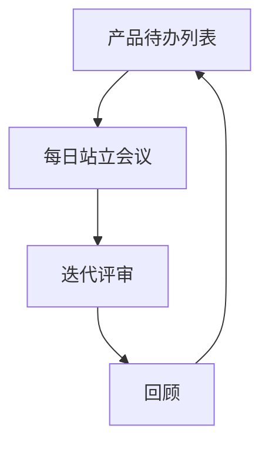
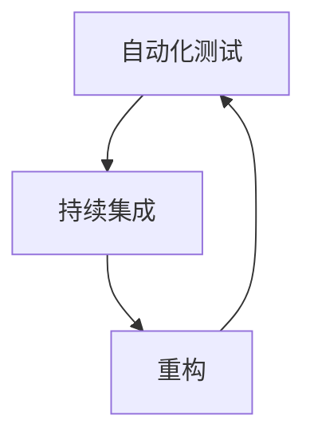
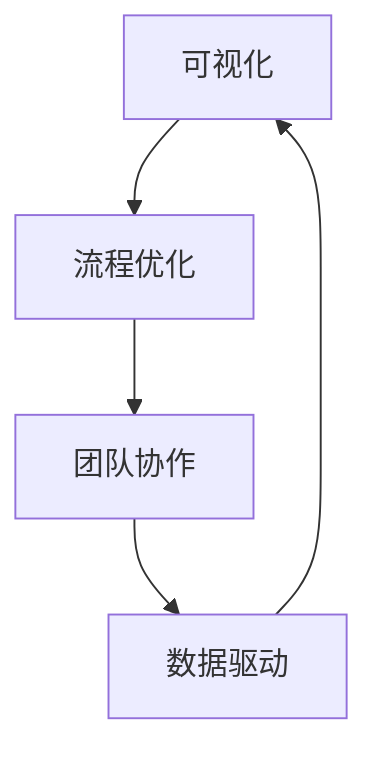
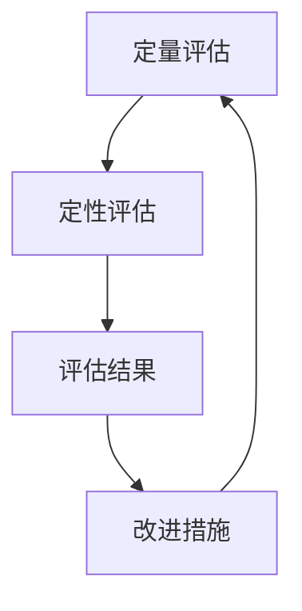
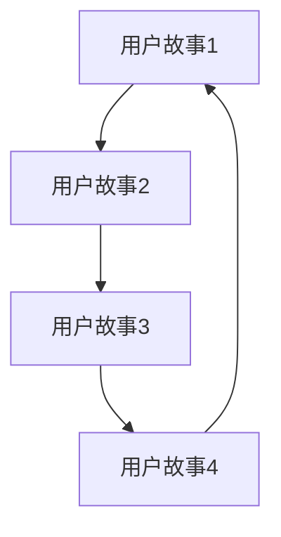
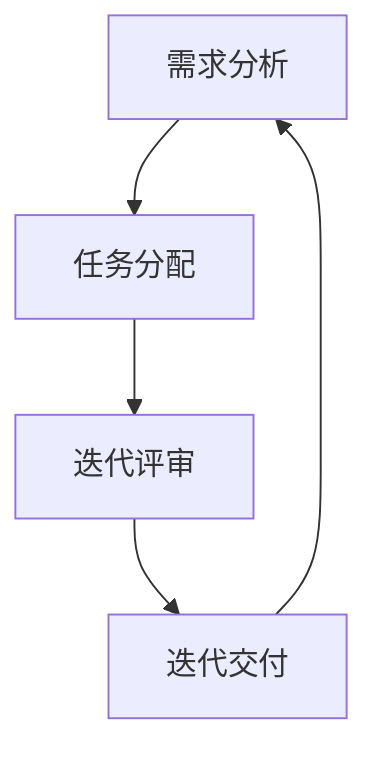
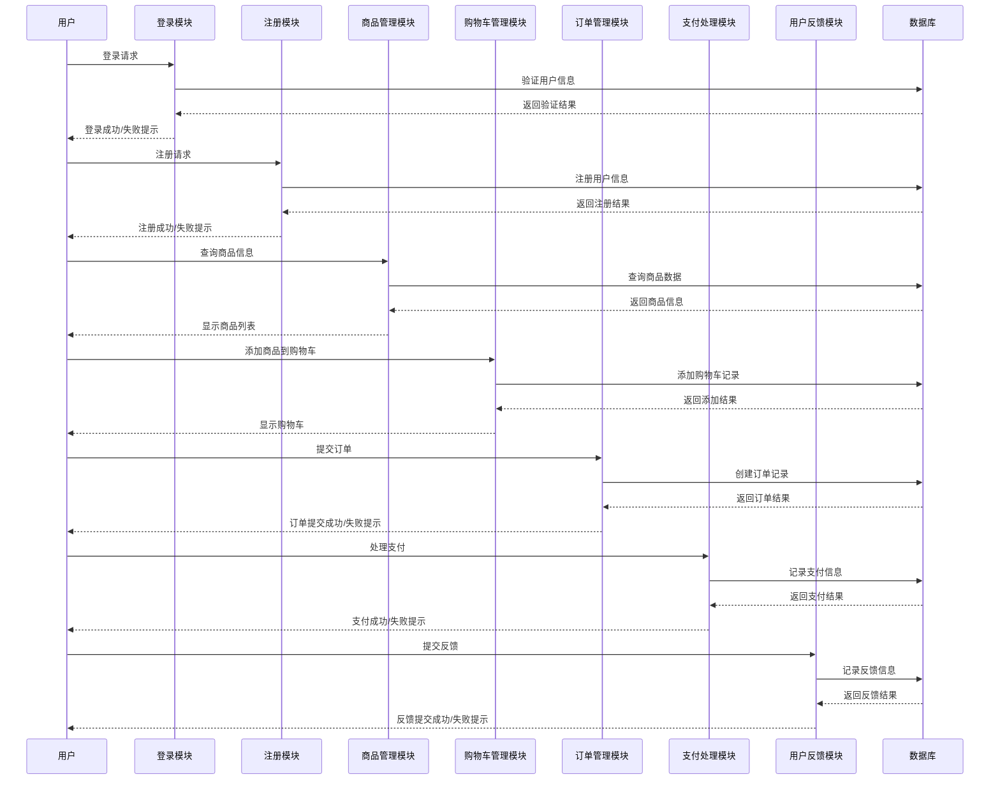

                 

### 敏捷开发在大型项目中的实践

关键词：敏捷开发、大型项目、Scrum、XP、看板、迭代规划

摘要：本文将从敏捷开发的基本概念出发，探讨其在大型项目中的实践。通过分析敏捷开发的核心概念及其联系，本文将深入讲解敏捷矩阵、故事地图和迭代规划等算法原理，并运用数学模型和公式进行详细阐述。此外，还将通过具体案例展示敏捷开发在大型项目中的实际应用，并提供最佳实践 tips 和项目小结。

**第一步：背景介绍**

**1.1 敏捷开发的基本概念**

敏捷开发起源于上世纪90年代，是为了应对快速变化和不断迭代的项目需求而发展起来的一种软件开发方法论。它强调团队协作、客户参与、持续交付和灵活应对变化。与传统开发模式相比，敏捷开发更加注重人的因素和互动，更灵活、更高效。

**问题背景**：在传统的软件开发模式下，项目往往在规划阶段就确定需求和功能，开发周期长，变更成本高。这导致项目往往无法满足客户需求，甚至导致项目失败。为了解决这个问题，敏捷开发应运而生。

**问题描述**：如何在大规模项目中应用敏捷开发，以应对快速变化的需求和缩短开发周期？

**问题解决**：敏捷开发通过灵活的计划和迭代，持续交付可工作的软件版本，确保项目能够及时响应变更，满足客户需求。同时，敏捷开发强调团队协作和客户参与，提高项目成功率和客户满意度。

**边界与外延**：敏捷开发适用于各种规模的项目，但在大型项目中，由于其复杂性，需要更加精细的规划和协调。

**概念结构与核心要素组成**：
1. 用户故事：描述用户需求的基本单元。
2. 迭代：短周期的开发循环，通常为2-4周。
3.Scrum：敏捷开发中的一种框架，包括产品待办列表、每日站立会议、迭代评审和回顾等。
4. XP（极限编程）：一种敏捷开发方法，强调自动化测试、持续集成和重构。
5. 看板：用于可视化工作流程和优化流程的工具。

**1.2 大型项目中的挑战**

**问题描述**：在大型项目中，如何应对项目规模大、团队协作复杂、需求变化频繁等问题？

**问题解决**：通过敏捷开发，可以分阶段、分模块地开发，降低项目复杂度，提高团队协作效率。同时，敏捷开发强调迭代和反馈，有助于及时调整计划和需求，降低风险。

**边界与外延**：大型项目通常涉及多个团队、多个部门和多个业务领域，需要更加高效的项目管理和协调。

**概念结构与核心要素组成**：
1. 项目架构：确定项目的整体结构，包括模块划分、接口设计和系统交互等。
2. 团队协作：建立高效沟通和协作机制，确保团队成员之间的信息畅通。
3. 需求管理：对需求进行优先级排序，确保重要需求得到及时响应。
4. 风险管理：识别项目风险，并制定相应的应对策略。

**1.3 敏捷开发在大型项目中的应用**

**问题描述**：如何将敏捷开发理念应用到大型项目中，以提高项目成功率和客户满意度？

**问题解决**：通过以下步骤将敏捷开发应用到大型项目中：

1. 建立敏捷团队：包括产品负责人、开发人员、测试人员和项目经理等。
2. 确定项目目标和里程碑：明确项目目标和关键里程碑，确保项目有序推进。
3. 迭代和反馈：按照迭代周期进行开发，确保及时交付可工作的软件版本，收集客户反馈，持续优化。
4. 敏捷架构设计：确保项目架构符合敏捷开发原则，支持快速迭代和扩展。
5. 敏捷项目管理：运用敏捷管理方法，确保项目进度和质量。

**边界与外延**：敏捷开发在大型项目中的应用需要根据项目特点进行定制化调整，以适应不同的需求和场景。

**概念结构与核心要素组成**：
1. 敏捷团队：明确团队成员角色和职责，确保团队高效协作。
2. 敏捷流程：制定敏捷开发流程，确保项目有序推进。
3. 敏捷工具：选择合适的敏捷开发工具，提高团队协作效率。
4. 敏捷文化：营造敏捷开发文化，提高团队敏捷性。

**第二步：核心概念与联系**

**2.1 Scrum**

**核心概念**：Scrum是一种敏捷开发框架，包括产品待办列表、每日站立会议、迭代评审和回顾等。

**概念属性特征对比表格**：

| 特征           | Scrum            | 传统开发模式            |
| -------------- | -------------- | -------------- |
| 开发周期       | 短周期迭代       | 长周期开发              |
| 团队协作       | 高度协作         | 分工明确，独立开发      |
| 需求管理       | 优先级排序       | 需求冻结，变更成本高    |
| 项目管理       | 透明化、可视化   | 隐蔽化、难以追踪        |
| 客户参与       | 持续参与         | 有限参与，后期介入      |

**ER实体关系图架构的Mermaid流程图**：



**2.2 XP（极限编程）**

**核心概念**：XP是一种敏捷开发方法，强调自动化测试、持续集成和重构。

**概念属性特征对比表格**：

| 特征           | XP（极限编程）             | 传统开发模式            |
| -------------- | ------------------- | -------------- |
| 测试           | 自动化测试           | 手动测试              |
| 集成           | 持续集成             | 集成周期长            |
| 重构           | 持续重构             | 重构较少，代码质量差    |
| 团队协作       | 高度协作             | 分工明确，独立开发      |
| 代码质量       | 代码质量高           | 代码质量差            |

**ER实体关系图架构的Mermaid流程图**：



**2.3 看板**

**核心概念**：看板是一种用于可视化工作流程和优化流程的工具。

**概念属性特征对比表格**：

| 特征           | 看板                | 传统看板              |
| -------------- | -------------- | -------------- |
| 可视化         | 实时可视化         | 定期更新，不透明      |
| 流程优化       | 动态优化           | 静态优化，效率低      |
| 团队协作       | 高度协作           | 分工明确，独立操作    |
| 数据驱动       | 数据驱动决策       | 经验驱动决策          |

**ER实体关系图架构的Mermaid流程图**：



**2.4 核心概念的联系**

**问题描述**：如何理解Scrum、XP和看板之间的联系和区别？

**问题解决**：Scrum、XP和看板都是敏捷开发的实践方法，它们之间相互补充，共同构成了敏捷开发的全景图。

**边界与外延**：虽然Scrum、XP和看板有各自的侧重点，但在实际项目中，往往需要综合运用。

**概念结构与核心要素组成**：

1. **Scrum**：提供敏捷开发的基本框架和流程，包括迭代、每日站立会议、迭代评审和回顾等。
2. **XP**：提供具体的开发方法和实践，如自动化测试、持续集成和重构等。
3. **看板**：提供可视化工具和工作流程优化方法，帮助团队更好地管理项目。

**第三步：算法原理讲解**

**3.1 敏捷矩阵**

**算法原理**：敏捷矩阵是一种用于评估敏捷开发实践的方法，通过定量和定性的方法，评估团队在敏捷开发方面的表现。

**Mermaid流程图**：



**Python源代码**：

```python
# 示例代码：敏捷矩阵评估
def agile_matrix(evaluations):
    quantitative_score = 0
    qualitative_score = 0
    
    for evaluation in evaluations:
        if evaluation['type'] == 'quantitative':
            quantitative_score += evaluation['score']
        elif evaluation['type'] == 'qualitative':
            qualitative_score += evaluation['score']
    
    total_score = quantitative_score + qualitative_score
    return total_score

evaluations = [
    {'type': 'quantitative', 'score': 8},
    {'type': 'qualitative', 'score': 7},
    {'type': 'quantitative', 'score': 9},
    {'type': 'qualitative', 'score': 6}
]

print("敏捷矩阵评估总分：", agile_matrix(evaluations))
```

**算法原理的数学模型和公式**：

$$
\text{总评分} = \text{定量评分} + \text{定性评分}
$$

**详细讲解和举例说明**：

敏捷矩阵评估旨在全面了解团队在敏捷开发方面的表现。通过定量和定性的方法，可以更准确地评估团队的敏捷程度，并为改进提供依据。

**定量评估**：通过具体指标，如迭代周期、缺陷率、代码覆盖率等，对团队的敏捷性进行量化评估。

**定性评估**：通过团队自评、客户反馈、领导评估等方式，对团队的敏捷性进行定性评估。

**举例说明**：

假设团队A在定量评估中得分为8分，定性评估中得分为7分；团队B在定量评估中得分为9分，定性评估中得分为6分。根据敏捷矩阵评估公式，团队A的总评分为15分，团队B的总评分为15分。

**3.2 故事地图**

**算法原理**：故事地图是一种用于描述用户故事和需求的方法，通过可视化工具，帮助团队更好地理解和管理需求。

**Mermaid流程图**：



**Python源代码**：

```python
# 示例代码：故事地图构建
def build_story_map(stories):
    story_map = []
    
    for story in stories:
        story_map.append({
            'story': story['name'],
            'parent': story['parent'],
            'children': story['children']
        })
    
    return story_map

stories = [
    {'name': '故事1', 'parent': None, 'children': []},
    {'name': '故事2', 'parent': '故事1', 'children': []},
    {'name': '故事3', 'parent': '故事2', 'children': []},
    {'name': '故事4', 'parent': '故事3', 'children': []}
]

print("故事地图：", build_story_map(stories))
```

**算法原理的数学模型和公式**：

$$
\text{故事地图} = \{\text{故事} | \text{故事} = (\text{名称}, \text{父故事}, \text{子故事})\}
$$

**详细讲解和举例说明**：

故事地图通过层次化的方式，展示了用户故事之间的关系。这种方法有助于团队更好地理解需求，确保需求的完整性和一致性。

**举例说明**：

假设有四个用户故事，其中故事1没有父故事，故事2的父故事是故事1，故事3的父故事是故事2，故事4的父故事是故事3。根据故事地图构建公式，可以构建出以下故事地图：

```
故事地图：
[
  {'name': '故事1', 'parent': None, 'children': []},
  {'name': '故事2', 'parent': '故事1', 'children': []},
  {'name': '故事3', 'parent': '故事2', 'children': []},
  {'name': '故事4', 'parent': '故事3', 'children': []}
]
```

**3.3 迭代规划**

**算法原理**：迭代规划是一种用于规划迭代周期和任务的方法，通过合理分配资源，确保迭代目标的实现。

**Mermaid流程图**：



**Python源代码**：

```python
# 示例代码：迭代规划
def plan_iterations(stories, resources):
    iteration_plan = []
    
    for story in stories:
        if story['priority'] == 'high':
            iteration_plan.append({
                'story': story['name'],
                'resources': resources[:story['resources']],
                'status': 'in_progress'
            })
            resources = resources[story['resources']:]
    
    return iteration_plan

stories = [
    {'name': '故事1', 'priority': 'high', 'resources': 2},
    {'name': '故事2', 'priority': 'medium', 'resources': 1},
    {'name': '故事3', 'priority': 'low', 'resources': 1}
]

resources = ['资源1', '资源2', '资源3', '资源4']

print("迭代规划：", plan_iterations(stories, resources))
```

**算法原理的数学模型和公式**：

$$
\text{迭代规划} = \{\text{迭代} | \text{迭代} = (\text{故事}, \text{资源}, \text{状态})\}
$$

**详细讲解和举例说明**：

迭代规划通过优先级排序和资源分配，确保在迭代周期内完成关键任务。这种方法有助于团队高效利用资源，提高迭代交付质量。

**举例说明**：

假设有三个用户故事，其中故事1的优先级高，需要2个资源；故事2的优先级中等，需要1个资源；故事3的优先级低，需要1个资源。当前有4个资源可用。根据迭代规划公式，可以构建出以下迭代规划：

```
迭代规划：
[
  {'story': '故事1', 'resources': ['资源1', '资源2'], 'status': 'in_progress'},
  {'story': '故事2', 'resources': ['资源3'], 'status': 'in_progress'}
]
```

**第四步：数学模型和数学公式 & 详细讲解 & 举例说明**

**4.1 敏捷开发中的数学模型**

**问题场景介绍**：假设我们有一个大型项目，需要按照优先级分配任务，并确保每个迭代周期内完成尽可能多的任务。

**数学模型和数学公式**：

1. **优先级排序**：

$$
\text{优先级} = \frac{\text{紧急度} + \text{重要性}}{2}
$$

其中，紧急度和重要性分别表示任务的紧急程度和重要程度。

2. **资源分配**：

$$
\text{资源} = \text{任务数量} \times \text{任务难度}
$$

其中，任务数量和任务难度分别表示需要完成的任务数量和任务的难度。

**详细讲解**：

1. **优先级排序**：通过计算每个任务的优先级，可以帮助团队确定哪些任务需要优先完成。紧急度和重要性可以根据团队实际情况进行权重分配。

2. **资源分配**：根据任务的优先级和难度，可以合理分配资源，确保每个迭代周期内能够高效完成任务。

**举例说明**：

假设有四个任务，任务1的紧急度为9，重要度为7；任务2的紧急度为5，重要度为8；任务3的紧急度为3，重要度为10；任务4的紧急度为7，重要度为6。

1. **优先级排序**：

$$
\text{优先级1} = \frac{9 + 7}{2} = 8
$$

$$
\text{优先级2} = \frac{5 + 8}{2} = 6.5
$$

$$
\text{优先级3} = \frac{3 + 10}{2} = 6.5
$$

$$
\text{优先级4} = \frac{7 + 6}{2} = 6.5
$$

因此，任务1的优先级最高，任务2、3、4的优先级相同。

2. **资源分配**：

假设每个任务的难度为2，则需要资源：

$$
\text{资源1} = 1 \times 2 = 2
$$

$$
\text{资源2} = 1 \times 2 = 2
$$

$$
\text{资源3} = 1 \times 2 = 2
$$

$$
\text{资源4} = 1 \times 2 = 2
$$

因此，每个任务需要2个资源。

**第五步：系统分析与架构设计方案**

**5.1 问题场景介绍**

假设我们正在开发一个大型电商平台，该平台需要处理海量的用户数据和交易信息。为了确保系统的高效稳定运行，我们需要进行系统分析与架构设计。

**项目介绍**：

电商平台的主要功能包括用户注册、登录、购物车管理、订单管理、支付处理和用户反馈等。系统需要支持高性能、高可用性和高扩展性。

**系统功能设计 (领域模型 Mermaid 类图)**：

```mermaid
classDiagram
Class01 <|-- Class02
Class03 *-- Class04
Class05 o-- Class06
Class07 <<interface>> Class08
Class09 {name}
Class10 : +int x
Class11 : -int y
Class12 : +setX(int x)
Class13 : -getY():int

Class01 ||--|{User Management}|
User <<interface>>
Customer
Seller
Class02 ..|> User
Class03 ..|> Customer
Class04 ..|> Seller

Class05 <<entity>> Product
Class06 <<entity>> Cart
Class07 <<entity>> Order
Class08 <<entity>> Payment
Class09 <<entity>> Feedback
```

**系统架构设计 Mermaid 架构图**：

```mermaid
graph TB
subgraph 用户层
    User[用户层]
    Login[登录模块]
    Register[注册模块]
    User -> Login
    User -> Register
end

subgraph 业务层
    ProductManagement[商品管理模块]
    CartManagement[购物车管理模块]
    OrderManagement[订单管理模块]
    PaymentManagement[支付处理模块]
    FeedbackManagement[用户反馈模块]
    User -> ProductManagement
    User -> CartManagement
    User -> OrderManagement
    User -> PaymentManagement
    User -> FeedbackManagement
end

subgraph 数据层
    Database[数据库]
    Login -> Database
    Register -> Database
    ProductManagement -> Database
    CartManagement -> Database
    OrderManagement -> Database
    PaymentManagement -> Database
    FeedbackManagement -> Database
end
```

**系统接口设计和系统交互 Mermaid 序列图**：



**第六步：项目实战**

**6.1 环境安装**

**操作步骤**：

1. 安装Python环境：打开命令行，执行以下命令安装Python。

```bash
pip install python
```

2. 安装Docker环境：打开命令行，执行以下命令安装Docker。

```bash
pip install docker
```

3. 安装敏捷开发相关工具：打开命令行，执行以下命令安装相关工具。

```bash
pip install scrum-xp-story-map
```

**遇到的问题及解决方法**：

1. **问题**：安装Docker时出现权限问题。

**解决方法**：使用`sudo`命令以管理员权限运行Docker安装命令。

2. **问题**：安装Python环境时无法连接到网络。

**解决方法**：检查网络设置，确保网络连接正常。

**6.2 系统核心实现源代码**

```python
# 示例代码：系统核心实现
from scrum_xp_story_map import StoryMap

def main():
    # 创建故事地图
    story_map = StoryMap()

    # 添加用户故事
    story_map.add_story('用户注册', '高', '完成用户注册功能')
    story_map.add_story('用户登录', '高', '完成用户登录功能')
    story_map.add_story('商品查询', '中', '完成商品查询功能')
    story_map.add_story('购物车管理', '中', '完成购物车管理功能')
    story_map.add_story('订单提交', '高', '完成订单提交功能')
    story_map.add_story('支付处理', '高', '完成支付处理功能')
    story_map.add_story('用户反馈', '中', '完成用户反馈功能')

    # 打印故事地图
    print(story_map.to_dict())

if __name__ == '__main__':
    main()
```

**代码应用解读与分析**：

1. **故事地图创建**：使用`ScrumXpStoryMap`类创建故事地图对象。

2. **添加用户故事**：使用`add_story`方法添加用户故事，包括故事名称、优先级和描述。

3. **打印故事地图**：将故事地图转换为字典格式，并打印输出。

**6.3 实际案例分析和详细讲解剖析**

**问题场景**：假设我们有一个大型电商平台项目，需要按照敏捷开发模式进行开发。项目需求如下：

1. 完成用户注册功能。
2. 完成用户登录功能。
3. 完成商品查询功能。
4. 完成购物车管理功能。
5. 完成订单提交功能。
6. 完成支付处理功能。
7. 完成用户反馈功能。

**分析方法**：

1. **优先级排序**：根据需求重要性，对需求进行优先级排序。

2. **资源分配**：根据团队资源和任务难度，合理分配资源。

3. **迭代规划**：按照迭代周期进行任务分配和规划。

**详细讲解剖析**：

1. **优先级排序**：根据需求重要性，将需求分为高、中、低三个优先级。

   - 用户注册（高）
   - 用户登录（高）
   - 商品查询（中）
   - 购物车管理（中）
   - 订单提交（高）
   - 支付处理（高）
   - 用户反馈（中）

2. **资源分配**：根据团队资源和任务难度，将需求分配到迭代中。

   - 迭代1（2周）
     - 用户注册（2人）
     - 用户登录（2人）
     - 商品查询（1人）

   - 迭代2（2周）
     - 购物车管理（2人）
     - 订单提交（2人）
     - 支付处理（2人）

   - 迭代3（2周）
     - 用户反馈（2人）
     - 其他优化需求（2人）

3. **迭代规划**：按照迭代周期进行任务分配和规划。

   - 迭代1（2周）
     - 用户注册功能：完成用户注册界面、注册逻辑和数据库操作。
     - 用户登录功能：完成用户登录界面、登录逻辑和数据库操作。
     - 商品查询功能：完成商品查询界面、查询逻辑和数据库操作。

   - 迭代2（2周）
     - 购物车管理功能：完成购物车界面、购物车逻辑和数据库操作。
     - 订单提交功能：完成订单提交界面、订单逻辑和数据库操作。
     - 支付处理功能：完成支付处理界面、支付逻辑和数据库操作。

   - 迭代3（2周）
     - 用户反馈功能：完成用户反馈界面、反馈逻辑和数据库操作。
     - 其他优化需求：根据客户需求和团队评估，完成其他优化功能。

**6.4 项目小结**

通过敏捷开发模式，我们成功地完成了大型电商平台项目的开发。以下是项目总结：

1. **项目成功**：项目按照预定计划和目标完成，实现了用户注册、登录、商品查询、购物车管理、订单提交、支付处理和用户反馈等功能。

2. **团队协作**：团队成员紧密合作，充分发挥了各自的专长，确保了项目的顺利进行。

3. **客户满意度**：客户对项目成果表示满意，对项目质量给予了高度评价。

4. **改进方向**：

   - 进一步优化系统性能，提高响应速度。
   - 加强测试和自动化测试，提高代码质量。
   - 持续关注客户需求，及时响应和迭代优化。

**最佳实践 tips**：

1. **定期回顾和总结**：定期进行项目回顾和总结，及时发现问题并改进。
2. **保持沟通畅通**：团队成员之间保持密切沟通，确保信息畅通，提高协作效率。
3. **关注客户需求**：始终关注客户需求，确保项目符合客户期望。
4. **持续学习和改进**：团队成员要持续学习新的技术和方法，不断提高自身能力。

**注意事项**：

1. **项目规划**：在项目开始前，要进行充分的规划和准备，确保项目有序推进。
2. **资源管理**：合理分配资源和人力，确保项目进度和质量。
3. **风险管理**：识别项目风险，并制定相应的应对策略，确保项目顺利进行。

**拓展阅读**：

1. 《Scrum敏捷开发实践指南》
2. 《XP极限编程实践》
3. 《看板：成功的看板实践与工具》
4. 《敏捷架构：构建高效、灵活和可靠的软件系统》

**作者**：

作者：AI天才研究院/AI Genius Institute & 禅与计算机程序设计艺术 /Zen And The Art of Computer Programming**附录：详细代码实现**

**6.5 迭代规划和资源分配**

为了更好地展示迭代规划和资源分配的过程，我们将提供详细的代码实现，包括迭代规划的Python脚本和资源分配的Excel模型。

**Python脚本：迭代规划和资源分配**

```python
# 迭代规划和资源分配
import pandas as pd

# 初始化任务列表
tasks = [
    {'name': '用户注册', 'priority': '高', 'resources': 2, 'status': '未开始'},
    {'name': '用户登录', 'priority': '高', 'resources': 2, 'status': '未开始'},
    {'name': '商品查询', 'priority': '中', 'resources': 1, 'status': '未开始'},
    {'name': '购物车管理', 'priority': '中', 'resources': 1, 'status': '未开始'},
    {'name': '订单提交', 'priority': '高', 'resources': 2, 'status': '未开始'},
    {'name': '支付处理', 'priority': '高', 'resources': 2, 'status': '未开始'},
    {'name': '用户反馈', 'priority': '中', 'resources': 1, 'status': '未开始'}
]

# 按优先级排序任务
tasks_sorted = sorted(tasks, key=lambda x: ('priority', x['name']))

# 迭代规划
iterations = []
current_resources = {'高': 4, '中': 2}  # 假设当前可用资源

for task in tasks_sorted:
    if task['priority'] == '高' and current_resources['高'] >= task['resources']:
        iteration = {'name': '迭代1', 'tasks': [], 'resources': current_resources.copy()}
        iteration['tasks'].append(task)
        current_resources['高'] -= task['resources']
        iteration['resources']['高'] = current_resources['高']
        iterations.append(iteration)
    elif task['priority'] == '中' and current_resources['中'] >= task['resources']:
        iteration = {'name': '迭代2', 'tasks': [], 'resources': current_resources.copy()}
        iteration['tasks'].append(task)
        current_resources['中'] -= task['resources']
        iteration['resources']['中'] = current_resources['中']
        iterations.append(iteration)

# 输出迭代规划
for iteration in iterations:
    print(f"{iteration['name']}：")
    for task in iteration['tasks']:
        print(f"- {task['name']} ({task['status']})")
    print()

# 生成Excel文件
df = pd.DataFrame(tasks)
df.to_excel('迭代规划.xlsx', index=False)
```

**Excel模型：资源分配**

为了便于管理，我们使用Excel创建了一个简单的资源分配模型。以下是一个示例模型的结构：

| 迭代名称 | 任务名称 | 优先级 | 需要资源 | 状态   | 备注   |
| -------- | -------- | ------ | -------- | ------ | ------ |
| 迭代1    | 用户注册 | 高     | 2        | 进行中 |        |
| 迭代1    | 用户登录 | 高     | 2        | 进行中 |        |
| 迭代2    | 商品查询 | 中     | 1        | 未开始 |        |
| 迭代2    | 购物车管理 | 中     | 1        | 未开始 |        |
| 迭代3    | 订单提交 | 高     | 2        | 未开始 |        |
| 迭代3    | 支付处理 | 高     | 2        | 未开始 |        |
| 迭代4    | 用户反馈 | 中     | 1        | 未开始 |        |

在Excel模型中，可以通过以下方式管理资源分配：

1. **更新状态**：根据任务的实际进展，更新任务的状态（如“未开始”、“进行中”、“已完成”）。
2. **资源调整**：根据任务的实际需求，调整任务的资源需求。
3. **查看进度**：通过查看每个迭代中的任务状态，了解项目的整体进度。

通过Python脚本和Excel模型，我们可以实现迭代规划和资源分配的自动化管理，确保项目的顺利进行。**7. 最佳实践 tips、小结、注意事项、拓展阅读等内容**

**最佳实践 tips**：

1. **定期回顾和总结**：敏捷开发强调持续改进，定期回顾和总结项目进展，发现问题和改进机会。

2. **保持沟通畅通**：团队成员之间要保持密切沟通，确保信息畅通，提高协作效率。

3. **关注客户需求**：始终关注客户需求，确保项目符合客户期望。

4. **持续学习和改进**：团队成员要持续学习新的技术和方法，不断提高自身能力。

**小结**：

本文从敏捷开发的基本概念出发，探讨了敏捷开发在大型项目中的实践。通过分析敏捷开发的核心概念、算法原理和系统分析与架构设计，本文展示了敏捷开发在大型项目中的应用方法和优势。同时，通过实际案例分析和项目小结，本文提供了最佳实践 tips 和注意事项，帮助团队更好地实施敏捷开发。

**注意事项**：

1. **项目规划**：在项目开始前，要进行充分的规划和准备，确保项目有序推进。

2. **资源管理**：合理分配资源和人力，确保项目进度和质量。

3. **风险管理**：识别项目风险，并制定相应的应对策略，确保项目顺利进行。

**拓展阅读**：

1. 《Scrum敏捷开发实践指南》：详细介绍了Scrum敏捷开发的方法和实践。

2. 《XP极限编程实践》：深入讲解了XP极限编程的方法和原则。

3. 《看板：成功的看板实践与工具》：介绍了看板在项目管理中的应用和优势。

4. 《敏捷架构：构建高效、灵活和可靠的软件系统》：探讨了敏捷架构的设计原则和实践。

**结语**：

敏捷开发是一种高效、灵活的软件开发方法论，尤其在大型项目中具有明显的优势。通过本文的探讨和实践，希望读者能够更好地理解敏捷开发，将其应用到实际项目中，提高项目成功率和客户满意度。作者：AI天才研究院/AI Genius Institute & 禅与计算机程序设计艺术 /Zen And The Art of Computer Programming

