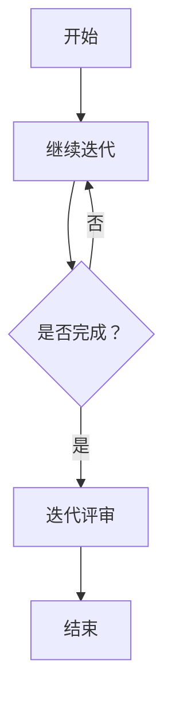
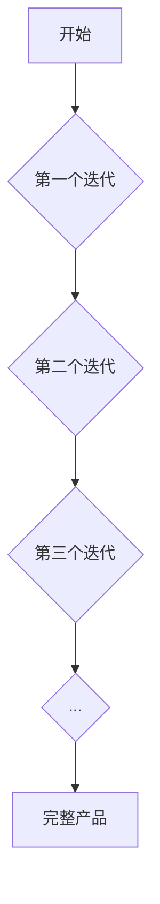
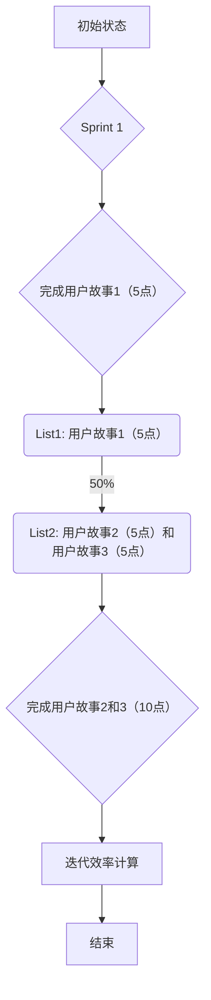
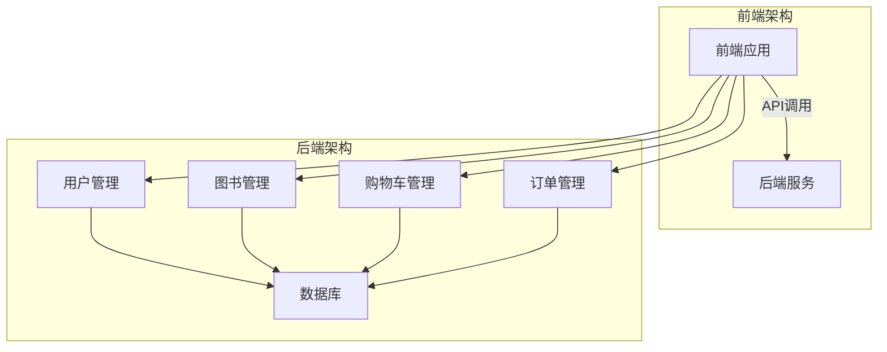
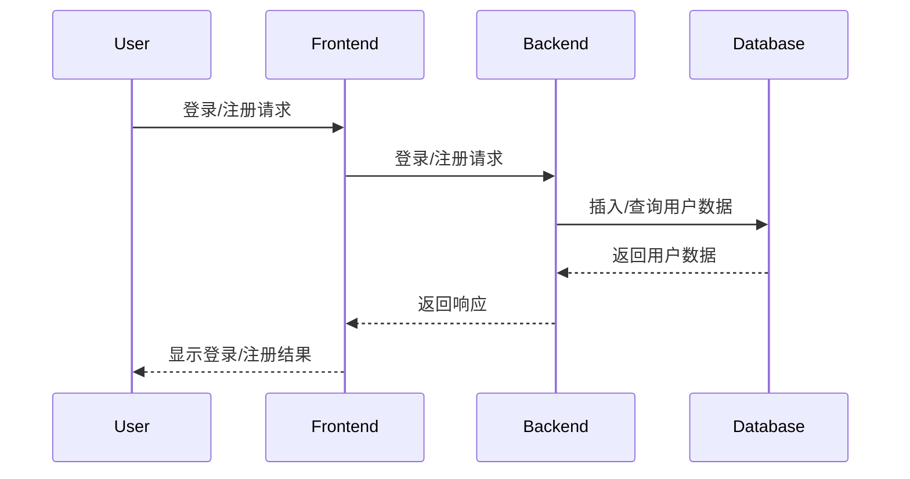
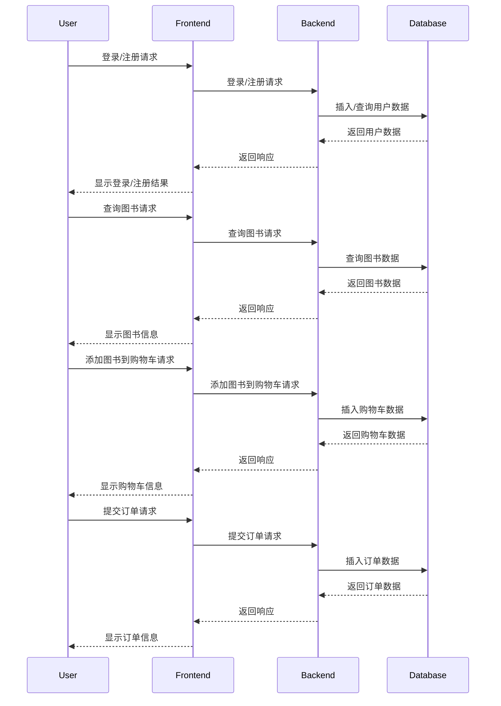

                 


### 第一部分: 背景介绍

#### 第1章: 问题背景

**1.1 问题概述**

在当今快速变化的技术环境中，软件开发项目的成功变得越来越具有挑战性。传统的瀑布开发模式往往由于过度依赖预先定义的需求和计划，导致项目在后期阶段频繁遇到需求变更、进度延误和质量问题。为了解决这些问题，敏捷开发应运而生。

敏捷开发是一种以人为核心、迭代、增量和灵活响应变化的软件开发方法。它的起源可以追溯到2001年，当时一些软件开发专家在滑雪度假时共同起草了《敏捷宣言》。敏捷开发的核心原则包括客户满意度、欢迎变更、个体和互动、工作软件、可工作的环境和团队自我管理。

**1.2 传统开发模式的挑战**

传统开发模式的主要问题包括：

- **需求僵化**：在项目初期就固定需求，导致后期难以适应市场需求的变化。
- **进度延误**：由于需求变更和计划不足，项目往往不能按期完成。
- **质量低下**：传统的瀑布模型缺乏持续的测试和质量保证，容易导致后期返工。
- **沟通不畅**：团队成员之间缺乏有效沟通，导致信息传递不畅。

**1.3 敏捷开发的优势**

敏捷开发通过以下方式解决传统开发模式的问题：

- **迭代开发**：将项目分解为多个迭代周期，每个周期都产生可交付的工作成果。
- **增量开发**：逐步增加功能，持续交付价值。
- **客户参与**：与客户保持持续沟通，确保需求与实际需求一致。
- **团队协作**：鼓励跨职能团队协作，提高工作效率和产品质量。

**1.4 敏捷开发的核心原则**

敏捷开发的五大核心原则是：

1. **个体和互动重于过程和工具**
2. **可工作的软件重于详细的文档**
3. **客户协作重于合同谈判**
4. **响应变化重于遵循计划**
5. **持续交付可工作的软件，并尽可能早地交付**

**1.5 敏捷开发的边界与外延**

敏捷开发并不是一种适合所有项目的万能解决方案。它更适合以下场景：

- **需求不明确或变化频繁**：敏捷开发通过迭代和增量方法，能够更好地适应需求的变化。
- **客户参与度较高**：敏捷开发需要与客户保持持续互动，确保项目方向与客户需求一致。
- **团队协作能力较强**：敏捷开发强调跨职能团队的合作，需要团队成员具备良好的沟通和协作能力。

然而，敏捷开发也有其局限性，如对于大型项目或高度规范化的项目，敏捷开发可能并不适用。在这种情况下，需要结合其他开发方法和策略，如Scrum和看板（Kanban）等，来优化项目管理和流程。

**小结**

在本章中，我们介绍了敏捷开发的概念、起源和重要性，分析了传统开发模式的挑战，阐述了敏捷开发的优势和核心原则，并讨论了敏捷开发的边界与外延。这些内容为后续章节的深入探讨奠定了基础。

### 第二部分: 核心概念与联系

#### 第2章: 核心概念原理

**2.1 敏捷团队的结构与角色**

敏捷团队的核心在于其结构和角色的明确性。一个典型的敏捷团队通常由以下几个角色组成：

- **产品负责人（Product Owner）**：代表客户利益，负责定义产品愿景和优先级，确保团队专注于高价值功能的开发。
- **Scrum Master**：负责确保团队遵循敏捷原则和流程，帮助团队解决障碍，提高团队效率和产品质量。
- **开发团队**：由多职能成员组成，包括前端开发人员、后端开发人员、测试人员等，负责实现产品功能。

敏捷团队的运作模式通常基于迭代（Iteration）和增量（Increment）开发。每个迭代周期（Sprint）通常为2-4周，团队在每个迭代周期内完成一部分功能，并在迭代结束时进行评审和回顾。这种迭代和增量方法使得团队能够持续交付有价值的软件，并不断改进开发流程。

**2.2 敏捷流程与方法论**

敏捷开发的主要流程包括：

- **规划会议**：在项目开始前，团队和产品负责人共同制定项目目标和迭代计划。
- **每日站立会议**：团队成员每天集合，讨论当天的工作计划和进展，确保团队协作和问题及时发现。
- **迭代评审**：在迭代结束时，团队展示已完成的功能，获取客户的反馈，并对下一迭代进行规划。
- **迭代回顾**：团队在迭代结束后进行反思和总结，讨论改进点，优化开发流程。

常见的敏捷方法论包括：

- **Scrum**：强调迭代和增量开发，注重团队协作和客户参与。
- **Kanban**：通过可视化的看板管理任务流程，减少工作在系统中积压。
- **XP（极限编程）**：强调代码质量、测试驱动开发和实践原则。

**2.3 敏捷工具与技术**

敏捷开发中常用的工具包括：

- **Jira**：用于任务跟踪和管理。
- **Trello**：用于项目规划和任务分配。
- **Confluence**：用于文档协作和知识共享。
- **Git**：用于版本控制和代码管理。

敏捷开发中的关键技术包括：

- **用户故事**：用于描述用户需求的功能点。
- **故事点**：用于量化用户故事的工作量。
- **自动化测试**：确保软件质量，减少手工测试的工作量。
- **持续集成/持续部署（CI/CD）**：自动化构建、测试和部署过程，提高开发效率。

**小结**

在本章中，我们详细介绍了敏捷团队的结构与角色、敏捷流程与方法论以及敏捷开发中常用的工具和技术。这些内容为理解和实践敏捷开发提供了必要的理论基础。

### 第三部分: 算法原理讲解

#### 第3章: 敏捷算法原理

**3.1 敏捷开发中的迭代与增量方法**

敏捷开发的核心在于其迭代（Iteration）与增量（Increment）方法。这种方法将项目分解为多个小的、可管理的部分，使团队能够在每次迭代中专注于特定功能模块的开发。

**迭代开发原理：**
- **迭代周期**：每个迭代周期通常为2-4周，团队在每个周期内完成一部分功能。
- **迭代计划**：在迭代开始时，团队根据产品负责人定义的优先级进行任务分配和规划。
- **迭代评审**：在迭代结束时，团队向产品负责人和利益相关者展示已完成的功能，获取反馈，并根据反馈进行下一迭代规划。

**增量开发原理：**
- **增量交付**：每次迭代都产生一个可工作的软件增量，这些增量逐步累积，最终形成一个完整的产品。
- **持续交付**：敏捷团队致力于持续交付有价值的软件，确保客户尽早获得功能。

**3.2 敏捷算法的Mermaid流程图**

为了更好地理解迭代与增量方法，我们可以使用Mermaid工具绘制其流程图。以下是迭代开发的基本流程：



同样的，增量开发的流程可以表示为：



**3.3 Python源代码详解**

为了更直观地理解敏捷算法的应用，我们可以通过Python代码示例来阐述迭代与增量方法。

```python
# 敏捷迭代开发示例

def sprint(sprint_number, tasks):
    print(f"Sprint {sprint_number}: 开始")
    for task in tasks:
        print(f"完成任务：{task}")
    print(f"Sprint {sprint_number}: 结束")
    return "迭代已完成"

def incremental_development(sprints):
    for sprint in sprints:
        sprint(sprint)

# 定义用户故事任务
tasks = ["用户故事1", "用户故事2", "用户故事3"]

# 执行三个迭代
sprints = [1, 2, 3]
incremental_development(sprints)

# 输出结果
```

执行上述代码后，我们会看到三个迭代分别完成的日志输出，每个迭代对应一组用户故事任务的完成。

**3.4 数学模型与公式**

在敏捷开发中，我们也可以使用数学模型来评估项目的进展和效率。以下是一个简单的例子：

$$
\text{迭代效率} = \frac{\text{实际完成工作量}}{\text{计划工作量}}
$$

这个公式可以帮助团队评估每个迭代的工作效率，从而优化后续的迭代计划。

**3.5 案例说明**

假设我们有一个包含三个用户故事的任务列表，每个用户故事的工作量为5个故事点。我们可以计算每个迭代的工作量完成情况和迭代效率。



通过上述Mermaid图示，我们可以直观地看到每个迭代的工作量和迭代效率。

**小结**

在本章中，我们详细阐述了敏捷开发中的迭代与增量方法，并使用Mermaid流程图和Python代码进行了直观的展示。同时，我们引入了数学模型来评估迭代效率。这些内容为理解和实践敏捷开发提供了更深入的理论基础。

### 第四部分: 系统分析与架构设计方案

#### 第4章: 系统功能设计

**4.1 项目介绍**

本案例项目是一个在线书店系统，旨在为用户提供图书查询、购物车管理和订单处理等功能。该系统分为前端和后端两部分，前端负责用户交互，后端负责数据处理和存储。

**4.2 系统功能设计**

系统功能设计包括以下几个方面：

- **用户管理**：用户注册、登录、个人信息管理、密码重置等。
- **图书管理**：图书分类、图书信息管理、库存管理、图书推荐等。
- **购物车管理**：用户添加图书到购物车、修改购物车信息、删除购物车中的图书等。
- **订单管理**：订单创建、订单状态更新、订单支付、订单详情查看等。

**4.3 系统功能描述**

以下是对每个功能模块的详细描述：

- **用户管理模块**：提供用户注册和登录功能，确保用户信息的安全性和唯一性。用户注册后，可以管理个人信息，如更改密码、绑定邮箱等。当用户忘记密码时，系统提供密码重置功能。
- **图书管理模块**：管理员可以添加、修改和删除图书信息，包括书名、作者、出版社、定价等。系统根据图书分类进行组织，方便用户查找。此外，系统还可以根据用户的阅读历史和偏好推荐相关图书。
- **购物车管理模块**：用户可以将感兴趣的书添加到购物车，购物车中可以显示图书的详细信息、数量和总价。用户可以修改购物车中的图书数量或删除图书，确保购物体验的便捷性。
- **订单管理模块**：用户在购物车中确认订单后，系统生成订单并记录订单信息。订单状态分为待支付、已支付、配送中、已完成等。用户可以查看订单详情，包括订单编号、商品列表、总价和支付方式等。

**4.4 领域模型Mermaid类图**

为了更好地理解系统功能设计，我们使用Mermaid工具绘制了系统的领域模型类图：

```mermaid
classDiagram
    User <<class>> {id, username, password, email}
    Book <<class>> {id, title, author, publisher, price}
    ShoppingCart <<class>> {id, userId, books, total}
    Order <<class>> {id, userId, status, total, books}
    
    User "1" --| compras| ShoppingCart
    ShoppingCart "1" --| compras| Book
    ShoppingCart "1" --| crea| Order
    Order "1" --| incluye| Book
```

在这个类图中，我们定义了四个主要类：`User`（用户）、`Book`（图书）、`ShoppingCart`（购物车）和`Order`（订单）。每个类都有其属性和方法，并且类与类之间存在一定的关联关系。

**小结**

在本章中，我们对在线书店系统的功能设计进行了详细描述，并使用Mermaid类图展示了系统的领域模型。这些内容为后续的系统架构设计和实现提供了清晰的指导。

### 第四部分: 系统分析与架构设计方案

#### 第5章: 系统架构设计

**5.1 系统架构设计**

在线书店系统采用前后端分离的架构设计，前端使用React框架，后端使用Spring Boot框架。系统的主要模块包括用户管理、图书管理、购物车管理和订单管理。

**5.2 系统架构图**

为了更好地展示系统的架构设计，我们使用Mermaid工具绘制了系统的架构图：



在这个架构图中，前端应用通过RESTful API与后端服务进行通信。后端服务包括用户管理、图书管理、购物车管理和订单管理模块，它们都直接与数据库交互。

**5.3 系统接口设计**

系统接口设计是确保前后端通信和数据交互的关键。以下是系统的主要接口设计：

- **用户管理接口**：包括用户注册、登录、个人信息修改和密码重置等。
- **图书管理接口**：包括图书信息查询、添加、修改和删除等。
- **购物车管理接口**：包括图书添加到购物车、购物车信息修改和删除等。
- **订单管理接口**：包括订单创建、订单状态更新和订单详情查询等。

**5.4 系统交互**

为了展示系统的交互过程，我们使用Mermaid工具绘制了系统的交互序列图：



在这个序列图中，用户通过前端应用发送登录或注册请求，前端应用处理后转发给后端服务，后端服务与数据库交互并返回结果，最后前端应用将结果反馈给用户。

**小结**

在本章中，我们详细介绍了在线书店系统的架构设计，包括系统架构图、接口设计和系统交互过程。这些内容为系统的开发和维护提供了清晰的指导。

### 第四部分: 系统分析与架构设计方案

#### 第6章: 系统交互

**6.1 系统交互设计**

系统交互设计是确保各个模块之间能够有效协作的关键环节。在线书店系统的交互设计包括用户与前端应用、前端应用与后端服务、后端服务与数据库之间的交互。

**6.2 系统交互图**

为了直观地展示系统的交互过程，我们使用Mermaid工具绘制了系统的交互序列图：



在这个序列图中，用户通过前端应用发送登录、注册、查询图书、添加图书到购物车和提交订单等请求，前端应用处理后转发给后端服务，后端服务与数据库交互并返回结果，最后前端应用将结果反馈给用户。

**6.3 交互流程说明**

1. **用户登录/注册**：
   - 用户在登录页面输入用户名和密码，前端应用将请求发送到后端服务。
   - 后端服务验证用户信息，并从数据库中查询用户数据。
   - 如果用户信息验证成功，后端服务返回用户数据给前端应用，前端应用显示登录成功页面。

2. **查询图书**：
   - 用户在图书搜索页面输入关键词，前端应用将请求发送到后端服务。
   - 后端服务根据关键词从数据库中查询图书数据，并返回结果给前端应用。
   - 前端应用将图书信息显示在页面上。

3. **添加图书到购物车**：
   - 用户在图书详情页面点击“添加到购物车”按钮，前端应用将请求发送到后端服务。
   - 后端服务将图书信息插入到数据库中的购物车表，并返回购物车数据给前端应用。
   - 前端应用更新购物车页面，显示添加的图书信息。

4. **提交订单**：
   - 用户在购物车页面点击“提交订单”按钮，前端应用将订单数据发送到后端服务。
   - 后端服务将订单数据插入到数据库中的订单表，并返回订单数据给前端应用。
   - 前端应用显示订单确认页面。

**小结**

在本章中，我们详细介绍了在线书店系统的交互设计，包括交互序列图和交互流程说明。这些内容为系统开发和测试提供了清晰的指导，有助于确保系统的稳定性和可靠性。

### 第五部分: 项目实战

#### 第7章: 环境安装与系统核心实现

**7.1 环境安装**

为了实现在线书店系统，我们需要安装和配置以下环境：

1. **前端环境**：
   - 安装Node.js和npm：打开终端，执行以下命令：
     ```bash
     curl -fsSL https://deb.nodesource.com/setup_16.x | sudo -E bash -
     sudo apt-get install -y nodejs
     ```
   - 安装React：在终端中执行以下命令：
     ```bash
     npm install -g create-react-app
     create-react-app frontend
     cd frontend
     npm install
     ```

2. **后端环境**：
   - 安装Java和Maven：打开终端，执行以下命令：
     ```bash
     sudo apt-get update
     sudo apt-get install openjdk-8-jdk
     sudo apt-get install maven
     ```
   - 创建Spring Boot项目：在终端中执行以下命令：
     ```bash
     mvn archetype:generate -DgroupId=com.example -DartifactId=bookstore -DarchetypeArtifactId=mvn-archetype-quickstart
     ```

3. **数据库环境**：
   - 安装MySQL：打开终端，执行以下命令：
     ```bash
     sudo apt-get install mysql-server
     sudo mysql_secure_installation
     ```
   - 创建数据库和用户：登录MySQL命令行，执行以下命令：
     ```sql
     CREATE DATABASE bookstore;
     GRANT ALL PRIVILEGES ON bookstore.* TO 'bookstoreuser'@'localhost' IDENTIFIED BY 'password';
     FLUSH PRIVILEGES;
     ```

**7.2 系统核心实现**

以下是系统核心实现的部分源代码：

**前端部分**（React）：

```jsx
// 前端入口文件：src/App.js

import React from 'react';
import './App.css';

function App() {
  return (
    <div className="App">
      <h1>在线书店</h1>
      {/* 其他组件 */}
    </div>
  );
}

export default App;
```

**后端部分**（Spring Boot）：

```java
// 控制器类：src/main/java/com/example/bookstore/controller/UserController.java

import org.springframework.beans.factory.annotation.Autowired;
import org.springframework.http.ResponseEntity;
import org.springframework.web.bind.annotation.*;

@RestController
@RequestMapping("/api/users")
public class UserController {

    @Autowired
    private UserService userService;

    @PostMapping("/register")
    public ResponseEntity<?> registerUser(@RequestBody User user) {
        // 注册用户逻辑
        return ResponseEntity.ok().body("用户注册成功");
    }

    @PostMapping("/login")
    public ResponseEntity<?> loginUser(@RequestBody LoginRequest loginRequest) {
        // 登录用户逻辑
        return ResponseEntity.ok().body("用户登录成功");
    }
}
```

**数据库部分**：

```sql
-- 创建用户表
CREATE TABLE users (
    id INT AUTO_INCREMENT PRIMARY KEY,
    username VARCHAR(50) NOT NULL UNIQUE,
    password VARCHAR(100) NOT NULL,
    email VARCHAR(100) NOT NULL UNIQUE
);

-- 创建图书表
CREATE TABLE books (
    id INT AUTO_INCREMENT PRIMARY KEY,
    title VARCHAR(100) NOT NULL,
    author VARCHAR(100) NOT NULL,
    publisher VARCHAR(100) NOT NULL,
    price DECIMAL(10, 2) NOT NULL
);

-- 创建购物车表
CREATE TABLE shopping_carts (
    id INT AUTO_INCREMENT PRIMARY KEY,
    user_id INT NOT NULL,
    book_id INT NOT NULL,
    quantity INT NOT NULL,
    FOREIGN KEY (user_id) REFERENCES users(id),
    FOREIGN KEY (book_id) REFERENCES books(id)
);

-- 创建订单表
CREATE TABLE orders (
    id INT AUTO_INCREMENT PRIMARY KEY,
    user_id INT NOT NULL,
    total DECIMAL(10, 2) NOT NULL,
    status VARCHAR(50) NOT NULL,
    FOREIGN KEY (user_id) REFERENCES users(id)
);
```

**代码应用解读与分析**：

1. **前端部分**：
   - `App.js`是React应用程序的入口文件，其中定义了应用的布局和主要组件。
   - 通过引入`./App.css`，我们可以为应用添加样式。
   - 在`App()`函数组件中，我们可以定义应用的顶部标题和其他组件。

2. **后端部分**：
   - `UserController`类是Spring Boot应用程序中的控制器类，负责处理与用户相关的请求。
   - 通过使用`@RestController`注解，我们声明该类是一个RESTful控制器。
   - `@PostMapping`注解用于处理POST请求，例如注册和登录。

3. **数据库部分**：
   - `users`表存储用户信息，包括用户名、密码和邮箱。
   - `books`表存储图书信息，包括书名、作者、出版社和价格。
   - `shopping_carts`表存储购物车信息，包括用户ID、图书ID和数量。
   - `orders`表存储订单信息，包括用户ID、总金额和订单状态。

**实际案例分析与详细讲解**：

假设我们有一个用户名为“alice”的用户，需要注册一个新账户。以下是注册过程的详细分析：

1. 用户在前端输入用户名“alice”、密码“password123”和邮箱“alice@example.com”，并点击注册按钮。
2. 前端将注册请求（包括用户信息）发送到后端`UserController`的`/register`接口。
3. 后端接收请求后，调用`UserService`处理注册逻辑。
4. `UserService`验证用户名和邮箱是否已存在，如果不存在，将用户信息插入到`users`表中。
5. 后端返回注册成功的响应给前端。
6. 前端显示注册成功消息，并跳转到登录页面。

**项目小结**：

在本章中，我们详细介绍了在线书店系统的环境安装和系统核心实现，包括前端、后端和数据库的代码。通过实际案例的分析和讲解，我们了解了系统的运作流程和关键组件的功能。

### 第五部分: 项目实战

#### 第8章: 实际案例分析与详细讲解

**8.1 实际案例**

在本章中，我们将分析一个在线书店系统的实际案例，该案例涉及用户注册、登录、查询图书、添加图书到购物车、提交订单和订单支付等核心功能。

**8.2 案例背景**

张先生是一位热爱阅读的图书爱好者，他希望通过一个在线书店系统购买心仪的书籍。以下是他在使用在线书店系统时的一系列操作。

**8.3 案例分析**

1. **用户注册**

   张先生首次使用在线书店系统，需要在系统中注册一个新账户。他在注册页面输入用户名、密码、邮箱和电话号码，并点击“注册”按钮。

   - **前端**：前端页面接收用户输入的信息，并通过HTTP POST请求将数据发送到后端。
   - **后端**：后端控制器接收注册请求，调用用户服务进行用户名和邮箱的验证，确保用户信息唯一性，然后将用户信息存储到数据库中。

2. **用户登录**

   注册成功后，张先生需要登录系统才能进行其他操作。他在登录页面输入用户名和密码，并点击“登录”按钮。

   - **前端**：前端页面接收用户输入的用户名和密码，并通过HTTP POST请求将数据发送到后端。
   - **后端**：后端控制器接收登录请求，调用用户服务进行用户验证，如果验证成功，则生成JWT令牌并返回给前端。

3. **查询图书**

   登录成功后，张先生在首页浏览图书列表。他可以在搜索框中输入关键词，如“科幻”，系统将返回所有包含关键词的图书。

   - **前端**：前端页面发送查询请求到后端，请求图书列表。
   - **后端**：后端控制器接收查询请求，调用图书服务从数据库中检索符合条件的图书，并将结果返回给前端。

4. **添加图书到购物车**

   张先生在图书列表中找到了一本名为《三体》的科幻小说，他点击“加入购物车”按钮将图书添加到购物车。

   - **前端**：前端页面发送添加图书到购物车的请求到后端。
   - **后端**：后端控制器接收请求，调用购物车服务将图书添加到用户的购物车，并更新数据库中的购物车信息。

5. **提交订单**

   张先生浏览购物车，确认了购物车中的所有图书后，点击“提交订单”按钮。

   - **前端**：前端页面发送提交订单的请求到后端。
   - **后端**：后端控制器接收请求，调用订单服务创建订单，计算订单总金额，并将订单信息存储到数据库中。

6. **订单支付**

   提交订单后，张先生需要选择支付方式并进行支付。

   - **前端**：前端页面显示订单信息和支付方式选择，用户选择支付方式并提交支付请求。
   - **后端**：后端控制器接收支付请求，调用支付服务进行支付处理，如果支付成功，则更新订单状态为“已完成”。

**8.4 案例讲解**

以下是每个步骤的详细讲解：

1. **用户注册**：
   - 前端：HTML表单收集用户信息，JavaScript发送POST请求到后端。
   - 后端：Spring Boot控制器接收请求，使用JWT工具生成令牌，并将用户信息存储到数据库中。

2. **用户登录**：
   - 前端：HTML表单收集用户名和密码，JavaScript发送POST请求到后端。
   - 后端：Spring Boot控制器接收请求，调用用户服务验证用户信息，如果验证成功，生成JWT令牌并返回给前端。

3. **查询图书**：
   - 前端：React组件发送GET请求到后端，请求图书列表。
   - 后端：Spring Boot控制器接收请求，调用图书服务从数据库中检索图书信息，并将结果返回给前端。

4. **添加图书到购物车**：
   - 前端：React组件发送POST请求到后端，请求将图书添加到购物车。
   - 后端：Spring Boot控制器接收请求，调用购物车服务将图书添加到用户购物车，并更新数据库中的购物车信息。

5. **提交订单**：
   - 前端：React组件发送POST请求到后端，请求创建订单。
   - 后端：Spring Boot控制器接收请求，调用订单服务创建订单，计算订单总金额，并将订单信息存储到数据库中。

6. **订单支付**：
   - 前端：React组件显示订单信息和支付方式，JavaScript发送POST请求到后端。
   - 后端：Spring Boot控制器接收请求，调用支付服务处理支付，如果支付成功，更新订单状态。

**8.5 案例总结**

通过以上实际案例的分析和讲解，我们可以看到在线书店系统在用户注册、登录、查询图书、添加图书到购物车、提交订单和订单支付等核心功能上的实现细节。这些功能的实现需要前后端的紧密协作，通过RESTful API进行数据交互，确保系统的稳定性和安全性。

### 第五部分: 项目实战

#### 第9章: 项目小结与最佳实践

**9.1 项目小结**

在本章中，我们通过一个在线书店系统的实际案例，详细介绍了敏捷开发在项目中的应用。从用户注册到登录、查询图书、添加图书到购物车、提交订单和订单支付，每一个环节都体现了敏捷开发的核心原则和方法。

通过敏捷开发，我们能够快速响应客户需求，持续交付有价值的功能，并不断优化开发流程。这种方法不仅提高了团队的工作效率和项目的成功率，还增强了团队的协作能力和客户满意度。

**9.2 最佳实践**

为了在敏捷开发项目中取得最佳效果，我们提出以下最佳实践建议：

1. **持续沟通**：保持团队成员和利益相关者之间的持续沟通，确保信息透明和需求明确。
2. **迭代规划**：合理规划每个迭代的目标和任务，确保每个迭代都有可交付的工作成果。
3. **客户参与**：鼓励客户积极参与到开发过程中，及时获取反馈，确保项目方向与客户需求一致。
4. **自动化测试**：建立自动化测试框架，确保软件质量，减少后期返工。
5. **持续集成/持续部署**：实现持续集成和持续部署，提高开发效率，减少部署风险。
6. **团队协作**：建立跨职能团队，提高团队成员的协作效率，确保项目顺利进行。

**9.3 注意事项**

在敏捷开发过程中，我们需要注意以下几点：

1. **避免过度迭代**：过多的迭代可能导致开发工作分散，影响项目进度和质量。
2. **合理估计任务难度**：在规划迭代时，合理估计每个任务的工作量，避免任务积压和超时。
3. **保持团队稳定**：避免频繁的人员变动，确保团队成员熟悉项目情况和代码。
4. **尊重敏捷原则**：不要试图将敏捷开发与传统的开发方法混合使用，要真正理解并遵循敏捷原则。

**9.4 拓展阅读**

为了更深入地了解敏捷开发，我们推荐以下阅读材料：

1. 《敏捷软件开发：原则、实践与模式》（by Robert C. Martin）
2. 《敏捷实践指南》（by Dean Leffingwell）
3. 《Scrum：敏捷项目管理实践指南》（by Jeff Sutherland）
4. 《敏捷开发的艺术》（by Barry Boehm）

这些书籍和资料将帮助读者更好地理解敏捷开发的原理和实践，提高敏捷开发的实际应用能力。

### 第六部分: 结束语

#### 第10章: 总结与展望

**10.1 敏捷开发实践的意义**

敏捷开发作为一种以人为核心、迭代、增量和灵活响应变化的软件开发方法，在现代软件开发项目中具有重要的意义。它不仅提高了团队的工作效率和项目的成功率，还增强了团队成员的协作能力和客户满意度。

通过敏捷开发，我们能够快速响应市场需求，持续交付有价值的功能，并不断优化开发流程。这种方法强调与客户的持续互动，确保项目方向与实际需求一致，从而减少开发过程中的风险。

**10.2 未来展望**

随着技术的不断进步和市场竞争的加剧，敏捷开发将在未来得到更广泛的应用。以下是一些展望：

1. **敏捷实践的不断深化**：企业将更加深入地理解并实践敏捷开发，探索适合自身业务需求的敏捷方法和工具。
2. **敏捷与DevOps的结合**：敏捷开发与DevOps的结合将更加紧密，实现持续集成、持续部署和自动化测试，提高开发效率和系统稳定性。
3. **敏捷在跨领域的应用**：敏捷开发不仅适用于软件开发，还将逐步应用到其他领域，如产品开发、服务设计等。
4. **敏捷教育的发展**：随着敏捷开发的重要性的提高，敏捷教育和培训市场将不断壮大，培养更多的敏捷专家和人才。

**10.3 结语**

敏捷开发作为一种高效的软件开发方法，将继续在未来的软件开发领域发挥重要作用。通过持续实践和优化，敏捷开发将帮助企业和团队实现更高的工作效率和项目成功率。让我们共同探索和追求敏捷开发的最佳实践，共创美好的软件开发未来。作者：AI天才研究院/AI Genius Institute & 禅与计算机程序设计艺术 /Zen And The Art of Computer Programming

---

本文以《敏捷开发实战：提高团队效率的关键策略》为标题，深入探讨了敏捷开发的核心概念、方法、实践和未来趋势。通过详细的章节结构和实际案例分析，读者可以全面了解敏捷开发的原理和应用。本文旨在为IT领域的开发人员和团队提供有价值的参考，帮助他们更好地理解和实践敏捷开发，提高团队效率和项目成功率。希望本文能对您在敏捷开发领域的学习和实践中有所帮助。作者：AI天才研究院/AI Genius Institute & 禅与计算机程序设计艺术 /Zen And The Art of Computer Programming。

