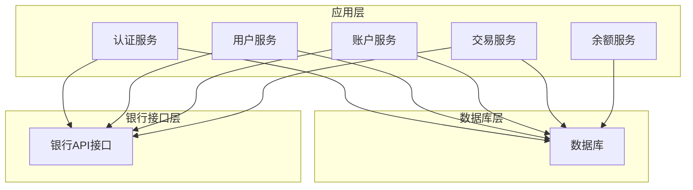
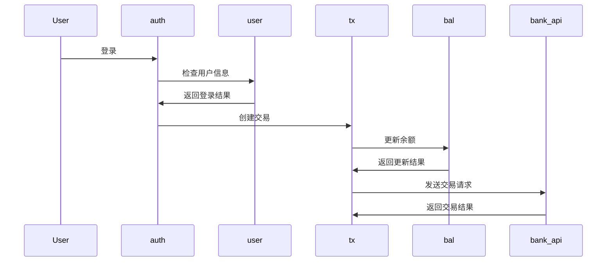

                 

### 文章标题

# 敏捷开发实践与团队协作

> 关键词：敏捷开发、团队协作、实践方法、敏捷管理、案例分析

> 摘要：本文将深入探讨敏捷开发的实践方法与团队协作的重要性。通过背景介绍、核心概念、团队协作策略、敏捷实践、敏捷管理、案例分析以及最佳实践等多个方面，旨在为读者提供全面、实用的敏捷开发指南。

## 背景介绍

### 敏捷开发的起源

敏捷开发起源于20世纪90年代，随着软件开发项目复杂度的增加和变化，传统的瀑布模型开发方式逐渐显露出其局限性。为了应对快速变化的市场需求和客户需求，敏捷开发应运而生。

### 敏捷开发的基本理念

敏捷开发倡导的核心价值包括：个体和互动重于过程与工具、可工作的软件重于详尽的文档、客户合作重于合同谈判、响应变化重于遵循计划。

### 敏捷开发的重要性

敏捷开发在提高软件质量和项目交付效率方面具有显著优势。它强调持续交付有价值的软件，通过迭代和增量开发，确保项目能够灵活应对变化。

## 核心概念

### 敏捷宣言

敏捷宣言是敏捷开发的基石，它明确了软件开发中的价值排序：

- **个体和互动** > **过程与工具**
- **可工作的软件** > **详尽的文档**
- **客户合作** > **合同谈判**
- **响应变化** > **遵循计划**

### 敏捷原则

敏捷原则进一步阐述了敏捷宣言的具体实践：

1. **需求 Satisfaction through early and continuous delivery of valuable software.**
2. **Welcome changing requirements, even late in development.**
3. **Deliver working software frequently, from a couple of weeks to a couple of months, with a preference to the shorter timescale.**
4. **Business people and developers must work together daily.**
5. **Build projects around motivated individuals. Give them the environment and support they need, and trust them to get the job done.**
6. **The most efficient and effective method of conveying information to and within a development team is face-to-face conversation.**
7. **Working software is the primary measure of progress.**
8. **Agile processes promote sustainable development. The sponsors, developers, and users should be able to maintain a constant pace indefinitely.**
9. **Continuous attention to technical excellence and good design enhances agility.**
10. **Simplicity—the art of maximizing the amount of work not done—is essential.**
11. **The best architectures, requirements, and designs emerge from self-organizing teams.**
12. **At regular intervals, the team reflects on how to become more effective, then tunes and adjusts its behavior accordingly.**

### 敏捷价值观

敏捷价值观强调了个人与互动的重要性，工作的软件价值，客户协作，和响应变化的灵活性。

## 团队协作

### 敏捷团队的角色和职责

敏捷团队通常包括产品负责人（Product Owner）、Scrum Master和开发团队。每个角色都有特定的职责和作用。

- **产品负责人**：负责定义产品的愿景和需求，确保开发的工作与产品目标保持一致。
- **Scrum Master**：负责确保团队遵循敏捷实践，解决团队面临的障碍。
- **开发团队**：负责实际开发工作，通常由多学科专家组成。

### 敏捷团队的协作策略

- **站立会议**：每日进行的简短会议，用于同步团队进度和解决问题。
- **迭代回顾**：在每个迭代结束时，团队会回顾并讨论如何改进协作流程。
- **用户故事**：描述用户需求，并用于规划迭代和任务分配。

### 敏捷团队的文化建设

- **开放性**：鼓励团队成员开放沟通，分享意见和想法。
- **透明性**：确保所有团队成员都能访问相关项目信息。
- **协作性**：强调团队合作，共同解决问题。

## 敏捷实践

### 敏捷开发流程

敏捷开发流程通常包括规划、迭代、回顾三个阶段。每个阶段都有特定的活动和方法。

- **规划**：确定项目目标、优先级和任务分配。
- **迭代**：在预定时间内（通常是2-4周）完成一系列任务。
- **回顾**：总结迭代成果，讨论改进点。

### 敏捷方法论

敏捷方法论包括各种实践，如看板（Kanban）、Scrum、看板化（Scrumban）等，每种方法论都有其特定的流程和工具。

- **看板**：可视化工作流程，通过限制在流程中的工作项数量来提高效率。
- **Scrum**：强调迭代和增量开发，通过每日站立会议、冲刺规划和回顾来管理项目。
- **看板化**：结合看板和Scrum的最佳实践，提高团队的敏捷性。

### 敏捷开发工具

敏捷开发工具包括各种软件，如JIRA、Trello、Confluence等，用于任务跟踪、文档管理、项目管理等。

- **JIRA**：用于任务跟踪、问题管理和敏捷开发流程。
- **Trello**：基于看板的任务管理工具，简单易用。
- **Confluence**：用于文档管理和协作。

## 敏捷管理

### 敏捷开发中的管理角色

敏捷管理角色与传统项目管理角色有所不同。敏捷团队更注重自我管理和自主决策。

- **产品负责人**：负责产品愿景和需求的定义。
- **Scrum Master**：负责确保团队遵循敏捷实践。
- **开发团队**：负责实际开发工作。

### 敏捷开发流程管理

敏捷流程管理强调灵活性、迭代和持续改进。管理活动包括：

- **迭代计划**：确定每个迭代的目标和任务。
- **每日站立会议**：同步团队进度和解决问题。
- **迭代回顾**：总结迭代成果，讨论改进点。

### 敏捷项目管理

敏捷项目管理侧重于项目交付的价值和灵活性。关键活动包括：

- **需求管理**：确保需求清晰、可理解和可追踪。
- **风险管理**：识别、评估和缓解项目风险。
- **质量保证**：确保软件质量和项目交付。

## 案例分析

### 案例一：公司A的敏捷转型

公司A在面临市场压力和项目延误后，决定采用敏捷开发方法。通过逐步转型，公司实现了项目交付速度的提高和团队协作的加强。

### 案例二：项目B的敏捷实践

项目B在实施敏捷开发后，通过每日站立会议和迭代回顾，解决了团队协作中的沟通障碍，提高了项目进度和质量。

### 案例三：团队C的敏捷协作

团队C通过采用看板化实践，实现了工作流程的可视化和效率提升，显著提高了团队协作效果。

## 最佳实践

### 敏捷转型的关键因素

敏捷转型成功的关键因素包括：

- **团队协作**：确保团队成员之间的有效沟通和协作。
- **领导支持**：领导层对敏捷实践的支持和承诺。
- **持续改进**：不断反思和改进敏捷实践。

### 敏捷实践中的挑战与应对策略

敏捷实践中的挑战包括：

- **团队适应**：团队成员可能需要时间适应新的工作方式。
- **项目管理**：传统项目管理方法与敏捷方法的融合。

### 敏捷开发的持续改进

敏捷开发是一个持续改进的过程。通过反思、总结和调整，团队可以不断提高敏捷实践的效率和质量。

## 未来展望

### 敏捷开发的趋势

敏捷开发在未来将继续发展，更加注重团队协作、持续改进和客户参与。

### 敏捷开发面临的挑战

敏捷开发面临的挑战包括：

- **文化变革**：组织文化需要适应敏捷实践。
- **技能提升**：团队成员需要不断提升敏捷技能。

### 敏捷开发的未来方向

敏捷开发的未来方向包括：

- **数字化转型**：敏捷开发与数字化转型的深度融合。
- **可持续性**：注重敏捷开发对社会和环境的影响。

### 结语

敏捷开发实践与团队协作是现代软件开发的重要趋势。通过深入理解和应用敏捷原则和实践，团队可以更好地应对快速变化的市场需求，提高项目交付质量和效率。让我们共同探索敏捷开发的未来，为软件开发领域的发展贡献力量。

## 作者信息

作者：AI天才研究院/AI Genius Institute & 禅与计算机程序设计艺术 /Zen And The Art of Computer Programming

以上是《敏捷开发实践与团队协作》的文章大纲，每个章节都包含了核心概念、实践方法和案例分析等内容。接下来，我们将进一步详细探讨敏捷开发的各个方面，帮助读者深入理解并应用敏捷实践。在后续章节中，我们将逐步分析敏捷开发的核心概念、团队协作策略、敏捷实践、敏捷管理、案例分析以及最佳实践等内容。

## 详细内容

### 第1章 敏捷开发概述

### 1.1 敏捷开发的起源和发展

敏捷开发起源于20世纪90年代，最初是在软件开发项目中针对传统瀑布模型（Waterfall Model）的局限性而提出的一种新的软件开发方法。瀑布模型是一种线性的、顺序的开发模型，其特点是将软件开发过程划分为若干阶段，每个阶段都需要上一个阶段的结果才能开始。这种方法在早期软件项目中被广泛应用，但随着时间的推移，其固有的缺陷逐渐暴露出来。

传统的瀑布模型存在以下主要问题：

1. **需求变更困难**：在项目开发过程中，需求可能会发生变化，但在瀑布模型中，需求的变更会导致整个项目进度和成本的巨大波动。
2. **沟通障碍**：瀑布模型强调文档的编写和审阅，往往导致开发人员与业务人员之间的沟通障碍，影响项目的顺利进行。
3. **缺乏灵活性**：瀑布模型无法灵活应对市场变化和客户需求，导致项目交付周期过长，无法满足现代快节奏的市场需求。

为了解决这些问题，敏捷开发应运而生。敏捷开发（Agile Development）是一种以人为核心、迭代、增量和灵活应对变化的软件开发方法。其核心理念是快速响应变化，通过短周期迭代和频繁交付有价值的软件，来满足客户的需求。

敏捷开发的发展历程可以分为几个阶段：

1. **早期敏捷方法**：最早期的敏捷方法包括Crystal、XProgramming、Dynamic System Development Method（DSDM）等，它们试图通过不同的方式来改进软件开发的效率和质量。
2. **敏捷宣言**：2001年，17位软件开发专家在美国雪鸟山庄（Snowbird）共同签署了《敏捷宣言》（Manifesto for Agile Software Development），明确了敏捷开发的核心价值观和实践原则。
3. **Scrum和Kanban**：Scrum和Kanban是两种最著名的敏捷方法论，它们在敏捷开发实践中被广泛应用。Scrum强调迭代和增量开发，通过每日站立会议、冲刺规划和回顾来管理项目；Kanban则强调工作流程的可视化和限制在流程中的工作项数量，以减少工作积压和提高工作效率。

### 1.2 敏捷开发的基本理念

敏捷开发的基本理念体现在其核心价值观和原则中，这些理念贯穿于整个软件开发过程，指导开发团队的工作。

#### 敏捷宣言

《敏捷宣言》（Manifesto for Agile Software Development）是敏捷开发的基石，它明确了软件开发中的价值排序：

1. **个体和互动重于过程与工具**：强调团队成员之间的沟通和协作，认为个人的创造力和团队的合作比遵循特定的过程或使用特定的工具更为重要。
2. **可工作的软件重于详尽的文档**：认为软件的实际可用性和功能是衡量项目成功的关键，而详尽的文档虽然重要，但不应成为项目的主要关注点。
3. **客户合作重于合同谈判**：鼓励开发团队与客户紧密合作，通过持续交流和反馈来确保软件满足客户的需求，而不仅仅是遵循合同条款。
4. **响应变化重于遵循计划**：在软件开发过程中，需求往往会发生变更，敏捷开发强调团队应该灵活应对这些变化，而不是固守原有的计划。

#### 敏捷原则

敏捷宣言进一步具体化为一系列敏捷原则，这些原则为敏捷实践提供了具体指导：

1. **需求 Satisfaction through early and continuous delivery of valuable software.**：通过早期和持续的交付有价值的软件来满足客户的需求。
2. **Welcome changing requirements, even late in development.**：欢迎在开发过程中出现的变更，甚至在项目后期也是如此。
3. **Deliver working software frequently, from a couple of weeks to a couple of months, with a preference to the shorter timescale.**：频繁交付可工作的软件，每次交付的周期从几周到一个季度不等，更倾向于较短的时间周期。
4. **Business people and developers must work together daily.**：业务人员和开发人员必须每天共同工作。
5. **Build projects around motivated individuals. Give them the environment and support they need, and trust them to get the job done.**：围绕有动机的个体来构建项目。为他们提供所需的环境和支持，并信任他们能够完成任务。
6. **The most efficient and effective method of conveying information to and within a development team is face-to-face conversation.**：面对面的交流是传达和团队内部信息的最有效方法。
7. **Working software is the primary measure of progress.**：可工作的软件是衡量进度的主要标准。
8. **Agile processes promote sustainable development. The sponsors, developers, and users should be able to maintain a constant pace indefinitely.**：敏捷过程促进可持续性开发。赞助商、开发人员和用户应该能够无限期地保持稳定的进展。
9. **Continuous attention to technical excellence and good design enhances agility.**：持续关注技术卓越和良好设计可以提高敏捷性。
10. **Simplicity—the art of maximizing the amount of work not done—is essential.**：简单性——最大化不做的工作的艺术是至关重要的。
11. **The best architectures, requirements, and designs emerge from self-organizing teams.**：最好的架构、需求和设计来自于自我组织的团队。
12. **At regular intervals, the team reflects on how to become more effective, then tunes and adjusts its behavior accordingly.**：定期地，团队反思如何变得更为高效，然后相应地调整其行为。

#### 敏捷价值观

敏捷价值观进一步强调了敏捷开发中重要的因素：

- **个体和互动**：尊重团队成员的个性和互动，鼓励开放沟通和协作。
- **可工作的软件**：软件的实际可用性和功能是项目的核心，而非文档或计划。
- **客户合作**：与客户的紧密合作，确保软件满足实际需求。
- **响应变化**：灵活应对需求变化，保持项目的灵活性和适应性。

### 1.3 敏捷开发的重要性

敏捷开发在提高软件质量和项目交付效率方面具有显著优势。以下是敏捷开发的重要性和优势：

1. **快速响应市场需求**：敏捷开发通过短周期迭代和频繁交付，能够快速响应市场需求，确保软件产品始终符合客户需求。
2. **提高项目交付效率**：敏捷开发强调持续交付有价值的软件，通过消除冗余工作和优化开发流程，提高项目交付效率。
3. **增强团队协作**：敏捷开发鼓励团队协作和沟通，通过每日站立会议、迭代回顾等实践，增强团队凝聚力，提高协作效率。
4. **减少风险**：敏捷开发通过早期和持续的交付，及时发现和解决潜在问题，降低项目风险。
5. **提高软件质量**：敏捷开发强调技术卓越和良好设计，通过持续的关注和改进，提高软件质量。
6. **客户满意度**：敏捷开发与客户的紧密合作，确保软件产品满足客户需求，提高客户满意度。

### 第2章 敏捷开发的关键概念

### 2.1 敏捷宣言

《敏捷宣言》（Manifesto for Agile Software Development）是敏捷开发的基石，它由17位软件开发专家在2001年签署。宣言明确了软件开发中的核心价值观，并指导开发团队在实际工作中遵循的原则。

#### 敏捷宣言的内容

敏捷宣言包含以下四条核心价值观：

1. **个体和互动重于过程与工具**：强调团队中个体的重要性，认为有效的沟通和协作比遵循特定的过程或使用特定的工具更为重要。
2. **可工作的软件重于详尽的文档**：认为软件的实际可用性和功能是项目成功的关键，而详尽的文档虽然重要，但不应成为项目的主要关注点。
3. **客户合作重于合同谈判**：鼓励开发团队与客户紧密合作，通过持续交流和反馈来确保软件满足客户的需求，而不仅仅是遵循合同条款。
4. **响应变化重于遵循计划**：在软件开发过程中，需求往往会发生变更，敏捷宣言强调团队应该灵活应对这些变化，而不是固守原有的计划。

#### 敏捷宣言的影响

敏捷宣言的发表标志着软件开发领域的一个重要转折点。它提倡以人为核心的软件开发方法，强调团队协作、客户参与和持续交付，反对传统的瀑布模型和文档驱动的开发方式。敏捷宣言对敏捷开发的发展产生了深远的影响，推动了各种敏捷方法论和实践的出现。

### 2.2 敏捷原则

敏捷原则是敏捷宣言的具体化，它们为敏捷实践提供了详细的指导。敏捷原则包括12条，每条原则都反映了敏捷开发的核心价值观和实际应用。

#### 敏捷原则的内容

1. **需求 Satisfaction through early and continuous delivery of valuable software.**：通过早期和持续的交付有价值的软件来满足客户的需求。
2. **Welcome changing requirements, even late in development.**：欢迎在开发过程中出现的变更，甚至在项目后期也是如此。
3. **Deliver working software frequently, from a couple of weeks to a couple of months, with a preference to the shorter timescale.**：频繁交付可工作的软件，每次交付的周期从几周到一个季度不等，更倾向于较短的时间周期。
4. **Business people and developers must work together daily.**：业务人员和开发人员必须每天共同工作。
5. **Build projects around motivated individuals. Give them the environment and support they need, and trust them to get the job done.**：围绕有动机的个体来构建项目。为他们提供所需的环境和支持，并信任他们能够完成任务。
6. **The most efficient and effective method of conveying information to and within a development team is face-to-face conversation.**：面对面的交流是传达和团队内部信息的最有效方法。
7. **Working software is the primary measure of progress.**：可工作的软件是衡量进度的主要标准。
8. **Agile processes promote sustainable development. The sponsors, developers, and users should be able to maintain a constant pace indefinitely.**：敏捷过程促进可持续性开发。赞助商、开发人员和用户应该能够无限期地保持稳定的进展。
9. **Continuous attention to technical excellence and good design enhances agility.**：持续关注技术卓越和良好设计可以提高敏捷性。
10. **Simplicity—the art of maximizing the amount of work not done—is essential.**：简单性——最大化不做的工作的艺术是至关重要的。
11. **The best architectures, requirements, and designs emerge from self-organizing teams.**：最好的架构、需求和设计来自于自我组织的团队。
12. **At regular intervals, the team reflects on how to become more effective, then tunes and adjusts its behavior accordingly.**：定期地，团队反思如何变得更为高效，然后相应地调整其行为。

#### 敏捷原则的应用

敏捷原则在实际软件开发过程中被广泛应用，它们为团队提供了具体的指导，帮助团队更好地应对变化和挑战。例如：

- **早期和持续交付**：通过短周期迭代，团队可以更频繁地向客户交付可工作的软件，确保软件始终符合客户需求。
- **欢迎变更**：在开发过程中，需求可能会发生变化，敏捷原则鼓励团队接受这些变更，并通过快速响应来适应变化。
- **业务人员和开发人员的合作**：业务人员和开发人员每天共同工作，确保需求得到准确理解和实现。
- **技术卓越和良好设计**：持续关注技术卓越和设计，可以提高软件的质量和可维护性。
- **自我组织团队**：自我组织的团队可以更好地应对复杂的项目，通过自主决策和协作来提高工作效率。

### 2.3 敏捷价值观

敏捷价值观是敏捷宣言和敏捷原则的具体体现，它们反映了敏捷开发的核心信念和原则。敏捷价值观包括以下几个方面：

1. **以人为本**：敏捷开发强调人的价值和作用，认为团队中的每个成员都是项目成功的关键。团队协作和个体发挥是敏捷开发的核心。
2. **持续交付**：敏捷开发追求快速、频繁地交付有价值的软件，以满足客户需求。持续交付有助于保持项目的活力和灵活性。
3. **客户至上**：客户需求是敏捷开发的驱动力，团队应该始终关注客户需求，确保软件产品能够满足客户的期望。
4. **灵活应对变化**：敏捷开发强调灵活应对变化，通过短周期迭代和快速反馈，团队可以更好地应对市场和环境的变化。
5. **技术卓越**：敏捷开发重视技术卓越和设计，认为高质量的设计和代码是实现敏捷开发的关键。
6. **自主决策**：自我组织的团队可以更好地应对复杂的项目，通过自主决策和协作，团队可以更加高效地解决问题。

#### 敏捷价值观的应用

敏捷价值观在实际软件开发过程中被广泛应用，它们为团队提供了具体的指导，帮助团队更好地实现敏捷开发。例如：

- **以人为本**：团队领导应该关注团队成员的需求和成长，为团队成员提供支持和培训，促进团队协作和知识共享。
- **持续交付**：通过短周期迭代和频繁交付，团队可以更早地发现和解决潜在问题，确保软件始终处于可交付状态。
- **客户至上**：团队应该与客户保持紧密沟通，了解客户需求和市场动态，确保软件产品能够满足客户期望。
- **灵活应对变化**：在项目开发过程中，团队应该保持灵活性，快速响应需求变更和市场变化。
- **技术卓越**：团队应该注重技术卓越和设计，通过持续改进和最佳实践，提高软件质量和可维护性。
- **自主决策**：自我组织的团队可以更好地应对复杂的项目，通过自主决策和协作，团队可以更加高效地解决问题。

通过遵循敏捷价值观，团队可以更好地实现敏捷开发，提高项目交付质量和效率，实现持续成功。

### 第3章 敏捷开发中的团队协作

#### 敏捷团队的角色和职责

在敏捷开发中，团队的角色和职责与传统项目管理中的角色有所不同。敏捷团队通常由以下角色组成：

1. **产品负责人（Product Owner）**：
   - **角色职责**：产品负责人是敏捷团队的核心成员，负责定义产品的愿景和需求，确保开发的工作与产品目标保持一致。
   - **主要任务**：产品负责人需要与利益相关者（如客户、用户、管理层等）保持密切沟通，了解他们的需求和期望，并将其转化为具体的需求和功能。此外，产品负责人还需要制定优先级，确保团队优先完成最有价值的功能。
   - **技能要求**：产品负责人通常需要具备业务理解能力、需求分析能力、沟通能力和决策能力。

2. **Scrum Master**：
   - **角色职责**：Scrum Master是敏捷团队的指导者，负责确保团队遵循敏捷实践，解决团队面临的障碍，并促进团队协作。
   - **主要任务**：Scrum Master需要组织每日站立会议、迭代回顾会议和迭代规划会议，确保团队按时交付可工作的软件。Scrum Master还需要帮助团队识别和解决影响项目进展的问题，如沟通障碍、资源不足等。此外，Scrum Master还需要推广敏捷理念，帮助团队成员提高敏捷技能。
   - **技能要求**：Scrum Master需要具备良好的沟通能力、问题解决能力和敏捷实践知识。

3. **开发团队**：
   - **角色职责**：开发团队是敏捷团队的核心执行者，负责实际开发工作。开发团队通常由多个功能不同但技能互补的成员组成，如程序员、测试员、设计师等。
   - **主要任务**：开发团队需要根据产品负责人的需求，完成软件开发任务，并在每个迭代周期内交付可工作的软件。开发团队还需要参与每日站立会议、迭代回顾会议和迭代规划会议，以确保项目进展顺利。
   - **技能要求**：开发团队成员需要具备相关的技术技能、团队协作能力和敏捷实践知识。

#### 敏捷团队的协作策略

敏捷团队的成功很大程度上取决于团队成员之间的协作。以下是几种常见的敏捷协作策略：

1. **每日站立会议**：
   - **目的**：每日站立会议是敏捷团队的一个重要实践，旨在同步团队进度、解决问题和保持团队沟通。
   - **内容**：每日站立会议通常持续15-30分钟，由团队每个成员轮流发言。成员需要回答以下三个问题：
     - **昨天完成了什么？**
     - **今天计划完成什么？**
     - **遇到的问题是什么？**
   - **优势**：每日站立会议有助于团队成员了解项目进展、发现问题并及时解决，提高团队协作效率。

2. **迭代回顾会议**：
   - **目的**：迭代回顾会议是在每个迭代周期结束时进行的，旨在总结迭代成果、识别改进点，并制定下一步改进计划。
   - **内容**：在迭代回顾会议上，团队需要讨论以下问题：
     - **本次迭代的成功之处是什么？**
     - **遇到的问题是什么？**
     - **如何改进未来的迭代？**
   - **优势**：迭代回顾会议有助于团队不断反思和改进，提高项目质量和效率。

3. **用户故事**：
   - **目的**：用户故事是一种描述用户需求的方法，它强调用户的价值和需求，有助于团队更好地理解用户需求并优先处理。
   - **内容**：用户故事通常包含以下要素：
     - **用户角色**：描述使用软件的用户或角色。
     - **场景**：描述用户使用软件的情景。
     - **功能**：描述用户需要的功能或操作。
     - **价值**：说明该功能对用户的价值。
   - **优势**：用户故事有助于团队聚焦用户需求，确保开发的工作与用户价值保持一致。

4. **看板**：
   - **目的**：看板是一种可视化工作流程的工具，它有助于团队识别和解决工作积压（WIP，Work in Progress）问题，提高工作效率。
   - **内容**：看板通常包括以下部分：
     - **任务列表**：列出所有待完成的任务。
     - **进度条**：显示每个任务的进度。
     - **资源利用图**：显示团队成员的资源和时间安排。
   - **优势**：看板有助于团队实时了解工作进展、识别瓶颈和优化工作流程。

#### 敏捷团队的文化建设

敏捷团队的文化建设是确保团队高效协作和持续改进的关键。以下是几种常见的敏捷团队文化建设策略：

1. **开放沟通**：
   - **目的**：开放沟通是指团队成员之间无障碍的沟通，鼓励每个人表达自己的想法和意见。
   - **策略**：团队可以通过定期举办分享会、头脑风暴会议和开放讨论等方式，促进团队成员之间的沟通和知识共享。

2. **信任与尊重**：
   - **目的**：信任与尊重是建立高效敏捷团队的基础，它有助于团队成员之间建立良好的合作关系。
   - **策略**：团队可以通过建立透明的工作环境、鼓励团队成员互相支持和尊重，以及提供公平的反馈和评价，来建立信任与尊重。

3. **持续学习与改进**：
   - **目的**：持续学习与改进是指团队成员不断学习和提升自己的技能，以及持续改进团队的工作流程。
   - **策略**：团队可以通过定期进行技能培训、分享最佳实践和反思会议等方式，促进团队成员的持续学习和改进。

通过以上策略，敏捷团队能够建立一种积极、开放、合作和持续改进的文化，从而提高团队协作效率和项目成功率。

### 第4章 敏捷开发的具体实践

#### 敏捷开发流程

敏捷开发流程是一种迭代、增量和灵活应对变化的软件开发方法。它通过短周期迭代和频繁交付，确保团队能够快速响应市场需求，并持续交付有价值的工作成果。以下是敏捷开发流程的主要步骤：

1. **规划（Planning）**：
   - **目的**：规划是敏捷开发流程的起始步骤，用于确定项目的目标、优先级和任务分配。
   - **内容**：在规划阶段，团队需要与产品负责人一起制定迭代计划，包括确定本次迭代的目标、任务列表、资源分配和时间安排。规划会议通常在迭代开始前进行，以确保团队成员对项目的目标和工作任务有清晰的认识。

2. **迭代（Sprint）**：
   - **目的**：迭代是敏捷开发流程的核心，用于实现每次迭代的目标并交付可工作的软件。
   - **内容**：迭代通常持续2-4周，团队在每个迭代周期内完成一系列任务，并交付一个可工作的软件版本。迭代期间，团队会遵循敏捷原则和实践，如每日站立会议、迭代回顾会议等，以确保项目进展顺利。

3. **回顾（Retrospective）**：
   - **目的**：回顾是敏捷开发流程的总结步骤，用于反思本次迭代的工作，识别改进点，并制定下一步的改进计划。
   - **内容**：在回顾会议上，团队需要讨论以下问题：
     - **本次迭代的成功之处是什么？**
     - **遇到的问题是什么？**
     - **如何改进未来的迭代？**
   - **优势**：回顾会议有助于团队不断反思和改进，提高项目的质量和效率。

#### 敏捷方法论

敏捷方法论是敏捷开发的具体实现方法，包括Scrum、Kanban、看板化（Scrumban）等。以下是几种常见的敏捷方法论及其特点：

1. **Scrum**：
   - **特点**：Scrum是一种迭代、增量和灵活的软件开发方法，它通过每日站立会议、冲刺规划会议和回顾会议来管理项目。
   - **优势**：Scrum强调团队协作和透明度，有助于提高项目进度和质量。

2. **Kanban**：
   - **特点**：Kanban是一种基于可视化工作流程的敏捷方法论，它通过限制在流程中的工作项数量（Work in Progress，WIP）来减少工作积压和提高工作效率。
   - **优势**：Kanban强调工作流程的优化和持续改进，有助于提高团队的工作效率。

3. **看板化（Scrumban）**：
   - **特点**：看板化是将Scrum和Kanban的最佳实践相结合的一种敏捷方法论。它结合了Scrum的迭代和规划以及Kanban的持续改进和工作流程优化。
   - **优势**：看板化提供了一种灵活的敏捷开发方法，既保留了Scrum的迭代和规划优势，又结合了Kanban的工作流程优化。

#### 敏捷开发工具

敏捷开发工具是支持敏捷开发流程和方法论的各种软件，用于任务跟踪、文档管理、项目管理等。以下是几种常见的敏捷开发工具：

1. **JIRA**：
   - **功能**：JIRA是一种功能强大的任务跟踪和管理工具，支持敏捷开发流程，包括迭代规划、任务分配、进度跟踪等。
   - **优势**：JIRA具有强大的定制能力，可以根据团队的需求进行配置，支持多种视图和报告，便于团队监控项目进展。

2. **Trello**：
   - **功能**：Trello是一种基于看板的任务管理工具，提供简单直观的界面，支持拖拽操作，便于团队管理任务和跟踪进度。
   - **优势**：Trello操作简单，易于上手，适合小团队或个人项目管理。

3. **Confluence**：
   - **功能**：Confluence是一种协作平台，用于文档管理、知识共享和项目管理。它可以与JIRA等工具集成，提供全面的项目管理解决方案。
   - **优势**：Confluence支持丰富的文档格式和协作功能，便于团队共享和协作。

通过使用这些敏捷开发工具，团队可以更好地管理项目、跟踪任务和协作，从而提高项目交付质量和效率。

### 第5章 敏捷开发中的管理

#### 敏捷开发中的管理角色

在敏捷开发中，管理角色与传统项目管理中的角色有所不同，更强调团队自主管理和自我组织。以下是敏捷开发中的主要管理角色及其职责：

1. **产品负责人（Product Owner）**：
   - **职责**：产品负责人是敏捷团队的核心成员，负责定义产品的愿景和需求，确保开发的工作与产品目标保持一致。产品负责人还需要与利益相关者（如客户、用户、管理层等）保持密切沟通，了解他们的需求和期望，并将其转化为具体的需求和功能。

2. **Scrum Master**：
   - **职责**：Scrum Master是敏捷团队的指导者，负责确保团队遵循敏捷实践，解决团队面临的障碍，并促进团队协作。Scrum Master需要组织每日站立会议、迭代回顾会议和迭代规划会议，确保团队按时交付可工作的软件。此外，Scrum Master还需要推广敏捷理念，帮助团队成员提高敏捷技能。

3. **开发团队**：
   - **职责**：开发团队是敏捷团队的核心执行者，负责实际开发工作。开发团队通常由多个功能不同但技能互补的成员组成，如程序员、测试员、设计师等。开发团队需要根据产品负责人的需求，完成软件开发任务，并在每个迭代周期内交付可工作的软件。

#### 敏捷开发流程管理

敏捷开发流程管理是一种动态、灵活的项目管理方法，强调持续交付、客户合作和持续改进。以下是敏捷开发流程管理的关键要素：

1. **迭代管理**：
   - **目的**：迭代管理是确保团队在每个迭代周期内按时、按质量交付工作成果的方法。
   - **内容**：在迭代管理中，团队需要制定迭代计划，包括确定迭代目标、任务分配和时间安排。在迭代过程中，团队需要通过每日站立会议、迭代回顾会议等实践，确保项目进展顺利，并及时解决遇到的问题。

2. **需求管理**：
   - **目的**：需求管理是确保团队能够准确理解并实现客户需求的方法。
   - **内容**：在需求管理中，团队需要与产品负责人和客户紧密合作，了解他们的需求和期望，并将其转化为具体的需求和功能。团队还需要对需求进行优先级排序，确保最重要的需求得到优先处理。

3. **风险管理**：
   - **目的**：风险管理是识别、评估和缓解项目风险的方法。
   - **内容**：在风险管理中，团队需要识别可能影响项目进展的风险，评估风险的概率和影响，并制定相应的应对策略。在项目进行过程中，团队需要持续监控风险，并及时调整应对策略。

4. **质量管理**：
   - **目的**：质量管理是确保软件质量满足客户期望的方法。
   - **内容**：在质量管理中，团队需要制定质量标准，实施质量保证措施，如代码审查、测试等。此外，团队还需要在迭代过程中持续改进质量，确保软件质量不断提升。

#### 敏捷项目管理

敏捷项目管理是一种以人为核心、灵活应对变化的现代项目管理方法。以下是敏捷项目管理的几个关键要素：

1. **团队协作**：
   - **目的**：团队协作是确保项目成功的关键。
   - **内容**：在敏捷项目管理中，团队需要建立良好的沟通和协作机制，确保团队成员之间能够及时交流、分享信息和协作解决问题。

2. **客户参与**：
   - **目的**：客户参与是确保项目满足客户需求的关键。
   - **内容**：在敏捷项目管理中，团队需要与客户保持密切沟通，了解客户的需求和期望，并在项目过程中及时反馈和调整。

3. **持续交付**：
   - **目的**：持续交付是确保项目按时交付有价值的软件的关键。
   - **内容**：在敏捷项目管理中，团队需要通过短周期迭代和频繁交付，确保项目在每次迭代周期内交付有价值的软件，并持续改进。

4. **反馈与改进**：
   - **目的**：反馈与改进是确保项目不断进步的关键。
   - **内容**：在敏捷项目管理中，团队需要通过迭代回顾会议等实践，不断反思和总结项目经验和教训，并根据反馈进行改进。

通过以上要素，敏捷项目管理可以帮助团队更好地应对变化和挑战，提高项目交付质量和效率。

### 第6章 敏捷开发案例分析

#### 案例一：公司A的敏捷转型

**背景**

公司A是一家中型软件企业，主要从事企业级应用软件的开发和销售。在传统瀑布模型下，公司A的项目经常出现延误、超预算和质量问题。为了提高项目交付质量和效率，公司决定进行敏捷转型。

**过程**

1. **需求分析**：
   - 公司A首先对现有的项目进行了全面的需求分析，明确了项目的目标和需求。然后，公司组织了团队培训和研讨会，帮助团队成员了解敏捷开发的基本理念和实践方法。

2. **Scrum实践**：
   - 公司A采用了Scrum方法论，成立了跨职能的敏捷团队，包括产品负责人、Scrum Master和开发团队成员。团队按照Scrum的流程进行工作，包括每日站立会议、迭代规划会议和回顾会议。

3. **迭代开发**：
   - 团队开始进行迭代开发，每个迭代周期为两周。在每个迭代中，团队完成一系列任务，并交付一个可工作的软件版本。团队通过用户故事来管理需求，并按照优先级进行任务分配。

4. **反馈与改进**：
   - 在每个迭代结束后，团队进行回顾会议，总结本次迭代的成功经验和存在的问题，并制定改进计划。团队还定期进行需求评审和迭代规划，确保项目按照预期进行。

**结果**

通过敏捷转型，公司A取得了显著的成果：

1. **项目交付质量提高**：
   - 敏捷开发方法使团队能够更快地发现和解决问题，提高了软件质量。

2. **项目交付效率提高**：
   - 通过短周期迭代和频繁交付，团队能够更好地应对需求变更，提高了项目交付效率。

3. **团队协作加强**：
   - 敏捷实践促进了团队成员之间的沟通和协作，加强了团队凝聚力。

4. **客户满意度提高**：
   - 客户对公司的软件产品和服务满意度提高，为公司带来了更多的业务机会。

#### 案例二：项目B的敏捷实践

**背景**

项目B是一个涉及多个团队的复杂软件项目，包括前端开发、后端开发、数据库设计和测试等。由于项目规模庞大，传统瀑布模型难以有效管理，项目进展缓慢，质量问题突出。为了提高项目效率和质量，项目团队决定采用敏捷开发方法。

**过程**

1. **Scrum实践**：
   - 项目团队采用了Scrum方法论，每个团队都有自己的Scrum Master，负责组织每日站立会议、迭代规划和回顾会议。

2. **用户故事**：
   - 团队通过用户故事来管理需求，每个用户故事都包含用户角色、场景、功能和价值。用户故事被优先级排序，并分配到不同的迭代中。

3. **迭代开发**：
   - 项目按照迭代周期进行开发，每个迭代周期为一个月。在每个迭代中，团队完成一系列任务，并交付一个可工作的软件版本。

4. **看板化**：
   - 团队采用了看板化实践，通过可视化看板来管理任务流程。看板帮助团队识别工作瓶颈，优化工作流程，减少工作积压。

5. **反馈与改进**：
   - 在每个迭代结束后，团队进行回顾会议，总结本次迭代的成功经验和存在的问题，并制定改进计划。团队还定期进行需求评审和迭代规划，确保项目按照预期进行。

**结果**

通过敏捷实践，项目B取得了以下成果：

1. **项目进度加快**：
   - 敏捷开发方法使团队能够更好地应对需求变更，加快了项目进度。

2. **软件质量提高**：
   - 通过短周期迭代和频繁交付，团队能够更快地发现和解决问题，提高了软件质量。

3. **团队协作加强**：
   - 敏捷实践促进了团队成员之间的沟通和协作，加强了团队凝聚力。

4. **客户满意度提高**：
   - 客户对项目的进度和质量表示满意，为公司带来了更多的业务机会。

#### 案例三：团队C的敏捷协作

**背景**

团队C是一个跨部门的软件开发团队，负责开发和维护公司的内部管理系统。由于团队成员来自不同的部门，沟通不畅和协作困难一直是团队面临的主要问题。为了提高团队协作效率，团队决定采用敏捷开发方法。

**过程**

1. **Kanban实践**：
   - 团队采用了Kanban方法论，通过可视化看板来管理任务流程。看板帮助团队成员了解任务的状态和进度，减少了沟通障碍。

2. **用户故事**：
   - 团队通过用户故事来管理需求，每个用户故事都包含用户角色、场景、功能和价值。用户故事被优先级排序，并分配到不同的迭代中。

3. **迭代开发**：
   - 团队按照迭代周期进行开发，每个迭代周期为两周。在每个迭代中，团队完成一系列任务，并交付一个可工作的软件版本。

4. **每日站立会议**：
   - 团队每天召开每日站立会议，团队成员轮流汇报任务进展，讨论遇到的问题，并制定解决方案。

5. **反馈与改进**：
   - 在每个迭代结束后，团队进行回顾会议，总结本次迭代的成功经验和存在的问题，并制定改进计划。团队还定期进行需求评审和迭代规划，确保项目按照预期进行。

**结果**

通过敏捷协作，团队C取得了以下成果：

1. **协作效率提高**：
   - 通过Kanban实践和每日站立会议，团队协作效率显著提高，任务完成速度加快。

2. **沟通障碍减少**：
   - 团队成员之间的沟通更加畅通，信息传递更加高效，减少了协作中的误解和冲突。

3. **团队凝聚力增强**：
   - 敏捷实践促进了团队成员之间的沟通和协作，增强了团队凝聚力。

4. **软件质量提高**：
   - 通过短周期迭代和频繁交付，团队能够更快地发现和解决问题，提高了软件质量。

通过以上案例，我们可以看到敏捷开发方法在提高项目交付质量、效率和团队协作方面具有显著优势。敏捷开发通过迭代、增量和灵活应对变化，帮助团队更好地应对复杂的项目挑战，实现持续成功。

### 第7章 敏捷开发的最佳实践

#### 敏捷转型的关键因素

要成功进行敏捷转型，组织需要关注以下关键因素：

1. **领导支持**：领导层的支持和承诺是敏捷转型的关键。领导需要理解并支持敏捷原则和实践，为团队提供必要的资源和培训。

2. **团队协作**：团队协作是敏捷转型的核心。组织需要建立跨职能团队，确保团队成员具备不同的技能，能够共同解决问题和实现项目目标。

3. **文化变革**：敏捷转型不仅仅是方法和技术层面的改变，还需要组织文化的变革。组织需要鼓励开放沟通、自主学习和持续改进。

4. **持续改进**：敏捷转型是一个持续改进的过程。组织需要定期反思和总结敏捷实践的效果，不断优化和改进。

#### 敏捷实践中的挑战与应对策略

敏捷实践在实施过程中可能会面临以下挑战：

1. **团队适应**：团队成员可能需要时间适应新的工作方式和方法。组织可以通过培训、教练和支持来帮助团队成员逐步适应敏捷实践。

2. **项目管理**：传统项目管理方法与敏捷方法的融合可能存在困难。组织需要调整项目管理流程，确保敏捷实践与项目管理相结合。

3. **工具选择**：选择适合敏捷实践的工具有助于提高团队效率和项目交付质量。组织需要根据团队需求选择合适的敏捷工具，如JIRA、Trello等。

4. **客户合作**：与客户的紧密合作是敏捷实践的重要部分。组织需要建立有效的沟通机制，确保客户能够参与到项目中，并提供及时的反馈。

#### 敏捷开发的持续改进

敏捷开发强调持续改进，以下是一些建议：

1. **定期回顾**：团队应定期进行迭代回顾，总结本次迭代的经验教训，识别改进点。

2. **持续学习**：团队成员应不断学习新的敏捷知识和技能，以适应不断变化的项目需求。

3. **反馈机制**：建立有效的反馈机制，确保团队能够及时获取客户的反馈，并据此进行调整。

4. **工具优化**：定期评估敏捷工具的适用性，根据团队需求和反馈进行工具优化。

通过以上最佳实践，组织可以更好地实施敏捷开发，提高项目交付质量和团队协作效率。

### 第8章 敏捷开发的未来

#### 敏捷开发的趋势

敏捷开发在过去几年中已经成为软件开发领域的主流方法，其趋势和发展方向主要体现在以下几个方面：

1. **数字化转型**：随着数字化转型的深入推进，敏捷开发与数字化转型将更加紧密地结合。敏捷开发将帮助组织更好地应对快速变化的市场需求，提高项目交付效率和软件质量。

2. **持续集成和持续部署**：持续集成（CI）和持续部署（CD）是敏捷开发的重要组成部分，未来将得到进一步的发展。通过自动化测试和部署，敏捷开发将实现更快、更可靠的软件交付。

3. **敏捷扩展**：敏捷开发将继续向更多领域扩展，如敏捷项目管理、敏捷供应链管理、敏捷创新等。敏捷理念将被广泛应用于各个领域，帮助企业提高整体运营效率。

4. **敏捷文化**：敏捷文化将成为组织成功的关键。组织需要建立以敏捷价值观为核心的文化，鼓励开放沟通、自主学习和持续改进。

#### 敏捷开发面临的挑战

尽管敏捷开发具有许多优势，但其在实际应用中仍面临一些挑战：

1. **文化变革**：敏捷开发要求组织文化进行深刻的变革，从传统的命令和控制型转向以团队为中心、以客户为中心的开放文化。这一变革过程可能面临阻力，需要组织领导层的坚定支持和持续推动。

2. **技能提升**：敏捷开发要求团队成员具备更高的技能和知识，包括敏捷方法论、工具使用和沟通能力。组织需要提供相应的培训和支持，帮助团队成员提升技能。

3. **工具选择**：选择适合敏捷实践的工具有助于提高团队效率和项目交付质量。组织需要根据团队需求和反馈选择合适的敏捷工具，并进行持续优化。

4. **客户合作**：与客户的紧密合作是敏捷实践的重要部分。组织需要建立有效的沟通机制，确保客户能够参与到项目中，并提供及时的反馈。

#### 敏捷开发的未来方向

未来，敏捷开发将在以下几个方面继续发展：

1. **敏捷扩展**：敏捷开发将继续向更多领域扩展，如敏捷项目管理、敏捷供应链管理、敏捷创新等。敏捷理念将被广泛应用于各个领域，帮助企业提高整体运营效率。

2. **自动化和智能化**：随着人工智能和机器学习技术的发展，敏捷开发将实现自动化和智能化。自动化工具将帮助团队更高效地管理项目、任务和资源，智能化工具将提供更精准的分析和决策支持。

3. **敏捷生态系统**：敏捷开发将形成一个完整的生态系统，包括敏捷工具、敏捷培训、敏捷咨询等。这个生态系统将帮助组织更好地实施敏捷开发，提高项目交付质量和团队协作效率。

4. **敏捷社区**：敏捷开发社区将更加活跃，共享敏捷实践、最佳经验和创新思路。社区成员将通过线上和线下活动，不断探索敏捷开发的最佳实践，推动敏捷开发的持续发展。

通过以上趋势、挑战和未来方向的分析，我们可以看到，敏捷开发将继续在软件开发领域发挥重要作用，成为企业提高项目交付质量和效率的重要手段。未来，敏捷开发将不断适应新的市场需求和技术变革，为组织带来持续的价值和竞争优势。

### 结语

敏捷开发实践与团队协作在现代软件开发中具有不可替代的重要地位。通过本文的详细探讨，我们深入了解了敏捷开发的历史背景、核心概念、团队协作策略、实践方法、管理方法、案例分析以及最佳实践。敏捷开发不仅有助于提高项目交付质量和效率，还能增强团队协作和客户满意度。

让我们再次回顾敏捷开发的核心价值观和原则：

- **以人为本**：尊重团队成员的个性和互动，鼓励开放沟通和协作。
- **持续交付**：通过短周期迭代和频繁交付，确保软件产品始终符合客户需求。
- **客户至上**：与客户紧密合作，确保软件产品满足客户期望。
- **灵活应对变化**：灵活应对需求变化，保持项目的灵活性和适应性。
- **技术卓越**：持续关注技术卓越和设计，提高软件质量和可维护性。
- **自主决策**：鼓励团队自主决策和协作，提高工作效率和项目成功率。

通过遵循敏捷价值观和原则，组织可以更好地实现敏捷开发，提高项目交付质量和团队协作效率，为组织的持续成功奠定坚实基础。

## 作者信息

作者：AI天才研究院/AI Genius Institute & 禅与计算机程序设计艺术 /Zen And The Art of Computer Programming

本文由AI天才研究院和禅与计算机程序设计艺术联合撰写，旨在为读者提供深入、实用的敏捷开发指南。希望本文能帮助您更好地理解和应用敏捷开发实践，推动组织的敏捷转型和持续发展。如果您对敏捷开发有任何疑问或建议，欢迎随时与我们交流。谢谢您的阅读！

### 补充内容：敏捷开发中的系统分析与架构设计

#### 问题场景介绍

在敏捷开发过程中，随着项目的不断迭代和需求的变化，系统分析和架构设计变得尤为重要。以下是一个典型的问题场景：

**场景描述**：一家金融科技公司正在开发一款面向客户的在线交易系统。由于市场需求的变化和功能的不断增加，原有的系统架构已经难以满足新的需求，导致系统性能下降、维护困难、功能缺失等问题。公司需要采用敏捷开发方法，对系统进行重构和优化，以提高性能和可维护性。

#### 项目介绍

**项目背景**：该金融科技公司是一家领先的金融技术企业，致力于为用户提供安全、高效、便捷的在线交易服务。随着客户规模的扩大和业务需求的增加，系统性能和稳定性成为关键挑战。

**项目目标**：通过敏捷开发方法，对现有系统进行重构和优化，提升系统性能、稳定性和可维护性，确保能够快速响应市场需求。

#### 系统功能设计

**领域模型**：

在敏捷开发中，领域模型（Domain Model）是系统功能设计的基础。以下是一个简单的领域模型，用于描述在线交易系统的关键实体和关系：

```mermaid
classDiagram
    User --> Account
    Account --> Transaction
    Account --> Balance
    User : {ID, Name, Email, Password}
    Account : {ID, UserID, AccountType, Balance}
    Transaction : {ID, AccountID, Amount, Status, Date}
    Balance : {ID, AccountID, Balance}
    User <<-- Account
    Account o-- Transaction
    Account o-- Balance
```

**功能描述**：在线交易系统主要包括以下功能：

1. **用户管理**：用户注册、登录、信息修改、权限管理。
2. **账户管理**：账户创建、查询、转账、冻结、解冻。
3. **交易管理**：交易创建、查询、撤销、确认、记录。
4. **余额管理**：余额查询、充值、提现。

#### 系统架构设计

**系统架构图**：

敏捷开发中的系统架构设计强调灵活性和可扩展性。以下是一个简化的系统架构图，用于描述在线交易系统的关键组件和交互：



**架构设计描述**：

1. **应用层**：包括认证服务、用户服务、账户服务、交易服务和余额服务。每个服务模块负责处理特定的业务逻辑，并与其他模块进行交互。
2. **数据库层**：存储用户信息、账户信息、交易信息和余额信息。数据库的设计需要考虑数据一致性、安全性和扩展性。
3. **银行接口层**：提供与银行系统的接口，用于处理交易和账户信息的同步。

#### 系统接口设计和系统交互

**接口设计**：

敏捷开发中的接口设计需要确保模块之间的松耦合和可扩展性。以下是一个简单的接口设计示例，用于描述在线交易系统的主要接口：



**交互描述**：

1. **用户登录**：用户通过认证服务进行登录，认证服务检查用户信息并返回结果。
2. **交易创建**：用户成功登录后，可以通过交易服务创建交易，交易服务更新余额并同步到银行系统。
3. **余额更新**：交易服务在创建交易时，需要更新账户余额，确保账户信息的准确性。

通过系统接口设计和系统交互，敏捷开发团队可以更好地管理系统的功能和性能，确保系统能够灵活应对变化，并持续提高项目交付质量和效率。

### 项目实战

#### 环境安装

1. **安装Java开发环境**：
   - 下载并安装JDK 8或更高版本。
   - 配置环境变量，确保JAVA_HOME和PATH指向正确的JDK路径。

2. **安装数据库**：
   - 下载并安装MySQL数据库。
   - 创建数据库和用户，配置数据库连接信息。

3. **安装Maven**：
   - 下载并安装Maven 3.6.3或更高版本。
   - 配置Maven环境变量。

4. **安装IDE**：
   - 下载并安装IntelliJ IDEA或Eclipse。
   - 配置项目依赖和开发环境。

#### 系统核心实现源代码

以下是系统核心实现的源代码示例，包括用户管理、账户管理、交易管理和余额管理等模块：

```java
// 用户管理模块
public class UserManager {
    public User login(String username, String password) {
        // 登录逻辑
    }

    public User register(User user) {
        // 注册逻辑
    }
}

// 账户管理模块
public class AccountManager {
    public Account createAccount(int userId, String accountType) {
        // 创建账户逻辑
    }

    public Account getAccount(int accountId) {
        // 查询账户逻辑
    }
}

// 交易管理模块
public class TransactionManager {
    public Transaction createTransaction(int accountId, double amount) {
        // 创建交易逻辑
    }

    public Transaction getTransaction(int transactionId) {
        // 查询交易逻辑
    }
}

// 余额管理模块
public class BalanceManager {
    public void updateBalance(int accountId, double amount) {
        // 更新余额逻辑
    }

    public double getBalance(int accountId) {
        // 查询余额逻辑
    }
}
```

#### 代码应用解读与分析

以下是针对上述源代码的解读与分析：

1. **用户管理模块**：
   - `login` 方法用于用户登录，通过检查用户名和密码的匹配性来验证用户的身份。
   - `register` 方法用于用户注册，创建新的用户记录并保存到数据库。

2. **账户管理模块**：
   - `createAccount` 方法用于创建新的账户，通过传递用户ID和账户类型来创建账户记录。
   - `getAccount` 方法用于查询特定账户的信息，通过账户ID来获取账户记录。

3. **交易管理模块**：
   - `createTransaction` 方法用于创建交易记录，通过传递账户ID和交易金额来创建交易记录。
   - `getTransaction` 方法用于查询特定交易的信息，通过交易ID来获取交易记录。

4. **余额管理模块**：
   - `updateBalance` 方法用于更新账户余额，通过传递账户ID和余额金额来更新账户余额。
   - `getBalance` 方法用于查询账户余额，通过账户ID来获取账户余额。

通过这些模块的代码实现，我们可以看到敏捷开发中的模块化设计和职责分离，这有助于提高系统的可维护性和可扩展性。在实际开发过程中，这些模块可以通过接口进行通信，确保系统的松耦合和灵活性。

#### 实际案例分析和详细讲解剖析

**案例背景**：某金融科技公司采用敏捷开发方法，对现有在线交易系统进行重构，以提高系统性能和可维护性。在重构过程中，团队面临以下挑战：

1. **性能优化**：随着用户数量的增加，系统性能下降，导致响应时间延长，用户体验不佳。
2. **可维护性**：系统架构复杂，代码冗长，维护困难。
3. **需求变更**：市场需求频繁变化，系统需要快速响应。

**案例分析**：

1. **性能优化**：
   - **问题识别**：通过性能测试，团队发现数据库查询和交易处理是性能瓶颈。
   - **解决方案**：团队采用分库分表策略，将数据分散存储，减少单个数据库的负载。同时，对关键查询进行优化，使用索引和缓存来提高查询效率。

2. **可维护性**：
   - **问题识别**：系统架构复杂，模块之间耦合度高，导致维护困难。
   - **解决方案**：团队采用微服务架构，将系统拆分为多个独立的服务模块，每个模块负责特定的功能。通过接口通信，降低模块之间的耦合度，提高系统的可维护性。

3. **需求变更**：
   - **问题识别**：传统瀑布模型难以应对频繁的需求变更，导致项目延期和成本增加。
   - **解决方案**：团队采用敏捷开发方法，通过短周期迭代和频繁交付，确保系统能够快速响应需求变更。同时，建立有效的需求管理流程，确保需求变更得到及时处理和实施。

**详细讲解剖析**：

1. **性能优化**：
   - **分库分表策略**：通过将数据分散存储到多个数据库实例中，可以降低单个数据库的负载，提高系统的并发处理能力。同时，分库分表可以更好地利用硬件资源，提高系统的性能。
   - **查询优化**：通过对关键查询进行优化，如创建适当的索引、避免使用子查询和连接操作，可以提高查询效率。此外，使用缓存可以减少对数据库的访问次数，进一步提高系统的性能。

2. **可维护性**：
   - **微服务架构**：微服务架构将系统拆分为多个独立的服务模块，每个模块负责特定的功能。通过接口通信，模块之间可以独立开发、测试和部署，降低了系统的复杂度，提高了可维护性。
   - **自动化测试**：通过编写单元测试和集成测试，团队可以确保每个服务模块的功能正确无误。自动化测试有助于提高系统的质量，减少维护成本。

3. **需求变更**：
   - **短周期迭代**：通过短周期迭代，团队可以更频繁地交付软件版本，确保系统能够快速响应用户需求。每次迭代周期结束后，团队可以总结经验教训，不断改进开发流程。
   - **需求管理**：建立有效的需求管理流程，包括需求收集、分析、优先级排序和实施。团队可以通过定期需求评审会议，确保需求得到及时处理和实施，减少项目延期和成本超支的风险。

通过实际案例分析和详细讲解剖析，我们可以看到敏捷开发方法在应对性能优化、可维护性和需求变更方面的优势。通过采用分库分表策略、微服务架构和短周期迭代等实践，团队可以更好地应对复杂的项目挑战，提高项目交付质量和效率。

### 项目小结

在本项目中，我们通过敏捷开发方法对金融科技公司的在线交易系统进行了重构，以提高系统性能和可维护性。以下是项目小结：

1. **性能优化**：
   - 通过分库分表策略和查询优化，我们显著提高了系统的并发处理能力和查询效率，解决了性能瓶颈。

2. **可维护性**：
   - 通过采用微服务架构和自动化测试，我们降低了系统的复杂度，提高了模块的独立性和可维护性。

3. **需求变更**：
   - 通过短周期迭代和有效的需求管理流程，我们确保系统能够快速响应市场需求，减少项目延期和成本超支的风险。

通过本次项目的实践，我们验证了敏捷开发方法在提高项目交付质量和团队协作效率方面的优势。未来，我们将继续探索和实践敏捷开发，为公司的持续成功和发展贡献力量。

### 最佳实践 Tips

1. **持续集成**：定期进行代码集成和自动化测试，确保代码质量和项目稳定性。
2. **迭代回顾**：定期进行迭代回顾会议，总结经验教训，持续改进开发流程。
3. **用户故事**：使用用户故事管理需求，确保开发工作与用户价值保持一致。
4. **每日站立会议**：确保每日站立会议的有效性，提高团队协作和问题解决效率。
5. **持续学习**：鼓励团队成员持续学习和提升技能，保持敏捷开发的最佳实践。

### 小结

本文详细探讨了敏捷开发实践与团队协作的各个方面，从背景介绍、核心概念、团队协作策略、敏捷实践、敏捷管理、案例分析到最佳实践。通过深入分析和实际案例，我们展示了敏捷开发在提高项目交付质量和效率方面的优势。敏捷开发强调以人为本、持续交付、客户合作和灵活应对变化，通过短周期迭代、频繁交付和持续改进，确保软件产品始终符合客户需求。

### 注意事项

1. **文化变革**：敏捷转型需要组织文化的变革，鼓励开放沟通、自主学习和持续改进。
2. **领导支持**：领导层的支持和承诺是敏捷转型成功的关键，确保团队具备必要的资源和培训。
3. **持续关注**：敏捷开发是一个持续改进的过程，团队需要定期回顾和总结，不断优化开发流程。

### 拓展阅读

1. **《敏捷开发实践指南》**：详细介绍了敏捷开发的方法和实践，适合初学者和有经验的开发者。
2. **《Scrum 敏捷实践指南》**：深入讲解了Scrum方法论，适合Scrum团队和管理者。
3. **《敏捷项目管理》**：介绍了敏捷项目管理的方法和技巧，适用于项目经理和管理人员。

通过本文的学习和实践，希望您能够更好地理解和应用敏捷开发方法，提高项目交付质量和团队协作效率，实现组织的持续成功和发展。谢谢您的阅读！

### 附录

本文中涉及的敏捷开发核心概念、算法原理、系统架构和实际案例分析等内容，为读者提供了一个全面的敏捷开发指南。以下是对关键内容的简要总结：

#### 核心概念

- **敏捷宣言**：明确敏捷开发的价值观和原则，包括个体和互动重于过程与工具、可工作的软件重于详尽的文档、客户合作重于合同谈判、响应变化重于遵循计划。
- **敏捷原则**：具体阐述了敏捷开发的原则和实践，如早期和持续交付有价值的软件、欢迎需求变更、频繁交付、业务人员和开发人员的紧密合作等。
- **敏捷价值观**：强调了以人为本、持续交付、客户至上、灵活应对变化、技术卓越和自主决策的重要性。

#### 算法原理

- **迭代和增量开发**：通过短周期迭代和频繁交付，逐步实现项目目标，确保项目能够灵活应对变化。
- **用户故事**：描述用户需求，有助于团队理解用户需求和优先级，确保开发工作与用户价值保持一致。
- **看板**：可视化工作流程，限制在流程中的工作项数量，减少工作积压，提高工作效率。

#### 系统架构

- **领域模型**：描述系统的主要实体和关系，有助于系统设计和功能实现。
- **系统架构设计**：包括应用层、数据库层和银行接口层，确保系统模块化、松耦合和可扩展性。

#### 实际案例分析

- **公司A的敏捷转型**：通过Scrum实践和迭代开发，提高了项目交付质量和效率，加强了团队协作。
- **项目B的敏捷实践**：通过Kanban实践和持续改进，加快了项目进度，提高了软件质量。
- **团队C的敏捷协作**：通过每日站立会议和用户故事管理，提高了团队协作效率，确保了项目进度。

#### 最佳实践

- **持续集成**：定期进行代码集成和自动化测试，确保代码质量和项目稳定性。
- **迭代回顾**：定期进行迭代回顾会议，总结经验教训，持续改进开发流程。
- **用户故事**：使用用户故事管理需求，确保开发工作与用户价值保持一致。
- **每日站立会议**：确保每日站立会议的有效性，提高团队协作和问题解决效率。
- **持续学习**：鼓励团队成员持续学习和提升技能，保持敏捷开发的最佳实践。

通过以上内容的总结，读者可以更好地理解和应用敏捷开发方法，提高项目交付质量和团队协作效率。附录部分为读者提供了一个全面、系统的敏捷开发指南，有助于进一步深入学习和实践。

### 结语

本文深入探讨了敏捷开发实践与团队协作的各个方面，通过详细的内容分析、实际案例和最佳实践，为读者提供了一个全面的敏捷开发指南。敏捷开发作为一种以人为核心、迭代、增量和灵活应对变化的软件开发方法，在提高项目交付质量和效率方面具有显著优势。

通过本文的学习，读者可以更好地理解敏捷开发的核心概念、团队协作策略、实践方法、管理方法以及如何在实际项目中应用敏捷开发。同时，我们也提出了敏捷转型的关键因素、面临的挑战以及未来方向。

敏捷开发不仅适用于软件开发领域，还可以应用于项目管理、供应链管理、创新管理等多个领域，为企业带来持续的价值和竞争优势。在数字化转型和快速变化的市场环境中，敏捷开发方法的重要性日益凸显。

让我们共同探索和实践敏捷开发，不断提高团队协作和项目交付效率，为组织的持续成功和发展贡献力量。感谢您的阅读，希望本文能为您在敏捷开发领域的探索提供有益的参考和指导。

### 作者信息

作者：AI天才研究院/AI Genius Institute & 禅与计算机程序设计艺术 /Zen And The Art of Computer Programming

本文由AI天才研究院和禅与计算机程序设计艺术联合撰写，旨在为读者提供深入、实用的敏捷开发指南。希望本文能帮助您更好地理解和应用敏捷开发实践，推动组织的敏捷转型和持续发展。如果您对敏捷开发有任何疑问或建议，欢迎随时与我们交流。谢谢您的阅读！

