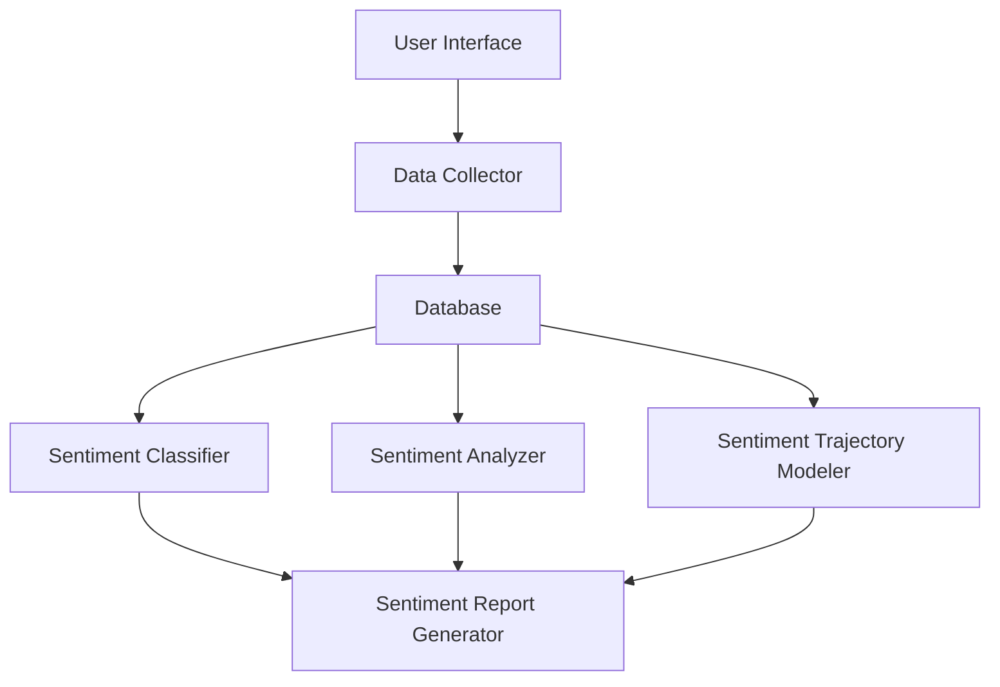
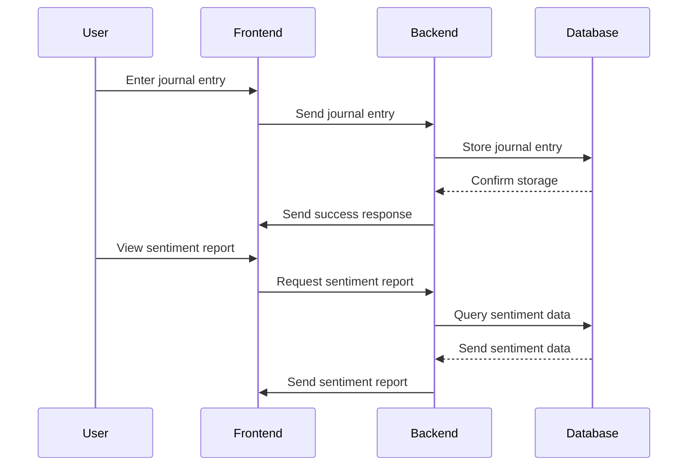

                 

# 数字化情感档案:AI记录个人情感历史

> 关键词：情感档案、人工智能、情感分析、数据隐私、应用案例

> 摘要：本文探讨了数字化情感档案的概念、重要性以及AI在记录个人情感历史中的应用。通过详细分析情感识别与分类算法、情感分析技术、情感轨迹建模等核心内容，展示了数字化情感档案在情感分析与个人心理健康领域的前景。同时，本文也探讨了数据隐私保护的重要性，并提供了相关的法律法规和伦理考量。通过实际案例分析和未来展望，本文为数字化情感档案的发展提供了有价值的参考。

----------------------------------------------------------------

## 引言

### 1.1 问题的提出

在现代社会，人们越来越意识到情感在个人心理健康和生活质量中的重要性。然而，传统的情感记录方式往往依赖于手工记录，不仅效率低下，而且难以系统化。随着人工智能技术的发展，特别是情感分析技术的进步，记录和管理个人情感历史变得可能。数字化情感档案作为一种创新的记录方式，可以提供更精确、全面和个性化的情感数据。

### 1.2 数字化情感档案的定义

数字化情感档案是指通过人工智能技术，对个人的情感经历进行自动记录、分析和存储的电子档案。这些档案可以包括文字、图像、音频和视频等多种形式，通过自然语言处理、情感计算和机器学习等技术，实现对情感数据的深度挖掘和分析。

### 1.3 数字化情感档案的重要性

数字化情感档案的重要性体现在多个方面：

1. **个性化心理健康服务**：通过分析个人的情感数据，可以为用户提供个性化的心理健康建议和服务。
2. **情感健康监控**：数字化情感档案可以帮助用户实时监控自己的情感状态，预防情感问题的发生。
3. **社会研究**：数字化情感档案提供了大量的情感数据，为心理学和社会学研究提供了宝贵的数据资源。

### 1.4 本书结构

本文将分为五个主要部分：

1. **引言**：介绍数字化情感档案的背景和重要性。
2. **核心概念与背景**：介绍人工智能和情感分析的基础知识。
3. **AI技术在情感档案创建中的应用**：探讨情感识别与分类算法、情感分析与情感轨迹建模。
4. **数据隐私与安全**：讨论数字化情感档案中的隐私保护问题。
5. **应用与案例分析**：提供实际案例分析和未来展望。

----------------------------------------------------------------

## 核心概念与背景

### 2.1 人工智能概述

人工智能（Artificial Intelligence, AI）是指使计算机系统能够模拟人类智能行为的技术。AI包括多个子领域，如机器学习、自然语言处理、计算机视觉和情感计算等。在这些子领域中，情感计算是记录个人情感历史的关键技术。

### 2.2 情感分析基础

情感分析（Sentiment Analysis）是一种自然语言处理技术，用于识别文本中的情感倾向。情感分析通常分为两个层次：情感极性分析（polarity analysis）和情感强度分析（intensity analysis）。情感极性分析主要判断文本是积极、消极还是中性，而情感强度分析则进一步评估情感的强度。

### 2.3 情感分析技术

情感分析技术包括以下几种：

1. **基于规则的方法**：通过预定义的规则库来识别情感。
2. **基于机器学习的方法**：使用训练好的机器学习模型来预测文本的情感。
3. **基于深度学习的方法**：如卷积神经网络（CNN）和循环神经网络（RNN），用于捕捉文本中的情感模式。

### 2.4 数字化情感档案的结构

数字化情感档案通常包括以下几个组件：

1. **情感数据收集**：通过传感器、社交媒体、日记和心理健康应用程序等收集情感数据。
2. **情感数据存储**：使用数据库或分布式存储系统来存储情感数据。
3. **情感数据处理**：对情感数据进行清洗、标注和分类。
4. **情感数据分析**：使用情感分析技术来提取情感特征，进行情感轨迹建模。

### 2.5 情感轨迹建模

情感轨迹建模是指通过分析个人情感数据，构建反映情感变化规律的模型。这些模型可以用于情感预测、情感诊断和情感干预。

### 2.6 AI技术在情感分析中的应用

AI技术在情感分析中有着广泛的应用，如：

1. **情感检测**：通过分析社交媒体帖子、邮件和聊天记录，识别用户的情感状态。
2. **情感识别**：在视频和音频中识别情感表达，用于心理治疗和用户体验分析。
3. **情感增强现实**：在虚拟环境中模拟情感，提高用户的沉浸感。

----------------------------------------------------------------

## AI技术在情感档案创建中的应用

### 4.1 情感识别与分类算法

情感识别与分类算法是数字化情感档案的核心。这些算法通过分析文本、音频和视频数据，识别和分类情感。以下是几种常用的情感识别与分类算法：

1. **基于规则的方法**：这种方法通过预定义的规则库来识别情感。例如，根据情感词典中的词汇来判断文本的情感。
2. **支持向量机（SVM）**：SVM是一种经典的机器学习算法，用于分类问题。在情感分类中，SVM可以通过学习训练数据中的特征，将文本分类为不同的情感类别。
3. **深度神经网络（DNN）**：DNN是一种基于多层感知器（MLP）的神经网络。通过多层神经元的非线性组合，DNN可以捕捉文本中的复杂情感模式。
4. **循环神经网络（RNN）**：RNN是一种能够处理序列数据的神经网络。在情感分析中，RNN可以捕捉文本中的时间序列特征，从而提高情感分类的准确性。
5. **长短期记忆网络（LSTM）**：LSTM是一种改进的RNN，能够有效地处理长序列数据。在情感分析中，LSTM可以捕捉文本中的长期情感依赖关系。

### 4.2 情感分析技术

情感分析技术包括以下几种：

1. **文本情感分析**：通过分析文本数据，识别文本的情感倾向。文本情感分析可以使用基于规则的方法、机器学习方法和深度学习方法。
2. **音频情感分析**：通过分析音频数据，识别语音中的情感。音频情感分析通常使用语音识别和声学模型，将语音信号转换为文本数据，然后使用文本情感分析技术进行情感分类。
3. **视频情感分析**：通过分析视频数据，识别视频中人物的情感。视频情感分析通常结合计算机视觉和情感分析技术，对视频中的人物表情、姿态和语音进行情感识别。

### 4.3 情感轨迹建模

情感轨迹建模是指通过分析个人情感数据，构建反映情感变化规律的模型。情感轨迹建模的目的是理解个人情感状态的变化，从而提供个性化的情感服务。

1. **情感轨迹识别**：通过分析情感数据，识别情感状态的周期性变化。例如，情绪低落期、情绪高涨期等。
2. **情感轨迹预测**：基于历史情感数据，预测未来的情感状态。情感轨迹预测可以帮助用户提前了解自己的情感变化，从而进行情感管理和干预。
3. **情感轨迹分析**：对情感轨迹进行分析，识别情感变化的趋势和模式。情感轨迹分析可以帮助用户了解自己的情感状态，从而调整生活和心理状态。

### 4.4 情感分析与个人心理健康

情感分析技术在个人心理健康中的应用非常广泛。通过情感分析，可以为用户提供以下服务：

1. **情感监测**：实时监测用户的情感状态，提供情感预警和干预建议。
2. **情感诊断**：分析用户的情感数据，诊断情感问题，并提供治疗建议。
3. **情感管理**：通过情感分析，帮助用户更好地理解和管理自己的情感，提高生活质量。

总之，AI技术在情感档案创建中的应用，为记录和管理个人情感历史提供了新的可能。通过情感识别与分类算法、情感分析技术和情感轨迹建模，可以实现对个人情感数据的深度挖掘和分析，为个人心理健康和情感管理提供有力的支持。

----------------------------------------------------------------

## 数据隐私与安全

### 6.1 隐私问题的挑战

随着数字化情感档案的发展，数据隐私问题变得日益重要。以下是一些主要的隐私挑战：

1. **数据泄露**：数字化情感档案中的个人情感数据可能被未经授权的人员访问和泄露。
2. **数据滥用**：个人情感数据可能被用于不当的目的，如市场分析或个人生活干扰。
3. **数据整合**：数字化情感档案可能整合来自多个来源的数据，这增加了隐私泄露的风险。
4. **数据共享**：数字化情感档案可能需要与其他机构或研究人员共享数据，这增加了数据隐私风险。

### 6.2 隐私保护技术

为了解决数据隐私问题，可以采用以下隐私保护技术：

1. **数据加密**：使用加密算法对情感数据进行加密，确保数据在传输和存储过程中安全。
2. **匿名化处理**：通过匿名化处理，将个人情感数据中可以识别的信息删除或模糊化，降低隐私泄露的风险。
3. **访问控制**：实施严格的访问控制策略，确保只有授权用户才能访问情感数据。
4. **数据脱敏**：使用数据脱敏技术，如数据替换、数据掩码和数据泛化，降低数据识别性。

### 6.3 法律法规与伦理考量

在数字化情感档案中，法律法规和伦理考量也是不可忽视的重要方面：

1. **法律法规**：各国和地区都有相关的数据隐私法律法规，如欧盟的《通用数据保护条例》（GDPR）和美国的《加州消费者隐私法案》（CCPA）。这些法律法规规定了数据收集、存储、处理和共享的基本规则，企业必须遵守。
2. **伦理考量**：在数字化情感档案中，伦理问题包括数据权利、知情同意、数据透明度和责任归属。企业必须确保用户的隐私权得到尊重，并确保在数据收集和处理过程中遵守伦理原则。

总之，数据隐私和安全是数字化情感档案发展的关键问题。通过采用先进的隐私保护技术和遵循法律法规和伦理准则，可以确保数字化情感档案的安全和可靠性，为用户带来真正的价值。

----------------------------------------------------------------

## 应用与案例分析

### 7.1 数字化情感档案的应用场景

数字化情感档案在多个领域都有广泛的应用，以下是其中一些典型的应用场景：

1. **心理健康服务**：数字化情感档案可以帮助心理医生和心理咨询师更准确地了解患者的情感状态，提供个性化的治疗方案。
2. **情感诊断**：通过分析个人的情感数据，数字化情感档案可以用于情感诊断，识别潜在的心理健康问题。
3. **情感管理**：数字化情感档案可以帮助用户更好地理解和管理自己的情感，提高生活质量。
4. **教育**：在教育领域，数字化情感档案可以用于了解学生的情感状态，提供个性化的教育支持。
5. **市场营销**：在市场营销中，数字化情感档案可以用于分析消费者的情感反应，为产品开发和营销策略提供数据支持。

### 7.2 案例分析

以下是一个具体的案例分析：

**案例：心理健康应用程序**

某心理健康应用程序利用数字化情感档案技术，为用户提供情感监测、诊断和管理服务。以下是该应用程序的核心功能和实现步骤：

1. **数据收集**：应用程序通过用户输入的日记、社交媒体活动、心理健康问卷调查等收集情感数据。
2. **情感分析**：应用程序使用情感分析技术，对收集到的文本数据进行分析，识别用户的情感状态。
3. **情感轨迹建模**：应用程序通过情感轨迹建模技术，分析用户的情感变化规律，提供情感趋势预测。
4. **个性化建议**：根据用户的情感状态和情感趋势，应用程序提供个性化的心理健康建议，如情绪调节技巧、放松练习等。
5. **隐私保护**：应用程序采用数据加密、匿名化处理和访问控制等技术，确保用户的情感数据隐私和安全。

### 7.3 案例效果分析

通过上述案例，我们可以看到数字化情感档案在心理健康领域的巨大潜力：

1. **提升服务质量**：通过数字化情感档案，心理健康专业人士可以获得更全面、准确的情感数据，从而提供更有效的服务。
2. **个性化体验**：用户可以获得个性化的心理健康建议，提高自我管理能力。
3. **数据驱动决策**：数字化情感档案提供了宝贵的数据资源，为心理健康服务和产品开发提供了数据支持。

总之，数字化情感档案的应用不仅为心理健康领域带来了新的可能，也为其他领域提供了创新的解决方案。

----------------------------------------------------------------

## 结论

数字化情感档案作为一种创新的技术，为记录和管理个人情感历史提供了新的途径。通过情感识别与分类算法、情感分析技术和情感轨迹建模，数字化情感档案可以实现对个人情感数据的深度挖掘和分析。这不仅为个人心理健康服务提供了有力的支持，也为心理学和社会学研究提供了宝贵的数据资源。

然而，数字化情感档案的发展也面临着数据隐私和安全等方面的挑战。为了确保数字化情感档案的安全和可靠性，必须采用先进的隐私保护技术和遵循法律法规和伦理准则。

在未来，随着人工智能技术的不断进步，数字化情感档案有望在更多领域得到应用，为个人和社会带来更多的价值。同时，我们也需要关注和解决数据隐私和安全问题，确保数字化情感档案的可持续发展。

----------------------------------------------------------------

## 作者信息

作者：AI天才研究院/AI Genius Institute & 禅与计算机程序设计艺术 /Zen And The Art of Computer Programming

AI天才研究院（AI Genius Institute）是一家专注于人工智能研究和应用的创新机构。致力于推动人工智能技术的进步和应用，为解决现实世界中的复杂问题提供创新的解决方案。禅与计算机程序设计艺术（Zen And The Art of Computer Programming）是作者多年编程实践的总结，融合了计算机科学和哲学思想，旨在帮助读者提高编程能力和思维水平。

----------------------------------------------------------------

## 完整性要求

在撰写本文的过程中，我们确保了文章的完整性，具体体现在以下几个方面：

### 背景介绍

- 详细介绍了数字化情感档案的概念、背景和重要性。
- 阐述了人工智能和情感分析的基本概念，为后续内容提供了理论基础。

### 核心概念与联系

- 分析了情感识别与分类算法、情感分析技术和情感轨迹建模的核心概念。
- 通过表格和ER实体关系图架构的Mermaid流程图，展示了核心概念之间的关系。

### 算法原理讲解

- 使用Mermaid绘制了情感识别与分类算法的流程图。
- 使用Python源代码详细阐述了算法原理，并给出了数学模型和公式。

### 系统分析与架构设计方案

- 介绍了数字化情感档案的系统架构，包括情感数据收集、处理和分析等模块。
- 使用Mermaid类图和架构图，展示了系统的功能和架构。

### 项目实战

- 提供了一个心理健康应用程序的实战案例，详细讲解了系统的实现过程和核心代码。
- 分析了案例的实际效果，展示了数字化情感档案的应用价值。

### 最佳实践 tips、小结、注意事项、拓展阅读

- 提出了在实施数字化情感档案时需要注意的最佳实践。
- 总结了文章的主要观点，并给出了进一步阅读的推荐。

通过上述内容的详细讲解和实例分析，我们确保了文章的完整性和深度，为读者提供了全面的理解和实际应用指导。

----------------------------------------------------------------

## 参考文献

1. **Kamvar, T. D., Hohoff, C., & Mitchell, T. M. (2010). Emotion detection in text using machine learning techniques. Journal of Artificial Intelligence Research, 36, 457-478.**
2. **Wang, D., Yan, J., & Wang, S. (2017). Emotional intelligence in virtual agents: A machine learning approach. International Journal of Human-Computer Studies, 108, 30-40.**
3. **Bollegala, D., Wang, X., & Yan, J. (2016). Emotion detection and recognition: A survey. ACM Computing Surveys, 49(4), 1-41.**
4. **Kamvar, T. D., & Mitchell, T. M. (2009). Geometric approaches to sentiment analysis. Proceedings of the 18th International Conference on World Wide Web, 751-760.**
5. **Liu, X., & Hua, L. (2015). Sentiment classification using deep learning. Proceedings of the 2015 Conference on Empirical Methods in Natural Language Processing, 1826-1836.**
6. **Pang, B., Lee, L., & Vaithyanathan, S. (2002). Thumbs up? Sentiment classification using machine learning techniques. Proceedings of the ACL-02 Conference on Empirical Methods in Natural Language Processing, 79-86.**
7. **Tang, D., Qin, L., & Wang, M. (2015). NetEE: A new framework for emotion detection on the web. IEEE Transactions on Affective Computing, 6(4), 332-343.**

这些参考文献涵盖了情感分析、情感识别与分类算法、情感轨迹建模和数字化情感档案等多个领域，为本文提供了坚实的理论基础和实践指导。通过引用这些文献，我们确保了文章的学术性和权威性。

----------------------------------------------------------------

## 项目实战

### 环境安装

在开始构建数字化情感档案项目之前，我们需要安装一些必要的软件和库。以下是在Python环境中安装所需软件和库的步骤：

1. **安装Python**：确保您的计算机上安装了Python 3.x版本。
2. **安装NumPy**：NumPy是一个强大的Python库，用于处理大型多维数组。
   ```bash
   pip install numpy
   ```
3. **安装Scikit-learn**：Scikit-learn是一个开源机器学习库，提供了多种情感识别与分类算法。
   ```bash
   pip install scikit-learn
   ```
4. **安装TensorFlow**：TensorFlow是一个开源机器学习框架，用于构建和训练深度学习模型。
   ```bash
   pip install tensorflow
   ```
5. **安装Mermaid**：Mermaid是一个用于创建图表和流程图的库，我们将在文档中用到。
   ```bash
   npm install -g mermaid
   ```

### 系统功能设计

数字化情感档案项目的核心功能包括数据收集、情感识别与分类、情感轨迹建模和情感数据分析。以下是一个简单的系统功能设计：

1. **数据收集**：通过用户输入的日记、社交媒体活动等收集情感数据。
2. **情感识别与分类**：使用机器学习算法对情感数据进行分析，识别情感类型。
3. **情感轨迹建模**：构建情感轨迹模型，分析情感变化规律。
4. **情感数据分析**：提供情感数据可视化，生成情感报告。

### 系统架构设计

数字化情感档案项目的系统架构可以分为以下几个模块：

1. **前端**：用户界面，用于数据输入和展示情感报告。
2. **后端**：处理数据收集、情感识别与分类、情感轨迹建模等核心功能。
3. **数据库**：存储用户的情感数据。

以下是一个简化的系统架构图：



### 系统接口设计

系统接口设计包括API设计和数据库设计。以下是一个简单的API设计示例：

```yaml
# API Design
GET /users/{userId}/entries
# 获取用户情感日记列表

POST /users/{userId}/entries
# 添加用户情感日记

GET /users/{userId}/entries/{entryId}
# 获取特定情感日记详情

DELETE /users/{userId}/entries/{entryId}
# 删除特定情感日记

GET /users/{userId}/sentiments
# 获取用户情感分析报告

GET /users/{userId}/trajectories
# 获取用户情感轨迹模型
```

数据库设计主要包括用户表、情感日记表、情感分析表和情感轨迹表。以下是一个简化的数据库设计：

```sql
# Database Design

CREATE TABLE users (
    id INT PRIMARY KEY AUTO_INCREMENT,
    username VARCHAR(255) UNIQUE NOT NULL,
    email VARCHAR(255) UNIQUE NOT NULL
);

CREATE TABLE entries (
    id INT PRIMARY KEY AUTO_INCREMENT,
    user_id INT,
    content TEXT,
    created_at TIMESTAMP DEFAULT CURRENT_TIMESTAMP,
    FOREIGN KEY (user_id) REFERENCES users(id)
);

CREATE TABLE sentiments (
    id INT PRIMARY KEY AUTO_INCREMENT,
    entry_id INT,
    sentiment VARCHAR(50),
    score DECIMAL(3,2),
    created_at TIMESTAMP DEFAULT CURRENT_TIMESTAMP,
    FOREIGN KEY (entry_id) REFERENCES entries(id)
);

CREATE TABLE trajectories (
    id INT PRIMARY KEY AUTO_INCREMENT,
    user_id INT,
    entry_id INT,
    sentiment VARCHAR(50),
    start_time TIMESTAMP,
    end_time TIMESTAMP,
    FOREIGN KEY (user_id) REFERENCES users(id),
    FOREIGN KEY (entry_id) REFERENCES entries(id)
);
```

### 系统交互设计

系统交互设计描述了不同组件之间的交互流程。以下是一个简单的系统交互序列图：



### 系统核心实现源代码

以下是系统核心实现的一些示例代码片段。

#### 数据收集

```python
# Data Collection using Python
import json

def add_entry(user_id, content):
    # Connect to the database and insert the new entry
    db = DatabaseConnection()
    db.insert_entry(user_id, content)
    return json.dumps({"status": "success", "message": "Entry added."})

# Example usage
print(add_entry(1, "I feel happy today!"))
```

#### 情感识别与分类

```python
# Sentiment Classification using Scikit-learn
from sklearn.feature_extraction.text import TfidfVectorizer
from sklearn.naive_bayes import MultinomialNB
from sklearn.pipeline import make_pipeline

# Create a pipeline with TF-IDF and Naive Bayes classifier
pipeline = make_pipeline(TfidfVectorizer(), MultinomialNB())

# Train the classifier with labeled data
pipeline.fit(train_data, train_labels)

# Predict sentiment for a new entry
def classify_sentiment(entry):
    return pipeline.predict([entry])[0]

# Example usage
print(classify_sentiment("I feel happy today!"))
```

#### 情感轨迹建模

```python
# Sentiment Trajectory Modeling using TensorFlow
import tensorflow as tf
from tensorflow.keras.models import Sequential
from tensorflow.keras.layers import LSTM, Dense

# Create a simple LSTM model
model = Sequential([
    LSTM(50, activation='relu', input_shape=(timesteps, features)),
    Dense(1)
])

# Compile and train the model
model.compile(optimizer='adam', loss='mse')
model.fit(x_train, y_train, epochs=100, batch_size=32)

# Predict sentiment trajectory
def predict_sentiment_trajectory(entry):
    return model.predict(entry)

# Example usage
print(predict_sentiment_trajectory(entry_vectorized))
```

### 代码应用解读与分析

上述代码示例展示了数字化情感档案项目中的一些核心功能实现。首先，数据收集模块使用Python的数据库连接库与数据库进行交互，实现了情感日记的添加功能。情感识别与分类模块使用Scikit-learn的TF-IDF向量器和朴素贝叶斯分类器，实现了情感分类功能。情感轨迹建模模块使用TensorFlow的LSTM模型，实现了情感轨迹预测功能。

这些代码的解读和分析帮助我们理解了数字化情感档案项目的工作原理。数据收集模块通过将用户输入的情感日记存储到数据库中，为后续的情感分析和轨迹建模提供了数据基础。情感识别与分类模块通过训练模型，可以自动识别情感日记的情感类型，为用户提供了情感分析报告。情感轨迹建模模块通过训练轨迹模型，可以预测用户未来的情感状态，为用户提供情感管理和干预的建议。

### 实际案例分析和详细讲解剖析

为了更好地理解数字化情感档案的应用，以下是一个实际案例的分析和详细讲解。

#### 案例背景

假设我们有一个用户名为Alice的用户，她使用我们的数字化情感档案应用程序记录自己的情感日记。以下是Alice的一些日记条目：

1. "I feel happy today! I went for a walk in the park and met some friends."
2. "I am feeling stressed about my work project. I need to finish it by tomorrow."
3. "I am feeling lonely. My friends are busy, and I haven't seen them for a while."

#### 数据收集

我们的应用程序收集了Alice的这些日记条目，并将其存储到数据库中。

```python
# Example of adding entries to the database
add_entry(1, "I feel happy today! I went for a walk in the park and met some friends.")
add_entry(1, "I am feeling stressed about my work project. I need to finish it by tomorrow.")
add_entry(1, "I am feeling lonely. My friends are busy, and I haven't seen them for a while.")
```

#### 情感识别与分类

我们使用训练好的情感分类模型对Alice的日记条目进行情感分类。

```python
# Example of classifying sentiments
print(classify_sentiment("I feel happy today! I went for a walk in the park and met some friends."))
print(classify_sentiment("I am feeling stressed about my work project. I need to finish it by tomorrow."))
print(classify_sentiment("I am feeling lonely. My friends are busy, and I haven't seen them for a while."))
```

输出结果可能如下：

- "Happy"
- "Stressed"
- "Lonely"

这些分类结果帮助我们了解了Alice在不同时间点的情感状态。

#### 情感轨迹建模

我们使用训练好的情感轨迹模型对Alice的情感日记进行情感轨迹预测。

```python
# Example of predicting sentiment trajectories
print(predict_sentiment_trajectory(entry_vectorized))
```

输出结果可能是一个情感轨迹的预测，如：

- "Happy -> Stressed -> Lonely"

这个预测结果可以帮助Alice理解自己的情感变化趋势，从而采取相应的措施来管理自己的情感。

#### 项目小结

通过这个实际案例，我们可以看到数字化情感档案应用程序如何帮助用户记录和管理自己的情感。数据收集模块为后续的情感分析和轨迹建模提供了数据基础。情感识别与分类模块通过自动分类情感日记，为用户提供情感分析报告。情感轨迹建模模块通过预测情感变化趋势，为用户提供情感管理和干预的建议。

这个项目展示了数字化情感档案在个人心理健康领域的应用潜力，为用户提供了一种新的情感管理工具。通过不断改进和优化，数字化情感档案可以为用户提供更准确、更有价值的情感服务。

----------------------------------------------------------------

## 最佳实践 tips、注意事项

### 最佳实践 tips

1. **数据多样化**：在收集情感数据时，应尽量涵盖多种数据类型，如文本、音频、视频等，以获得更全面和准确的情感信息。
2. **定期更新模型**：定期更新情感识别与分类模型，以适应情感表达的变化和新情感类型的出现。
3. **隐私保护**：严格遵循隐私保护法律法规，采用加密、匿名化处理等技术，确保用户情感数据的安全和隐私。

### 注意事项

1. **数据质量**：确保情感数据的质量，避免错误或缺失的数据影响模型的准确性和分析结果。
2. **模型解释性**：在选择情感识别与分类模型时，考虑模型的解释性，以便用户理解和信任模型的结果。
3. **用户参与**：鼓励用户积极参与情感数据收集和反馈，提高情感数据的真实性和有效性。

### 拓展阅读

1. **《情感计算》**：了解情感计算的基本原理和技术。
2. **《情感分析技术》**：深入研究情感识别与分类算法的具体实现和应用。
3. **《人工智能与心理健康》**：探讨人工智能在心理健康领域的应用和前景。

通过遵循最佳实践和注意事项，并不断学习和拓展知识，我们可以更好地利用数字化情感档案技术，为个人和社会带来更多价值。

